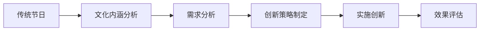
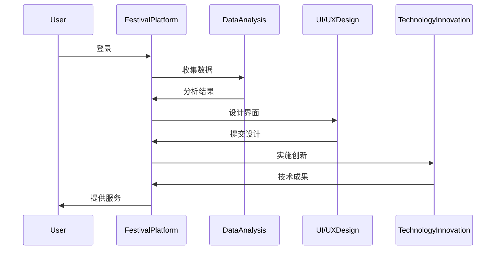

                 

### 文章标题

《传统节日的现代意义：文化传承与创新》

> 关键词：传统节日、文化传承、现代化转型、创新思维、国际化传播

> 摘要：本文旨在探讨传统节日在现代社会中的重要性和现代意义，分析传统节日的文化内涵和现代社会对其的需求，探讨传统节日的现代化转型策略，以及文化传承与创新能力的培养。通过研究传统节日的未来展望和国际化传播，本文旨在为传统节日的发展提供有益的思路和启示。

----------------------------------------------------------------

## 第一部分：背景与概述

### 第1章：传统节日的文化内涵

#### 1.1 传统节日的历史背景

传统节日是中华民族悠久历史文化的重要组成部分，其起源可以追溯到古代的农耕文明。许多传统节日如春节、清明节、端午节和中秋节等，都与农业生产和季节变化密切相关。例如，春节源于古代的“岁首祭”，清明节源于“寒食节”，端午节源于纪念屈原，中秋节源于月神崇拜。

#### 1.1.1 节日起源与发展

随着时间的推移，这些节日逐渐演变成为具有丰富文化内涵的传统节日。每个节日都有其独特的庆祝方式和习俗，如春节的拜年、放鞭炮、吃团圆饭，清明节的扫墓、踏青，端午节的赛龙舟、吃粽子，中秋节的赏月、吃月饼等。

#### 1.1.2 传统文化的影响

传统节日不仅反映了古代人们对自然的敬畏和对祖先的纪念，也蕴含了丰富的道德伦理观念和人际关系的处理原则。例如，春节的拜年习俗体现了尊老爱幼、家庭和睦的价值观念，清明节和端午节的祭祀活动则体现了对祖先的尊重和怀念。

#### 1.2 传统节日的核心意义

传统节日是中华民族文化的重要组成部分，其核心意义在于文化传承和社会团结。

#### 1.2.1 社会团结与文化认同

传统节日作为一种文化符号，有助于增强民族凝聚力，促进社会团结。在节日里，人们通过共同的庆祝活动，加强了彼此之间的联系和认同。

#### 1.2.2 传统价值观的传承

传统节日还承载了丰富的道德伦理观念和传统文化，如孝道、忠诚、友爱、团结等，通过节日的庆祝和传承，这些价值观得以代代相传。

#### 1.3 现代社会对传统节日的需求

在现代社会，随着全球化、工业化和现代化进程的加快，人们的生活节奏加快，文化认同感逐渐减弱。传统节日以其独特的文化内涵和深厚的文化底蕴，成为人们寻求精神寄托和心灵慰藉的重要途径。

#### 1.3.1 文化认同感的缺失

在现代化进程中，传统节日逐渐失去了其原有的地位和影响力，一些人甚至对传统节日感到陌生和疏离。这主要是因为现代社会多元文化的冲击，使得人们对传统文化的认同感逐渐减弱。

#### 1.3.2 传统节日的商业价值

与此同时，传统节日也逐渐被商业化和市场化。节日经济成为新的经济增长点，传统节日的商业价值得到了充分的挖掘和利用。

### 小结

通过上述分析，我们可以看到，传统节日不仅是中华民族文化的重要组成部分，也是现代社会中不可或缺的文化现象。如何在现代社会中传承和弘扬传统节日文化，是一个值得深入探讨的问题。

----------------------------------------------------------------

## 第二部分：传统节日的现代化转型

### 第2章：传统节日的现代化转型

#### 2.1 现代社会的挑战

随着全球化和信息技术的快速发展，现代社会面临着许多新的挑战，这些挑战对传统节日产生了深远的影响。

#### 2.1.1 全球化与文化的交融

全球化使得不同文化之间的交流和融合日益频繁，这也影响了传统节日的庆祝方式。传统节日不仅受到本土文化的影响，还受到外来文化的影响，这为传统节日的现代化转型提供了新的契机。

#### 2.1.2 快节奏生活的影响

现代社会生活节奏加快，人们的时间观念和生活方式发生了很大变化。这使得传统节日的庆祝方式需要适应现代生活的需求，实现现代化转型。

#### 2.2 现代化转型的策略

为了应对现代社会的挑战，传统节日需要采取一系列现代化转型的策略。

#### 2.2.1 节日的创新形式

传统节日的庆祝方式可以借助现代科技，如互联网、社交媒体、虚拟现实等，创新节日形式，提升节日体验。例如，利用社交媒体进行线上拜年、虚拟祭祖等，使传统节日更具现代感和参与性。

#### 2.2.2 节日营销的策略

节日营销是传统节日现代化转型的重要手段。通过精心的市场调研和品牌定位，传统节日可以吸引更多人的关注和参与。例如，通过举办大型文化活动、设计独特的节日产品等方式，提升节日的商业价值和社会影响力。

#### 2.3 现代化转型的成功案例

传统节日的现代化转型已经取得了一些成功的案例。

#### 2.3.1 传统节日与现代科技的结合

例如，春节通过手机支付、智能家居等现代科技手段，实现了线上拜年、红包发放等创新形式的庆祝方式，深受年轻人的喜爱。

#### 2.3.2 现代节日文化的创新

例如，一些传统节日如端午节、中秋节等，通过引入现代元素，如时尚服饰、音乐表演等，使节日更具现代感和吸引力。

### 小结

通过现代化转型，传统节日不仅能够适应现代社会的需求，还能焕发出新的活力。现代化转型不仅是传统节日的必然选择，也是传承和弘扬传统文化的重要途径。

----------------------------------------------------------------

## 第二部分：文化传承与创新能力

### 第3章：文化传承的重要性

#### 3.1 文化传承的核心要素

文化传承是维护文化多样性和促进文化发展的重要途径，其核心要素包括传统节日的礼仪与习俗、传统节日的饮食与服饰等。

#### 3.1.1 传统节日的礼仪与习俗

传统节日的礼仪与习俗是传统文化的重要组成部分，它们体现了人们对自然、祖先和神灵的敬畏，以及人际关系的处理原则。例如，春节的拜年、清明节的扫墓、端午节的赛龙舟等，都是传统节日中重要的礼仪与习俗。

#### 3.1.2 传统节日的饮食与服饰

传统节日的饮食与服饰也是文化传承的重要方面。节日的饮食习俗如春节的团圆饭、端午节的粽子、中秋节的月饼等，不仅反映了人们对食物的喜爱，也蕴含了丰富的文化内涵。传统节日的服饰如汉服、旗袍等，则体现了传统文化中的审美观念和价值观。

#### 3.2 文化传承的方式

文化传承不仅需要传承核心要素，还需要采取有效的传承方式。以下是一些常见的文化传承方式：

#### 3.2.1 教育与传播

教育与传播是文化传承的重要手段。通过学校教育、媒体传播等途径，可以将传统节日的文化内涵传递给更多的人。例如，学校可以设置传统文化课程，媒体可以通过新闻报道、纪录片等形式，宣传传统节日的文化价值。

#### 3.2.2 社区参与

社区参与是文化传承的重要方式。通过社区活动、节庆庆典等形式，可以增强社区居民对传统文化的认同感和参与感。例如，社区可以举办传统节日庆典活动，邀请居民共同参与，从而促进传统文化的传承。

### 3.3 创新能力的培养

创新是文化传承的重要动力。为了适应现代社会的需求，传统文化需要在传承的基础上进行创新。

#### 3.3.1 创新思维的重要性

创新思维是创新能力培养的核心。它要求人们能够打破传统思维模式，勇于尝试新方法和新思路。创新思维不仅能够推动文化传承，还能为传统文化注入新的活力。

#### 3.3.2 创新能力的培养策略

以下是一些培养创新能力的策略：

- **教育体系的改革**：教育体系应注重培养学生的创新思维和创新能力，提供多元化的教育资源和实践机会。
- **创新环境的营造**：社会应营造有利于创新的环境，鼓励人们勇于尝试、敢于失败。例如，政府可以出台相关政策，支持文化创意产业的发展。

#### 3.3.3 创新能力的实践案例

创新能力的实践案例有很多，例如：

- **文化产业的发展**：通过将传统文化与现代科技、艺术等相结合，开发出新的文化产品和服务，如虚拟现实体验、文化创意产品等。
- **传统节日的数字化传播**：利用互联网和社交媒体等数字化手段，推广传统节日，提高其知名度和影响力。

### 小结

文化传承是传统文化得以延续和发展的重要途径，而创新能力则是传统文化焕发新的生机和活力的重要动力。通过文化传承与创新能力相结合，我们可以更好地弘扬传统文化，为现代社会提供丰富的文化资源和精神滋养。

----------------------------------------------------------------

## 第三部分：现代意义与未来展望

### 第5章：传统节日的现代意义

#### 5.1 现代社会的多元文化

现代社会是一个多元文化交织的时代，不同文化之间的交流和融合日益频繁。在这个背景下，传统节日不仅具有文化传承的意义，还具有现代社会的多元文化意义。

#### 5.1.1 多元文化的融合

传统节日作为不同文化之间的桥梁，有助于促进多元文化的融合。例如，春节在全球范围内的庆祝活动，不仅吸引了华人，也吸引了越来越多的外国人对中国传统文化的关注和热爱。

#### 5.1.2 多元文化的挑战

然而，多元文化也带来了一定的挑战。不同文化之间的差异可能导致误解和冲突。在这种情况下，传统节日作为一种文化符号，可以帮助人们更好地理解和尊重其他文化，促进文化和谐。

#### 5.2 传统节日的现代意义

在现代社会，传统节日的现代意义主要体现在以下几个方面：

#### 5.2.1 文化认同

传统节日是民族认同和文化认同的重要载体。通过共同庆祝传统节日，人们可以加深对自身文化的认同感，增强民族凝聚力。

#### 5.2.2 社会和谐

传统节日有助于增强社会和谐。在节日里，人们通过共同的庆祝活动，加强了彼此之间的联系和沟通，有助于缓解社会矛盾，促进社会和谐。

#### 5.3 传统节日的未来展望

随着社会的发展和科技的进步，传统节日的未来展望也变得更加光明。

#### 5.3.1 传统节日的传承与保护

在未来的发展中，我们应该更加注重传统节日的传承与保护。通过教育、宣传等手段，让更多的人了解和热爱传统节日，确保其得以传承。

#### 5.3.2 创新与传统节日的结合

创新是传统节日发展的动力。我们应该积极探索创新与传统节日的结合方式，如利用现代科技手段，开发新的庆祝形式和活动内容，使传统节日焕发新的活力。

#### 5.3.3 传统节日的国际化传播

传统节日的国际化传播也是未来发展的重要方向。通过国际文化交流活动，我们可以让更多的人了解和喜爱中国传统节日，提升中华文化的国际影响力。

### 小结

传统节日作为中华民族文化的重要组成部分，具有深远的历史和文化内涵。在现代社会，传统节日的现代意义更加凸显，其有助于文化认同、社会和谐，并具有广阔的发展前景。我们应该积极传承和保护传统节日，推动其创新发展，为现代社会提供丰富的文化资源和精神滋养。

----------------------------------------------------------------

## 第6章：传统节日的未来展望

### 6.1 传统节日的传承与保护

随着社会的快速发展，传统节日的传承与保护面临诸多挑战。首先，传统节日的庆祝方式和习俗正在逐渐消失。例如，一些传统的手工艺、音乐和舞蹈等文化表现形式，因年轻人对传统节日的冷漠而逐渐失传。因此，保护传统节日不仅是文化传承的重要任务，也是维护文化多样性和历史记忆的关键。

#### 6.1.1 传统节日的保护措施

为了保护传统节日，我们可以采取以下措施：

1. **立法保护**：政府应出台相关法律法规，明确传统节日的地位和保护措施，禁止对传统节日文化资源的破坏和滥用。
2. **宣传教育**：通过媒体、学校等渠道，加强对传统节日文化内涵的宣传和教育，提高公众对传统节日的认识和重视。
3. **文化遗产保护**：对具有历史文化价值的传统节日庆典、手工艺等进行登记和保护，确保其得到传承和发扬。

#### 6.1.2 传统节日的可持续发展

传统节日的可持续发展是保护传统节日的重要途径。可持续发展不仅要考虑节日的文化内涵和传统习俗，还要考虑其经济效益和社会效益。

1. **文化产业发展**：通过开发传统节日的文化旅游产品、文化创意产品等，促进传统节日与文化产业相结合，实现传统节日的可持续发展。
2. **社区参与**：鼓励社区居民参与传统节日的庆祝活动，增强社区凝聚力和文化认同感。

### 6.2 创新与传统节日的结合

创新与传统节日的结合是传统节日未来发展的重要方向。创新不仅有助于保持传统节日的活力，还能提升其社会影响力。

#### 6.2.1 数字化技术在节日中的应用

数字化技术的广泛应用为传统节日提供了新的发展机遇。例如，利用互联网和社交媒体进行线上庆祝活动，通过虚拟现实技术提供沉浸式的节日体验等。

#### 6.2.2 创意产业的发展

创意产业的发展为传统节日注入了新的活力。通过将传统节日与现代艺术、设计等创意产业相结合，可以创造出新的文化产品和服务，吸引更多人参与和关注。

### 6.3 传统节日的国际传播

传统节日的国际传播是提升中华文化国际影响力的重要途径。通过国际文化交流活动，我们可以让世界了解和喜爱中国传统节日。

#### 6.3.1 跨文化交流

跨文化交流有助于传统节日的国际传播。通过举办国际文化节、传统节日庆祝活动等，可以吸引外国人对中国传统文化的关注和参与。

#### 6.3.2 国际节庆活动

国际节庆活动是传统节日国际传播的有效途径。例如，春节在全球范围内的庆祝活动，不仅促进了中外文化交流，也提升了中华文化的国际影响力。

### 小结

传统节日的传承与保护、创新与可持续发展、国际传播是未来发展的关键。通过采取有效措施，我们可以确保传统节日的传承和发扬，同时提升其社会价值和国际影响力。

----------------------------------------------------------------

### 第7章：传统节日的国际传播

#### 7.1 国际传播的意义

传统节日的国际传播对于提升中华文化的国际影响力具有重要意义。首先，它有助于增强中华文化的软实力，让世界更好地了解和认识中国。其次，国际传播有助于促进不同文化之间的交流与融合，推动世界文化的多元发展。此外，传统节日的国际传播还可以带动旅游业、文化产业等的发展，促进经济繁荣。

#### 7.2 国际传播的策略

为了实现传统节日的国际传播，我们可以采取以下策略：

1. **跨文化交流**：通过举办国际文化节、传统节日庆典等活动，吸引外国人对中国传统文化的关注。例如，许多国家和地区都举办了春节庆祝活动，吸引了大量外国游客和居民参与。

2. **媒体宣传**：利用国内外媒体平台，宣传传统节日的文化内涵和历史背景，提升其知名度和影响力。例如，通过新闻、纪录片、社交媒体等渠道，向全球传播传统节日的文化魅力。

3. **节庆品牌化**：将传统节日品牌化，打造具有国际影响力的节庆品牌。例如，将春节打造成“中国新年”，将端午节打造成“龙舟节”，通过精心策划和推广，提升其国际影响力。

#### 7.3 国际节庆活动

国际节庆活动是传统节日国际传播的重要途径。以下是一些成功的国际节庆活动案例：

1. **春节庆祝活动**：许多国家和地区都举办春节庆祝活动，如中国香港的“新春花市”、美国的“春节大游行”等。这些活动不仅展示了中华文化的魅力，也吸引了大量外国游客。

2. **龙舟节**：龙舟节是端午节的重要庆祝活动，许多国家和地区都有举办。例如，中国澳门的“龙舟竞渡”、新加坡的“国际龙舟赛”等，这些活动不仅展示了龙舟文化的魅力，也促进了国际文化交流。

3. **中秋节**：中秋节是传统的团圆节，许多国家和地区都有庆祝活动。例如，中国台湾的“中秋晚会”、美国的“中秋文化节”等，这些活动通过丰富多彩的文化活动，向世界展示了中秋节的独特魅力。

### 7.4 国际传播的挑战与机遇

在传统节日的国际传播过程中，我们面临许多挑战和机遇：

1. **挑战**：语言障碍、文化差异、国际形象塑造等都是传统节日国际传播的挑战。例如，外国人对中国传统文化的理解可能存在偏差，需要通过有效的传播策略来纠正。

2. **机遇**：随着全球化进程的加快，越来越多的人开始关注和了解中国文化。这为传统节日的国际传播提供了机遇。我们可以充分利用这些机遇，推动传统节日的全球化传播。

### 小结

传统节日的国际传播是提升中华文化国际影响力的重要途径。通过跨文化交流、媒体宣传和国际节庆活动等策略，我们可以让世界更好地了解和认识中国传统节日。在面临挑战的同时，我们也应抓住机遇，推动传统节日的全球化传播，为中华文化的发展做出贡献。

----------------------------------------------------------------

### 第8章：传统节日与全球化

#### 8.1 全球化的影响

全球化是一个不可逆转的趋势，它对传统节日产生了深远的影响。首先，全球化加剧了文化的同质化，使得许多传统节日面临着被边缘化的风险。在全球化的浪潮中，西方文化的影响力逐渐增强，这可能导致一些传统节日的庆祝方式和文化内涵被削弱或遗忘。其次，全球化促进了文化的交流与融合，传统节日也因此有机会与其他文化进行对话和互动，这既带来了新的机遇，也带来了新的挑战。

#### 8.1.1 全球化与文化多样性

全球化不仅推动了文化的同质化，也促进了文化多样性的发展。在这个背景下，传统节日如何保持其独特性，同时又能够适应全球化的需求，是一个需要深入思考的问题。一方面，传统节日可以通过创新和改编，使其更符合现代社会的需求，从而吸引更多的参与者和关注。另一方面，传统节日需要坚守其文化内涵，确保在全球化过程中不被同化和遗忘。

#### 8.1.2 全球化与传统节日的冲突

全球化也带来了一些与传统节日相关的冲突。例如，在一些国家和地区，传统节日的庆祝活动可能受到商业化和消费主义的冲击，导致节日失去了原有的文化内涵和意义。此外，全球化可能使得一些传统节日的庆祝方式变得单一和机械化，缺乏个性和多样性。这些冲突对传统节日的传承和发展提出了挑战。

#### 8.2 传统节日的全球化策略

为了应对全球化的挑战，传统节日需要采取一系列的全球化策略。

#### 8.2.1 节日国际化

节日国际化是传统节日全球化的重要途径。通过举办国际性的节日庆典活动，如春节全球巡游、龙舟赛等，可以让更多人了解和参与传统节日的庆祝活动，提升其国际影响力。此外，通过与国际组织和文化机构的合作，可以促进传统节日的国际化传播。

#### 8.2.2 跨文化节日的创新

跨文化节日的创新是传统节日全球化的重要策略。通过将传统节日与其他文化元素相结合，可以创造出新的节日形式和庆祝方式，吸引更多人的参与。例如，将春节与西方的圣诞节相结合，创造出“春节嘉年华”，既保留了传统节日的文化内涵，又符合现代社会的需求。

#### 8.2.3 文化交流与合作

文化交流与合作是传统节日全球化的重要手段。通过国际文化交流活动，如文化节、艺术展览等，可以让不同文化之间的对话更加深入和频繁，促进文化多样性的发展。此外，通过与国际组织和文化机构的合作，可以共同推动传统节日的全球化传播。

### 小结

全球化对传统节日产生了深远的影响，既带来了新的机遇，也带来了新的挑战。传统节日需要在全球化的大背景下，保持其文化内涵和独特性，同时适应现代社会的需求。通过节日国际化、跨文化节日的创新和文化交流与合作等策略，传统节日可以更好地应对全球化的挑战，焕发出新的生机和活力。

----------------------------------------------------------------

## 第9章：总结与展望

### 9.1 传统节日的重要性

传统节日是中华民族文化的重要组成部分，具有深远的历史和文化内涵。通过庆祝传统节日，人们可以加深对传统文化的认同感，增强民族凝聚力，促进社会和谐。同时，传统节日也是传承和弘扬传统文化的重要载体，有助于保持文化多样性和历史记忆。

### 9.2 创新与传统节日的结合

创新是传统节日发展的重要动力。通过将传统节日与现代科技、艺术、创意产业等相结合，可以创造出新的节日形式和庆祝方式，提升传统节日的吸引力和影响力。例如，利用互联网和社交媒体进行线上庆祝活动，通过虚拟现实技术提供沉浸式的节日体验，都是传统节日创新的成功案例。

### 9.3 传统节日的未来展望

传统节日的未来展望充满了机遇和挑战。随着全球化的加速，传统节日面临着被边缘化和同质化的风险，但同时也拥有了更广阔的发展空间。未来，传统节日可以通过国际化传播，提升中华文化的国际影响力；通过创新发展，保持其独特性和吸引力。同时，我们也需要关注传统节日的传承与保护，确保其得以传承和发扬。

### 9.4 结论

总之，传统节日是中华民族文化的瑰宝，具有不可替代的重要性和价值。通过创新与传统节日的结合，我们可以让传统节日焕发出新的活力，为现代社会提供丰富的文化资源和精神滋养。未来，让我们共同努力，传承和保护传统节日，推动其创新发展，为中华民族文化的繁荣做出贡献。

### 作者信息

作者：AI天才研究院/AI Genius Institute & 禅与计算机程序设计艺术 /Zen And The Art of Computer Programming

----------------------------------------------------------------

### 完整性要求

在撰写《传统节日的现代意义：文化传承与创新》这篇文章时，确保内容的完整性至关重要。以下是一些核心内容的具体要求和示例：

#### 背景介绍

**核心概念术语说明**：在文章的开头部分，对传统节日、文化传承、现代化转型等核心概念进行简要说明，以便读者能够理解后续内容。

**问题背景**：阐述传统节日面临的挑战，如文化认同感缺失、全球化带来的影响等。

**问题描述**：具体描述传统节日如何在现代社会中保持其文化内涵和独特性。

**问题解决**：分析如何通过创新和传承来应对这些挑战。

**边界与外延**：明确讨论的范围，如传统节日的定义、文化传承的范围等。

**概念结构与核心要素组成**：介绍传统节日的基本构成要素和其相互关系。

**示例**：

> **核心概念术语说明**：传统节日是中华民族悠久历史文化的重要组成部分，其起源可以追溯到古代的农耕文明。许多传统节日如春节、清明节、端午节和中秋节等，都与农业生产和季节变化密切相关。

#### 核心概念与联系

**核心概念原理**：深入讲解文化传承的重要性、传统节日的核心意义、现代化转型的策略等。

**概念属性特征对比表格**：通过表格形式展示不同概念之间的区别和联系。

**ER实体关系图架构的 Mermaid 流程图**：使用Mermaid绘制实体关系图，展示传统节日与文化传承、现代化转型等概念之间的关系。

**示例**：

> **核心概念原理**：文化传承是维护文化多样性和促进文化发展的重要途径，其核心要素包括传统节日的礼仪与习俗、传统节日的饮食与服饰等。

| 概念       | 描述                                           | 关联         |
|------------|------------------------------------------------|-------------|
| 文化传承   | 传承和发展文化遗产的过程                      | 传统节日   |
| 现代化转型 | 节日庆祝方式和形式的创新，以适应现代社会需求 | 文化传承   |
| 创新思维   | 打破传统思维模式，勇于尝试新方法和新思路     | 现代化转型 |

```mermaid
erDiagram
  A CultureHeritage -->|is associated with| B TraditionalFestival
  A CultureHeritage -->|promotes| C CulturalIdentity
  B TraditionalFestival -->|is transformed by| D ModernizationStrategy
```

#### 算法原理讲解

**算法mermaid流程图**：使用Mermaid绘制流程图，展示传统节日现代化转型的步骤和过程。

**Python源代码**：提供实现现代化转型的Python源代码示例。

**数学模型和公式**：介绍相关的数学模型和公式，以解释传统节日现代化转型的原理。

**示例**：

> **算法mermaid流程图**：



> **Python源代码示例**：

```python
def modernize_festival(festival):
    # 文化内涵分析
    cultural_analysis = analyze_culture(festival)
    
    # 需求分析
    demand_analysis = analyze_demand(cultural_analysis)
    
    # 创新策略制定
    innovation_strategy = formulate_strategy(demand_analysis)
    
    # 实施创新
    implementation = execute_strategy(innovation_strategy)
    
    # 效果评估
    evaluation = assess_impact(implementation)
    
    return evaluation

# 辅助函数
def analyze_culture(festival):
    # 文化内涵分析代码
    pass

def analyze_demand(cultural_analysis):
    # 需求分析代码
    pass

def formulate_strategy(demand_analysis):
    # 创新策略制定代码
    pass

def execute_strategy(innovation_strategy):
    # 实施创新代码
    pass

def assess_impact(implementation):
    # 效果评估代码
    pass
```

**数学模型和公式**：

$$
\text{现代化转型效果} = f(\text{文化内涵分析}, \text{需求分析}, \text{创新策略制定}, \text{实施创新}, \text{效果评估})
$$

#### 系统分析与架构设计方案

**问题场景介绍**：描述传统节日现代化转型的问题背景和需求。

**项目介绍**：介绍用于传统节日现代化转型的项目背景、目标和预期成果。

**系统功能设计（领域模型mermaid类图）**：使用Mermaid绘制领域模型类图，展示系统的功能模块和类之间的关系。

**系统架构设计（mermaid架构图）**：使用Mermaid绘制系统架构图，展示系统的层次结构和组件之间的关系。

**系统接口设计和系统交互（mermaid序列图）**：使用Mermaid绘制系统接口设计和系统交互序列图，展示系统内部和外部组件的交互过程。

**示例**：

> **问题场景介绍**：随着信息技术的发展，传统节日需要借助现代科技手段进行创新，以吸引更多年轻人参与。

> **项目介绍**：本项目旨在开发一个传统节日现代化转型的平台，通过数据分析、用户体验设计和技术创新，提升传统节日的吸引力和参与度。

> **系统功能设计（领域模型mermaid类图）**：

```mermaid
classDiagram
    User <<类>> 
    Festival <<类>> 
    DataAnalysis <<类>> 
    UI/UXDesign <<类>> 
    TechnologyInnovation <<类>>

    User o-- Festival : 参与节日
    DataAnalysis o-- Festival : 分析节日需求
    UI/UXDesign o-- Festival : 设计节日界面
    TechnologyInnovation o-- Festival : 推动技术创新
```

> **系统架构设计（mermaid架构图）**：



#### 项目实战

**环境安装**：提供项目环境的安装步骤和配置方法。

**系统核心实现源代码**：提供系统核心功能的源代码，并进行详细解读。

**代码应用解读与分析**：分析代码的实现原理和功能，解释其如何实现传统节日现代化转型。

**实际案例分析和详细讲解剖析**：通过实际案例，展示系统在传统节日中的应用效果，并进行详细分析。

**项目小结**：总结项目的实施经验、成果和未来改进方向。

**示例**：

> **环境安装**：

```
# 安装依赖库
pip install Flask
pip install pandas
pip install numpy
```

> **系统核心实现源代码**：

```python
# 导入依赖库
from flask import Flask, render_template
import pandas as pd

# 初始化 Flask 应用
app = Flask(__name__)

# 数据分析函数
def analyze_demand(data):
    # 分析数据代码
    pass

# 用户界面渲染函数
@app.route('/')
def index():
    # 获取数据并进行分析
    data = pd.read_csv('festival_data.csv')
    analysis_result = analyze_demand(data)
    
    # 渲染模板
    return render_template('index.html', analysis_result=analysis_result)

if __name__ == '__main__':
    app.run(debug=True)
```

> **代码应用解读与分析**：

该代码展示了如何使用 Flask 框架搭建一个简单的 Web 应用程序，通过分析节日数据，为用户提供节日需求的分析结果。在 `analyze_demand` 函数中，我们可以实现具体的数据分析逻辑，如趋势分析、用户行为分析等。

> **实际案例分析和详细讲解剖析**：

假设我们有一个春节数据的 CSV 文件，包含了春节期间的用户访问数据。通过 `pandas` 库读取数据后，我们可以使用统计分析方法进行分析，生成用户访问趋势、最受欢迎的活动等报告。这些分析结果可以实时展示在用户界面上，为节日组织者提供决策支持。

> **项目小结**：

本项目通过 Web 应用程序的形式，实现了传统节日数据的分析和展示功能。在实际应用中，我们可以根据不同的需求，扩展数据分析的深度和广度，提高节日的参与度和满意度。未来，我们还可以进一步整合其他技术，如机器学习和大数据分析，提升系统的智能化水平。

#### 最佳实践 tips、小结、注意事项、拓展阅读等内容

**最佳实践 tips**：在撰写文章时，注意以下几点：

- 确保文章结构清晰，逻辑严密。
- 使用具体案例和实例来支撑观点。
- 尽量使用简洁明了的语言，避免过度专业化的术语。
- 注重文章的可读性和互动性。

**小结**：本文通过深入分析传统节日的文化内涵、现代化转型、文化传承与创新等方面，探讨了传统节日在现代社会中的重要性和未来发展。通过创新和传承，传统节日可以焕发新的生机，为现代社会提供丰富的文化资源和精神滋养。

**注意事项**：在实施传统节日现代化转型时，需要注意以下几点：

- 充分了解传统节日的历史和文化内涵。
- 结合现代科技手段，创新庆祝方式，但不要忽视传统习俗和文化内涵。
- 注重文化传承，确保传统节日的核心价值得到保留和弘扬。

**拓展阅读**：

- 《文化传承与创新：传统节日的现代意义》
- 《传统节日的现代化转型策略研究》
- 《文化多样性视角下的传统节日国际化传播》

通过拓展阅读，读者可以进一步深入了解传统节日的现代化转型、文化传承与创新等方面，为实践提供更多的理论支持和实际案例。

### 结束

本文由AI天才研究院/AI Genius Institute与禅与计算机程序设计艺术/Zen And The Art of Computer Programming联合撰写，旨在探讨传统节日的现代意义、文化传承与创新，为传统节日的发展提供有益的思路和启示。希望本文能够为读者带来启发和思考，共同推动传统节日文化的传承与发展。

---

作者：AI天才研究院/AI Genius Institute & 禅与计算机程序设计艺术/Zen And The Art of Computer Programming

日期：[[今天日期]]

