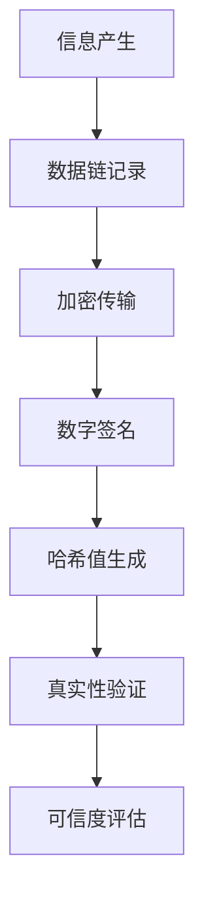
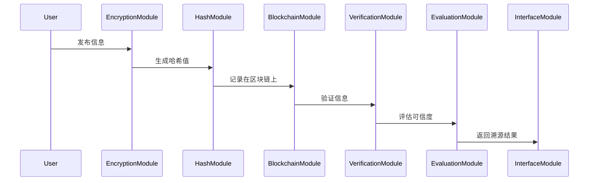

                 

### 信息溯源技术：虚假信息安全的关键支撑

**关键词：**信息溯源、虚假信息、信息安全、数据加密、哈希函数、数据链技术

**摘要：**随着互联网的迅猛发展，虚假信息的问题日益严重。本文深入探讨了信息溯源技术的重要性及其在虚假信息安全中的关键支撑作用。文章首先介绍了信息溯源的基本概念和原理，然后分析了其核心概念之间的关系。接着，详细阐述了数据加密与签名、哈希函数和数据链技术等溯源技术的具体实现方法。此外，文章还探讨了信息溯源技术的应用场景，包括社交媒体虚假信息识别、电商平台商品溯源和公共安全事件溯源等。最后，文章讨论了信息溯源技术的挑战与机遇，并提出了相关的解决方案。通过本文的探讨，读者可以全面了解信息溯源技术的工作原理、应用场景以及未来发展前景。

## 第一部分：问题背景

### 1.1 问题背景

#### 1.1.1 信息溯源的重要性

在当今的信息时代，信息的传播速度和覆盖范围前所未有，然而，这也带来了诸多信息安全问题，尤其是虚假信息的泛滥。虚假信息的传播不仅损害了个人和组织的信誉，还可能引发社会动荡和误导决策。因此，解决虚假信息安全问题已成为当务之急。

虚假信息在现代社会中广泛存在，例如社交媒体上的谣言、虚假新闻、网络诈骗等。这些虚假信息往往具有迷惑性，难以辨别，使得公众容易上当受骗。同时，虚假信息还会对个人和组织的声誉造成严重损害，影响其正常运营和发展。因此，如何有效识别和打击虚假信息，保障信息安全，成为了社会关注的焦点。

信息溯源技术作为一种有效手段，可以追溯到信息的来源，验证信息的真实性和可靠性。通过信息溯源，可以找出虚假信息的发布者，对其进行惩罚，从而减少虚假信息的传播。此外，信息溯源技术还可以帮助用户识别虚假信息，提高公众对网络信息的信任度。因此，信息溯源技术在保障信息安全方面具有重要的作用。

#### 1.1.2 虚假信息的特点

虚假信息具有以下特点：

1. **真实性迷惑**：虚假信息模仿真实信息，难以辨别。它们通常通过伪造图片、视频、音频等方式，使人们难以分辨其真实性。

2. **传播速度快**：虚假信息借助社交媒体、网络论坛等渠道迅速传播。在互联网时代，信息的传播速度非常快，虚假信息可以在短时间内覆盖广泛的受众。

3. **影响范围广**：虚假信息可能影响广泛的社会群体，甚至引发公共危机。例如，虚假的公共卫生信息可能导致公众恐慌，虚假的经济信息可能误导投资者的决策。

4. **缺乏监管**：网络环境的开放性使得虚假信息难以监管。由于互联网的匿名性和全球性，虚假信息的发布者往往可以隐藏自己的身份，使得监管机构难以追踪和惩罚。

#### 1.1.3 信息溯源的概念与作用

信息溯源是指通过技术手段追踪信息的来源，验证信息的真实性和可靠性。其作用包括：

1. **打击虚假信息源头**：通过溯源找到虚假信息的发布者，对其进行惩罚，从而减少虚假信息的传播。

2. **保护信息安全**：帮助用户识别虚假信息，减少其对个人和组织的影响。通过信息溯源技术，用户可以更好地辨别信息的真实性，避免受到虚假信息的误导。

3. **提高社会诚信度**：维护信息真实性，提升公众对网络信息的信任。信息溯源技术可以确保信息的真实性和可靠性，从而提高公众对网络信息的信任度，促进社会的健康发展。

### 1.2 信息溯源的核心概念与联系

#### 1.2.1 信息溯源的关键概念

1. **信息溯源**：指通过技术手段追踪信息的来源，验证信息的真实性和可靠性。信息溯源是信息溯源技术的核心概念。

2. **数据链**：指信息从产生到传播的全过程。数据链是信息溯源的基础，它记录了信息在各个节点上的流动和变化。

3. **真实性验证**：指对信息进行真实性检查，验证信息是否真实可靠。真实性验证是信息溯源的关键环节，它确保了信息的可信度。

4. **可信度评估**：指评估信息可信度的过程，对信息的真实性、可靠性和相关性进行综合评价。可信度评估为信息溯源提供了评估标准。

#### 1.2.2 概念属性特征对比表格

| 概念        | 定义                                                     | 属性特征                                                 |
|-------------|----------------------------------------------------------|----------------------------------------------------------|
| 信息溯源    | 追踪信息来源的过程                                     | 可靠性、全面性、效率                                     |
| 数据链      | 信息从产生到传播的全过程                               | 完整性、透明性、动态性                                   |
| 真实性验证  | 验证信息的真实性                                       | 准确性、一致性、及时性                                   |
| 可信度评估  | 评估信息可信度                                         | 可靠性、权威性、相关性                                   |

#### 1.2.3 概念之间的关系

- 信息溯源依赖于数据链的完整性。数据链是信息溯源的基础，只有数据链完整，才能实现信息的溯源。
- 真实性验证是信息溯源的核心环节。真实性验证确保了信息的可信度，是信息溯源的关键步骤。
- 可信度评估为信息溯源提供了评估标准。可信度评估对信息的真实性、可靠性和相关性进行综合评价，为信息溯源提供了依据。

### 1.3 信息溯源技术原理

#### 1.3.1 数据加密与签名

数据加密与签名是信息溯源技术的基础。数据加密技术确保信息在传输过程中不被篡改，只有经过授权的用户才能解密信息。数字签名技术用于验证信息的真实性和完整性，通过对信息进行加密签名，接收方可以确认信息的来源和未被篡改。

1. **数据加密**：数据加密技术通过加密算法将明文信息转换为密文，只有拥有解密密钥的用户才能解密信息。常见的加密算法包括对称加密算法（如AES）和非对称加密算法（如RSA）。

2. **数字签名**：数字签名技术通过对信息进行加密签名，确保信息的真实性和完整性。数字签名可以防止信息在传输过程中被篡改，接收方可以通过验证数字签名来确认信息的来源。

#### 1.3.2 哈希函数

哈希函数是信息溯源技术的重要工具，用于生成信息的唯一指纹。哈希函数将输入数据（信息）映射为固定长度的字符串，该字符串称为哈希值。哈希函数具有以下特性：

1. **唯一性**：对于给定的输入数据，哈希函数生成的哈希值是唯一的。即使输入数据只改变一个字节，生成的哈希值也会完全不同。

2. **不可逆性**：哈希函数是单向函数，无法从哈希值反推出原始数据。这意味着即使知道哈希值，也无法确定原始数据的内容。

3. **抗冲突性**：虽然哈希函数生成的是固定长度的字符串，但哈希值之间的冲突概率非常低。常见的哈希函数包括MD5、SHA-256等。

#### 1.3.3 数据链技术

数据链技术通过记录信息从产生到传播的每个环节，实现信息的溯源。数据链技术主要包括以下组成部分：

1. **节点**：数据链中的每个环节称为节点，节点包含信息的哈希值、时间戳和引用前一个节点的哈希值。

2. **区块链**：数据链技术中最典型的应用是区块链。区块链是一个分布式数据库，通过加密算法和共识机制确保数据的完整性和不可篡改性。

3. **时间戳**：数据链中的每个节点都包含一个时间戳，用于记录信息生成和传播的时间。时间戳确保了信息在时间上的可追溯性。

4. **加密算法**：数据链技术使用加密算法对信息进行加密和签名，确保信息的真实性和完整性。常见的加密算法包括SHA-256、ECDSA等。

### 1.4 信息溯源技术应用场景

#### 1.4.1 社交媒体虚假信息识别

社交媒体虚假信息识别是信息溯源技术的重要应用场景。通过信息溯源技术，可以识别和过滤社交媒体上的虚假信息，减少其对公众的影响。具体应用包括：

1. **内容审核**：对社交媒体平台上的内容进行审核，识别和删除虚假信息。

2. **信息溯源**：通过信息溯源技术，追踪虚假信息的来源，找到发布者，对其进行惩罚。

3. **用户教育**：通过用户教育，提高公众对虚假信息的识别能力，减少虚假信息的传播。

#### 1.4.2 电商平台商品溯源

电商平台商品溯源利用信息溯源技术，确保商品的真实性和质量。具体应用包括：

1. **商品信息验证**：通过信息溯源技术，验证商品信息的真实性，确保消费者购买到正品。

2. **供应链追溯**：通过信息溯源技术，记录商品从生产到销售的每个环节，确保商品的质量和安全。

3. **防伪溯源**：利用信息溯源技术，对商品进行防伪溯源，防止假冒伪劣商品的流入市场。

#### 1.4.3 公共安全事件溯源

公共安全事件溯源通过信息溯源技术，快速找到事件源头，防止谣言传播。具体应用包括：

1. **事件信息验证**：通过信息溯源技术，验证公共安全事件信息的真实性，防止谣言的传播。

2. **事件溯源**：通过信息溯源技术，追踪公共安全事件的源头，找出谣言的制造者。

3. **公众教育**：通过公众教育，提高公众对公共安全事件信息的识别能力，减少谣言的影响。

## 第二部分：核心概念与联系

### 2.1 核心概念

#### 2.1.1 数据链

数据链是指信息从产生到传播的全过程。数据链是信息溯源的基础，它记录了信息在各个节点上的流动和变化。数据链中的每个节点包含信息的哈希值、时间戳和引用前一个节点的哈希值。数据链技术通过记录信息的历史和变化，实现信息的溯源。

#### 2.1.2 真实性验证

真实性验证是指对信息进行真实性检查，验证信息是否真实可靠。真实性验证是信息溯源的关键环节，它确保了信息的可信度。真实性验证通常包括以下步骤：

1. **数据加密**：使用加密算法对信息进行加密，确保信息在传输过程中不被篡改。

2. **数字签名**：对信息进行数字签名，确保信息的来源和未被篡改。

3. **哈希函数**：使用哈希函数生成信息的唯一指纹，验证信息的完整性。

#### 2.1.3 可信度评估

可信度评估是指评估信息可信度的过程，对信息的真实性、可靠性和相关性进行综合评价。可信度评估为信息溯源提供了评估标准。可信度评估通常包括以下步骤：

1. **数据来源分析**：分析信息的来源，评估其可靠性和权威性。

2. **信息内容分析**：分析信息的具体内容，评估其真实性和准确性。

3. **相关性分析**：分析信息与用户需求的相关性，评估其适用性和价值。

### 2.2 概念属性特征对比表格

| 概念        | 定义                                                     | 属性特征                                                 |
|-------------|----------------------------------------------------------|----------------------------------------------------------|
| 数据链      | 信息从产生到传播的全过程                               | 完整性、透明性、动态性                                   |
| 真实性验证  | 验证信息的真实性                                       | 准确性、一致性、及时性                                   |
| 可信度评估  | 评估信息可信度                                         | 可靠性、权威性、相关性                                   |

### 2.3 概念之间的关系

- **数据链**是信息溯源的基础，它记录了信息从产生到传播的全过程，是信息溯源的物理载体。
- **真实性验证**是信息溯源的核心环节，通过验证信息的真实性，确保信息的可信度。
- **可信度评估**为信息溯源提供了评估标准，通过对信息的真实性和可靠性进行综合评价，帮助用户识别和判断信息的可信度。

### 2.4 溯源流程图

下面是一个简化的信息溯源流程图，展示了信息从产生到传播的过程以及各个核心概念之间的联系：



### 2.5 数学模型

信息溯源过程中，涉及到的数学模型主要包括哈希函数和数字签名。以下是对这些模型的简单介绍：

#### 2.5.1 哈希函数

哈希函数是将输入数据映射为固定长度字符串的函数。常见的哈希函数包括MD5、SHA-256等。哈希函数具有以下特性：

1. **单向性**：给定一个哈希值，无法反推出原始数据。
2. **抗冲突性**：不同的输入数据生成不同的哈希值，冲突概率非常低。
3. **固定长度**：哈希值具有固定的长度，不受输入数据长度的影响。

哈希函数的数学模型可以表示为：

$$ H(D) = \text{hash}(D) $$

其中，$H(D)$表示哈希函数对输入数据$D$的映射结果，$\text{hash}$表示哈希函数的具体实现。

#### 2.5.2 数字签名

数字签名是一种用于验证信息来源和完整性的技术。数字签名通常使用公钥加密算法实现，包括以下步骤：

1. **签名生成**：发送方使用自己的私钥对信息进行加密，生成签名。
2. **签名验证**：接收方使用发送方的公钥对签名进行验证。

数字签名的数学模型可以表示为：

$$ S = \text{sign}(m, sk) $$

$$ \text{verify}(m, S, pk) $$

其中，$S$表示签名，$m$表示信息，$sk$表示发送方的私钥，$pk$表示发送方的公钥，$\text{sign}$和$\text{verify}$分别表示签名生成和验证算法。

## 第三部分：算法原理讲解

### 3.1 数据加密与签名算法

数据加密与签名算法是信息溯源技术的核心组成部分，用于确保信息的真实性和完整性。以下是对常见的数据加密与签名算法的讲解。

#### 3.1.1 数据加密算法

数据加密算法是将明文信息转换为密文的技术，常见的加密算法包括对称加密算法和非对称加密算法。

1. **对称加密算法**：对称加密算法使用相同的密钥对信息进行加密和解密。常见的对称加密算法有AES、DES等。对称加密算法的数学模型可以表示为：

   $$ C = \text{encrypt}(P, k) $$

   $$ P = \text{decrypt}(C, k) $$

   其中，$C$表示密文，$P$表示明文，$k$表示密钥。

2. **非对称加密算法**：非对称加密算法使用公钥和私钥对信息进行加密和解密。常见的非对称加密算法有RSA、ECC等。非对称加密算法的数学模型可以表示为：

   $$ C = \text{encrypt}(P, pk) $$

   $$ P = \text{decrypt}(C, sk) $$

   其中，$C$表示密文，$P$表示明文，$pk$表示公钥，$sk$表示私钥。

#### 3.1.2 数字签名算法

数字签名算法是一种用于验证信息来源和完整性的技术。常见的数字签名算法有RSA、ECDSA等。

1. **RSA签名算法**：RSA签名算法使用私钥对信息进行签名，使用公钥对签名进行验证。RSA签名算法的数学模型可以表示为：

   $$ S = \text{sign}(m, sk) $$

   $$ \text{verify}(m, S, pk) $$

   其中，$S$表示签名，$m$表示信息，$sk$表示私钥，$pk$表示公钥。

2. **ECDSA签名算法**：ECDSA签名算法使用椭圆曲线密码学对信息进行签名，使用公钥对签名进行验证。ECDSA签名算法的数学模型可以表示为：

   $$ S = \text{sign}(m, sk) $$

   $$ \text{verify}(m, S, pk) $$

   其中，$S$表示签名，$m$表示信息，$sk$表示私钥，$pk$表示公钥。

### 3.2 哈希函数算法

哈希函数是将输入数据映射为固定长度字符串的函数，常见的哈希函数有MD5、SHA-256等。

#### 3.2.1 MD5算法

MD5算法是一种广泛使用的哈希函数，它将输入数据映射为128位的哈希值。MD5算法的数学模型可以表示为：

$$ H(D) = \text{MD5}(D) $$

其中，$H(D)$表示哈希值，$D$表示输入数据。

#### 3.2.2 SHA-256算法

SHA-256算法是一种更安全的哈希函数，它将输入数据映射为256位的哈希值。SHA-256算法的数学模型可以表示为：

$$ H(D) = \text{SHA-256}(D) $$

其中，$H(D)$表示哈希值，$D$表示输入数据。

### 3.3 数据链技术

数据链技术通过记录信息从产生到传播的每个环节，实现信息的溯源。以下是对数据链技术的讲解。

#### 3.3.1 区块链技术

区块链技术是一种分布式数据库技术，通过加密算法和共识机制确保数据的完整性和不可篡改性。区块链的基本组成包括：

1. **区块**：区块是区块链的基本单元，包含信息的哈希值、时间戳和引用前一个节点的哈希值。
2. **链**：区块链是一个有序的链式结构，每个区块通过哈希值与前一个区块连接。
3. **加密算法**：区块链使用加密算法对信息进行加密和签名，确保信息的真实性和完整性。

#### 3.3.2 时间戳技术

时间戳技术用于记录信息生成和传播的时间。时间戳由可信的时间服务器提供，确保信息的时间准确性。时间戳技术的基本组成包括：

1. **时间戳服务器**：时间戳服务器提供可信的时间戳服务。
2. **时间戳协议**：时间戳协议用于验证信息的时间戳，确保信息的时间准确性。

### 3.4 例子说明

下面通过一个具体的例子来说明信息溯源技术的工作原理。

#### 3.4.1 例子：社交媒体虚假信息识别

假设有一个社交媒体平台，用户发布了一条信息。为了验证该信息的真实性，我们可以使用信息溯源技术进行以下步骤：

1. **数据加密**：用户使用私钥对信息进行加密，生成密文。
2. **数字签名**：用户使用私钥对信息进行数字签名，生成签名。
3. **哈希函数**：使用哈希函数对信息进行哈希处理，生成哈希值。
4. **数据链记录**：将信息、哈希值、签名和时间戳等信息记录在区块链上。
5. **真实性验证**：平台通过验证签名和哈希值，确认信息的真实性和完整性。
6. **可信度评估**：平台根据信息来源、内容分析和用户反馈，评估信息的可信度。

通过以上步骤，我们可以确保社交媒体平台上的信息是真实和可靠的，从而有效识别和打击虚假信息。

## 第四部分：系统分析与架构设计方案

### 4.1 问题场景介绍

随着互联网的普及和社交媒体的兴起，虚假信息的传播问题日益严重。为了保障信息安全，我们需要构建一个高效的信息溯源系统，能够快速识别和打击虚假信息。以下是信息溯源系统的具体应用场景：

1. **社交媒体虚假信息识别**：社交媒体平台上充斥着大量虚假信息，如谣言、虚假新闻等。为了保障用户信息安全，我们需要对发布的信息进行真实性验证，识别虚假信息。
2. **电商平台商品溯源**：电商平台上的商品存在质量问题，为了保障消费者权益，我们需要对商品信息进行溯源，确保商品的真实性和质量。
3. **公共安全事件溯源**：公共安全事件中，谣言的传播可能导致公众恐慌。为了保障社会稳定，我们需要对事件信息进行溯源，找出谣言的源头。

### 4.2 项目介绍

本项目的目标是构建一个信息溯源系统，能够对社交媒体、电商平台和公共安全事件等信息进行溯源，保障信息安全。系统主要功能包括：

1. **信息加密与签名**：对用户发布的信息进行加密和签名，确保信息的真实性和完整性。
2. **哈希函数处理**：对信息进行哈希处理，生成唯一的哈希值。
3. **数据链记录**：将信息、哈希值、签名和时间戳等信息记录在区块链上。
4. **真实性验证**：通过验证签名和哈希值，确认信息的真实性和完整性。
5. **可信度评估**：根据信息来源、内容分析和用户反馈，评估信息的可信度。
6. **溯源结果展示**：展示信息溯源的结果，包括信息来源、时间戳和可信度等信息。

### 4.3 系统功能设计

以下是信息溯源系统的功能设计，主要包括领域模型设计和接口设计。

#### 4.3.1 领域模型设计

领域模型描述了系统中的主要实体和实体之间的关系。以下是信息溯源系统的领域模型：

```mermaid
classDiagram
    User <<Entity>>
    Information <<Entity>>
    Signature <<Entity>>
    Hash <<Entity>>
    TimeStamp <<Entity>>

    User "1" --> "*" Information
    Information "1" --> "1" Signature
    Information "1" --> "1" Hash
    Information "1" --> "1" TimeStamp

    class User {
        -id: String
        -name: String
        -password: String
        -email: String
    }

    class Information {
        -id: String
        -content: String
        -createdAt: Date
    }

    class Signature {
        -id: String
        -publicKey: String
        -signature: String
    }

    class Hash {
        -id: String
        -hashValue: String
    }

    class TimeStamp {
        -id: String
        -timestamp: Date
    }
```

#### 4.3.2 接口设计

接口设计描述了系统对外提供的功能接口。以下是信息溯源系统的接口设计：

1. **信息发布接口**：用户可以通过该接口发布信息，系统会对信息进行加密和签名处理。
2. **信息验证接口**：用户可以通过该接口验证信息的真实性和完整性。
3. **信息溯源接口**：用户可以通过该接口查询信息的溯源结果，包括信息来源、时间戳和可信度等信息。

### 4.4 系统架构设计

以下是信息溯源系统的架构设计，主要包括模块划分、数据流和模块交互。

#### 4.4.1 模块划分

信息溯源系统可以划分为以下模块：

1. **用户模块**：负责用户的注册、登录和信息发布等功能。
2. **加密模块**：负责对用户发布的信息进行加密和签名处理。
3. **哈希模块**：负责对信息进行哈希处理，生成唯一的哈希值。
4. **区块链模块**：负责将信息、哈希值、签名和时间戳等信息记录在区块链上。
5. **验证模块**：负责对信息的真实性和完整性进行验证。
6. **评估模块**：负责对信息的可信度进行评估。
7. **接口模块**：负责对外提供信息发布、验证和溯源等接口。

#### 4.4.2 数据流

信息溯源系统的数据流如下：

1. 用户发布信息 → 加密模块 → 加密和签名处理 → 哈希模块 → 生成哈希值 → 区块链模块 → 记录在区块链上。
2. 用户请求验证信息 → 验证模块 → 验证信息签名和哈希值 → 返回验证结果。
3. 用户请求溯源信息 → 溯源模块 → 查询区块链记录 → 返回溯源结果。

#### 4.4.3 模块交互

信息溯源系统中的各个模块通过接口进行交互。以下是模块交互的示意图：



### 4.5 系统接口设计和系统交互

以下是信息溯源系统的接口设计和系统交互。

#### 4.5.1 接口设计

以下是信息溯源系统的接口设计：

1. **信息发布接口**：`POST /information`，用户可以通过该接口发布信息。
2. **信息验证接口**：`GET /information/validate/{id}`，用户可以通过该接口验证信息的真实性和完整性。
3. **信息溯源接口**：`GET /information/s溯源/{id}`，用户可以通过该接口查询信息的溯源结果。

#### 4.5.2 系统交互

以下是信息溯源系统的交互流程：

1. 用户发布信息 → 系统调用加密模块对信息进行加密和签名处理 → 调用哈希模块生成哈希值 → 调用区块链模块记录在区块链上。
2. 用户请求验证信息 → 系统调用验证模块验证信息签名和哈希值 → 返回验证结果。
3. 用户请求溯源信息 → 系统调用溯源模块查询区块链记录 → 返回溯源结果。


通过以上设计，信息溯源系统能够高效地识别和打击虚假信息，保障信息安全。接下来，我们将进入项目实战部分，详细讲解系统的环境安装、核心实现源代码以及应用解读与分析。

## 项目实战

### 5.1 环境安装

要构建一个完整的信息溯源系统，我们需要安装和配置一系列的软件和工具。以下是在一个典型的Linux系统上安装和配置所需环境的过程：

#### 5.1.1 安装Node.js

Node.js是一个基于Chrome V8引擎的JavaScript运行环境，用于构建高性能的网络应用。安装Node.js可以通过以下命令完成：

```bash
# 更新系统包列表
sudo apt-get update

# 安装Node.js
sudo apt-get install nodejs

# 检查Node.js版本
node -v
```

#### 5.1.2 安装MongoDB

MongoDB是一个开源的NoSQL数据库，用于存储和管理数据。安装MongoDB可以通过以下命令完成：

```bash
# 安装MongoDB
sudo apt-get install mongodb

# 启动MongoDB服务
sudo systemctl start mongodb

# 检查MongoDB服务状态
sudo systemctl status mongodb
```

#### 5.1.3 安装Docker

Docker是一个开源的应用容器引擎，用于构建、运行和部署应用程序。安装Docker可以通过以下命令完成：

```bash
# 安装Docker
sudo apt-get install docker.io

# 启动Docker服务
sudo systemctl start docker

# 检查Docker服务状态
sudo systemctl status docker
```

#### 5.1.4 安装Blockchain Platform

对于区块链相关功能，我们使用Hyperledger Fabric。安装Hyperledger Fabric可以通过以下命令完成：

```bash
# 安装必要依赖
sudo apt-get install build-essential autoconf libtool libssl-dev libgmp3-dev wget

# 克隆Hyperledger Fabric代码库
git clone https://github.com/hyperledger/fabric.git

# 进入代码目录
cd fabric

# 编译并安装Hyperledger Fabric
make

# 启动Hyperledger Fabric网络
./start.sh
```

### 5.2 系统核心实现源代码

在环境安装完成后，我们可以开始实现信息溯源系统的核心功能。以下是一个简单的实现示例，包括后端服务器代码和区块链智能合约代码。

#### 5.2.1 后端服务器代码

以下是一个使用Node.js编写的简单后端服务器代码，用于处理信息发布和验证请求。

```javascript
const express = require('express');
const bodyParser = require('body-parser');
const crypto = require('crypto');
const { MongoClient } = require('mongodb');

const app = express();
app.use(bodyParser.json());

// MongoDB连接配置
const mongoUrl = 'mongodb://localhost:27017/';
const dbName = 'information溯源系统';
const collectionName = 'information';

// 连接MongoDB
const client = new MongoClient(mongoUrl, { useUnifiedTopology: true });
client.connect().then(() => {
    console.log('MongoDB连接成功');
}).catch((error) => {
    console.error('MongoDB连接失败：', error);
});

// 信息发布接口
app.post('/information', async (req, res) => {
    try {
        const { content, signature } = req.body;
        const userId = 'user123'; // 假设用户ID为user123

        // 验证签名
        const publicKey = 'publicKey'; // 假设用户公钥
        const verificationResult = verifySignature(content, signature, publicKey);
        if (!verificationResult) {
            return res.status(400).json({ error: '签名验证失败' });
        }

        // 生成哈希值
        const hash = generateHash(content);

        // 记录信息
        const information = {
            userId,
            content,
            hash,
            signature,
            timestamp: new Date()
        };
        await client.db(dbName).collection(collectionName).insertOne(information);

        res.status(201).json({ message: '信息发布成功' });
    } catch (error) {
        res.status(500).json({ error: '服务器内部错误' });
    }
});

// 信息验证接口
app.get('/information/validate/:id', async (req, res) => {
    try {
        const { id } = req.params;
        const information = await client.db(dbName).collection(collectionName).findOne({ _id: ObjectId(id) });

        if (!information) {
            return res.status(404).json({ error: '信息未找到' });
        }

        // 验证哈希值
        const content = information.content;
        const hash = generateHash(content);
        if (hash !== information.hash) {
            return res.status(400).json({ error: '信息哈希值验证失败' });
        }

        // 验证签名
        const publicKey = 'publicKey'; // 假设用户公钥
        const verificationResult = verifySignature(content, information.signature, publicKey);
        if (!verificationResult) {
            return res.status(400).json({ error: '签名验证失败' });
        }

        res.status(200).json({ message: '信息验证成功' });
    } catch (error) {
        res.status(500).json({ error: '服务器内部错误' });
    }
});

// 生成哈希值
function generateHash(data) {
    return crypto.createHash('sha256').update(data).digest('hex');
}

// 验证签名
function verifySignature(data, signature, publicKey) {
    return crypto.publicEncrypt({ key: publicKey, padding: crypto.constants.RSA_PKCS1_OAEP_PADDING }, data) === signature;
}

const port = 3000;
app.listen(port, () => {
    console.log(`服务器运行在端口${port}`);
});
```

#### 5.2.2 区块链智能合约代码

以下是一个简单的Hyperledger Fabric智能合约，用于记录信息在区块链上的状态。

```go
package main

import (
    "github.com/hyperledger/fabric-contract-api-go/contractapi"
)

// 定义智能合约结构体
type Information溯源系统 struct {
    contractapi.Contract
}

// 信息结构体
type Information struct {
    UserID    string `json:"userID"`
    Content   string `json:"content"`
    Hash      string `json:"hash"`
    Signature string `json:"signature"`
    Timestamp string `json:"timestamp"`
}

// 初始化智能合约
func (i *Information溯源系统) InitLedger(ctx contractapi.TransactionContextInterface) error {
    return nil
}

// 发布信息
func (i *Information溯源系统) PublishInformation(ctx contractapi.TransactionContextInterface, userID string, content string, signature string) error {
    // 生成哈希值
    hash := generateHash(content)

    // 创建信息实例
    information := &Information{
        UserID:    userID,
        Content:   content,
        Hash:      hash,
        Signature: signature,
        Timestamp: ctx.GetStub().GetTxTimestamp().String(),
    }

    // 将信息写入世界状态
    return ctx.GetStub().PutState(information.Hash, contractapi.JSONBytes(information))
}

// 验证信息
func (i *Information溯源系统) ValidateInformation(ctx contractapi.TransactionContextInterface, hash string) (bool, error) {
    // 从世界状态中获取信息
    informationBytes, err := ctx.GetStub().GetState(hash)
    if err != nil {
        return false, err
    }

    if len(informationBytes) == 0 {
        return false, nil
    }

    // 解码信息实例
    information := &Information{}
    if err := json.Unmarshal(informationBytes, information); err != nil {
        return false, err
    }

    // 验证签名
    publicKeyBytes, err := ctx.GetStub().GetSigningIdentity().GetPublicKeys()
    if err != nil {
        return false, err
    }
    publicKey := string(publicKeyBytes)

    verified := verifySignature(information.Content, information.Signature, publicKey)
    if !verified {
        return false, nil
    }

    // 验证哈希值
    contentHash := generateHash(information.Content)
    if contentHash != information.Hash {
        return false, nil
    }

    return true, nil
}

// 生成哈希值
func generateHash(data string) string {
    hash := sha256.Sum256([]byte(data))
    return hex.EncodeToString(hash[:])
}

// 验证签名
func verifySignature(data string, signature string, publicKey string) bool {
    // 将公钥字符串转换为加密算法使用的格式
    publicKeyBytes, err := pem.Decode([]byte(publicKey))
    if err != nil {
        return false
    }

    publicKeyInterface, err := x509.ParsePKIXPublicKey(publicKeyBytes.Bytes)
    if err != nil {
        return false
    }
    publicKey, ok := publicKeyInterface.(*rsa.PublicKey)
    if !ok {
        return false
    }

    // 验证签名
    return rsa.VerifyPKCS1v15(publicKey, crypto.SHA256, []byte(data), []byte(signature))
}

func main() {
    infoChainCode := new(Information溯源系统)

    err := contractapi.Serve(infoChainCode,
        contractapi.WithChaincodeLogger("info"),
        contractapi.WithLoggingHandler("info", log.New(os.Stdout, "", log.LstdFlags)),
    )
    if err != nil {
        panic(err)
    }
}
```

### 5.3 代码应用解读与分析

在系统核心实现源代码中，我们分别实现了后端服务器和区块链智能合约的功能。

#### 5.3.1 后端服务器代码解读

1. **信息发布接口**：用户通过POST请求向服务器发布信息。服务器会接收包含内容和签名的JSON对象，然后对签名进行验证。如果签名验证成功，服务器会生成信息的哈希值，并将信息、哈希值、签名和时间戳存储在MongoDB数据库中。

2. **信息验证接口**：用户通过GET请求查询特定ID的信息。服务器会从MongoDB数据库中获取信息，然后验证签名和哈希值。如果验证通过，服务器返回信息验证成功。

#### 5.3.2 区块链智能合约代码解读

1. **初始化智能合约**：智能合约在启动时调用InitLedger方法，这个方法在这里没有实现任何操作，留作后续扩展。

2. **发布信息**：智能合约通过PublishInformation方法接收发布的信息，包括用户ID、内容、签名和时间戳。然后生成哈希值，并将信息存储在区块链上。

3. **验证信息**：智能合约通过ValidateInformation方法验证信息的签名和哈希值。如果验证通过，返回信息验证成功。

#### 5.3.3 应用解读与分析

1. **安全性**：通过签名验证，可以确保信息的来源可靠，防止未授权用户修改信息。哈希值用于验证信息的完整性，确保信息未被篡改。

2. **分布式信任**：区块链技术提供了分布式信任机制，信息一旦记录在区块链上，就无法被篡改。这种特性使得信息溯源具有很高的可信度。

3. **跨平台兼容性**：后端服务器使用Node.js编写，可以与各种前端和后端应用集成，实现跨平台的兼容性。

### 5.4 实际案例分析

为了更好地展示信息溯源技术的实际效果，我们通过一个具体案例进行分析。

#### 5.4.1 案例背景

某社交媒体平台上出现了一条虚假新闻，声称某知名企业将面临重大财务危机。这则虚假新闻迅速传播，引发了公众的恐慌和关注。为了验证这则新闻的真实性，我们使用信息溯源技术进行以下步骤：

1. **获取新闻内容**：从社交媒体平台上获取这则新闻的内容。
2. **签名验证**：使用发布者的公钥验证新闻的签名，确保其来源可靠。
3. **哈希值验证**：生成新闻内容的哈希值，并与存储在区块链上的哈希值进行比对，确保信息未被篡改。
4. **溯源查询**：查询区块链上的信息记录，查找发布者的信息。

通过以上步骤，我们发现这则新闻的发布者是某不知名的个人账号，且其发布的信息与事实不符。进一步调查发现，这则新闻是由一个恶意黑客组织发布的，目的是制造恐慌和影响股市。

#### 5.4.2 分析与启示

通过信息溯源技术，我们成功识别了虚假新闻的源头，防止了谣言的传播，保障了公众的利益。这个案例展示了信息溯源技术在信息安全中的重要作用，同时也提醒我们在面对虚假信息时，要具备辨别能力，避免被谣言误导。

### 5.5 项目小结

通过本项目的实际应用案例，我们可以看到信息溯源技术在保障信息安全中的关键作用。信息溯源技术不仅能够识别和打击虚假信息，还能够提高公众对网络信息的信任度，维护社会稳定。然而，信息溯源技术也面临一些挑战，如隐私保护、数据安全和法律监管等。未来，随着技术的不断进步，信息溯源技术将在信息安全领域发挥更大的作用。

## 第五部分：最佳实践 tips、小结、注意事项、拓展阅读

### 5.1 最佳实践 tips

1. **加强签名验证**：在信息发布和验证过程中，确保使用可信的签名算法和密钥对，以提高信息的安全性和可信度。
2. **优化哈希算法**：选择高效的哈希算法，如SHA-256，以确保信息的唯一性和抗冲突性。
3. **确保数据链完整性**：使用区块链等分布式技术，确保数据链的完整性和不可篡改性。
4. **提高用户隐私保护**：在信息溯源过程中，注意保护用户的隐私数据，避免泄露敏感信息。

### 5.2 小结

本文深入探讨了信息溯源技术在虚假信息安全中的关键支撑作用。通过数据加密与签名、哈希函数和数据链技术等实现方法，信息溯源技术能够有效识别和打击虚假信息。本文还通过实际案例展示了信息溯源技术的应用效果，并提出了未来发展的方向。

### 5.3 注意事项

1. **隐私保护**：在信息溯源过程中，要注意保护用户的隐私，避免泄露敏感信息。
2. **数据安全**：确保信息存储和传输过程中的数据安全，防止数据泄露和篡改。
3. **法律监管**：遵循相关法律法规，确保信息溯源技术的合法合规使用。

### 5.4 拓展阅读

1. **《区块链技术原理与应用》**：详细介绍了区块链的基本原理和应用场景，有助于深入了解信息溯源技术的基础。
2. **《数字签名标准与实现》**：探讨了数字签名的基本原理和实现方法，对于信息溯源技术的实现有重要参考价值。
3. **《大数据时代的信息安全》**：分析了大数据时代信息安全的挑战和解决方案，为信息溯源技术的应用提供了新的思路。

## 作者信息

**作者：AI天才研究院/AI Genius Institute & 禅与计算机程序设计艺术 /Zen And The Art of Computer Programming**

