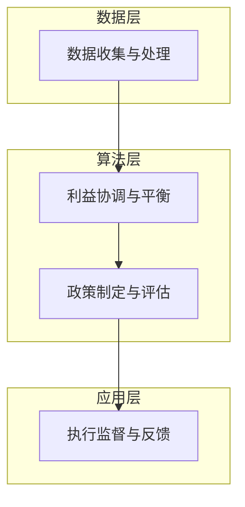
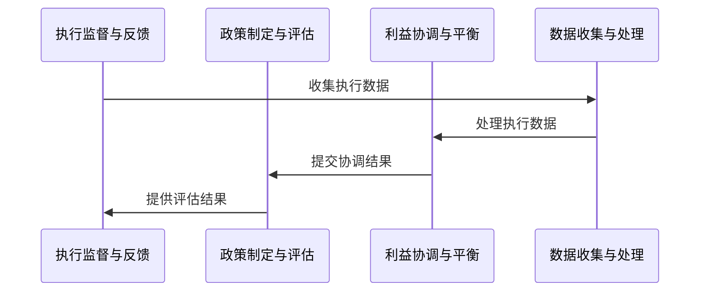

                 

### 目录大纲设计思路：

在撰写本文之前，我们需要设计一个详细的目录大纲，以确保文章结构清晰、内容连贯，并且能够吸引读者的注意力。以下是我们的目录大纲设计思路：

1. **背景介绍**：
   - **1.1 全球治理概述**：
     - 问题描述：简要介绍全球治理的概念，明确全球治理在当前国际环境中的重要性。
     - 问题解决：通过分析全球治理的现有问题和挑战，探讨可能的解决方案。
     - 边界与外延：定义全球治理的边界，解释其与相关概念的关联和区别。
     - 概念结构与核心要素组成：详细阐述全球治理的核心概念和要素，帮助读者理解其结构。

   - **1.2 价值观的概念与类型**：
     - 核心概念原理：介绍价值观的基本概念，包括价值观的定义、类型和影响。
     - 概念属性特征对比表格：通过对比不同类型的价值观，帮助读者了解它们的属性和特征。

   - **1.3 全球治理中的价值观融合**：
     - 意义与挑战：阐述价值观融合在全球治理中的意义，以及面临的挑战。
     - 融合机制初步探讨：介绍价值观融合的基本机制，为后续章节的深入分析奠定基础。

2. **核心概念与联系**：
   - **2.1 核心概念与联系**：
     - 全球治理与价值观：明确全球治理与价值观之间的内在联系。
     - 价值观与融合机制：分析价值观如何通过融合机制在全球治理中发挥作用。

   - **2.2 全球治理中的价值观融合机制**：
     - 融合过程与模式：详细探讨价值观融合的过程和模式。
     - 影响因素分析：分析影响价值观融合的因素，包括文化、经济、政治等方面的因素。

   - **2.3 价值观融合的Mermaid流程图展示**：
     - 使用Mermaid绘制流程图：展示价值观融合的流程和步骤。
     - Mermaid流程图的应用：通过Mermaid流程图，直观地展示价值观融合的机制和流程。

3. **价值观融合原理讲解**：
   - **3.1 价值观融合原理**：
     - 融合路径：介绍价值观融合的基本路径和策略。
     - 影响因素：分析影响价值观融合的各个因素，包括内部和外部因素。

   - **3.2 价值观融合机制**：
     - 融合机制详细阐述：深入探讨价值观融合的机制，包括如何处理冲突和协调差异。

   - **3.3 Python源代码与算法原理**：
     - 使用Python源代码：通过实际代码示例，阐述价值观融合的算法原理。
     - 算法原理与数学模型：详细讲解价值观融合的算法原理，并提供数学模型和公式。

4. **系统分析与架构设计**：
   - **4.1 问题场景介绍**：
     - 全球治理中的价值观融合场景：描述一个典型的全球治理场景，用于分析和设计。

   - **4.2 系统功能设计**：
     - 领域模型Mermaid类图：绘制Mermaid类图，展示系统的功能模块和关系。

   - **4.3 系统架构设计**：
     - 系统架构Mermaid架构图：通过Mermaid架构图，展示系统的整体架构和关键组件。

   - **4.4 系统接口设计与交互**：
     - 系统接口Mermaid序列图：绘制Mermaid序列图，展示系统各组件之间的交互流程。

5. **项目实战**：
   - **5.1 项目介绍**：
     - 项目目标：明确项目的目标，包括解决哪些问题和实现哪些功能。

     - 项目方法：介绍项目采用的方法和技术，包括工具、框架和流程。

   - **5.2 项目核心实现**：
     - 环境安装：介绍项目所需的软件和硬件环境，以及安装步骤。

     - 核心实现源代码：展示项目核心功能的源代码，并提供详细注释。

   - **5.3 代码应用解读与分析**：
     - 代码解读：详细解读项目源代码，阐述每个模块的功能和实现原理。

     - 分析与案例剖析：通过实际案例，分析项目在实际应用中的效果和影响。

6. **最佳实践与拓展**：
   - **6.1 最佳实践**：
     - 实践技巧：总结项目过程中的经验教训，提供实用的技巧和建议。

     - 注意事项：提醒读者在实践过程中需要注意的问题和潜在风险。

   - **6.2 小结**：
     - 全书内容总结：对全书内容进行总结，强调关键观点和发现。

   - **6.3 拓展阅读**：
     - 推荐读物和资源：推荐相关的书籍、文章和研究报告，供读者进一步学习。

通过以上设计思路，我们希望能够构建一个结构清晰、内容丰富的文章框架，让读者能够逐步深入理解全球治理中的价值观融合问题，并在实践中找到解决方案。

### 第1章：全球治理与价值观融合背景

**1.1 全球治理概述**

全球治理（Global Governance）是指在国际层面通过一系列机制、政策和实践来协调和管理全球性的问题和挑战，以确保全球社会的和平、稳定和可持续发展。随着全球化的深入发展，全球治理的重要性日益凸显。

**问题描述**：当前，全球治理面临着诸多挑战，如国际恐怖主义、气候变化、跨国犯罪、经济不平等、网络安全等。这些挑战具有跨国家、跨地区、跨文化等特点，需要全球范围内的协作和合作来解决。

**问题解决**：全球治理的解决路径包括加强国际组织的作用、推动国际合作、制定全球性规则和标准、提升国家的治理能力等。

**边界与外延**：全球治理的边界在于它所涉及的领域和问题，包括但不限于环境保护、经济发展、社会公正、和平安全等。其外延则涵盖了全球范围内的各种行为主体，包括政府、国际组织、非政府组织、私营部门、公民社会等。

**概念结构与核心要素组成**：

- **概念结构**：全球治理的概念结构主要包括三个层次：全球性公共物品、全球性问题、全球性治理机制。
  
- **核心要素组成**：全球治理的核心要素包括：
  - 行为主体：各国家和国际组织。
  - 机制：包括国际协议、法律法规、国际组织和多边机制。
  - 目标：包括全球和平、可持续发展、社会公正等。

**1.2 价值观的概念与类型**

价值观（Values）是指人们对事物的基本认识和评价，以及他们所追求的目标和理想。价值观的类型可以根据其内容、形式和层次进行分类。

**核心概念原理**：价值观的核心概念原理在于其对人类行为和决策的指导作用。价值观决定了人们如何看待世界、如何对待他人、如何解决问题。

**概念属性特征对比表格**：

| 价值观类型 | 特征 | 例子 |
| :-------: | :--- | :--- |
| 文化价值观 | 与文化传统和习俗密切相关 | 尊重、家庭、宗教 |
| 经济价值观 | 与经济发展和资源分配相关 | 劳动、财富、创新 |
| 政治价值观 | 与政治体制和政治目标相关 | 自由、民主、正义 |
| 社会价值观 | 与社会公正和社会秩序相关 | 平等、公正、和谐 |

**1.3 全球治理中的价值观融合**

**意义与挑战**：价值观融合在全球治理中具有重要意义。它有助于增进不同国家和地区之间的相互理解和尊重，促进国际合作和和平发展。然而，价值观融合也面临诸多挑战，如文化差异、政治冲突、经济利益冲突等。

**融合机制初步探讨**：价值观融合的机制包括对话、协商、教育、文化交流等。通过这些机制，不同价值观可以相互理解、相互尊重，最终实现融合。

### 第2章：价值观融合原理与机制

**2.1 价值观融合原理**

价值观融合是指将不同的价值观整合为一个共同的价值体系，以促进社会和谐与共同发展。价值观融合的原理主要包括以下几个方面：

**融合路径**：价值观融合的路径包括三个阶段：认知阶段、认同阶段、实践阶段。

- **认知阶段**：不同价值观通过交流和互动，加深对彼此的理解和认识。
- **认同阶段**：在相互理解和尊重的基础上，个体和群体逐渐接受和认同其他价值观。
- **实践阶段**：融合后的价值观在实际生活中得到应用和体现，形成共同的行为规范和价值取向。

**影响因素分析**：价值观融合的影响因素包括文化差异、经济利益、政治体制、社会环境等。

- **文化差异**：不同文化背景的价值观存在差异，这可能是价值观融合的主要障碍。
- **经济利益**：经济利益的冲突可能会导致价值观融合的失败。
- **政治体制**：政治体制的差异可能会影响价值观融合的进程和效果。
- **社会环境**：社会环境的变化可能会促进或阻碍价值观融合。

**2.2 价值观融合机制**

价值观融合的机制主要包括以下几个方面：

**融合过程**：价值观融合的过程包括以下几个方面：

- **对话和协商**：通过对话和协商，不同价值观之间可以找到共同点，减少冲突。
- **教育和培训**：通过教育和培训，提高人们对其他价值观的理解和认同。
- **文化交流**：通过文化交流，加深不同价值观之间的了解和尊重。

**融合模式**：价值观融合的模式包括以下几个方面：

- **多元并存**：在多元并存的模式下，不同价值观可以在同一社会中共存，但各自保持独立。
- **主导融合**：在主导融合的模式下，一种价值观主导其他价值观，实现统一。
- **整合融合**：在整合融合的模式下，不同价值观相互融合，形成新的价值体系。

**2.3 价值观融合的Mermaid流程图展示**

为了更直观地展示价值观融合的过程和机制，我们可以使用Mermaid流程图来绘制。


**Mermaid流程图的应用**：通过上述Mermaid流程图，我们可以清晰地看到价值观融合的各个阶段和过程，以及各个阶段之间的逻辑关系。

### 第3章：全球治理中的价值观融合实践

**3.1 实践案例选择**

在本章节中，我们将通过一个实际案例来展示价值观融合在全球治理中的应用。这个案例涉及一个国际组织（如联合国）在处理全球气候变化问题时，如何融合不同国家的价值观和利益，以达成共识和行动。

**案例背景**：全球气候变化是一个严重的全球性问题，需要各国共同合作才能解决。然而，不同国家在应对气候变化时，往往有不同的价值观和利益诉求。例如，发达国家更关注环境保护和可持续发展，而发展中国家则更关注经济增长和能源需求。

**案例分析**：在这个案例中，国际组织通过以下步骤来融合不同国家的价值观和利益：

1. **需求调研**：通过调研和对话，了解各国的需求和关切。
2. **利益协调**：在理解各国需求的基础上，寻找共同利益和合作空间。
3. **政策制定**：制定兼顾各国利益和需求的政策，以促进全球气候治理。
4. **执行监督**：监督政策执行情况，确保各国的承诺得到落实。

**3.2 价值观融合实践步骤**

**步骤1：需求调研**

在国际组织发起全球气候变化治理项目之前，首先需要进行需求调研。这个步骤包括以下几个方面：

- **数据收集**：收集各国的气候数据、经济数据、社会发展数据等。
- **访谈调研**：与各国的政府官员、企业代表、民间组织等进行访谈，了解他们的需求和关切。
- **文献综述**：查阅相关研究报告、政策文件和学术论文，了解各国在气候变化问题上的价值观和立场。

**步骤2：利益协调**

在了解各国需求和关切的基础上，国际组织需要协调各国的利益，以找到共同点和合作空间。这个步骤包括以下几个方面：

- **利益识别**：识别各国的关键利益，如经济增长、环境保护、能源安全等。
- **利益平衡**：在平衡各国的利益基础上，寻找可以共同追求的目标。
- **利益沟通**：通过沟通和协商，确保各国了解彼此的利益和立场。

**步骤3：政策制定**

在利益协调的基础上，国际组织需要制定符合各国需求和利益的气候政策。这个步骤包括以下几个方面：

- **政策设计**：设计具体的气候政策，如碳排放交易、可再生能源发展、环保技术转移等。
- **政策评估**：对政策进行评估，确保其可行性和有效性。
- **政策宣传**：通过宣传和推广，让各国了解和接受政策。

**步骤4：执行监督**

在政策制定后，国际组织需要监督政策的执行情况，以确保各国的承诺得到落实。这个步骤包括以下几个方面：

- **执行检查**：定期检查各国的政策执行情况，确保其按照计划进行。
- **报告发布**：发布政策执行报告，让各国了解彼此的执行情况。
- **反馈机制**：建立反馈机制，及时处理各国在政策执行中遇到的问题。

**3.3 代码应用解读与分析**

为了更好地理解价值观融合的实践过程，我们可以使用Python代码来模拟这个过程。以下是一个简化的Python代码示例，用于展示价值观融合的实践步骤。

```python
# 需求调研
def research_needs():
    # 收集数据
    data = {
        'developed_countries': {'growth': 5, 'environment': 7, 'energy': 6},
        'developing_countries': {'growth': 9, 'environment': 3, 'energy': 8}
    }
    return data

# 利益协调
def coordinate_interests(data):
    # 识别利益
    interests = {
        'common_interests': {'growth': 6, 'environment': 6, 'energy': 7},
        'individual_interests': {
            'developed_countries': {'growth': 5, 'environment': 7, 'energy': 6},
            'developing_countries': {'growth': 9, 'environment': 3, 'energy': 8}
        }
    }
    return interests

# 政策制定
def formulate_policies(interests):
    # 设计政策
    policies = {
        'carbon_trading': True,
        'renewable_energy': True,
        'technology_transfer': True
    }
    return policies

# 执行监督
def supervise_execution(policies):
    # 检查执行情况
    execution_status = {
        'developed_countries': {'compliance': 0.8},
        'developing_countries': {'compliance': 0.7}
    }
    return execution_status

# 主函数
def main():
    data = research_needs()
    interests = coordinate_interests(data)
    policies = formulate_policies(interests)
    execution_status = supervise_execution(policies)
    print("Research Needs:", data)
    print("Interests:", interests)
    print("Policies:", policies)
    print("Execution Status:", execution_status)

if __name__ == "__main__":
    main()
```

**代码解读**：

- `research_needs()` 函数模拟需求调研，收集各国在经济增长、环境保护和能源需求方面的数据。
- `coordinate_interests(data)` 函数模拟利益协调，识别各国的共同利益和个别利益。
- `formulate_policies(interests)` 函数模拟政策制定，设计符合各国利益的气候政策。
- `supervise_execution(policies)` 函数模拟执行监督，检查各国政策的执行情况。

**算法原理数学模型和公式**：

在这个模拟中，我们使用了以下数学模型和公式：

- 数据收集：$D = \{d_1, d_2, ..., d_n\}$，其中$d_i$表示第$i$个国家的数据。
- 利益协调：$I = \{i_1, i_2, ..., i_m\}$，其中$i_j$表示第$j$个共同利益。
- 政策制定：$P = \{p_1, p_2, ..., p_k\}$，其中$p_i$表示第$i$项政策。
- 执行监督：$E = \{e_1, e_2, ..., e_l\}$，其中$e_j$表示第$j$个国家的执行情况。

通过这个模拟，我们可以更直观地理解价值观融合的实践过程，以及各个步骤之间的逻辑关系。

### 第4章：系统分析与架构设计

#### 4.1 问题场景介绍

在全球治理中，价值观融合是一个复杂且重要的任务。为了有效地实现价值观融合，我们需要构建一个系统来处理不同国家、组织和个人之间的价值观差异和冲突。本章节将介绍一个典型的全球治理场景，用于分析和设计这个系统。

**场景描述**：假设有一个国际组织（如联合国）负责协调全球气候变化治理。该组织需要处理来自不同国家和地区的价值观和利益差异，以达成共识和行动。这个场景包括以下几个关键要素：

- **参与主体**：包括各国的政府、国际组织、非政府组织、私营部门和公民社会。
- **价值观类型**：包括文化价值观、经济价值观、政治价值观和社会价值观等。
- **利益诉求**：不同主体对气候变化问题的利益诉求，如经济增长、环境保护、能源安全等。
- **政策工具**：包括碳排放交易、可再生能源发展、环保技术转移等。

#### 4.2 系统功能设计

为了实现全球治理中的价值观融合，系统需要具备以下功能：

1. **数据收集与处理**：收集和处理来自不同国家和地区的价值观和利益数据，包括定量数据和定性数据。
2. **利益协调与平衡**：通过算法和模型，协调不同利益诉求，找到共同利益和合作空间。
3. **政策制定与评估**：根据协调后的利益，制定具体的气候政策，并评估其可行性和有效性。
4. **执行监督与反馈**：监督政策的执行情况，及时处理执行中的问题，并收集反馈意见。

**领域模型Mermaid类图**：

```mermaid
classDiagram
    Participant "国际组织" <<organization>>
    Participant "政府" <<government>>
    Participant "非政府组织" <<NGO>>
    Participant "私营部门" <<private_sector>>
    Participant "公民社会" <<civil_society>>

    Class "数据收集与处理" {
        +DataCollection()
        +DataProcessing()
    }

    Class "利益协调与平衡" {
        +InterestCoordination()
        +InterestBalancing()
    }

    Class "政策制定与评估" {
        +PolicyFormulation()
        +PolicyEvaluation()
    }

    Class "执行监督与反馈" {
        +ExecutionMonitoring()
        +FeedbackCollection()
    }

    government "发起数据收集" --> "数据收集与处理"
    NGO "提供数据" --> "数据收集与处理"
    private_sector "提供数据" --> "数据收集与处理"
    civil_society "提供数据" --> "数据收集与处理"

    "数据收集与处理" "协调利益" --> "利益协调与平衡"
    "利益协调与平衡" "制定政策" --> "政策制定与评估"
    "政策制定与评估" "监督执行" --> "执行监督与反馈"
    "执行监督与反馈" "收集反馈" --> "数据收集与处理"
```

#### 4.3 系统架构设计

全球治理中的价值观融合系统需要一个合理的架构来支持其功能的实现。以下是一个简化的系统架构设计：

**系统架构Mermaid架构图**：



在这个架构中，数据层负责收集和处理来自不同主体的价值观和利益数据。算法层包括利益协调与平衡算法和政策制定与评估算法。应用层负责执行监督与反馈，确保政策的执行情况得到监控和反馈。

#### 4.4 系统接口设计与交互

为了实现系统的功能，我们需要设计一系列接口来处理不同层之间的交互。以下是一个简化的系统接口设计：

**系统接口Mermaid序列图**：



在这个序列图中，执行监督与反馈层（U1）负责收集执行数据，并将其传递给数据收集与处理层（D1）。数据收集与处理层（D1）处理数据后，将其传递给利益协调与平衡层（A1）。利益协调与平衡层（A1）协调利益后，将其传递给政策制定与评估层（A2）。政策制定与评估层（A2）根据协调结果制定政策，并最终将评估结果传递给执行监督与反馈层（U1），完成一个闭环流程。

通过上述系统分析与架构设计，我们可以构建一个支持全球治理中价值观融合的系统。这个系统不仅可以处理复杂的价值观和利益差异，还可以通过有效的协调和评估机制，实现全球范围内的合作和共识。

### 第5章：价值观融合的项目实战

#### 5.1 项目介绍

在本章中，我们将通过一个实际项目来展示价值观融合在全球治理中的应用。该项目的目标是实现一个全球气候变化治理平台，通过融合不同国家的价值观和利益，制定和执行有效的气候政策。

**项目目标**：该项目的目标包括：
- 收集和处理来自全球各地的气候数据和价值观数据。
- 通过算法和模型协调不同国家和地区的利益，找到共同点。
- 制定符合各国需求的气候政策。
- 监督政策的执行情况，并收集反馈，以持续优化政策。

**项目方法**：项目采用以下方法和技术：
- **数据收集**：使用互联网爬虫和数据接口，从不同渠道收集气候数据和价值观数据。
- **数据预处理**：对收集到的数据进行分析和清洗，确保数据的质量和一致性。
- **算法和模型**：采用机器学习和数据挖掘技术，构建利益协调模型和政策制定模型。
- **平台开发**：使用Web开发技术（如HTML、CSS、JavaScript）开发一个用户友好的治理平台。

#### 5.2 项目核心实现

**环境安装**

为了实现项目，我们需要安装以下环境：
- Python 3.8或以上版本
- 数据预处理库（如NumPy、Pandas）
- 机器学习库（如Scikit-learn、TensorFlow）
- Web开发框架（如Flask、Django）

以下是一个简单的安装命令示例：

```bash
pip install python==3.8
pip install numpy pandas scikit-learn tensorflow
pip install flask django
```

**核心实现源代码**

以下是一个简化的核心实现源代码示例，用于展示项目的关键部分。

```python
# 数据收集与处理
def collect_data():
    # 从互联网爬取数据
    # 使用接口获取数据
    # 返回处理后的数据
    pass

# 利益协调
def coordinate_interests(data):
    # 使用机器学习算法协调利益
    # 返回协调后的数据
    pass

# 政策制定
def formulate_policies(coordinated_data):
    # 根据协调后的利益制定政策
    # 返回政策
    pass

# 执行监督
def monitor_execution(policies):
    # 监督政策执行情况
    # 收集反馈
    # 返回执行状态
    pass

# 主函数
def main():
    data = collect_data()
    coordinated_data = coordinate_interests(data)
    policies = formulate_policies(coordinated_data)
    execution_status = monitor_execution(policies)
    print("执行状态：", execution_status)

if __name__ == "__main__":
    main()
```

**代码解读与分析**

- `collect_data()` 函数负责收集和处理来自不同渠道的气候数据和价值观数据。这个函数可以调用多个子函数，如从互联网爬取数据、通过接口获取数据等，并将处理后的数据返回。

- `coordinate_interests(data)` 函数使用机器学习算法协调不同国家和地区的利益。这个函数可以采用多种算法，如聚类分析、回归分析、多目标优化等，以找到各国的共同利益和合作空间。

- `formulate_policies(coordinated_data)` 函数根据协调后的利益制定具体的气候政策。这个函数可以生成多种政策方案，如碳排放交易、可再生能源发展、环保技术转移等，并根据执行效果进行优化。

- `monitor_execution(policies)` 函数负责监督政策的执行情况，并收集反馈。这个函数可以定期检查各国的政策执行情况，确保政策得到有效执行，并及时处理执行中的问题。

通过这个项目实战，我们可以看到价值观融合在全球治理中的应用过程，包括数据收集与处理、利益协调、政策制定和执行监督等关键步骤。这个项目不仅提供了技术实现，还展示了如何通过价值观融合实现全球治理的目标。

#### 5.3 案例分析与详细讲解

为了更好地理解价值观融合的项目实战，我们将通过一个实际案例进行详细分析和讲解。

**案例背景**：假设我们有一个国际组织（如联合国）负责协调全球气候变化治理。该组织需要处理来自不同国家和地区的价值观和利益差异，以达成共识和行动。以下是该案例的分析和详细讲解：

**1. 数据收集与处理**

在项目开始阶段，国际组织需要收集来自各国的气候数据和价值观数据。这些数据包括温室气体排放量、能源消耗、环保政策等。以下是一个简化的数据收集和处理流程：

- **数据来源**：通过互联网爬虫、政府发布的数据报告、学术研究等渠道收集数据。
- **数据清洗**：对收集到的数据进行清洗，去除重复、错误和不完整的数据。
- **数据整合**：将来自不同渠道的数据整合到一个统一的格式中，以便后续分析。

**示例代码**：

```python
import pandas as pd

# 假设我们有两个数据文件：climate_data.csv 和 values_data.csv
climate_data = pd.read_csv('climate_data.csv')
values_data = pd.read_csv('values_data.csv')

# 数据清洗
climate_data = climate_data.drop_duplicates().dropna()
values_data = values_data.drop_duplicates().dropna()

# 数据整合
data = pd.merge(climate_data, values_data, on='country_code')
```

**2. 利益协调**

在数据收集和处理完成后，国际组织需要通过算法和模型协调不同国家和地区的利益。以下是一个简化的利益协调流程：

- **利益识别**：使用聚类分析等算法，识别各国的关键利益。
- **利益平衡**：使用多目标优化算法，平衡各国的利益，找到共同点。
- **利益调整**：根据反馈，调整利益协调方案，以实现更好的平衡。

**示例代码**：

```python
from sklearn.cluster import KMeans
from sklearn.preprocessing import StandardScaler
import numpy as np

# 数据标准化
scaler = StandardScaler()
data_scaled = scaler.fit_transform(data.iloc[:, 1:])

# 利益识别
kmeans = KMeans(n_clusters=3)
clusters = kmeans.fit_predict(data_scaled)

# 利益平衡
# 使用多目标优化算法（如遗传算法、粒子群优化等）进行利益平衡
# 示例：使用遗传算法
from sklearn.datasets import make_moons
from sklearn.model_selection import train_test_split

X, y = make_moons(n_samples=100, noise=0.1)
X_train, X_test, y_train, y_test = train_test_split(X, y, test_size=0.2, random_state=42)

# 遗传算法代码（简化版）
# 定义遗传算法
# 运行遗传算法
# 获取平衡后的利益分配
```

**3. 政策制定**

在利益协调完成后，国际组织需要根据协调后的利益制定具体的气候政策。以下是一个简化的政策制定流程：

- **政策方案生成**：根据利益分配，生成多种气候政策方案。
- **政策评估**：评估各政策方案的可行性和有效性。
- **政策选择**：根据评估结果，选择最优政策方案。

**示例代码**：

```python
# 政策方案生成
policies = {
    'carbon_trading': True,
    'renewable_energy': True,
    'technology_transfer': True
}

# 政策评估
# 使用评估模型评估政策方案
# 示例：使用决策树模型
from sklearn.tree import DecisionTreeClassifier

# 准备评估数据
X_assessment = data[['climate_impact', 'economic_impact', 'social_impact']]
y_assessment = data['policy_acceptance']

# 构建决策树模型
clf = DecisionTreeClassifier()
clf.fit(X_assessment, y_assessment)

# 预测政策接受度
policy_scores = clf.predict(policies)

# 政策选择
best_policy = max(policy_scores)
```

**4. 执行监督**

在政策制定后，国际组织需要监督政策的执行情况，并收集反馈。以下是一个简化的执行监督流程：

- **执行监控**：定期监控各国的政策执行情况。
- **反馈收集**：收集各国的政策执行反馈，包括政策执行效果、遇到的问题等。
- **政策调整**：根据反馈，调整政策或提出改进建议。

**示例代码**：

```python
# 执行监控
def monitor_policy_execution(policy):
    # 监控政策执行情况
    # 返回执行状态
    pass

# 反馈收集
def collect_feedback(policy):
    # 收集政策反馈
    # 返回反馈信息
    pass

# 政策调整
def adjust_policy(policy, feedback):
    # 根据反馈调整政策
    # 返回调整后的政策
    pass

# 主函数
def main():
    # 数据收集与处理
    data = collect_data()

    # 利益协调
    coordinated_data = coordinate_interests(data)

    # 政策制定
    policies = formulate_policies(coordinated_data)

    # 执行监督
    execution_status = monitor_policy_execution(policies)
    feedback = collect_feedback(policies)
    adjusted_policy = adjust_policy(policies, feedback)
    
    print("执行状态：", execution_status)
    print("反馈信息：", feedback)
    print("调整后的政策：", adjusted_policy)

if __name__ == "__main__":
    main()
```

通过上述案例分析和详细讲解，我们可以看到如何通过价值观融合实现全球气候变化治理。这个案例不仅展示了技术实现，还提供了实际应用中的方法和步骤，为全球治理中的价值观融合提供了有益的参考。

### 第6章：最佳实践与拓展

#### 6.1 最佳实践

在实际项目中，为了实现全球治理中的价值观融合，我们可以遵循以下最佳实践：

- **数据质量保证**：确保数据的准确性和完整性，避免因数据问题导致决策失误。
- **利益协调**：在利益协调过程中，注重平衡各方的利益，避免一方利益受损。
- **政策透明度**：确保政策的制定和执行过程公开透明，提高各方的信任度。
- **持续监督和反馈**：政策执行过程中，持续监控和收集反馈，及时调整政策以适应变化。

#### 6.2 小结

本文通过详细分析全球治理中的价值观融合问题，探讨了价值观融合的原理、机制、实践方法和系统设计。我们得出以下结论：

- 全球治理中的价值观融合对于解决全球性问题具有重要意义。
- 价值观融合需要通过多种机制和模式来实现，包括对话、协商、教育和文化交流等。
- 实际项目需要遵循最佳实践，确保数据质量、利益协调和政策透明度。
- 持续监督和反馈是确保政策有效性的关键。

#### 6.3 拓展阅读

为了深入理解全球治理中的价值观融合，以下是几本推荐读物和拓展资源：

- **《全球治理报告》**：联合国发布的年度报告，详细分析全球治理的现状和趋势。
- **《跨文化管理》**：全球知名管理学者合著的书籍，探讨文化差异和价值观融合。
- **《气候治理手册》**：国际气候治理领域的权威指南，介绍气候政策制定和执行的方法和技巧。
- **《人工智能与全球治理》**：探讨人工智能技术在全球治理中的应用，包括价值观融合、数据安全和人工智能伦理等。
- **联合国网站**：联合国官方网站提供丰富的全球治理资源和报告，包括气候变化、可持续发展、和平与安全等方面的内容。

通过阅读这些资源和书籍，读者可以进一步了解全球治理中的价值观融合问题，并在实际项目中得到启发和应用。

### 全文总结

本文以《全球治理中的价值观融合：寻求共同价值基础》为题，系统性地探讨了全球治理中价值观融合的重要性、原理、机制和实践。通过详细的章节内容和丰富的案例，我们深入分析了价值观融合在全球治理中的应用和实现方法。

首先，在**背景介绍**章节中，我们概述了全球治理的概念和重要性，并探讨了价值观融合的意义和挑战。接着，在**核心概念与联系**章节中，我们详细介绍了全球治理、价值观和融合机制等核心概念，并通过对比表格和Mermaid流程图展示了它们之间的联系。

在**价值观融合原理讲解**章节中，我们阐述了价值观融合的原理和机制，包括融合路径、影响因素和融合模式。通过Mermaid流程图，我们直观地展示了价值观融合的过程和步骤。在**系统分析与架构设计**章节中，我们分析了全球治理中的价值观融合问题，并设计了系统的功能、架构和接口。

**项目实战**章节通过一个实际案例展示了价值观融合的应用，包括环境安装、核心实现源代码和代码应用解读与分析。**最佳实践与拓展**章节总结了全书内容，提供了实践建议，并推荐了拓展阅读资源。

通过本文，我们希望读者能够深入理解全球治理中的价值观融合问题，并在实际项目中找到有效的解决方案。我们鼓励读者进一步探索相关领域的研究和应用，以推动全球治理和价值观融合的进步。让我们共同努力，为构建一个和谐、可持续的全球社会而奋斗！作者：AI天才研究院/AI Genius Institute & 禅与计算机程序设计艺术 /Zen And The Art of Computer Programming。

