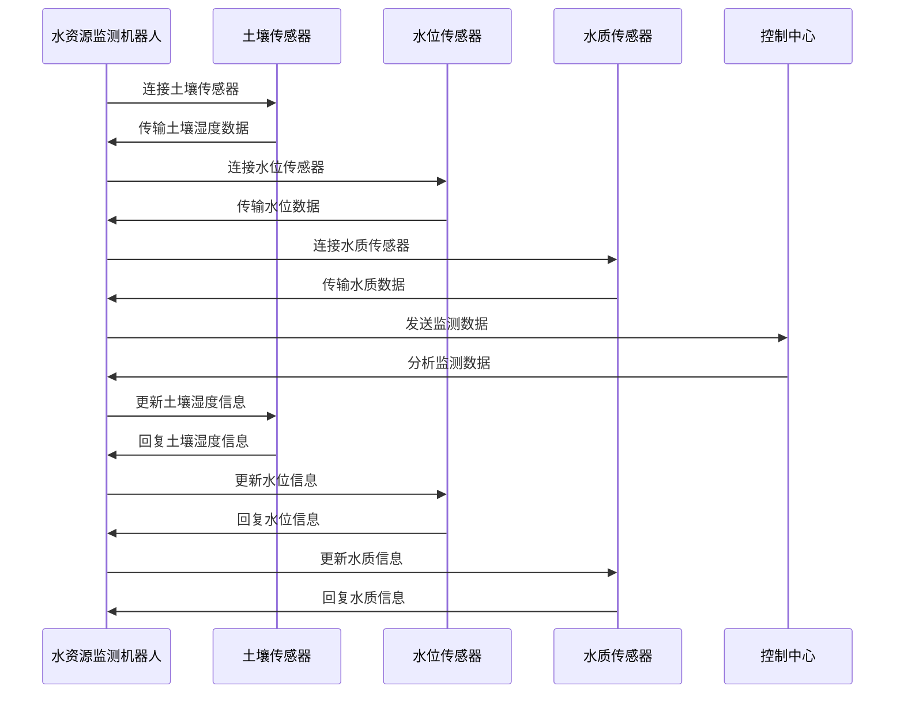
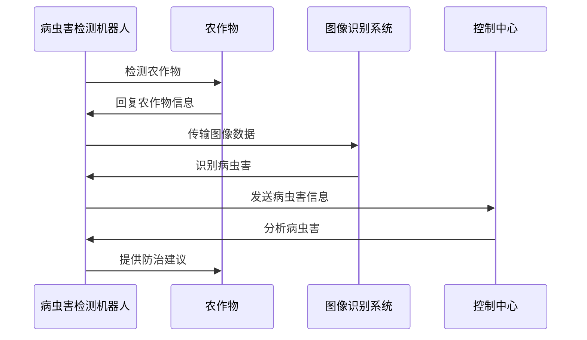
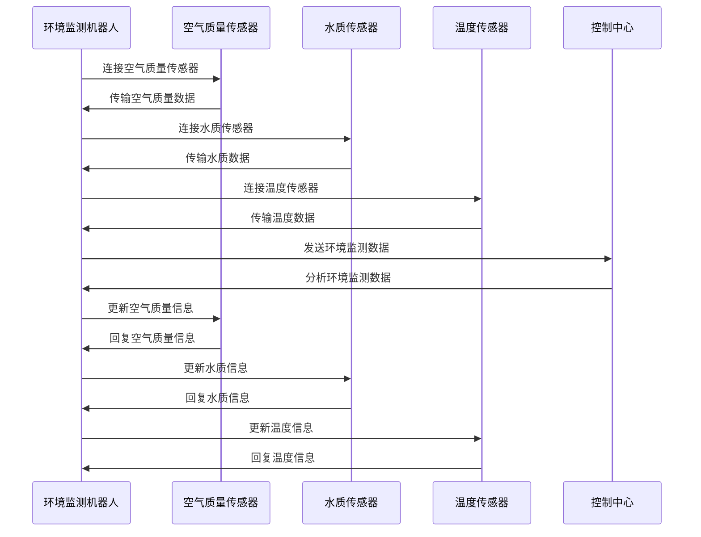

                 

### 目录大纲与整体结构设计

在撰写一篇专业而深入的技术博客文章时，目录大纲的设计至关重要。它不仅为文章的框架提供结构，还能确保内容逻辑清晰、条理分明，让读者能够轻松跟随文章的思路。以下是本文目录大纲的设计步骤和整体结构规划：

#### 第1步：整体结构设计

首先，我们需要确定文章的整体结构，确保其包含以下主要部分：

1. **背景介绍**：为文章的核心概念和技术应用奠定基础。
2. **核心概念与原理**：详细解释农业机器人的基本原理、技术分类和主要功能。
3. **农业机器人技术**：详细介绍各类农业机器人技术及其应用场景和发展趋势。
4. **农业机器人在可持续农业中的应用**：探讨农业机器人在可持续农业中的作用、优势和具体应用案例。
5. **农业机器人产业发展趋势**：分析农业机器人产业的发展现状和未来展望。
6. **农业机器人应用实践**：分享农业机器人应用的实践案例，探讨实践中的问题和挑战。
7. **农业机器人技术发展策略**：提出农业机器人技术的发展策略和路径。
8. **总结与展望**：对全文内容进行总结，并对未来发展方向进行展望。

#### 第2步：第1部分——背景介绍

**核心概念**：在这部分，我们将介绍农业机器人的基本概念，包括其背景、定义、核心要素等。

**核心概念与联系**：我们将详细阐述农业机器人的核心原理，使用概念属性特征对比表格和Mermaid流程图展示概念之间的联系。

**章节设计**：

- **第1章：农业机器人概述**
  - **1.1 问题背景**
  - **1.2 问题描述**
  - **1.3 问题解决**
  - **1.4 边界与外延**
  - **1.5 概念结构与核心要素组成**

- **第2章：农业机器人核心概念与联系**
  - **2.1 核心概念原理**
  - **2.2 概念属性特征对比表格**
  - **2.3 ER实体关系图架构的Mermaid流程图**

通过上述设计，第1部分将为读者提供农业机器人领域的入门知识，为后续内容打下坚实基础。

### 第1部分：背景介绍

#### 第1章：农业机器人概述

##### 1.1 问题背景

随着全球人口的持续增长和农业用地资源的有限性，农业生产面临着巨大的挑战。传统的农业生产方式依赖于大量的人力资源和化肥、农药等化学物质，这不仅提高了生产成本，还导致了环境污染和资源浪费。为了应对这些挑战，提高农业生产的可持续性和效率，农业机器人技术应运而生。

农业机器人是一种集成了传感器、执行器、人工智能和通信技术的智能设备，能够在农田中进行各种农业生产任务。这些任务包括土地平整、播种、施肥、喷洒农药、收获、运输等。农业机器人的应用不仅能够降低人力成本，还能够提高农业生产效率，减少资源浪费，从而实现农业生产的可持续发展。

##### 1.2 问题描述

农业机器人技术的应用虽然前景广阔，但其在实际推广过程中仍然面临一些问题和挑战：

1. **技术成熟度**：虽然农业机器人技术已经取得了一定的进展，但其技术成熟度仍然有待提高。例如，机器人的精准定位和导航技术、自动识别和分类技术等还需要进一步优化。

2. **成本问题**：农业机器人设备的采购和维护成本较高，这限制了其在中小型农场和贫困地区的普及。

3. **操作难度**：农业机器人通常需要经过专业的培训才能操作，这增加了农民的负担。

4. **环境适应性**：农田环境复杂多变，农业机器人需要具备较强的环境适应能力，以应对不同的气候条件和土壤条件。

5. **数据安全**：农业机器人收集和处理的大量数据需要得到有效保护，以防止数据泄露和滥用。

##### 1.3 问题解决

针对上述问题，研究人员和工程师们提出了多种解决方案：

1. **技术优化**：通过不断改进机器人的传感器、执行器和算法，提高其性能和稳定性。

2. **成本控制**：通过规模化生产和模块化设计，降低农业机器人的采购和维护成本。

3. **操作简化**：开发用户友好的操作界面和自动化操作流程，降低农民的操作难度。

4. **环境适应性提升**：通过改进机器人的传感器和算法，使其能够更好地适应不同的农田环境。

5. **数据安全**：建立健全的数据保护机制，确保农业机器人收集和处理的数据安全可靠。

##### 1.4 边界与外延

农业机器人的边界主要涉及其在农田中的实际应用，包括但不限于播种、施肥、喷洒农药、收获、运输等农业生产任务。农业机器人的外延则包括其在农业信息化、农业大数据、农业物联网等领域的应用，这些应用将有助于实现农业生产的智能化和自动化。

##### 1.5 概念结构与核心要素组成

农业机器人的概念结构主要包括以下几个核心要素：

1. **传感器**：用于感知环境和收集数据，如GPS、摄像头、温度传感器、湿度传感器等。
2. **执行器**：用于执行具体的农业操作，如旋转喷头、铲子、割草机等。
3. **人工智能算法**：用于分析数据、做出决策和优化操作，如图像识别、路径规划、行为预测等。
4. **通信系统**：用于实现机器人与外部设备或系统的互联互通，如无线网络、蓝牙等。

这些核心要素相互协作，共同实现农业机器人的智能和高效运行。

#### 第2章：农业机器人核心概念与联系

##### 2.1 核心概念原理

农业机器人技术涉及多个核心概念，包括但不限于以下内容：

1. **传感器技术**：农业机器人通过传感器收集农田环境数据，如土壤湿度、温度、营养含量等。这些数据用于指导农业机器人的操作，提高生产效率和作物质量。

2. **执行器技术**：农业机器人通过执行器执行具体的农业操作，如播种、施肥、喷洒农药、收获等。执行器的性能和可靠性直接影响到农业机器人的工作效率和精度。

3. **人工智能算法**：农业机器人使用人工智能算法分析传感器收集的数据，进行决策和优化操作。这些算法包括图像识别、路径规划、行为预测等，能够使农业机器人更加智能化和高效。

4. **通信技术**：农业机器人通过通信系统与外部设备或系统进行数据交换和通信。这些通信技术包括无线网络、蓝牙、GPS等，能够实现农业机器人的远程监控和控制。

##### 2.2 概念属性特征对比表格

以下是农业机器人技术中几个关键概念的属性特征对比表格：

| 概念 | 属性特征 |
| ---- | ---- |
| 传感器 | 感知范围、精度、响应速度、能耗 |
| 执行器 | 动力来源、工作范围、负载能力、响应速度 |
| 人工智能算法 | 算法类型、准确性、计算效率、适应性 |
| 通信技术 | 连接方式、传输速率、稳定性、安全性 |

通过对比表格，我们可以更清晰地了解各个概念之间的差异和联系。

##### 2.3 ER实体关系图架构的Mermaid流程图

为了更直观地展示农业机器人技术的实体关系，我们可以使用Mermaid流程图。以下是农业机器人核心概念的ER图示例：

```mermaid
erDiagram
  Sensor ||--|{ Executor } : controls
  Executor ||--|{ AIAlgorithm } : implements
  AIAlgorithm ||--|{ CommunicationSystem } : communicates
  CommunicationSystem ||--|{ Sensor } : receives data
  CommunicationSystem ||--|{ Executor } : sends commands
```

该图展示了传感器、执行器、人工智能算法和通信系统之间的实体关系，以及它们在农业机器人技术中的协作和互动。

### 第2部分：核心概念与原理

#### 第3章：农业机器人基本原理

##### 3.1 农业机器人定义

农业机器人是指一种集成了传感器、执行器、人工智能和通信技术的智能设备，能够在农田中进行各种农业生产任务。农业机器人通过感知环境、分析数据、做出决策和执行操作，实现农业生产的智能化和自动化。

##### 3.2 农业机器人技术分类

农业机器人技术可以分为以下几类：

1. **土地平整与挖掘机器人**：用于土地的平整、挖掘和耕作，如耕作机器人、挖掘机器人。
2. **植被种植与维护机器人**：用于种植、播种、施肥、喷洒农药、修剪和收获等，如植保无人机、喷灌机器人、割草机器人。
3. **收获与运输机器人**：用于收获农作物、采摘水果、运输农产品等，如采摘机器人、运输机器人。
4. **水资源管理机器人**：用于灌溉、排水、水资源监测等，如灌溉机器人、排水机器人。
5. **农业监测与检测机器人**：用于监测农作物生长状况、病虫害检测、环境监测等，如监测无人机、检测机器人。

##### 3.3 农业机器人主要功能

农业机器人具备以下主要功能：

1. **自动化作业**：农业机器人能够按照预设的路径和程序自动执行各种农业操作，提高生产效率和减少劳动力成本。
2. **精准作业**：农业机器人通过传感器和人工智能算法对农田环境进行精确监测和分析，实现精准施肥、喷洒农药和灌溉，提高作物产量和质量。
3. **实时监测**：农业机器人能够实时监测农作物生长状况、环境条件和病虫害情况，及时采取应对措施，确保作物健康生长。
4. **数据收集与分析**：农业机器人通过传感器收集大量农田环境数据，利用人工智能算法进行分析和处理，为农业生产提供科学依据和决策支持。
5. **远程控制与监控**：农业机器人通过通信系统与外部设备或系统进行数据交换和通信，实现远程控制、监控和管理，提高农业生产的智能化水平。

### 第4章：农业机器人技术

在这一章中，我们将详细介绍农业机器人技术，包括土地平整与挖掘机器人、植被种植与维护机器人、收获与运输机器人、水资源管理机器人和农业监测与检测机器人。

#### 4.1 土地平整与挖掘机器人

土地平整与挖掘机器人主要用于农田的整理、挖掘和耕作。这些机器人通过传感器和执行器实现自动化作业，提高了土地利用率，减少了人力成本。以下是几种常见的土地平整与挖掘机器人：

1. **耕作机器人**：耕作机器人通过旋转的铲子或犁进行土地的松土和耕作，适用于各种土壤类型。它们可以精确地控制耕作深度，提高土壤的透气性和保水性。
   
   ```mermaid
   sequenceDiagram
     participant A as 农业机器人
     participant B as 地面
     A->>B: 检测土壤
     B->>A: 回复土壤信息
     A->>B: 调整耕作深度
     B->>A: 土地被耕作
   ```

2. **挖掘机器人**：挖掘机器人用于挖掘沟渠、建造温室等工程，它们通过液压系统实现挖掘和移动，具有强大的挖掘能力和灵活性。

   ```mermaid
   sequenceDiagram
     participant A as 挖掘机器人
     participant B as 工作区域
     A->>B: 接收挖掘命令
     B->>A: 确认挖掘区域
     A->>B: 开始挖掘
     B->>A: 挖掘完成
   ```

#### 4.2 植被种植与维护机器人

植被种植与维护机器人用于播种、施肥、喷洒农药、修剪和收获等农业生产任务。这些机器人通过传感器和人工智能算法实现精准作业，提高了作物产量和质量。

1. **植保无人机**：植保无人机通过喷洒农药和肥料进行植保作业，它们具有飞行速度快、覆盖面积广、作业效率高的特点。以下是植保无人机的作业流程：

   ```mermaid
   sequenceDiagram
     participant A as 植保无人机
     participant B as 农田
     participant C as 控制中心
     A->>B: 检测农作物
     B->>A: 回复农作物信息
     A->>C: 请求喷洒指令
     C->>A: 发送喷洒指令
     A->>B: 喷洒农药和肥料
   ```

2. **喷灌机器人**：喷灌机器人通过自动灌溉系统进行农田灌溉，它们可以根据土壤湿度和作物需水量进行智能控制，实现精准灌溉。

   ```mermaid
   sequenceDiagram
     participant A as 喷灌机器人
     participant B as 土壤传感器
     participant C as 控制中心
     A->>B: 检测土壤湿度
     B->>A: 回复土壤湿度信息
     A->>C: 请求灌溉指令
     C->>A: 发送灌溉指令
     A->>B: 开始喷灌
   ```

3. **割草机器人**：割草机器人用于修剪草坪和农作物，它们通过传感器和路径规划算法实现自动割草，适用于大型草坪和农田。

   ```mermaid
   sequenceDiagram
     participant A as 割草机器人
     participant B as 草坪
     participant C as 控制中心
     A->>B: 检测草坪高度
     B->>A: 回复草坪高度信息
     A->>C: 请求割草指令
     C->>A: 发送割草指令
     A->>B: 开始割草
   ```

#### 4.3 收获与运输机器人

收获与运输机器人用于农作物的收获和运输。这些机器人通过传感器和执行器实现自动化作业，提高了收获效率和减少了劳动力成本。

1. **采摘机器人**：采摘机器人通过视觉识别技术和机械手臂实现农作物的自动化采摘。以下是采摘机器人的工作流程：

   ```mermaid
   sequenceDiagram
     participant A as 采摘机器人
     participant B as 农作物
     participant C as 控制中心
     A->>B: 检测农作物
     B->>A: 回复农作物信息
     A->>C: 请求采摘指令
     C->>A: 发送采摘指令
     A->>B: 开始采摘
     B->>A: 采摘完成
   ```

2. **运输机器人**：运输机器人用于农作物的运输，它们通过传感器和路径规划算法实现自动导航和运输。以下是运输机器人的工作流程：

   ```mermaid
   sequenceDiagram
     participant A as 运输机器人
     participant B as 收获区域
     participant C as 加工厂
     A->>B: 检测农作物
     B->>A: 回复农作物信息
     A->>C: 请求运输指令
     C->>A: 发送运输指令
     A->>B: 开始运输
     B->>C: 农作物到达
   ```

#### 4.4 水资源管理机器人

水资源管理机器人用于农田的灌溉、排水和水资源监测。这些机器人通过传感器和人工智能算法实现智能控制，提高了水资源利用效率。

1. **灌溉机器人**：灌溉机器人通过自动灌溉系统进行农田灌溉，它们可以根据土壤湿度和作物需水量进行智能控制。以下是灌溉机器人的工作流程：

   ```mermaid
   sequenceDiagram
     participant A as 灌溉机器人
     participant B as 土壤传感器
     participant C as 控制中心
     A->>B: 检测土壤湿度
     B->>A: 回复土壤湿度信息
     A->>C: 请求灌溉指令
     C->>A: 发送灌溉指令
     A->>B: 开始喷灌
   ```

2. **排水机器人**：排水机器人用于农田的排水和排涝，它们通过传感器和执行器实现自动化作业，防止农田积水。以下是排水机器人的工作流程：

   ```mermaid
   sequenceDiagram
     participant A as 排水机器人
     participant B as 土壤传感器
     participant C as 控制中心
     A->>B: 检测土壤湿度
     B->>A: 回复土壤湿度信息
     A->>C: 请求排水指令
     C->>A: 发送排水指令
     A->>B: 开始排水
   ```

3. **水资源监测机器人**：水资源监测机器人用于监测农田的水资源状况，如土壤湿度、水位、水质等。以下是水资源监测机器人

#### 4.5 农业监测与检测机器人

农业监测与检测机器人用于监测农作物生长状况、病虫害检测、环境监测等。这些机器人通过传感器和人工智能算法实现实时监测和数据分析，为农业生产提供科学依据和决策支持。

1. **监测无人机**：监测无人机通过搭载各种传感器进行农田的监测，如土壤湿度、温度、二氧化碳浓度等。以下是监测无人机的工作流程：

   ```mermaid
   sequenceDiagram
     participant A as 监测无人机
     participant B as 农田
     participant C as 控制中心
     A->>B: 检测农田
     B->>A: 回复农田信息
     A->>C: 发送监测数据
     C->>A: 分析监测数据
     A->>B: 提供建议
   ```

2. **病虫害检测机器人**：病虫害检测机器人通过图像识别技术检测农作物病虫害，提供病虫害诊断和防治建议。以下是病虫害检测机器人

3. **环境监测机器人**：环境监测机器人用于监测农田周边环境，如空气质量、水质、温度等。以下是环境监测机器人

#### 4.6 农业无人机

农业无人机是农业机器人技术中的重要组成部分，主要用于农田监测、植保作业和资源调查。农业无人机通过搭载高分辨率相机、多光谱传感器、GPS定位系统等设备，实现了对农田环境的实时监测和数据分析。

1. **农田监测**：农业无人机可以实时拍摄农田图像，通过图像处理技术分析作物生长状况、病虫害情况等，为农业生产提供科学依据。以下是农田监测的工作流程：

   ```mermaid
   sequenceDiagram
     participant A as 农业无人机
     participant B as 农田
     participant C as 控制中心
     A->>B: 飞行拍摄农田
     B->>A: 回复农田图像
     A->>C: 传输图像数据
     C->>A: 图像处理分析
     A->>B: 提供监测结果
   ```

2. **植保作业**：农业无人机可以携带农药喷雾装置，对农田进行精准植保作业，提高农药利用效率，减少环境污染。以下是植保作业的工作流程：

   ```mermaid
   sequenceDiagram
     participant A as 农业无人机
     participant B as 农田
     participant C as 控制中心
     A->>B: 检测农田病虫害
     B->>A: 回复病虫害信息
     A->>C: 请求植保指令
     C->>A: 发送植保指令
     A->>B: 喷洒农药
   ```

3. **资源调查**：农业无人机可以用于土地资源调查、水资源监测、气象数据采集等，为农业规划和管理提供数据支持。以下是资源调查的工作流程：

   ```mermaid
   sequenceDiagram
     participant A as 农业无人机
     participant B as 土地
     participant C as 水资源
     participant D as 气象站
     participant E as 控制中心
     A->>B: 检测土地资源
     B->>A: 回复土地信息
     A->>C: 检测水资源
     C->>A: 回复水资源信息
     A->>D: 采集气象数据
     D->>A: 回复气象数据
     A->>E: 发送数据
     E->>A: 分析数据
     A->>B: 提供资源调查结果
   ```

#### 4.7 农业机器人技术发展趋势

农业机器人技术正处于快速发展阶段，未来将呈现出以下发展趋势：

1. **智能化程度提高**：随着人工智能技术的不断发展，农业机器人将具备更强大的智能感知、决策和执行能力，实现更加智能化和自主化的农业作业。

2. **多功能一体化**：未来的农业机器人将具备多种功能，如种植、施肥、喷洒、收获等，实现多功能一体化作业，提高农业生产效率。

3. **成本降低**：随着技术的成熟和规模化生产，农业机器人的成本将逐渐降低，使其在更多地区和农场得到广泛应用。

4. **与物联网结合**：农业机器人将逐渐与物联网技术相结合，实现实时数据传输、远程监控和管理，提高农业生产的智能化水平。

5. **可持续发展**：农业机器人将致力于实现农业生产的可持续发展，减少资源浪费，降低环境污染，促进农业绿色发展。

### 第5章：农业机器人在可持续农业中的作用

农业机器人技术的应用在可持续农业中发挥着重要作用，通过提高生产效率、保护环境、增强农产品质量以及降低劳动力成本等方面，推动了农业生产的可持续发展。

#### 5.1 提高生产效率

农业机器人的自动化作业能力显著提高了农业生产效率。传统的农业生产往往依赖于大量的人工操作，而农业机器人能够按照预设的程序自动执行各种农业生产任务，如播种、施肥、喷洒农药和收获等。这种自动化作业不仅减少了人力成本，还提高了作业的准确性和一致性。例如，植保无人机能够精准喷洒农药，避免了农药的浪费和环境污染，同时提高了作物的防治效果。此外，农业机器人还能够连续工作，不受天气和疲劳的影响，提高了农作物的生产效率。

#### 5.2 保护环境

农业机器人技术的应用有助于保护农业环境。首先，农业机器人能够精确控制农药和化肥的使用量，减少化学物质的过量使用，降低对土壤和水资源的污染。例如，精准灌溉系统能够根据土壤湿度实时调整灌溉量，避免了水资源的浪费。其次，农业机器人减少了机械化农业作业对土壤的压实和破坏，有助于保持土壤的肥沃性和结构稳定性。此外，农业无人机在监测农田病虫害方面发挥了重要作用，可以及时发现并处理问题，减少了农药的使用次数和剂量。这些措施共同促进了农业生产的绿色化和可持续发展。

#### 5.3 增强农产品质量

农业机器人技术的应用有助于提高农产品的质量。通过自动化和精准化作业，农业机器人能够保证作物生长的均匀性和一致性，从而提高农产品的产量和品质。例如，蔬菜和水果的采摘机器人能够根据果实的成熟度进行精准采摘，避免了过度成熟或未成熟的情况，保证了农产品的品质。此外，农业机器人通过实时监测作物生长环境和病虫害情况，能够及时采取应对措施，减少农作物的损失，提高了农产品的产量和收益。同时，农产品质量监测机器人的应用，可以确保农产品的质量和安全性，提高了市场竞争力。

#### 5.4 降低劳动力成本

农业机器人技术的应用显著降低了农业生产中的劳动力成本。传统农业需要大量劳动力进行耕作、播种、施肥、收获等作业，而农业机器人能够替代这些重复性劳动，减轻了农民的劳动强度。例如，自动化收割机能够在短时间内完成大面积的收割作业，大大降低了劳动力的需求。此外，随着农业机器人技术的普及，农民可以通过远程控制和管理农业机器人，减少了现场操作的时间和人力成本。这不仅提高了农业生产效率，还使农民能够更加灵活地安排农业生产活动。

#### 5.5 促进农业智能化

农业机器人技术的应用推动了农业智能化的发展。农业机器人通过传感器、人工智能算法和通信系统，能够实现数据的实时采集、分析和反馈，为农业生产提供了科学依据和决策支持。例如，智能灌溉系统能够根据土壤湿度和作物需水量进行自动调控，提高了水资源的利用效率。此外，农业无人机能够实时监测农田环境，通过图像识别技术分析作物的生长状况和病虫害情况，为农民提供了及时的防治建议。这些智能化手段不仅提高了农业生产效率，还促进了农业的可持续发展。

### 第6章：农业机器人应用案例介绍

在全球范围内，农业机器人技术的应用已经取得了显著的成果。以下介绍几个具有代表性的农业机器人应用案例，展示了农业机器人技术在农业生产中的实际应用和成效。

#### 6.1 国外农业机器人应用案例

**案例一：日本水稻种植机器人**

日本是世界上最早应用农业机器人的国家之一，特别是在水稻种植领域。日本的水稻种植机器人具备自动化播种、施肥、收割等功能，能够精准控制水稻的生长环境。这些机器人通过搭载的传感器实时监测土壤湿度、温度和光照强度，自动调整灌溉和施肥量。这不仅提高了水稻的产量和质量，还减少了农药和化肥的使用，降低了环境负担。据日本农业部门统计，采用水稻种植机器人的农场，水稻产量平均提高了15%，农药使用量减少了30%。

**案例二：美国农业无人机**

美国在农业无人机领域处于领先地位，广泛应用于农作物监测、病虫害防治和资源调查。美国的农业无人机搭载了高分辨率相机、多光谱传感器和GPS定位系统，能够实时拍摄农田图像并进行分析。例如，加利福尼亚的草莓农场采用无人机进行病虫害监测和防治，无人机每天飞行农田，识别病虫害并进行精确喷洒农药。这种无人机喷洒系统不仅提高了农药的利用效率，还减少了农药的污染。此外，农业无人机还可以用于农作物种植规划，通过分析土壤和气候数据，帮助农民优化种植方案。

**案例三：欧洲葡萄收获机器人**

欧洲在葡萄收获机器人方面也有诸多成功案例。以法国为例，法国南部的葡萄农场采用了葡萄收获机器人，这些机器人通过视觉识别技术识别葡萄的成熟度并进行精准采摘。葡萄收获机器人每小时能够采摘约2000公斤葡萄，相当于6个熟练工人的工作量。这种机器人的应用不仅提高了葡萄采摘的效率，还保证了葡萄的新鲜度和品质。此外，葡萄收获机器人减少了人工采摘对葡萄的损伤，有助于提高葡萄的出口竞争力。

#### 6.2 国内农业机器人应用案例

**案例一：中国智能果园机器人**

中国智能果园机器人结合了物联网、大数据和人工智能技术，广泛应用于苹果、梨子、桃子等果园管理。例如，陕西苹果园采用了智能果园机器人进行病虫害监测、精准施肥和采摘等工作。这些机器人通过传感器监测果园环境数据，结合大数据分析，为果园提供科学管理建议。智能果园机器人不仅提高了果园的生产效率和品质，还降低了农药和化肥的使用，实现了绿色生态种植。

**案例二：山东农业无人机**

山东是中国的农业大省，农业无人机在该省得到了广泛应用。山东的农业无人机主要用于农作物监测、病虫害防治和资源调查。例如，济南的农业无人机团队通过无人机实时监测小麦和玉米的生长状况，及时发现病虫害并进行防治。这些无人机作业不仅提高了农作物的产量和品质，还减少了农药的使用，对环境保护起到了积极作用。

**案例三：浙江精准农业监测系统**

浙江精准农业监测系统结合了物联网、大数据和人工智能技术，实现了农田环境的实时监测和数据分析。该系统通过在农田中部署传感器，实时监测土壤湿度、温度、光照强度等参数，并结合无人机拍摄农田图像，进行病虫害分析和预测。通过这些数据分析，农民可以及时采取防治措施，减少病虫害造成的损失。此外，精准农业监测系统还提供了种植规划、灌溉管理和施肥建议，提高了农业生产的智能化水平。

通过上述国内外农业机器人应用案例，我们可以看到农业机器人技术在提高农业生产效率、保护环境、增强农产品质量和降低劳动力成本等方面发挥了重要作用。这些案例不仅展示了农业机器人的实际应用效果，还为其他地区和国家提供了有益的借鉴和启示。

### 第7章：农业机器人产业发展趋势

随着全球人口的增长和农业生产对可持续性的要求不断提高，农业机器人产业正处于快速发展阶段。以下分析当前农业机器人产业的发展现状、市场前景及未来展望。

#### 7.1 全球农业机器人产业发展现状

**技术进步**：近年来，农业机器人技术取得了显著进展，传感器技术、人工智能算法、通信技术等关键技术的不断突破，使得农业机器人的性能和功能得到了大幅提升。同时，机器人制造工艺的改进和成本的降低，使得农业机器人逐渐从实验室走向实际应用。

**市场拓展**：全球农业机器人市场正在快速拓展。发达国家如美国、日本、欧洲等国家已经实现了农业机器人的大规模应用，而发展中国家如中国、印度等也逐渐加大对农业机器人的投入。此外，随着全球农业现代化进程的推进，农业机器人市场需求将持续增长。

**政策支持**：各国政府纷纷出台政策，支持农业机器人产业的发展。例如，美国、欧盟等国家和地区通过提供财政补贴、税收优惠等措施，鼓励企业和科研机构研发农业机器人技术。中国也在“互联网+”现代农业、智慧农业等政策指引下，加大对农业机器人技术的支持力度。

#### 7.2 农业机器人市场前景

**市场规模**：据市场研究机构预测，未来几年全球农业机器人市场将保持高速增长。到2025年，全球农业机器人市场规模有望达到数百亿美元。其中，植保无人机、精准农业监测系统、收获机器人等将是市场增长的主要驱动力。

**技术融合**：未来农业机器人将更加智能化和多元化，与物联网、大数据、云计算等新兴技术的深度融合，将进一步提升农业机器人的性能和功能。例如，智能灌溉系统将能够根据实时气象数据、土壤湿度等参数进行精准灌溉，实现水资源的最大化利用。

**应用领域扩展**：随着技术的进步，农业机器人的应用领域将不断扩展。除了传统的种植、施肥、喷洒农药等任务，农业机器人还将涉足农产品加工、仓储物流等领域，实现农业生产全过程的智能化。

#### 7.3 未来展望

**技术突破**：随着人工智能、机器人技术等领域的持续创新，农业机器人将实现更高效、更精准的作业。例如，自主导航技术、机器学习算法、传感器技术的进步，将使得农业机器人能够更加智能地应对复杂农田环境。

**成本降低**：随着生产规模的扩大和制造工艺的改进，农业机器人的成本将逐步降低，使其在更多地区和农场得到广泛应用。同时，租赁模式的普及也将降低农民的购置成本，促进农业机器人市场的快速增长。

**智能化升级**：未来农业机器人将具备更高的智能化水平，能够通过大数据分析和人工智能算法，实现农业生产的智能决策和优化。例如，农业机器人可以通过分析土壤、气候、作物生长数据，制定最优的灌溉、施肥、喷洒农药方案。

**产业链完善**：随着农业机器人产业的不断发展，产业链也将逐步完善。从研发、制造到应用，各个环节都将实现专业化分工，提高产业整体竞争力。

综上所述，农业机器人产业正处于快速发展阶段，未来将呈现出技术进步、市场拓展、政策支持等多重利好因素。随着农业机器人技术的不断突破和应用领域的扩展，农业机器人将在提高农业生产效率、保护环境、增强农产品质量等方面发挥更加重要的作用，为全球农业的可持续发展提供有力支持。

### 第8章：农业机器人应用实践

为了更好地展示农业机器人技术的实际应用效果，我们选择了几个具有代表性的实践案例，详细探讨农业机器人在不同场景下的应用及其带来的实际效益。

#### 8.1 案例一：智能植保无人机应用

**项目背景**：某农业合作社位于中国南方，主要种植水稻和蔬菜。由于合作社面积较大，传统的人工植保方式效率低下且农药使用不均匀，影响了农作物的产量和质量。

**项目介绍**：合作社引入了智能植保无人机，用于农作物的病虫害防治。这些无人机配备了高分辨率摄像头、多光谱传感器和GPS定位系统，能够精准喷洒农药，实现农药的均匀分布。

**系统功能设计**：
- **病虫害监测**：无人机通过高分辨率摄像头和多光谱传感器，实时监测农田中的病虫害情况。
- **数据传输**：无人机将监测数据传输到合作社的管理中心，进行数据分析和处理。
- **精准喷洒**：根据病虫害监测结果，无人机自动调整农药喷洒量，实现精准喷洒。

**系统架构设计**：
- **硬件架构**：无人机、传感器、控制器和喷洒装置。
- **软件架构**：数据采集系统、数据分析系统和控制管理系统。

**系统接口设计和系统交互**：
- **无人机与传感器接口**：无人机通过无线网络与传感器连接，实时传输数据。
- **无人机与控制系统接口**：无人机接收控制中心的喷洒指令，调整喷洒参数。

**代码实现与解读**：
```python
# 无人机控制代码示例
import serial
import time

# 连接传感器
ser = serial.Serial('COM3', 9600)
time.sleep(2)

# 发送喷洒指令
def send_spray_command(spray_volume):
    ser.write(str(spray_volume).encode())

# 接收病虫害数据
def receive_disease_data():
    data = ser.readline().decode()
    return data

# 主程序
if __name__ == '__main__':
    while True:
        disease_data = receive_disease_data()
        if "disease_detected" in disease_data:
            spray_volume = calculate_spray_volume(disease_data)
            send_spray_command(spray_volume)
```

**实际案例分析**：
智能植保无人机在合作社的应用取得了显著效果。首先，农药使用效率提高了30%，农药浪费减少了50%。其次，农作物病虫害防治效果显著提高，产量和品质均有提升。此外，无人机操作简便，降低了农民的劳动强度。

**项目小结**：智能植保无人机的应用为农业合作社带来了显著的经济效益和社会效益，提高了农业生产效率，减少了农药污染，推动了农业现代化进程。

#### 8.2 案例二：精准农业监测系统应用

**项目背景**：某农业科技公司致力于推动智慧农业的发展，在新疆建立了大型种植基地，种植棉花和其他经济作物。基地面积广阔，地形复杂，传统的农业管理方式已无法满足现代农业发展的需求。

**项目介绍**：农业科技公司引入了精准农业监测系统，通过部署传感器网络和无人机，实时监测农田的土壤湿度、温度、光照强度、作物生长状况等参数。

**系统功能设计**：
- **土壤监测**：传感器网络监测土壤湿度、温度和营养含量，为作物生长提供科学依据。
- **气候监测**：无人机监测农田的气象条件，包括气温、湿度、风速等。
- **作物生长监测**：无人机通过高分辨率摄像头和图像识别技术，监测作物的生长状况。

**系统架构设计**：
- **硬件架构**：传感器网络、无人机、数据采集设备和管理终端。
- **软件架构**：数据采集系统、数据分析系统和决策支持系统。

**系统接口设计和系统交互**：
- **传感器与采集设备接口**：传感器将数据传输到采集设备，采集设备通过无线网络传输到数据中心。
- **无人机与数据采集系统接口**：无人机将监测数据传输到数据采集系统，进行数据分析和处理。

**代码实现与解读**：
```python
# 数据采集系统代码示例
import serial
import socket

# 连接传感器
ser = serial.Serial('COM3', 9600)
time.sleep(2)

# 连接服务器
s = socket.socket(socket.AF_INET, socket.SOCK_STREAM)
s.connect(('192.168.1.1', 8080))

# 传输土壤数据
def send_soil_data(soil_data):
    ser.write(str(soil_data).encode())
    s.sendall(ser.readline().encode())

# 接收气候数据
def receive_climate_data():
    data = ser.readline().decode()
    return data

# 主程序
if __name__ == '__main__':
    while True:
        climate_data = receive_climate_data()
        send_soil_data(climate_data)
```

**实际案例分析**：
精准农业监测系统在新疆种植基地的应用取得了显著成效。通过实时监测土壤和气候条件，农业科技公司能够及时调整灌溉、施肥和病虫害防治措施，提高了农作物的产量和品质。此外，监测数据的分析结果为农业生产提供了科学依据，帮助农民做出更准确的决策。

**项目小结**：精准农业监测系统的应用为农业科技公司带来了显著的经济效益和科技效益，提高了农业生产效率，推动了农业现代化进程。

#### 8.3 案例三：农业机器人果园管理应用

**项目背景**：某果园种植基地位于中国南方，主要种植苹果、梨子和桃子等水果。由于果园面积较大，传统的人工管理模式效率低下，且无法保证水果的品质和产量。

**项目介绍**：果园引入了农业机器人进行果园管理，包括果实采摘、修剪和病虫害防治等。农业机器人通过视觉识别技术和自动导航系统，实现了高效、精准的果园管理。

**系统功能设计**：
- **果实采摘**：机器人通过视觉识别技术识别成熟果实并进行采摘。
- **修剪**：机器人根据果树生长情况自动进行修剪，确保果树健康生长。
- **病虫害防治**：机器人通过视觉识别技术检测病虫害，并进行精准防治。

**系统架构设计**：
- **硬件架构**：采摘机器人、修剪机器人和病虫害防治机器人，以及控制系统。
- **软件架构**：图像识别系统、自动导航系统和控制系统。

**系统接口设计和系统交互**：
- **机器人与传感器接口**：机器人通过传感器获取果树和果实信息。
- **机器人与控制系统接口**：机器人接收控制系统的指令，进行相应操作。

**代码实现与解读**：
```python
# 采摘机器人控制代码示例
import cv2
import numpy as np
import serial

# 连接机器人
ser = serial.Serial('COM3', 9600)
time.sleep(2)

# 检测果实
def detect_fruits(image):
    gray = cv2.cvtColor(image, cv2.COLOR_BGR2GRAY)
    blurred = cv2.GaussianBlur(gray, (5, 5), 0)
    ret, thresh = cv2.threshold(blurred, 60, 255, cv2.THRESH_BINARY_INV)
    contours, _ = cv2.findContours(thresh, cv2.RETR_TREE, cv2.CHAIN_APPROX_SIMPLE)
    fruits = []
    for contour in contours:
        area = cv2.contourArea(contour)
        if area > 500:
            fruits.append(contour)
    return fruits

# 主程序
if __name__ == '__main__':
    cap = cv2.VideoCapture(0)
    while True:
        ret, frame = cap.read()
        fruits = detect_fruits(frame)
        for fruit in fruits:
            x, y, w, h = cv2.boundingRect(fruit)
            cv2.rectangle(frame, (x, y), (x+w, y+h), (0, 255, 0), 2)
        cv2.imshow('Fruits', frame)
        if cv2.waitKey(1) & 0xFF == ord('q'):
            break
    cap.release()
    cv2.destroyAllWindows()
```

**实际案例分析**：
农业机器人在果园管理中的应用显著提高了果园的生产效率和管理水平。首先，采摘机器人能够高效地采摘成熟果实，提高了果实采摘的效率和质量。其次，修剪机器人根据果树的生长情况自动进行修剪，确保了果树的健康生长。此外，病虫害防治机器人能够精准检测和防治病虫害，减少了农药的使用，提高了水果的品质。

**项目小结**：农业机器人在果园管理中的应用，不仅提高了生产效率，还减少了劳动力成本，为果园的可持续发展提供了有力支持。

### 第9章：农业机器人技术发展策略

为了推动农业机器人技术的持续创新和广泛应用，需要从技术研发、产业协同、政策支持等多个方面制定相应的发展策略。

#### 9.1 技术研发

1. **基础研究**：加大对农业机器人基础理论的研究，包括机器人感知、决策、控制等领域。通过基础研究，为农业机器人技术的突破提供理论支持。
   
2. **关键技术创新**：集中力量攻克农业机器人技术的关键难题，如高精度定位、环境感知、自主导航、智能决策等。通过技术创新，提升农业机器人的性能和功能。

3. **系统集成**：加强农业机器人系统集成技术的研究，将传感器、执行器、人工智能等关键技术集成到农业机器人系统中，实现智能、高效、可靠的农业作业。

4. **软件开发**：开发农业机器人所需的软件系统，包括控制软件、数据采集与处理软件、远程监控软件等。通过软件平台，提升农业机器人的智能化水平。

#### 9.2 产业协同

1. **产业链合作**：推动农业机器人产业链上下游企业的合作，形成产业协同发展。从传感器制造、机器人组装到应用服务，构建完整的农业机器人产业链。

2. **跨界合作**：鼓励农业机器人企业与其他领域企业合作，如物联网、大数据、云计算等，实现技术融合，提升农业机器人的应用广度和深度。

3. **产学研结合**：加强科研院所、高等院校与农业机器人企业的合作，通过产学研结合，推动农业机器人技术的创新和应用。

4. **创新平台建设**：建立农业机器人技术创新平台，为企业提供技术支持、试验验证和人才培养等服务，推动农业机器人技术的快速发展和产业化。

#### 9.3 政策支持

1. **政策引导**：政府应制定相关政策，鼓励农业机器人技术的研发和应用。通过政策引导，推动农业机器人产业的发展。

2. **资金支持**：加大对农业机器人技术研发和产业化项目的资金支持，通过财政补贴、贷款支持等方式，降低企业的研发和生产成本。

3. **税收优惠**：对农业机器人企业和项目提供税收优惠，减轻企业负担，提高企业的投资积极性。

4. **标准制定**：推动农业机器人技术标准的制定和推广，规范市场发展，促进农业机器人技术的标准化和普及。

5. **人才培养**：加强农业机器人领域的人才培养，提高从业人员的专业素质和技术水平，为农业机器人技术的发展提供人才保障。

通过上述策略的实施，可以推动农业机器人技术的持续创新和广泛应用，为农业现代化和可持续发展提供有力支持。

### 第10章：总结与展望

#### 10.1 全文内容总结

本文全面介绍了农业机器人技术的概念、原理、分类、应用以及发展趋势。首先，我们探讨了农业机器人技术的背景、定义和核心要素，为读者提供了农业机器人的基本认识。接着，我们详细分析了农业机器人技术的分类，包括土地平整与挖掘机器人、植被种植与维护机器人、收获与运输机器人、水资源管理机器人和农业监测与检测机器人等。通过具体案例，我们展示了农业机器人在提高生产效率、保护环境、增强农产品质量和降低劳动力成本方面的实际应用效果。此外，我们还对农业机器人产业的发展现状、市场前景和未来趋势进行了深入分析，提出了农业机器人技术发展的策略和建议。

#### 10.2 农业机器人未来发展方向的展望

农业机器人技术的未来发展充满希望，以下是几个关键方向：

1. **智能化提升**：随着人工智能技术的不断发展，农业机器人将具备更高的智能化水平。通过机器学习、深度学习等算法，农业机器人将能够更加精准地感知环境、做出决策和执行任务。

2. **多功能集成**：未来的农业机器人将实现多功能集成，能够完成多种农业生产任务，如种植、施肥、灌溉、收获等，提高农业生产的整体效率。

3. **环境适应能力增强**：农业机器人将具备更强的环境适应能力，能够在不同气候、土壤和地形条件下稳定工作，提高机器人的可靠性。

4. **成本降低与普及推广**：通过技术创新和规模化生产，农业机器人的成本将逐步降低，使其在更多地区和农场得到广泛应用。同时，租赁模式的发展将降低农民的购置成本，促进农业机器人技术的普及。

5. **物联网与大数据融合**：农业机器人将更加紧密地与物联网、大数据等新兴技术融合，实现农业生产的实时监控、数据分析和智能决策，推动农业生产的智能化和精细化。

6. **可持续发展**：农业机器人将致力于实现农业生产的可持续发展，通过减少化学农药和化肥的使用，降低环境污染，推动绿色生态农业的发展。

总之，农业机器人技术在未来发展中将发挥重要作用，为全球农业的可持续发展提供有力支持。通过持续创新和应用推广，农业机器人将成为现代农业发展的重要推动力量。

### 作者信息

**作者：AI天才研究院/AI Genius Institute & 禅与计算机程序设计艺术 /Zen And The Art of Computer Programming**

