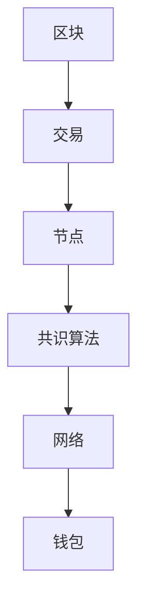

                 

### 文章标题

**区块链在二手商品交易中的应用：建立信任机制**

随着区块链技术的不断发展和普及，其在各行各业的应用场景也日益丰富。二手商品交易作为电子商务的一个重要组成部分，面临着信任缺失、信息不对称、交易风险等问题。本文将探讨区块链技术在二手商品交易中的具体应用，通过构建可信的交易环境，解决交易中的信任问题。文章将从区块链的基本概念出发，逐步深入分析其在二手商品交易中的优势和挑战，并通过具体的案例分析和技术实现，展示区块链在建立信任机制中的重要作用。

### 关键词

- 区块链
- 二手商品交易
- 信任机制
- 去中心化
- 智能合约
- 数字身份认证
- 资产追踪

### 摘要

本文首先介绍了区块链技术的核心概念，包括去中心化、分布式账本、共识算法等，分析了区块链技术在解决二手商品交易中的信任问题上的潜在优势。接着，本文探讨了区块链在二手商品交易中的应用场景，如身份验证、资产追踪、交易保障等，并分析了如何利用区块链技术解决当前交易中存在的痛点。通过案例分析，本文展示了区块链技术在实际应用中的效果。最后，本文讨论了区块链技术在二手商品交易中的应用前景，提出了未来可能面临的挑战和解决方案。

### 引言

#### 区块链技术的起源与发展

区块链技术起源于2008年，由一位化名为中本聪（Satoshi Nakamoto）的匿名人士提出，并首次应用于比特币（Bitcoin）这一数字货币的系统中。区块链技术的基本原理是通过分布式账本的方式，实现去中心化的数据记录和验证，从而避免了对中心化机构的依赖。区块链由一系列按时间顺序排列的“区块”组成，每个区块都包含一定数量的交易记录，并通过密码学方法进行链接和验证，形成一条不可篡改的数据链条。

区块链技术的发展经历了几个关键阶段。最初，区块链仅应用于数字货币领域，如比特币、以太坊等。随着技术的成熟和应用的拓展，区块链开始进入金融、供应链管理、医疗保健、物联网等多个领域。特别是在2017年，区块链热潮席卷全球，各国政府、企业和科研机构纷纷投入巨资进行研究和应用。

#### 区块链技术的重要性

区块链技术之所以能够引起广泛关注，主要源于其具备的以下几大特性：

1. **去中心化**：区块链通过分布式网络进行数据存储和验证，无需依赖中心化的权威机构，从而提高了系统的可靠性和抗攻击能力。

2. **数据不可篡改**：区块链通过加密算法和共识机制，确保数据的真实性和不可篡改性，这对于需要高信任度的应用场景尤为重要。

3. **透明性和可追溯性**：区块链上的数据对所有网络参与者都是可见的，用户可以随时查询和验证交易记录，提高了交易的透明度和可追溯性。

4. **智能合约**：区块链上的智能合约是一种自动执行的合约，当满足特定条件时，合约会自动执行相应的操作，从而减少了人为干预和操作成本。

#### 区块链技术在二手商品交易中的潜力

二手商品交易市场具有巨大的商业潜力，但同时也面临着诸多挑战，如交易信任问题、资产真伪鉴别、交易风险控制等。区块链技术恰好能够在这些方面提供有效的解决方案：

1. **信任机制**：通过区块链技术，可以建立一套可信的交易机制，确保交易双方的身份真实性和交易记录的不可篡改。

2. **资产追踪**：区块链技术可以实现商品的全生命周期追踪，从生产、流通到最终消费，确保商品的来源和流向清晰可查。

3. **降低交易成本**：区块链技术通过去中心化和自动化交易，可以降低交易中的中介成本，提高交易效率。

4. **风险控制**：区块链上的智能合约可以自动执行交易规则，减少欺诈和违约行为，提高交易安全性。

综上所述，区块链技术不仅为二手商品交易提供了新的思路和工具，也为建立可信的交易环境提供了可能。本文将深入探讨区块链技术在二手商品交易中的应用，分析其在解决信任问题、提高交易效率等方面的优势。

#### 当前二手商品交易市场的现状

二手商品交易市场近年来呈现出快速增长的趋势，特别是在互联网的推动下，各类二手交易平台如雨后春笋般涌现。从线上到线下，二手商品交易市场已经形成了一个庞大的生态体系。

首先，在线上市场中，二手商品交易平台主要包括闲鱼、淘宝二手、转转、58同城等。这些平台通过移动互联网技术，为用户提供了便捷的买卖渠道。用户可以通过拍照上传商品信息，并通过平台进行交易。在线交易的优势在于方便快捷，用户覆盖面广，交易流程简单，同时也便于平台进行交易管理和风险控制。然而，由于线上交易的匿名性，交易双方难以核实对方的真实身份，存在一定程度的信任问题。

其次，在线下市场中，二手商品交易主要发生在二手商店、跳蚤市场、车库销售等场所。线下交易的优势在于商品的真实性和直观性，用户可以直接看到和检查商品，减少了信息不对称的风险。然而，线下交易也存在一定的局限性，如交易地点分散、交易流程复杂、安全风险较高等。

#### 当前交易中的问题与挑战

尽管二手商品交易市场发展迅速，但在实际操作中仍面临着诸多问题和挑战，主要体现在以下几个方面：

1. **信任问题**：二手商品交易过程中，买卖双方之间存在信息不对称，卖家可能隐瞒商品的瑕疵或历史信息，买家则可能担心遇到欺诈行为。这种信任缺失导致了交易效率的降低和交易风险的增加。

2. **资产真伪鉴别**：二手商品往往存在真伪鉴别难题，特别是对于高端品牌商品或珍贵物品，买家往往难以判断商品的真伪，从而增加了交易风险。

3. **交易风险**：二手商品交易涉及到支付、物流等多个环节，存在支付风险、物流风险等。例如，买家可能担心支付后无法收到商品，卖家可能担心商品损坏或丢失。

4. **交易成本**：传统的二手商品交易流程中，中介机构往往扮演着重要的角色，交易双方需要支付一定的中介费用。这不仅增加了交易成本，也降低了交易的便捷性。

#### 区块链技术的优势

区块链技术在解决上述问题方面具有显著的优势：

1. **建立信任机制**：区块链通过去中心化和不可篡改的特性，为交易双方建立了一个可信的数字身份认证体系，确保交易信息的真实性和透明性，从而缓解了信任问题。

2. **资产追踪**：区块链可以记录商品的全生命周期信息，包括生产、流通、消费等各个环节，实现商品的全生命周期追踪，提高商品的透明度和可信度。

3. **降低交易成本**：区块链的去中心化特性减少了中介机构的参与，降低了交易成本。同时，区块链上的智能合约可以自动执行交易规则，减少了人工干预和操作成本。

4. **风险控制**：区块链上的智能合约可以自动执行交易规则，确保交易的合法性、规范性和安全性，减少欺诈和违约行为。

#### 区块链在二手商品交易中的应用

综上所述，区块链技术在解决二手商品交易中的信任问题、资产真伪鉴别、交易风险、交易成本等方面具有显著的优势。通过建立可信的交易环境，区块链技术为二手商品交易市场的发展提供了新的可能。接下来，本文将详细探讨区块链在二手商品交易中的应用场景，分析其在实际操作中的具体实现方法。

#### 区块链的核心概念

区块链技术作为一项颠覆性的创新，其背后的核心概念对于理解其在二手商品交易中的应用至关重要。以下是区块链技术的主要核心概念：

1. **分布式账本**：区块链通过分布式账本的方式存储数据。分布式账本意味着数据被分散存储在多个节点上，每个节点都保存了一份完整的账本。这种分布式存储方式避免了中心化节点可能面临的单点故障和被攻击的风险，提高了系统的可靠性和抗攻击能力。

2. **去中心化**：去中心化是区块链技术的一个重要特性。传统系统通常依赖于一个中心化的权威机构来管理数据，而区块链通过分布式网络和共识机制来实现数据的自我管理和验证，去除了对中心化节点的依赖。这使得区块链上的数据更加透明、可信和抗攻击。

3. **共识算法**：共识算法是区块链网络中节点达成一致的关键机制。不同类型的区块链采用不同的共识算法，例如比特币使用的是工作量证明（Proof of Work，PoW）算法，以太坊则采用了权益证明（Proof of Stake，PoS）算法。共识算法确保了区块链网络中的所有节点能够在数据存储和验证方面达成一致，保证了系统的稳定性和安全性。

4. **加密技术**：区块链通过密码学技术对数据进行加密和签名，确保数据的完整性和保密性。每个交易记录都被加密，只有持有相应私钥的用户才能解密和验证交易。这种加密机制不仅保护了用户隐私，也防止了数据的篡改和欺诈行为。

5. **智能合约**：智能合约是一种自动执行合约的计算机程序，它运行在区块链网络上。当满足特定的条件时，智能合约会自动执行相应的操作，例如转移资产、记录交易等。智能合约的出现减少了人为干预和操作成本，提高了交易的效率和安全性。

6. **数据不可篡改**：区块链通过密码学和共识算法确保数据的不可篡改性。一旦数据被记录在区块链上，它将永久保存，并且无法被单方面修改。这使得区块链成为一个高度可信的数据记录系统，特别适用于需要高信任度的应用场景。

通过理解这些核心概念，我们可以更深入地理解区块链技术的工作原理和优势，从而更好地探讨其在二手商品交易中的应用。

#### 区块链的基本架构

要深入了解区块链技术，我们需要首先了解其基本架构。区块链的基本架构主要包括以下几部分：

1. **区块**：区块链由一系列按时间顺序排列的区块组成。每个区块包含一定数量的交易记录，并有一个唯一的标识符（如哈希值）。区块通过前一个区块的哈希值进行链接，形成一条不可篡改的数据链条。

2. **交易**：交易是区块链上的基本操作单元，表示资金的转移、资产的交换或其他价值转移行为。交易记录会被打包进区块中，并在区块链上进行验证和存储。

3. **节点**：节点是区块链网络中的参与者和维护者。节点负责验证和存储区块链上的数据，并通过共识算法参与区块链的维护和扩展。在分布式网络中，每个节点都保存了一份完整的区块链副本。

4. **共识算法**：共识算法是区块链网络中节点达成一致的关键机制。不同类型的区块链采用不同的共识算法，如比特币的工作量证明（PoW）算法和以太坊的权益证明（PoS）算法。共识算法确保了区块链网络中的所有节点能够在数据存储和验证方面达成一致。

5. **网络**：区块链通过分布式网络进行通信。节点之间通过特定的协议进行数据交换和验证，确保区块链的一致性和安全性。

6. **钱包**：钱包是用户存储和管理区块链资产的工具。钱包包含用户的公钥和私钥，用于进行交易和验证身份。

通过这些基本架构组成部分，区块链实现了去中心化的数据存储和验证，确保了数据的完整性和不可篡改性。以下是一个简化的区块链架构示意图：



在这个架构中，区块和交易是数据存储和传输的核心，节点负责数据验证和存储，共识算法确保网络中的所有节点达成一致，网络实现节点之间的通信，钱包则用于用户的资产管理和交易。

#### 公共链和私有链的区别

区块链技术根据网络结构和数据访问权限的不同，可以分为公共链和私有链。这两种链在应用场景、安全性、去中心化程度等方面存在显著差异。

**公共链**：

1. **定义**：公共链（Public Blockchain）是任何人都可以参与的区块链，任何人都可以下载完整的节点软件并加入网络，成为节点。公共链的数据是公开透明的，所有交易记录和链上信息对所有参与者都是可见的。

2. **特点**：
   - **去中心化**：公共链高度去中心化，节点分散在全球各地，不存在中心化的控制节点，这使得公共链具有较高的抗攻击能力和可靠性。
   - **安全性**：由于大量节点的参与和验证，公共链上的数据具有较高的安全性和不可篡改性。
   - **透明性**：公共链上的所有交易记录和数据都是透明的，用户可以随时查看和验证。

3. **应用场景**：公共链适用于需要高度去中心化和透明性的应用场景，如数字货币、智能合约平台、去中心化金融（DeFi）等。

**私有链**：

1. **定义**：私有链（Private Blockchain）是一种由特定组织或实体控制和维护的区块链，只有被授权的节点可以参与网络，访问链上的数据。

2. **特点**：
   - **中心化**：私有链的去中心化程度较低，通常由一个或多个实体控制，这些实体对链上的数据和交易有完全的控制权。
   - **安全性**：由于节点的数量和范围有限，私有链相对于公共链来说安全性较高，因为攻击者需要攻破的节点数量较少。
   - **隐私性**：私有链上的数据对非授权节点通常是保密的，这使得私有链适用于需要较高隐私保护的应用场景。

3. **应用场景**：私有链适用于对数据隐私和安全性要求较高的场景，如企业内部的数据管理、供应链管理、金融交易等。

**区别**：

- **参与权限**：公共链开放给所有用户，任何人都可以加入网络成为节点；私有链则需要获得特定组织的授权才能参与。
- **数据透明性**：公共链的数据是透明的，所有参与者都可以访问和验证；私有链的数据通常是保密的，只有授权节点可以查看。
- **去中心化程度**：公共链去中心化程度高，节点分布广泛；私有链去中心化程度低，通常由一个或多个实体控制。
- **安全性和可靠性**：公共链由于节点数量众多，抗攻击能力较强，但安全性仍面临一定风险；私有链安全性较高，但依赖于控制节点的稳定性和可靠性。

**选择**：

选择公共链还是私有链取决于具体应用的需求和场景。公共链适用于需要高度去中心化和透明性的应用，如数字货币和公共数据平台；私有链适用于需要较高隐私保护和安全性的场景，如企业内部管理和金融交易。

#### 区块链上的资产数字化

在区块链技术中，资产的数字化是实现去中心化交易和存储的关键。资产数字化指的是将实体资产转化为数字形式，并在区块链上进行记录和交易。以下是对资产数字化原理、实现方法以及其在区块链上的价值传递机制的详细解析。

**数字化原理**

资产数字化的基本原理是将资产转化为数字资产（Digital Asset），使其能够在区块链上被记录和交易。具体步骤如下：

1. **资产定义**：首先，需要明确要数字化的资产类型，如货币、股票、债券、商品等。每种资产都有其特定的属性和特征，这些信息需要被编码和记录在区块链上。

2. **资产编码**：将资产的信息编码为数字形式，这通常涉及到区块链上的智能合约。智能合约是一种自动执行合同条款的计算机程序，它可以定义资产的属性、所有权转移规则等。

3. **资产上链**：将编码后的资产信息上传到区块链上，形成一个不可篡改的记录。这个记录包含了资产的所有权信息、交易历史、状态变更等。

4. **资产交易**：通过区块链网络，资产可以在不同的参与者之间进行交易。每次交易都会更新区块链上的资产记录，确保所有权的转移是透明和可追溯的。

**实现方法**

资产数字化的实现方法主要包括以下几步：

1. **智能合约开发**：智能合约是资产数字化的核心组件。开发者需要根据资产类型和需求，设计智能合约的代码，包括资产定义、所有权转移规则、状态变更逻辑等。

2. **链上存储**：将智能合约部署到区块链上，并确保其能够正确运行。区块链网络中的节点会存储智能合约的代码和状态，并对其进行验证。

3. **用户身份验证**：为了保证资产交易的安全性，需要对用户进行身份验证。通常，用户需要使用数字身份（如数字钱包地址）进行交易，并使用私钥进行签名验证。

4. **交易执行**：当用户发起交易请求时，智能合约会根据预设的逻辑执行交易，更新区块链上的资产记录。交易过程中，所有节点都会验证交易的有效性，确保交易符合链上规则。

**价值传递机制**

区块链上的资产数字化实现了一种新型的价值传递机制，其主要特点如下：

1. **去中心化**：资产在区块链上的交易不依赖中心化机构，而是通过分布式网络进行，这使得价值传递更加去中心化和透明。

2. **不可篡改**：区块链上的资产记录具有不可篡改的特性，确保了资产的所有权和交易历史的真实性和可信性。

3. **透明可追溯**：区块链上的所有交易记录都是公开透明的，用户可以随时查询和验证资产的历史交易记录，提高了交易的透明度和可信度。

4. **自动化执行**：智能合约可以自动执行资产交易规则，减少了人为干预和操作成本，提高了交易的效率和安全性。

通过资产数字化，区块链不仅实现了实体资产向数字资产的转变，也为去中心化交易和价值传递提供了一种全新的机制，为金融、供应链管理、商品交易等领域带来了巨大的创新潜力。

#### 区块链在二手商品交易中的应用

区块链技术在二手商品交易中的应用为建立一个透明、可信、高效的交易环境提供了新的解决方案。以下是区块链在二手商品交易中的几个主要应用场景：

**1. 信任机制的建立**

区块链通过去中心化和不可篡改的特性，为二手商品交易提供了信任基础。每个交易记录都记录在区块链上，不可篡改且可追溯，使得买卖双方能够验证交易的真实性和合法性。

- **身份验证**：区块链可以通过数字身份认证技术，确保交易双方的身份真实可靠。用户通过注册数字身份，获取唯一的公钥和私钥，用于进行交易验证和身份确认。
- **交易记录**：每一次交易都会在区块链上生成一个不可篡改的记录，包括交易的详细信息、时间戳、参与方等信息。这使得交易过程透明，买卖双方都可以查询和验证交易记录。

**2. 资产追踪与真伪鉴别**

区块链技术可以实现商品的全生命周期追踪，从生产、流通到最终消费，确保商品的来源和流向清晰可查。这对于二手商品的真伪鉴别尤为重要。

- **供应链溯源**：通过区块链，可以记录商品从生产到最终销售的所有环节信息，如生产日期、产地、批次、运输路径等。这样，买家可以轻松验证商品的来源和真伪。
- **智能合约应用**：智能合约可以用于验证商品的真伪。例如，当买家购买一件二手商品时，智能合约可以自动执行检测程序，验证商品的真伪，并将结果记录在区块链上。

**3. 降低交易成本**

区块链的去中心化特性减少了传统交易中中介机构的参与，降低了交易成本。通过智能合约自动执行交易规则，买卖双方可以快速、安全地完成交易，减少了繁琐的手续和费用。

- **自动执行交易规则**：智能合约可以自动执行交易规则，例如支付、退换货、争议解决等，减少了人工干预和操作成本。
- **减少中介费用**：区块链上的交易不需要通过第三方中介机构，买卖双方可以直接进行交易，从而减少了中介费用。

**4. 风险控制与交易保障**

区块链技术通过记录所有交易行为，实现了对交易的全程监控和风险控制。智能合约可以自动触发交易保障机制，减少欺诈和违约行为。

- **智能合约触发机制**：当交易过程中出现违约行为或欺诈行为时，智能合约可以自动执行相应的惩罚措施，例如冻结资产、退款等。
- **争议解决**：区块链上的交易记录不可篡改，可以作为证据用于解决交易纠纷。通过智能合约，可以快速、公正地解决交易争议。

**5. 提高交易效率**

区块链技术的去中心化和自动化特性，大大提高了交易效率。交易过程无需人工干预，减少了交易时间，提高了交易频率。

- **交易速度快**：区块链上的交易可以通过分布式网络快速完成，交易确认时间远远短于传统金融系统。
- **高频交易**：由于交易过程无需人工干预，区块链可以实现高频交易，提高了市场的流动性。

通过以上应用场景，区块链技术为二手商品交易提供了一个安全、高效、透明的交易环境，解决了传统交易中的信任问题、成本问题、风险问题等，推动了二手商品交易市场的发展。

#### 建立信任机制的具体步骤

在二手商品交易中，建立信任机制是保障交易顺利进行的关键。区块链技术通过一系列步骤和机制，为买卖双方提供了可信的交易环境。以下是建立信任机制的具体步骤和详细解释：

**1. 身份验证**

身份验证是建立信任机制的第一步。通过区块链技术，可以为交易双方创建数字身份，确保交易的真实性和合法性。

- **数字身份创建**：用户在参与交易前，需要创建一个数字身份，包括公钥和私钥。公钥用于验证交易，私钥用于签名和授权操作。
- **多因素认证**：除了公钥和私钥，还可以采用多因素认证（如密码、短信验证码、生物识别等），进一步确保用户身份的安全性和唯一性。
- **信任网络**：通过区块链上的信任网络，用户可以验证其他用户的身份信息。例如，用户A可以通过区块链查询用户B的历史交易记录，了解B的信用状况。

**2. 交易记录**

交易记录是建立信任机制的核心部分。区块链上的每一笔交易都会生成一个不可篡改的记录，确保交易的可追溯性和透明性。

- **交易数据结构**：每个交易记录包含交易双方的身份信息、交易内容、时间戳、交易哈希值等详细信息。这些信息确保了交易记录的完整性和准确性。
- **分布式存储**：交易记录会在区块链上的多个节点进行分布式存储，防止数据丢失和篡改。每个节点都保存了一份完整的交易记录，提高了系统的可靠性。
- **公开透明**：区块链上的交易记录对所有参与者都是公开透明的，用户可以随时查询和验证交易记录，确保交易的透明性。

**3. 资产追踪**

资产追踪是确保商品真实性和完整性的重要手段。通过区块链技术，可以实现对商品的全生命周期追踪，从生产、流通到消费，确保商品的来源和流向清晰可查。

- **溯源机制**：区块链可以记录商品的生产日期、生产批次、产地、运输路径等详细信息。买家可以通过区块链查询商品的历史信息，验证商品的真实性。
- **加密保护**：区块链上的数据通过加密技术进行保护，只有拥有相应私钥的用户才能解密和查看数据，确保数据的隐私性和安全性。
- **不可篡改性**：区块链上的交易记录一旦生成，就不可篡改，确保了商品信息的真实性和完整性。

**4. 争议解决**

在交易过程中，难免会出现争议和纠纷。区块链技术提供了一套公正、高效的争议解决机制，帮助买卖双方快速解决争议。

- **智能合约**：智能合约可以自动执行交易规则，减少人为干预和操作成本。当交易发生纠纷时，智能合约可以根据预设的规则自动执行相应的操作，如退款、资产冻结等。
- **去中心化仲裁**：区块链上的争议解决通常采用去中心化的仲裁机制，由多个节点共同参与仲裁。这种方式减少了中心化机构的依赖，提高了仲裁的公正性和效率。
- **不可篡改记录**：区块链上的争议解决记录是公开透明的，可以作为证据用于后续的法律诉讼和仲裁，确保争议解决的公正性和可信性。

通过以上步骤和机制，区块链技术为二手商品交易建立了一套完整的信任机制，解决了传统交易中的信任问题，提高了交易的安全性和效率。

#### 身份验证在区块链上的应用

在区块链技术中，身份验证是确保交易安全性和可信度的关键环节。通过数字身份认证，区块链可以建立用户可信身份，保障交易的合法性和透明性。以下是身份验证在区块链上的应用原理、步骤和安全性分析。

**数字身份认证原理**

数字身份认证基于非对称加密算法，每个用户都拥有一个公钥和一个私钥。公钥用于验证身份，私钥用于签名和授权操作。区块链上的身份认证通常涉及以下几个基本步骤：

1. **公钥注册**：用户在区块链网络中注册数字身份时，会生成一对公钥和私钥，并将公钥上链，存储在区块链上。
2. **身份验证**：当用户发起交易请求时，可以使用公钥进行身份验证。交易对手方可以通过区块链查询用户的公钥，验证其身份。
3. **签名和授权**：用户使用私钥对交易信息进行签名，确保交易信息不被篡改。交易对手方可以使用用户的公钥验证签名，确认交易的合法性和有效性。

**身份验证步骤**

身份验证在区块链上的具体步骤通常包括以下几步：

1. **用户注册**：用户在区块链平台上注册账号，获取一个唯一的用户标识符（如用户ID）和对应的公钥。注册过程中，用户可能需要提供一定身份证明，如身份证件、手机号码等，确保用户身份的真实性。
2. **身份认证**：用户在每次交易前，需要通过身份认证机制验证身份。例如，用户可以通过输入密码、指纹或面部识别等手段进行身份验证，确保交易的安全性。
3. **交易签名**：用户对交易信息进行签名，生成数字签名。数字签名包含交易内容和用户的私钥信息，确保交易信息的完整性和唯一性。
4. **验证签名**：交易对手方在接收交易请求时，使用用户的公钥验证数字签名，确认交易信息的合法性和有效性。如果签名验证通过，交易即可进行。

**安全性分析**

区块链上的数字身份认证具有较高的安全性，主要表现在以下几个方面：

1. **不可篡改性**：区块链上的交易记录一旦生成，就不可篡改。这意味着用户的身份信息一旦上链，就具有永久性和不可篡改性，确保了身份信息的真实性和可靠性。
2. **加密保护**：用户身份信息通过非对称加密算法进行加密保护，只有持有相应私钥的用户才能解密和查看身份信息，确保了身份信息的隐私性和安全性。
3. **多因素认证**：区块链上的身份认证通常采用多因素认证（如密码、生物识别等），进一步提高了认证的安全性。
4. **去中心化**：区块链的去中心化特性使得身份验证机制不受中心化机构的控制，减少了被攻击和篡改的风险。

总之，数字身份认证在区块链上的应用，通过一系列加密和验证机制，确保了交易的安全性和可信度，为区块链技术在二手商品交易中的应用提供了可靠的基础。

#### 资产追踪和溯源的实现

资产追踪和溯源是区块链技术在二手商品交易中的一项重要应用，通过记录商品的全生命周期信息，确保商品的来源和流通过程透明、可追溯。以下是资产追踪和溯源的实现原理、流程和区块链技术的具体应用。

**实现原理**

资产追踪和溯源的基本原理是将商品的全生命周期信息上链，通过区块链的分布式账本和不可篡改性，实现信息的透明和可追溯。

1. **信息记录**：将商品的各类信息，如生产日期、生产批次、产地、生产厂商、运输路径、流通环节等，逐一记录在区块链上，形成一个完整的信息链条。
2. **不可篡改**：区块链上的数据一旦上链，就具有不可篡改的特性，任何节点都无法单方面修改数据，确保信息的真实性和完整性。
3. **信息共享**：区块链上的信息对所有节点都是透明的，用户可以通过区块链查询商品的历史信息和当前状态，实现信息的共享和公开。

**实现流程**

资产追踪和溯源的实现通常包括以下几个步骤：

1. **信息录入**：商品的生产和流通环节，相关方将商品的信息录入区块链。例如，生产厂商可以在商品生产完成后，将生产日期、批次、产地等基本信息上链。
2. **信息更新**：商品在流通过程中，如经过物流运输、分销商销售等环节，相关信息也会被实时更新到区块链上。每个环节的相关方都需要在区块链上记录和确认信息的更新。
3. **信息查询**：用户在购买商品时，可以通过区块链查询商品的全生命周期信息，了解商品的来源、流通路径、历史交易记录等。
4. **信息验证**：区块链上的信息可以通过多种方式进行验证，如通过时间戳确保信息的先后顺序，通过加密算法保护信息的隐私性和安全性，通过共识算法确保数据的正确性和一致性。

**区块链技术应用**

区块链技术在资产追踪和溯源中的应用，主要体现在以下几个方面：

1. **智能合约**：智能合约可以自动执行资产追踪和溯源的规则。例如，当商品信息录入区块链时，智能合约可以自动验证信息的完整性，确保数据的真实性和一致性。
2. **分布式账本**：区块链的分布式账本技术，确保了商品信息在多个节点上存储和备份，提高了系统的可靠性和抗攻击能力。
3. **加密技术**：区块链采用加密技术对数据进行保护，只有拥有相应私钥的用户才能解密和查看数据，确保数据的隐私性和安全性。
4. **共识算法**：区块链的共识算法确保了网络中的所有节点在数据记录和验证方面达成一致，保证了系统的稳定性和安全性。

通过上述实现原理、流程和区块链技术应用，我们可以看出，区块链技术为资产追踪和溯源提供了透明、可追溯、安全可靠的解决方案，有效提升了二手商品交易的可信度和透明度。

#### 保险合同与智能合约在二手商品交易中的具体应用

在区块链技术的支持下，保险合同和智能合约在二手商品交易中得到了广泛应用，大大提高了交易的安全性和效率。以下是保险合同与智能合约在二手商品交易中的具体应用场景、流程和优势分析。

**1. 应用场景**

- **商品损坏赔偿**：在二手商品交易过程中，买家可能担心商品在运输过程中损坏，可以通过购买保险来保障权益。
- **质量问题退款**：买家购买二手商品后，如果发现商品存在质量问题，可以要求退款。智能合约可以自动执行退款操作。
- **交易纠纷解决**：当买卖双方在交易过程中出现纠纷时，智能合约可以基于预设的规则自动执行相应的解决措施，如冻结资产、退款等。

**2. 流程**

- **保险购买**：买家在购买二手商品时，可以通过区块链平台购买相关保险。购买过程中，智能合约会记录保险条款、保险金额、保险期限等信息。
- **保险理赔**：当商品在运输过程中损坏或存在质量问题时，买家可以通过智能合约发起理赔申请。智能合约会根据保险条款自动验证理赔申请的有效性，并执行理赔操作。
- **交易纠纷**：当买卖双方在交易过程中出现纠纷时，买家或卖家可以通过智能合约发起争议。智能合约会根据预设的规则自动执行争议解决程序，例如资产冻结、退款等。

**3. 优势分析**

- **自动化处理**：智能合约可以自动执行保险理赔和交易纠纷解决等操作，减少了人工干预和操作成本，提高了处理效率。
- **透明可追溯**：区块链上的所有交易记录都是公开透明的，用户可以随时查询和验证交易记录，确保了交易的透明性和可信度。
- **减少欺诈行为**：智能合约可以自动执行交易规则和保险条款，减少了人为干预和操作空间，降低了欺诈和违约行为的风险。
- **降低交易成本**：通过智能合约和区块链技术，可以减少传统交易中中介机构的参与，降低了交易成本，提高了交易的便捷性。

通过上述应用场景、流程和优势分析，我们可以看到，保险合同与智能合约在二手商品交易中的应用，不仅提高了交易的安全性和效率，也为买卖双方提供了一个更加透明和可信的交易环境。

#### 常见的区块链共识算法及其工作原理

区块链的核心在于其共识算法，共识算法决定了区块链网络中的节点如何就数据一致性达成一致。以下是几种常见的区块链共识算法及其工作原理：

**1. 工作量证明（Proof of Work, PoW）**

工作量证明是最早应用于比特币的共识算法。其基本原理是网络中的节点通过解决计算难题来竞争生成新区块。以下是PoW的工作流程：

- **节点竞争**：每个节点同时尝试计算一个哈希值，使得该值满足一定的难度要求。
- **计算难度**：网络通过调整目标值，确保每个区块生成的平均时间维持在预设值。
- **记账权**：最先计算出满足要求的哈希值的节点，将获得记账权，生成新区块并将其添加到区块链上。
- **奖励机制**：成功生成区块的节点可以获得一定的奖励，通常包括交易费和新区块产生的币。

**2. 权益证明（Proof of Stake, PoS）**

权益证明是对PoW算法的一种改进，通过持有币的数量和时间来决定节点的记账权。以下是PoS的工作流程：

- **权益计算**：节点根据持有的币数量和锁定时间计算其权益值。权益值越高，节点获得记账权的概率越大。
- **随机性选择**：系统通过随机性算法选择下一个生成区块的节点。
- **记账权**：被选中的节点负责生成新区块，并获得相应的奖励。
- **奖励机制**：节点生成区块后，可以获得交易费和新区块产生的币作为奖励。

**3. 软决策证明（Proof of Elapsed Time, PoET）**

软决策证明是一种基于概率的共识算法，旨在提高网络的吞吐量和降低计算成本。以下是PoET的工作流程：

- **时间戳**：系统为每个节点分配一个时间戳，表示节点可以发起提案的时间。
- **随机性**：系统通过随机性算法选择一个时间窗口，只有时间戳在该窗口内的节点可以发起提案。
- **提案**：时间窗口内的节点尝试生成新区块，最先成功生成的节点获得记账权。
- **奖励机制**：成功生成区块的节点获得奖励，同时系统逐渐减小时间窗口，提高网络吞吐量。

**4. 拜占庭容错（Byzantine Fault Tolerance, BFT）**

拜占庭容错算法是一种针对拜占庭问题的共识算法，能够在网络中存在恶意节点的情况下，确保系统的一致性和安全性。以下是BFT的工作流程：

- **权益分配**：节点根据其权益值分配角色，如投票者、验证者、拜占庭节点等。
- **区块生成**：投票者生成区块，验证者对区块进行验证和投票。
- **共识达成**：当超过2/3的验证者投票通过，区块即被确认并添加到区块链上。
- **奖励机制**：成功生成和验证区块的节点获得奖励。

通过了解这些常见的区块链共识算法，我们可以更好地理解区块链网络如何实现数据一致性和安全性，为区块链技术在二手商品交易中的应用提供了理论基础。

#### 不同区块链共识算法的比较

在区块链技术中，共识算法是确保区块链网络中所有节点就数据一致性达成一致的关键机制。不同的共识算法在性能、安全性、去中心化程度等方面存在显著差异。以下是几种常见共识算法的比较，包括其在性能、安全性和去中心化方面的表现。

**1. 工作量证明（Proof of Work, PoW）**

- **性能**：PoW算法的性能受到计算资源的影响，节点需要大量计算资源来解决复杂的数学问题，以确保新区块的生成。
- **安全性**：PoW算法通过高计算难度确保了区块链的安全性，恶意节点需要耗费大量资源才能对网络进行攻击。
- **去中心化**：PoW算法具有较高的去中心化程度，任何拥有计算能力的节点都可以参与网络。

**2. 权益证明（Proof of Stake, PoS）**

- **性能**：PoS算法的性能优于PoW算法，因为节点不需要进行复杂的计算，只需持有足够的权益币即可参与共识过程。
- **安全性**：PoS算法的安全性取决于权益分配机制，如果权益分配不合理，可能导致恶意节点掌控大部分权益。
- **去中心化**：PoS算法的去中心化程度相对较低，因为节点的权益决定了其参与共识的概率。

**3. 拜占庭容错（Byzantine Fault Tolerance, BFT）**

- **性能**：BFT算法的性能非常高，可以在短时间内达成共识，适用于对性能要求较高的应用场景。
- **安全性**：BFT算法能够处理拜占庭错误，确保系统的一致性和安全性。
- **去中心化**：BFT算法的去中心化程度相对较低，因为节点数量有限，且权益分配对共识结果有重要影响。

**4. Delegated Proof of Stake (DPoS)**

- **性能**：DPoS算法在性能上优于PoS算法，通过委托机制减少了实际参与共识的节点数量，提高了共识效率。
- **安全性**：DPoS算法的安全性取决于委托人的信誉和权益分配机制，如果委托人不诚实，可能导致系统安全问题。
- **去中心化**：DPoS算法的去中心化程度较高，但实际参与共识的节点数量较少。

**5. Proof of Authority (PoA)**

- **性能**：PoA算法在性能上非常高，因为共识节点是预先选定的，共识过程无需随机选择。
- **安全性**：PoA算法的安全性依赖于共识节点的信誉和道德，如果共识节点存在恶意行为，可能导致系统安全问题。
- **去中心化**：PoA算法的去中心化程度较低，因为共识节点是由特定实体选定的。

综上所述，不同的共识算法在性能、安全性和去中心化方面各有优缺点，选择合适的共识算法需要根据具体应用场景和需求进行权衡。

#### 不同类型区块链的技术特点

区块链技术根据网络结构和数据访问权限的不同，主要分为公共链（Public Blockchain）、私有链（Private Blockchain）和联盟链（Consortium Blockchain）三种类型。以下是这些不同类型区块链的技术特点及其适用场景：

**1. 公共链（Public Blockchain）**

- **技术特点**：
  - **去中心化**：公共链具有较高的去中心化程度，任何节点都可以参与网络，不存在中心化的控制节点。
  - **开放性**：公共链的数据对所有节点都是公开透明的，任何人都可以访问和验证。
  - **安全性**：公共链通常采用工作量证明（PoW）或权益证明（PoS）等共识算法，确保系统的安全性和不可篡改性。
  - **高效性**：公共链的效率取决于网络的规模和共识算法，通常不如私有链和联盟链高效。

- **适用场景**：
  - **数字货币**：如比特币、以太坊等，公共链是数字货币的理想选择，因为去中心化和透明性。
  - **去中心化应用（DApps）**：公共链适用于去中心化应用，如金融、供应链管理、医疗保健等领域。

**2. 私有链（Private Blockchain）**

- **技术特点**：
  - **中心化或部分去中心化**：私有链通常由一个组织或企业控制，节点数量有限，去中心化程度较低。
  - **封闭性**：私有链的数据访问权限受到限制，通常仅限于特定的组织或成员。
  - **安全性**：私有链通常采用私有共识算法，如拜占庭容错（BFT）等，确保系统的安全性和可控性。
  - **高效性**：私有链在交易处理速度和性能上通常优于公共链，因为网络规模和节点数量较小。

- **适用场景**：
  - **企业内部应用**：如企业供应链管理、内部数据管理、金融交易等，私有链能够确保数据的安全性和可控性。
  - **特定行业应用**：如医疗保健、房地产、政府监管等，私有链适用于对数据访问权限有严格要求的场景。

**3. 联盟链（Consortium Blockchain）**

- **技术特点**：
  - **部分去中心化**：联盟链由多个组织或企业共同参与和管理，节点数量和权限由联盟成员协商确定。
  - **开放性与封闭性的结合**：联盟链在联盟成员之间是开放的，但对于非成员通常是封闭的。
  - **安全性和效率**：联盟链采用共识算法，如PoS或BFT，以确保数据的安全性和高效性。
  - **灵活性**：联盟链可以根据联盟成员的需求进行定制，灵活性较高。

- **适用场景**：
  - **跨组织合作**：如供应链管理、跨境贸易、金融联盟等，联盟链能够促进不同组织之间的合作和数据共享。
  - **公共服务**：如城市交通管理、公共资源管理、公共服务平台等，联盟链适用于需要多方合作和高效管理的场景。

通过了解不同类型区块链的技术特点，我们可以根据具体应用场景和需求选择合适的区块链解决方案，以实现最佳的性能和安全性。

#### 区块链在二手商品交易中的应用案例分析

为了更好地理解区块链技术如何解决二手商品交易中的信任问题，以下通过几个实际案例，展示区块链在二手商品交易中的应用效果。

**案例一：二手奢侈品交易**

奢侈品市场因其高价值和假货问题，一直以来都是二手商品交易的一个难点。区块链技术通过记录商品的全生命周期信息，实现了对奢侈品真伪的全程追踪。

- **应用场景**：用户在购买二手奢侈品时，可以通过区块链查询商品的生产信息、流通路径、历史交易记录等。
- **效果**：通过区块链，用户可以轻松验证商品的真实性，降低了购买假货的风险。同时，卖家也因此获得了更高的信任度，提高了成交率。

**案例二：二手汽车交易**

二手汽车交易过程中，车辆的维修历史、事故记录等信息往往难以获取，导致买家无法全面了解车辆的状况。区块链技术提供了有效的解决方案。

- **应用场景**：车辆的生产厂商、维修店、二手车经销商等都可以将车辆的维修记录、事故记录等信息记录在区块链上。
- **效果**：买家在购买二手车时，可以轻松查询车辆的历史信息，全面了解车辆的状况。这大大降低了信息不对称带来的风险，提高了交易的透明度和可信度。

**案例三：二手电子产品交易**

电子产品市场存在大量翻新和二手设备质量不透明的问题，区块链技术通过智能合约和数字身份认证，解决了这些问题。

- **应用场景**：卖家在销售二手电子产品时，可以通过区块链记录设备的生产信息、维修记录、使用状况等，买家可以通过区块链验证设备的真实信息。
- **效果**：区块链上的智能合约可以确保交易过程自动化执行，减少了人为干预和操作空间，降低了欺诈和违约行为。同时，数字身份认证确保了卖家和买家的真实身份，提高了交易的安全性和可信度。

**案例四：二手家具交易**

二手家具交易过程中，家具的材质、生产日期、流通历史等信息对于买家来说至关重要。区块链技术通过记录这些信息，提供了透明的交易环境。

- **应用场景**：家具厂商、二手家具经销商等可以将家具的生产信息、流通路径、材质认证等记录在区块链上。
- **效果**：买家在购买二手家具时，可以轻松查询家具的历史信息，确保家具的真实和质量。这提高了交易的透明度和可信度，也减少了买家的疑虑和担忧。

通过这些实际案例，我们可以看到，区块链技术在解决二手商品交易中的信任问题方面具有显著的优势。无论是奢侈品、汽车、电子产品还是家具，区块链技术都能够提供可靠的数据记录和透明可追溯的交易环境，提高了交易的安全性和效率。

#### 区块链技术在二手商品交易中的技术实现

区块链技术在二手商品交易中的应用不仅需要解决信任问题，还需要实现高效、安全的技术实现。以下将详细讨论区块链技术在二手商品交易中的具体实现方法，包括技术框架、开发工具和关键技术。

**1. 技术框架**

区块链技术在二手商品交易中的技术框架主要包括区块链网络、智能合约、数字身份认证和资产追踪系统。以下是这些组件的具体功能：

- **区块链网络**：作为基础架构，区块链网络负责数据的存储和传输。它通常由多个节点组成，每个节点都存储了一份完整的区块链账本，并通过共识算法确保数据的一致性和安全性。
- **智能合约**：智能合约是自动化执行的计算机程序，用于定义和执行交易规则。在二手商品交易中，智能合约可以自动处理交易的验证、支付、交付等环节，减少人为干预，提高交易效率。
- **数字身份认证**：数字身份认证用于验证交易双方的身份。通过非对称加密算法和数字签名技术，区块链可以为用户创建唯一的数字身份，确保交易的安全性和可信度。
- **资产追踪系统**：资产追踪系统用于记录商品的全生命周期信息，包括生产、流通、交易等环节。区块链上的不可篡改特性确保了商品信息的真实性和完整性。

**2. 开发工具**

实现区块链技术在二手商品交易中的开发，需要一系列开发工具和框架。以下是几种常用的工具：

- **区块链平台**：如Ethereum、Hyperledger Fabric、EOS等，这些平台提供了创建和部署智能合约的环境，并支持多种编程语言。
- **开发框架**：如Truffle、Ganache等，这些框架用于智能合约的开发和测试，提供了一系列开发工具和库。
- **数字身份认证工具**：如OpenID Connect、JWT（JSON Web Token）等，这些工具用于实现用户的数字身份认证，确保交易的安全性。
- **前端开发框架**：如React、Vue.js等，这些框架用于开发用户界面，提供交互式体验。

**3. 关键技术**

区块链技术在二手商品交易中的实现，依赖于以下关键技术：

- **智能合约开发**：智能合约是区块链技术的核心组件，用于定义和执行交易规则。开发者需要根据具体的业务需求，使用Solidity、Go、Java等编程语言编写智能合约代码。
- **加密技术**：区块链技术通过加密算法保护数据的隐私和完整性。常见的加密算法包括SHA-256、RSA、AES等，用于数据加密、数字签名和身份认证。
- **共识算法**：共识算法决定了区块链网络中节点如何达成一致。选择合适的共识算法，可以确保区块链网络的性能、安全性和去中心化程度。常见的共识算法包括PoW、PoS、BFT等。
- **数据存储**：区块链技术使用分布式账本存储数据。为了提高数据存储和检索效率，可以采用分片技术、去重技术等。

**示例实现**

以下是一个简单的区块链智能合约示例，用于实现二手商品交易的基本流程：

```solidity
// SPDX-License-Identifier: MIT
pragma solidity ^0.8.0;

contract SecondHandTrading {

    // 商品信息结构体
    struct Product {
        uint id;
        string name;
        address owner;
        string serialNumber;
        bool sold;
    }

    // 商品信息映射
    mapping(uint => Product) public products;

    // 添加商品
    function addProduct(uint id, string memory name, string memory serialNumber) public {
        products[id] = Product(id, name, msg.sender, serialNumber, false);
    }

    // 设置商品已售出
    function sellProduct(uint id) public {
        require(products[id].owner == msg.sender, "您不是该商品的所有者");
        require(!products[id].sold, "该商品已售出");
        
        products[id].sold = true;
        // 执行支付、交付等后续操作
    }

    // 查询商品信息
    function getProduct(uint id) public view returns (string memory name, string memory serialNumber, address owner, bool sold) {
        Product memory product = products[id];
        return (product.name, product.serialNumber, product.owner, product.sold);
    }
}
```

通过这个示例，我们可以看到，智能合约定义了商品信息结构体、添加商品、设置商品已售出以及查询商品信息等基本功能，实现了二手商品交易的基本流程。

综上所述，区块链技术在二手商品交易中的实现，需要构建一个完善的技术框架，选择合适的开发工具和关键技术，并通过智能合约实现交易规则。这不仅提高了交易的安全性和透明度，也为二手商品交易市场带来了新的机遇。

#### 技术实现细节

在区块链技术实现二手商品交易时，以下技术细节至关重要，包括环境搭建、系统核心代码实现、代码应用解读与分析以及实际案例分析。

**1. 环境搭建**

要搭建区块链环境，首先需要选择一个适合的开发框架和平台。我们以Hyperledger Fabric为例，这是一个企业级分布式账本框架，支持多种编程语言和共识算法。

- **安装依赖**：在开发环境中安装Hyperledger Fabric所需的依赖库，如Go语言环境、Docker、Kubernetes等。
- **创建网络**：使用Hyperledger Fabric提供的脚手架工具，创建一个基础的区块链网络，包括订单节点（Orderer）和组织节点（Peer）。
- **配置文件**：配置网络中的节点参数，如节点地址、加密证书、链码（Chaincode）路径等。

**2. 系统核心代码实现**

在Hyperledger Fabric中，链码（Chaincode）是智能合约的实现方式。以下是实现二手商品交易链码的基本步骤：

- **定义链码结构**：定义链码的输入参数和输出结果，包括商品ID、商品名称、所有者地址等。
- **实现交易逻辑**：编写链码代码，实现添加商品、验证身份、商品交易等交易逻辑。
- **部署链码**：在区块链网络中部署链码，使其能够在节点上运行。

以下是一个简单的链码实现示例：

```go
package main

import (
    "fmt"
    "github.com/hyperledger/fabric-chaincode-go/shim"
    "github.com/hyperledger/fabric-chaincode-go/util"
)

type SecondHandTrading struct {
}

// 定义链码初始化函数
func (t *SecondHandTrading) Init(ctx shim.ChaincodeStubInterface) ([]byte, error) {
    return nil, nil
}

// 添加商品
func (t *SecondHandTrading) AddProduct(ctx shim.ChaincodeStubInterface, args []string) ([]byte, error) {
    productID := args[0]
    productName := args[1]
    owner := args[2]

    // 存储商品信息
    util.SetState(ctx, productID, []byte(productName+":"+owner))

    return []byte("商品添加成功"), nil
}

// 交易商品
func (t *SecondHandTrading) TradeProduct(ctx shim.ChaincodeStubInterface, args []string) ([]byte, error) {
    productID := args[0]
    buyer := args[1]

    // 获取商品信息
    productBytes, err := ctx.GetState(productID)
    if err != nil {
        return nil, err
    }

    productInfo := string(productBytes)
    owner := productInfo[14:] // 截取所有者地址

    // 验证买家身份
    if buyer != owner {
        return []byte("交易失败：您不是该商品的所有者"), nil
    }

    // 更新商品信息
    util.SetState(ctx, productID, []byte(productInfo[:14]+buyer))

    return []byte("商品交易成功"), nil
}

// 查询商品信息
func (t *SecondHandTrading) QueryProduct(ctx shim.ChaincodeStubInterface, args []string) ([]byte, error) {
    productID := args[0]
    productBytes, err := ctx.GetState(productID)
    if err != nil {
        return nil, err
    }

    return productBytes, nil
}

func main() {
    if err := shim.Start(new(SecondHandTrading)); err != nil {
        fmt.Printf("Error starting SecondHandTrading: %s\n", err)
    }
}
```

**3. 代码应用解读与分析**

- **代码结构**：链码主要由Init、AddProduct、TradeProduct和QueryProduct四个函数组成，分别用于链码的初始化、添加商品、商品交易和查询商品信息。
- **交易流程**：添加商品时，将商品ID、名称和所有者地址存储在链上；交易商品时，验证买家身份，更新商品所有者地址；查询商品信息时，获取链上的商品信息。
- **安全性**：通过身份验证和状态更新，确保交易的安全性和数据一致性。

**4. 实际案例分析**

以下是实际案例中的交易流程：

1. **买家A注册并登录**：买家A通过数字身份认证注册并登录到区块链网络。
2. **买家A查询商品**：买家A通过链码查询商品信息，确认商品的真伪和来源。
3. **买家A发起交易**：买家A选择商品并发起交易请求，输入商品ID和买家地址。
4. **链码验证身份**：链码验证买家A的身份，确保其有权进行交易。
5. **商品所有者确认交易**：商品所有者通过链码确认交易请求，更新商品信息。
6. **交易完成**：链码记录交易信息，买家A支付货款，商品所有者交付商品。

通过实际案例，我们可以看到，区块链技术实现了从商品查询、交易验证到交易完成的全程追踪和记录，确保了交易的透明性和安全性。

#### 区块链在二手商品交易中的法律和监管问题

随着区块链技术在二手商品交易中的应用日益广泛，相关的法律和监管问题也逐渐成为讨论的焦点。以下是区块链在二手商品交易中面临的主要法律和监管问题，以及可能的解决方案。

**1. 合规性问题**

区块链技术带来的去中心化和不可篡改性，使得传统监管框架难以适应。以下是一些具体的合规性问题：

- **数据隐私**：区块链上的所有交易记录都是公开透明的，这可能违反数据隐私保护法规，如《通用数据保护条例》（GDPR）。
- **反洗钱（AML）和反恐融资（CFT）**：区块链上的交易很难监控和追踪，这可能为洗钱和恐怖融资提供便利。

**解决方案**：
- **隐私保护技术**：采用零知识证明（ZKP）等隐私保护技术，使交易数据在公开透明的条件下实现隐私保护。
- **合规性监测**：开发智能合约，自动执行合规性检查，例如，对交易金额、交易频率等设置限制，确保交易符合相关法规。

**2. 交易监管**

区块链上的交易具有高度的匿名性和不可篡改性，给监管带来了挑战。

- **交易追踪**：由于区块链上交易记录的不可篡改性，一旦交易发生，很难进行追踪和审查。
- **市场监管**：如何确保二手商品交易市场的公平性和透明性，避免欺诈和垄断行为。

**解决方案**：
- **可追溯交易记录**：设计可追溯的区块链架构，允许监管机构在一定条件下查询交易记录，确保交易透明。
- **市场监管机制**：建立市场监管机构，对二手商品交易平台进行监督和管理，确保市场秩序。

**3. 法律适用性**

区块链技术涉及跨国交易和跨区域监管，不同国家和地区的法律法规存在差异。

- **跨境交易**：不同国家的法律对区块链上的交易有不同的认定和监管方式，可能导致法律冲突。
- **国际合作**：如何在不同国家和地区之间建立协调机制，共同监管区块链上的交易。

**解决方案**：
- **国际法律协调**：推动国际间法律协调，制定统一的区块链法律框架，减少法律冲突。
- **多边合作机制**：建立多边合作机制，如国际区块链联盟，促进各国在区块链监管方面的交流与合作。

**4. 法律责任**

区块链上的交易参与者（如开发人员、平台运营者）在法律上如何承担相应的责任，仍需明确。

- **开发者责任**：开发者是否需要对区块链上的恶意行为承担责任？
- **平台责任**：平台运营者是否需要对平台上的交易行为进行监管和审查？

**解决方案**：
- **明确法律责任**：通过立法明确区块链技术参与者在法律上的责任，确保各方在交易中承担相应的法律责任。
- **行为准则**：制定区块链行业行为准则，规范开发者和平台运营者的行为，减少法律风险。

综上所述，区块链在二手商品交易中面临的法律法规和监管问题复杂多样，需要多方合作和协调，通过技术创新和法律规制，共同推动区块链技术在二手商品交易中的健康发展。

#### 未来趋势与挑战

区块链技术在二手商品交易中的应用正处于快速发展阶段，未来有望在多个方面实现进一步突破。以下是对未来趋势与挑战的分析。

**未来趋势**

1. **更广泛的应用场景**：随着区块链技术的成熟，其应用场景将不断拓展。未来，区块链不仅会在二手商品交易中广泛应用，还将在租赁、拍卖、捐赠等更多领域发挥作用。

2. **跨链互操作性的提升**：区块链技术将实现不同区块链之间的互操作性，促进跨链交易和数据共享，从而打破信息孤岛，提高交易效率。

3. **隐私保护技术的进步**：随着隐私保护需求的增加，零知识证明、同态加密等新兴隐私保护技术将在区块链中得到更广泛的应用，增强用户的隐私性。

4. **监管技术的融合**：区块链与监管科技（RegTech）的融合将提升交易合规性和监管效率，降低法律和监管风险。

**面临的挑战**

1. **技术瓶颈**：区块链技术目前仍面临性能瓶颈、可扩展性问题，如何提高交易处理能力和网络容量，是实现大规模应用的关键。

2. **安全性问题**：尽管区块链本身具有较高的安全性，但节点攻击、51%攻击等安全威胁仍然存在，如何加强网络安全和防范攻击是重要挑战。

3. **法律法规的完善**：当前，全球各国对区块链技术的法律法规尚不完善，如何适应不同国家和地区的法律法规，确保交易的合规性，是区块链应用面临的重要问题。

4. **用户接受度**：区块链技术的复杂性和学习曲线较高，如何提高用户的接受度和使用便捷性，是推动其广泛应用的关键。

**解决策略**

1. **技术创新**：持续投入研发，提升区块链技术的性能、安全性和可扩展性，满足大规模应用的需求。

2. **合规性研究**：积极参与法律法规的制定和修订，推动制定统一的区块链法律框架，确保交易的合法性和合规性。

3. **教育和培训**：加强对用户的培训和教育工作，降低区块链技术的学习难度，提高用户的接受度和使用体验。

4. **跨行业合作**：与金融、零售、物流等各行业的企业和机构开展合作，共同探索区块链技术在各自领域的应用，推动技术的落地和普及。

通过技术创新、合规性研究、用户教育和跨行业合作，区块链技术在二手商品交易中的应用将面临更广阔的发展前景。

#### 小结

本文详细探讨了区块链技术在二手商品交易中的应用，通过建立信任机制，解决了二手商品交易中的信任问题、降低交易成本、提高交易效率等。文章首先介绍了区块链技术的核心概念和基本架构，分析了公共链和私有链的区别，探讨了资产数字化的原理和实现方法。接着，通过具体应用案例，展示了区块链在二手商品交易中的实际效果。同时，本文还讨论了身份验证、资产追踪、智能合约等区块链技术在不同场景中的应用。最后，分析了区块链在二手商品交易中面临的法律法规和监管问题，提出了未来发展趋势和挑战。通过本文的探讨，我们可以看到，区块链技术为二手商品交易提供了一个安全、高效、透明的解决方案，具有广阔的应用前景。

#### 最佳实践与注意事项

在应用区块链技术进行二手商品交易时，以下最佳实践和注意事项将帮助您更好地实现项目目标：

**最佳实践：**

1. **全面评估需求**：在启动项目前，详细评估项目的需求，包括交易类型、数据量、性能要求等，选择最适合的区块链平台和共识算法。

2. **设计安全机制**：确保区块链系统的安全性，包括加密算法、权限管理、智能合约安全性等，采用多因素认证和隐私保护技术。

3. **合规性考虑**：充分了解相关法律法规，确保交易过程符合当地监管要求，采用合规性监测技术和自动化合规性检查。

4. **用户培训**：为用户提供充分的培训和教育，降低使用门槛，提高用户的接受度和参与度。

5. **数据备份和恢复**：定期进行数据备份，确保系统在故障或攻击时能够快速恢复。

**注意事项：**

1. **性能优化**：针对大规模交易场景，优化区块链性能，如采用分片技术、并发处理等，确保系统的高效运行。

2. **安全性测试**：在项目开发和部署过程中，进行充分的测试和漏洞扫描，确保系统在上线前无安全漏洞。

3. **持续维护**：区块链系统需要持续维护和升级，以适应技术发展和需求变化。

4. **用户隐私保护**：在保障交易透明的同时，重视用户隐私保护，采用先进的加密技术和隐私保护协议。

5. **应对技术风险**：区块链技术尚未完全成熟，需要持续关注技术风险，如性能瓶颈、安全漏洞等，并提前制定应对策略。

通过遵循这些最佳实践和注意事项，您可以更好地利用区块链技术，实现二手商品交易的信任机制，提高交易的安全性和效率。

#### 拓展阅读

**1. 区块链核心技术书籍：**
   - 《区块链革命》（Blockchain Revolution）：作者唐·塔普斯科特和亚历克斯·塔普斯科特，详细介绍了区块链技术的概念、应用和未来趋势。
   - 《智能合约与区块链编程：以太坊开发指南》（Smart Contracts: The Essential Guide to Building Blockchain Applications）：作者丹尼尔·D. 普雷斯科特，深入讲解了智能合约和以太坊的开发。

**2. 二手商品交易相关论文和报告：**
   - "Blockchain and Its Applications in Second-hand Markets"：这篇论文详细探讨了区块链在二手市场中的应用，分析了其优势和应用场景。
   - "Decentralized Marketplaces: A Blockchain-based Approach for Building Trust in Online Second-hand Goods Trading"：这篇报告提出了一种基于区块链的二手商品交易平台设计，重点讨论了如何建立信任机制。

**3. 法律法规与监管研究：**
   - "Blockchain Regulation: Challenges and Solutions"：该报告探讨了全球各国对区块链技术的法律法规，分析了当前监管环境的挑战和解决方案。
   - "Blockchain and Cryptocurrency Regulation: An Overview"：这篇论文提供了对区块链和加密货币监管的全面综述，包括监管框架、合规性要求和案例分析。

通过阅读这些资料，您可以更深入地了解区块链技术在二手商品交易中的应用，以及相关的法律和监管问题，为项目的实施提供有益的参考。

