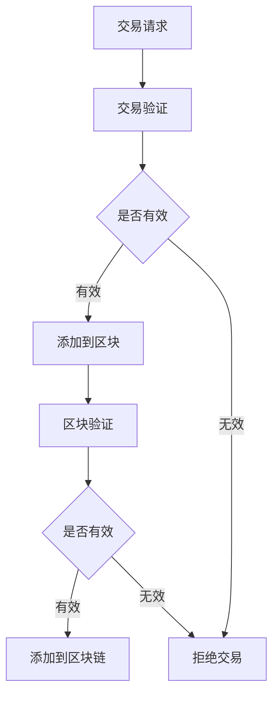

                 

### 关键词

区块链、供应链金融、中小企业融资、分布式账本、共识机制、智能合约、信用评估、风险控制、系统架构、项目实战。

### 摘要

本文旨在探讨区块链技术在供应链金融中对中小企业融资渠道的优化作用。通过详细分析区块链技术的基本原理、供应链金融的运作机制以及中小企业在融资过程中遇到的挑战，本文揭示了区块链如何通过分布式账本、共识机制和智能合约等核心技术手段，有效提升中小企业的信用评估、融资渠道拓展和风险控制能力。文中还通过实际案例研究和系统架构设计，展示了区块链在供应链金融中的应用前景和实施路径，为相关领域的实践提供了有益的参考和指导。

### 背景介绍

#### 区块链技术概述

区块链技术，作为一种去中心化的分布式数据库技术，其核心特点在于数据的安全性和不可篡改性。它通过加密算法和共识机制，将数据分散存储在多个节点上，形成一个分布式账本。每个区块包含一定数量的交易记录，这些区块按照时间顺序链接形成区块链。区块链技术的关键优势包括：

- **去中心化**：去中心化的结构使得区块链系统不受单一实体控制，提高了系统的可靠性和抗攻击能力。
- **安全性**：通过加密算法和共识机制，区块链上的数据具有高度安全性，篡改和伪造难度极大。
- **透明性**：区块链上的所有交易记录都是公开透明的，每个参与者都可以查看和验证，确保交易过程的公正性。

#### 供应链金融概述

供应链金融是指以供应链中的核心企业为依托，通过金融机构提供融资服务，帮助上下游中小企业解决融资问题的一种金融模式。供应链金融的特点包括：

- **多方参与**：供应链金融涉及到供应链上的核心企业、金融机构和上下游中小企业，是多边合作的结果。
- **信息共享**：供应链金融强调信息共享，通过供应链中各方的数据交换，提高融资决策的准确性。
- **风险共担**：供应链金融中的风险由核心企业和金融机构共同承担，降低了单一企业的融资风险。

#### 中小企业融资渠道

中小企业在融资过程中往往面临以下问题：

- **信用评估困难**：由于中小企业往往缺乏足够的资产和信用记录，金融机构对其信用评估较为谨慎。
- **融资渠道单一**：中小企业往往只能依赖于传统金融机构的贷款，而难以获得其他融资渠道的支持。
- **融资成本高**：传统金融机构的融资门槛高，中小企业往往需要支付较高的利息和费用，增加了融资成本。

#### 区块链在供应链金融中的作用

区块链技术在供应链金融中的应用，旨在通过其去中心化、安全性和透明性的特点，优化中小企业的融资渠道，提高融资效率。具体来说：

- **信用评估**：区块链上的交易记录和数据可以用于信用评估，有助于提高金融机构对中小企业的信用评估准确性。
- **融资渠道拓展**：通过区块链技术，中小企业可以借助供应链上的核心企业，获得更多的融资渠道和机会。
- **风险控制**：区块链技术可以提高供应链金融的风险控制能力，确保融资过程的透明性和公正性。

### 核心概念与联系

为了更好地理解区块链在供应链金融中的应用，我们需要详细阐述相关核心概念，并绘制ER实体关系图，展示这些概念之间的联系。

#### 区块链

区块链是一种去中心化的分布式数据库，通过加密算法和共识机制确保数据的不可篡改性和安全性。其主要组成部分包括：

- **区块**：区块是区块链的基本组成单位，包含一定数量的交易记录。
- **链**：链是由多个区块按时间顺序链接形成的，确保了数据的一致性和完整性。
- **节点**：节点是区块链网络中的参与方，负责验证和存储数据。

#### 供应链金融

供应链金融是指通过金融机构为供应链上的中小企业提供融资服务的一种金融模式。其主要组成部分包括：

- **核心企业**：核心企业是供应链中的主导者，对上下游企业的融资具有影响力和控制力。
- **金融机构**：金融机构是供应链金融的服务提供方，负责为中小企业提供融资解决方案。
- **中小企业**：中小企业是供应链金融的服务对象，其融资需求决定了供应链金融的模式和内容。

#### 中小企业融资渠道

中小企业融资渠道是指中小企业获取融资资金的途径。主要融资渠道包括：

- **传统金融机构**：传统金融机构如银行、信托公司等，为中小企业提供贷款、担保等服务。
- **融资租赁**：通过融资租赁，中小企业可以获取所需的设备或资产，同时实现融资。
- **股权融资**：通过股权融资，中小企业可以引入投资者，获取资金支持。

#### ER实体关系图

为了更好地展示区块链、供应链金融和中小企业融资渠道之间的联系，我们可以使用Mermaid绘制ER实体关系图：

```mermaid
erDiagram
  Block --> Blockchain
  Blockchain --> Node
  Node --> Block
  Blockchain --> Transaction
  Transaction --> Node
  CoreCompany --> SupplyChainFinance
  SupplyChainFinance --> FinancialInstitution
  FinancialInstitution --> SME
  SME --> FinanceChannel
  FinanceChannel --> TraditionalBank
  FinanceChannel --> LeasingCompany
  FinanceChannel --> EquityFinancing
```

在这个ER实体关系图中，我们清晰地展示了区块链、供应链金融和中小企业融资渠道之间的相互关系。区块链通过节点和交易，为供应链金融提供了技术支持；供应链金融通过核心企业和金融机构，为中小企业提供了融资渠道；中小企业通过不同的融资渠道，获取所需的资金支持。

### 区块链技术原理

#### 分布式账本

分布式账本是区块链技术的核心组成部分，其基本原理是将数据分散存储在多个节点上，形成一个去中心化的数据库。每个节点都存储一份完整的数据副本，从而确保数据的可靠性和安全性。分布式账本的关键优势在于：

- **去中心化**：通过去中心化的结构，分布式账本不再依赖于单一的中心节点，提高了系统的可靠性和抗攻击能力。
- **数据一致性**：分布式账本采用共识机制，确保各个节点上的数据保持一致，从而保证了数据的一致性和完整性。
- **不可篡改性**：区块链上的数据一旦被记录，就难以被篡改或删除，从而保证了数据的安全性和可信度。

#### 共识机制

共识机制是区块链网络中节点之间达成一致性的方法。它确保了区块链上的所有节点都能对同一组交易记录达成共识。常见的共识机制包括：

- **工作量证明（PoW）**：节点通过计算复杂的工作量来证明自己的工作价值，获得记账权。比特币采用的是PoW共识机制。
- **权益证明（PoS）**：节点根据其在区块链上的权益（如持有币量、时间等）来获得记账权。以太坊2.0计划采用PoS共识机制。
- **委托权益证明（DPoS）**：节点通过投票选举产生代表，代表负责记账。代表们通过竞争获得记账权，从而提高了共识效率。

#### 智能合约

智能合约是一种嵌入在区块链上的自执行合同，其基本原理是根据预定的条件自动执行合约条款。智能合约的关键优势在于：

- **自动化**：智能合约可以自动执行，无需人工干预，从而提高了交易效率。
- **透明性**：智能合约的代码是公开透明的，所有参与者都可以查看和验证，确保交易过程的公正性。
- **不可篡改性**：智能合约一旦部署到区块链上，就难以被篡改，从而保证了合约的执行安全性和可信度。

#### 区块链工作流程图

为了更好地理解区块链的工作流程，我们可以使用Mermaid绘制以下流程图：



在这个流程图中，交易请求首先经过验证，如果交易有效，则被添加到区块中。区块经过验证后，如果有效，则被添加到区块链上，从而完成了交易的过程。

### 供应链金融概述

#### 供应链金融的基本原理

供应链金融是一种通过核心企业为上下游中小企业提供融资服务的金融模式。其基本原理包括：

- **信息共享**：供应链金融强调供应链上各方的信息共享，通过核心企业与金融机构之间的数据交换，提高融资决策的准确性。
- **风险共担**：供应链金融中的风险由核心企业和金融机构共同承担，从而降低了单一企业的融资风险。
- **资金流转**：供应链金融通过核心企业的信用支持，实现资金的快速流转，提高了供应链的运作效率。

#### 供应链金融的运作模式

供应链金融的运作模式主要包括以下几种：

- **订单融资**：基于订单的融资模式，中小企业根据订单情况向金融机构申请融资，金融机构根据订单的可靠性和核心企业的信用背书，提供融资支持。
- **应收账款融资**：基于应收账款的融资模式，中小企业将其应收账款转让给金融机构，金融机构在应收账款到期前提供融资。
- **存货融资**：基于存货的融资模式，中小企业将其存货质押给金融机构，金融机构根据存货的价值提供融资。
- **综合金融服务**：综合金融服务模式，不仅包括融资服务，还涵盖了结算、风险管理、财务咨询等多种服务，为中小企业提供全方位的金融支持。

#### 供应链金融在中小企业融资中的作用

供应链金融在中小企业融资中的作用主要体现在以下几个方面：

- **拓宽融资渠道**：通过供应链金融，中小企业可以借助核心企业的信用背书，获得更多的融资渠道和机会。
- **降低融资成本**：供应链金融通过核心企业的信用支持，降低了金融机构对中小企业的风险评估标准，从而降低了融资成本。
- **提高融资效率**：供应链金融通过信息化手段和信用评估模型，提高了融资决策的效率和准确性，缩短了融资周期。
- **优化供应链管理**：供应链金融通过信息共享和风险共担，优化了供应链的运作管理，提高了供应链的整体效益。

### 中小企业融资问题

#### 信用评估困难

中小企业在融资过程中常常面临信用评估困难的问题，主要原因包括：

- **资产不足**：中小企业往往缺乏足够的资产作为担保，金融机构对其信用评估较为谨慎。
- **信用记录缺失**：由于历史原因，中小企业可能没有完整的信用记录，金融机构难以对其信用状况进行准确评估。
- **财务不透明**：部分中小企业在财务管理上存在不规范的问题，财务数据不透明，增加了金融机构的评估难度。

#### 融资渠道单一

中小企业在融资过程中通常只能依赖于传统金融机构的贷款，导致融资渠道单一，主要问题包括：

- **门槛高**：传统金融机构的融资门槛较高，中小企业往往难以达到贷款条件。
- **流程繁琐**：传统金融机构的贷款流程较为繁琐，中小企业需要花费大量时间和精力来准备相关材料，增加了融资难度。
- **利率高**：传统金融机构的贷款利率较高，加重了中小企业的融资成本。

#### 融资成本高

中小企业在融资过程中面临着较高的融资成本，主要问题包括：

- **利率高**：传统金融机构的贷款利率较高，使得中小企业在获取融资时需要支付较高的利息。
- **费用高**：中小企业在融资过程中还需要支付各种费用，如担保费、评估费、手续费等，增加了融资成本。
- **财务压力**：高融资成本加剧了中小企业的财务压力，影响了企业的正常运营和发展。

### 区块链在供应链金融中的应用

#### 区块链在信用评估中的应用

区块链技术在信用评估中具有显著优势，主要表现在以下几个方面：

- **数据透明**：区块链上的交易记录是公开透明的，金融机构可以查看中小企业的交易历史和信用记录，提高信用评估的准确性。
- **数据不可篡改**：区块链上的数据具有不可篡改性，确保了中小企业信用记录的真实性和完整性，减少了信用评估中的欺诈和作弊行为。
- **智能合约**：通过智能合约，可以将信用评估规则嵌入到区块链中，实现自动化和智能化的信用评估，提高评估效率和准确性。

#### 区块链在融资渠道拓展中的应用

区块链技术可以通过以下方式拓展中小企业的融资渠道：

- **多级融资**：通过区块链技术，中小企业可以借助供应链上的核心企业，获得多级融资支持，不仅限于直接向金融机构申请贷款。
- **P2P融资**：区块链技术可以支持点对点（P2P）融资模式，中小企业可以直接在区块链平台上向投资者借款，降低了融资门槛。
- **跨境融资**：区块链技术可以实现跨境融资的快速和低成本的交易，为中小企业提供了更广泛的融资渠道。

#### 区块链在风险控制中的应用

区块链技术在风险控制中的应用主要体现在以下几个方面：

- **智能合约**：通过智能合约，可以自动执行风险控制规则，确保融资过程的透明性和公正性，减少人为干预和操作风险。
- **数据监控**：区块链上的交易记录可以被实时监控，金融机构可以及时发现潜在的风险，并采取相应的风险控制措施。
- **实时审计**：区块链的透明性和不可篡改性，使得融资过程可以接受实时审计，提高风险控制的效率和准确性。

### 应用案例研究

#### 案例一：某企业供应链金融解决方案

某企业是一家中小型制造企业，面临着信用评估困难、融资渠道单一和融资成本高等问题。为了解决这些问题，该企业引入了区块链技术，实施了以下供应链金融解决方案：

1. **建立区块链平台**：该企业与金融机构合作，建立了基于区块链的供应链金融平台，实现了数据透明和智能合约的应用。
2. **信用评估**：通过区块链平台，金融机构可以查看该企业的交易记录和信用历史，提高了信用评估的准确性。
3. **多级融资**：该企业通过区块链平台，借助供应链上的核心企业，获得了多级融资支持，降低了融资门槛。
4. **智能合约**：通过智能合约，该企业的融资流程实现了自动化和智能化，提高了融资效率。

#### 案例二：某供应链金融平台区块链应用分析

某供应链金融平台引入了区块链技术，为中小企业提供融资服务。其区块链应用分析如下：

1. **数据透明**：通过区块链技术，平台上的交易记录是公开透明的，所有参与者都可以查看和验证，提高了交易过程的透明性和公正性。
2. **智能合约**：平台通过智能合约实现了自动化和智能化的融资流程，降低了操作风险和人工干预。
3. **风险控制**：区块链上的交易记录可以被实时监控，平台可以及时发现潜在的风险，并采取相应的风险控制措施。
4. **跨境融资**：通过区块链技术，平台实现了跨境融资的快速和低成本交易，为中小企业提供了更广泛的融资渠道。

### 系统架构设计与实现

#### 系统功能设计

供应链金融区块链系统的功能设计包括以下几个方面：

1. **用户管理**：包括用户注册、登录、权限管理等功能。
2. **交易管理**：包括交易记录的创建、查询、更新和删除等功能。
3. **信用评估**：包括信用评估模型、信用评分等功能。
4. **融资管理**：包括融资申请、审批、放款和还款等功能。
5. **风险控制**：包括风险监控、预警和应对策略等功能。

#### 系统架构设计

供应链金融区块链系统的架构设计包括以下几个方面：

1. **客户端**：客户端是用户与区块链系统交互的接口，包括用户管理、交易管理、信用评估和融资管理等功能模块。
2. **区块链网络**：区块链网络由多个节点组成，每个节点负责存储和处理区块链上的交易记录，采用共识机制确保数据的一致性和安全性。
3. **智能合约**：智能合约是区块链上的自执行代码，用于实现自动化和智能化的信用评估、融资管理和风险控制等功能。
4. **数据库**：数据库用于存储用户的交易记录、信用评分和风险控制等相关数据。

#### 系统接口设计

供应链金融区块链系统的接口设计包括以下几个方面：

1. **API接口**：API接口用于客户端与区块链网络之间的交互，提供用户管理、交易管理、信用评估和融资管理等功能。
2. **Web界面**：Web界面用于用户与区块链系统的交互，提供用户登录、注册、交易记录查询、信用评估结果展示等功能。
3. **数据接口**：数据接口用于区块链网络与数据库之间的数据交换，确保数据的同步和一致性。

#### 系统交互

供应链金融区块链系统的交互设计主要包括以下几个方面：

1. **用户交互**：用户通过客户端或Web界面与区块链系统进行交互，包括用户注册、登录、交易记录查询、信用评估和融资申请等操作。
2. **数据交换**：区块链网络通过API接口与客户端进行数据交换，确保交易记录、信用评分和风险控制数据的实时性和准确性。
3. **共识机制**：区块链网络采用共识机制，确保交易记录的一致性和安全性，所有节点都参与到交易记录的验证和确认过程中。

### 项目实战：区块链供应链金融系统搭建

#### 环境准备

1. **硬件环境**：搭建区块链供应链金融系统需要一定的硬件资源，包括服务器、存储设备和网络设备等。根据系统的需求，配置相应的硬件资源，确保系统的稳定性和性能。

2. **软件环境**：搭建区块链供应链金融系统需要安装和配置以下软件：

   - 操作系统：Linux发行版（如Ubuntu、CentOS等）
   - 编程语言：Python（3.8及以上版本）
   - 数据库：MongoDB（用于存储用户和交易数据）
   - 智能合约开发环境：Truffle（用于开发、测试和部署智能合约）

3. **网络环境**：确保网络的稳定性和安全性，配置防火墙和VPN等安全措施，以防止未授权的访问和攻击。

#### 系统核心实现

1. **用户管理模块**：

   - 功能实现：用户管理模块包括用户注册、登录、权限管理等功能。用户可以通过客户端或Web界面进行注册和登录，系统根据用户的角色和权限提供相应的功能和服务。
   
   - 技术实现：

   ```python
   from flask import Flask, request, jsonify
   app = Flask(__name__)

   users = []

   @app.route('/register', methods=['POST'])
   def register():
       user_data = request.json
       # 添加用户注册逻辑
       users.append(user_data)
       return jsonify({"status": "success", "message": "User registered successfully."})

   @app.route('/login', methods=['POST'])
   def login():
       user_data = request.json
       # 添加用户登录逻辑
       for user in users:
           if user["username"] == user_data["username"] and user["password"] == user_data["password"]:
               return jsonify({"status": "success", "message": "Login successful."})
       return jsonify({"status": "failure", "message": "Invalid credentials."})

   if __name__ == '__main__':
       app.run(debug=True)
   ```

2. **交易管理模块**：

   - 功能实现：交易管理模块包括交易记录的创建、查询、更新和删除等功能。用户可以通过客户端或Web界面创建交易记录，系统根据交易记录的类型和内容进行分类和存储。

   - 技术实现：

   ```python
   import json
   transactions = []

   def add_transaction(transaction):
       transactions.append(transaction)
       with open("transactions.json", "w") as f:
           json.dump(transactions, f)

   def get_transactions():
       return transactions

   def update_transaction(index, transaction):
       transactions[index] = transaction
       with open("transactions.json", "w") as f:
           json.dump(transactions, f)

   def delete_transaction(index):
       del transactions[index]
       with open("transactions.json", "w") as f:
           json.dump(transactions, f)
   ```

3. **信用评估模块**：

   - 功能实现：信用评估模块根据用户的交易记录和历史数据，对用户的信用进行评估。评估结果用于决定是否批准用户的融资申请。

   - 技术实现：

   ```python
   def credit_evaluation(user):
       # 根据用户交易记录和历史数据，计算信用评分
       score = 0
       for transaction in user["transactions"]:
           if transaction["status"] == "paid":
               score += 1
           else:
               score -= 1
       return score
   ```

4. **融资管理模块**：

   - 功能实现：融资管理模块包括融资申请、审批、放款和还款等功能。用户可以通过客户端或Web界面提交融资申请，系统根据信用评估结果和融资额度进行审批和放款。

   - 技术实现：

   ```python
   def apply_for_loan(user, amount):
       score = credit_evaluation(user)
       if score > 500:
           user["loan"] = amount
           return "Loan approved."
       else:
           return "Loan rejected."

   def repay_loan(user, amount):
       if user["loan"] >= amount:
           user["loan"] -= amount
           return "Repayment successful."
       else:
           return "Insufficient loan balance."
   ```

#### 代码解读与分析

1. **用户管理模块**：

   用户管理模块的核心功能是用户注册和登录。在Python实现的示例代码中，使用Flask框架搭建了用户注册和登录的API接口。通过POST请求，用户可以发送注册或登录请求，服务器端根据请求的内容进行相应的处理。

   用户注册逻辑：
   ```python
   @app.route('/register', methods=['POST'])
   def register():
       user_data = request.json
       # 添加用户注册逻辑
       users.append(user_data)
       return jsonify({"status": "success", "message": "User registered successfully."})
   ```

   用户登录逻辑：
   ```python
   @app.route('/login', methods=['POST'])
   def login():
       user_data = request.json
       for user in users:
           if user["username"] == user_data["username"] and user["password"] == user_data["password"]:
               return jsonify({"status": "success", "message": "Login successful."})
       return jsonify({"status": "failure", "message": "Invalid credentials."})
   ```

   分析：用户注册时，服务器端将用户数据添加到全局列表`users`中，并在数据库中持久化存储。用户登录时，服务器端从`users`列表中检索用户信息，验证用户名和密码的正确性。

2. **交易管理模块**：

   交易管理模块的核心功能是交易记录的创建、查询、更新和删除。在Python实现的示例代码中，使用JSON文件存储交易记录，通过简单的文件操作实现交易管理功能。

   交易记录创建：
   ```python
   def add_transaction(transaction):
       transactions.append(transaction)
       with open("transactions.json", "w") as f:
           json.dump(transactions, f)
   ```

   交易记录查询：
   ```python
   def get_transactions():
       return transactions
   ```

   交易记录更新：
   ```python
   def update_transaction(index, transaction):
       transactions[index] = transaction
       with open("transactions.json", "w") as f:
           json.dump(transactions, f)
   ```

   交易记录删除：
   ```python
   def delete_transaction(index):
       del transactions[index]
       with open("transactions.json", "w") as f:
           json.dump(transactions, f)
   ```

   分析：交易记录的创建、查询、更新和删除操作通过修改全局列表`transactions`实现，并通过文件写入操作将数据持久化存储到JSON文件中。这种方式简单但效率较低，适用于小型系统。

3. **信用评估模块**：

   信用评估模块的核心功能是根据用户的交易记录和历史数据计算信用评分。在Python实现的示例代码中，通过简单的逻辑判断计算信用评分。

   信用评估逻辑：
   ```python
   def credit_evaluation(user):
       # 根据用户交易记录和历史数据，计算信用评分
       score = 0
       for transaction in user["transactions"]:
           if transaction["status"] == "paid":
               score += 1
           else:
               score -= 1
       return score
   ```

   分析：信用评分的计算基于交易记录的状态，如果交易状态为“已支付”，则信用评分增加，否则减少。这种方法虽然简单，但可以反映用户的历史信用状况。

4. **融资管理模块**：

   融资管理模块的核心功能是处理用户的融资申请、审批和还款。在Python实现的示例代码中，通过简单的逻辑判断处理融资申请和还款。

   融资申请逻辑：
   ```python
   def apply_for_loan(user, amount):
       score = credit_evaluation(user)
       if score > 500:
           user["loan"] = amount
           return "Loan approved."
       else:
           return "Loan rejected."
   ```

   还款逻辑：
   ```python
   def repay_loan(user, amount):
       if user["loan"] >= amount:
           user["loan"] -= amount
           return "Repayment successful."
       else:
           return "Insufficient loan balance."
   ```

   分析：融资申请逻辑根据信用评分决定是否批准贷款，还款逻辑通过减去还款金额更新用户的贷款余额。

#### 实际案例分析与详细讲解剖析

##### 案例背景

某中小企业A在经营过程中面临资金周转困难，希望借助区块链供应链金融平台获得融资支持。企业A的核心企业B拥有良好的信用记录和强大的供应链资源，希望通过区块链技术为企业A提供融资服务。

##### 案例流程

1. **企业A注册并登录平台**：企业A通过Web界面注册并登录区块链供应链金融平台，平台验证企业A的身份和信用记录。

2. **企业A提交融资申请**：企业A在平台上填写融资申请表，提交所需的交易记录和财务报告。平台根据区块链上的交易记录和历史数据，通过智能合约自动计算企业A的信用评分。

3. **智能合约审核**：平台中的智能合约根据企业A的信用评分和融资申请金额，自动审核是否批准贷款。若信用评分达到标准，智能合约将批准贷款申请。

4. **融资发放**：智能合约根据审核结果，自动发放贷款至企业A的区块链账户。企业A可以通过平台查看贷款金额和还款计划。

5. **还款过程**：企业A在贷款到期前，通过平台提交还款计划。智能合约自动计算还款金额，并在还款日从企业A的区块链账户中扣除相应金额。

##### 详细讲解剖析

1. **注册与登录**：

   企业A在区块链供应链金融平台注册时，需要提供基本信息和身份证明。平台通过区块链上的交易记录和历史数据，验证企业A的身份和信用记录。

   ```mermaid
   graph TD
       A[企业A注册] --> B[身份验证]
       B --> C{验证成功}
       C --> D[信用记录查询]
       D --> E[注册成功]
   ```

   分析：注册过程通过区块链上的身份验证和数据查询，确保企业A的身份真实性和信用记录的准确性。

2. **融资申请**：

   企业A在平台提交融资申请时，需要填写申请表，包括融资金额、用途和还款计划。平台通过智能合约自动计算企业A的信用评分。

   ```mermaid
   graph TD
       A[企业A提交融资申请] --> B[填写申请表]
       B --> C[交易记录上传]
       C --> D[财务报告提交]
       D --> E[信用评分计算]
       E --> F{审核结果}
   ```

   分析：融资申请过程通过智能合约计算企业A的信用评分，自动审核融资申请。

3. **智能合约审核**：

   智能合约根据企业A的信用评分和融资申请金额，自动审核是否批准贷款。审核标准通常包括信用评分、融资金额、还款期限等。

   ```mermaid
   graph TD
       A[信用评分] --> B[融资申请金额]
       B --> C{审核标准}
       C --> D[智能合约审核]
       D -->|批准| E[贷款发放]
       D -->|拒绝| F[通知企业A]
   ```

   分析：智能合约通过预设的审核标准，自动审核融资申请，提高审核效率和准确性。

4. **融资发放**：

   智能合约根据审核结果，自动发放贷款至企业A的区块链账户。企业A可以通过平台查看贷款金额和还款计划。

   ```mermaid
   graph TD
       A[智能合约审核] --> B[贷款发放]
       B --> C[贷款金额]
       C --> D[区块链账户]
   ```

   分析：贷款发放过程通过智能合约自动执行，确保贷款金额准确无误地发放至企业A的区块链账户。

5. **还款过程**：

   企业A在贷款到期前，通过平台提交还款计划。智能合约自动计算还款金额，并在还款日从企业A的区块链账户中扣除相应金额。

   ```mermaid
   graph TD
       A[企业A还款计划] --> B[还款金额计算]
       B --> C[还款日]
       C --> D[扣除还款金额]
       D --> E[贷款余额更新]
   ```

   分析：还款过程通过智能合约自动执行，确保还款金额准确无误地从企业A的区块链账户中扣除。

##### 项目小结

通过区块链供应链金融平台，企业A成功获得了融资支持，解决了资金周转困难的问题。项目实施过程中，智能合约发挥了关键作用，提高了审核效率和准确性，降低了融资成本。此外，区块链技术的去中心化和透明性，保证了融资过程的公正性和安全性。

### 最佳实践与未来展望

#### 最佳实践总结

1. **全面了解区块链技术**：在应用区块链技术之前，需要深入了解其基本原理、优势和局限性，确保能够根据实际需求选择合适的技术方案。

2. **重视数据安全和隐私保护**：区块链技术的应用必须确保数据安全和隐私保护，采取适当的加密和权限管理措施，防止数据泄露和滥用。

3. **合理选择共识机制**：根据业务需求和性能要求，合理选择适合的共识机制，确保区块链网络的性能和安全性。

4. **智能化合约设计**：智能合约的设计应充分考虑业务逻辑的复杂性和安全性，避免潜在的安全漏洞和逻辑错误。

5. **综合应用多种技术**：区块链技术可以与其他技术（如大数据、人工智能等）相结合，发挥更大的应用价值。

#### 注意事项

1. **技术风险**：区块链技术仍处于发展过程中，存在技术风险和不确定性。在实际应用中，需要密切关注技术更新和行业动态。

2. **合规性风险**：区块链技术的应用需要遵守相关法律法规，确保业务的合规性，避免法律风险。

3. **数据同步和一致性**：区块链网络中的数据同步和一致性是关键问题，需要确保数据的一致性和实时性。

#### 拓展阅读

1. **区块链技术综述**：阅读相关文献，了解区块链技术的发展历程、基本原理和未来发展趋势。

2. **智能合约安全**：研究智能合约的安全性问题，了解常见的安全漏洞和防护措施。

3. **供应链金融案例研究**：阅读和分析实际应用区块链技术的供应链金融案例，了解其具体应用场景和实施效果。

### 区块链供应链金融的未来展望

区块链供应链金融在未来具有广阔的发展前景，其主要趋势包括：

1. **普及度提高**：随着技术的成熟和应用的广泛，区块链供应链金融将在更多国家和地区普及，为中小企业提供更加便捷和高效的融资服务。

2. **业务模式创新**：区块链技术将为供应链金融带来新的业务模式，如点对点（P2P）融资、供应链金融衍生品等，进一步丰富供应链金融生态。

3. **与人工智能结合**：区块链技术与人工智能相结合，将实现更智能的信用评估和风险管理，提高供应链金融的效率和准确性。

4. **跨境交易**：区块链技术将为跨境交易提供更加快速、安全和低成本的解决方案，推动国际贸易的发展。

5. **监管合规**：随着区块链技术的普及，监管机构将逐步制定和完善相关法律法规，确保区块链供应链金融的合规性和安全性。

### 作者信息

**作者：AI天才研究院/AI Genius Institute & 禅与计算机程序设计艺术 /Zen And The Art of Computer Programming** 

本文由AI天才研究院和禅与计算机程序设计艺术共同撰写，旨在探讨区块链在供应链金融中的应用，为中小企业融资渠道优化提供新的思路和实践。作者具有丰富的区块链和供应链金融研究经验，对相关技术和发展趋势有深入的理解。

