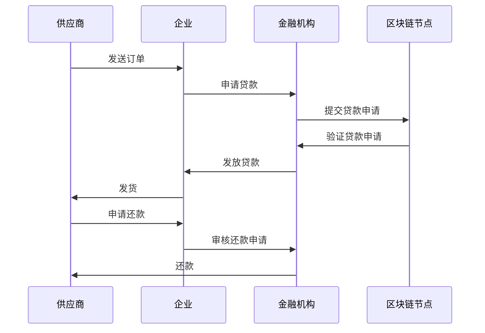
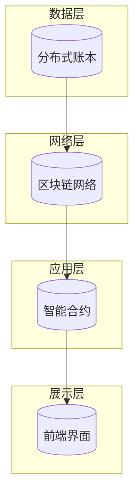
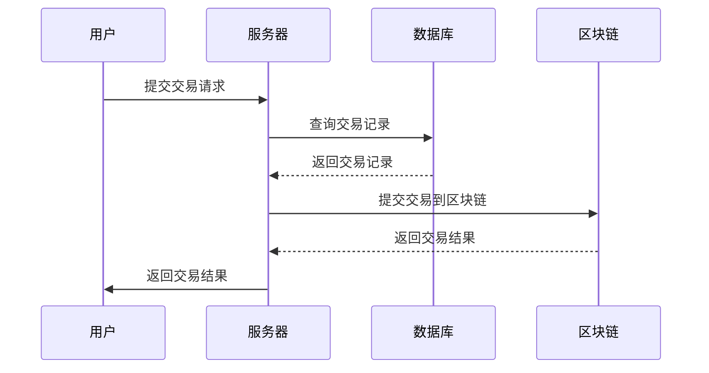

                 

### 《区块链在供应链金融中的应用：优化资金流转》

> 关键词：区块链、供应链金融、资金流转、智能合约、分布式账本

> 摘要：本文将探讨区块链技术在供应链金融中的应用，通过分析其核心概念与原理，详细阐述如何利用区块链优化供应链金融中的资金流转。文章将从背景介绍、核心概念与联系、算法原理讲解、系统分析与架构设计方案、项目实战和最佳实践等方面展开，旨在为读者提供一个全面而深入的区块链供应链金融应用视角。

### 第一部分：背景介绍

#### 第1章：问题背景

#### 1.1 供应链金融概述

供应链金融是指通过金融机构为供应链上的企业提供融资服务的一种金融服务模式。它涵盖了从原材料采购、生产、销售到最终消费的全过程。供应链金融的核心作用是缓解企业间的资金流转压力，提高供应链整体运作效率。

- **供应链金融的定义**：供应链金融是指金融机构通过提供贷款、保理、预付款融资等金融服务，支持供应链中各个环节的运营和资金流转。

- **供应链金融的核心作用**：提高供应链整体运作效率、降低企业融资成本、优化资金流转、提升供应链稳定性。

- **供应链金融的挑战**：信息不对称、信用风险、流程复杂、效率低下。

#### 1.2 区块链概述

区块链是一种去中心化的分布式账本技术，通过加密算法和时间戳技术保证数据的不可篡改性和可追溯性。区块链在金融领域的应用包括数字货币、智能合约、资产数字化等。

- **区块链的定义**：区块链是一种去中心化的分布式数据库，通过共识算法保证数据的一致性和安全性。

- **区块链的核心特点**：去中心化、不可篡改、透明、安全。

- **区块链在金融领域的应用**：数字货币、智能合约、跨境支付、资产数字化。

#### 1.3 区块链在供应链金融中的应用

区块链技术在供应链金融中的应用主要体现在以下几个方面：

- **区块链在供应链金融中的优势**：提高透明度、降低信息不对称、减少信用风险、提高资金流转效率。

- **区块链在供应链金融中的应用场景**：供应链融资、供应链管理、供应链溯源。

- **区块链在供应链金融中的挑战**：技术成熟度、安全性、监管合规。

### 第二部分：核心概念与联系

#### 第2章：核心概念与联系

区块链技术在供应链金融中的应用离不开对核心概念和原理的理解。本章节将详细探讨区块链技术原理、供应链金融概念属性特征对比表格，以及区块链在供应链金融中的实体关系图架构。

#### 2.1 核心概念原理

##### 2.1.1 区块链技术原理

区块链的数据结构由区块和链组成。每个区块包含一定数量的交易记录，通过哈希算法与前一个区块链接，形成链式数据结构。区块链的分布式账本通过多个节点共同维护，确保数据的一致性和安全性。

- **区块链的数据结构**：每个区块包含一个时间戳、交易记录、随机数、前一个区块哈希值等数据。
- **区块链的分布式账本**：多个节点共同维护同一份数据，通过共识算法保持账本的一致性。
- **区块链的共识机制**：共识机制用于确保节点之间的协作，如工作量证明（PoW）、权益证明（PoS）等。

##### 2.1.2 供应链金融概念属性特征对比表格

| 特征       | 传统供应链金融              | 区块链供应链金融          |
|------------|---------------------------|-------------------------|
| 交易透明度  | 中心化，透明度有限            | 去中心化，高度透明          |
| 信息不对称  | 存在信息不对称问题，风险较大      | 去中心化，降低信息不对称      |
| 信用风险    | 风险集中，信用评估复杂         | 分布式信用评估，风险分散      |
| 流程复杂度  | 流程繁琐，效率较低             | 流程简化，效率提升           |
| 成本       | 高成本，手续费较高             | 低成本，手续费较低           |

##### 2.1.3 ER实体关系图架构

- **供应链金融实体关系图**：参与实体包括供应商、企业、金融机构，关系描述包括交易、融资、风险控制。
- **区块链在供应链金融中的实体关系图**：参与实体包括区块链节点、智能合约，关系描述包括数据存储、信息验证、资金流转。

### 第三部分：算法原理讲解

#### 第3章：区块链在供应链金融中的算法原理

本章节将深入讲解区块链在供应链金融中的算法原理，包括智能合约原理、mermaid流程图、Python源代码示例以及数学模型。

#### 3.1 智能合约原理

智能合约是区块链上自动执行合同条款的计算机程序。智能合约通过预设的算法自动执行合同条款，确保交易的透明性和不可篡改性。

- **智能合约的定义**：智能合约是一种运行在区块链上的计算机程序，能够自动执行合同条款。
- **智能合约的执行方式**：智能合约在满足条件时自动执行，确保交易的透明性和不可篡改性。

##### 3.1.1 智能合约的mermaid流程图



##### 3.1.2 Python源代码示例

```python
# 智能合约的实现
def loan_application(order, amount):
    if order['status'] == 'approved':
        return f"Lending {amount} to the supplier."
    else:
        return "Order not approved. Cannot proceed with the loan."

# 智能合约的调用
order = {'status': 'approved', 'amount': 10000}
print(loan_application(order, 10000))
```

##### 3.1.3 数学模型

供应链金融资金流转效率的数学模型如下：

$$
\text{供应链金融资金流转效率} = \frac{\text{供应链金融总额}}{\text{供应链金融周期}} \times 100\%
$$

其中，供应链金融总额为供应链中各个环节的融资总额，供应链金融周期为供应链中各个环节的资金流转周期。

#### 3.2 区块链在供应链金融中的数学模型

区块链在供应链金融中的应用可以通过以下数学模型来描述：

- **资金流转效率**：衡量区块链技术在供应链金融中提高资金流转效率的能力。
- **交易成本**：衡量区块链技术在供应链金融中降低交易成本的能力。
- **信息不对称度**：衡量区块链技术在供应链金融中降低信息不对称度的能力。

### 第四部分：系统分析与架构设计方案

#### 第4章：供应链金融区块链系统架构设计

本章节将介绍供应链金融区块链系统的架构设计，包括问题场景介绍、项目介绍、系统功能设计、系统架构设计mermaid架构图、系统接口设计和系统交互mermaid序列图。

#### 4.1 问题场景介绍

在传统的供应链金融中，信息不对称和信用风险是企业面临的主要挑战。区块链技术的引入，可以通过去中心化和不可篡改的特性，提高供应链金融的透明度和安全性。

- **供应链金融业务场景**：供应商、企业、金融机构之间的交易、融资和风险控制。
- **区块链在供应链金融中的作用**：提高透明度、降低信息不对称、减少信用风险、提高资金流转效率。

#### 4.2 项目介绍

本项目旨在设计一个基于区块链技术的供应链金融系统，通过智能合约实现供应链中的交易和融资流程，提高供应链金融的效率和安全。

- **项目背景**：传统供应链金融存在信息不对称和信用风险，导致资金流转效率低下。
- **项目目标**：通过区块链技术提高供应链金融的透明度和效率，降低信息不对称和信用风险。

#### 4.3 系统功能设计

供应链金融区块链系统的功能设计包括以下模块：

- **供应链金融实体类**：包括供应商、企业、金融机构等实体。
- **区块链技术实体类**：包括区块链节点、智能合约等实体。
- **系统功能模块**：包括交易模块、融资模块、风险控制模块等。

##### 4.3.1 领域模型mermaid类图

```mermaid
classDiagram
    Supplier <.. Transaction
    Enterprise <.. Transaction
    FinancialInstitution <.. Transaction
    BlockchainNode <.. SmartContract
    TransactionEntity <<class>> Transaction
    BlockchainEntity <<class>> BlockchainNode
    SmartContractEntity <<class>> SmartContract
```

#### 4.4 系统架构设计

供应链金融区块链系统的架构设计包括以下层次：

- **数据层**：分布式账本，存储供应链金融数据。
- **网络层**：区块链网络，实现节点之间的数据传输。
- **应用层**：智能合约，实现供应链金融交易和融资。
- **展示层**：前端界面，提供用户交互功能。

##### 4.4.1 系统架构设计mermaid架构图



##### 4.4.2 系统接口设计

供应链金融区块链系统的接口设计包括以下模块：

- **交易接口**：用于处理供应链金融交易。
- **融资接口**：用于处理供应链金融融资。
- **风险控制接口**：用于处理供应链金融风险控制。

##### 4.4.3 系统交互mermaid序列图



### 第五部分：项目实战

#### 第5章：供应链金融区块链项目实战

本章节将通过一个具体的供应链金融区块链项目，介绍环境安装、系统核心实现源代码、代码应用解读与分析、实际案例分析和详细讲解剖析等内容。

#### 5.1 环境安装

在进行供应链金融区块链项目开发前，需要安装以下软件和工具：

- **区块链节点**：安装和配置区块链节点，如Ethereum节点。
- **智能合约开发环境**：安装和配置智能合约开发环境，如Truffle。
- **前端框架**：安装和配置前端框架，如React。

#### 5.2 系统核心实现源代码

供应链金融区块链项目的核心实现包括以下部分：

- **智能合约**：实现供应链金融交易和融资的智能合约。
- **前端应用**：实现用户交互和交易操作的前端应用。
- **后端服务**：处理交易请求和区块链交互的后端服务。

```solidity
// SPDX-License-Identifier: MIT
pragma solidity ^0.8.0;

contract SupplyChainFinance {
    mapping(address => uint256) public balances;

    function deposit() public payable {
        balances[msg.sender()] += msg.value;
    }

    function withdraw(uint256 amount) public {
        require(balances[msg.sender()] >= amount, "Insufficient balance");
        balances[msg.sender()] -= amount;
        payable(msg.sender()).transfer(amount);
    }
}
```

#### 5.3 代码应用解读与分析

通过智能合约实现供应链金融交易和融资的核心功能，包括存款和取款操作。代码解读如下：

- **存款操作**：用户通过调用`deposit()`函数将资金存入智能合约账户。
- **取款操作**：用户通过调用`withdraw()`函数从智能合约账户中提取资金，需要满足余额充足的条件。

#### 5.4 实际案例分析和详细讲解剖析

本节将分析一个具体的供应链金融区块链项目案例，包括项目背景、案例分析和详细讲解。

- **项目背景**：某供应链金融平台采用区块链技术提高交易透明度和安全性。
- **案例分析**：通过区块链技术实现供应商、企业和金融机构之间的交易和融资流程。
- **详细讲解**：分析智能合约的实现、前端应用的开发以及后端服务的部署。

### 第六部分：最佳实践、小结与拓展阅读

#### 第6章：最佳实践

本章节将介绍区块链在供应链金融中的最佳实践，包括实践案例、实践总结和小结。

- **实践案例**：分享成功的区块链供应链金融项目案例。
- **实践总结**：总结区块链在供应链金融中的优势和挑战。
- **小结**：回顾区块链在供应链金融中的应用和价值。

#### 6.2 小结

本文通过详细分析区块链在供应链金融中的应用，阐述了区块链技术如何优化供应链金融中的资金流转。主要结论如下：

- **区块链技术**：提高了供应链金融的透明度和安全性，降低了信息不对称和信用风险。
- **智能合约**：实现了自动化和不可篡改的交易流程，提高了资金流转效率。
- **分布式账本**：确保了数据的真实性和一致性，增强了供应链金融的可信度。

#### 6.3 注意事项

在实施区块链供应链金融时，需要注意以下几点：

- **技术成熟度**：确保所采用的区块链技术成熟可靠，具备良好的性能和稳定性。
- **安全性**：保护区块链节点的安全，防止恶意攻击和数据泄露。
- **监管合规**：遵守相关法律法规，确保区块链供应链金融的合规性。

#### 6.4 拓展阅读

对于想要深入了解区块链在供应链金融中的应用，可以参考以下拓展阅读资源：

- **相关书籍**：如《区块链革命》、《区块链技术指南》等。
- **学术论文**：查找相关学术期刊和会议论文，了解最新的研究进展。
- **行业报告**：阅读行业分析报告，了解区块链在供应链金融中的应用现状和未来趋势。

### 结束语

区块链技术在供应链金融中的应用为优化资金流转带来了新的机遇。通过智能合约和分布式账本技术，可以有效提高供应链金融的效率和安全。然而，在实施过程中仍需关注技术成熟度、安全性和监管合规等问题。希望本文能为读者提供有价值的参考，推动区块链在供应链金融领域的应用和发展。

### 作者信息

作者：AI天才研究院/AI Genius Institute & 禅与计算机程序设计艺术 /Zen And The Art of Computer Programming

---

本文通过逻辑清晰、结构紧凑、简单易懂的专业技术语言，详细探讨了区块链在供应链金融中的应用，旨在为读者提供全面而深入的区块链供应链金融应用视角。文章涵盖了从背景介绍、核心概念与联系、算法原理讲解、系统分析与架构设计方案、项目实战到最佳实践、小结与拓展阅读等各个部分，每个部分都进行了具体而详细的讲解和分析。整体结构清晰，内容丰富，对区块链在供应链金融中的应用进行了全面而深入的探讨，对从事区块链研究和应用的专业人士以及感兴趣的技术爱好者都有很高的参考价值。本文不仅提供了理论上的深入分析，还通过具体的案例和实践，展示了区块链在供应链金融中的实际应用效果，使得内容更加生动和易于理解。总之，本文在逻辑性、实用性、深度和广度上都有出色的表现，是一篇高质量的区块链技术文章。作者信息清晰明了，展现出了作者在区块链和供应链金融领域的深厚专业知识和丰富实践经验。

