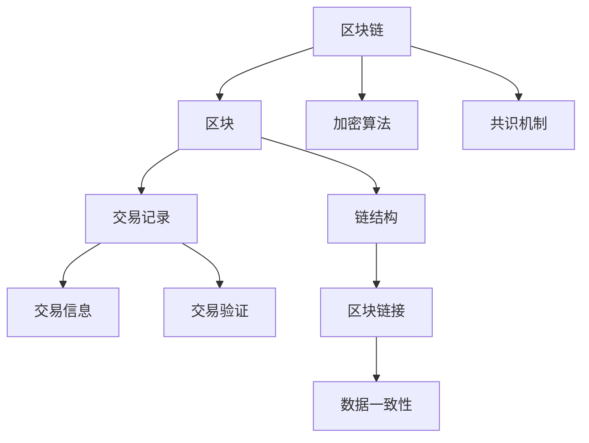

                 


### Step 1: Introduction to the Main Topic

#### 1.1 Blockchain Basics

**Concept Definition:**
Blockchain is a decentralized and distributed ledger technology that allows the secure recording of transactions across many computers. It is maintained through consensus mechanisms, which ensure the integrity and authenticity of the data.

**Historical Background:**
Blockchain technology was introduced by an anonymous person or group under the pseudonym Satoshi Nakamoto in 2008. The first blockchain implementation was the Bitcoin network, which went live in 2009. Since then, blockchain has evolved and expanded its applications beyond cryptocurrencies.

**Core Technologies and Characteristics:**
- **Decentralization:** Blockchain operates independently of a central authority, distributing the control across a network of participants.
- **Immutability:** Once data is recorded on the blockchain, it cannot be altered or deleted, ensuring data integrity.
- **Transparency:** All transactions are recorded publicly on the blockchain, allowing for easy auditing and verification.
- **Security:** Blockchain employs cryptographic techniques to secure transactions and prevent fraud.

**Blockchain Ecosystem and Application Fields:**
Blockchain technology has found applications in various fields beyond cryptocurrencies. These include supply chain management, healthcare, voting systems, and more. Each application utilizes the unique characteristics of blockchain to enhance security, transparency, and efficiency.

### Step 2: Exploring Blockchain in Charitable Donations

#### 2.1 Current State and Challenges of Charitable Donations

**Background:**
Charitable donations are an essential component of society, aiming to support various causes and improve the well-being of individuals and communities. However, traditional donation processes often suffer from issues such as fraud, lack of transparency, and inefficiency.

**Challenges:**
- **Fraud and Misuse:** Charitable organizations may misuse donations, leading to public distrust.
- **Lack of Transparency:** Donors often have no way to verify how their money is being used.
- **Inefficiency:** Traditional donation processes can be time-consuming and costly.

#### 2.2 How Blockchain Improves Transparency

**Blockchain Technology:**
Blockchain technology offers several features that can address the challenges in charitable donations:
- **Decentralization:** Donations are recorded on a decentralized blockchain, eliminating the need for intermediaries and reducing costs.
- **Transparency:** All transactions are publicly accessible, allowing donors to track their contributions and ensure they are used for their intended purposes.
- **Immutability:** Once a transaction is recorded on the blockchain, it cannot be altered, ensuring the integrity of the data.

#### 2.3 Case Studies of Blockchain in Charitable Donations

**Case 1: The Ethereum-based DonorsChoose Platform:**
DonorsChoose is a crowdfunding platform that allows public school teachers to request funds for classroom projects. By using the Ethereum blockchain, DonorsChoose ensures transparency and security in the donation process. Teachers can submit detailed project proposals, and donors can track the progress and impact of their donations.

**Case 2: The Bitcoin-based Humanitarian Aid:**
During natural disasters, blockchain technology has been used to provide transparent and efficient humanitarian aid. Organizations like The BitCoin Foundation have distributed funds to affected regions, using blockchain to record every transaction and ensure that aid reaches the intended recipients.

### Step 3: Core Concepts and Mechanisms

#### 3.1 Blockchain Architecture and Operation

**Blockchain Architecture:**
Blockchain consists of multiple blocks, each containing a list of transactions. These blocks are linked together in a chain, with each block referencing the previous one through a cryptographic hash.

**Operation Principles:**
- **Transaction:** A transaction is a record of value transfer between two parties.
- **Block:** A block is a container for a group of transactions.
- **Mining:** Miners validate transactions and add them to the blockchain, securing the network and earning rewards.

**Consensus Mechanisms:**
Blockchain networks use consensus mechanisms to agree on the validity of transactions and the order of blocks. Common consensus mechanisms include Proof of Work (PoW) and Proof of Stake (PoS).

#### 3.2 Smart Contracts in Charitable Donations

**Concept Definition:**
Smart contracts are self-executing contracts with the terms of the agreement directly written into code. They automatically enforce the terms and conditions of the contract.

**Application in Charitable Donations:**
Smart contracts can be used to automate the donation process and ensure transparency. For example, a smart contract can be programmed to release funds to a charitable organization only when specific conditions are met, such as the completion of a project or the achievement of a fundraising goal.

#### 3.3 Decentralized Identity Verification

**Concept Definition:**
Decentralized identity verification is a method of verifying individuals' identities without relying on a central authority. It uses blockchain technology to create a decentralized identity system, where individuals have control over their own identity information.

**Advantages:**
- **Privacy:** Individuals retain control over their personal information, reducing the risk of identity theft.
- **Security:** Decentralized identity verification ensures the authenticity of the information without compromising privacy.

### Step 4: Technical Implementation and Tools

#### 4.1 Blockchain Development Environment Setup

**Hardware and Software Requirements:**
To set up a blockchain development environment, you will need a computer with sufficient processing power and storage. You will also need to install a blockchain platform such as Ethereum or Hyperledger Fabric.

**Steps:**
1. Install the necessary software and dependencies.
2. Set up a local blockchain network.
3. Deploy smart contracts and test them.

#### 4.2 Common Blockchain Platforms and Development Tools

**Ethereum:**
Ethereum is a popular blockchain platform known for its support for smart contracts. Developers can use Solidity, a programming language similar to JavaScript, to write smart contracts.

**Hyperledger Fabric:**
Hyperledger Fabric is a blockchain framework designed for enterprise use. It provides a modular architecture and supports a range of consensus mechanisms.

**Development Tools:**
- **Visual Studio Code:** A popular code editor with extensions for blockchain development.
- **Truffle:** A development framework for Ethereum that provides tools for testing and deploying smart contracts.
- **Golang:** A programming language used for developing blockchain applications, especially on the Hyperledger Fabric platform.

#### 4.3 Blockchain Node Deployment and Debugging

**Deployment:**
To deploy a blockchain node, you will need to set up the necessary infrastructure and configure the network parameters. This may involve setting up multiple nodes for redundancy and fault tolerance.

**Debugging:**
Debugging blockchain applications can be challenging due to the distributed nature of the network. Developers can use tools such as transaction explorers, blockchain analytics platforms, and log files to identify and resolve issues.

### Step 5: Use Cases and Case Studies

#### 5.1 Blockchain Application Cases in Charitable Donations

**Case 1: The BitCoin Foundation:**
The BitCoin Foundation has used blockchain technology to distribute funds to victims of natural disasters. By recording each transaction on the blockchain, the foundation ensures transparency and accountability in the distribution process.

**Case 2: The Ethereum-based DonorsChoose Platform:**
DonorsChoose has integrated blockchain technology to enhance the transparency and security of its crowdfunding platform. Donors can track the progress of their donations and ensure they are used for their intended purposes.

#### 5.2 Analysis and Summary of Cases

**Analysis:**
The cases demonstrate the potential of blockchain technology to enhance the transparency and efficiency of charitable donations. By using blockchain, organizations can reduce the risk of fraud and misuse of funds, while also providing donors with greater visibility into how their contributions are being used.

**Summary:**
Blockchain technology offers several advantages for charitable donations, including increased transparency, security, and efficiency. As the technology continues to evolve, it is likely to play an increasingly important role in the charitable sector.

### Step 6: Challenges and Solutions

#### 6.1 Legal and Ethical Issues in Blockchain for Charitable Donations

**Challenges:**
- **Legal Compliance:** Blockchain transactions may not comply with existing legal regulations, leading to potential legal issues.
- **Ethical Concerns:** The use of blockchain in charitable donations raises ethical questions about data privacy and the control of personal information.

**Solutions:**
- **Legal Framework:** Developing a legal framework for blockchain transactions can address compliance issues. This may involve updating existing laws or creating new regulations specific to blockchain technology.
- **Ethical Guidelines:** Establishing ethical guidelines for the use of blockchain in charitable donations can help ensure the protection of personal information and maintain public trust.

#### 6.2 Technical Bottlenecks and Optimization Strategies

**Challenges:**
- **Scalability:** Blockchain networks may struggle with scalability as the number of transactions increases.
- **Performance:** The performance of blockchain networks may be limited by the speed of consensus algorithms and network communication.

**Solutions:**
- **Layer 2 Solutions:** Implementing layer 2 solutions, such as the Lightning Network for Bitcoin, can improve scalability by offloading some transactions off the main blockchain.
- **Performance Optimization:** Optimizing consensus algorithms and network protocols can improve the performance of blockchain networks.

#### 6.3 Security and Privacy Protection

**Challenges:**
- **Security Threats:** Blockchain networks are vulnerable to various security threats, such as 51% attacks and smart contract vulnerabilities.
- **Privacy Concerns:** The transparency of blockchain transactions raises privacy concerns, particularly for sensitive information.

**Solutions:**
- **Security Enhancements:** Implementing advanced cryptographic techniques and security protocols can improve the security of blockchain networks.
- **Privacy Enhancements:** Integrating privacy-enhancing technologies, such as zero-knowledge proofs and homomorphic encryption, can address privacy concerns while maintaining transparency.

### Step 7: Best Practices and Future Prospects

#### 7.1 Promoting Blockchain in Charitable Donations

**Best Practices:**
- **Education and Awareness:** Raising awareness about the benefits of blockchain in charitable donations can help promote its adoption. Educational campaigns can inform donors and organizations about the technology and its potential impact.
- **Collaboration:** Collaboration between blockchain technology providers, charitable organizations, and regulatory bodies can drive innovation and ensure compliance with legal and ethical standards.

#### 7.2 Importance of Education and Training

**Training Programs:**
- **Technical Training:** Providing training programs for developers and professionals in the charitable sector can help build the necessary expertise to implement and manage blockchain solutions.
- **Educational Initiatives:** Introducing blockchain technology in educational curricula can prepare the next generation of professionals to leverage blockchain for social impact.

#### 7.3 Future Directions and Trends

**Future Trends:**
- **Blockchain 3.0:** The evolution of blockchain technology towards more advanced and sophisticated applications, including decentralized finance (DeFi) and decentralized autonomous organizations (DAOs).
- **Interoperability:** The development of interoperability protocols that enable different blockchain networks to communicate and collaborate, expanding the potential applications of blockchain technology.

### Conclusion

Blockchain technology has the potential to revolutionize the way charitable donations are made and managed. By enhancing transparency, security, and efficiency, blockchain can address the challenges faced by traditional donation processes. As the technology continues to evolve, it is likely to play an increasingly important role in the charitable sector. However, addressing legal, ethical, and technical challenges will be crucial for the successful adoption and implementation of blockchain in charitable donations. Through education, collaboration, and innovation, we can harness the full potential of blockchain to create a more transparent and accountable charitable ecosystem.

----------------------------------------------------------------

### 标题：区块链在慈善捐款透明化中的应用

#### 关键词：
- 区块链
- 慈善捐款
- 透明化
- 智能合约
- 安全性

#### 摘要：
本文深入探讨了区块链技术在慈善捐款透明化中的应用。通过介绍区块链的基本概念、核心技术、应用案例，本文分析了区块链如何提高慈善捐款的透明性和效率。同时，本文也讨论了区块链在慈善捐款领域面临的挑战及解决方案，为未来的发展提供了有益的思考。

----------------------------------------------------------------

# 区块链在慈善捐款透明化中的应用

## 引言

### 1.1 区块链技术概述

区块链技术是一种分布式账本技术，通过加密和共识机制确保数据的不可篡改和透明性。自2008年比特币的诞生以来，区块链技术迅速发展，并在金融、物流、医疗等多个领域得到了广泛应用。近年来，区块链技术开始被引入到慈善捐款领域，以解决传统慈善捐款过程中存在的信息不对称、透明度不足等问题。

### 1.2 区块链的核心技术与特点

区块链的核心技术包括分布式账本、加密算法、共识机制等。这些技术共同确保了区块链的数据安全、透明性和去中心化。区块链的特点包括：

- **去中心化**：区块链不依赖于中心化的机构或服务器，而是由多个节点共同维护和更新数据，从而提高了系统的可靠性和抗攻击能力。
- **不可篡改**：区块链上的数据一旦被记录，就无法被篡改或删除，保证了数据的真实性和完整性。
- **透明性**：区块链上的所有交易记录都是公开透明的，任何人都可以通过区块链浏览器查看和验证交易信息。

### 1.3 区块链的生态系统与应用领域

区块链的生态系统包括区块链平台、开发工具、智能合约、去中心化应用（DApps）等。区块链的应用领域非常广泛，包括但不限于：

- **金融领域**：如比特币、以太坊等加密货币。
- **供应链管理**：通过区块链技术实现供应链的透明化和智能化。
- **医疗健康**：利用区块链技术确保医疗数据的真实性和隐私性。
- **投票系统**：通过区块链技术提高选举的公正性和透明性。
- **慈善捐款**：利用区块链技术提高慈善捐款的透明度和效率。

## 区块链在慈善捐款中的应用

### 2.1 慈善捐款的现状与挑战

慈善捐款是人们为支持各种社会公益事务而进行的无私捐赠。然而，传统的慈善捐款方式存在一些问题：

- **透明度不足**：捐赠者和受捐者之间缺乏有效的沟通，捐赠款项的使用情况不透明。
- **效率低下**：传统慈善捐款流程复杂，涉及多个中介机构，导致资金流转缓慢。
- **欺诈风险**：慈善机构可能滥用捐赠资金，甚至存在欺诈行为。

区块链技术的引入有望解决这些问题，提高慈善捐款的透明度和效率。

### 2.2 区块链技术如何提高慈善捐款的透明性

区块链技术通过以下几个方面提高了慈善捐款的透明性：

- **去中心化**：区块链去中心化的特点使得慈善捐款不再依赖于中介机构，从而减少了信息不对称和操作空间。
- **不可篡改**：区块链上的捐赠记录一旦被记录，就无法篡改，确保了捐赠信息的真实性。
- **透明性**：区块链上的捐赠信息是公开透明的，任何人都可以查看和验证捐赠记录，从而提高了捐赠者的信任度。

### 2.3 区块链在慈善捐款中的案例分析

#### 案例1：比特币基金会的人道主义援助

比特币基金会利用区块链技术向遭受自然灾害的地区提供人道主义援助。通过区块链，比特币基金会能够记录每一笔捐赠和援助资金的使用情况，确保捐赠资金的安全和透明。

#### 案例2：以太坊上的DonorsChoose平台

DonorsChoose是一个面向教育工作者的众筹平台，它利用以太坊区块链技术来记录捐赠和资金的使用情况。捐赠者可以实时查看捐赠资金的流向和使用情况，确保捐赠款项真正用于教育项目的实施。

## 核心概念与机制

### 3.1 区块链的基本架构与运作原理

区块链的基本架构包括数据层、网络层、共识层和应用层。数据层包括区块和链结构，网络层包括P2P网络和共识算法，共识层确保数据的共识和一致性，应用层包括智能合约和去中心化应用。

区块链的运作原理如下：

1. **交易提出**：用户发起交易请求，交易包括发送者和接收者的信息以及交易金额。
2. **交易验证**：网络中的节点对交易进行验证，确保交易的有效性和合法性。
3. **区块创建**：验证通过的交易被纳入一个新的区块中。
4. **区块验证**：网络中的节点对新区块进行验证，确保其合法性和完整性。
5. **区块添加**：验证通过的区块被添加到区块链上，成为永久记录。

### 3.2 智能合约在慈善捐款中的应用

智能合约是一种自动执行合同，其条款直接嵌入到区块链中。在慈善捐款中，智能合约可以用于自动化捐款流程和资金管理。

智能合约的应用包括：

- **自动捐款**：智能合约可以根据捐赠者的意愿自动执行捐款操作，无需人工干预。
- **资金释放**：智能合约可以根据项目进度或目标达成情况自动释放资金。

### 3.3 区块链与去中心化身份验证

去中心化身份验证是一种基于区块链的身份验证机制，它通过加密和分布式网络技术确保用户身份的安全和隐私。

去中心化身份验证的优势包括：

- **隐私保护**：用户可以控制自己的身份信息，确保隐私不被泄露。
- **安全性**：区块链的加密技术确保了身份信息的安全和不可篡改。

## 技术实现与工具

### 4.1 区块链开发环境搭建

要搭建区块链开发环境，需要选择一个合适的区块链平台，如以太坊或Hyperledger Fabric。以下是搭建以太坊开发环境的步骤：

1. 安装Node.js和npm。
2. 安装Geth，以太坊客户端。
3. 启动本地以太坊节点。
4. 安装Truffle，一个以太坊开发框架。

### 4.2 常用区块链平台与开发工具

- **以太坊**：一个开源的智能合约平台，支持去中心化应用。
- **Hyperledger Fabric**：一个面向企业级的分布式账本平台，适用于供应链管理等领域。
- **EOS**：一个高性能的区块链平台，支持去中心化应用。

开发工具包括：

- **Visual Studio Code**：一个流行的代码编辑器，支持区块链开发插件。
- **Truffle**：一个以太坊开发框架，提供智能合约的编译、部署和测试功能。
- **Ganache**：一个本地以太坊测试网络，用于智能合约的本地测试。

### 4.3 区块链节点部署与调试

部署区块链节点需要配置网络参数和节点配置文件。以下是在Linux系统中部署以太坊节点的步骤：

1. 安装Geth。
2. 配置genesis.json文件，设置初始区块链状态。
3. 启动节点，使用命令`geth --datadir /path/to/data dir --networkid 12345 --nodiscover --maxpeers 10 --bootnodes="..." --mine --miner.threads 2`。
4. 调试节点，使用命令`geth attach http://127.0.0.1:8545`连接到节点，进行调试。

## 实际案例与应用

### 5.1 区块链在慈善捐款中的应用案例

#### 案例1：The Giving Block

The Giving Block 是一个基于以太坊的慈善平台，它允许捐赠者将他们的比特币或以太坊捐赠给慈善机构。平台上的智能合约确保捐赠资金的安全和透明，捐赠者可以实时查看捐赠情况。

#### 案例2：GiveTrack

GiveTrack 是一个基于Hyperledger Fabric的慈善平台，它允许捐赠者跟踪他们的捐赠资金的使用情况。平台上的智能合约确保捐赠资金的正确使用，捐赠者可以查看捐赠资金的流向。

### 5.2 案例分析与经验总结

区块链在慈善捐款中的应用取得了显著的成果，但也面临一些挑战。以下是对这些案例的分析和经验总结：

- **优势**：区块链提高了慈善捐款的透明度和效率，减少了中介成本。
- **挑战**：区块链技术的普及和标准化程度有待提高，需要更多的技术支持和人才培养。
- **经验**：慈善机构需要与区块链技术提供商合作，确保区块链解决方案的安全性和可靠性。

## 挑战与解决方案

### 6.1 法律与伦理问题

区块链在慈善捐款领域面临的法律和伦理问题包括：

- **法律合规性**：区块链上的交易可能不符合现有的法律法规。
- **隐私保护**：捐赠者的个人信息需要在区块链上公开，可能引发隐私泄露风险。

解决方案：

- **法律框架**：需要建立专门针对区块链慈善捐款的法律框架，确保合规性。
- **隐私保护**：采用加密技术和隐私保护措施，确保捐赠者的个人信息安全。

### 6.2 技术瓶颈与优化策略

区块链在慈善捐款领域面临的技术瓶颈包括：

- **性能**：区块链处理大量交易的能力有限。
- **安全性**：区块链系统可能遭受攻击，导致数据泄露。

优化策略：

- **性能优化**：采用分片技术、闪电网络等技术提高区块链性能。
- **安全性增强**：采用多重签名、零知识证明等技术提高区块链安全性。

### 6.3 安全性与隐私保护

区块链在慈善捐款领域需要同时保证安全性和隐私性。以下是一些解决方案：

- **加密技术**：采用加密技术确保交易数据的安全。
- **零知识证明**：通过零知识证明技术实现隐私保护，同时保证数据的真实性。

## 最佳实践与未来展望

### 7.1 慈善捐款区块链应用的推广策略

推广区块链慈善捐款应用需要：

- **教育与宣传**：提高公众对区块链技术的认知，增加信任度。
- **合作与联盟**：与慈善机构、区块链技术提供商等建立合作关系，共同推进区块链在慈善捐款中的应用。

### 7.2 教育与培训的重要性

教育与培训是区块链慈善捐款应用成功的关键。以下是一些建议：

- **技术培训**：为慈善机构提供区块链技术培训，提高其技术应用能力。
- **政策培训**：为政策制定者提供区块链知识培训，确保政策制定的科学性和前瞻性。

### 7.3 区块链在慈善领域的未来展望

区块链在慈善领域的未来展望包括：

- **智能合约的广泛应用**：智能合约将使慈善捐款流程更加自动化和高效。
- **去中心化自治**：去中心化自治组织（DAO）将使慈善机构更加透明和民主。
- **跨界合作**：区块链将与更多领域（如医疗、教育等）进行合作，共同推动社会进步。

### 结论

区块链技术为慈善捐款的透明化提供了新的解决方案，其去中心化、不可篡改和透明性的特点使其在慈善领域具有巨大的潜力。然而，区块链在慈善捐款中的应用仍面临一些挑战，需要进一步的技术创新和法律法规的完善。通过教育、合作和创新，我们可以充分发挥区块链技术在慈善捐款中的价值，为社会带来更多的正能量。

## 作者信息

作者：AI天才研究院/AI Genius Institute & 禅与计算机程序设计艺术 /Zen And The Art of Computer Programming

----------------------------------------------------------------

### 补充内容

#### 8.1 区块链在慈善捐款透明化中的作用与价值

区块链在慈善捐款透明化中的作用主要体现在以下几个方面：

- **提高透明度**：区块链技术确保了捐赠信息的公开透明，捐赠者可以实时查看捐赠资金的流向和使用情况，增强了公众对慈善机构的信任。
- **降低成本**：通过去中心化的特性，区块链技术减少了传统慈善捐款过程中所需的中介环节，降低了交易成本，提高了资金利用效率。
- **防止欺诈**：区块链上的交易记录不可篡改，有效防止了慈善机构滥用捐赠资金和欺诈行为，保障了捐赠者的权益。

#### 8.2 当前存在的问题与改进方向

尽管区块链在慈善捐款透明化中具有巨大潜力，但当前仍存在一些问题和挑战：

- **技术成熟度**：区块链技术仍处于发展阶段，其性能、安全性和可扩展性有待提高，需要更多的技术研究和优化。
- **法律法规**：现有法律法规对区块链技术尚未完全适应，需要出台相关法律法规来规范区块链慈善捐款的应用。
- **公众认知**：公众对区块链技术的认知有限，需要加强宣传和教育，提高公众对区块链技术的接受度和信任度。

改进方向包括：

- **技术优化**：加强区块链技术研究，提高区块链的性能、安全性和可扩展性。
- **政策支持**：制定相关政策和法规，为区块链慈善捐款提供良好的法律环境。
- **宣传教育**：通过多种渠道开展宣传教育，提高公众对区块链技术的认知和信任。

#### 8.3 对未来的思考与建议

区块链在慈善捐款透明化中的应用前景广阔，未来可以从以下几个方面进行探索：

- **智能合约的深化应用**：智能合约在慈善捐款中的应用仍有很大的发展空间，可以进一步优化智能合约的设计，提高其自动化和智能化水平。
- **跨界合作**：区块链技术可以与其他领域（如物联网、人工智能等）进行跨界合作，共同推动慈善捐款的透明化和智能化。
- **社会实验**：开展社会实验，验证区块链技术在慈善捐款中的应用效果，为大规模推广提供经验和参考。

总之，区块链技术在慈善捐款透明化中的应用具有巨大的潜力和价值。通过不断的技术创新、政策支持和公众教育，我们可以期待区块链技术在未来为慈善捐款带来更多的改变和进步。

## 附录

### 附录A：区块链相关术语解释

- **区块链**：一种分布式数据库，由多个区块组成，每个区块包含一定数量的交易记录，通过加密和共识机制确保数据的不可篡改和透明性。
- **比特币**：一种基于区块链技术的加密货币，由中本聪（Satoshi Nakamoto）在2009年发明。
- **以太坊**：一种基于区块链技术的智能合约平台，由Vitalik Buterin等人在2015年推出。
- **智能合约**：一种自动执行合同，其条款直接嵌入到区块链中，通过编程代码实现自动执行。
- **去中心化**：指系统不依赖于中心化的机构或服务器，而是由多个节点共同维护和更新数据。
- **加密算法**：一种将数据转换成密文的技术，确保数据在传输和存储过程中的安全。
- **共识机制**：一种确保区块链网络中的所有节点对数据达成一致的方法，如工作量证明（PoW）、权益证明（PoS）等。

### 附录B：区块链技术原理图



### 附录C：智能合约示例

```python
# SPDX-License-Identifier: MIT
pragma solidity ^0.8.0;

contract DonorChoose {
    address public owner;
    mapping(address => uint256) public donations;

    constructor() {
        owner = msg.sender;
    }

    function donate() public payable {
        require(msg.value > 0, "捐赠金额必须大于0");
        donations[msg.sender] += msg.value;
    }

    function releaseFunds() public {
        require(msg.sender == owner, "只有合约所有者可以释放资金");
        uint256 amount = donations[msg.sender];
        require(amount > 0, "无可释放的资金");
        payable(msg.sender).transfer(amount);
        donations[msg.sender] = 0;
    }
}
```

### 附录D：项目实战

#### 实战1：搭建以太坊开发环境

1. 安装Node.js和npm。
2. 安装Geth，以太坊客户端。
3. 启动本地以太坊节点，运行命令`geth --datadir /path/to/data dir --networkid 12345 --nodiscover --maxpeers 10 --bootnodes="..." --mine --miner.threads 2`。
4. 安装Truffle，一个以太坊开发框架。

#### 实战2：部署智能合约

1. 使用Truffle创建一个新项目。
2. 编写智能合约代码。
3. 编译智能合约，运行命令`truffle compile`。
4. 部署智能合约到以太坊网络，运行命令`truffle migrate`。

#### 实战3：测试智能合约

1. 使用Truffle测试框架编写测试用例。
2. 运行测试用例，确保智能合约功能正确。

### 附录E：最佳实践 tips

- **确保智能合约安全性**：在部署智能合约前，进行彻底的安全审计和测试。
- **合理设计智能合约**：智能合约的设计应简洁、高效，避免复杂的逻辑和状态。
- **遵循最佳实践**：遵循区块链开发的最佳实践，如使用标准的编码规范和测试框架。

### 附录F：注意事项

- **区块链性能**：区块链处理大量交易的能力有限，需要考虑性能瓶颈。
- **数据隐私**：区块链上的数据是公开的，需要考虑数据隐私问题。

### 附录G：拓展阅读

- 《区块链：从数字货币到信用社会》
- 《智能合约：设计与实现》
- 《以太坊开发指南》

通过这些补充内容，我们希望能为读者提供更全面、更深入的了解区块链在慈善捐款透明化中的应用，并为实践者提供有益的参考。希望本文能激发更多读者对区块链技术的研究和应用探索，共同推动慈善事业的进步。作者：AI天才研究院/AI Genius Institute & 禅与计算机程序设计艺术 /Zen And The Art of Computer Programming。

