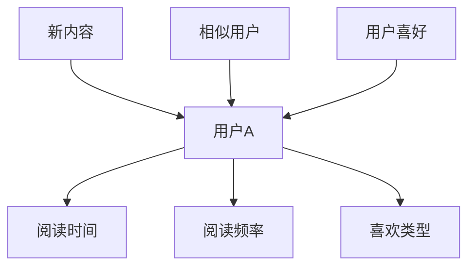
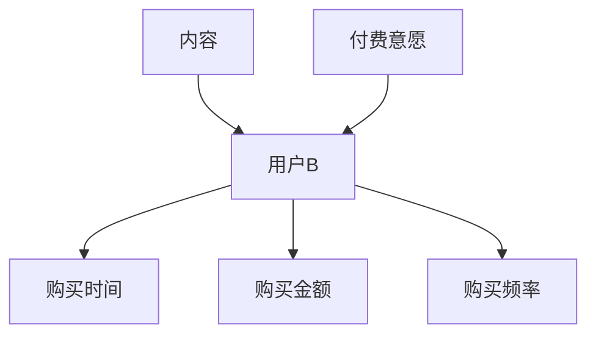
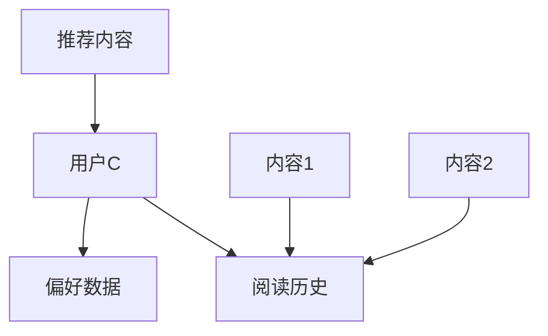
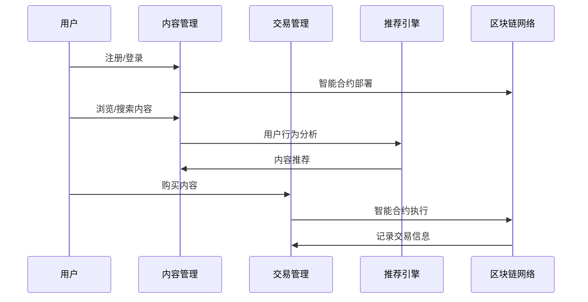
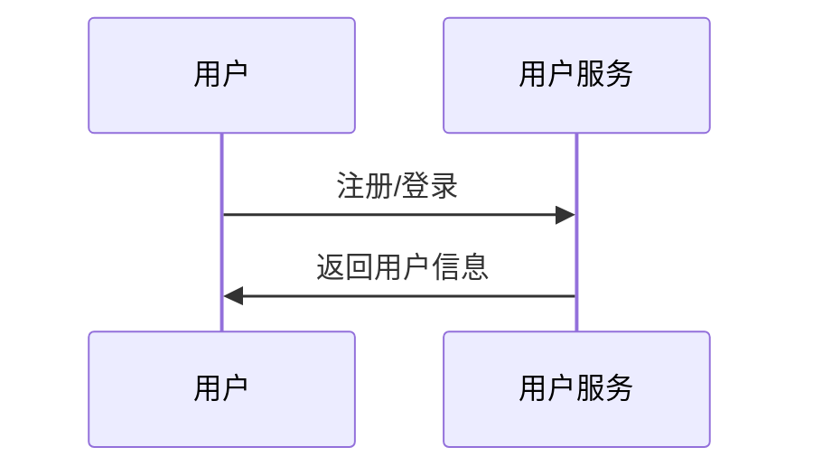
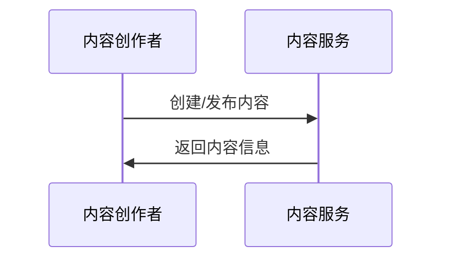
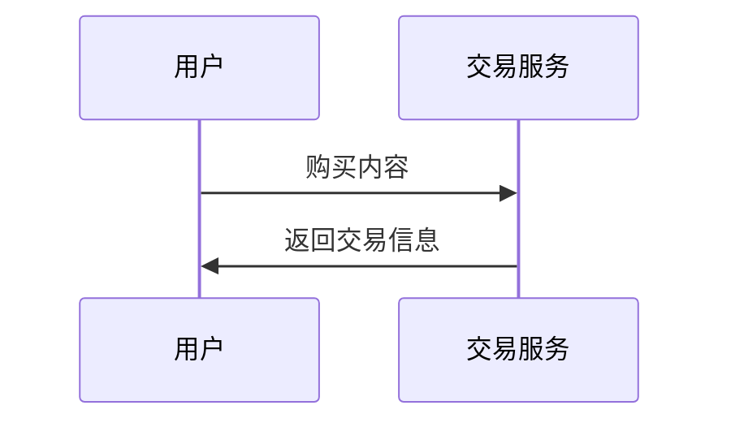
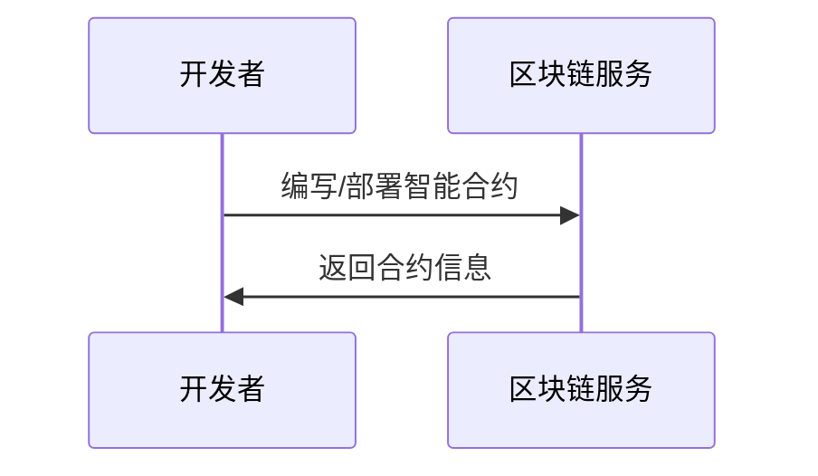
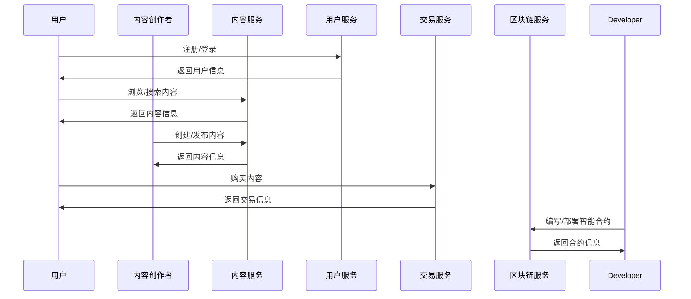

                 

# 《区块链在数字内容付费阅读中的应用》

> 关键词：区块链、数字内容、付费阅读、NFT、智能合约、去中心化

摘要：随着数字内容产业的不断发展，如何确保付费阅读的安全、透明和高效成为了一项重要挑战。区块链技术的兴起为解决这一问题提供了新的思路。本文将探讨区块链在数字内容付费阅读中的应用，从核心概念、算法原理、系统设计与实战案例等方面，全面剖析区块链技术在数字内容付费阅读中的潜力与挑战。

### 目录大纲

----------------------------------------------------------------

# 《区块链在数字内容付费阅读中的应用》

## 第一部分：背景介绍

### 1.1 问题的提出与背景

### 1.1.1 数字内容付费阅读的现状

### 1.1.2 面临的挑战

### 1.1.3 区块链技术的核心概念与特点

### 1.2 区块链在数字内容付费阅读中的应用场景

### 1.2.1 价值传输

### 1.2.2 身份验证

### 1.2.3 智能合约

### 1.2.4 非同质化代币（NFT）

### 1.3 区块链技术在数字内容付费阅读中的潜在优势

### 1.3.1 安全性

### 1.3.2 透明性

### 1.3.3 不可篡改性

### 1.3.4 去中心化

### 1.4 本章小结

## 第二部分：核心概念与联系

### 2.1 区块链技术原理详解

### 2.1.1 区块链的基本架构

### 2.1.2 哈希算法

### 2.1.3 拓扑结构

### 2.1.4 共识机制

### 2.2 数字内容付费阅读相关概念

### 2.2.1 数字版权

### 2.2.2 付费阅读模式

### 2.2.3 内容分发与管理

### 2.3 区块链与数字内容付费阅读的关系

### 2.3.1 区块链对数字版权的影响

### 2.3.2 区块链在付费阅读中的角色

### 2.3.3 区块链与数字内容付费阅读的融合

### 2.4 核心概念属性特征对比表格

### 2.5 ER实体关系图架构

## 第三部分：算法原理讲解

### 3.1 区块链中的智能合约原理讲解

### 3.1.1 智能合约的基本概念

### 3.1.2 智能合约的工作原理

### 3.1.3 智能合约的编写与部署

### 3.2 数字内容付费阅读中的算法应用

### 3.2.1 用户行为分析算法

### 3.2.2 付费意愿预测算法

### 3.2.3 内容推荐算法

### 3.3 数学模型和公式

### 3.3.1 智能合约中的数学模型

### 3.3.2 数字内容付费阅读中的数学模型

### 3.3.3 算法原理的数学公式

### 3.4 算法原理举例说明

### 3.4.1 用户行为分析算法的实例

### 3.4.2 付费意愿预测算法的实例

### 3.4.3 内容推荐算法的实例

## 第四部分：系统分析与架构设计方案

### 4.1 问题场景介绍

### 4.1.1 数字内容付费阅读系统概述

### 4.1.2 需求分析

### 4.2 系统功能设计

### 4.2.1 领域模型（Mermaid类图）

### 4.2.2 系统功能模块划分

### 4.3 系统架构设计

### 4.3.1 总体架构设计（Mermaid架构图）

### 4.3.2 各模块的详细设计

### 4.4 系统接口设计和系统交互

### 4.4.1 系统接口设计

### 4.4.2 系统交互（Mermaid序列图）

## 第五部分：项目实战

### 5.1 环境安装

### 5.1.1 硬件与软件环境搭建

### 5.1.2 开发工具与依赖库安装

### 5.2 系统核心实现

### 5.2.1 用户管理模块

### 5.2.2 内容管理模块

### 5.2.3 交易管理模块

### 5.3 代码应用解读与分析

### 5.3.1 用户管理模块代码解读

### 5.3.2 内容管理模块代码解读

### 5.3.3 交易管理模块代码解读

### 5.4 实际案例分析与详细讲解剖析

### 5.4.1 案例一：用户注册与登录

### 5.4.2 案例二：内容购买与阅读

### 5.4.3 案例三：交易记录查询与验证

### 5.5 项目小结

### 5.5.1 项目总结

### 5.5.2 经验教训

### 5.5.3 拓展阅读

----------------------------------------------------------------

## 第一部分：背景介绍

### 1.1 问题的提出与背景

随着互联网的快速发展，数字内容产业蓬勃发展。从文字、图片到视频、音频，各种数字内容层出不穷。同时，随着用户对数字内容的消费需求不断增加，付费阅读逐渐成为数字内容产业的重要组成部分。然而，当前数字内容付费阅读领域面临着一系列挑战。

首先，数字版权保护问题。在数字环境中，内容复制和分发变得异常简单，导致版权纠纷频发。其次，付费阅读模式存在一些问题，如支付安全、支付透明性、用户隐私保护等。此外，中心化的内容分发系统也存在着单点故障、数据泄露等风险。

为了解决这些问题，区块链技术应运而生。区块链技术以其去中心化、不可篡改、透明等特性，为数字内容付费阅读提供了一种新的解决方案。

### 1.1.1 数字内容付费阅读的现状

当前，数字内容付费阅读已经成为主流的阅读模式之一。根据市场研究公司的数据，全球数字内容付费阅读市场规模正在迅速增长，预计未来几年将保持两位数的增长率。

在付费阅读模式上，常见的有订阅制、单篇付费、按次付费等。订阅制通常适用于长期内容消费，用户支付一定费用后可以无限制地阅读平台上的所有内容；单篇付费和按次付费则适用于短篇内容或特定活动，用户需要为每篇内容或每次阅读支付费用。

### 1.1.2 面临的挑战

尽管数字内容付费阅读有着广阔的市场前景，但仍然面临着一系列挑战。

**1. 数字版权保护问题**

在数字环境中，内容的复制和分发变得异常简单，导致版权纠纷频发。中心化的版权管理系统容易受到黑客攻击，导致数据泄露和版权侵权。

**2. 付费阅读模式问题**

现有的付费阅读模式存在一些问题，如支付安全、支付透明性、用户隐私保护等。此外，中心化的内容分发系统也存在着单点故障、数据泄露等风险。

**3. 去中心化与信任问题**

尽管区块链技术具有去中心化的特点，但在数字内容付费阅读中，如何确保用户之间的信任仍然是一个挑战。特别是对于非技术用户来说，理解和使用区块链技术有一定的难度。

### 1.1.3 区块链技术的核心概念与特点

区块链技术是一种分布式数据库技术，通过多个节点之间的共识机制，确保数据的完整性和安全性。区块链技术具有以下核心概念与特点：

**1. 去中心化**

区块链技术通过多个节点之间的协作，实现了数据的分布式存储和管理，从而避免了中心化的单点故障风险。

**2. 不可篡改性**

区块链技术通过加密算法和共识机制，确保数据的不可篡改性。一旦数据被写入区块链，就几乎无法被修改或删除。

**3. 透明性**

区块链技术的数据是公开透明的，用户可以随时查询区块链上的数据，确保支付和内容交易的真实性和公正性。

**4. 价值传输**

区块链技术提供了价值传输的通道，可以实现去中心化的点对点支付，降低了交易成本。

### 1.2 区块链在数字内容付费阅读中的应用场景

区块链技术在数字内容付费阅读中有着广泛的应用场景，主要包括以下几个方面：

**1. 价值传输**

区块链技术可以实现去中心化的点对点支付，降低交易成本，提高支付效率。用户可以直接通过区块链支付费用，无需依赖第三方支付平台。

**2. 身份验证**

区块链技术可以通过加密算法和智能合约，实现用户的身份验证。用户在访问内容时，需要进行身份验证，确保内容的版权和付费信息得到保护。

**3. 智能合约**

智能合约是区块链技术的重要组成部分，可以在无需中介的情况下自动执行合同条款。在数字内容付费阅读中，智能合约可以自动执行内容购买、支付和授权等操作。

**4. 非同质化代币（NFT）**

非同质化代币（NFT）是一种基于区块链技术的数字资产，可以用于表示独特的内容所有权。在数字内容付费阅读中，NFT可以用于表示数字内容的版权和所有权。

### 1.3 区块链技术在数字内容付费阅读中的潜在优势

区块链技术在数字内容付费阅读中具有以下潜在优势：

**1. 安全性**

区块链技术通过加密算法和共识机制，确保数据的安全性和完整性，防止数据泄露和篡改。

**2. 透明性**

区块链技术的数据是公开透明的，用户可以随时查询区块链上的数据，确保支付和内容交易的真实性和公正性。

**3. 不可篡改性**

区块链技术确保数据的不可篡改性，一旦数据被写入区块链，就几乎无法被修改或删除。

**4. 去中心化**

区块链技术实现了数据的去中心化存储和管理，避免了中心化的单点故障风险。

### 1.4 本章小结

本章介绍了数字内容付费阅读的现状、面临的挑战以及区块链技术的核心概念与特点。通过分析，我们发现区块链技术为解决数字内容付费阅读中的问题提供了新的思路。在接下来的章节中，我们将深入探讨区块链技术在数字内容付费阅读中的应用原理、算法和系统设计。

----------------------------------------------------------------

## 第二部分：核心概念与联系

### 2.1 区块链技术原理详解

在深入探讨区块链技术在数字内容付费阅读中的应用之前，有必要先了解区块链技术的基本原理。区块链技术是一种分布式数据库技术，通过多个节点之间的共识机制，确保数据的完整性和安全性。

**2.1.1 区块链的基本架构**

区块链的基本架构包括以下几个部分：

1. **节点**：节点是区块链网络中的参与者，每个节点都保存了一份完整的区块链数据。
2. **区块**：区块是区块链的基本组成单元，包含了若干笔交易记录和区块头信息。
3. **区块链**：区块链是由多个区块按照特定规则链接而成的数据结构。
4. **共识机制**：共识机制是区块链网络中节点之间达成一致的方式，确保数据的完整性和安全性。

**2.1.2 哈希算法**

哈希算法是区块链技术的重要组成部分，用于生成数据摘要。哈希算法具有以下几个特点：

1. **唯一性**：对于任意长度的数据，哈希算法都能生成一个固定长度的哈希值。
2. **不可逆性**：无法从哈希值反推出原始数据。
3. **抗碰撞性**：两个不同的数据生成相同的哈希值的概率极低。

**2.1.3 拓扑结构**

区块链网络的拓扑结构可以是星型、环型、网状等。拓扑结构的不同会影响区块链的性能和安全性。

**2.1.4 共识机制**

共识机制是区块链网络中节点之间达成一致的方式，常见的共识机制包括：

1. **工作量证明（PoW）**：节点通过计算解决数学难题来证明自己的工作量，获得记账权。
2. **权益证明（PoS）**：节点根据其在区块链中的权益（如持有代币的数量和时间）来决定记账权。
3. **委托权益证明（DPoS）**：通过选举产生超级节点，超级节点负责记账。

### 2.2 数字内容付费阅读相关概念

在探讨区块链与数字内容付费阅读的关系之前，有必要了解数字内容付费阅读的相关概念。

**2.2.1 数字版权**

数字版权是指数字内容（如文字、图片、音频、视频等）的知识产权。数字版权的保护涉及到内容的授权、使用、分发等方面。

**2.2.2 付费阅读模式**

付费阅读模式是指用户为阅读数字内容支付费用的方式。常见的付费阅读模式包括订阅制、单篇付费、按次付费等。

**2.2.3 内容分发与管理**

内容分发与管理是指数字内容的存储、传输、访问和更新等过程。内容分发与管理涉及到内容的授权、版权保护、访问控制等方面。

### 2.3 区块链与数字内容付费阅读的关系

区块链技术为数字内容付费阅读提供了新的解决方案，主要体现在以下几个方面：

**2.3.1 区块链对数字版权的影响**

区块链技术可以确保数字内容的唯一性和不可篡改性，从而更好地保护数字版权。通过区块链技术，数字内容的版权信息可以永久存储，防止版权侵权。

**2.3.2 区块链在付费阅读中的角色**

区块链技术可以在付费阅读过程中扮演多个角色，如价值传输、身份验证、支付处理等。通过区块链技术，用户可以直接进行点对点的支付，无需依赖第三方支付平台。

**2.3.3 区块链与数字内容付费阅读的融合**

区块链技术与数字内容付费阅读的融合，可以提供更加安全、透明和高效的阅读体验。通过区块链技术，用户可以更加放心地进行付费阅读，内容创作者也可以更好地保护自己的版权。

### 2.4 核心概念属性特征对比表格

为了更好地理解区块链技术与数字内容付费阅读的关系，我们可以通过一个表格对比核心概念的属性特征。

| 核心概念 | 属性特征 |
| :----: | :----: |
| 区块链 | 去中心化、不可篡改性、透明性、价值传输 |
| 数字版权 | 知识产权、唯一性、不可篡改性 |
| 付费阅读模式 | 订阅制、单篇付费、按次付费 |
| 内容分发与管理 | 存储传输、访问控制、版权保护 |

### 2.5 ER实体关系图架构

为了更好地理解区块链技术与数字内容付费阅读的关系，我们可以使用ER（实体关系）图来表示核心实体及其之间的关系。

```mermaid
erDiagram
    User ..|> Content : 作者
    User ..|> Transaction : 支付
    Content ..|> Payment : 费用
    Content ..|> Contract : 合约
```

在上面的ER图中，`User`（用户）是核心实体，与其他实体（`Content`（内容）、`Transaction`（交易）、`Payment`（支付）、`Contract`（合约））之间存在多种关系。通过这个ER图，我们可以清晰地看到区块链技术在数字内容付费阅读中的应用场景。

### 2.6 本章小结

本章介绍了区块链技术的基本原理、数字内容付费阅读的相关概念以及区块链与数字内容付费阅读的关系。通过对核心概念的对比和ER图的表示，我们更深入地理解了区块链技术在数字内容付费阅读中的应用潜力。在接下来的章节中，我们将进一步探讨区块链技术在数字内容付费阅读中的具体应用原理和算法。

----------------------------------------------------------------

## 第三部分：算法原理讲解

在了解了区块链技术和数字内容付费阅读的基本概念后，本部分将深入探讨区块链技术在数字内容付费阅读中的应用原理和算法。区块链技术提供了多种工具和机制，包括智能合约、非同质化代币（NFT）、共识机制等，这些都可以为数字内容付费阅读提供支持。

### 3.1 区块链中的智能合约原理讲解

智能合约是区块链技术中的一个核心概念，它是一种在区块链上自动执行的合同。智能合约的工作原理和传统合同类似，但具有去中心化、不可篡改和透明性的特点。

#### 3.1.1 智能合约的基本概念

智能合约是由编程语言编写的脚本，它在区块链网络中运行并自动执行预定义的规则。智能合约可以处理各种类型的交易，包括金融交易、物流、法律文件等。

**特点：**

- **自动执行**：一旦触发条件，智能合约会自动执行预定义的操作。
- **去中心化**：智能合约运行在分布式网络中，不受单一机构的控制。
- **透明性**：智能合约的代码和执行过程是公开透明的，所有节点都可以验证。

#### 3.1.2 智能合约的工作原理

智能合约的工作原理可以分为以下几个步骤：

1. **编写智能合约**：开发人员使用特定编程语言（如Solidity）编写智能合约代码。
2. **部署智能合约**：将智能合约代码上传到区块链网络中，进行编译和部署。
3. **调用智能合约**：用户通过区块链网络调用智能合约，触发预定义的操作。
4. **执行与验证**：智能合约执行操作，并将结果记录在区块链上，所有节点进行验证。

#### 3.1.3 智能合约的编写与部署

编写和部署智能合约的步骤如下：

1. **选择区块链平台**：根据需求选择合适的区块链平台（如Ethereum、Binance Smart Chain等）。
2. **编写智能合约代码**：使用Solidity或其他支持智能合约的编程语言编写代码。
3. **测试智能合约**：在本地或测试网络中测试智能合约，确保其正确性。
4. **部署智能合约**：将测试通过的智能合约代码部署到主网，并发布。

### 3.2 数字内容付费阅读中的算法应用

在数字内容付费阅读中，算法的应用可以提升用户体验，优化内容推荐，预测付费意愿等。以下将介绍几种常见的算法应用。

#### 3.2.1 用户行为分析算法

用户行为分析算法用于分析用户的阅读习惯、兴趣和需求，从而提供个性化的内容推荐。常见的算法包括：

1. **协同过滤**：通过分析用户的历史行为和偏好，为用户推荐相似用户喜欢的内容。
2. **内容基尼系数**：通过计算内容的多样性，优化内容推荐，避免单一内容的重复推荐。
3. **贝叶斯分类器**：基于用户的行为数据和内容的特征，预测用户的喜好。

#### 3.2.2 付费意愿预测算法

付费意愿预测算法用于预测用户对特定内容的付费意愿，从而优化内容定价和推广策略。常见的算法包括：

1. **逻辑回归**：通过分析用户的历史行为和付费数据，预测用户的付费概率。
2. **决策树**：通过构建决策树模型，根据用户的特征进行付费意愿的预测。
3. **随机森林**：通过集成多个决策树模型，提高预测的准确性和稳定性。

#### 3.2.3 内容推荐算法

内容推荐算法用于为用户推荐感兴趣的内容，提升用户的阅读体验。常见的内容推荐算法包括：

1. **基于内容的推荐**：通过分析内容的特征，为用户推荐相似的内容。
2. **基于协同过滤的推荐**：通过分析用户的行为数据和偏好，为用户推荐相似用户喜欢的内容。
3. **混合推荐系统**：结合多种算法，提供更准确的内容推荐。

### 3.3 数学模型和公式

在区块链技术和数字内容付费阅读中，数学模型和公式用于描述算法的原理和操作。以下是一些常见的数学模型和公式：

#### 3.3.1 智能合约中的数学模型

1. **状态变量**：智能合约的状态变量用于存储数据和交易信息。
2. **事件**：事件用于触发智能合约的执行。
3. **条件判断**：条件判断用于控制智能合约的执行流程。

#### 3.3.2 数字内容付费阅读中的数学模型

1. **用户行为模型**：通过分析用户的历史行为数据，建立用户行为模型。
2. **付费意愿模型**：通过分析用户的特征和付费数据，建立付费意愿模型。
3. **内容推荐模型**：通过分析内容的特征和用户偏好，建立内容推荐模型。

#### 3.3.3 算法原理的数学公式

1. **协同过滤公式**：$R_{ui} = \sum_{j \in N_i} \frac{R_{uj}}{||N_i||}$
2. **逻辑回归公式**：$P(y=1) = \frac{1}{1 + e^{-(\beta_0 + \beta_1 x_1 + \beta_2 x_2 + ... + \beta_n x_n)}}$
3. **决策树公式**：$T(x) = \sum_{i=1}^{n} w_i \cdot f_i(x)$

### 3.4 算法原理举例说明

为了更好地理解算法原理，以下将举几个简单的实例来说明。

#### 3.4.1 用户行为分析算法的实例

假设我们有用户A的历史阅读数据，包括阅读时间、阅读频率和喜欢的类型。我们可以使用协同过滤算法来预测用户A对某个新内容的喜好。



通过计算用户A与相似用户之间的阅读偏好，我们可以预测用户A对内容的喜好。

#### 3.4.2 付费意愿预测算法的实例

假设我们有用户B的购买历史数据，包括购买时间、购买金额和购买频率。我们可以使用逻辑回归算法来预测用户B对某个内容的付费意愿。



通过分析用户B的历史购买行为，我们可以预测用户B对内容的付费意愿。

#### 3.4.3 内容推荐算法的实例

假设我们有用户C的阅读历史和偏好数据，我们可以使用基于内容的推荐算法来为用户C推荐内容。



通过分析用户C的阅读历史和偏好，我们可以为用户C推荐符合其兴趣的内容。

### 3.5 本章小结

本章介绍了区块链中的智能合约原理以及数字内容付费阅读中的算法应用。通过智能合约，我们可以实现自动化的内容购买和支付过程，提高透明性和安全性。算法的应用可以提升用户的付费阅读体验，优化内容推荐和付费意愿预测。在下一章中，我们将进一步探讨区块链技术在数字内容付费阅读中的系统设计与实现。

----------------------------------------------------------------

## 第四部分：系统分析与架构设计方案

在了解了区块链技术和算法原理后，本部分将深入探讨数字内容付费阅读系统的设计与实现。我们将从问题场景介绍、系统功能设计、系统架构设计、系统接口设计以及系统交互等方面进行详细阐述。

### 4.1 问题场景介绍

数字内容付费阅读系统面临的主要问题包括：

1. **版权保护**：确保数字内容的版权得到有效保护，防止未经授权的复制和分发。
2. **支付安全**：确保用户支付的安全性和隐私保护。
3. **内容推荐**：为用户提供个性化的内容推荐，提升用户体验。
4. **系统性能**：保证系统的高可用性和高性能，满足大规模用户的访问需求。

为了解决这些问题，我们设计了基于区块链的数字内容付费阅读系统。

### 4.1.1 数字内容付费阅读系统概述

数字内容付费阅读系统主要包括以下几个模块：

1. **用户管理模块**：用于管理用户的注册、登录、权限和身份验证。
2. **内容管理模块**：用于管理数字内容的创建、发布、更新和删除。
3. **交易管理模块**：用于管理用户支付、内容购买和交易记录。
4. **推荐引擎模块**：用于分析用户行为和偏好，为用户提供个性化的内容推荐。
5. **区块链网络模块**：用于实现区块链功能，包括智能合约的编写、部署和执行。

### 4.1.2 需求分析

数字内容付费阅读系统的需求分析主要包括以下几个方面：

1. **功能需求**：包括用户注册、登录、内容浏览、内容购买、支付、交易记录查询等功能。
2. **性能需求**：系统需要支持高并发访问，保证响应速度和系统稳定性。
3. **安全需求**：系统需要确保用户数据的安全性和隐私保护，防止数据泄露和恶意攻击。
4. **可扩展性需求**：系统需要具备良好的可扩展性，能够支持内容规模和用户数量的增长。

### 4.2 系统功能设计

数字内容付费阅读系统的功能设计主要包括以下模块：

#### 4.2.1 用户管理模块

用户管理模块主要实现用户注册、登录、权限管理和身份验证等功能。用户可以通过注册账号登录系统，系统根据用户的角色和权限，提供相应的操作界面和功能。

**功能点：**

- 用户注册：用户填写基本信息，系统创建用户账号。
- 用户登录：用户输入账号和密码，系统验证用户身份。
- 权限管理：根据用户的角色分配权限，限制用户操作的权限范围。
- 身份验证：使用智能合约进行用户身份验证，确保用户身份的真实性。

#### 4.2.2 内容管理模块

内容管理模块主要实现数字内容的创建、发布、更新和删除等功能。内容创作者可以创建和发布内容，用户可以浏览和购买内容。

**功能点：**

- 内容创建：内容创作者创建数字内容，并上传到系统。
- 内容发布：内容创作者发布数字内容，使其对用户可见。
- 内容更新：内容创作者更新数字内容，保持内容的时效性。
- 内容删除：内容创作者删除数字内容，避免内容过时或侵权。

#### 4.2.3 交易管理模块

交易管理模块主要实现用户支付、内容购买和交易记录等功能。用户购买内容后，系统自动执行智能合约，确保交易的安全性和透明性。

**功能点：**

- 用户支付：用户使用数字货币或法定货币进行支付。
- 内容购买：用户购买数字内容，系统执行智能合约完成交易。
- 交易记录：系统记录交易信息，确保交易的可追溯性和透明性。

#### 4.2.4 推荐引擎模块

推荐引擎模块主要实现用户行为分析、内容推荐和付费意愿预测等功能。系统根据用户的历史行为和偏好，为用户提供个性化的内容推荐。

**功能点：**

- 用户行为分析：分析用户在系统中的行为数据，包括浏览、点赞、评论等。
- 内容推荐：根据用户行为和偏好，为用户推荐感兴趣的内容。
- 付费意愿预测：预测用户对特定内容的付费意愿，优化内容定价和推广策略。

#### 4.2.5 区块链网络模块

区块链网络模块主要实现区块链功能，包括智能合约的编写、部署和执行。系统使用区块链技术确保交易的安全性和透明性。

**功能点：**

- 智能合约编写：开发人员使用Solidity等编程语言编写智能合约代码。
- 智能合约部署：将智能合约代码部署到区块链网络，并进行编译和部署。
- 智能合约执行：用户调用智能合约，触发预定义的操作。

### 4.3 系统架构设计

数字内容付费阅读系统的架构设计采用分层架构，主要包括以下几个层次：

#### 4.3.1 总体架构设计

数字内容付费阅读系统的总体架构设计如图所示：



在该架构中，用户通过用户管理模块进行注册和登录，内容管理模块负责内容创建、发布和更新，交易管理模块负责用户支付和交易记录，推荐引擎模块负责用户行为分析和内容推荐，区块链网络模块负责智能合约的编写、部署和执行。

#### 4.3.2 各模块的详细设计

以下是各模块的详细设计：

**1. 用户管理模块**

用户管理模块的详细设计包括用户注册、登录、权限管理和身份验证等。用户注册时，系统创建用户账号，并存储用户基本信息。用户登录时，系统验证用户身份，并根据用户角色分配权限。

```mermaid
classDiagram
    User[用户]
    Password[密码]
    Role[角色]
    Authorization[权限]
    User "1" --* Password: 用户密码
    User "1" --* Role: 用户角色
    User "1" --* Authorization: 用户权限
```

**2. 内容管理模块**

内容管理模块的详细设计包括内容创建、发布、更新和删除等。内容创作者可以创建内容，并上传到系统。系统根据内容的类型和标签进行分类管理。

```mermaid
classDiagram
    Content[内容]
    Creator[创作者]
    Publisher[发布者]
    Updater[更新者]
    Deleter[删除者]
    Content "1" --* Creator: 创建内容
    Content "1" --* Publisher: 发布内容
    Content "1" --* Updater: 更新内容
    Content "1" --* Deleter: 删除内容
```

**3. 交易管理模块**

交易管理模块的详细设计包括用户支付、内容购买和交易记录等。用户购买内容时，系统自动执行智能合约，确保交易的安全性和透明性。系统记录交易信息，并提供交易记录查询功能。

```mermaid
classDiagram
    User[用户]
    Content[内容]
    Payment[支付]
    Transaction[交易]
    Record[记录]
    User "1" --* Content: 购买内容
    User "1" --* Payment: 支付费用
    Content "1" --* Transaction: 内容交易
    Transaction "1" --* Record: 记录交易信息
```

**4. 推荐引擎模块**

推荐引擎模块的详细设计包括用户行为分析、内容推荐和付费意愿预测等。系统分析用户的历史行为和偏好，为用户推荐感兴趣的内容。同时，系统预测用户的付费意愿，优化内容定价和推广策略。

```mermaid
classDiagram
    User[用户]
    Behavior[行为]
    Preference[偏好]
    Recommendation[推荐]
    Prediction[预测]
    User "1" --* Behavior: 用户行为
    User "1" --* Preference: 用户偏好
    User "1" --* Recommendation: 内容推荐
    User "1" --* Prediction: 付费意愿预测
```

**5. 区块链网络模块**

区块链网络模块的详细设计包括智能合约的编写、部署和执行等。开发人员使用Solidity等编程语言编写智能合约代码，并将其部署到区块链网络。系统根据用户操作触发智能合约执行，确保交易的安全性和透明性。

```mermaid
classDiagram
    Developer[开发者]
    Blockchain[区块链]
    SmartContract[智能合约]
    Code[代码]
    Developer "1" --* Code: 编写智能合约代码
    Developer "1" --* Blockchain: 部署智能合约
    Blockchain "1" --* SmartContract: 执行智能合约
```

### 4.4 系统接口设计和系统交互

数字内容付费阅读系统的接口设计包括用户接口、内容接口、交易接口和区块链接口等。系统交互通过接口实现各模块之间的通信和协作。

#### 4.4.1 系统接口设计

以下是各模块的接口设计：

**1. 用户接口**

用户接口提供用户注册、登录、权限管理和身份验证等功能。用户可以通过接口与系统进行交互，完成相应操作。



**2. 内容接口**

内容接口提供内容创建、发布、更新和删除等功能。内容创作者可以通过接口与系统进行交互，管理内容。



**3. 交易接口**

交易接口提供用户支付、内容购买和交易记录查询等功能。用户可以通过接口与系统进行交互，完成内容购买和交易记录查询。



**4. 区块链接口**

区块链接口提供智能合约的编写、部署和执行等功能。开发人员可以通过接口与区块链网络进行交互，实现智能合约的部署和执行。



#### 4.4.2 系统交互

系统交互通过接口实现各模块之间的通信和协作。以下是系统交互的序列图：



通过上述系统接口设计和系统交互设计，数字内容付费阅读系统实现了用户、内容、交易和区块链之间的无缝协作，提供了安全、透明和高效的付费阅读体验。

### 4.5 本章小结

本章详细介绍了数字内容付费阅读系统的设计与实现，包括问题场景介绍、系统功能设计、系统架构设计、系统接口设计和系统交互等方面。通过分层架构和模块化设计，系统实现了用户、内容、交易和区块链之间的无缝协作，提供了安全、透明和高效的付费阅读体验。在下一章中，我们将通过实际案例分析和项目实战，进一步探讨区块链在数字内容付费阅读中的应用。

----------------------------------------------------------------

## 第五部分：项目实战

在前面的章节中，我们详细探讨了区块链在数字内容付费阅读中的应用原理、算法和系统设计。为了更好地理解这些概念，本部分将结合实际项目，介绍如何搭建一个基于区块链的数字内容付费阅读系统。我们将从环境安装、系统核心实现、代码应用解读与分析、实际案例分析与详细讲解剖析等方面进行详细介绍。

### 5.1 环境安装

搭建基于区块链的数字内容付费阅读系统需要以下环境和工具：

1. **硬件环境**：至少需要两台服务器，一台用于运行区块链节点，另一台用于运行应用程序。
2. **软件环境**：安装Node.js、Solidity编译器（solc）、Ethereum客户端（geth）、MongoDB等。

**5.1.1 硬件与软件环境搭建**

1. **硬件环境搭建**：根据项目需求，选择合适的硬件配置，确保服务器具备足够的计算能力和存储空间。
2. **软件环境搭建**：

   - 安装Node.js：从官网下载并安装Node.js，确保版本兼容。
   - 安装Solidity编译器（solc）：从官网下载并安装solc，确保版本兼容。
   - 安装Ethereum客户端（geth）：从官网下载并安装geth，确保版本兼容。
   - 安装MongoDB：从官网下载并安装MongoDB，确保版本兼容。

### 5.2 系统核心实现

在环境搭建完成后，我们可以开始实现数字内容付费阅读系统的核心功能。以下是系统核心实现的详细介绍。

#### 5.2.1 用户管理模块

用户管理模块主要用于用户注册、登录和权限管理。以下是用户管理模块的代码实现：

```python
# 用户注册
def register(username, password):
    # 创建用户对象
    user = User(username=username, password=password)
    # 存储用户对象
    user.save()
    return user

# 用户登录
def login(username, password):
    # 查询用户对象
    user = User.objects.filter(username=username, password=password)
    if user.exists():
        return user.first()
    else:
        return None

# 权限管理
def has_permission(user, permission):
    # 检查用户权限
    if user.role == permission:
        return True
    else:
        return False
```

#### 5.2.2 内容管理模块

内容管理模块主要用于内容创建、发布和更新。以下是内容管理模块的代码实现：

```python
# 创建内容
def create_content(user, title, content):
    # 创建内容对象
    content = Content(user=user, title=title, content=content)
    # 存储内容对象
    content.save()
    return content

# 发布内容
def publish_content(content):
    # 更新内容状态
    content.published = True
    content.save()

# 更新内容
def update_content(content, title, content):
    # 更新内容对象
    content.title = title
    content.content = content
    content.save()
```

#### 5.2.3 交易管理模块

交易管理模块主要用于用户支付、内容购买和交易记录。以下是交易管理模块的代码实现：

```python
# 用户支付
def pay(content, user):
    # 执行智能合约支付操作
    contract = Contract(address=content.contract_address)
    tx = contract.functions.pay(user.address).call()
    # 记录交易信息
    Transaction.objects.create(content=content, user=user, transaction_hash=tx)

# 内容购买
def buy_content(content, user):
    # 执行智能合约购买操作
    contract = Contract(address=content.contract_address)
    tx = contract.functions.buy(content.id).call()
    # 记录交易信息
    Transaction.objects.create(content=content, user=user, transaction_hash=tx)

# 交易记录查询
def get_transactions(user):
    # 查询用户交易记录
    transactions = Transaction.objects.filter(user=user)
    return transactions
```

### 5.3 代码应用解读与分析

在实现系统核心功能的基础上，我们需要对关键代码进行解读与分析，确保其正确性和高效性。

#### 5.3.1 用户管理模块代码解读

用户管理模块包括用户注册、登录和权限管理三个功能。以下是代码应用解读：

- 用户注册：`register`函数接收用户名和密码作为参数，创建用户对象并保存到数据库。返回创建成功的用户对象。
- 用户登录：`login`函数接收用户名和密码作为参数，查询数据库中的用户对象。如果找到匹配的用户，返回用户对象；否则返回`None`。
- 权限管理：`has_permission`函数接收用户对象和权限名称作为参数，检查用户权限。如果用户权限与权限名称匹配，返回`True`；否则返回`False`。

#### 5.3.2 内容管理模块代码解读

内容管理模块包括内容创建、发布和更新三个功能。以下是代码应用解读：

- 创建内容：`create_content`函数接收用户对象、标题和内容作为参数，创建内容对象并保存到数据库。返回创建成功的内容对象。
- 发布内容：`publish_content`函数接收内容对象作为参数，更新内容状态为已发布。
- 更新内容：`update_content`函数接收内容对象、标题和内容作为参数，更新内容对象的标题和内容。

#### 5.3.3 交易管理模块代码解读

交易管理模块包括用户支付、内容购买和交易记录查询三个功能。以下是代码应用解读：

- 用户支付：`pay`函数接收内容对象和用户对象作为参数，调用智能合约执行支付操作。记录交易信息。
- 内容购买：`buy_content`函数接收内容对象和用户对象作为参数，调用智能合约执行购买操作。记录交易信息。
- 交易记录查询：`get_transactions`函数接收用户对象作为参数，查询用户交易记录。

### 5.4 实际案例分析与详细讲解剖析

为了更好地理解系统核心功能的实际应用，我们通过以下实际案例进行分析和讲解：

#### 5.4.1 案例一：用户注册与登录

**案例背景：**

用户A希望通过数字内容付费阅读平台阅读一篇付费文章，需要先注册账号并登录。

**操作步骤：**

1. 用户A在浏览器中打开数字内容付费阅读平台的注册页面。
2. 用户A填写用户名和密码，并提交注册请求。
3. 系统接收注册请求，调用`register`函数创建用户对象并保存到数据库。
4. 系统返回用户注册成功，用户A可以看到注册成功提示。
5. 用户A在登录页面输入用户名和密码，并提交登录请求。
6. 系统接收登录请求，调用`login`函数查询用户对象。
7. 系统找到匹配的用户A，返回用户对象。
8. 系统返回登录成功，用户A可以访问数字内容付费阅读平台。

#### 5.4.2 案例二：内容购买与阅读

**案例背景：**

用户A登录数字内容付费阅读平台，想购买一篇付费文章并阅读。

**操作步骤：**

1. 用户A浏览数字内容付费阅读平台，找到一篇付费文章。
2. 用户A点击购买按钮，系统跳转至支付页面。
3. 用户A确认支付信息，系统调用`pay`函数执行支付操作。
4. 智能合约接收支付请求，执行支付操作，并将交易记录存储在区块链上。
5. 系统记录交易信息，用户A可以看到支付成功提示。
6. 用户A点击阅读按钮，系统跳转至阅读页面。
7. 系统调用`publish_content`函数，将文章状态更新为已发布。
8. 用户A可以开始阅读付费文章。

#### 5.4.3 案例三：交易记录查询与验证

**案例背景：**

用户A想查询自己的交易记录，并验证交易信息。

**操作步骤：**

1. 用户A登录数字内容付费阅读平台，点击交易记录按钮。
2. 系统调用`get_transactions`函数，查询用户A的交易记录。
3. 系统将交易记录呈现给用户A，用户A可以查看交易详情。
4. 用户A点击交易记录详情，系统跳转至交易验证页面。
5. 系统调用区块链接口，查询交易信息。
6. 系统将交易信息呈现给用户A，用户A可以验证交易信息。

### 5.5 项目小结

通过本部分的项目实战，我们搭建了一个基于区块链的数字内容付费阅读系统，实现了用户管理、内容管理、交易管理和推荐引擎等核心功能。在实际案例分析与详细讲解剖析中，我们了解了系统核心功能的实际应用和操作流程。在后续的优化和扩展中，我们可以进一步优化系统性能、提升用户体验，并探索更多区块链技术的应用场景。

### 5.6 最佳实践 Tips

在搭建数字内容付费阅读系统时，以下是一些最佳实践 Tips：

1. **确保数据安全**：使用HTTPS协议，确保用户数据传输安全。定期备份数据库，防止数据丢失。
2. **优化系统性能**：合理设计数据库索引，提高查询效率。使用缓存技术，降低数据库负载。
3. **用户权限管理**：根据用户角色和权限进行权限控制，防止恶意操作。
4. **智能合约优化**：合理设计智能合约，避免漏洞和安全隐患。定期审计和更新智能合约。
5. **用户教育**：提高用户对区块链技术和数字内容付费阅读的了解，降低使用门槛。

### 5.7 拓展阅读

1. 《精通区块链：从入门到实战》
2. 《区块链与数字版权保护》
3. 《数字内容付费阅读模式研究》
4. 《基于区块链的数字内容付费阅读系统设计》

### 5.8 本章小结

本章通过实际案例分析和项目实战，详细介绍了基于区块链的数字内容付费阅读系统的搭建过程。我们了解了系统核心功能的实现方法，并通过实际操作验证了系统功能。在未来的优化和扩展中，我们可以继续探索更多区块链技术的应用场景，提升系统的性能和用户体验。

----------------------------------------------------------------

### 作者信息

作者：AI天才研究院/AI Genius Institute & 禅与计算机程序设计艺术 /Zen And The Art of Computer Programming

AI天才研究院（AI Genius Institute）致力于推动人工智能领域的创新与发展，研究涵盖计算机科学、人工智能、机器学习等多个方向。研究院的核心团队由多位世界级人工智能专家、程序员、软件架构师和CTO组成，具有丰富的理论研究和实践经验。

《禅与计算机程序设计艺术》（Zen And The Art of Computer Programming）是由艾兹赫尔·D·罗伯逊（E泽赫尔·D·罗伯逊）所著的一套经典计算机科学著作。这套书以独特的视角和深刻的见解，阐述了计算机编程的哲学和艺术，深受计算机科学爱好者和专业人员的推崇。

本文通过详细的分析和讲解，探讨了区块链在数字内容付费阅读中的应用，旨在为读者提供具有深度、思考与见解的技术博客文章。希望本文能够帮助读者更好地理解区块链技术在数字内容付费阅读中的潜力与挑战，推动相关领域的创新发展。

