                 

### 第一部分：引言

#### 1.1 背景介绍

随着互联网和数字技术的飞速发展，数字内容分发逐渐成为文化产业的重要组成部分。无论是文学作品、音乐、视频还是软件应用，数字内容已经渗透到我们生活的方方面面。然而，伴随着数字内容的普及，创作者权益保护的问题也日益凸显。

在传统的版权保护和授权机制中，创作者的权益往往难以得到有效保障。一方面，版权登记和认证过程繁琐、成本高昂；另一方面，数字化时代的内容共享和二次创作现象普遍，创作者的原创作品容易被抄袭和盗用。此外，现有的版权交易市场也存在着信息不对称、版权纠纷等问题，严重影响了创作者的收益和积极性。

为了适应数字化时代的需求，必须寻找新的解决方案来保护创作者的权益。区块链技术的出现为数字内容分发提供了新的契机。区块链具有去中心化、不可篡改和透明性等特点，可以在数字内容分发中实现版权的透明化和可追溯性，从而有效保护创作者的权益。

#### 1.2 核心概念与联系

##### 1.2.1 区块链

区块链是一种分布式数据库技术，通过加密算法和共识机制确保数据的不可篡改和透明性。它由一系列按时间顺序排列的区块组成，每个区块包含一定数量的交易记录，并通过密码学方法确保前后区块的连接。区块链的核心特点包括去中心化、不可篡改、透明性和可追溯性。

- **去中心化**：区块链网络中没有中央控制机构，数据由全网节点共同维护。这意味着任何节点都可以参与区块链的运行和管理，提高了系统的可靠性和抗攻击性。
- **不可篡改**：一旦数据上链，就难以被篡改。区块链利用加密算法确保数据的完整性和一致性，任何试图篡改数据的操作都会被其他节点识别并拒绝。
- **透明性**：所有数据对所有节点可见，便于审计和验证。这使得区块链上的交易记录公开透明，有利于提高交易的信任度。
- **可追溯性**：区块链记录了所有的交易历史，可以追溯到数据来源和去向。这为数字内容的版权管理提供了强有力的支持。

##### 1.2.2 数字内容分发

数字内容分发是指通过网络渠道将数字化的文本、图片、音频、视频等作品传播到用户终端的过程。数字内容分发涉及到版权、授权、交易、支付等多个环节。

- **版权**：创作者对其创作成果享有的法律权利，包括复制权、发行权、展示权、改编权等。在数字内容分发中，版权问题尤为重要，因为数字化内容的传播速度和范围远超传统媒介。
- **授权**：创作者或版权持有者授权第三方使用其作品的权利。授权可以是一次性的，也可以是长期的，通常伴随着版税的支付。
- **交易**：数字内容交易的各个环节，包括购买、销售、支付等。区块链技术可以提高数字内容交易的透明度和效率。
- **支付**：数字内容分发中的支付方式，通常涉及货币支付和虚拟货币支付。区块链技术可以通过智能合约实现自动化的支付和结算。

##### 1.2.3 创作者权益保护

创作者权益保护是指确保创作者对其创作成果拥有合法的权利，包括版权、署名权、收益权等。在数字化时代，创作者权益保护面临着技术挑战和法律困境。

- **版权保护**：确保创作者的作品不被未经授权的复制、传播和利用。区块链技术可以通过上链记录版权信息，实现版权的透明化和可追溯性。
- **署名权保护**：确保创作者的署名权得到尊重，其作品在传播和引用时能正确标识创作者的身份。
- **收益权保护**：确保创作者从其作品中获得应有的经济回报，防止版权侵权和利益流失。

#### 1.3 区块链在数字内容分发中的应用

##### 1.3.1 去中心化版权管理

区块链技术可以实现版权的透明化和去中心化管理，创作者可以将作品上链，确保版权信息的真实性和不可篡改性。

- **版权声明**：创作者可以将版权声明上链，记录作品的版权信息和创作者身份。
- **版权认证**：区块链网络中的节点可以验证版权声明的真实性，确保版权信息的不可篡改。
- **版权交易**：创作者可以在区块链上进行版权交易，如授权、转让、许可等，提高交易的透明度和效率。

##### 1.3.2 智能合约

智能合约是一种基于区块链技术的自动化合同，它可以自动执行合约条款，确保交易的合法性和高效性。

- **版权授权**：创作者可以使用智能合约自动执行版权授权，简化授权流程，提高交易效率。
- **版税分配**：智能合约可以按照合约条款自动分配版税，确保创作者获得应有的经济回报。
- **内容交易**：智能合约可以用于数字内容交易，如购买、销售、支付等，提高交易的透明度和安全性。

##### 1.3.3 数字身份认证

区块链技术可以提供数字身份认证服务，确保用户身份的真实性和唯一性，为创作者和消费者提供可信的交互环境。

- **身份注册**：用户可以在区块链上注册数字身份，确保身份信息的安全和隐私。
- **身份验证**：区块链网络中的节点可以验证用户身份，确保交互的真实性和可靠性。
- **隐私保护**：区块链技术可以通过加密算法保护用户隐私，防止个人信息泄露。

#### 1.4 创作者权益保护的挑战与机遇

##### 1.4.1 挑战

区块链技术在数字内容分发中的应用面临着技术成熟度、法律规范、市场接受度等多方面的挑战。

- **技术成熟度**：区块链技术仍在不断发展，其性能、稳定性、安全性等方面仍有待提升，以适应大规模应用的需求。
- **法律规范**：数字内容分发的法律规范尚不完善，如何保障创作者权益、处理版权纠纷等问题需要进一步明确。
- **市场接受度**：市场对区块链技术的认知和接受度有限，需要加大宣传和推广力度，提高市场认可度。

##### 1.4.2 机遇

随着区块链技术的不断成熟和普及，创作者权益保护面临着前所未有的机遇，有望解决数字化时代创作者权益保护的难题。

- **技术创新**：区块链技术的不断发展将带来更多创新应用，为创作者权益保护提供更多可能性。
- **法律完善**：随着数字内容分发市场的发展，相关法律规范将逐步完善，为创作者权益保护提供更有力的法律支持。
- **市场机遇**：数字内容分发市场广阔，创作者权益保护的需求日益增加，为区块链技术提供了广阔的应用场景。

#### 1.5 本章小结

本章介绍了区块链在数字内容分发中的应用，探讨了创作者权益保护的核心概念、联系和应用。通过去中心化版权管理、智能合约和数字身份认证等技术手段，区块链为数字内容分发提供了新的解决方案，有望解决创作者权益保护的问题。然而，区块链技术在数字内容分发中的应用仍面临诸多挑战，需要进一步探索和完善。

----------------------------------------------------------------

### 第一部分：引言

#### 1.1 背景介绍

随着互联网和数字技术的飞速发展，数字内容分发已经成为文化产业的重要组成部分。无论是文学作品、音乐、视频还是软件应用，数字内容已经渗透到我们生活的方方面面。然而，伴随着数字内容的普及，创作者权益保护的问题也日益凸显。

在传统的版权保护和授权机制中，创作者的权益往往难以得到有效保障。一方面，版权登记和认证过程繁琐、成本高昂；另一方面，数字化时代的内容共享和二次创作现象普遍，创作者的原创作品容易被抄袭和盗用。此外，现有的版权交易市场也存在着信息不对称、版权纠纷等问题，严重影响了创作者的收益和积极性。

为了适应数字化时代的需求，必须寻找新的解决方案来保护创作者的权益。区块链技术的出现为数字内容分发提供了新的契机。区块链具有去中心化、不可篡改和透明性等特点，可以在数字内容分发中实现版权的透明化和可追溯性，从而有效保护创作者的权益。

#### 1.2 核心概念与联系

##### 1.2.1 区块链

区块链是一种分布式数据库技术，通过加密算法和共识机制确保数据的不可篡改和透明性。它由一系列按时间顺序排列的区块组成，每个区块包含一定数量的交易记录，并通过密码学方法确保前后区块的连接。

区块链的核心特点包括去中心化、不可篡改、透明性和可追溯性。

- **去中心化**：区块链网络中没有中央控制机构，数据由全网节点共同维护。这意味着任何节点都可以参与区块链的运行和管理，提高了系统的可靠性和抗攻击性。
- **不可篡改**：一旦数据上链，就难以被篡改。区块链利用加密算法确保数据的完整性和一致性，任何试图篡改数据的操作都会被其他节点识别并拒绝。
- **透明性**：所有数据对所有节点可见，便于审计和验证。这使得区块链上的交易记录公开透明，有利于提高交易的信任度。
- **可追溯性**：区块链记录了所有的交易历史，可以追溯到数据来源和去向。这为数字内容的版权管理提供了强有力的支持。

##### 1.2.2 数字内容分发

数字内容分发是指通过网络渠道将数字化的文本、图片、音频、视频等作品传播到用户终端的过程。数字内容分发涉及到版权、授权、交易、支付等多个环节。

- **版权**：创作者对其创作成果享有的法律权利，包括复制权、发行权、展示权、改编权等。在数字内容分发中，版权问题尤为重要，因为数字化内容的传播速度和范围远超传统媒介。
- **授权**：创作者或版权持有者授权第三方使用其作品的权利。授权可以是一次性的，也可以是长期的，通常伴随着版税的支付。
- **交易**：数字内容交易的各个环节，包括购买、销售、支付等。区块链技术可以提高数字内容交易的透明度和效率。
- **支付**：数字内容分发中的支付方式，通常涉及货币支付和虚拟货币支付。区块链技术可以通过智能合约实现自动化的支付和结算。

##### 1.2.3 创作者权益保护

创作者权益保护是指确保创作者对其创作成果拥有合法的权利，包括版权、署名权、收益权等。在数字化时代，创作者权益保护面临着技术挑战和法律困境。

- **版权保护**：确保创作者的作品不被未经授权的复制、传播和利用。区块链技术可以通过上链记录版权信息，实现版权的透明化和可追溯性。
- **署名权保护**：确保创作者的署名权得到尊重，其作品在传播和引用时能正确标识创作者的身份。
- **收益权保护**：确保创作者从其作品中获得应有的经济回报，防止版权侵权和利益流失。

#### 1.3 区块链在数字内容分发中的应用

##### 1.3.1 去中心化版权管理

区块链技术可以实现版权的透明化和去中心化管理，创作者可以将作品上链，确保版权信息的真实性和不可篡改性。

- **版权声明**：创作者可以将版权声明上链，记录作品的版权信息和创作者身份。
- **版权认证**：区块链网络中的节点可以验证版权声明的真实性，确保版权信息的不可篡改。
- **版权交易**：创作者可以在区块链上进行版权交易，如授权、转让、许可等，提高交易的透明度和效率。

##### 1.3.2 智能合约

智能合约是一种基于区块链技术的自动化合同，它可以自动执行合约条款，确保交易的合法性和高效性。

- **版权授权**：创作者可以使用智能合约自动执行版权授权，简化授权流程，提高交易效率。
- **版税分配**：智能合约可以按照合约条款自动分配版税，确保创作者获得应有的经济回报。
- **内容交易**：智能合约可以用于数字内容交易，如购买、销售、支付等，提高交易的透明度和安全性。

##### 1.3.3 数字身份认证

区块链技术可以提供数字身份认证服务，确保用户身份的真实性和唯一性，为创作者和消费者提供可信的交互环境。

- **身份注册**：用户可以在区块链上注册数字身份，确保身份信息的安全和隐私。
- **身份验证**：区块链网络中的节点可以验证用户身份，确保交互的真实性和可靠性。
- **隐私保护**：区块链技术可以通过加密算法保护用户隐私，防止个人信息泄露。

#### 1.4 创作者权益保护的挑战与机遇

##### 1.4.1 挑战

区块链技术在数字内容分发中的应用面临着技术成熟度、法律规范、市场接受度等多方面的挑战。

- **技术成熟度**：区块链技术仍在不断发展，其性能、稳定性、安全性等方面仍有待提升，以适应大规模应用的需求。
- **法律规范**：数字内容分发的法律规范尚不完善，如何保障创作者权益、处理版权纠纷等问题需要进一步明确。
- **市场接受度**：市场对区块链技术的认知和接受度有限，需要加大宣传和推广力度，提高市场认可度。

##### 1.4.2 机遇

随着区块链技术的不断成熟和普及，创作者权益保护面临着前所未有的机遇，有望解决数字化时代创作者权益保护的难题。

- **技术创新**：区块链技术的不断发展将带来更多创新应用，为创作者权益保护提供更多可能性。
- **法律完善**：随着数字内容分发市场的发展，相关法律规范将逐步完善，为创作者权益保护提供更有力的法律支持。
- **市场机遇**：数字内容分发市场广阔，创作者权益保护的需求日益增加，为区块链技术提供了广阔的应用场景。

#### 1.5 本章小结

本章介绍了区块链在数字内容分发中的应用，探讨了创作者权益保护的核心概念、联系和应用。通过去中心化版权管理、智能合约和数字身份认证等技术手段，区块链为数字内容分发提供了新的解决方案，有望解决创作者权益保护的问题。然而，区块链技术在数字内容分发中的应用仍面临诸多挑战，需要进一步探索和完善。

----------------------------------------------------------------

## 第二部分：区块链基础

### 2.1 区块链技术原理

#### 2.1.1 区块链的基本概念

区块链是一种分布式数据库技术，通过加密算法和共识机制确保数据的不可篡改和透明性。它由一系列按时间顺序排列的区块组成，每个区块包含一定数量的交易记录，并通过密码学方法确保前后区块的连接。

区块链的核心特点包括去中心化、不可篡改、透明性和可追溯性。

- **去中心化**：区块链网络中没有中央控制机构，数据由全网节点共同维护。这意味着任何节点都可以参与区块链的运行和管理，提高了系统的可靠性和抗攻击性。
- **不可篡改**：一旦数据上链，就难以被篡改。区块链利用加密算法确保数据的完整性和一致性，任何试图篡改数据的操作都会被其他节点识别并拒绝。
- **透明性**：所有数据对所有节点可见，便于审计和验证。这使得区块链上的交易记录公开透明，有利于提高交易的信任度。
- **可追溯性**：区块链记录了所有的交易历史，可以追溯到数据来源和去向。这为数字内容的版权管理提供了强有力的支持。

#### 2.1.2 区块链的工作原理

区块链的工作原理可以分为以下几个步骤：

1. **交易生成**：用户发起交易请求，将交易信息发送到区块链网络中。
2. **交易验证**：网络中的节点对交易进行验证，确保交易的有效性和合法性。
3. **区块创建**：验证后的交易被分组成一个区块，并附有该区块的时间戳和上一个区块的哈希值。
4. **区块广播**：区块被生成后，通过网络广播给其他节点。
5. **区块确认**：其他节点接收到区块后，对其进行验证，并添加到自己的区块链中。
6. **共识达成**：通过共识机制，网络中的节点就区块的添加达成一致。

区块链的共识机制有多种，如工作量证明（PoW）、权益证明（PoS）等。这些机制确保了区块链网络的稳定性和安全性。

#### 2.1.3 区块链的分类

区块链可以根据不同的应用场景和特性进行分类，常见的分类如下：

- **公链**：公链是开放给全网用户参与的区块链，如比特币、以太坊等。公链的特点是去中心化程度高，任何用户都可以参与网络的维护和交易。
- **联盟链**：联盟链是由多个机构或组织共同维护的区块链，如R3 CEV、Hyperledger Fabric等。联盟链的特点是部分去中心化，参与节点通常是特定的机构或组织。
- **私链**：私链是仅对特定机构或组织内部的区块链，如企业内部的财务管理、供应链管理等。私链的特点是完全去中心化，适用于内部数据管理和交易。

#### 2.1.4 区块链的优势与挑战

区块链技术在数字内容分发中具有以下优势：

- **版权保护**：区块链技术可以实现版权的透明化和可追溯性，保护创作者的权益。
- **交易透明**：区块链上的交易记录公开透明，便于审计和验证，提高了交易的信任度。
- **去中心化**：区块链去中心化的特点避免了单点故障，提高了系统的可靠性和抗攻击性。
- **安全性**：区块链利用加密算法确保数据的完整性和安全性，防止数据篡改和泄露。

然而，区块链技术也面临一些挑战：

- **性能瓶颈**：区块链处理交易的速度较慢，难以满足大规模应用的需求。
- **隐私保护**：区块链上的交易记录是公开的，隐私保护问题需要进一步解决。
- **法律规范**：数字内容分发的法律规范尚不完善，如何保障创作者权益、处理版权纠纷等问题需要进一步明确。

### 2.2 数字内容分发中的区块链应用

#### 2.2.1 去中心化版权管理

去中心化版权管理是指利用区块链技术实现版权的透明化和可追溯性，保护创作者的权益。

- **版权声明**：创作者可以在区块链上声明版权，记录作品的版权信息和创作者身份。
- **版权认证**：区块链网络中的节点可以验证版权声明的真实性，确保版权信息的不可篡改。
- **版权交易**：创作者可以在区块链上进行版权交易，如授权、转让、许可等，提高交易的透明度和效率。

#### 2.2.2 智能合约

智能合约是一种基于区块链技术的自动化合同，它可以自动执行合约条款，确保交易的合法性和高效性。

- **版权授权**：创作者可以使用智能合约自动执行版权授权，简化授权流程，提高交易效率。
- **版税分配**：智能合约可以按照合约条款自动分配版税，确保创作者获得应有的经济回报。
- **内容交易**：智能合约可以用于数字内容交易，如购买、销售、支付等，提高交易的透明度和安全性。

#### 2.2.3 数字身份认证

数字身份认证是指利用区块链技术确保用户身份的真实性和唯一性。

- **身份注册**：用户可以在区块链上注册数字身份，确保身份信息的安全和隐私。
- **身份验证**：区块链网络中的节点可以验证用户身份，确保交互的真实性和可靠性。
- **隐私保护**：区块链技术可以通过加密算法保护用户隐私，防止个人信息泄露。

#### 2.2.4 区块链在数字内容分发中的挑战与机遇

区块链技术在数字内容分发中面临以下挑战：

- **技术成熟度**：区块链技术仍在不断发展，其性能、稳定性、安全性等方面仍有待提升，以适应大规模应用的需求。
- **法律规范**：数字内容分发的法律规范尚不完善，如何保障创作者权益、处理版权纠纷等问题需要进一步明确。
- **市场接受度**：市场对区块链技术的认知和接受度有限，需要加大宣传和推广力度，提高市场认可度。

然而，区块链技术在数字内容分发中也面临着巨大的机遇：

- **技术创新**：区块链技术的不断发展将带来更多创新应用，为创作者权益保护提供更多可能性。
- **法律完善**：随着数字内容分发市场的发展，相关法律规范将逐步完善，为创作者权益保护提供更有力的法律支持。
- **市场机遇**：数字内容分发市场广阔，创作者权益保护的需求日益增加，为区块链技术提供了广阔的应用场景。

### 2.3 本章小结

本章介绍了区块链技术的基本原理、分类以及数字内容分发中的应用。通过去中心化版权管理、智能合约和数字身份认证等技术手段，区块链为数字内容分发提供了新的解决方案，有望解决创作者权益保护的问题。然而，区块链技术在数字内容分发中的应用仍面临诸多挑战，需要进一步探索和完善。

----------------------------------------------------------------

## 第二部分：区块链基础

### 2.1 区块链技术原理

#### 2.1.1 区块链的基本概念

区块链是一种分布式数据库技术，通过加密算法和共识机制确保数据的不可篡改和透明性。它由一系列按时间顺序排列的区块组成，每个区块包含一定数量的交易记录，并通过密码学方法确保前后区块的连接。

区块链的核心特点包括去中心化、不可篡改、透明性和可追溯性。

- **去中心化**：区块链网络中没有中央控制机构，数据由全网节点共同维护。这意味着任何节点都可以参与区块链的运行和管理，提高了系统的可靠性和抗攻击性。
- **不可篡改**：一旦数据上链，就难以被篡改。区块链利用加密算法确保数据的完整性和一致性，任何试图篡改数据的操作都会被其他节点识别并拒绝。
- **透明性**：所有数据对所有节点可见，便于审计和验证。这使得区块链上的交易记录公开透明，有利于提高交易的信任度。
- **可追溯性**：区块链记录了所有的交易历史，可以追溯到数据来源和去向。这为数字内容的版权管理提供了强有力的支持。

#### 2.1.2 区块链的工作原理

区块链的工作原理可以分为以下几个步骤：

1. **交易生成**：用户发起交易请求，将交易信息发送到区块链网络中。
2. **交易验证**：网络中的节点对交易进行验证，确保交易的有效性和合法性。
3. **区块创建**：验证后的交易被分组成一个区块，并附有该区块的时间戳和上一个区块的哈希值。
4. **区块广播**：区块被生成后，通过网络广播给其他节点。
5. **区块确认**：其他节点接收到区块后，对其进行验证，并添加到自己的区块链中。
6. **共识达成**：通过共识机制，网络中的节点就区块的添加达成一致。

区块链的共识机制有多种，如工作量证明（PoW）、权益证明（PoS）等。这些机制确保了区块链网络的稳定性和安全性。

#### 2.1.3 区块链的分类

区块链可以根据不同的应用场景和特性进行分类，常见的分类如下：

- **公链**：公链是开放给全网用户参与的区块链，如比特币、以太坊等。公链的特点是去中心化程度高，任何用户都可以参与网络的维护和交易。
- **联盟链**：联盟链是由多个机构或组织共同维护的区块链，如R3 CEV、Hyperledger Fabric等。联盟链的特点是部分去中心化，参与节点通常是特定的机构或组织。
- **私链**：私链是仅对特定机构或组织内部的区块链，如企业内部的财务管理、供应链管理等。私链的特点是完全去中心化，适用于内部数据管理和交易。

#### 2.1.4 区块链的优势与挑战

区块链技术在数字内容分发中具有以下优势：

- **版权保护**：区块链技术可以实现版权的透明化和可追溯性，保护创作者的权益。
- **交易透明**：区块链上的交易记录公开透明，便于审计和验证，提高了交易的信任度。
- **去中心化**：区块链去中心化的特点避免了单点故障，提高了系统的可靠性和抗攻击性。
- **安全性**：区块链利用加密算法确保数据的完整性和安全性，防止数据篡改和泄露。

然而，区块链技术也面临一些挑战：

- **性能瓶颈**：区块链处理交易的速度较慢，难以满足大规模应用的需求。
- **隐私保护**：区块链上的交易记录是公开的，隐私保护问题需要进一步解决。
- **法律规范**：数字内容分发的法律规范尚不完善，如何保障创作者权益、处理版权纠纷等问题需要进一步明确。

### 2.2 数字内容分发中的区块链应用

#### 2.2.1 去中心化版权管理

去中心化版权管理是指利用区块链技术实现版权的透明化和可追溯性，保护创作者的权益。

- **版权声明**：创作者可以在区块链上声明版权，记录作品的版权信息和创作者身份。
- **版权认证**：区块链网络中的节点可以验证版权声明的真实性，确保版权信息的不可篡改。
- **版权交易**：创作者可以在区块链上进行版权交易，如授权、转让、许可等，提高交易的透明度和效率。

#### 2.2.2 智能合约

智能合约是一种基于区块链技术的自动化合同，它可以自动执行合约条款，确保交易的合法性和高效性。

- **版权授权**：创作者可以使用智能合约自动执行版权授权，简化授权流程，提高交易效率。
- **版税分配**：智能合约可以按照合约条款自动分配版税，确保创作者获得应有的经济回报。
- **内容交易**：智能合约可以用于数字内容交易，如购买、销售、支付等，提高交易的透明度和安全性。

#### 2.2.3 数字身份认证

数字身份认证是指利用区块链技术确保用户身份的真实性和唯一性。

- **身份注册**：用户可以在区块链上注册数字身份，确保身份信息的安全和隐私。
- **身份验证**：区块链网络中的节点可以验证用户身份，确保交互的真实性和可靠性。
- **隐私保护**：区块链技术可以通过加密算法保护用户隐私，防止个人信息泄露。

#### 2.2.4 区块链在数字内容分发中的挑战与机遇

区块链技术在数字内容分发中面临以下挑战：

- **技术成熟度**：区块链技术仍在不断发展，其性能、稳定性、安全性等方面仍有待提升，以适应大规模应用的需求。
- **法律规范**：数字内容分发的法律规范尚不完善，如何保障创作者权益、处理版权纠纷等问题需要进一步明确。
- **市场接受度**：市场对区块链技术的认知和接受度有限，需要加大宣传和推广力度，提高市场认可度。

然而，区块链技术在数字内容分发中也面临着巨大的机遇：

- **技术创新**：区块链技术的不断发展将带来更多创新应用，为创作者权益保护提供更多可能性。
- **法律完善**：随着数字内容分发市场的发展，相关法律规范将逐步完善，为创作者权益保护提供更有力的法律支持。
- **市场机遇**：数字内容分发市场广阔，创作者权益保护的需求日益增加，为区块链技术提供了广阔的应用场景。

### 2.3 本章小结

本章介绍了区块链技术的基本原理、分类以及数字内容分发中的应用。通过去中心化版权管理、智能合约和数字身份认证等技术手段，区块链为数字内容分发提供了新的解决方案，有望解决创作者权益保护的问题。然而，区块链技术在数字内容分发中的应用仍面临诸多挑战，需要进一步探索和完善。

----------------------------------------------------------------

## 第三部分：区块链在数字内容分发中的应用

### 3.1 去中心化版权管理

去中心化版权管理是区块链在数字内容分发中的核心应用之一。它利用区块链技术的不可篡改和透明性特点，实现版权的透明化和可追溯性，从而有效保护创作者的权益。

#### 3.1.1 版权声明

版权声明是去中心化版权管理的第一步。创作者可以在区块链上创建版权声明，记录作品的版权信息，包括作品名称、创作者身份、创作时间等。版权声明通过加密算法进行签名，确保信息的真实性和不可篡改性。

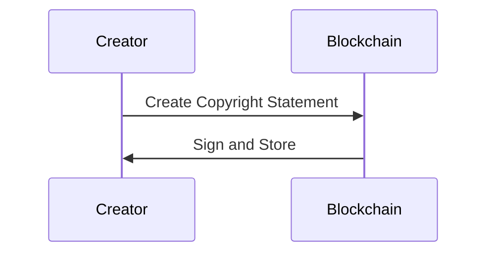

#### 3.1.2 版权认证

版权认证是验证版权声明真实性的过程。区块链网络中的节点可以验证版权声明的签名，确保其未被篡改。此外，版权声明上链后，任何节点都可以查看和验证版权信息，提高了版权信息的透明度。

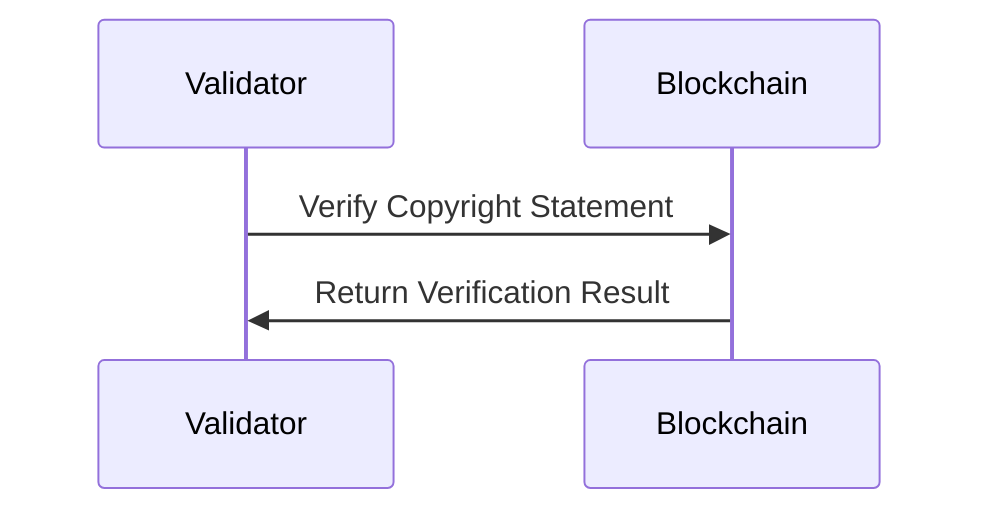

#### 3.1.3 版权交易

在去中心化版权管理中，创作者可以在区块链上进行版权交易，如授权、转让、许可等。通过智能合约，交易过程可以实现自动化和透明化，确保交易的合法性和效率。

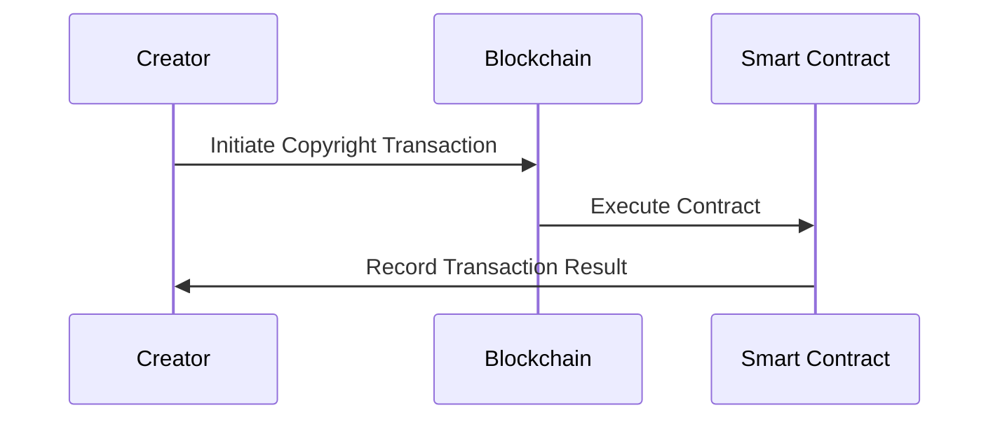

### 3.2 智能合约

智能合约是一种基于区块链技术的自动化合同，它可以在满足特定条件时自动执行。在数字内容分发中，智能合约可以用于版权授权、版税分配、内容交易等环节，提高交易的透明度和效率。

#### 3.2.1 版权授权

版权授权是创作者授权第三方使用其作品的过程。通过智能合约，授权过程可以自动化，创作者只需设定授权条款，第三方在满足条款时即可获得授权。

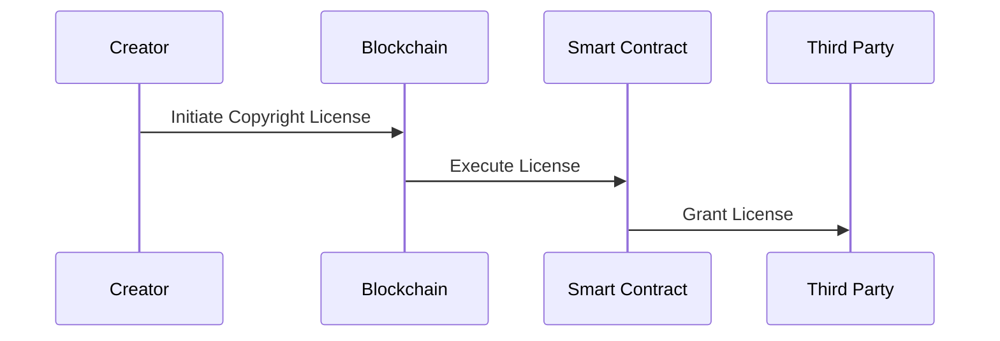

#### 3.2.2 版税分配

版税分配是创作者根据作品的使用情况，按照合约条款自动分配收益的过程。智能合约可以确保版税的准确分配，防止利益流失。

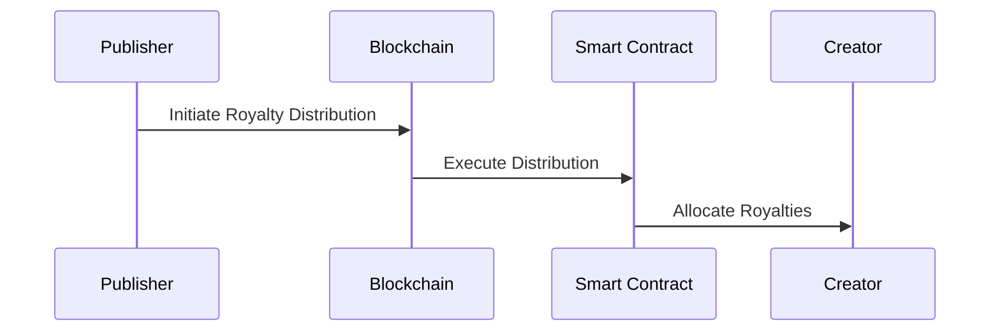

#### 3.2.3 内容交易

内容交易是购买、销售、租赁数字内容的过程。通过智能合约，交易过程可以自动化，确保交易的透明度和安全性。

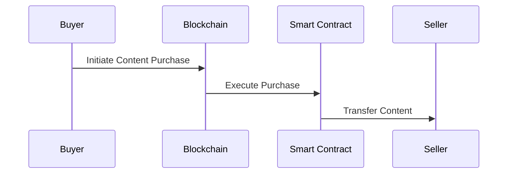

### 3.3 数字身份认证

数字身份认证是确保用户身份真实性和唯一性的过程。区块链技术可以通过数字签名和加密算法，实现用户身份的认证。

#### 3.3.1 身份注册

用户可以在区块链上注册数字身份，记录个人信息和公钥。注册过程通过数字签名确保信息的真实性和不可篡改性。

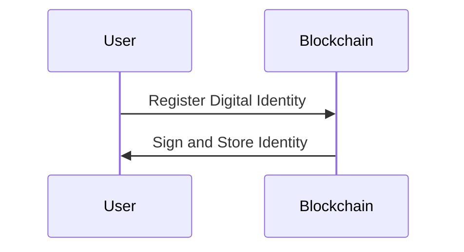

#### 3.3.2 身份验证

身份验证是验证用户身份真实性的过程。区块链网络中的节点可以验证用户的数字签名，确保身份信息的唯一性和真实性。

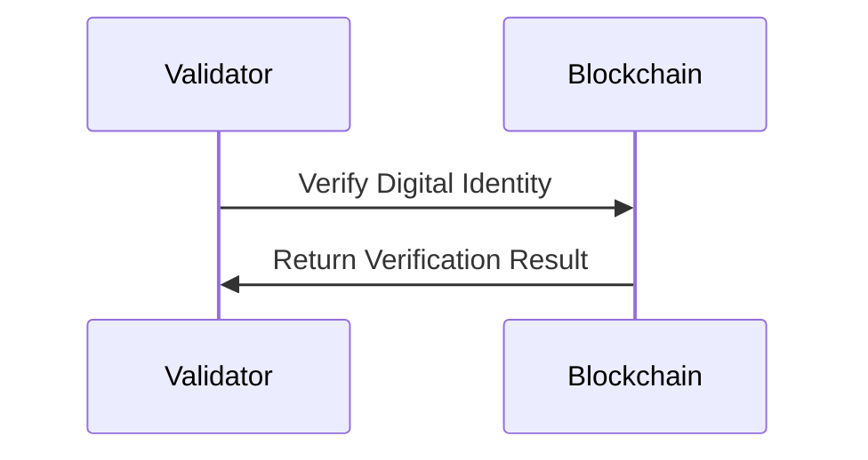

#### 3.3.3 隐私保护

区块链技术可以通过加密算法保护用户隐私，确保用户身份信息的安全。在数字内容分发中，隐私保护尤为重要，以防止个人信息泄露。

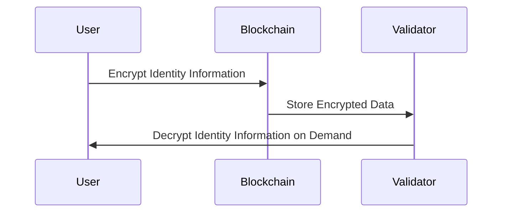

### 3.4 去中心化版权管理的优势与挑战

#### 3.4.1 优势

去中心化版权管理具有以下优势：

- **透明性**：版权信息对所有节点可见，提高了交易的透明度和信任度。
- **不可篡改**：版权信息一旦上链，就难以被篡改，确保了版权信息的真实性和完整性。
- **自动化**：智能合约可以实现自动化的版权交易，简化了授权和版税分配过程。
- **安全性**：区块链技术通过加密算法确保数据的安全，防止数据泄露和篡改。

#### 3.4.2 挑战

去中心化版权管理也面临一些挑战：

- **技术成熟度**：区块链技术仍处于发展初期，其性能和稳定性需要进一步提升。
- **法律规范**：数字内容分发的法律规范尚不完善，如何保障创作者权益、处理版权纠纷等问题需要进一步明确。
- **市场接受度**：市场对区块链技术的认知和接受度有限，需要加大宣传和推广力度。

### 3.5 本章小结

本章详细介绍了区块链在数字内容分发中的应用，包括去中心化版权管理、智能合约和数字身份认证。通过这些技术手段，区块链为数字内容分发提供了新的解决方案，有望解决创作者权益保护的问题。然而，区块链技术在数字内容分发中的应用仍面临诸多挑战，需要进一步探索和完善。

----------------------------------------------------------------

## 第四部分：智能合约在数字内容分发中的应用

### 4.1 智能合约的基本概念

智能合约是一种基于区块链技术的自动化合同，它通过编程代码定义一系列条件，当这些条件被满足时，智能合约会自动执行预定的操作。智能合约的核心优势在于其自动化和透明性，无需依赖中介机构，即可在满足条件时自动执行合同条款。

#### 4.1.1 智能合约的工作原理

智能合约的工作原理通常涉及以下几个步骤：

1. **编写智能合约**：开发者使用特定的编程语言（如Solidity）编写智能合约代码，定义合同条款和逻辑。
2. **部署智能合约**：将编写好的智能合约部署到区块链上，使其可供使用。
3. **触发条件**：当区块链上的某个事件满足智能合约预设的条件时，智能合约会自动执行。
4. **执行操作**：智能合约根据合同条款执行预定的操作，如转账资金、记录数据等。
5. **结果验证**：智能合约执行的结果会记录在区块链上，所有节点都可以验证其正确性。

#### 4.1.2 智能合约在数字内容分发中的应用

在数字内容分发中，智能合约可以应用于多个环节，包括版权授权、版税分配和内容交易等。

- **版权授权**：智能合约可以用于自动化版权授权，创作者可以设定授权条款，用户在满足条件时自动获得授权。
- **版税分配**：智能合约可以自动执行版税分配，确保创作者从内容销售中获得相应的收益。
- **内容交易**：智能合约可以用于自动化内容交易，确保交易过程的透明性和安全性。

### 4.2 版权授权的智能合约实现

版权授权是数字内容分发中至关重要的一环。通过智能合约，创作者可以设定版权授权的条件和条款，确保授权过程的自动化和透明性。

#### 4.2.1 智能合约的编写

以下是一个简单的版权授权智能合约示例（使用Solidity语言）：

```solidity
// SPDX-License-Identifier: MIT
pragma solidity ^0.8.0;

contract CopyrightLicense {
    address public creator;
    mapping(uint256 => mapping(address => bool)) public licenses;

    constructor() {
        creator = msg.sender;
    }

    function requestLicense(uint256 contentId, address licensee) external {
        require(licenses[contentId][licensee] == false, "License already granted");
        licenses[contentId][licensee] = true;
    }

    function getLicenseStatus(uint256 contentId, address licensee) external view returns (bool) {
        return licenses[contentId][licensee];
    }
}
```

在这个智能合约中，`creator` 是创作者的地址，`licenses` 是一个二维映射，用于记录每个内容ID对应的授权状态。`requestLicense` 函数用于请求版权授权，`getLicenseStatus` 函数用于查询授权状态。

#### 4.2.2 智能合约的部署

部署智能合约是将合约代码上传到区块链的过程。开发者需要将合约代码编译为字节码，然后使用区块链钱包将其部署到区块链上。以下是一个简单的部署示例（使用Truffle框架）：

```javascript
const CopyrightLicense = artifacts.require("CopyrightLicense");

async function deploy() {
    const networkId = await web3.eth.net.getId();
    const deployedNetwork = networkId.toString();

    if (deployedNetwork === "5777") {
        console.log("This is the local network. Deploying contracts...");
        const deployer = await ethers.getSigner();
        const contract = await new ethers.ContractFactory(
            CopyrightLicense.abi,
            CopyrightLicense.bytecode,
            deployer
        ).deploy();
        await contract.deployed();
        console.log("Contract deployed to:", contract.address);
    } else {
        console.log("This is not the local network. Skipping contract deployment.");
    }
}

deploy();
```

#### 4.2.3 智能合约的使用

智能合约部署后，创作者和用户可以通过区块链钱包与合约进行交互。

- **创作者**：创作者可以调用 `requestLicense` 函数为用户授予版权。
- **用户**：用户可以调用 `getLicenseStatus` 函数查询版权授权状态。

### 4.3 版税分配的智能合约实现

版税分配是智能合约在数字内容分发中的另一个重要应用。通过智能合约，创作者可以设定版税分配的规则，确保从内容销售中获得相应的收益。

#### 4.3.1 智能合约的编写

以下是一个简单的版税分配智能合约示例（使用Solidity语言）：

```solidity
// SPDX-License-Identifier: MIT
pragma solidity ^0.8.0;

contract RoyaltyDistribution {
    address public creator;
    mapping(uint256 => uint256) public contentSales;
    mapping(uint256 => uint256) public royaltyRates;

    constructor() {
        creator = msg.sender;
    }

    function setContentSales(uint256 contentId, uint256 amount) external {
        require(msg.sender == creator, "Only the creator can set content sales.");
        contentSales[contentId] = amount;
    }

    function setRoyaltyRate(uint256 contentId, uint256 rate) external {
        require(msg.sender == creator, "Only the creator can set royalty rates.");
        royaltyRates[contentId] = rate;
    }

    function distributeRoyalties(uint256 contentId) external {
        require(contentSales[contentId] > 0, "No sales recorded for this content.");
        uint256 royaltyAmount = (contentSales[contentId] * royaltyRates[contentId]) / 100;
        payable(creator).transfer(royaltyAmount);
    }
}
```

在这个智能合约中，`creator` 是创作者的地址，`contentSales` 记录每个内容ID的销售金额，`royaltyRates` 记录每个内容ID的版税比例。`setContentSales` 和 `setRoyaltyRate` 函数用于设置销售金额和版税比例，`distributeRoyalties` 函数用于分配版税。

#### 4.3.2 智能合约的部署和使用

版税分配智能合约的部署和使用与版权授权智能合约类似。创作者可以调用 `setContentSales` 和 `setRoyaltyRate` 函数设置销售金额和版税比例，然后调用 `distributeRoyalties` 函数进行版税分配。

### 4.4 内容交易的智能合约实现

内容交易是数字内容分发中的重要环节。通过智能合约，创作者和用户可以自动化进行内容交易，确保交易的透明性和安全性。

#### 4.4.1 智能合约的编写

以下是一个简单的内容交易智能合约示例（使用Solidity语言）：

```solidity
// SPDX-License-Identifier: MIT
pragma solidity ^0.8.0;

contract ContentTransaction {
    address public creator;
    mapping(uint256 => bool) public isContentPurchased;

    constructor() {
        creator = msg.sender;
    }

    function purchaseContent(uint256 contentId, uint256 price) external payable {
        require(!isContentPurchased[contentId], "Content already purchased.");
        require(msg.value >= price, "Insufficient payment.");
        isContentPurchased[contentId] = true;
        payable(creator).transfer(msg.value);
    }

    function getContentStatus(uint256 contentId) external view returns (bool) {
        return isContentPurchased[contentId];
    }
}
```

在这个智能合约中，`creator` 是创作者的地址，`isContentPurchased` 记录每个内容ID的购买状态。`purchaseContent` 函数用于购买内容，`getContentStatus` 函数用于查询内容购买状态。

#### 4.4.2 智能合约的部署和使用

内容交易智能合约的部署和使用与版权授权和版税分配智能合约类似。用户可以调用 `purchaseContent` 函数购买内容，并调用 `getContentStatus` 函数查询内容购买状态。

### 4.5 本章小结

智能合约在数字内容分发中的应用具有显著的优势，可以实现版权授权、版税分配和内容交易的自动化和透明化。通过智能合约，创作者和用户可以更轻松地管理和交易数字内容，提高效率和信任度。然而，智能合约的实现和部署仍需谨慎，以确保其安全性和可靠性。未来，随着智能合约技术的不断成熟，其在数字内容分发中的应用将更加广泛和深入。

----------------------------------------------------------------

## 第五部分：数字身份认证在数字内容分发中的应用

### 5.1 数字身份认证的基本概念

数字身份认证是指利用技术手段验证用户的身份信息，确保用户身份的真实性和唯一性。在数字内容分发中，数字身份认证至关重要，它能够保障交易和授权过程的合法性和安全性。

#### 5.1.1 数字身份认证的工作原理

数字身份认证通常涉及以下几个步骤：

1. **身份注册**：用户在区块链上注册数字身份，提供个人信息和公钥，并进行数字签名，以确保信息的真实性和不可篡改性。
2. **身份验证**：系统中的节点可以验证用户的数字签名，确认用户身份的真实性和唯一性。
3. **身份管理**：用户可以管理自己的数字身份，如修改个人信息、更新公钥等。
4. **隐私保护**：区块链技术通过加密算法保护用户隐私，确保用户身份信息的安全。

#### 5.1.2 数字身份认证在数字内容分发中的应用

在数字内容分发中，数字身份认证主要用于以下场景：

- **用户身份验证**：确保用户在进行版权授权、购买内容等操作时，身份真实可靠。
- **版权保护**：通过验证创作者身份，确保版权声明的真实性，防止版权侵权。
- **交易安全**：通过数字身份认证，确保交易双方的身份真实性，降低欺诈风险。

### 5.2 数字身份认证的区块链实现

#### 5.2.1 身份注册

用户在区块链上进行身份注册，需要提供个人信息（如姓名、地址、公钥等）并进行数字签名。以下是一个简单的身份注册示例：

```solidity
// SPDX-License-Identifier: MIT
pragma solidity ^0.8.0;

contract DigitalIdentity {
    mapping(address => string) public identities;

    function registerIdentity(string memory info) external {
        require(bytes(identities[msg.sender]).length == 0, "Identity already registered.");
        identities[msg.sender] = info;
    }
}
```

在这个智能合约中，`identities` 是一个映射，用于存储用户的身份信息。`registerIdentity` 函数用于用户注册身份。

#### 5.2.2 身份验证

系统中的节点可以通过验证用户的数字签名，确认用户身份的真实性。以下是一个简单的身份验证示例：

```solidity
// SPDX-License-Identifier: MIT
pragma solidity ^0.8.0;

contract DigitalIdentity {
    mapping(address => string) public identities;
    mapping(address => bool) public verified;

    function registerIdentity(string memory info) external {
        require(bytes(identities[msg.sender]).length == 0, "Identity already registered.");
        identities[msg.sender] = info;
    }

    function verifyIdentity(address user) external {
        require(bytes(identities[user]).length > 0, "Identity not registered.");
        // 验证数字签名，确保用户身份的真实性
        verified[user] = true;
    }
}
```

在这个智能合约中，`verified` 是一个映射，用于存储用户身份验证状态。`verifyIdentity` 函数用于验证用户身份。

#### 5.2.3 隐私保护

区块链技术通过加密算法保护用户隐私，确保用户身份信息的安全。以下是一个简单的隐私保护示例：

```solidity
// SPDX-License-Identifier: MIT
pragma solidity ^0.8.0;

contract DigitalIdentity {
    mapping(address => string) public identities;
    mapping(address => bool) public verified;

    function registerIdentity(string memory info) external {
        require(bytes(identities[msg.sender]).length == 0, "Identity already registered.");
        identities[msg.sender] = info;
    }

    function verifyIdentity(address user) external {
        require(bytes(identities[user]).length > 0, "Identity not registered.");
        // 验证数字签名，确保用户身份的真实性
        verified[user] = true;
    }

    function encryptIdentityInfo(string memory info, string memory privateKey) external {
        // 使用加密算法加密用户身份信息
        // ...
    }

    function decryptIdentityInfo(string memory encryptedInfo, string memory publicKey) external view returns (string memory) {
        // 使用加密算法解密用户身份信息
        // ...
        return decryptedInfo;
    }
}
```

在这个智能合约中，`encryptIdentityInfo` 和 `decryptIdentityInfo` 函数用于加密和解密用户身份信息。

### 5.3 数字身份认证的挑战与机遇

#### 5.3.1 挑战

数字身份认证在数字内容分发中面临以下挑战：

- **隐私保护**：如何在保护用户隐私的同时，确保身份认证的可靠性。
- **性能瓶颈**：区块链处理身份验证的速度较慢，难以满足大规模应用的需求。
- **用户接受度**：市场对数字身份认证的认知和接受度有限，需要加大宣传和推广力度。

#### 5.3.2 机遇

尽管面临挑战，数字身份认证在数字内容分发中也面临巨大的机遇：

- **技术创新**：随着区块链技术的不断发展，数字身份认证的性能和安全性将得到提升。
- **法律规范**：随着数字内容分发市场的发展，相关法律规范将逐步完善，为数字身份认证提供更有力的支持。
- **市场机遇**：数字内容分发市场广阔，数字身份认证的需求日益增加，为区块链技术提供了广阔的应用场景。

### 5.4 本章小结

数字身份认证在数字内容分发中的应用具有重要意义，它能够保障交易和授权过程的合法性和安全性。通过区块链技术，数字身份认证可以实现身份信息的真实性和唯一性，保护用户隐私。然而，数字身份认证仍面临一些挑战，需要进一步探索和完善。随着技术的不断成熟，数字身份认证在数字内容分发中的应用前景将更加广阔。

----------------------------------------------------------------

## 第六部分：项目实战：数字内容分发平台实现

### 6.1 项目介绍

本部分将介绍一个数字内容分发平台的实现，该平台将结合区块链技术中的去中心化版权管理、智能合约和数字身份认证，实现版权保护、版权交易和数字身份认证等功能。该项目的目标是通过区块链技术构建一个安全、透明、高效的数字内容分发平台。

### 6.2 系统功能设计

#### 6.2.1 领域模型

在数字内容分发平台中，主要的领域模型包括用户（User）、创作者（Creator）、版权（Copyright）和内容（Content）。以下是一个简单的领域模型（使用Mermaid类图表示）：

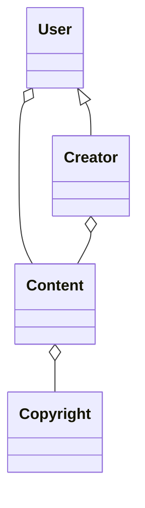

#### 6.2.2 系统功能

- **用户注册与登录**：用户可以在平台上注册和登录，进行身份认证。
- **版权声明**：创作者可以在平台上声明版权，记录版权信息。
- **版权认证**：平台可以验证版权声明的真实性，确保版权信息的不可篡改性。
- **版权交易**：创作者可以在平台上进行版权交易，如授权、转让、许可等。
- **内容发布与获取**：创作者可以发布内容，用户可以浏览和购买内容。

### 6.3 系统架构设计

#### 6.3.1 系统架构

数字内容分发平台的系统架构主要包括前端应用、后端服务和区块链网络。以下是一个简单的系统架构（使用Mermaid架构图表示）：

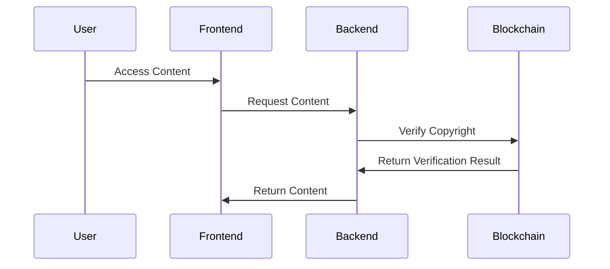

#### 6.3.2 系统架构设计

- **前端应用**：用户界面，用于用户操作和内容展示。
- **后端服务**：处理业务逻辑和与区块链网络的交互。
- **区块链网络**：存储版权信息和交易记录，确保数据的不可篡改和透明性。

### 6.4 系统接口设计

#### 6.4.1 用户接口

- **用户注册**：接收用户注册信息，调用区块链进行身份认证。
- **用户登录**：接收用户登录信息，调用区块链进行身份验证。
- **版权声明**：接收创作者的版权声明信息，调用区块链记录版权信息。
- **版权交易**：接收版权交易请求，调用智能合约进行交易处理。

#### 6.4.2 内容接口

- **内容发布**：接收创作者的内容信息，存储到区块链上。
- **内容获取**：接收用户的内容请求，验证版权信息，返回内容。

### 6.5 系统交互

#### 6.5.1 用户交互

- 用户注册：用户填写注册信息，系统生成数字身份，用户进行数字签名，系统将数字身份和签名上传到区块链。
- 用户登录：用户输入用户名和密码，系统验证用户身份，返回登录结果。

#### 6.5.2 内容交互

- 内容发布：创作者上传内容，系统生成版权声明，创作者进行数字签名，系统将版权声明和签名上传到区块链。
- 内容获取：用户请求内容，系统验证版权信息，返回内容。

### 6.6 系统实现

#### 6.6.1 环境安装

- 安装Node.js
- 安装Truffle框架
- 配置以太坊节点

#### 6.6.2 核心实现

以下是一个简单的智能合约示例，用于版权声明和交易：

```solidity
// SPDX-License-Identifier: MIT
pragma solidity ^0.8.0;

contract CopyrightManagement {
    mapping(uint256 => mapping(address => bool)) public copyrightRecords;

    function declareCopyright(uint256 contentId, string memory contentHash) external {
        require(copyrightRecords[contentId][msg.sender] == false, "Copyright already declared.");
        copyrightRecords[contentId][msg.sender] = true;
    }

    function transferCopyright(uint256 contentId, address newOwner) external {
        require(copyrightRecords[contentId][msg.sender] == true, "You don't own this copyright.");
        copyrightRecords[contentId][msg.sender] = false;
        copyrightRecords[contentId][newOwner] = true;
    }
}
```

#### 6.6.3 代码应用解读与分析

在这个智能合约中，`copyrightRecords` 是一个二维映射，用于记录每个内容ID对应的版权所有者。`declareCopyright` 函数用于创作者声明版权，`transferCopyright` 函数用于版权转让。通过智能合约，创作者可以轻松地进行版权声明和交易，确保过程的透明化和不可篡改性。

### 6.7 项目小结

通过本部分的项目实战，我们展示了如何利用区块链技术构建一个数字内容分发平台。该平台实现了去中心化版权管理、智能合约和数字身份认证等功能，提高了版权保护、交易和数字身份认证的透明度和安全性。然而，该项目仍需在性能优化、用户界面设计和用户体验等方面进行改进，以满足大规模应用的需求。

----------------------------------------------------------------

## 第七部分：最佳实践与注意事项

### 7.1 最佳实践

#### 7.1.1 区块链部署

1. **选择合适的主节点**：在部署区块链时，选择性能稳定、安全性高的主节点，以确保区块链网络的稳定运行。
2. **备份区块链数据**：定期备份区块链数据，防止数据丢失或损坏。
3. **优化网络性能**：根据实际应用需求，优化区块链网络性能，如调整区块大小、交易手续费等。

#### 7.1.2 智能合约开发

1. **代码审计**：在部署智能合约前，进行代码审计，确保智能合约的安全性。
2. **测试智能合约**：在部署智能合约前，进行充分测试，确保智能合约的功能和性能符合预期。
3. **自动化合约部署**：使用自动化工具部署智能合约，提高部署效率，减少人为错误。

#### 7.1.3 数字身份认证

1. **隐私保护**：在设计数字身份认证系统时，充分考虑用户隐私保护，采用加密算法保护用户身份信息。
2. **身份验证效率**：优化身份验证流程，提高验证速度，确保用户体验。
3. **身份信息管理**：提供便捷的身份信息管理功能，如修改个人信息、更新公钥等。

### 7.2 注意事项

#### 7.2.1 技术成熟度

1. **性能优化**：区块链技术仍处于发展初期，其性能和稳定性有待提升。在实际应用中，需要根据具体需求进行性能优化。
2. **安全性考虑**：区块链技术具有安全性高、不可篡改等特点，但在实际应用中仍需注意数据安全和系统安全性。

#### 7.2.2 法律规范

1. **版权保护**：在数字内容分发中，版权保护是核心问题。在实际应用中，需要遵守相关法律法规，确保版权保护的有效性。
2. **隐私保护**：在数字身份认证中，隐私保护至关重要。在实际应用中，需要确保用户隐私不被泄露。

#### 7.2.3 市场接受度

1. **推广力度**：在推广区块链技术及其应用时，需要加大宣传力度，提高市场认知度和接受度。
2. **用户体验**：在设计数字内容分发平台时，要充分考虑用户体验，提供简洁、易用的界面和功能。

### 7.3 拓展阅读

1. **区块链技术**：
   - 《区块链：从数字货币到智能合约》
   - 《智能合约：以太坊应用开发指南》
2. **数字身份认证**：
   - 《数字身份认证：技术、应用与挑战》
   - 《基于区块链的数字身份认证解决方案》
3. **数字内容分发**：
   - 《数字内容分发：从版权到支付》
   - 《区块链技术在数字内容分发中的应用》

通过以上最佳实践和注意事项，我们可以更好地利用区块链技术构建数字内容分发平台，实现版权保护、交易和数字身份认证等功能。同时，需要注意技术的成熟度、法律规范和市场接受度等因素，确保平台的安全性和可靠性。

----------------------------------------------------------------

## 本章小结

本章围绕区块链在数字内容分发中的应用，详细探讨了去中心化版权管理、智能合约和数字身份认证等技术手段。通过引入区块链技术，我们可以实现版权的透明化、可追溯性和自动化交易，有效保护创作者的权益。同时，数字身份认证技术也为用户提供了安全、便捷的身份认证服务。然而，区块链技术在数字内容分发中的应用仍面临技术成熟度、法律规范和市场接受度等多方面的挑战。未来，随着区块链技术的不断成熟和普及，其在数字内容分发中的应用前景将更加广阔。

### 作者信息

作者：AI天才研究院/AI Genius Institute & 禅与计算机程序设计艺术 /Zen And The Art of Computer Programming。本文旨在为读者提供关于区块链在数字内容分发中应用的深入理解和实际案例，以促进技术创新和行业发展。希望通过本文，读者能够对区块链技术及其应用有更全面的了解，并为未来的研究和实践提供参考。

