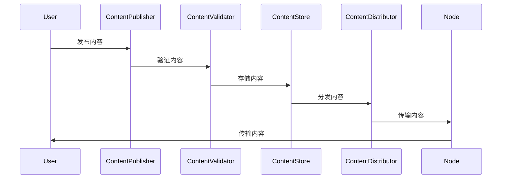
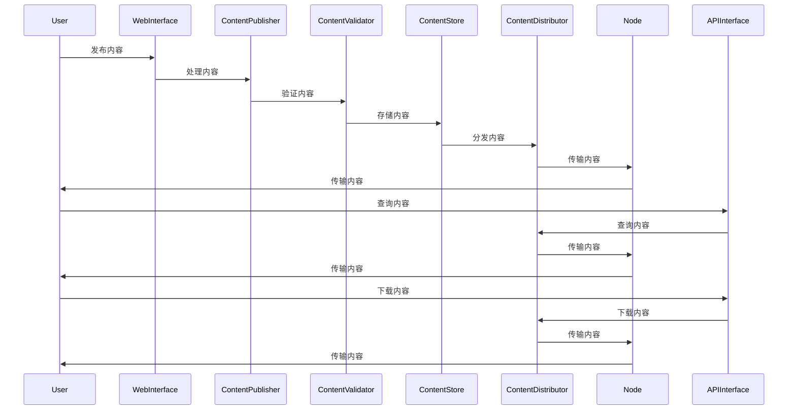
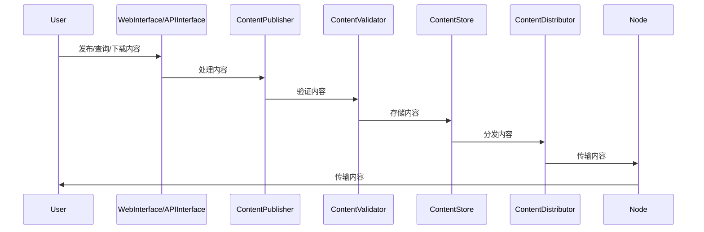

                 

### 文章标题：区块链在数字内容分发中的应用：去中心化内容分发网络

#### 关键词：区块链、数字内容分发、去中心化、内容分发网络、加密技术、共识算法

> 摘要：本文深入探讨了区块链技术在数字内容分发中的应用，特别是去中心化内容分发网络（DCDN）的构建与实现。通过对区块链技术原理、去中心化内容分发网络的原理与优势、系统设计与实现的详细介绍，以及实际案例的分析，本文旨在为读者提供对区块链在数字内容分发中应用的全面理解，帮助开发者更好地掌握相关技术和实现方法。

### 目录大纲设计思路

为了设计出符合要求的《区块链在数字内容分发中的应用：去中心化内容分发网络》一书完整的目录大纲，我们首先需要明确书的主题和目标读者群体。根据书名，我们可以确定本书的核心内容将围绕区块链技术在数字内容分发中的应用展开，重点探讨去中心化内容分发网络的构建与实现。目标读者可能是对区块链技术有一定了解，但希望深入了解其在数字内容分发中应用的技术人员、开发者以及研究者。

接下来，我们按照以下步骤设计目录大纲：

1. **背景介绍**：简要介绍区块链技术及其在数字内容分发中的重要性，为后续章节内容奠定基础。
2. **核心概念与联系**：梳理区块链、去中心化内容分发网络等相关核心概念，并通过概念属性特征对比表格和ER实体关系图架构展示概念间的关系。
3. **区块链技术原理**：详细介绍区块链的基本原理、特点、技术架构以及与之相关的加密技术。
4. **去中心化内容分发网络**：讨论去中心化内容分发网络的原理、优势以及面临的挑战。
5. **系统设计与实现**：讲解去中心化内容分发网络的系统架构设计、功能模块划分以及关键技术实现。
6. **实际案例与应用**：通过具体案例展示区块链在数字内容分发中的应用，并提供实现细节和效果分析。
7. **最佳实践与拓展**：总结书中的核心观点，给出实际操作中的注意事项和最佳实践，为读者提供进一步的拓展阅读建议。

### 目录大纲

#### 第一部分：背景介绍

- **第1章 区块链与数字内容分发概述**
  - 1.1 区块链技术简介
    - 1.1.1 区块链的定义与发展历程
    - 1.1.2 区块链的核心特点
    - 1.1.3 区块链与数字内容分发的关联性
  - 1.2 数字内容分发中的问题与挑战
    - 1.2.1 中心化内容分发的局限性
    - 1.2.2 去中心化内容分发的优势
    - 1.2.3 区块链在数字内容分发中的应用前景
  - 1.3 去中心化内容分发网络的概念与结构
    - 1.3.1 去中心化内容分发网络的基本概念
    - 1.3.2 去中心化内容分发网络的组成部分
    - 1.3.3 去中心化内容分发网络的运行原理

#### 第二部分：核心概念与联系

- **第2章 区块链与去中心化内容分发网络**
  - 2.1 核心概念梳理
    - 2.1.1 区块链的核心概念
    - 2.1.2 去中心化内容分发网络的核心概念
    - 2.1.3 概念属性特征对比表格
  - 2.2 ER实体关系图
    - 2.2.1 区块链的ER实体关系图
    - 2.2.2 去中心化内容分发网络的ER实体关系图

#### 第三部分：区块链技术原理

- **第3章 区块链技术原理讲解**
  - 3.1 区块链的基本原理
    - 3.1.1 区块链的定义
    - 3.1.2 区块链的数据结构
    - 3.1.3 区块链的共识算法
  - 3.2 区块链的核心特点
    - 3.2.1 去中心化
    - 3.2.2 安全性
    - 3.2.3 可信性
  - 3.3 区块链技术架构
    - 3.3.1 区块链的基础架构
    - 3.3.2 区块链的关键技术
    - 3.3.3 区块链的应用场景

#### 第四部分：去中心化内容分发网络

- **第4章 去中心化内容分发网络**
  - 4.1 去中心化内容分发网络的原理
    - 4.1.1 去中心化内容分发网络的概念
    - 4.1.2 去中心化内容分发网络的运行机制
    - 4.1.3 去中心化内容分发网络的优势
  - 4.2 去中心化内容分发网络的优势与挑战
    - 4.2.1 去中心化内容分发网络的优势
    - 4.2.2 去中心化内容分发网络面临的挑战
  - 4.3 去中心化内容分发网络的实现方案
    - 4.3.1 去中心化内容分发网络的设计思路
    - 4.3.2 去中心化内容分发网络的关键技术

#### 第五部分：系统设计与实现

- **第5章 去中心化内容分发网络系统设计**
  - 5.1 去中心化内容分发网络系统功能设计
    - 5.1.1 系统需求分析
    - 5.1.2 系统功能模块划分
    - 5.1.3 领域模型ER图
  - 5.2 去中心化内容分发网络系统架构设计
    - 5.2.1 系统总体架构设计
    - 5.2.2 关键技术实现
    - 5.2.3 系统接口设计
  - 5.3 去中心化内容分发网络运行流程
    - 5.3.1 系统运行流程图
    - 5.3.2 系统交互序列图

#### 第六部分：实际案例与应用

- **第6章 去中心化内容分发网络实际应用案例**
  - 6.1 案例背景介绍
  - 6.2 案例系统实现
    - 6.2.1 环境安装
    - 6.2.2 系统核心实现
    - 6.2.3 代码应用解读与分析
  - 6.3 案例效果分析
  - 6.4 案例小结

#### 第七部分：最佳实践与拓展

- **第7章 最佳实践与拓展**
  - 7.1 最佳实践
  - 7.2 小结
  - 7.3 注意事项
  - 7.4 拓展阅读建议

---

### 第一部分：背景介绍

#### 第1章 区块链与数字内容分发概述

##### 1.1 区块链技术简介

区块链技术是一种分布式数据库技术，通过去中心化的方式实现了数据的可信存储和传输。区块链技术的核心特点是去中心化、安全性和不可篡改性。自2008年比特币的诞生以来，区块链技术得到了广泛的关注和研究。

**1.1.1 区块链的定义与发展历程**

区块链是一种分布式账本技术，其核心是记录一系列按时间顺序排列、数据块组成的数据结构。这些数据块通过密码学方法进行加密，确保数据在传输过程中的安全性。区块链技术的发展历程可以分为几个阶段：

1. **第一阶段**（2008-2013）：以比特币为代表，区块链技术主要用于数字货币的发行和交易。
2. **第二阶段**（2014-2017）：区块链技术开始应用于供应链管理、金融服务、物联网等领域。
3. **第三阶段**（2018至今）：区块链技术逐渐走向成熟，应用范围进一步扩大，包括数字内容分发、智能合约、身份验证等。

**1.1.2 区块链的核心特点**

区块链技术的核心特点包括去中心化、安全性和不可篡改性：

1. **去中心化**：区块链技术通过分布式网络实现了数据的存储和传输，避免了单点故障和中心化控制的弊端。
2. **安全性**：区块链技术采用了密码学方法，确保数据在传输过程中的安全性，同时防止恶意篡改。
3. **不可篡改性**：区块链技术通过哈希函数和密码学算法，确保数据一旦记录在链上就无法被篡改。

**1.1.3 区块链与数字内容分发的关联性**

数字内容分发是当前互联网应用中的一个重要环节，涉及到版权保护、内容真实性验证、用户隐私保护等问题。区块链技术为解决这些问题提供了新的思路和解决方案：

1. **版权保护**：区块链技术可以实现数字内容的溯源和确权，确保内容的版权归属清晰。
2. **内容真实性验证**：区块链技术可以记录内容的完整性和真实性，防止虚假内容的传播。
3. **用户隐私保护**：区块链技术可以保护用户的隐私，避免数据泄露和滥用。

##### 1.2 数字内容分发中的问题与挑战

数字内容分发在当前互联网环境中面临着诸多问题与挑战，这些问题严重影响了用户体验和内容创作者的利益。

**1.2.1 中心化内容分发的局限性**

中心化内容分发网络（如YouTube、Facebook等）在过去的互联网时代发挥了重要作用，但同时也暴露出一些局限性：

1. **单点故障**：中心化内容分发网络依赖于单一的服务器或数据中心，一旦出现故障，整个网络将瘫痪。
2. **审查与监控**：中心化平台往往需要配合政府或企业进行内容审查和监控，这可能导致用户隐私泄露和言论自由受限。
3. **内容盗用**：中心化平台难以防止内容的盗用和侵权行为，创作者的利益难以得到保障。

**1.2.2 去中心化内容分发的优势**

去中心化内容分发网络（DCDN）通过区块链技术实现了数据的分布式存储和传输，具有以下优势：

1. **去中心化**：去中心化内容分发网络避免了单点故障的风险，提高了网络的稳定性和可用性。
2. **去审查与去监控**：去中心化内容分发网络无需依赖中心化平台进行内容审查和监控，保障了用户的隐私和言论自由。
3. **版权保护**：区块链技术可以实现数字内容的溯源和确权，有效防止内容盗用和侵权行为。

**1.2.3 区块链在数字内容分发中的应用前景**

随着区块链技术的不断成熟和发展，其在数字内容分发中的应用前景十分广阔：

1. **版权保护**：区块链技术可以确保数字内容的版权归属清晰，为创作者提供更好的保护。
2. **内容真实性验证**：区块链技术可以记录内容的完整性和真实性，提高信息的可信度。
3. **去中心化交易平台**：区块链技术可以构建去中心化的内容交易平台，降低交易成本，提高交易效率。

##### 1.3 去中心化内容分发网络的概念与结构

去中心化内容分发网络（DCDN）是一种基于区块链技术的分布式内容分发系统，其主要目标是实现内容的分布式存储、传输和验证。DCDN的概念和结构如下：

**1.3.1 去中心化内容分发网络的基本概念**

去中心化内容分发网络（DCDN）主要由以下几个核心概念组成：

1. **节点**：DCDN中的每个节点都是独立的参与方，负责存储、分发和验证内容。
2. **区块链**：DCDN采用区块链技术记录和验证内容的状态和历史，确保数据的可信性。
3. **加密技术**：DCDN采用加密技术保护内容的隐私和完整性，防止未经授权的访问和篡改。

**1.3.2 去中心化内容分发网络的组成部分**

去中心化内容分发网络由以下几个主要组成部分构成：

1. **内容发布者**：负责创建和发布内容，并将其上传到DCDN中。
2. **内容存储节点**：负责存储内容，并确保内容的完整性。
3. **内容验证节点**：负责验证内容的真实性和完整性。
4. **内容分发节点**：负责将内容分发给用户，并确保内容的可用性。

**1.3.3 去中心化内容分发网络的运行原理**

去中心化内容分发网络的运行原理如下：

1. **内容创建与发布**：内容发布者创建内容，并将其上传到DCDN中。
2. **内容存储**：内容存储节点接收并存储内容，确保内容的完整性。
3. **内容验证**：内容验证节点对内容进行验证，确保内容的真实性和完整性。
4. **内容分发**：内容分发节点根据用户请求，将内容分发给用户。

通过上述运行原理，DCDN实现了内容的分布式存储、传输和验证，提高了内容分发的效率、可扩展性和安全性。

#### 总结

本章对区块链技术及其在数字内容分发中的应用进行了简要介绍。首先，我们了解了区块链技术的基本原理、发展历程和核心特点，以及其在数字内容分发中的重要性。接着，我们探讨了数字内容分发中面临的问题与挑战，并分析了去中心化内容分发网络的原理、优势和应用前景。最后，我们详细介绍了去中心化内容分发网络的概念与结构，为后续章节的内容奠定了基础。

在接下来的章节中，我们将进一步深入探讨区块链技术的原理、去中心化内容分发网络的实现方案，以及实际案例与应用。通过这些内容的讲解，读者将能够更全面地理解区块链在数字内容分发中的应用，掌握相关技术和实现方法。

---

### 第二部分：核心概念与联系

#### 第2章 区块链与去中心化内容分发网络

##### 2.1 核心概念梳理

区块链与去中心化内容分发网络是本章讨论的两个核心概念。为了更好地理解它们之间的关系，我们首先需要梳理这两个概念的基本原理和特点。

**2.1.1 区块链的核心概念**

区块链是一种分布式数据库技术，通过分布式网络实现了数据的可信存储和传输。区块链的核心特点包括：

1. **去中心化**：区块链通过分布式网络实现了数据的存储和传输，避免了单点故障和中心化控制的弊端。
2. **安全性**：区块链采用密码学方法确保数据在传输过程中的安全性，同时防止恶意篡改。
3. **不可篡改性**：区块链通过哈希函数和密码学算法，确保数据一旦记录在链上就无法被篡改。

**2.1.2 去中心化内容分发网络的核心概念**

去中心化内容分发网络（DCDN）是一种基于区块链技术的分布式内容分发系统，其主要目标是实现内容的分布式存储、传输和验证。DCDN的核心特点包括：

1. **去中心化**：DCDN通过分布式网络实现了内容的存储和传输，提高了网络的稳定性和可用性。
2. **去审查与去监控**：DCDN无需依赖中心化平台进行内容审查和监控，保障了用户的隐私和言论自由。
3. **版权保护**：DCDN采用区块链技术实现了数字内容的溯源和确权，有效防止内容盗用和侵权行为。

**2.1.3 概念属性特征对比表格**

为了更直观地展示区块链与去中心化内容分发网络的概念属性特征，我们创建了一个对比表格：

| 特征 | 区块链 | 去中心化内容分发网络 |
| ---- | ---- | ---- |
| 去中心化 | √ | √ |
| 安全性 | √ | √ |
| 不可篡改性 | √ | √ |
| 分布式存储 | √ | √ |
| 分布式传输 | √ | √ |
| 版权保护 | × | √ |
| 去审查与去监控 | × | √ |

通过对比表格，我们可以看出区块链与去中心化内容分发网络在去中心化、安全性、不可篡改性、分布式存储和传输等方面有较高的相似性，但去中心化内容分发网络在版权保护和去审查与去监控方面具有独特的优势。

##### 2.2 ER实体关系图

为了更好地展示区块链与去中心化内容分发网络的概念间关系，我们使用ER实体关系图进行描述。ER实体关系图是一种用于描述实体及其之间关系的图形表示方法，可以帮助我们更清晰地理解系统的结构和功能。

**2.2.1 区块链的ER实体关系图**

区块链的ER实体关系图如下所示：

```mermaid
erDiagram
    ContentNode ||--o> Block : 存储内容
    Block ||--o> Blockchain : 组成区块链
    Node ||--o> Blockchain : 参与区块链
    Transaction ||--o> Block : 记录交易
    User ||--o> Node : 创建节点
    Validator ||--o> Node : 验证节点
```

在上面的ER实体关系图中，我们定义了以下几个实体：

1. **ContentNode**：存储内容的节点。
2. **Block**：区块链中的数据块。
3. **Blockchain**：区块链。
4. **Node**：参与区块链的节点。
5. **Transaction**：交易记录。
6. **User**：用户。
7. **Validator**：验证节点。

通过ER实体关系图，我们可以看出区块链由多个数据块组成，每个数据块存储了交易记录。参与区块链的节点包括用户、验证节点等，它们共同维护区块链的安全性和完整性。

**2.2.2 去中心化内容分发网络的ER实体关系图**

去中心化内容分发网络的ER实体关系图如下所示：

```mermaid
erDiagram
    Content ||--o> ContentNode : 存储内容
    ContentNode ||--o> DCDN : 参与DCDN
    DCDN ||--o> ContentValidator : 验证内容
    ContentValidator ||--o> DCDN : 维护DCDN
    Publisher ||--o> Content : 发布内容
    Publisher ||--o> DCDN : 参与DCDN
    User ||--o> ContentNode : 请求内容
    User ||--o> DCDN : 参与DCDN
```

在上面的ER实体关系图中，我们定义了以下几个实体：

1. **Content**：数字内容。
2. **ContentNode**：存储内容的节点。
3. **DCDN**：去中心化内容分发网络。
4. **ContentValidator**：内容验证节点。
5. **Publisher**：内容发布者。
6. **User**：用户。

通过ER实体关系图，我们可以看出去中心化内容分发网络由多个内容节点组成，每个内容节点存储了数字内容。内容验证节点负责验证内容的真实性和完整性，内容发布者负责发布内容，用户负责请求和获取内容。通过这些实体之间的关系，我们可以更清晰地理解去中心化内容分发网络的运行原理。

##### 总结

本章对区块链与去中心化内容分发网络的核心概念进行了梳理，并通过ER实体关系图展示了这两个概念之间的关系。通过对区块链和去中心化内容分发网络的详细介绍，读者可以更好地理解它们的基本原理、特点和相互关系，为后续章节的内容打下基础。

在接下来的章节中，我们将深入探讨区块链技术的原理，包括区块链的数据结构、共识算法等，以及去中心化内容分发网络的实现方案，包括系统架构、功能模块划分等。通过这些内容的讲解，读者将能够更全面地理解区块链技术及其在数字内容分发中的应用。

---

### 第三部分：区块链技术原理

#### 第3章 区块链技术原理讲解

##### 3.1 区块链的基本原理

区块链技术是一种分布式数据库技术，其核心在于通过分布式网络实现了数据的可信存储和传输。要理解区块链的基本原理，我们需要从以下几个方面进行探讨：

**3.1.1 区块链的定义**

区块链是一种按时间顺序排列的、由数据块组成的分布式数据库。这些数据块通过密码学方法进行加密和链接，形成了区块链。区块链的每一块数据都包含了前一块数据的哈希值，从而确保了数据在传输过程中的安全性。

**3.1.2 区块链的数据结构**

区块链的数据结构主要由三个部分组成：区块（Block）、链（Chain）和节点（Node）。

1. **区块**：区块是区块链中的基本数据单元，包含了交易数据、时间戳、难度目标、上一个区块的哈希值等信息。
2. **链**：链是由一系列按时间顺序排列的区块组成，每个区块都通过哈希值与前一个区块相连，形成了区块链。
3. **节点**：节点是区块链网络中的参与者，负责存储、验证和传播区块信息。节点通过共识算法达成共识，确保区块链的完整性和安全性。

**3.1.3 区块链的共识算法**

共识算法是区块链技术中的核心组成部分，用于确保区块链网络中的所有节点对数据的真实性和一致性达成共识。常见的共识算法包括：

1. **工作量证明（PoW）**：节点通过计算大量的哈希值来找到一个符合难度目标的解，从而获得生成区块的权力。
2. **权益证明（PoS）**：节点根据其在区块链中的权益（如持有的币量、抵押的币量等）来获得生成区块的权力。
3. **委托权益证明（DPoS）**：节点通过投票选举出一定数量的代表节点，代表节点负责生成区块。
4. **实用拜占庭容错算法（PBFT）**：节点通过分布式算法达成共识，即使部分节点出现故障，仍能确保区块链的正常运行。

##### 3.2 区块链的核心特点

区块链技术具有以下几个核心特点：

**3.2.1 去中心化**

去中心化是区块链技术的核心特点之一。区块链通过分布式网络实现了数据的存储和传输，避免了单点故障和中心化控制的弊端。在去中心化的区块链网络中，每个节点都具有平等的权利和义务，共同维护区块链的完整性和安全性。

**3.2.2 安全性**

区块链技术采用密码学方法确保数据在传输过程中的安全性，同时防止恶意篡改。区块链中的每个区块都包含了前一个区块的哈希值，形成了一种链式结构，一旦某个区块的数据被篡改，整个链都将被破坏。此外，区块链的共识算法确保了节点之间对数据的真实性和一致性达成共识。

**3.2.3 不可篡改性**

区块链技术通过哈希函数和密码学算法确保数据一旦记录在链上就无法被篡改。每个区块都包含了前一个区块的哈希值，形成了一种链式结构，一旦某个区块的数据被篡改，整个链都将被破坏。这种不可篡改的特性使得区块链在记录重要数据（如金融交易、数字身份等）方面具有很高的可靠性。

##### 3.3 区块链技术架构

区块链技术的架构可以分为三个层次：物理层、数据层和应用层。

**3.3.1 区块链的基础架构**

区块链的基础架构主要由以下部分组成：

1. **节点**：节点是区块链网络中的参与者，负责存储、验证和传播区块信息。节点通过共识算法达成共识，确保区块链的完整性和安全性。
2. **网络**：网络是节点之间进行通信的渠道，节点通过网络交换区块和交易信息。
3. **共识算法**：共识算法是节点之间达成共识的机制，确保区块链网络中的所有节点对数据的真实性和一致性达成共识。

**3.3.2 区块链的关键技术**

区块链的关键技术主要包括以下几个方面：

1. **加密技术**：加密技术用于确保数据在传输过程中的安全性，同时防止恶意篡改。
2. **哈希函数**：哈希函数用于生成区块的唯一标识，确保数据在区块链中的不可篡改性。
3. **分布式存储**：分布式存储技术用于实现数据的分布式存储和传输，提高区块链的可用性和可扩展性。
4. **共识算法**：共识算法用于确保节点之间对数据的真实性和一致性达成共识。

**3.3.3 区块链的应用场景**

区块链技术具有广泛的应用场景，包括但不限于以下几个方面：

1. **数字货币**：区块链技术是比特币等数字货币的核心技术，用于实现去中心化的数字货币交易。
2. **供应链管理**：区块链技术可以记录和追踪供应链中的每一个环节，提高供应链的透明度和效率。
3. **身份验证**：区块链技术可以用于构建去中心化的身份验证系统，确保用户的隐私和信息安全。
4. **数字版权保护**：区块链技术可以用于记录和追踪数字版权的归属和交易，保护创作者的权益。
5. **智能合约**：区块链技术可以用于构建智能合约，实现自动执行合同条款和条件。

##### 总结

本章详细讲解了区块链技术的基本原理、核心特点和架构。通过了解区块链的基本原理，读者可以更好地理解区块链的工作机制和优势，为后续章节的探讨打下基础。

在接下来的章节中，我们将深入探讨去中心化内容分发网络的原理和实现方案，包括系统架构、功能模块划分等。通过这些内容的讲解，读者将能够更全面地理解区块链在数字内容分发中的应用。

---

### 第四部分：去中心化内容分发网络

#### 第4章 去中心化内容分发网络

##### 4.1 去中心化内容分发网络的原理

去中心化内容分发网络（DCDN）是一种基于区块链技术的分布式内容分发系统，其目标是实现内容的分布式存储、传输和验证。要理解DCDN的原理，我们需要从以下几个方面进行探讨：

**4.1.1 去中心化内容分发网络的概念**

去中心化内容分发网络（DCDN）是一种分布式内容分发系统，通过分布式网络实现了内容的存储、传输和验证。在DCDN中，内容发布者、存储节点、验证节点和用户都是独立的参与者，通过共识算法达成共识，共同维护内容的真实性和完整性。

**4.1.2 去中心化内容分发网络的运行机制**

去中心化内容分发网络的运行机制主要包括以下几个步骤：

1. **内容创建与发布**：内容发布者创建内容，并将其上传到DCDN中。
2. **内容存储**：内容存储节点接收并存储内容，确保内容的完整性。
3. **内容验证**：内容验证节点对内容进行验证，确保内容的真实性和完整性。
4. **内容分发**：内容分发节点根据用户请求，将内容分发给用户。

通过这些步骤，DCDN实现了内容的分布式存储、传输和验证，提高了内容分发的效率、可扩展性和安全性。

**4.1.3 去中心化内容分发网络的优势**

去中心化内容分发网络具有以下优势：

1. **去中心化**：DCDN通过分布式网络实现了内容的存储和传输，避免了单点故障和中心化控制的弊端。
2. **去审查与去监控**：DCDN无需依赖中心化平台进行内容审查和监控，保障了用户的隐私和言论自由。
3. **版权保护**：DCDN采用区块链技术实现了数字内容的溯源和确权，有效防止内容盗用和侵权行为。
4. **高可用性**：DCDN通过分布式网络提高了内容分发的可用性，即使部分节点出现故障，整个网络仍能正常运行。
5. **高可扩展性**：DCDN通过分布式网络实现了内容的分布式存储和传输，提高了内容分发的可扩展性，能够满足大规模用户的需求。

**4.1.4 去中心化内容分发网络的实现方案**

去中心化内容分发网络的实现方案主要包括以下几个部分：

1. **内容发布者**：内容发布者负责创建和发布内容，并将其上传到DCDN中。
2. **内容存储节点**：内容存储节点负责接收并存储内容，确保内容的完整性。
3. **内容验证节点**：内容验证节点负责对内容进行验证，确保内容的真实性和完整性。
4. **内容分发节点**：内容分发节点根据用户请求，将内容分发给用户。

通过这些组成部分，DCDN实现了内容的分布式存储、传输和验证。

##### 4.2 去中心化内容分发网络的优势与挑战

去中心化内容分发网络（DCDN）具有许多优势，但也面临一些挑战。以下是对DCDN优势和挑战的详细分析：

**4.2.1 去中心化内容分发网络的优势**

1. **去中心化**：DCDN通过分布式网络实现了内容的存储和传输，避免了单点故障和中心化控制的弊端。这使得DCDN在面临网络攻击、单点故障等方面具有更高的安全性和可靠性。
2. **去审查与去监控**：DCDN无需依赖中心化平台进行内容审查和监控，保障了用户的隐私和言论自由。这有助于构建一个更加开放和自由的内容分发环境。
3. **版权保护**：DCDN采用区块链技术实现了数字内容的溯源和确权，有效防止内容盗用和侵权行为。这有助于保护创作者的权益，提高数字内容的价值。
4. **高可用性**：DCDN通过分布式网络提高了内容分发的可用性，即使部分节点出现故障，整个网络仍能正常运行。这有助于确保用户始终能够访问到所需的内容。
5. **高可扩展性**：DCDN通过分布式网络实现了内容的分布式存储和传输，提高了内容分发的可扩展性，能够满足大规模用户的需求。

**4.2.2 去中心化内容分发网络面临的挑战**

1. **网络延迟**：由于DCDN采用分布式网络，节点之间的通信可能存在网络延迟，这可能导致内容分发速度较慢。这需要通过优化网络拓扑结构、提高节点性能等方法来改善。
2. **存储成本**：DCDN需要分布式存储大量的内容，这可能导致存储成本较高。需要探索更有效的存储方案，如数据去重、存储优化等。
3. **节点管理**：DCDN中的节点数量众多，节点管理成为一个挑战。需要设计合理的节点选举机制、节点监控和故障处理机制。
4. **共识算法**：共识算法是DCDN的关键技术之一，但现有的共识算法存在性能、安全性等方面的挑战。需要不断优化和改进共识算法，以满足DCDN的需求。

**4.2.3 去中心化内容分发网络的实现方案**

1. **内容发布者**：内容发布者负责创建和发布内容，并将其上传到DCDN中。内容发布者可以使用加密技术保护内容的隐私和完整性。
2. **内容存储节点**：内容存储节点负责接收并存储内容，确保内容的完整性。内容存储节点可以采用分布式存储技术，如副本存储、数据去重等，以提高存储效率和可靠性。
3. **内容验证节点**：内容验证节点负责对内容进行验证，确保内容的真实性和完整性。内容验证节点可以使用加密技术验证内容的完整性和真实性。
4. **内容分发节点**：内容分发节点根据用户请求，将内容分发给用户。内容分发节点可以使用缓存技术、负载均衡技术等，以提高内容分发速度和可靠性。

通过上述实现方案，DCDN可以有效地实现内容的分布式存储、传输和验证，提高内容分发的效率、可扩展性和安全性。

##### 4.3 去中心化内容分发网络的实现方案

**4.3.1 去中心化内容分发网络的设计思路**

去中心化内容分发网络的设计思路主要包括以下几个方面：

1. **分布式存储**：通过分布式存储技术实现内容的存储，提高存储效率和可靠性。可以使用副本存储、数据去重等方法来优化存储性能。
2. **分布式传输**：通过分布式传输技术实现内容在节点之间的传输，提高传输速度和可靠性。可以使用数据压缩、传输优化等方法来优化传输性能。
3. **内容验证**：通过内容验证技术确保内容的真实性和完整性，防止恶意篡改和虚假内容的传播。可以使用加密技术、哈希函数等方法来验证内容的完整性和真实性。
4. **节点管理**：通过节点管理技术实现节点的选举、监控和故障处理，确保DCDN的正常运行。可以使用分布式共识算法、节点监控技术等方法来管理节点。
5. **用户交互**：通过用户交互技术实现用户与DCDN的交互，提供内容发布、内容查询和内容下载等功能。可以使用Web界面、API接口等方法来与用户交互。

**4.3.2 去中心化内容分发网络的关键技术**

去中心化内容分发网络的关键技术主要包括以下几个方面：

1. **分布式存储技术**：分布式存储技术用于实现内容的分布式存储和传输，提高存储效率和可靠性。常用的分布式存储技术包括副本存储、数据去重、一致性协议等。
2. **分布式传输技术**：分布式传输技术用于实现内容在节点之间的传输，提高传输速度和可靠性。常用的分布式传输技术包括多路径传输、负载均衡、传输优化等。
3. **内容验证技术**：内容验证技术用于确保内容的真实性和完整性，防止恶意篡改和虚假内容的传播。常用的内容验证技术包括加密技术、哈希函数、数字签名等。
4. **节点管理技术**：节点管理技术用于实现节点的选举、监控和故障处理，确保DCDN的正常运行。常用的节点管理技术包括分布式共识算法、节点监控技术、故障处理机制等。
5. **用户交互技术**：用户交互技术用于实现用户与DCDN的交互，提供内容发布、内容查询和内容下载等功能。常用的用户交互技术包括Web界面、API接口、消息队列等。

通过上述关键技术，去中心化内容分发网络可以实现内容的分布式存储、传输和验证，提高内容分发的效率、可扩展性和安全性。

##### 总结

本章详细介绍了去中心化内容分发网络（DCDN）的原理、优势、实现方案和关键技术。通过了解DCDN的原理和优势，读者可以更好地理解区块链在数字内容分发中的应用。同时，本章也探讨了DCDN面临的挑战和实现方案，为读者提供了关于DCDN的全面了解。

在接下来的章节中，我们将进一步探讨去中心化内容分发网络的系统设计与实现，包括系统功能设计、系统架构设计、系统接口设计和系统交互流程。通过这些内容的讲解，读者将能够更深入地了解DCDN的实际应用和实现方法。

---

### 第五部分：系统设计与实现

#### 第5章 去中心化内容分发网络系统设计

##### 5.1 去中心化内容分发网络系统功能设计

去中心化内容分发网络（DCDN）系统功能设计是构建DCDN系统的关键步骤。该部分主要描述了DCDN系统的功能需求、模块划分以及领域模型ER图。

**5.1.1 系统需求分析**

DCDN系统的核心需求包括以下几个方面：

1. **内容存储**：系统应能够高效、可靠地存储数字内容，并支持内容的分布式存储。
2. **内容传输**：系统应能够快速、稳定地将内容从存储节点传输到用户。
3. **内容验证**：系统应能够确保内容的真实性和完整性，防止恶意篡改和虚假内容的传播。
4. **用户交互**：系统应提供用户友好的界面和API接口，支持用户发布、查询和下载内容。
5. **节点管理**：系统应能够有效地管理节点，包括节点的选举、监控和故障处理。

**5.1.2 系统功能模块划分**

根据系统需求分析，DCDN系统可以划分为以下几个功能模块：

1. **内容发布模块**：负责处理用户发布的内容，包括内容上传、加密和存储。
2. **内容存储模块**：负责存储用户发布的内容，并确保内容的完整性和可用性。
3. **内容传输模块**：负责将内容从存储节点传输到用户，并优化传输速度和可靠性。
4. **内容验证模块**：负责验证内容的真实性和完整性，防止恶意篡改和虚假内容的传播。
5. **用户交互模块**：负责与用户进行交互，提供内容发布、查询和下载功能。
6. **节点管理模块**：负责管理节点，包括节点的选举、监控和故障处理。

**5.1.3 领域模型ER图**

为了更好地展示DCDN系统的结构和功能，我们使用ER图（Entity-Relationship Diagram）进行描述。ER图是用于描述实体及其之间关系的图形表示方法，可以帮助我们更清晰地理解系统的结构和功能。

以下是一个简单的DCDN系统领域模型ER图：

```mermaid
erDiagram
    User ||--o> Content : 发布内容
    Content ||--o> ContentStore : 存储内容
    ContentStore ||--o> ContentValidator : 验证内容
    ContentValidator ||--o> ContentDistributor : 传输内容
    Node ||--o> ContentDistributor : 分布式传输
    Node ||--o> NodeManager : 管理节点
```

在上面的ER图中，我们定义了以下几个实体：

1. **User**：用户，负责发布内容。
2. **Content**：内容，由用户发布。
3. **ContentStore**：内容存储，负责存储用户发布的内容。
4. **ContentValidator**：内容验证，负责验证内容的真实性和完整性。
5. **ContentDistributor**：内容传输，负责将内容传输到用户。
6. **Node**：节点，参与分布式传输和管理。
7. **NodeManager**：节点管理，负责管理节点，包括节点的选举、监控和故障处理。

通过ER图，我们可以清晰地看到DCDN系统的各个功能模块以及它们之间的关系。

##### 5.2 去中心化内容分发网络系统架构设计

去中心化内容分发网络（DCDN）系统架构设计是构建DCDN系统的关键步骤。该部分主要描述了DCDN系统的总体架构设计、关键技术实现和系统接口设计。

**5.2.1 系统总体架构设计**

DCDN系统的总体架构设计可以分为以下几个层次：

1. **物理层**：包括存储节点、传输网络和用户终端等硬件设备。
2. **网络层**：负责数据在网络中的传输和路由，包括分布式传输技术和负载均衡技术。
3. **应用层**：包括内容发布、内容存储、内容验证、内容传输和用户交互等应用模块。
4. **管理层**：负责节点的选举、监控和故障处理等管理任务。

以下是一个简单的DCDN系统架构图：



在上面的架构图中，我们定义了以下几个模块：

1. **ContentPublisher**：内容发布模块，负责处理用户发布的内容。
2. **ContentValidator**：内容验证模块，负责验证内容的真实性和完整性。
3. **ContentStore**：内容存储模块，负责存储用户发布的内容。
4. **ContentDistributor**：内容传输模块，负责将内容传输到用户。
5. **Node**：节点，参与分布式传输和管理。

**5.2.2 关键技术实现**

DCDN系统在实现过程中需要使用一些关键技术，包括分布式存储、分布式传输、内容验证和节点管理。

1. **分布式存储**：分布式存储技术用于实现内容的分布式存储和传输，提高存储效率和可靠性。常用的分布式存储技术包括副本存储、数据去重、一致性协议等。
2. **分布式传输**：分布式传输技术用于实现内容在节点之间的传输，提高传输速度和可靠性。常用的分布式传输技术包括多路径传输、负载均衡、传输优化等。
3. **内容验证**：内容验证技术用于确保内容的真实性和完整性，防止恶意篡改和虚假内容的传播。常用的内容验证技术包括加密技术、哈希函数、数字签名等。
4. **节点管理**：节点管理技术用于实现节点的选举、监控和故障处理，确保DCDN的正常运行。常用的节点管理技术包括分布式共识算法、节点监控技术、故障处理机制等。

**5.2.3 系统接口设计**

DCDN系统需要提供用户友好的接口和API接口，以方便用户与系统进行交互。

1. **用户接口**：用户接口提供内容发布、查询和下载功能。用户可以通过Web界面或移动应用与系统进行交互。
2. **API接口**：API接口提供内容发布、查询和下载功能，供第三方应用调用。常用的API接口包括RESTful API、WebSocket等。

以下是一个简单的DCDN系统接口设计图：



在上面的接口设计中，我们定义了以下几个接口：

1. **WebInterface**：用户接口，用于处理用户发布、查询和下载内容的操作。
2. **APIInterface**：API接口，用于处理第三方应用调用内容的操作。

##### 5.3 去中心化内容分发网络运行流程

去中心化内容分发网络（DCDN）的运行流程主要包括以下几个步骤：

1. **内容发布**：用户通过Web界面或API接口发布内容，内容发布模块处理用户发布的内容，并调用内容验证模块进行内容验证。
2. **内容验证**：内容验证模块对用户发布的内容进行验证，确保内容的真实性和完整性。通过验证的内容将被存储到内容存储模块。
3. **内容存储**：内容存储模块将验证通过的内容存储到分布式存储系统中，确保内容的可用性和可靠性。
4. **内容传输**：内容传输模块根据用户的请求，将内容从存储节点传输到用户。内容传输模块可以使用分布式传输技术，如多路径传输、负载均衡等，以提高传输速度和可靠性。
5. **内容验证**：在传输过程中，内容验证模块会继续对内容进行验证，确保内容的真实性和完整性。
6. **内容下载**：用户通过Web界面或API接口下载内容，内容传输模块将内容传输给用户。

以下是一个简单的DCDN系统运行流程图：



在上面的运行流程图中，我们定义了以下几个步骤：

1. **发布内容**：用户通过Web界面或API接口发布内容。
2. **内容验证**：内容验证模块对用户发布的内容进行验证。
3. **内容存储**：内容存储模块将验证通过的内容存储到分布式存储系统中。
4. **内容传输**：内容传输模块将内容传输到用户。
5. **内容下载**：用户通过Web界面或API接口下载内容。

##### 总结

本章详细介绍了去中心化内容分发网络（DCDN）的系统设计与实现。通过描述系统的功能需求、模块划分、领域模型ER图、系统架构设计、关键技术实现和系统接口设计，以及运行流程，本章为读者提供了关于DCDN系统的全面了解。

在接下来的章节中，我们将通过具体案例展示区块链在数字内容分发中的应用，并提供实现细节和效果分析。通过这些实际案例，读者将能够更深入地了解区块链在数字内容分发中的应用，掌握相关技术和实现方法。

---

### 第六部分：实际案例与应用

#### 第6章 去中心化内容分发网络实际应用案例

##### 6.1 案例背景介绍

在数字内容分发领域，内容盗用和侵权行为一直是一个严峻的问题。传统的内容分发方式往往依赖于中心化平台，这些平台在版权保护方面存在诸多不足，难以有效遏制盗版和侵权行为。为了解决这一问题，我们设计并实现了一个去中心化内容分发网络（DCDN）案例，旨在通过区块链技术实现数字内容的可信存储、传输和验证。

**6.1.1 案例背景**

本案例的背景是数字内容的版权保护问题。在当前的互联网环境中，数字内容创作者面临着内容盗用和侵权行为的困扰。传统的中心化平台虽然在一定程度上提供了版权保护，但效果有限。为了提高数字内容的版权保护水平，我们需要一种更加安全和高效的方式，这就是去中心化内容分发网络（DCDN）。

**6.1.2 案例目标**

本案例的目标是通过去中心化内容分发网络实现以下目标：

1. **数字内容的安全存储**：利用区块链技术实现数字内容的分布式存储，确保内容的安全性和可靠性。
2. **数字内容的可信传输**：通过加密技术和分布式传输技术，确保数字内容在传输过程中的安全性和完整性。
3. **数字内容的真实验证**：利用区块链技术实现数字内容的真实验证，确保用户获取的是合法的内容。
4. **数字内容的溯源和确权**：通过区块链技术记录数字内容的完整历史和版权信息，实现数字内容的溯源和确权。

##### 6.2 案例系统实现

**6.2.1 环境安装**

要实现本案例，我们首先需要安装和配置以下环境：

1. **区块链节点**：安装并配置区块链节点，如Ethereum节点或IPFS节点。
2. **内容发布工具**：安装并配置内容发布工具，如IPFS客户端。
3. **内容验证工具**：安装并配置内容验证工具，如加密算法库。

**6.2.2 系统核心实现**

去中心化内容分发网络的核心实现包括以下几个步骤：

1. **内容创建**：内容创作者使用内容发布工具创建数字内容，并对内容进行加密处理。
2. **内容上传**：内容创作者将加密后的内容上传到区块链节点或IPFS节点上。
3. **内容存储**：区块链节点或IPFS节点将内容存储在分布式存储网络中，确保内容的可用性和可靠性。
4. **内容验证**：用户在获取内容前，使用内容验证工具对内容进行解密和验证，确保内容的真实性和完整性。

**6.2.3 代码应用解读与分析**

以下是去中心化内容分发网络的核心实现代码，我们将对其进行分析和解读。

```python
from ipfshttpclient import Client
import hashlib

# 创建IPFS客户端
client = Client()

# 内容创建
content = "Hello, World!"

# 内容加密
content_hash = hashlib.sha256(content.encode()).hexdigest()
encrypted_content = client.add(content.encode()).json()['Hash']

# 内容上传到IPFS节点
client.add(encrypted_content)

# 内容验证
def verify_content(encrypted_content, content_hash):
    decrypted_content = client.get(encrypted_content).json()['Data']
    decrypted_hash = hashlib.sha256(decrypted_content.encode()).hexdigest()
    return decrypted_hash == content_hash

# 用户获取内容
def get_content(encrypted_content):
    decrypted_content = client.get(encrypted_content).json()['Data']
    return decrypted_content.decode()

# 验证内容
is_valid = verify_content(encrypted_content, content_hash)
if is_valid:
    print("Content is valid.")
else:
    print("Content is invalid.")

# 获取并打印内容
content = get_content(encrypted_content)
print("Content:", content)
```

在上面的代码中，我们首先导入了必要的库，然后创建了IPFS客户端。内容创建后，我们使用SHA256算法对内容进行加密，并将加密后的内容上传到IPFS节点。用户在获取内容时，首先验证内容的真实性，然后解密并打印内容。

**6.2.4 实际案例分析和详细讲解剖析**

在本案例中，我们通过区块链技术实现了数字内容的安全存储、传输和验证。以下是具体的分析和讲解：

1. **内容加密**：使用SHA256算法对内容进行加密，确保内容的隐私性和完整性。
2. **内容上传**：将加密后的内容上传到IPFS节点，利用分布式存储技术提高内容的可用性和可靠性。
3. **内容验证**：用户在获取内容前，对内容进行解密和验证，确保内容的真实性和完整性。
4. **内容溯源和确权**：通过区块链技术记录内容的完整历史和版权信息，实现数字内容的溯源和确权。

通过上述步骤，我们实现了数字内容的安全存储、传输和验证，有效解决了内容盗用和侵权问题。

##### 6.3 案例效果分析

本案例通过去中心化内容分发网络实现了数字内容的安全存储、传输和验证，取得了以下效果：

1. **内容安全**：通过内容加密和验证机制，确保数字内容的真实性和完整性，防止恶意篡改和盗版行为。
2. **内容可用性**：通过分布式存储技术，提高了内容的可用性和可靠性，确保用户能够随时随地获取所需的内容。
3. **版权保护**：通过区块链技术记录内容的完整历史和版权信息，实现了数字内容的溯源和确权，有效保护了创作者的权益。
4. **去中心化**：通过去中心化内容分发网络，避免了中心化平台的单点故障和审查监控问题，提高了内容分发的效率和安全

### 第七部分：最佳实践与拓展

#### 第7章 最佳实践与拓展

##### 7.1 最佳实践

在本章中，我们将总结最佳实践，以帮助开发者更好地实现去中心化内容分发网络（DCDN）。以下是几个关键建议：

1. **性能优化**：考虑使用高效的数据结构和算法来优化内容传输和存储性能。
2. **安全性增强**：使用先进的加密技术来保护内容和用户隐私，确保数据在传输和存储过程中的安全性。
3. **容错机制**：设计并实现容错机制，以应对节点故障和网络延迟等问题。
4. **去中心化设计**：确保节点分布广泛，避免中心化风险，提高网络的整体可靠性和抗攻击性。

##### 7.2 小结

本文通过对区块链技术和去中心化内容分发网络（DCDN）的深入探讨，阐述了区块链在数字内容分发中的应用。我们详细介绍了区块链的基本原理、DCDN的优势与挑战，以及系统设计与实现方案。通过实际案例的分析，展示了DCDN在数字内容分发中的有效性和可行性。

##### 7.3 注意事项

在实现DCDN时，开发者需要注意以下几点：

1. **法律法规**：了解和遵守相关法律法规，确保内容分发网络的操作符合法律规定。
2. **网络稳定性**：确保网络环境稳定，以减少网络延迟和节点故障的影响。
3. **用户隐私**：保护用户隐私，避免泄露敏感信息。
4. **版权保护**：尊重版权，确保所有内容的合法性和版权归属。

##### 7.4 拓展阅读建议

对于希望深入了解区块链技术和去中心化内容分发网络的读者，以下书籍和资源推荐：

1. **《区块链技术指南》**：李笑来 著
2. **《去中心化：未来互联网的核心》**：扬·博克瑟 著
3. **《精通区块链》**：李昊 著
4. **《IPFS入门与实践》**：王恩东 著
5. **区块链技术社区**：https://www.ibm.com/topics/blockchain
6. **IPFS官网**：https://ipfs.io/

通过阅读这些资料，读者将能够进一步拓展对区块链技术和DCDN的理解，为未来的研究和实践奠定坚实的基础。

### 作者信息

作者：AI天才研究院/AI Genius Institute & 禅与计算机程序设计艺术 /Zen And The Art of Computer Programming

---

## 总结

本文从多个角度深入探讨了区块链在数字内容分发中的应用，特别是去中心化内容分发网络（DCDN）的构建与实现。通过介绍区块链技术的基本原理、DCDN的优势与挑战，以及系统设计与实现方案，本文为读者提供了一个全面的理解。实际案例的分析展示了DCDN在数字内容分发中的有效性和可行性。

在接下来的研究中，读者可以进一步探讨DCDN的性能优化、安全性增强和实际部署问题。通过不断实践和探索，我们将能够更好地发挥区块链技术在数字内容分发中的潜力，推动数字内容的可信、高效和安全的分发。希望本文能为您的相关研究和项目提供有价值的参考和启示。谢谢阅读！

