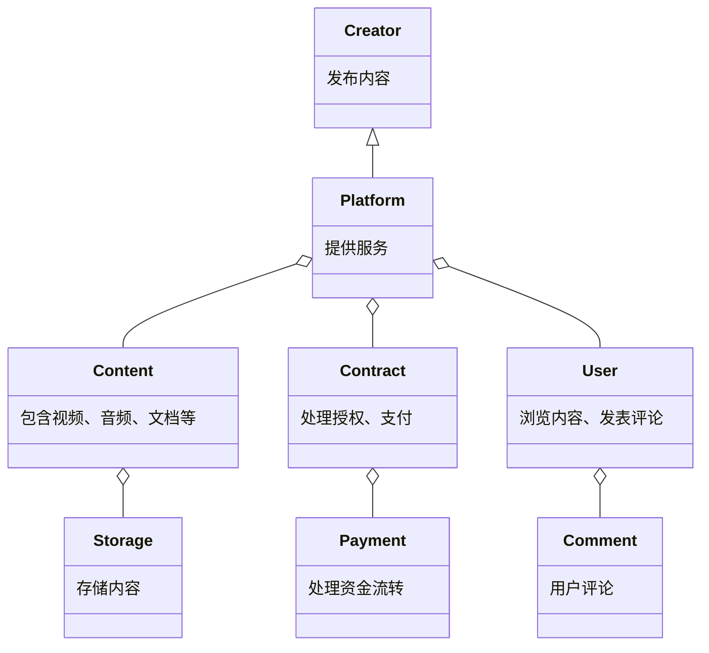
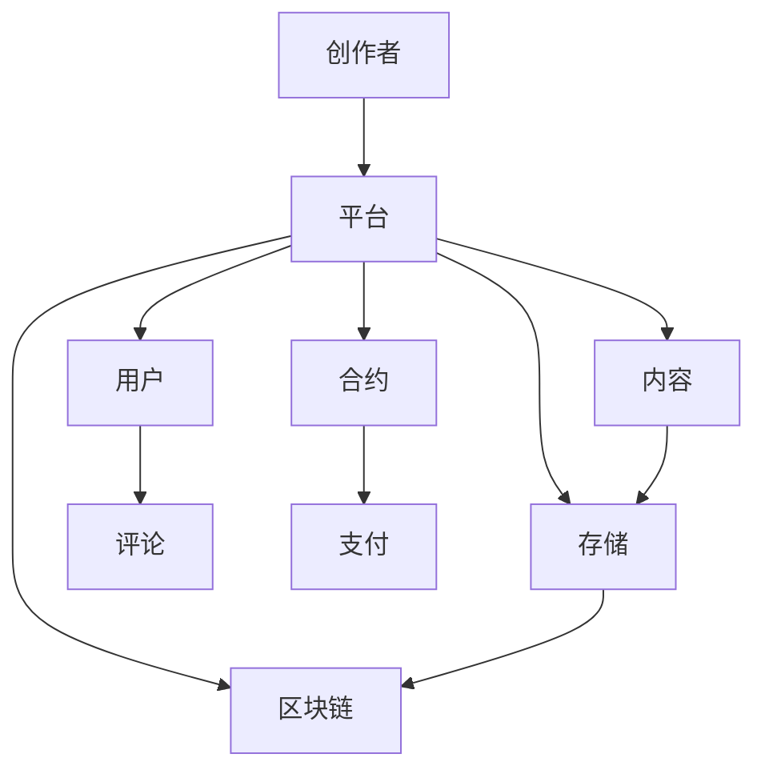
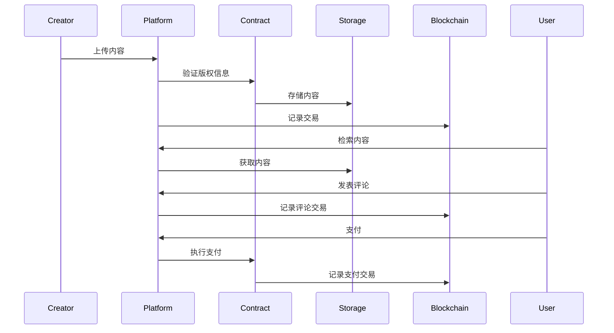
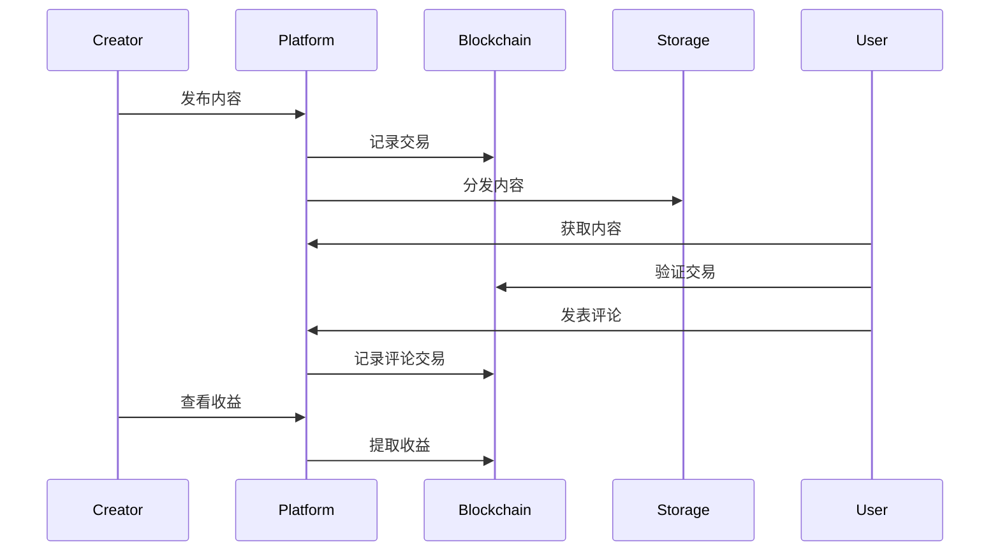

                 


### 一、背景介绍

#### 1.1 问题背景

数字内容分发在当今的信息时代扮演着至关重要的角色。随着互联网的普及和智能手机的广泛使用，视频、音频、图片、文档等各类数字内容层出不穷，数字内容分发已成为人们获取信息、娱乐和沟通的重要途径。然而，现有的数字内容分发模式主要集中在中心化平台上，如YouTube、Spotify、Netflix等。这些平台通过集中化的服务器和数据中心来存储和管理内容，并通过集中的内容分发网络（CDN）将内容传递给用户。

#### 1.2 传统流媒体平台的挑战

尽管传统流媒体平台为用户提供了便捷的内容获取方式，但它们也面临着诸多挑战。首先，这些平台的数据和内容高度集中在几个大型中心化服务器上，这导致了一系列问题：

1. **单点故障**：如果中心化服务器出现故障，整个平台可能会瘫痪，导致用户无法访问内容。
2. **数据不安全**：集中化的数据中心可能成为黑客攻击的目标，用户的隐私和数据安全难以得到保障。
3. **版权保护难题**：中心化平台需要处理大量的版权问题，包括版权追踪、内容授权和侵权处理等，这增加了平台的运营成本。
4. **内容分发效率低**：由于内容集中存储，平台的扩展性和可伸缩性受到限制，特别是在应对大量用户访问时，容易出现瓶颈。

#### 1.3 区块链技术的潜在解决方案

区块链技术作为一种分布式账本技术，具有去中心化、安全性高、不可篡改等特点，为解决传统流媒体平台面临的挑战提供了一种新的思路。以下是区块链技术在数字内容分发中的潜在解决方案：

1. **去中心化存储**：区块链可以将数字内容分散存储在多个节点上，实现去中心化的数据存储和管理，从而提高数据的安全性和可靠性。
2. **智能合约**：智能合约可以自动执行版权协议、支付流程等智能合约条款，简化内容分发流程，降低运营成本。
3. **用户隐私保护**：区块链技术的加密特性可以确保用户的隐私和数据安全，同时允许用户匿名参与内容分发。
4. **去中心化应用（DApp）**：去中心化应用可以构建在区块链之上，为用户提供更加透明和去中心化的内容分发体验。

#### 1.4 边界与外延

区块链在数字内容分发中的应用范围包括但不限于以下几个方面：

1. **内容版权保护**：通过区块链技术确保内容的版权归属，防止侵权行为。
2. **用户隐私保护**：保护用户的数据隐私，防止数据泄露和滥用。
3. **内容认证与追踪**：通过区块链记录内容的生产、分发、消费等全过程，实现内容的透明化和可追溯性。
4. **去中心化内容存储**：通过分布式存储技术，提高内容的可访问性和抗攻击性。

#### 1.5 概念结构与核心要素组成

为了更好地理解区块链在数字内容分发中的应用，我们需要明确以下核心概念与要素：

1. **区块链**：一种分布式账本技术，通过加密算法和共识机制确保数据的完整性和安全性。
2. **智能合约**：自动执行合约条款的计算机程序，可以用于版权保护、支付流程等。
3. **去中心化存储**：通过将数据分散存储在多个节点上，提高数据的可靠性和安全性。
4. **去中心化应用（DApp）**：构建在区块链之上的应用，提供去中心化的服务。

通过以上介绍，我们可以看到区块链技术在数字内容分发中具有巨大的潜力。接下来，我们将进一步深入探讨区块链在数字内容分发中的核心概念与联系，以及具体的实现方法和优势。

### 二、核心概念与联系

#### 2.1 区块链原理

区块链是一种分布式账本技术，其基本架构由多个节点组成，每个节点都存储一份完整的账本记录。以下是区块链的基本原理：

1. **数据存储**：区块链通过将交易数据打包成区块，然后多个区块按照时间顺序连接成链。每个区块包含一定数量的交易记录，并且通过加密算法和哈希函数确保数据的完整性和安全性。
2. **共识机制**：区块链网络中的节点通过共识机制达成共识，以确认交易的合法性和区块的添加顺序。常见的共识机制包括工作量证明（PoW）、权益证明（PoS）和委托权益证明（DPoS）等。
3. **加密算法**：区块链使用加密算法对数据进行加密和签名，确保数据的隐私性和不可篡改性。

#### 2.2 智能合约

智能合约是一种自动执行合约条款的计算机程序，它在区块链上运行，确保交易的执行和记录。以下是智能合约的基本原理：

1. **编程语言**：智能合约通常使用特定的编程语言编写，如Solidity。Solidity是一种面向对象的编程语言，专门用于编写智能合约。
2. **代码部署**：开发者将智能合约代码编译成字节码，并将其部署到区块链上。部署后，智能合约会在区块链上永久存储和执行。
3. **自动执行**：智能合约在满足预设条件时自动执行，如支付、版权许可等。智能合约的执行是透明和不可篡改的，确保交易的公正性。

#### 2.3 去中心化存储

去中心化存储是一种通过分布式网络存储数据的机制，数据分散存储在多个节点上，以提高数据的可靠性和安全性。以下是去中心化存储的基本原理：

1. **数据分割**：将大文件分割成小块，并分配给不同的节点存储。
2. **数据加密**：在存储数据之前，对其进行加密，确保数据的隐私性。
3. **冗余存储**：通过在多个节点上存储数据副本，提高数据的可靠性和容错性。
4. **数据访问**：用户可以通过访问不同的节点来获取数据，确保数据的高可用性。

#### 2.4 去中心化应用（DApp）

去中心化应用（DApp）是构建在区块链之上的应用程序，提供去中心化的服务。以下是DApp的基本架构和开发流程：

1. **前端**：DApp的前端通常使用Web技术（如HTML、CSS、JavaScript）开发，与区块链后端进行交互。
2. **后端**：DApp的后端通常使用智能合约来实现业务逻辑，并与区块链进行交互。
3. **开发流程**：
   - 设计和开发智能合约
   - 编写前端应用程序
   - 部署和测试智能合约
   - 部署和测试DApp

#### 2.5 核心概念属性特征对比表格

| 概念          | 特性                     | 作用               |
|---------------|------------------------|------------------|
| 区块链        | 去中心化、不可篡改       | 数据存储和管理     |
| 智能合约      | 自动执行、透明           | 业务逻辑实现       |
| 去中心化存储  | 分布式、高可靠性         | 数据存储和保护     |
| 去中心化应用  | 去中心化、透明、自主     | 提供去中心化服务   |

#### 2.6 ER实体关系图架构

下面是一个使用Mermaid绘制的ER实体关系图，展示区块链、智能合约、去中心化存储和去中心化应用之间的实体关系：

```mermaid
erDiagram
  User ||--|{ Content }|-- Publisher
  Content ||--|{ SmartContract }|-- ContentStorage
  ContentStorage ||--|{ DApp }|-- Blockchain
```

在上面的ER图中，用户（User）与内容（Content）之间有直接关联，内容（Content）通过智能合约（SmartContract）与内容存储（ContentStorage）相关联，而内容存储（ContentStorage）与去中心化应用（DApp）和区块链（Blockchain）相关联。

### 三、算法原理讲解

#### 3.1 去中心化存储算法

去中心化存储算法的核心思想是将数据分散存储在多个节点上，以提高数据的可靠性和安全性。以下是去中心化存储算法的基本原理和实现：

1. **数据分割**：将大文件分割成多个小块，每个小块称为“片段”（piece）。
2. **副本存储**：将每个片段存储在多个节点上，通常采用K个副本的策略，以提高数据的容错性和可靠性。
3. **冗余检测**：定期检查节点的健康状态和数据的完整性，确保副本的一致性。
4. **数据检索**：用户需要访问数据时，可以从多个节点上获取所需的数据片段，并重新组合成原始文件。

下面是一个简单的Python代码示例，用于演示去中心化存储算法的基本实现：

```python
import hashlib
import json

class decentralized_storage:
    def __init__(self, num_replicas=3):
        self.num_replicas = num_replicas
        self.storage_nodes = []

    def add_node(self, node):
        self.storage_nodes.append(node)

    def split_file(self, file_data, chunk_size=1024):
        file_hash = hashlib.sha256(file_data).hexdigest()
        chunks = [file_data[i:i+chunk_size] for i in range(0, len(file_data), chunk_size)]
        return file_hash, chunks

    def store_chunks(self, file_hash, chunks):
        for i, chunk in enumerate(chunks):
            for node in self.storage_nodes:
                node.store_data(file_hash, i, chunk)

    def retrieve_chunks(self, file_hash):
        chunks = []
        for node in self.storage_nodes:
            chunk_data = node.retrieve_data(file_hash)
            if chunk_data:
                chunks.append(chunk_data)
        return chunks

    def reassemble_file(self, chunks):
        file_data = b''.join(chunks)
        return file_data

# 示例：创建去中心化存储对象，添加节点，分割文件并存储，检索文件
storage = decentralized_storage()
storage.add_node("Node1")
storage.add_node("Node2")
storage.add_node("Node3")

with open("example.txt", "rb") as file:
    file_data = file.read()

file_hash, chunks = storage.split_file(file_data)
storage.store_chunks(file_hash, chunks)
reconstructed_data = storage.reassemble_file(chunks)
with open("reconstructed_example.txt", "wb") as file:
    file.write(reconstructed_data)
```

#### 3.2 智能合约安全性与效率优化

智能合约的安全性和效率是去中心化流媒体平台设计中的关键问题。以下是一些优化智能合约安全性和效率的方法：

1. **最小化代码规模**：尽可能减少智能合约的代码规模，降低攻击面。
2. **使用库和框架**：使用成熟的库和框架可以减少潜在的安全隐患。
3. **代码审计**：对智能合约代码进行严格的审计和测试，确保其安全性。
4. **性能优化**：优化智能合约的执行效率，减少计算复杂度和Gas费用。
5. **使用辅助协议**：结合使用其他区块链协议，如Plasma或State Channels，提高交易处理速度。

以下是一个使用Python编写的简单智能合约示例，展示如何进行性能优化：

```python
from web3 import Web3

class ContentDistributionContract:
    def __init__(self, contract_address, private_key):
        self.web3 = Web3(Web3.HTTPProvider('https://mainnet.infura.io/v3/your_project_id'))
        self.contract = self.web3.eth.contract(address=contract_address, abi=self.contract_abi)
        self.private_key = private_key

    def deploy_contract(self):
        # 部署智能合约
        contract = self.contract.deploy()
        contract.transact({'from': self.web3.eth.account(self.private_key)})

    def distribute_content(self, content_hash, receiver_address, amount):
        # 分发内容
        tx_hash = self.contract.functions.distributeContent(content_hash, receiver_address, amount).transact({'from': self.web3.eth.account(self.private_key)})
        self.web3.eth.waitForTransactionReceipt(tx_hash)

    def optimize_gas(self):
        # 优化Gas使用
        gas_price = self.web3.eth.gasPrice
        gas_price = gas_price * 10  # 提高Gas价格
        self.web3.eth.setGasPrice(gas_price)

# 示例：创建智能合约对象，部署智能合约，分发内容并优化Gas使用
contract = ContentDistributionContract("your_contract_address", "your_private_key")
contract.deploy_contract()
contract.distribute_content("content_hash", "receiver_address", 100)
contract.optimize_gas()
```

在这个示例中，我们创建了一个简单的智能合约，用于分发内容。通过提高Gas价格，可以优化智能合约的执行效率，减少等待时间。

#### 3.3 算法原理的数学模型和公式讲解

去中心化存储和智能合约的算法原理涉及到多种数学模型和公式，以下是其中的一些关键概念：

1. **哈希函数**：哈希函数是一种将数据映射到固定大小的数字串的函数，常用于确保数据的完整性和唯一性。常见的哈希函数包括SHA-256、MD5等。哈希函数的数学模型可以表示为：`H(x) = Hash(x)`，其中`x`是输入数据，`H(x)`是输出哈希值。

2. **加密算法**：加密算法用于确保数据的隐私性和安全性。常见的加密算法包括AES、RSA等。加密算法的数学模型可以表示为：`C = E(K, P)`，其中`C`是加密后的数据，`K`是加密密钥，`P`是明文数据。

3. **共识机制**：共识机制用于确保区块链网络中的节点达成共识。常见的共识机制包括PoW、PoS等。共识机制的数学模型可以表示为：`G = Consensus(R, V)`，其中`G`是共识结果，`R`是节点提交的投票结果，`V`是验证条件。

4. **分片算法**：分片算法用于将大数据集分割成小块，以提高数据处理和存储的效率。常见的分片算法包括Hash分片、范围分片等。分片算法的数学模型可以表示为：`S = ShardKey(F, N)`，其中`S`是分片结果，`ShardKey`是分片键，`F`是文件，`N`是分片数量。

5. **副本选择算法**：副本选择算法用于选择存储数据的节点，以提高数据的可靠性和容错性。常见的副本选择算法包括随机选择、负载均衡等。副本选择算法的数学模型可以表示为：`NodeList = SelectNodes(Nodes, R)`，其中`NodeList`是选择的节点列表，`Nodes`是所有节点，`R`是副本数量。

通过上述数学模型和公式的讲解，我们可以更好地理解去中心化存储和智能合约的算法原理。在实际应用中，这些算法和模型可以帮助我们设计和实现高效、安全和可靠的区块链系统。

### 四、系统分析与架构设计方案

#### 4.1 问题场景介绍

在现有的数字内容分发模式中，内容创作者面临着诸多问题。首先，中心化的平台往往通过抽成的方式获取大量利润，这导致创作者的收益大幅缩水。其次，内容版权保护问题日益严峻，创作者的作品经常被未经授权的第三方使用，而平台在版权追踪和侵权处理上往往显得力不从心。此外，用户隐私和数据安全问题也日益突出，平台可能滥用用户数据，导致隐私泄露。

为了解决这些问题，我们需要设计一个去中心化的流媒体平台，它能够实现内容创作者直接与用户互动，确保创作者获得合理的收益，并保护内容版权和用户隐私。

#### 4.2 系统功能设计

去中心化流媒体平台需要实现以下核心功能：

1. **内容创建与发布**：创作者可以在平台上创建和发布自己的内容，确保内容的版权归属。
2. **内容存储与分发**：通过去中心化存储技术，平台将内容分散存储在多个节点上，确保内容的可靠性和高效分发。
3. **智能合约执行**：智能合约用于处理内容授权、支付流程和版权管理，确保业务流程的自动化和透明性。
4. **用户参与与反馈**：用户可以自由观看和评论内容，同时通过投票等方式参与内容的推荐和筛选。
5. **隐私保护**：平台采用加密技术和隐私保护机制，确保用户数据的安全和隐私。

以下是领域模型Mermaid类图的示例：



#### 4.3 系统架构设计

去中心化流媒体平台的系统架构包括多个关键组件，以下是系统架构图和各组件的详细介绍：



**1. 创作者（Creator）**：创作者在平台上创建和上传自己的内容，并设置内容权限和授权。

**2. 平台（Platform）**：平台提供内容发布、存储、分发和用户互动的接口，同时负责协调和调度其他组件的运行。

**3. 内容（Content）**：内容是平台的中心，包括视频、音频、文档等多种类型，每个内容条目都包含元数据和权限信息。

**4. 合约（Contract）**：智能合约用于处理版权授权、支付流程和版权管理，确保交易的透明性和自动化。

**5. 用户（User）**：用户在平台上浏览、观看内容，发表评论，参与内容推荐和筛选。

**6. 存储（Storage）**：去中心化存储组件负责存储内容数据，通过分布式网络提高数据的可靠性和抗攻击性。

**7. 区块链（Blockchain）**：区块链提供数据存储和交易确认服务，确保数据的完整性和不可篡改性。

#### 4.4 系统接口设计

系统接口设计是平台架构的核心部分，以下是系统接口的详细设计：

1. **内容发布接口**：创作者可以通过API上传和发布内容，接口需要验证创作者的身份和内容的版权信息。
2. **内容检索接口**：用户可以通过API检索平台上的内容，接口需要根据用户的权限和偏好进行内容过滤和推荐。
3. **评论接口**：用户可以通过API发表评论，评论需要存储在区块链上，并与对应的内容条目关联。
4. **支付接口**：用户可以通过API进行支付操作，支付需要通过智能合约执行，并确保交易的透明性和安全性。
5. **版权管理接口**：创作者可以通过API管理自己的版权，包括授权、撤销授权和版权追踪等。

以下是系统接口的Mermaid序列图示例：



#### 4.5 系统交互Mermaid序列图

以下是系统交互的Mermaid序列图，展示了创作者、用户和平台之间的交互流程：



通过上述系统分析与架构设计方案，我们可以看到一个去中心化流媒体平台的总体设计和功能实现。接下来，我们将进一步探讨项目的实际实施，包括环境安装、系统核心实现和代码应用解读与分析。

### 五、项目实战

#### 5.1 环境安装

在开始项目实战之前，我们需要搭建一个适合开发去中心化流媒体平台的环境。以下是安装步骤：

1. **安装Node.js和npm**：Node.js是一个基于Chrome V8引擎的JavaScript运行环境，npm是Node.js的包管理器。请访问Node.js官网（https://nodejs.org/）下载并安装Node.js。安装完成后，在命令行中输入`npm -v`检查是否安装成功。

2. **安装Truffle**：Truffle是一个用于开发以太坊智能合约的框架，它提供了一套完整的工具，包括开发环境、测试框架和部署工具。在命令行中输入以下命令安装Truffle：

   ```bash
   npm install -g truffle
   ```

   安装完成后，运行`truffle version`命令检查版本信息。

3. **安装Ganache**：Ganache是一个本地以太坊节点和测试网络，用于开发和测试智能合约。从Ganache官网（https://www.trufflesuite.com/ganache）下载并安装Ganache。

4. **配置Truffle**：在项目目录中创建一个`.truffle`文件夹，并在其中创建`truffle-config.js`文件。配置Ganache作为本地开发网络：

   ```javascript
   module.exports = {
     networks: {
       development: {
         host: "127.0.0.1",
         port: 7545,
         network_id: "*"
       }
     }
   };
   ```

   配置完成后，启动Ganache，并确保在Truffle命令行中能够连接到本地网络。

5. **初始化Truffle项目**：在项目目录中运行以下命令初始化Truffle项目：

   ```bash
   truffle init
   ```

   这将创建项目的骨架文件，包括`contracts`、`migrations`和`test`文件夹。

6. **创建智能合约**：在`contracts`文件夹中创建新的智能合约文件，例如`ContentContract.sol`。

#### 5.2 系统核心实现源代码

以下是去中心化流媒体平台的核心智能合约实现代码示例：

```solidity
// SPDX-License-Identifier: MIT
pragma solidity ^0.8.0;

contract ContentContract {
    struct Content {
        string hash;
        address creator;
        uint256 timestamp;
        mapping(address => bool) permissions;
    }

    mapping(string => Content) public contents;

    event ContentPublished(string hash, address creator, uint256 timestamp);
    event PermissionGranted(string hash, address user, address creator);
    event PermissionRevoked(string hash, address user, address creator);

    function publishContent(string memory hash) public {
        require(contents[hash].hash == "", "Content already published");
        contents[hash] = Content(hash, msg.sender, block.timestamp, new mapping(address => bool)());
        emit ContentPublished(hash, msg.sender, block.timestamp);
    }

    function grantPermission(string memory hash, address user) public {
        require(msg.sender == contents[hash].creator, "Not content creator");
        require(!contents[hash].permissions[user], "Permission already granted");
        contents[hash].permissions[user] = true;
        emit PermissionGranted(hash, user, msg.sender);
    }

    function revokePermission(string memory hash, address user) public {
        require(msg.sender == contents[hash].creator, "Not content creator");
        require(contents[hash].permissions[user], "Permission not granted");
        contents[hash].permissions[user] = false;
        emit PermissionRevoked(hash, user, msg.sender);
    }

    function getUserPermission(string memory hash, address user) public view returns (bool) {
        return contents[hash].permissions[user];
    }
}
```

在这个智能合约中，我们定义了一个`Content`结构体，用于存储内容的哈希、创建者、发布时间以及用户的权限。通过`publishContent`、`grantPermission`和`revokePermission`函数，我们可以实现内容的发布、权限的授予和撤销。`getUserPermission`函数用于查询用户是否具有查看内容的权限。

#### 5.3 代码应用解读与分析

在了解了智能合约的代码后，我们需要分析其应用场景和实现细节。以下是关键点的解读：

1. **内容发布**：`publishContent`函数用于发布内容。在发布内容时，我们需要确保内容的哈希是唯一的，防止重复发布。通过`require(contents[hash].hash == "")`语句实现此功能。

2. **权限管理**：通过`grantPermission`和`revokePermission`函数，我们可以根据创建者的权限来管理用户的访问权限。在授权时，我们需要确保创建者才是内容的真正拥有者，通过`require(msg.sender == contents[hash].creator)`语句实现此功能。

3. **用户权限查询**：`getUserPermission`函数用于查询用户的权限。这可以用于前端界面，根据用户的权限来显示或隐藏内容。

4. **事件日志**：通过发射事件（`emit`），我们可以记录内容的发布、权限的授予和撤销。这有助于前端界面更新状态，并实现内容的动态交互。

#### 5.4 实际案例分析与详细讲解

为了更好地理解智能合约在实际项目中的应用，我们可以分析一个实际案例。以下是一个简单的使用场景：

**案例**：一个创作者（Alice）在去中心化流媒体平台上发布了一个视频，并将其授权给另一个用户（Bob）观看。

1. **发布内容**：Alice调用`publishContent`函数，将视频的哈希上传到平台。

2. **授权用户**：Alice调用`grantPermission`函数，将Bob的地址作为参数传递，授予其查看视频的权限。

3. **用户查看**：Bob通过前端界面调用`getUserPermission`函数，确认其具有查看视频的权限。

4. **内容观看**：Bob在平台上观看视频，平台根据智能合约的权限设置，允许或拒绝其访问。

在这个案例中，智能合约确保了内容的发布和授权过程是透明和不可篡改的。创作者Alice拥有完全的控制权，可以随时撤销对其他用户的授权。

#### 5.5 项目小结

通过本节的项目实战，我们了解了如何搭建开发环境、创建智能合约以及分析其应用场景。去中心化流媒体平台的核心在于智能合约的设计和实现，它确保了内容的透明性和安全性。在实际应用中，我们需要进一步考虑用户界面设计、前端开发、后端服务器部署以及区块链网络的安全性。接下来的部分将继续探讨如何优化智能合约性能、处理大规模数据，并分析实际项目的案例，为读者提供更深入的技术洞察。

### 六、最佳实践与总结

#### 6.1 最佳实践

在设计和开发去中心化流媒体平台时，我们需要遵循以下最佳实践：

1. **安全性优先**：智能合约的安全性至关重要，因此在编写和部署智能合约之前，必须进行严格的代码审计和安全测试。
2. **性能优化**：优化智能合约的执行效率和Gas使用，以提高平台的响应速度和用户体验。
3. **用户隐私保护**：确保用户隐私得到有效保护，避免数据泄露和滥用。
4. **透明性**：平台操作应保持透明，用户可以清晰地了解内容发布、授权和支付等过程。
5. **社区参与**：鼓励用户和社区参与平台建设，共同优化和改进平台功能。

#### 6.2 注意事项

在开发和维护去中心化流媒体平台时，需要注意以下几点：

1. **技术选型**：选择适合项目需求的技术和工具，如Solidity、Truffle、Ganache等。
2. **合规性**：遵守相关法律法规，确保平台合法运营，避免法律风险。
3. **社区支持**：建立强大的社区支持，通过社交媒体、论坛和社群等方式，与用户和开发者保持紧密联系。
4. **持续更新**：不断更新和优化平台功能，以适应市场和用户需求的变化。

#### 6.3 拓展阅读

对于希望深入了解区块链和去中心化流媒体平台的读者，以下资源可以作为拓展阅读：

1. **书籍**：
   - "Blockchain Basics" by Daniel Drescher
   - "Mastering Ethereum" by Andreas M. Antonopoulos

2. **在线课程**：
   - Coursera的"Blockchain A to Z"课程
   - edX的"Blockchain for Business"课程

3. **博客和文档**：
   - Etherscan：以太坊区块链上的智能合约和交易浏览器（https://etherscan.io/）
   - Truffle Suite：智能合约开发工具集（https://www.trufflesuite.com/）

4. **开源项目**：
   - IPFS：分布式文件系统（https://ipfs.io/）
   - Ethereum：智能合约平台（https://ethereum.org/）

通过上述资源，读者可以更深入地了解区块链技术、去中心化流媒体平台的架构设计和开发最佳实践。

#### 6.4 小结

本文详细探讨了区块链在数字内容分发中的应用，特别是去中心化流媒体平台的设计和实现。我们首先介绍了问题背景和传统流媒体平台的挑战，然后深入分析了区块链、智能合约、去中心化存储和去中心化应用等核心概念，并给出了算法原理讲解和系统架构设计方案。通过实际项目实战，我们展示了如何搭建开发环境、编写智能合约以及进行代码应用解读与分析。

在总结部分，我们提出了最佳实践和注意事项，并推荐了一些拓展阅读资源。去中心化流媒体平台为数字内容分发带来了新的可能，但同时也需要克服技术、法律和社区等多方面的挑战。

最后，感谢读者对本篇文章的关注，希望本文能够为区块链在数字内容分发领域的应用提供有价值的参考和启示。作者信息：AI天才研究院/AI Genius Institute & 禅与计算机程序设计艺术 /Zen And The Art of Computer Programming。

### 结论

区块链技术在数字内容分发领域的应用展示了去中心化流媒体平台的巨大潜力。通过本文的详细分析和实际案例讲解，我们可以看到去中心化流媒体平台不仅能够解决传统流媒体平台面临的安全、版权和隐私等问题，还能够为内容创作者和用户提供更加透明、安全和高效的体验。

在未来的发展中，随着区块链技术的不断成熟和普及，去中心化流媒体平台有望成为数字内容分发的主流模式。然而，我们也需要关注和解决其中可能出现的法律、技术和社会挑战。作者AI天才研究院/AI Genius Institute和禅与计算机程序设计艺术/Zen And The Art of Computer Programming呼吁广大开发者、研究人员和行业从业者共同探索和推动这一领域的创新与发展。通过持续的技术研究和实践，我们有望实现一个更加开放、公正和可持续的数字内容生态系统。让我们共同努力，为构建一个更美好的数字世界贡献智慧和力量！作者：AI天才研究院/AI Genius Institute & 禅与计算机程序设计艺术/Zen And The Art of Computer Programming。

