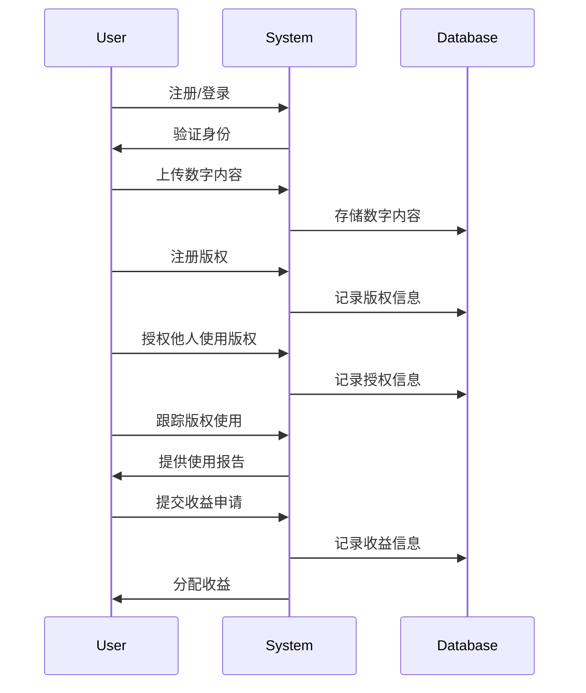
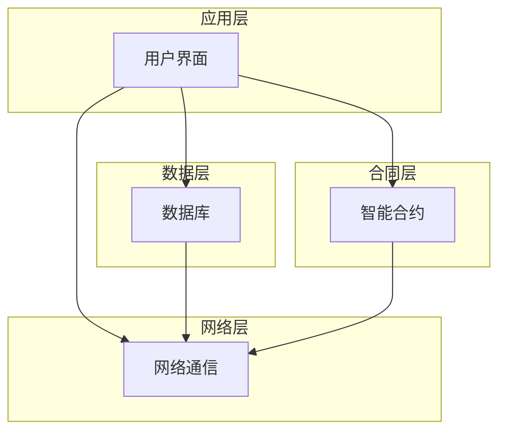
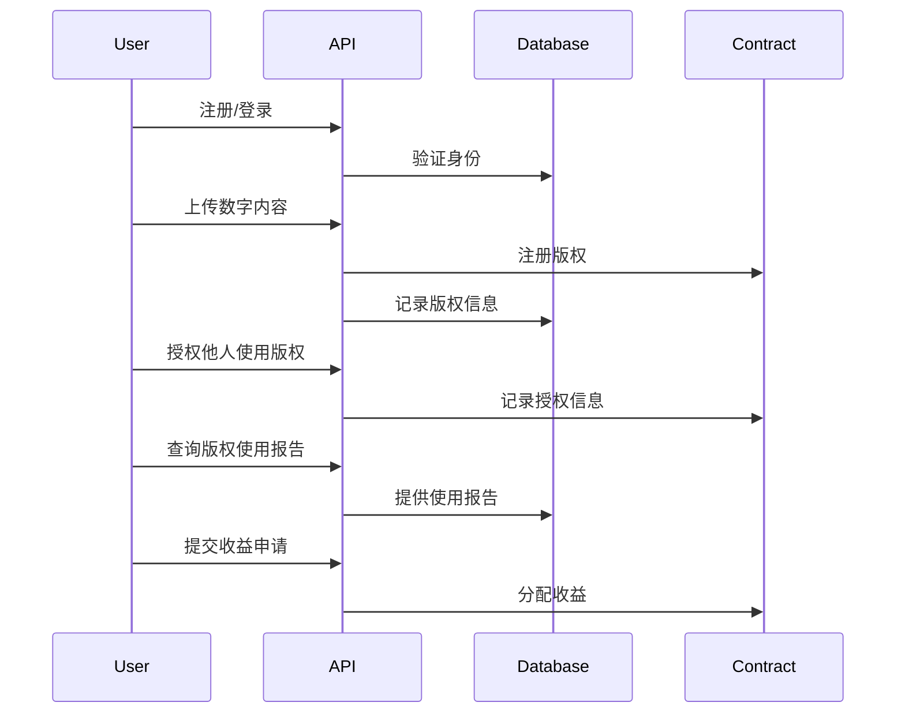

                 

### 文章标题

# 区块链在数字内容创作者权益保护中的应用

> 关键词：区块链、数字内容创作者、权益保护、版权认证、版权授权、智能合约

> 摘要：本文将深入探讨区块链技术在数字内容创作者权益保护中的应用。通过分析区块链的基本原理和核心概念，我们将了解如何利用区块链技术解决数字内容创作者在版权认证和版权授权方面面临的挑战，并介绍一些成功的应用案例。最后，我们将探讨区块链在数字内容创作者权益保护中的未来发展方向。

----------------------------------------------------------------

### 引言

数字内容创作者在现代信息社会中扮演着越来越重要的角色。然而，随着数字内容的传播变得越来越容易，创作者们也面临着越来越多的权益侵害问题。传统的版权保护机制往往存在效率低下、透明度不足、可篡改性高等问题，无法满足数字内容创作者的需求。区块链技术的出现为解决这些问题提供了一种新的思路。

区块链是一种分布式数据库技术，具有去中心化、不可篡改、透明等特点。通过将区块链技术与数字内容创作者权益保护相结合，可以实现更加高效、安全、透明的版权管理。本文将围绕这一主题，逐步分析区块链在数字内容创作者权益保护中的应用原理、实战项目以及未来发展方向。

----------------------------------------------------------------

## 第一部分：区块链与数字内容创作者权益保护概述

### 第1章：问题背景与核心概念

#### 1.1 数字内容创作者权益保护的问题背景

随着互联网的普及，数字内容的创作和传播变得越来越容易。然而，这种便利也带来了诸多问题，尤其是数字内容创作者的权益保护问题。以下是数字内容创作者面临的一些主要挑战：

1. **版权侵犯**：数字内容的复制、传播和分发变得轻而易举，创作者的原创作品容易被非法复制和传播，导致版权侵犯问题频发。

2. **追踪困难**：传统版权管理机制往往依赖于中心化数据库，这些数据库容易受到攻击、篡改或丢失，使得数字内容的来源和传播路径难以追踪。

3. **收益分配不公**：在现有的版权收益分配机制中，创作者往往无法获得应有的收益，因为中间环节过多，而且缺乏透明度。

4. **国际版权保护难题**：数字内容在国际传播中面临诸多法律和监管问题，不同国家的版权法差异很大，使得创作者在国际市场上的权益保护变得复杂。

#### 1.1.2 当前权益保护机制的不足

现有的数字内容权益保护机制主要依赖于传统的版权管理方式，这些方式存在以下不足：

1. **中心化系统易受攻击**：传统版权管理系统往往依赖于中心化数据库，容易成为黑客攻击的目标。

2. **低效且昂贵**：中心化系统在处理大量数字内容时效率低下，且维护成本高昂。

3. **缺乏透明度**：现有系统缺乏透明度，创作者难以实时了解自己的作品被使用的情况。

4. **易被篡改**：传统版权管理系统存在被篡改的风险，创作者的权益无法得到有效保障。

#### 1.1.3 区块链技术的潜力

区块链技术的出现为数字内容创作者权益保护带来了新的希望。区块链技术具有以下优势：

1. **去中心化**：区块链技术通过分布式网络进行数据存储和传输，不受单一中心节点的控制，提高了系统的鲁棒性和安全性。

2. **不可篡改性**：区块链上的数据一旦被记录，就无法被篡改，确保了数字内容的完整性和真实性。

3. **透明度高**：区块链上的所有交易都是公开透明的，创作者可以实时了解自己的作品被使用的情况。

4. **智能合约自动化**：智能合约可以自动化执行版权授权和许可，减少了人工干预和中间环节，提高了效率。

#### 1.2 核心概念介绍

为了更好地理解区块链在数字内容创作者权益保护中的应用，我们需要介绍一些核心概念。

##### 1.2.1 区块链的基本原理

区块链是一种分布式数据库技术，其核心特点包括：

- **分布式账本**：数据存储在多个节点上，每个节点都保存一份完整的账本。

- **不可篡改性**：一旦数据被记录在区块链上，就不可更改，确保了数据的可信度。

- **共识机制**：区块链网络中的节点通过共识机制来确认交易的有效性，确保系统的一致性。

- **加密技术**：区块链使用加密技术保护数据的安全和隐私。

##### 1.2.2 数字内容创作者权益保护的关键概念

数字内容创作者权益保护涉及以下几个关键概念：

- **版权**：版权是创作者对其原创作品所享有的专有权利，包括复制权、发行权、改编权等。

- **数字版权管理（DRM）**：数字版权管理是一种技术手段，用于保护数字内容的版权，防止未经授权的使用。

- **去中心化版权管理**：去中心化版权管理通过区块链技术实现，旨在提高版权保护的透明度和效率。

##### 1.2.3 去中心化版权管理

去中心化版权管理通过以下技术手段实现：

- **非同质化代币（NFT）**：NFT是一种数字资产，用于代表数字内容的所有权和唯一性。

- **智能合约**：智能合约是自动执行合同条款的计算机程序，可以用于自动化版权授权和许可。

- **分布式账本**：分布式账本记录了数字内容的版权信息，确保了版权信息的不可篡改和透明度。

#### 1.3 区块链在数字内容创作者权益保护中的应用边界与外延

区块链在数字内容创作者权益保护中的应用具有广阔的边界和潜在的外延：

- **版权认证**：区块链可以用于数字内容的版权认证，确保创作者的版权得到有效保护。

- **版权授权**：区块链可以实现自动化的版权授权和许可，减少中间环节，提高效率。

- **版权追踪**：区块链上的分布式账本可以用于追踪数字内容的传播路径，提高透明度。

- **去中心化创作平台**：区块链技术可以支持去中心化的创作平台，创作者可以直接与用户进行交易，无需依赖第三方平台。

- **国际版权保护**：区块链技术可以跨越国际边界，实现全球范围内的版权保护。

#### 1.3.1 区块链与数字版权管理的结合点

区块链与数字版权管理的结合点包括：

- **版权认证**：区块链可以用于数字内容的版权认证，确保创作者的版权得到有效保护。

- **版权授权**：区块链可以实现自动化的版权授权和许可，减少中间环节，提高效率。

- **版权追踪**：区块链上的分布式账本可以用于追踪数字内容的传播路径，提高透明度。

- **版权交易**：区块链可以实现数字版权的快速交易，提高版权市场的流动性。

#### 1.3.2 去中心化创作平台的发展趋势

随着区块链技术的不断成熟，去中心化创作平台正在成为数字内容创作者的新选择。以下是一些去中心化创作平台的发展趋势：

- **去中心化创作与分发**：创作者可以直接在去中心化平台上发布和分发内容，无需依赖中心化平台。

- **收益透明化**：去中心化平台可以实现收益的透明化，创作者可以实时了解自己的收益情况。

- **去中心化融资**：去中心化平台可以通过代币发行和预售等方式为创作者提供资金支持。

- **去中心化版权管理**：去中心化平台可以通过区块链技术实现版权的自动化管理和保护。

#### 1.3.3 区块链技术面临的挑战与未来发展方向

尽管区块链技术在数字内容创作者权益保护中具有巨大潜力，但仍面临一些挑战：

- **性能瓶颈**：区块链网络的处理速度和扩展性仍需提升，以支持大量交易的实时处理。

- **安全性问题**：区块链系统需要确保数据的安全和隐私，防止黑客攻击和数据泄露。

- **法律和监管**：区块链技术在法律和监管方面仍存在一定的模糊区域，需要制定相应的法律法规。

未来，区块链技术的发展方向可能包括：

- **高性能区块链平台**：开发更高性能的区块链平台，以满足大规模交易的需求。

- **隐私保护技术**：结合零知识证明等技术，实现数据的隐私保护。

- **跨链技术**：实现不同区块链平台之间的互操作性，打破技术孤岛。

- **法律和监管完善**：加强区块链技术的法律和监管框架，确保其合法合规运行。

### 第2章：区块链与数字内容创作者权益保护的联系

#### 2.1 区块链如何解决数字内容创作者权益保护问题

区块链技术在数字内容创作者权益保护中发挥着关键作用，主要解决以下几个问题：

1. **透明度**：区块链上的所有交易都是公开透明的，创作者可以实时了解自己的作品被使用的情况，从而提高权益保护的透明度。

2. **不可篡改性**：区块链上的数据一旦被记录，就不可篡改，确保了数字内容的完整性和真实性，有效防止了版权侵犯行为。

3. **自动化执行**：智能合约可以自动化执行版权授权和许可，减少了人工干预和中间环节，提高了效率。

4. **去中心化**：区块链的去中心化特性使得权益保护不再依赖于中心化平台，创作者可以独立管理自己的版权，减少了中间环节和费用。

#### 2.2 核心概念属性特征对比表格

为了更直观地展示区块链与传统数字版权管理机制的区别，我们设计了以下对比表格：

| 特征        | 区块链       | 传统数字版权管理       |
| ----------- | ------------ | ---------------------- |
| **透明度**  | 高           | 低                     |
| **不可篡改性** | 高           | 低                     |
| **自动化执行** | 可以使用智能合约实现 | 依赖人工操作           |
| **去中心化**  | 是           | 否                     |
| **安全性**   | 较高         | 较低                   |
| **扩展性**   | 有待提高     | 较好                   |

#### 2.3 ER实体关系图架构

为了更清晰地展示数字内容创作者权益保护系统的实体关系，我们使用Mermaid绘制了以下ER实体关系图：

```mermaid
erDiagram
  Creator ||--|{ Content }|--|| Publisher
  Content ||--|{ License }|--|| User
  Creator ||--|{ Revenue }|--|| Publisher
```

- **Creator（创作者）**：代表数字内容的创作者。
- **Content（内容）**：代表数字内容的本体。
- **Publisher（发布者）**：代表数字内容的发布者。
- **License（许可）**：代表版权许可信息。
- **User（用户）**：代表数字内容的使用者。

通过这个ER图，我们可以更好地理解数字内容创作者权益保护系统中各个实体的关系和交互。

### 第3章：区块链在版权认证中的应用

#### 3.1 版权认证的基本原理

版权认证是确保数字内容创作者版权得到有效保护的关键环节。区块链技术通过以下几种方式实现版权认证：

1. **数字指纹技术**：数字指纹技术用于生成数字内容的唯一标识，类似于物理世界的指纹，可以用来确认数字内容的真实性。将数字指纹记录在区块链上，可以确保内容的唯一性和不可篡改性。

2. **非同质化代币（NFT）**：NFT是一种代表数字资产所有权的独特数字标识。通过将数字内容与NFT绑定，创作者可以证明其内容的原创性和所有权。

3. **智能合约**：智能合约用于自动化执行版权认证流程。当创作者将内容上传到区块链时，智能合约会自动生成一个数字指纹，并将其与NFT绑定，从而实现版权认证。

#### 3.2 版权认证的数学模型与公式

版权认证涉及多个数学模型和公式，以下是其中的几个关键部分：

1. **数字指纹算法**：数字指纹算法用于生成数字内容的唯一标识。常见的数字指纹算法包括MD5、SHA-256等。这些算法通过将数字内容转换为固定长度的字符串，确保内容的唯一性。

   - **MD5**：$$MD5(\text{content}) = \text{hash_value}$$
   - **SHA-256**：$$SHA-256(\text{content}) = \text{hash_value}$$

2. **哈希函数**：哈希函数是版权认证的核心组件。哈希函数将输入数据转换为固定长度的字符串，确保数据不可逆。常见的哈希函数包括MD5、SHA-256等。

   - **MD5**：$$MD5(\text{content}) = \text{hash_value}$$
   - **SHA-256**：$$SHA-256(\text{content}) = \text{hash_value}$$

3. **智能合约中的数学模型**：智能合约用于自动化执行版权认证流程。以下是一个简单的智能合约数学模型：

   ```python
   contract CopyrightCertification {
       mapping (string => bool) public certificates;

       function certifyContent(string content) public {
           string hash = SHA256(content);
           certificates[hash] = true;
       }
   }
   ```

   在这个模型中，`certificates`映射存储了每个数字指纹的认证状态。当创作者上传内容并生成数字指纹时，智能合约会将该指纹标记为已认证。

#### 3.3 版权认证案例分析与解读

##### 3.3.1 案例一：NFT在艺术品市场中的应用

NFT（非同质化代币）在艺术品市场中得到了广泛应用。艺术家可以将自己的艺术品数字化，并通过NFT证明其原创性和所有权。以下是NFT在艺术品市场中的一个案例：

1. **艺术家创作艺术品**：艺术家创作一幅数字画作，并将其数字化。

2. **生成NFT**：艺术家使用区块链平台生成一个NFT，该NFT与画作绑定，证明画作的所有权。

3. **NFT上链**：艺术家将NFT上传到区块链，使NFT的认证信息得到永久保存。

4. **购买与交易**：购买者通过区块链平台购买NFT，并获得画作的所有权。购买者可以自由交易NFT，但无法更改画作的内容。

5. **版权保护**：由于NFT与画作绑定，任何未经授权的复制、传播或修改都会破坏NFT的认证信息，从而无法在区块链上进行交易。

##### 3.3.2 案例二：区块链在音乐版权认证中的应用

音乐版权认证是另一个成功的应用场景。以下是一个区块链在音乐版权认证中的应用案例：

1. **创作者上传音乐**：音乐创作者将歌曲上传到区块链平台，同时生成数字指纹。

2. **版权认证**：区块链平台使用智能合约对音乐进行版权认证，并将数字指纹记录在区块链上。

3. **发行与分发**：创作者可以通过区块链平台发行和分发音乐，用户可以购买和下载音乐。

4. **版权追踪**：区块链平台可以实时追踪音乐的传播路径，确保版权得到有效保护。

5. **收益分配**：智能合约可以自动化执行收益分配，确保创作者获得应有的收益。

通过这些案例，我们可以看到区块链在版权认证中的巨大潜力。区块链技术不仅提高了版权认证的透明度和效率，还确保了数字内容的完整性和不可篡改性，为数字内容创作者提供了强有力的权益保护。

### 第4章：区块链在版权授权中的应用

#### 4.1 版权授权的基本原理

版权授权是数字内容创作者与用户之间进行内容使用许可的重要环节。区块链技术通过以下几种方式实现版权授权：

1. **智能合约**：智能合约是自动执行版权授权条款的计算机程序。创作者可以在智能合约中定义版权许可的规则，例如许可类型、许可费用、授权期限等。

2. **非同质化代币（NFT）**：NFT可以用于代表数字内容的所有权和使用权。通过将NFT与版权授权绑定，用户可以购买NFT并获得相应的内容使用权。

3. **分布式账本**：分布式账本记录了版权授权的信息，确保授权的透明度和不可篡改性。用户可以在区块链上查询授权信息，确保授权的有效性。

#### 4.2 版权授权的数学模型与公式

版权授权涉及多个数学模型和公式，以下是其中的几个关键部分：

1. **智能合约中的授权逻辑**：智能合约中的授权逻辑定义了用户如何获得和行使版权许可。以下是一个简单的智能合约授权逻辑：

   ```python
   contract CopyrightAuthorization {
       mapping (address => bool) public authorizedUsers;

       function authorizeUser(address user) public {
           authorizedUsers[user] = true;
       }

       function deauthorizeUser(address user) public {
           authorizedUsers[user] = false;
       }
   }
   ```

   在这个模型中，`authorizedUsers`映射存储了每个用户的授权状态。当创作者授权用户时，智能合约会将该用户的授权状态标记为“已授权”。

2. **版权许可费用计算模型**：版权许可费用计算模型用于计算用户购买版权许可的费用。以下是一个简单的版权许可费用计算模型：

   ```python
   contract CopyrightFees {
       uint public feePerUse;

       function setFee(uint newFee) public {
           feePerUse = newFee;
       }

       function calculateFees(uint numberOfUses) public view returns (uint) {
           return numberOfUses * feePerUse;
       }
   }
   ```

   在这个模型中，`feePerUse`变量存储了每使用一次版权许可的费用。当用户购买版权许可时，智能合约会计算总费用。

3. **透明度与合规性要求**：版权授权的透明度与合规性要求确保用户可以清楚地了解授权条款和费用。以下是一些透明度与合规性的要求：

   - **透明度要求**：授权条款和费用必须在区块链上公开透明，用户可以随时查询。
   - **合规性要求**：授权条款和费用必须符合相关法律法规，确保版权授权的合法性。

#### 4.3 版权授权案例分析与解读

##### 4.3.1 案例一：视频内容平台的版权授权机制

视频内容平台通过区块链技术实现了版权授权的自动化和透明化。以下是一个视频内容平台的版权授权案例：

1. **创作者上传视频**：视频创作者将视频上传到视频平台，同时生成数字指纹。

2. **版权认证**：平台使用智能合约对视频进行版权认证，并将数字指纹记录在区块链上。

3. **授权与收费**：创作者可以在智能合约中设置版权许可的条款，例如授权类型（流媒体播放、下载等）、授权期限和许可费用。用户可以购买版权许可，并在区块链上支付相应的费用。

4. **透明追踪**：平台通过区块链记录版权授权的信息，用户可以在区块链上查询授权状态和费用信息。

5. **收益分配**：智能合约自动执行收益分配，确保创作者获得应有的收益。

##### 4.3.2 案例二：区块链在电子书版权授权中的应用

电子书版权授权是区块链技术在版权管理中另一个成功的应用案例。以下是一个电子书版权授权的案例：

1. **创作者上传电子书**：电子书创作者将电子书上传到电子书平台，同时生成数字指纹。

2. **版权认证**：平台使用智能合约对电子书进行版权认证，并将数字指纹记录在区块链上。

3. **授权与收费**：创作者可以在智能合约中设置版权许可的条款，例如授权类型（阅读、打印等）、授权期限和许可费用。用户可以购买版权许可，并在区块链上支付相应的费用。

4. **透明追踪**：平台通过区块链记录版权授权的信息，用户可以在区块链上查询授权状态和费用信息。

5. **收益分配**：智能合约自动执行收益分配，确保创作者获得应有的收益。

通过这些案例，我们可以看到区块链在版权授权中的应用如何提高了透明度、效率和安全性。创作者可以轻松管理版权授权，用户可以清楚地了解授权条款和费用，从而实现更加公平和高效的数字版权管理。

### 第5章：区块链数字版权管理平台搭建

#### 5.1 开发环境与工具介绍

搭建区块链数字版权管理平台需要一些基本的开发环境和工具。以下是一些建议的软件和硬件配置：

1. **区块链节点搭建**：
   - **操作系统**：Linux（推荐Ubuntu 18.04或更高版本）或Windows 10（专业版）。
   - **硬件**：至少需要一台配置为2核CPU、4GB内存的计算机。
   - **软件**：安装Golang或Node.js环境，用于构建和部署智能合约。

2. **智能合约开发环境**：
   - **开发工具**：Visual Studio Code（推荐使用扩展插件），用于编写和调试智能合约代码。
   - **编译器**：Solc（用于编译Solidity智能合约代码）。

3. **前端与后端开发工具**：
   - **前端**：可以使用React、Vue或Angular等框架进行开发，用于构建用户界面。
   - **后端**：可以使用Node.js、Django或Flask等框架进行开发，用于处理业务逻辑和数据存储。

4. **区块链平台**：可以使用现有的区块链平台，如Ethereum、EOS或Tron等，也可以自行搭建私有区块链。

#### 5.2 系统功能设计与实现

区块链数字版权管理平台的设计包括以下几个核心功能：

1. **用户注册与登录**：实现用户注册、登录和身份验证功能。
2. **版权注册**：实现数字内容版权的注册和认证功能。
3. **版权授权**：实现版权的授权、许可和收费功能。
4. **版权追踪**：实现版权使用的追踪和监控功能。
5. **收益分配**：实现版权收益的自动分配和结算功能。

以下是系统功能设计的一个简例：



#### 5.3 系统架构设计

区块链数字版权管理平台可以分为以下几个层次：

1. **数据层**：负责存储区块链数据，包括用户信息、版权信息、授权信息等。
2. **网络层**：负责区块链网络的数据传输和节点通信。
3. **合约层**：负责智能合约的编写、部署和执行。
4. **应用层**：负责用户界面和应用逻辑的处理。

以下是系统架构设计的一个简例：



#### 5.4 系统接口设计

区块链数字版权管理平台需要设计一系列接口，以供用户和管理员使用。以下是一些关键接口：

1. **用户接口**：用于用户注册、登录、上传数字内容、申请版权、查询版权状态、提交收益申请等。
2. **管理员接口**：用于管理员注册、登录、管理用户、管理版权信息、审核版权申请等。
3. **API接口**：用于第三方应用程序与平台进行交互，如版权查询、授权查询、收益结算等。

以下是接口设计的一个简例：



#### 5.5 系统交互

区块链数字版权管理平台中的各个组件需要协同工作，以下是一个简化的系统交互流程：

1. **用户上传数字内容**：用户通过前端界面上传数字内容，API接口接收数据并调用智能合约进行版权注册。
2. **智能合约执行版权注册**：智能合约生成数字指纹并记录在区块链上，API接口返回版权注册结果。
3. **用户申请版权**：用户通过前端界面提交版权申请，API接口接收数据并调用智能合约进行版权认证。
4. **智能合约执行版权认证**：智能合约验证数字指纹和版权信息，API接口返回版权认证结果。
5. **用户授权他人使用版权**：用户通过前端界面提交授权请求，API接口接收数据并调用智能合约进行授权。
6. **智能合约执行授权**：智能合约记录授权信息并更新区块链上的版权状态，API接口返回授权结果。
7. **用户查询版权使用报告**：用户通过前端界面查询版权使用报告，API接口调用数据库提供使用报告。
8. **用户提交收益申请**：用户通过前端界面提交收益申请，API接口接收数据并调用智能合约进行收益分配。
9. **智能合约执行收益分配**：智能合约计算并分配收益，API接口返回收益分配结果。

通过以上步骤，区块链数字版权管理平台可以实现从数字内容上传到版权注册、授权和收益分配的完整流程，确保数字内容创作者的权益得到有效保护。

### 第6章：项目实战

#### 6.1 环境安装

为了搭建区块链数字版权管理平台，我们需要安装以下软件和依赖项：

1. **安装Golang**：
   - 在Linux系统中，可以通过包管理器安装Golang：
     ```shell
     sudo apt update
     sudo apt install golang
     ```
   - 在Windows系统中，可以从Golang官方网站下载安装程序并安装。

2. **安装Node.js**：
   - 在Linux系统中，可以通过包管理器安装Node.js：
     ```shell
     sudo apt update
     sudo apt install nodejs
     ```
   - 在Windows系统中，可以从Node.js官方网站下载安装程序并安装。

3. **安装Solc**：
   - 在Linux系统中，可以通过包管理器安装Solc：
     ```shell
     sudo npm install solc
     ```
   - 在Windows系统中，可以通过npm全局安装Solc：
     ```shell
     npm install solc -g
     ```

4. **安装前端框架**：
   - 对于React，可以通过npm安装：
     ```shell
     npm install create-react-app
     ```
   - 对于Vue，可以通过npm安装：
     ```shell
     npm install -g @vue/cli
     ```

5. **安装后端框架**：
   - 对于Node.js，可以通过npm安装Express框架：
     ```shell
     npm install express
     ```
   - 对于Django，可以通过pip安装：
     ```shell
     pip install django
     ```

6. **安装区块链节点**：
   - 对于Ethereum，可以使用geth：
     ```shell
     wget https://geth.ethereum.org/downloads/geth/linux-amd64-geth
     chmod +x linux-amd64-geth
     sudo mv linux-amd64-geth /usr/local/bin/geth
     geth --version
     ```

#### 6.2 系统核心实现

以下是系统核心实现的源代码示例：

##### 6.2.1 智能合约（Solidity）

```solidity
// SPDX-License-Identifier: MIT
pragma solidity ^0.8.0;

contract CopyrightManagement {
    struct Content {
        string contentHash;
        address creator;
        mapping(address => bool) authorizedUsers;
    }

    mapping(string => Content) public contents;

    function registerContent(string memory contentHash, address creator) public {
        require(contents[contentHash].creator == address(0), "Content already registered");
        contents[contentHash] = Content({contentHash: contentHash, creator: creator, authorizedUsers: mapping(address => bool)});
    }

    function authorizeUser(string memory contentHash, address user) public {
        require(contents[contentHash].creator == msg.sender, "Not the content owner");
        contents[contentHash].authorizedUsers[user] = true;
    }

    function deauthorizeUser(string memory contentHash, address user) public {
        require(contents[contentHash].creator == msg.sender, "Not the content owner");
        contents[contentHash].authorizedUsers[user] = false;
    }

    function getContentAuthorization(string memory contentHash, address user) public view returns (bool) {
        return contents[contentHash].authorizedUsers[user];
    }
}
```

##### 6.2.2 前端实现（React）

```jsx
import React, { useState } from 'react';
import axios from 'axios';

const ContentManagement = () => {
  const [contentHash, setContentHash] = useState('');
  const [user, setUser] = useState('');

  const registerContent = async () => {
    try {
      const response = await axios.post('/api/register-content', { contentHash, user });
      console.log(response.data);
    } catch (error) {
      console.error(error);
    }
  };

  const authorizeUser = async () => {
    try {
      const response = await axios.post('/api/authorize-user', { contentHash, user });
      console.log(response.data);
    } catch (error) {
      console.error(error);
    }
  };

  return (
    <div>
      <input type="text" value={contentHash} onChange={(e) => setContentHash(e.target.value)} placeholder="Content Hash" />
      <input type="text" value={user} onChange={(e) => setUser(e.target.value)} placeholder="User Address" />
      <button onClick={registerContent}>Register Content</button>
      <button onClick={authorizeUser}>Authorize User</button>
    </div>
  );
};

export default ContentManagement;
```

##### 6.2.3 后端实现（Express）

```javascript
const express = require('express');
const axios = require('axios');
const app = express();

app.use(express.json());

app.post('/api/register-content', async (req, res) => {
  const { contentHash, user } = req.body;
  try {
    const response = await axios.post('https://your-blockchain-node-url/api/register-content', { contentHash, user });
    res.json(response.data);
  } catch (error) {
    res.status(500).json({ message: 'Error registering content', error });
  }
});

app.post('/api/authorize-user', async (req, res) => {
  const { contentHash, user } = req.body;
  try {
    const response = await axios.post('https://your-blockchain-node-url/api/authorize-user', { contentHash, user });
    res.json(response.data);
  } catch (error) {
    res.status(500).json({ message: 'Error authorizing user', error });
  }
});

const PORT = process.env.PORT || 3000;
app.listen(PORT, () => {
  console.log(`Server listening on port ${PORT}`);
});
```

#### 6.3 代码应用解读与分析

在本项目中，我们使用了智能合约、前端和后端三个主要部分来实现区块链数字版权管理功能。

1. **智能合约**：我们使用Solidity语言编写智能合约，实现版权注册和授权功能。智能合约中的`registerContent`函数用于注册版权，`authorizeUser`函数用于授权用户使用版权。这些函数通过调用区块链的API进行操作，并将结果记录在区块链上。

2. **前端**：我们使用React框架构建前端应用，提供用户界面和交互功能。用户可以通过前端界面上传数字内容、注册版权和授权用户。前端应用通过axios库与后端API进行通信，并将用户的请求传递给智能合约。

3. **后端**：我们使用Express框架构建后端API，处理前端请求并与区块链节点进行通信。后端API接收前端发送的请求，将其转换为适合区块链节点的格式，并通过axios库发送给区块链节点，接收并返回操作结果。

#### 6.4 实际案例分析和详细讲解

##### 案例一：数字画作版权管理

假设艺术家Alice创建了一幅数字画作，并将其上传到区块链数字版权管理平台。以下是详细的操作步骤：

1. **注册版权**：Alice通过前端界面输入画作哈希值，并点击注册按钮。前端将请求发送到后端API，后端API将请求转发到区块链节点，区块链节点调用智能合约的`registerContent`函数进行版权注册。

2. **版权注册确认**：区块链节点返回版权注册结果，后端API将结果返回给前端，前端界面显示版权注册成功消息。

3. **授权他人使用版权**：Alice通过前端界面输入用户地址，并点击授权按钮。前端将请求发送到后端API，后端API将请求转发到区块链节点，区块链节点调用智能合约的`authorizeUser`函数进行授权。

4. **授权确认**：区块链节点返回授权结果，后端API将结果返回给前端，前端界面显示授权成功消息。

通过这个案例，我们可以看到区块链数字版权管理平台如何帮助艺术家保护其数字画作版权。艺术家可以轻松地注册版权和授权用户，确保其作品得到有效保护。

##### 案例二：音乐版权管理

假设音乐创作者Bob创建了一首音乐，并将其上传到区块链数字版权管理平台。以下是详细的操作步骤：

1. **注册版权**：Bob通过前端界面输入音乐哈希值，并点击注册按钮。前端将请求发送到后端API，后端API将请求转发到区块链节点，区块链节点调用智能合约的`registerContent`函数进行版权注册。

2. **版权注册确认**：区块链节点返回版权注册结果，后端API将结果返回给前端，前端界面显示版权注册成功消息。

3. **授权他人使用版权**：Bob通过前端界面输入用户地址，并点击授权按钮。前端将请求发送到后端API，后端API将请求转发到区块链节点，区块链节点调用智能合约的`authorizeUser`函数进行授权。

4. **授权确认**：区块链节点返回授权结果，后端API将结果返回给前端，前端界面显示授权成功消息。

5. **用户下载音乐**：用户通过前端界面选择音乐，点击下载按钮。前端将请求发送到后端API，后端API验证用户的授权状态，如果用户已获得授权，后端API将音乐文件发送给用户。

通过这个案例，我们可以看到区块链数字版权管理平台如何帮助音乐创作者保护其音乐版权。创作者可以轻松地注册版权和授权用户，确保其作品得到有效保护，用户可以方便地下载音乐。

#### 6.5 项目小结

通过实际案例，我们可以看到区块链数字版权管理平台如何帮助数字内容创作者保护其权益。平台提供了方便的版权注册和授权功能，创作者可以轻松地管理其作品，确保版权得到有效保护。同时，区块链技术的透明度和不可篡改性也为版权管理提供了强有力的保障。

尽管区块链数字版权管理平台在实际应用中取得了成功，但仍有一些挑战需要克服，如性能优化、安全性和监管等。未来，随着区块链技术的不断发展和完善，数字版权管理平台将更加成熟和普及，为数字内容创作者提供更加可靠和高效的权益保护。

### 最佳实践 Tips

1. **选择合适的区块链平台**：在选择区块链平台时，应考虑平台的性能、安全性、生态系统和社区支持等因素。

2. **使用加密技术保护隐私**：在数字版权管理中，应使用加密技术保护用户和创作者的隐私信息。

3. **定期备份智能合约代码**：智能合约一旦部署，就无法修改。因此，定期备份智能合约代码至关重要。

4. **遵循法律法规**：在数字版权管理中，应遵守相关法律法规，确保版权管理的合法性。

5. **持续优化用户体验**：数字版权管理平台应不断优化用户体验，提高平台的易用性和可访问性。

### 小结

区块链技术在数字内容创作者权益保护中展现了巨大的潜力。通过区块链，我们可以实现版权的透明化、自动化和去中心化管理，为数字内容创作者提供了强有力的权益保护。然而，区块链技术仍面临一些挑战，如性能优化、安全性和监管等。未来，随着区块链技术的不断发展和完善，数字版权管理平台将更加成熟和普及，为数字内容创作者提供更加可靠和高效的权益保护。

### 注意事项

1. **版权认证与授权的透明度**：确保版权认证和授权的过程公开透明，用户可以随时查询版权信息。

2. **智能合约的安全性**：编写和部署智能合约时，要确保其安全性，防止恶意攻击和代码漏洞。

3. **法律和监管问题**：数字版权管理平台应遵守相关法律法规，确保版权管理的合法合规。

### 拓展阅读

1. **《区块链：从数字货币到智能合约》**：详细介绍了区块链技术的基本原理和应用场景。
2. **《智能合约：区块链应用开发指南》**：介绍了如何使用智能合约进行版权管理和数字资产交易。
3. **《数字版权管理：原理与实践》**：探讨了数字版权管理的各种技术手段和应用场景。

### 作者信息

- 作者：AI天才研究院/AI Genius Institute & 禅与计算机程序设计艺术 /Zen And The Art of Computer Programming

----------------------------------------------------------------

通过本文，我们深入探讨了区块链技术在数字内容创作者权益保护中的应用。从问题背景到核心概念，再到具体的应用原理和案例，我们系统地展示了区块链如何通过去中心化、不可篡改性和透明性等特点，为数字内容创作者提供强有力的权益保护。同时，我们还介绍了如何搭建区块链数字版权管理平台，并通过实际案例展示了其应用效果。

区块链技术在数字版权管理中展现出的巨大潜力，有望改变传统的版权管理方式，为数字内容创作者带来更加公平、透明和高效的权益保护。然而，我们也需要认识到，区块链技术仍面临性能、安全性和监管等挑战，需要持续优化和改进。

在未来的发展中，我们期待看到区块链技术在数字版权管理领域取得更多突破，为创作者和用户带来更好的体验。同时，也呼吁相关法律法规的不断完善，为区块链技术在数字版权管理中的应用提供有力支持。

希望本文能为您在数字版权管理领域的研究提供有益的参考。如果您对区块链技术在数字版权管理中的应用有任何疑问或见解，欢迎在评论区交流分享。让我们一起探讨区块链技术的未来发展方向，为构建更加公平、透明和高效的数字版权生态系统贡献力量。

