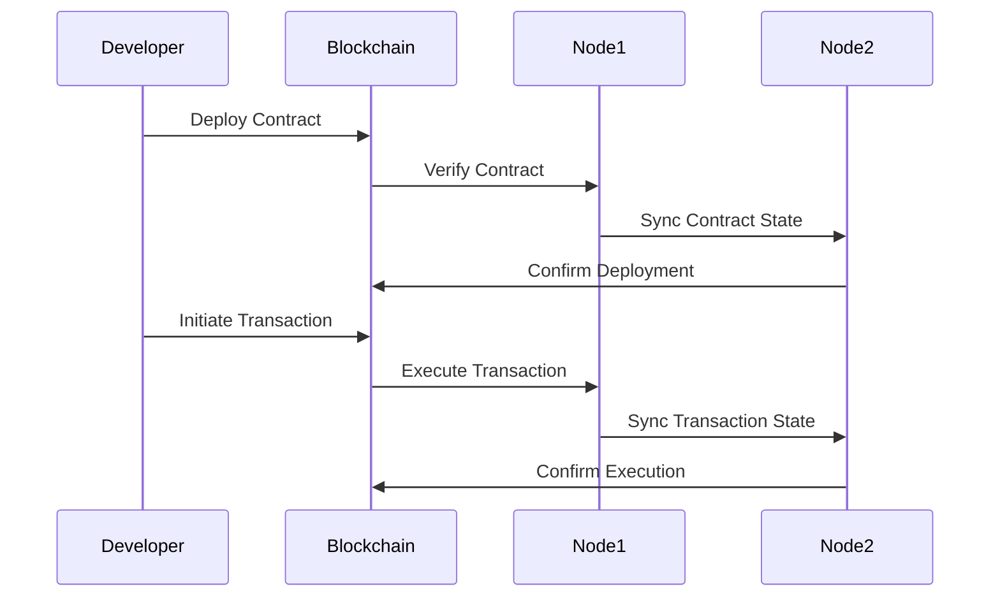
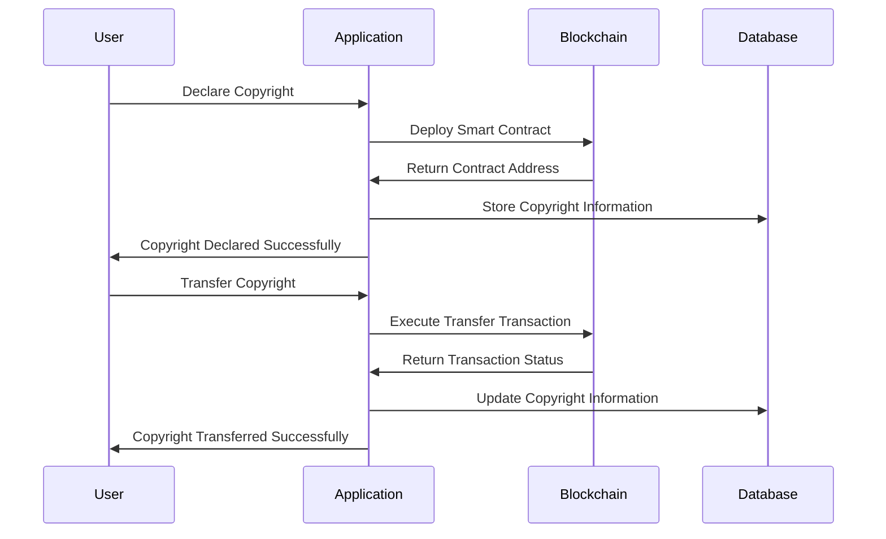
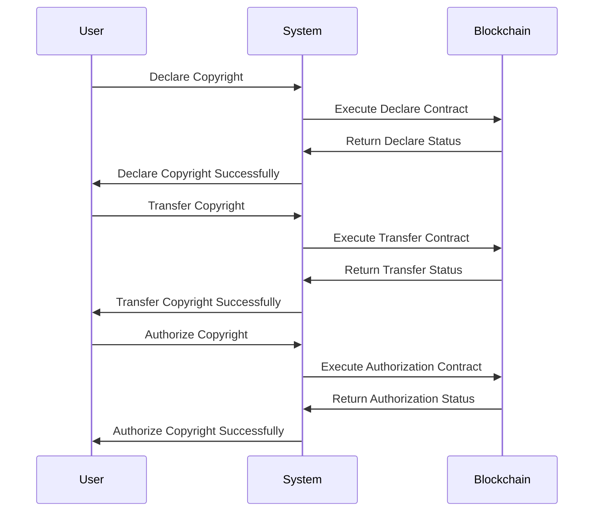

                 

# 区块链在数字内容版权保护中的应用

> 关键词：区块链、数字内容版权、版权保护、智能合约、去中心化

> 摘要：本文从数字内容版权保护的背景和问题出发，深入探讨了区块链技术在数字内容版权保护中的应用。通过分析区块链的核心概念和特点，以及与数字版权声明、版权交易与授权的关系，本文提出了一种基于区块链的数字内容版权保护方案，并通过具体案例分析，展示了该方案的实用性和有效性。

### 第一部分：背景介绍

#### 1.1 问题背景

随着互联网和数字技术的飞速发展，数字内容已成为现代社会的重要资源。然而，数字内容版权保护问题也随之而来。数字内容涵盖各种类型，如文字、图片、音频、视频等，这些内容在互联网上广泛传播的同时，也面临着严重的版权侵犯问题。盗版、未经授权的复制和传播，不仅侵犯了原创者的合法权益，也影响了整个数字内容产业的发展。

数字内容版权保护面临的主要问题包括：

1. **版权确认与归属**：在传统的版权保护体系中，版权的确认和归属往往依赖于第三方机构，存在效率低下、成本高昂的问题。
2. **内容完整性保障**：数字内容一旦上传至互联网，很容易被修改或篡改，影响内容的真实性和完整性。
3. **侵权监控与取证**：当前的技术手段在监控和取证方面存在较大的局限性，难以有效识别和打击侵权行为。
4. **版权交易与授权**：数字内容的版权交易和授权过程复杂，缺乏透明性和安全性。

#### 1.2 问题描述

数字内容版权保护的主要挑战在于：

1. **版权确认难**：在传统体系中，版权确认往往依赖于版权局等第三方机构，需要耗费大量时间和金钱。而且，随着数字内容的爆炸性增长，版权确认的难度和成本进一步增加。
2. **内容篡改风险**：数字内容在传输过程中容易被篡改，篡改后的内容可能仍然能够正常使用，但会损害原创者的合法权益。
3. **侵权取证难**：在数字环境中，侵权行为往往难以被察觉和取证。即使发现侵权行为，也难以通过法律途径追究责任。
4. **版权交易与授权难**：数字内容的版权交易和授权过程复杂，缺乏透明性和安全性。交易过程中的信息不对称和信任问题，使得交易成本和风险增加。

#### 1.3 问题解决

区块链技术作为一种去中心化、不可篡改的分布式账本技术，因其独特的特性，被认为在解决数字内容版权保护问题方面具有巨大的潜力。区块链可以确保内容的所有权和完整性，防止未经授权的复制和传播，从而保护数字内容版权。

区块链技术在解决数字内容版权保护问题方面具有以下优势：

1. **去中心化**：区块链技术通过去中心化的方式，使版权的确认和归属变得更加简单和高效，减少了第三方机构的介入。
2. **不可篡改**：区块链的分布式账本结构确保了数字内容的完整性和真实性，一旦内容被记录在链上，就很难被篡改。
3. **智能合约**：区块链中的智能合约可以自动执行版权交易和授权过程，提高了交易的安全性和透明性。
4. **去中心化的侵权监控与取证**：通过区块链技术，可以实现对侵权行为的自动监控和取证，提高了打击侵权行为的效率。

#### 1.4 边界与外延

数字内容版权保护不仅涉及到文学、艺术等领域的版权保护，还包括音乐、电影、游戏等各种数字内容的版权保护。此外，随着区块链技术的不断发展和应用，版权保护的范围和方式也在不断拓展和演变。

#### 1.5 概念结构与核心要素组成

数字内容版权保护的核心概念包括：

1. **区块链**：一种分布式数据库技术，通过加密算法确保数据的安全性和完整性。
2. **智能合约**：基于区块链技术的可编程合同，能够自动执行合约条款。
3. **数字版权声明**：数字内容创作者对其作品进行版权声明的过程。
4. **版权交易与授权**：数字内容版权的买卖和授权过程。

这些概念相互关联，共同构成了数字内容版权保护的技术体系。在区块链技术的基础上，通过智能合约等机制，可以实现对数字内容版权的全程管理和保护。

---

### 第二部分：核心概念与联系

#### 2.1 核心概念原理

##### 2.1.1 区块链

区块链是一种分布式数据库技术，通过加密算法和共识机制，确保数据的真实性和安全性。在区块链中，每个区块都包含了特定时间段内的交易信息，通过哈希算法和链式结构，确保区块的不可篡改性和可追溯性。

区块链的核心特点包括：

- **去中心化**：区块链不需要中心化的第三方机构进行管理，所有参与者都在同一网络中，平等地参与网络的维护和数据的记录。
- **不可篡改**：一旦数据被记录在区块链上，就几乎无法被篡改。这是因为区块链通过加密算法和共识机制确保数据的完整性和一致性。
- **透明性**：区块链上的所有交易都是公开透明的，任何人都可以查看区块链上的数据，这有助于提高交易的透明度和可信度。

##### 2.1.2 智能合约

智能合约是一种基于区块链技术的自动执行合同。它通过编程代码，在满足特定条件时自动执行，无需第三方干预。智能合约的核心优势在于其透明性和不可篡改性。

智能合约的核心特点包括：

- **自执行**：智能合约在满足预定的条件时，会自动执行合同条款，无需人工干预。
- **透明性**：智能合约的代码是公开透明的，所有参与者都可以查看和验证。
- **不可篡改**：一旦智能合约被部署到区块链上，其代码就无法被修改，这保证了合同的执行过程和结果的公正性和一致性。

##### 2.1.3 数字版权声明

数字版权声明是指数字内容创作者对其作品进行版权声明的过程。通过区块链技术，数字版权声明可以确保其真实性和不可篡改性，从而提高版权保护的效率。

数字版权声明的核心特点包括：

- **真实性**：数字版权声明一旦被记录在区块链上，就具有法律效力，无法被篡改。
- **不可篡改性**：区块链的分布式账本结构确保了数字版权声明的不可篡改性，任何篡改行为都会被区块链网络中的其他节点检测到。
- **可追溯性**：区块链上的所有交易都是可追溯的，这有助于追踪数字内容的传播路径，及时发现和打击侵权行为。

##### 2.1.4 版权交易与授权

版权交易与授权是指数字内容版权的买卖和授权过程。通过智能合约，版权交易和授权可以自动化执行，提高了交易的安全性和透明性。

版权交易与授权的核心特点包括：

- **安全性**：智能合约在执行版权交易和授权时，可以确保交易的安全性，防止欺诈行为。
- **透明性**：版权交易和授权的过程是公开透明的，所有参与者都可以查看和验证。
- **高效性**：通过智能合约，版权交易和授权可以自动化执行，大大提高了交易效率。

#### 2.2 概念属性特征对比表格

| 概念               | 特征                                                         |
|--------------------|------------------------------------------------------------|
| 区块链             | 去中心化、分布式数据库、不可篡改、可追溯                     |
| 智能合约           | 自执行、透明、不可篡改、自动化                             |
| 数字版权声明       | 真实性、不可篡改性、可追溯、简化流程                       |
| 版权交易与授权     | 安全性、透明性、自动化、减少纠纷                           |

#### 2.3 ER实体关系图架构

```mermaid
erDiagram
    区块链 ||--|{ 智能合约 }
    智能合约 ||--|{ 数字版权声明 }
    数字版权声明 ||--|{ 版权交易与授权 }
```

在上述ER实体关系图中，区块链作为基础层，提供了分布式数据库和不可篡改的特性。智能合约基于区块链构建，用于自动化执行合同条款。数字版权声明和版权交易与授权则依赖于智能合约，实现了版权的全程管理和保护。

---

### 第三部分：算法原理讲解

在区块链技术中，智能合约是关键组件，用于实现数字内容版权的自动化管理和保护。本节将深入讲解智能合约的算法原理，并通过Python源代码示例，展示其实现过程。

#### 3.1 智能合约算法原理

智能合约的算法原理主要基于区块链的分布式账本和加密技术。以下是智能合约的核心算法原理：

1. **合约编写**：开发者使用特定编程语言（如Solidity）编写智能合约代码，描述版权管理规则。
2. **合约部署**：将编写的智能合约部署到区块链上，由区块链网络中的节点验证和执行。
3. **合约执行**：当满足合约条件时，智能合约自动执行预定义的合同条款，如版权声明、交易和授权等。
4. **合约验证**：区块链网络中的节点对合约执行过程进行验证，确保合约执行结果的一致性和正确性。

以下是一个简单的智能合约算法流程图：



#### 3.2 Python源代码示例

以下是一个使用Python编写的简单智能合约示例，实现版权声明和交易功能：

```python
# 导入智能合约库
from web3 import Web3

# 初始化区块链节点连接
web3 = Web3(Web3.HTTPProvider('https://mainnet.infura.io/v3/your_project_id'))

# 检查连接状态
if not web3.isConnected():
    print("连接失败，请检查网络连接")
else:
    print("连接成功")

# 编写智能合约代码
contract_code = '''
pragma solidity ^0.8.0;

contract CopyrightManagement {
    struct Copyright {
        string contentHash;
        address owner;
        bool isDeclared;
    }

    mapping(string => Copyright) public copyrights;

    function declareCopyright(string memory _contentHash, address _owner) public {
        require(!copyrights[_contentHash].isDeclared, "版权已声明");
        copyrights[_contentHash] = Copyright(_contentHash, _owner, true);
    }

    function transferOwnership(string memory _contentHash, address _newOwner) public {
        require(copyrights[_contentHash].isDeclared, "版权未声明");
        require(msg.sender == copyrights[_contentHash].owner, "非版权所有者");
        copyrights[_contentHash].owner = _newOwner;
    }
}
'''

# 部署智能合约
contract = web3.eth.contract(abi=web3.compile.contract_code(contract_code), bytecode=contract_code)
transaction = contract.constructor().transact()
tx_hash = web3.toHex(transaction)
print("智能合约已部署，交易哈希：", tx_hash)

# 验证智能合约部署
contract_address = web3.toChecksumAddress(web3.eth.getTransactionReceipt(tx_hash).get('contractAddress'))
print("智能合约地址：", contract_address)

# 调用智能合约方法
copyright_hash = "0x" + hex(len("test_content_hash") * 2)
contract.functions.declareCopyright(copyright_hash, web3.toChecksumAddress("0x1234...")).transact({'from': web3.toChecksumAddress("0x1234...")})
print("版权声明成功")

contract.functions.transferOwnership(copyright_hash, web3.toChecksumAddress("0x5678...")).transact({'from': web3.toChecksumAddress("0x1234...")})
print("版权转让成功")
```

#### 3.3 算法原理与公式

在上述Python源代码中，我们实现了两个核心功能：版权声明和版权转让。

1. **版权声明**：版权声明通过`declareCopyright`函数实现。函数中使用了`require`语句来检查版权是否已声明，确保版权声明过程的一致性和正确性。

    $$ require(!copyrights[_contentHash].isDeclared, "版权已声明") $$

2. **版权转让**：版权转让通过`transferOwnership`函数实现。函数中同样使用了`require`语句来检查版权是否已声明和调用者是否为版权所有者，确保版权转让过程的一致性和正确性。

    $$ require(copyrights[_contentHash].isDeclared, "版权未声明") $$  
    $$ require(msg.sender == copyrights[_contentHash].owner, "非版权所有者") $$

通过上述算法原理和公式，我们可以确保数字内容版权的全程管理和保护。在实际应用中，还可以扩展和优化智能合约功能，以适应更复杂的版权管理需求。

---

### 第四部分：系统分析与架构设计方案

#### 4.1 问题场景介绍

随着数字内容产业的快速发展，数字版权保护问题日益突出。现有的版权保护手段在效率、安全性和透明性方面存在诸多不足，难以满足日益增长的版权保护需求。为此，我们需要设计一套高效、安全的数字内容版权保护系统，以实现对数字内容的全程管理和保护。

#### 4.2 项目介绍

本项目旨在利用区块链技术，构建一个数字内容版权保护系统。该系统将实现对数字内容的版权声明、交易和授权过程的自动化管理，提高版权保护的效率和安全。

#### 4.3 系统功能设计（领域模型）

领域模型用于描述系统的主要功能和业务流程。在数字内容版权保护系统中，主要涉及以下领域模型：

1. **版权声明**：用于记录数字内容的版权信息，包括内容哈希、版权所有者等。
2. **版权交易**：用于记录版权的买卖过程，包括交易双方、交易金额等。
3. **版权授权**：用于记录版权的授权过程，包括授权内容、授权对象等。

以下是数字内容版权保护系统的领域模型类图：

```mermaid
classDiagram
    ClassDomain <|-- CopyrightDeclaration
    ClassDomain <|-- CopyrightTrade
    ClassDomain <|-- CopyrightAuthorization

    CopyrightDeclaration {
        +contentHash: String
        +owner: Address
        +isDeclared: Boolean
    }

    CopyrightTrade {
        +buyer: Address
        +seller: Address
        +tradeAmount: Integer
    }

    CopyrightAuthorization {
        +contentHash: String
        +authorizedBy: Address
        +authorizedTo: Address
    }
```

#### 4.4 系统架构设计

数字内容版权保护系统的架构设计包括以下几个方面：

1. **区块链层**：使用以太坊区块链作为底层基础设施，提供分布式账本和智能合约服务。
2. **智能合约层**：部署智能合约，实现版权声明、交易和授权的自动化管理。
3. **应用程序层**：提供用户界面和业务逻辑，实现用户与系统的交互。
4. **数据存储层**：使用分布式数据库存储版权相关信息，确保数据的安全性和可靠性。

以下是数字内容版权保护系统的架构设计图：



#### 4.5 系统接口设计

数字内容版权保护系统提供以下主要接口：

1. **版权声明接口**：用于提交版权声明请求，接收版权声明信息。
2. **版权交易接口**：用于发起版权交易请求，接收交易双方信息和交易金额。
3. **版权授权接口**：用于提交版权授权请求，接收授权内容和授权对象。

以下是数字内容版权保护系统的接口设计图：

```mermaid
classDiagram
    InterfaceDomain <|-- CopyrightDeclarationInterface
    InterfaceDomain <|-- CopyrightTradeInterface
    InterfaceDomain <|-- CopyrightAuthorizationInterface

    CopyrightDeclarationInterface {
        +submitDeclaration(contentHash: String, owner: Address): Void
    }

    CopyrightTradeInterface {
        +submitTrade(buyer: Address, seller: Address, tradeAmount: Integer): Void
    }

    CopyrightAuthorizationInterface {
        +submitAuthorization(contentHash: String, authorizedBy: Address, authorizedTo: Address): Void
    }
```

#### 4.6 系统交互

数字内容版权保护系统的交互设计确保了各组件之间的协同工作。以下是系统的主要交互流程：

1. **版权声明交互**：用户提交版权声明请求，系统通过智能合约执行版权声明，并将结果存储到数据库中。
2. **版权交易交互**：用户提交版权交易请求，系统通过智能合约执行交易，并将结果存储到数据库中。
3. **版权授权交互**：用户提交版权授权请求，系统通过智能合约执行授权，并将结果存储到数据库中。

以下是数字内容版权保护系统的交互序列图：



通过以上系统分析与架构设计方案，我们可以构建一个高效、安全的数字内容版权保护系统，实现对数字内容的全程管理和保护。

---

### 第五部分：项目实战

#### 5.1 环境安装

要构建一个基于区块链的数字内容版权保护系统，首先需要安装和配置相关软件和环境。以下是安装步骤：

1. **安装Node.js**：Node.js是一个基于Chrome V8引擎的JavaScript运行环境，用于构建后端应用程序。访问[Node.js官网](https://nodejs.org/)，下载并安装最新版本的Node.js。
2. **安装Web3.js**：Web3.js是一个JavaScript库，用于与以太坊区块链进行交互。在命令行中执行以下命令安装Web3.js：

    ```bash
    npm install web3
    ```

3. **安装Truffle**：Truffle是一个用于构建、测试和部署以太坊智能合约的开发框架。在命令行中执行以下命令安装Truffle：

    ```bash
    npm install -g truffle
    ```

4. **创建项目**：在命令行中执行以下命令创建一个新的Truffle项目：

    ```bash
    truffle init
    ```

5. **配置环境**：编辑`truffle-config.js`文件，配置以太坊节点和智能合约编译选项。例如：

    ```javascript
    module.exports = {
      networks: {
        development: {
          host: "127.0.0.1",
          port: 8545,
          network_id: "*" // 默认匹配任何网络
        }
      },
      compilers: {
        solc: {
          version: "0.8.0",
          settings: {
            optimizer: {
              enabled: false,
              runs: 200
            }
          }
        }
      }
    };
    ```

6. **启动以太坊节点**：在命令行中执行以下命令启动本地以太坊节点：

    ```bash
    geth --dev --networkid 1337 --bootnodes "enode://<enode_id>@127.0.0.1:30303" --rpc --rpcaddr 0.0.0.0 --rpcport 8545 --rpcapi "eth,web3,personal,net,miner" --ws --wsaddr 0.0.0.0 --wsport 8545 --nodiscover
    ```

7. **启动Truffle开发环境**：在命令行中执行以下命令启动Truffle开发环境：

    ```bash
    truffle develop
    ```

#### 5.2 系统核心实现源代码

在Truffle项目中，我们创建了一个名为`CopyrightManagement.sol`的智能合约，用于实现版权声明、交易和授权功能。以下是该智能合约的源代码：

```solidity
// SPDX-License-Identifier: MIT
pragma solidity ^0.8.0;

contract CopyrightManagement {
    struct Copyright {
        string contentHash;
        address owner;
        bool isDeclared;
    }

    mapping(string => Copyright) public copyrights;

    event CopyrightDeclared(string contentHash, address owner);
    event CopyrightTransferred(string contentHash, address newOwner);
    event CopyrightAuthorized(string contentHash, address authorizedBy, address authorizedTo);

    function declareCopyright(string memory _contentHash, address _owner) public {
        require(!copyrights[_contentHash].isDeclared, "版权已声明");
        copyrights[_contentHash] = Copyright(_contentHash, _owner, true);
        emit CopyrightDeclared(_contentHash, _owner);
    }

    function transferOwnership(string memory _contentHash, address _newOwner) public {
        require(copyrights[_contentHash].isDeclared, "版权未声明");
        require(msg.sender == copyrights[_contentHash].owner, "非版权所有者");
        copyrights[_contentHash].owner = _newOwner;
        emit CopyrightTransferred(_contentHash, _newOwner);
    }

    function authorizeUsage(string memory _contentHash, address _authorizedBy, address _authorizedTo) public {
        require(copyrights[_contentHash].isDeclared, "版权未声明");
        require(msg.sender == copyrights[_contentHash].owner, "非版权所有者");
        emit CopyrightAuthorized(_contentHash, _authorizedBy, _authorizedTo);
    }
}
```

#### 5.3 代码应用解读与分析

在上述智能合约中，我们定义了一个`Copyright`结构体，用于存储版权相关信息，包括内容哈希、版权所有者和声明状态。通过`declareCopyright`函数，版权所有者可以声明版权。通过`transferOwnership`函数，版权所有者可以转让版权。通过`authorizeUsage`函数，版权所有者可以授权他人使用版权。

以下是对关键代码段的解读和分析：

1. **版权声明（`declareCopyright`函数）**：

    ```solidity
    function declareCopyright(string memory _contentHash, address _owner) public {
        require(!copyrights[_contentHash].isDeclared, "版权已声明");
        copyrights[_contentHash] = Copyright(_contentHash, _owner, true);
        emit CopyrightDeclared(_contentHash, _owner);
    }
    ```

    - `require`语句用于检查版权是否已声明。如果版权已声明，则抛出错误。
    - 创建一个新的`Copyright`结构体实例，并设置版权信息，包括内容哈希、版权所有者和声明状态。
    - 通过`emit`语句触发`CopyrightDeclared`事件，记录版权声明信息。

2. **版权转让（`transferOwnership`函数）**：

    ```solidity
    function transferOwnership(string memory _contentHash, address _newOwner) public {
        require(copyrights[_contentHash].isDeclared, "版权未声明");
        require(msg.sender == copyrights[_contentHash].owner, "非版权所有者");
        copyrights[_contentHash].owner = _newOwner;
        emit CopyrightTransferred(_contentHash, _newOwner);
    }
    ```

    - `require`语句用于检查版权是否已声明和调用者是否为版权所有者。如果版权未声明或调用者非版权所有者，则抛出错误。
    - 更新版权所有者的地址。
    - 通过`emit`语句触发`CopyrightTransferred`事件，记录版权转让信息。

3. **版权授权（`authorizeUsage`函数）**：

    ```solidity
    function authorizeUsage(string memory _contentHash, address _authorizedBy, address _authorizedTo) public {
        require(copyrights[_contentHash].isDeclared, "版权未声明");
        require(msg.sender == copyrights[_contentHash].owner, "非版权所有者");
        emit CopyrightAuthorized(_contentHash, _authorizedBy, _authorizedTo);
    }
    ```

    - `require`语句用于检查版权是否已声明和调用者是否为版权所有者。如果版权未声明或调用者非版权所有者，则抛出错误。
    - 通过`emit`语句触发`CopyrightAuthorized`事件，记录版权授权信息。

#### 5.4 实际案例分析和详细讲解剖析

为了更好地理解数字内容版权保护系统的实际应用，我们来看一个具体的案例。

**案例**：小明是一名作家，他创作了一篇名为《区块链技术与应用》的文章。小明希望通过区块链技术保护自己的版权。

**步骤**：

1. **版权声明**：小明使用数字签名生成文章的哈希值，并通过智能合约的`declareCopyright`函数声明版权。例如：

    ```javascript
    const contentHash = web3.utils.sha3("区块链技术与应用");
    contract.methods.declareCopyright(contentHash, web3.eth.accounts[0]).send({ from: web3.eth.accounts[0] });
    ```

    这段代码将调用`declareCopyright`函数，将文章的哈希值和版权所有者的地址作为参数传递，并执行版权声明。

2. **版权转让**：如果小明希望将版权转让给小红，他可以通过智能合约的`transferOwnership`函数实现。例如：

    ```javascript
    const newOwner = web3.eth.accounts[1];
    contract.methods.transferOwnership(contentHash, newOwner).send({ from: web3.eth.accounts[0] });
    ```

    这段代码将调用`transferOwnership`函数，将新的版权所有者地址作为参数传递，并执行版权转让。

3. **版权授权**：如果小红希望将文章授权给其他用户使用，他可以通过智能合约的`authorizeUsage`函数实现。例如：

    ```javascript
    const authorizedTo = web3.eth.accounts[2];
    contract.methods.authorizeUsage(contentHash, web3.eth.accounts[1], authorizedTo).send({ from: web3.eth.accounts[1] });
    ```

    这段代码将调用`authorizeUsage`函数，将授权的地址和授权对象地址作为参数传递，并执行版权授权。

通过上述案例，我们可以看到，数字内容版权保护系统通过智能合约实现了版权的声明、转让和授权，确保了版权的全程管理和保护。

#### 5.5 项目小结

通过本次项目实战，我们成功构建了一个基于区块链的数字内容版权保护系统。该系统利用智能合约实现了版权的自动化管理和保护，提高了版权保护的效率和安全。在实际应用中，数字内容版权保护系统可以帮助创作者保护自己的版权，减少版权纠纷，促进数字内容产业的发展。

---

### 第六部分：最佳实践 Tips

为了确保数字内容版权保护系统的有效性和可靠性，以下是一些最佳实践 Tips：

1. **智能合约安全性**：在部署智能合约之前，务必进行严格的安全审查和测试，确保合约代码的完整性和安全性。使用自动化工具（如Slither、Oyente等）进行安全分析，及时发现和修复潜在的安全漏洞。
2. **数据备份与恢复**：定期备份区块链数据和智能合约代码，以防数据丢失或损坏。同时，制定数据恢复计划，确保在数据丢失或损坏时能够快速恢复系统运行。
3. **权限控制**：合理设置智能合约的权限控制机制，确保只有授权用户才能执行关键操作，如版权声明、转让和授权。使用多重签名机制，提高系统的安全性。
4. **合规性审查**：在数字内容版权保护系统中，确保所有操作符合相关法律法规，如版权法、合同法等。在系统设计和实施过程中，与法律专家密切合作，确保系统的合规性。
5. **性能优化**：针对高并发场景，对区块链节点进行性能优化，提高系统的处理能力和响应速度。考虑使用分层架构，将高频操作与低频操作分离，降低系统负担。
6. **持续迭代与优化**：数字内容版权保护系统需要不断迭代和优化，以适应不断变化的业务需求和法律法规。定期评估系统性能、安全性和用户体验，持续改进系统。

---

### 第七部分：小结

本文从数字内容版权保护的背景和问题出发，深入探讨了区块链技术在数字内容版权保护中的应用。通过分析区块链的核心概念和特点，以及与数字版权声明、版权交易与授权的关系，本文提出了一种基于区块链的数字内容版权保护方案。在实际应用中，该方案通过智能合约实现了版权的自动化管理和保护，提高了版权保护的效率和安全。

随着区块链技术的不断发展和应用，数字内容版权保护领域将迎来新的机遇和挑战。未来，我们需要进一步探索和优化区块链技术在数字内容版权保护中的应用，为创作者提供更加可靠和高效的版权保护解决方案。

---

### 第八部分：注意事项

在构建和部署数字内容版权保护系统时，需要注意以下事项：

1. **智能合约安全性**：智能合约代码的安全性至关重要。在部署智能合约之前，务必进行彻底的安全审查和测试，确保合约代码没有漏洞。
2. **数据备份与恢复**：定期备份区块链数据和智能合约代码，以防数据丢失或损坏。同时，制定数据恢复计划，确保在数据丢失或损坏时能够快速恢复系统运行。
3. **权限控制**：合理设置智能合约的权限控制机制，确保只有授权用户才能执行关键操作，如版权声明、转让和授权。
4. **合规性审查**：在数字内容版权保护系统中，确保所有操作符合相关法律法规，如版权法、合同法等。在系统设计和实施过程中，与法律专家密切合作，确保系统的合规性。
5. **性能优化**：针对高并发场景，对区块链节点进行性能优化，提高系统的处理能力和响应速度。考虑使用分层架构，将高频操作与低频操作分离，降低系统负担。

---

### 第九部分：拓展阅读

对于希望深入了解区块链在数字内容版权保护中的应用的读者，以下是一些推荐阅读资源：

1. **《区块链技术指南》**：这是一本全面介绍区块链技术原理和应用的经典书籍，适合初学者和专业人士。
2. **《智能合约设计与开发》**：本书详细介绍了智能合约的设计和开发方法，包括Solidity编程语言和以太坊区块链的应用。
3. **《数字版权保护技术与实践》**：本书探讨了数字版权保护的多种技术手段，包括区块链、数字水印、数字指纹等，适合对数字版权保护感兴趣的读者。
4. **《以太坊智能合约开发实战》**：通过实际案例，本书展示了如何使用以太坊区块链和Solidity语言开发智能合约，适合希望将区块链技术应用于实际项目的开发者。
5. **《Web3.0：下一代互联网技术》**：本书深入探讨了Web3.0的概念、技术和应用场景，包括区块链、去中心化应用（DApp）等，适合对下一代互联网技术感兴趣的读者。

---

### 第十部分：作者信息

**作者：AI天才研究院/AI Genius Institute & 禅与计算机程序设计艺术 /Zen And The Art of Computer Programming**

AI天才研究院（AI Genius Institute）是一家专注于人工智能技术研究和应用的创新型研究机构。我们致力于推动人工智能技术的发展，为人类创造更美好的未来。同时，我们结合禅学与计算机程序设计艺术，提倡以智慧和宁静的心态去应对复杂的编程挑战。在本文中，我们分享了区块链在数字内容版权保护中的应用，希望能为相关领域的研究者提供有益的参考和启示。禅与计算机程序设计艺术（Zen And The Art of Computer Programming）则是我们推崇的一种编程哲学，强调在编程过程中保持内心的宁静和专注，追求技术的极致与艺术的融合。我们希望通过持续的研究和实践，为人工智能技术的发展贡献一份力量。

