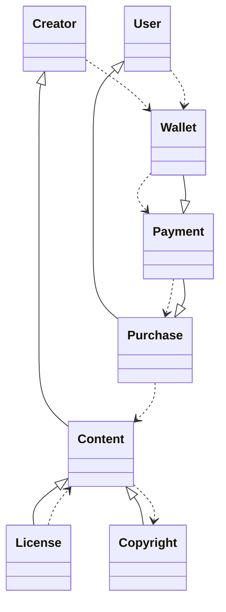
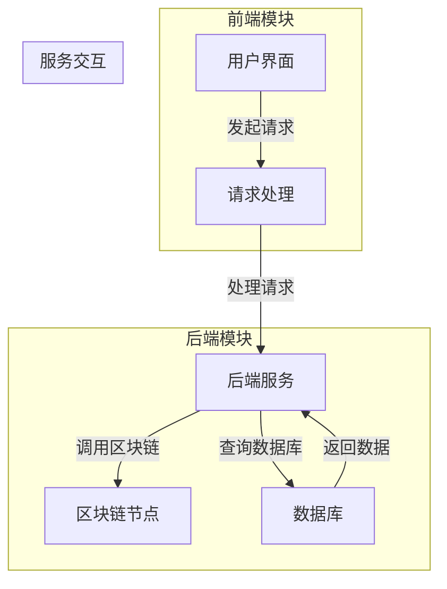
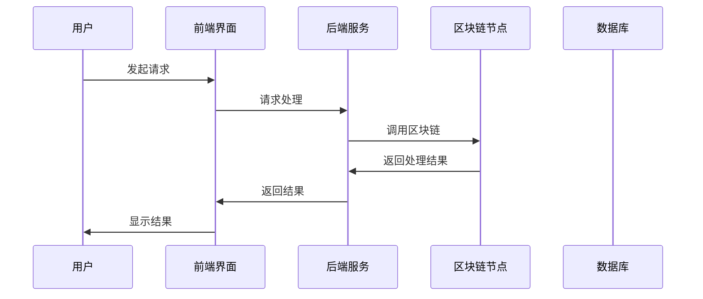

                 


### 文章标题：区块链在数字内容版权分发中的应用与挑战

> 关键词：区块链、数字内容版权、版权分发、智能合约、去中心化

> 摘要：本文将深入探讨区块链技术在数字内容版权分发中的应用，分析其带来的挑战，并通过实际案例展示区块链如何解决这些问题，最终为读者提供最佳实践和拓展阅读建议。

### 第一部分：背景介绍

#### 1.1 问题背景

随着互联网和数字技术的快速发展，数字内容创作和传播变得愈加便捷。然而，随之而来的数字内容版权保护问题也日益凸显。当前，数字内容版权分发面临的主要挑战包括：

- **版权纠纷**：数字内容的复制和传播速度快，使得版权纠纷频发。
- **版权追踪困难**：由于传统版权登记系统的不透明和效率低下，版权追踪成为一大难题。
- **盗版问题**：数字内容极易被非法复制和传播，给创作者带来巨大经济损失。

区块链技术的出现为解决这些问题提供了新的思路。通过去中心化的分布式账本和智能合约，区块链可以在数字内容版权分发中实现透明、安全、不可篡改的版权管理。

#### 1.2 问题描述

数字内容版权分发的挑战主要体现在以下几个方面：

- **版权归属确认**：如何确保内容的版权归属得到明确确认？
- **版权许可和授权**：如何实现高效的版权许可和授权流程？
- **版权追踪和审计**：如何对数字内容进行有效的追踪和审计，以防止盗版？
- **版权交易**：如何构建一个透明、高效的数字内容版权交易平台？

区块链技术通过其特有的分布式账本和智能合约机制，为上述问题的解决提供了可能。

#### 1.3 问题解决

区块链技术在数字内容版权分发中的应用包括：

- **分布式账本**：用于记录和存储版权信息，确保版权归属的透明性和不可篡改性。
- **智能合约**：用于自动化版权许可和授权流程，减少纠纷和中介成本。
- **去中心化存储**：用于存储数字内容，确保内容的可追溯性和安全性。

#### 1.4 边界与外延

区块链技术在数字内容版权分发中的应用范围有限，主要集中在：

- **版权登记**：用于确权。
- **版权授权**：用于许可和授权。
- **版权交易**：用于版权转让和交易。

然而，区块链技术也面临一些局限性，如交易速度、可扩展性和隐私保护等方面的问题。

#### 1.5 概念结构与核心要素组成

- **数字内容版权**：指数字内容的知识产权。
- **区块链技术**：一种去中心化的分布式账本技术。
- **数字内容版权分发**：指数字内容在互联网上的传播和交易。

### 第二部分：核心概念与联系

#### 2.1 区块链技术

区块链技术是一种分布式数据库系统，通过加密算法确保数据的安全性和不可篡改性。其主要组成部分包括：

- **区块链**：由一系列按时间顺序排列的数据块组成。
- **分布式账本**：数据存储在多个节点上，每个节点都保存一份完整的账本。
- **共识算法**：用于确保所有节点对账本的一致性。

#### 2.2 数字内容版权

数字内容版权是指数字内容的知识产权，包括文字、图片、音频、视频等多种形式。其主要特征包括：

- **原创性**：数字内容需具有原创性，才具备版权保护的条件。
- **可复制性**：数字内容易于复制和传播，使得版权保护尤为重要。
- **可追溯性**：数字内容的版权归属和传播路径需可追溯。

#### 2.3 区块链在数字内容版权分发中的应用

区块链在数字内容版权分发中的应用主要体现在以下几个方面：

- **版权登记**：通过区块链记录版权信息，确保版权归属的透明性和不可篡改性。
- **版权授权**：使用智能合约自动化版权许可和授权流程，提高效率。
- **版权交易**：构建去中心化的版权交易平台，降低交易成本。

### 第三部分：算法原理讲解

#### 3.1 算法基本原理

区块链在数字内容版权分发中涉及的算法主要包括加密算法和智能合约编写算法。以下是这些算法的基本原理：

- **加密算法**：用于保护数字内容的安全性和隐私。
- **智能合约编写算法**：用于编写自动化版权许可和授权的智能合约。

#### 3.2 算法详细讲解

区块链在数字内容版权分发中的算法实现包括以下步骤：

1. **数字内容加密**：使用加密算法对数字内容进行加密。
2. **版权信息记录**：将加密后的数字内容和版权信息记录在区块链上。
3. **智能合约编写**：编写智能合约，实现版权许可和授权的自动化。
4. **版权信息查询**：用户可通过区块链查询版权信息。

以下是一个简单的区块链算法示例（使用Python语言）：

```python
import hashlib
import json
from time import time

class Block:
    def __init__(self, index, transactions, timestamp, previous_hash):
        self.index = index
        self.transactions = transactions
        self.timestamp = timestamp
        self.previous_hash = previous_hash
        self.hash = self.compute_hash()

    def compute_hash(self):
        block_string = json.dumps(self.__dict__, sort_keys=True)
        return hashlib.sha256(block_string.encode()).hexdigest()

class Blockchain:
    def __init__(self):
        self.unconfirmed_transactions = []
        self.chain = []
        self.create_genesis_block()

    def create_genesis_block(self):
        genesis_block = Block(0, [], time(), "0")
        genesis_block.hash = genesis_block.compute_hash()
        self.chain.append(genesis_block)

    def add_new_transaction(self, transaction):
        self.unconfirmed_transactions.append(transaction)

    def mine(self):
        if not self.unconfirmed_transactions:
            return False
        last_block = self.chain[-1]
        new_block = Block(index=last_block.index + 1,
                          transactions=self.unconfirmed_transactions,
                          timestamp=time(),
                          previous_hash=last_block.hash)
        new_block.hash = new_block.compute_hash()
        self.chain.append(new_block)
        self.unconfirmed_transactions = []
        return new_block.index

    def is_chain_valid(self):
        for i in range(1, len(self.chain)):
            current = self.chain[i]
            previous = self.chain[i - 1]
            if current.hash != current.compute_hash():
                return False
            if current.previous_hash != previous.hash:
                return False
        return True

# 创建区块链实例
blockchain = Blockchain()

# 添加交易
blockchain.add_new_transaction("Transaction 1")
blockchain.add_new_transaction("Transaction 2")

# 挖掘新块
blockchain.mine()

# 检查区块链是否有效
print("Blockchain valid?", blockchain.is_chain_valid())

# 输出区块链
for block in blockchain.chain:
    print(json.dumps(block.__dict__, indent=4))
```

#### 3.3 举例说明

假设有一部数字短片，创作者A希望通过区块链技术进行版权保护。以下是区块链如何应用的例子：

1. **数字内容加密**：创作者A将数字短片加密，以确保内容的安全性和隐私。
2. **版权信息记录**：创作者A将加密后的数字短片和版权信息（如创作者名称、创作时间等）记录在区块链上。
3. **智能合约编写**：创作者A编写一个智能合约，设定版权许可和授权的条件。
4. **版权信息查询**：其他用户可通过区块链查询数字短片的版权信息，并按照智能合约的条款进行版权许可和授权。

### 第四部分：系统分析与架构设计方案

#### 4.1 问题场景介绍

假设有一个数字内容版权分发平台，创作者和用户可以通过平台进行数字内容的创作、发布、交易和版权管理。以下是一个典型的问题场景：

- 创作者A创作了一部数字短片，希望在平台上发布并保护其版权。
- 用户B浏览平台上的数字内容，希望购买或获取授权使用这些内容。

#### 4.2 系统功能设计

数字内容版权分发平台的主要功能模块包括：

- **创作者模块**：用于创作者上传数字内容、设置版权信息、发布内容。
- **用户模块**：用于用户浏览、搜索、购买或授权使用数字内容。
- **版权管理模块**：用于记录和管理数字内容的版权信息，包括版权登记、版权授权、版权交易等。

领域模型类图如下（使用Mermaid格式）：



#### 4.3 系统架构设计

数字内容版权分发平台的系统架构设计如下：

- **前端架构**：采用Vue.js或React等前端框架，实现用户界面和交互。
- **后端架构**：采用Node.js或Python Flask等后端框架，处理业务逻辑和数据存储。
- **区块链节点**：部署在私有云或公共云上，用于存储和处理数字内容版权信息。

系统架构图如下（使用Mermaid格式）：



#### 4.4 系统接口设计

数字内容版权分发平台的主要接口设计如下：

- **创作者接口**：用于创作者上传内容、设置版权信息、发布内容。
- **用户接口**：用于用户浏览、搜索、购买或授权使用内容。
- **版权管理接口**：用于版权登记、版权授权、版权交易。

系统接口文档如下（使用Markdown格式）：

```markdown
## 创作者接口

### /content/upload
- 功能：上传数字内容。
- 请求方式：POST
- 请求参数：
    - content: 上传的数字内容。
    - creator: 创作者名称。
    - timestamp: 创作时间。
- 返回值：
    - status: 状态码（200表示成功，400表示失败）。
    - message: 返回信息。

### /content/register
- 功能：注册数字内容版权。
- 请求方式：POST
- 请求参数：
    - content_id: 数字内容ID。
    - copyright: 版权信息。
- 返回值：
    - status: 状态码。
    - message: 返回信息。

### /content/release
- 功能：发布数字内容。
- 请求方式：POST
- 请求参数：
    - content_id: 数字内容ID。
    - release: 发布状态（true表示发布，false表示未发布）。
- 返回值：
    - status: 状态码。
    - message: 返回信息。

## 用户接口

### /content/search
- 功能：搜索数字内容。
- 请求方式：GET
- 请求参数：
    - keyword: 关键词。
- 返回值：
    - status: 状态码。
    - content_list: 搜索结果列表。

### /content/detail
- 功能：获取数字内容详情。
- 请求方式：GET
- 请求参数：
    - content_id: 数字内容ID。
- 返回值：
    - status: 状态码。
    - content_detail: 数字内容详情。

### /content/purchase
- 功能：购买数字内容。
- 请求方式：POST
- 请求参数：
    - content_id: 数字内容ID。
    - buyer: 买家名称。
    - price: 价格。
- 返回值：
    - status: 状态码。
    - message: 返回信息。

## 版权管理接口

### /copyright/register
- 功能：注册版权信息。
- 请求方式：POST
- 请求参数：
    - content_id: 数字内容ID。
    - copyright: 版权信息。
- 返回值：
    - status: 状态码。
    - message: 返回信息。

### /copyright/authorize
- 功能：版权授权。
- 请求方式：POST
- 请求参数：
    - content_id: 数字内容ID。
    - authorizer: 授权者名称。
    - licensee: 许可接受者名称。
    - license_term: 许可期限。
- 返回值：
    - status: 状态码。
    - message: 返回信息。

### /copyright/transfer
- 功能：版权转让。
- 请求方式：POST
- 请求参数：
    - content_id: 数字内容ID。
    - original_owner: 原版权所有者。
    - new_owner: 新版权所有者。
- 返回值：
    - status: 状态码。
    - message: 返回信息。
```

#### 4.5 系统交互

数字内容版权分发平台的系统交互主要包括：

- **用户发起请求**：用户通过前端界面发起请求。
- **请求处理**：后端服务处理请求，调用区块链节点和数据库。
- **响应结果**：将处理结果返回给用户。

系统交互序列图如下（使用Mermaid格式）：



### 第五部分：项目实战

#### 5.1 环境安装

为了在项目中应用区块链技术，需要安装以下软件和工具：

1. **Node.js**：用于构建后端服务。
2. **Ganache**：用于创建本地区块链节点。
3. **Truffle**：用于管理智能合约和测试。
4. **MetaMask**：用于与区块链交互。

以下是环境安装步骤：

1. 安装Node.js：访问 [Node.js官网](https://nodejs.org/)，下载并安装Node.js。
2. 安装Ganache：访问 [Ganache官网](https://www.trufflesuite.com/ganache) ，下载并安装Ganache。
3. 安装Truffle：在命令行中运行 `npm install -g truffle`。
4. 安装MetaMask：访问 [MetaMask官网](https://metamask.io/) ，下载并安装MetaMask。

#### 5.2 系统核心实现

数字内容版权分发平台的核心实现包括以下几个方面：

1. **后端服务**：使用Node.js和Express框架构建后端服务，处理前端请求。
2. **区块链节点**：使用Ganache创建本地区块链节点，存储和处理数字内容版权信息。
3. **智能合约**：使用Solidity语言编写智能合约，实现版权登记、授权和交易等功能。

以下是一个简单的智能合约示例（使用Solidity语言）：

```solidity
pragma solidity ^0.8.0;

contract Copyright {
    struct Content {
        string contentHash;
        address owner;
        bool isReleased;
    }

    mapping(uint256 => Content) public contents;

    function registerContent(uint256 id, string memory contentHash) public {
        require(contents[id].contentHash == "", "Content already registered");
        contents[id] = Content(contentHash, msg.sender, false);
    }

    function releaseContent(uint256 id) public {
        require(msg.sender == contents[id].owner, "Not the owner");
        contents[id].isReleased = true;
    }

    function authorizeContent(uint256 id, address licensee) public {
        require(msg.sender == contents[id].owner, "Not the owner");
        require(!contents[id].isReleased, "Content not released");
        contents[id].isReleased = true;
        emit Authorization(id, licensee);
    }

    event Authorization(uint256 id, address licensee);
}
```

#### 5.3 代码应用解读与分析

以下是对上述智能合约代码的详细解读：

1. **内容结构**：使用`struct`定义内容结构，包括内容哈希、所有者和发布状态。
2. **内容注册**：通过`registerContent`函数注册内容，将内容哈希和所有者信息存储在区块链上。
3. **内容发布**：通过`releaseContent`函数将内容设置为发布状态。
4. **版权授权**：通过`authorizeContent`函数将版权授权给指定许可接受者。

以下是一个简单的应用案例：

假设创作者A创建了一部数字短片，并将其上传到数字内容版权分发平台。以下是区块链节点上的操作：

1. **内容注册**：创作者A调用`registerContent`函数，将数字短片的哈希和创作者地址存储在区块链上。
2. **内容发布**：创作者A调用`releaseContent`函数，将数字短片设置为发布状态。
3. **版权授权**：用户B通过前端界面请求版权授权，平台调用`authorizeContent`函数，将版权授权给用户B。

通过上述操作，数字内容版权在区块链上得到有效保护，确保了版权归属的透明性和不可篡改性。

#### 5.4 实际案例分析与讲解

以下是一个实际案例，展示区块链在数字内容版权分发中的应用：

假设有一个音乐平台，创作者A创作了一首歌曲，并希望在平台上发布。以下是区块链节点上的操作：

1. **内容注册**：创作者A调用`registerContent`函数，将歌曲的哈希和创作者地址存储在区块链上。
2. **内容发布**：创作者A调用`releaseContent`函数，将歌曲设置为发布状态。
3. **版权授权**：用户B通过平台请求版权授权，平台调用`authorizeContent`函数，将版权授权给用户B。
4. **版权交易**：用户B通过平台购买歌曲的版权，平台调用智能合约，完成版权交易。

通过区块链技术，创作者A的歌曲版权得到有效保护，用户B可以合法使用和传播这首歌曲。同时，平台也实现了高效、透明的版权管理和交易。

#### 5.5 项目小结

数字内容版权分发平台项目通过区块链技术实现了版权登记、授权和交易等功能，解决了版权纠纷、追踪困难、盗版等问题。项目经验表明：

1. **区块链技术**：在数字内容版权分发中具有广泛应用前景，但需注意性能和隐私保护问题。
2. **智能合约**：是实现版权管理和交易的核心，需确保其安全性和可扩展性。
3. **前端界面**：是用户与区块链交互的桥梁，需提供简单易用的操作体验。

### 第六部分：最佳实践与拓展阅读

#### 6.1 最佳实践 tips

1. **版权信息加密**：对数字内容版权信息进行加密，确保数据安全和隐私。
2. **智能合约审计**：在部署智能合约前进行审计，确保合约安全可靠。
3. **去中心化存储**：将数字内容存储在去中心化存储平台上，提高数据的可靠性和安全性。
4. **版权登记和授权**：在区块链上实现版权登记和授权流程，提高透明度和效率。

#### 6.2 小结

区块链技术在数字内容版权分发中具有广泛应用前景，但需注意性能、隐私保护和合约安全等问题。通过智能合约和去中心化存储，可以实现高效、透明的版权管理和交易。

#### 6.3 注意事项

1. **性能优化**：考虑使用分层架构和并发处理等技术，提高区块链性能。
2. **隐私保护**：使用零知识证明等技术，实现用户隐私保护。
3. **合约安全**：定期进行智能合约审计，确保合约安全可靠。

#### 6.4 拓展阅读

1. **《区块链技术指南》**：详细介绍了区块链的基本原理和应用场景。
2. **《智能合约安全指南》**：介绍了智能合约的安全问题和防范措施。
3. **《数字版权保护与区块链技术》**：探讨了区块链技术在数字版权保护中的应用。

### 总结

本文深入探讨了区块链在数字内容版权分发中的应用与挑战，通过实际案例展示了区块链如何解决数字内容版权保护的难题。未来，区块链技术在数字内容版权分发领域将继续发挥重要作用，推动数字内容产业的健康发展。

---

**作者：AI天才研究院/AI Genius Institute & 禅与计算机程序设计艺术 /Zen And The Art of Computer Programming**

