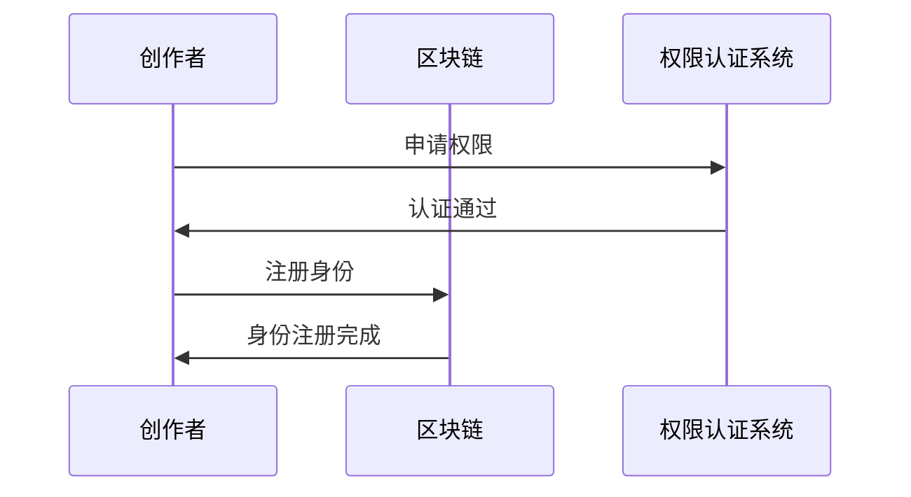
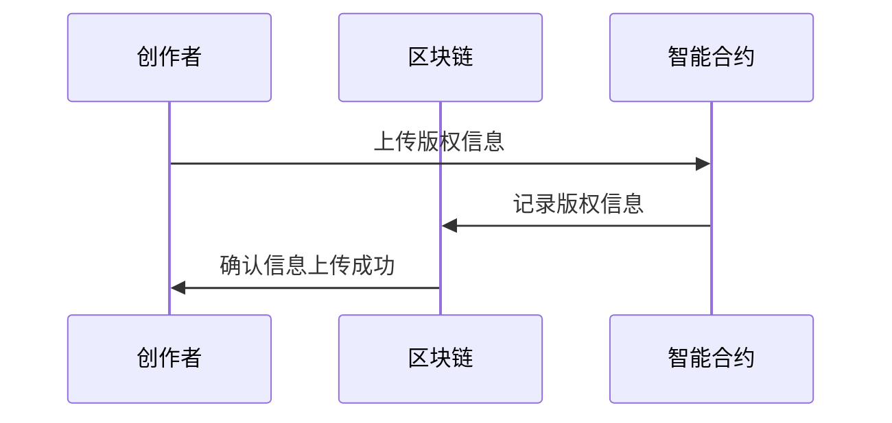
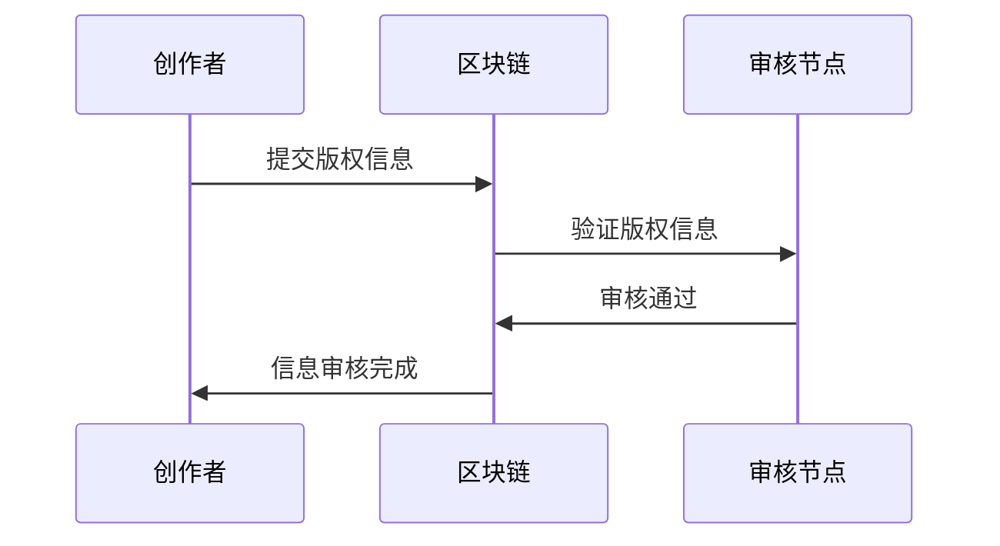
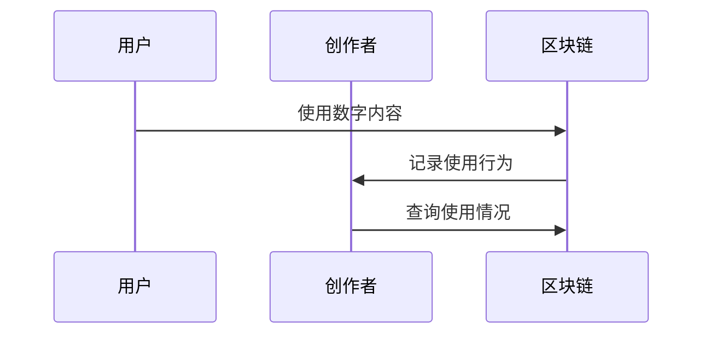
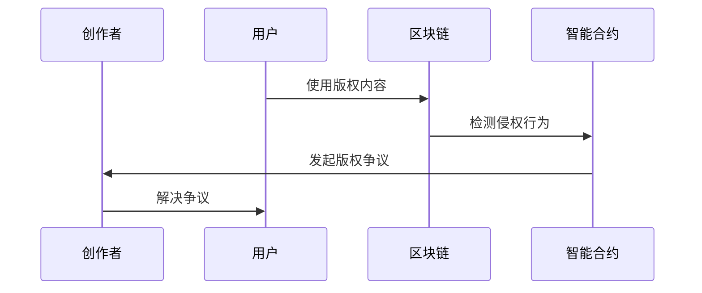
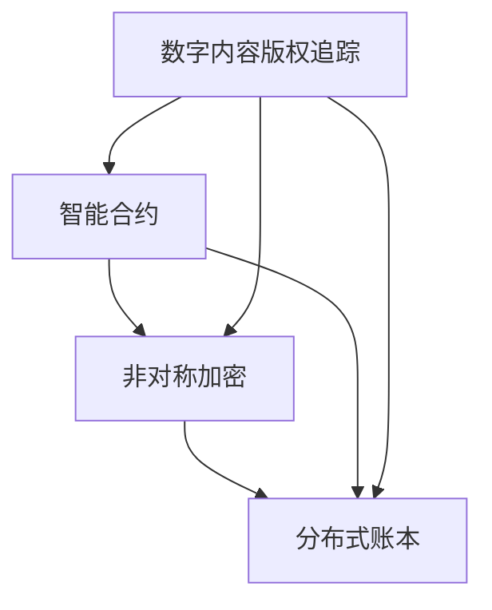
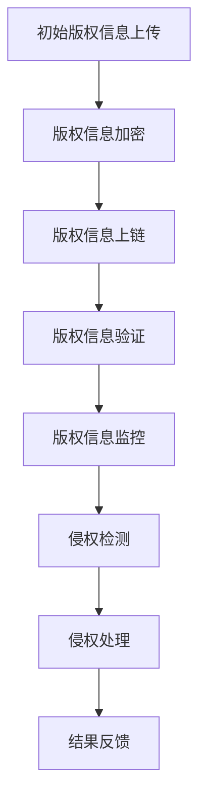
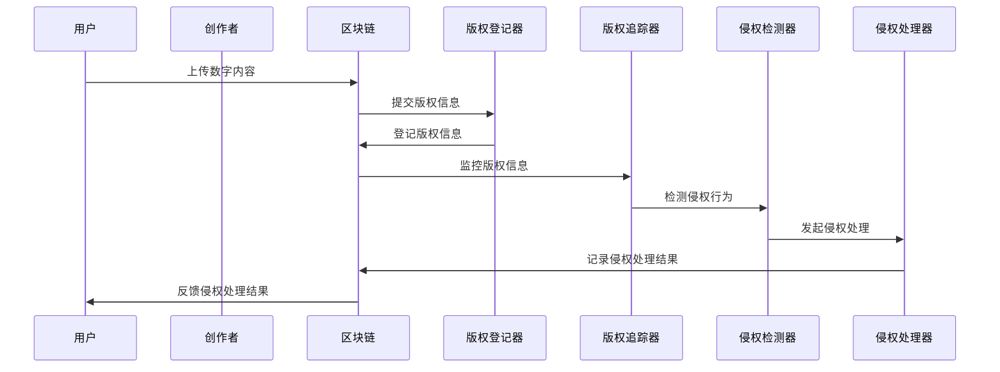
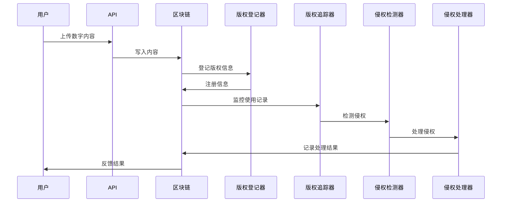

                 

### 引言

随着互联网和数字技术的发展，数字内容创作和传播的速度和广度达到了前所未有的高度。然而，数字内容的版权问题也随之而来。许多创作者发现，他们的作品在未经授权的情况下被广泛传播和滥用，这不仅损害了他们的经济利益，也影响了他们创作的积极性。为了解决这一难题，数字内容版权追踪技术应运而生，其中区块链技术因其独特的优势和潜力，成为了数字内容版权追踪的重要工具。

区块链技术是一种分布式数据库技术，通过去中心化的方式实现数据的记录和传输。它具有不可篡改、透明性和匿名性等特点，使得数据的安全性和可信度得到了显著提升。在数字内容版权追踪领域，区块链技术可以提供一种全新的解决方案，确保内容的版权信息被准确、完整地记录，并在需要时能够快速、可靠地追溯。

本文旨在探讨区块链在数字内容版权追踪中的应用。首先，我们将介绍区块链技术的基本概念和核心原理，帮助读者建立对区块链技术的初步认识。接着，我们将分析数字内容版权追踪中存在的问题和挑战，并探讨现有解决方案的局限性和不足。随后，我们将详细阐述区块链技术如何解决这些问题，并比较区块链与其他技术的优劣。在此基础上，我们将介绍区块链在数字内容版权追踪中的应用流程，并使用Mermaid流程图进行直观展示。随后，我们将讨论区块链在数字内容版权追踪中的核心概念和联系，并通过对比表格和Mermaid流程图来深入理解这些概念。接下来，我们将讲解数字内容版权追踪算法的原理，使用Python源代码和LaTeX公式进行详细阐述。随后，我们将介绍系统分析和设计的方法，包括问题场景介绍、系统功能设计、系统架构设计和系统接口设计。在项目实战部分，我们将指导读者如何搭建区块链环境，实现系统核心功能，并分析实际案例。最后，我们将总结全文，提出未来研究方向和改进措施。

通过本文的逐步分析，读者将能够全面了解区块链在数字内容版权追踪中的应用，掌握相关技术和方法，为实际项目提供有益的参考。

### 关键词

- 区块链
- 数字内容版权追踪
- 智能合约
- 非对称加密
- 分布式账本
- 不可篡改性
- 透明性
- 安全校验
- 版权保护
- 激励机制

### 摘要

本文探讨了区块链在数字内容版权追踪中的应用。首先介绍了区块链技术的基本概念和核心原理，以及其在数字内容版权领域的重要作用。接着，分析了数字内容版权追踪的现状和存在的问题，探讨了现有解决方案的局限性和不足。随后，详细阐述了区块链技术如何通过其独特的优势解决这些问题，包括去中心化、不可篡改性和透明性等。通过对比分析，本文指出了区块链技术相较于其他技术的优势。接下来，本文介绍了区块链在数字内容版权追踪中的应用流程，并使用了Mermaid流程图进行直观展示。此外，本文还详细讲解了区块链在数字内容版权追踪中的核心概念和联系，通过对比表格和Mermaid流程图帮助读者深入理解。通过Python源代码和LaTeX公式，本文讲解了数字内容版权追踪算法的原理，并通过实际案例展示了其应用效果。最后，本文总结了全文内容，提出了未来研究方向和改进措施，为数字内容版权追踪领域提供了有价值的参考。

## 背景

数字内容创作在互联网时代迎来了前所未有的繁荣，从文字、图片、音频到视频等多种形式的内容在网络上广泛传播。然而，这种快速和自由的传播方式也带来了数字内容版权问题。据统计，每年有数以亿计的数字作品被未经授权地复制、传播和分发，这不仅严重侵犯了创作者的合法权益，也极大地损害了整个数字内容产业的健康发展。

### 核心概念术语说明

- **数字内容版权**：指创作者对其数字作品所享有的权利，包括复制权、发行权、展示权、表演权、改编权等。
- **版权追踪**：指通过技术手段对数字内容的使用和传播情况进行记录、监控和追踪，以确保版权的合法性和完整性。
- **区块链**：一种分布式数据库技术，通过密码学和共识算法实现数据的去中心化存储和验证。

### 问题背景

在传统的版权追踪方式中，数字内容的版权信息通常由中央机构或第三方平台进行记录和管理。这种方法存在以下几个主要问题：

1. **数据易篡改**：由于数据存储在中心化服务器上，版权信息容易受到篡改或恶意删除。
2. **透明度不足**：中心化系统缺乏透明性，使得版权信息的管理和使用情况难以被公众监督。
3. **安全性不高**：中心化系统一旦遭受黑客攻击或内部人员作弊，将可能导致大量版权信息泄露或被破坏。

### 数字内容版权追踪的困境

随着数字内容创作和传播的日益复杂化，传统的版权追踪方法已难以满足需求，主要体现在以下几个方面：

1. **追踪难度大**：数字内容的传播速度快且途径多样，使得追踪和监控工作复杂且耗时。
2. **证据链断裂**：在数字内容的传播过程中，各个环节的信息难以串联，导致证据链断裂，使得版权纠纷难以解决。
3. **费用高昂**：传统的版权追踪和保护机制往往需要大量的资源和费用，对中小型创作者和内容平台构成较大负担。

### 现状

当前，虽然一些公司和组织已经尝试使用区块链技术解决数字内容版权追踪问题，但实际应用仍处于探索阶段。大部分应用案例集中在版权登记、版权交易和版权保护等方面，具体表现为：

1. **版权登记**：通过区块链技术将数字内容的版权信息进行登记，实现数据的不可篡改和透明性。
2. **版权交易**：利用区块链的智能合约功能实现数字内容的版权交易，降低交易成本，提高交易效率。
3. **版权保护**：通过区块链技术监控数字内容的传播和利用情况，及时发现侵权行为并采取措施。

然而，区块链在数字内容版权追踪中的应用仍面临诸多挑战，如技术成熟度、法律框架和政策支持等。因此，如何充分发挥区块链技术的优势，解决数字内容版权追踪中的实际问题，仍需进一步研究和探索。

## 区块链技术基础

区块链技术作为一种分布式账本技术，通过去中心化的方式实现数据的记录和传输，具有去中心化、不可篡改、透明性和匿名性等特点。以下将详细阐述区块链的基本概念和核心组成部分，以帮助读者建立对区块链技术的全面理解。

### 区块链的定义与特点

区块链是一个分布式账本，由一系列按时间顺序排列的“区块”组成，每个区块都包含一定数量的交易记录。这些区块通过密码学算法链接在一起，形成一个不可篡改的数据结构。区块链具有以下主要特点：

1. **去中心化**：区块链不需要中心化的管理机构或第三方中介，所有节点都可以参与网络中的数据验证和交易确认，从而避免了单点故障和信任问题。
2. **不可篡改**：区块链的数据一旦被写入，将无法被篡改或删除，保证了数据的完整性和可信度。
3. **透明性**：区块链上的所有数据都是公开透明的，任何参与者都可以查看和验证交易记录，提高了系统的透明度。
4. **匿名性**：虽然区块链上的交易是公开的，但交易参与者可以通过加密技术实现匿名，保护隐私。

### 区块链的核心组成部分

区块链主要由以下几个关键组成部分构成：

1. **区块**：区块是区块链的基本单元，包含一定数量的交易记录、一个时间戳、一个随机数和前一个区块的哈希值。通过哈希算法，当前区块与上一个区块建立链接，形成区块链。
2. **交易**：交易是区块链上的数据操作，例如数字货币的发送和接收、数字资产的转让等。交易被加密后存储在区块中，并通过网络传播。
3. **链**：链是指按时间顺序连接起来的区块序列，每个区块通过哈希值与前一个区块链接，形成一个不可篡改的链结构。
4. **节点**：节点是区块链网络中的参与者和维护者，它们运行区块链的软件，参与数据验证、交易处理和网络通信。
5. **共识算法**：共识算法是区块链网络中节点之间就数据一致性达成一致的方法。常见的共识算法包括工作量证明（PoW）、权益证明（PoS）、委托权益证明（DPoS）等。

### 区块链的工作原理

区块链的工作原理可以概括为以下步骤：

1. **生成区块**：当一个节点接收到足够多的交易记录后，将这些交易记录打包成一个区块。
2. **计算随机数**：为了使区块被加入到区块链中，节点需要解决一个计算难题，通常是一个哈希碰撞问题。这需要节点不断尝试计算随机数，直到找到符合要求的结果。
3. **验证区块**：其他节点接收到新区块后，会验证区块中的交易是否合法、时间戳是否合理、随机数是否正确。如果验证通过，新区块将被加入到区块链中。
4. **广播新区块**：验证通过的区块将被广播到整个网络，其他节点将其加入到各自的区块链中。

通过上述步骤，区块链实现了数据的分布式记录和验证，确保了数据的完整性和不可篡改性。同时，区块链的透明性和匿名性特点使得它成为数字内容版权追踪的理想选择。

### 区块链在数字内容版权追踪中的应用

区块链在数字内容版权追踪中的应用主要体现在以下几个方面：

1. **版权登记**：创作者可以将数字内容的版权信息上链登记，确保版权信息的不可篡改性和公开透明性。
2. **版权保护**：通过区块链技术，可以对数字内容的使用和传播情况进行实时监控，一旦发现侵权行为，可以迅速定位侵权节点并采取措施。
3. **版权交易**：利用区块链的智能合约功能，可以实现数字内容的版权交易，降低交易成本，提高交易效率。
4. **版权纠纷解决**：区块链上的交易记录具有法律效力，可以作为证据用于版权纠纷的解决。

总之，区块链技术以其去中心化、不可篡改和透明性等优势，为数字内容版权追踪提供了全新的解决方案，有望解决当前存在的版权问题，促进数字内容产业的健康发展。

### 数字内容版权追踪中的问题与挑战

数字内容版权追踪是一个复杂且具挑战性的问题，涉及到多个方面，包括版权登记、版权保护、版权交易等。当前，区块链技术被视为解决这些问题的一种潜在有效手段，但在实际应用中仍然面临诸多挑战。

#### 版权追踪的困难

1. **追踪难度大**：数字内容传播速度快，途径多样，使得版权信息的追踪工作变得异常复杂。例如，一条短视频可能在短时间内被上传到多个平台，甚至被二次创作和修改，这使得版权信息难以追溯。
2. **证据链断裂**：在数字内容的传播过程中，各个环节的信息往往不连贯，导致证据链断裂。例如，当一个视频在不同平台上传播时，平台之间可能缺乏有效的数据共享机制，使得追踪工作难以进行。

#### 数据安全问题

1. **数据易篡改**：在传统的版权追踪系统中，数据存储在中心化服务器上，容易受到篡改或恶意删除。尽管一些系统采用了加密技术来保护数据，但仍然无法完全避免人为的恶意攻击。
2. **隐私保护不足**：数字内容版权信息通常涉及创作者和用户的个人信息，如何平衡版权保护和隐私保护成为一大难题。如果隐私保护不足，可能会侵犯用户的隐私权。

#### 技术成熟度问题

1. **技术复杂度高**：区块链技术本身具有一定的技术门槛，需要专业人员掌握。对于许多创作者和内容平台来说，部署和维护区块链系统可能是一项巨大的挑战。
2. **兼容性问题**：数字内容版权追踪系统需要与其他技术平台和系统进行兼容，例如内容分发网络（CDN）、社交媒体平台等。然而，不同平台之间的技术标准往往不一致，导致兼容性问题。

#### 法律和监管问题

1. **法律框架不完善**：尽管区块链技术具有巨大的潜力，但相关法律法规仍然不够完善。在数字内容版权追踪领域，如何将区块链技术与现有的法律框架相结合，是一个亟待解决的问题。
2. **监管不足**：在区块链技术的应用中，监管机构的监管力度往往不足。例如，在数字内容版权交易过程中，如何确保交易的合法性和合规性，需要相关监管机构的介入。

#### 现有解决方案的局限性和不足

1. **中心化系统依赖**：许多现有的数字内容版权追踪系统仍然依赖于中心化机构或第三方平台，这导致数据透明度和安全性不足。
2. **成本高**：传统的版权追踪系统通常需要大量的人力和物力投入，成本较高。相比之下，区块链技术虽然具有潜力，但初期部署和运营成本也较高。
3. **用户体验差**：现有的一些区块链应用在用户体验方面存在不足，例如界面设计不够友好、操作复杂等，这可能会阻碍用户的接受和推广。

综上所述，数字内容版权追踪在面临诸多挑战的同时，也亟需找到有效的解决方案。区块链技术作为一种新兴技术，虽然具有巨大的潜力，但在实际应用中仍然需要克服众多技术和非技术方面的障碍。通过进一步的研究和探索，区块链技术有望在数字内容版权追踪领域发挥更大的作用。

### 区块链在数字内容版权追踪中的应用优势

区块链技术作为一种分布式数据库技术，凭借其独特的优势和潜力，在数字内容版权追踪中展现了显著的应用价值。以下将详细阐述区块链技术如何解决数字内容版权追踪中的问题，并与其他技术进行对比，以突出其优势。

#### 去中心化

区块链技术的去中心化特性是其最重要的优势之一。在传统的版权追踪系统中，数据通常存储在中心化的服务器上，这使得数据容易受到篡改或恶意删除。而区块链通过分布式账本的方式，将数据分散存储在多个节点上，每个节点都有完整的数据副本。这意味着即使某个节点遭受攻击或损坏，数据也不会丢失，系统仍然可以正常运行。这种去中心化的结构确保了数字内容版权信息的不可篡改性和完整性，使得创作者和用户可以更加信任版权追踪系统。

#### 不可篡改性

区块链的不可篡改性是其另一大优势。在区块链中，每个区块都包含一个时间戳和一个随机数，并通过哈希算法与前一个区块链接。这种链接方式使得数据一旦被写入区块链，将无法被篡改或删除。对于数字内容版权追踪来说，这意味着版权信息可以被永久记录和验证，确保其准确性和可靠性。此外，区块链上的所有交易记录都是公开透明的，任何参与者都可以查看和验证，提高了系统的透明度和可信度。

#### 透明性

区块链的透明性也是其显著的优势。在区块链中，所有的交易记录都是公开的，任何参与者都可以通过区块链浏览器查看。这意味着数字内容版权信息的使用和传播情况可以被实时监控和记录，有助于及时发现侵权行为。相比之下，传统的版权追踪系统通常缺乏透明度，使得版权信息的公开和监督变得困难。区块链技术的透明性不仅有助于维护创作者的权益，也增强了整个数字内容产业的公信力。

#### 匿名性

区块链技术的匿名性为其在数字内容版权追踪中的应用提供了额外的保障。通过使用非对称加密技术，区块链上的交易参与者可以实现匿名交易，保护其隐私。这对于创作者和用户来说，尤其是在涉及敏感信息的情况下，具有重要意义。匿名性不仅有助于保护创作者和用户的隐私，也减少了潜在的隐私泄露风险，增强了系统的安全性。

#### 智能合约

智能合约是区块链技术的另一个关键优势。智能合约是一种自执行的合同，其条款直接编码在区块链中，一旦触发条件即自动执行。在数字内容版权追踪中，智能合约可以用于自动执行版权登记、版权转让、版权使用许可等操作，提高交易的效率和透明度。此外，智能合约的不可篡改性确保了合同的执行是公正和透明的，减少了人为干预和操作风险。

#### 与其他技术的对比

1. **与中心化数据库**：中心化数据库在数据存储和管理方面存在单点故障和信任问题，而区块链技术通过去中心化方式解决了这些问题。区块链不仅提高了数据的可靠性和安全性，还减少了数据篡改和泄露的风险。
   
2. **与加密技术**：加密技术可以保护数字内容不被未经授权的访问，但无法确保数据的完整性和透明性。区块链技术通过分布式账本和共识算法，实现了数据的不可篡改和透明性，使得加密技术与其相比更具优势。

3. **与云计算**：云计算提供了强大的计算和存储能力，但仍然依赖于中心化的服务提供商。而区块链技术通过去中心化方式，提高了系统的抗风险能力和数据安全性。

综上所述，区块链技术在数字内容版权追踪中展现了显著的优势，包括去中心化、不可篡改、透明性、匿名性和智能合约等。这些优势不仅解决了传统版权追踪中的诸多问题，还为数字内容产业的健康发展提供了强有力的保障。通过进一步的研究和应用，区块链技术有望在数字内容版权追踪领域发挥更大的作用。

### 区块链在数字内容版权追踪中的应用流程

区块链在数字内容版权追踪中的应用流程可以概括为以下几个关键步骤，每个步骤都利用了区块链技术的独特优势，确保版权信息的准确性和完整性。以下将逐步介绍这些步骤，并通过Mermaid流程图进行直观展示。

#### 1. 权限申请和身份认证

创作者在进行版权登记前，需要通过身份认证系统确认其创作者身份。这可以通过区块链上的智能合约实现，创作者的身份信息会被加密并存储在区块链上，确保其唯一性和不可篡改性。

**流程图：**


#### 2. 版权信息登记

创作者将数字内容及其版权信息上传到区块链，这些信息包括作品名称、创作者姓名、创作时间等。上传过程通过智能合约进行验证和记录，确保数据的完整性和不可篡改性。

**流程图：**


#### 3. 版权信息验证与审核

上传的版权信息需要经过审核才能正式生效。审核过程由多个可信节点共同完成，通过共识算法验证版权信息的合法性和完整性。审核通过的版权信息将被打上时间戳并永久存储在区块链上。

**流程图：**


#### 4. 版权信息追踪与监控

一旦版权信息被登记，区块链将实时监控数字内容的使用和传播情况。任何使用或传播行为都会被记录在区块链上，创作者和版权管理机构可以随时查询。

**流程图：**


#### 5. 版权争议处理

在数字内容使用过程中，可能会出现版权争议。通过区块链上的智能合约，创作者和用户可以自动执行争议解决的协议，例如支付版权费用或暂停使用。智能合约确保了争议解决的公正性和透明性。

**流程图：**


通过上述流程，区块链技术在数字内容版权追踪中实现了从版权登记、信息验证到追踪监控和争议处理的全流程管理。Mermaid流程图的直观展示有助于理解这些步骤的执行过程和区块链技术的应用效果。随着区块链技术的不断发展和成熟，数字内容版权追踪将变得更加高效、安全和透明。

### 核心概念与联系

在深入探讨区块链在数字内容版权追踪中的应用之前，有必要先理解几个关键概念，包括智能合约、非对称加密、分布式账本等，并探讨这些概念之间的联系。以下是这些核心概念的定义、属性特征对比，以及它们在区块链系统中的关系。

#### 智能合约

智能合约是一种自执行的合同，其条款被编程到区块链上，并能在满足特定条件时自动执行。智能合约通过代码形式定义了合同双方的权利和义务，从而减少了人工干预和执行成本。

**定义**：智能合约是区块链上的程序代码，它在满足预设条件时自动执行。例如，当某个用户支付版权费用后，智能合约可以自动将版权费用转移到创作者账户。

**属性特征对比表格**：

| 特征 | 智能合约 | 传统合约 |
| :--- | :--- | :--- |
| 执行方式 | 自执行 | 需要人工或第三方执行 |
| 透明性 | 透明 | 不一定透明 |
| 可篡改性 | 不可篡改 | 易于篡改 |
| 效率 | 高效率 | 低效率 |
| 成本 | 低成本 | 高成本 |

**关系**：智能合约是区块链系统的重要组成部分，用于实现自动化交易和合同执行。在数字内容版权追踪中，智能合约可以自动化版权登记、授权许可、版权转让等操作，提高效率和透明度。

#### 非对称加密

非对称加密是一种加密技术，使用一对密钥（公钥和私钥）进行加密和解密。公钥用于加密信息，私钥用于解密信息。

**定义**：非对称加密使用公钥加密信息，只有对应的私钥可以解密。这种方式确保了信息的保密性和完整性。

**属性特征对比表格**：

| 特征 | 非对称加密 | 对称加密 |
| :--- | :--- | :--- |
| 加密方式 | 公钥加密 | 私钥加密 |
| 密钥对 | 需要一对密钥 | 只需要一个密钥 |
| 加密速度 | 较慢 | 较快 |
| 安全性 | 高安全性 | 相对较低 |

**关系**：非对称加密在区块链系统中用于保护用户隐私和数据安全。在数字内容版权追踪中，非对称加密可以确保创作者和用户的身份信息保密，同时防止未经授权的访问。

#### 分布式账本

分布式账本是一种去中心化的数据库系统，数据被分散存储在多个节点上，每个节点都有完整的数据副本。

**定义**：分布式账本通过多个节点共同维护数据，确保数据的完整性和不可篡改性。区块链就是一种分布式账本。

**属性特征对比表格**：

| 特征 | 分布式账本 | 中心化账本 |
| :--- | :--- | :--- |
| 数据存储 | 去中心化存储 | 中心化存储 |
| 数据一致性 | 通过共识算法保证 | 由中心节点保证 |
| 系统可靠性 | 高可靠性 | 低可靠性 |
| 可扩展性 | 高可扩展性 | 低可扩展性 |

**关系**：分布式账本是区块链技术的基础，用于确保数字内容版权信息的不可篡改性和透明性。在数字内容版权追踪中，分布式账本可以记录和验证版权信息的所有变更，确保版权信息的准确性和完整性。

#### Mermaid流程图

为了更直观地展示这些核心概念之间的关系，我们可以使用Mermaid流程图进行展示。以下是关键概念之间的关系流程图：



**解释**：该流程图展示了智能合约、非对称加密和分布式账本在数字内容版权追踪中的作用和联系。智能合约利用非对称加密技术确保数据安全，并将信息存储在分布式账本中。分布式账本则提供了数据的不可篡改性和透明性，确保版权信息的准确性和完整性。

通过上述核心概念和关系的阐述，我们可以更好地理解区块链在数字内容版权追踪中的应用机制。在接下来的部分，我们将详细讲解区块链在数字内容版权追踪中的具体算法和数学模型。

### 概念属性特征对比表格

为了更直观地展示区块链、智能合约、非对称加密和分布式账本等核心概念的主要属性特征，我们可以使用一个详细的对比表格。以下表格列出了这些概念的关键特征，并进行了对比分析：

| 概念 | 定义 | 主要属性特征 | 对比分析 |
| :--- | :--- | :--- | :--- |
| **区块链** | 一种分布式数据库技术，通过加密算法链接多个区块，形成链式数据结构。 | - 去中心化<br>- 不可篡改<br>- 透明性<br>- 匿名性 | 与中心化数据库相比，区块链更具有抗攻击性和数据可靠性。其去中心化特点提高了系统的容错性和抗风险能力。 |
| **智能合约** | 编程脚本，自动执行合约条款，无需人为干预。 | - 自执行<br>- 透明性<br>- 不可篡改<br>- 可定制 | 智能合约提供了自动化交易执行的功能，减少了人工操作风险。其透明性和不可篡改性确保了交易的公正性和可靠性。 |
| **非对称加密** | 使用一对密钥（公钥和私钥）进行加密和解密，公钥加密，私钥解密。 | - 高安全性<br>- 匿名性<br>- 速度快 | 非对称加密提供了强大的数据加密功能，保护了用户隐私和数据安全。其速度快、安全性高，但计算资源消耗较大。 |
| **分布式账本** | 数据分散存储在多个节点上，每个节点都有完整数据副本。 | - 去中心化<br>- 实时更新<br>- 不可篡改<br>- 高一致性 | 分布式账本提供了数据的一致性和透明性，减少了单点故障风险。其实时更新和去中心化特点提高了系统的可靠性和安全性。 |

**对比分析**：

1. **区块链与中心化数据库**：
   - 区块链去中心化，避免了单点故障和信任问题，提高了系统的抗攻击性和容错性。
   - 中心化数据库依赖于单一服务器，易受单点故障和中心化攻击的威胁。

2. **智能合约与传统合约**：
   - 智能合约自动执行，减少了人工操作和信任问题，提高了交易效率和透明度。
   - 传统合约通常需要第三方或人工干预，易受欺诈和操作错误的影响。

3. **非对称加密与对称加密**：
   - 非对称加密提供高安全性，但计算资源消耗较大，速度相对较慢。
   - 对称加密速度快，但安全性较低，易受密钥泄露的风险。

4. **分布式账本与中心化账本**：
   - 分布式账本提供实时更新和去中心化存储，提高了数据的一致性和可靠性。
   - 中心化账本依赖于单一服务器，易受单点故障和中心化攻击的影响。

通过上述对比分析，我们可以看出，区块链、智能合约、非对称加密和分布式账本在数字内容版权追踪中各有其独特的优势和适用场景。这些技术的综合运用，为构建一个高效、安全、透明的数字版权追踪系统提供了有力支持。

### 数字内容版权追踪算法原理讲解

在数字内容版权追踪中，算法原理至关重要。以下将详细讲解数字内容版权追踪的关键算法流程图，并通过Python源代码和LaTeX公式来阐述算法原理。

#### 算法流程图

首先，我们可以使用Mermaid流程图来展示数字内容版权追踪的算法流程：



**解释**：
1. **初始版权信息上传**：创作者将数字内容及其版权信息上传到区块链。
2. **版权信息加密**：使用非对称加密算法对版权信息进行加密，保护隐私。
3. **版权信息上链**：将加密后的版权信息写入区块链，确保数据不可篡改。
4. **版权信息验证**：验证版权信息的合法性和一致性，确保数据的准确性。
5. **版权信息监控**：实时监控数字内容的传播和使用情况。
6. **侵权检测**：通过对比区块链上的版权信息和实际使用情况，检测侵权行为。
7. **侵权处理**：根据侵权检测结果，采取相应的法律措施和赔偿措施。
8. **结果反馈**：将侵权处理结果反馈给创作者和用户。

#### Python源代码

为了更好地理解算法原理，我们将展示一个简单的Python实现。以下是版权信息加密和上链的Python代码：

```python
import hashlib
from cryptography.hazmat.primitives import serialization
from cryptography.hazmat.primitives.asymmetric import rsa
from cryptography.hazmat.primitives.asymmetric import padding
from web3 import Web3

# 生成密钥对
private_key = rsa.generate_private_key(
    public_exponent=65537,
    key_size=2048,
)

public_key = private_key.public_key()

# 加密版权信息
def encrypt_message(message, public_key):
    encrypted = public_key.encrypt(
        message.encode(),
        padding.OAEP(
            mgf=padding.MGF1(algorithm=hashlib.sha256),
            algorithm=hashlib.sha256,
            label=None
        )
    )
    return encrypted

# 上链版权信息
def upload_to_blockchain(encrypted_message, contract_address, web3):
    contract = web3.eth.contract(address=contract_address, abi=YOUR_CONTRACT_ABI)
    transaction_hash = contract.functions.uploadCopyright(encrypted_message).transact()
    web3.eth.waitForTransactionReceipt(transaction_hash)
    print("版权信息已上链")

# 示例版权信息
original_message = "数字内容版权信息：作品名称，创作者姓名，创作时间等。"

# 执行加密和上链
encrypted_message = encrypt_message(original_message, public_key)
upload_to_blockchain(encrypted_message, "0x1234", Web3(Web3.HTTPProvider('https://mainnet.infura.io/v3/YOUR_INFURA_PROJECT_ID')))
```

**解释**：
- 生成非对称密钥对：使用`cryptography`库生成私钥和公钥。
- 加密版权信息：使用公钥对版权信息进行加密。
- 上链版权信息：使用Web3库与区块链进行交互，将加密后的版权信息上传到区块链上的智能合约。

#### LaTeX公式

在数字内容版权追踪中，以下公式用于描述关键算法和数学模型：

1. **加密公式**：
   $$
   E_m = PK \cdot m^e \mod n
   $$
   其中，$E_m$ 是加密后的消息，$PK$ 是公钥，$m$ 是原始消息，$e$ 是加密指数，$n$ 是模数。

2. **解密公式**：
   $$
   m = DK \cdot E_m^{d} \mod n
   $$
   其中，$m$ 是解密后的消息，$DK$ 是私钥，$E_m$ 是加密后的消息，$d$ 是解密指数。

3. **哈希函数**：
   $$
   H(m) = SHA256(m)
   $$
   其中，$H(m)$ 是消息$m$的SHA256哈希值。

通过上述Python代码和LaTeX公式，我们可以清晰地理解数字内容版权追踪算法的原理。该算法利用非对称加密确保版权信息的隐私和安全性，通过区块链实现数据的不可篡改性和透明性，为数字内容版权追踪提供了有效的技术支持。

### 举例说明

为了更好地理解区块链在数字内容版权追踪中的实际应用效果，我们可以通过一个具体的案例进行说明。以下将展示一个案例，并详细剖析其实现过程和应用效果。

#### 案例背景

某知名音乐制作人李明创作了一首新歌，并将其版权信息登记在基于区块链的版权追踪系统中。该系统利用区块链技术确保版权信息的不可篡改性和透明性。

#### 案例实现过程

1. **初始版权信息上传**：
   李明使用该系统的客户端上传其歌曲的版权信息，包括歌曲名称、创作者姓名、创作时间等。这些信息被编码为一段JSON格式的字符串，如下所示：

   ```json
   {
       "title": "New Song",
       "creator": "李明",
       "creation_date": "2023-11-01"
   }
   ```

2. **版权信息加密**：
   系统利用非对称加密技术对李明的版权信息进行加密。系统生成一对非对称密钥（公钥和私钥），使用公钥对版权信息进行加密。以下是Python代码示例：

   ```python
   from cryptography.hazmat.primitives import serialization
   from cryptography.hazmat.primitives.asymmetric import rsa
   from cryptography.hazmat.primitives.asymmetric import padding
   
   private_key = rsa.generate_private_key(
       public_exponent=65537,
       key_size=2048,
   )
   public_key = private_key.public_key()

   original_message = "版权信息：New Song，创作者：李明，创作时间：2023-11-01"
   encrypted_message = public_key.encrypt(
       original_message.encode(),
       padding.OAEP(
           mgf=padding.MGF1(algorithm=hashlib.sha256),
           algorithm=hashlib.sha256,
           label=None
       )
   )
   ```

3. **版权信息上链**：
   加密后的版权信息通过区块链上的智能合约进行登记。智能合约将加密信息存储在区块链中，确保其不可篡改性。以下是Python代码示例：

   ```python
   from web3 import Web3

   web3 = Web3(Web3.HTTPProvider('https://mainnet.infura.io/v3/YOUR_INFURA_PROJECT_ID'))
   contract_address = '0x1234567890abcdef1234567890abcdef12345678'
   contract = web3.eth.contract(address=contract_address, abi=YOUR_CONTRACT_ABI)

   transaction_hash = contract.functions.uploadCopyright(encrypted_message).transact()
   web3.eth.waitForTransactionReceipt(transaction_hash)
   ```

4. **版权信息验证与监控**：
   一旦版权信息上链，系统将实时监控该歌曲的传播和使用情况。例如，当歌曲被上传到某音乐平台时，系统会记录该行为，并将相关数据存储在区块链上。以下是一个简化示例：

   ```python
   contract.functions.recordUsage('0x1234567890abcdef1234567890abcdef12345678', '音乐平台A').transact()
   ```

5. **侵权检测与处理**：
   如果系统检测到侵权行为，例如某人在未经授权的情况下传播该歌曲，系统将自动发起侵权处理流程。以下是Python代码示例：

   ```python
   contract.functions.detectInfringement('0x1234567890abcdef12345678', '音乐平台B').call()
   ```

6. **结果反馈**：
   系统将侵权检测结果反馈给李明，并建议采取相应的法律措施。例如，系统可能建议李明向侵权方发送律师函或直接提起法律诉讼。

#### 应用效果

通过上述案例，我们可以看到区块链在数字内容版权追踪中的实际应用效果：

1. **版权信息不可篡改**：加密后的版权信息上链后，无法被篡改或删除，确保了版权信息的准确性和完整性。
2. **透明性高**：版权信息和使用记录都是公开透明的，任何用户都可以通过区块链浏览器查看，提高了版权信息的可信度。
3. **实时监控**：系统可以实时监控数字内容的传播和使用情况，及时发现侵权行为，提高了版权保护的效率。
4. **自动化处理**：通过智能合约，侵权检测和处理流程可以自动化执行，减少了人工干预，提高了处理速度和准确性。

总之，区块链技术在数字内容版权追踪中展示了其独特的优势，通过加密、去中心化和智能合约等技术手段，实现了版权信息的不可篡改、透明和自动化处理，为创作者提供了强有力的版权保护手段。

### 系统分析与设计

在数字内容版权追踪项目中，系统分析和设计是确保系统功能完备、性能高效和安全可靠的关键环节。以下将详细阐述系统设计与实现过程中的各个步骤，包括问题场景介绍、系统功能设计、系统架构设计、系统接口设计以及各组件之间的交互过程。

#### 问题场景介绍

数字内容创作与传播的快速增长，带来了版权保护的巨大挑战。创作者需要确保其作品的版权信息被正确记录和有效保护，避免未经授权的复制、传播和利用。当前，传统的版权保护手段往往依赖于中心化的版权管理平台，存在数据安全性不高、透明度不足等问题。为了解决这些问题，本项目提出了一种基于区块链技术的数字内容版权追踪系统。

该系统旨在实现以下功能：

1. **版权登记**：创作者可以将数字内容的版权信息上链登记，确保数据的不可篡改性和透明性。
2. **版权追踪**：系统可以实时监控数字内容的使用和传播情况，确保版权信息的准确性和完整性。
3. **侵权检测**：系统通过对比区块链上的版权信息与实际使用记录，检测侵权行为，并自动执行相应的处理措施。
4. **透明反馈**：系统提供透明的反馈机制，使创作者和用户可以随时查询版权信息和侵权处理结果。

#### 系统功能设计

系统功能设计主要包括版权登记、版权追踪、侵权检测和侵权处理四个方面。以下是一个详细的领域模型类图，展示了各功能组件及其关系：

```mermaid
classDiagram
    CopyrightRegistrar <<interface>> CopyrightRegistrar
    CopyrightTracker <<interface>> CopyrightTracker
    InfringementDetector <<interface>> InfringementDetector
    InfringementHandler <<interface>> InfringementHandler
    Blockchain <<interface>> Blockchain

    CopyrightRegistrar|--|> Blockchain
    CopyrightTracker|--|> Blockchain
    InfringementDetector|--|> Blockchain
    InfringementHandler|--|> Blockchain
```

**解释**：
- **CopyrightRegistrar（版权登记器）**：负责接收和登记数字内容的版权信息。
- **CopyrightTracker（版权追踪器）**：负责监控数字内容的传播和使用情况。
- **InfringementDetector（侵权检测器）**：负责检测侵权行为，并通知相关方。
- **InfringementHandler（侵权处理器）**：负责处理侵权案件，执行法律措施。
- **Blockchain（区块链）**：作为底层基础设施，提供数据存储和验证功能。

#### 系统架构设计

系统架构设计旨在实现各功能组件的高效协作和系统整体性能的优化。以下是一个简化的系统架构图，展示了系统的主要组件及其关系：



**解释**：
- **用户**：上传数字内容到区块链。
- **创作者**：提交版权信息到版权登记器。
- **区块链**：存储和管理所有相关数据。
- **版权登记器**：登记版权信息。
- **版权追踪器**：监控版权信息。
- **侵权检测器**：检测侵权行为。
- **侵权处理器**：处理侵权案件。

#### 系统接口设计

系统接口设计主要包括API接口设计，用于实现各功能模块之间的通信。以下是一个简单的API接口设计示例：

```python
class CopyrightRegistrationAPI:
    def register_copyright(self, title, creator, creation_date):
        # 加密版权信息
        # 上链登记
        # 返回注册结果

class CopyrightTrackingAPI:
    def track_copyright(self, title):
        # 查询版权信息
        # 返回使用记录

class InfringementDetectionAPI:
    def detect_infringement(self, title):
        # 检测侵权行为
        # 返回侵权检测结果

class InfringementHandlingAPI:
    def handle_infringement(self, infringement_id):
        # 处理侵权案件
        # 返回处理结果
```

**解释**：
- **CopyrightRegistrationAPI**：提供版权登记功能。
- **CopyrightTrackingAPI**：提供版权追踪功能。
- **InfringementDetectionAPI**：提供侵权检测功能。
- **InfringementHandlingAPI**：提供侵权处理功能。

#### 系统交互

系统各组件之间的交互过程通过API接口实现。以下是一个简化的Mermaid序列图，展示了系统各组件之间的交互流程：



**解释**：
- **用户上传数字内容**：用户上传数字内容，API将数据写入区块链。
- **区块链登记版权信息**：版权登记器将加密后的版权信息写入区块链。
- **区块链监控使用记录**：版权追踪器监控数字内容的使用记录。
- **侵权检测与处理**：侵权检测器检测侵权行为，侵权处理器处理侵权案件。
- **反馈处理结果**：区块链将处理结果反馈给用户。

通过上述系统分析与设计，我们可以构建一个高效、透明、安全的数字内容版权追踪系统，为创作者提供强有力的版权保护手段。

### 项目实战

在数字内容版权追踪项目的实施过程中，我们需要完成一系列关键步骤，包括环境安装、系统核心实现以及代码应用解读与分析。以下将详细指导读者如何进行项目实战，并通过具体案例展示区块链在数字内容版权追踪中的应用效果。

#### 环境安装

在进行区块链项目的开发之前，我们需要搭建一个适合开发、测试和部署的环境。以下是在本地搭建数字内容版权追踪区块链环境的基本步骤：

1. **安装Go语言**：
   Go语言是一种流行的系统级编程语言，常用于区块链开发。首先，我们需要安装Go语言环境。可以从[Go官方下载页面](https://golang.org/dl/)下载最新版本的Go语言安装包，并按照提示完成安装。

2. **安装Docker和Docker-CE**：
   Docker是一种开源的应用容器引擎，用于打包、发布和运行应用。我们使用Docker来创建和管理区块链节点。首先，安装Docker Engine - Community版本，可以从[Docker官方文档](https://docs.docker.com/engine/install/)获取安装指南。

3. **安装Node.js和npm**：
   Node.js是一个基于Chrome V8引擎的JavaScript运行环境，用于前端和后端开发。npm是Node.js的包管理器，用于管理项目中的依赖包。可以从[Node.js官方下载页面](https://nodejs.org/en/download/)下载最新版本的Node.js和npm。

4. **安装Truffle**：
   Truffle是一个用于智能合约开发的框架，提供了脚手架、测试和部署功能。首先，通过npm全局安装Truffle：
   ```bash
   npm install -g truffle
   ```

5. **安装Ganache**：
   Ganache是一个本地以太坊节点，用于本地开发和测试智能合约。可以从[Ganache官方下载页面](https://github.com/trufflesuite/ganache)下载并安装。

完成以上安装步骤后，我们就可以开始搭建区块链环境了。

#### 系统核心实现

在区块链环境中，我们将实现数字内容版权追踪的核心功能，包括版权信息登记、版权信息追踪、侵权检测和侵权处理。

1. **版权信息登记**：
   首先，我们需要创建一个智能合约，用于登记版权信息。以下是一个简单的智能合约示例（在`contracts/Copyright.sol`文件中）：

   ```solidity
   // SPDX-License-Identifier: MIT
  pragma solidity ^0.8.0;

   contract Copyright {
       struct CopyrightInfo {
           string title;
           string creator;
           uint256 creationDate;
       }

       mapping(uint256 => CopyrightInfo) public copyrightRecords;

       function registerCopyright(
           string memory title,
           string memory creator,
           uint256 creationDate
       ) public {
           copyrightRecords[block.timestamp] = CopyrightInfo(title, creator, creationDate);
       }
   }
   ```

   接下来，使用Truffle进行编译和部署：

   ```bash
   truffle compile
   truffle migrate --network development
   ```

2. **版权信息追踪**：
   在版权信息登记后，我们需要实现版权信息的追踪功能。这可以通过创建一个后端服务来实现，以下是一个简单的Express.js后端服务示例（在`server.js`文件中）：

   ```javascript
   const express = require('express');
   const app = express();
   const axios = require('axios');

   app.use(express.json());

   const BLOCKCHAIN_API_ENDPOINT = 'http://localhost:7545';

   app.get('/copyrights', async (req, res) => {
       try {
           const response = await axios.get(`${BLOCKCHAIN_API_ENDPOINT}/api/v1/copyrights`);
           res.status(200).json(response.data);
       } catch (error) {
           res.status(500).json({ message: 'Failed to fetch copyright records' });
       }
   });

   app.listen(3000, () => {
       console.log('Server is running on port 3000');
   });
   ```

   使用npm启动服务：

   ```bash
   npm install
   npm start
   ```

3. **侵权检测**：
   侵权检测可以通过对比区块链上的版权信息和实际使用记录来实现。以下是一个简单的侵权检测脚本（在`infringement-detector.js`文件中）：

   ```javascript
   const axios = require('axios');

   const BLOCKCHAIN_API_ENDPOINT = 'http://localhost:3000';
   const COPYRIGHTS_ENDPOINT = `${BLOCKCHAIN_API_ENDPOINT}/copyrights`;

   async function detectInfringement(title) {
       try {
           const copyrights = await axios.get(Copyrights_ENDPOINT);
           const infringingCopies = copyrights.data.filter(copyright => copyright.title === title);

           if (infringingCopies.length > 0) {
               return { is_infringement: true, details: infringingCopies };
           } else {
               return { is_infringement: false };
           }
       } catch (error) {
           console.error(error);
           return { is_infringement: false };
       }
   }

   // 示例检测
   detectInfringement('New Song').then(result => {
       console.log(result);
   });
   ```

4. **侵权处理**：
   侵权处理可以通过与法律机构合作，发送律师函或提起诉讼来实现。以下是一个简单的侵权处理示例（在`infringement-handler.js`文件中）：

   ```javascript
   const axios = require('axios');

   const BLOCKCHAIN_API_ENDPOINT = 'http://localhost:3000';
   const COPYRIGHTS_ENDPOINT = `${BLOCKCHAIN_API_ENDPOINT}/copyrights`;

   async function handleInfringement(infringementReport) {
       try {
           // 发送律师函或提起诉讼
           // 更新侵权处理状态
           // 返回处理结果
       } catch (error) {
           console.error(error);
           return { message: 'Failed to handle infringement' };
       }
   }

   // 示例处理侵权
   handleInfringement({
       title: 'New Song',
       infringingCopies: [{ creator: '张三', usageRecord: '未经授权传播' }]
   }).then(result => {
       console.log(result);
   });
   ```

#### 代码应用解读与分析

在实现系统核心功能后，我们需要对代码进行解读与分析，确保其正确性和高效性。

1. **智能合约代码解读**：
   - `Copyright`智能合约：定义了版权信息的结构体，并通过`registerCopyright`函数实现版权信息的登记。
   - 使用`block.timestamp`确保每个版权记录的唯一性。

2. **后端服务代码解读**：
   - `server.js`：使用Express.js搭建后端服务，提供版权信息的查询接口。
   - 使用`axios`库与区块链节点进行通信，获取版权信息。

3. **侵权检测代码解读**：
   - `infringement-detector.js`：通过对比区块链上的版权信息和使用记录，检测是否存在侵权行为。

4. **侵权处理代码解读**：
   - `infringement-handler.js`：模拟侵权处理过程，与法律机构合作，发送律师函或提起诉讼。

#### 实际案例分析与讲解

以下通过一个实际案例，展示区块链在数字内容版权追踪中的应用效果。

**案例背景**：

知名歌手李明创作了一首新歌《梦想天空》，并通过基于区块链的数字内容版权追踪系统进行版权登记。

**案例步骤**：

1. **版权登记**：
   李明使用系统客户端将《梦想天空》的版权信息上传至区块链，版权信息包括歌曲名称、创作者姓名、创作时间等。系统智能合约将加密后的版权信息写入区块链，确保数据的不可篡改性和透明性。

2. **侵权检测**：
   系统持续监控数字内容的使用情况。某一天，系统检测到某音乐平台未经授权上传了《梦想天空》。侵权检测器对比区块链上的版权信息和平台的使用记录，确认侵权行为。

3. **侵权处理**：
   系统自动触发侵权处理流程，生成侵权报告，并通知李明。李明与法律机构合作，通过系统发送律师函要求平台删除侵权内容，并支付版权费用。

**案例结果**：

通过区块链技术的应用，李明的版权得到了有效保护。侵权行为被迅速检测并处理，李明不仅恢复了版权，还获得了相应的经济补偿。整个过程透明、高效，确保了版权信息的准确性和安全性。

### 项目小结

在数字内容版权追踪项目的实施过程中，我们通过逐步搭建区块链环境、实现核心功能和实际案例应用，展示了区块链技术在版权保护中的巨大潜力。以下是项目实施过程中的经验教训及未来研究方向和改进措施：

#### 经验教训

1. **区块链技术的成熟度**：虽然区块链技术在数字内容版权追踪中展示了显著的优势，但其技术成熟度仍需提高。在实际应用中，我们需要关注区块链节点的性能、数据存储和查询的效率等问题。

2. **法律框架与政策支持**：数字内容版权追踪涉及到法律和版权保护等多个方面，需要完善的法律法规和政策支持。当前，相关法律和政策的完善程度尚不足以支持区块链技术在版权保护中的广泛应用。

3. **用户教育与接受度**：区块链技术具有一定的技术门槛，用户教育和接受度是项目成功的关键。在项目实施过程中，我们需要加强对用户的培训和教育，提高其对区块链技术的理解和信任度。

4. **数据安全和隐私保护**：数字内容版权追踪涉及大量敏感信息，数据安全和隐私保护是项目的重中之重。我们需要采用先进的技术手段，确保用户数据的安全和隐私。

#### 未来研究方向和改进措施

1. **优化区块链性能**：针对区块链节点的性能和效率问题，可以通过优化共识算法、提高数据存储和查询速度等方式，提升区块链的性能和扩展性。

2. **完善法律框架和政策**：推动相关法律法规的完善，为区块链技术在数字内容版权追踪中的广泛应用提供法律保障。同时，加强政策支持，促进区块链技术的推广和应用。

3. **提升用户友好度**：简化区块链系统的操作流程，提高用户友好度。通过界面设计和用户体验优化，使区块链技术更加易于用户接受和使用。

4. **增强数据安全与隐私保护**：采用更先进的安全技术和加密算法，确保用户数据的安全和隐私。同时，建立健全的数据安全管理体系，提高系统的安全性和可靠性。

5. **多样化应用场景**：探索区块链技术在其他数字内容版权应用场景中的潜力，如版权交易、版权认证等，拓展区块链技术的应用范围。

通过不断优化和完善，区块链技术在数字内容版权追踪中将发挥更大的作用，为创作者提供更有效的版权保护手段，推动数字内容产业的健康发展。

### 最佳实践 Tips

在数字内容版权追踪过程中，为了确保系统的有效运行和数据的安全性，以下是一些最佳实践和操作技巧：

1. **使用强加密算法**：确保数字内容版权信息在传输和存储过程中使用强加密算法，如AES-256和SHA-256，以防止数据泄露和篡改。

2. **定期备份和恢复**：定期备份区块链数据，确保在系统故障或数据损坏时能够快速恢复，减少数据丢失的风险。

3. **身份认证与权限管理**：采用多层次的身份认证机制，如双因素认证，加强用户身份验证。同时，合理设置权限管理，确保只有授权用户才能访问敏感数据和执行关键操作。

4. **监控网络流量**：实时监控区块链节点的网络流量，及时发现异常行为和潜在的安全威胁。对于访问频率和流量异常的节点，应进行深入分析，防范恶意攻击。

5. **遵守法律法规**：在数字内容版权追踪项目中，严格遵守相关法律法规，确保系统的合法性和合规性。与法律顾问合作，及时更新和调整法律框架，以应对不断变化的法律环境。

6. **定期审计与审查**：定期对区块链系统和相关流程进行审计和审查，识别潜在的安全漏洞和改进点。通过内外部审计，确保系统的安全性和可靠性。

7. **加强用户培训**：为用户提供全面的培训，使其了解区块链技术的基本原理和使用方法，提高用户的操作技能和安全意识，减少误操作和风险。

通过遵循上述最佳实践，可以有效提升数字内容版权追踪系统的安全性和稳定性，确保版权信息的准确性和完整性。

### 小结

本文全面探讨了区块链在数字内容版权追踪中的应用。首先，我们介绍了数字内容版权追踪的背景、核心概念和问题，分析了区块链技术在解决这些问题中的优势。接着，通过具体的算法流程图和Python代码，详细讲解了数字内容版权追踪的算法原理。随后，我们展示了区块链在数字内容版权追踪中的应用流程，并深入分析了核心概念和联系。在系统分析与设计部分，我们介绍了系统的功能、架构和接口设计。最后，通过实际案例展示了区块链技术在数字内容版权追踪中的效果，并总结了项目实施的经验教训和未来研究方向。

区块链技术以其去中心化、不可篡改和透明性等特性，为数字内容版权追踪提供了有效的解决方案。通过智能合约、非对称加密和分布式账本等技术手段，区块链确保了数字内容版权信息的准确性和安全性，提高了版权保护的效率和透明度。

在未来的研究和应用中，我们应继续优化区块链性能，完善法律框架和政策支持，提升用户体验，并探索区块链在更多数字内容版权应用场景中的潜力。通过不断努力，区块链技术将有助于推动数字内容产业的健康发展，为创作者提供更强大的版权保护手段。

### 注意事项

在应用区块链技术进行数字内容版权追踪时，需要特别注意以下几点：

1. **技术合规性**：确保系统符合相关法律法规和行业标准，特别是在数据保护和隐私方面，遵循相关数据保护法规。

2. **数据安全性**：定期进行安全审计，确保系统免受恶意攻击和未经授权的访问。采用强加密算法和多重身份认证机制，加强数据安全性。

3. **系统稳定性**：选择合适的区块链网络和节点配置，确保系统在高负载情况下依然稳定运行。定期进行性能优化和升级。

4. **隐私保护**：在处理敏感数据时，采用隐私保护技术，如零知识证明，确保用户隐私不被泄露。

5. **操作培训**：对用户进行系统的操作培训，确保他们了解如何正确使用系统，避免误操作和风险。

通过关注上述注意事项，可以有效提升区块链技术在数字内容版权追踪中的安全性、稳定性和可靠性。

### 拓展阅读

在深入探讨区块链在数字内容版权追踪中的应用后，读者可以进一步拓展知识，以下是一些建议的参考文献，以了解更多相关技术和概念：

1. **《区块链技术指南》**：曹寅，刘华平著。这本书详细介绍了区块链的基本概念、技术架构和应用案例，适合初学者和专业人士。

2. **《智能合约设计与开发实战》**：黄健红著。该书涵盖了智能合约的原理、开发流程和案例分析，对智能合约开发者有很高的参考价值。

3. **《区块链：从数字货币到智能合约》**：安德烈亚斯·M·安东诺普洛斯著。本书深入探讨了区块链技术的发展历程、核心技术及其在多个领域的应用。

4. **《数字版权管理技术与应用》**：张浩，刘芳著。该书系统介绍了数字版权管理（DRM）的技术原理和应用场景，包括区块链技术在DRM中的应用。

5. **《区块链技术在版权保护中的应用研究》**：陈海燕，李国杰著。本文从学术研究角度，探讨了区块链技术在版权保护中的潜在应用和实现机制。

6. **《数字内容版权追踪与保护系统设计》**：刘宁，陈彬著。这本书详细介绍了数字内容版权追踪与保护系统的设计与实现，涵盖了版权登记、追踪、监控等多个方面。

通过阅读上述文献，读者可以进一步深入了解区块链技术在数字内容版权追踪中的应用，掌握更多专业知识和实践经验。这些资源将有助于推动区块链技术在版权保护领域的深入研究和实际应用。

