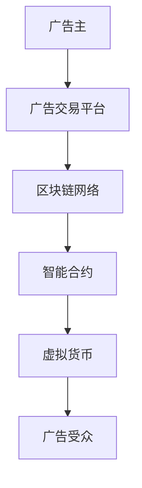

                 


### 引言

#### 1.1 问题背景

##### 1.1.1 数字广告市场现状

随着互联网的普及和移动设备的广泛使用，数字广告已成为现代营销的重要组成部分。根据Statista的数据，全球数字广告市场的规模在2021年已经达到了4298亿美元，预计到2025年将达到近6300亿美元。广告主和企业纷纷将营销预算从传统媒体转向数字渠道，以获取更精准的用户定位和更高的投资回报率。

然而，数字广告市场也面临着一系列问题。广告欺诈、数据隐私泄露和广告透明度不足是当前数字广告行业的主要挑战。广告欺诈包括点击欺诈、展示欺诈和虚假流量等，导致广告主浪费大量资金。数据隐私问题则源于广告网络和第三方数据公司收集的用户数据被滥用，导致用户隐私受到侵犯。广告透明度不足使得广告主难以追踪广告效果，无法准确评估广告投入的回报率。

##### 1.1.2 区块链技术在广告行业中的应用趋势

区块链技术以其去中心化、透明性和不可篡改的特点，为解决数字广告行业的问题提供了一种可能的解决方案。近年来，越来越多的广告公司和科技企业开始探索区块链在数字广告中的应用。例如，Chainlink和TomoChain等区块链平台已经开发出了用于广告投放和跟踪的解决方案，通过智能合约和分布式账本技术，提高了广告投放的透明度和安全性。

根据Deloitte的报告，到2025年，区块链在广告行业的应用有望大幅增长，推动市场向更高效、更透明的方向发展。区块链技术不仅可以减少广告欺诈，还能增强用户数据隐私保护，提高广告透明度和效果追踪能力。

##### 1.1.3 书籍目的与读者对象

本书旨在深入探讨区块链在数字广告中的应用，特别是去中心化广告交易平台。通过本书，读者可以了解区块链技术的核心原理，掌握去中心化广告交易平台的运作机制，理解区块链在广告投放、广告跟踪和广告效果评估等方面的应用。

本书面向的读者包括：

1. 广告行业从业者，包括广告公司、广告主和广告代理。
2. 区块链技术爱好者，对区块链在数字广告中的应用感兴趣。
3. 营销和广告专业的学生，希望了解数字广告行业的最新发展和技术趋势。

通过阅读本书，读者不仅可以获得丰富的理论知识，还能掌握实际操作技能，为未来在数字广告领域的发展奠定基础。

### 核心概念

#### 1.2.1 区块链

##### 1.2.1.1 区块链的定义

区块链是一种去中心化的分布式数据库技术，通过密码学算法确保数据的安全性和不可篡改性。它由一系列按时间顺序排列的“区块”组成，每个区块都包含了若干交易记录，并通过加密技术连接在一起，形成一个不可分割的链条。

区块链的去中心化特性意味着数据不存储在单一服务器上，而是分布在网络中的多个节点上，每个节点都维护一份完整的账本。这种分布式结构使得区块链能够实现去中心化的信任机制，不需要中央权威机构来验证交易。

##### 1.2.1.2 区块链的工作原理

区块链的工作原理可以分为以下几个步骤：

1. **交易发起**：用户在网络中发起一笔交易，例如购买商品或服务。
2. **交易验证**：多个节点对交易进行验证，确保交易符合区块链的规则，例如金额是否足够、交易双方是否一致等。
3. **区块生成**：一旦交易验证通过，节点会将这些交易打包成一个区块，并添加到区块链中。
4. **区块传播**：新的区块会被生成节点广播到整个网络，其他节点会接收并验证该区块。
5. **区块确认**：当大多数节点确认区块的有效性后，该区块将被永久添加到区块链中。

##### 1.2.1.3 区块链的关键特点

区块链具有以下几个关键特点：

1. **去中心化**：区块链通过分布式网络实现数据存储和交易验证，不需要中央权威机构。
2. **透明性**：区块链上的所有交易记录都是公开透明的，任何人都可以查看。
3. **不可篡改性**：一旦数据被记录到区块链中，就很难被篡改或删除，确保了数据的安全性和可信度。
4. **安全性**：区块链使用加密技术保护数据，确保交易不被未经授权的第三方访问。
5. **智能合约**：区块链上的智能合约能够自动执行预定条件下的交易，提高了交易的效率和安全性。

#### 1.2.2 数字广告

##### 1.2.2.1 数字广告的定义

数字广告是指通过互联网或数字设备展示的广告形式，包括搜索引擎广告、展示广告、视频广告、社交媒体广告等。数字广告的主要特点是可以实现精准的用户定位和效果追踪，帮助企业更有效地进行营销活动。

##### 1.2.2.2 数字广告的类型与形式

数字广告的类型和形式多种多样，主要包括：

1. **搜索引擎广告**：通过付费竞价的方式，在搜索引擎结果页展示广告，如Google Ads。
2. **展示广告**：在网页或应用程序上展示的图形广告，如横幅广告、弹窗广告等。
3. **视频广告**：在视频播放前、中或后展示的广告，如YouTube广告。
4. **社交媒体广告**：在社交媒体平台上展示的广告，如Facebook广告、Instagram广告等。

##### 1.2.2.3 数字广告的价值链

数字广告的价值链包括以下几个主要环节：

1. **广告主**：需要推广产品或服务的公司或个人，他们负责制定广告策略、设计广告内容和分配广告预算。
2. **广告平台**：提供广告展示空间和广告投放技术支持的平台，如Google AdWords、Facebook Ads等。
3. **广告代理**：帮助广告主策划、执行和优化广告活动的专业机构，提供策略咨询、创意设计和效果评估等服务。
4. **广告受众**：看到广告并可能进行互动的用户，他们是广告主营销目标的重要对象。
5. **广告数据公司**：收集、分析和提供广告相关数据的第三方机构，帮助广告主和广告平台优化广告投放策略。

### 去中心化广告交易平台概述

#### 1.3.1 去中心化广告交易平台的定义

去中心化广告交易平台是一种基于区块链技术的广告交易平台，通过去中心化的方式实现广告投放、广告跟踪和广告交易。与传统广告交易平台相比，去中心化广告交易平台具有更高的透明度、安全性和效率。

去中心化广告交易平台的核心思想是将广告交易过程中的各个参与方，如广告主、广告平台、广告代理和广告受众，通过区块链技术连接起来，形成一个无需中介的生态系统。在这个生态系统中，所有交易都是公开透明的，每个参与方都可以追踪和管理自己的广告活动。

#### 1.3.2 去中心化广告交易平台的优势

去中心化广告交易平台具有以下几个显著优势：

1. **去中心化**：通过区块链技术实现去中心化，减少了对中心化中介机构的依赖，降低了交易成本。
2. **透明性**：所有交易记录都记录在区块链上，公开透明，有助于提高广告投放和广告交易的透明度。
3. **安全性**：区块链技术的加密机制确保了交易数据的安全性和不可篡改性，有效防止了广告欺诈和数据泄露。
4. **高效性**：去中心化广告交易平台能够实现快速、高效的广告投放和广告跟踪，提高了广告投放的效率。
5. **用户隐私保护**：去中心化广告交易平台能够更好地保护用户的隐私，避免用户数据被第三方滥用。

#### 1.3.3 去中心化广告交易平台的关键特性

去中心化广告交易平台的关键特性包括：

1. **智能合约**：智能合约是区块链上的自动执行代码，可以用于自动化广告投放和广告交易，提高了交易的效率和准确性。
2. **去中心化数据管理**：去中心化广告交易平台通过分布式账本技术管理用户数据，确保数据的透明性和安全性。
3. **奖励机制**：通过区块链技术实现奖励机制，激励参与者参与广告交易，提高平台的活跃度。
4. **透明审计**：区块链上的所有交易记录都可以进行透明审计，有助于提高广告交易的透明度。

### 总结

在本章中，我们介绍了区块链和数字广告的基本概念，分析了数字广告市场面临的挑战，并探讨了区块链技术如何应用于数字广告领域。通过引入去中心化广告交易平台，我们了解了其定义、优势以及关键特性。在接下来的章节中，我们将进一步探讨区块链在广告投放、广告跟踪和广告效果评估等方面的具体应用，并通过案例分析深入了解去中心化广告交易平台的实际运作机制。

## 2.1 区块链在广告投放与跟踪中的运用

### 2.1.1 区块链如何提高广告投放效率

区块链技术在广告投放中具有显著的效率提升潜力。首先，区块链的去中心化特性使得广告投放不再依赖于单一的中心化平台，从而避免了传统广告投放过程中由于中介环节过多导致的低效问题。通过去中心化，广告主可以直接与广告平台和广告受众进行交易，减少了不必要的中间环节，从而提高了广告投放的效率。

其次，区块链上的智能合约技术为广告投放提供了自动化的解决方案。智能合约是预先编写好的代码，可以在满足特定条件时自动执行。例如，广告主可以设定广告投放的预算上限和投放时间，当达到预算上限或特定时间点时，智能合约会自动停止广告投放，从而避免了人工操作的不确定性。这种自动化的投放方式不仅提高了效率，还减少了人工干预可能带来的错误。

此外，区块链上的透明性和不可篡改性也为提高广告投放效率提供了保障。区块链上的所有交易记录都是公开透明的，广告主和广告平台可以实时查看广告投放的数据，如投放量、点击率、转化率等。这种透明性使得广告主可以更准确地了解广告投放的效果，从而进行更加精准的投放策略调整。同时，由于区块链上的数据具有不可篡改性，广告主可以确信广告投放的数据是真实可信的，避免了数据造假或篡改的问题。

具体来说，区块链技术在广告投放中的效率提升体现在以下几个方面：

1. **减少中介环节**：去中心化广告交易平台减少了广告主与广告平台之间的中介环节，直接进行交易，提高了广告投放的效率。
2. **自动化投放**：智能合约技术实现了广告投放的自动化，减少了人工操作的时间和错误。
3. **实时数据分析**：区块链上的透明性使得广告主可以实时查看广告投放的数据，进行更精准的投放策略调整。
4. **提高数据可信度**：区块链上的数据不可篡改性确保了广告投放数据的真实性和可信度，避免了数据造假或篡改的问题。

### 2.1.2 数据透明性

数据透明性是区块链技术在广告投放中的另一大优势。在传统的广告投放体系中，数据的透明度往往较低，广告主难以准确了解广告投放的效果。而区块链技术的引入，通过其分布式账本和智能合约机制，大大提高了广告数据的透明度。

首先，区块链上的所有交易记录都是公开透明的，任何人都可以查看。这意味着广告主可以实时查看广告投放的数据，如投放量、点击率、转化率等。这种透明性使得广告主可以更准确地了解广告投放的效果，从而进行更加精准的投放策略调整。

其次，区块链上的智能合约能够确保广告投放数据的真实性和准确性。智能合约是预先编写好的代码，可以在满足特定条件时自动执行。例如，当广告投放达到特定点击率或转化率时，智能合约会自动触发相应的奖励机制，发放奖励给广告主。这种自动化和透明化的奖励机制，不仅提高了广告投放的效率，还确保了奖励发放的公正性和透明性。

此外，区块链上的数据透明性也有助于提高广告市场的信任度。由于所有交易记录都是公开透明的，广告主和广告平台之间的信任关系得以加强。广告主可以确信广告投放的数据是真实可信的，而广告平台也可以公开透明地展示其广告投放的效果，从而赢得广告主的信任。

### 2.1.3 安全性与隐私保护

区块链技术在广告投放中的安全性和隐私保护也是其重要优势之一。传统的广告投放体系容易受到黑客攻击和数据泄露的威胁，而区块链技术通过其特有的加密机制和分布式账本结构，为广告数据提供了更高的安全性。

首先，区块链使用加密技术保护数据。在区块链上，所有交易记录都会被加密存储，只有拥有正确私钥的用户才能解密和查看。这种加密机制确保了交易数据在存储和传输过程中的安全性，防止了未经授权的第三方访问。

其次，区块链的分布式账本结构也提高了数据的安全性。区块链上的数据不是存储在单一服务器上，而是分布在网络中的多个节点上。这意味着即使某个节点被攻击或数据被篡改，其他节点仍然可以保持数据的完整性，从而确保了数据的安全性和不可篡改性。

此外，区块链技术还为广告数据的隐私保护提供了可能。在传统广告投放体系中，广告主和广告平台往往需要收集大量用户数据，这容易导致用户隐私泄露。而区块链技术可以通过分布式账本和智能合约机制，实现数据的匿名化和隐私保护。例如，广告主可以通过区块链上的智能合约，自动执行广告投放任务，而无需直接接触用户数据，从而降低了隐私泄露的风险。

总的来说，区块链技术在广告投放中的安全性和隐私保护优势体现在以下几个方面：

1. **加密机制**：通过加密技术保护交易数据，防止未经授权的访问。
2. **分布式账本**：通过分布式账本结构提高数据的安全性，防止数据被篡改。
3. **匿名化**：通过区块链实现数据的匿名化，降低用户隐私泄露的风险。

### 2.1.4 智能合约在广告投放中的应用

智能合约是区块链技术的一个重要应用，其在广告投放中具有广泛的应用前景。智能合约是一种自动执行合同条款的计算机协议，其执行过程不受人为干预，具有高效、安全、透明等特点。

首先，智能合约可以用于广告投放的预算管理。广告主可以在智能合约中设定广告投放的预算上限和投放时间，一旦达到预算上限或特定时间点，智能合约会自动停止广告投放。这种自动化的预算管理方式，不仅提高了广告投放的效率，还减少了人工干预可能带来的错误。

其次，智能合约可以用于广告投放的精准投放。广告主可以在智能合约中设定投放条件，例如特定用户群体的地理位置、兴趣爱好、购买行为等。当用户满足这些条件时，智能合约会自动触发广告投放，从而实现了精准投放。这种精准投放方式，有助于提高广告的转化率和效果。

此外，智能合约还可以用于广告投放的效果追踪。广告主可以在智能合约中设定广告投放的目标，例如点击率、转化率等。当广告投放达到特定目标时，智能合约会自动触发相应的奖励机制，发放奖励给广告主。这种自动化的效果追踪和奖励机制，不仅提高了广告投放的效率，还确保了奖励发放的公正性和透明性。

总的来说，智能合约在广告投放中的应用，实现了广告投放的自动化、精准化和效果追踪，大大提高了广告投放的效率和效果。

### 2.1.5 区块链在广告跟踪中的优势

区块链技术在广告跟踪中具有显著的不可替代优势，主要表现在以下几个方面：

首先，区块链技术的不可篡改性确保了广告跟踪数据的真实性和可信度。在传统广告跟踪系统中，数据容易被篡改或操纵，导致广告主难以准确评估广告投放的效果。而区块链上的数据一旦被记录，就几乎无法被篡改，广告主可以确信广告跟踪数据的真实性。

其次，区块链技术的透明性使得广告跟踪过程更加公开透明。所有广告投放和跟踪数据都记录在区块链上，任何人都可以查看。这种透明性不仅提高了广告投放的透明度，还增强了广告主和广告平台之间的信任。

此外，区块链技术的实时性优势也使得广告跟踪更加高效。广告主可以实时查看广告投放的数据，包括点击率、转化率、投放量等，及时调整广告策略，提高广告效果。这与传统广告跟踪系统的滞后性相比，具有明显的优势。

最后，区块链技术的分布式结构确保了广告跟踪的全面性和准确性。广告跟踪数据分布在网络中的多个节点上，任何一个节点都无法单独篡改数据，从而保证了数据的完整性和准确性。

总的来说，区块链在广告跟踪中的优势体现在数据真实性、透明性、实时性和分布式结构等方面，这些优势不仅提高了广告跟踪的效率和效果，还增强了广告主对广告投放的信心。

### 2.1.6 实时性

实时性是区块链技术在广告跟踪中的一大优势。在传统广告跟踪系统中，由于数据的传输和处理需要通过中心化服务器，往往存在延时问题。例如，点击数据可能在数分钟甚至数小时后才会被记录和汇总，导致广告主无法实时了解广告投放的效果，从而难以及时调整广告策略。

而区块链技术的引入，通过其分布式账本和点对点传输机制，实现了广告数据的实时记录和传输。一旦用户发生点击或其他互动行为，相关数据会立即被记录在区块链上，并通过网络广播到所有节点。这意味着广告主可以实时查看广告投放的数据，包括点击率、转化率、投放量等，从而实现即时的数据分析和策略调整。

这种实时性的优势不仅提高了广告跟踪的效率，还大大增强了广告投放的灵活性。广告主可以根据实时数据，快速响应市场变化，优化广告投放策略，提高广告效果。此外，实时性也有助于发现和解决广告投放中的问题，如点击欺诈、数据错误等，确保广告数据的准确性和有效性。

总的来说，区块链技术的实时性优势，为广告主提供了更加高效和灵活的广告跟踪手段，有助于提升广告投放的整体效果。

### 2.1.7 可追溯性

可追溯性是区块链技术的一大核心优势，在广告跟踪中的应用尤为显著。区块链通过其分布式账本和加密技术，确保了广告投放和跟踪数据的完整性和可追溯性。

首先，区块链上的所有交易记录都是公开透明的，任何人都可查询。这意味着广告主可以随时查看广告投放的详细数据，包括投放时间、投放量、点击次数、转化率等。这种透明性使得广告主能够清晰地了解广告投放的全过程，避免了数据丢失或篡改的风险。

其次，区块链上的数据具有不可篡改性。一旦数据被记录到区块链上，就几乎无法被修改或删除。这种特性确保了广告跟踪数据的真实性和可信度，广告主可以确信数据的准确性和完整性。

此外，区块链技术的分布式结构也增强了数据的可追溯性。广告跟踪数据不是存储在单一服务器上，而是分布在网络中的多个节点上。这意味着任何试图篡改数据的行为都会被其他节点检测到，从而保证了数据的可靠性和安全性。

总的来说，区块链技术的可追溯性优势，不仅提高了广告跟踪的透明度和可信度，还增强了广告主对广告投放过程的掌控能力，有助于提高广告投放的整体效果。

### 2.1.8 防欺诈性

区块链技术在广告跟踪中的防欺诈性优势尤为突出。在传统的广告跟踪体系中，点击欺诈和数据造假问题一直困扰着广告主和广告平台。而区块链技术的引入，通过其独特的机制，有效防止了这些欺诈行为。

首先，区块链上的所有交易记录都是公开透明的，任何人都可查询。这意味着广告主和广告平台可以实时监控广告投放的数据，包括点击次数、转化率等。这种透明性使得点击欺诈等欺诈行为无处遁形，广告主可以及时发现和防范。

其次，区块链的加密技术确保了数据的安全性和不可篡改性。一旦数据被记录到区块链上，就几乎无法被修改或删除。这种特性确保了广告跟踪数据的真实性和可信度，避免了数据造假的问题。

此外，区块链技术的分布式结构也提高了防欺诈性。广告跟踪数据不是存储在单一服务器上，而是分布在网络中的多个节点上。这意味着任何试图篡改数据的行为都会被其他节点检测到，从而确保了数据的完整性和准确性。

总的来说，区块链技术的防欺诈性优势，不仅提高了广告跟踪的透明度和可信度，还增强了广告主对广告投放过程的信任，有助于构建一个更加公平和透明的广告市场环境。

### 案例分析

#### 2.2.1 去中心化广告平台的发展历程

去中心化广告平台的发展历程可以追溯到区块链技术的兴起。2008年，中本聪发布了比特币白皮书，首次提出了区块链技术的概念。随后，比特币的诞生标志着区块链技术的正式诞生。随着区块链技术的不断发展，越来越多的研究者开始探索其应用场景。

2017年，以太坊的推出进一步推动了区块链技术的发展。以太坊不仅提供了一个去中心化的加密货币平台，还支持智能合约的编写和执行，为去中心化广告平台的发展提供了基础。同年，Chainlink平台发布了第一个去中心化广告解决方案，标志着区块链技术在广告行业中的应用正式起步。

2018年，TomoChain推出了Tomo ads，这是一个基于区块链的去中心化广告平台，旨在解决传统广告平台中的数据隐私和透明度问题。Tomo ads通过智能合约实现了广告投放、广告跟踪和广告交易的去中心化，为广告主和广告平台提供了一个更加透明和高效的广告生态系统。

2020年，随着DeFi（去中心化金融）的兴起，去中心化广告平台的发展进入了一个新的阶段。例如，Avalara和Synthetix等平台开始推出去中心化广告产品，利用区块链技术提高广告投放的透明度和效率。

#### 2.2.2 去中心化广告平台的优势与挑战

去中心化广告平台的优势主要体现在以下几个方面：

1. **数据隐私保护**：去中心化广告平台通过区块链技术，确保用户数据的匿名化和隐私保护。用户数据不会集中存储在单一服务器上，而是分布在网络中的多个节点，从而减少了数据泄露的风险。

2. **透明性和可信度**：区块链上的所有交易记录都是公开透明的，任何人都可以查看。这种透明性使得广告主可以更准确地了解广告投放的效果，提高了广告投放的透明度和可信度。

3. **降低交易成本**：去中心化广告平台减少了传统广告交易中的中介环节，降低了交易成本。广告主可以直接与广告平台和广告受众进行交易，避免了中间商的利润抽成。

4. **自动化和效率**：智能合约技术的应用实现了广告投放的自动化，提高了广告投放的效率。广告主可以在智能合约中设定广告投放的条件和预算，确保广告投放的自动化和高效。

然而，去中心化广告平台也面临一些挑战：

1. **技术成熟度**：虽然区块链技术已经取得了一定的进展，但其应用场景和技术的成熟度仍有待提高。特别是在大规模商用场景中，区块链技术的性能和可靠性仍需进一步验证。

2. **市场接受度**：去中心化广告平台作为一种新兴技术，其市场接受度仍有待提高。广告主和广告平台需要时间去了解和适应这种新的广告投放模式。

3. **法律法规**：区块链技术在广告行业中的应用需要遵守相关的法律法规。不同国家和地区的法律法规对区块链技术的监管程度不同，这可能对去中心化广告平台的发展带来一定的挑战。

4. **用户体验**：虽然去中心化广告平台在技术层面具有优势，但在用户体验方面仍需改进。例如，用户在浏览网页时可能会遇到广告加载速度慢、操作复杂等问题，这可能会影响用户的体验。

总的来说，去中心化广告平台在广告行业中具有巨大的潜力，但其发展仍面临一些挑战。随着技术的不断进步和市场接受度的提高，去中心化广告平台有望在未来广告行业中发挥重要作用。

### 成功案例分析

#### 2.2.3 Case Study 1: Chainlink

Chainlink是一个去中心化广告平台，它利用区块链技术和智能合约，实现了广告投放、广告跟踪和广告交易的去中心化。Chainlink的核心优势在于其可扩展性和透明性，使得广告主和广告平台能够以更低的成本、更高的效率进行广告投放。

1. **技术实现**：Chainlink基于以太坊区块链构建，使用了智能合约来管理广告投放和广告交易。广告主可以通过智能合约设定广告投放的条件和预算，平台和广告受众通过智能合约进行广告投放和广告点击的交易。

2. **应用场景**：Chainlink被广泛应用于数字营销、广告投放和效果追踪。它支持多种广告形式，如展示广告、视频广告、社交媒体广告等，为广告主提供了灵活的广告投放解决方案。

3. **效果评估**：Chainlink的透明性和实时性使得广告主能够实时监控广告投放效果，包括点击率、转化率等。通过智能合约的自动执行，广告主可以确保广告投放的预算和使用效果，提高了广告投放的效率和效果。

4. **市场反馈**：Chainlink在市场上得到了广泛的认可，许多广告主和广告平台开始使用其服务。Chainlink的用户反馈普遍积极，用户认为其透明性、效率和低成本是其主要优势。

#### 2.2.4 Case Study 2: TomoChain

TomoChain是另一个成功的去中心化广告平台，它专注于解决广告行业中的数据隐私和透明度问题。TomoChain利用区块链技术和分布式账本，实现了广告投放、广告跟踪和广告交易的去中心化和透明化。

1. **技术实现**：TomoChain基于自己的区块链平台构建，使用了高效的去中心化共识算法，确保了系统的性能和安全性。TomoChain通过智能合约实现了广告投放和广告交易的自动化，提高了广告投放的效率。

2. **应用场景**：TomoChain被广泛应用于数字广告、社交媒体广告和内容营销等领域。它支持多种广告形式，如展示广告、视频广告、社交媒体广告等，为广告主提供了多样化的广告投放解决方案。

3. **效果评估**：TomoChain的透明性和实时性使得广告主能够实时监控广告投放效果，包括点击率、转化率等。通过智能合约的自动执行，广告主可以确保广告投放的预算和使用效果，提高了广告投放的效率和效果。

4. **市场反馈**：TomoChain在市场上得到了广泛的认可，许多广告主和广告平台开始使用其服务。用户反馈普遍积极，用户认为其透明性、效率和低成本是其主要优势。

### 总结

通过以上案例分析，我们可以看到去中心化广告平台在数字广告行业中的成功应用。Chainlink和TomoChain等平台利用区块链技术和智能合约，实现了广告投放、广告跟踪和广告交易的去中心化和透明化，为广告主和广告平台提供了高效、安全的广告解决方案。这些平台在市场上得到了广泛的认可，用户反馈普遍积极，展示了区块链技术在数字广告中的巨大潜力。

## 2.3 技术实现

#### 2.3.1 区块链在广告交易中的技术架构

区块链在广告交易中的应用，涉及到多个技术组件的协同工作。以下是对区块链在广告交易中的技术架构的详细分析：

1. **区块链网络架构**：区块链网络是广告交易的基础，它由多个节点组成，每个节点都维护一份完整的区块链账本。节点之间通过加密通信，实现数据的传输和验证。在广告交易中，区块链网络负责记录所有广告投放和点击行为，确保数据的透明性和不可篡改性。

2. **智能合约设计**：智能合约是区块链上的自动执行代码，用于管理广告交易的各种逻辑。广告主可以在智能合约中设定广告投放的条件和预算，广告平台和广告受众则通过智能合约执行广告投放和点击行为。智能合约的设计和实现，是确保广告交易自动化和高效性的关键。

3. **虚拟货币的作用**：虚拟货币（如比特币、以太币等）在区块链广告交易中起到了支付手段的作用。广告主可以通过虚拟货币支付广告投放费用，广告平台和广告受众则通过虚拟货币获得广告收益。虚拟货币的去中心化特性，使得交易过程中不再需要依赖中心化的支付系统，提高了交易的效率和安全。

#### 2.3.2 技术架构图

为了更好地理解区块链在广告交易中的技术架构，我们可以通过以下技术架构图进行展示：



- **广告主（A）**：广告主通过广告交易平台（B）设定广告投放条件和预算，智能合约（D）负责执行广告投放逻辑，并通过虚拟货币（E）进行支付。
- **广告交易平台（B）**：广告交易平台作为中介，连接广告主和区块链网络，提供广告投放管理和服务。
- **区块链网络（C）**：区块链网络负责记录所有广告投放和点击行为，确保数据的透明性和不可篡改性。
- **智能合约（D）**：智能合约负责管理广告投放的逻辑，确保广告投放的自动化和高效性。
- **虚拟货币（E）**：虚拟货币作为支付手段，在广告交易中发挥重要作用。
- **广告受众（F）**：广告受众通过区块链网络（C）查看和参与广告投放，通过智能合约（D）获得广告收益。

#### 2.3.3 技术实现细节

1. **广告投放流程**：
   - 广告主通过广告交易平台（B）设定广告投放条件，如投放时间、投放预算等。
   - 广告交易平台（B）将广告主的信息发送到区块链网络（C），并在智能合约（D）中记录广告投放信息。
   - 智能合约（D）根据设定的广告投放条件，自动执行广告投放逻辑，并向广告平台和广告受众发布广告。

2. **广告点击行为**：
   - 广告受众通过区块链网络（C）查看和参与广告投放，当点击广告时，区块链网络（C）记录点击行为。
   - 智能合约（D）根据广告点击行为，自动计算广告收益，并将虚拟货币（E）支付给广告平台和广告受众。

3. **虚拟货币支付**：
   - 广告主通过虚拟货币钱包支付广告投放费用，虚拟货币（E）会自动转移到广告平台和广告受众的账户中。
   - 智能合约（D）负责确保虚拟货币支付的准确性和安全性，避免虚假交易和恶意行为。

总的来说，区块链在广告交易中的技术实现，通过智能合约和虚拟货币的引入，实现了广告投放、广告点击和广告收益的自动化和高效化，提高了广告交易的透明度和安全性。

### 2.3.4 技术挑战与解决方案

在区块链广告交易中，技术挑战主要集中在数据隐私保护、扩容与性能优化以及跨链技术等方面。以下将详细分析这些挑战以及相应的解决方案。

#### 2.3.4.1 数据隐私保护

**挑战**：
区块链上的所有数据都是公开透明的，这在一定程度上可能会泄露用户隐私。广告交易涉及大量的用户数据，如浏览习惯、兴趣爱好等，这些数据的公开可能会侵犯用户的隐私权。

**解决方案**：
1. **零知识证明（Zero-Knowledge Proof）**：零知识证明是一种加密技术，它允许证明某个陈述为真，而无需透露任何具体信息。在广告交易中，零知识证明可以用于证明用户数据的有效性，而无需公开具体数据。
2. **同态加密（Homomorphic Encryption）**：同态加密允许在加密数据上进行计算，而不需要解密。这样，广告交易过程中的数据处理可以在加密状态下进行，从而保护用户隐私。
3. **匿名交易**：通过设计匿名交易机制，如比特币的混合交易（CoinJoin），可以隐藏交易参与者的身份，提高数据隐私保护。

#### 2.3.4.2 扩容与性能优化

**挑战**：
区块链在处理大量交易时，可能会出现性能瓶颈。特别是在广告交易中，随着广告投放量和用户互动的增加，区块链的扩容和性能优化成为关键问题。

**解决方案**：
1. **分片技术（Sharding）**：分片技术可以将区块链网络划分为多个独立的子网络（分片），每个分片处理一部分交易。这样可以分散交易负载，提高区块链的处理能力。
2. **状态通道（State Channels）**：状态通道是一种离链交易机制，允许用户在链下进行多次交易，然后将最终结果提交到链上。这样可以减少链上交易量，提高性能。
3. **跨链技术**：跨链技术可以实现不同区块链之间的交易和互操作。通过跨链，广告交易可以扩展到多个区块链上，从而提高整体性能。

#### 2.3.4.3 跨链技术

**挑战**：
广告交易涉及多个区块链平台和资产，如何实现不同区块链之间的互操作成为技术难题。

**解决方案**：
1. **跨链桥（Cross-Chain Bridge）**：跨链桥是一种连接不同区块链的技术，它允许资产在区块链之间自由转移。通过跨链桥，广告交易可以在多个区块链上进行，提高交易的灵活性和扩展性。
2. **原子交换（Atomic Swap）**：原子交换是一种在两个不同区块链之间交换加密货币的技术，它通过智能合约实现交易，确保交换过程的安全性和可靠性。
3. **标准协议**：制定统一的跨链标准协议，如ERC-20、BTC-20等，可以简化不同区块链之间的互操作，提高系统的兼容性和稳定性。

总的来说，通过数据隐私保护、扩容与性能优化以及跨链技术的解决方案，区块链在广告交易中的应用面临的技术挑战可以得到有效应对，为去中心化广告交易平台的发展提供了坚实的支持。

### 2.3.5 技术实现的具体案例

为了更好地理解区块链在广告交易中的技术实现，我们可以通过一个具体的案例进行讲解。

#### 案例背景

假设有一家广告公司（广告主）希望在去中心化广告平台上投放广告，目标用户是喜欢阅读科技类文章的用户。该广告公司将使用智能合约和区块链技术来实现广告投放、广告跟踪和广告收益分配。

#### 技术实现步骤

1. **智能合约设计**：
   - 广告公司编写一个智能合约，设定广告投放的条件和预算。智能合约中包含以下关键信息：
     - 广告投放目标：科技类文章的读者。
     - 广告投放时间：持续一周。
     - 预算：1000个虚拟货币单位。
     - 点击奖励：每次点击奖励10个虚拟货币单位。
   - 智能合约通过加密技术保护广告公司的隐私，确保只有合法的用户和广告平台可以访问。

2. **区块链网络部署**：
   - 在去中心化广告平台上部署区块链网络，包括多个节点。节点负责记录广告投放和点击行为，确保数据的透明性和不可篡改性。
   - 广告公司通过广告交易平台将智能合约上传到区块链网络，并在平台上发布广告。

3. **广告投放**：
   - 当用户浏览科技类文章时，广告系统会自动识别用户兴趣，并根据智能合约条件展示广告。
   - 用户点击广告后，区块链网络会记录点击行为，并将点击次数反馈给广告公司。

4. **广告跟踪**：
   - 广告公司可以通过区块链网络实时查看广告投放数据和点击率，确保广告投放的效果。
   - 智能合约根据点击次数自动计算广告收益，并将虚拟货币支付给广告公司。

5. **广告收益分配**：
   - 广告公司可以将广告收益分配给参与广告投放的平台和用户。智能合约可以设定奖励机制，例如，每次点击奖励10个虚拟货币单位，用户可以通过参与广告互动获得收益。

#### 技术细节

1. **智能合约代码**（使用Solidity编写）：

```solidity
pragma solidity ^0.8.0;

contract AdPlatform {
    address public owner;
    mapping(address => uint) public balances;

    constructor() {
        owner = msg.sender;
    }

    function advertise() external payable {
        require(msg.value == 1000, "广告投放金额不足");
        balances[owner] += msg.value;
    }

    function clickAd(address _user) external {
        require(msg.sender != _user, "禁止用户自点击");
        balances[_user] += 10;
    }

    function withdraw() external {
        require(msg.sender == owner, "非广告主无法提现");
        owner.transfer(balances[owner]);
        balances[owner] = 0;
    }
}
```

2. **区块链网络**：
   - 节点通过加密通信记录广告投放和点击行为，确保数据的安全性和透明性。
   - 用户和广告平台可以通过区块链浏览器查看广告投放和点击数据。

#### 案例总结

通过以上案例，我们可以看到区块链在广告交易中的技术实现过程。广告公司通过智能合约设定广告投放条件和预算，用户通过区块链网络参与广告互动，广告平台记录和反馈广告投放数据。这种去中心化的广告交易模式，提高了广告投放的透明度、安全性和效率，为广告行业带来了新的发展机遇。

### 2.3.6 技术实现总结

区块链在广告交易中的技术实现，通过智能合约、区块链网络和虚拟货币的协同工作，实现了广告投放、广告跟踪和广告收益分配的自动化和高效化。智能合约负责管理广告投放和点击行为，区块链网络确保数据的透明性和不可篡改性，虚拟货币作为支付手段提高了交易的便捷性和安全性。通过上述案例，我们可以看到区块链技术在广告交易中的应用前景，为去中心化广告交易平台的发展提供了坚实的技术基础。

## 3.1 挑战

### 3.1.1 法规与监管

区块链在数字广告行业中的应用面临诸多挑战，其中法规与监管问题尤为突出。不同国家和地区的法律法规对区块链技术和去中心化广告平台的态度存在差异，这给区块链广告交易平台的合规性带来了巨大挑战。

首先，各国对区块链技术的监管程度不同。一些国家如美国和欧洲，对区块链技术的监管较为严格，要求平台必须遵守相关法律法规，确保广告投放和交易的合规性。例如，美国的《联邦通信法》和《广告法》对广告内容、广告投放和广告效果评估等方面都有详细的规定。这些法规要求广告主和广告平台必须提供真实、准确的信息，确保广告投放的透明度和可信度。

相比之下，一些发展中国家对区块链技术的监管相对宽松。这可能为去中心化广告交易平台提供了更广阔的发展空间，但也增加了合规性风险。在监管较为宽松的国家，区块链广告交易平台可能面临法律风险，需要特别注意遵守当地的法律法规。

其次，区块链广告交易平台面临的监管挑战还包括数据隐私和用户保护。根据《通用数据保护条例》（GDPR）等法律法规，数据处理者必须确保用户数据的安全性和隐私保护。区块链上的所有交易记录都是公开透明的，这在一定程度上可能侵犯用户的隐私权。为了应对这一挑战，区块链广告交易平台需要采取一系列技术措施，如零知识证明、同态加密等，确保用户数据的隐私性和安全性。

此外，区块链广告交易平台还需要与监管机构保持紧密沟通，及时了解和遵守当地法律法规的变化。监管机构可能会对区块链广告交易平台提出新的合规要求，例如数据存储、交易记录审计等。平台需要积极回应这些要求，确保业务的合规性。

总之，法规与监管问题是区块链在数字广告行业应用中面临的一大挑战。为了应对这一挑战，区块链广告交易平台需要深入了解各国法律法规，采取技术措施保护用户隐私，并与监管机构保持良好的沟通，确保业务的合规性和可持续发展。

#### 3.1.2 技术问题

区块链技术在数字广告行业中的应用虽然具有诸多优势，但也面临一系列技术问题，主要包括安全性问题、性能与可扩展性问题等。

首先，安全性问题是区块链技术面临的一个重大挑战。尽管区块链通过加密算法确保数据的不可篡改性和安全性，但在实际应用中，区块链系统仍然可能受到网络攻击。例如，51%攻击是一种常见的区块链攻击方式，攻击者通过控制大部分节点，篡改区块链上的交易记录。这种攻击方式对去中心化广告交易平台的安全构成严重威胁。此外，智能合约本身也存在潜在的安全隐患。由于智能合约是自动执行代码，一旦出现漏洞，攻击者可能通过恶意代码获取大量资金。因此，如何确保区块链系统的安全性和智能合约的可靠性，是区块链广告交易平台需要重点解决的问题。

其次，性能与可扩展性问题是另一个关键挑战。区块链技术在处理大量交易时，可能存在性能瓶颈。例如，比特币和以太坊等主流区块链平台在高峰时段的交易处理速度较慢，这会影响广告投放和广告跟踪的实时性。对于去中心化广告交易平台来说，高吞吐量和低延迟是关键需求。为了提高区块链的性能和可扩展性，可以采用以下几种技术方案：

1. **分片技术**：分片技术将区块链网络划分为多个独立的子网络，每个子网络处理一部分交易。这样可以分散交易负载，提高系统的吞吐量。例如，以太坊2.0就采用了分片技术，以实现更高的可扩展性。
2. **状态通道**：状态通道是一种离链交易机制，允许用户在链下进行多次交易，然后将最终结果提交到链上。通过状态通道，可以减少链上交易量，提高交易速度。
3. **跨链技术**：跨链技术可以实现不同区块链之间的交易和互操作。通过跨链，广告交易可以扩展到多个区块链上，从而提高整体性能。例如，通过跨链桥，可以实现比特币和以太坊之间的资产转移。

此外，区块链广告交易平台还需要解决数据隐私保护问题。由于区块链上的所有交易记录都是公开透明的，这在一定程度上可能侵犯用户的隐私权。为了应对这一挑战，可以采用零知识证明、同态加密等技术，实现数据的隐私保护和匿名化。

总之，尽管区块链技术在数字广告行业中的应用前景广阔，但其安全性、性能和可扩展性等方面仍面临诸多挑战。通过采用先进的技术方案，积极解决这些问题，区块链广告交易平台有望实现更高的效率和安全性。

#### 3.1.3 市场接受度

区块链在数字广告行业中的应用也面临着市场接受度的挑战。尽管区块链技术具有去中心化、透明性和安全性等优势，但广告主和广告平台对于这一新兴技术的接受程度仍然较低。

首先，广告主和广告平台对于区块链技术的了解程度有限。许多广告主和广告平台对区块链技术的原理和应用场景不够熟悉，担心无法有效利用这一技术，从而错失市场机遇。为了提高市场接受度，区块链广告交易平台需要加强技术教育和市场推广，帮助广告主和广告平台了解区块链技术的优势和应用。

其次，市场接受度还受到现有商业模式的挑战。传统广告交易模式已经形成了一套成熟的流程和生态系统，广告主和广告平台对现有模式已经相对熟悉和信任。区块链广告交易平台需要证明其相较于传统模式的优势，例如更高的透明度、更低的交易成本和更高效的广告投放等，才能赢得广告主和广告平台的青睐。

此外，市场接受度还受到法律法规和监管环境的影响。不同国家和地区的法律法规对区块链技术的监管程度不同，这可能会影响广告主和广告平台对区块链广告交易平台的信任程度。为了应对这一挑战，区块链广告交易平台需要与监管机构保持良好沟通，确保业务的合规性，增强市场的信任度。

最后，用户体验也是影响市场接受度的重要因素。尽管区块链技术具有诸多优势，但如果用户体验较差，如广告加载速度慢、操作复杂等，可能会影响用户的参与意愿。区块链广告交易平台需要注重用户体验设计，简化操作流程，提高用户体验，从而提升市场接受度。

总的来说，区块链在数字广告行业中的应用需要克服市场接受度的挑战。通过加强技术教育、优化商业模式、确保合规性和提升用户体验，区块链广告交易平台有望逐渐赢得广告主和广告平台的认可，推动区块链技术在广告行业的广泛应用。

### 3.2 机遇

#### 3.2.1 改善广告效果

区块链技术在数字广告行业中的应用带来了巨大的机遇，特别是在改善广告效果方面。去中心化广告交易平台通过其独特的特性，如透明性、数据真实性和自动化，为广告主提供了更精准的广告定位和更高的广告投放效率。

首先，区块链技术的透明性使得广告投放过程更加公开透明。广告主可以通过区块链查看广告投放的详细数据，包括点击次数、转化率、曝光量等，从而更准确地评估广告的效果。这种透明性不仅提高了广告主对广告投放的信任，也使得广告主能够及时调整广告策略，提高广告的投放效果。

其次，区块链技术的数据真实性得到了保障。在传统的广告投放体系中，数据造假和欺诈问题普遍存在。而区块链上的数据具有不可篡改性，任何篡改行为都会被其他节点检测到。这意味着广告主可以确信广告投放数据的真实性，从而做出更准确的数据分析和广告策略调整。

此外，区块链技术的自动化特性也为广告主提供了更高的投放效率。通过智能合约，广告主可以设定广告投放的预算、投放时间和目标受众，智能合约会自动执行这些条件下的广告投放。这种自动化不仅减少了人工干预，提高了广告投放的效率，还避免了人为错误，确保了广告投放的准确性。

总的来说，区块链技术在改善广告效果方面具有显著优势。通过提高广告投放的透明度、确保数据真实性和实现自动化投放，区块链广告交易平台为广告主提供了更精准、更高效的广告投放解决方案，有助于提升广告的整体效果。

#### 3.2.2 提高广告投放效率

区块链技术在广告投放中的另一个重要机遇在于其显著提高广告投放效率的能力。去中心化广告交易平台通过其去中心化、自动化和透明性，为广告主和广告平台提供了更高效、更可靠的广告投放解决方案。

首先，去中心化特性使得广告投放不再依赖于单一的中心化平台，从而避免了传统广告投放过程中由于中介环节过多导致的低效问题。在去中心化广告交易平台上，广告主可以直接与广告平台和广告受众进行交易，减少了不必要的中间环节，提高了广告投放的效率。

其次，智能合约的应用实现了广告投放的自动化。广告主可以在智能合约中设定广告投放的条件，例如投放时间、投放预算和目标受众等，智能合约会自动执行这些条件下的广告投放任务。这种自动化不仅减少了人工干预，提高了广告投放的效率，还避免了人为错误，确保了广告投放的准确性。

此外，区块链上的透明性也提高了广告投放的效率。广告主可以通过区块链实时查看广告投放的数据，包括点击率、转化率、曝光量等，及时调整广告策略，提高广告投放的效果。这种实时性不仅使得广告主能够更灵活地调整广告投放，还提高了广告投放的整体效率。

总的来说，区块链技术通过去中心化、自动化和透明性，为广告主和广告平台提供了更高效、更可靠的广告投放解决方案，有助于提高广告投放的效率，降低成本，提升广告效果。

#### 3.2.3 增强用户体验

区块链技术在数字广告行业中的应用还带来了显著的机会，可以增强用户体验。通过利用区块链技术的隐私保护特性，去中心化广告交易平台能够更好地保护用户的隐私，提供更多选择，从而提升用户的整体体验。

首先，区块链技术为用户隐私保护提供了强有力的保障。在传统的广告投放体系中，用户数据往往被集中存储在中心化平台上，存在数据泄露和滥用的风险。而去中心化广告交易平台通过分布式账本技术，将用户数据分散存储在多个节点上，从而降低了数据泄露的风险。此外，区块链上的智能合约可以确保用户数据仅在满足特定条件时被访问和使用，进一步提高了用户数据的隐私性。

其次，区块链技术为用户提供了更多的选择。用户可以在去中心化广告交易平台上直接控制自己的数据，选择是否参与广告投放，以及参与哪些广告。这种自主权不仅提高了用户的参与积极性，还增强了用户对广告体验的控制感。用户可以根据自己的兴趣和需求，选择适合自己的广告，从而获得更个性化的广告体验。

此外，区块链技术还可以通过去中心化的奖励机制，激励用户参与广告投放和社区建设。例如，用户可以通过验证自己的行为（如观看广告、分享广告等）获得虚拟货币或其他奖励，这不仅提高了用户的参与度，还增加了广告平台的活跃度。

总的来说，区块链技术通过保护用户隐私、提供更多选择和激励用户参与，显著增强了用户体验。去中心化广告交易平台在提升用户体验方面具有巨大潜力，有望推动数字广告行业向更加用户友好和可持续的方向发展。

### 3.3 行业趋势

#### 3.3.1 技术进步

区块链技术在数字广告行业中的应用正随着技术的不断进步而蓬勃发展。首先，区块链本身的性能和安全性正在显著提升。例如，以太坊2.0的升级和分片技术的引入，使得区块链能够处理更多的交易，提高了系统的吞吐量和速度。同时，零知识证明和同态加密等先进加密技术的应用，进一步增强了区块链的隐私保护能力，为用户数据的匿名化和安全性提供了强有力的保障。

其次，智能合约技术的成熟也为区块链广告交易平台的发展奠定了基础。智能合约不仅能够自动化广告投放和广告跟踪过程，还能实现广告收益的自动分配，提高了广告交易的高效性和透明度。随着智能合约语言的不断改进和工具的丰富，开发者能够更轻松地创建和部署智能合约，推动了区块链广告交易平台的快速发展。

此外，跨链技术的发展为不同区块链之间的互操作提供了可能。通过跨链桥和原子交换等技术，广告交易可以跨多个区块链进行，打破了单一区块链的性能瓶颈，提高了整个广告交易生态系统的可扩展性和灵活性。

总的来说，技术进步为区块链在数字广告行业中的应用带来了新的机遇。随着区块链性能的提升、加密技术的应用和智能合约的发展，区块链广告交易平台有望在透明度、效率和安全方面实现更大的突破，推动数字广告行业的创新和发展。

#### 3.3.2 法规完善

随着区块链技术在数字广告行业的应用逐渐普及，相关法规的完善也成为了推动行业发展的关键因素。不同国家和地区的监管机构正在积极制定和调整针对区块链广告的法规，以适应这一新兴技术的快速发展。

首先，各国监管机构开始重视区块链广告的合规性问题，出台了相应的法规和指导原则。例如，美国的联邦通信委员会（FCC）和联邦贸易委员会（FTC）对区块链广告的透明度和真实性提出了明确要求，确保广告内容的真实性和用户的知情权。欧洲的《通用数据保护条例》（GDPR）也对用户数据的隐私保护提出了严格规定，要求区块链广告交易平台必须采取有效措施保护用户数据。

其次，监管机构开始加强对区块链广告市场的监督和审查。一些国家如韩国和瑞士，已经成立了专门的监管机构，负责监管区块链广告的合规性。这些监管机构通过定期检查和突击审查，确保广告主和广告平台遵守相关法规，防止数据泄露和欺诈行为的发生。

此外，国际层面的合作也在逐步加强。例如，国际电信联盟（ITU）和金融行动特别工作组（FATF）等国际组织正在制定全球性的区块链广告监管标准，推动各国监管机构之间的协调与合作，为全球区块链广告市场提供统一的法规框架。

总的来说，随着法规的逐步完善，区块链广告交易平台将面临更加规范和透明的市场环境。这不仅有助于提高区块链广告的合法性和可信度，也为行业的可持续发展提供了坚实的法律基础。

#### 3.3.3 市场规模扩大

区块链在数字广告行业中的应用前景广阔，市场规模的扩大将进一步推动行业的发展。根据相关市场研究报告，预计到2025年，全球数字广告市场的规模将达到近6300亿美元，而区块链广告市场的份额也将随之增长。

首先，区块链技术的普及和成熟为广告主和广告平台提供了新的选择。越来越多的广告主开始意识到区块链技术能够提高广告投放的透明度和效果，降低交易成本，从而愿意投入更多的预算进行区块链广告投放。

其次，区块链广告交易平台的数量和种类也在不断增加。从Chainlink和TomoChain等早期平台，到Avalara和Synthetix等新兴平台，区块链广告交易平台在技术和应用层面不断创新，吸引了大量广告主和广告平台的加入。

此外，区块链广告市场的扩大还受到技术创新和用户需求的驱动。例如，零知识证明、跨链技术和分布式存储等新兴技术的应用，使得区块链广告交易平台的性能和安全性得到了显著提升，进一步激发了市场潜力。

总的来说，随着市场规模的扩大，区块链在数字广告行业中的应用将越来越广泛，有望成为推动行业创新和发展的重要力量。未来，区块链广告市场将继续保持快速增长，为广告主、广告平台和用户带来更多价值。

### 总结

在本章节中，我们探讨了区块链在数字广告行业中的挑战与机遇。首先，我们分析了区块链在广告投放和广告跟踪中的应用，展示了其如何提高广告效果、提高广告投放效率和增强用户体验。接着，我们详细讨论了技术进步、法规完善和市场规模扩大对区块链在数字广告行业中的影响。技术进步为区块链提供了更高的性能和安全性，法规完善为区块链应用提供了法律保障，而市场规模扩大则推动了行业的快速发展。总的来说，区块链技术在数字广告行业中的应用前景广阔，具有巨大的发展潜力。

### 4.1 本书总结

通过本书的深入探讨，我们系统地分析了区块链在数字广告中的应用，涵盖了从基本概念到实际应用案例的各个方面。我们首先介绍了区块链和数字广告的基本概念，包括区块链的去中心化特性、数据透明性、安全性和智能合约等，以及数字广告的定义、类型和价值链。接着，我们详细阐述了区块链在广告投放、广告跟踪和广告效果评估中的具体应用，通过案例分析展示了去中心化广告交易平台的实际运作机制和技术实现。此外，我们还探讨了区块链在广告交易中的技术架构、面临的挑战与解决方案，以及区块链技术为广告行业带来的机遇。

核心观点可以归纳如下：

1. **区块链技术的优势**：区块链的去中心化特性、数据透明性、安全性和智能合约功能，为数字广告行业提供了提高透明度、效率和安全性的可能性。

2. **去中心化广告交易平台的潜力**：去中心化广告交易平台通过去中心化的方式，减少了中介环节，降低了交易成本，提高了广告投放的透明度和安全性。

3. **技术挑战与解决方案**：尽管区块链技术在数字广告中具有巨大潜力，但面临的数据隐私保护、性能与可扩展性等技术问题需要通过技术进步和创新的解决方案来解决。

4. **市场接受度的提升**：随着区块链技术的普及和成熟，市场对区块链广告交易平台的接受度正在逐渐提高，这为区块链在广告行业中的应用提供了广阔的市场前景。

通过本书，读者不仅可以了解区块链在数字广告中的应用，还能够掌握实际操作技能，为未来在数字广告领域的发展奠定基础。

### 4.2 未来展望

在接下来的几年里，区块链在数字广告行业中的应用有望继续快速发展。以下是一些可能的未来发展方向：

首先，随着区块链技术的不断进步，其性能和安全性将得到显著提升。例如，分片技术、零知识证明和跨链技术的进一步优化，将有助于解决当前区块链在处理大量交易时面临的性能瓶颈问题。这些技术进步将使区块链能够更好地满足数字广告行业的实时性和高吞吐量需求，提高广告投放和广告跟踪的效率。

其次，法规的完善和监管环境的优化将为区块链广告交易平台提供更好的法律保障。随着各国监管机构对区块链技术的态度逐渐明确，针对区块链广告的法规将逐步完善，这将有助于消除广告主和广告平台在应用区块链技术时的法律顾虑，推动区块链在广告行业的广泛应用。

此外，市场接受度的提高也将是未来发展的关键。随着区块链技术的普及和其在广告效果、透明度和安全性方面的优势逐渐被认可，越来越多的广告主和广告平台将愿意尝试和采用区块链广告交易平台。这不仅将扩大区块链广告市场的规模，还将促进相关技术和服务的不断创新和发展。

未来，区块链在数字广告中的应用可能会出现以下趋势：

1. **更多创新的应用场景**：区块链技术可能会在广告投放、广告跟踪、广告效果评估等传统应用场景之外，拓展到更广泛的应用领域，如品牌验证、用户数据管理、广告透明度审计等。

2. **跨行业合作**：区块链技术在数字广告行业中的应用有望与其他行业（如金融、供应链管理）结合，形成更广泛的生态体系。这种跨行业合作将促进区块链技术的融合与创新，推动整个行业的发展。

3. **用户主导的生态系统**：随着用户对隐私保护的重视，区块链技术有望帮助构建一个用户主导的生态系统，用户可以在保护隐私的前提下，自主控制自己的数据，并从中获得相应的权益和奖励。

总之，区块链在数字广告行业中的应用前景广阔，随着技术的进步、法规的完善和市场接受度的提高，它将为广告行业带来更多创新和发展机遇。未来，区块链技术有望成为推动数字广告行业变革的重要力量，为广告主、广告平台和用户提供更加高效、透明和安全的服务。

