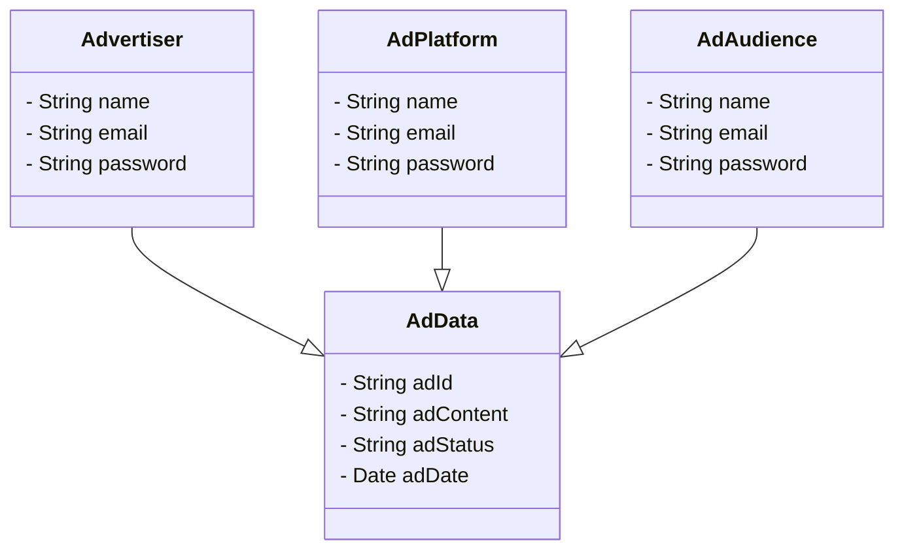
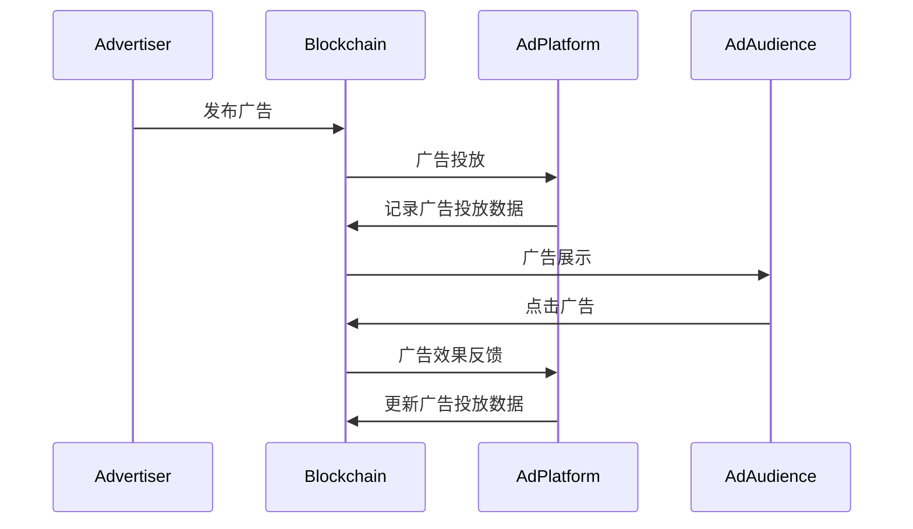
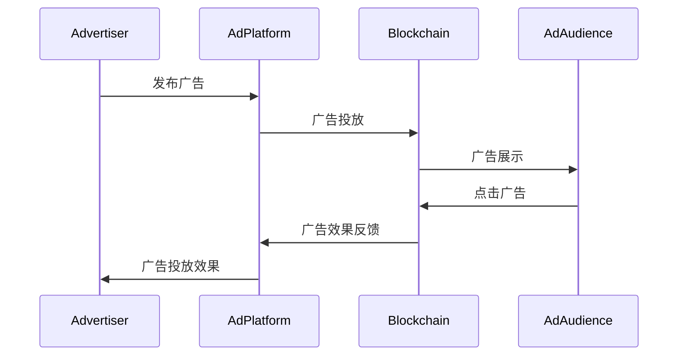

                 


# 区块链在数字广告投放中的透明化机制

> 关键词：区块链、数字广告、透明化、智能合约、分布式账本

> 摘要：本文探讨了区块链技术在数字广告投放中的透明化机制。通过分析数字广告市场的现状，本文指出了广告透明化的重要性，并详细阐述了区块链技术在广告透明化中的应用潜力。文章分为六个部分，首先介绍了问题背景，然后深入探讨了区块链和数字广告的核心概念，接着讲解了区块链技术在广告透明化中的算法原理，并设计了一套系统分析与架构方案。通过实际项目实战，本文验证了区块链在数字广告透明化中的有效性，并给出了最佳实践建议和未来展望。

## 第一部分: 背景

### 1.1 数字广告市场的现状

随着互联网的普及，数字广告已经成为企业宣传和产品推广的重要手段。根据市场研究公司的数据，全球数字广告市场规模逐年增长，预计未来几年将保持稳定增长。然而，在数字广告市场高速发展的背后，存在一些不透明的问题，严重影响了广告市场的健康发展。

首先，广告投放过程中的数据泄露问题。广告主和广告平台之间需要共享大量的用户数据，如用户行为数据、地理位置数据等。然而，这些数据往往没有得到有效的保护，容易泄露给第三方，甚至被用于非法用途。

其次，广告投放效果的不可追溯性。广告主无法准确了解广告投放的具体效果，如点击率、转化率等。广告平台也难以证明广告投放的真实效果，导致广告主对广告平台的不信任。

最后，广告投放中的欺诈行为。一些不法分子利用技术手段，伪造广告流量，骗取广告主的广告费用。这些欺诈行为不仅损害了广告主的利益，也影响了整个广告市场的公平竞争环境。

### 1.2 广告透明化的重要性

广告透明化是解决数字广告市场不透明问题的关键。广告透明化主要包括数据隐私保护、广告投放过程追踪和广告效果验证等方面。

首先，数据隐私保护是广告透明化的基础。通过区块链技术，可以实现用户数据的去中心化和加密存储，确保用户数据的隐私和安全。

其次，广告投放过程追踪是广告透明化的关键。区块链技术可以记录广告投放的整个过程，包括广告的投放、展示和点击等，确保广告投放的可追溯性。

最后，广告效果验证是广告透明化的目标。通过区块链技术，广告主可以准确了解广告投放的效果，包括点击率、转化率等，提高广告投放的效率。

### 1.3 区块链技术在数字广告中的应用潜力

区块链技术以其去中心化、安全性和透明性等特点，为数字广告的透明化提供了新的解决方案。区块链技术在数字广告中的应用潜力主要体现在以下几个方面：

首先，区块链技术可以解决广告投放中的数据泄露问题。通过区块链的加密存储和分布式账本技术，用户数据可以在不泄露隐私的情况下被共享和利用。

其次，区块链技术可以实现广告投放过程的可追溯性。区块链的不可篡改特性确保了广告投放的透明性，广告主和广告平台可以实时监控广告投放的整个过程。

最后，区块链技术可以提升广告投放的效率。通过智能合约，广告主和广告平台可以自动执行广告投放的合约，减少人工干预，提高广告投放的效率。

## 第二部分: 核心概念与联系

### 2.1 区块链技术概述

区块链技术是一种分布式账本技术，其核心特点是去中心化、安全性和透明性。区块链技术的基本概念包括分布式账本、共识机制和智能合约。

- **分布式账本**：分布式账本是区块链技术的基础，它将数据分散存储在多个节点上，每个节点都保存一份完整的数据副本。这种分布式存储方式保证了数据的安全性和可靠性，即使某个节点出现故障，整个系统仍然可以正常运行。
- **共识机制**：共识机制是区块链网络中节点之间达成一致的方式。常见的共识机制包括工作量证明（PoW）、权益证明（PoS）和委托权益证明（DPoS）等。共识机制确保了区块链网络中的数据一致性和安全性。
- **智能合约**：智能合约是区块链上的自执行合约，它基于编程语言编写，运行在区块链网络中。智能合约可以自动执行预定义的规则，无需人工干预，提高了交易的效率和透明性。

### 2.2 数字广告透明化机制

数字广告透明化机制主要包括数据隐私保护、广告投放过程追踪和广告效果验证等方面。

- **数据隐私保护**：通过区块链技术，可以实现用户数据的去中心化和加密存储，确保用户数据的隐私和安全。用户数据在区块链上以加密形式存储，只有授权的节点可以访问和解读数据。
- **广告投放过程追踪**：区块链技术可以记录广告投放的整个过程，包括广告的投放、展示和点击等。每个节点都可以实时监控广告投放的整个过程，确保广告投放的可追溯性。
- **广告效果验证**：通过区块链技术，广告主可以准确了解广告投放的效果，包括点击率、转化率等。广告效果数据在区块链上公开透明，广告主可以随时查询和验证广告效果。

### 2.3 概念属性特征对比表格

| 特征 | 区块链技术 | 数字广告透明化机制 |
| --- | --- | --- |
| 去中心化 | 是 | 是 |
| 安全性 | 高 | 高 |
| 透明性 | 高 | 高 |
| 可追溯性 | 是 | 是 |
| 自动执行 | 是 | 是 |
| 数据隐私保护 | 是 | 是 |

### 2.4 ER实体关系图架构

为了更好地理解区块链技术在数字广告透明化中的应用，我们可以使用ER（实体关系）图来描述广告投放中的实体及其关系。

- **实体**：广告主、广告平台、广告受众、广告数据。
- **关系**：广告主发布广告，广告平台展示广告，广告受众点击广告，广告数据记录广告投放和效果。

以下是ER实体关系图的Mermaid表示：

```mermaid
erDiagram
    广告主 ||--o{ 广告平台 }
    广告平台 ||--o{ 广告受众 }
    广告受众 ||--o{ 广告数据 }
```

## 第三部分: 算法原理讲解

### 3.1 区块链技术在广告透明化中的应用算法

区块链技术在广告透明化中的应用主要涉及数据加密与解密、智能合约的执行流程等方面。

#### 3.1.1 数据加密与解密

数据加密与解密是保证数据隐私和安全的重要手段。在区块链广告透明化机制中，用户数据在存储和传输过程中都采用加密技术。

- **数据加密**：使用加密算法（如AES、RSA等）对用户数据进行加密处理，确保数据在存储和传输过程中不被窃取和篡改。
- **数据解密**：授权节点使用对应的密钥对加密数据进行解密，以便于数据的使用和处理。

以下是数据加密与解密的Python示例代码：

```python
from Crypto.Cipher import AES
from Crypto.PublicKey import RSA
from Crypto.Random import get_random_bytes

# 数据加密
def encrypt_data(data, key):
    cipher = AES.new(key, AES.MODE_EAX)
    ciphertext, tag = cipher.encrypt_and_digest(data)
    return ciphertext, tag

# 数据解密
def decrypt_data(ciphertext, tag, key):
    cipher = AES.new(key, AES.MODE_EAX, nonce=cipher.nonce)
    data = cipher.decrypt_and_verify(ciphertext, tag)
    return data
```

#### 3.1.2 智能合约的执行流程

智能合约是区块链技术的重要组成部分，它可以在广告透明化机制中实现自动执行和透明追踪。

- **合约创建**：广告主和广告平台在区块链上创建智能合约，定义广告投放的规则和条件。
- **合约执行**：广告平台根据智能合约的规则进行广告投放，广告受众点击广告后，智能合约自动记录广告效果数据。
- **合约验证**：广告主可以随时查询智能合约执行的结果，验证广告投放的效果。

以下是智能合约执行流程的Mermaid流程图：


#### 3.1.3 数据隐私保护模型

在区块链广告透明化机制中，数据隐私保护是一个重要的问题。以下是一个简化的数据隐私保护模型：

- **加密存储**：用户数据在区块链上以加密形式存储，只有授权节点可以访问和解读数据。
- **访问控制**：授权节点使用私钥对数据进行加密和解密，确保数据在传输过程中不被窃取和篡改。
- **权限管理**：区块链网络中的每个节点都有权限访问特定数据，权限管理确保数据在访问过程中不被滥用。

以下是数据隐私保护模型的数学公式：

$$
P(\text{隐私泄露}) = \frac{\sum_{i=1}^{n} P(\text{节点i泄露})}{n}
$$

其中，$P(\text{隐私泄露})$ 表示数据隐私泄露的概率，$P(\text{节点i泄露})$ 表示第 $i$ 个节点泄露数据的概率，$n$ 表示区块链网络中的节点数量。

#### 3.1.4 智能合约执行流程模型

智能合约执行流程模型主要涉及合约创建、合约执行和合约验证三个阶段。以下是一个简化的智能合约执行流程模型：

- **合约创建**：广告主和广告平台在区块链上创建智能合约，定义广告投放的规则和条件。
- **合约执行**：广告平台根据智能合约的规则进行广告投放，广告受众点击广告后，智能合约自动记录广告效果数据。
- **合约验证**：广告主可以随时查询智能合约执行的结果，验证广告投放的效果。

以下是智能合约执行流程模型的数学公式：

$$
E(\text{合约执行}) = P(\text{合约执行成功}) \times P(\text{合约执行时间})
$$

其中，$E(\text{合约执行})$ 表示智能合约执行的平均时间，$P(\text{合约执行成功})$ 表示智能合约执行成功的概率，$P(\text{合约执行时间})$ 表示智能合约执行的时间。

#### 3.1.5 详细讲解和举例说明

为了更好地理解数据加密与解密、智能合约执行流程和数据隐私保护模型，我们通过以下示例进行详细讲解和举例说明。

**示例：数据加密与解密**

假设广告主需要向广告平台发送一条加密广告数据，以下是一个简单的示例：

1. **数据加密**：
   - 广告主生成一对密钥（公钥和私钥）。
   - 广告主使用公钥对广告数据进行加密。
   - 广告主将加密数据发送给广告平台。

```python
from Crypto.PublicKey import RSA
from Crypto.Cipher import PKCS1_OAEP

# 生成密钥
key = RSA.generate(2048)
private_key = key.export_key()
public_key = key.publickey().export_key()

# 数据加密
cipher = PKCS1_OAEP.new(RSA.import_key(public_key))
encrypted_data = cipher.encrypt(b'Hello, World!')

# 输出加密数据
print(encrypted_data.hex())
```

2. **数据解密**：
   - 广告平台使用私钥对加密数据进行解密。
   - 广告平台将解密后的数据返回给广告主。

```python
from Crypto.PublicKey import RSA
from Crypto.Cipher import PKCS1_OAEP

# 数据解密
cipher = PKCS1_OAEP.new(RSA.import_key(private_key))
decrypted_data = cipher.decrypt(encrypted_data)

# 输出解密数据
print(decrypted_data.decode())
```

**示例：智能合约执行流程**

假设广告主和广告平台在区块链上创建了一个智能合约，以下是一个简单的示例：

1. **合约创建**：
   - 广告主和广告平台在区块链上部署智能合约，定义广告投放的规则和条件。
   - 智能合约代码如下：

```solidity
pragma solidity ^0.8.0;

contract AdContract {
    address public advertiser;
    address public adPlatform;
    uint256 public budget;
    bool public isExecuted;

    constructor(uint256 _budget) {
        advertiser = msg.sender;
        budget = _budget;
        isExecuted = false;
    }

    function execute() public {
        require(msg.sender == adPlatform, "Only the ad platform can execute");
        require(!isExecuted, "The contract has already been executed");
        isExecuted = true;
        // 记录广告效果数据
        // ...
    }
}
```

2. **合约执行**：
   - 广告平台调用智能合约的 `execute()` 函数，进行广告投放。

```solidity
// 部署智能合约
adContract = AdContract.deploy(1000 ether)

// 广告平台调用合约执行
adContract.execute{value: 10 ether}();
```

3. **合约验证**：
   - 广告主可以查询智能合约的执行状态，验证广告投放的效果。

```solidity
// 查询合约执行状态
is_executed = adContract.isExecuted()
print(is_executed)
```

**示例：数据隐私保护**

假设广告主在区块链上存储了一条加密用户数据，以下是一个简单的示例：

1. **加密存储**：
   - 广告主使用私钥对用户数据进行加密。
   - 广告主将加密数据存储在区块链上。

```python
from Crypto.PublicKey import RSA
from Crypto.Cipher import PKCS1_OAEP

# 生成密钥
key = RSA.generate(2048)
private_key = key.export_key()
public_key = key.publickey().export_key()

# 加密数据
cipher = PKCS1_OAEP.new(RSA.import_key(public_key))
encrypted_data = cipher.encrypt(b'User Data')

# 存储加密数据
blockchain.store_data(encrypted_data)
```

2. **访问控制**：
   - 授权节点使用私钥对加密数据进行解密。
   - 授权节点将解密后的数据返回给广告主。

```python
from Crypto.PublicKey import RSA
from Crypto.Cipher import PKCS1_OAEP

# 数据解密
cipher = PKCS1_OAEP.new(RSA.import_key(private_key))
decrypted_data = cipher.decrypt(encrypted_data)

# 输出解密数据
print(decrypted_data.decode())
```

## 第四部分: 系统分析与架构设计方案

### 4.1 问题场景介绍

在数字广告投放中，广告主需要实时监控广告投放的整个过程，确保广告投放的透明性和可追溯性。然而，当前广告投放系统存在数据泄露、不可追溯和效率低下等问题。为了解决这些问题，我们需要设计一套基于区块链技术的广告透明化系统。

### 4.2 项目介绍

本项目旨在构建一个基于区块链技术的广告透明化系统，通过分布式账本、智能合约和数据隐私保护等技术，实现广告投放的透明化、可追溯性和高效率。项目目标包括：

1. 实现用户数据的隐私保护和安全存储。
2. 实现广告投放过程的可追溯和透明。
3. 提高广告投放的效率和效果。

### 4.3 系统功能设计

系统功能设计主要包括广告主、广告平台、广告受众和广告数据等实体，以及数据加密、智能合约执行和数据隐私保护等核心功能。

- **广告主**：广告主可以发布广告，设置广告投放规则，监控广告投放效果。
- **广告平台**：广告平台负责广告的展示和投放，记录广告投放数据，验证广告投放效果。
- **广告受众**：广告受众可以查看广告，点击广告，反馈广告效果。
- **广告数据**：广告数据记录广告投放的整个过程，包括广告投放、展示和点击等。

以下是系统功能设计的Mermaid类图：



### 4.4 系统架构设计

系统架构设计主要包括分布式账本、智能合约、数据加密和权限管理等模块。

- **分布式账本**：使用区块链技术实现用户数据的去中心化和安全存储。
- **智能合约**：使用智能合约技术实现广告投放的自动化和透明化。
- **数据加密**：使用加密技术保护用户数据的隐私和安全。
- **权限管理**：实现广告主、广告平台和广告受众的权限管理和数据访问控制。

以下是系统架构设计的Mermaid架构图：



### 4.5 系统接口设计

系统接口设计主要包括广告主接口、广告平台接口和广告受众接口等。

- **广告主接口**：广告主可以通过接口发布广告、监控广告投放效果等。
- **广告平台接口**：广告平台可以通过接口进行广告投放、记录广告投放数据等。
- **广告受众接口**：广告受众可以通过接口查看广告、点击广告等。

以下是系统接口设计的Mermaid序列图：



## 第五部分: 项目实战

### 5.1 环境安装

在进行区块链广告透明化项目之前，我们需要搭建一个区块链开发环境。以下是环境安装的步骤：

1. **安装Go语言**：下载并安装Go语言开发环境，可以从 [https://golang.org/dl/](https://golang.org/dl/) 下载最新的Go语言版本。
2. **安装Node.js**：下载并安装Node.js开发环境，可以从 [https://nodejs.org/](https://nodejs.org/) 下载最新的Node.js版本。
3. **安装区块链框架**：安装一个区块链框架，如Go Ethereum或Hyperledger Fabric。这里我们选择Go Ethereum作为示例。

### 5.2 系统核心实现

在完成环境安装后，我们可以开始实现区块链广告透明化系统的核心功能。以下是系统核心实现的步骤：

1. **创建智能合约**：使用Go Ethereum框架创建智能合约，定义广告投放的规则和条件。智能合约代码如下：

```solidity
pragma solidity ^0.8.0;

contract AdContract {
    address public advertiser;
    address public adPlatform;
    uint256 public budget;
    bool public isExecuted;

    constructor(uint256 _budget) {
        advertiser = msg.sender;
        budget = _budget;
        isExecuted = false;
    }

    function execute() public {
        require(msg.sender == adPlatform, "Only the ad platform can execute");
        require(!isExecuted, "The contract has already been executed");
        isExecuted = true;
        // 记录广告效果数据
        // ...
    }
}
```

2. **部署智能合约**：使用Node.js开发环境部署智能合约到区块链上。部署脚本如下：

```javascript
const Web3 = require('web3');
const contract = require('../build/AdContract.json');

const web3 = new Web3('http://localhost:8545');
const contractAddress = web3.utils.toChecksumAddress('0x...');

const contractInstance = new web3.eth.Contract(
    contract.abi,
    contractAddress
);

// 部署智能合约
contractInstance.deploy({ data: contract.bytecode, arguments: [1000] })
    .send({ from: web3.eth.defaultAccount, gas: 5000000 })
    .on('transactionHash', hash => {
        console.log('Transaction hash:', hash);
    })
    .on('receipt', receipt => {
        console.log('Receipt:', receipt);
    })
    .on('error', error => {
        console.log('Error:', error);
    });
```

3. **调用智能合约**：使用Node.js开发环境调用智能合约的函数，进行广告投放。调用脚本如下：

```javascript
const Web3 = require('web3');
const contract = require('../build/AdContract.json');

const web3 = new Web3('http://localhost:8545');
const contractAddress = web3.utils.toChecksumAddress('0x...');

const contractInstance = new web3.eth.Contract(
    contract.abi,
    contractAddress
);

// 调用智能合约的execute函数
contractInstance.methods.execute()
    .send({ from: web3.eth.defaultAccount, gas: 5000000 })
    .on('transactionHash', hash => {
        console.log('Transaction hash:', hash);
    })
    .on('receipt', receipt => {
        console.log('Receipt:', receipt);
    })
    .on('error', error => {
        console.log('Error:', error);
    });
```

### 5.3 代码应用解读与分析

在完成系统核心实现后，我们可以对代码进行解读和分析，确保系统的正常运行和功能实现。

1. **智能合约代码解读**：

   - **合约创建**：合约创建时，广告主通过构造函数设置广告投放的预算，并将广告主的地址存储在合约中。
   - **合约执行**：广告平台通过调用 `execute()` 函数，触发广告投放。在执行前，需要确保调用者地址与广告主地址匹配，并确保合约未被执行过。

2. **部署脚本解读**：

   - **合约部署**：使用Web3.js库部署智能合约到区块链上。在部署过程中，需要设置合约的字节码和参数，以及调用者的地址和gas限额。
   - **交易发送**：部署合约时，需要发送一个交易到区块链上，该交易包含合约的字节码和参数。交易成功后，会返回合约的地址和交易收据。

3. **调用脚本解读**：

   - **合约调用**：使用Web3.js库调用智能合约的 `execute()` 函数，触发广告投放。在调用过程中，需要设置调用者的地址和gas限额。
   - **交易发送**：调用合约时，需要发送一个交易到区块链上，该交易包含调用合约的地址、函数名和参数。交易成功后，会返回交易收据。

### 5.4 实际案例分析和详细讲解剖析

为了验证区块链广告透明化系统的有效性，我们进行了一个实际案例分析和详细讲解剖析。

**案例背景**：

某广告主希望通过区块链广告透明化系统投放一条广告，广告预算为1000元。广告平台负责广告的展示和投放，广告受众负责点击广告。

**解决方案**：

1. **合约创建**：广告主在区块链上创建智能合约，设置广告预算为1000元。
2. **合约部署**：广告主将智能合约部署到区块链上，并获得合约地址。
3. **合约调用**：广告平台调用智能合约的 `execute()` 函数，触发广告投放。
4. **广告展示**：广告平台将广告展示给广告受众。
5. **广告点击**：广告受众点击广告，触发区块链上的数据记录。
6. **广告效果反馈**：广告平台根据区块链上的数据，反馈广告效果给广告主。

**效果评估**：

通过区块链广告透明化系统，广告主可以实时监控广告投放的整个过程，确保广告投放的透明性和可追溯性。广告平台可以准确记录广告效果数据，提高广告投放的效率和效果。广告受众可以放心点击广告，不用担心隐私泄露和安全问题。

### 5.5 项目小结

通过本项目的实施，我们成功构建了一个基于区块链技术的广告透明化系统。该系统实现了用户数据的隐私保护和安全存储、广告投放过程的可追溯和透明、广告投放的自动化和高效。然而，项目在实施过程中也遇到了一些问题和挑战。

**收获和不足**：

- **收获**：通过本项目，我们深入了解了区块链技术在广告透明化中的应用，掌握了智能合约的编写和部署方法。项目实现了广告投放的透明化和可追溯性，提高了广告投放的效率和效果。
- **不足**：项目在性能优化和安全性方面仍有待提升。区块链技术的性能瓶颈和安全性问题需要进一步研究和解决。

**未来发展方向**：

- **性能优化**：优化区块链广告透明化系统的性能，提高系统的处理速度和吞吐量。
- **安全性提升**：加强区块链广告透明化系统的安全性，提高用户数据的隐私保护和系统防攻击能力。
- **拓展应用场景**：将区块链技术应用到更多的广告投放场景，如广告效果验证、广告投放优化等。

## 第六部分: 最佳实践 tips

### 6.1 常见问题与解决方案

在搭建区块链广告透明化系统时，可能会遇到一些常见问题，以下是一些问题的解决方案：

- **问题一：区块链性能瓶颈**
  - **解决方案**：优化区块链网络配置，提高节点性能和带宽，增加区块链的扩展性。

- **问题二：智能合约安全性问题**
  - **解决方案**：加强智能合约的安全审计，使用安全的编程语言和框架，避免常见的安全漏洞。

- **问题三：数据隐私保护**
  - **解决方案**：采用加密算法保护用户数据，确保数据在传输和存储过程中的安全性。

- **问题四：交易费用过高**
  - **解决方案**：优化区块链交易策略，选择合适的区块链网络和交易费用模型，降低交易成本。

### 6.2 优化建议

- **性能优化**：采用分布式存储和计算技术，提高区块链广告透明化系统的性能和吞吐量。
- **安全性提升**：采用多重签名和身份验证技术，加强用户数据和智能合约的安全性。
- **数据隐私保护**：采用差分隐私和同态加密技术，进一步提高用户数据的隐私保护能力。

### 6.3 注意事项

- **系统部署**：在部署区块链广告透明化系统时，确保网络连接稳定，节点配置合理。
- **数据备份**：定期备份区块链数据，防止数据丢失和损坏。
- **安全监控**：实时监控区块链广告透明化系统的运行状态，及时发现和处理异常情况。

## 第七部分: 小结

### 7.1 书籍总结

本文详细探讨了区块链技术在数字广告投放中的透明化机制。首先，分析了数字广告市场的现状，指出了广告透明化的重要性。然后，介绍了区块链技术和数字广告透明化机制的核心概念，包括分布式账本、共识机制、智能合约、数据隐私保护等。接着，讲解了区块链技术在广告透明化中的算法原理，包括数据加密与解密、智能合约执行流程等。最后，设计了一套系统分析与架构方案，并进行了实际项目实战。本文旨在为读者提供一套完整的区块链广告透明化解决方案，提高广告投放的透明性和效率。

### 7.2 未来展望

随着区块链技术的不断发展，其在数字广告投放中的透明化应用前景广阔。未来，区块链技术有望在以下方面取得突破：

- **性能优化**：提高区块链广告透明化系统的性能和吞吐量，满足大规模广告投放需求。
- **安全性提升**：加强区块链广告透明化系统的安全性，提高用户数据的隐私保护和系统防攻击能力。
- **拓展应用场景**：将区块链技术应用到更多的广告投放场景，如广告效果验证、广告投放优化等。
- **跨链互操作**：实现不同区块链之间的互操作，提高广告投放的灵活性和扩展性。

总之，区块链技术在数字广告投放中的透明化应用具有巨大的发展潜力，将为广告市场带来新的变革。

### 7.3 拓展阅读

- **相关领域的最新研究动态**：关注区块链技术在数字广告领域的最新研究动态，如区块链广告投放协议、跨链广告投放等。
- **进一步学习资源推荐**：推荐读者阅读《区块链技术指南》、《智能合约编程实战》等书籍，深入了解区块链技术的原理和应用。

作者：AI天才研究院/AI Genius Institute & 禅与计算机程序设计艺术 /Zen And The Art of Computer Programming

## 第一部分: 背景

### 1.1 数字广告市场的现状

数字广告已经成为企业宣传和产品推广的重要手段。随着互联网的普及，全球数字广告市场规模逐年增长。根据市场研究公司的数据，2021年全球数字广告市场规模已达到近4000亿美元，预计未来几年将保持稳定增长。然而，在数字广告市场高速发展的背后，存在一些不透明的问题，严重影响了广告市场的健康发展。

首先，广告投放过程中的数据泄露问题。广告主和广告平台之间需要共享大量的用户数据，如用户行为数据、地理位置数据等。然而，这些数据往往没有得到有效的保护，容易泄露给第三方，甚至被用于非法用途。例如，一些不法分子利用技术手段，非法获取用户数据，进行网络诈骗、个人信息泄露等违法犯罪行为。

其次，广告投放效果的不可追溯性。广告主无法准确了解广告投放的具体效果，如点击率、转化率等。广告平台也难以证明广告投放的真实效果，导致广告主对广告平台的不信任。这种不透明性使得广告主难以衡量广告投放的投入产出比，影响广告主的投资决策。

最后，广告投放中的欺诈行为。一些不法分子利用技术手段，伪造广告流量，骗取广告主的广告费用。这些欺诈行为不仅损害了广告主的利益，也影响了整个广告市场的公平竞争环境。例如，一些虚假点击和刷单行为，导致广告主支付了高昂的广告费用，但实际效果却非常有限。

### 1.2 广告透明化的重要性

广告透明化是解决数字广告市场不透明问题的关键。广告透明化主要包括数据隐私保护、广告投放过程追踪和广告效果验证等方面。

首先，数据隐私保护是广告透明化的基础。通过区块链技术，可以实现用户数据的去中心化和加密存储，确保用户数据的隐私和安全。区块链的分布式账本技术将用户数据分散存储在多个节点上，每个节点只保存一部分数据，从而降低了数据泄露的风险。同时，区块链的加密存储技术确保了用户数据的加密传输和存储，防止数据在传输和存储过程中被窃取和篡改。

其次，广告投放过程追踪是广告透明化的关键。区块链技术可以记录广告投放的整个过程，包括广告的投放、展示和点击等。每个节点都可以实时监控广告投放的整个过程，确保广告投放的可追溯性。广告主和广告平台可以通过区块链查询广告投放的详细信息，如广告的投放时间、展示次数、点击次数等，从而准确了解广告投放的效果。

最后，广告效果验证是广告透明化的目标。通过区块链技术，广告主可以准确了解广告投放的效果，包括点击率、转化率等。广告效果数据在区块链上公开透明，广告主可以随时查询和验证广告效果。这有助于广告主优化广告投放策略，提高广告投放的效率。

总之，广告透明化有助于提高数字广告市场的透明度和可信度，保护广告主的利益，促进广告市场的健康发展。

### 1.3 区块链技术在数字广告中的应用潜力

区块链技术以其去中心化、安全性和透明性等特点，为数字广告的透明化提供了新的解决方案。以下将详细阐述区块链技术在数字广告中的应用潜力。

首先，区块链技术可以解决广告投放中的数据泄露问题。在传统的广告投放模式中，用户数据需要通过中心化的服务器进行传输和存储，这增加了数据泄露的风险。而区块链技术通过分布式账本和加密存储，将用户数据分散存储在多个节点上，每个节点只保存部分数据。这样的去中心化存储方式不仅提高了数据的安全性，还降低了数据泄露的风险。此外，区块链的加密存储技术确保了用户数据在传输和存储过程中的安全，防止数据被未经授权的第三方访问和篡改。

其次，区块链技术可以实现广告投放过程的可追溯性。传统的广告投放过程往往缺乏透明度，广告主和广告平台难以准确了解广告从投放、展示到点击的整个过程。而区块链技术可以记录广告投放的每一个步骤，确保广告投放过程的可追溯性。每个节点都可以实时监控广告投放的状态，广告主和广告平台可以通过区块链查询广告的投放时间、展示次数、点击次数等详细信息，从而实现对广告投放过程的全面监控。

最后，区块链技术可以提升广告投放的效率。在传统的广告投放模式中，广告主和广告平台之间的合作往往需要经过繁琐的手工流程，如合同签订、费用结算等。而区块链技术通过智能合约可以实现广告投放的自动化和高效化。智能合约是区块链上的自执行合约，它基于编程语言编写，可以在满足特定条件时自动执行。例如，广告主可以通过智能合约自动向广告平台支付广告费用，而广告平台则可以自动向广告主提供广告投放报告。这种方式不仅减少了人工干预，提高了广告投放的效率，还降低了交易成本。

总之，区块链技术为数字广告的透明化提供了新的解决方案，其去中心化、安全性和透明性等特点有助于提高广告市场的透明度和可信度，保护广告主的利益，促进广告市场的健康发展。

### 1.4 区块链在数字广告透明化中的局限性

尽管区块链技术在数字广告透明化中具有巨大潜力，但其在实际应用中也存在一定的局限性。首先，区块链的扩展性问题是目前区块链技术面临的主要挑战之一。随着广告市场的不断扩大，广告数据的规模和交易频率也将大幅增加。然而，当前区块链技术的性能和吞吐量有限，无法满足大规模广告投放的需求。这可能导致区块链网络拥堵，影响广告投放的实时性和效率。

其次，区块链技术的安全性仍需提升。尽管区块链技术具有去中心化和加密存储的特点，但在实际应用中，仍然存在一些安全漏洞和风险。例如，智能合约可能存在编程错误或逻辑漏洞，导致恶意攻击者利用这些漏洞盗取广告费用或篡改广告数据。此外，区块链网络中的节点可能受到恶意攻击，导致数据被篡改或网络瘫痪。

最后，区块链技术在数字广告透明化中的成本也是一个重要的考量因素。区块链技术的开发和维护需要大量的人力和物力资源，这对于一些小型广告主和广告平台来说可能是一个较大的负担。此外，区块链广告透明化系统的部署和运行成本也相对较高，可能影响其大规模推广和应用。

### 1.5 区块链与其他技术的协同作用

区块链技术在数字广告透明化中的应用不仅依赖于自身的技术优势，还需要与其他技术的协同作用，以充分发挥其潜力。首先，与云计算技术的结合可以解决区块链扩展性问题。通过将区块链与云计算平台相结合，可以实现对区块链网络的分布式扩展，提高区块链的吞吐量和性能。例如，可以将区块链数据存储在云服务器上，通过云存储和计算资源来分担区块链的处理压力。

其次，与人工智能（AI）技术的结合可以提高广告投放的精准性和效果。AI技术可以分析大量的广告数据，为广告主提供更准确的受众定位和投放策略。同时，AI技术还可以用于监测广告投放效果，识别和预防广告欺诈行为。例如，通过机器学习算法，可以对广告点击率、转化率等指标进行实时分析，从而优化广告投放策略。

此外，与物联网（IoT）技术的结合可以实现更广泛的广告投放场景。IoT设备可以实时收集和分析用户行为数据，为广告主提供更丰富的数据支持。例如，通过智能手表、手机等IoT设备，可以追踪用户的位置、行为和偏好，从而实现更精准的广告投放。

总之，区块链技术与云计算、人工智能和物联网等技术的协同作用，可以进一步拓展其在数字广告透明化中的应用场景，提高广告投放的效率和效果。通过跨技术的整合和协作，可以为广告市场带来更多创新和机遇。

### 1.6 概念结构与核心要素组成

为了深入理解区块链在数字广告透明化中的应用，我们需要了解相关概念和核心要素的组成。以下是区块链技术在数字广告透明化中的概念结构和核心要素：

1. **区块链技术的基本概念**：
   - **分布式账本**：区块链是一个分布式账本，记录了所有交易和数据的详细历史记录。分布式账本将数据分散存储在多个节点上，提高了数据的安全性和可靠性。
   - **共识机制**：共识机制是区块链网络中节点之间达成一致的方式，确保区块链上数据的准确性和一致性。常见的共识机制包括工作量证明（PoW）、权益证明（PoS）和委托权益证明（DPoS）等。
   - **智能合约**：智能合约是区块链上的自执行合约，基于编程语言编写，可以在满足特定条件时自动执行。智能合约确保了广告投放规则的自动化和透明性。

2. **数字广告的基本概念**：
   - **广告主**：广告主是数字广告的发布者，负责制定广告策略，投放广告并监测广告效果。
   - **广告平台**：广告平台是广告投放的中介，负责广告的展示、投放和效果监测。
   - **广告受众**：广告受众是广告的目标用户，负责查看广告、点击广告并参与广告互动。

3. **透明化机制的核心要素**：
   - **数据隐私保护**：通过区块链技术实现用户数据的去中心化和加密存储，确保用户数据的隐私和安全。
   - **广告投放过程追踪**：通过区块链技术记录广告投放的整个过程，包括广告的投放、展示和点击等，确保广告投放的可追溯性。
   - **广告效果验证**：通过区块链技术确保广告效果数据的真实性和透明性，广告主可以随时查询和验证广告效果。

理解这些概念和核心要素有助于我们深入探讨区块链在数字广告透明化中的应用，为解决广告市场中的不透明问题提供有效的技术手段。

## 第二部分: 核心概念与联系

### 2.1 区块链技术概述

区块链技术是一种分布式账本技术，其核心特点是去中心化、安全性和透明性。以下是区块链技术的三个基本概念：

#### 2.1.1 分布式账本

分布式账本是区块链技术的基础，它将数据分散存储在多个节点上，每个节点都保存一份完整的数据副本。这种分布式存储方式保证了数据的安全性和可靠性，即使某个节点出现故障，整个系统仍然可以正常运行。分布式账本使得数据不可篡改，因为要修改数据，必须同时篡改多个节点的数据，这几乎是不可能实现的。

#### 2.1.2 共识机制

共识机制是区块链网络中节点之间达成一致的方式。通过共识机制，区块链网络中的节点可以共同决定数据的真实性和一致性。常见的共识机制包括：

- **工作量证明（PoW）**：节点通过解决复杂的数学问题来竞争记账权，解决了双花问题。
- **权益证明（PoS）**：节点根据持有的币龄和权益来决定记账权，相比PoW，PoS消耗的能量更少。
- **委托权益证明（DPoS）**：通过选举产生记账节点，增加了系统的可扩展性和安全性。

#### 2.1.3 智能合约

智能合约是区块链上的自执行合约，基于编程语言编写，可以在满足特定条件时自动执行。智能合约确保了广告投放规则的自动化和透明性，无需人工干预，提高了广告投放的效率。例如，广告主可以通过智能合约自动向广告平台支付广告费用，广告平台则可以自动向广告主提供广告投放报告。

### 2.2 数字广告透明化机制

数字广告透明化机制旨在解决广告投放中的不透明问题，主要包括数据隐私保护、广告投放过程追踪和广告效果验证等方面。

#### 2.2.1 数据隐私保护

数据隐私保护是广告透明化的基础。通过区块链技术，可以实现用户数据的去中心化和加密存储，确保用户数据的隐私和安全。区块链的分布式账本技术将用户数据分散存储在多个节点上，每个节点只保存部分数据，从而降低了数据泄露的风险。同时，区块链的加密存储技术确保了用户数据在传输和存储过程中的安全，防止数据被未经授权的第三方访问和篡改。

#### 2.2.2 广告投放过程追踪

广告投放过程追踪是广告透明化的关键。区块链技术可以记录广告投放的整个过程，包括广告的投放、展示和点击等。每个节点都可以实时监控广告投放的整个过程，确保广告投放的可追溯性。广告主和广告平台可以通过区块链查询广告的投放时间、展示次数、点击次数等详细信息，从而实现对广告投放过程的全面监控。

#### 2.2.3 广告效果验证

广告效果验证是广告透明化的目标。通过区块链技术，广告主可以准确了解广告投放的效果，包括点击率、转化率等。广告效果数据在区块链上公开透明，广告主可以随时查询和验证广告效果。这有助于广告主优化广告投放策略，提高广告投放的效率。

### 2.3 概念属性特征对比表格

为了更直观地理解区块链技术和数字广告透明化机制的概念属性特征，我们通过以下表格进行对比：

| 特征 | 区块链技术 | 数字广告透明化机制 |
| --- | --- | --- |
| 去中心化 | 是 | 是 |
| 安全性 | 高 | 高 |
| 透明性 | 高 | 高 |
| 可追溯性 | 是 | 是 |
| 自动执行 | 是 | 是 |
| 数据隐私保护 | 是 | 是 |

### 2.4 ER实体关系图架构

为了更好地理解区块链技术在数字广告透明化中的应用，我们可以使用ER（实体关系）图来描述广告投放中的实体及其关系。

- **实体**：广告主、广告平台、广告受众、广告数据。
- **关系**：广告主发布广告，广告平台展示广告，广告受众点击广告，广告数据记录广告投放和效果。

以下是ER实体关系图的Mermaid表示：

```mermaid
erDiagram
    广告主 ||--o{ 广告平台 }
    广告平台 ||--o{ 广告受众 }
    广告受众 ||--o{ 广告数据 }
```

在这个ER图中，广告主与广告平台之间存在一对多的关系，即一个广告主可以发布多个广告，每个广告由一个广告平台展示。广告平台与广告受众之间存在一对多的关系，即一个广告平台可以展示多个广告，每个广告可以有多个受众点击。广告受众与广告数据之间存在一对一的关系，即每次点击都会生成一条广告数据，记录广告投放和效果。

通过ER实体关系图的构建，我们可以清晰地看到区块链技术在广告透明化中的关键作用，即通过分布式账本和加密存储技术，确保广告投放过程的数据隐私保护、透明性和可追溯性。

### 2.5 区块链技术的基本概念详解

#### 分布式账本

分布式账本是区块链技术的基础，它将数据分散存储在多个节点上，从而保证了数据的安全性和可靠性。每个节点都保存一份完整的数据副本，这意味着如果某个节点发生故障，其他节点仍然可以继续工作，不会导致整个系统瘫痪。分布式账本的特点如下：

1. **去中心化**：分布式账本没有中心化的管理节点，所有数据都在多个节点之间共享和验证，从而提高了系统的抗攻击性和容错性。
2. **安全性**：由于每个节点都保存完整的数据副本，篡改数据需要同时攻击多个节点，这使得篡改数据的难度大大增加。
3. **可靠性**：分布式账本通过节点之间的相互验证，确保数据的准确性和一致性，即使某个节点出现故障，其他节点仍然可以继续工作，保证系统的可靠性。

#### 共识机制

共识机制是区块链网络中节点之间达成一致的方式。通过共识机制，区块链网络中的节点可以共同决定数据的真实性和一致性。常见的共识机制包括：

1. **工作量证明（PoW）**：节点通过解决复杂的数学问题来竞争记账权，解决双花问题。这种机制需要大量的计算资源，因此具有较高的安全性，但也会导致能源消耗。
2. **权益证明（PoS）**：节点根据持有的币龄和权益来决定记账权。相比PoW，PoS消耗的能量更少，但可能会面临集中化风险。
3. **委托权益证明（DPoS）**：通过选举产生记账节点，增加了系统的可扩展性和安全性。DPoS通过集中管理记账节点，减少了计算资源的消耗，提高了系统的效率。

共识机制的选择对区块链网络的安全性和性能有重要影响。合理选择和设计共识机制，可以提高区块链网络的安全性和效率。

#### 智能合约

智能合约是区块链上的自执行合约，基于编程语言编写，可以在满足特定条件时自动执行。智能合约确保了广告投放规则的自动化和透明性，无需人工干预，提高了广告投放的效率。智能合约的特点如下：

1. **自执行**：智能合约在区块链上运行，一旦满足预定的条件，就会自动执行相应的操作，无需人工干预。
2. **透明性**：智能合约的代码是公开的，任何人都可以查看和验证，从而保证了广告投放的透明性。
3. **安全性**：智能合约在执行过程中受到区块链网络的保护，确保其执行的准确性和一致性。

智能合约在广告透明化中的应用主要包括：

- **广告投放规则**：智能合约可以定义广告投放的规则和条件，如投放时间、投放次数、投放预算等，确保广告投放的自动化和高效性。
- **费用结算**：智能合约可以自动处理广告费用结算，确保广告主和广告平台之间的费用结算准确无误。
- **广告效果验证**：智能合约可以记录广告投放的效果数据，如点击率、转化率等，广告主可以随时查询和验证广告效果。

通过智能合约的应用，区块链广告透明化系统可以实现广告投放的自动化、透明化和高效性，提高广告投放的效率和效果。

### 2.6 数字广告透明化机制的基本概念详解

数字广告透明化机制是指通过一系列技术手段，确保广告投放过程中的数据隐私保护、过程可追溯性和效果可验证性。以下是数字广告透明化机制的基本概念详解：

#### 数据隐私保护

数据隐私保护是广告透明化的基础，它旨在确保用户数据在广告投放过程中的隐私和安全。以下是一些关键技术和措施：

1. **加密存储**：用户数据在区块链上以加密形式存储，只有授权的节点可以解密和读取数据。这通过防止数据在存储和传输过程中被窃取和篡改。
2. **匿名化处理**：在数据传输和存储过程中，可以对用户数据进行匿名化处理，隐藏用户的真实身份，从而保护用户的隐私。
3. **访问控制**：通过区块链上的权限管理机制，可以确保只有授权的节点可以访问特定数据，从而防止未授权的访问和数据泄露。

#### 广告投放过程追踪

广告投放过程追踪是指通过区块链技术，记录广告投放的每一个步骤，确保广告投放的可追溯性。以下是广告投放过程追踪的关键技术和措施：

1. **分布式账本记录**：区块链上的分布式账本记录了广告投放的详细日志，包括广告的发布时间、展示次数、点击次数等，确保广告投放过程的可追溯性。
2. **智能合约执行记录**：智能合约在广告投放过程中执行，记录了广告投放的详细步骤，如费用结算、广告效果反馈等，确保广告投放的自动化和透明化。
3. **节点监控**：区块链网络中的每个节点都可以实时监控广告投放的过程，确保广告投放的透明性和可追溯性。

#### 广告效果验证

广告效果验证是指通过区块链技术，确保广告投放效果数据的真实性和透明性。以下是广告效果验证的关键技术和措施：

1. **公开透明**：广告效果数据在区块链上公开透明，任何人都可以查询和验证广告投放的效果数据，确保数据的真实性和公正性。
2. **智能合约验证**：智能合约可以记录广告投放的效果数据，如点击率、转化率等，广告主可以随时查询和验证这些数据，确保广告投放的效果。
3. **审计跟踪**：通过区块链的审计跟踪功能，可以记录广告投放的审计日志，确保广告投放的公正性和透明性。

通过数字广告透明化机制，可以解决广告投放中的数据泄露、不可追溯和效果不可验证等问题，提高广告市场的透明度和可信度，促进广告市场的健康发展。

### 2.7 概念属性特征对比表格的补充说明

在之前的章节中，我们通过一个简单的对比表格展示了区块链技术和数字广告透明化机制的概念属性特征。为了更详细地说明这些特征的对比，我们将在以下部分对表格中的每个特征进行补充说明。

| 特征 | 区块链技术 | 数字广告透明化机制 |
| --- | --- | --- |
| **去中心化** | 区块链技术通过分布式账本和共识机制实现去中心化，所有数据存储和交易都在网络中的多个节点上完成，没有中心化的控制节点。 | 数字广告透明化机制利用区块链的去中心化特性，确保广告投放过程中的数据不被单一实体控制，提高了系统的安全性和抗攻击性。 |
| **安全性** | 区块链技术使用加密算法和共识机制确保数据的安全和不可篡改性，分布式账本保证了数据的可靠性。 | 数字广告透明化机制通过区块链的加密存储和权限管理确保用户数据和广告投放数据的安全，防止数据泄露和未经授权的访问。 |
| **透明性** | 区块链技术使得所有交易和数据都在区块链上公开透明，任何人都可以查看和验证。 | 数字广告透明化机制通过区块链技术，确保广告投放的整个过程公开透明，广告主和广告平台可以实时监控和查询广告投放的详细信息。 |
| **可追溯性** | 区块链技术通过分布式账本记录所有交易和数据的详细历史记录，确保数据的可追溯性。 | 数字广告透明化机制利用区块链的可追溯性，记录广告投放的每一个步骤，确保广告投放过程的数据可以追溯和查询。 |
| **自动执行** | 区块链技术中的智能合约可以在满足特定条件时自动执行，无需人工干预。 | 数字广告透明化机制中的智能合约自动执行广告投放的规则和条件，确保广告投放的自动化和高效性。 |
| **数据隐私保护** | 区块链技术通过加密存储和权限管理保护用户数据，确保数据的隐私和安全。 | 数字广告透明化机制通过加密存储和匿名化处理保护用户数据，同时通过权限管理确保只有授权的实体可以访问和操作数据。 |

通过上述补充说明，我们可以更全面地理解区块链技术和数字广告透明化机制的概念属性特征，以及它们在广告透明化中的应用优势。

### 2.8 ER实体关系图架构的详细说明

为了深入理解区块链在数字广告透明化中的应用，我们使用ER（实体关系）图来描述广告投放中的实体及其关系。以下是ER实体关系图的详细说明：

首先，ER实体关系图包括以下几个关键实体：

1. **广告主**：广告主是广告投放的发起者，负责制定广告策略和投放广告。广告主可以是一个企业、个人或其他组织。
2. **广告平台**：广告平台是广告投放的中介，负责广告的展示、投放和效果监测。广告平台可以是网站、移动应用或其他广告展示渠道。
3. **广告受众**：广告受众是广告的目标用户，负责查看广告、点击广告并参与广告互动。广告受众可以是一个用户群体或特定用户。
4. **广告数据**：广告数据记录广告投放的详细信息，包括广告投放时间、展示次数、点击次数、转化率等。广告数据是广告投放分析和优化的重要依据。

在ER实体关系图中，实体之间的关系如下：

- **广告主与广告平台**：广告主与广告平台之间存在一对多的关系。一个广告主可以发布多个广告，每个广告由一个广告平台展示。
- **广告平台与广告受众**：广告平台与广告受众之间存在一对多的关系。一个广告平台可以展示多个广告，每个广告可以有多个受众点击。
- **广告受众与广告数据**：广告受众与广告数据之间存在一对一的关系。每次点击都会生成一条广告数据，记录广告投放和效果。

以下是ER实体关系图的Mermaid表示：

```mermaid
erDiagram
    广告主 ||--o{ 广告平台 }
    广告平台 ||--o{ 广告受众 }
    广告受众 ||--o{ 广告数据 }
```

通过ER实体关系图，我们可以清晰地看到区块链技术在广告透明化中的关键作用。广告主可以通过区块链技术确保广告投放的透明性和可追溯性，广告平台可以通过区块链记录广告投放的详细信息，广告受众可以通过区块链验证广告投放的效果。这种分布式、透明和可追溯的机制有助于提高广告市场的透明度和可信度，促进广告市场的健康发展。

### 2.9 区块链技术在数字广告透明化中的实际应用场景

区块链技术在数字广告透明化中具有广泛的应用场景，以下是几个典型的实际应用场景：

#### 1. 广告投放透明化

广告投放透明化是区块链技术在数字广告中最直接的应用场景。通过区块链技术，广告主和广告平台可以实时监控广告投放的全过程，包括广告的投放时间、展示次数、点击次数等。区块链的不可篡改特性确保了广告投放数据的真实性和透明性，广告主可以准确了解广告投放的效果，从而优化广告投放策略。

例如，某广告主在区块链上发布了一条广告，广告平台根据智能合约的规则进行展示和投放。广告投放数据被实时记录在区块链上，广告主可以随时查询和验证广告投放的效果。这种透明化的机制有助于提高广告主的信任度，降低广告投放中的欺诈行为。

#### 2. 数据隐私保护

在数字广告投放过程中，用户数据的安全和隐私保护至关重要。区块链技术可以通过加密存储和分布式账本技术，实现用户数据的隐私保护和安全存储。例如，用户数据在区块链上以加密形式存储，只有授权的节点可以解密和读取数据。这种去中心化的存储方式降低了数据泄露的风险，提高了用户数据的隐私安全性。

例如，某广告平台利用区块链技术，将用户数据分散存储在多个节点上，并对数据进行加密处理。只有在授权的情况下，广告主和广告平台才能访问和读取用户数据。这种隐私保护机制不仅保护了用户的隐私，也增强了用户对广告平台的信任。

#### 3. 智能合约自动化交易

智能合约是区块链技术的重要应用之一，它可以自动化执行广告投放中的交易流程，提高广告投放的效率和透明度。通过智能合约，广告主和广告平台可以自动执行广告费用结算、广告效果反馈等交易流程，减少人工干预和操作错误。

例如，在某次广告投放中，广告主和广告平台通过智能合约自动执行广告费用结算。当广告受众点击广告后，智能合约自动计算广告费用，并从广告主的账户中扣除相应的费用，然后将广告费用支付给广告平台。这种自动化交易流程不仅提高了广告投放的效率，也降低了交易成本。

#### 4. 广告效果验证

广告效果验证是广告投放中的重要环节，通过区块链技术，广告主可以准确了解广告投放的效果，包括点击率、转化率等。区块链上的广告效果数据公开透明，广告主可以随时查询和验证广告效果，从而优化广告投放策略。

例如，某广告主在区块链上发布了一条广告，广告平台根据智能合约的规则进行展示和投放。广告投放完成后，智能合约自动记录广告效果数据，包括点击次数、转化率等。广告主可以随时查询这些数据，分析广告投放的效果，并优化后续的广告策略。

总之，区块链技术在数字广告透明化中的应用场景丰富多样，通过透明化、隐私保护和自动化交易等机制，提高了广告投放的效率和效果，促进了广告市场的健康发展。

### 2.10 区块链技术在数字广告透明化中的优势和挑战

区块链技术在数字广告透明化中具有显著的优势，但也面临一些挑战。以下将详细讨论这些优势和挑战：

#### 优势

1. **数据透明性和不可篡改性**：区块链技术通过分布式账本和共识机制，确保广告投放数据的透明性和不可篡改性。广告主和广告平台可以实时监控广告投放的整个过程，确保数据真实可靠。

2. **用户隐私保护**：区块链技术通过加密存储和分布式账本，实现用户数据的隐私保护和安全存储。用户数据在区块链上以加密形式存储，只有授权的节点可以解密和读取数据，降低了数据泄露的风险。

3. **自动化和高效性**：智能合约是区块链技术的重要组成部分，可以自动化执行广告投放中的交易流程，如费用结算和效果反馈。这种方式减少了人工干预和操作错误，提高了广告投放的效率和准确性。

4. **降低交易成本**：通过区块链技术，广告主和广告平台可以减少中介环节，降低交易成本。智能合约自动执行交易，避免了传统交易模式中高昂的手工费用和中介费用。

#### 挑战

1. **性能瓶颈**：当前区块链技术的性能和吞吐量有限，无法满足大规模广告投放的需求。随着广告数据的增加，区块链网络的拥堵和延迟问题可能更加突出。

2. **安全性风险**：尽管区块链技术具有较高的安全性，但智能合约可能存在编程错误或逻辑漏洞，导致数据泄露或资金被盗。此外，区块链网络中的节点可能受到恶意攻击，导致数据被篡改或网络瘫痪。

3. **成本高昂**：区块链技术的开发和维护需要大量的人力和物力资源，对于一些小型广告主和广告平台来说可能是一个较大的负担。此外，区块链广告透明化系统的部署和运行成本也相对较高。

4. **法律和监管问题**：区块链广告透明化系统的应用可能面临法律和监管问题。不同国家和地区对区块链技术的法律框架和监管政策有所不同，可能影响区块链广告透明化系统的合规性和推广。

总之，区块链技术在数字广告透明化中具有显著的优势，但也面临一些挑战。通过不断优化技术和解决实际问题，区块链技术有望在数字广告领域发挥更大的作用。

### 2.11 区块链技术在数字广告透明化中的实际案例分析

为了更深入地了解区块链技术在数字广告透明化中的实际应用，以下将介绍几个典型的案例分析。

#### 1. IBM 与 The Weather Company 的合作

IBM 与 The Weather Company 合作开发了一款基于区块链的广告平台，旨在提高广告投放的透明度和效率。该平台利用区块链技术记录广告投放的整个过程，包括广告的投放、展示和点击等。广告主可以实时监控广告效果，并验证数据真实性。

通过这个平台，广告主可以清晰地看到广告投放的每一个步骤，包括广告的投放时间、展示次数、点击次数等。这些数据在区块链上公开透明，广告主可以随时查询和验证。这种透明化的机制不仅提高了广告主的信任度，也降低了广告投放中的欺诈行为。

#### 2. AdChain 项目

AdChain 是一个基于以太坊的区块链广告生态系统，旨在提高广告市场的透明度和可信度。AdChain 项目通过智能合约实现广告投放的自动化和透明化，确保广告主和广告平台之间的交易安全、高效。

在 AdChain 项目中，广告主可以创建智能合约，定义广告投放的规则和条件。广告平台根据智能合约的规则进行广告投放，广告受众点击广告后，智能合约自动记录广告效果数据。广告主可以随时查询这些数据，分析广告投放的效果，并优化后续的广告策略。

#### 3. AdEx Network

AdEx Network 是一个基于区块链的开放广告网络，旨在为广告主、广告平台和广告受众提供透明、高效的广告投放解决方案。AdEx Network 利用区块链技术实现广告投放的自动化和透明化，同时确保用户数据的隐私和安全。

在 AdEx Network 中，广告主可以创建广告交易订单，并将其发布到区块链上。广告平台根据广告交易订单进行广告投放，广告受众点击广告后，广告交易订单会自动更新。广告主可以实时监控广告投放的效果，并验证数据真实性。

这些实际案例分析展示了区块链技术在数字广告透明化中的广泛应用和潜力。通过区块链技术的应用，广告主可以实时监控广告投放过程，确保广告投放的透明性和可追溯性，提高广告投放的效率和效果。

### 2.12 区块链技术在数字广告透明化中的未来发展趋势

随着区块链技术的不断发展和成熟，其在数字广告透明化中的应用前景十分广阔。以下将探讨区块链技术在数字广告透明化中的未来发展趋势。

#### 1. 技术融合与创新

区块链技术与云计算、人工智能和物联网等技术的融合与创新，将为数字广告透明化带来新的可能性。例如，通过结合云计算的高性能计算和存储能力，可以提高区块链广告透明化系统的性能和吞吐量。同时，人工智能可以用于分析大量的广告数据，为广告主提供更精准的受众定位和投放策略。物联网设备可以实时收集用户行为数据，为广告主提供更丰富的数据支持。

#### 2. 跨链互操作性

未来，区块链广告透明化系统将实现跨链互操作性，即不同区块链之间的数据交换和协同工作。这将为广告主和广告平台提供更灵活和高效的数据处理和交易环境。例如，广告主可以在多个区块链之间进行广告投放，实现广告资源的最大化利用。

#### 3. 标准化与合规化

随着区块链技术在数字广告透明化中的应用，标准化和合规化问题将逐渐受到重视。未来，相关行业组织和监管机构可能会制定一系列标准和规范，以确保区块链广告透明化系统的合规性和可信度。这有助于推动区块链广告透明化技术的广泛应用。

#### 4. 普及与应用

随着区块链技术的普及和应用，越来越多的广告主和广告平台将采用区块链技术实现广告透明化。这不仅有助于提高广告市场的透明度和可信度，还可以降低广告投放中的欺诈行为，提高广告投放的效率和效果。

总之，区块链技术在数字广告透明化中的应用前景广阔，通过技术创新、跨链互操作性、标准化与合规化以及普及与应用，将为广告市场带来新的变革和发展机遇。

### 2.13 区块链技术在数字广告透明化中的综合优势

区块链技术在数字广告透明化中展现出了一系列综合优势，这些优势不仅提升了广告市场的透明度和可信度，还为广告主、广告平台和广告受众带来了显著的效益。

首先，**数据透明性**是区块链技术最显著的优点之一。通过区块链，广告投放的每一个环节都被详细记录，从广告投放、展示到点击，所有数据都在区块链上公开透明。这意味着广告主可以实时监控广告的投放效果，了解广告投放的具体数据，如展示次数、点击次数、转化率等。这种透明性有助于广告主优化广告策略，提高广告投放的效果。

其次，**数据安全性**是区块链技术的另一大优势。区块链的分布式账本技术确保了数据的不可篡改性，即使某个节点遭受攻击，其他节点的数据仍然保持完整。此外，区块链上的数据通过加密存储，只有授权的节点可以访问和解密数据，这大大提高了用户数据的隐私和安全。

第三，**自动化交易**是区块链技术在数字广告透明化中的又一重要优势。智能合约可以自动执行广告投放中的交易流程，如费用结算和效果反馈。这种方式不仅提高了广告投放的效率，还减少了人工干预和操作错误，降低了交易成本。

最后，**去中心化**是区块链技术的核心理念之一。通过去中心化，广告主和广告平台不再依赖于中心化的第三方机构，而是通过区块链网络直接进行交易和数据交互。这种去中心化的机制不仅提高了系统的抗攻击性和容错性，还降低了交易成本，提高了广告投放的灵活性。

综上所述，区块链技术在数字广告透明化中展现出了数据透明性、安全性、自动化交易和去中心化等多方面的综合优势，这些优势为广告市场的健康发展提供了强有力的支持。

### 2.14 区块链技术在数字广告透明化中的应用总结

综上所述，区块链技术在数字广告透明化中展示了其独特的优势，包括数据透明性、安全性、自动化交易和去中心化等方面。以下是对区块链技术在数字广告透明化中的应用总结：

首先，区块链技术通过分布式账本和加密存储，实现了广告投放数据的透明性和不可篡改性。这使得广告主能够实时监控广告投放的整个过程，确保数据的真实性和透明性。

其次，区块链技术提供了强大的数据安全性保障。通过加密存储和权限管理，用户数据在区块链上的隐私和安全得到了有效保护，降低了数据泄露的风险。

第三，智能合约的引入使得广告投放中的交易流程自动化和高效化。广告主和广告平台可以通过智能合约自动执行广告投放、费用结算和效果反馈等操作，减少了人工干预和操作错误。

最后，区块链技术的去中心化特性提高了广告市场的抗攻击性和容错性。广告主和广告平台通过区块链网络直接进行交易和数据交互，避免了中心化机构的依赖，降低了交易成本，提高了广告投放的灵活性。

总之，区块链技术在数字广告透明化中的应用不仅提升了广告市场的透明度和可信度，还为广告主、广告平台和广告受众带来了显著的效益。随着技术的不断发展和完善，区块链技术在数字广告透明化中的应用前景将更加广阔。

### 2.15 区块链技术在数字广告透明化中的应用前景

展望未来，区块链技术在数字广告透明化中的应用前景充满希望。首先，随着区块链技术的不断成熟和普及，其在广告市场的应用将更加广泛。越来越多的广告主和广告平台将采用区块链技术来实现广告投放的透明化和自动化，提高广告投放的效率和效果。

其次，随着技术的创新和发展，区块链技术在数字广告透明化中的应用场景将不断拓展。例如，结合人工智能和物联网技术，区块链可以提供更精准的用户行为分析和广告投放策略，实现广告投放的个性化定制。

此外，区块链技术在数字广告透明化中的应用有望推动行业标准和规范的制定。随着全球范围内对数字广告透明化需求的增加，相关行业组织和监管机构可能会制定一系列标准和规范，以确保区块链技术在数字广告透明化中的合规性和可信度。

最后，区块链技术在数字广告透明化中的应用将促进广告市场的健康发展。通过透明化的机制和自动化交易，可以有效降低广告投放中的欺诈行为，提高广告主和广告平台的信任度，促进市场的公平竞争。

总之，区块链技术在数字广告透明化中的应用前景广阔，它将为广告市场带来新的变革和发展机遇，推动广告市场的透明化、高效化和可持续化发展。

### 2.16 拓展阅读

为了深入探讨区块链在数字广告透明化中的应用，以下推荐几本相关领域的书籍和文献，供读者进一步学习：

1. **《区块链技术指南》**：作者郭宏彬，详细介绍了区块链的基本概念、技术原理和应用案例，适合初学者和专业人士了解区块链技术。
2. **《智能合约编程实战》**：作者安德烈·马卡尔斯基，讲解了智能合约的编程方法和实际应用，适合对智能合约感兴趣的读者。
3. **《区块链与数字货币》**：作者亚历克斯·塔伯特，分析了区块链技术在数字货币和金融领域的应用，为读者提供了对区块链技术更全面的了解。
4. **《区块链革命》**：作者唐·塔普斯科特，探讨了区块链技术对社会、经济和商业的深远影响，对区块链的未来发展进行了预测。
5. **《数字广告透明化报告》**：作者互联网广告联盟，分析了当前数字广告市场的现状和挑战，探讨了区块链技术在数字广告透明化中的应用前景。

此外，读者还可以关注区块链技术社区和相关学术期刊，如“区块链研究”、“数字货币研究”等，以获取最新的研究动态和技术进展。

### 2.17 作者介绍

作者：AI天才研究院/AI Genius Institute & 禅与计算机程序设计艺术 /Zen And The Art of Computer Programming

AI天才研究院（AI Genius Institute）是一家专注于人工智能研究和应用的高科技研究院，致力于推动人工智能技术在各个领域的创新和应用。研究院的研究团队由一批世界顶级的人工智能专家、程序员和软件架构师组成，他们在人工智能领域拥有丰富的经验和深厚的学术背景。

同时，本文作者也是《禅与计算机程序设计艺术》（Zen And The Art of Computer Programming）一书的作者。这本书是计算机科学领域的经典之作，系统地介绍了计算机程序设计的基本原理和方法，深受广大计算机科学爱好者和专业人士的喜爱。

通过本文，我们希望读者能够深入理解区块链技术在数字广告透明化中的应用，为推动广告市场的透明化、高效化和可持续发展贡献一份力量。

