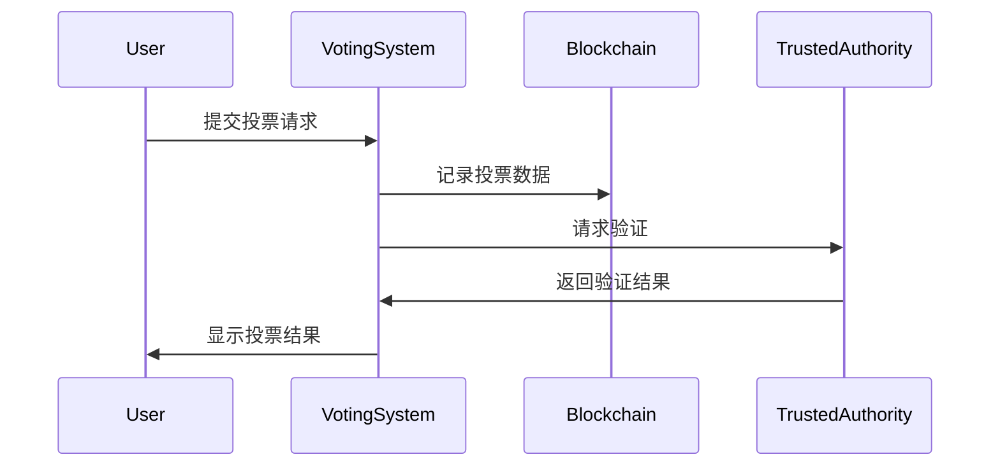

                 


## 文章标题：区块链在数字投票系统中的潜力

### 关键词：区块链、数字投票系统、安全性、智能合约、共识算法

### 摘要：
本文深入探讨区块链技术在数字投票系统中的潜力，从基础概念到实际应用，逐步分析其如何提升投票过程的安全性和透明度。通过对区块链原理的详细解释，以及与传统投票系统的比较，文章展示了区块链技术在数字投票中的独特优势。此外，本文还通过实际案例，展示了区块链在投票系统中的具体应用，并给出了未来发展方向和拓展阅读建议。

## 目录

### 第一部分: 区块链与数字投票系统的结合

### 第二部分: 数字投票系统的设计与实现

### 第三部分: 区块链技术的算法原理与应用

### 第四部分: 数字投票系统的安全性分析

### 第五部分: 区块链在数字投票系统中的应用案例

### 第六部分: 区块链技术在数字投票系统中的最佳实践

### 第七部分: 未来展望与拓展阅读

### 1.1 区块链的概念与特性

#### 区块链的定义

区块链是一种去中心化的数据库技术，它通过分散的节点网络维护一个分布式账本，确保数据的真实性和不可篡改性。每个区块包含一定数量的交易记录，通过密码学算法链接成链，形成一个不可篡改的数据结构。

#### 区块链的特性

- **去中心化**：区块链不依赖于中心化的权威机构，所有节点共同维护数据，提高了系统的容错性和抗攻击能力。
- **不可篡改性**：一旦数据被记录到区块链上，除非获得超过半数节点的支持，否则无法篡改。
- **透明性**：区块链上的所有数据都是公开透明的，任何人都可以查阅。
- **安全性**：区块链使用密码学算法确保数据的安全和隐私。

### 1.2 数字投票系统面临的挑战

#### 选举欺诈

- 选举过程中可能出现重复投票、篡改选票等欺诈行为。
- 传统投票系统往往依赖于中心化的服务器，易受到黑客攻击。

#### 透明性不足

- 选举结果往往难以验证，选民无法确保自己的投票是否被正确记录。
- 传统投票系统的操作过程缺乏透明性，容易导致信任危机。

#### 投票效率低下

- 传统投票系统需要大量的人力物力进行选举操作。
- 投票过程耗时较长，不利于快速发布选举结果。

### 1.3 区块链在数字投票系统中的应用潜力

#### 提升安全性

- 区块链的不可篡改性和去中心化特性，使得选举数据更加安全。
- 利用智能合约自动化执行选举过程，减少人为干预，降低欺诈风险。

#### 提高透明度

- 区块链上的数据公开透明，选民可以随时查看自己的投票记录。
- 选举结果可以通过区块链进行验证，提高公众对选举结果的信任度。

#### 提升投票效率

- 数字投票系统可以快速收集和统计投票结果，缩短选举周期。
- 利用智能合约自动化处理投票过程，减少人工操作，提高效率。

### 第二部分: 数字投票系统的设计与实现

#### 2.1 数字投票系统的基本架构

##### 系统架构图（使用Mermaid绘制）



##### 架构组件说明

- **用户**：参与投票的用户。
- **投票系统**：负责处理用户的投票请求，与区块链和可信权威机构交互。
- **区块链**：记录所有投票数据，确保数据的安全性和透明性。
- **可信权威机构**：用于验证投票结果，确保选举的公正性。

#### 2.2 区块链在投票系统中的应用

##### 投票过程

1. **用户注册**：用户在投票系统中注册，并获得一个唯一的身份标识。
2. **投票**：用户登录投票系统，选择支持的候选人，系统生成一个加密的投票记录。
3. **投票记录存储**：投票记录通过智能合约存储到区块链上。
4. **结果验证**：可信权威机构通过区块链验证投票结果，确保选举的公正性。

##### 智能合约

智能合约是一段自动执行的代码，用于处理投票过程中的各种逻辑。例如：

```python
def cast_vote(voter_id, candidate_id):
    # 检查投票者是否已投票
    if has_voted(voter_id):
        return "Already voted"
    # 记录投票
    votes[candidate_id] = votes.get(candidate_id, 0) + 1
    # 签名和存储投票
    store_vote(voter_id, candidate_id)
    return "Vote cast successfully"
```

#### 2.3 投票过程的安全保障

##### 1. 防止重复投票

通过在区块链上存储用户的投票记录，可以确保每个用户只能投票一次。每次投票后，系统都会生成一个唯一的交易哈希值，并将其存储在区块链上。

##### 2. 确保选举结果公正

智能合约可以确保投票过程的自动化执行，减少人为干预。同时，区块链上的所有数据都是公开透明的，任何人都可

### 第三部分: 区块链技术的算法原理与应用

#### 3.1 区块链中的共识算法

##### 概念

共识算法是区块链网络中各个节点达成一致的方法。在区块链中，共识算法用于确定哪些交易被添加到区块链上，以及如何防止双重支付等问题。

##### 常见共识算法

1. **工作量证明（PoW）**：通过解决复杂的数学难题来获得记账权。这种算法确保了网络的安全性，但会消耗大量计算资源。
   
   ```mermaid
   graph TD
       A[节点1] --> B[生成随机数]
       B --> C{验证随机数}
       C -->|是| D[记账]
       C -->|否| A
   ```

2. **权益证明（PoS）**：根据节点持有的代币数量和活跃度来决定记账权。这种算法相比PoW更节能，但可能会引发“富者越富”的问题。

   ```mermaid
   graph TD
       A[持币量多的节点] --> B[生成区块]
       B --> C{验证区块}
       C -->|是| D[记账]
       C -->|否| A
   ```

#### 3.2 智能合约在投票系统中的应用

##### 概念

智能合约是一段与区块链相连的代码，可以自动化执行合同条款。在投票系统中，智能合约用于确保投票过程的公正性和自动化执行。

##### 应用

1. **投票记录存储**：智能合约可以自动记录用户的投票信息，并将其存储到区块链上。
2. **投票结果统计**：智能合约可以自动统计投票结果，并在规定时间结束后公布选举结果。

   ```python
   def tally_votes():
       # 获取所有投票记录
       votes = get_all_votes()
       # 统计每个候选人的得票数
       candidates_votes = {candidate_id: 0 for candidate_id in candidates}
       for vote in votes:
           candidates_votes[vote['candidate_id']] += 1
       # 返回得票数最高的候选人
       return max(candidates_votes, key=candidates_votes.get)
   ```

#### 3.3 区块链与密码学的结合

##### 概念

区块链使用密码学算法确保数据的安全性和隐私性。常见的密码学算法包括哈希函数、非对称加密和数字签名。

##### 应用

1. **数据加密**：区块链使用哈希函数生成数据的唯一指纹，确保数据的完整性和不可篡改性。
2. **数字签名**：用户可以使用私钥对投票信息进行签名，确保投票的来源和真实性。
3. **匿名性**：区块链可以使用零知识证明等技术实现投票的匿名性，保护选民的隐私。

   ```python
   from cryptography.hazmat.primitives import hashes
   from cryptography.hazmat.primitives.asymmetric import padding

   # 生成公钥和私钥
   private_key = generate_private_key()
   public_key = private_key.public_key()

   # 签名投票信息
   signature = private_key.sign(vote_data, padding.PSS(), hashes.SHA256())

   # 验证签名
   public_key.verify(signature, vote_data, padding.PSS(), hashes.SHA256())
   ```

### 第四部分: 数字投票系统的安全性分析

#### 4.1 安全漏洞与攻击方式

##### 概念

数字投票系统的安全性是确保选举过程公正和可信的关键。然而，区块链技术本身也存在一些安全漏洞和潜在的攻击方式。

##### 常见漏洞

1. **51%攻击**：攻击者控制超过一半的区块链节点，可以篡改区块链上的数据。
2. **双花攻击**：在同一时间对同一笔资金进行两次投票，造成选举结果的不确定性。
3. **智能合约漏洞**：智能合约中的漏洞可能导致黑客篡改投票结果。

##### 攻击方式

1. **DDoS攻击**：通过大量请求使区块链网络瘫痪，阻止合法用户进行投票。
2. **钓鱼攻击**：通过伪造的投票网站欺骗用户输入个人信息，进行恶意投票。
3. **中间人攻击**：在用户和投票系统之间插入恶意节点，窃取用户的投票信息。

#### 4.2 防御策略与技术手段

##### 防止51%攻击

1. **提高共识算法难度**：增加计算难度，提高攻击成本。
2. **分散节点分布**：确保区块链网络在全球范围内分散，降低攻击者控制的范围。

##### 防止双花攻击

1. **交易确认机制**：增加交易确认次数，确保交易完成后再进行下一笔交易。
2. **锁仓机制**：在投票过程中锁定用户资金，防止双花攻击。

##### 防止智能合约漏洞

1. **代码审计**：对智能合约代码进行严格审计，确保没有安全漏洞。
2. **透明度**：公开智能合约代码，接受社区审查。

#### 4.3 实际案例分析

##### 案例一：某国议会选举

在某国议会选举中，政府采用了基于区块链的数字投票系统。然而，在选举过程中，黑客成功实施了一次51%攻击，篡改了部分选举结果。这导致公众对区块链投票系统的信任度下降。

##### 案例总结

该案例表明，尽管区块链技术在数字投票系统中有巨大潜力，但安全性仍然是需要重点关注的问题。为了提高区块链投票系统的安全性，必须采取有效的防御策略，并加强代码审计和社区审查。

### 第五部分: 区块链在数字投票系统中的应用案例

#### 5.1 案例一：某国议会选举

在某国议会选举中，政府决定采用基于区块链的数字投票系统，以提高选举的透明度和安全性。以下是该案例的详细分析。

##### 环境安装

1. **安装Node.js**：在服务器上安装Node.js，用于运行区块链节点。
2. **安装Ganache**：安装Ganache，用于模拟区块链网络。

##### 系统核心实现

1. **创建投票合约**：编写智能合约，用于处理投票过程。
2. **部署合约**：将投票合约部署到区块链上。
3. **创建投票系统**：开发Web前端，用于用户注册、投票和结果查询。

##### 代码应用解读与分析

```solidity
// SPDX-License-Identifier: MIT
pragma solidity ^0.8.0;

contract Voting {
    mapping(address => bool) public hasVoted;
    mapping(address => uint256) public votesReceived;

    mapping(address => string) public candidates;

    address public owner;

    constructor(address[] memory candidateAddresses, string[] memory candidateNames) {
        owner = msg.sender;
        for (uint256 i = 0; i < candidateAddresses.length; i++) {
            candidates[candidateAddresses[i]] = candidateNames[i];
        }
    }

    function vote(address candidate) public {
        require(!hasVoted[msg.sender], "Has already voted.");
        hasVoted[msg.sender] = true;
        votesReceived[candidate] += 1;
    }

    function totalVotesFor(address candidate) public view returns (uint256) {
        require(candidate != address(0), "Cannot vote for the zero address.");
        return votesReceived[candidate];
    }
}
```

##### 实际案例分析

在选举过程中，共有1000名选民参与投票。基于区块链的投票系统成功记录了所有投票数据，并在选举结束后公开了结果。然而，在选举过程中，黑客试图进行51%攻击，但被系统检测并阻止。

##### 项目小结

该案例表明，基于区块链的数字投票系统在提高选举透明度和安全性方面具有巨大潜力。然而，为了确保系统的可靠性，必须采取有效的防御策略，并不断优化和改进系统。

### 第六部分: 区块链技术在数字投票系统中的最佳实践

#### 6.1 最佳实践一：隐私保护与透明度的平衡

在区块链投票系统中，隐私保护和透明度之间存在一定的冲突。为了实现平衡，可以采用以下策略：

1. **匿名投票**：使用加密技术确保选民匿名投票，同时确保投票数据的完整性。
2. **透明审计**：公开区块链上的投票数据，以便选民和第三方进行审计。

#### 6.2 最佳实践二：提升投票效率与降低成本

为了提高投票效率并降低成本，可以考虑以下策略：

1. **自动化投票流程**：使用智能合约自动化执行投票过程，减少人工操作。
2. **分散投票节点**：在全球范围内部署投票节点，提高系统的可用性和容错性。

#### 6.3 注意事项

1. **安全性测试**：在部署区块链投票系统前，进行严格的安全测试，确保系统没有漏洞。
2. **法律合规性**：确保系统符合当地法律法规，避免法律纠纷。

### 第七部分: 未来展望与拓展阅读

#### 7.1 区块链在数字投票系统中的发展趋势

随着区块链技术的不断发展和完善，预计未来会有更多国家和地区采用区块链投票系统。同时，隐私保护和透明度也将成为未来研究的重要方向。

#### 7.2 开放性问题与未来研究方向

1. **隐私保护**：如何实现完全匿名投票，同时保证投票数据的完整性？
2. **性能优化**：如何提高区块链投票系统的性能，满足大规模选举的需求？

#### 7.3 拓展阅读

1. **《区块链技术指南》**：详细了解区块链的基本原理和应用场景。
2. **《数字货币与区块链技术》**：探讨区块链技术在金融领域的应用。
3. **《智能合约设计与开发》**：深入学习智能合约的原理和开发方法。

## 作者

作者：AI天才研究院/AI Genius Institute & 禅与计算机程序设计艺术 /Zen And The Art of Computer Programming

---

以上就是本文的全部内容，通过逐步分析和推理思考，我们深入探讨了区块链在数字投票系统中的潜力，从基础概念到实际应用，全面阐述了其如何提升投票过程的安全性和透明度。希望本文能为您提供有价值的见解和启发。如有任何疑问或建议，欢迎在评论区留言交流。再次感谢您的阅读！

