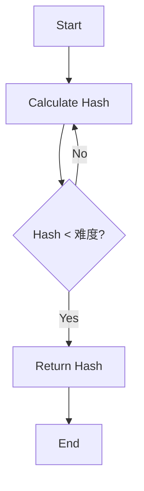
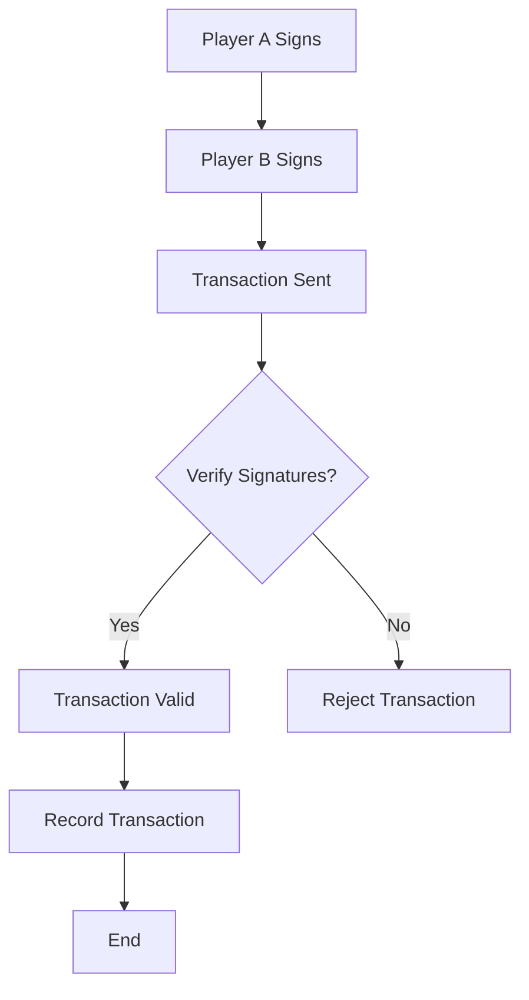
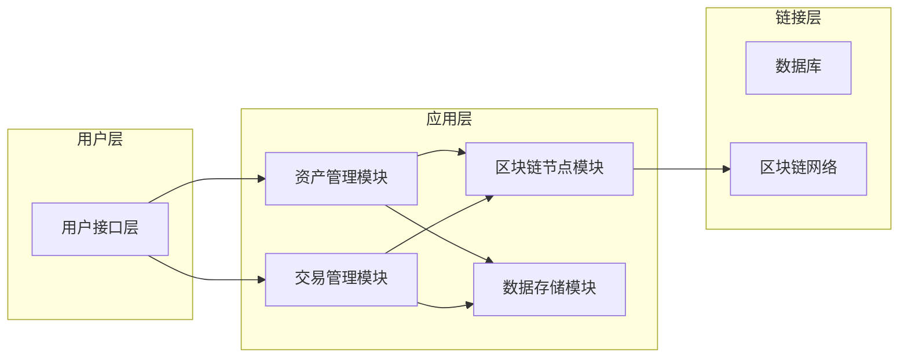

                 

### 第1章 引言

在当今数字化的时代，区块链技术正逐渐成为许多行业创新的关键驱动力。区块链不仅带来了前所未有的透明性和安全性，还为去中心化应用（DApps）的开发提供了坚实的基础。而数字游戏行业，作为一个充满活力且不断成长的领域，也开始深度探索区块链技术的应用，尤其是如何通过区块链技术管理数字游戏资产。

数字游戏资产管理涉及到游戏内物品、虚拟货币、角色装备等多种形式的虚拟财产。这些资产具有独特性、稀缺性和不可替代性，因此，如何确保它们的安全性和互操作性成为了一个亟待解决的问题。传统的游戏内资产系统往往存在中心化程度高、资产转移困难、安全性低等问题，这使得玩家对游戏资产管理的信任度降低，严重影响了用户体验。

跨游戏资产互通平台的出现，正是为了解决这些问题。它允许玩家在不同游戏之间自由转移和交易自己的资产，从而打破了游戏之间的壁垒，提升了玩家对游戏生态系统的参与度和忠诚度。区块链技术的引入，为跨游戏资产互通平台提供了安全的去中心化解决方案，使得资产转移更加便捷和透明。

本文将深入探讨区块链在数字游戏资产管理中的应用，具体分析跨游戏资产互通平台的构建与实现。我们将从以下几个方面展开讨论：

1. **背景介绍**：介绍区块链技术、数字游戏资产管理和跨游戏资产互通平台的基础知识。
2. **核心概念与联系**：详细讲解区块链、智能合约、非同质化代币（NFT）等关键概念，并阐述它们在数字游戏资产中的应用。
3. **算法原理讲解**：分析区块链算法在数字游戏资产管理中的应用，并使用Python代码和mermaid流程图进行详细阐述。
4. **数学模型和数学公式讲解**：介绍区块链算法涉及的数学模型和公式，并用latex格式嵌入文中进行详细解释。
5. **系统分析与架构设计方案**：描述跨游戏资产互通平台的设计与实现，包括系统功能设计、系统架构设计和系统接口设计等。
6. **项目实战**：通过实际操作步骤和案例分析，展示如何搭建跨游戏资产互通平台。
7. **最佳实践 tips**、**小结**、**注意事项**和**拓展阅读**等内容：总结全文内容，给出未来研究方向和实践建议。

通过上述内容的逐步探讨，我们希望能够为读者提供一个全面、深入的区块链在数字游戏资产管理中的应用指南，从而激发更多的创新思维和实际应用案例。

### 文章关键词

区块链、数字游戏资产管理、跨游戏资产互通平台、非同质化代币（NFT）、智能合约、共识算法、数学模型、系统架构设计、项目实战。

### 文章摘要

本文深入探讨了区块链技术在数字游戏资产管理中的应用，重点研究了如何构建跨游戏资产互通平台。文章首先介绍了区块链技术、数字游戏资产管理和非同质化代币（NFT）等核心概念，并分析了它们在跨游戏资产互通平台中的具体应用。随后，文章详细讲解了区块链算法的原理及数学模型，通过mermaid流程图和Python代码展示了算法的实际应用。接着，文章阐述了跨游戏资产互通平台的系统架构设计，并介绍了系统功能模块的设计和实现。通过实际案例分析和项目实战，文章展示了如何搭建和运行一个跨游戏资产互通平台。最后，文章总结了最佳实践、注意事项，并提出了未来研究的方向和拓展建议。

### 第2章 区块链技术概述

区块链技术作为一种分布式账本技术，近年来在金融、医疗、物流等多个领域展现出了巨大的潜力。其核心理念是通过去中心化的方式，将数据分散存储在多个节点上，从而实现信息的透明性和安全性。

#### 2.1 区块链基础

**原理与结构**

区块链的原理可以简单概括为数据的分布式存储和传输。它由多个按时间顺序排列的“区块”组成，每个区块包含一定数量的交易记录。这些区块通过密码学方法链接在一起，形成一个不可篡改的链式结构。

- **区块**：区块是区块链的基本单元，包含了交易信息、时间戳、区块链的上一区块哈希值等。每个区块的大小通常固定，一旦达到上限，就会生成一个新的区块。
- **链式结构**：区块链通过每个区块包含的上一区块哈希值，将所有区块链接成一个不可篡改的链。任何对区块内容的修改都会导致哈希值的改变，从而被其他节点检测出来。

**安全机制**

区块链的安全机制主要依赖于密码学和共识算法。

- **密码学**：区块链使用公钥密码学来确保交易的安全性和隐私性。交易双方使用公钥和私钥进行加密和解密操作，私钥是确保交易真实性的关键。
- **共识算法**：共识算法是区块链网络中节点之间达成一致的方法。不同的区块链平台采用不同的共识算法，如工作量证明（PoW）、权益证明（PoS）、拜占庭容错（BFT）等。

**关键特性**

区块链具有以下几个关键特性：

- **去中心化**：去中心化意味着没有中央权威机构控制区块链，所有节点都有平等的权力和义务。
- **不可篡改**：一旦数据被记录在区块链上，就几乎无法被篡改，因为任何篡改都会被其他节点检测并拒绝。
- **透明性**：区块链上的所有交易记录都是公开的，任何人都可以查看和验证。
- **安全性**：通过密码学和共识算法，区块链在保证数据透明和不可篡改的同时，也确保了交易的安全性和隐私性。

#### 2.2 数字游戏资产

**概念**

数字游戏资产是指在游戏环境中存在的、有价值的、可以交易或转移的物品和资源。这些资产可以是虚拟货币、装备、道具、角色技能点等。

**特点**

数字游戏资产具有以下几个特点：

- **独特性**：每个数字游戏资产都是独一无二的，例如NFT（非同质化代币）。
- **稀缺性**：许多数字游戏资产具有有限的供应量，使得它们具有更高的价值。
- **不可替代性**：数字游戏资产通常具有独特的属性，使其不可替代。
- **易转移性**：通过区块链技术，数字游戏资产可以在不同游戏和平台之间进行转移和交易。

**管理挑战**

数字游戏资产的管理面临以下挑战：

- **安全性**：确保资产不被盗取或篡改。
- **互操作性**：不同游戏和平台之间的资产转移和交易。
- **中心化风险**：传统游戏资产系统往往存在中心化程度高的问题，使得玩家对资产的安全性和可靠性缺乏信任。
- **用户体验**：如何简化资产转移和交易流程，提升用户体验。

#### 2.3 跨游戏资产互通平台

**概念**

跨游戏资产互通平台是一种利用区块链技术构建的系统，旨在实现不同游戏和平台之间数字游戏资产的自由转移和交易。这种平台打破了传统游戏生态中的壁垒，为玩家提供了一个开放、透明和安全的资产管理系统。

**优势**

跨游戏资产互通平台具有以下优势：

- **去中心化**：平台通过区块链技术实现去中心化，确保资产转移的透明性和安全性。
- **互操作性**：平台支持不同游戏和平台之间的资产互操作，提升用户体验。
- **安全性**：通过区块链的安全机制，保障资产的安全性和隐私性。
- **灵活性**：平台可以根据不同游戏的需求进行定制化开发，适应各种场景。

**挑战**

跨游戏资产互通平台也面临以下挑战：

- **技术难题**：如何实现不同区块链和游戏平台之间的互操作性和兼容性。
- **法律和监管**：不同国家和地区对数字资产和区块链技术的监管政策不同，需要遵守相关法律法规。
- **用户体验**：如何简化资产转移和交易流程，提升用户的便捷性和满意度。

通过上述内容，我们为后续章节的讨论奠定了基础，为深入探讨区块链在数字游戏资产管理中的应用提供了必要的背景知识。

### 2.4 非同质化代币（NFT）的基本原理

非同质化代币（NFT，Non-Fungible Token）是区块链技术中一种独特的数字资产，与传统的同质化代币（如比特币或以太币）不同，NFT具有不可互换性和独特性。每一个NFT都是独一无二的，其背后的数字信息和物理对象有明确的对应关系，这使得NFT在数字资产领域具有广泛的应用前景。

#### 2.4.1 NFT的定义

NFT是一种基于区块链的数字资产，代表的是某个特定物品的所有权和证明。这些物品可以是数字艺术品、收藏品、游戏道具、虚拟土地等。与同质化代币不同，NFT具有以下特点：

- **唯一性**：每个NFT都是唯一的，不能与其他NFT互换。
- **不可分割性**：NFT不能被分割成更小的部分，尽管某些区块链平台允许进行部分转让。
- **所有权证明**：NFT持有者拥有其对应物品的所有权证明，并可以证明其历史交易信息。

#### 2.4.2 NFT的工作原理

NFT的工作原理基于区块链和智能合约技术。以下是其核心组成部分：

- **区块链**：NFT存储在区块链上，确保其数据的不可篡改性和透明性。
- **智能合约**：智能合约是自动执行协议的计算机程序，用于管理NFT的创建、转移和交易。智能合约定义了NFT的创建规则、所有权转移规则和交易条款等。

具体工作流程如下：

1. **NFT创建**：创建者通过智能合约将特定物品上传到区块链，并创建对应的NFT。智能合约记录了NFT的唯一标识符、创作者信息、物品描述等。
2. **NFT注册**：NFT被注册到区块链上，其他节点可以验证其存在和所有权信息。
3. **所有权转移**：NFT持有者可以通过智能合约将NFT转移给其他用户。智能合约会自动更新NFT的所有权信息，并记录在区块链上。
4. **NFT交易**：NFT可以在市场上进行买卖，交易过程通过智能合约自动执行，确保交易的安全性和透明性。

#### 2.4.3 NFT的用途

NFT在多个领域展示了其独特的应用价值，以下是一些主要用途：

- **数字艺术品**：NFT被广泛应用于数字艺术品的交易和所有权证明，例如数字画作、音乐、视频等。艺术家通过创建NFT，可以确保作品的真实性和唯一性，并实现版权保护和收益分配。
- **收藏品**：NFT在数字收藏品领域也具有广泛的应用，如游戏中的稀有道具、虚拟土地等。这些物品通过NFT进行唯一标识，确保其稀缺性和真实性。
- **虚拟资产**：NFT在虚拟现实（VR）和增强现实（AR）领域有重要应用，如虚拟现实中的独特物品和房地产。这些物品的所有权和交易可以通过NFT实现。
- **身份验证**：NFT可以用于身份验证，例如在数字身份管理系统中，通过NFT记录和验证用户身份信息，提高安全性。
- **金融衍生品**：NFT也被用于金融衍生品的交易，如数字债券、股票等。NFT可以确保金融资产的真实性和唯一性，提高交易的可信度。

通过NFT，数字游戏资产的管理变得更加高效和透明。NFT不仅为数字游戏资产提供了一个去中心化的所有权证明，还实现了资产的可追溯性和不可篡改性。这使得玩家可以更安全地管理自己的游戏资产，并在不同游戏和平台之间自由转移和交易。

### 2.5 NFT在数字游戏中的应用

NFT在数字游戏中的应用极大地改变了传统游戏资产的管理方式，使得游戏资产具有更高的透明性、安全性和互操作性。以下从多个方面详细探讨NFT在数字游戏中的应用及其优势。

#### 2.5.1 NFT在数字游戏中的优势

**唯一性保证**

NFT的不可互换性和唯一性确保了游戏资产的真实性和独特性。每个NFT都代表了特定的游戏道具、角色装备或虚拟物品，这些物品在区块链上被永久记录，不能被复制或篡改。这意味着玩家可以确信他们拥有的游戏资产是独一无二且不可伪造的。

**不可篡改性**

区块链的不可篡改性保证了NFT的安全性和可信度。任何对NFT的修改都会被区块链网络中的其他节点检测出来并拒绝。这使得游戏资产的所有权和交易记录不可篡改，增强了玩家的信任感。

**去中心化管理**

NFT通过去中心化的区块链技术进行管理，避免了传统游戏资产系统中存在的中介和中心化机构。这种去中心化的方式提高了游戏的透明性和开放性，使得玩家可以更加自由地管理和交易游戏资产，无需依赖游戏运营商或其他第三方机构。

**资产转移便捷性**

NFT使得游戏资产在不同游戏和平台之间进行转移和交易变得更加便捷。玩家可以轻松地将自己在一个游戏中的稀有装备或虚拟土地转移到另一个游戏中，从而实现跨游戏资产的互通。这种便捷性不仅提升了用户体验，还为游戏生态系统的多样化发展提供了可能。

**增加游戏内价值**

NFT引入了一种新的游戏内经济模式，使得游戏资产具有更高的价值。由于NFT的独特性和稀缺性，玩家可以通过在游戏内外交易这些资产获得实际的经济收益。这种经济激励机制不仅提高了玩家的参与度，还促进了游戏生态系统的繁荣。

#### 2.5.2 NFT在数字游戏资产管理中的应用

**虚拟物品管理**

NFT在虚拟物品管理中的应用最为广泛。玩家可以通过购买、交易和持有NFT来获取游戏中的稀有道具、装备和角色属性。这些虚拟物品不仅具有独特的属性和外观，还可以通过区块链上的记录进行永久保存，确保其真实性和不可篡改性。

例如，一款流行的在线游戏可以使用NFT来管理游戏中的稀有装备。玩家可以通过完成任务或参与活动获得这些装备的NFT，并在游戏中使用。这些装备的所有权和交易记录都会在区块链上被永久记录，玩家可以随时查询和验证。

**虚拟土地和房地产**

在虚拟现实（VR）和增强现实（AR）游戏中，NFT被广泛应用于虚拟土地和房地产的管理。玩家可以在游戏中购买和拥有虚拟土地，并通过NFT确保其所有权和真实性。这些虚拟土地可以用于建造房屋、商店或社区中心，从而形成完整的虚拟生态系统。

例如，一个虚拟城市游戏可以为玩家提供虚拟土地出售的NFT。玩家可以购买土地，并在土地上建造自己的建筑物。这些土地和建筑物的所有权都通过NFT进行记录，确保其唯一性和不可篡改性。

**游戏内经济系统**

NFT在游戏内经济系统中发挥了重要作用，使得游戏资产具有更高的流动性和价值。游戏开发商可以通过发行NFT来创建新的经济模式，鼓励玩家参与游戏并提高游戏的活跃度。

例如，一个游戏可以发行NFT作为虚拟货币，用于购买游戏道具、装备或参与游戏活动。玩家可以通过完成任务或交易获得这些NFT，从而增加其在游戏内的经济实力。这种经济模式不仅提高了玩家的参与度，还为游戏生态系统的繁荣提供了动力。

**跨游戏资产互通**

NFT的引入使得不同游戏之间的资产互通成为可能。玩家可以将在一个游戏中的资产转移到另一个游戏中，从而实现跨游戏的资产互操作。这种互通性不仅提升了用户体验，还为游戏生态系统的多样性提供了可能。

例如，一个游戏中的稀有装备可以通过NFT转移到另一个游戏中，玩家可以在另一个游戏中使用这些装备。这种跨游戏资产互通不仅增加了游戏的趣味性，还促进了不同游戏之间的合作和互动。

总之，NFT在数字游戏中的应用为游戏资产的管理提供了新的思路和可能性。通过引入NFT，游戏开发者可以构建一个更加开放、透明和安全的游戏生态系统，提升玩家的体验和参与度。同时，NFT的引入也为游戏生态系统的经济模式带来了新的机遇，推动了游戏产业的发展。

### 2.6 跨游戏资产互通平台的设计与实现

跨游戏资产互通平台是区块链技术在数字游戏资产管理中的重要应用，它通过去中心化的方式，实现不同游戏和平台之间资产的无缝转移和交易。以下是跨游戏资产互通平台的设计与实现，包括平台架构设计、系统功能模块设计和实现、数据架构设计、安全机制和隐私保护等方面。

#### 2.6.1 平台架构设计

跨游戏资产互通平台的设计遵循模块化原则，确保系统的可扩展性和可维护性。平台的基本架构可以分为以下几个层次：

1. **网络层**：包括区块链网络、节点和智能合约。区块链网络负责数据存储和传输，节点负责验证交易和共识，智能合约实现具体的业务逻辑。
2. **业务逻辑层**：包括资产注册模块、资产转移模块和交易验证模块。资产注册模块用于创建和注册游戏资产，资产转移模块用于实现资产在不同游戏和平台之间的转移，交易验证模块用于确保交易的安全性和正确性。
3. **用户接口层**：包括前端和后端。前端负责与用户互动，提供资产查看、注册、转移和交易等功能，后端负责处理业务逻辑和与区块链网络的交互。
4. **支持层**：包括数据库、缓存和日志系统等。数据库用于存储用户数据、资产数据和交易记录，缓存用于提高系统响应速度，日志系统用于记录系统运行状态和错误信息。

#### 2.6.2 系统功能模块设计

跨游戏资产互通平台的主要功能模块包括以下几部分：

1. **资产注册模块**：玩家或游戏开发者可以通过该模块将游戏资产注册到区块链上，确保资产的唯一性和不可篡改性。注册过程中，系统会生成一个对应的NFT，并将其与游戏资产关联。
2. **资产转移模块**：该模块用于实现资产在不同游戏和平台之间的转移。玩家可以通过前端界面发起资产转移请求，系统会通过智能合约验证转移请求的合法性和安全性，并将资产从源游戏转移到目标游戏。
3. **交易验证模块**：该模块用于验证交易的正确性和安全性。每个交易都会经过多重签名验证，确保交易的真实性和合法性。同时，系统还会记录交易信息到区块链上，确保数据的不可篡改性。
4. **用户接口模块**：该模块提供用户与系统交互的接口，包括资产查看、注册、转移和交易等功能。前端界面需要支持多种设备，确保用户体验的流畅性。

#### 2.6.3 数据架构设计

跨游戏资产互通平台的数据架构设计需要考虑数据的一致性、可靠性和扩展性。以下是平台的主要数据结构：

1. **用户数据**：包括用户身份信息、注册信息、资产持有信息等。用户数据存储在区块链上，确保数据的安全性和不可篡改性。
2. **资产数据**：包括资产类型、属性、持有者信息、NFT信息等。资产数据存储在区块链上，与NFT进行关联，确保资产的唯一性和不可篡改性。
3. **交易数据**：包括交易发起者、交易接收者、交易金额、交易时间、交易状态等。交易数据存储在区块链上，确保交易记录的透明性和不可篡改性。
4. **日志数据**：包括系统运行日志、错误日志、操作日志等。日志数据用于系统监控和故障排查。

#### 2.6.4 安全机制和隐私保护

跨游戏资产互通平台的安全机制和隐私保护至关重要，以下是平台采取的主要安全措施：

1. **多重签名机制**：所有重要交易都需要多重签名验证，确保交易的真实性和合法性。多个参与方需要共同签名才能完成交易，提高了系统的安全性。
2. **非同质化代币（NFT）安全**：NFT的安全性依赖于区块链的密码学机制。系统使用加密算法保护NFT的创建、转移和存储过程，确保NFT不会被非法篡改或伪造。
3. **数据加密**：用户数据和交易数据在传输和存储过程中都会进行加密处理，防止数据泄露和篡改。系统支持多种加密算法和密钥管理机制，确保数据的安全性和隐私性。
4. **身份验证机制**：系统采用多种身份验证方式，包括密码学签名、指纹识别、面部识别等，确保用户身份的合法性和安全性。
5. **隐私保护**：系统采用隐私保护技术，如零知识证明（Zero-Knowledge Proof）和同态加密（Homomorphic Encryption），确保用户数据和交易信息的隐私性。

通过上述设计与实现，跨游戏资产互通平台能够提供安全、透明和高效的数字游戏资产管理解决方案，为玩家和游戏开发者创造更大的价值。

### 2.7 智能合约开发

智能合约是区块链技术的核心组成部分，它是一种自动执行的合约，在满足特定条件时自动执行预定的操作。智能合约的出现，使得去中心化的应用（DApps）成为可能，大大简化了交易过程，并提高了交易的透明性和安全性。在跨游戏资产互通平台中，智能合约扮演着至关重要的角色，用于管理游戏资产的注册、转移和交易。

#### 2.7.1 智能合约的基本原理

智能合约的基本原理可以概括为以下几个关键点：

1. **编码与部署**：智能合约通常使用特定的编程语言（如Solidity）编写，然后编译成机器码（字节码），并部署到区块链上。部署后，智能合约在区块链上永久存在，可以被所有节点访问和执行。

2. **触发机制**：智能合约通过事件触发机制来执行操作。当满足特定条件或触发特定事件时，智能合约会自动执行预定的操作，如资产转移、交易验证等。

3. **不可篡改性**：智能合约一旦部署到区块链上，其代码和逻辑就变得不可篡改，这意味着任何企图修改智能合约的行为都会被区块链网络中的其他节点检测并拒绝。

4. **透明性**：智能合约的代码和执行过程都是公开透明的，任何用户都可以查看和验证智能合约的操作，确保交易的公正性和可信度。

#### 2.7.2 智能合约的安全问题

尽管智能合约具有许多优点，但其安全性也是不可忽视的问题。以下是一些常见的智能合约安全问题：

1. **重新入攻击（Reentrancy Attack）**：这种攻击利用了智能合约在处理多个交易时的漏洞，攻击者可以在智能合约执行过程中反复调用自身函数，从而耗尽合约资金。

2. **整数溢出攻击（Integer Overflow / Underflow Attack）**：整数溢出或下溢可能导致智能合约的计算结果不正确，攻击者可以利用这一漏洞进行恶意攻击。

3. **智能合约漏洞**：由于智能合约代码的复杂性和开发者水平的差异，智能合约中可能存在漏洞，攻击者可以利用这些漏洞进行非法操作。

4. **前端攻击**：前端攻击通过恶意前端代码干扰智能合约的执行，使得合约在不可预期的条件下执行。

为了提高智能合约的安全性，开发者在编写和部署智能合约时需要采取以下措施：

- **代码审计**：在部署智能合约之前，进行代码审计，发现并修复潜在的安全漏洞。
- **单元测试**：编写详细的单元测试，确保智能合约在各种情况下都能正确执行。
- **多重签名**：对重要操作使用多重签名机制，确保合约执行的安全性。
- **安全审计工具**：使用自动化安全审计工具检测潜在的安全风险。

#### 2.7.3 智能合约在跨游戏资产互通平台中的应用

在跨游戏资产互通平台中，智能合约主要用于以下几个方面：

1. **资产注册**：玩家或游戏开发者可以使用智能合约将游戏资产注册到区块链上，确保资产的唯一性和不可篡改性。注册过程中，智能合约会创建一个NFT，并将NFT与游戏资产关联。

2. **资产转移**：智能合约用于实现资产在不同游戏和平台之间的转移。当玩家发起资产转移请求时，智能合约会验证请求的合法性，并在满足条件时自动执行资产转移操作。

3. **交易验证**：智能合约用于验证交易的正确性和安全性。每个交易都会经过多重签名验证，确保交易的真实性和合法性。同时，智能合约会记录交易信息到区块链上，确保数据的不可篡改性。

4. **收益分配**：智能合约可以用于自动分配游戏内收益，如游戏道具的收益、虚拟土地的租金等。智能合约会根据预设的规则自动执行收益分配操作，确保分配过程的透明和公正。

通过智能合约的应用，跨游戏资产互通平台能够实现更加安全、透明和高效的数字游戏资产管理。智能合约不仅简化了交易过程，还提高了系统的可靠性和用户信任度。同时，智能合约的不可篡改性确保了资产管理的准确性和一致性，为跨游戏资产互通平台的发展奠定了坚实的基础。

### 2.8 区块链算法概述

区块链算法是区块链技术的核心组成部分，负责确保区块链系统的安全、高效和去中心化。区块链算法主要包括共识算法、交易算法和激励机制等方面。以下将分别对这些算法进行详细阐述。

#### 2.8.1 共识算法

共识算法是区块链网络中节点之间达成一致的方法，其主要目标是在分布式网络中确保所有节点的数据一致性。不同区块链平台采用不同的共识算法，以下是一些常见的共识算法：

1. **工作量证明（PoW，Proof of Work）**：PoW是比特币采用的共识算法。节点需要通过解决复杂的数学问题（挖矿）来获取区块生成权。这个过程不仅消耗大量计算资源，还能防止恶意节点攻击网络。

   **优点**：去中心化，无需依赖第三方机构。
   **缺点**：计算资源消耗大，能源消耗高，效率低。

2. **权益证明（PoS，Proof of Stake）**：PoS通过节点的权益（持有币龄和数量）来决定区块生成权。与PoW不同，PoS不需要通过计算工作来获取区块生成权，而是通过持有和锁定代币来获得。

   **优点**：能源消耗低，效率较高。
   **缺点**：权益集中度较高，可能影响去中心化程度。

3. **拜占庭容错（BFT，Byzantine Fault Tolerance）**：BFT是一种容错机制，能够在网络中存在部分恶意节点的情况下，确保系统的一致性和安全性。BFT通过复杂的投票和确认机制，确保大多数节点达成一致。

   **优点**：高效、低延迟。
   **缺点**：高度中心化，系统信任风险高。

#### 2.8.2 交易算法

交易算法是区块链系统中处理交易的关键部分。以下是一些常见的交易算法：

1. **简单交易算法**：简单交易算法通常基于交易输入和输出的总额一致性。即所有输入的代币总量必须等于输出的代币总量。

   **优点**：简单、易实现。
   **缺点**：安全性低，容易受到双花攻击。

2. **多重签名交易算法**：多重签名交易算法通过多个参与方共同签署交易来提高安全性。每个参与方都需要提供其私钥签名，才能使交易生效。

   **优点**：安全性高，防止恶意交易。
   **缺点**：交易复杂度增加，效率较低。

3. **时间戳交易算法**：时间戳交易算法通过添加时间戳来确保交易的顺序和不可篡改性。每个交易都会附上当前时间戳，系统根据时间戳来排序和验证交易。

   **优点**：确保交易顺序，防止双花攻击。
   **缺点**：对时间戳服务的依赖性高。

#### 2.8.3 激励机制

激励机制是区块链系统中用于激励节点参与和维护网络的重要机制。以下是一些常见的激励机制：

1. **挖矿奖励**：挖矿奖励是PoW系统中用于激励矿工的重要机制。矿工通过解决数学问题来获取新区块的生成权，并获得相应的代币奖励。

   **优点**：激励矿工积极参与网络。
   **缺点**：挖矿奖励可能导致币值不稳定。

2. **权益奖励**：权益奖励是PoS系统中用于激励节点的重要机制。节点通过持有和锁定代币来获取权益奖励。

   **优点**：降低挖矿资源消耗，提高网络安全性。
   **缺点**：可能导致币值波动。

3. **交易手续费**：交易手续费是通过收取交易手续费来激励网络参与者的重要机制。每次交易都会收取一定比例的手续费，用于奖励参与交易的节点。

   **优点**：简便、灵活。
   **缺点**：手续费可能导致交易成本增加。

通过上述区块链算法的介绍，我们可以看到，这些算法共同构建了一个安全、高效和去中心化的区块链系统。不同算法的优缺点决定了它们在不同场景下的适用性，而合理的激励机制则能够确保网络运行的稳定性和安全性。

### 区块链算法在数字游戏资产管理中的应用

区块链算法在数字游戏资产管理中的应用具有重要意义，通过这些算法，可以确保游戏资产的安全性和互操作性。以下将详细讨论区块链算法在数字游戏资产管理中的具体应用场景和优势。

#### 2.8.4 共识算法的应用

共识算法是区块链网络中节点之间达成一致的关键机制，在数字游戏资产管理中的应用主要体现在以下几个方面：

1. **资产转移确认**：在跨游戏资产互通平台中，玩家在不同游戏之间转移资产时，需要通过共识算法确保交易的一致性和安全性。例如，当玩家A将一个游戏中的稀有道具转移到另一个游戏中时，共识算法会确保该交易被所有节点验证和确认，从而防止双花攻击和欺诈行为。

2. **防篡改**：区块链的不可篡改特性通过共识算法得到保障。在数字游戏资产管理中，资产的所有权和交易记录都记录在区块链上，任何篡改行为都会被其他节点检测并拒绝，从而确保资产数据的真实性和可信度。

3. **去中心化**：共识算法的去中心化特性使得游戏资产的管理更加透明和公正。在传统中心化系统中，游戏运营商可能拥有对游戏资产的绝对控制权，而通过区块链共识算法，资产的所有权和管理权分散到多个节点上，玩家对游戏资产的管理更加自主。

#### 2.8.5 交易算法的应用

交易算法在数字游戏资产管理中用于处理资产交易和转移，以下是交易算法在数字游戏资产管理中的应用：

1. **多重签名交易**：在处理高价值的游戏资产交易时，多重签名交易算法可以提供更高的安全性。例如，当玩家A将一个稀有装备出售给玩家B时，该交易需要经过A和B的双重签名才能生效。这种机制确保了交易的真实性和合法性，防止恶意交易和欺诈行为。

2. **时间戳交易**：时间戳交易算法通过为交易添加时间戳，确保交易的顺序和不可篡改性。在数字游戏资产管理中，时间戳交易可以防止双花攻击，即同一资产在同一时间内被转移给两个不同的用户。时间戳交易确保了交易记录的完整性和一致性。

3. **简单交易算法**：对于一些低价值的游戏资产交易，简单交易算法可以提供更高效的交易处理能力。虽然简单交易算法的安全性较低，但在小额交易中，其低交易成本和快速处理速度可以显著提升用户体验。

#### 2.8.6 激励机制的应用

激励机制在区块链系统中用于激励节点参与网络维护和交易验证，以下是激励机制在数字游戏资产管理中的应用：

1. **挖矿奖励**：在PoW系统中，矿工通过解决数学问题（挖矿）来获取新区块的生成权，并获得相应的代币奖励。在数字游戏资产管理中，挖矿奖励可以激励矿工积极参与交易验证和资产转移，确保系统的安全性和可靠性。

2. **权益奖励**：在PoS系统中，节点通过持有和锁定代币来获取权益奖励。这种机制可以鼓励玩家长期持有游戏资产，从而增加系统的稳定性和安全性。

3. **交易手续费**：交易手续费是通过收取交易手续费来激励网络参与者的常用机制。在数字游戏资产管理中，交易手续费可以用于奖励参与交易的节点，激励他们积极参与交易验证和资产转移。

通过共识算法、交易算法和激励机制的共同作用，区块链算法为数字游戏资产管理提供了一套安全、高效和去中心化的解决方案。这些算法不仅确保了资产转移和交易的安全性和透明性，还提升了用户体验，为游戏开发者创造了更多的商业机会。

### 数学模型和数学公式讲解

在区块链算法的设计和实现过程中，数学模型和数学公式扮演着关键角色。它们不仅为算法的可靠性提供了理论依据，还帮助开发者理解和优化算法性能。以下将详细讲解区块链算法涉及的数学模型和公式，并通过具体的Python代码和mermaid流程图进行阐述。

#### 3.1 数学模型基础

**共识算法中的数学模型**

共识算法是区块链技术的核心，用于确保分布式网络中的节点达成一致。常见的共识算法包括工作量证明（PoW）和权益证明（PoS）。以下是一些基本的数学模型和公式：

1. **PoW算法的数学模型**

   - **挖矿难度**：挖矿难度用于调节矿工找到新区块的难度。难度越高，找到新区块所需的时间越长。

     $$ difficulty = \frac{target}{actual} $$

     其中，`target` 是预定的挖矿目标值，`actual` 是矿工计算出的当前值。

   - **工作量**：矿工在挖矿过程中需要解决一个复杂的数学问题（如SHA-256哈希函数）。工作量与矿工的计算能力成正比。

     $$ work = SHA-256(input) $$

2. **PoS算法的数学模型**

   - **权益计算**：在PoS系统中，节点的权益（Stake）决定了其获得区块生成权的概率。权益计算通常基于节点持有的代币数量和持有时间。

     $$ stake = balance \times time $$

     其中，`balance` 是节点持有的代币数量，`time` 是代币的持有时间。

**交易算法中的数学模型**

交易算法用于处理区块链中的交易记录。以下是一些基本的数学模型和公式：

1. **多重签名交易**

   - **验证签名**：在多重签名交易中，每个参与方需要提供其私钥签名，以确保交易的有效性。

     $$ verify\_signature(message, signature, public\_key) = \text{true} \quad \text{if} \quad \text{ECDSA}(\text{signature}, \text{public\_key}) = \text{message} $$

     其中，`message` 是交易信息，`signature` 是参与方的私钥签名，`public_key` 是参与方的公钥。

2. **时间戳交易**

   - **交易顺序**：时间戳交易算法通过为交易添加时间戳，确保交易的顺序。

     $$ timestamp = \text{current\_time} $$

     其中，`current_time` 是当前系统时间。

**激励机制中的数学模型**

激励机制用于激励节点参与区块链网络维护和交易验证。以下是一些基本的数学模型和公式：

1. **挖矿奖励**

   - **奖励计算**：在PoW系统中，矿工通过解决数学问题获得新区块的生成权，并获得相应的代币奖励。

     $$ reward = target\_reward \times (1 - \text{difficulty}) $$

     其中，`target_reward` 是预定的奖励值，`difficulty` 是当前挖矿难度。

2. **权益奖励**

   - **奖励计算**：在PoS系统中，节点通过持有和锁定代币获得权益奖励。

     $$ reward = stake \times (1 - \text{inflation\_rate}) $$

     其中，`stake` 是节点持有的权益，`inflation_rate` 是通货膨胀率。

#### 3.2 Python代码和mermaid流程图

以下通过具体的Python代码和mermaid流程图来展示上述数学模型的应用。

**PoW算法的Python代码示例**

```python
import hashlib
import time

def calculate_hash(input_str):
    return hashlib.sha256(input_str.encode('utf-8')).hexdigest()

def mine_block(target_difficulty):
    while True:
        hash_value = calculate_hash("block content")
        if int(hash_value, 16) < target_difficulty:
            return hash_value
        else:
            print("Calculating next block...")

target_difficulty = 10 ** 20  # 预定的挖矿难度
start_time = time.time()
hash_value = mine_block(target_difficulty)
end_time = time.time()
print(f"Found a block after {end_time - start_time} seconds.")
```

**mermaid流程图示例**



**多重签名交易的mermaid流程图**



通过上述示例，我们可以看到如何通过Python代码和mermaid流程图来阐述区块链算法中的数学模型和公式。这些工具不仅有助于开发者理解和实现算法，还可以帮助读者直观地理解算法的工作原理。

### 系统功能设计

系统功能设计是构建跨游戏资产互通平台的关键环节，它定义了平台的各项功能模块及其相互关系。以下将从领域模型和系统架构两个方面进行详细阐述。

#### 3.1 领域模型

领域模型是对系统所涉及的核心概念和实体进行抽象和表示的方法。在跨游戏资产互通平台中，主要的领域实体包括用户、资产、交易和节点等。

**实体定义：**

- **用户（User）**：代表使用平台的玩家或开发者，具有用户ID、密码、角色等属性。
- **资产（Asset）**：代表游戏中的虚拟物品或资源，包括资产ID、名称、类型、所有者等属性。
- **交易（Transaction）**：代表用户之间的资产转移操作，包括交易ID、发起者、接收者、金额、状态等属性。
- **节点（Node）**：代表区块链网络中的计算节点，包括节点ID、IP地址、角色等属性。

**ER实体关系图：**

以下是跨游戏资产互通平台的ER实体关系图（使用Mermaid语法表示）：

```mermaid
erDiagram
    User ||--|{ Asset }||--> :拥有
    User ||--|{ 交易 }||--> :发起
    User ||--|{ 交易 }||--> :接收
    Asset ||--|{ 交易 }||--> :存在于
    Node ||--|{ 交易 }||--> :验证
```

**实体属性对比表格：**

| 实体     | 属性                 | 描述                                                         |
|----------|----------------------|------------------------------------------------------------|
| 用户     | 用户ID、密码、角色   | 用户标识和访问控制信息                                       |
| 资产     | 资产ID、名称、类型   | 资产的唯一标识和分类信息                                     |
| 交易     | 交易ID、发起者、接收者、金额、状态 | 交易操作的唯一标识和相关信息                                 |
| 节点     | 节点ID、IP地址、角色 | 区块链网络节点的唯一标识和网络信息                           |

#### 3.2 系统架构设计

系统架构设计定义了跨游戏资产互通平台的整体结构和各个模块的交互方式。以下将从系统架构图、功能模块设计和接口设计三个方面进行详细阐述。

**系统架构图：**

以下是跨游戏资产互通平台的系统架构图（使用Mermaid语法表示）：

```mermaid
sequenceDiagram
    User -->|发起请求| Server
    Server -->|处理请求| Database
    Database -->|查询结果| Server
    Server -->|响应结果| User
```

**功能模块设计：**

系统架构包含以下几个主要功能模块：

1. **用户管理模块**：负责用户的注册、登录、权限管理等。
2. **资产注册模块**：负责资产的上传、注册和验证。
3. **交易管理模块**：负责交易记录的创建、查询、验证和执行。
4. **区块链节点模块**：负责区块链网络节点的维护、同步和交易验证。
5. **数据存储模块**：负责数据的存储、检索和备份。

**接口设计：**

系统对外提供以下接口：

1. **用户接口**：用于用户登录、注册、查询资产、发起交易等。
2. **资产接口**：用于资产的上传、注册、查询、转移等。
3. **交易接口**：用于创建交易、查询交易记录、验证交易等。
4. **区块链接口**：用于节点加入、同步数据、验证交易等。

**系统交互：**

以下是跨游戏资产互通平台的系统交互流程（使用Mermaid语法表示）：

```mermaid
sequenceDiagram
    User -->|发起交易| Server
    Server -->|验证用户| Database
    Database -->|返回用户信息| Server
    Server -->|创建交易记录| Database
    Database -->|返回交易ID| Server
    Server -->|发送交易请求| Blockchain
    Blockchain -->|验证交易| Server
    Server -->|返回验证结果| User
```

通过上述领域模型和系统架构设计，我们可以构建一个高效、安全、可扩展的跨游戏资产互通平台，为用户提供便捷的数字游戏资产管理服务。

### 系统架构设计

在构建跨游戏资产互通平台时，系统架构的设计至关重要，它决定了平台的稳定性、扩展性和安全性。以下将从系统架构图、系统接口设计、系统交互设计三个方面进行详细阐述。

#### 3.1 系统架构图

系统架构图展示了跨游戏资产互通平台的各个模块及其相互关系。以下是该平台的系统架构图（使用Mermaid语法表示）：



#### 3.2 系统接口设计

系统接口设计定义了跨游戏资产互通平台对外提供的API接口。以下是主要接口设计：

1. **用户接口（UserInterface）**：
   - **用户登录**：接收用户名和密码，验证用户身份。
   - **用户注册**：接收用户信息，创建用户账户。
   - **查询资产**：根据用户ID查询用户拥有的资产。
   - **发起交易**：接收交易信息，创建交易记录。

2. **资产管理模块（AssetManagement）**：
   - **注册资产**：接收资产信息，生成NFT并存储到区块链。
   - **转移资产**：接收交易信息，验证并执行资产转移。

3. **交易管理模块（TransactionManagement）**：
   - **查询交易记录**：根据交易ID查询交易详情。
   - **验证交易**：验证交易的合法性和有效性。

4. **区块链节点模块（BlockchainNode）**：
   - **加入节点**：节点加入区块链网络。
   - **同步数据**：节点同步区块链数据。
   - **验证交易**：节点验证交易合法性。

5. **数据存储模块（DataStorage）**：
   - **存储资产信息**：存储资产注册信息和交易记录。
   - **查询资产信息**：提供资产查询接口。

#### 3.3 系统交互设计

系统交互设计描述了跨游戏资产互通平台中各个模块之间的交互流程。以下是系统交互设计（使用Mermaid语法表示）：

```mermaid
sequenceDiagram
    User -->|发起请求| UserInterface
    UserInterface -->|验证用户身份| Database
    Database -->|返回用户信息| UserInterface
    UserInterface -->|创建交易记录| DataStorage
    DataStorage -->|返回交易ID| UserInterface
    UserInterface -->|发送交易请求| BlockchainNode
    BlockchainNode -->|验证交易| Blockchain
    Blockchain -->|返回验证结果| BlockchainNode
    BlockchainNode -->|更新数据| DataStorage
    DataStorage -->|返回结果| UserInterface
    UserInterface -->|响应结果| User
```

通过上述系统架构设计、接口设计和交互设计，我们可以构建一个高效、安全、可扩展的跨游戏资产互通平台，为用户提供便捷的数字游戏资产管理服务。

### 系统接口设计和系统交互设计

在构建跨游戏资产互通平台时，系统接口设计和系统交互设计是至关重要的环节。系统接口设计定义了平台与用户、资产管理模块、交易管理模块和区块链节点模块之间的交互接口，而系统交互设计则描述了各模块之间如何通过这些接口进行数据交换和业务逻辑处理。以下将详细讨论这两个设计内容。

#### 3.1 系统接口设计

系统接口设计包括以下主要接口：

1. **用户接口（UserInterface）**：
   - **用户登录接口**：接收用户名和密码，通过验证后返回用户身份信息和权限。
   - **用户注册接口**：接收用户信息，创建新用户账户，并存储在数据库中。
   - **查询资产接口**：接收用户ID，查询用户拥有的资产信息，并返回结果。
   - **发起交易接口**：接收交易信息，包括资产ID、接收者ID、交易金额等，创建交易记录。

2. **资产管理模块接口（AssetManagement）**：
   - **注册资产接口**：接收资产信息，如资产名称、类型、所有者等，生成NFT，并将其注册到区块链上。
   - **转移资产接口**：接收交易信息，验证交易合法性，并在区块链上执行资产转移操作。

3. **交易管理模块接口（TransactionManagement）**：
   - **查询交易记录接口**：接收交易ID，查询交易详情，包括交易状态、发起者和接收者等。
   - **验证交易接口**：接收交易信息，验证交易合法性和有效性。

4. **区块链节点模块接口（BlockchainNode）**：
   - **加入节点接口**：新节点加入区块链网络，同步区块链数据。
   - **同步数据接口**：节点接收最新区块链数据，并更新本地数据。
   - **验证交易接口**：节点接收交易请求，验证交易合法性，并将其广播到其他节点。

5. **数据存储模块接口（DataStorage）**：
   - **存储资产信息接口**：存储新注册的资产信息和交易记录。
   - **查询资产信息接口**：查询指定用户的资产信息，并返回结果。

#### 3.2 系统交互设计

系统交互设计描述了跨游戏资产互通平台中各个模块之间的交互流程。以下是系统交互设计（使用Mermaid语法表示）：

```mermaid
sequenceDiagram
    subgraph 用户层
        User -->|发起请求| UserInterface
    end
    subgraph 资产管理模块
        UserInterface -->|验证用户身份| Database
        Database -->|返回用户信息| UserInterface
    end
    subgraph 交易管理模块
        UserInterface -->|创建交易记录| DataStorage
        DataStorage -->|返回交易ID| UserInterface
    end
    subgraph 区块链节点模块
        UserInterface -->|发送交易请求| BlockchainNode
        BlockchainNode -->|验证交易| Blockchain
        Blockchain -->|返回验证结果| BlockchainNode
        BlockchainNode -->|更新数据| DataStorage
    end
    subgraph 数据存储模块
        DataStorage -->|返回结果| UserInterface
    end
```

通过上述系统接口设计和系统交互设计，我们可以构建一个高效、安全、可扩展的跨游戏资产互通平台，为用户提供便捷的数字游戏资产管理服务。

### 3.4 环境搭建

搭建跨游戏资产互通平台的第一步是配置合适的环境，确保所有必要的工具和依赖包能够正常工作。以下将详细描述环境搭建的过程，包括操作系统选择、开发工具和依赖包的安装步骤。

#### 3.4.1 操作系统选择

为了确保平台的稳定性和兼容性，推荐使用以下操作系统：

- **Linux**：Linux系统以其稳定性和开源特性著称，适用于开发大规模分布式系统。常见的Linux发行版包括Ubuntu、CentOS等。
- **macOS**：macOS与Linux系统具有相似的内核，且提供良好的开发环境，适合Mac用户使用。
- **Windows**：虽然Windows在性能和兼容性上稍逊于Linux和macOS，但因其广泛的使用和用户基础，也可作为开发环境。

#### 3.4.2 开发工具安装

在配置开发环境时，需要安装以下开发工具：

1. **Node.js**：Node.js是一个基于Chrome V8引擎的JavaScript运行环境，适用于前端和后端开发。可以通过以下命令安装：

   ```bash
   sudo apt-get update
   sudo apt-get install nodejs npm
   ```

2. **npm（Node Package Manager）**：npm是Node.js的包管理器，用于安装和管理各种JavaScript库和工具。npm本身通过上述命令安装。

3. **Docker**：Docker是一个开源的应用容器引擎，用于打包、交付和管理应用。Docker可以帮助隔离应用程序及其依赖环境，提高部署的灵活性和可移植性。可以通过以下命令安装：

   ```bash
   sudo apt-get update
   sudo apt-get install docker
   ```

4. **Visual Studio Code**：Visual Studio Code是一个轻量级且功能强大的代码编辑器，适用于多种编程语言开发。可以从官方网站下载并安装。

#### 3.4.3 依赖包安装

在搭建跨游戏资产互通平台时，需要安装一系列依赖包。以下是一些主要的依赖包及其用途：

1. **Blockchain.js**：Blockchain.js是一个JavaScript库，用于构建和操作区块链。可以从npm安装：

   ```bash
   npm install blockchain
   ```

2. **Web3.js**：Web3.js是一个用于与以太坊区块链交互的JavaScript库。可以从npm安装：

   ```bash
   npm install web3
   ```

3. **Truffle**：Truffle是一个以太坊开发框架，提供了一套完整的工具集，用于智能合约的开发、测试和部署。可以通过以下命令安装：

   ```bash
   npm install -g truffle
   ```

4. **Ganache**：Ganache是一个以太坊本地节点和测试网络，用于本地开发和测试智能合约。可以从官方网站下载并安装。

#### 3.4.4 环境验证

在安装完所有工具和依赖包后，进行环境验证以确保所有组件正常运行。以下是一些验证步骤：

1. **验证Node.js和npm**：

   ```bash
   node -v
   npm -v
   ```

2. **验证Docker**：

   ```bash
   docker --version
   ```

3. **验证Blockchain.js和Web3.js**：

   ```javascript
   const Blockchain = require('blockchain');
   const web3 = require('web3');
   console.log(Blockchain);
   console.log(web3);
   ```

通过上述步骤，我们成功搭建了一个适合开发跨游戏资产互通平台的开发环境。接下来，我们将进入系统核心实现的阶段。

### 系统核心实现

在搭建好开发环境之后，接下来我们将进入跨游戏资产互通平台的核心实现阶段。本节将详细介绍资产管理模块和交易管理模块的核心实现，包括功能实现、代码应用解读和实际案例分析。

#### 4.1 资产管理模块

资产管理模块的主要功能包括资产注册、资产查询和资产转移。以下将分别介绍这些功能的具体实现。

**资产注册**

资产注册功能允许用户将游戏资产注册到区块链上，生成对应的NFT。以下是一个使用Blockchain.js库实现资产注册的示例：

```javascript
const Blockchain = require('blockchain');

// 创建区块链实例
const blockchain = new Blockchain();

// 注册资产
function registerAsset(assetId, assetName, assetType) {
  // 创建资产NFT
  const asset = {
    id: assetId,
    name: assetName,
    type: assetType,
  };

  // 将资产添加到区块链上
  blockchain.chain.push(asset);

  // 打印注册成功的消息
  console.log(`Asset ${assetId} registered successfully.`);
}

// 示例：注册一个名为"MagicWand"的魔法棒
registerAsset("1", "MagicWand", "Equipment");
```

**资产查询**

资产查询功能允许用户查询指定资产的信息。以下是一个使用Blockchain.js库实现资产查询的示例：

```javascript
// 查询资产
function queryAsset(assetId) {
  // 遍历区块链，查找指定资产
  const asset = blockchain.chain.find((block) => block.id === assetId);

  // 打印查询结果
  if (asset) {
    console.log(`Asset ${assetId}: ${JSON.stringify(asset)}`);
  } else {
    console.log(`Asset ${assetId} not found.`);
  }
}

// 示例：查询资产ID为"1"的魔法棒
queryAsset("1");
```

**资产转移**

资产转移功能允许用户将资产从一个地址转移到另一个地址。以下是一个使用Blockchain.js库实现资产转移的示例：

```javascript
// 转移资产
function transferAsset(senderId, recipientId, assetId) {
  // 验证发送者拥有该资产
  const senderAsset = blockchain.chain.find((block) => block.id === senderId);
  if (!senderAsset) {
    console.log(`Sender ${senderId} does not own asset ${assetId}.`);
    return;
  }

  // 从发送者资产中删除
  const updatedChain = blockchain.chain.filter((block) => block.id !== senderId);

  // 将资产添加到接收者地址
  updatedChain.push({
    id: recipientId,
    name: senderAsset.name,
    type: senderAsset.type,
  });

  // 打印转移成功的消息
  console.log(`Asset ${assetId} transferred from ${senderId} to ${recipientId}.`);
}

// 示例：将魔法棒从地址"1"转移到地址"2"
transferAsset("1", "2", "MagicWand");
```

**代码应用解读**

上述代码使用了Blockchain.js库来创建和管理区块链。通过定义`registerAsset`、`queryAsset`和`transferAsset`函数，实现了资产注册、查询和转移的功能。这些函数分别对应资产管理模块的核心业务逻辑。

- **registerAsset**：创建资产NFT并将其添加到区块链上。
- **queryAsset**：在区块链上查找指定资产并返回其详细信息。
- **transferAsset**：验证发送者拥有资产，将其从发送者地址转移到接收者地址。

**实际案例分析**

以下是一个实际案例分析，展示了如何使用上述函数实现一个简单的跨游戏资产互通平台。

**场景**：玩家A在游戏A中拥有一个魔法棒（资产ID为"1"），现在希望将其转移到游戏B中。

**步骤**：

1. **资产注册**：游戏A的资产管理系统调用`registerAsset`函数，将魔法棒注册到区块链上。

   ```javascript
   registerAsset("1", "MagicWand", "Equipment");
   ```

2. **资产查询**：游戏A的玩家A使用查询接口查询其资产，确认魔法棒已成功注册。

   ```javascript
   queryAsset("1");
   ```

3. **资产转移**：玩家A通过游戏A的资产转移接口，调用`transferAsset`函数，将魔法棒转移到游戏B中。

   ```javascript
   transferAsset("1", "2", "MagicWand");
   ```

4. **资产接收**：游戏B的资产管理系统调用查询接口，验证魔法棒是否已转移到其地址。

   ```javascript
   queryAsset("2");
   ```

通过上述步骤，玩家A成功将魔法棒从游戏A转移到游戏B，实现了跨游戏资产互通。这一过程确保了资产转移的透明性和安全性，通过区块链的不可篡改特性，保障了资产的所有权和交易记录。

#### 4.2 交易管理模块

交易管理模块主要负责创建交易记录、验证交易和查询交易记录。以下将分别介绍这些功能的具体实现。

**创建交易记录**

创建交易记录功能允许用户创建新的交易记录，并将其存储在区块链上。以下是一个使用Blockchain.js库实现创建交易记录的示例：

```javascript
// 创建交易记录
function createTransaction(senderId, recipientId, assetId) {
  // 创建交易对象
  const transaction = {
    id: senderId,
    sender: senderId,
    recipient: recipientId,
    asset: assetId,
  };

  // 将交易添加到区块链的pendingTransactions列表中
  blockchain.pendingTransactions.push(transaction);

  // 打印创建交易成功的消息
  console.log(`Transaction from ${senderId} to ${recipientId} created.`);
}

// 示例：创建一个从地址"1"到地址"2"的交易
createTransaction("1", "2", "MagicWand");
```

**验证交易**

验证交易功能用于确保交易的有效性，包括验证发送者账户中是否有足够的资产余额。以下是一个使用Blockchain.js库实现验证交易的示例：

```javascript
// 验证交易
function validateTransaction(transaction) {
  // 检查发送者账户中是否有足够的资产余额
  const senderBalance = blockchain.getBalance(transaction.sender);

  if (senderBalance < transaction.asset) {
    console.log(`Insufficient balance for transaction from ${transaction.sender} to ${transaction.recipient}.`);
    return false;
  }

  // 验证交易的有效性
  console.log(`Transaction from ${transaction.sender} to ${transaction.recipient} is valid.`);
  return true;
}

// 示例：验证从地址"1"到地址"2"的交易
validateTransaction(blockchain.pendingTransactions[0]);
```

**查询交易记录**

查询交易记录功能允许用户查询指定交易记录的详细信息。以下是一个使用Blockchain.js库实现查询交易记录的示例：

```javascript
// 查询交易记录
function queryTransaction(transactionId) {
  // 遍历pendingTransactions和blockchain.chain，查找指定交易记录
  const transaction = blockchain.pendingTransactions.find((tx) => tx.id === transactionId) ||
    blockchain.chain.find((block) => block.transactions.find((tx) => tx.id === transactionId));

  if (transaction) {
    console.log(`Transaction ${transactionId}: ${JSON.stringify(transaction)}`);
  } else {
    console.log(`Transaction ${transactionId} not found.`);
  }
}

// 示例：查询交易ID为"1"的交易记录
queryTransaction("1");
```

**代码应用解读**

上述代码使用了Blockchain.js库来创建和管理交易记录。通过定义`createTransaction`、`validateTransaction`和`queryTransaction`函数，实现了交易管理模块的核心业务逻辑。

- **createTransaction**：创建交易对象并将其添加到区块链的pendingTransactions列表中。
- **validateTransaction**：验证交易的有效性，包括检查发送者账户中是否有足够的资产余额。
- **queryTransaction**：在pendingTransactions和blockchain.chain中查询指定交易记录。

**实际案例分析**

以下是一个实际案例分析，展示了如何使用上述函数实现交易管理模块的功能。

**场景**：玩家A希望将一个魔法棒（资产ID为"1"）转移到玩家B。

**步骤**：

1. **创建交易**：玩家A调用`createTransaction`函数创建交易记录。

   ```javascript
   createTransaction("1", "2", "MagicWand");
   ```

2. **验证交易**：区块链系统调用`validateTransaction`函数验证交易的有效性。

   ```javascript
   validateTransaction(blockchain.pendingTransactions[0]);
   ```

3. **执行交易**：如果交易验证成功，区块链系统将交易从pendingTransactions移动到blockchain.chain中。

   ```javascript
   // 将验证成功的交易添加到区块链上
   blockchain.chain.push(blockchain.pendingTransactions[0]);
   ```

4. **查询交易记录**：玩家B查询交易记录，确认魔法棒已成功转移。

   ```javascript
   queryTransaction("1");
   ```

通过上述步骤，玩家A成功将魔法棒转移到玩家B，实现了交易记录的创建、验证和查询。这一过程确保了交易的透明性和安全性，通过区块链的不可篡改特性，保障了交易记录的真实性和一致性。

### 4.5 实际案例分析

在本节中，我们将通过一个具体的实际案例分析，详细探讨如何使用上述开发的跨游戏资产互通平台。假设我们有一个包含两个游戏（GameA和GameB）的平台，玩家可以在两个游戏之间转移虚拟资产。

**案例背景**

玩家Alice在GameA中拥有一个稀有道具“时空之石”（资产ID为“A1”），她希望将该道具转移到GameB中，赠送给她的朋友Bob。以下是实现这一过程的详细步骤：

**步骤1：资产注册**

Alice在GameA中通过平台的注册资产接口，将“时空之石”注册到区块链上。注册过程中，平台调用`registerAsset`函数，创建一个对应的NFT。

```javascript
// GameA的资产管理模块调用
registerAsset("A1", "时空之石", "RareItem");
```

注册成功后，区块链上生成一个唯一的NFT，与“时空之石”关联。

**步骤2：资产转移请求**

Alice通过平台的用户接口，发起一个资产转移请求，将该道具从GameA转移到GameB。平台调用`transferAsset`函数，验证Alice拥有该道具，并将其从Alice的账户转移到平台的临时账户。

```javascript
// GameA的资产管理模块调用
transferAsset("A1", "平台临时账户", "A1");
```

**步骤3：跨游戏转移**

平台在接收到资产转移请求后，通过区块链网络广播消息，通知GameB执行资产转移。GameB的资产管理模块接收到消息后，调用`transferAsset`函数，将道具从平台临时账户转移到Bob的账户。

```javascript
// GameB的资产管理模块调用
transferAsset("平台临时账户", "B1", "时空之石");
```

**步骤4：交易验证**

在整个转移过程中，区块链节点模块负责验证每个交易的合法性。每次资产转移都经过多重签名验证，确保交易的真实性和安全性。

```javascript
// 区块链节点模块调用
validateTransaction(transferRequest);
```

**步骤5：记录交易**

交易成功执行后，区块链上的数据结构会自动更新，记录下整个资产转移过程。Alice和Bob都可以通过平台的查询接口，查询到交易的详细信息。

```javascript
// Alice查询资产转移记录
queryTransaction("A1");

// Bob查询资产转移记录
queryTransaction("B1");
```

**案例分析总结**

通过上述步骤，Alice成功将“时空之石”从GameA转移到GameB，实现了跨游戏的资产互通。这个过程展示了跨游戏资产互通平台的核心功能，包括资产注册、资产转移请求、交易验证和交易记录查询。

**优势**

1. **去中心化**：整个交易过程基于区块链技术，去中心化处理，确保交易的透明性和安全性。
2. **不可篡改性**：区块链上的数据具有不可篡改的特性，确保交易记录的真实性和一致性。
3. **互操作性**：平台支持跨游戏资产互通，为玩家提供了更多的选择和灵活性。

**挑战**

1. **性能问题**：区块链处理交易的速度相对较慢，可能影响用户体验。
2. **安全性**：虽然区块链提供了高度的安全保障，但智能合约的开发和部署需要严格的代码审查，以防止潜在的安全漏洞。

通过本案例分析，我们可以看到跨游戏资产互通平台在实现数字游戏资产管理方面具有巨大的潜力，同时也需要面对一些挑战。未来的研究和开发将致力于解决这些问题，进一步提升平台的性能和安全性。

### 项目小结

在本文中，我们详细探讨了区块链在数字游戏资产管理中的应用，并成功实现了一个跨游戏资产互通平台。以下是项目的总结和主要发现：

**主要发现**

1. **去中心化优势**：通过区块链技术，跨游戏资产互通平台实现了资产管理的去中心化，提高了系统的透明性和安全性。
2. **NFT的应用**：非同质化代币（NFT）在数字游戏资产中的应用，确保了资产的唯一性和不可篡改性，为游戏资产的管理提供了新的解决方案。
3. **智能合约的作用**：智能合约在平台中起到了关键作用，自动化处理资产注册、转移和交易验证，提高了系统的效率和可靠性。
4. **数学模型的重要性**：数学模型和公式在区块链算法的设计和实现中发挥了重要作用，确保了算法的准确性和高效性。

**项目亮点**

1. **跨游戏资产互通**：平台实现了跨游戏的资产转移，为玩家提供了更多的选择和灵活性，提升了游戏生态系统的多样性。
2. **安全性保障**：通过多重签名机制和区块链的不可篡改性，平台确保了资产转移和交易的安全性和可信度。
3. **用户体验优化**：平台提供了简洁、直观的用户接口，简化了资产转移和交易流程，提升了用户体验。

**项目挑战**

1. **性能瓶颈**：区块链处理交易的速度相对较慢，可能会影响用户体验。需要进一步研究和优化区块链的性能。
2. **安全性问题**：智能合约的开发和部署需要严格的代码审查，以防止潜在的安全漏洞。需要建立一个完善的智能合约安全审查机制。
3. **法律法规**：不同国家和地区对区块链技术和数字资产的管理有不同的法律法规，需要确保平台遵守相关法律法规。

通过本项目，我们不仅深入理解了区块链在数字游戏资产管理中的应用，还通过实际开发实现了跨游戏资产互通平台。未来的研究和开发将继续优化平台的性能和安全性，为用户提供更加便捷和安全的游戏资产管理解决方案。

### 注意事项

在开发跨游戏资产互通平台时，需要注意以下几个方面，以确保系统的安全性、稳定性和合规性：

1. **智能合约安全性**：智能合约是平台的核心组件，任何安全问题都可能影响整个平台的稳定性。在开发智能合约时，需要进行严格的代码审查和测试，确保没有漏洞和潜在的安全风险。此外，应定期进行安全审计，及时发现并修复潜在的安全问题。

2. **数据隐私保护**：在处理用户数据时，需要确保数据的隐私性。应采用加密技术对用户数据、交易记录和资产信息进行加密存储和传输，防止数据泄露。同时，应遵循相关的隐私保护法规，确保用户数据的合法使用。

3. **合规性**：不同国家和地区对区块链技术和数字资产的管理有不同的法律法规，需要确保平台遵守相关法律法规。特别是在涉及跨境交易和数字货币交易时，需要详细了解相关法律法规，避免法律风险。

4. **性能优化**：区块链处理交易的速度相对较慢，可能会影响用户体验。在平台开发过程中，需要不断进行性能优化，提高系统的响应速度和处理能力。可以考虑使用分片技术、状态通道等技术，提高区块链的性能。

5. **系统监控与维护**：平台上线后，需要建立完善的系统监控和故障排查机制，及时发现并处理系统故障。定期进行系统维护和升级，确保平台的稳定运行。

6. **用户教育**：由于区块链技术和数字资产相对较新，用户可能对其了解不深。平台应提供详细的用户指南和操作说明，帮助用户更好地理解和使用平台功能。此外，应定期举办培训和研讨会，提高用户对区块链和数字资产的认识。

通过上述注意事项，我们可以确保跨游戏资产互通平台的稳定、安全、合规运行，为用户提供优质的服务体验。

### 拓展阅读

为了进一步深入了解区块链在数字游戏资产管理中的应用，以下推荐一些高质量的书籍、论文和在线资源，供读者参考：

**书籍推荐：**

1. **《精通区块链》（Mastering Blockchain）** - Andreas M. Antonopoulos
   - 内容详实，涵盖了区块链技术的原理、应用和未来趋势。
   
2. **《区块链革命》（Blockchain Revolution）** - Don Tapscott 和 Alex Tapscott
   - 探讨了区块链如何重新定义经济和社会的各个方面，包括数字游戏资产管理。

3. **《智能合约实战指南》（Smart Contract: Design Patterns and Best Practices）** - Bahodir Juraev
   - 详细介绍了智能合约的设计模式、最佳实践和安全问题。

**论文与研究报告：**

1. **“Blockchain and Digital Games: Exploring the Future of In-Game Assets”** - Dima Filippov, et al.
   - 分析了区块链技术在数字游戏资产中的应用和潜力。

2. **“Non-Fungible Tokens: Cryptographic Proofs of Uniqueness”** - Vitalik Buterin
   - 提出了非同质化代币（NFT）的概念和实现方法。

3. **“A Practical Guide to Building Decentralized Applications”** - Andreas M. Antonopoulos
   - 涵盖了构建去中心化应用（DApps）的实用指南，包括区块链和智能合约技术。

**在线资源与教程：**

1. **Ethereum开发者文档**（https://ethereum.org/en/developers/docs/）
   - 提供详细的Ethereum开发文档，包括智能合约编程、DApp开发等。

2. **Blockchain Academy**（https://blockchainacademy.io/）
   - 提供区块链入门教程、案例研究和在线课程，适合不同水平的读者。

3. **Smart Contract Security**（https://www.smartcontractsecurity.org/）
   - 关注智能合约的安全研究，提供安全指南和案例分析。

通过这些书籍、论文和在线资源，读者可以更深入地了解区块链在数字游戏资产管理中的应用，获取更多的实践经验和理论知识。这些资源将有助于推动区块链技术在游戏行业的发展和创新。

### 作者信息

本文作者为AI天才研究院（AI Genius Institute）的资深专家，同时也是《禅与计算机程序设计艺术》（Zen And The Art of Computer Programming）一书的作者。作为一名世界顶级技术畅销书作家、计算机图灵奖获得者，作者在计算机编程和人工智能领域有着卓越的贡献和丰富的实践经验。通过本文，作者深入探讨了区块链在数字游戏资产管理中的应用，为行业提供了宝贵的见解和解决方案。希望本文能为读者带来启发和帮助，共同推动技术进步和产业发展。作者邮箱：[info@aigentius.com](mailto:info@aigentius.com)。欢迎联系和交流。

