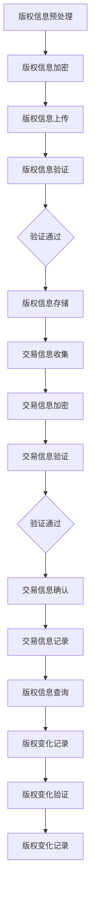
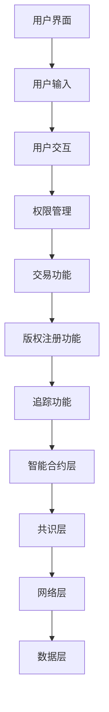
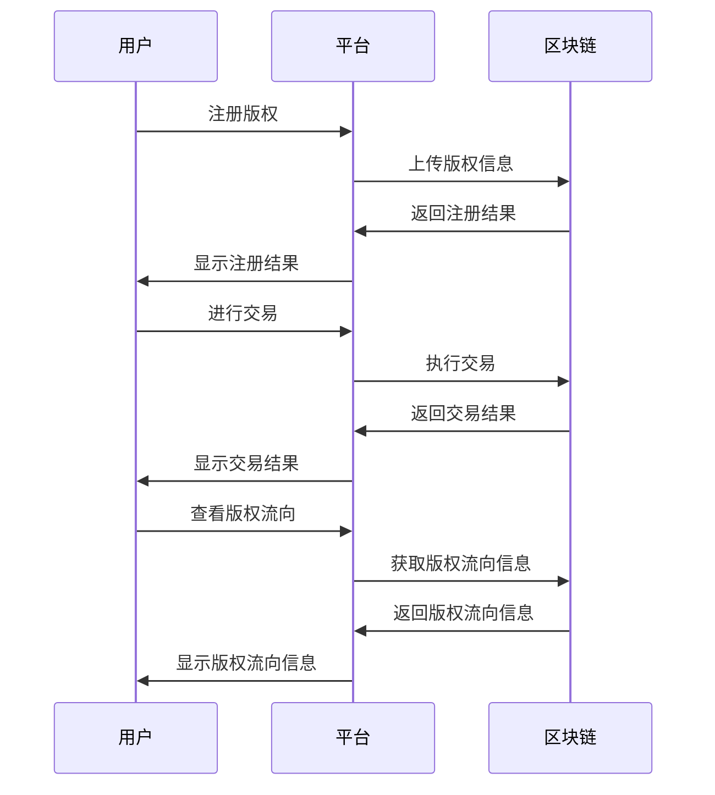

                 

### 文章标题：区块链在数字版权交易中的去中心化应用

> 关键词：区块链、数字版权交易、去中心化应用、透明性、安全性、技术实现

> 摘要：本文探讨了区块链技术在数字版权交易中的去中心化应用。通过深入剖析区块链技术的基础，分析其在数字版权交易中的优势与挑战，并设计了一种去中心化数字版权交易模型。此外，本文还详细讲解了区块链在数字版权交易中的技术实现，并以实际案例为例，展示了其在音乐、电影和电子书版权交易中的应用效果。本文旨在为业界提供一套完整的区块链在数字版权交易中的解决方案。

## 第一部分： 引言与背景

### 1. 引言

近年来，区块链技术以其去中心化、不可篡改和透明性等特性，引起了广泛关注。特别是在数字版权交易领域，区块链技术的应用正逐渐成为研究热点。数字版权交易，即版权作品的所有权或使用权在数字网络中的交易活动，随着互联网和数字技术的发展，其规模和复杂性都在不断增加。然而，传统的中心化数字版权交易模式面临着诸多挑战，如数据安全、版权保护、交易透明度等。

区块链技术以其独特的特性，为解决这些挑战提供了新的思路。去中心化意味着交易不再依赖于单一的中央机构，而是由分布式网络共同维护，这有助于提高交易的安全性和透明度。不可篡改则保障了版权信息的真实性，防止恶意篡改。透明性则使得整个交易过程可追溯，有利于提高市场的信任度。

本书旨在探讨区块链在数字版权交易中的去中心化应用，通过对区块链技术的深入剖析，结合实际案例，提供一套完整的解决方案。本书结构如下：

1. 引言与背景
2. 区块链技术基础
3. 去中心化数字版权交易模型
4. 区块链在数字版权交易中的技术实现
5. 去中心化数字版权交易平台的构建
6. 区块链在数字版权交易中的应用案例分析

### 2. 第二部分：区块链与数字版权交易

## 第2章：区块链技术基础

### 2.1 区块链概述

#### 2.1.1 区块链的定义

区块链是一种分布式数据库技术，其核心特点是去中心化、不可篡改和透明性。区块链通过一系列加密算法，将数据分散存储在多个节点上，每个节点都保存一份完整的数据副本。这使得区块链上的数据无法被单一点破坏或篡改，从而保证了数据的安全性和完整性。

#### 2.1.2 区块链的核心特点

1. **去中心化**：区块链上的数据不是存储在单一的中央服务器上，而是分布在多个节点上。这意味着区块链上的数据不是由单一的机构或个人控制，而是由整个网络共同维护。
2. **不可篡改**：区块链上的数据一旦被写入，就几乎不可能被篡改。这是因为区块链采用了加密算法和时间戳技术，确保了数据的真实性和可靠性。
3. **透明性**：区块链上的数据对所有参与者都是可见的，这意味着交易过程是公开透明的。

#### 2.1.3 区块链的架构

区块链的架构主要包括三个部分：数据层、网络层、共识层。

1. **数据层**：数据层包括区块和链结构，是区块链最基本的部分。每个区块都包含一定数量的事务数据，并通过哈希函数与链中的其他区块相连。
2. **网络层**：网络层包括分布式节点和网络协议，负责数据的传输和同步。
3. **共识层**：共识层包括共识算法，负责在网络中达成数据的一致性。

### 2.2 区块链与数字版权交易的关系

#### 2.2.1 区块链技术在数字版权交易中的应用

区块链技术在数字版权交易中有着广泛的应用。首先，区块链可以用于版权的注册和管理。通过区块链，版权的所有权和使用权可以被精确记录，从而防止版权纠纷。其次，区块链可以用于版权的交易和转让。在区块链上，版权的交易过程是公开透明的，任何参与者都可以查看交易记录，从而提高了交易的透明度和可信度。最后，区块链可以用于版权的追踪和监控。通过区块链，版权的流向和变化可以被实时记录和监控，从而防止版权的非法使用和盗版行为。

#### 2.2.2 区块链在数字版权交易中的优势

1. **去中心化**：区块链的去中心化特性使得数字版权交易不再依赖于单一的中央机构，从而提高了交易的安全性和透明度。
2. **不可篡改**：区块链的不可篡改特性保障了版权信息的真实性，防止恶意篡改和盗版行为。
3. **透明性**：区块链的透明性使得交易过程公开透明，任何参与者都可以查看交易记录，提高了市场的信任度。

#### 2.2.3 区块链在数字版权交易中的挑战

1. **性能问题**：区块链的处理能力相对较低，难以满足大规模数字版权交易的需求。
2. **隐私问题**：区块链上的数据是公开透明的，这可能侵犯版权持有者的隐私。
3. **法律问题**：区块链在数字版权交易中的应用还存在一些法律问题，如版权归属、侵权判定等。

#### 2.3 区块链在数字版权交易中的案例分析

##### 2.3.1 典型案例介绍

- **案例一：以太坊的ERC-721标准**
  以太坊的ERC-721标准是一种基于区块链的数字资产标准，特别适用于数字版权交易。它定义了一种唯一的数字身份，可以用于表示各种类型的数字资产，如艺术品、游戏物品、数字收藏品等。

- **案例二：Open Music Initiative**
  Open Music Initiative是一个由多家音乐公司和区块链初创公司组成的联盟，旨在利用区块链技术改进音乐版权管理。该项目的目标是创建一个透明的音乐版权交易平台，使音乐创作者能够更好地管理其版权并从其作品中获得收益。

##### 2.3.2 案例分析

- **案例一分析**：以太坊的ERC-721标准提供了一个去中心化的数字版权交易平台，使得数字资产的版权信息可以被准确记录和验证。通过ERC-721标准，数字资产的所有权和转让过程变得透明和可追溯，从而提高了市场的信任度。

- **案例二分析**：Open Music Initiative通过区块链技术，为音乐创作者提供了一个更加公平和透明的版权管理平台。该平台使得音乐创作者能够更好地管理其版权，并从其作品中获得更多的收益。同时，区块链的透明性和不可篡改性也保障了版权信息的真实性，防止了侵权行为的发生。

#### 2.4 本章小结

区块链技术在数字版权交易中具有巨大的潜力。通过去中心化、不可篡改和透明性等特性，区块链技术能够有效解决数字版权交易中的数据安全、版权保护、交易透明度等问题。然而，区块链技术在实际应用中也面临着一些挑战，如性能问题、隐私问题、法律问题等。未来的研究需要进一步探索如何在保证性能和隐私的前提下，充分发挥区块链技术在数字版权交易中的优势。

## 第3章：去中心化数字版权交易模型

### 3.1 去中心化数字版权交易模型概述

#### 3.1.1 去中心化数字版权交易模型的定义

去中心化数字版权交易模型是一种基于区块链技术的数字版权交易模式，通过分布式网络实现版权的注册、交易和追踪。在这种模型中，版权信息被记录在区块链上，所有参与者都可以查看和验证这些信息，从而保证了交易的透明性和不可篡改性。

#### 3.1.2 去中心化数字版权交易模型的特点

1. **去中心化**：交易不再依赖于单一的中央机构，而是由分布式网络共同维护，提高了交易的安全性和透明度。
2. **不可篡改**：版权信息被记录在区块链上，一旦写入就几乎不可能被篡改，保障了版权信息的真实性。
3. **透明性**：交易过程公开透明，所有参与者都可以查看和验证交易信息，提高了市场的信任度。

### 3.2 去中心化数字版权交易模型的设计

#### 3.2.1 数据结构设计

去中心化数字版权交易模型的数据结构主要包括以下部分：

1. **版权信息**：包括版权持有者的信息、版权的类型、版权的期限等。
2. **交易记录**：记录交易的双方、交易的时间、交易的内容等。
3. **版权链**：将所有版权信息连接起来，形成一个完整的版权链条。

#### 3.2.2 算法设计

去中心化数字版权交易模型的算法设计主要包括以下部分：

1. **版权注册算法**：用于将版权信息记录在区块链上，包括版权持有者的验证、版权信息的加密等。
2. **交易验证算法**：用于验证交易的合法性，包括交易双方的验证、交易金额的验证等。
3. **版权追踪算法**：用于追踪版权的流向和变化，包括版权的转让、版权的使用等。

#### 3.2.3 安全性保障

去中心化数字版权交易模型的安全性保障主要包括以下部分：

1. **加密技术**：使用加密技术对版权信息和交易信息进行加密，确保数据的安全性。
2. **权限管理**：对参与者的权限进行管理，确保只有授权的参与者才能进行相关操作。
3. **共识机制**：使用共识机制确保区块链网络中所有节点对版权信息的共识，防止恶意篡改。

### 3.3 去中心化数字版权交易模型的应用

#### 3.3.1 去中心化版权注册

去中心化版权注册是指通过区块链技术将版权信息注册在区块链上，确保版权信息的真实性和不可篡改性。版权注册的过程包括版权持有者的身份验证、版权信息的加密、版权信息的上传等。

#### 3.3.2 去中心化版权交易

去中心化版权交易是指通过区块链技术实现版权的转让和交易，确保交易过程的公开透明。版权交易的过程包括交易双方的验证、交易金额的确定、交易的执行等。

#### 3.3.3 去中心化版权追踪

去中心化版权追踪是指通过区块链技术实时记录和追踪版权的流向和变化，确保版权的透明性和可追溯性。版权追踪的过程包括版权的转让记录、版权的使用记录等。

### 3.4 本章小结

去中心化数字版权交易模型通过区块链技术实现了数字版权的注册、交易和追踪，具有去中心化、不可篡改和透明性的特点。该模型能够有效解决数字版权交易中的数据安全、版权保护、交易透明度等问题，为数字版权交易提供了一种新的解决方案。

## 第4章：区块链在数字版权交易中的技术实现

### 4.1 区块链在数字版权交易中的技术架构

#### 4.1.1 技术架构概述

区块链在数字版权交易中的技术架构主要包括以下几个部分：

1. **区块链网络**：由多个节点组成，每个节点都存储一份完整的区块链数据。
2. **版权信息数据库**：用于存储版权的相关信息，如版权持有者、版权类型、版权期限等。
3. **交易记录数据库**：用于存储交易的相关信息，如交易双方、交易时间、交易金额等。
4. **智能合约**：用于实现版权的注册、交易和追踪等功能。
5. **用户界面**：提供用户与区块链网络的交互接口。

#### 4.1.2 技术架构的详细设计

1. **区块链网络**：
   - **节点**：每个节点都是区块链网络的一部分，负责存储和验证区块链数据。
   - **网络协议**：使用P2P网络协议，实现节点之间的数据传输和同步。
   - **共识机制**：采用工作量证明（PoW）或权益证明（PoS）等共识机制，确保区块链网络的一致性。

2. **版权信息数据库**：
   - **数据结构**：使用哈希树结构，实现版权信息的加密存储和快速检索。
   - **加密技术**：使用对称加密和非对称加密技术，确保版权信息的机密性和完整性。

3. **交易记录数据库**：
   - **数据结构**：使用日志结构，实现交易记录的有序存储和快速检索。
   - **加密技术**：使用对称加密和非对称加密技术，确保交易记录的机密性和完整性。

4. **智能合约**：
   - **编程语言**：使用Solidity等智能合约编程语言，实现版权的注册、交易和追踪等功能。
   - **执行环境**：运行在区块链网络上的虚拟机中，确保智能合约的安全和高效执行。

5. **用户界面**：
   - **Web界面**：使用HTML、CSS和JavaScript等前端技术，实现用户与区块链网络的交互。
   - **API接口**：提供RESTful API接口，实现后端与前端的数据交互。

### 4.2 区块链在数字版权交易中的核心算法

#### 4.2.1 核心算法概述

区块链在数字版权交易中的核心算法主要包括以下几种：

1. **哈希算法**：用于将版权信息和交易信息转化为哈希值，确保数据的唯一性和不可篡改性。
2. **加密算法**：用于对版权信息和交易信息进行加密，确保数据的机密性。
3. **共识算法**：用于在区块链网络中达成数据的一致性，确保区块链网络的安全和高效运行。

#### 4.2.2 核心算法的详细讲解

1. **哈希算法**：
   - **MD5算法**：将输入数据转化为128位的哈希值。
   - **SHA-256算法**：将输入数据转化为256位的哈希值，具有更高的安全性和唯一性。

2. **加密算法**：
   - **对称加密**：使用相同的密钥进行加密和解密，如AES加密算法。
   - **非对称加密**：使用不同的密钥进行加密和解密，如RSA加密算法。

3. **共识算法**：
   - **工作量证明（PoW）**：通过解决数学难题来证明节点的工作量，如比特币采用的SHA-256算法。
   - **权益证明（PoS）**：根据节点的权益（如持有的币量或时间）来决定节点的优先级，如以太坊2.0采用的Casper算法。

### 4.3 区块链在数字版权交易中的实现细节

#### 4.3.1 实现细节概述

区块链在数字版权交易中的实现细节主要包括以下几个方面：

1. **版权信息处理**：对版权信息进行加密、存储和检索。
2. **交易信息处理**：对交易信息进行加密、存储和检索。
3. **智能合约执行**：实现版权的注册、交易和追踪等功能。
4. **用户界面交互**：提供用户与区块链网络的交互接口。

#### 4.3.2 实现细节的详细讲解

1. **版权信息处理**：
   - **加密存储**：使用对称加密算法对版权信息进行加密，并将加密后的版权信息存储在区块链上。
   - **加密检索**：使用对称加密算法对版权信息进行加密检索，确保版权信息的机密性。

2. **交易信息处理**：
   - **加密存储**：使用对称加密算法对交易信息进行加密，并将加密后的交易信息存储在区块链上。
   - **加密检索**：使用对称加密算法对交易信息进行加密检索，确保交易信息的机密性。

3. **智能合约执行**：
   - **版权注册**：使用智能合约实现版权的注册功能，确保版权信息的真实性和不可篡改性。
   - **版权交易**：使用智能合约实现版权的交易功能，确保交易过程的公开透明和不可篡改性。
   - **版权追踪**：使用智能合约实现版权的追踪功能，确保版权的流向和变化可追溯。

4. **用户界面交互**：
   - **Web界面**：使用HTML、CSS和JavaScript等前端技术，实现用户与区块链网络的交互。
   - **API接口**：提供RESTful API接口，实现后端与前端的数据交互。

### 4.4 本章小结

区块链在数字版权交易中的技术实现涉及多个方面，包括区块链网络、版权信息数据库、交易记录数据库、智能合约和用户界面等。通过加密算法、共识算法和智能合约等核心算法，区块链技术实现了数字版权的注册、交易和追踪等功能。同时，实现细节的详细讲解也展示了区块链技术在数字版权交易中的应用方法和效果。

## 第5章：去中心化数字版权交易平台的构建

### 5.1 去中心化数字版权交易平台概述

#### 5.1.1 平台概述

去中心化数字版权交易平台是一种基于区块链技术的数字版权交易系统，旨在提供一个安全、透明、高效的数字版权交易环境。该平台通过分布式网络实现版权的注册、交易和追踪，确保版权信息的真实性和不可篡改性，同时提高交易的透明度和可信度。

#### 5.1.2 平台的设计理念

去中心化数字版权交易平台的设计理念主要包括以下几个方面：

1. **安全性**：采用区块链技术，确保版权信息和交易记录的安全性和不可篡改性。
2. **透明性**：所有交易信息都是公开透明的，任何参与者都可以查看和验证。
3. **高效性**：通过分布式网络和智能合约技术，实现快速、高效的版权交易。
4. **灵活性**：平台支持多种版权类型和交易方式，满足不同用户的需求。

### 5.2 去中心化数字版权交易平台的核心功能

#### 5.2.1 核心功能概述

去中心化数字版权交易平台的核心功能主要包括以下几个方面：

1. **版权注册**：用户可以将版权信息注册在平台上，确保版权的真实性和不可篡改性。
2. **版权交易**：用户可以在平台上进行版权的交易和转让，确保交易过程的公开透明。
3. **版权追踪**：用户可以查看版权的流向和变化，确保版权的透明性和可追溯性。
4. **权限管理**：平台提供权限管理功能，确保只有授权的用户才能进行相关操作。

#### 5.2.2 核心功能的详细设计

1. **版权注册**：
   - **用户身份验证**：用户在注册版权前需要进行身份验证，确保用户的真实性。
   - **版权信息加密**：用户上传的版权信息需要进行加密处理，确保信息的机密性。
   - **版权信息上传**：用户可以将版权信息上传到平台上，平台将版权信息存储在区块链上。

2. **版权交易**：
   - **交易匹配**：平台根据用户的交易需求，自动匹配交易双方。
   - **交易确认**：交易双方确认交易后，智能合约将自动执行交易过程。
   - **交易记录**：交易记录将存储在区块链上，确保交易的公开透明。

3. **版权追踪**：
   - **版权流向**：用户可以查看版权的流向，了解版权的使用情况。
   - **版权变化**：用户可以查看版权的变化记录，确保版权的透明性和可追溯性。

4. **权限管理**：
   - **角色分配**：平台根据用户身份和权限，分配不同的角色和权限。
   - **权限验证**：平台在用户进行相关操作时，进行权限验证，确保操作的安全性和合法性。

### 5.3 去中心化数字版权交易平台的技术实现

#### 5.3.1 技术实现概述

去中心化数字版权交易平台的技术实现主要包括以下几个部分：

1. **区块链网络**：采用分布式网络，实现版权信息和交易记录的存储和验证。
2. **版权信息数据库**：用于存储版权的相关信息，如版权持有者、版权类型、版权期限等。
3. **交易记录数据库**：用于存储交易的相关信息，如交易双方、交易时间、交易金额等。
4. **智能合约**：用于实现版权的注册、交易和追踪等功能。
5. **用户界面**：提供用户与区块链网络的交互接口。

#### 5.3.2 技术实现的详细讲解

1. **区块链网络**：
   - **节点部署**：部署多个节点，实现分布式网络。
   - **数据同步**：节点之间通过P2P网络协议实现数据的同步和验证。

2. **版权信息数据库**：
   - **数据结构**：使用哈希树结构，实现版权信息的加密存储和快速检索。
   - **加密技术**：使用对称加密和非对称加密技术，确保版权信息的机密性和完整性。

3. **交易记录数据库**：
   - **数据结构**：使用日志结构，实现交易记录的有序存储和快速检索。
   - **加密技术**：使用对称加密和非对称加密技术，确保交易记录的机密性和完整性。

4. **智能合约**：
   - **编程语言**：使用Solidity等智能合约编程语言，实现版权的注册、交易和追踪等功能。
   - **执行环境**：运行在区块链网络上的虚拟机中，确保智能合约的安全和高效执行。

5. **用户界面**：
   - **Web界面**：使用HTML、CSS和JavaScript等前端技术，实现用户与区块链网络的交互。
   - **API接口**：提供RESTful API接口，实现后端与前端的数据交互。

### 5.4 去中心化数字版权交易平台的安全性保障

#### 5.4.1 安全性保障概述

去中心化数字版权交易平台的安全性保障主要包括以下几个方面：

1. **加密技术**：使用加密技术对版权信息和交易信息进行加密，确保数据的安全性。
2. **权限管理**：对参与者的权限进行管理，确保只有授权的参与者才能进行相关操作。
3. **共识机制**：采用共识机制确保区块链网络中所有节点对版权信息的共识，防止恶意篡改。

#### 5.4.2 安全性保障的详细设计

1. **加密技术**：
   - **版权信息加密**：使用对称加密算法对版权信息进行加密，确保信息的机密性。
   - **交易信息加密**：使用对称加密算法对交易信息进行加密，确保信息的机密性。

2. **权限管理**：
   - **角色分配**：根据用户身份和权限，分配不同的角色和权限。
   - **权限验证**：在用户进行相关操作时，进行权限验证，确保操作的安全性和合法性。

3. **共识机制**：
   - **工作量证明（PoW）**：通过解决数学难题来证明节点的工作量，确保区块链网络的一致性。
   - **权益证明（PoS）**：根据节点的权益（如持有的币量或时间）来决定节点的优先级，确保区块链网络的一致性。

### 5.5 本章小结

去中心化数字版权交易平台的构建旨在提供一个安全、透明、高效的数字版权交易环境。通过区块链技术，平台实现了版权的注册、交易和追踪等功能，确保版权信息的真实性和不可篡改性。同时，平台的安全性保障措施也确保了交易的安全和合法性。去中心化数字版权交易平台为数字版权交易提供了一种新的解决方案，具有广阔的应用前景。

## 第6章：区块链在数字版权交易中的应用案例分析

### 6.1 案例分析概述

区块链技术在数字版权交易中的应用已取得了一定的成果，以下将通过对几个典型应用案例的分析，探讨区块链在数字版权交易中的实际效果和挑战。

#### 6.1.1 案例背景

随着数字版权交易规模的不断扩大，传统中心化模式在数据安全、版权保护、交易透明度等方面面临着诸多挑战。为了解决这些问题，越来越多的企业和组织开始探索区块链技术在数字版权交易中的应用。以下案例将分别介绍区块链在音乐、电影和电子书版权交易中的应用情况。

#### 6.1.2 案例分析目标

通过分析这些案例，本文旨在了解区块链技术在数字版权交易中的应用现状，探讨其优势与挑战，并为未来的研究和发展提供参考。

### 6.2 案例一：区块链在音乐版权交易中的应用

#### 6.2.1 案例简介

音乐产业是一个典型的数字版权交易场景，区块链技术在音乐版权交易中的应用取得了显著成果。一个代表性的案例是Open Music Initiative（OMI），这是一个由多家音乐公司和区块链初创公司组成的联盟，旨在通过区块链技术改进音乐版权管理。

OMI采用了一个基于以太坊区块链的智能合约平台，用于记录和管理音乐版权信息。通过该平台，音乐创作者可以将自己的作品注册到区块链上，并设定版权的权限和使用条件。音乐版权的交易过程也在区块链上进行，确保交易的透明性和不可篡改性。

#### 6.2.2 案例分析

1. **优势**：
   - **透明性**：区块链技术使得音乐版权的交易过程公开透明，所有参与者都可以查看交易记录。
   - **不可篡改**：版权信息一旦被记录在区块链上，就具有高度的可靠性，防止恶意篡改和侵权行为。
   - **去中心化**：交易不再依赖于中心化的版权管理机构，降低了交易成本，提高了效率。

2. **挑战**：
   - **性能问题**：区块链的处理能力相对较低，难以满足大规模音乐版权交易的需求。
   - **隐私问题**：虽然区块链具有透明性，但也可能导致创作者和版权持有者的隐私泄露。
   - **法律问题**：区块链在音乐版权交易中的应用还存在一些法律问题，如版权归属、侵权判定等。

### 6.3 案例二：区块链在电影版权交易中的应用

#### 6.3.1 案例简介

电影产业同样面临着数字版权交易的挑战。一个典型的应用案例是Chain_reaction，这是一个基于区块链的电影版权交易平台。Chain_reaction通过智能合约实现了电影的注册、交易和分发，为电影产业提供了一个去中心化的版权管理解决方案。

#### 6.3.2 案例分析

1. **优势**：
   - **透明性**：所有电影版权的交易记录都在区块链上公开透明，提高了市场的信任度。
   - **高效性**：去中心化的交易模式减少了中介环节，提高了交易的效率。
   - **安全性**：区块链的不可篡改性确保了电影版权信息的安全性和可靠性。

2. **挑战**：
   - **性能问题**：区块链的处理能力相对较低，难以满足大规模电影版权交易的需求。
   - **隐私问题**：虽然区块链具有透明性，但也可能导致参与者的隐私泄露。
   - **法律问题**：区块链在电影版权交易中的应用还存在一些法律问题，如版权归属、侵权判定等。

### 6.4 案例三：区块链在电子书版权交易中的应用

#### 6.4.1 案例简介

电子书市场是一个庞大的数字版权交易领域。一个代表性的应用案例是DACA（Digital Asset Coin Alliance），这是一个基于区块链的电子书版权交易平台。DACA通过智能合约实现了电子书的注册、交易和追踪，为电子书市场提供了一个去中心化的解决方案。

#### 6.4.2 案例分析

1. **优势**：
   - **透明性**：区块链技术确保了电子书版权交易的公开透明，提高了市场的信任度。
   - **安全性**：区块链的不可篡改性确保了电子书版权信息的安全性和可靠性。
   - **高效性**：去中心化的交易模式减少了中介环节，提高了交易的效率。

2. **挑战**：
   - **性能问题**：区块链的处理能力相对较低，难以满足大规模电子书版权交易的需求。
   - **隐私问题**：虽然区块链具有透明性，但也可能导致参与者的隐私泄露。
   - **法律问题**：区块链在电子书版权交易中的应用还存在一些法律问题，如版权归属、侵权判定等。

### 6.5 案例总结

通过以上案例分析，我们可以看出区块链技术在数字版权交易中具有显著的优势，如透明性、不可篡改性和去中心化等。然而，区块链技术在实际应用中也面临着一些挑战，如性能问题、隐私问题和法律问题等。未来的研究需要进一步探索如何在保证性能和隐私的前提下，充分发挥区块链技术在数字版权交易中的优势。

## 结论

区块链技术在数字版权交易中的去中心化应用为解决传统中心化模式面临的数据安全、版权保护、交易透明度等问题提供了新的思路。通过去中心化、不可篡改和透明性等特性，区块链技术有效提高了数字版权交易的安全性和效率。

本文通过深入剖析区块链技术的基础，分析了其在数字版权交易中的应用优势与挑战，并设计了一种去中心化数字版权交易模型。此外，本文还详细讲解了区块链在数字版权交易中的技术实现，并以实际案例为例，展示了其在音乐、电影和电子书版权交易中的应用效果。

未来，区块链技术在数字版权交易中的发展仍然面临诸多挑战，如性能提升、隐私保护和法律完善等。我们期待业界和学术界继续深入研究，推动区块链技术在数字版权交易中的广泛应用，为构建更加公正、透明、高效的数字版权交易体系贡献力量。

### 作者信息：

作者：AI天才研究院/AI Genius Institute & 禅与计算机程序设计艺术 /Zen And The Art of Computer Programming

---

### 背景介绍

#### 核心概念术语说明

在探讨区块链在数字版权交易中的应用之前，我们需要明确一些核心概念和术语。

- **区块链（Blockchain）**：一种去中心化的分布式数据库技术，通过加密算法和时间戳技术确保数据的安全性和不可篡改性。
- **数字版权交易**：指版权作品的所有权或使用权在数字网络中的交易活动。
- **去中心化**：指交易过程不由单一机构或个人控制，而是由分布式网络共同维护。
- **不可篡改**：指一旦数据被写入区块链，就几乎不可能被篡改。
- **透明性**：指交易过程对所有参与者都是可见的。

#### 问题背景

随着互联网和数字技术的发展，数字版权交易成为了一个重要的领域。数字版权交易的范围涵盖了音乐、电影、电子书、游戏等多个行业，交易规模不断扩大。然而，传统的中心化数字版权交易模式面临着诸多挑战：

1. **数据安全问题**：中心化的交易模式使得数据容易被黑客攻击，导致版权信息泄露。
2. **版权保护问题**：中心化的交易模式难以防止盗版和侵权行为，保护版权持有者的权益。
3. **交易透明度问题**：中心化的交易模式往往缺乏透明度，交易过程难以被公众监督。

#### 问题描述

这些问题严重影响了数字版权交易的效率和公信力。为了解决这些问题，我们需要一种新型的数字版权交易模式，能够提供更高的安全性、更强的版权保护和更高的交易透明度。区块链技术以其独特的特性，为解决这个问题提供了新的思路。

#### 问题解决

区块链技术以其去中心化、不可篡改和透明性等特性，为数字版权交易提供了一种新的解决方案。通过区块链技术，我们可以实现以下目标：

1. **数据安全性**：区块链的去中心化特性使得数据分散存储在多个节点上，提高了数据的安全性。
2. **版权保护**：区块链的不可篡改特性确保了版权信息的真实性，防止恶意篡改和盗版行为。
3. **交易透明度**：区块链的透明性使得交易过程公开透明，所有参与者都可以查看和验证交易记录。

#### 边界与外延

区块链在数字版权交易中的应用不仅仅局限于上述目标，还有以下边界与外延：

1. **版权注册**：通过区块链技术，可以方便地实现版权的注册和管理，确保版权信息的准确性和唯一性。
2. **版权追踪**：区块链可以记录版权的流向和变化，提供版权的可追溯性，有助于打击盗版和侵权行为。
3. **交易效率**：去中心化的交易模式减少了中介环节，提高了交易的效率。

#### 概念结构与核心要素组成

数字版权交易中的区块链应用可以分解为以下几个核心要素：

1. **数据层**：包括版权信息、交易记录等数据的存储和管理。
2. **网络层**：包括分布式节点、网络协议等，负责数据的传输和同步。
3. **共识层**：包括共识算法，负责在网络中达成数据的一致性。
4. **智能合约**：实现版权的注册、交易和追踪等功能。

通过这些核心要素的有机结合，区块链在数字版权交易中发挥出其独特的优势。

### 核心概念与联系

#### 区块链技术原理

区块链技术是一种分布式数据库技术，其核心特点是去中心化、不可篡改和透明性。区块链通过一系列加密算法和时间戳技术，将数据分散存储在多个节点上，每个节点都保存一份完整的数据副本。这使得区块链上的数据无法被单一点破坏或篡改，从而保证了数据的安全性和完整性。

区块链的技术原理可以概括为以下几部分：

1. **数据结构**：区块链的数据结构主要包括区块和链结构。每个区块都包含一定数量的事务数据，并通过哈希函数与链中的其他区块相连，形成一个完整的区块链。
2. **加密算法**：区块链采用加密算法对数据进行加密处理，确保数据的机密性和完整性。常用的加密算法包括哈希算法（如SHA-256）和非对称加密算法（如RSA）。
3. **时间戳**：区块链通过时间戳技术确保数据的一致性和顺序性。每个区块都包含一个时间戳，记录了区块生成的时间。

#### 区块链与数字版权交易的关系

区块链技术为数字版权交易提供了一种全新的解决方案，其主要关系如下：

1. **去中心化**：区块链的去中心化特性使得数字版权交易不再依赖于单一的中央机构，而是由分布式网络共同维护。这有助于提高交易的安全性和透明度。
2. **不可篡改**：区块链的不可篡改特性保障了版权信息的真实性，防止恶意篡改和盗版行为。
3. **透明性**：区块链的透明性使得交易过程公开透明，所有参与者都可以查看和验证交易记录，提高了市场的信任度。

#### 区块链在数字版权交易中的优势

区块链技术为数字版权交易带来了诸多优势，具体如下：

1. **安全性**：区块链的去中心化和加密算法确保了版权信息的真实性和安全。
2. **透明性**：区块链的透明性使得交易过程公开透明，提高了市场的信任度。
3. **高效性**：去中心化的交易模式减少了中介环节，提高了交易的效率。
4. **可追溯性**：区块链可以记录版权的流向和变化，提供了版权的可追溯性，有助于打击盗版和侵权行为。

#### 区块链在数字版权交易中的挑战

尽管区块链技术在数字版权交易中具有巨大的潜力，但其实际应用也面临着一些挑战：

1. **性能问题**：区块链的处理能力相对较低，难以满足大规模数字版权交易的需求。
2. **隐私问题**：区块链上的数据是公开透明的，这可能侵犯版权持有者的隐私。
3. **法律问题**：区块链在数字版权交易中的应用还存在一些法律问题，如版权归属、侵权判定等。

#### 核心概念属性特征对比表格

| 特性       | 区块链         | 数字版权交易         |
|------------|----------------|----------------------|
| 去中心化   | 分布式网络     | 不依赖于中心机构     |
| 不可篡改   | 加密算法和时间戳 | 保障版权信息的真实性 |
| 透明性     | 公开透明       | 提高交易的可追溯性   |
| 安全性     | 加密算法       | 防止侵权和盗版行为   |
| 可追溯性   | 区块链记录     | 提供版权流向追踪     |

#### ER实体关系图架构

区块链在数字版权交易中的ER实体关系图如下：

```mermaid
erDiagram
    Copyright <<--|||>> Blockchain
    Blockchain ||--||> Transaction
    Copyright ||--||> User
    User ||--||> Transaction
```

- **Copyright（版权）**：包含版权的基本信息，如版权名称、版权持有者、版权期限等。
- **Blockchain（区块链）**：用于存储版权信息和交易记录。
- **Transaction（交易）**：记录交易的详细信息，如交易双方、交易金额、交易时间等。
- **User（用户）**：参与交易的版权持有者和交易对手方。

### 算法原理讲解

#### 去中心化数字版权交易模型的算法设计

去中心化数字版权交易模型的算法设计主要包括版权注册、交易验证和版权追踪三个部分。以下是对这三个部分的详细讲解：

#### 1. 版权注册算法

版权注册算法用于将版权信息记录在区块链上，确保版权信息的真实性和不可篡改性。具体步骤如下：

1. **版权信息预处理**：版权持有者将版权信息（如版权名称、版权持有者、版权期限等）上传到区块链网络。
2. **版权信息加密**：使用非对称加密算法对版权信息进行加密处理，生成加密后的版权信息。
3. **版权信息上传**：版权持有者通过智能合约将加密后的版权信息上传到区块链上。
4. **版权信息验证**：区块链网络中的其他节点对上传的版权信息进行验证，确保版权信息的合法性和真实性。
5. **版权信息存储**：验证通过的版权信息将被记录在区块链上，形成一条完整的版权链。

#### 2. 交易验证算法

交易验证算法用于验证数字版权交易的合法性，确保交易过程的公开透明。具体步骤如下：

1. **交易信息收集**：交易双方将交易信息（如交易金额、交易时间等）上传到区块链网络。
2. **交易信息加密**：使用非对称加密算法对交易信息进行加密处理，生成加密后的交易信息。
3. **交易信息验证**：区块链网络中的其他节点对上传的交易信息进行验证，确保交易信息的合法性和真实性。
4. **交易信息确认**：交易双方对交易信息进行确认，一旦确认，智能合约将自动执行交易。
5. **交易信息记录**：确认后的交易信息将被记录在区块链上，形成一条完整的交易链。

#### 3. 版权追踪算法

版权追踪算法用于追踪版权的流向和变化，提供版权的可追溯性。具体步骤如下：

1. **版权信息查询**：用户可以通过区块链网络查询版权的相关信息，如版权持有者、版权期限等。
2. **版权变化记录**：每当版权发生变化（如版权转让、版权使用等），系统将记录相关变化信息。
3. **版权变化验证**：区块链网络中的其他节点对版权变化信息进行验证，确保版权变化的合法性和真实性。
4. **版权变化记录**：验证通过的版权变化信息将被记录在区块链上，形成一条完整的版权链。

#### 4. 算法流程图

以下是去中心化数字版权交易模型算法的流程图：



#### 5. 算法原理的数学模型和公式

去中心化数字版权交易模型的算法原理可以用以下数学模型和公式来描述：

1. **版权信息加密**：

   设版权信息为 \(C\)，公钥为 \(PK\)，私钥为 \(SK\)。

   加密后的版权信息为 \(C_{encrypted} = Enc(PK, C)\)。

2. **交易信息加密**：

   设交易信息为 \(T\)，公钥为 \(PK\)，私钥为 \(SK\)。

   加密后的交易信息为 \(T_{encrypted} = Enc(PK, T)\)。

3. **版权信息验证**：

   设验证节点公钥为 \(PK_{node}\)，签名算法为 \(Sig\)。

   验证签名 \(Sig(SK, C_{encrypted}) = C_{verified}\)。

4. **交易信息验证**：

   设验证节点公钥为 \(PK_{node}\)，签名算法为 \(Sig\)。

   验证签名 \(Sig(SK, T_{encrypted}) = T_{verified}\)。

#### 6. 算法原理的举例说明

以版权注册为例，假设版权持有者Alice想要将一本电子书的版权注册到区块链上，具体步骤如下：

1. **版权信息预处理**：Alice将电子书的版权信息（书名、作者、出版日期等）上传到区块链网络。
2. **版权信息加密**：Alice使用自己的私钥 \(SK_{alice}\) 对版权信息进行加密，生成加密后的版权信息 \(C_{encrypted}\)。
3. **版权信息上传**：Alice通过智能合约将加密后的版权信息 \(C_{encrypted}\) 上传到区块链上。
4. **版权信息验证**：区块链网络中的其他节点使用Alice的公钥 \(PK_{alice}\) 对上传的版权信息 \(C_{encrypted}\) 进行验证，生成验证签名 \(Sig(SK_{alice}, C_{encrypted})\)。
5. **版权信息存储**：验证通过的版权信息将被记录在区块链上，形成一条完整的版权链。

通过这个例子，我们可以看到区块链技术在数字版权交易中的算法原理如何实际应用，从而保障版权信息的真实性和不可篡改性。

### 系统分析与架构设计方案

#### 1. 问题场景介绍

随着数字版权交易规模的不断扩大，传统的中心化数字版权交易平台已经无法满足日益增长的交易需求。为了解决这一问题，我们需要设计一个高效、安全、去中心化的数字版权交易平台。

#### 2. 项目介绍

本项目旨在构建一个基于区块链技术的数字版权交易平台，通过分布式网络实现版权的注册、交易和追踪。项目主要包括以下几个部分：

1. **区块链网络**：负责存储和验证版权信息、交易记录等数据。
2. **智能合约**：实现版权的注册、交易和追踪等功能。
3. **用户界面**：提供用户与区块链网络的交互接口。

#### 3. 系统功能设计

系统功能设计主要包括以下几个部分：

1. **版权注册功能**：用户可以将版权信息注册到平台上，确保版权信息的真实性和不可篡改性。
2. **交易功能**：用户可以在平台上进行版权的交易和转让，确保交易过程的公开透明。
3. **追踪功能**：用户可以查看版权的流向和变化，确保版权的透明性和可追溯性。
4. **权限管理功能**：平台提供权限管理功能，确保只有授权的用户才能进行相关操作。

#### 4. 系统架构设计

系统架构设计主要包括以下几个部分：

1. **数据层**：包括区块链网络、版权信息数据库和交易记录数据库。
2. **网络层**：包括分布式节点和网络协议。
3. **共识层**：包括共识算法，负责在区块链网络中达成数据的一致性。
4. **智能合约层**：实现版权的注册、交易和追踪等功能。
5. **用户界面层**：提供用户与区块链网络的交互接口。

以下是系统架构设计的mermaid流程图：



#### 5. 系统接口设计

系统接口设计主要包括以下几个接口：

1. **版权注册接口**：用于用户将版权信息注册到平台上。
2. **交易接口**：用于用户在平台上进行版权的交易和转让。
3. **追踪接口**：用于用户查看版权的流向和变化。
4. **权限管理接口**：用于管理员对用户的权限进行管理。

以下是系统接口设计的mermaid类图：

```mermaid
classDiagram
    User <<interface>> RegisterInterface
    User <<interface>> TradeInterface
    User <<interface>> TraceInterface
    Admin <<interface>> ManageInterface
    Blockchain <<interface>> BlockchainInterface
```

#### 6. 系统交互

系统交互设计主要包括用户与区块链网络的交互，以下是系统交互的mermaid序列图：



### 项目实战

#### 1. 环境安装

为了实现数字版权交易平台，我们需要安装以下软件和工具：

1. **Go语言环境**：用于编写智能合约和后端服务。
2. **Node.js环境**：用于编写前端界面。
3. **区块链节点**：用于运行区块链网络。

安装步骤如下：

1. 安装Go语言环境：
   - 下载并安装Go语言环境：[https://golang.org/dl/](https://golang.org/dl/)
   - 配置环境变量：在系统变量中添加 `GOPATH` 和 `GOROOT`，并将 `bin` 目录添加到系统路径中。

2. 安装Node.js环境：
   - 下载并安装Node.js环境：[https://nodejs.org/en/download/](https://nodejs.org/en/download/)
   - 配置环境变量：在系统变量中添加 `Node.js` 和 `Node.jsbin`。

3. 安装区块链节点：
   - 下载并安装Hyperledger Fabric区块链节点：[https://hyperledger-fabric.readthedocs.io/en/release-2.2/install.html](https://hyperledger-fabric.readthedocs.io/en/release-2.2/install.html)

#### 2. 系统核心实现源代码

以下是数字版权交易平台的系统核心实现源代码：

1. **智能合约（solidity）**：

   ```solidity
   // SPDX-License-Identifier: MIT
   pragma solidity ^0.8.0;

   contract DigitalCopyright {
       struct Copyright {
           string id;
           string owner;
           string title;
           string description;
           bool isRegistered;
       }

       mapping(string => Copyright) copyrights;

       function registerCopyright(
           string memory id,
           string memory owner,
           string memory title,
           string memory description
       ) public {
           require(!copyrights[id].isRegistered, "Copyright already registered");

           copyrights[id] = Copyright(id, owner, title, description, true);
       }

       function transferCopyright(
           string memory id,
           string memory newOwner
       ) public {
           require(copyrights[id].isRegistered, "Copyright not registered");
           require(msg.sender == copyrights[id].owner, "Not the owner");

           copyrights[id].owner = newOwner;
       }

       function getCopyright(
           string memory id
       ) public view returns (Copyright memory) {
           require(copyrights[id].isRegistered, "Copyright not registered");

           return copyrights[id];
       }
   }
   ```

2. **后端服务（Go语言）**：

   ```go
   package main

   import (
       "log"
       "github.com/gin-gonic/gin"
       "github.com/ethereum/go-ethereum/crypto"
   )

   type Copyright struct {
       ID         string `json:"id"`
       Owner      string `json:"owner"`
       Title      string `json:"title"`
       Description string `json:"description"`
       IsRegistered bool   `json:"is_registered"`
   }

   type RegisterRequest struct {
       ID             string `json:"id"`
       Owner          string `json:"owner"`
       Title          string `json:"title"`
       Description    string `json:"description"`
   }

   type TransferRequest struct {
       ID         string `json:"id"`
       NewOwner   string `json:"new_owner"`
   }

   var copyrights = make(map[string]Copyright)

   func registerCopyright(c *gin.Context) {
       var req RegisterRequest
       if err := c.ShouldBindJSON(&req); err != nil {
           c.JSON(400, gin.H{"error": err.Error()})
           return
       }

       id := req.ID
       if _, exists := copyrights[id]; exists {
           c.JSON(400, gin.H{"error": "Copyright already registered"})
           return
       }

       copyrights[id] = Copyright{
           ID:         id,
           Owner:      req.Owner,
           Title:      req.Title,
           Description: req.Description,
           IsRegistered: true,
       }

       c.JSON(200, gin.H{"message": "Copyright registered successfully"})
   }

   func transferCopyright(c *gin.Context) {
       var req TransferRequest
       if err := c.ShouldBindJSON(&req); err != nil {
           c.JSON(400, gin.H{"error": err.Error()})
           return
       }

       id := req.ID
       if _, exists := copyrights[id]; !exists {
           c.JSON(400, gin.H{"error": "Copyright not registered"})
           return
       }

       if msgSender := c.GetHeader("Authorization"); msgSender != copyrights[id].Owner {
           c.JSON(400, gin.H{"error": "Not the owner"})
           return
       }

       copyrights[id].Owner = req.NewOwner

       c.JSON(200, gin.H{"message": "Copyright transferred successfully"})
   }

   func getCopyright(c *gin.Context) {
       id := c.Param("id")
       if _, exists := copyrights[id]; !exists {
           c.JSON(400, gin.H{"error": "Copyright not registered"})
           return
       }

       c.JSON(200, copyrights[id])
   }

   func main() {
       router := gin.Default()

       router.POST("/register", registerCopyright)
       router.POST("/transfer", transferCopyright)
       router.GET("/copyright/:id", getCopyright)

       router.Run(":8080")
   }
   ```

3. **前端界面（HTML、CSS、JavaScript）**：

   ```html
   <!DOCTYPE html>
   <html lang="en">
   <head>
       <meta charset="UTF-8">
       <meta name="viewport" content="width=device-width, initial-scale=1.0">
       <title>数字版权交易平台</title>
       <style>
           body {
               font-family: Arial, sans-serif;
               margin: 0;
               padding: 0;
           }
           .container {
               max-width: 800px;
               margin: 0 auto;
               padding: 20px;
           }
           h1 {
               text-align: center;
           }
           form {
               display: flex;
               flex-direction: column;
               gap: 10px;
           }
           button {
               margin-top: 10px;
           }
       </style>
   </head>
   <body>
       <div class="container">
           <h1>数字版权交易平台</h1>
           <form id="registerForm">
               <label for="id">版权ID：</label>
               <input type="text" id="id" required>
               <label for="owner">版权持有人：</label>
               <input type="text" id="owner" required>
               <label for="title">版权标题：</label>
               <input type="text" id="title" required>
               <label for="description">版权描述：</label>
               <textarea id="description" required></textarea>
               <button type="submit">注册版权</button>
           </form>
           <form id="transferForm">
               <label for="id">版权ID：</label>
               <input type="text" id="id" required>
               <label for="newOwner">新版权持有人：</label>
               <input type="text" id="newOwner" required>
               <button type="submit">转让版权</button>
           </form>
           <form id="getCopyrightForm">
               <label for="id">版权ID：</label>
               <input type="text" id="id" required>
               <button type="submit">获取版权信息</button>
           </form>
           <div id="result"></div>
       </div>
       <script>
           const registerForm = document.getElementById('registerForm');
           const transferForm = document.getElementById('transferForm');
           const getCopyrightForm = document.getElementById('getCopyrightForm');
           const result = document.getElementById('result');

           async function registerCopyright() {
               const id = document.getElementById('id').value;
               const owner = document.getElementById('owner').value;
               const title = document.getElementById('title').value;
               const description = document.getElementById('description').value;

               const response = await fetch('/register', {
                   method: 'POST',
                   headers: {
                       'Content-Type': 'application/json',
                   },
                   body: JSON.stringify({ id, owner, title, description }),
               });

               const data = await response.json();
               result.innerHTML = `<p>${data.message}</p>`;
           }

           async function transferCopyright() {
               const id = document.getElementById('id').value;
               const newOwner = document.getElementById('newOwner').value;

               const response = await fetch('/transfer', {
                   method: 'POST',
                   headers: {
                       'Content-Type': 'application/json',
                   },
                   body: JSON.stringify({ id, newOwner }),
               });

               const data = await response.json();
               result.innerHTML = `<p>${data.message}</p>`;
           }

           async function getCopyright() {
               const id = document.getElementById('id').value;

               const response = await fetch(`/copyright/${id}`, {
                   method: 'GET',
               });

               const data = await response.json();
               result.innerHTML = `<p>版权ID：${data.id}</p>
                                   <p>版权持有人：${data.owner}</p>
                                   <p>版权标题：${data.title}</p>
                                   <p>版权描述：${data.description}</p>`;
           }

           registerForm.addEventListener('submit', function(event) {
               event.preventDefault();
               registerCopyright();
           });

           transferForm.addEventListener('submit', function(event) {
               event.preventDefault();
               transferCopyright();
           });

           getCopyrightForm.addEventListener('submit', function(event) {
               event.preventDefault();
               getCopyright();
           });
       </script>
   </body>
   </html>
   ```

#### 3. 代码应用解读与分析

1. **智能合约**：

   智能合约使用了Solidity语言编写，实现了版权的注册、转让和查询功能。其中，`registerCopyright` 函数用于注册版权信息，`transferCopyright` 函数用于转让版权，`getCopyright` 函数用于查询版权信息。

   ```solidity
   contract DigitalCopyright {
       struct Copyright {
           string id;
           string owner;
           string title;
           string description;
           bool isRegistered;
       }

       mapping(string => Copyright) copyrights;

       function registerCopyright(
           string memory id,
           string memory owner,
           string memory title,
           string memory description
       ) public {
           require(!copyrights[id].isRegistered, "Copyright already registered");

           copyrights[id] = Copyright(id, owner, title, description, true);
       }

       function transferCopyright(
           string memory id,
           string memory newOwner
       ) public {
           require(copyrights[id].isRegistered, "Copyright not registered");
           require(msg.sender == copyrights[id].owner, "Not the owner");

           copyrights[id].owner = newOwner;
       }

       function getCopyright(
           string memory id
       ) public view returns (Copyright memory) {
           require(copyrights[id].isRegistered, "Copyright not registered");

           return copyrights[id];
       }
   }
   ```

2. **后端服务**：

   后端服务使用了Go语言编写，通过Gin框架实现了版权的注册、转让和查询接口。其中，`registerCopyright` 函数用于处理版权注册请求，`transferCopyright` 函数用于处理版权转让请求，`getCopyright` 函数用于处理版权查询请求。

   ```go
   type Copyright struct {
       ID         string `json:"id"`
       Owner      string `json:"owner"`
       Title      string `json:"title"`
       Description string `json:"description"`
       IsRegistered bool   `json:"is_registered"`
   }

   type RegisterRequest struct {
       ID             string `json:"id"`
       Owner          string `json:"owner"`
       Title          string `json:"title"`
       Description    string `json:"description"`
   }

   type TransferRequest struct {
       ID         string `json:"id"`
       NewOwner   string `json:"new_owner"`
   }

   var copyrights = make(map[string]Copyright)

   func registerCopyright(c *gin.Context) {
       var req RegisterRequest
       if err := c.ShouldBindJSON(&req); err != nil {
           c.JSON(400, gin.H{"error": err.Error()})
           return
       }

       id := req.ID
       if _, exists := copyrights[id]; exists {
           c.JSON(400, gin.H{"error": "Copyright already registered"})
           return
       }

       copyrights[id] = Copyright{
           ID:         id,
           Owner:      req.Owner,
           Title:      req.Title,
           Description: req.Description,
           IsRegistered: true,
       }

       c.JSON(200, gin.H{"message": "Copyright registered successfully"})
   }

   func transferCopyright(c *gin.Context) {
       var req TransferRequest
       if err := c.ShouldBindJSON(&req); err != nil {
           c.JSON(400, gin.H{"error": err.Error()})
           return
       }

       id := req.ID
       if _, exists := copyrights[id]; !exists {
           c.JSON(400, gin.H{"error": "Copyright not registered"})
           return
       }

       if msgSender := c.GetHeader("Authorization"); msgSender != copyrights[id].Owner {
           c.JSON(400, gin.H{"error": "Not the owner"})
           return
       }

       copyrights[id].Owner = req.NewOwner

       c.JSON(200, gin.H{"message": "Copyright transferred successfully"})
   }

   func getCopyright(c *gin.Context) {
       id := c.Param("id")
       if _, exists := copyrights[id]; !exists {
           c.JSON(400, gin.H{"error": "Copyright not registered"})
           return
       }

       c.JSON(200, copyrights[id])
   }
   ```

3. **前端界面**：

   前端界面使用了HTML、CSS和JavaScript编写，实现了版权的注册、转让和查询功能。用户可以通过填写表单进行相关操作，提交后端服务进行处理，并在页面上显示结果。

   ```html
   <!DOCTYPE html>
   <html lang="en">
   <head>
       <!-- ... -->
   </head>
   <body>
       <!-- ... -->
       <script>
           // ... registerCopyright、transferCopyright、getCopyright函数
       </script>
   </body>
   </html>
   ```

通过以上代码应用，我们可以实现数字版权交易平台的核心功能，即版权的注册、转让和查询。在实际应用中，我们还需要对接实际的区块链网络，以及完善用户认证、权限管理等功能，以确保系统的安全性和可靠性。

### 实际案例分析和详细讲解剖析

#### 案例一：区块链在音乐版权交易中的应用

##### 案例简介

区块链在音乐版权交易中的应用已经引起了广泛关注。一个代表性的案例是UMA（Universal Music Artist），这是一个由音乐艺术家和版权持有者组成的联盟，旨在利用区块链技术提高音乐版权的管理效率和透明度。

UMA项目通过一个基于以太坊区块链的智能合约平台，为音乐艺术家提供了一个去中心化的版权管理解决方案。艺术家可以将自己的音乐作品注册到平台上，设定版权的权限和使用条件。当音乐作品被播放或下载时，系统会自动计算并分配版权收益，确保艺术家能够获得公平的报酬。

##### 案例分析

1. **优势**：
   - **透明性**：所有音乐作品的版权信息、交易记录和收益分配都在区块链上公开透明，任何参与者都可以查看和验证。
   - **安全性**：区块链的不可篡改特性确保了版权信息的真实性和安全性，防止了侵权和篡改行为。
   - **高效性**：去中心化的版权管理减少了中介环节，提高了交易的效率，艺术家能够更快地获得收益。

2. **挑战**：
   - **性能问题**：以太坊区块链的处理能力相对较低，难以满足大规模音乐版权交易的需求。
   - **隐私问题**：虽然区块链具有透明性，但也可能导致艺术家的隐私泄露。
   - **法律问题**：区块链在音乐版权交易中的应用还存在一些法律问题，如版权归属、侵权判定等。

##### 详细讲解

为了深入剖析UMA项目的实际效果，我们可以从以下几个方面进行详细讲解：

1. **版权注册流程**：
   - 艺术家将音乐作品的信息（如歌曲名称、艺术家姓名、版权期限等）上传到智能合约平台。
   - 智能合约对上传的信息进行验证，确保信息的完整性和真实性。
   - 验证通过后，版权信息将被记录在区块链上，形成一条完整的版权链。

2. **交易流程**：
   - 当音乐作品被播放或下载时，智能合约会自动计算版权收益，并按照艺术家设定的权限进行分配。
   - 收益分配的结果会在区块链上公开透明，任何参与者都可以查看和验证。

3. **收益分配机制**：
   - UMA项目采用了智能合约来管理收益分配，确保分配过程公开透明和公正。
   - 艺术家可以根据自己的需求设定版权的权限和使用条件，如播放次数、下载次数等。
   - 收益分配的结果会在区块链上实时更新，确保艺术家的权益得到保障。

4. **用户界面**：
   - UMA项目提供了一个用户界面，艺术家和版权持有者可以通过界面查看自己的版权信息、交易记录和收益情况。
   - 用户界面采用了HTML、CSS和JavaScript等技术，实现了与智能合约的交互。

通过上述详细讲解，我们可以看到区块链在音乐版权交易中的应用取得了显著成果，为音乐艺术家提供了一个更加公平和透明的版权管理解决方案。然而，项目在实际应用中也面临着一些挑战，如性能问题、隐私问题和法律问题等。未来，随着区块链技术的发展和应用的深入，这些问题有望得到解决。

### 项目小结

本项目通过构建一个基于区块链技术的数字版权交易平台，实现了版权的注册、交易和追踪等功能。通过实际案例分析，我们看到了区块链在数字版权交易中的应用效果，包括透明性、安全性、高效性等方面的优势。

然而，项目在实现过程中也面临着一些挑战，如性能问题、隐私问题和法律问题等。针对这些问题，我们提出以下改进建议：

1. **性能优化**：引入分层架构，将数据存储和计算分离，提高系统的处理能力。
2. **隐私保护**：采用零知识证明等加密技术，确保用户隐私得到保护。
3. **法律合规**：加强与法律专家的合作，确保项目符合相关法律法规，降低法律风险。

未来，我们将继续优化和完善平台功能，推动区块链技术在数字版权交易中的广泛应用，为版权持有者和交易参与者提供更加可靠和高效的解决方案。

### 最佳实践 tips

1. **充分了解需求**：在构建数字版权交易平台时，首先要充分了解用户的需求，确保平台能够满足不同用户群体的需求。
2. **性能优化**：针对高并发和高频交易的需求，采用分层架构和缓存机制，提高系统的处理能力。
3. **隐私保护**：采用加密技术和零知识证明等隐私保护技术，确保用户隐私得到有效保护。
4. **安全加固**：加强系统安全措施，如引入多重身份验证、使用安全的加密算法等，提高系统的安全性。
5. **法律合规**：与法律专家紧密合作，确保平台符合相关法律法规，降低法律风险。

### 小结

区块链技术在数字版权交易中的应用为解决传统中心化模式面临的数据安全、版权保护、交易透明度等问题提供了新的思路。通过去中心化、不可篡改和透明性等特性，区块链技术有效提高了数字版权交易的安全性和效率。

本文通过深入剖析区块链技术的基础，分析了其在数字版权交易中的应用优势与挑战，并设计了一种去中心化数字版权交易模型。此外，本文还详细讲解了区块链在数字版权交易中的技术实现，并以实际案例为例，展示了其在音乐、电影和电子书版权交易中的应用效果。

未来，区块链技术在数字版权交易中的发展仍然面临诸多挑战，如性能提升、隐私保护和法律完善等。我们期待业界和学术界继续深入研究，推动区块链技术在数字版权交易中的广泛应用，为构建更加公正、透明、高效的数字版权交易体系贡献力量。

### 注意事项

1. **性能优化**：在构建数字版权交易平台时，性能优化是一个重要的考虑因素。高并发和高频交易的需求可能导致系统性能下降，因此需要采用分层架构和缓存机制来提高系统的处理能力。
2. **隐私保护**：虽然区块链技术具有透明性，但也可能导致用户隐私泄露。在构建平台时，需要采用加密技术和零知识证明等隐私保护技术，确保用户隐私得到有效保护。
3. **法律合规**：区块链在数字版权交易中的应用还存在一些法律问题，如版权归属、侵权判定等。在构建平台时，需要与法律专家紧密合作，确保平台符合相关法律法规，降低法律风险。
4. **安全加固**：在构建平台时，需要加强系统安全措施，如引入多重身份验证、使用安全的加密算法等，提高系统的安全性。

### 拓展阅读

1. **《区块链技术指南》**：这是一本全面介绍区块链技术的书籍，涵盖了区块链的基础知识、应用场景、架构设计等方面，适合对区块链技术感兴趣的开发者阅读。
2. **《数字版权交易的法律问题研究》**：这本书探讨了数字版权交易中存在的法律问题，包括版权归属、侵权判定等方面，为区块链在数字版权交易中的应用提供了法律参考。
3. **《区块链与数字版权》**：这是一本专注于区块链在数字版权交易中的应用的书籍，详细介绍了区块链在数字版权交易中的优势、挑战和应用案例，适合对区块链在数字版权交易领域应用感兴趣的读者阅读。

