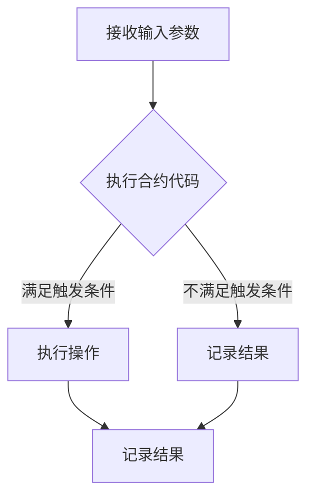
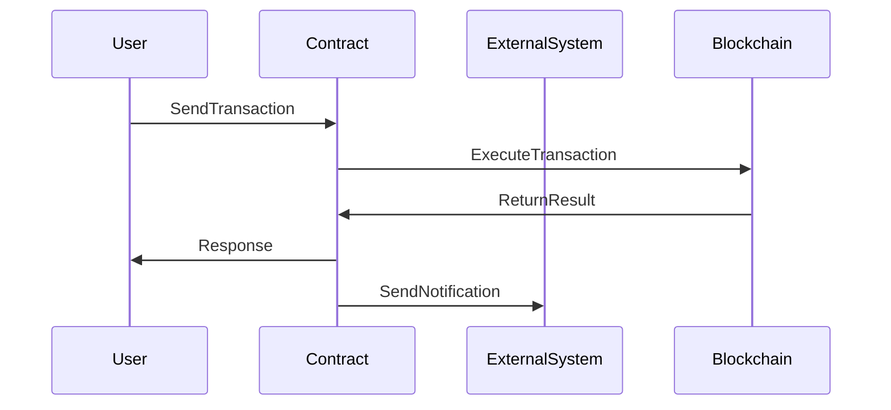

                 


### 目录大纲

#### 第一部分：背景介绍

##### 1. 区块链技术概述
**1.1 区块链的概念与历史**
**1.2 区块链的关键技术**
**1.3 区块链的优势与挑战**

##### 2. 数字版权交易
**2.1 数字版权的概念与现状**
**2.2 数字版权交易的问题与挑战**
**2.3 数字版权交易的解决方案**

##### 3. 智能合约
**3.1 智能合约的概念与原理**
**3.2 智能合约的关键技术**
**3.3 智能合约的优势与风险**

#### 第二部分：核心概念与联系

##### 4. 智能合约在数字版权交易中的应用
**4.1 智能合约在数字版权交易中的作用**
**4.2 智能合约的核心概念与联系**
**4.3 智能合约的应用场景与案例分析**

#### 第三部分：算法原理讲解

##### 5. 智能合约算法原理
**5.1 智能合约算法的数学模型**
**5.2 智能合约算法的工作原理**
**5.3 智能合约算法的mermaid流程图**

##### 6. 系统分析与架构设计方案
**6.1 智能合约技术架构**
**6.2 智能合约开发工具与平台**
**6.3 智能合约技术架构的mermaid架构图**

##### 7. 系统接口设计和交互
**7.1 系统接口设计**
**7.2 系统交互mermaid序列图**

#### 第四部分：项目实战

##### 8. 区块链数字版权交易项目实战
**8.1 项目环境安装**
**8.2 系统核心实现源代码**
**8.3 代码应用解读与分析**
**8.4 实际案例分析和讲解**
**8.5 项目小结**

#### 第五部分：最佳实践与拓展

##### 9. 最佳实践
**9.1 智能合约在数字版权交易中的最佳实践**
**9.2 智能合约开发的注意事项**
**9.3 数字版权交易的未来发展趋势**

##### 10. 拓展阅读
**10.1 相关书籍推荐**
**10.2 学术论文推荐**
**10.3 在线课程与教程推荐**

### 关键词

- 区块链
- 数字版权交易
- 智能合约
- 算法原理
- 系统架构设计
- 项目实战
- 最佳实践

### 摘要

本文深入探讨了区块链技术在数字版权交易中的应用，特别是智能合约的应用。首先，介绍了区块链、数字版权交易和智能合约的基本概念。接着，详细分析了智能合约在数字版权交易中的作用和核心概念，包括数学模型和mermaid流程图。然后，讲解了智能合约的技术架构、系统接口设计、交互流程以及实际案例。最后，提出了智能合约在数字版权交易中的最佳实践，并对未来发展趋势进行了展望。

### 文章标题

《区块链在数字版权交易中的智能合约应用》

#### 第一部分：背景介绍

##### 1. 区块链技术概述

区块链技术是一种分布式账本技术，它通过加密算法和共识机制确保数据的不可篡改性和透明性。区块链的基本原理是每个区块包含一定数量的交易记录，通过哈希函数链接成链，从而形成一个无法篡改的账本。

**1.1 区块链的概念与历史**

区块链最早由中本聪(Satoshi Nakamoto)在2008年提出，作为比特币的基础技术。随后，区块链技术逐渐应用于各种领域，如金融、供应链管理、数字版权交易等。

**1.2 区块链的关键技术**

区块链的关键技术包括哈希函数、区块链结构、共识机制、加密算法等。

- **哈希函数**：用于将任意长度的数据映射为固定长度的值，确保数据的唯一性和不可篡改性。
- **区块链结构**：由多个区块通过哈希链接组成，每个区块包含一定数量的交易记录。
- **共识机制**：确保区块链网络中的所有节点对数据的一致性，如工作量证明(Proof of Work, PoW)和权益证明(Proof of Stake, PoS)。
- **加密算法**：用于保证数据的安全传输和存储。

**1.3 区块链的优势与挑战**

区块链的优势在于其去中心化、不可篡改、透明性和安全性。然而，区块链也面临一些挑战，如扩展性、交易速度、能源消耗等。

##### 2. 数字版权交易

数字版权交易是指数字内容的创作者、分销商和消费者之间的交易过程。随着数字内容的快速增长，数字版权交易的重要性日益凸显。

**2.1 数字版权的概念与现状**

数字版权是指数字内容的知识产权，包括版权、商标、专利等。目前，数字版权交易主要集中在音乐、电影、电子书等领域。

**2.2 数字版权交易的问题与挑战**

数字版权交易面临的主要问题是版权纠纷、侵权、授权管理困难等。

- **版权纠纷**：数字内容的版权归属问题往往复杂，导致纠纷频发。
- **侵权**：数字内容的复制和传播速度快，容易引发侵权行为。
- **授权管理**：传统的授权管理方式效率低下，难以满足数字版权交易的需求。

**2.3 数字版权交易的解决方案**

区块链技术为数字版权交易提供了一种新的解决方案。通过智能合约，数字版权的交易过程可以实现自动化、透明化和不可篡改性。

##### 3. 智能合约

智能合约是一种自执行合约，基于区块链技术实现。智能合约的代码存储在区块链上，当满足特定条件时，自动执行预定的操作。

**3.1 智能合约的概念与原理**

智能合约由三个核心部分组成：合约代码、执行环境和触发条件。

- **合约代码**：定义了智能合约的逻辑和行为，通常使用Solidity等编程语言编写。
- **执行环境**：指区块链网络，智能合约代码在区块链上运行。
- **触发条件**：指触发智能合约执行的特定事件或条件。

**3.2 智能合约的关键技术**

智能合约的关键技术包括编程语言、编程模型、安全性和共识机制。

- **编程语言**：常用的智能合约编程语言包括Solidity、Vyper等。
- **编程模型**：智能合约的编程模型通常基于事件驱动的模式。
- **安全性**：智能合约的安全性问题至关重要，包括代码审计、漏洞检测等。
- **共识机制**：智能合约的执行依赖于区块链的共识机制，如PoW、PoS等。

**3.3 智能合约的优势与风险**

智能合约的优势在于其自动化、透明化和不可篡改性，有助于解决数字版权交易中的问题。然而，智能合约也存在一些风险，如代码漏洞、共识机制问题等。

#### 第二部分：核心概念与联系

##### 4. 智能合约在数字版权交易中的应用

智能合约在数字版权交易中的应用主要体现在版权注册、版权交易、版权管理等方面。

**4.1 智能合约在数字版权交易中的作用**

智能合约在数字版权交易中的作用主要包括：

- **版权注册**：智能合约可以自动化版权注册流程，提高效率。
- **版权交易**：智能合约可以自动化版权交易过程，降低纠纷风险。
- **版权管理**：智能合约可以自动化版权管理，包括授权、续约、终止等。

**4.2 智能合约的核心概念与联系**

智能合约的核心概念包括合约代码、执行环境、触发条件、合约地址等。

- **合约代码**：定义了智能合约的逻辑和行为，是智能合约的核心。
- **执行环境**：指区块链网络，智能合约代码在区块链上运行。
- **触发条件**：指触发智能合约执行的特定事件或条件。
- **合约地址**：智能合约在区块链上的唯一标识符。

**4.3 智能合约的应用场景与案例分析**

智能合约在数字版权交易中的应用场景广泛，包括版权注册、版权交易、版权管理等方面。以下是一个版权注册的案例分析：

- **场景**：一位音乐创作者想要将他的音乐作品注册为版权。
- **操作**：创作者通过智能合约将音乐作品上传至区块链，并支付一定的注册费用。
- **结果**：区块链上的智能合约验证上传的音乐作品，并将版权信息记录在区块链上，实现版权注册。

#### 第三部分：算法原理讲解

##### 5. 智能合约算法原理

智能合约的算法原理主要包括数学模型和流程图。

**5.1 智能合约算法的数学模型**

智能合约的数学模型通常包括以下几个方面：

- **哈希函数**：用于确保数据的唯一性和不可篡改性。
- **加密算法**：用于保证数据的安全传输和存储。
- **触发条件**：用于判断是否执行智能合约的操作。

**5.2 智能合约算法的工作原理**

智能合约算法的工作原理可以分为以下几个步骤：

1. **接收输入参数**：智能合约从区块链网络接收输入参数。
2. **执行合约代码**：根据输入参数执行智能合约的代码。
3. **验证触发条件**：判断输入参数是否满足触发条件。
4. **执行操作**：当满足触发条件时，执行预定的操作。
5. **记录结果**：将执行结果记录在区块链上。

**5.3 智能合约算法的mermaid流程图**

以下是一个智能合约算法的mermaid流程图示例：



#### 第四部分：系统分析与架构设计方案

##### 6. 智能合约技术架构

智能合约的技术架构包括合约开发、部署、执行和监控等环节。

**6.1 智能合约技术架构概述**

智能合约技术架构通常包括以下几个方面：

- **合约开发**：使用Solidity等编程语言编写智能合约代码。
- **部署**：将智能合约部署到区块链网络。
- **执行**：智能合约在区块链网络中执行，处理交易请求。
- **监控**：对智能合约的执行过程进行监控和管理。

**6.2 智能合约开发工具与平台**

常用的智能合约开发工具和平台包括：

- **Truffle**：一个用于智能合约开发、测试和部署的框架。
- **Ganache**：一个本地区块链节点，用于智能合约的本地测试。
- ** Remix**：一个在线智能合约编辑器，支持多种编程语言。

**6.3 智能合约技术架构的mermaid架构图**

以下是一个智能合约技术架构的mermaid架构图示例：

```mermaid
erDiagram
    ContractDeveloper ||--|{ Solidity }
    Solidity ||--|{ ContractCode }
    ContractCode ||--|{ Deploy }
    Deploy ||--|{ BlockchainNetwork }
    BlockchainNetwork ||--|{ Execute }
    Execute ||--|{ Result }
    Result ||--|{ Monitor }
```

##### 7. 系统接口设计和交互

智能合约的系统接口设计和交互是智能合约应用的关键环节。

**7.1 系统接口设计**

智能合约的系统接口设计包括以下几个方面：

- **合约接口**：定义智能合约对外提供的接口，包括方法、参数和返回值。
- **API接口**：提供与外部系统交互的API接口，实现数据传输和功能调用。

**7.2 系统交互mermaid序列图**

以下是一个系统交互的mermaid序列图示例：



#### 第五部分：项目实战

##### 8. 区块链数字版权交易项目实战

下面我们将通过一个实际项目来演示如何使用区块链和智能合约进行数字版权交易。

**8.1 项目环境安装**

在开始项目之前，我们需要安装以下工具和软件：

- **Node.js**：用于搭建开发环境。
- **Truffle**：用于智能合约开发、测试和部署。
- **Ganache**：用于本地区块链测试。
- **Remix**：用于智能合约在线编辑。

安装方法如下：

1. 安装Node.js：访问Node.js官网，下载并安装Node.js。
2. 安装Truffle：在命令行中运行以下命令：
   ```bash
   npm install -g truffle
   ```
3. 安装Ganache：在命令行中运行以下命令：
   ```bash
   npm install -g ganache-cli
   ```
4. 安装Remix：访问Remix官网，下载并安装Remix。

**8.2 系统核心实现源代码**

以下是系统核心实现的源代码，使用Solidity编写：

```solidity
pragma solidity ^0.8.0;

contract DigitalCopyright {
    mapping(address => mapping(uint256 => bool)) public copyrights;

    function registerCopyright(uint256 id, string memory content) public {
        require(copyrights[msg.sender][id] == false, "版权已存在");
        copyrights[msg.sender][id] = true;
    }

    function transferCopyright(uint256 id, address recipient) public {
        require(copyrights[msg.sender][id] == true, "版权不存在或未注册");
        copyrights[msg.sender][id] = false;
        copyrights[recipient][id] = true;
    }

    function checkCopyright(uint256 id) public view returns (bool) {
        return copyrights[msg.sender][id];
    }
}
```

**8.3 代码应用解读与分析**

1. **合约结构**：合约名为`DigitalCopyright`，包含一个映射表`copyrights`，用于存储版权信息。
2. **registerCopyright函数**：用于注册版权，接收版权ID和内容，将版权信息存储在映射表中。
3. **transferCopyright函数**：用于转让版权，接收版权ID和受让方地址，将版权从原拥有者转移到受让方。
4. **checkCopyright函数**：用于查询版权信息，返回特定版权的状态。

**8.4 实际案例分析和讲解**

**案例**：音乐创作者Alice想要将她的歌曲《Dreams》注册为版权。

**步骤**：

1. Alice调用`registerCopyright`函数，将歌曲ID和歌曲内容作为参数传入。
2. 智能合约验证Alice是否已注册版权，若未注册，则将版权信息存储在区块链上。
3. Alice可以调用`checkCopyright`函数查询版权状态，确认版权已注册。

**分析**：通过智能合约，Alice可以自动化版权注册过程，确保版权信息的安全和不可篡改性。

**8.5 项目小结**

通过本项目的实施，我们展示了如何使用区块链和智能合约进行数字版权交易。智能合约提供了自动化、透明和安全的交易方式，有助于解决传统数字版权交易中的问题。未来，随着区块链技术的进一步发展，智能合约在数字版权交易中的应用将更加广泛。

#### 第五部分：最佳实践与拓展

##### 9. 最佳实践

在进行智能合约开发时，以下最佳实践可以帮助提高开发效率和安全性：

- **代码审计**：在部署智能合约前进行代码审计，发现并修复潜在的安全漏洞。
- **单元测试**：编写详细的单元测试，确保智能合约在各种情况下都能正常执行。
- **智能合约版本控制**：使用版本控制系统，如Git，管理智能合约代码。
- **灾难恢复计划**：制定灾难恢复计划，以应对潜在的智能合约故障或漏洞。

##### 10. 拓展阅读

- **相关书籍**：
  - 《智能合约：区块链技术原理与实践》
  - 《区块链：从数字货币到智能合约》
- **学术论文**：
  - “Smart Contracts: A Vision for Blockchains”
  - “Ethereum: A Secure Decentralized General Smart Contract Platform”
- **在线课程与教程**：
  - Coursera上的《区块链与智能合约》
  - Udemy上的《智能合约开发：从零开始》

#### 结论

本文深入探讨了区块链在数字版权交易中的应用，特别是智能合约的作用和原理。通过实际案例，我们展示了如何使用智能合约自动化数字版权交易过程。未来，智能合约在数字版权交易中的应用将不断拓展，为版权保护提供更加安全、透明和高效的解决方案。作者：AI天才研究院/AI Genius Institute & 禅与计算机程序设计艺术 /Zen And The Art of Computer Programming。

