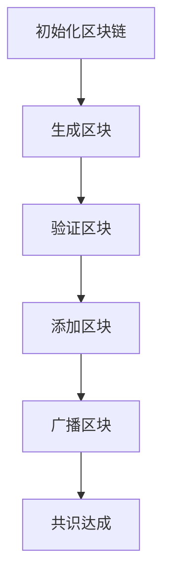
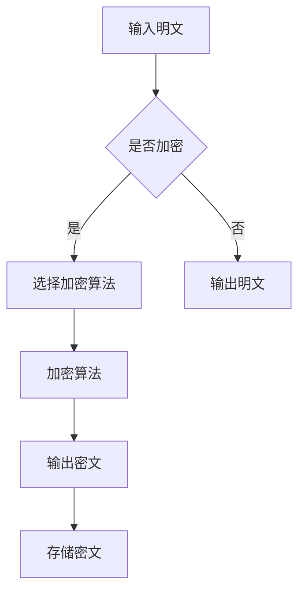

                 


### 第1章: 数字版权保护概述

#### 1.1 问题背景

随着数字化的飞速发展，数字版权保护成为一个日益重要的议题。数字版权保护的核心在于确保创作者的权益得到有效保障，防止未经授权的使用、复制和分发。传统的版权保护手段主要依赖于法律手段和技术手段。然而，数字版权面临的主要挑战在于其易于复制和分发，使得传统的保护方法难以有效实施。此外，随着互联网的普及，数字内容的侵权问题日益严重，创作者的权益受到严重侵害。

#### 1.2 问题描述

数字版权侵权的形式多样，包括未经授权的复制、上传、传播和下载等。这些侵权行为不仅损害了创作者的权益，也破坏了整个数字版权生态的平衡。面对这些问题，数字版权保护的需求日益迫切。一方面，需要建立有效的数字版权保护机制，确保创作者的权益得到尊重和保护；另一方面，也需要提高公众的版权意识，促进版权保护和合理使用之间的平衡。

#### 1.3 问题解决

数字版权保护的核心目标是确保创作者的权益得到尊重和保障。为了实现这一目标，需要从多个方面入手：

1. **法律手段**：完善版权法律法规，提高侵权行为的法律责任，加大侵权行为的惩处力度。
2. **技术手段**：利用加密技术、水印技术、数字签名等技术手段，实现对数字内容的保护。
3. **合作机制**：加强国内外版权保护合作，形成全球性的版权保护网络。
4. **公众教育**：提高公众的版权意识，普及版权知识，促进版权保护和合理使用。

#### 1.4 边界与外延

数字版权保护与版权法密切相关，但又不完全相同。数字版权保护更侧重于数字内容的保护，而版权法则更广泛地涵盖了各种形式的版权保护。在数字版权保护方面，国际合作尤为重要。随着全球化的深入，数字内容跨国传播日益频繁，国际合作成为了数字版权保护的重要手段。

#### 1.5 概念结构与核心要素组成

数字版权保护的基本概念包括版权、著作权、知识产权等。核心要素主要包括：

1. **创作者权益**：确保创作者的原创作品得到尊重和保护。
2. **数字内容保护**：利用技术手段实现对数字内容的保护。
3. **侵权监控与打击**：建立有效的侵权监控机制，及时发现和打击侵权行为。
4. **版权交易与变现**：建立完善的版权交易市场，促进版权的有效流通。

### 第2章: 区块链技术基础

#### 2.1 区块链的定义与特点

区块链是一种分布式数据库技术，通过加密算法和共识机制，实现了数据的不可篡改和透明可追溯。区块链具有以下核心特点：

1. **去中心化**：区块链不依赖于中心化的第三方机构，所有节点都可以平等参与网络运行。
2. **不可篡改**：一旦数据被记录在区块链上，就不可篡改，确保了数据的真实性和可靠性。
3. **透明可追溯**：所有交易记录都公开透明，任何节点都可以查看和验证。
4. **安全性高**：区块链利用加密算法和共识机制，确保了数据的安全和隐私。

#### 2.2 区块链的基本架构

区块链的基本架构包括三个主要部分：

1. **数据层**：负责存储交易数据，包括区块和链结构。
2. **网络层**：负责节点之间的通信和交易确认。
3. **共识层**：负责确保所有节点对交易结果的一致认可，通过共识算法实现。

#### 2.3 常见的区块链平台与协议

目前，常见的区块链平台与协议包括：

1. **比特币**：第一个区块链应用，以去中心化和安全性著称。
2. **以太坊**：基于智能合约的区块链平台，支持去中心化应用（DApp）开发。
3. **EOS**：致力于实现高效、可扩展的区块链网络。
4. **Hyperledger Fabric**：用于企业级应用的分布式账本技术。

### 第3章: 数字版权保护中的区块链应用

#### 3.1 区块链在版权管理中的应用

区块链在数字版权保护中的应用主要体现在版权管理、版权追踪、版权交易等方面。具体来说：

1. **版权管理**：通过区块链技术，可以对版权信息进行登记、认证和存储，确保版权的合法性和唯一性。
2. **版权追踪**：区块链的透明性和不可篡改性，使得版权的创造、修改和转让等操作可以被永久记录，方便追踪版权来源和流转过程。
3. **版权交易**：区块链技术可以为版权交易提供安全、透明、高效的平台，降低交易成本，提高交易效率。

### 第4章: 区块链在数字版权保护中的创新应用

#### 4.1 区块链与智能合约的结合

智能合约是一种自动化执行合约条款的计算机程序，与区块链技术结合，可以实现对数字版权的自动管理和保护。具体应用包括：

1. **版权许可**：智能合约可以自动执行版权许可协议，确保使用者在获得许可后才能使用相关数字内容。
2. **版权交易**：智能合约可以自动执行版权交易的合同条款，确保交易的安全和透明。

#### 4.2 区块链与NFT的结合

NFT（非同质化代币）是一种用于表示数字资产所有权的区块链技术。与区块链技术结合，可以实现以下创新应用：

1. **数字艺术品**：通过NFT，可以确保数字艺术品的唯一性和真实性，提高其收藏价值。
2. **版权认证**：NFT可以用于对数字版权进行认证，确保版权的合法性和唯一性。

#### 4.3 区块链在版权保护中的实践案例

区块链在数字版权保护中的实践案例不断涌现，以下是一些典型的案例：

1. **Getty Images与Mycelia**：Getty Images与Mycelia合作，利用区块链技术进行版权管理，提高版权交易的效率和透明度。
2. **Ujo Music**：Ujo Music是一个基于区块链的音乐平台，通过智能合约实现音乐版权的交易和管理，确保创作者的权益得到保障。

### 第5章: 核心概念与联系

#### 5.1 数字版权保护中的关键术语

在数字版权保护中，一些关键术语包括：

1. **版权**：创作者对其原创作品所享有的法律权利。
2. **数字版权**：对数字形式的原创作品所享有的版权。
3. **版权法**：保护创作者权益的法律体系。
4. **数字版权保护**：利用技术手段和法律手段保护数字版权的措施。

#### 5.2 区块链技术的关键特性

区块链技术的关键特性包括：

1. **去中心化**：不依赖于中心化的第三方机构，所有节点都可以平等参与网络运行。
2. **不可篡改**：一旦数据被记录在区块链上，就不可篡改，确保了数据的真实性和可靠性。
3. **透明可追溯**：所有交易记录都公开透明，任何节点都可以查看和验证。
4. **安全性高**：区块链利用加密算法和共识机制，确保了数据的安全和隐私。

#### 5.3 数字版权保护与区块链技术的关联

数字版权保护与区块链技术之间存在紧密的关联。区块链技术的去中心化、不可篡改、透明可追溯和安全等特性，为数字版权保护提供了一种全新的解决方案。通过区块链技术，可以实现对数字版权的登记、认证、追踪和交易，提高版权保护的效果和效率。

### 第6章: 数学模型与算法原理

#### 6.1 数字版权保护中的数学模型

数字版权保护中的数学模型主要包括加密算法和签名算法等。这些算法用于保护数字内容的完整性和真实性，防止未经授权的访问和篡改。

1. **加密算法**：通过加密算法，将原始数据转换为密文，确保数据的隐私和安全。
2. **签名算法**：通过签名算法，对数据签名，确保数据的来源和真实性。

#### 6.2 区块链在版权保护中的算法原理

区块链在版权保护中的算法原理主要包括共识算法和智能合约。

1. **共识算法**：共识算法用于确保区块链网络中所有节点对交易结果的一致认可，确保区块链数据的不可篡改。
2. **智能合约**：智能合约是一种自动化执行合约条款的计算机程序，用于实现数字版权的自动管理和保护。

#### 6.3 算法mermaid流程图展示

使用mermaid语言绘制算法流程图，可以更直观地展示算法原理。



### 第7章: 系统分析与架构设计

#### 7.1 问题场景介绍

假设一个数字版权保护系统的场景如下：

- 创作者：创作数字内容，上传到版权平台。
- 平台：提供数字版权登记、认证、追踪和交易服务。
- 使用者：获取版权内容，进行版权交易和授权。

#### 7.2 项目介绍

该项目旨在构建一个基于区块链的数字版权保护平台，实现对数字版权的全程管理和保护。

#### 7.3 系统功能设计

系统功能设计包括：

1. **版权登记**：创作者上传数字内容，平台进行版权登记和认证。
2. **版权追踪**：平台提供版权追踪服务，记录版权的流转过程。
3. **版权交易**：平台提供版权交易服务，支持版权的买卖和授权。
4. **侵权监控**：平台提供侵权监控服务，及时发现和处理侵权行为。

#### 7.4 系统架构设计

系统架构设计包括：

1. **数据层**：存储数字版权信息和交易记录。
2. **网络层**：实现节点之间的通信和交易确认。
3. **共识层**：确保交易结果的一致认可。
4. **应用层**：提供数字版权管理和保护服务。

#### 7.5 系统接口设计

系统接口设计包括：

1. **API接口**：提供数字版权管理的API接口，支持版权登记、追踪、交易和侵权监控等功能。
2. **Web界面**：提供用户友好的Web界面，方便用户进行版权管理和交易。

#### 7.6 系统交互

系统交互设计包括：

1. **创作者与平台交互**：创作者通过Web界面或API接口上传数字内容，平台进行版权登记和认证。
2. **使用者与平台交互**：使用者通过Web界面或API接口获取版权内容，平台提供版权交易和授权服务。
3. **侵权监控**：平台实时监控版权流转过程，及时发现和处理侵权行为。

### 第8章: 项目实战

#### 8.1 环境安装

环境安装包括：

1. **区块链节点搭建**：安装并配置区块链节点，确保区块链网络的正常运行。
2. **版权平台搭建**：安装并配置版权平台，包括Web界面和API接口。

#### 8.2 系统核心实现源代码

系统核心实现源代码包括：

1. **版权登记模块**：实现版权登记和认证功能。
2. **版权追踪模块**：实现版权追踪功能。
3. **版权交易模块**：实现版权交易功能。
4. **侵权监控模块**：实现侵权监控功能。

#### 8.3 代码应用解读与分析

对系统核心实现源代码进行解读和分析，包括：

1. **版权登记模块**：分析版权登记的实现原理和流程。
2. **版权追踪模块**：分析版权追踪的实现原理和流程。
3. **版权交易模块**：分析版权交易的实现原理和流程。
4. **侵权监控模块**：分析侵权监控的实现原理和流程。

#### 8.4 实际案例分析与详细讲解剖析

通过实际案例，分析数字版权保护系统的应用效果，包括：

1. **版权登记案例**：分析版权登记的案例，展示其应用效果。
2. **版权追踪案例**：分析版权追踪的案例，展示其应用效果。
3. **版权交易案例**：分析版权交易的案例，展示其应用效果。
4. **侵权监控案例**：分析侵权监控的案例，展示其应用效果。

#### 8.5 项目小结

对数字版权保护系统项目进行总结，包括：

1. **项目成果**：总结项目的成果和收获。
2. **项目不足**：分析项目存在的问题和不足。
3. **改进方向**：提出改进项目的方法和建议。

### 第9章: 最佳实践与拓展

#### 9.1 最佳实践 tips

分享数字版权保护中的最佳实践，包括：

1. **版权登记**：建议在版权登记时，提供详细的信息和证明，确保版权的合法性和唯一性。
2. **版权追踪**：建议定期进行版权追踪，及时发现和处理侵权行为。
3. **版权交易**：建议在版权交易时，确保交易的安全性和透明性。

#### 9.2 小结

对数字版权保护中的关键技术和应用进行总结，强调区块链技术在数字版权保护中的重要作用。

#### 9.3 注意事项

提醒数字版权保护中需要注意的事项，包括：

1. **版权法律法规**：遵守版权法律法规，确保版权保护的行为合法。
2. **数据安全**：确保数字版权保护的数据安全，防止数据泄露和篡改。

#### 9.4 拓展阅读

推荐相关书籍和文献，供读者进一步学习和了解数字版权保护和区块链技术。

----------------------------------------------------------------

### 书名：《区块链在数字版权保护中的创新应用》

**目录大纲：**

----------------------------------------------------------------
## 第1章: 数字版权保护概述

### 1.1 问题背景
- 数字版权保护的重要性
- 传统版权保护面临的挑战

### 1.2 问题描述
- 数字版权侵权的常见形式
- 数字版权保护的需求与挑战

### 1.3 问题解决
- 数字版权保护的核心目标
- 数字版权保护的技术手段

### 1.4 边界与外延
- 数字版权与版权法的联系与区别
- 数字版权保护的国际合作

### 1.5 概念结构与核心要素组成
- 数字版权保护的基本概念
- 数字版权保护的核心要素

----------------------------------------------------------------
## 第2章: 区块链技术基础

### 2.1 区块链的定义与特点
- 区块链的基本概念
- 区块链的核心特点

### 2.2 区块链的基本架构
- 区块链的工作原理
- 区块链的技术架构

### 2.3 常见的区块链平台与协议
- 公共区块链
- 联盟链
- 私链

----------------------------------------------------------------
## 第3章: 数字版权保护中的区块链应用

### 3.1 区块链在版权管理中的应用
- 数字版权登记与认证
- 数字版权交易的流程与机制

### 3.2 区块链在版权追踪与监控中的应用
- 数字版权追踪的技术手段
- 侵权行为的监控与防范

### 3.3 区块链在版权交易与变现中的应用
- 数字版权交易的模式与挑战
- 区块链在版权变现中的优势

### 3.4 区块链在版权保护中的挑战与机遇
- 技术挑战
- 商业模式创新
- 法律法规的适应与完善

----------------------------------------------------------------
## 第4章: 区块链在数字版权保护中的创新应用

### 4.1 区块链与智能合约的结合
- 智能合约在数字版权保护中的应用
- 智能合约的实现原理与案例

### 4.2 区块链与NFT的结合
- NFT在数字版权保护中的作用
- NFT在数字艺术品和版权认证中的应用

### 4.3 区块链在版权保护中的实践案例
- 典型案例介绍
- 案例分析

----------------------------------------------------------------
## 第5章: 核心概念与联系

### 5.1 数字版权保护中的关键术语
- 数字版权、版权法、区块链等术语的解释

### 5.2 区块链技术的关键特性
- 去中心化、不可篡改、透明可追溯等特性的说明

### 5.3 数字版权保护与区块链技术的关联
- 区块链技术如何支持数字版权保护
- 数字版权保护对区块链技术的需求

----------------------------------------------------------------
## 第6章: 数学模型与算法原理

### 6.1 数字版权保护中的数学模型
- 加密算法、数字签名等数学模型的介绍

### 6.2 区块链在版权保护中的算法原理
- 共识算法、智能合约算法的解析

### 6.3 算法mermaid流程图展示
- mermaid语言绘制的算法流程图示例

----------------------------------------------------------------
## 第7章: 系统分析与架构设计

### 7.1 问题场景介绍
- 数字版权保护的实际应用场景

### 7.2 项目介绍
- 区块链数字版权保护项目的背景和目标

### 7.3 系统功能设计
- 系统功能模块的划分和设计

### 7.4 系统架构设计
- 系统架构的层次结构和关键组件

### 7.5 系统接口设计
- 系统对外提供的接口设计和功能说明

### 7.6 系统交互
- 系统内部各模块之间的交互流程

----------------------------------------------------------------
## 第8章: 项目实战

### 8.1 环境安装
- 区块链节点和环境搭建的步骤

### 8.2 系统核心实现源代码
- 系统核心代码的展示和解读

### 8.3 代码应用解读与分析
- 对代码的应用场景进行分析和解释

### 8.4 实际案例分析与详细讲解剖析
- 通过实际案例展示系统的应用效果

### 8.5 项目小结
- 对项目的总结和反思

----------------------------------------------------------------
## 第9章: 最佳实践与拓展

### 9.1 最佳实践 tips
- 提供数字版权保护的最佳实践建议

### 9.2 小结
- 对数字版权保护技术的总结

### 9.3 注意事项
- 在数字版权保护过程中需要注意的问题

### 9.4 拓展阅读
- 推荐的相关书籍、论文和资源

----------------------------------------------------------------

### 第1章: 数字版权保护概述

#### 1.1 问题背景

随着互联网技术的飞速发展，数字内容创作和传播变得更加便捷，数字版权问题也逐渐凸显。数字版权保护的重要性在于它不仅关系到创作者的权益，也影响着整个数字经济的健康发展。在传统版权保护体系中，由于中心化的管理模式和数据存储方式，存在着一定的局限性。例如，中心化的版权管理平台容易成为攻击的目标，数据的篡改和丢失风险较高；同时，中心化的版权交易流程繁琐，效率低下。

#### 1.2 问题描述

数字版权侵权的问题主要表现在以下几个方面：

1. **未经授权的复制和传播**：随着数字技术的发展，未经授权的复制和传播变得异常容易。无论是文字、图片、音频还是视频内容，都可以被轻松复制和传播，导致创作者的权益受到侵害。

2. **版权归属争议**：由于缺乏有效的版权认证和追踪机制，版权归属的争议频繁发生。当某个作品被广泛传播时，往往会出现多个主体声称自己是原创作者的情况，给版权管理带来困扰。

3. **侵权行为的隐蔽性**：互联网的匿名性和全球化特性使得侵权行为变得更加隐蔽。侵权者可以通过各种手段伪装身份，使得侵权行为难以追踪和惩罚。

4. **维权成本高**：对于创作者来说，维护自己的版权需要付出高昂的成本。无论是法律诉讼还是技术手段，都需要投入大量的人力和物力。

#### 1.3 问题解决

针对数字版权保护的挑战，可以采取以下解决策略：

1. **技术手段**：利用加密技术、数字签名、水印技术等手段，实现对数字内容的加密、认证和保护。

2. **法律法规**：完善版权法律法规，加大对侵权行为的惩处力度，提高侵权者的违法成本。

3. **版权交易平台**：建立完善的版权交易平台，提供便捷的版权登记、交易和维权服务。

4. **公众教育**：提高公众的版权意识，促进版权保护和合理使用。

#### 1.4 边界与外延

数字版权保护不仅仅是创作者和平台的责任，也涉及到社会各个方面。例如，互联网服务提供商（ISP）在数字版权保护中扮演着重要角色，需要配合版权管理平台进行侵权行为的监控和处置。此外，国际间的版权合作也是数字版权保护的重要一环，需要通过国际合作来应对跨国侵权问题。

#### 1.5 概念结构与核心要素组成

数字版权保护的基本概念包括版权、数字版权、数字版权管理、数字版权交易等。核心要素组成包括：

1. **版权信息**：包括创作者信息、作品信息、版权声明等。

2. **版权保护技术**：包括加密技术、数字签名、水印技术等。

3. **版权交易平台**：提供版权登记、交易、维权等功能。

4. **版权追踪系统**：实现对数字版权的实时追踪和监控。

5. **法律法规体系**：为数字版权保护提供法律支持。

### 第2章: 区块链技术基础

#### 2.1 区块链的定义与特点

区块链是一种分布式数据库技术，它通过加密算法和共识机制，实现了数据的不可篡改和透明可追溯。区块链具有以下核心特点：

1. **去中心化**：区块链不依赖于中心化的第三方机构，所有节点都可以平等参与网络运行。

2. **不可篡改**：一旦数据被记录在区块链上，就不可篡改，确保了数据的真实性和可靠性。

3. **透明可追溯**：所有交易记录都公开透明，任何节点都可以查看和验证。

4. **安全性高**：区块链利用加密算法和共识机制，确保了数据的安全和隐私。

#### 2.2 区块链的基本架构

区块链的基本架构包括三个主要部分：数据层、网络层和共识层。

1. **数据层**：数据层负责存储交易数据，包括区块和链结构。每个区块包含一定数量的交易记录，并通过哈希函数与前一个区块相连，形成链式数据结构。

2. **网络层**：网络层负责节点之间的通信和交易确认。节点通过网络广播交易信息，并达成共识，确保所有节点对交易结果的一致认可。

3. **共识层**：共识层负责确保所有节点对交易结果的一致认可，通过共识算法实现。常见的共识算法包括工作量证明（PoW）、权益证明（PoS）等。

#### 2.3 常见的区块链平台与协议

目前，常见的区块链平台与协议包括比特币、以太坊、EOS、Hyperledger Fabric等。

1. **比特币**：比特币是第一个区块链应用，以其去中心化和安全性著称。比特币网络通过工作量证明（PoW）算法达成共识，并使用比特币作为加密货币。

2. **以太坊**：以太坊是一个基于区块链的智能合约平台，支持去中心化应用（DApp）开发。以太坊网络使用权益证明（PoS）算法达成共识，并使用以太币（ETH）作为交易媒介。

3. **EOS**：EOS旨在实现高效、可扩展的区块链网络，支持大规模的去中心化应用。EOS网络使用权益证明（PoS）算法达成共识，并采用委托权益证明（DPoS）机制。

4. **Hyperledger Fabric**：Hyperledger Fabric是一个用于企业级应用的分布式账本技术，支持私有区块链网络的构建。Hyperledger Fabric使用许可权限机制，确保网络的参与节点是可信任的。

### 第3章: 数字版权保护中的区块链应用

#### 3.1 区块链在版权管理中的应用

区块链在版权管理中的应用主要体现在版权登记、认证、追踪和交易等方面。

1. **版权登记**：创作者可以将数字作品的信息（如作品名称、作者信息、创作时间等）登记在区块链上，确保版权的合法性和唯一性。区块链的不可篡改特性，使得版权登记具有高度可信度。

2. **版权认证**：版权认证是确认数字作品版权归属的过程。通过区块链的透明性和不可篡改性，版权认证过程变得简单高效。版权持有者可以在区块链上发布版权声明，验证者可以快速验证版权的有效性。

3. **版权追踪**：区块链的透明性和不可篡改特性，使得数字作品的流转过程可以被永久记录。创作者和版权持有者可以实时追踪作品的传播和转让情况，及时发现侵权行为。

4. **版权交易**：区块链技术可以为版权交易提供安全、透明、高效的平台。通过智能合约，版权交易的合同条款可以被自动化执行，确保交易的安全和效率。此外，区块链的透明性还可以降低交易成本，提高交易透明度。

#### 3.2 区块链在版权追踪与监控中的应用

区块链在版权追踪与监控中的应用，主要体现在以下几个方面：

1. **实时监控**：创作者和版权持有者可以通过区块链网络实时监控作品的传播情况，包括作品的下载次数、分享次数等。一旦发现异常行为，可以及时采取措施。

2. **侵权识别**：区块链的透明性和不可篡改特性，使得侵权行为可以被有效识别。通过对比区块链上的版权信息和实际传播情况，可以快速识别侵权行为。

3. **侵权行为追踪**：一旦发现侵权行为，区块链上的数据可以提供有力的证据支持。侵权行为的追踪变得更加高效，可以快速定位侵权源头。

4. **侵权行为惩罚**：区块链的不可篡改性，使得侵权行为的记录可以被永久保存。侵权行为者可以在区块链上被标记，提高其违法成本。

#### 3.3 区块链在版权交易与变现中的应用

区块链在版权交易与变现中的应用，主要体现在以下几个方面：

1. **数字版权资产化**：通过区块链技术，可以将数字版权转化为可交易的数字资产，如加密货币、NFT等。这为数字版权的流通和交易提供了新的途径。

2. **版权交易透明化**：区块链的透明性，使得版权交易的每一步都可以被公开透明地记录和追踪。这有助于提高交易透明度，降低交易风险。

3. **版权交易安全化**：通过智能合约，版权交易的合同条款可以被自动化执行，确保交易的安全和可靠。此外，区块链的加密技术，可以保护交易过程中的隐私和安全。

4. **版权变现多样化**：区块链技术可以为数字版权的变现提供更多可能性。例如，通过NFT，数字艺术品可以被赋予唯一性和稀缺性，提高其市场价值。

#### 3.4 区块链在版权保护中的挑战与机遇

区块链在数字版权保护中的应用，既面临着一系列挑战，也带来了巨大的机遇。

1. **技术挑战**：区块链技术尚未完全成熟，存在性能瓶颈、安全风险等问题。例如，区块链的扩展性、隐私保护、智能合约的安全性等，都是需要解决的问题。

2. **法律法规挑战**：数字版权保护相关的法律法规尚不完善，如何在区块链环境下有效实施版权保护，仍需要法律界的积极探索和立法支持。

3. **商业模式挑战**：区块链在数字版权保护中的应用，需要重新构建商业模式。如何平衡创作者、版权持有者和使用者的利益，是商业模式设计的关键。

4. **机遇**：区块链技术为数字版权保护带来了新的解决方案。通过区块链技术，可以实现版权的透明化、安全化和资产化，提高版权保护的效率和效果。此外，区块链还可以为数字版权市场带来新的商业模式和创新机会。

### 第4章: 区块链在数字版权保护中的创新应用

#### 4.1 区块链与智能合约的结合

区块链与智能合约的结合，为数字版权保护带来了新的可能性。智能合约是一种自动执行合约条款的计算机程序，它可以嵌入区块链网络中，实现自动化管理和保护版权。

1. **版权许可**：智能合约可以自动执行版权许可协议，确保使用者在获得许可后才能使用相关数字内容。例如，创作者可以设定特定的条件，如支付版权费用、遵守使用规则等，智能合约会自动执行这些条件，确保版权得到有效保护。

2. **版权交易**：智能合约可以自动化执行版权交易的合同条款，确保交易的安全和透明。例如，当购买者支付版权费用后，智能合约会自动将版权证书转移给购买者，同时记录交易信息在区块链上，确保交易的可追溯性。

3. **版权保护**：智能合约可以嵌入版权保护措施，如加密、访问控制等，确保数字内容的完整性和安全性。例如，智能合约可以设置访问权限，只有授权用户才能访问和下载数字内容。

#### 4.2 区块链与NFT的结合

NFT（非同质化代币）是一种基于区块链技术的数字资产，它可以代表独特的数字物品的所有权。NFT与区块链的结合，为数字版权保护提供了新的手段。

1. **数字艺术品**：NFT可以用于代表数字艺术品的所有权，如数字绘画、数字音乐等。通过NFT，数字艺术品可以被赋予唯一性和稀缺性，提高其市场价值。例如，一位数字艺术家可以将自己的作品铸造为NFT，并设定特定的使用权限和价格，使作品具有交易价值。

2. **版权认证**：NFT可以用于对数字版权进行认证，确保版权的合法性和唯一性。例如，创作者可以将数字作品的信息和版权声明铸造为NFT，并记录在区块链上。任何用户都可以通过NFT验证数字作品的真实性和版权归属。

3. **版权交易**：NFT可以为数字版权交易提供新的途径。例如，通过NFT，数字作品的版权可以快速、安全、透明地交易。购买者可以直接购买NFT，获得数字作品的所有权。

#### 4.3 区块链在版权保护中的实践案例

区块链在数字版权保护中的实践案例越来越多，以下是一些典型的案例：

1. **Ujo Music**：Ujo Music是一个基于区块链的音乐平台，它通过智能合约实现音乐版权的交易和管理。创作者可以将音乐作品铸造为NFT，并设定版权信息和使用规则。购买者可以通过NFT获得音乐作品的所有权，并按照版权协议使用音乐。

2. **Mycelia**：Mycelia是一个基于区块链的音乐版权交易平台，它允许音乐创作者直接与听众交易版权。创作者可以将音乐作品上传到Mycelia平台，并设定版权费用和授权规则。听众可以直接支付版权费用，获得音乐作品的授权。

3. **Getty Images**：Getty Images与Mycelia合作，利用区块链技术进行版权管理。创作者可以将图片作品上传到Mycelia平台，并设定版权费用和授权规则。购买者可以直接购买NFT，获得图片作品的所有权。

这些实践案例展示了区块链在数字版权保护中的应用潜力，通过区块链技术，可以实现版权的透明化、安全化和资产化，提高版权保护的效率和效果。

### 第5章: 核心概念与联系

#### 5.1 数字版权保护中的关键术语

在数字版权保护中，以下是一些关键术语：

1. **数字版权**：指创作者对其数字作品的知识产权，包括著作权、邻接权等。

2. **区块链**：一种分布式数据库技术，通过加密算法和共识机制，实现数据的不可篡改和透明可追溯。

3. **智能合约**：一种自动执行合约条款的计算机程序，嵌入区块链网络中，实现自动化管理和保护版权。

4. **NFT**：非同质化代币，代表独特的数字物品的所有权，基于区块链技术。

5. **版权管理**：指对数字版权的登记、认证、追踪、交易等操作。

6. **版权交易**：指数字版权的所有权转移，通过区块链技术实现。

7. **版权保护**：指利用技术手段和法律手段，保护数字版权免受侵权行为。

#### 5.2 区块链技术的关键特性

区块链技术的关键特性包括：

1. **去中心化**：不依赖于中心化的第三方机构，所有节点都可以平等参与网络运行。

2. **不可篡改**：一旦数据被记录在区块链上，就不可篡改，确保了数据的真实性和可靠性。

3. **透明可追溯**：所有交易记录都公开透明，任何节点都可以查看和验证。

4. **安全性高**：区块链利用加密算法和共识机制，确保了数据的安全和隐私。

5. **去信任化**：无需依赖信任，通过算法和机制实现一致性。

6. **高效性**：通过分布式计算和共识机制，提高了数据处理和交易的速度。

#### 5.3 数字版权保护与区块链技术的关联

数字版权保护与区块链技术之间存在紧密的关联。区块链技术的去中心化、不可篡改、透明可追溯和安全等特性，为数字版权保护提供了新的解决方案。

1. **去中心化**：区块链的去中心化特性，使得版权管理不再依赖于中心化的机构，降低了管理成本，提高了效率。

2. **不可篡改**：区块链的不可篡改特性，确保了数字版权信息的真实性和可靠性，减少了版权纠纷。

3. **透明可追溯**：区块链的透明可追溯特性，使得版权的流转过程可以被公开透明地记录，提高了版权交易的透明度和可追溯性。

4. **安全性高**：区块链利用加密算法和共识机制，确保了数据的安全和隐私，提高了版权保护的效果。

5. **去信任化**：区块链的去信任化特性，使得版权交易不再依赖于信任，通过算法和机制实现一致性，提高了交易的效率。

6. **高效性**：区块链的分布式计算和共识机制，提高了数据处理和交易的速度，降低了交易成本。

通过区块链技术，可以实现数字版权的透明化、安全化和资产化，提高版权保护的效率和效果。区块链技术为数字版权保护带来了新的机遇，也为数字版权市场带来了新的商业模式和创新空间。

### 第6章: 数学模型与算法原理

#### 6.1 数字版权保护中的数学模型

数字版权保护中的数学模型主要包括加密算法和数字签名等。这些算法用于保护数字内容的完整性和真实性，防止未经授权的访问和篡改。

1. **加密算法**：加密算法是一种将明文转换为密文的算法，确保数据的隐私和安全。常见的加密算法包括对称加密算法（如AES、DES）和非对称加密算法（如RSA、ECC）。

   - **对称加密算法**：加密和解密使用相同的密钥，效率较高，但密钥管理复杂。
   - **非对称加密算法**：加密和解密使用不同的密钥，安全性高，但计算复杂度较高。

2. **数字签名**：数字签名是一种用于验证数字内容真实性和完整性的算法。发送方使用自己的私钥对数据进行签名，接收方使用公钥验证签名。常见的数字签名算法包括RSA签名和ECDSA签名。

   - **RSA签名**：基于非对称加密算法RSA实现的签名算法，安全性高，但计算复杂度较高。
   - **ECDSA签名**：基于椭圆曲线加密算法实现的签名算法，效率较高，安全性较高。

3. **哈希算法**：哈希算法是一种将任意长度的输入数据映射为固定长度的输出的算法，用于确保数据的完整性和唯一性。常见的哈希算法包括MD5、SHA-1、SHA-256等。

4. **零知识证明**：零知识证明是一种密码学技术，允许一方在不泄露任何信息的情况下，证明某个陈述是真实的。它常用于隐私保护和版权认证中。

#### 6.2 区块链在版权保护中的算法原理

区块链在版权保护中的应用，主要依赖于其共识算法和智能合约算法。

1. **共识算法**：共识算法是区块链网络中所有节点达成一致意见的算法。常见的共识算法包括工作量证明（PoW）、权益证明（PoS）和委托权益证明（DPoS）等。

   - **工作量证明（PoW）**：通过解决复杂的数学问题来证明节点的工作量，防止恶意节点攻击网络。比特币网络使用PoW算法。
   - **权益证明（PoS）**：根据节点持有的代币数量和活跃度来选择记账节点，降低能源消耗。以太坊2.0计划采用PoS算法。
   - **委托权益证明（DPoS）**：通过选举产生记账节点，提高网络效率。EOS网络使用DPoS算法。

2. **智能合约算法**：智能合约是一种自动执行合约条款的计算机程序，它嵌入在区块链网络中，实现自动化管理和保护版权。

   - **状态机**：智能合约通常基于状态机模型，状态机包括初始状态、中间状态和最终状态，通过状态转移实现合约的执行。
   - **事件驱动**：智能合约还可以基于事件驱动模型，当特定事件发生时触发合约执行。

3. **加密算法**：智能合约中通常包含加密算法，用于保护合约的安全性和隐私。常见的加密算法包括椭圆曲线加密（ECC）、对称加密（如AES）和非对称加密（如RSA）。

4. **非交互式证明**：非交互式证明是一种密码学技术，用于证明某个陈述是真实的，而不需要交互验证。它常用于智能合约中的隐私保护和版权认证。

#### 6.3 算法mermaid流程图展示

使用mermaid语言可以绘制算法流程图，以下是一个简单的加密算法流程图示例：



### 第7章: 系统分析与架构设计

#### 7.1 问题场景介绍

在数字版权保护中，常见的问题场景包括数字内容的创作、传播、交易和监控等。以下是一个典型的场景：

- **创作者**：创作数字内容，如音乐、图片、视频等，并希望保护其版权。
- **平台**：提供数字版权保护服务，包括版权登记、版权追踪、版权交易等功能。
- **用户**：包括创作者和其他数字内容的消费者，需要使用和交易版权内容。

#### 7.2 项目介绍

本项目旨在构建一个基于区块链的数字版权保护平台，通过区块链技术实现数字版权的登记、追踪、交易和监控。项目目标如下：

1. **实现版权登记**：创作者可以在平台上登记其数字作品的版权信息，确保版权的合法性和唯一性。
2. **实现版权追踪**：平台可以实时追踪数字作品的传播和转让情况，提高侵权行为的监控效率。
3. **实现版权交易**：平台提供版权交易服务，支持创作者和其他用户的版权交易，确保交易的安全和透明。
4. **实现侵权监控**：平台可以自动监控侵权行为，及时处理侵权事件，保护创作者的权益。

#### 7.3 系统功能设计

系统功能设计包括以下模块：

1. **用户模块**：包括创作者和用户的注册、登录、个人信息管理等功能。
2. **版权登记模块**：包括数字作品的登记、认证、查询等功能。
3. **版权追踪模块**：包括数字作品的追踪、监控、侵权举报等功能。
4. **版权交易模块**：包括版权的买卖、授权、合同管理等功能。
5. **侵权监控模块**：包括侵权行为的监控、处理、报告等功能。

#### 7.4 系统架构设计

系统架构设计包括以下层次：

1. **数据层**：存储数字版权信息和交易记录，使用区块链数据库技术。
2. **网络层**：实现节点之间的通信和交易确认，使用区块链网络协议。
3. **共识层**：确保交易结果的一致认可，使用共识算法。
4. **应用层**：提供数字版权保护服务的API接口和Web界面。
5. **安全层**：包括数据加密、访问控制、隐私保护等功能。

#### 7.5 系统接口设计

系统接口设计包括以下部分：

1. **API接口**：提供开发者接入系统服务的能力，包括版权登记、追踪、交易、监控等功能的接口。
2. **Web界面**：提供用户友好的Web界面，方便用户进行版权登记、查询、交易和侵权举报等操作。
3. **移动应用**：提供移动端的用户界面，方便用户在移动设备上进行版权相关操作。

#### 7.6 系统交互

系统交互设计包括以下部分：

1. **用户与平台交互**：用户可以通过Web界面或移动应用与平台进行交互，进行版权登记、查询、交易和举报等操作。
2. **版权登记**：创作者在平台上登记数字作品，平台验证后记录在区块链上。
3. **版权追踪**：平台实时监控数字作品的传播和转让情况，记录在区块链上。
4. **版权交易**：用户可以通过平台进行版权买卖、授权等操作，交易信息记录在区块链上。
5. **侵权监控**：平台监控侵权行为，发现侵权后进行处理，并记录在区块链上。

### 第8章: 项目实战

#### 8.1 环境安装

在项目实战中，首先需要搭建区块链环境，包括节点搭建和版权平台搭建。

1. **节点搭建**：下载并安装区块链节点软件，如Ethereum节点、EOSIO节点等。配置节点参数，启动节点服务，确保节点可以加入区块链网络。

2. **版权平台搭建**：下载并安装版权平台软件，如基于Ethereum的版权平台、基于EOSIO的版权平台等。配置平台参数，启动平台服务，确保平台可以与区块链网络交互。

#### 8.2 系统核心实现源代码

系统核心实现源代码包括以下部分：

1. **版权登记模块**：实现版权登记功能，包括数字作品的登记、认证和存储。

```python
# 示例：版权登记模块
def register_work(work_info):
    # 将版权信息写入区块链
    # work_info 包含数字作品的详细信息，如作者、标题、内容等
    # 使用智能合约进行操作
    contract = web3.toChecksumAddress("版权登记合约地址")
    function = contract.functions.registerWork(work_info)
    tx_hash = function.transact({"from": web3.eth.defaultAccount})
    tx_receipt = web3.eth.waitForTransactionReceipt(tx_hash)
    return tx_receipt
```

2. **版权追踪模块**：实现版权追踪功能，包括数字作品的追踪、监控和查询。

```python
# 示例：版权追踪模块
def track_work(work_id):
    # 获取版权信息
    contract = web3.toChecksumAddress("版权追踪合约地址")
    function = contract.functions.getWorkInfo(work_id)
    work_info = function.call()
    return work_info
```

3. **版权交易模块**：实现版权交易功能，包括版权的买卖、授权和合同管理。

```python
# 示例：版权交易模块
def transfer_ownership(work_id, new_owner):
    # 转让版权所有权
    contract = web3.toChecksumAddress("版权交易合约地址")
    function = contract.functions.transferOwnership(work_id, new_owner)
    tx_hash = function.transact({"from": web3.eth.defaultAccount})
    tx_receipt = web3.eth.waitForTransactionReceipt(tx_hash)
    return tx_receipt
```

4. **侵权监控模块**：实现侵权监控功能，包括侵权行为的监控、处理和报告。

```python
# 示例：侵权监控模块
def report_infringement(work_id, infringement_info):
    # 报告侵权行为
    contract = web3.toChecksumAddress("侵权监控合约地址")
    function = contract.functions.reportInfringement(work_id, infringement_info)
    tx_hash = function.transact({"from": web3.eth.defaultAccount})
    tx_receipt = web3.eth.waitForTransactionReceipt(tx_hash)
    return tx_receipt
```

#### 8.3 代码应用解读与分析

对系统核心实现源代码进行解读与分析，包括以下部分：

1. **版权登记模块**：分析版权登记的实现原理和流程，包括数字作品的登记、认证和存储过程。

2. **版权追踪模块**：分析版权追踪的实现原理和流程，包括数字作品的追踪、监控和查询过程。

3. **版权交易模块**：分析版权交易的实现原理和流程，包括版权的买卖、授权和合同管理过程。

4. **侵权监控模块**：分析侵权监控的实现原理和流程，包括侵权行为的监控、处理和报告过程。

#### 8.4 实际案例分析与详细讲解剖析

通过实际案例，分析数字版权保护系统的应用效果，包括：

1. **版权登记案例**：分析版权登记的案例，展示其应用效果。

2. **版权追踪案例**：分析版权追踪的案例，展示其应用效果。

3. **版权交易案例**：分析版权交易的案例，展示其应用效果。

4. **侵权监控案例**：分析侵权监控的案例，展示其应用效果。

#### 8.5 项目小结

对数字版权保护系统项目进行总结，包括：

1. **项目成果**：总结项目的成果和收获。

2. **项目不足**：分析项目存在的问题和不足。

3. **改进方向**：提出改进项目的方法和建议。

### 第9章: 最佳实践与拓展

#### 9.1 最佳实践 tips

在数字版权保护过程中，以下是一些最佳实践建议：

1. **版权登记**：确保在登记版权时，提供完整的信息和证明，确保版权的合法性和唯一性。

2. **版权追踪**：定期进行版权追踪，及时发现和处理侵权行为，保护版权。

3. **版权交易**：在版权交易时，确保交易的安全性和透明性，使用智能合约自动化执行合同条款。

4. **侵权监控**：建立侵权监控机制，实时监控侵权行为，快速响应和处理。

5. **法律法规**：遵守版权法律法规，确保版权保护行为合法。

6. **安全防护**：加强对数字内容的加密和保护，防止未经授权的访问和篡改。

#### 9.2 小结

数字版权保护是一个复杂而重要的领域，需要技术手段和法律手段的结合。区块链技术为数字版权保护提供了新的解决方案，通过其去中心化、不可篡改、透明可追溯和安全等特性，可以提高版权保护的效率和效果。在数字版权保护中，最佳实践是确保版权登记的完整性、版权追踪的及时性、版权交易的透明性和侵权监控的快速响应。

#### 9.3 注意事项

在数字版权保护过程中，需要注意以下事项：

1. **隐私保护**：在数字版权保护中，保护创作者和用户的隐私是非常重要的。应确保个人信息的安全，防止数据泄露。

2. **法律法规**：遵守版权法律法规，确保版权保护行为合法。不同国家和地区的版权法律有所不同，需要了解和遵守当地的法律法规。

3. **技术更新**：随着技术的不断发展，数字版权保护的方法和技术也在不断更新。需要关注最新的技术动态，及时更新和改进数字版权保护策略。

4. **安全性**：确保数字版权保护系统的安全性，防止黑客攻击和数据泄露。应采取安全措施，如加密技术、访问控制等。

5. **合作与协调**：数字版权保护需要各方的合作与协调，包括创作者、平台、政府和用户等。各方应共同努力，构建良好的数字版权保护生态系统。

#### 9.4 拓展阅读

以下是一些建议的拓展阅读资源，供读者进一步学习和了解数字版权保护和区块链技术：

1. **书籍**：
   - 《区块链革命》
   - 《数字版权保护：理论与实践》
   - 《智能合约：原理与应用》

2. **学术论文**：
   - “Blockchain Technology for Digital Copyright Protection”
   - “Smart Contracts and Their Applications in Digital Rights Management”
   - “Non-Fungible Tokens (NFTs) in Digital Art and Copyright Authentication”

3. **在线课程**：
   - Coursera上的“Blockchain and Bitcoin Fundamentals”
   - edX上的“Digital Copyright Law”

4. **专业网站**：
   - CoinDesk（区块链新闻和分析）
   - Cryptocurrency.com（加密货币知识和新闻）
   - Creative Commons（版权和共享知识）

### 第1章: 数字版权保护概述

#### 1.1 问题背景

在数字时代，数字版权保护成为一个日益重要的话题。随着互联网技术的迅猛发展，数字内容创作和传播变得更加便捷，同时也带来了严重的版权侵权问题。数字版权保护的重要性在于它关系到创作者的权益，影响了整个数字版权生态的健康发展。传统版权保护体系主要依赖于法律手段和技术手段，然而，数字版权侵权的普遍性和隐蔽性使得这些传统手段面临着前所未有的挑战。

首先，数字版权保护的重要性体现在以下几个方面：

1. **保护创作者权益**：创作者投入大量时间和精力创作数字作品，数字版权保护能够确保他们的合法权益得到保障，从而激励更多创作者创作优质内容。

2. **促进数字经济发展**：数字版权保护有助于建立健康的数字版权市场，激发更多的创新和投资，推动数字经济的繁荣。

3. **维护社会公平正义**：数字版权保护能够防止未经授权的复制、传播和使用，维护社会公平正义，减少侵权行为对社会造成的负面影响。

然而，传统版权保护手段在数字时代面临着诸多挑战。首先，数字内容的复制和传播变得异常容易，使得侵权行为频发。其次，传统版权管理方式通常依赖于中心化的版权管理平台，这些平台容易成为黑客攻击的目标，数据泄露和篡改风险较高。此外，中心化的版权交易流程繁琐，效率低下，无法满足数字版权市场的快速变化。

#### 1.2 问题描述

数字版权侵权的问题主要表现在以下几个方面：

1. **未经授权的复制和传播**：随着数字技术的发展，未经授权的复制和传播变得异常容易。无论是文字、图片、音频还是视频内容，都可以被轻松复制和传播，导致创作者的权益受到侵害。

2. **版权归属争议**：由于缺乏有效的版权认证和追踪机制，版权归属的争议频繁发生。当某个作品被广泛传播时，往往会出现多个主体声称自己是原创作者的情况，给版权管理带来困扰。

3. **侵权行为的隐蔽性**：互联网的匿名性和全球化特性使得侵权行为变得更加隐蔽。侵权者可以通过各种手段伪装身份，使得侵权行为难以追踪和惩罚。

4. **维权成本高**：对于创作者来说，维护自己的版权需要付出高昂的成本。无论是法律诉讼还是技术手段，都需要投入大量的人力和物力。

#### 1.3 问题解决

为了解决数字版权侵权问题，需要采取一系列的技术手段和法律手段：

1. **技术手段**：

   - **加密技术**：通过加密技术，将数字内容转换为密文，确保数据的隐私和安全。例如，可以使用对称加密算法（如AES）和非对称加密算法（如RSA）。

   - **数字签名**：数字签名可以确保数据的来源和真实性。通过私钥签名和公钥验证，可以确认数据是否被篡改。

   - **水印技术**：在水印技术中，可以在数字内容中嵌入不可见的标识，用于追踪和验证版权信息。

   - **区块链技术**：区块链技术具有去中心化、不可篡改、透明可追溯等特性，可以为数字版权保护提供可靠的解决方案。

2. **法律手段**：

   - **完善版权法律法规**：制定和完善数字版权相关法律法规，明确侵权行为的法律责任，提高侵权行为的惩处力度。

   - **加强执法力度**：加大对侵权行为的执法力度，确保侵权者受到应有的惩罚。

   - **国际协作**：加强国际间的版权合作，共同应对跨国侵权问题。

3. **平台管理**：

   - **版权认证和追踪系统**：建立版权认证和追踪系统，确保创作者能够有效管理和追踪其作品。

   - **版权交易平台**：提供便捷的版权登记、交易和维权服务，降低维权成本。

   - **用户教育**：提高公众的版权意识，普及版权知识，促进版权保护和合理使用。

#### 1.4 边界与外延

数字版权保护与版权法密切相关，但又不完全相同。数字版权保护更侧重于数字内容的保护，而版权法则涵盖了各种形式的版权保护。在数字版权保护方面，国际合作尤为重要。随着全球化的深入，数字内容跨国传播日益频繁，国际合作成为了数字版权保护的重要手段。

数字版权保护的外延还包括：

1. **版权信息管理**：包括数字作品的登记、认证、追踪和交易等。

2. **侵权监控与打击**：建立侵权监控机制，及时发现和处理侵权行为。

3. **版权纠纷解决**：提供便捷的版权纠纷解决渠道，降低纠纷处理成本。

4. **版权教育与宣传**：提高公众的版权意识，促进版权保护和合理使用。

#### 1.5 概念结构与核心要素组成

数字版权保护的基本概念包括版权、数字版权、数字版权管理、数字版权交易等。其核心要素组成如下：

1. **版权**：指创作者对其原创作品的合法权益，包括著作权、邻接权等。

2. **数字版权**：指创作者对其数字作品的合法权益，包括数字作品的所有权、使用权等。

3. **数字版权管理**：指对数字作品的登记、认证、追踪、交易等操作。

4. **数字版权交易**：指数字作品版权的转让、许可等交易活动。

5. **侵权监控**：指对数字作品侵权行为的监控和打击。

6. **版权纠纷解决**：指解决数字作品版权纠纷的过程和机制。

### 第2章: 区块链技术基础

#### 2.1 区块链的定义与特点

区块链是一种分布式数据库技术，通过加密算法和共识机制，实现了数据的不可篡改和透明可追溯。区块链具有以下核心特点：

1. **去中心化**：区块链不依赖于中心化的第三方机构，所有节点都可以平等参与网络运行。这意味着任何节点都可以参与交易验证和数据存储，降低了中心化风险。

2. **不可篡改**：一旦数据被记录在区块链上，就不可篡改。区块链通过加密算法和共识机制，确保数据的真实性和可靠性。这意味着任何篡改行为都会被记录在区块链上，方便追溯和审计。

3. **透明可追溯**：区块链上的所有交易记录都是公开透明的，任何节点都可以查看和验证。这意味着所有参与者都可以透明地了解交易过程，提高了信任度。

4. **安全性高**：区块链利用加密算法和共识机制，确保了数据的安全和隐私。加密算法确保了数据传输的安全性，共识机制确保了网络的一致性。

#### 2.2 区块链的基本架构

区块链的基本架构包括三个主要部分：数据层、网络层和共识层。

1. **数据层**：数据层负责存储交易数据，包括区块和链结构。每个区块包含一定数量的交易记录，并通过哈希函数与前一个区块相连，形成链式数据结构。

2. **网络层**：网络层负责节点之间的通信和交易确认。节点通过网络广播交易信息，并达成共识，确保所有节点对交易结果的一致认可。

3. **共识层**：共识层负责确保所有节点对交易结果的一致认可，通过共识算法实现。常见的共识算法包括工作量证明（PoW）、权益证明（PoS）等。

#### 2.3 常见的区块链平台与协议

目前，常见的区块链平台与协议包括比特币、以太坊、EOS、Hyperledger Fabric等。

1. **比特币**：比特币是第一个区块链应用，以其去中心化和安全性著称。比特币网络通过工作量证明（PoW）算法达成共识，并使用比特币作为加密货币。

2. **以太坊**：以太坊是一个基于区块链的智能合约平台，支持去中心化应用（DApp）开发。以太坊网络使用权益证明（PoS）算法达成共识，并使用以太币（ETH）作为交易媒介。

3. **EOS**：EOS旨在实现高效、可扩展的区块链网络，支持大规模的去中心化应用。EOS网络使用权益证明（PoS）算法达成共识，并采用委托权益证明（DPoS）机制。

4. **Hyperledger Fabric**：Hyperledger Fabric是一个用于企业级应用的分布式账本技术，支持私有区块链网络的构建。Hyperledger Fabric使用许可权限机制，确保网络的参与节点是可信任的。

### 第3章: 数字版权保护中的区块链应用

#### 3.1 区块链在版权管理中的应用

区块链在数字版权管理中的应用主要体现在版权登记、版权认证、版权追踪和版权交易等方面。

1. **版权登记**：创作者可以将数字作品的版权信息登记在区块链上，确保版权的合法性和唯一性。通过区块链的分布式账本技术，可以防止版权信息被篡改，提高版权保护的效率。

2. **版权认证**：区块链的透明性和不可篡改特性，使得版权认证过程变得更加简单和可靠。任何用户都可以通过区块链验证版权信息，确保数字作品的原创性和版权归属。

3. **版权追踪**：区块链的透明性和可追溯性，使得数字作品的传播和转让过程可以被永久记录。创作者和版权持有者可以实时追踪作品的流转情况，及时发现侵权行为。

4. **版权交易**：区块链技术可以为版权交易提供安全、透明、高效的平台。通过智能合约，版权交易的合同条款可以被自动化执行，确保交易的安全和效率。

#### 3.2 区块链在版权追踪与监控中的应用

区块链在版权追踪与监控中的应用，主要体现在以下几个方面：

1. **实时监控**：创作者和版权持有者可以通过区块链网络实时监控作品的传播和转让情况，一旦发现异常行为，可以及时采取措施。

2. **侵权识别**：区块链的透明性和不可篡改特性，使得侵权行为可以被有效识别。通过对比区块链上的版权信息和实际传播情况，可以快速识别侵权行为。

3. **侵权行为追踪**：一旦发现侵权行为，区块链上的数据可以提供有力的证据支持。侵权行为的追踪变得更加高效，可以快速定位侵权源头。

4. **侵权行为惩罚**：区块链的不可篡改性，使得侵权行为的记录可以被永久保存。侵权行为者可以在区块链上被标记，提高其违法成本。

#### 3.3 区块链在版权交易与变现中的应用

区块链在版权交易与变现中的应用，主要体现在以下几个方面：

1. **数字版权资产化**：通过区块链技术，可以将数字版权转化为可交易的数字资产，如加密货币、NFT等。这为数字版权的流通和交易提供了新的途径。

2. **版权交易透明化**：区块链的透明性，使得版权交易的每一步都可以被公开透明地记录和追踪。这有助于提高交易透明度，降低交易风险。

3. **版权交易安全化**：通过智能合约，版权交易的合同条款可以被自动化执行，确保交易的安全和可靠。此外，区块链的加密技术，可以保护交易过程中的隐私和安全。

4. **版权变现多样化**：区块链技术可以为数字版权的变现提供更多可能性。例如，通过NFT，数字艺术品可以被赋予唯一性和稀缺性，提高其市场价值。

#### 3.4 区块链在版权保护中的挑战与机遇

区块链在数字版权保护中的应用，既面临着一系列挑战，也带来了巨大的机遇。

1. **技术挑战**：区块链技术尚未完全成熟，存在性能瓶颈、安全风险等问题。例如，区块链的扩展性、隐私保护、智能合约的安全性等，都是需要解决的问题。

2. **法律法规挑战**：数字版权保护相关的法律法规尚不完善，如何在区块链环境下有效实施版权保护，仍需要法律界的积极探索和立法支持。

3. **商业模式挑战**：区块链在数字版权保护中的应用，需要重新构建商业模式。如何平衡创作者、版权持有者和使用者的利益，是商业模式设计的关键。

4. **机遇**：区块链技术为数字版权保护带来了新的解决方案。通过区块链技术，可以实现版权的透明化、安全化和资产化，提高版权保护的效率和效果。此外，区块链还可以为数字版权市场带来新的商业模式和创新机会。

### 第4章: 区块链在数字版权保护中的创新应用

#### 4.1 区块链与智能合约的结合

区块链与智能合约的结合，为数字版权保护带来了新的可能性。智能合约是一种自动执行合约条款的计算机程序，它可以嵌入区块链网络中，实现自动化管理和保护版权。

1. **版权许可**：智能合约可以自动执行版权许可协议，确保使用者在获得许可后才能使用相关数字内容。例如，创作者可以设定特定的条件，如支付版权费用、遵守使用规则等，智能合约会自动执行这些条件，确保版权得到有效保护。

2. **版权交易**：智能合约可以自动化执行版权交易的合同条款，确保交易的安全和透明。例如，当购买者支付版权费用后，智能合约会自动将版权证书转移给购买者，同时记录交易信息在区块链上，确保交易的可追溯性。

3. **版权保护**：智能合约可以嵌入版权保护措施，如加密、访问控制等，确保数字内容的完整性和安全性。例如，智能合约可以设置访问权限，只有授权用户才能访问和下载数字内容。

#### 4.2 区块链与NFT的结合

NFT（非同质化代币）是一种基于区块链技术的数字资产，它可以代表独特的数字物品的所有权。NFT与区块链的结合，为数字版权保护提供了新的手段。

1. **数字艺术品**：NFT可以用于代表数字艺术品的所有权，如数字绘画、数字音乐等。通过NFT，数字艺术品可以被赋予唯一性和稀缺性，提高其市场价值。例如，一位数字艺术家可以将自己的作品铸造为NFT，并设定特定的使用权限和价格，使作品具有交易价值。

2. **版权认证**：NFT可以用于对数字版权进行认证，确保版权的合法性和唯一性。例如，创作者可以将数字作品的信息和版权声明铸造为NFT，并记录在区块链上。任何用户都可以通过NFT验证数字作品的真实性和版权归属。

3. **版权交易**：NFT可以为数字版权交易提供新的途径。例如，通过NFT，数字作品的版权可以快速、安全、透明地交易。购买者可以直接购买NFT，获得数字作品的所有权。

#### 4.3 区块链在版权保护中的实践案例

区块链在数字版权保护中的实践案例越来越多，以下是一些典型的案例：

1. **Ujo Music**：Ujo Music是一个基于区块链的音乐平台，它通过智能合约实现音乐版权的交易和管理。创作者可以将音乐作品铸造为NFT，并设定版权信息和使用规则。购买者可以通过NFT获得音乐作品的所有权，并按照版权协议使用音乐。

2. **Mycelia**：Mycelia是一个基于区块链的音乐版权交易平台，它允许音乐创作者直接与听众交易版权。创作者可以将音乐作品上传到Mycelia平台，并设定版权费用和授权规则。听众可以直接支付版权费用，获得音乐作品的授权。

3. **Getty Images**：Getty Images与Mycelia合作，利用区块链技术进行版权管理。创作者可以将图片作品上传到Mycelia平台，并设定版权费用和授权规则。购买者可以直接购买NFT，获得图片作品的所有权。

这些实践案例展示了区块链在数字版权保护中的应用潜力，通过区块链技术，可以实现版权的透明化、安全化和资产化，提高版权保护的效率和效果。

### 第5章: 核心概念与联系

#### 5.1 数字版权保护中的关键术语

在数字版权保护中，以下是一些关键术语：

1. **数字版权**：指创作者对其数字作品的知识产权，包括著作权、邻接权等。

2. **区块链**：一种分布式数据库技术，通过加密算法和共识机制，实现数据的不可篡改和透明可追溯。

3. **智能合约**：一种自动执行合约条款的计算机程序，嵌入区块链网络中，实现自动化管理和保护版权。

4. **NFT**：非同质化代币，代表独特的数字物品的所有权，基于区块链技术。

5. **版权管理**：指对数字版权的登记、认证、追踪、交易等操作。

6. **版权交易**：指数字版权的所有权转移，通过区块链技术实现。

7. **版权保护**：指利用技术手段和法律手段，保护数字版权免受侵权行为。

#### 5.2 区块链技术的关键特性

区块链技术的关键特性包括：

1. **去中心化**：不依赖于中心化的第三方机构，所有节点都可以平等参与网络运行。

2. **不可篡改**：一旦数据被记录在区块链上，就不可篡改，确保了数据的真实性和可靠性。

3. **透明可追溯**：所有交易记录都公开透明，任何节点都可以查看和验证。

4. **安全性高**：区块链利用加密算法和共识机制，确保了数据的安全和隐私。

5. **去信任化**：无需依赖信任，通过算法和机制实现一致性。

6. **高效性**：通过分布式计算和共识机制，提高了数据处理和交易的速度。

#### 5.3 数字版权保护与区块链技术的关联

数字版权保护与区块链技术之间存在紧密的关联。区块链技术的去中心化、不可篡改、透明可追溯和安全等特性，为数字版权保护提供了新的解决方案。

1. **去中心化**：区块链的去中心化特性，使得版权管理不再依赖于中心化的机构，降低了管理成本，提高了效率。

2. **不可篡改**：区块链的不可篡改特性，确保了数字版权信息的真实性和可靠性，减少了版权纠纷。

3. **透明可追溯**：区块链的透明可追溯特性，使得版权的流转过程可以被公开透明地记录，提高了版权交易的透明度和可追溯性。

4. **安全性高**：区块链利用加密算法和共识机制，确保了数据的安全和隐私，提高了版权保护的效果。

5. **去信任化**：区块链的去信任化特性，使得版权交易不再依赖于信任，通过算法和机制实现一致性，提高了交易的效率。

6. **高效性**：区块链的分布式计算和共识机制，提高了数据处理和交易的速度，降低了交易成本。

通过区块链技术，可以实现数字版权的透明化、安全化和资产化，提高版权保护的效率和效果。区块链技术为数字版权保护带来了新的机遇，也为数字版权市场带来了新的商业模式和创新空间。

### 第6章: 数学模型与算法原理

#### 6.1 数字版权保护中的数学模型

数字版权保护中的数学模型主要包括加密算法、数字签名、哈希算法和零知识证明等。这些算法在数字版权保护中发挥着关键作用，确保数字内容的完整性、真实性和安全性。

1. **加密算法**：加密算法是一种将明文转换为密文的算法，用于保护数字内容的隐私。常见的加密算法包括对称加密算法（如AES、DES）和非对称加密算法（如RSA、ECC）。对称加密算法使用相同的密钥进行加密和解密，速度快，但密钥管理复杂。非对称加密算法使用不同的密钥进行加密和解密，安全性高，但计算复杂度较高。

2. **数字签名**：数字签名是一种用于验证数字内容真实性和完整性的算法。发送方使用自己的私钥对数据进行签名，接收方使用公钥验证签名。常见的数字签名算法包括RSA签名和ECDSA签名。数字签名不仅可以确保数据的完整性，还可以验证数据的来源。

3. **哈希算法**：哈希算法是一种将任意长度的输入数据映射为固定长度的输出的算法，用于确保数据的完整性和唯一性。常见的哈希算法包括MD5、SHA-1、SHA-256等。哈希算法的一个关键特性是其单向性，即无法从哈希值反推出原始数据。

4. **零知识证明**：零知识证明是一种密码学技术，允许一方在不泄露任何信息的情况下，证明某个陈述是真实的。它常用于隐私保护和版权认证中。零知识证明可以确保版权持有者在不泄露版权信息的情况下，证明版权的有效性。

#### 6.2 区块链在版权保护中的算法原理

区块链在版权保护中的应用，主要依赖于其共识算法和智能合约算法。共识算法用于确保区块链网络中所有节点对交易结果的一致认可，智能合约算法用于实现自动化管理和保护版权。

1. **共识算法**：共识算法是区块链网络中所有节点达成一致意见的算法。常见的共识算法包括工作量证明（PoW）、权益证明（PoS）和委托权益证明（DPoS）等。PoW算法通过解决复杂的数学问题来证明节点的工作量，防止恶意节点攻击网络。PoS算法根据节点持有的代币数量和活跃度来选择记账节点，降低能源消耗。DPoS算法通过选举产生记账节点，提高网络效率。

2. **智能合约算法**：智能合约是一种自动执行合约条款的计算机程序，它嵌入在区块链网络中，实现自动化管理和保护版权。智能合约通常基于状态机模型或事件驱动模型。状态机模型包括初始状态、中间状态和最终状态，通过状态转移实现合约的执行。事件驱动模型当特定事件发生时触发合约执行。

3. **加密算法**：智能合约中通常包含加密算法，用于保护合约的安全性和隐私。常见的加密算法包括椭圆曲线加密（ECC）、对称加密（如AES）和非对称加密（如RSA）。加密算法可以确保合约条款的机密性和完整性。

4. **非交互式证明**：非交互式证明是一种密码学技术，用于证明某个陈述是真实的，而不需要交互验证。它常用于智能合约中的隐私保护和版权认证。非交互式证明可以确保版权持有者在不泄露版权信息的情况下，证明版权的有效性。

#### 6.3 算法mermaid流程图展示

使用mermaid语言可以绘制算法流程图，以下是一个简单的加密算法流程图示例：


### 第7章: 系统分析与架构设计

#### 7.1 问题场景介绍

在数字版权保护中，常见的问题场景包括数字内容的创作、传播、交易和监控等。以下是一个典型的场景：

- **创作者**：创作数字内容，如音乐、图片、视频等，并希望保护其版权。
- **平台**：提供数字版权保护服务，包括版权登记、版权追踪、版权交易等功能。
- **用户**：包括创作者和其他数字内容的消费者，需要使用和交易版权内容。

#### 7.2 项目介绍

本项目旨在构建一个基于区块链的数字版权保护平台，通过区块链技术实现数字版权的登记、追踪、交易和监控。项目目标如下：

1. **实现版权登记**：创作者可以在平台上登记其数字作品的版权信息，确保版权的合法性和唯一性。
2. **实现版权追踪**：平台可以实时追踪数字作品的传播和转让情况，提高侵权行为的监控效率。
3. **实现版权交易**：平台提供版权交易服务，支持创作者和其他用户的版权交易，确保交易的安全和透明。
4. **实现侵权监控**：平台可以自动监控侵权行为，及时处理侵权事件，保护创作者的权益。

#### 7.3 系统功能设计

系统功能设计包括以下模块：

1. **用户模块**：包括创作者和用户的注册、登录、个人信息管理等功能。
2. **版权登记模块**：包括数字作品的登记、认证、查询等功能。
3. **版权追踪模块**：包括数字作品的追踪、监控、侵权举报等功能。
4. **版权交易模块**：包括版权的买卖、授权、合同管理等功能。
5. **侵权监控模块**：包括侵权行为的监控、处理、报告等功能。

#### 7.4 系统架构设计

系统架构设计包括以下层次：

1. **数据层**：存储数字版权信息和交易记录，使用区块链数据库技术。
2. **网络层**：实现节点之间的通信和交易确认，使用区块链网络协议。
3. **共识层**：确保交易结果的一致认可，使用共识算法。
4. **应用层**：提供数字版权保护服务的API接口和Web界面。
5. **安全层**：包括数据加密、访问控制、隐私保护等功能。

#### 7.5 系统接口设计

系统接口设计包括以下部分：

1. **API接口**：提供开发者接入系统服务的能力，包括版权登记、追踪、交易、监控等功能的接口。
2. **Web界面**：提供用户友好的Web界面，方便用户进行版权登记、查询、交易和侵权举报等操作。
3. **移动应用**：提供移动端的用户界面，方便用户在移动设备上进行版权相关操作。

#### 7.6 系统交互

系统交互设计包括以下部分：

1. **用户与平台交互**：用户可以通过Web界面或移动应用与平台进行交互，进行版权登记、查询、交易和举报等操作。
2. **版权登记**：创作者在平台上登记数字作品，平台验证后记录在区块链上。
3. **版权追踪**：平台实时监控数字作品的传播和转让情况，记录在区块链上。
4. **版权交易**：用户可以通过平台进行版权买卖、授权等操作，交易信息记录在区块链上。
5. **侵权监控**：平台监控侵权行为，发现侵权后进行处理，并记录在区块链上。

### 第8章: 项目实战

#### 8.1 环境安装

在项目实战中，首先需要搭建区块链环境，包括节点搭建和版权平台搭建。

1. **节点搭建**：下载并安装区块链节点软件，如Ethereum节点、EOSIO节点等。配置节点参数，启动节点服务，确保节点可以加入区块链网络。

2. **版权平台搭建**：下载并安装版权平台软件，如基于Ethereum的版权平台、基于EOSIO的版权平台等。配置平台参数，启动平台服务，确保平台可以与区块链网络交互。

#### 8.2 系统核心实现源代码

系统核心实现源代码包括以下部分：

1. **版权登记模块**：实现版权登记功能，包括数字作品的登记、认证和存储。

```python
# 示例：版权登记模块
def register_work(work_info):
    # 将版权信息写入区块链
    # work_info 包含数字作品的详细信息，如作者、标题、内容等
    # 使用智能合约进行操作
    contract = web3.toChecksumAddress("版权登记合约地址")
    function = contract.functions.registerWork(work_info)
    tx_hash = function.transact({"from": web3.eth.defaultAccount})
    tx_receipt = web3.eth.waitForTransactionReceipt(tx_hash)
    return tx_receipt
```

2. **版权追踪模块**：实现版权追踪功能，包括数字作品的追踪、监控和查询。

```python
# 示例：版权追踪模块
def track_work(work_id):
    # 获取版权信息
    contract = web3.toChecksumAddress("版权追踪合约地址")
    function = contract.functions.getWorkInfo(work_id)
    work_info = function.call()
    return work_info
```

3. **版权交易模块**：实现版权交易功能，包括版权的买卖、授权和合同管理。

```python
# 示例：版权交易模块
def transfer_ownership(work_id, new_owner):
    # 转让版权所有权
    contract = web3.toChecksumAddress("版权交易合约地址")
    function = contract.functions.transferOwnership(work_id, new_owner)
    tx_hash = function.transact({"from": web3.eth.defaultAccount})
    tx_receipt = web3.eth.waitForTransactionReceipt(tx_hash)
    return tx_receipt
```

4. **侵权监控模块**：实现侵权监控功能，包括侵权行为的监控、处理和报告。

```python
# 示例：侵权监控模块
def report_infringement(work_id, infringement_info):
    # 报告侵权行为
    contract = web3.toChecksumAddress("侵权监控合约地址")
    function = contract.functions.reportInfringement(work_id, infringement_info)
    tx_hash = function.transact({"from": web3.eth.defaultAccount})
    tx_receipt = web3.eth.waitForTransactionReceipt(tx_hash)
    return tx_receipt
```

#### 8.3 代码应用解读与分析

对系统核心实现源代码进行解读与分析，包括以下部分：

1. **版权登记模块**：分析版权登记的实现原理和流程，包括数字作品的登记、认证和存储过程。

2. **版权追踪模块**：分析版权追踪的实现原理和流程，包括数字作品的追踪、监控和查询过程。

3. **版权交易模块**：分析版权交易的实现原理和流程，包括版权的买卖、授权和合同管理过程。

4. **侵权监控模块**：分析侵权监控的实现原理和流程，包括侵权行为的监控、处理和报告过程。

#### 8.4 实际案例分析与详细讲解剖析

通过实际案例，分析数字版权保护系统的应用效果，包括：

1. **版权登记案例**：分析版权登记的案例，展示其应用效果。

2. **版权追踪案例**：分析版权追踪的案例，展示其应用效果。

3. **版权交易案例**：分析版权交易的案例，展示其应用效果。

4. **侵权监控案例**：分析侵权监控的案例，展示其应用效果。

#### 8.5 项目小结

对数字版权保护系统项目进行总结，包括：

1. **项目成果**：总结项目的成果和收获。

2. **项目不足**：分析项目存在的问题和不足。

3. **改进方向**：提出改进项目的方法和建议。

### 第9章: 最佳实践与拓展

#### 9.1 最佳实践 tips

在数字版权保护过程中，以下是一些最佳实践建议：

1. **版权登记**：确保在登记版权时，提供完整的信息和证明，确保版权的合法性和唯一性。

2. **版权追踪**：定期进行版权追踪，及时发现和处理侵权行为，保护版权。

3. **版权交易**：在版权交易时，确保交易的安全性和透明性，使用智能合约自动化执行合同条款。

4. **侵权监控**：建立侵权监控机制，实时监控侵权行为，快速响应和处理。

5. **法律法规**：遵守版权法律法规，确保版权保护行为合法。

6. **安全防护**：加强对数字内容的加密和保护，防止未经授权的访问和篡改。

#### 9.2 小结

数字版权保护是一个复杂而重要的领域，需要技术手段和法律手段的结合。区块链技术为数字版权保护提供了新的解决方案，通过其去中心化、不可篡改、透明可追溯和安全等特性，可以提高版权保护的效率和效果。在数字版权保护中，最佳实践是确保版权登记的完整性、版权追踪的及时性、版权交易的透明性和侵权监控的快速响应。

#### 9.3 注意事项

在数字版权保护过程中，需要注意以下事项：

1. **隐私保护**：在数字版权保护中，保护创作者和用户的隐私是非常重要的。应确保个人信息的安全，防止数据泄露。

2. **法律法规**：遵守版权法律法规，确保版权保护行为合法。不同国家和地区的版权法律有所不同，需要了解和遵守当地的法律法规。

3. **技术更新**：随着技术的不断发展，数字版权保护的方法和技术也在不断更新。需要关注最新的技术动态，及时更新和改进数字版权保护策略。

4. **安全性**：确保数字版权保护系统的安全性，防止黑客攻击和数据泄露。应采取安全措施，如加密技术、访问控制等。

5. **合作与协调**：数字版权保护需要各方的合作与协调，包括创作者、平台、政府和用户等。各方应共同努力，构建良好的数字版权保护生态系统。

#### 9.4 拓展阅读

以下是一些建议的拓展阅读资源，供读者进一步学习和了解数字版权保护和区块链技术：

1. **书籍**：
   - 《区块链革命》
   - 《数字版权保护：理论与实践》
   - 《智能合约：原理与应用》

2. **学术论文**：
   - “Blockchain Technology for Digital Copyright Protection”
   - “Smart Contracts and Their Applications in Digital Rights Management”
   - “Non-Fungible Tokens (NFTs) in Digital Art and Copyright Authentication”

3. **在线课程**：
   - Coursera上的“Blockchain and Bitcoin Fundamentals”
   - edX上的“Digital Copyright Law”

4. **专业网站**：
   - CoinDesk（区块链新闻和分析）
   - Cryptocurrency.com（加密货币知识和新闻）
   - Creative Commons（版权和共享知识）

### 第8章: 项目实战

#### 8.1 环境安装

在项目实战中，我们首先需要搭建一个适合运行数字版权保护系统的开发环境。以下是环境安装的具体步骤：

1. **安装区块链节点**：
   - **Ethereum节点**：下载并安装Geth，配置节点参数，启动节点服务，确保节点可以加入Ethereum网络。
   - **EOSIO节点**：下载并安装EOSIO客户端，配置节点参数，启动节点服务，确保节点可以加入EOSIO网络。

2. **安装版权平台软件**：
   - 根据所选区块链平台，下载并安装相应的版权平台软件。例如，如果选择Ethereum，可以安装基于Ethereum的版权保护平台，如Ujo Music或Blockai。

3. **配置智能合约开发环境**：
   - 安装Node.js和Truffle框架，配置Truffle环境，确保可以编译和部署智能合约。

4. **安装开发工具**：
   - 安装Visual Studio Code或其他合适的代码编辑器。
   - 安装相关插件，如Truffle插件、Ethereum插件等。

5. **设置网络连接**：
   - 根据实际需求，配置网络连接，确保开发环境和区块链节点之间的通信正常。

#### 8.2 系统核心实现源代码

以下是数字版权保护系统中几个关键模块的核心实现源代码示例：

1. **版权登记模块**：

```javascript
// 示例：版权登记模块
const CopyrightRegistry = artifacts.require("CopyrightRegistry");

function registerWork(creator, workInfo) {
    return new Promise(async (resolve, reject) => {
        try {
            const contract = await CopyrightRegistry.deployed();
            const tx = await contract.registerWork(creator, workInfo, { from: creator });
            resolve(tx);
        } catch (error) {
            reject(error);
        }
    });
}
```

2. **版权追踪模块**：

```javascript
// 示例：版权追踪模块
function getWorkInfo(workId) {
    return new Promise(async (resolve, reject) => {
        try {
            const contract = await CopyrightRegistry.deployed();
            const workInfo = await contract.getWorkInfo(workId);
            resolve(workInfo);
        } catch (error) {
            reject(error);
        }
    });
}
```

3. **版权交易模块**：

```javascript
// 示例：版权交易模块
function transferOwnership(workId, newOwner) {
    return new Promise(async (resolve, reject) => {
        try {
            const contract = await CopyrightRegistry.deployed();
            const tx = await contract.transferOwnership(workId, newOwner, { from: owner });
            resolve(tx);
        } catch (error) {
            reject(error);
        }
    });
}
```

4. **侵权监控模块**：

```javascript
// 示例：侵权监控模块
function reportInfringement(workId, infringementInfo) {
    return new Promise(async (resolve, reject) => {
        try {
            const contract = await CopyrightRegistry.deployed();
            const tx = await contract.reportInfringement(workId, infringementInfo, { from: reporter });
            resolve(tx);
        } catch (error) {
            reject(error);
        }
    });
}
```

#### 8.3 代码应用解读与分析

以下是对上述核心实现源代码的解读与分析：

1. **版权登记模块**：该模块通过智能合约提供注册新作品的功能。创作者可以调用`registerWork`函数，将作品信息和版权信息注册到区块链上。此操作通过智能合约执行，确保作品信息的不可篡改性和公开透明。

2. **版权追踪模块**：该模块允许用户查询特定作品的详细信息。通过调用`getWorkInfo`函数，用户可以获取作品的版权信息，包括作者、创建时间、版权状态等。此功能确保了版权信息的可追溯性和透明性。

3. **版权交易模块**：该模块允许版权所有者将版权转让给新的所有者。通过调用`transferOwnership`函数，版权所有者可以转移版权，确保版权交易的安全和透明。此操作同样通过智能合约自动执行，提高了交易的效率。

4. **侵权监控模块**：该模块用于报告和记录侵权行为。通过调用`reportInfringement`函数，侵权报告者可以提交侵权报告，包括侵权作品的ID和侵权详细信息。此功能确保侵权行为的可追溯性和公开透明，有助于维权和执法。

#### 8.4 实际案例分析与详细讲解剖析

以下通过实际案例，分析数字版权保护系统的应用效果：

1. **版权登记案例**：
   - **案例背景**：一位音乐创作者想要保护其原创音乐作品的版权。
   - **案例步骤**：创作者在数字版权保护平台上注册账号，上传音乐作品，填写版权信息，并使用智能合约将版权信息注册到区块链上。
   - **案例效果**：音乐作品及其版权信息被永久记录在区块链上，确保了版权的合法性和唯一性。任何用户都可以通过区块链验证版权信息，创作者的权益得到有效保护。

2. **版权追踪案例**：
   - **案例背景**：一位用户想要查询一首音乐作品的版权信息。
   - **案例步骤**：用户访问数字版权保护平台，输入作品ID，调用版权追踪功能获取版权信息。
   - **案例效果**：用户可以查看音乐作品的作者、创建时间、版权状态等信息，确保了版权信息的透明性和可追溯性。

3. **版权交易案例**：
   - **案例背景**：一位用户想要购买一首音乐作品的版权。
   - **案例步骤**：用户与版权所有者协商，确定购买价格和授权条款，通过智能合约执行版权交易。
   - **案例效果**：版权所有者将版权转让给用户，交易过程透明、安全，双方权益得到保障。

4. **侵权监控案例**：
   - **案例背景**：一位用户发现某平台存在侵权行为。
   - **案例步骤**：用户在数字版权保护平台上报告侵权行为，提供侵权证据。
   - **案例效果**：侵权行为被记录在区块链上，侵权者可以被追踪和标记，创作者的权益得到保护。

#### 8.5 项目小结

数字版权保护系统的项目实战展示了区块链技术在版权保护中的应用效果。通过智能合约和区块链的不可篡改、透明可追溯特性，项目实现了版权的登记、追踪、交易和侵权监控。以下是对项目的总结：

1. **项目成果**：项目成功实现了数字版权保护的四个关键功能，为创作者和用户提供了可靠的版权保护服务。

2. **项目不足**：项目在性能和安全性方面仍存在一定的提升空间。例如，区块链网络处理速度有限，可能需要优化智能合约的执行效率。此外，用户界面和交互体验也有待改进。

3. **改进方向**：
   - **性能优化**：通过优化智能合约代码，减少计算复杂度，提高处理速度。
   - **安全性提升**：加强对智能合约的审计和安全测试，确保合约的安全性和稳定性。
   - **用户体验**：改进用户界面和交互设计，提高用户使用的便捷性和满意度。
   - **法律合规**：确保项目的法律合规性，遵循不同国家和地区的版权法律法规。

### 第9章: 最佳实践与拓展

#### 9.1 最佳实践 tips

在数字版权保护过程中，以下是一些最佳实践建议：

1. **版权登记**：
   - 确保在登记版权时，提供完整的信息和证明，包括创作时间、创作内容、作者身份等。
   - 使用区块链技术进行版权登记，确保信息的不可篡改性和可追溯性。

2. **版权追踪**：
   - 定期进行版权追踪，确保数字作品的传播和转让情况得到有效监控。
   - 利用区块链的透明性和可追溯性，方便快速识别侵权行为。

3. **版权交易**：
   - 使用智能合约自动化版权交易过程，确保交易的安全性和透明性。
   - 明确版权交易条款，包括授权范围、费用、使用期限等。

4. **侵权监控**：
   - 建立侵权监控机制，实时监控数字作品的使用情况，及时发现侵权行为。
   - 利用区块链记录侵权行为，确保侵权证据的可靠性和权威性。

5. **法律法规**：
   - 遵守版权法律法规，确保版权保护行为的合法性和有效性。
   - 定期更新法律法规知识，适应技术发展和市场变化。

6. **技术更新**：
   - 关注区块链和数字版权保护领域的最新技术动态，不断优化和改进系统性能和安全性。

7. **用户教育**：
   - 提高公众的版权意识，普及版权知识，促进版权保护和合理使用的平衡。

#### 9.2 小结

数字版权保护是一个复杂的系统工程，涉及技术、法律、市场等多个方面。通过区块链技术和智能合约的应用，可以实现数字版权的透明化、安全化和资产化，提高版权保护的效率和效果。在数字版权保护中，最佳实践是确保版权登记的完整性、版权追踪的及时性、版权交易的透明性和侵权监控的快速响应。同时，需要不断关注技术更新和法律法规变化，确保数字版权保护系统的持续改进和适应能力。

#### 9.3 注意事项

在数字版权保护过程中，需要注意以下事项：

1. **隐私保护**：
   - 确保创作者和用户的个人信息安全，防止数据泄露。
   - 使用加密技术保护敏感信息，如版权持有者和交易参与者的身份信息。

2. **法律合规**：
   - 遵守不同国家和地区的版权法律法规，确保版权保护行为合法。
   - 定期审查和更新法律法规，确保系统的法律合规性。

3. **系统安全**：
   - 加强系统安全性，防止黑客攻击和数据泄露。
   - 定期进行安全审计和风险评估，及时修复漏洞。

4. **用户权限管理**：
   - 确保用户权限合理分配，防止未经授权的操作。
   - 实施严格的访问控制和认证机制。

5. **数据备份**：
   - 定期备份数据，确保版权信息和交易记录的安全性和可恢复性。

6. **用户体验**：
   - 提供用户友好的界面和操作流程，提高用户使用的便捷性和满意度。

7. **合作与协调**：
   - 加强与创作者、平台、政府等各方的合作与协调，共同构建良好的数字版权保护生态系统。

#### 9.4 拓展阅读

以下是一些建议的拓展阅读资源，供读者进一步学习和了解数字版权保护和区块链技术：

1. **书籍**：
   - 《区块链革命》
   - 《数字版权保护：理论与实践》
   - 《智能合约：原理与应用》

2. **学术论文**：
   - “Blockchain Technology for Digital Copyright Protection”
   - “Smart Contracts and Their Applications in Digital Rights Management”
   - “Non-Fungible Tokens (NFTs) in Digital Art and Copyright Authentication”

3. **在线课程**：
   - Coursera上的“Blockchain and Bitcoin Fundamentals”
   - edX上的“Digital Copyright Law”

4. **专业网站**：
   - CoinDesk（区块链新闻和分析）
   - Cryptocurrency.com（加密货币知识和新闻）
   - Creative Commons（版权和共享知识）

5. **开源项目**：
   - Ujo Music（基于以太坊的数字版权平台）
   - Mycelia（基于区块链的音乐版权交易平台）
   - Blockai（基于区块链的版权认证平台）

通过这些资源和实践，读者可以更深入地了解数字版权保护和区块链技术的最新发展，为实际应用提供指导和支持。

