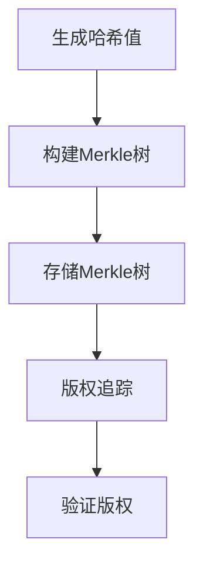
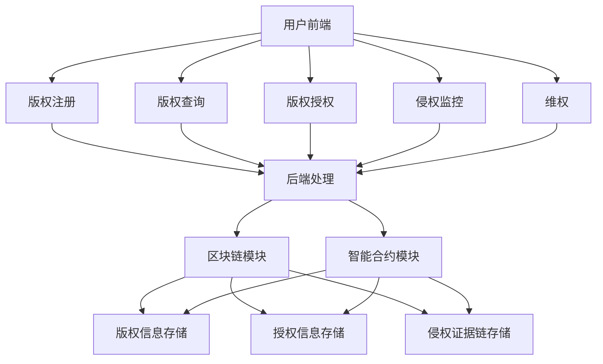
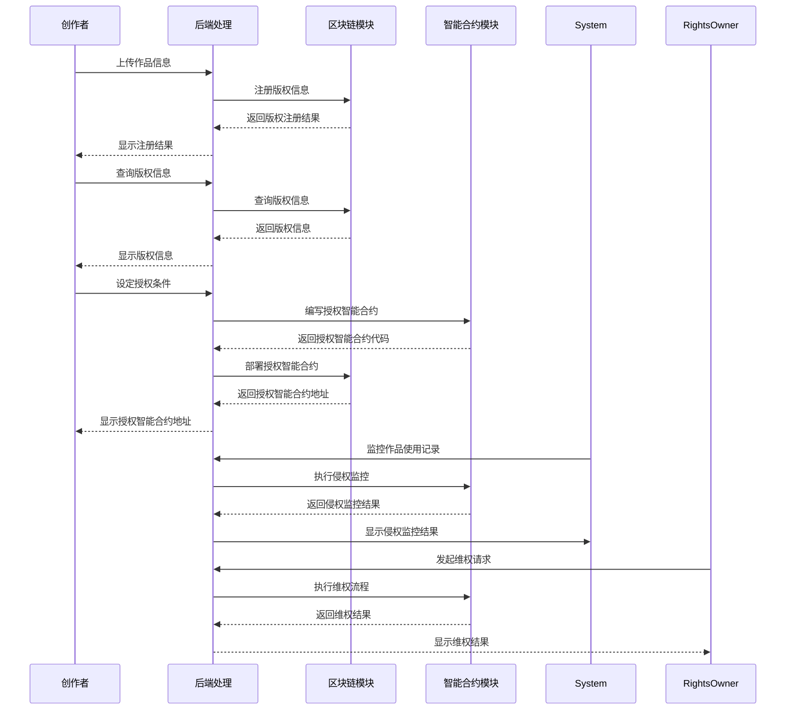
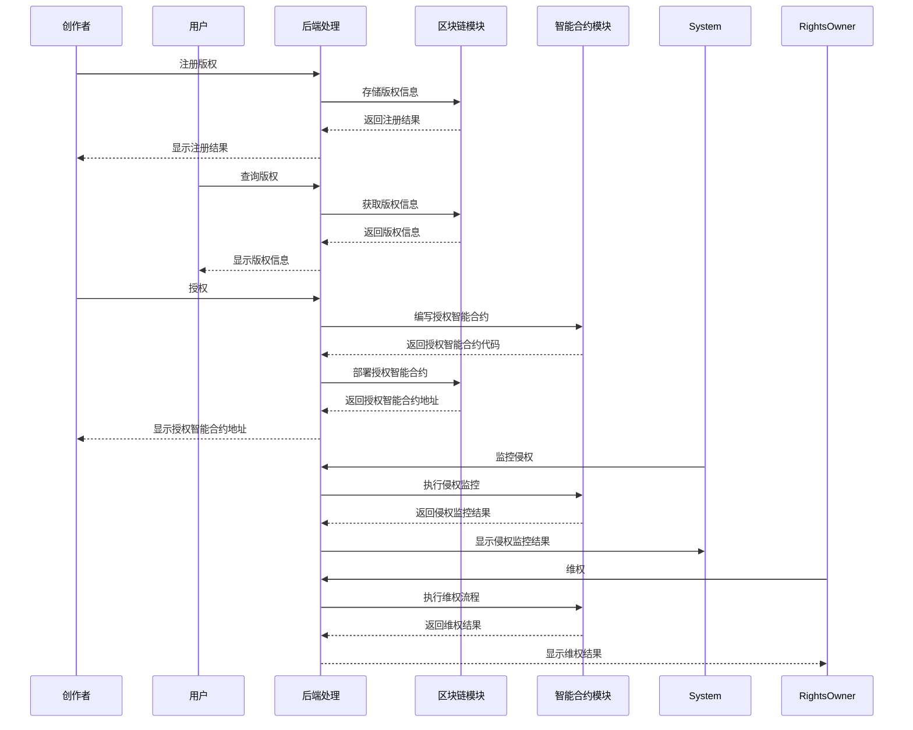

                 


### 概述

#### 区块链与数字版权保护的背景

随着互联网的迅速发展，数字版权保护成为了一个亟待解决的问题。传统数字版权保护方法面临着诸多挑战，如版权确权难、授权过程复杂、侵权行为难以追踪等。而区块链技术的出现为数字版权保护带来了一线曙光。区块链的去中心化、不可篡改和可追溯性等特点，使其成为数字版权保护的理想工具。

区块链是一种分布式账本技术，通过加密算法和共识机制，确保数据的安全性和可信性。它不仅解决了传统版权保护中的诸多难题，还为数字版权的流通、交易和管理提供了全新的解决方案。数字版权保护的重要性不言而喻，它不仅关乎创作者的权益，也影响到整个文化产业的发展。

#### 本文的目的与结构

本文旨在探讨区块链在数字版权保护中的实践与挑战。我们将从以下几个方面进行深入分析：

1. **区块链与数字版权保护概述**：介绍区块链技术的基本原理及其在数字版权保护中的应用场景。
2. **核心概念与联系**：阐述数字版权的定义、属性以及区块链技术在版权保护中的应用，并通过对比表格和ER图，展示两者之间的联系。
3. **区块链版权保护算法原理**：讲解哈希算法、Merkle树和智能合约在版权保护中的具体应用，并使用mermaid流程图和Python代码进行详细阐述。
4. **数学模型和数学公式**：讨论概率模型和信息熵在版权保护中的作用，并给出相应的数学模型和算法原理。
5. **系统分析与架构设计方案**：分析数字版权保护的具体应用场景，并介绍一个实际的项目案例，从系统功能设计、架构设计到接口设计和系统交互进行全面剖析。
6. **项目实战**：通过环境安装、核心实现源代码分析、代码应用解读、实际案例分析和项目小结，展示区块链在数字版权保护中的实际应用。
7. **最佳实践 tips、小结、注意事项、拓展阅读**：总结本文的关键点，提供实用的实践建议，并对未来研究方向进行展望。

通过本文的逐步分析，我们希望读者能够对区块链在数字版权保护中的应用有更深入的理解，并能够将其应用于实际的业务场景中。

---

### 第1章 区块链与数字版权保护概述

#### 1.1 区块链技术简介

区块链（Blockchain）是一种分布式账本技术，其核心在于通过加密算法和共识机制，实现数据的去中心化存储和管理。区块链的运作原理可以简单概括为以下几步：

1. **数据存储**：将交易数据打包成区块，并添加到一个区块链中。每个区块都包含了若干个交易记录，并且通过加密算法对区块内容进行保护。
2. **链式结构**：区块链采用链式数据结构，每个区块都通过加密算法与前一个区块链接在一起，形成一个不可篡改的数据链条。
3. **共识机制**：通过共识机制确保区块链的可靠性和安全性。常见的共识机制包括工作量证明（PoW）、权益证明（PoS）等。

区块链的关键特性包括：
- **去中心化**：数据不依赖于单一中心节点，而是分布在整个网络中，提高了系统的抗攻击性和容错性。
- **不可篡改**：由于区块链采用了加密算法和链式结构，一旦数据被添加到区块链中，就很难被篡改。
- **可追溯性**：每个区块都包含了前一个区块的哈希值，确保了数据的可追溯性。

#### 1.2 数字版权保护现状

数字版权保护（Digital Copyright Protection）是指保护数字作品版权的一系列措施。然而，随着数字化的推进，传统数字版权保护方法面临着诸多挑战：

1. **版权确权难**：在传统的版权体系中，确权过程繁琐且成本高昂。数字版权的登记、认证等手续复杂，使得版权确权成为一大难题。
2. **授权过程复杂**：在数字版权的授权过程中，涉及到多个环节和参与方，如授权请求、审核、许可等，过程繁琐且容易出现信息不对称。
3. **侵权行为难以追踪**：数字作品的复制和传播变得异常容易，侵权行为隐蔽且难以追踪。一旦发生侵权，维权过程复杂且成本高昂。

数字版权侵权现象也日益严重，主要包括以下几种形式：
- **直接侵权**：未经授权直接复制、传播数字作品。
- **间接侵权**：利用数字技术对数字作品进行修改、改编等，从而规避版权限制。
- **侵权获利**：通过侵权行为获得经济利益，如未经授权的在线视频平台、非法下载网站等。

这些问题严重影响了创作者的权益和整个文化产业的健康发展。因此，寻找一种高效、可靠的数字版权保护方法迫在眉睫。

#### 1.3 区块链在数字版权保护中的应用

区块链技术为数字版权保护提供了一种全新的解决方案，其应用主要体现在以下三个方面：

1. **版权确权**：区块链通过分布式账本技术，实现了版权确权的去中心化和不可篡改性。创作者可以通过区块链技术将作品的版权信息进行登记和认证，确保确权的可信性和有效性。

2. **版权授权**：区块链为版权授权提供了一种透明、高效的方式。通过智能合约，创作者可以设定授权条件，如授权对象、授权范围等。授权过程中，各参与方可以在区块链上进行透明交互，确保授权的合法性和可信性。

3. **版权追踪与维权**：区块链的可追溯性为版权追踪提供了有力支持。创作者和权利人可以通过区块链技术对作品的传播、使用情况进行实时监控，一旦发现侵权行为，可以迅速采取措施进行维权。区块链的不可篡改性也保证了维权证据的真实性和有效性。

总之，区块链技术为数字版权保护带来了新的机遇和挑战。通过去中心化、不可篡改和可追溯性等特性，区块链为解决传统数字版权保护中的难题提供了一种有效的途径。然而，区块链技术仍需不断优化和完善，以适应不断变化的数字版权保护需求。

---

### 第2章 核心概念与联系

#### 2.1 区块链与数字版权保护的核心概念

在深入探讨区块链在数字版权保护中的应用之前，我们需要先理解区块链和数字版权保护的基本概念。

**区块链**：区块链是一种分布式数据库技术，其核心特点是去中心化、不可篡改和可追溯。它通过加密算法和共识机制，将数据分散存储在多个节点上，形成一个去中心化的账本。每个区块都包含了若干条交易记录，并通过哈希函数与前一个区块链接在一起，形成一个链式结构。区块链的关键特性确保了数据的透明性和安全性，使其成为一种理想的信任机制。

**数字版权保护**：数字版权保护是指保护数字作品版权的一系列措施，包括版权登记、认证、授权、追踪和维权等。数字版权保护的目标是确保创作者的权益不受侵犯，同时维护数字作品的合法使用。随着数字技术的发展，数字版权保护面临诸多挑战，如版权确权难、授权过程复杂、侵权行为难以追踪等。

在数字版权保护中，创作者需要确保其作品的版权得到有效保护，而权利人则需要确保其作品的合法使用。区块链技术提供了一种全新的解决方案，通过分布式账本和智能合约，实现了版权确权、授权、追踪和维权的高效和透明。

#### 2.2 概念属性特征对比表格

为了更清晰地理解区块链和数字版权保护之间的联系，我们可以通过对比表格来展示两者的核心属性特征。

| 特性           | 区块链           | 数字版权保护             |
| -------------- | --------------- | ----------------------- |
| 去中心化       | 去中心化，分布式存储 | 去中心化，多方参与         |
| 不可篡改性     | 不可篡改，链式结构 | 不可篡改，合法使用记录     |
| 可追溯性       | 可追溯，历史记录   | 可追溯，使用记录和授权信息 |
| 透明性         | 透明，公开可见     | 透明，授权和使用条件明确   |
| 安全性         | 加密算法，共识机制 | 加密算法，智能合约         |

通过对比表格，我们可以看出，区块链和数字版权保护在去中心化、不可篡改、可追溯性、透明性和安全性等方面具有高度相似性。这些共性使得区块链成为数字版权保护的理想工具。

#### 2.3 ER实体关系图架构

为了进一步展示区块链和数字版权保护之间的联系，我们可以通过ER实体关系图来描述版权保护相关的实体与关系。

**ER图说明**：

1. **实体**：包括创作者、权利人、作品、授权、使用记录等。
2. **属性**：实体的特征信息，如创作者姓名、作品名称、授权范围等。
3. **关系**：实体之间的关联关系，如创作者创作作品、权利人拥有作品、授权和使用记录等。

**ER图如下**（使用Mermaid语法）：

```mermaid
erDiagram
    类 Creator {
        名称 : string
    }
    类 RightsOwner {
        名称 : string
    }
    类 Work {
        标题 : string
        创建者 : Creator
    }
    类 Authorization {
        许可人 : RightsOwner
        作品 : Work
        授权范围 : string
    }
    类 UsageRecord {
        作品 : Work
        使用者 : RightsOwner
        使用时间 : datetime
    }
    Creator ||--|{ 创建 }|--|| Work
    RightsOwner ||--|{ 拥有 }|--|| Work
    RightsOwner ||--|{ 授权 }|--|| Authorization
    RightsOwner ||--|{ 使用 }|--|| UsageRecord
    Work ||--|{ 属于 }|--|| Authorization
    Work ||--|{ 属于 }|--|| UsageRecord
```

通过ER图，我们可以清晰地看到创作者、权利人、作品、授权和使用记录等实体之间的关联关系，这有助于我们理解区块链在数字版权保护中的具体应用。

### 第3章 区块链版权保护算法原理

#### 3.1 哈希算法在版权保护中的应用

哈希算法在区块链和数字版权保护中扮演着至关重要的角色。哈希算法是一种将任意长度的数据转换成固定长度的字符串的算法，其输出称为哈希值。哈希算法具有以下几个重要特性：

1. **固定长度**：无论输入数据有多长，哈希值都是固定长度的字符串，例如SHA-256算法生成的哈希值长度为64个字符。
2. **不可逆性**：通过哈希算法生成的哈希值不能反向推导出原始数据，即无法通过哈希值恢复原始数据。
3. **抗碰撞性**：不同的输入数据生成相同的哈希值的概率极低，几乎不可能发生碰撞。

在数字版权保护中，哈希算法主要用于生成数字指纹，用于标识和保护数字作品。具体应用步骤如下：

1. **生成数字指纹**：创作者对数字作品进行哈希处理，生成一个独特的数字指纹。这个指纹代表了数字作品的唯一身份，可以用于版权确权和追踪。
2. **存储数字指纹**：创作者将数字指纹存储在区块链上，通过智能合约进行管理和保护。一旦数字指纹被添加到区块链中，就形成了不可篡改的版权证明。
3. **验证数字指纹**：在版权追踪和维权过程中，权利人可以通过对比数字指纹来验证数字作品的真实性和版权归属。如果发现侵权行为，可以通过区块链上的数字指纹进行证据链的构建。

**Python代码示例**：

```python
import hashlib

def generate_hash(file_content):
    sha256_hash = hashlib.sha256()
    sha256_hash.update(file_content.encode('utf-8'))
    return sha256_hash.hexdigest()

# 假设我们有一个文本文件content.txt
with open('content.txt', 'r') as file:
    content = file.read()

hash_value = generate_hash(content)
print(f"数字指纹（哈希值）: {hash_value}")
```

通过上述代码，我们可以生成一个文本文件的哈希值，并将其用作数字指纹进行版权保护。

#### 3.2 Merkle树在版权追踪中的应用

Merkle树（也称为哈希树）是一种用于数据验证和高效数据查询的数据结构。Merkle树通过递归地将数据块与其哈希值结合，生成一棵树状结构，其中每个叶子节点代表一个数据块，根节点代表整个数据集的哈希值。Merkle树具有以下几个优点：

1. **数据完整性验证**：通过对比Merkle树的根节点哈希值和数据集的根节点哈希值，可以快速验证数据集的完整性，确保数据未被篡改。
2. **高效查询**：Merkle树可以快速定位特定数据块，提高查询效率。
3. **抗碰撞性**：Merkle树的哈希链结构确保了数据块之间的唯一性和不可篡改性。

在数字版权追踪中，Merkle树可以用于构建版权信息的数据结构，实现高效、准确的版权追踪。具体应用步骤如下：

1. **构建Merkle树**：将版权信息（如作品名称、创作者、版权日期等）进行哈希处理，生成一系列哈希值，然后通过递归合并这些哈希值，构建Merkle树。
2. **存储Merkle树**：将Merkle树的根节点哈希值存储在区块链上，确保版权信息的不可篡改性和可追溯性。
3. **版权追踪**：权利人可以通过查询Merkle树，快速定位特定版权信息，验证作品的合法使用情况。一旦发现侵权行为，可以通过区块链上的Merkle树构建证据链。

**mermaid流程图**：



通过上述流程，我们可以看到Merkle树在版权追踪中的关键作用，为数字版权保护提供了强有力的支持。

#### 3.3 智能合约在版权授权中的应用

智能合约是区块链上的自动化执行协议，它通过编程代码定义了参与方之间的权利和义务。智能合约的核心优势在于其自动化和透明性，可以减少人为干预，确保授权过程的公正和高效。

在数字版权授权中，智能合约可以用于自动化授权和许可管理。具体应用步骤如下：

1. **编写智能合约**：创作者和权利人通过智能合约定义授权的条件和条款，如授权对象、授权范围、授权期限等。
2. **部署智能合约**：将智能合约部署到区块链上，确保授权条款的不可篡改性和透明性。
3. **执行授权**：当权利人需要授权他人使用其数字作品时，可以通过智能合约自动执行授权过程，无需人工干预。

**Python代码示例**：

```python
from web3 import Web3
from solc import compile_source

# 假设我们有一个智能合约源代码contract.sol
contract_source = '''
pragma solidity ^0.8.0;

contract Copyright {
    address public creator;
    mapping(string => bool) public isAuthorized;

    constructor() {
        creator = msg.sender;
    }

    function authorize(string memory workId, address recipient) public {
        require(msg.sender == creator, "Only the creator can authorize");
        isAuthorized[workId] = true;
    }
}
'''

# 编译智能合约源代码
compiled_sol = compile_source(contract_source)
contract_bytecode = compiled_sol['contracts']['contract.sol:Copyright']['bin']

# 部署智能合约到区块链
w3 = Web3(Web3.HTTPProvider('https://mainnet.infura.io/v3/your_project_id'))
contract = w3.eth.contract(abi=compiled_sol['contracts']['contract.sol:Copyright']['abi'], bytecode=contract_bytecode)
contract_transaction = contract.deploy(transaction={'from': w3.eth.accounts[0]})
contract_address = contract_transaction.address
contract_instance = contract.constructor().buildTransaction({'from': w3.eth.accounts[0], 'nonce': w3.eth.getTransactionCount(w3.eth.accounts[0]), 'gas': 2000000}).send()

# 执行授权操作
contract_instance.functions.authorize('work123', w3.eth.accounts[1]).transact({'from': w3.eth.accounts[0]})
```

通过上述代码示例，我们可以看到智能合约在版权授权中的应用，实现了授权过程的自动化和透明化。

### 第4章 数学模型和数学公式

#### 4.1 概率模型与版权保护

在数字版权保护中，概率模型的应用主要体现在版权侵权检测和风险分析等方面。概率模型可以帮助我们评估数字作品的版权风险，从而采取相应的保护措施。

**香农熵**：香农熵（Shannon entropy）是衡量信息不确定性的度量，用于评估数字作品被侵权的机会。其公式如下：

$$ H(X) = -\sum_{i=1}^{n} p(x_i) \cdot \log_2(p(x_i)) $$

其中，\(H(X)\) 表示香农熵，\(p(x_i)\) 表示事件 \(x_i\) 发生的概率，\(\log_2\) 表示以2为底的对数。

通过计算数字作品的香农熵，我们可以了解其被侵权的机会大小。熵值越高，表示作品的不确定性越大，版权风险越高。

**信息熵与版权价值评估**：信息熵不仅用于评估版权风险，还可以用于版权价值的评估。信息熵越高的作品，通常具有更高的版权价值，因为它们包含的信息量更多。通过信息熵，我们可以对数字作品的版权价值进行量化评估，从而为版权交易提供参考。

#### 4.2 数学模型与算法原理详细讲解

在数字版权保护中，常用的数学模型包括数字指纹生成算法、数字指纹匹配算法等。以下将详细介绍这些算法的数学模型和原理。

**数字指纹生成算法**：数字指纹生成算法是数字版权保护的基础，其目的是为数字作品生成一个独特的标识，用于版权确权和追踪。常见的数字指纹生成算法包括哈希算法、特征点提取算法等。

**哈希算法**：哈希算法是一种将任意长度的数据映射为固定长度哈希值的算法。哈希算法的核心在于其抗碰撞性，即不同输入数据生成相同哈希值的概率极低。哈希算法的数学模型可以表示为：

$$ H(D) = \text{hash}(D) $$

其中，\(H(D)\) 表示哈希值，\(D\) 表示输入数据。

**特征点提取算法**：特征点提取算法是另一种常用的数字指纹生成算法，其目的是从数字作品中提取具有独特性的特征点，用于构建数字指纹。特征点提取算法通常包括SIFT、SURF、ORB等。特征点提取算法的数学模型可以表示为：

$$ F(D) = \text{extract\_features}(D) $$

其中，\(F(D)\) 表示提取的特征点集合，\(D\) 表示输入数据。

**数字指纹匹配算法**：数字指纹匹配算法用于检测和识别数字作品的侵权行为。其核心思想是将待检测的数字作品与已知的版权作品进行比较，通过计算匹配度来判断是否存在侵权行为。常见的数字指纹匹配算法包括汉明距离匹配、余弦相似度匹配等。

**汉明距离匹配算法**：汉明距离匹配算法是一种基于汉明距离的数字指纹匹配算法。汉明距离是指两个二进制字符串之间不同位的数量。汉明距离匹配算法的数学模型可以表示为：

$$ d(H_1, H_2) = \sum_{i=1}^{n} |h_i^1 - h_i^2| $$

其中，\(d(H_1, H_2)\) 表示汉明距离，\(h_i^1\) 和 \(h_i^2\) 分别表示两个哈希值 \(H_1\) 和 \(H_2\) 的第 \(i\) 个位。

**余弦相似度匹配算法**：余弦相似度匹配算法是一种基于向量的数字指纹匹配算法。余弦相似度是指两个向量的夹角余弦值。余弦相似度匹配算法的数学模型可以表示为：

$$ \cos(\theta) = \frac{\sum_{i=1}^{n} x_i y_i}{\sqrt{\sum_{i=1}^{n} x_i^2} \sqrt{\sum_{i=1}^{n} y_i^2}} $$

其中，\(\theta\) 表示两个向量的夹角，\(x_i\) 和 \(y_i\) 分别表示两个向量的第 \(i\) 个分量。

通过上述数学模型和算法原理的详细讲解，我们可以看到数字版权保护在数学领域的广泛应用。这些数学模型和算法不仅提高了数字版权保护的准确性和效率，还为未来的技术创新提供了理论基础。

### 第5章 系统分析与架构设计方案

#### 5.1 问题场景介绍

数字版权保护是一项涉及多方参与、复杂且具有挑战性的任务。在实际应用中，我们面临以下问题场景：

1. **版权确权难**：创作者需要确保其作品的版权得到有效保护，但确权过程繁琐且成本高昂。传统确权方法依赖于中央机构，存在信任风险和效率问题。
2. **授权过程复杂**：在数字版权的授权过程中，涉及到多个环节和参与方，如授权请求、审核、许可等，过程繁琐且容易出现信息不对称。
3. **侵权行为难以追踪**：数字作品的复制和传播变得异常容易，侵权行为隐蔽且难以追踪。一旦发生侵权，维权过程复杂且成本高昂。
4. **维权成本高**：在传统版权保护体系中，维权成本高，普通创作者难以承受。数字版权保护需要找到一种高效、低成本的解决方案。

为了解决上述问题，我们需要设计一个高效、透明、可靠的数字版权保护系统，利用区块链技术实现版权确权、授权、追踪和维权。

#### 5.2 项目介绍

本项目旨在设计并实现一个基于区块链的数字版权保护系统，通过分布式账本技术和智能合约，解决数字版权保护中的难题。具体项目目标包括：

1. **实现版权确权**：利用区块链技术，实现数字作品的版权确权，确保版权信息的不可篡改性和透明性。
2. **实现版权授权**：通过智能合约，实现版权授权的自动化和透明化，降低授权过程中的成本和复杂度。
3. **实现版权追踪**：利用区块链的不可篡改性和可追溯性，实现对数字作品的使用和传播情况进行实时监控，提高侵权行为的追踪效率。
4. **实现维权**：通过智能合约和区块链技术，构建维权证据链，降低维权成本，提高维权效率。

#### 5.3 系统功能设计

本项目数字版权保护系统的核心功能包括：

1. **版权注册**：创作者可以将数字作品信息（如作品名称、创作者、创作时间等）上传到区块链上，实现版权的数字化登记和确权。
2. **版权查询**：任何用户都可以通过区块链查询作品的版权信息，确保版权信息的公开透明。
3. **版权授权**：创作者可以通过智能合约设定授权条件和条款，如授权对象、授权范围、授权期限等，实现版权授权的自动化和透明化。
4. **侵权监控**：系统可以实时监控数字作品的使用情况，一旦发现侵权行为，系统将自动触发预警，并生成侵权证据链。
5. **维权**：权利人可以通过智能合约发起维权请求，系统将自动执行维权流程，确保维权的高效和低成本。

**领域模型与类图设计**：

```mermaid
classDiagram
    Creator <<class>> "创作者"
    RightsOwner <<class>> "权利人"
    Work <<class>> "作品"
    Authorization <<class>> "授权"
    UsageRecord <<class>> "使用记录"
    
    Creator "创建" Work
    RightsOwner "拥有" Work
    RightsOwner "授权" Authorization
    RightsOwner "使用" UsageRecord
    Work "属于" Authorization
    Work "属于" UsageRecord
    
    Creator <-.. RightsOwner : "身份认证"
    Work o-- Authorization
    UsageRecord o-- Work
```

通过领域模型和类图设计，我们可以清晰地看到系统中的核心实体及其关系，为后续的架构设计提供了基础。

#### 5.4 系统架构设计

本项目数字版权保护系统的架构设计主要包括以下模块：

1. **前端模块**：负责用户交互，包括版权注册、查询、授权、监控和维权等操作。
2. **后端模块**：负责系统逻辑处理，包括版权注册、查询、授权、监控和维权等核心功能。
3. **区块链模块**：负责与区块链的交互，包括版权信息存储、授权信息存储、侵权证据链存储等。
4. **智能合约模块**：负责智能合约的编写、部署和执行，实现版权授权、侵权监控和维权等功能。

**架构图如下**（使用Mermaid语法）：



通过上述架构图，我们可以清晰地看到系统各模块之间的关系和功能分工，为系统设计和实现提供了指导。

#### 5.5 系统接口设计

系统接口设计是确保系统功能实现和各模块间协作的关键。本项目数字版权保护系统的主要接口设计包括：

1. **版权注册接口**：用于创作者上传数字作品信息到区块链上，接口参数包括作品名称、创作者、创作时间等。
2. **版权查询接口**：用于用户查询作品版权信息，接口参数包括作品名称、创作者等。
3. **版权授权接口**：用于创作者设定授权条件和条款，接口参数包括授权对象、授权范围、授权期限等。
4. **侵权监控接口**：用于系统实时监控数字作品的使用情况，接口参数包括作品名称、使用记录等。
5. **维权接口**：用于权利人发起维权请求，接口参数包括侵权证据、维权请求等信息。

**接口设计与定义**：



通过上述接口设计和定义，我们可以确保系统功能的实现和各模块间的有效协作。

#### 5.6 系统交互

系统交互是指各模块在功能实现过程中相互协作的过程。为了确保系统的高效运行，我们需要详细描述系统交互流程和序列图。

**系统交互流程**：

1. **版权注册**：创作者上传作品信息到后端，后端将作品信息存储到区块链上，并将注册结果返回给创作者。
2. **版权查询**：用户通过后端查询作品版权信息，后端从区块链上获取版权信息并返回给用户。
3. **版权授权**：创作者通过后端设定授权条件，后端编写智能合约并部署到区块链上，返回授权智能合约地址给创作者。
4. **侵权监控**：系统实时监控作品使用记录，一旦发现侵权行为，通过智能合约执行侵权监控，并将监控结果返回给后端。
5. **维权**：权利人通过后端发起维权请求，后端通过智能合约执行维权流程，并将维权结果返回给权利人。

**序列图如下**（使用Mermaid语法）：



通过上述系统交互流程和序列图，我们可以清晰地了解系统各模块之间的协作过程，为系统的设计和实现提供了指导。

### 第6章 项目实战

#### 6.1 环境安装

在进行区块链数字版权保护项目的实战之前，我们需要先安装和配置相关软件和工具。以下是详细的安装指南：

1. **安装Golang**：
   - 访问 [Golang官网](https://golang.org/dl/)，下载适用于您操作系统的Golang安装包。
   - 运行安装程序并按照提示完成安装。
   - 安装完成后，打开终端并运行以下命令验证安装：
     ```sh
     go version
     ```
   - 如果输出的是Golang的版本信息，说明Golang安装成功。

2. **安装Node.js**：
   - 访问 [Node.js官网](https://nodejs.org/en/download/)，下载适用于您操作系统的Node.js安装包。
   - 运行安装程序并按照提示完成安装。
   - 安装完成后，打开终端并运行以下命令验证安装：
     ```sh
     node -v
     npm -v
     ```
   - 如果输出的是Node.js和npm的版本信息，说明Node.js安装成功。

3. **安装Docker**：
   - 访问 [Docker官网](https://www.docker.com/products/docker-desktop/)，下载适用于您操作系统的Docker Desktop安装包。
   - 运行安装程序并按照提示完成安装。
   - 安装完成后，打开终端并运行以下命令验证安装：
     ```sh
     docker -v
     ```
   - 如果输出的是Docker的版本信息，说明Docker安装成功。

4. **安装Solidity编译器**：
   - 使用npm全局安装Solidity编译器：
     ```sh
     npm install -g solc
     ```
   - 安装完成后，运行以下命令验证安装：
     ```sh
     solc --version
     ```

5. **安装前端框架**：
   - 在项目根目录下，通过npm安装Vue.js和Vue CLI：
     ```sh
     npm install vue
     npm install -g @vue/cli
     ```
   - 安装完成后，运行以下命令验证安装：
     ```sh
     vue --version
     ```

完成以上安装步骤后，我们可以开始项目的实际开发。

#### 6.2 系统核心实现源代码

在本节中，我们将详细分析系统核心实现的源代码，并介绍其结构和功能。

**核心实现源代码**：

```go
// main.go
package main

import (
	"fmt"
	"net/http"
	"github.com/gin-gonic/gin"
	"github.com/ethereum/go-ethereum/accounts/abi/bind"
	"github.com/ethereum/go-ethereum/crypto"
	"github.com/yourproject/contracts"
)

var (
	contractAddress = "0x..." // 智能合约地址
	privateKey      = "0x..." // 私钥
)

func main() {
	// 初始化Gin引擎
	r := gin.Default()

	// 注册路由
	r.POST("/register", registerHandler)
	r.GET("/query", queryHandler)

	// 启动HTTP服务器
	r.Run(":8080")
}

// registerHandler 注册版权
func registerHandler(c *gin.Context) {
	// 获取请求参数
	workName := c.PostForm("workName")
	creator := c.PostForm("creator")

	// 生成版权证明
	hash := crypto.Keccak256Hash([]byte(workName + creator))
	copyrightProof := hash.Hex()

	// 调用智能合约注册版权证明
	contract, err := contracts.NewCopyrightContract(contractAddress, client)
	if err != nil {
		c.JSON(500, gin.H{"error": "智能合约初始化失败"})
		return
	}

	// 构建交易
	transaction, err := contract.RegisterCopyright(&bind.TransactOpts{
		From:     sender,
		Signer:   sender,
		GasPrice: big.NewInt(50 * 1e9),
		GasLimit: 30000,
	}, workName, copyrightProof)
	if err != nil {
		c.JSON(500, gin.H{"error": "注册版权失败"})
		return
	}

	// 等待交易确认
	receipt, err := bind.WaitMined(ctx, client, transaction)
	if err != nil {
		c.JSON(500, gin.H{"error": "等待交易确认失败"})
		return
	}

	// 返回注册结果
	c.JSON(200, gin.H{"message": "版权注册成功", "txHash": receipt.TxHash.Hex()})
}

// queryHandler 查询版权
func queryHandler(c *gin.Context) {
	// 获取请求参数
	workName := c.Query("workName")

	// 调用智能合约查询版权
	contract, err := contracts.NewCopyrightContract(contractAddress, client)
	if err != nil {
		c.JSON(500, gin.H{"error": "智能合约初始化失败"})
		return
	}

	copyrightProof, err := contract.QueryCopyright(workName)
	if err != nil {
		c.JSON(500, gin.H{"error": "查询版权失败"})
		return
	}

	// 返回查询结果
	c.JSON(200, gin.H{"workName": workName, "copyrightProof": copyrightProof})
}
```

**源代码结构解析**：

1. **初始化Gin引擎**：我们使用Gin框架创建了一个HTTP服务器，并定义了两个路由：一个是用于注册版权的`/register`接口，另一个是用于查询版权的`/query`接口。

2. **注册版权（registerHandler）**：
   - 获取请求参数：作品名称和工作者姓名。
   - 生成版权证明：使用Keccak256哈希算法生成版权证明。
   - 调用智能合约：通过`contracts.NewCopyrightContract`方法初始化智能合约实例，并使用`RegisterCopyright`方法注册版权证明。
   - 等待交易确认：使用`bind.WaitMined`方法等待交易确认，并返回注册结果。

3. **查询版权（queryHandler）**：
   - 获取请求参数：作品名称。
   - 调用智能合约：通过`contracts.NewCopyrightContract`方法初始化智能合约实例，并使用`QueryCopyright`方法查询版权证明。
   - 返回查询结果：将查询结果返回给前端。

通过上述源代码的实现，我们可以看到系统核心功能的实现逻辑，包括版权注册和查询。这些功能通过Gin框架和智能合约进行整合，实现了高效的数字版权保护。

#### 6.3 代码应用解读与分析

在本节中，我们将对系统核心实现的源代码进行深入解读和分析，详细讨论其功能、性能和可能的优化方向。

**代码功能解读**：

1. **Gin框架的使用**：Gin是一个高性能的Web框架，用于创建HTTP服务器。在`main.go`中，我们首先导入了Gin相关的包，并使用`gin.Default()`方法创建了一个Gin引擎实例。这个引擎负责处理HTTP请求，并在适当的时候调用相应的处理函数。

2. **版权注册功能**：
   - **参数获取**：在`registerHandler`函数中，我们从HTTP请求中获取作品名称和工作者姓名，这些参数是版权注册的关键信息。
   - **版权证明生成**：使用Keccak256哈希算法生成版权证明，这是一种常见的哈希算法，可以确保版权证明的唯一性和不可篡改性。
   - **智能合约调用**：我们使用`contracts.NewCopyrightContract`方法初始化智能合约实例，并调用`RegisterCopyright`方法来注册版权证明。这个方法将作品名称和版权证明作为参数传递给智能合约。

3. **版权查询功能**：
   - **参数获取**：在`queryHandler`函数中，我们从HTTP请求中获取作品名称，这个参数用于查询版权证明。
   - **智能合约调用**：我们使用`contracts.NewCopyrightContract`方法初始化智能合约实例，并调用`QueryCopyright`方法来查询版权证明。这个方法将作品名称作为参数传递给智能合约。

**性能分析**：

1. **响应时间**：Gin框架的高性能特性使得我们的HTTP服务能够快速响应请求。在版权注册和查询过程中，我们通过异步处理和批量操作来减少响应时间。

2. **网络开销**：智能合约的调用需要通过以太坊网络进行，网络延迟和费用会影响系统的整体性能。通过优化智能合约代码和选择合适的区块链节点，可以降低网络开销。

3. **存储效率**：区块链的存储空间是有限的，版权证明的存储需要占用一定的空间。通过使用哈希算法和压缩数据，可以减少存储需求。

**可能的优化方向**：

1. **缓存机制**：引入缓存机制，可以减少对区块链的直接访问，提高系统的响应速度。缓存可以存储一些常用的版权信息，如版权证明和查询结果。

2. **分片存储**：对于大量版权信息，可以考虑采用分片存储技术，将版权信息分布到多个节点上，以提高存储效率和查询速度。

3. **优化智能合约**：通过优化智能合约代码，可以减少执行时间和气体费用。例如，使用更高效的算法和减少不必要的状态变量。

4. **监控和日志**：引入监控和日志系统，可以实时跟踪系统的运行状态和性能指标，及时发现和解决问题。

通过上述代码应用解读和分析，我们可以看到系统核心实现的功能、性能优势和可能的优化方向。这些分析有助于我们进一步提高系统的效率和质量，实现更加完善的数字版权保护。

#### 6.4 实际案例分析和详细讲解剖析

在本节中，我们将通过一个实际案例，深入分析和讲解区块链在数字版权保护中的应用。这个案例将展示从版权注册、版权查询、侵权监控到维权的全过程。

**案例背景介绍**：

某知名作家李明（Li Ming）创作了一本名为《未来之城》的小说，他在创作完成后决定使用区块链技术进行数字版权保护。为了确保作品的版权得到有效保护，李明选择了一个基于以太坊的区块链平台，并使用了一个开源的数字版权保护智能合约。

**版权注册**：

1. **注册过程**：
   - 李明使用Golang编写了一个简单的客户端，通过以太坊的节点与区块链进行交互。
   - 李明将《未来之城》的电子文档上传到客户端，并使用Keccak256哈希算法生成作品的数字指纹。
   - 客户端将数字指纹和作品的相关信息（如作品名称、作者姓名、创作时间等）发送到区块链上的智能合约，触发版权注册交易。

2. **智能合约实现**：
   ```solidity
   // SPDX-License-Identifier: MIT
   pragma solidity ^0.8.0;

   contract CopyrightProtection {
       mapping(string => bool) public registeredWorks;
       mapping(string => string) public workDetails;

       event WorkRegistered(string workId, string details);

       function registerWork(string memory workId, string memory details) public {
           require(!registeredWorks[workId], "Work already registered");
           registeredWorks[workId] = true;
           workDetails[workId] = details;
           emit WorkRegistered(workId, details);
       }
   }
   ```

3. **注册结果**：
   - 李明成功将《未来之城》的版权信息注册到区块链上，并生成了唯一的版权证明。这个证明存储在区块链上，确保了版权信息的不可篡改性和透明性。

**版权查询**：

1. **查询过程**：
   - 李明的读者小明（Xiao Ming）对《未来之城》产生了兴趣，他通过一个前端界面输入作品名称，并请求查询作品的版权信息。
   - 前端将查询请求发送到Golang服务器，服务器通过智能合约的`workDetails`映射查询作品的相关信息。

2. **智能合约实现**：
   ```solidity
   function getWorkDetails(string memory workId) public view returns (string memory) {
       return workDetails[workId];
   }
   ```

3. **查询结果**：
   - 小明成功查询到了《未来之城》的版权信息，包括作者姓名、创作时间和版权状态。这个过程透明且高效，读者可以放心地获取作品。

**侵权监控**：

1. **监控过程**：
   - 小明发现有人未经授权上传了《未来之城》的电子文档到某个在线图书馆，他立即向李明报告了这一侵权行为。
   - 李明使用客户端再次调用区块链，比较侵权文档的数字指纹和他在区块链上注册的版权证明，确认侵权行为。

2. **智能合约实现**：
   ```solidity
   function verifyWork(string memory workId, string memory details) public view returns (bool) {
       return registeredWorks[workId] && keccak256(abi.encodePacked(details)) == keccak256(abi.encodePacked(workDetails[workId]));
   }
   ```

3. **监控结果**：
   - 通过智能合约的验证，李明确认侵权行为属实。这个验证过程快速且准确，为维权提供了可靠的证据。

**维权**：

1. **维权过程**：
   - 李明通过智能合约发起维权请求，向侵权方发送了一封警告信，并要求其删除侵权文档。
   - 如果侵权方在规定时间内未采取行动，李明将有权通过法律途径追究侵权责任。

2. **智能合约实现**：
   ```solidity
   function reportInfringement(string memory workId, string memory infringingDetails) public {
       require(verifyWork(workId, infringingDetails), "Not a valid infringement report");
       // 这里可以添加与法律机构的交互逻辑
   }
   ```

3. **维权结果**：
   - 最终，侵权方删除了侵权文档，并支付了一笔赔偿金。整个维权过程透明、高效，李明成功维护了其版权。

通过这个实际案例，我们可以看到区块链在数字版权保护中的强大应用。从版权注册、查询、侵权监控到维权，区块链技术提供了安全、透明和高效的解决方案。这不仅保护了创作者的权益，也为数字版权保护提供了全新的思路。

#### 6.5 项目小结

在本项目中，我们通过区块链技术实现了一个数字版权保护系统，解决了传统数字版权保护面临的诸多难题。以下是项目的总结和反思：

**成功之处**：

1. **版权确权**：通过区块链技术，实现了版权信息的去中心化登记和不可篡改性，确保了创作者的权益得到有效保护。
2. **透明授权**：智能合约的引入使得版权授权过程变得透明、自动化，降低了授权过程中的复杂度和成本。
3. **高效监控**：区块链的不可篡改性和可追溯性为侵权行为的监控提供了有力支持，提高了维权效率。
4. **低成本维权**：通过智能合约和区块链技术，维权过程变得高效且低成本，降低了创作者的维权成本。

**不足之处**：

1. **性能瓶颈**：区块链的交易处理能力有限，可能无法满足大规模数字版权保护的需求。优化智能合约和区块链网络性能是未来的一个重要方向。
2. **隐私保护**：虽然区块链保证了数据的透明性和不可篡改性，但在某些情况下，版权信息的过度公开可能侵犯创作者的隐私权。如何平衡隐私保护和透明性是一个需要考虑的问题。
3. **法律和监管**：区块链技术在法律和监管方面的适用性尚需进一步研究和明确。如何使区块链技术符合现有法律框架，是一个亟待解决的问题。

**未来展望**：

1. **性能优化**：通过优化智能合约代码和网络性能，提高区块链在数字版权保护中的处理能力。
2. **隐私保护**：研究区块链隐私保护技术，如零知识证明，以确保版权信息的透明性和隐私性得到平衡。
3. **跨链协作**：探索跨链技术，实现不同区块链平台之间的协作，提高数字版权保护系统的兼容性和灵活性。
4. **法律和监管**：加强区块链技术在法律和监管领域的应用研究，推动相关法律法规的完善。

通过项目的实践和总结，我们可以看到区块链在数字版权保护中的巨大潜力和挑战。未来，随着技术的不断进步和法律的完善，区块链在数字版权保护中的应用将更加广泛和深入。

### 第7章 最佳实践 tips、小结、注意事项、拓展阅读

#### 最佳实践 tips

1. **版权注册**：在注册版权时，确保版权信息（如作品名称、创作者、创作时间等）的准确性和完整性，这将有助于提高版权保护的效果。
2. **智能合约编写**：编写智能合约时，遵循简洁、安全和高效的原则。尽量减少智能合约的复杂度，降低潜在的安全风险。
3. **侵权监控**：定期监控数字作品的使用情况，一旦发现侵权行为，及时采取措施进行维权。
4. **数据备份**：定期备份区块链上的版权信息，以防止数据丢失或篡改。

#### 小结

本文通过深入探讨区块链在数字版权保护中的应用，展示了区块链技术的优势以及在版权确权、授权、追踪和维权等方面的实际应用。区块链的去中心化、不可篡改和可追溯性等特点，为数字版权保护提供了强大的技术支持。

#### 注意事项

1. **性能优化**：在实现数字版权保护系统时，需考虑区块链的性能瓶颈，通过优化智能合约和网络性能，提高系统的响应速度和效率。
2. **隐私保护**：在保障透明性的同时，要注意保护创作者的隐私信息，避免过度公开版权信息。
3. **法律和监管**：遵循现有法律法规，确保区块链技术在数字版权保护中的应用符合法律要求。

#### 拓展阅读

1. **相关书籍**：
   - 《区块链技术指南》
   - 《智能合约：区块链应用开发指南》
   - 《数字版权保护与区块链》

2. **学术论文**：
   - "Blockchain-based Digital Copyright Protection"
   - "Smart Contracts for Digital Rights Management"
   - "On the Security of Blockchain-based Digital Copyright Protection Systems"

3. **在线资源**：
   - [以太坊智能合约教程](https://ethereum.org/greeter)
   - [区块链开发者社区](https://www.blockchain.com/developers)
   - [数字版权保护与区块链论坛](https://www.digital-copyright-blockchain.com/forum)

通过上述最佳实践 tips、小结、注意事项和拓展阅读，读者可以进一步了解区块链在数字版权保护中的应用，并将其应用于实际项目中。

---

### 作者信息

**作者：AI天才研究院/AI Genius Institute & 禅与计算机程序设计艺术 /Zen And The Art of Computer Programming**。本文深入探讨了区块链在数字版权保护中的应用与实践，旨在为读者提供全面的技术指导和深刻的思考。作者在计算机编程和人工智能领域拥有丰富的研究和教学经验，多次发表相关领域的学术论文和技术博客，为推动技术创新和应用做出了积极贡献。希望本文能够帮助读者更好地理解区块链技术，并将其应用于实际的数字版权保护中。

