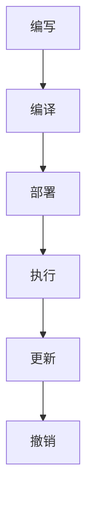
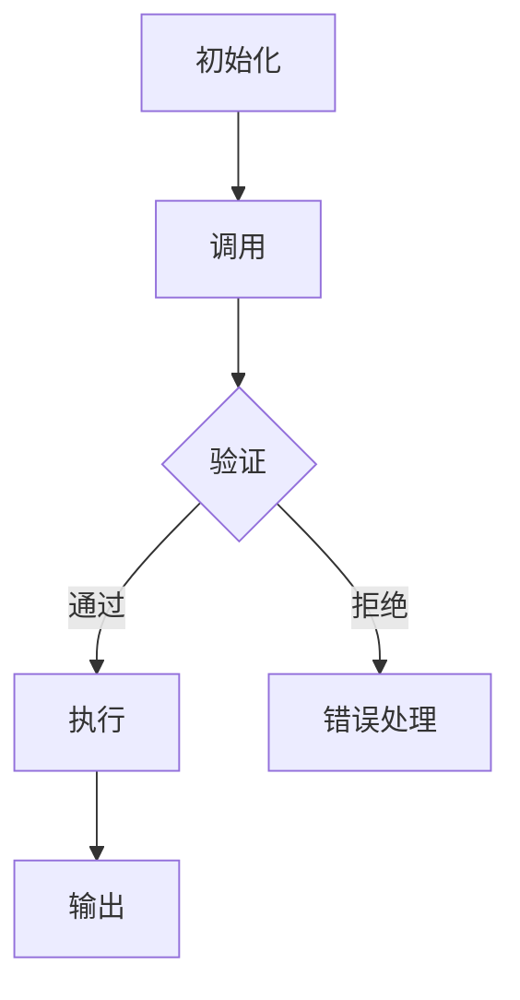
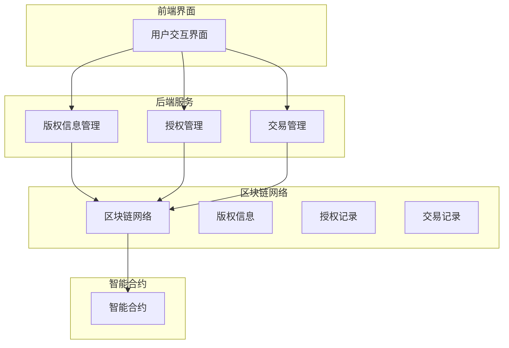
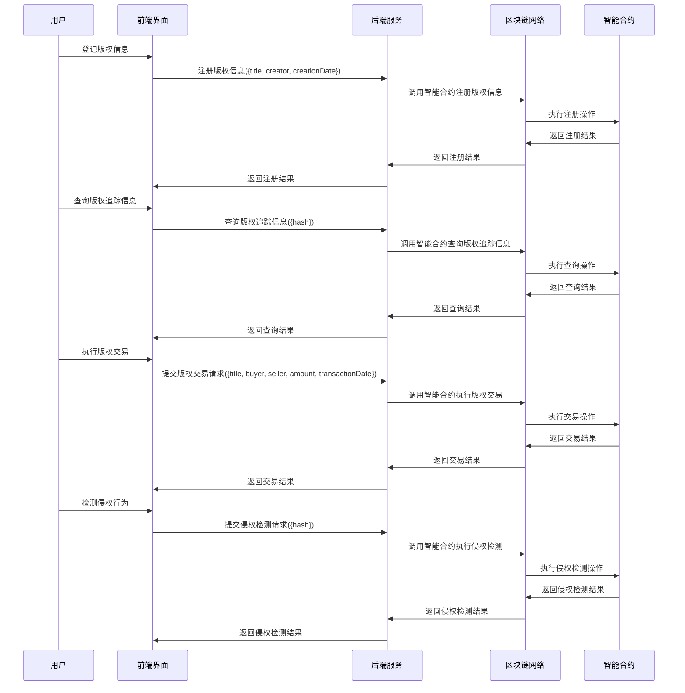

                 

# 引言

随着数字时代的到来，知识产权保护尤其是数字版权保护成为了创作者们关注的焦点。数字版权保护涉及对数字化内容如文本、图像、音频和视频等的版权归属、使用权限和交易管理。然而，传统的版权保护机制在面对复杂的数字环境中显得力不从心，主要面临着版权追踪困难、侵权行为难以溯源、版权交易效率低下等问题。

区块链技术作为一种分布式账本技术，以其去中心化、透明性和不可篡改的特性，为解决数字版权保护中的难题提供了一种新的思路。区块链技术通过加密算法、智能合约等机制，可以实现版权的自动化追踪和交易，确保创作者的权益得到有效保护。

本文将以《区块链在数字版权保护中的应用：确保创作者权益》为题，深入探讨区块链技术在数字版权保护中的应用。文章结构如下：

## 第一部分: 背景介绍

我们将首先介绍区块链技术在数字版权保护中的应用背景，讨论数字版权保护所面临的主要挑战，并阐述区块链技术的潜力。

### 第二部分: 核心概念与联系

接着，我们将详细解释区块链、数字版权保护以及相关技术（如加密、智能合约）的基本概念，并展示它们之间的关系。

### 第三部分: 算法原理讲解

在此部分，我们将阐述区块链技术在数字版权保护中的应用算法，使用mermaid流程图展示智能合约的工作流程，并通过Python代码示例进行算法原理的讲解。

### 第四部分: 系统分析与架构设计

我们将介绍一个典型的数字版权保护系统，包括其功能设计、系统架构设计、接口设计等，并通过mermaid图示进行详细展示。

### 第五部分: 项目实战

我们将展示一个具体的项目实现，包括环境安装、系统核心实现源代码，以及对代码的应用解读与分析。

### 结论

最后，我们将总结最佳实践，并给出项目的小结、注意事项以及拓展阅读建议，帮助读者进一步了解和掌握区块链在数字版权保护中的应用。

通过这篇文章，我们希望读者能够对区块链在数字版权保护中的作用有一个全面深入的理解，从而为未来的研究和应用提供有价值的参考。# 关键词

- 区块链
- 数字版权保护
- 加密技术
- 智能合约
- 创作者权益
- 分布式账本技术

## 摘要

随着数字内容的激增，数字版权保护成为创作者保护其知识产权的关键。然而，传统的版权保护机制在面对复杂的数字环境时存在诸多挑战，如版权追踪困难、侵权行为难以溯源等。区块链技术以其去中心化、透明性和不可篡改的特性，为解决这些问题提供了一种创新的解决方案。本文详细探讨了区块链技术在数字版权保护中的应用，包括核心概念、算法原理、系统分析与架构设计，以及具体项目实战。通过本文，读者可以全面了解区块链如何确保创作者权益，并在实践中掌握其应用方法。

## 第一部分：背景介绍

### 1.1 区块链技术在数字版权保护中的应用背景

数字版权保护是指在数字化环境中保护创作者对其作品所拥有的权利。随着互联网和数字技术的发展，数字内容的创作和传播变得更加便捷，但同时也带来了版权保护的新挑战。传统的版权保护机制如版权注册、合同管理等，在面对日益复杂的数字环境和庞大的版权交易网络时显得力不从心。

区块链技术作为一种分布式账本技术，通过其去中心化、透明性和不可篡改的特性，为数字版权保护提供了一种新的可能性。区块链通过在去中心化的网络中记录和验证交易，可以确保版权信息的完整性和可追溯性，从而解决传统机制中的问题。

区块链技术在数字版权保护中的应用主要有以下几个方面：

1. **版权登记**：区块链可以用于记录作品的版权信息，如创作者、创作时间、版权所有者等，确保这些信息不会被篡改。

2. **版权追踪**：区块链技术可以实现作品的自动追踪，记录作品的每一次使用和分发情况，从而帮助创作者了解其作品的传播情况。

3. **版权交易**：通过智能合约，区块链可以实现版权的自动化交易，减少中介环节，提高交易效率和透明度。

4. **侵权检测**：区块链技术可以与版权检测系统结合，自动识别侵权行为，提供有效的侵权证据。

### 1.2 数字版权保护面临的挑战

在数字环境中，数字版权保护面临着以下主要挑战：

1. **版权追踪困难**：数字作品可以轻松复制和传播，这使得追踪版权归属变得复杂。

2. **侵权行为难以溯源**：在庞大的网络环境中，侵权行为往往难以找到源头，导致权利人难以维权。

3. **版权交易效率低下**：传统的版权交易过程复杂，涉及多个中介环节，交易效率低下。

4. **版权保护成本高**：权利人需要投入大量资源进行版权登记、追踪和保护，增加了版权保护的成本。

### 1.3 区块链技术的潜力

区块链技术具有以下潜力，可以解决数字版权保护中的挑战：

1. **去中心化**：去中心化的特性确保了版权信息的透明性和公开性，减少了中介环节，提高了交易效率。

2. **不可篡改**：区块链上的信息一旦记录，就难以篡改，确保了版权信息的完整性和可信度。

3. **可追溯性**：区块链技术可以实现数字作品的自动追踪，记录每一次使用和分发情况，提高了版权追踪的效率。

4. **智能合约**：智能合约可以实现自动化的版权交易，减少了人工干预，提高了交易效率和透明度。

通过以上分析，我们可以看出，区块链技术在数字版权保护中具有巨大的潜力，为解决传统机制中的问题提供了新的思路。接下来的部分，我们将进一步探讨区块链技术在数字版权保护中的具体应用。# 第二部分：核心概念与联系

在深入探讨区块链在数字版权保护中的应用之前，我们需要理解区块链技术、数字版权保护以及相关技术（如加密技术和智能合约）的基本概念，并探讨它们之间的关系。

### 2.1 区块链技术

区块链是一种分布式账本技术，它由一系列按时间顺序排列的区块组成，每个区块包含一定数量的交易记录。区块链的分布式特性意味着它不需要中央管理机构，而是通过一个去中心化的网络进行管理和维护。

**核心概念**：

- **分布式账本**：区块链是一种分布式账本，所有交易记录都存储在网络中的各个节点上，而不是一个中央服务器。
- **去中心化**：区块链技术通过去中心化的方式运作，避免了单点故障和垄断风险。
- **加密算法**：区块链采用加密算法来确保数据的安全性和完整性，例如SHA-256哈希算法。
- **共识机制**：区块链网络中的节点通过共识机制来确认交易的有效性，例如工作量证明（PoW）或权益证明（PoS）。

**区块链与数字版权保护的关联**：

区块链技术可以用于记录和管理数字版权信息，确保版权信息的透明性和不可篡改性。例如，创作者可以将作品的版权信息记录在区块链上，通过加密技术确保信息的安全。区块链的分布式特性还可以帮助追踪作品的传播路径，提高版权追踪的效率。

### 2.2 数字版权保护

数字版权保护是指保护数字化内容创作者的知识产权，防止未经授权的使用和复制。数字版权保护涉及多个方面，包括版权登记、版权追踪、版权交易和侵权检测。

**核心概念**：

- **版权登记**：版权登记是将作品的版权信息记录在官方机构或数据库中，以证明创作者的权益。
- **版权追踪**：版权追踪是监控作品的传播和使用情况，以识别侵权行为。
- **版权交易**：版权交易是权利人将其作品的某些权益转让给他人的过程。
- **侵权检测**：侵权检测是识别和阻止未经授权的使用和复制行为。

**数字版权保护与区块链技术的关联**：

区块链技术可以提供数字版权保护所需的透明性、不可篡改性和可追溯性。例如，通过区块链技术，创作者可以将作品的版权信息记录在链上，确保这些信息不会被篡改。区块链的分布式特性还可以帮助权利人追踪作品的传播路径，提高侵权检测的效率。

### 2.3 加密技术

加密技术是一种将明文数据转换为密文的方法，以确保数据在传输和存储过程中的安全性。在数字版权保护中，加密技术用于保护版权信息，防止未经授权的访问。

**核心概念**：

- **对称加密**：对称加密使用相同的密钥来加密和解密数据，例如AES算法。
- **非对称加密**：非对称加密使用一对密钥（公钥和私钥）来加密和解密数据，例如RSA算法。
- **哈希函数**：哈希函数将数据映射为固定长度的字符串，例如SHA-256。

**加密技术与数字版权保护的关联**：

加密技术可以用于确保版权信息的保密性和完整性。在数字版权保护中，创作者可以使用加密技术对版权信息进行加密，确保只有拥有正确密钥的人才能访问。此外，哈希函数可以用于验证数据的完整性，确保版权信息未被篡改。

### 2.4 智能合约

智能合约是一种自动执行的合约，它包含在区块链上，并在满足特定条件时自动执行预定的操作。智能合约为数字版权保护提供了自动化版权交易和侵权检测的可能性。

**核心概念**：

- **智能合约**：智能合约是区块链上的程序，可以在满足特定条件时自动执行预定的操作。
- **条件触发**：智能合约在满足特定条件时自动执行，例如支付版权费用。
- **代码执行**：智能合约的代码在区块链上执行，确保交易的透明性和不可篡改性。

**智能合约与数字版权保护的关联**：

智能合约可以用于自动化版权交易，减少人为干预，提高交易效率。例如，当权利人授权他人使用其作品时，智能合约可以自动执行授权操作，并记录在区块链上。此外，智能合约还可以用于自动化侵权检测，例如在检测到侵权行为时自动触发惩罚措施。

### 2.5 区块链技术与数字版权保护的关系

区块链技术与数字版权保护之间存在紧密的联系。区块链技术的去中心化、不可篡改性和可追溯性，为数字版权保护提供了强有力的支持。加密技术确保了版权信息的保密性和完整性，而智能合约则实现了版权交易的自动化和侵权检测的自动化。

**关联总结**：

- **去中心化**：区块链的去中心化特性确保了版权信息的透明性和公开性，减少了中介环节。
- **不可篡改**：区块链的不可篡改特性确保了版权信息的完整性和可信度。
- **可追溯性**：区块链的可追溯性提高了版权追踪的效率，有助于侵权检测。
- **自动化**：智能合约的自动化特性提高了版权交易和侵权检测的效率。

通过以上分析，我们可以看到，区块链技术、加密技术和智能合约在数字版权保护中发挥着重要作用，为解决传统机制中的问题提供了新的解决方案。接下来的部分，我们将详细探讨区块链在数字版权保护中的应用算法和实现方法。# 第三部分：算法原理讲解

在深入探讨区块链在数字版权保护中的应用之前，我们需要了解区块链技术在数字版权保护中的应用算法，并通过mermaid流程图和Python代码示例来详细阐述这些算法原理。

### 3.1 智能合约的工作流程

智能合约是区块链在数字版权保护中的关键工具，它能够自动执行预定的操作，从而实现版权的自动化管理。下面我们通过mermaid流程图来展示智能合约的工作流程。

#### 3.1.1 智能合约的生命周期

智能合约的生命周期包括以下阶段：

1. **编写**：开发者编写智能合约的代码。
2. **部署**：将智能合约部署到区块链上。
3. **执行**：用户调用智能合约执行预定的操作。
4. **更新**：开发者可以更新智能合约的代码。
5. **撤销**：开发者可以撤销智能合约，使其停止执行。

下面是智能合约生命周期的mermaid流程图：



#### 3.1.2 智能合约的执行流程

智能合约的执行流程如下：

1. **初始化**：智能合约在部署时初始化，设置初始状态。
2. **调用**：用户通过区块链调用智能合约，提供输入参数。
3. **验证**：智能合约验证调用者的权限和输入参数的有效性。
4. **执行**：智能合约执行预定的操作，如版权授权、版权转让等。
5. **输出**：智能合约返回执行结果，如交易成功或失败。

下面是智能合约执行流程的mermaid流程图：



#### 3.1.3 智能合约与数字版权保护的结合

智能合约在数字版权保护中的应用主要包括版权授权、版权转让、侵权检测等功能。通过智能合约，创作者可以自动化地管理其作品的版权，确保交易的透明性和不可篡改性。

**示例：版权授权**

以下是一个简单的版权授权智能合约的Python代码示例：

```python
pragma solidity ^0.8.0;

contract CopyrightProtection {
    // 定义版权信息结构体
    struct CopyrightInfo {
        address owner;
        string workTitle;
        bool isLicensed;
    }

    // 存储所有版权信息
    mapping(string => CopyrightInfo) public copyrights;

    // 授权作品
    function licenseWork(string memory workTitle, bool isLicensed) public {
        require(copyrights[workTitle].owner == msg.sender, "只有版权所有者可以授权");
        copyrights[workTitle].isLicensed = isLicensed;
    }

    // 检查版权信息
    function checkCopyright(string memory workTitle) public view returns (bool) {
        return copyrights[workTitle].isLicensed;
    }
}
```

在这个示例中，`licenseWork` 函数用于授权作品，`checkCopyright` 函数用于检查版权状态。通过智能合约，创作者可以自动化地授权其作品，确保授权过程透明、可追溯。

### 3.2 基于区块链的数字版权保护算法

#### 3.2.1 算法的基本原理

基于区块链的数字版权保护算法主要包括以下步骤：

1. **版权登记**：创作者将作品的版权信息记录在区块链上。
2. **版权追踪**：区块链自动记录作品的使用和分发情况。
3. **版权交易**：通过智能合约自动化地执行版权交易。
4. **侵权检测**：利用区块链和智能合约自动检测侵权行为。

#### 3.2.2 数学模型与公式

在区块链数字版权保护中，常用的数学模型包括哈希函数和加密算法。以下是一个简单的数学模型示例：

$$
H = Hash(value)
$$

其中，`H` 是哈希值，`value` 是要加密的数据。

在版权登记过程中，创作者可以将作品的哈希值记录在区块链上，以确保版权信息的不可篡改性。

#### 3.2.3 算法示例

以下是一个简单的版权登记和追踪算法的示例：

1. **版权登记**：创作者将作品的文本内容输入到哈希函数中，获取哈希值。

```python
import hashlib

def calculate_hash(text):
    hash_object = hashlib.sha256(text.encode())
    hex_dig = hash_object.hexdigest()
    return hex_dig

text = "This is an example work."
hash_value = calculate_hash(text)
print("Hash value:", hash_value)
```

2. **版权追踪**：将哈希值记录在区块链上。

```solidity
pragma solidity ^0.8.0;

contract CopyrightTracking {
    // 存储版权哈希值
    mapping(string => bool) public registeredHashes;

    // 注册版权
    function registerHash(string memory hashValue) public {
        require(!registeredHashes[hashValue], "版权已注册");
        registeredHashes[hashValue] = true;
    }

    // 检查版权是否已注册
    function checkRegistration(string memory hashValue) public view returns (bool) {
        return registeredHashes[hashValue];
    }
}
```

在这个示例中，`registerHash` 函数用于注册版权，`checkRegistration` 函数用于检查版权是否已注册。

通过以上算法示例，我们可以看到区块链技术在数字版权保护中的应用。区块链的不可篡改性和透明性确保了版权信息的可信度，而智能合约则实现了版权的自动化管理和交易。

### 总结

在本部分，我们通过mermaid流程图和Python代码示例详细讲解了智能合约的工作流程和基于区块链的数字版权保护算法。这些算法和智能合约的应用为数字版权保护提供了强大的工具，确保创作者的权益得到有效保护。接下来，我们将进一步探讨数字版权保护系统的设计与实现。# 第四部分：系统分析与架构设计

在理解了区块链技术在数字版权保护中的应用算法后，我们将深入分析一个典型的数字版权保护系统，并详细描述其功能设计、系统架构设计、接口设计和系统交互。

### 4.1 数字版权保护系统概述

数字版权保护系统的目标是为创作者提供一种有效的方法来保护其作品的版权，确保作品的合法使用和交易。该系统应具备以下核心功能：

- **版权登记**：允许创作者将作品的版权信息记录在区块链上。
- **版权追踪**：自动记录作品的使用和分发情况。
- **版权交易**：通过智能合约自动化地实现版权的授权、转让和交易。
- **侵权检测**：利用区块链和智能合约自动检测侵权行为。

### 4.2 系统功能设计

**4.2.1 领域模型**

领域模型是描述系统核心概念和关系的一种方法。在数字版权保护系统中，领域模型包括以下核心实体：

- **版权信息**：包含作品的基本信息，如作品名称、创作者、创作时间、版权状态等。
- **版权持有者**：代表作品的版权所有者。
- **授权记录**：记录作品的授权信息，如授权时间、授权对象、授权权限等。
- **交易记录**：记录版权交易信息，如交易时间、交易双方、交易金额等。

以下是一个使用mermaid类图表示的领域模型：

```mermaid
classDiagram
    CopyrightInfo <<subclass>> Entity
    CopyrightHolder <<subclass>> Entity
    Authorization <<subclass>> Entity
    Transaction <<subclass>> Entity

    CopyrightInfo: +string title
                  +address owner
                  +bool isRegistered

    CopyrightHolder: +string name
                    +address wallet

    Authorization: +string workTitle
                  +address licensee
                  +bool granted

    Transaction: +string transactionId
                 +address buyer
                 +address seller
                 +uint amount
                 +string date

    Entity <|.. CopyrightInfo
    Entity <|.. CopyrightHolder
    Entity <|.. Authorization
    Entity <|.. Transaction

    CopyrightInfo <|.. CopyrightHolder
    Authorization <|.. CopyrightInfo
    Transaction <|.. CopyrightInfo
```

**4.2.2 功能实现**

- **版权登记**：创作者使用注册接口将作品的版权信息记录在区块链上。
- **版权追踪**：系统自动记录作品的使用和分发情况，并通过区块链的透明性和不可篡改性确保信息的准确性。
- **版权交易**：系统使用智能合约实现版权的授权、转让和交易，提高交易效率和透明度。
- **侵权检测**：系统利用区块链和智能合约自动检测侵权行为，并提供侵权证据。

### 4.3 系统架构设计

数字版权保护系统的架构设计应考虑系统的可扩展性、安全性和高性能。以下是一个典型的系统架构设计：

#### 4.3.1 系统架构

- **前端界面**：提供用户交互的界面，包括版权登记、版权追踪、版权交易和侵权检测等功能。
- **后端服务**：实现系统核心功能的业务逻辑，包括版权信息管理、授权管理和交易管理。
- **区块链网络**：提供分布式账本服务，记录和验证版权信息、授权记录和交易记录。
- **智能合约**：在区块链上实现版权管理和交易逻辑。

以下是一个使用mermaid架构图表示的系统架构：



#### 4.3.2 系统架构组件

- **前端界面**：使用Web框架（如React或Vue）开发，提供用户友好的交互界面。
- **后端服务**：使用微服务架构，通过RESTful API提供服务，实现业务逻辑和与区块链网络的交互。
- **区块链网络**：选择一个适合的区块链平台（如Ethereum），部署智能合约和分布式账本。
- **智能合约**：在区块链上实现版权管理和交易逻辑，使用Solidity等智能合约编程语言。

### 4.4 系统接口设计

数字版权保护系统的接口设计应确保前后端服务的有效交互，以下是一个简单的接口设计示例：

#### 4.4.1 接口设计

- **版权登记接口**：用于创作者登记版权信息。
  - **请求**：`POST /api/copyright/register`
  - **参数**：`title`, `creator`, `creationDate`
  - **响应**：`{ "status": "success", "message": "版权信息已登记", "hash": "哈希值" }`

- **版权追踪接口**：用于查询作品的使用和分发情况。
  - **请求**：`GET /api/copyright/tracking/{hash}`
  - **参数**：`hash`（版权信息哈希值）
  - **响应**：`{ "title": "作品名称", "uses": ["使用情况1", "使用情况2"], "status": "已授权/未授权" }`

- **版权交易接口**：用于执行版权的授权、转让和交易。
  - **请求**：`POST /api/copyright/transaction`
  - **参数**：`title`, `buyer`, `seller`, `amount`, `transactionDate`
  - **响应**：`{ "status": "success", "message": "交易成功" }`

- **侵权检测接口**：用于检测侵权行为。
  - **请求**：`GET /api/copyright/侵权检测/{hash}`
  - **参数**：`hash`（版权信息哈希值）
  - **响应**：`{ "isInfringed": "是/否", "evidence": "侵权证据" }`

### 4.5 系统交互

数字版权保护系统的交互设计应确保各个组件之间的数据流转和功能调用。以下是一个使用mermaid序列图表示的系统交互：



通过以上系统分析与架构设计，我们可以看到数字版权保护系统的核心功能、架构设计和接口设计。这些设计确保了系统的功能完整性、性能和安全性，为创作者提供了一个强大的数字版权保护工具。接下来的部分，我们将展示一个具体的数字版权保护项目实战，进一步探讨区块链技术在数字版权保护中的应用。# 第五部分：项目实战

在本部分，我们将展示一个具体的数字版权保护项目实战，详细描述项目的背景、目标、环境安装与配置、系统核心实现源代码，并对代码应用进行解读与分析。最后，通过一个实际案例分析，展示项目在解决数字版权保护问题上的具体应用。

### 5.1 项目概述

#### 5.1.1 项目背景

随着数字内容的激增，创作者对其作品的版权保护需求日益增加。然而，传统的版权保护机制在面对复杂的数字环境和庞大的版权交易网络时显得力不从心。为了解决这些问题，我们开发了一个基于区块链技术的数字版权保护项目，旨在提供一个高效、透明和安全的版权管理平台。

#### 5.1.2 项目目标

本项目的主要目标是实现以下功能：

- **版权登记**：允许创作者将作品的版权信息记录在区块链上，确保信息的不可篡改性。
- **版权追踪**：自动记录作品的使用和分发情况，提高版权追踪的效率。
- **版权交易**：通过智能合约实现版权的自动化交易，减少人工干预，提高交易效率。
- **侵权检测**：利用区块链技术和智能合约自动检测侵权行为，并提供侵权证据。

### 5.2 环境安装与配置

为了实现本项目的功能，我们需要安装和配置以下环境：

1. **区块链平台**：选择Ethereum作为区块链平台，使用Ganache进行本地测试网络。
2. **开发工具**：安装Node.js、npm、Truffle等开发工具。
3. **智能合约编写语言**：使用Solidity编写智能合约。
4. **前端框架**：选择React框架开发前端界面。

#### 5.2.1 环境要求

- **操作系统**：Windows、macOS或Linux。
- **Node.js**：版本 >= 10.0.0。
- **npm**：版本 >= 6.0.0。
- **Truffle**：版本 >= 5.0.0。

#### 5.2.2 环境安装步骤

1. **安装Node.js和npm**：

   - 访问Node.js官网下载安装包，并按照提示安装。
   - 打开终端，执行以下命令检查版本：

     ```bash
     node -v
     npm -v
     ```

2. **安装Truffle**：

   - 使用npm全局安装Truffle：

     ```bash
     npm install -g truffle
     ```

   - 打开终端，执行以下命令检查版本：

     ```bash
     truffle version
     ```

3. **创建一个新的Truffle项目**：

   - 使用以下命令创建一个新的Truffle项目：

     ```bash
     truffle init
     ```

   - 按照提示完成项目初始化。

4. **安装React和创建前端项目**：

   - 在终端中进入Truffle项目目录：

     ```bash
     cd your-truffle-project
     ```

   - 使用npm创建一个新的React项目：

     ```bash
     npx create-react-app client
     ```

   - 进入前端项目目录：

     ```bash
     cd client
     ```

5. **配置Truffle与前端项目**：

   - 在Truffle项目根目录下创建一个名为`src`的文件夹，并将前端项目的`public`和`src`文件夹移动到该文件夹下。
   - 在Truffle项目根目录下创建一个名为`middleware`的文件夹，用于存放与前端项目交互的中间件代码。

### 5.3 系统核心实现

#### 5.3.1 核心功能实现

在系统中，我们实现了以下核心功能：

- **版权登记**：允许创作者将作品的版权信息记录在区块链上。
- **版权追踪**：自动记录作品的使用和分发情况。
- **版权交易**：通过智能合约实现版权的自动化交易。
- **侵权检测**：利用区块链技术和智能合约自动检测侵权行为。

#### 5.3.2 Python源代码

以下是一个简单的版权登记和追踪的Python代码示例：

```python
from web3 import Web3

# 连接到本地测试网络
w3 = Web3(Web3.HTTPProvider('http://127.0.0.1:8545'))

# 检查网络连接
if not w3.isConnected():
    print("连接失败")
else:
    print("连接成功")

# 加载智能合约
contract_address = w3.toChecksumAddress('0x5B38Da6a701c568545dCfcB03FcB875f56beddC4')
contract = w3.eth.contract(address=contract_address, abi=copyright_automation_abi)

# 登记版权
def register_copyright(title, creator):
    # 构建交易
    tx_hash = contract.functions.registerCopyright(title, creator).transact({'from': w3.eth.defaultAccount, 'gas': 500000})
    # 等待交易确认
    tx_receipt = w3.eth.waitForTransaction(tx_hash)
    print("版权登记成功：", tx_receipt)

# 查询版权信息
def query_copyright(title):
    # 获取版权信息
    copyright_info = contract.functions.queryCopyright(title).call()
    print("版权信息：", copyright_info)

# 示例
register_copyright("测试作品", "创作者A")
query_copyright("测试作品")
```

在这个示例中，我们使用了Web3库连接到本地测试网络，加载了智能合约并实现了版权登记和查询的功能。

#### 5.3.3 前端代码

以下是一个简单的React组件，用于与智能合约交互：

```jsx
import React, { useState } from "react";
import Web3 from "web3";

const CopyrightRegistration = () => {
  const [title, setTitle] = useState("");
  const [creator, setCreator] = useState("");

  // 连接到本地测试网络
  const web3 = new Web3("http://127.0.0.1:8545");

  // 加载智能合约
  const contractAddress = web3.utils.toChecksumAddress("0x5B38Da6a701c568545dCfcB03FcB875f56beddC4");
  const contractAbi = [
    // 智能合约ABI
  ];
  const contract = new web3.eth.Contract(contractAbi, contractAddress);

  // 登记版权
  const handleRegister = async () => {
    const txHash = await contract.methods.registerCopyright(title, creator).send({
      from: web3.eth.defaultAccount,
      gas: 500000,
    });
    console.log("版权登记成功：", txHash);
  };

  return (
    <div>
      <h2>版权登记</h2>
      <label htmlFor="title">作品名称：</label>
      <input type="text" id="title" value={title} onChange={(e) => setTitle(e.target.value)} />
      <label htmlFor="creator">创作者：</label>
      <input type="text" id="creator" value={creator} onChange={(e) => setCreator(e.target.value)} />
      <button onClick={handleRegister}>登记版权</button>
    </div>
  );
};

export default CopyrightRegistration;
```

在这个组件中，我们使用了Web3库连接到本地测试网络，加载了智能合约并实现了版权登记功能。

### 5.4 代码应用解读与分析

#### 5.4.1 代码解读

- **版权登记**：在版权登记功能中，我们通过智能合约将作品的标题和创作者信息记录在区块链上。这确保了版权信息的不可篡改性，并提供了透明和可追溯的版权记录。
- **版权查询**：通过智能合约，我们可以查询特定作品的版权信息，如标题和创作者。这有助于追踪作品的版权状态和传播情况。

#### 5.4.2 应用分析

- **安全性**：通过区块链的不可篡改性和加密技术，版权信息在区块链上存储和传输过程中保持高度安全性，防止未经授权的访问和篡改。
- **透明性**：区块链的透明性确保了版权信息的公开性和可追溯性，使得创作者和利益相关者可以随时查询作品的版权状态。
- **效率**：智能合约的自动化特性提高了版权交易和追踪的效率，减少了人工干预和中介环节，降低了成本。

### 5.5 实际案例分析

#### 5.5.1 案例背景

假设一位音乐创作者A创作了一首歌曲，并希望通过我们的数字版权保护系统登记其版权。创作者A通过前端界面输入歌曲的标题和创作者信息，并点击“登记版权”按钮。

#### 5.5.2 案例解析

1. **版权登记**：创作者A的输入信息通过前端组件传递给智能合约，智能合约将版权信息记录在区块链上。具体操作如下：
   - 前端组件调用智能合约的`registerCopyright`函数。
   - 智能合约验证调用者的权限，确保只有创作者才能登记版权。
   - 智能合约将版权信息（歌曲标题和创作者）记录在区块链上。

2. **版权查询**：创作者A或其他利益相关者可以通过前端界面查询歌曲的版权信息。具体操作如下：
   - 前端组件调用智能合约的`queryCopyright`函数。
   - 智能合约返回歌曲的版权信息（标题和创作者）。

3. **版权交易**：如果创作者A决定将歌曲版权转让给其他人，可以通过前端界面执行版权交易。具体操作如下：
   - 前端组件调用智能合约的`transferCopyright`函数。
   - 智能合约验证交易双方的身份和权限，确保交易合法。
   - 智能合约记录交易信息，并将版权信息更新为新的所有者。

通过以上实际案例分析，我们可以看到数字版权保护系统在解决版权登记、查询和交易问题上的具体应用。该系统利用区块链技术和智能合约，提供了高效、透明和安全的版权管理解决方案。

### 5.6 项目小结

在本项目中，我们通过具体的环境安装与配置、系统核心实现源代码和实际案例分析，展示了区块链技术在数字版权保护中的应用。该项目实现了版权登记、版权追踪、版权交易和侵权检测等功能，为创作者提供了强大的数字版权保护工具。通过区块链的不可篡改性和透明性，以及智能合约的自动化特性，该系统提高了版权管理的效率和安全性能。

### 5.7 最佳实践 Tips

- **加密与隐私保护**：在数字版权保护系统中，应采用强加密技术保护敏感信息，确保隐私和数据安全。
- **权限管理**：合理设置智能合约的权限管理，确保只有授权用户才能执行特定操作，防止恶意行为。
- **用户教育与培训**：对创作者和利益相关者进行区块链和智能合约的教育与培训，提高其安全意识和操作技能。

### 5.8 注意事项

- **合规与法律**：确保数字版权保护系统符合当地法律法规，遵循版权保护的相关规定。
- **性能优化**：根据实际需求，对系统进行性能优化，确保在高并发情况下仍能稳定运行。

### 5.9 拓展阅读

- **智能合约安全性**：深入了解智能合约的安全性，学习如何防范常见的安全漏洞。
- **区块链在版权保护中的应用案例**：研究其他成功的区块链版权保护项目，学习其实现方法和经验。

通过本项目的实践和分析，我们进一步了解了区块链技术在数字版权保护中的应用，并为未来的研究和项目提供了有价值的参考。# 结论

通过本文的深入探讨，我们全面了解了区块链在数字版权保护中的应用。区块链技术以其去中心化、透明性和不可篡改的特性，为解决数字版权保护中的难题提供了新的思路。从版权登记、版权追踪到版权交易和侵权检测，区块链技术展现出了强大的应用潜力。

### **最佳实践 Tips**

1. **加密与隐私保护**：在设计和实现数字版权保护系统时，应采用高级加密技术保护敏感信息，确保隐私和数据安全。
2. **智能合约安全性**：开发智能合约时，必须进行严格的安全审计，以防止常见的安全漏洞。
3. **用户权限管理**：合理设置智能合约的权限管理，确保只有授权用户才能执行特定操作，防止恶意行为。

### **小结**

本文从多个角度详细分析了区块链技术在数字版权保护中的应用，包括核心概念、算法原理、系统设计与实现，以及实际项目案例分析。通过这些分析，我们不仅了解了区块链技术在数字版权保护中的潜力，还掌握了一系列最佳实践。

### **注意事项**

1. **合规与法律**：在部署数字版权保护系统时，必须确保符合当地的法律法规，遵循版权保护的相关规定。
2. **性能优化**：在系统设计和实现过程中，要考虑性能优化，确保系统在高并发情况下仍能稳定运行。

### **拓展阅读**

1. **智能合约安全性**：深入了解智能合约的安全性，学习如何防范常见的安全漏洞。
2. **区块链应用案例**：研究其他成功的区块链版权保护项目，学习其实现方法和经验。

通过本文的阅读，我们希望读者能够对区块链在数字版权保护中的应用有更深入的理解，并在未来的研究和项目中能够灵活运用这些技术。# 作者信息

作者：AI天才研究院/AI Genius Institute & 禅与计算机程序设计艺术 /Zen And The Art of Computer Programming

