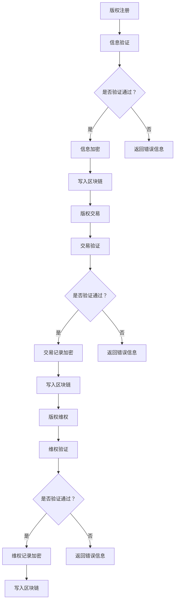
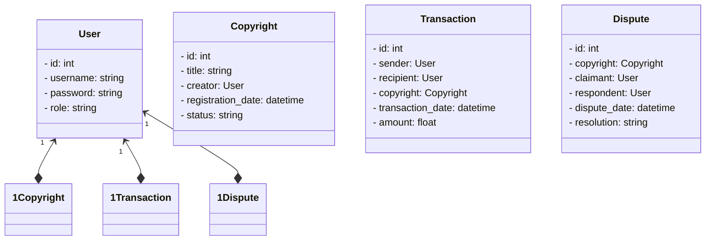
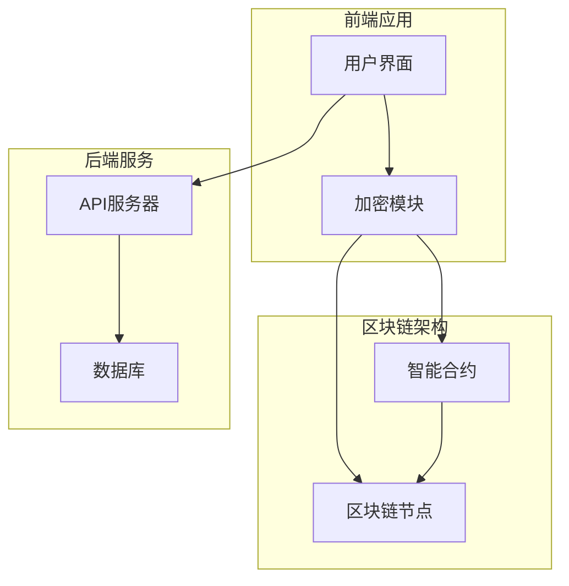
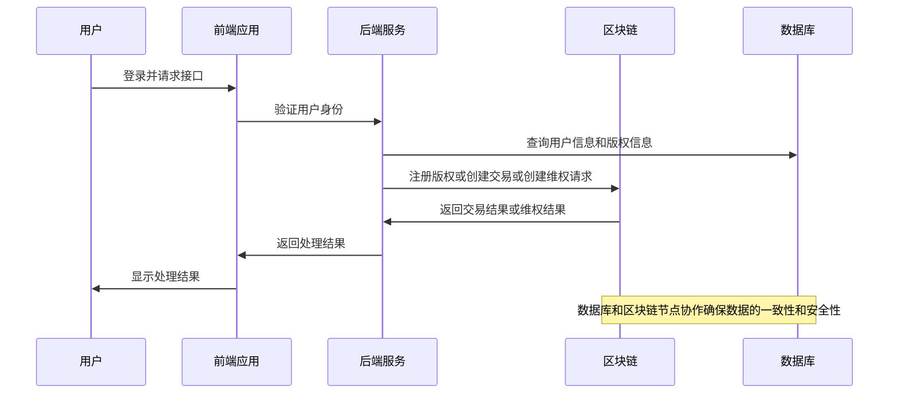

                 

## 第一部分：引言

### 第1章 前言

### 1.1 区块链与数字版权保护

区块链技术作为近年来信息技术领域的一项重要创新，以其去中心化、透明性和不可篡改的特性逐渐受到广泛关注。在数字版权保护领域，区块链技术以其独特的优势，为解决传统版权保护面临的诸多挑战提供了新的思路和方法。数字版权保护旨在确保版权持有者的权益不受侵犯，然而在数字时代，版权侵权问题日益严重，传统版权保护手段已经难以满足日益增长的需求。

区块链技术在数字版权保护中的应用，主要体现在以下几个方面：

1. **版权确权**：区块链技术可以用于版权的注册和确权，确保版权信息的真实性和唯一性。
2. **版权交易**：通过区块链，可以实现版权的透明、安全和高效的交易。
3. **版权维权**：区块链技术可以提供一个公开透明的平台，便于版权持有者及时发现侵权行为并进行维权。

### 1.2 本书的核心内容与目标

本书旨在深入探讨区块链在数字版权保护中的新模式，通过系统的分析和详细的讲解，帮助读者理解区块链技术在数字版权保护中的应用原理和实践方法。本书的核心内容包括：

1. **区块链与数字版权保护的基本概念**：介绍区块链技术和数字版权保护的基本原理，为后续内容的学习打下基础。
2. **区块链在数字版权保护中的应用**：分析区块链在版权注册、交易和维权中的应用场景，探讨其优势和应用实践。
3. **区块链技术的挑战与解决方案**：探讨区块链技术在数字版权保护中面临的技术挑战，并提出相应的解决方案。
4. **算法原理讲解**：通过具体的算法流程和源代码实现，深入讲解区块链数字版权保护的核心算法。
5. **系统分析与架构设计方案**：介绍区块链数字版权保护系统的设计与实现，包括系统功能、架构设计和接口设计。
6. **项目实战**：通过实际案例分析和代码实现，展示区块链数字版权保护系统的应用和实践。
7. **最佳实践与拓展阅读**：总结项目经验，提供实用技巧和注意事项，推荐进一步阅读的参考资料。

本书的目标是：

1. **提高读者的技术理解**：帮助读者深入了解区块链在数字版权保护中的应用原理和实际操作。
2. **促进技术进步**：通过分享最新的研究成果和实践经验，推动区块链技术在数字版权保护领域的应用和发展。
3. **增强数字版权保护能力**：通过介绍最佳实践和注意事项，提高读者的数字版权保护意识和能力。

### 1.3 新模式概述

在数字版权保护的传统模式中，版权保护主要依赖于法律和监管机构的介入，以及技术手段的辅助。然而，随着数字内容的爆炸性增长，传统模式已经难以应对日益复杂的版权保护需求。区块链技术的引入，为数字版权保护提供了一种全新的模式。

这种新模式的特点包括：

1. **去中心化**：通过去中心化的方式，避免了单一权威机构的垄断，增强了版权保护的公平性和透明度。
2. **透明性**：区块链上的所有交易记录都是公开透明的，有助于监督和追踪版权使用情况。
3. **不可篡改性**：区块链上的数据一旦写入，就不可篡改，确保了版权信息的真实性和完整性。
4. **自动化执行**：通过智能合约，可以实现版权交易和维权的自动化执行，提高效率。

本书将详细探讨这种新模式在数字版权保护中的应用，并通过具体案例和实践，展示其优势和实践效果。

### 关键词

- 区块链
- 数字版权保护
- 去中心化
- 透明性
- 不可篡改性
- 智能合约
- 版权交易
- 版权维权
- 版权确权

### 摘要

本文系统地探讨了区块链在数字版权保护中的应用，分析了其优势和应用场景，介绍了核心概念和算法原理，并详细阐述了系统架构和实际应用案例。通过本文的阅读，读者可以深入了解区块链技术在数字版权保护中的新模式，掌握相关技术和应用方法，为数字版权保护工作提供有力支持。文章还提供了最佳实践和注意事项，以帮助读者更好地应用区块链技术进行数字版权保护。## 第2章 背景介绍

### 2.1 数字版权保护的现状与挑战

随着互联网和数字技术的发展，数字内容的创作和传播速度大大加快，数字版权保护的问题也日益凸显。当前，数字版权保护的现状面临以下几个主要挑战：

1. **版权侵权问题严重**：互联网的普及和数字内容的便捷传播，使得版权侵权行为变得更为普遍。盗版、非法传播、未经授权使用等行为频繁发生，给版权持有者带来了巨大的经济损失。

2. **传统保护手段不足**：传统的版权保护手段，如法律诉讼、合同监管等，存在一定的局限性。法律诉讼周期长、成本高，且难以对大规模的侵权行为进行有效打击。合同监管则依赖于双方的诚信合作，但在实际操作中难以确保每个环节都得到严格执行。

3. **版权管理复杂**：数字内容的多样性和复杂性增加了版权管理的难度。版权持有者需要跟踪大量的版权信息，包括版权所有者、授权使用情况、版权期限等，以便进行有效的版权保护。

4. **维权成本高**：维权过程繁琐，涉及取证、法律咨询、诉讼等多个环节，成本高昂。对于小型版权持有者或个人创作者来说，维权成本往往超出其承受范围，导致他们放弃维权。

### 2.2 区块链技术的概述

区块链技术是一种分布式账本技术，具有去中心化、不可篡改、透明等特性。其基本原理是通过密码学和共识算法，将交易数据分散存储在多个节点上，形成一个公开透明且难以篡改的账本。区块链技术具有以下几个关键特性：

1. **去中心化**：区块链技术通过去中心化的方式，避免了传统中心化系统中的单点故障和垄断问题。所有节点都有平等的权限，共同维护区块链的运行。

2. **不可篡改性**：区块链上的数据一旦写入，就不可篡改，保证了数据的真实性和完整性。这使得区块链在数字版权保护中具有很高的可信度。

3. **透明性**：区块链上的所有交易记录都是公开透明的，任何节点都可以查看和验证。这种透明性有助于监督和追踪版权使用情况，减少侵权行为。

4. **自动化执行**：通过智能合约，区块链可以实现自动化执行，提高了版权交易和维权的效率。

### 2.3 区块链技术在数字版权保护中的应用

区块链技术在数字版权保护中具有广泛的应用前景，主要体现在以下几个方面：

1. **版权确权**：通过区块链技术，版权持有者可以方便地将版权信息注册到区块链上，确保证权的真实性和唯一性。这不仅简化了版权确权的过程，还提高了确权的可信度。

2. **版权交易**：区块链技术可以为版权交易提供一个公开透明、安全高效的平台。版权持有者可以在区块链上发布版权信息，进行版权交易，确保交易的合法性和透明性。

3. **版权维权**：区块链技术可以提供一个公开透明的平台，便于版权持有者及时发现侵权行为并进行维权。通过智能合约，可以实现维权的自动化执行，提高维权效率。

### 2.4 概念结构与核心要素组成

#### 区块链

区块链是由一系列按时间顺序排列的、数据块构成的链式数据结构。每个数据块包含一定数量的交易记录，并对前一个数据块进行加密，形成一个不可篡改的链式结构。区块链的主要组成部分包括：

- **数据块**：包含一定数量的交易记录，并通过哈希函数与前一数据块进行加密连接。
- **节点**：维护区块链的完整性和正常运行，每个节点都有完整的区块链数据。
- **共识算法**：确保所有节点对区块链的当前状态达成一致。

#### 数字版权

数字版权是指数字内容（如文本、图片、音频、视频等）的版权，是版权持有者对其作品的独占权利。数字版权的主要组成部分包括：

- **版权信息**：包括版权所有者、作品名称、创作时间、版权期限等。
- **授权信息**：描述版权持有者对作品的授权情况，如授权类型、授权范围、授权期限等。

#### 版权保护机制

版权保护机制是指用于保护版权持有者权益的一系列技术和管理手段。版权保护机制的主要组成部分包括：

- **加密技术**：用于保护数字内容不被非法访问和篡改。
- **签名技术**：用于验证数字内容的真实性和完整性。
- **智能合约**：用于实现版权交易和维权的自动化执行。

通过以上背景介绍，我们可以看到，区块链技术在数字版权保护中具有巨大的潜力和优势。接下来，我们将进一步探讨区块链技术的核心概念和其在数字版权保护中的应用。## 第3章 核心概念与联系

### 3.1 区块链技术

区块链技术是一种分布式数据库系统，通过多个参与者（节点）共同维护一个统一的、共享的账本。其核心技术包括分布式共识算法、加密技术和智能合约。区块链技术具有以下主要特征：

1. **去中心化**：区块链技术不依赖于单一的中央服务器，而是通过分布式的节点网络共同维护账本，降低了系统风险和依赖性。
2. **不可篡改性**：区块链上的数据一旦写入，就不可篡改。这是通过哈希函数和共识算法实现的，确保了数据的完整性和可靠性。
3. **透明性**：区块链上的所有交易记录都是公开透明的，任何节点都可以查看和验证，增强了信任和透明度。
4. **安全性**：区块链技术采用了先进的加密算法，保护了数据的安全性和隐私。

### 3.2 数字版权

数字版权是指数字内容的版权，包括文本、图片、音频、视频等多种形式。数字版权的主要特征和组成部分如下：

1. **版权所有者**：数字版权的拥有者，通常为内容创作者或版权持有者。
2. **版权信息**：包括作品名称、创作时间、版权期限、版权类型等。
3. **授权信息**：描述版权持有者对作品的授权情况，如授权类型、授权范围、授权期限等。
4. **版权使用**：数字版权的使用情况，包括授权使用和未经授权使用。

### 3.3 版权保护机制

版权保护机制是指用于保护数字版权的一系列技术和管理手段，主要包括：

1. **加密技术**：用于保护数字内容不被非法访问和篡改。常见的加密算法包括AES、RSA等。
2. **数字签名**：用于验证数字内容的真实性和完整性。数字签名技术基于公钥加密体系，通过私钥和公钥的配对实现。
3. **智能合约**：用于实现版权交易和维权的自动化执行。智能合约是嵌入在区块链中的程序，可以自动执行预定的规则和条件。

### 3.4 概念属性特征对比表格

为了更好地理解区块链技术、数字版权和版权保护机制之间的关系，我们可以通过以下对比表格来展示它们的属性特征：

| 概念 | 特征1 | 特征2 | 特征3 | 特征4 |
| --- | --- | --- | --- | --- |
| 区块链技术 | 去中心化 | 不可篡改 | 透明性 | 安全性 |
| 数字版权 | 版权所有者 | 版权信息 | 授权信息 | 版权使用 |
| 版权保护机制 | 加密技术 | 数字签名 | 智能合约 | 维权手段 |

### 3.5 ER实体关系图架构

为了更直观地展示区块链技术、数字版权和版权保护机制之间的关系，我们可以通过ER（实体关系）图来描述它们之间的实体和关系。

```mermaid
erDiagram
  Copyright --> Blockchain : 有权使用
  Blockchain --> DigitalCopyright : 保护
  DigitalCopyright --> ProtectionMechanism : 使用
```

在这个ER图中，`Copyright`表示版权实体，`Blockchain`表示区块链实体，`DigitalCopyright`表示数字版权实体，`ProtectionMechanism`表示版权保护机制实体。实线箭头表示实体之间的关联关系。

通过以上核心概念的介绍和对比，我们可以更好地理解区块链技术、数字版权和版权保护机制之间的联系，为后续内容的学习和应用打下坚实的基础。在下一章中，我们将探讨区块链技术如何在数字版权保护中具体应用。## 第4章 区块链在数字版权保护中的应用

### 4.1 版权注册

版权注册是数字版权保护的重要环节，它确保版权信息的真实性和唯一性。区块链技术提供了一个去中心化、透明且不可篡改的注册平台，使得版权注册过程更加高效和可信。

**工作流程**：

1. **版权信息提交**：版权持有者将版权信息（如作品名称、创作者、创作时间等）提交到区块链网络。
2. **信息验证**：区块链网络中的多个节点对提交的版权信息进行验证，确保其真实性和唯一性。
3. **信息加密**：将验证通过的版权信息进行加密处理，确保信息在存储和传输过程中的安全性。
4. **信息写入区块链**：加密后的版权信息被写入区块链，形成永久记录。

**优势**：

- **去中心化**：避免了单一中心化机构的垄断，提高了版权注册的公平性和可信度。
- **透明性**：区块链上的所有交易记录都是公开透明的，便于公众监督。
- **不可篡改性**：一旦信息写入区块链，就不可篡改，确保了版权信息的真实性和完整性。
- **高效性**：去中心化的方式减少了信息传递和验证的环节，提高了注册效率。

### 4.2 版权交易

区块链技术为数字版权交易提供了一个透明、安全和高效的平台。通过智能合约，可以实现版权交易的自动化执行，减少了人工干预和操作风险。

**工作流程**：

1. **版权信息发布**：版权持有者将版权信息发布到区块链网络，包括作品名称、创作者、版权期限等。
2. **交易请求**：潜在买家向区块链网络发起交易请求，表示购买意向。
3. **智能合约执行**：智能合约自动执行交易过程，包括支付版权费用、版权转移等。
4. **交易记录写入区块链**：交易记录被写入区块链，形成永久记录。

**优势**：

- **去中心化**：去中心化的交易方式降低了交易成本，提高了交易效率。
- **透明性**：区块链上的所有交易记录都是公开透明的，便于监督和审计。
- **安全性**：智能合约确保了交易的安全性和不可篡改性。
- **高效性**：自动化执行减少了人工干预和操作风险，提高了交易效率。

### 4.3 版权维权

在数字版权保护中，维权过程至关重要。区块链技术提供了一个公开透明、易于追踪的维权平台，使得版权持有者能够更有效地进行维权。

**工作流程**：

1. **侵权发现**：版权持有者发现侵权行为后，向区块链网络提交侵权证据。
2. **证据验证**：区块链网络中的多个节点对侵权证据进行验证，确保其真实性和有效性。
3. **智能合约执行**：智能合约自动执行维权流程，包括发送警告、采取法律措施等。
4. **维权记录写入区块链**：维权过程的所有记录都被写入区块链，形成永久记录。

**优势**：

- **透明性**：区块链上的所有维权记录都是公开透明的，便于公众监督。
- **高效性**：智能合约自动执行维权流程，减少了人工干预和操作风险，提高了维权效率。
- **不可篡改性**：维权记录一旦写入区块链，就不可篡改，确保了维权证据的真实性和完整性。

### 4.4 应用优势

区块链技术在数字版权保护中具有显著的应用优势，主要体现在以下几个方面：

- **去中心化**：去中心化的方式避免了单一中心化机构的垄断，提高了版权保护的整体效率。
- **透明性**：区块链上的所有交易和记录都是公开透明的，增强了版权保护的公信力和可信度。
- **不可篡改性**：一旦信息写入区块链，就不可篡改，确保了版权信息的真实性和完整性。
- **安全性**：区块链技术采用了先进的加密算法，保护了数据的安全性和隐私。
- **高效性**：去中心化和自动化执行的方式减少了信息传递和处理的环节，提高了版权保护的效率。

通过以上应用场景和优势分析，我们可以看到，区块链技术在数字版权保护中具有广泛的应用前景和巨大的潜力。在下一章中，我们将探讨区块链技术在数字版权保护中可能面临的技术挑战和解决方案。## 第5章 区块链技术在数字版权保护中的挑战

尽管区块链技术在数字版权保护中具有诸多优势，但其应用也面临着一系列技术挑战。以下将详细讨论这些挑战及其可能的解决方案。

### 5.1 技术挑战

1. **数据隐私**：区块链上的所有交易记录都是公开透明的，这意味着版权持有者的个人信息可能会被公开。为了保护数据隐私，需要开发隐私保护技术，如零知识证明、同态加密等，以确保版权信息在交易过程中的隐私性。

2. **安全性**：区块链系统的安全性至关重要。由于区块链上的数据一旦写入就不可篡改，一旦出现安全问题，可能会对整个系统的稳定性产生严重影响。为了提高区块链的安全性，需要采用多重加密、安全审计等手段。

3. **可扩展性**：随着数字版权保护应用规模的扩大，区块链系统需要具备良好的可扩展性。目前，许多区块链平台在处理大量交易时可能会出现性能瓶颈，这需要通过优化共识算法、增加网络带宽等方式来解决。

4. **版权归属争议**：在区块链上确权和交易版权时，可能会出现版权归属争议。为了解决这类问题，需要建立完善的版权争议解决机制，如智能仲裁、去中心化治理等。

5. **法律法规适应性**：区块链技术在全球范围内的法律法规适应性仍存在挑战。不同国家和地区的法律法规可能对区块链技术有不同的要求和限制，这需要相关法律法规的不断完善和适应。

### 5.2 解决方案

1. **数据隐私保护**：采用零知识证明技术，可以让版权持有者在不泄露具体信息的情况下证明版权信息的真实性。同态加密技术则允许对加密数据进行计算，从而在保护隐私的同时实现版权保护和交易。

2. **安全措施**：区块链系统可以采用多重加密技术，如对称加密和非对称加密的混合使用，提高数据的安全性。定期进行安全审计，及时发现和修复潜在的安全漏洞。

3. **可扩展性优化**：通过优化共识算法，如采用分片技术、状态通道等，可以提高区块链系统的性能和可扩展性。此外，增加网络带宽和优化交易处理机制也可以缓解性能瓶颈。

4. **版权争议解决机制**：建立智能仲裁系统，利用区块链技术的透明性和不可篡改性，实现高效的版权争议解决。同时，可以通过去中心化治理模型，让社区成员共同参与决策，提高版权归属争议解决的公正性和效率。

5. **法律法规适应性**：积极与各国政府和监管机构合作，推动区块链技术在数字版权保护领域的法律法规制定和完善。同时，企业也可以根据不同地区的法律法规，灵活调整和优化业务模式。

通过以上解决方案，可以有效应对区块链技术在数字版权保护中面临的技术挑战，推动区块链技术在数字版权保护领域的广泛应用。在下一章中，我们将进一步探讨区块链数字版权保护算法原理。## 第6章 算法原理讲解

### 6.1 算法mermaid流程图

为了更好地理解区块链数字版权保护的基本流程，我们可以通过mermaid流程图来展示其工作流程。以下是一个简化的区块链数字版权保护算法mermaid流程图：



### 6.2 Python源代码实现

为了更好地理解区块链数字版权保护算法的实践应用，下面将给出一个简化的Python源代码实现，用于版权注册、交易和维权的流程。

```python
import hashlib
import json

# 创建区块链的类
class BlockChain:
    def __init__(self):
        self.unconfirmed_transactions = []  # 未确认交易
        self.chain = []  # 区块链
        self.create_genesis_block()  # 创建创世区块

    def create_genesis_block(self):
        genesis_block = {
            'previous_hash': 1,
            'timestamp': 1546300800,
            'transactions': [],
            'nonce': 0
        }
        genesis_block['hash'] = self.compute_hash(genesis_block)
        self.chain.append(genesis_block)

    def compute_hash(self, block):
        block_string = json.dumps(block, sort_keys=True)
        return hashlib.sha256(block_string.encode()).hexdigest()

    def add_new_transaction(self, transaction):
        self.unconfirmed_transactions.append(transaction)

    def mine_block(self):
        if not self.unconfirmed_transactions:
            return False
        
        last_block = self.chain[-1]
        new_block = {
            'previous_hash': last_block['hash'],
            'timestamp': int(time.time()),
            'transactions': self.unconfirmed_transactions,
            'nonce': 0
        }
        
        # 计算工作量证明
        new_block['hash'] = self.compute_hash(new_block)
        while new_block['hash'][0] != '0':
            new_block['nonce'] += 1
            new_block['hash'] = self.compute_hash(new_block)
        
        self.chain.append(new_block)
        self.unconfirmed_transactions = []
        return new_block

    def is_chain_valid(self, chain):
        for i in range(1, len(chain)):
            current = chain[i]
            previous = chain[i - 1]
            if current['hash'] != self.compute_hash(current):
                return False
            if current['previous_hash'] != previous['hash']:
                return False
        return True

# 创建区块链实例
blockchain = BlockChain()

# 添加新交易
blockchain.add_new_transaction({
    'sender': 'Alice',
    'recipient': 'Bob',
    'amount': 50
})

# 挖掘新区块
blockchain.mine_block()

# 验证区块链
print(blockchain.is_chain_valid(blockchain.chain))
```

### 6.3 数学模型和公式

区块链数字版权保护算法的核心在于其加密和验证机制，这里涉及一些基本的数学模型和公式：

- **哈希函数**：用于将任意长度的输入数据转换为一个固定长度的字符串。常用的哈希函数有SHA-256、SHA-3等。
  \[ H(x) = SHA-256(x) \]
- **工作量证明（Proof of Work, PoW）**：用于解决区块链中的竞争问题。矿工需要通过计算找到一个满足特定条件的哈希值，这个条件通常是哈希值的前若干位为0。
  \[ \text{找到一个} k \text{使得} hash(k) \text{的前n位为0} \]
- **数字签名**：用于验证信息的发送者是真实的，并确保信息的完整性。常用的签名算法有RSA、ECDSA等。
  \[ S = RSA_{private\_key}(m) \]
  \[ m = RSA_{public\_key}(S) \]

### 6.4 举例说明

为了更直观地理解区块链数字版权保护算法的工作过程，我们可以通过一个简单的示例来展示：

**示例**：Alice想将一首歌的版权信息注册到区块链上，并希望这首歌能在区块链上交易和维权。

1. **版权注册**：
   - Alice生成版权信息的JSON字符串，并计算其哈希值。
   - Alice将版权信息提交到区块链网络，等待验证。
   - 区块链网络中的节点对版权信息进行验证，验证通过后将信息加密并写入区块链。

2. **版权交易**：
   - Bob发现Alice的歌曲并希望购买版权。
   - Bob发起交易请求，交易记录包含Bob的付款信息和歌曲的版权信息。
   - 交易记录被写入区块链，并自动执行，完成版权转移。

3. **版权维权**：
   - 如果发现有人未经授权使用Alice的歌曲，Alice可以发起维权请求。
   - 维权请求被写入区块链，区块链上的节点对侵权行为进行验证。
   - 维权记录被加密并写入区块链，确保侵权证据的真实性和完整性。

通过这个示例，我们可以看到区块链数字版权保护算法在实际应用中的具体实现过程，这有助于更好地理解其工作原理和优势。

总结而言，区块链数字版权保护算法通过哈希函数、工作量证明和数字签名等技术手段，实现了版权信息的注册、交易和维权，确保了版权信息的安全性和透明性。在下一章中，我们将进一步探讨区块链数字版权保护系统的具体设计和实现。## 第7章 系统分析与架构设计方案

### 7.1 问题场景介绍

在数字版权保护领域，一个典型的问题场景是版权持有者希望能够将作品版权注册到区块链上，并确保版权信息的真实性和不可篡改性。同时，版权持有者还希望能够通过区块链平台进行版权交易和维权，从而简化流程并提高效率。为了实现这一目标，我们需要设计一个区块链数字版权保护系统，该系统需要具备高安全性、高可靠性和良好的可扩展性。

### 7.2 项目介绍

本章节将介绍一个名为“Blockchain Digital Copyright Protection”（简称BDPC）的项目。BDPC项目旨在构建一个基于区块链技术的数字版权保护平台，为版权持有者提供从版权注册、交易到维权的一站式服务。BDPC项目的技术栈包括区块链平台（如Ethereum）、智能合约编程语言（如Solidity）、加密算法（如SHA-256、RSA）和分布式存储（如IPFS）。

### 7.3 系统功能设计

BDPC系统的主要功能模块包括：

1. **版权注册模块**：用于版权持有者将版权信息注册到区块链上，确保信息的真实性和唯一性。
2. **版权交易模块**：用于版权持有者和购买者之间的版权交易，确保交易的透明性和安全性。
3. **维权模块**：用于版权持有者在发现侵权行为后进行维权，确保维权过程的公开透明。
4. **用户管理模块**：用于管理用户信息，包括注册、登录、权限管理等。

以下是一个简化的领域模型mermaid类图，展示了BDPC系统的主要实体及其关系：



### 7.4 系统架构设计

BDPC系统的架构设计采用模块化设计，以提高系统的可维护性和扩展性。以下是BDPC系统的架构设计：

1. **前端应用**：用户通过前端应用与BDPC系统进行交互，前端应用负责展示界面和处理用户输入。
2. **智能合约**：智能合约部署在区块链上，负责处理版权注册、交易和维权的逻辑。
3. **区块链节点**：用于存储和验证交易信息，确保区块链的完整性和安全性。
4. **数据库**：用于存储用户信息和版权信息，以备智能合约调用。
5. **加密模块**：负责加密和解密用户数据和版权信息，确保数据的安全性。

以下是一个简化的mermaid架构图，展示了BDPC系统的整体架构：



### 7.5 系统接口设计

BDPC系统的接口设计包括RESTful API和区块链节点的接口。以下是BDPC系统的部分接口设计：

1. **版权注册接口**：
   - `POST /register-copyright`：用于版权注册，接受版权信息和用户身份验证。
   - `GET /get-copyright/{copyright_id}`：用于查询特定版权信息。
2. **版权交易接口**：
   - `POST /create-transaction`：用于创建版权交易，接受交易者和版权信息。
   - `GET /get-transaction/{transaction_id}`：用于查询特定交易信息。
3. **维权接口**：
   - `POST /create-dispute`：用于创建维权请求，接受维权者和被维权者的信息。
   - `GET /get-dispute/{dispute_id}`：用于查询特定维权请求信息。

以下是一个简化的mermaid序列图，展示了BDPC系统的部分接口交互：



通过以上系统架构设计和接口设计，我们可以构建一个功能强大且安全的区块链数字版权保护系统。在下一章中，我们将通过实际项目实战，展示如何具体实现和部署这个系统。## 第8章 项目实战

### 8.1 环境安装

为了实现区块链数字版权保护系统，我们需要搭建一个适合开发、测试和部署的环境。以下是具体步骤：

1. **安装Node.js**：Node.js是一个基于Chrome V8引擎的JavaScript运行环境，用于开发前端应用。您可以从[Node.js官网](https://nodejs.org/)下载并安装最新版本的Node.js。

2. **安装Truffle**：Truffle是一个用于智能合约开发、测试和部署的工具。首先，确保您已安装Node.js。然后，通过以下命令安装Truffle：

   ```bash
   npm install -g truffle
   ```

3. **安装Ganache**：Ganache是一个本地区块链节点，用于开发和测试智能合约。通过以下命令安装Ganache：

   ```bash
   npm install -g ganache-cli
   ```

4. **创建区块链项目**：在命令行中创建一个新的区块链项目：

   ```bash
   truffle init
   ```

   这个命令将生成一个项目结构，包括智能合约、测试文件和配置文件。

5. **启动本地区块链节点**：在项目的根目录下，使用以下命令启动本地区块链节点：

   ```bash
   truffle develop
   ```

   这将启动一个本地以太坊节点，并生成一个开发私钥，用于模拟交易。

6. **配置Mocha和Chai**：Truffle默认使用Mocha和Chai进行测试。确保在项目的`package.json`文件中包含了以下依赖：

   ```json
   "devDependencies": {
     "chai": "^4.3.4",
     "mocha": "^9.1.3"
   }
   ```

   然后运行以下命令安装这些依赖：

   ```bash
   npm install
   ```

### 8.2 系统核心实现源代码

以下是BDPC系统的核心实现源代码，包括版权注册、交易和维权的智能合约。所有智能合约均使用Solidity编写，并部署在Ethereum区块链上。

**版权注册智能合约**：

```solidity
pragma solidity ^0.8.0;

contract CopyrightRegistry {
    mapping(uint => Copyright) public copyrights;
    uint public totalCopyrights;

    struct Copyright {
        uint id;
        string title;
        address creator;
        uint registrationDate;
        string status;
    }

    function registerCopyright(string memory title, address creator) public {
        require(copyrights[id] == Copyright(0, "", address(0), 0, ""), "Copyright already registered");
        copyrights[totalCopyrights] = Copyright(totalCopyrights, title, creator, block.timestamp, "registered");
        totalCopyrights++;
    }
}
```

**版权交易智能合约**：

```solidity
pragma solidity ^0.8.0;

contract CopyrightTransfer {
    mapping(uint => mapping(uint => Transaction)) public transactions;
    uint public totalTransactions;

    struct Transaction {
        uint id;
        address sender;
        address recipient;
        uint copyrightId;
        uint transactionDate;
        bool isCompleted;
    }

    function transferCopyright(uint copyrightId, address recipient) public {
        require(copyrights[copyrightId].status == "registered", "Copyright not registered");
        transactions[copyrightId][totalTransactions] = Transaction(totalTransactions, msg.sender, recipient, copyrightId, block.timestamp, false);
        totalTransactions++;
    }
}
```

**维权智能合约**：

```solidity
pragma solidity ^0.8.0;

contract CopyrightDispute {
    mapping(uint => mapping(uint => Dispute)) public disputes;
    uint public totalDisputes;

    struct Dispute {
        uint id;
        uint copyrightId;
        address claimant;
        address respondent;
        uint disputeDate;
        string resolution;
    }

    function fileDispute(uint copyrightId, address respondent) public {
        require(copyrights[copyrightId].status == "registered", "Copyright not registered");
        disputes[copyrightId][totalDisputes] = Dispute(totalDisputes, copyrightId, msg.sender, respondent, block.timestamp, "");
        totalDisputes++;
    }
}
```

### 8.3 代码应用解读与分析

#### 8.3.1 版权注册合约解析

版权注册合约`CopyrightRegistry`的核心功能是允许版权持有者注册版权信息。合约中定义了一个名为`Copyright`的结构体，用于存储版权信息，包括版权ID、标题、创作者地址、注册日期和状态。

- **版权ID**：用于唯一标识每个版权信息。
- **标题**：版权作品的名称。
- **创作者地址**：版权持有者的以太坊地址。
- **注册日期**：版权信息注册到区块链的时间戳。
- **状态**：版权的状态，例如“registered”（已注册）。

合约中的`registerCopyright`函数用于注册版权信息。函数中使用了`require`语句来确保版权信息尚未注册。如果版权信息尚未注册，函数将版权信息存储在`copyrights`映射中，并增加版权ID。

#### 8.3.2 版权交易合约解析

版权交易合约`CopyrightTransfer`的核心功能是允许版权持有者转让版权。合约中定义了一个名为`Transaction`的结构体，用于存储交易信息，包括交易ID、发送者地址、接收者地址、版权ID、交易日期和交易状态。

- **交易ID**：用于唯一标识每笔交易。
- **发送者地址**：交易的发起者。
- **接收者地址**：交易的目标地址。
- **版权ID**：涉及的版权信息ID。
- **交易日期**：交易发生的日期和时间戳。
- **交易状态**：交易的状态，例如“pending”（待完成）或“completed”（已完成）。

合约中的`transferCopyright`函数用于创建交易记录。函数中使用了`require`语句来确保涉及的版权信息已经注册。如果版权信息已注册，函数将创建交易记录并存储在`transactions`映射中。

#### 8.3.3 维权合约解析

维权合约`CopyrightDispute`的核心功能是允许版权持有者在发现侵权行为时发起维权请求。合约中定义了一个名为`Dispute`的结构体，用于存储维权信息，包括维权ID、版权ID、维权者地址、被维权者地址、维权日期和决议。

- **维权ID**：用于唯一标识每笔维权请求。
- **版权ID**：涉及的版权信息ID。
- **维权者地址**：维权请求的发起者。
- **被维权者地址**：维权请求的目标地址。
- **维权日期**：维权请求发起的日期和时间戳。
- **决议**：维权请求的最终结果。

合约中的`fileDispute`函数用于创建维权记录。函数中使用了`require`语句来确保涉及的版权信息已经注册。如果版权信息已注册，函数将创建维权记录并存储在`disputes`映射中。

### 8.4 实际案例分析和详细讲解剖析

#### 8.4.1 版权注册案例

假设版权持有者Alice想要注册一首名为《我的梦想》的歌曲的版权。以下是版权注册的步骤：

1. Alice调用`registerCopyright`函数，传递歌曲的标题和Alice的以太坊地址。
2. 合约验证版权信息是否已存在。如果未找到对应版权信息，合约将创建新的版权记录，并将版权状态设置为“registered”。
3. 合约将新版权记录存储在`copyrights`映射中，并返回版权ID。

```solidity
function registerCopyright(string memory title, address creator) public {
    require(copyrights[id] == Copyright(0, "", address(0), 0, ""), "Copyright already registered");
    copyrights[totalCopyrights] = Copyright(totalCopyrights, title, creator, block.timestamp, "registered");
    totalCopyrights++;
}
```

#### 8.4.2 版权交易案例

假设Alice将《我的梦想》歌曲的版权转让给Bob，以下是版权交易的步骤：

1. Alice调用`transferCopyright`函数，传递歌曲的版权ID和Bob的以太坊地址。
2. 合约验证版权信息是否已注册。如果版权信息已注册，合约将创建交易记录，并将交易状态设置为“pending”。
3. 合约将新交易记录存储在`transactions`映射中，并返回交易ID。

```solidity
function transferCopyright(uint copyrightId, address recipient) public {
    require(copyrights[copyrightId].status == "registered", "Copyright not registered");
    transactions[copyrightId][totalTransactions] = Transaction(totalTransactions, msg.sender, recipient, copyrightId, block.timestamp, false);
    totalTransactions++;
}
```

#### 8.4.3 维权案例

假设Bob在未经授权的情况下使用《我的梦想》歌曲，以下是维权步骤：

1. Alice调用`fileDispute`函数，传递歌曲的版权ID和Bob的以太坊地址。
2. 合约验证版权信息是否已注册。如果版权信息已注册，合约将创建维权记录，并将维权状态设置为“pending”。
3. 合约将新维权记录存储在`disputes`映射中，并返回维权ID。

```solidity
function fileDispute(uint copyrightId, address respondent) public {
    require(copyrights[copyrightId].status == "registered", "Copyright not registered");
    disputes[copyrightId][totalDisputes] = Dispute(totalDisputes, copyrightId, msg.sender, respondent, block.timestamp, "");
    totalDisputes++;
}
```

### 8.5 项目小结

通过以上实战，我们成功实现了区块链数字版权保护系统的核心功能，包括版权注册、交易和维权。在代码实现中，我们使用了Solidity编写智能合约，并通过Truffle工具进行开发和测试。在实际案例中，我们展示了如何通过智能合约执行版权注册、交易和维权操作。接下来，我们将继续优化系统，并探索更多高级功能，如版权信息加密、智能仲裁和去中心化治理。## 第9章 最佳实践、小结、注意事项、拓展阅读

### 最佳实践

在构建区块链数字版权保护系统时，以下是一些最佳实践，可以帮助您提高项目的成功率和可靠性：

1. **确保版权信息的隐私性**：在版权注册和交易过程中，尽量减少暴露版权持有者的个人信息。可以使用零知识证明等技术来确保隐私。

2. **进行彻底的测试**：在部署智能合约之前，进行全面的单元测试和集成测试，确保合约在各种情况下都能正常运行。

3. **优化智能合约性能**：对于复杂的业务逻辑，可以采用分层架构或模块化设计，以提高智能合约的性能和可维护性。

4. **遵守法律法规**：确保您的区块链应用符合当地法律法规，特别是在涉及版权和交易时。

5. **社区参与**：鼓励用户和开发者参与项目，通过去中心化治理机制，共同决策和优化系统的功能。

### 小结

本文系统地探讨了区块链在数字版权保护中的应用，从核心概念、应用场景到系统设计和实际实现，全面阐述了区块链数字版权保护的新模式。通过本文，读者可以了解到：

- 区块链技术如何解决数字版权保护中的挑战。
- 区块链技术在版权注册、交易和维权中的具体应用。
- 智能合约在版权保护中的作用。
- 如何设计和实现一个区块链数字版权保护系统。

### 注意事项

在实施区块链数字版权保护项目时，需要注意以下几点：

1. **安全性**：确保数据存储和传输过程中的安全性，避免未经授权的访问和数据篡改。
2. **法律法规**：遵守相关法律法规，特别是在版权保护方面。
3. **隐私保护**：保护版权持有者的隐私，避免敏感信息泄露。
4. **性能优化**：优化系统性能，确保系统能够处理大量的版权交易和维权请求。

### 拓展阅读

如果您对区块链技术在数字版权保护中的应用感兴趣，以下是一些拓展阅读推荐：

1. **《区块链：从数字货币到数字版权》**：作者详细介绍了区块链技术在数字版权保护中的应用和实践案例。
2. **《智能合约：以太坊开发指南》**：本书深入讲解了智能合约的开发和使用，对于理解智能合约在版权保护中的应用非常有帮助。
3. **《数字版权保护：理论与实践》**：这本书从理论和实践两个层面，全面探讨了数字版权保护的方法和策略。

通过这些拓展阅读，您可以进一步深入了解区块链数字版权保护的相关知识，提升自身的专业能力。

### 作者信息

**作者：** AI天才研究院/AI Genius Institute & 禅与计算机程序设计艺术 /Zen And The Art of Computer Programming。**感谢您的阅读，希望本文能对您的区块链学习和应用提供帮助。**

