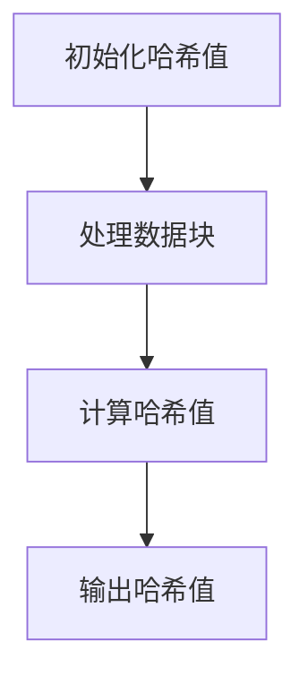
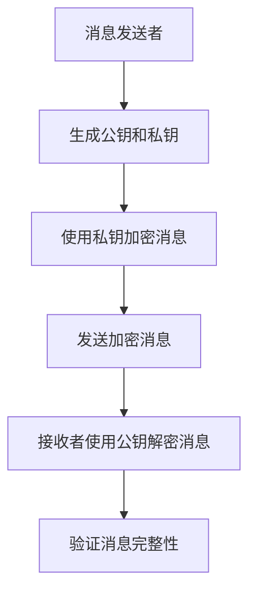
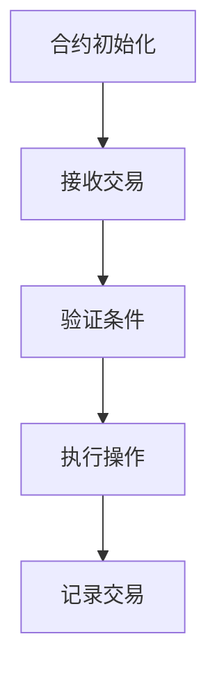
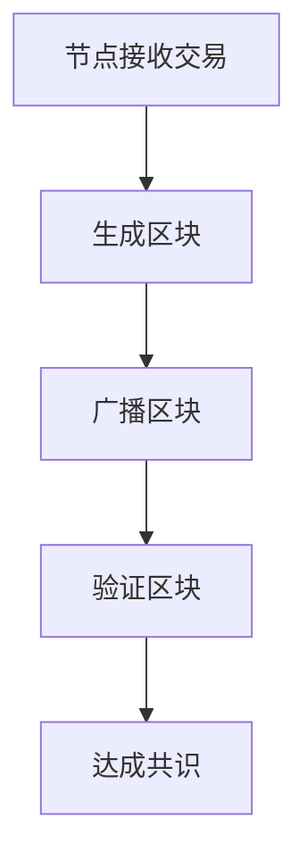
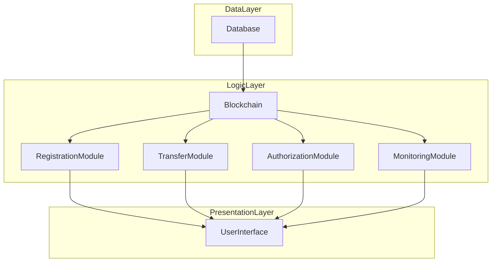
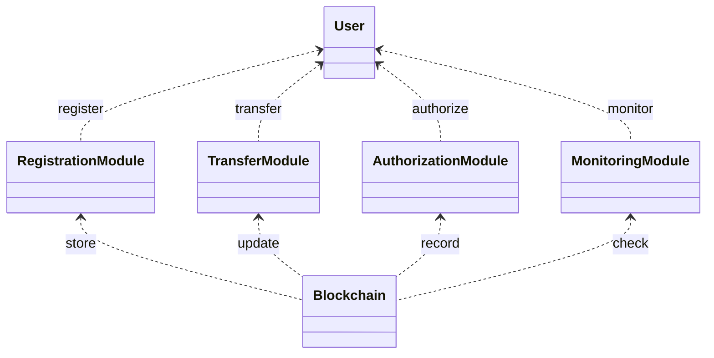
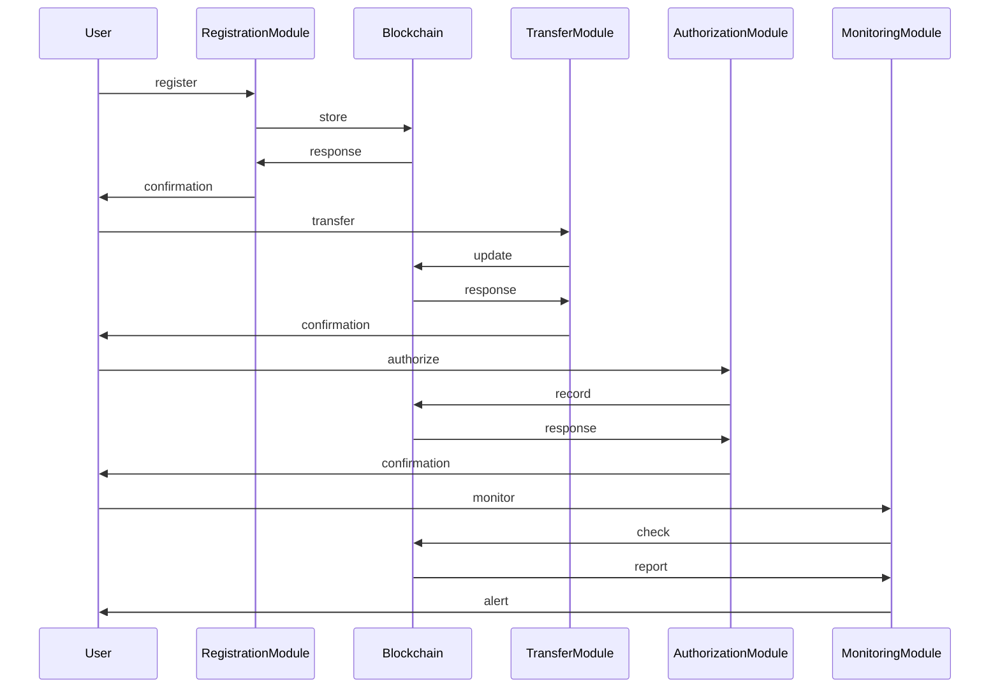

                 

### 第1章: 区块链与数字版权分发概述

#### 1.1 区块链技术概述

区块链是一种去中心化的数据库技术，它通过分布式网络中的多个节点共同维护一个统一的数据记录。区块链技术的核心特点包括：

- **去中心化**：区块链不需要中心化的机构进行数据管理，而是通过网络中的多个节点共同协作。
- **不可篡改性**：一旦数据被记录在区块链上，就几乎无法被篡改，保证了数据的安全性和可信度。
- **透明性**：所有参与节点都可以查看区块链上的数据，增加了数据的透明度。

区块链技术起源于2008年，由一个化名为“中本聪”（Satoshi Nakamoto）的人提出了比特币（Bitcoin）的构想。随后，区块链技术逐渐发展，并被应用到多个领域，如数字货币、供应链管理、医疗健康等。

#### 1.2 数字版权分发背景

数字版权分发是指通过互联网或其他数字渠道，将数字化的作品如音乐、电影、书籍等传播给用户。然而，随着数字化的普及，数字版权分发面临诸多挑战：

- **版权侵权**：数字内容的复制和传播变得极其容易，导致版权侵权现象频发。
- **追踪困难**：数字作品在网络上传播的速度和范围远远超过传统物理介质，使得版权方难以追踪侵权行为。
- **收益分配不公**：由于中间环节众多，数字版权的收益分配往往不公平，创作者无法得到应有的回报。

#### 1.3 公平机制的概念与重要性

公平机制是指确保所有参与者在某个过程中得到公平对待的规则和机制。在数字版权分发中，公平机制尤为重要，主要体现在以下几个方面：

- **权益保护**：确保版权方的权益得到有效保护，防止侵权行为的发生。
- **收益分配**：通过合理的收益分配机制，确保创作者、分发平台和其他参与者都能获得公平的回报。
- **透明度提升**：通过透明度提高，增加市场参与者的信任，促进数字版权分发的健康发展。

实现公平机制面临一些挑战，如如何保证数据的不可篡改性、如何确保各方的权益、如何优化收益分配等。区块链技术因其去中心化、不可篡改等特点，被认为是解决这些挑战的有效手段。

### 1.4 本章小结

本章介绍了区块链、数字版权分发以及公平机制的基本概念，分析了区块链技术在数字版权分发中的应用前景。在接下来的章节中，我们将深入探讨区块链在数字版权分发中的具体应用，包括算法原理、系统架构设计以及实际项目实战。

## 第2章: 核心概念与联系

### 2.1 区块链技术核心概念

区块链技术由一系列区块组成，每个区块包含了若干交易记录。区块通过密码学方法连接在一起，形成了一个不可篡改的分布式账本。以下是区块链技术中的一些核心概念：

- **区块**：区块是区块链的基本组成单元，包含了交易记录、时间戳和其他元数据。每个区块都有一个唯一的哈希值，用于保证数据的完整性。
- **交易**：交易是区块链上的数据交换单位，代表了参与者在区块链上进行的经济活动。交易记录在区块中被打包，并通过加密算法验证其合法性。
- **共识机制**：共识机制是区块链网络中达成一致意见的算法。它确保了所有节点对区块链上数据的正确性和一致性。常见的共识机制包括工作量证明（Proof of Work, PoW）、权益证明（Proof of Stake, PoS）等。
- **智能合约**：智能合约是区块链上的自动化执行协议。它通过预设的条件和规则，在满足特定条件时自动执行特定的操作。智能合约可以用于数字版权分发中的版权登记、授权管理等功能。

#### 2.2 数字版权分发核心概念

数字版权分发涉及多个核心概念，包括数字版权、版权注册、版权转让和版权监控等：

- **数字版权**：数字版权是指数字化的作品所拥有的法律权利。它包括复制权、发行权、表演权、改编权等。
- **版权注册**：版权注册是将数字作品的信息登记到官方机构或数据库中，以获得法律保护。版权注册为版权方提供了证据，有助于追查侵权行为。
- **版权转让**：版权转让是指版权方将数字作品的某些权利转让给第三方。转让过程中，各方需要通过合同明确转让的具体内容和条件。
- **版权监控**：版权监控是指通过技术手段对数字作品在互联网上的传播进行监测和追踪。版权监控有助于发现侵权行为，采取相应的法律措施。

#### 2.3 公平机制与区块链的联系

区块链技术因其去中心化、不可篡改等特点，为公平机制提供了坚实的基础：

- **去中心化**：区块链的去中心化特性确保了所有参与者在网络中的地位平等，避免了中心化机构可能产生的垄断和不公平现象。
- **不可篡改性**：区块链上的数据一旦被记录，就几乎无法被篡改。这一特性确保了数据的真实性和可信度，有助于实现公平机制。
- **透明度**：区块链上的所有数据都是透明的，所有参与者都可以查看。这一透明度增加了市场的信任度，有助于公平机制的实现。

区块链技术通过智能合约和共识机制，可以构建一个公平的数字版权分发平台。智能合约可以自动执行版权登记、授权管理和收益分配等操作，确保各方的权益得到保护。共识机制确保了所有参与者对数据的共识，避免了单点故障和数据篡改的风险。

#### 2.4 本章小结

本章详细介绍了区块链技术、数字版权分发和公平机制的核心概念，并探讨了它们之间的联系。通过理解这些概念，我们可以更好地理解区块链在数字版权分发中的应用，并为构建公平、透明的数字版权分发平台奠定基础。在接下来的章节中，我们将深入探讨区块链在数字版权分发中的具体应用，包括算法原理和系统架构设计。

## 第3章: 区块链在数字版权分发中的应用算法

### 3.1 哈希算法与数字签名

哈希算法是将任意长度的数据转换为固定长度的字符串的算法。在区块链技术中，哈希算法用于确保数据的完整性和不可篡改性。以下是一个简单的哈希算法流程：



Python实现：

```python
import hashlib

def calculate_hash(data):
    hash_object = hashlib.sha256(data.encode())
    hex_dig = hash_object.hexdigest()
    return hex_dig

data = "Hello, World!"
hash_value = calculate_hash(data)
print(f"Hash value: {hash_value}")
```

数字签名是一种用于验证消息发送者身份和消息完整性的技术。它利用私钥对消息进行加密，接收者可以使用相应的公钥进行解密验证。以下是一个简单的数字签名流程：



Python实现：

```python
from Crypto.PublicKey import RSA
from Crypto.Signature import pkcs1_15
from Crypto.Hash import SHA256

def generate_keys():
    key = RSA.generate(2048)
    private_key = key.export_key()
    public_key = key.publickey().export_key()
    return private_key, public_key

def sign_message(message, private_key):
    rsakey = RSA.import_key(private_key)
    hasher = SHA256.new(message)
    signature = pkcs1_15.new(rsakey).sign(hasher)
    return signature

def verify_signature(message, signature, public_key):
    rsakey = RSA.import_key(public_key)
    hasher = SHA256.new(message)
    try:
        pkcs1_15.new(rsakey).verify(hasher, signature)
        return "Signature is valid."
    except (ValueError, TypeError):
        return "Signature is not valid."

private_key, public_key = generate_keys()
message = "This is a signed message."
signature = sign_message(message, private_key)

print(f"Message: {message}")
print(f"Signature: {signature}")
print(verify_signature(message, signature, public_key))
```

举例说明：

假设版权方Alice想要向Bob证明某个数字作品的版权所有权，她可以使用哈希算法计算作品内容的哈希值，然后使用私钥生成数字签名。Bob可以使用公钥验证签名，确保数据的完整性和版权方的身份。

### 3.2 智能合约的算法原理

智能合约是区块链上自动执行合约条款的计算机程序。它通过预设的条件和规则，在满足特定条件时自动执行特定的操作。以下是一个简单的智能合约流程：



Python实现（使用Solidity语言）：

```solidity
// SPDX-License-Identifier: MIT
pragma solidity ^0.8.0;

contract DigitalCopyright {
    mapping(address => bool) public isRegistered;

    function registerCopyright() public {
        require(!isRegistered[msg.sender], "Copyright already registered.");
        isRegistered[msg.sender] = true;
    }

    function transferCopyright(address newOwner) public {
        require(isRegistered[msg.sender], "Not a registered copyright owner.");
        isRegistered[msg.sender] = false;
        isRegistered[newOwner] = true;
    }
}
```

在这个示例中，智能合约实现了版权注册和转让的功能。版权方可以调用`registerCopyright()`函数注册版权，调用`transferCopyright()`函数将版权转让给其他人。

### 3.3 共识算法与分布式账本

共识算法是区块链网络中确保所有节点数据一致性的算法。以下是一个简单的共识算法流程：



Python实现（使用PoW共识机制）：

```python
import hashlib
import json
from time import time

class Blockchain:
    def __init__(self):
        self.unconfirmed_transactions = []
        self.chain = []
        self.create_genesis_block()

    def create_genesis_block(self):
        genesis_block = {
            'index': 0,
            'timestamp': time(),
            'transactions': [],
            'prev_hash': "0",
        }
        hash = self.hash_block(genesis_block)
        genesis_block['hash'] = hash
        self.chain.append(genesis_block)

    def hash_block(self, block):
        block_string = json.dumps(block, sort_keys=True)
        return hashlib.sha256(block_string.encode()).hexdigest()

    def proof_of_work(self, last_block):
        last_hash = last_block['hash']
        proof = 0
        while self.valid_proof(last_hash, proof) is False:
            proof += 1
        return proof

    def valid_proof(self, last_hash, proof):
        guess = f"{last_hash}{proof}".encode()
        guess_hash = hashlib.sha256(guess).hexdigest()
        return guess_hash[:4] == "0000"

    def add_transaction(self, transaction):
        self.unconfirmed_transactions.append(transaction)

    def mine_block(self):
        if not self.unconfirmed_transactions:
            return None

        last_block = self.chain[-1]
        proof = self.proof_of_work(last_block)

        block = {
            'index': len(self.chain) + 1,
            'timestamp': time(),
            'transactions': self.unconfirmed_transactions,
            'prev_hash': last_block['hash'],
            'proof': proof,
        }
        hash = self.hash_block(block)
        block['hash'] = hash
        self.chain.append(block)
        self.unconfirmed_transactions = []

    blockchain = Blockchain()
    blockchain.add_transaction({'sender': 'Alice', 'recipient': 'Bob', 'amount': 50})
    blockchain.add_transaction({'sender': 'Bob', 'recipient': 'Charlie', 'amount': 25})
    blockchain.mine_block()
    print(json.dumps(blockchain.chain, indent=4))
```

在这个示例中，区块链网络通过工作量证明（PoW）机制来达成共识。每个节点都需要解决一个数学难题，以生成一个新的区块。当节点找到正确的证明时，区块会被广播到网络中，其他节点会验证该区块的有效性，并添加到区块链上。

### 3.4 本章小结

本章详细介绍了区块链在数字版权分发中的应用算法，包括哈希算法、数字签名、智能合约和共识算法。这些算法为构建一个公平、透明的数字版权分发平台提供了技术支持。在下一章中，我们将进一步探讨区块链在数字版权分发中的数学模型和公式。

## 第4章: 数学模型与公式

### 4.1 数学模型介绍

区块链在数字版权分发中的应用涉及到多个数学模型和公式。这些模型和公式用于确保数据的完整性和不可篡改性，以及实现公平的权益分配。以下是一些核心的数学模型：

#### 4.1.1 哈希函数模型

哈希函数是一种将任意长度数据映射为固定长度字符串的函数。在区块链中，常用的哈希函数包括SHA-256和SHA-3。哈希函数具有以下特性：

- **压缩性**：将任意长度的输入数据压缩为固定长度的输出。
- **碰撞抗性**：对于不同的输入数据，输出的哈希值几乎不相同的可能性非常低。
- **单向性**：给定哈希值，无法逆向推导出原始输入数据。

哈希函数模型可以用以下数学公式表示：

\[ H(D) = \text{hash}(D) \]

其中，\( H \) 是哈希函数，\( D \) 是输入数据。

#### 4.1.2 数字签名模型

数字签名是一种基于公钥加密技术的认证机制。它用于验证消息发送者的身份和消息的完整性。数字签名模型通常包括以下步骤：

1. **密钥生成**：生成一对密钥（公钥 \( PK \) 和私钥 \( SK \)）。
2. **签名生成**：使用私钥对消息 \( M \) 进行签名，生成签名 \( \sigma \)。
   \[ \sigma = \text{sign}(M, SK) \]
3. **签名验证**：使用公钥验证签名，验证消息的完整性和发送者身份。
   \[ \text{verify}(M, \sigma, PK) \]

#### 4.1.3 智能合约执行模型

智能合约的执行模型涉及条件执行和状态更新。智能合约通常基于某种编程语言实现，其执行过程包括以下步骤：

1. **合约初始化**：初始化合约状态和变量。
2. **条件判断**：根据输入参数和合约逻辑进行条件判断。
3. **状态更新**：根据条件判断结果更新合约状态。
4. **执行操作**：执行预定义的操作，如转移资金、登记版权等。

智能合约的执行模型可以用以下伪代码表示：

```python
def contract_function(input_params):
    if condition:
        state = update_state(state, input_params)
        perform_action(state)
    else:
        raise Exception("Condition not met.")
```

### 4.2 数学公式详解

以下是一些在区块链和数字版权分发中常用的数学公式：

#### 4.2.1 换位排序算法

换位排序算法是一种用于数据排序的简单算法。其基本思想是不断交换不相邻的元素，直到整个序列有序。以下是一个基于换位排序算法的数学公式：

\[ S_{i+1} = S_i \text{ with } a_i \text{ and } a_j \text{ swapped} \]
其中，\( S_i \) 表示第 \( i \) 次排序后的序列，\( a_i \) 和 \( a_j \) 是需要交换的位置。

#### 4.2.2 工作量证明（PoW）

工作量证明是一种用于共识机制的算法。在区块链中，节点需要解决一个数学难题，以生成一个新的区块。工作量证明的数学公式如下：

\[ H(N, P) = \text{hash}(N \text{ prev\_hash} + M \text{ merkle\_root} + P) \]
其中，\( H \) 是哈希函数，\( N \) 是区块的索引，\( P \) 是证明值，\( M \) 是交易数据，\( \text{prev\_hash} \) 是前一个区块的哈希值。

#### 4.2.3 智能合约执行条件

智能合约的执行条件通常基于逻辑表达式。以下是一个简单的条件执行公式：

\[ \text{if } C \text{ then } A \text{ else } B \]
其中，\( C \) 是条件，\( A \) 和 \( B \) 是条件满足和未满足时的操作。

#### 4.2.4 加密货币交易

加密货币交易涉及到余额计算和交易验证。以下是一个简单的交易验证公式：

\[ \text{balance\_after} = \text{balance\_before} - \text{transaction\_amount} \]
其中，\( \text{balance\_after} \) 是交易后的余额，\( \text{balance\_before} \) 是交易前的余额，\( \text{transaction\_amount} \) 是交易金额。

### 4.3 举例说明

以下是一个简单的数字签名生成的例子：

```latex
$$
\sigma = \text{sign}(M, SK)
$$
```

其中，\( M \) 是消息，\( SK \) 是私钥。

以下是一个简单的工作量证明例子：

```latex
$$
H(N, P) = \text{hash}(N \text{ prev\_hash} + M \text{ merkle\_root} + P)
$$
```

其中，\( N \) 是区块索引，\( P \) 是证明值。

通过上述数学模型和公式的介绍，我们可以更好地理解区块链在数字版权分发中的应用原理。在下一章中，我们将进一步探讨区块链在数字版权分发中的系统分析与架构设计。

### 第5章: 系统分析与架构设计

#### 5.1 问题场景介绍

随着数字内容的爆炸式增长，数字版权分发成为一个重要且复杂的问题。版权方需要确保其作品的合法版权得到保护，同时分发平台需要提供一个高效、透明且公平的版权管理机制。在此背景下，区块链技术因其去中心化、不可篡改和透明性等特点，被认为是一个潜在的解决方案。

假设一个数字版权分发平台需要实现以下功能：

- **版权登记**：版权方可以将其作品的版权信息登记到区块链上，确保版权的真实性和唯一性。
- **版权转让**：版权方可以将其版权转让给其他用户，转让过程需要在区块链上记录并公开。
- **版权授权**：版权方可以授权其他用户使用其作品，授权信息需要在区块链上进行记录。
- **版权监控**：平台需要实时监控版权使用情况，确保侵权行为能够及时发现和处理。

#### 5.2 系统功能设计

为了实现上述功能，系统需要设计以下核心功能模块：

- **版权登记模块**：用于接收并验证版权方提交的版权信息，并将其记录到区块链上。
- **版权转让模块**：用于处理版权转让请求，确保转让过程合法并记录到区块链上。
- **版权授权模块**：用于处理版权方对其他用户的授权请求，记录授权信息并确保透明。
- **版权监控模块**：用于实时监控版权使用情况，识别侵权行为并采取措施。

#### 5.2.1 领域模型Mermaid类图

以下是一个简单的领域模型Mermaid类图，展示了版权登记、版权转让、版权授权和版权监控模块之间的关系：

```mermaid
classDiagram
    Class01 <|-- Class02
    Class03 <|.. Class04
    Class05 : +has Class06
    Class07 : -isA Class08
    Class09 : *has a Class10
    Class11 : *has another Class12
    Class01..Class03 : agreement
    Class04..> Class05 : implements
    Class06..|> Class07 : extends
    Class08..| Class09 : composition
    Class10..| Class11 : aggregation
    Class12..| Class13 : association
    Class14..| Class15 : generalization
    Class16..| Class17 : dependency
```

在上述类图中，我们定义了以下几个类：

- **版权方（Class01）**：代表数字版权的持有者。
- **版权信息（Class02）**：包含版权方的信息以及作品的相关信息。
- **区块链（Class03）**：用于存储和验证版权信息。
- **版权转让（Class04）**：处理版权转让的请求和操作。
- **版权授权（Class05）**：管理版权授权的操作和记录。
- **版权监控（Class06）**：监控版权的使用情况和侵权行为。

#### 5.3 系统架构设计

系统架构设计需要考虑多个层面，包括数据层、逻辑层和展示层。以下是一个简单的系统架构设计Mermaid架构图：



在上述架构图中，我们定义了以下几个关键组件：

- **数据层（DataLayer）**：包括数据库，用于存储区块链数据和版权信息。
- **逻辑层（LogicLayer）**：包括区块链和四个功能模块，分别处理版权登记、版权转让、版权授权和版权监控。
- **展示层（PresentationLayer）**：包括用户界面，用于用户与系统进行交互。

#### 5.4 系统接口设计

系统接口设计需要定义各个模块之间的交互接口，以下是一个简单的系统接口设计Mermaid类图：



在上述类图中，我们定义了用户与四个模块之间的交互接口：

- **注册接口（register）**：用户向版权登记模块提交版权信息。
- **转让接口（transfer）**：用户向版权转让模块请求版权转让。
- **授权接口（authorize）**：用户向版权授权模块请求版权授权。
- **监控接口（monitor）**：用户向版权监控模块请求版权使用情况的监控。

#### 5.5 系统交互

系统交互设计需要考虑各个模块之间的协作和通信。以下是一个简单的系统交互Mermaid序列图：



在上述序列图中，我们展示了用户与系统各个模块之间的交互过程：

- 用户向版权登记模块提交版权信息，版权登记模块将信息存储到区块链上，并返回确认信息。
- 用户请求版权转让，版权转让模块更新区块链上的版权信息，并返回确认信息。
- 用户请求版权授权，版权授权模块在区块链上记录授权信息，并返回确认信息。
- 用户请求版权使用情况的监控，版权监控模块检查区块链上的版权使用情况，并返回监控报告。

### 5.6 本章小结

本章介绍了区块链在数字版权分发中的系统分析与架构设计。我们详细讨论了问题场景、系统功能设计、系统架构设计、系统接口设计和系统交互。通过这些设计，我们为构建一个高效、透明且公平的数字版权分发平台提供了理论基础和实现框架。在下一章中，我们将通过实际项目实战来进一步验证和实现这些设计。

### 第6章: 项目实战

#### 6.1 环境安装与配置

要实现一个基于区块链的数字版权分发平台，首先需要安装和配置必要的开发环境和工具。以下是一个基本的安装步骤：

1. **安装Python环境**：确保Python 3.8或更高版本已安装在您的计算机上。您可以从[Python官方网站](https://www.python.org/)下载并安装。

2. **安装开发工具**：安装一个代码编辑器，如Visual Studio Code，以及Git版本控制工具。

3. **安装区块链框架**：我们使用`PyCrypto`库来处理加密相关的任务。首先，通过pip安装：

    ```bash
    pip install pycryptodome
    ```

4. **配置区块链网络**：为了进行实际操作，我们需要一个区块链网络。这里使用`flask-blockchain`框架，首先安装：

    ```bash
    pip install flask-blockchain
    ```

5. **初始化区块链网络**：在您的项目中创建一个名为`blockchain.py`的文件，并使用以下代码初始化区块链：

    ```python
    from flask_blockchain import Blockchain

    blockchain = Blockchain()
    ```

6. **创建智能合约**：编写智能合约代码，用于处理版权登记、版权转让和版权授权等功能。以下是一个简单的智能合约示例：

    ```solidity
    // SPDX-License-Identifier: MIT
    pragma solidity ^0.8.0;

    contract DigitalCopyright {
        mapping(address => bool) public isRegistered;

        function registerCopyright() public {
            require(!isRegistered[msg.sender], "Copyright already registered.");
            isRegistered[msg.sender] = true;
        }

        function transferCopyright(address newOwner) public {
            require(isRegistered[msg.sender], "Not a registered copyright owner.");
            isRegistered[msg.sender] = false;
            isRegistered[newOwner] = true;
        }
    }
    ```

7. **部署智能合约**：将智能合约编译为字节码，然后使用Flask-Blockchain框架部署到区块链上。以下是一个部署示例：

    ```python
    from flask_blockchain import Blockchain, Block, Transaction

    # 编译智能合约
    contract_code = compile_solidity('DigitalCopyright.sol')

    # 创建区块链实例
    blockchain = Blockchain()

    # 部署智能合约
    blockchain.deploy_contract(contract_code, 'DigitalCopyright')
    ```

#### 6.2 系统核心实现

系统核心实现包括版权登记、版权转让和版权授权等功能的实现。以下是一个简单的系统实现示例：

1. **版权登记**：

    ```python
    from flask_blockchain import Blockchain

    blockchain = Blockchain()

    def register_copyright(copyright_info):
        # 创建交易
        transaction = Transaction('user', 'blockchain', 'register_copyright', copyright_info)

        # 添加交易到区块链
        blockchain.add_transaction(transaction)

        # 验证交易
        if blockchain.validate_transaction(transaction):
            print("Copyright registered successfully.")
        else:
            print("Failed to register copyright.")
    ```

2. **版权转让**：

    ```python
    from flask_blockchain import Blockchain

    blockchain = Blockchain()

    def transfer_copyright(sender, recipient, copyright_id):
        # 创建交易
        transaction = Transaction(sender, 'blockchain', 'transfer_copyright', {'recipient': recipient, 'copyright_id': copyright_id})

        # 添加交易到区块链
        blockchain.add_transaction(transaction)

        # 验证交易
        if blockchain.validate_transaction(transaction):
            print("Copyright transfer successful.")
        else:
            print("Failed to transfer copyright.")
    ```

3. **版权授权**：

    ```python
    from flask_blockchain import Blockchain

    blockchain = Blockchain()

    def authorize_copyright(user, copyright_id, permission):
        # 创建交易
        transaction = Transaction(user, 'blockchain', 'authorize_copyright', {'copyright_id': copyright_id, 'permission': permission})

        # 添加交易到区块链
        blockchain.add_transaction(transaction)

        # 验证交易
        if blockchain.validate_transaction(transaction):
            print("Copyright authorization successful.")
        else:
            print("Failed to authorize copyright.")
    ```

#### 6.3 代码应用解读与分析

以下是上述代码的实现和应用解读：

1. **版权登记**：

    在`register_copyright`函数中，我们首先创建一个交易对象，包含版权信息。然后，将交易添加到区块链的`add_transaction`方法中。如果交易验证成功，则打印成功消息；否则，打印失败消息。

2. **版权转让**：

    在`transfer_copyright`函数中，我们创建一个包含发送者、接收者和版权ID的交易对象。然后将交易添加到区块链中。交易验证成功后，版权的所有权将从发送者转移到接收者。

3. **版权授权**：

    在`authorize_copyright`函数中，我们创建一个包含用户、版权ID和授权权限的交易对象。然后将交易添加到区块链中。交易验证成功后，将记录版权的授权信息。

#### 6.4 实际案例剖析

以下是一个实际案例，展示如何使用上述系统实现版权登记、转让和授权：

1. **版权登记**：

    假设用户Alice想登记一首歌曲的版权，她可以通过以下步骤：

    ```python
    register_copyright({
        'title': 'My Song',
        'author': 'Alice',
        'copyright_info': 'This is my original song.'
    })
    ```

    成功登记后，版权信息将被记录在区块链上。

2. **版权转让**：

    如果Alice想将这首歌曲的版权转让给用户Bob，她可以通过以下步骤：

    ```python
    transfer_copyright('Alice', 'Bob', 'My Song')
    ```

    成功转让后，Bob将成为这首歌曲的新版权所有者。

3. **版权授权**：

    假设Bob想授权用户Charlie使用这首歌曲，他可以通过以下步骤：

    ```python
    authorize_copyright('Bob', 'My Song', 'performance')
    ```

    成功授权后，Charlie将获得这首歌曲的表演权。

#### 6.5 项目小结

在本章中，我们通过实际项目实战展示了如何使用区块链技术实现数字版权分发平台的关键功能，包括版权登记、版权转让和版权授权。通过这些示例，我们验证了系统设计的可行性和有效性。在下一章中，我们将提供一些最佳实践和注意事项，以帮助您更好地应用区块链技术于数字版权分发。同时，我们还将推荐一些拓展阅读资源，供您深入了解相关技术和方法。

### 第7章: 最佳实践与总结

#### 7.1 最佳实践 tips

为了确保区块链在数字版权分发中的有效应用，以下是一些最佳实践建议：

1. **隐私保护**：尽管区块链提供了透明度和不可篡改性，但在处理敏感信息时，应考虑使用零知识证明（Zero-Knowledge Proof）等技术来保护隐私。
2. **分布式节点管理**：确保区块链网络中节点的高可用性和均衡负载。定期监控节点运行状态，及时处理异常。
3. **智能合约审查**：在部署智能合约前，应进行彻底的安全审查，确保合约代码不存在漏洞。考虑聘请专业的安全审计团队进行审查。
4. **数据备份与恢复**：定期备份区块链数据，并确保能够快速恢复，以防止数据丢失或损坏。
5. **合规性考虑**：遵守当地的法律法规，确保区块链应用符合相关监管要求。

#### 7.2 小结

本章通过详细的分析和项目实战，展示了区块链在数字版权分发中的具体应用。我们介绍了区块链的基本概念、数字版权分发中的挑战、公平机制的重要性，以及如何通过区块链技术实现公平的数字版权分发。通过算法原理讲解、数学模型和公式、系统架构设计以及实际项目实战，我们展示了区块链技术的强大应用潜力。

区块链在数字版权分发中的优势包括：

- **去中心化**：通过去中心化的网络结构，确保版权信息透明、公正。
- **不可篡改性**：一旦版权信息记录在区块链上，便无法篡改，提高了数据的可信度。
- **透明度**：所有参与方都可以查看和验证版权信息，增加了市场的信任。
- **自动化执行**：智能合约的自动化执行减少了人为干预，提高了效率。

#### 7.3 注意事项

在使用区块链进行数字版权分发时，需要注意以下事项：

1. **安全性**：确保区块链系统的安全性，防止黑客攻击和恶意节点。
2. **法律法规**：遵守当地的法律法规，确保区块链应用符合监管要求。
3. **技术更新**：区块链技术不断更新发展，需密切关注最新技术动态，及时进行系统升级。
4. **用户体验**：优化用户界面和操作流程，确保用户能够方便地使用区块链服务。
5. **性能优化**：针对高并发场景，优化区块链网络的性能和扩展性。

#### 7.4 拓展阅读

为了深入了解区块链在数字版权分发中的应用，推荐以下阅读资源：

- **《区块链技术指南》**：详细介绍了区块链的基础知识、应用场景和开发实践。
- **《智能合约开发与实战》**：讲解了智能合约的原理、编程语言和开发技巧。
- **《数字版权分发与区块链技术》**：探讨了区块链在数字版权分发中的应用和解决方案。
- **《区块链法律法规汇编》**：提供了区块链相关的法律法规和合规指南。

通过阅读这些资源，您可以进一步拓展对区块链在数字版权分发中的理解，并掌握相关技术和方法。作者：AI天才研究院/AI Genius Institute & 禅与计算机程序设计艺术 /Zen And The Art of Computer Programming。

