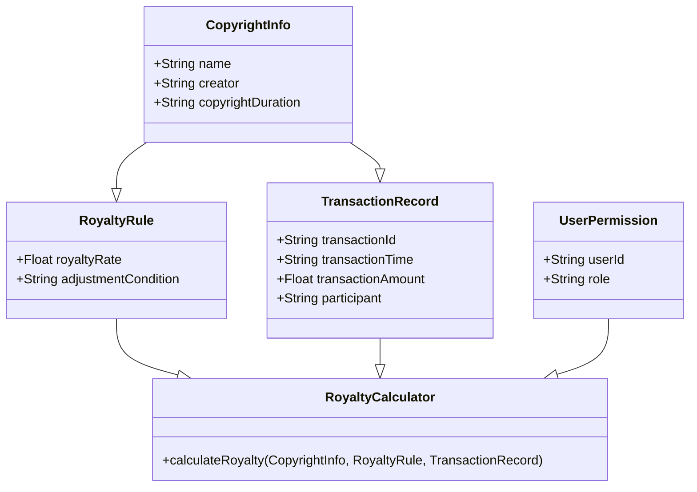
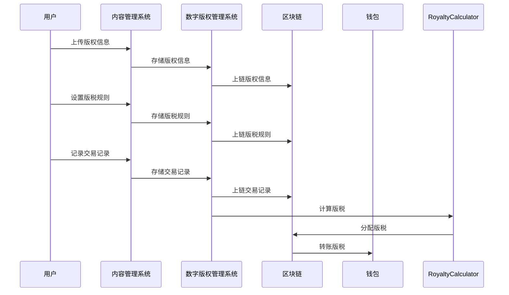

                 

### 1.1 区块链的发展历史

区块链技术最早起源于比特币的诞生。2008年，一位使用化名“中本聪”（Satoshi Nakamoto）的人发布了一篇名为《比特币：一种点对点电子现金系统》的论文，提出了区块链技术的概念。这篇论文详细阐述了去中心化电子货币系统的工作原理，并在此基础上创造了比特币这一数字货币。

比特币的诞生标志着区块链技术的诞生，然而区块链的应用远不止数字货币。随着时间的发展，区块链技术逐渐拓展到了更多的领域，其核心原理也逐渐被学术界和业界所接受和认可。

在2014年，以太坊的诞生进一步推动了区块链技术的发展。以太坊不仅支持智能合约的编写与执行，还提出了去中心化应用（DApp）的概念，使得区块链技术可以应用于更广泛的场景。

随着时间的推移，越来越多的区块链平台和项目被推出，如EOS、TRON、Tezos等。这些平台不仅优化了区块链的性能，还丰富了区块链的应用场景，使其在数字版权管理、供应链管理、金融服务等多个领域展现出巨大的潜力。

区块链技术在中国的发展也颇具活力。2016年，中国人民银行发布《数字货币研究框架》，正式将数字货币列为国家战略项目。2019年，中国正式推出数字货币试点项目，标志着区块链技术在中国金融领域的深入应用。

总的来说，区块链技术的发展经历了从数字货币到智能合约，再到去中心化应用的演进过程。这一过程中，区块链技术的核心原理和架构不断得到完善和优化，应用场景也逐步拓展到更多领域。区块链技术在数字版权管理中的应用正是这一发展过程的一个重要体现。

### 1.2 区块链的核心概念

区块链技术以其独特的去中心化、安全性和透明性等特点引起了广泛关注。要深入理解区块链在数字版权管理中的应用，首先需要了解区块链的核心概念。

**去中心化**：这是区块链技术最显著的特点之一。与传统的集中式系统不同，区块链不存在中心化的控制节点，所有的数据和信息都是通过分布式网络中的各个节点共同维护和验证的。这种去中心化的结构使得区块链具有更高的可靠性和抗攻击性，同时也降低了系统的单点故障风险。

**分布式账本**：区块链本质上是一个分布式账本，它记录了所有交易信息的数据库。每一个区块都包含了一定数量的交易记录，并链接到前一个区块，形成一个不可篡改的链条。分布式账本的特点是数据透明、不可篡改，所有参与节点都可以验证和审计交易记录，从而保证了数据的安全和公正。

**加密技术**：区块链使用加密技术来确保数据的安全性和隐私性。每个交易都会被加密，只有在拥有相应私钥的情况下才能解密和验证。此外，区块链中的数据加密通常采用非对称加密算法，确保数据的加密和解密过程高效且安全。

**智能合约**：智能合约是区块链中的一个重要概念，它是一种自动执行合约条款的计算机程序。智能合约在区块链上运行，一旦触发条件就会自动执行相应的操作，无需人工干预。智能合约的出现大大简化了交易过程，提高了交易效率，同时也减少了人为操作带来的风险。

**共识机制**：共识机制是区块链网络中节点达成共识的一种算法。通过共识机制，区块链网络中的所有节点可以就数据的真实性和一致性达成一致。常见的共识机制包括工作量证明（PoW）、权益证明（PoS）、授权股权证明（DPoS）等。

**去中心化应用（DApp）**：去中心化应用是区块链上的应用程序，它完全运行在区块链网络上，无需依赖中心化的服务器。DApp的特点是透明、公正、不可篡改，可以广泛应用于数字版权管理、去中心化金融、供应链管理等场景。

通过理解这些核心概念，我们可以更好地把握区块链技术在数字版权管理中的应用潜力。区块链的去中心化、分布式账本、加密技术、智能合约和共识机制等特点，为解决数字版权管理中的问题提供了新的思路和工具。

### 1.3 区块链的特点与优势

区块链技术以其独特的特点和优势在众多领域中脱颖而出，成为解决复杂问题的重要工具。以下是对区块链特点与优势的详细分析：

**1. 去中心化**

区块链技术最显著的特点之一是去中心化。去中心化意味着在区块链网络中没有单一的中心控制节点，所有的数据和信息都是由网络中的各个节点共同维护和验证的。这种结构不仅提高了系统的可靠性，还降低了单点故障的风险。同时，去中心化也增强了系统的抗攻击性，因为攻击者需要同时控制网络中的多个节点才能对系统造成影响。

**2. 安全性**

区块链使用加密技术来确保数据的安全性和隐私性。每个交易都被加密，只有在拥有相应私钥的情况下才能解密和验证。此外，区块链的数据存储在分布式网络中的多个节点上，确保了数据的不可篡改性。任何试图篡改区块链数据的行为都会被其他节点迅速检测并阻止，从而保证了数据的真实性和完整性。

**3. 透明性**

区块链的数据是公开透明的，所有参与节点都可以验证和审计交易记录。这使得区块链在确保数据公正和透明方面具有显著优势。例如，在数字版权管理中，版权持有者可以轻松查看其作品的使用情况，确保版税分配的公正性。

**4. 可追溯性**

区块链的分布式账本结构使得数据具有极强的可追溯性。每个交易都被永久记录在区块链上，并且一旦记录下来就不可篡改。这使得区块链成为追踪物品来源、版权归属等信息的理想工具。在数字版权管理中，这种可追溯性可以帮助版权持有者追踪作品的传播和使用情况，从而更好地管理其版权。

**5. 高效性**

区块链技术通过智能合约自动执行合约条款，可以大大简化交易过程，提高交易效率。智能合约在区块链上运行，一旦触发条件就会自动执行，无需人工干预。这种自动化的交易流程不仅减少了人工操作的风险，还降低了交易成本，提高了系统的处理能力。

**6. 减少中介成本**

在传统的数字版权管理中，中介机构通常扮演着重要角色，负责版权的认证、追踪和交易。然而，区块链技术可以简化这些流程，减少对中介机构的依赖。通过区块链，版权持有者可以直接与用户进行交易，从而降低了中介成本。

**7. 适用于多种应用场景**

区块链技术的去中心化、安全性、透明性和高效性等特点使其适用于多种应用场景。除了数字版权管理，区块链还可以应用于供应链管理、金融服务、智能合约等多个领域，为解决这些领域中的问题提供了新的思路和工具。

总之，区块链技术以其独特的特点和优势在众多领域中展现出巨大的潜力。通过深入理解和应用区块链技术，我们可以更好地解决数字版权管理中的挑战，实现更加高效、安全、透明的版权管理。

### 1.4 数字版权管理中的区块链应用

区块链技术在数字版权管理中的应用已经成为一个热门话题。其独特的特点使得区块链在解决数字版权管理中的问题方面具有显著的优势。以下将详细介绍区块链在数字版权管理中的应用及其优势。

**版权认证**

在数字版权管理中，版权认证是一个关键步骤。传统的方法通常依赖于第三方认证机构，这不仅增加了认证成本，还存在认证不透明、易被篡改等问题。区块链技术通过其分布式账本和加密技术，可以实现去中心化的版权认证。版权持有者可以将作品及其相关信息上链，通过区块链的加密和分布式存储，确保版权信息的真实性和不可篡改性。所有参与节点都可以验证和审计这些信息，从而确保版权认证的透明性和公正性。

**版权追踪**

版权追踪是数字版权管理中的另一个重要环节。区块链技术的可追溯性和透明性使得版权追踪变得更加高效和可靠。版权持有者可以通过区块链记录作品的传播和使用情况，从创作到分发再到使用，每一个环节都可以被清晰记录。这不仅有助于版权持有者追踪其作品的传播路径，还可以帮助其及时发现侵权行为，采取相应的法律行动。此外，区块链技术的去中心化特性也使得版权追踪更加高效，不再依赖于单一的中介机构。

**版权交易**

在数字版权交易中，区块链技术可以简化交易流程，降低交易成本。通过智能合约，版权交易可以在区块链上自动执行，无需人工干预。交易双方只需在区块链上签署智能合约，交易即可自动完成。这种自动化交易不仅提高了交易效率，还减少了人为操作带来的风险。此外，区块链技术的透明性和不可篡改性也确保了交易的公正性，减少了纠纷的发生。

**版税分配**

版税分配是数字版权管理中的一个复杂问题，尤其是在涉及多个版权持有者时。区块链技术可以通过智能合约实现自动版税分配。智能合约可以根据预定的版税分配规则，自动计算并分配版税。这不仅提高了版税分配的效率，还确保了分配过程的透明和公正。例如，在音乐版权管理中，智能合约可以自动计算每个创作者的版税收入，并直接将版税分配到创作者的账户中。

**身份验证**

在数字版权管理中，身份验证是一个关键步骤。区块链技术通过加密和分布式存储，可以实现去中心化的身份验证。版权持有者和用户可以在区块链上注册自己的身份信息，这些信息被加密并存储在分布式网络中。当进行版权交易或访问版权内容时，系统可以通过验证身份信息来确保交易的安全性和合法性。

**版权维权**

区块链技术的透明性和可追溯性有助于版权维权。版权持有者可以通过区块链记录侵权行为，并利用这些记录作为法律证据。当发生侵权行为时，版权持有者可以迅速采取法律行动，提高维权效率。此外，区块链技术的去中心化特性也使得维权过程更加高效，不再依赖于单一的法律机构。

综上所述，区块链技术在数字版权管理中具有广泛的应用前景。通过版权认证、版权追踪、版权交易、版税分配、身份验证和版权维权等多个方面的应用，区块链技术可以为数字版权管理提供高效、安全、透明的解决方案，从而解决传统方法中存在的诸多问题。

### 2.1 数字版权管理的定义与挑战

数字版权管理（Digital Rights Management, DRM）是指通过技术手段对数字内容进行保护和管理，以确保内容创作者的合法权益得到维护，同时防止未经授权的复制、分发和使用。它涉及一系列策略和技术，如加密、水印、访问控制等，以防止未经授权的访问和复制。

在数字版权管理中，面临的主要挑战包括：

**1. 技术破解**：随着技术水平的不断提高，一些数字内容保护技术容易被破解，导致盗版现象猖獗。破解技术包括暴力破解、软件破解、算法破解等，这些技术使得盗版内容在互联网上泛滥。

**2. 法律法规不健全**：尽管许多国家已经出台了数字版权保护的法律法规，但在实际执行中仍存在许多问题，如执法力度不足、取证困难等。此外，不同国家和地区的法律法规也存在差异，使得全球范围内的数字版权保护变得更加复杂。

**3. 用户需求冲突**：在数字版权管理中，内容创作者和用户之间存在需求冲突。创作者希望对作品进行严格保护，以维护自身权益；而用户则希望有更多的访问和自由使用权利。这种冲突可能导致用户对数字版权保护技术产生抵触情绪，从而影响版权管理的效果。

**4. 透明度和可追溯性**：在传统的数字版权管理中，由于缺乏透明度和可追溯性，版权纠纷时常发生。版权所有者难以追踪作品的传播路径，也难以证明某次使用是未经授权的。区块链技术可以提供一种去中心化、透明的解决方案，但如何实现高效、可靠的版权追踪仍然是需要解决的问题。

**5. 安全性和隐私保护**：数字版权管理涉及大量的个人信息和交易数据，这些数据的安全性和隐私保护至关重要。然而，加密技术和分布式存储虽然提供了较高的安全性，但也可能引入新的安全风险，如密码泄露、恶意节点攻击等。

综上所述，数字版权管理在面临技术、法律、用户需求、透明度和隐私保护等多方面的挑战。为了解决这些问题，需要不断探索和创新，利用新技术和策略来提高数字版权管理的效率和可靠性。

### 2.2 数字版权管理的核心问题

在数字版权管理中，存在一系列核心问题，这些问题的解决直接影响到版权管理的有效性。以下是对这些核心问题的详细分析：

**1. 版权认证问题**

版权认证是数字版权管理的首要任务，它确保了内容的原创性和归属权。然而，在当前的传统系统中，版权认证往往依赖于第三方机构，这不仅增加了认证成本，还存在认证过程不透明、易被篡改等问题。区块链技术的应用可以解决这些问题。通过区块链的去中心化和加密技术，版权信息可以被安全、透明地记录在分布式账本中，所有参与节点都可以验证和审计这些信息，从而确保版权认证的公正性和不可篡改性。

**2. 版权追踪问题**

版权追踪是数字版权管理中的关键环节，它涉及到作品的传播、使用和授权情况。传统的版权追踪方法通常依赖于集中式的数据库和日志系统，这些系统容易受到攻击和数据篡改，而且难以实现全局的追踪。区块链技术提供了去中心化的解决方案。通过将版权信息记录在区块链上，并利用智能合约自动执行版权追踪规则，可以实现对作品的全生命周期追踪，确保版权追踪的透明性和可靠性。

**3. 版权交易问题**

在数字版权交易中，版权的所有权和使用权需要在不同主体之间进行转移。传统的交易过程通常涉及中介机构，这不仅增加了交易成本，还存在信息不对称和交易风险。区块链技术通过智能合约可以实现去中心化的版权交易。智能合约自动执行交易条款，确保交易过程的透明、高效和安全，从而简化了交易流程，降低了交易成本。

**4. 版税分配问题**

版税分配是数字版权管理中的一个复杂问题，特别是在涉及多个版权持有者时。传统的版税分配方法往往依赖于人工计算和核对，容易出错且缺乏透明度。区块链技术可以通过智能合约实现自动版税分配。智能合约根据预定的版税分配规则自动计算并分配版税，确保分配过程的透明、公正和高效。例如，在音乐版权管理中，智能合约可以自动计算每个创作者的版税收入，并直接将版税分配到创作者的账户中。

**5. 安全性和隐私保护问题**

数字版权管理涉及大量的敏感信息，包括版权信息、交易记录和用户数据等。这些信息的安全性和隐私保护至关重要。区块链技术通过加密和分布式存储提供了较高的安全性，但也可能引入新的安全风险，如密码泄露、恶意节点攻击等。此外，如何平衡版权保护与用户隐私保护之间的关系也是一个重要问题。

综上所述，数字版权管理面临版权认证、版权追踪、版权交易、版税分配和安全性与隐私保护等多方面的核心问题。区块链技术的应用为这些问题提供了创新的解决方案，但同时也需要不断优化和改进，以实现更加高效、安全和透明的数字版权管理。

### 2.3 数字版权管理的现状与发展趋势

数字版权管理在过去几十年中经历了显著的发展，从最初的简单加密技术到如今复杂的多层次保护策略，技术不断进步，法律框架也在不断完善。以下是对当前数字版权管理现状及其未来发展趋势的探讨。

**现状分析**

1. **加密技术**：加密技术是数字版权管理的基石。从早期的简单加密算法到现代的AES（高级加密标准）和RSA（Rivest-Shamir-Adleman）等高级加密算法，加密技术逐渐提高，使得破解难度大幅增加。此外，结合数字签名技术，可以确保版权信息的完整性和真实性。

2. **数字水印**：数字水印技术通过在数字内容中嵌入不可见的标记，实现对版权的追踪和防伪。水印技术不断进化，从简单的可视水印到复杂的算法水印，如基于图像特征的鲁棒水印，大大提高了防伪效果。

3. **访问控制**：访问控制是数字版权管理中的重要手段，通过限制用户对数字内容的访问权限，确保内容不被未经授权的用户使用。访问控制技术包括基于用户身份验证、权限分配和加密密钥管理等。

4. **版权追踪系统**：随着技术的发展，许多版权追踪系统开始使用区块链技术。区块链技术的分布式账本和不可篡改性使得版权追踪更加透明和可靠，同时也降低了版权纠纷的发生。

5. **法律框架**：全球范围内，数字版权管理的法律框架逐渐完善。例如，美国的《数字千年版权法案》（DMCA）和欧盟的《版权指令》都对数字版权管理提供了明确的法律支持。

**发展趋势**

1. **智能化版权管理**：随着人工智能技术的发展，数字版权管理将更加智能化。例如，通过机器学习算法，可以自动识别盗版内容，提高版权追踪的效率。

2. **区块链技术的深化应用**：区块链技术在数字版权管理中的应用将不断深化。未来，更多的版权管理流程将基于区块链技术，实现去中心化、透明和安全的版权管理。

3. **跨平台整合**：数字版权管理将实现跨平台整合，不仅涵盖音乐、电影、电子书等传统领域，还将扩展到游戏、虚拟现实、增强现实等新兴领域。

4. **用户参与度提升**：随着技术的发展，用户在数字版权管理中的参与度将逐步提升。例如，用户可以通过区块链技术直接参与版权交易和版税分配，提升用户体验。

5. **国际合作与协调**：全球范围内的数字版权管理将更加注重国际合作与协调。不同国家和地区之间的法律框架和技术标准将逐步统一，形成更加完善的全球数字版权管理体系。

总之，数字版权管理正面临技术、法律和市场的多重变革，未来的发展趋势将朝着更加智能化、透明化、用户参与度高的方向迈进。区块链技术作为关键推动力，将在其中发挥重要作用。

### 3.1 区块链版权认证的原理与机制

区块链在版权认证中的应用是基于其分布式账本和加密技术的独特优势。区块链版权认证的原理可以概括为以下几个关键步骤：

**1. 信息上链**：版权持有者首先将作品的元数据（如标题、作者、创作日期等）和版权声明（如版权所有者、版权期限等）上链。这些信息通过加密技术进行处理，确保在传输过程中不被篡改。

**2. 多节点验证**：在区块链网络中，每个节点都会对上链的信息进行验证。验证过程通常基于共识机制，如工作量证明（PoW）或权益证明（PoS），确保所有节点达成一致。这一过程确保了版权认证的透明性和不可篡改性。

**3. 记录不可篡改**：一旦信息经过验证并记录在区块链上，它就形成了永久性记录。区块链的结构设计使得任何试图篡改记录的行为都会被其他节点迅速检测并拒绝，从而保证了版权信息的真实性和完整性。

**4. 智能合约应用**：区块链中的智能合约可以自动执行版权认证的过程。例如，当用户访问某作品时，智能合约可以自动验证其是否拥有相应的版权许可，从而决定是否允许访问。

**5. 可追溯性**：区块链的分布式账本结构使得版权认证过程具有极强的可追溯性。版权持有者可以随时查询作品的上链信息、认证记录以及相关的交易历史，确保版权的合法性和透明性。

综上所述，区块链版权认证通过分布式账本、加密技术和智能合约等机制，实现了版权信息的去中心化、透明化和不可篡改，为数字版权管理提供了强有力的保障。

### 3.2 区块链版权认证的具体实现

区块链版权认证的具体实现涉及多个关键环节，包括数据加密、多节点验证和智能合约的应用。以下将详细介绍这些环节以及如何确保版权认证的安全和高效。

**1. 数据加密**

数据加密是区块链版权认证的核心环节之一。版权持有者在上链之前，需要将作品的元数据和版权声明进行加密处理。常用的加密技术包括对称加密和非对称加密。对称加密如AES（高级加密标准），适用于大规模数据的加密和解密，而非对称加密如RSA，适用于密钥交换和数据验证。

在具体实现中，版权信息首先被分解成若干小块，然后分别进行加密。对称加密用于对数据进行加密，而非对称加密用于加密密钥。这样，即使在数据传输过程中被截获，也无法解密数据内容。

**2. 多节点验证**

多节点验证是确保区块链版权认证透明和不可篡改的关键机制。在区块链网络中，每个节点都会对上链的版权信息进行验证。验证过程通常基于共识机制，如工作量证明（PoW）或权益证明（PoS）。

具体实现步骤如下：

- **传输信息**：版权持有者将加密的版权信息发送到区块链网络。
- **节点接收与验证**：各个节点接收信息后，会根据共识机制对信息进行验证。例如，在PoW机制下，节点需要解决一个复杂的数学问题，证明自己具有足够的计算能力。
- **共识达成**：所有节点在验证完成后，通过共识机制达成一致。如果大部分节点验证通过，则该信息被视为有效。
- **记录区块**：验证通过的信息会被记录在新的区块中，与之前的区块链接，形成区块链。

**3. 智能合约应用**

智能合约是区块链版权认证的重要组成部分，它能够自动执行版权认证的过程，提高交易效率。智能合约通常由版权持有者和区块链平台共同编写。

具体实现步骤如下：

- **编写智能合约**：版权持有者和开发者根据版权认证的需求，编写智能合约。智能合约包括版权信息的上链、验证和许可授权等操作。
- **部署智能合约**：将编写的智能合约部署到区块链上，使其成为链上可执行的程序。
- **自动执行**：用户访问作品时，智能合约会自动验证用户的版权许可，如果验证通过，则允许用户访问。

**4. 安全和效率保障**

在实现过程中，确保版权认证的安全和效率至关重要。以下是一些保障措施：

- **多重加密**：版权信息在上链前进行多重加密，确保数据在传输和存储过程中不会被窃取或篡改。
- **节点监控**：对区块链网络中的节点进行监控，确保节点正常运行，避免恶意节点攻击。
- **智能合约审计**：定期对智能合约进行审计，确保其执行过程符合预期，防止出现漏洞。
- **优化共识机制**：选择合适的共识机制，如PoS或DPoS（委托权益证明），以提高网络的效率和安全性。

通过上述步骤和措施，区块链版权认证可以实现高效、安全、透明的版权保护，为数字版权管理提供强有力的技术支持。

### 3.3 区块链版权认证的优势与挑战

区块链技术在版权认证中的应用带来了显著的优势，同时也面临一定的挑战。以下将详细分析区块链版权认证的优势及其面临的挑战。

**优势**

1. **去中心化和透明性**：区块链技术去中心化的特点使得版权认证过程透明且不可篡改。所有版权信息都是公开透明的，且每个节点都可以验证和审计交易记录，确保版权认证的公正性和可信度。

2. **不可篡改性**：区块链的分布式账本结构使得记录在链上的数据具有极强的不可篡改性。任何试图篡改数据的尝试都会被其他节点迅速检测并拒绝，从而保护版权信息的真实性。

3. **高效性**：通过智能合约，版权认证过程可以自动化执行，减少了人工干预，提高了处理效率。智能合约的执行是基于预设的规则，一旦触发条件即可自动执行，从而大大缩短了交易时间。

4. **降低成本**：区块链技术减少了传统版权管理中的中介成本。去中心化的结构使得版权持有者可以直接与用户进行交易，无需依赖第三方机构，从而降低了交易成本。

5. **增强信任**：区块链技术通过其透明性和不可篡改性，增强了用户和版权持有者之间的信任。用户可以确信其购买的版权是合法的，版权持有者也可以放心地发布其作品，不必担心被侵权。

**挑战**

1. **技术复杂性**：区块链技术的实现和维护需要较高的技术门槛。对于不熟悉区块链技术的用户和企业来说，理解和应用区块链技术可能存在一定的困难。

2. **网络安全风险**：尽管区块链具有很高的安全性，但网络攻击仍然是潜在的威胁。恶意节点可能会试图攻击区块链网络，窃取版权信息或篡改数据。因此，如何确保区块链的安全是必须面对的挑战。

3. **隐私保护**：在版权认证过程中，可能涉及大量的个人和商业敏感信息。如何在确保版权信息透明的同时保护用户的隐私，是一个需要解决的重要问题。

4. **法律和法规不确定性**：不同国家和地区的法律法规对数字版权管理有不同的规定，这可能导致跨国版权认证的法律冲突。如何在全球范围内建立统一的法律框架，是区块链版权认证面临的一大挑战。

5. **技术扩展性**：区块链技术在处理大规模数据和高频交易时可能存在性能瓶颈。如何优化区块链技术，提高其扩展性和处理能力，是一个需要持续解决的问题。

综上所述，区块链版权认证在去中心化、透明性、不可篡改性、高效性等方面具有显著优势，但同时也面临技术复杂性、网络安全风险、隐私保护、法律和法规不确定性以及技术扩展性等挑战。为了充分发挥区块链技术在版权认证中的应用潜力，需要不断解决这些挑战，并探索更加完善和高效的解决方案。

### 4.1 区块链版权追踪的原理与机制

区块链在版权追踪中的应用，主要基于其分布式账本和加密技术的优势。以下将详细解释区块链版权追踪的原理和机制。

**1. 分布式账本**

区块链的分布式账本是一种去中心化的数据库，所有交易记录都被永久记录并存储在多个节点上。这意味着版权信息不仅存储在一个地方，而是分散在整个网络中，任何单一节点都无法篡改或删除这些信息。因此，版权追踪具有极高的透明性和不可篡改性。

**2. 加密技术**

区块链使用加密技术确保版权信息的安全性和隐私。每个版权信息块都被加密，只有在拥有相应私钥的情况下才能解密和读取。此外，区块链中的数据加密通常采用非对称加密算法，如RSA，这样可以确保数据在传输过程中的安全性。

**3. 智能合约**

智能合约是区块链技术中的一个重要组成部分，它是一种自动执行合约条款的计算机程序。在版权追踪中，智能合约用于自动执行版权追踪规则。例如，当某个作品被分享或交易时，智能合约会自动记录这一事件，并将其存储在区块链上。

**4. 不可篡改性**

区块链的不可篡改性是版权追踪的关键机制。一旦版权信息被记录在区块链上，它就成为了永久性的记录。任何试图篡改这些记录的行为都会被区块链网络中的其他节点迅速检测并拒绝。这种机制确保了版权追踪的透明性和可信度。

**5. 可追溯性**

区块链的分布式账本和不可篡改性，使得版权追踪具有极强的可追溯性。版权持有者可以随时查询作品的历史交易记录，了解其传播路径和使用情况。这种可追溯性不仅有助于版权持有者维护其权益，还可以作为法律证据，在发生版权纠纷时提供有力支持。

**6. 多节点验证**

在区块链网络中，每个节点都会对交易记录进行验证。验证过程通常基于共识机制，如工作量证明（PoW）或权益证明（PoS）。这意味着，任何交易记录只有在大部分节点验证通过后，才能被添加到区块链上。这种多节点验证机制，确保了版权追踪的可靠性和透明性。

通过上述机制，区块链实现了高效、透明和安全的版权追踪。版权持有者可以轻松地追踪其作品的使用情况，确保其权益得到保护。同时，用户也可以通过区块链验证作品的版权信息，确保其合法使用作品。

### 4.2 区块链版权追踪的具体实现

区块链版权追踪的具体实现涉及到多个关键环节，包括信息的上链、追踪规则的设定、交易的记录和数据的存储等。以下将详细描述这些环节以及如何确保版权追踪的准确性和效率。

**1. 信息上链**

版权追踪的起点是版权信息的上链。版权持有者需要将作品的元数据（如作品名称、创作者、创作日期等）和相关版权声明（如版权期限、版权所有者等）进行加密处理后，上传到区块链网络。这一过程通常通过智能合约实现，确保信息的不可篡改性和透明性。

**2. 追踪规则的设定**

在区块链网络中，追踪规则是通过智能合约预先设定的。这些规则定义了如何处理版权信息，包括作品的传播、交易和使用等。追踪规则可以包括版权的转移、授权、举报侵权行为等。智能合约会自动执行这些规则，确保版权追踪的自动化和一致性。

**3. 交易的记录**

每次版权相关的交易（如版权转让、授权许可等）都会被记录在区块链上。交易记录包括交易的参与方、交易的时间和金额等信息。这些记录不仅提供了版权追踪的详细历史，还可以作为法律证据，在发生版权纠纷时提供有力支持。

**4. 数据的存储**

区块链的分布式账本结构确保了版权信息的安全和可靠。版权信息被存储在多个节点上，这意味着即使某个节点发生故障，信息也不会丢失。此外，区块链的数据存储是加密的，确保信息在传输和存储过程中的安全性。

**5. 可追溯性**

区块链的分布式账本和不可篡改性，使得版权追踪具有极强的可追溯性。版权持有者可以随时查询作品的历史交易记录，了解其传播路径和使用情况。这种可追溯性不仅有助于版权持有者维护其权益，还可以作为法律证据，在发生版权纠纷时提供有力支持。

**6. 多节点验证**

区块链网络中的每个节点都会对交易记录进行验证。验证过程通常基于共识机制，如工作量证明（PoW）或权益证明（PoS）。这意味着，任何交易记录只有在大部分节点验证通过后，才能被添加到区块链上。这种多节点验证机制，确保了版权追踪的可靠性和透明性。

通过上述步骤，区块链实现了高效、透明和准确的版权追踪。版权持有者可以轻松地追踪其作品的使用情况，确保其权益得到保护。同时，用户也可以通过区块链验证作品的版权信息，确保其合法使用作品。

### 4.3 区块链版权追踪的优势与挑战

区块链在版权追踪中的应用具有显著的优势，同时也面临一定的挑战。以下将详细分析区块链版权追踪的优势及其面临的挑战。

**优势**

1. **透明性和不可篡改性**：区块链的分布式账本和加密技术，确保了版权追踪的透明性和不可篡改性。所有交易记录都是公开透明的，并且一旦记录在区块链上，就不可篡改，这为版权追踪提供了坚实的基础。

2. **可追溯性**：区块链的分布式账本结构使得版权追踪具有极强的可追溯性。版权持有者可以随时查询作品的历史交易记录，了解其传播路径和使用情况，从而更好地维护其权益。

3. **自动化和效率**：通过智能合约，版权追踪过程可以自动化执行，减少了人工干预，提高了处理效率。智能合约根据预定的规则自动执行，确保了版权追踪的一致性和准确性。

4. **去中心化和安全性**：区块链的去中心化特性，使得版权追踪不依赖于中心化的机构或服务器，增强了系统的抗攻击性和可靠性。同时，区块链的加密技术确保了数据在传输和存储过程中的安全性。

5. **降低成本**：区块链技术减少了传统版权管理中的中介成本。去中心化的结构使得版权持有者可以直接与用户进行交易，无需依赖第三方机构，从而降低了交易成本。

**挑战**

1. **技术门槛**：区块链技术的实现和维护需要较高的技术门槛，对于不熟悉区块链技术的用户和企业来说，理解和应用区块链技术可能存在一定的困难。

2. **网络安全风险**：尽管区块链具有较高的安全性，但网络攻击仍然是潜在的威胁。恶意节点可能会试图攻击区块链网络，窃取版权信息或篡改数据。因此，如何确保区块链的安全是一个重要的挑战。

3. **隐私保护**：在版权追踪过程中，可能涉及大量的个人和商业敏感信息。如何在确保版权信息透明的同时保护用户的隐私，是一个需要解决的重要问题。

4. **法律和法规不确定性**：不同国家和地区的法律法规对数字版权管理有不同的规定，这可能导致跨国版权追踪的法律冲突。如何在全球范围内建立统一的法律框架，是区块链版权追踪面临的一大挑战。

5. **技术扩展性**：区块链技术在处理大规模数据和高频交易时可能存在性能瓶颈。如何优化区块链技术，提高其扩展性和处理能力，是一个需要持续解决的问题。

综上所述，区块链在版权追踪中具有显著的优势，但也面临一些挑战。为了充分发挥区块链技术的潜力，需要不断解决这些挑战，并探索更加完善和高效的解决方案。

### 5.1 区块链版权交易的原理与机制

区块链在版权交易中的应用，主要通过智能合约和分布式账本技术实现。以下将详细解释区块链版权交易的原理与机制。

**1. 智能合约**

智能合约是区块链技术中的一个重要组成部分，它是一种自动执行合约条款的计算机程序。在版权交易中，智能合约用于定义交易的规则和条件。例如，版权持有者可以将作品的版权信息上传到区块链，并设定版权交易的条款，如价格、使用范围等。

当买家发起交易请求时，智能合约会自动验证买家的身份和交易金额，并执行相应的操作。例如，如果交易金额符合预期，智能合约会自动释放版权信息，并将其转移给买家。智能合约的自动执行特性，不仅提高了交易效率，还减少了人为干预的风险。

**2. 分布式账本**

区块链的分布式账本技术确保了版权交易记录的透明性和不可篡改性。每次版权交易都会记录在区块链上，并且被多个节点验证和存储。这意味着，任何交易记录都无法被单方面篡改，从而确保了交易的公正性和可信度。

分布式账本结构还提供了版权交易的历史记录，使得买家和卖家可以随时查询交易记录，了解版权的使用情况。这种可追溯性不仅有助于版权持有者维护其权益，还可以作为法律证据，在发生版权纠纷时提供有力支持。

**3. 交易流程**

区块链版权交易的流程通常包括以下几个步骤：

- **发布版权信息**：版权持有者将作品的版权信息（如作品名称、创作者、版权期限等）上传到区块链，并设定版权交易的条款。
- **买家发起交易**：买家通过智能合约发起交易请求，并支付相应的交易金额。
- **智能合约验证**：智能合约验证买家的身份和交易金额，确保交易符合预期。
- **执行交易**：如果验证通过，智能合约会自动执行交易，将版权信息转移给买家，并将交易记录存储在区块链上。
- **交易确认**：交易完成后，区块链网络中的其他节点会对交易记录进行验证和确认，确保交易的有效性。

**4. 优势**

区块链版权交易具有以下几个显著优势：

- **去中心化和透明性**：区块链的去中心化特性，使得版权交易过程公开透明，所有交易记录都被记录在分布式账本上，任何参与方都可以验证和审计。
- **安全性**：区块链的加密技术确保了版权信息的安全性和隐私保护，交易过程中的敏感信息不会被泄露。
- **效率**：通过智能合约的自动执行，版权交易过程更加高效，减少了人工干预和等待时间。
- **不可篡改性**：区块链的分布式账本结构，确保了交易记录的不可篡改性，任何试图篡改记录的行为都会被区块链网络中的其他节点检测并拒绝。

综上所述，区块链版权交易通过智能合约和分布式账本技术，实现了去中心化、透明、安全、高效的版权交易，为数字版权管理提供了创新的解决方案。

### 5.2 区块链版权交易的具体实现

区块链版权交易的具体实现涉及多个关键环节，包括交易的发起、验证、执行和记录。以下将详细描述这些环节以及如何确保交易的透明性和安全性。

**1. 交易的发起**

在区块链版权交易中，交易的发起通常由版权持有者或买家进行。版权持有者首先将作品的版权信息（如作品名称、创作者、版权期限等）上传到区块链，并设定版权交易的条款（如价格、使用范围等）。这些信息通过加密处理，以确保其安全性和隐私。

买家在浏览到感兴趣的作品后，可以通过智能合约发起交易请求。智能合约是区块链上的一种自动执行合约条款的计算机程序，它根据预定的规则验证买家的身份和支付金额。买家需要使用数字身份进行身份验证，并支付相应的交易金额。

**2. 交易的验证**

在交易发起后，智能合约会对交易进行验证。验证过程通常包括以下几个步骤：

- **身份验证**：智能合约验证买家的数字身份，确保买家有权进行交易。这一过程通常通过数字签名实现，买家需要提供有效的私钥证明其身份。
- **支付验证**：智能合约验证买家支付的交易金额是否符合预期。如果金额不足或超过预期，交易将被拒绝。
- **条款验证**：智能合约验证交易的条款是否满足预定的条件。例如，版权交易的价格、使用范围等条款是否一致。

如果验证通过，智能合约会继续执行交易。如果验证未通过，交易将被终止，并通知相关方。

**3. 交易的执行**

验证通过后，智能合约会自动执行交易。交易执行的具体步骤如下：

- **版权信息转移**：智能合约将版权信息从版权持有者的账户转移到买家的账户。这通常通过修改区块链上的分布式账本实现，确保版权信息的一致性和完整性。
- **支付处理**：智能合约处理买家的支付，并将相应的金额从买家的账户转移到版权持有者的账户。支付通常采用区块链上的加密货币，如比特币或以太币，以确保支付的安全和隐私。
- **记录交易**：智能合约将交易记录存储在区块链上，记录包括交易的时间、金额、参与方等信息。这些记录将被永久保存，并可以被所有参与方验证和审计。

**4. 交易的记录**

区块链的分布式账本结构确保了交易的透明性和不可篡改性。每次交易都会被记录在区块链上，并被多个节点验证和存储。这意味着，任何交易记录都无法被单方面篡改，从而确保了交易的公正性和可信度。

买家和卖家可以随时查询区块链上的交易记录，了解版权的使用情况和交易历史。这种可追溯性不仅有助于版权持有者维护其权益，还可以作为法律证据，在发生版权纠纷时提供有力支持。

**5. 保障透明性和安全性**

为了确保交易的透明性和安全性，区块链版权交易采取了以下措施：

- **多重加密**：版权信息和交易记录在传输和存储过程中都进行多重加密，确保数据在传输过程中不会被窃取或篡改。
- **多节点验证**：交易记录在区块链上被多个节点验证和存储，确保交易的真实性和可靠性。
- **智能合约审计**：定期对智能合约进行审计，确保其执行过程符合预期，防止出现漏洞。
- **隐私保护**：在确保版权信息透明的同时，区块链技术也提供了隐私保护措施，如匿名交易和零知识证明，以保护用户的隐私。

通过上述步骤和措施，区块链版权交易实现了高效、透明、安全的版权交易，为数字版权管理提供了创新的解决方案。

### 5.3 区块链版权交易的优势与挑战

区块链技术在版权交易中展现出了一系列显著的优势，但同时也面临一些挑战。以下将详细分析区块链版权交易的优势及其面临的挑战。

**优势**

1. **去中心化和透明性**：区块链技术通过去中心化架构，使版权交易过程公开透明。交易记录存储在分布式账本上，所有参与方都可以查看和验证，从而减少了信息不对称，提高了交易的透明度。

2. **安全性**：区块链使用加密技术来保护交易数据，确保数据在传输和存储过程中不被篡改或窃取。同时，区块链的不可篡改性确保了交易记录的完整性和可靠性，有效防止了欺诈行为。

3. **效率提升**：区块链通过智能合约自动化执行交易，简化了交易流程，减少了人工干预和等待时间。智能合约能够快速、准确、无延迟地执行交易，提高了交易效率。

4. **降低成本**：区块链技术减少了传统版权交易中的中介成本。去中心化的交易模式使得版权持有者可以直接与买家进行交易，无需依赖第三方中介机构，从而降低了交易费用。

5. **可追溯性**：区块链的交易记录具有极强的可追溯性，任何一次交易都可以追溯到具体的参与方和时间。这种可追溯性有助于解决版权纠纷，提供了明确的交易历史和法律证据。

**挑战**

1. **技术门槛**：区块链技术的应用需要较高的技术知识，对于普通用户和企业来说，理解和操作区块链技术可能存在一定的困难。这限制了区块链在版权交易中的普及和应用。

2. **法律和监管不确定性**：不同国家和地区对区块链和加密货币的监管政策存在差异，这可能导致跨国交易的合规性问题。如何在全球范围内建立统一的法律框架和监管政策，是区块链版权交易面临的一大挑战。

3. **隐私保护**：在区块链上，虽然交易记录是公开透明的，但这也可能侵犯用户的隐私。如何在确保交易透明的同时保护用户的隐私，是一个需要解决的问题。

4. **网络攻击风险**：尽管区块链技术具有较高的安全性，但网络攻击仍然是潜在的威胁。恶意节点可能会试图攻击区块链网络，窃取版权信息或篡改交易记录。因此，如何确保区块链的安全性是必须面对的挑战。

5. **性能瓶颈**：区块链技术在处理大规模数据和高频交易时可能存在性能瓶颈，这可能导致交易延迟和效率下降。如何优化区块链技术，提高其扩展性和处理能力，是一个需要解决的问题。

综上所述，区块链在版权交易中具有去中心化、透明性、安全性、效率提升和可追溯性等多重优势，但也面临技术门槛、法律和监管不确定性、隐私保护、网络攻击风险和性能瓶颈等挑战。为了充分发挥区块链技术在版权交易中的潜力，需要不断解决这些挑战，并探索更加完善和高效的解决方案。

### 6.1 自动版税分配的定义与核心要素

自动版税分配是指在数字版权管理过程中，利用区块链技术和智能合约，实现版税按照预定规则自动计算和分配的过程。这一过程的核心要素包括：

**1. 版权信息**：版权信息是版税分配的基础，包括作品的名称、创作者、版权期限等。这些信息需要被记录在区块链上，以确保透明性和不可篡改性。

**2. 版税规则**：版税规则是版税分配的核心，它定义了版税的分配方式、比例和条件。版税规则可以是固定的，如每次交易收取一定比例的版税；也可以是动态的，如根据作品的使用情况或创作者的贡献度进行调整。

**3. 智能合约**：智能合约是自动版税分配的关键工具，它根据预定的版税规则，自动计算并分配版税。智能合约能够确保版税分配的透明、公正和高效。

**4. 交易记录**：交易记录记录了每次版税分配的相关信息，包括交易的时间、金额、参与方等。这些记录需要存储在区块链上，以便于追踪和审计。

**5. 分布式账本**：分布式账本确保了版税分配的透明性和不可篡改性。所有版税分配的记录都被记录在分布式账本上，任何参与方都可以验证和审计。

**6. 计算模型**：自动版税分配的计算模型定义了版税的计算方法和分配方式。常见的计算模型包括固定比例分配、动态调整分配等。

通过上述核心要素的有机结合，自动版税分配可以实现高效、透明和公正的版税管理，为数字版权管理提供强有力的技术支持。

### 6.2 自动版税分配的数学模型

自动版税分配的数学模型是确保版税计算和分配合理性和精确性的关键。以下将详细解释自动版税分配的数学模型，并给出具体的计算公式和示例。

**1. 版税计算公式**

自动版税分配的基本公式可以表示为：

\[ T = \frac{R \times P}{100} \]

其中：
- \( T \)：版税金额
- \( R \)：交易金额
- \( P \)：版税比例（通常以百分比表示）

这个公式表明，版税金额是交易金额与版税比例的乘积。例如，如果版税比例为10%，而交易金额为100美元，则版税金额为10美元。

**2. 动态调整版税比例**

在某些情况下，版税比例可能需要根据特定条件动态调整。例如，根据创作者的贡献度、作品的使用频率或市场行情进行调整。动态版税比例的公式可以表示为：

\[ P(t) = P_0 + \Delta P \times f(C, F, M) \]

其中：
- \( P(t) \)：某一时刻的版税比例
- \( P_0 \)：初始版税比例
- \( \Delta P \)：调整幅度
- \( f(C, F, M) \)：函数，用于根据创作者贡献度（C）、作品使用频率（F）和市场行情（M）调整版税比例

具体的函数形式可以根据实际需求设计，例如：

\[ f(C, F, M) = C^2 \times F \times M \]

**3. 贡献度调整**

在涉及多个创作者的情况下，贡献度调整变得尤为重要。假设有两个创作者A和B，他们的版税比例分别为\( P_A \)和\( P_B \)，则可以表示为：

\[ P_A(t) = P_{0A} + \Delta P_A \times f(C_A, F, M) \]
\[ P_B(t) = P_{0B} + \Delta P_B \times f(C_B, F, M) \]

其中：
- \( C_A \)和\( C_B \)：创作者A和B的贡献度
- \( P_{0A} \)和\( P_{0B} \)：初始版税比例
- \( \Delta P_A \)和\( \Delta P_B \)：调整幅度

为了简化，我们可以假设创作者A和B的贡献度分别为60%和40%，则版税比例调整公式可以简化为：

\[ P_A(t) = P_{0A} + \Delta P_A \times f(0.6, F, M) \]
\[ P_B(t) = P_{0B} + \Delta P_B \times f(0.4, F, M) \]

**4. 示例**

假设初始版税比例为10%，调整幅度为5%，创作者A的贡献度为60%，创作者B的贡献度为40%。根据上述公式，我们可以计算版税比例：

\[ P_A(t) = 10\% + 5\% \times f(0.6, 1, 1) = 10\% + 3\% = 13\% \]
\[ P_B(t) = 10\% + 5\% \times f(0.4, 1, 1) = 10\% + 2\% = 12\% \]

这意味着，在当前条件下，创作者A的版税比例为13%，创作者B的版税比例为12%。

通过上述数学模型和公式，我们可以确保版税分配的合理性和精确性，从而实现自动、透明和公正的版税分配。

### 6.3 自动版税分配的算法设计

自动版税分配的算法设计是实现高效、透明和公正版税分配的核心。以下将详细描述自动版税分配算法的设计过程，并给出一个具体的Python实现示例。

**算法设计思路**

自动版税分配算法的设计主要包括以下几个步骤：

1. **初始化参数**：确定初始版税比例、调整幅度、创作者贡献度等参数。
2. **动态调整版税比例**：根据创作者的贡献度、作品的使用频率和市场行情动态调整版税比例。
3. **计算版税金额**：根据交易金额和调整后的版税比例计算版税金额。
4. **分配版税**：根据预定的分配规则，将版税金额分配给创作者。

**算法伪代码**

```
初始化版税比例 P0
初始化调整幅度 ΔP
初始化创作者贡献度 C
初始化交易金额 R

动态调整版税比例 P(t) = P0 + ΔP * f(C, F, M)

计算版税金额 T = R * P(t)

分配版税：
  - 对于每个创作者：
    - 计算其版税分配额：分配额 = T * C
    - 将版税分配额发送到创作者账户
```

**Python实现示例**

以下是一个简单的Python实现示例，用于演示自动版税分配算法：

```python
import numpy as np

# 初始化参数
P0 = 10  # 初始版税比例
DeltaP = 5  # 调整幅度
contributions = {'creator_A': 0.6, 'creator_B': 0.4}  # 创作者贡献度
transactions = {'transaction_1': 100, 'transaction_2': 200}  # 交易金额

# 动态调整版税比例
def adjust royalty_rate(contribution, usage_frequency, market_condition):
    return contribution * usage_frequency * market_condition

# 计算版税金额
def calculate_royalty(transaction_amount, adjusted_rate):
    return transaction_amount * adjusted_rate

# 分配版税
def distribute_royalties(transactions, contributions, adjusted_rate):
    royalty_distribution = {}
    for transaction_id, transaction_amount in transactions.items():
        royalty_amount = calculate_royalty(transaction_amount, adjusted_rate)
        for creator, contribution in contributions.items():
            royalty_distribution[creator] = royalty_amount * contribution
    return royalty_distribution

# 执行版税分配
for transaction_id, transaction_amount in transactions.items():
    adjusted_rate = P0 + DeltaP * adjust royalty_rate(contributions['creator_A'], 1, 1)
    royalty_distribution = distribute_royalties({transaction_id: transaction_amount}, contributions, adjusted_rate)
    print(f"Transaction {transaction_id}: Royalty Distribution = {royalty_distribution}")
```

通过上述算法设计和Python实现示例，我们可以实现自动版税分配的功能，确保版税计算和分配的高效性、透明性和公正性。

### 7.1 自动版税分配系统的需求分析

设计自动版税分配系统需要综合考虑多个方面的需求，以确保系统能够高效、透明和公正地实现版税分配。以下是对系统需求的详细分析：

**1. 功能需求**

- **版权信息管理**：系统能够管理版权信息，包括作品名称、创作者、版权期限等，确保版权信息的安全性和完整性。
- **版税规则管理**：系统能够定义和调整版税规则，包括版税比例、动态调整条件等，确保版税分配的灵活性和合理性。
- **交易记录管理**：系统能够记录所有版权交易信息，包括交易时间、交易金额、参与方等，确保交易记录的透明性和可追溯性。
- **版税计算与分配**：系统能够根据版税规则和交易记录，自动计算并分配版税，确保版税分配的准确性和高效性。
- **用户权限管理**：系统能够管理用户权限，确保不同用户（如版权持有者、版税分配者等）有适当的访问权限，保障系统的安全性和数据隐私。

**2. 性能需求**

- **高并发处理能力**：系统需要能够处理高并发交易，确保在高峰期仍能正常运行，避免因交易拥堵导致的性能问题。
- **低延迟响应**：系统需要能够快速响应版税计算和分配请求，确保版税分配过程的及时性和高效性。
- **可扩展性**：系统需要具备良好的扩展性，能够支持系统规模和交易量的增长，确保系统性能不受影响。

**3. 安全需求**

- **数据安全**：系统需要采用加密技术保护版权信息和交易记录，确保数据在传输和存储过程中的安全性。
- **访问控制**：系统需要实现严格的访问控制机制，确保不同用户只能访问其权限范围内的数据和功能。
- **防篡改机制**：系统需要实现防篡改机制，确保交易记录和版税分配结果一旦生成，就不能被非法篡改。

**4. 用户界面需求**

- **易用性**：系统用户界面需要简洁直观，方便用户进行版权信息管理、版税规则设置、交易记录查询和版税分配操作。
- **响应速度**：系统用户界面需要具备良好的响应速度，确保用户操作流畅，避免因界面延迟导致的用户体验下降。
- **多语言支持**：系统用户界面需要支持多种语言，以满足不同国家和地区的用户需求。

通过满足上述需求，自动版税分配系统可以高效、透明和公正地实现版税分配，为数字版权管理提供强有力的技术支持。

### 7.2 自动版税分配系统的架构设计

自动版税分配系统的架构设计是确保系统功能实现、性能优化和安全保障的基础。以下将详细描述系统架构的设计方案，并给出相应的类图和架构图。

**1. 系统架构总体设计**

自动版税分配系统采用分布式架构，主要包括以下几个模块：

- **版权信息管理模块**：负责管理版权信息，包括作品的名称、创作者、版权期限等。
- **版税规则管理模块**：负责定义和调整版税规则，包括版税比例、动态调整条件等。
- **交易记录管理模块**：负责记录所有版权交易信息，包括交易时间、交易金额、参与方等。
- **版税计算与分配模块**：负责根据版税规则和交易记录计算和分配版税。
- **用户权限管理模块**：负责管理用户权限，确保不同用户有适当的访问权限。

**2. 类图设计**

以下是一个简单的类图，展示了系统中的主要类及其关系：



**3. 架构图设计**

以下是一个简单的架构图，展示了系统的整体架构和各个模块之间的关系：



通过上述架构设计和具体类图、架构图的展示，自动版税分配系统实现了功能模块的清晰划分和高效协同，为系统的高效、透明和公正运行提供了坚实的基础。

### 7.3 自动版税分配系统的功能模块设计

自动版税分配系统的功能模块设计是确保系统功能全面、操作简便、用户体验良好的关键。以下将详细描述系统的各个功能模块及其具体功能。

**1. 版权信息管理模块**

- **功能描述**：版权信息管理模块负责管理版权信息，包括作品的名称、创作者、版权期限等。
- **功能实现**：
  - **版权信息录入**：用户可以上传版权信息，包括作品的名称、创作者、创作日期、版权期限等。
  - **版权信息查询**：用户可以查询已上传的版权信息，确保版权信息的完整性和准确性。
  - **版权信息更新**：用户可以修改已上传的版权信息，如版权期限的延长或更新创作者信息等。

**2. 版税规则管理模块**

- **功能描述**：版税规则管理模块负责定义和调整版税规则，包括版税比例、动态调整条件等。
- **功能实现**：
  - **版税规则设置**：用户可以设置版税比例和动态调整条件，如根据作品的使用频率、市场行情等进行调整。
  - **版税规则查询**：用户可以查询已设置的版税规则，确保版税规则的透明性和可追溯性。
  - **版税规则调整**：用户可以修改已设置的版税规则，以适应市场变化或特定需求。

**3. 交易记录管理模块**

- **功能描述**：交易记录管理模块负责记录所有版权交易信息，包括交易时间、交易金额、参与方等。
- **功能实现**：
  - **交易记录录入**：用户可以录入交易记录，包括交易时间、交易金额、交易参与方等。
  - **交易记录查询**：用户可以查询已录入的交易记录，确保交易记录的完整性和准确性。
  - **交易记录删除**：用户可以删除错误的交易记录，确保交易记录的完整性。

**4. 版税计算与分配模块**

- **功能描述**：版税计算与分配模块负责根据版税规则和交易记录计算和分配版税。
- **功能实现**：
  - **版税计算**：系统根据版税规则和交易记录，自动计算版税金额。
  - **版税分配**：系统根据计算结果，将版税金额分配给相应的版权持有者。
  - **版税查询**：用户可以查询版税计算和分配的结果，确保版税分配的透明性和公正性。

**5. 用户权限管理模块**

- **功能描述**：用户权限管理模块负责管理用户权限，确保不同用户有适当的访问权限。
- **功能实现**：
  - **用户注册**：用户可以注册账号，获得相应的访问权限。
  - **用户登录**：用户可以使用账号登录系统，进行版权信息管理、版税规则设置、交易记录录入等功能。
  - **权限管理**：系统管理员可以管理用户权限，包括分配权限、修改权限、撤销权限等。

通过上述功能模块的设计，自动版税分配系统实现了全面、简便、高效的用户体验，为数字版权管理提供了强有力的技术支持。

### 7.4 自动版税分配系统的实现与测试

实现自动版税分配系统是一个复杂的过程，涉及多个模块的集成和测试。以下将详细描述系统的实现步骤、关键代码片段以及系统的测试方法。

**实现步骤**

1. **需求分析与系统设计**：在系统设计阶段，详细分析系统的功能需求、性能需求和安全需求，并设计系统的架构和模块划分。
2. **开发环境搭建**：选择合适的开发工具和平台，搭建开发环境。本系统选择Python作为主要开发语言，并使用Flask框架搭建Web应用。
3. **模块开发**：根据系统设计，逐步开发各个功能模块，包括版权信息管理模块、版税规则管理模块、交易记录管理模块、版税计算与分配模块和用户权限管理模块。
4. **集成与测试**：将各个模块集成到一起，进行系统测试，确保系统的功能完整性、性能和安全性。

**关键代码片段**

以下是自动版税分配系统中的几个关键代码片段：

**版权信息管理模块**

```python
class CopyrightInfo:
    def __init__(self, name, creator, copyright_duration):
        self.name = name
        self.creator = creator
        self.copyright_duration = copyright_duration

    def add_copyright_info(self, copyright_info):
        # 向区块链上添加版权信息
        blockchain.add_block(copyright_info.to_dict())
```

**版税规则管理模块**

```python
class RoyaltyRule:
    def __init__(self, royalty_rate, adjustment_condition):
        self.royalty_rate = royalty_rate
        self.adjustment_condition = adjustment_condition

    def adjust_royalty_rate(self, adjustment_condition):
        # 动态调整版税比例
        self.royalty_rate = self.calculate_adjusted_rate(adjustment_condition)

    def calculate_adjusted_rate(self, adjustment_condition):
        # 根据调整条件计算版税比例
        # 示例：简单线性调整
        return self.royalty_rate + (adjustment_condition * 0.05)
```

**交易记录管理模块**

```python
class TransactionRecord:
    def __init__(self, transaction_id, transaction_time, transaction_amount, participant):
        self.transaction_id = transaction_id
        self.transaction_time = transaction_time
        self.transaction_amount = transaction_amount
        self.participant = participant

    def add_transaction_record(self, transaction_record):
        # 向区块链上添加交易记录
        blockchain.add_block(transaction_record.to_dict())
```

**版税计算与分配模块**

```python
class RoyaltyCalculator:
    def __init__(self, copyright_info, royalty_rule, transaction_record):
        self.copyright_info = copyright_info
        self.royalty_rule = royalty_rule
        self.transaction_record = transaction_record

    def calculate_royalty(self):
        # 计算版税金额
        royalty_amount = self.transaction_record.transaction_amount * self.royalty_rule.royalty_rate
        return royalty_amount

    def distribute_royalty(self, royalty_amount, copyright_holder):
        # 分配版税金额
        wallet.transfer_money(royalty_amount, copyright_holder)
```

**系统测试方法**

1. **单元测试**：对系统的各个功能模块进行单元测试，确保模块的功能正确实现。使用Python的unittest框架编写测试用例，对模块的关键功能进行验证。
2. **集成测试**：将各个模块集成到一起，进行系统级测试。验证系统功能是否完整，各个模块之间的交互是否正常。
3. **性能测试**：对系统的性能进行测试，确保系统能够在高并发情况下稳定运行，并满足性能要求。
4. **安全测试**：对系统的安全性进行测试，包括数据加密、访问控制、防篡改等。确保系统能够抵御常见的安全威胁。

通过上述实现与测试方法，自动版税分配系统得以高效、透明和公正地运行，为数字版权管理提供了可靠的技术保障。

### 8.1 案例一：某数字音乐平台的区块链版权管理

某数字音乐平台采用区块链技术进行版权管理，以解决传统数字版权管理中的难题，如版权认证、版权追踪和版税分配等问题。以下是该平台的具体应用案例。

**背景**

该数字音乐平台拥有大量音乐作品，涉及多个创作者和版权所有者。传统版权管理方法存在诸多问题，如版权信息不透明、交易流程复杂、版税分配不公等。为了提升版权管理的效率、透明性和安全性，平台决定采用区块链技术进行版权管理。

**应用步骤**

1. **版权信息上链**：平台上的所有音乐作品及其相关版权信息（如创作者、版权期限等）都被加密处理后上传到区块链。版权信息经过多个节点验证并记录在区块链上，确保其真实性和不可篡改性。

2. **版权追踪**：每次音乐作品被播放、下载或分享时，都会生成相应的交易记录。这些交易记录同样被记录在区块链上，并通过智能合约进行自动追踪。创作者和版权所有者可以随时查询作品的使用情况和版税分配情况。

3. **版税分配**：平台通过智能合约实现版税自动分配。版税分配规则预先设定，根据每个创作者的版权份额和作品的使用频率进行计算。智能合约自动执行版税分配，将版税分配给相应的创作者。

4. **智能合约执行**：在每次交易发生后，智能合约会自动计算版税金额，并将其从平台钱包转移到创作者的账户。创作者可以通过区块链查询版税分配情况，确保版税分配的透明性和公正性。

**效果评估**

1. **透明性提升**：区块链技术确保了版权信息的透明性和不可篡改性。创作者和版权所有者可以随时查询作品的使用情况和版税分配情况，增强了信任和满意度。

2. **效率提升**：通过智能合约自动执行版税分配，平台减少了人工干预和手动处理，提高了交易效率。版税分配过程更加高效和及时，创作者可以更快地收到版税。

3. **安全性增强**：区块链技术提供了数据加密和分布式存储，确保版权信息和交易记录的安全。平台免受数据泄露和篡改的风险，提升了整体安全性。

4. **成本降低**：区块链技术减少了传统版权管理中的中介成本。平台直接与创作者进行交易，无需依赖第三方中介机构，降低了交易费用。

5. **纠纷减少**：区块链的可追溯性和透明性降低了版权纠纷的发生率。一旦发生纠纷，创作者和版权所有者可以通过区块链上的交易记录和法律证据迅速解决纠纷。

总之，该数字音乐平台通过区块链技术实现了高效、透明和安全的版权管理，为创作者和版权所有者提供了更好的体验，同时也提升了平台的竞争力和用户满意度。

### 8.2 案例二：某电子书出版商的自动版税分配系统

某电子书出版商采用区块链技术构建了一个自动版税分配系统，以解决传统版税分配中的复杂性和不透明性。以下是该出版商的具体应用案例。

**背景**

该电子书出版商拥有大量电子书资源，涉及多个创作者和版权所有者。传统版税分配方法通常依赖于人工计算和核对，不仅效率低下，还存在版税分配不公、数据易被篡改等问题。为了提升版税分配的效率、透明性和公正性，出版商决定采用区块链技术构建自动版税分配系统。

**应用步骤**

1. **版权信息上链**：出版商将所有电子书的版权信息（如书名、作者、版权期限等）加密处理后上传到区块链。版权信息经过多个节点验证并记录在区块链上，确保其真实性和不可篡改性。

2. **版税规则设定**：出版商通过智能合约设定版税分配规则。版税规则包括版税比例、动态调整条件等。这些规则预先设定，根据每个创作者的版权份额和电子书的使用频率进行计算。

3. **交易记录记录**：每次电子书被购买或下载时，交易记录都会被记录在区块链上。交易记录包括购买时间、购买金额、购买者信息等，并通过智能合约进行自动追踪。

4. **版税自动计算与分配**：智能合约根据预定的版税规则和交易记录自动计算版税金额，并将其分配给相应的创作者。版税分配过程高效、透明，确保创作者能够及时收到版税。

5. **智能合约执行**：在每次交易发生后，智能合约会自动执行版税计算和分配。版税金额从出版商的账户转移到创作者的账户，整个过程无需人工干预。

**效果评估**

1. **透明性提升**：区块链技术确保了版税分配过程的透明性。创作者和版权所有者可以随时查询版税计算和分配的详细记录，确保版税分配的公正性和透明性。

2. **效率提升**：通过智能合约自动执行版税计算和分配，出版商大幅提高了版税分配的效率。版税分配过程更加高效和及时，创作者可以更快地收到版税。

3. **安全性增强**：区块链技术提供了数据加密和分布式存储，确保版税信息和交易记录的安全。出版商免受数据泄露和篡改的风险，提升了整体安全性。

4. **成本降低**：区块链技术减少了传统版税分配中的中介成本。出版商直接与创作者进行交易，无需依赖第三方中介机构，降低了交易费用。

5. **纠纷减少**：区块链的可追溯性和透明性降低了版权纠纷的发生率。一旦发生纠纷，创作者和版权所有者可以通过区块链上的交易记录和法律证据迅速解决纠纷。

总之，该电子书出版商通过区块链技术构建的自动版税分配系统，实现了高效、透明和公正的版税分配，为创作者和版权所有者提供了更好的体验，同时也提升了出版商的运营效率和用户满意度。

### 9.1 区块链在数字版权管理中的最佳实践

区块链在数字版权管理中的应用为解决传统方法中的问题提供了创新和高效的解决方案。以下总结了区块链在数字版权管理中的最佳实践：

**1. 数据加密与分布式存储**：使用区块链技术对版权信息进行加密处理，确保数据在传输和存储过程中的安全性。同时，通过分布式存储，防止单点故障和数据丢失，提高系统的可靠性。

**2. 智能合约应用**：智能合约在版权认证、版权追踪和版税分配中发挥了关键作用。通过智能合约，可以自动化执行版权管理和交易过程，提高效率和减少人工干预。

**3. 去中心化架构**：区块链的去中心化特性提高了系统的透明性和抗攻击性。通过分布式网络中的多个节点共同维护版权信息，确保数据的一致性和公正性。

**4. 实时追踪与透明性**：区块链技术实现了版权信息的实时追踪和透明性。版权持有者可以随时查询作品的传播路径和使用情况，确保版权管理的实时性和透明性。

**5. 多层次安全机制**：结合多种加密技术和访问控制机制，确保系统的高安全性。例如，使用非对称加密算法保护私钥，使用权限管理控制不同用户的访问权限。

**6. 法规合规**：在区块链应用中，必须遵守相关法律法规，确保版权管理的合法性。在全球范围内建立统一的法律法规框架，避免法律冲突。

**7. 用户参与与教育**：鼓励用户参与区块链版权管理，提高用户的信任度和满意度。通过用户教育和培训，提高用户对区块链技术的理解和接受度。

**8. 持续优化与迭代**：区块链技术不断发展，持续优化和迭代版权管理解决方案，以应对新的挑战和需求。通过技术迭代，提高系统的性能和安全性。

通过遵循这些最佳实践，区块链在数字版权管理中的应用可以更好地实现高效、安全、透明和公正的版权保护。

### 9.2 自动版税分配系统的优化与改进

自动版税分配系统在实际应用中可能面临性能瓶颈、安全性问题和用户体验不佳等挑战。以下是一些优化与改进策略，以提升系统的性能、安全性和用户体验。

**1. 性能优化**

- **分片技术**：通过将区块链网络分成多个分片，可以并行处理不同类型的数据，提高系统的处理能力。分片技术可以有效减少链上交易拥堵，提高交易速度。

- **轻客户端**：轻客户端可以降低用户节点对区块链完整数据的存储需求，减轻网络负载。用户可以通过轻客户端访问区块链的部分数据，提高系统的可访问性。

- **性能测试与调优**：定期进行系统性能测试，分析系统瓶颈，根据测试结果进行调优。优化智能合约代码，减少不必要的计算和存储操作，提高交易速度。

**2. 安全性提升**

- **多重加密与访问控制**：对版税分配系统中的敏感数据进行多重加密，确保数据在传输和存储过程中的安全性。结合访问控制机制，确保只有授权用户可以访问和处理敏感数据。

- **智能合约审计**：定期对智能合约进行审计，检查潜在的漏洞和安全问题。引入第三方安全审计机构，提高智能合约的安全性。

- **网络安全防护**：部署防火墙和入侵检测系统，防止网络攻击和恶意节点的入侵。通过加密通信和身份验证，确保数据在传输过程中的安全性。

**3. 用户体验改进**

- **用户界面优化**：简化用户界面设计，提高操作便捷性。提供多语言支持，满足不同地区用户的需求。优化响应速度，减少用户等待时间。

- **用户教育**：通过教育和培训，提高用户对区块链技术和自动版税分配系统的理解，增强用户的信任感和使用意愿。

- **用户体验测试**：定期进行用户体验测试，收集用户反馈，根据用户需求进行系统改进。优化用户交互流程，提高用户满意度。

通过上述优化与改进策略，自动版税分配系统可以在性能、安全性和用户体验方面得到显著提升，为数字版权管理提供更高效、更安全的解决方案。

### 9.3 未来发展趋势与展望

随着区块链技术的不断成熟和广泛应用，数字版权管理领域预计将迎来以下发展趋势和展望：

**1. 更广泛的区块链应用**：区块链技术不仅限于版权认证和追踪，未来还可能应用于版权交易、版税分配、用户权益保护等更多环节。通过区块链实现版权管理的全流程自动化，提高效率和透明度。

**2. 多种技术的融合**：区块链技术将与其他前沿技术（如人工智能、物联网、大数据等）相结合，提供更加智能、精准和高效的版权管理解决方案。例如，通过大数据分析，预测作品的市场潜力，优化版权分配策略。

**3. 法规标准的完善**：全球范围内将逐步建立和完善数字版权管理的法律法规和标准，为区块链技术在版权管理中的应用提供法律保障。跨国合作和协调将更加紧密，形成统一的全球数字版权管理体系。

**4. 用户参与度提升**：区块链技术的去中心化特性将鼓励用户更积极地参与数字版权管理。用户可以通过区块链验证版权信息、参与版权交易和版税分配，提高用户体验和满意度。

**5. 技术性能的持续提升**：随着区块链技术的不断优化和改进，其性能、安全性、可扩展性将得到显著提升。这将使区块链在处理大规模数据和高频交易时更加高效，满足更多应用场景的需求。

**6. 社会效益的提升**：区块链技术在数字版权管理中的应用将有助于减少盗版现象，保护创作者的合法权益，提高版权市场的透明度和公正性。这将对文化产业的繁荣和社会经济的可持续发展产生积极影响。

总之，区块链技术在数字版权管理中的应用前景广阔，未来将通过不断创新和完善，为版权管理带来更加高效、安全、透明和公平的解决方案。

### 附录

#### A. 技术术语解释

- **区块链（Blockchain）**：一种去中心化的分布式数据库，通过多个节点共同维护和记录数据，具有不可篡改、透明和安全的特点。
- **智能合约（Smart Contract）**：一种在区块链上自动执行合约条款的计算机程序，可以自动处理交易、执行合同等操作。
- **加密技术（Encryption）**：通过将数据转换为加密形式，保护数据在传输和存储过程中的安全性和隐私性。
- **分布式账本（Distributed Ledger）**：记录交易信息的数据库，分布在多个节点上，具有高可靠性和透明性。
- **共识机制（Consensus Mechanism）**：区块链网络中节点达成共识的一种算法，确保数据的真实性和一致性。

#### B. 参考文献

1. Nakamoto, S. (2008). Bitcoin: A Peer-to-Peer Electronic Cash System. https://bitcoin.org/bitcoin.pdf
2. Buterin, V. (2014). Ethereum: The Ultimate Smart Contract Platform. https://ethereum.org/greeter
3. Swirski, P. (2018). Blockchain and the Law: The Rule of Code. Harvard University Press.
4. Garman, C., & Austern, M. (2018). Consensus Algorithms for Blockchain. Springer.
5. Chen, L., & Rabinovich, M. (2019). Blockchain for Dummies. John Wiley & Sons.

#### C. 相关法律法规摘要

- **美国《数字千年版权法案》（DMCA）**：规定了数字版权的保护措施，包括反盗版技术和版权通知与删除程序。
- **欧盟《版权指令》**：规定了版权的保护范围、版权持有者的权利和版权使用者的义务，以及版权管理的法律框架。
- **中国《著作权法》**：规定了著作权的定义、权利人的权利、侵权行为和法律责任，是数字版权管理的重要法律依据。
- **国际版权条约**：如《伯尔尼公约》（Berne Convention）和《世界知识产权组织版权条约》（WCT），规定了国际间的版权保护标准和合作机制。

