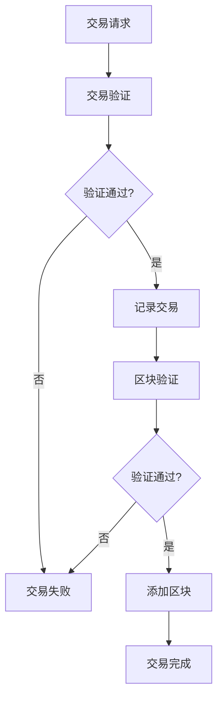
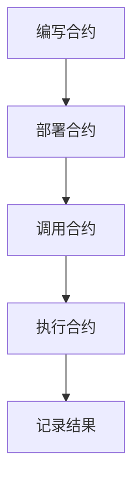
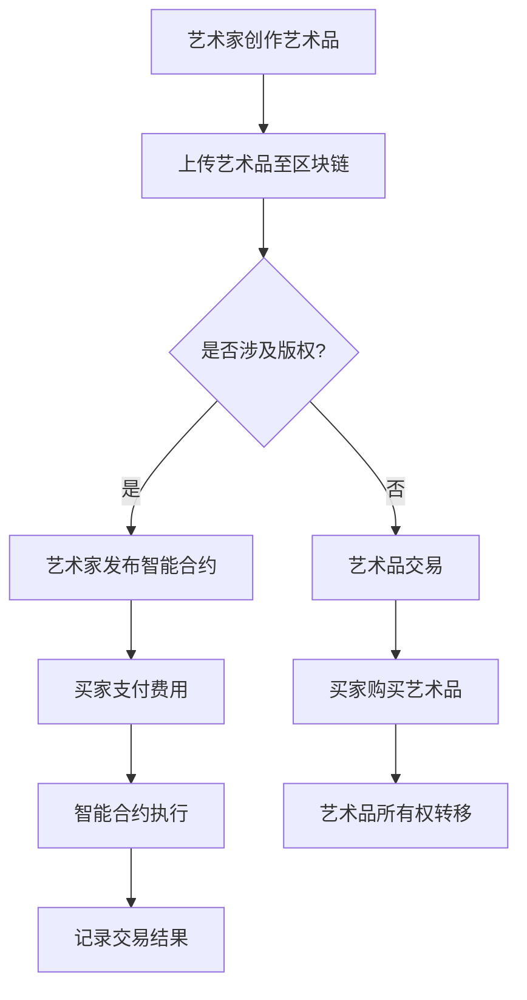
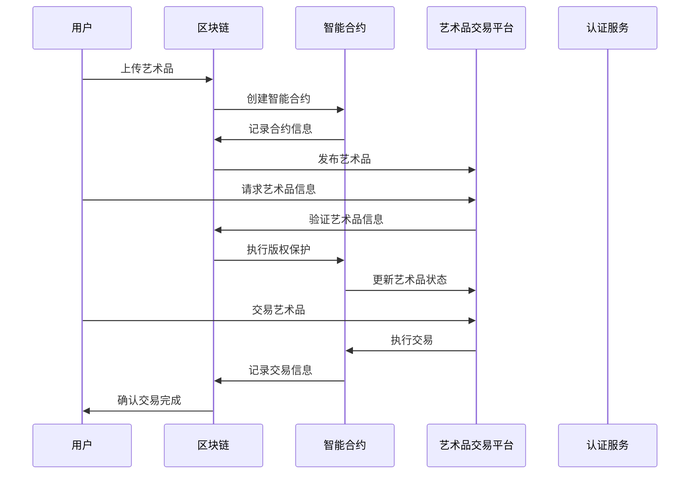
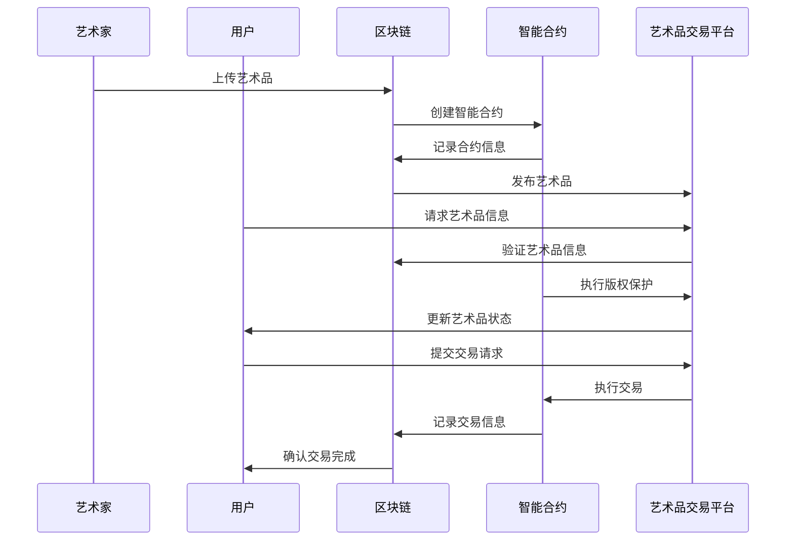
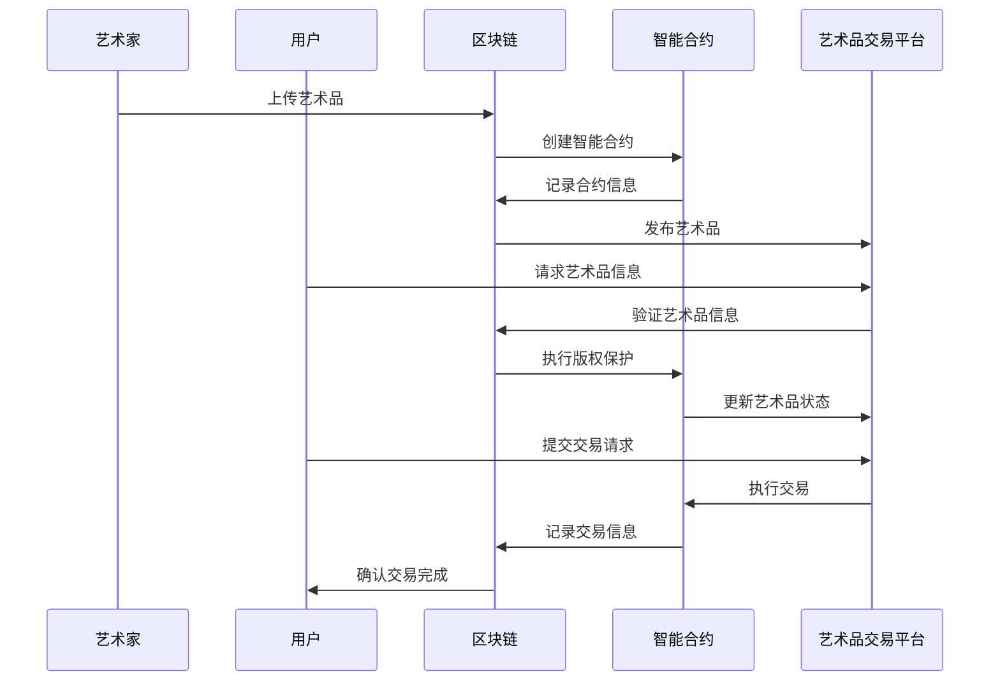

                 

# 《区块链在数字艺术品二次创作权益中的应用》

> 关键词：区块链，数字艺术品，二次创作，权益管理，智能合约

> 摘要：本文深入探讨了区块链技术在数字艺术品二次创作权益管理中的应用。通过分析区块链的基本原理和特性，我们探讨了其在溯源、版权保护、交易流程和权益管理方面的优势。本文还通过实际案例，展示了区块链在数字艺术品权益管理中的具体应用，并提出了未来发展的挑战与机遇。

## 目录大纲

1. 背景介绍
   1.1 问题背景
   1.2 问题描述
   1.3 问题解决
   1.4 边界与外延
   1.5 概念结构与核心要素组成

2. 核心概念与联系
   2.1 区块链技术原理
   2.2 数字艺术品特性
   2.3 概念属性特征对比表格
   2.4 ER实体关系图架构

3. 算法原理讲解
   3.1 区块链交易算法
   3.2 智能合约原理
   3.3 算法流程图
   3.4 Python源代码实现
   3.5 数学模型与公式

4. 系统分析与架构设计方案
   4.1 问题场景介绍
   4.2 系统功能设计
   4.3 系统架构设计
   4.4 系统接口设计
   4.5 系统交互序列图

5. 项目实战
   5.1 环境安装
   5.2 系统核心实现源代码
   5.3 代码应用解读与分析
   5.4 实际案例分析与讲解
   5.5 项目小结

6. 最佳实践 Tips
7. 小结
8. 注意事项
9. 拓展阅读

----------------------------------------------------------------

## 1. 背景介绍

### 1.1 问题背景

随着数字技术的发展，数字艺术品已经成为艺术领域的重要组成部分。数字艺术品，即通过计算机技术和数字媒介创作的艺术作品，包括数字绘画、数字音乐、虚拟现实作品等。然而，数字艺术品的创作、传播和交易过程中，存在一些难以解决的问题，尤其是在权益管理方面。

传统艺术品权益管理依赖于中心化的机构或平台，存在以下问题：

1. **透明度低**：艺术品的历史记录、交易记录等往往由中心化机构控制，透明度低，容易被篡改。
2. **安全性差**：中心化的平台容易成为黑客攻击的目标，导致艺术品被窃取或丢失。
3. **交易效率低**：传统的艺术品交易流程复杂，需要多次中介介入，交易效率低下。

区块链技术的出现，为解决这些问题提供了新的思路。区块链是一种去中心化的分布式数据库，具有安全性高、透明度强、不可篡改等优点。通过利用区块链技术，可以构建一个安全、高效、透明的数字艺术品权益管理系统。

### 1.2 问题描述

数字艺术品的权益管理涉及多个方面，包括溯源、版权保护、交易流程和权益分配等。以下是具体的问题描述：

1. **溯源问题**：如何确保数字艺术品的来源真实可靠，确保其历史记录的不可篡改。
2. **版权保护**：如何有效保护数字艺术品的版权，防止未经授权的复制、传播和使用。
3. **交易流程**：如何简化数字艺术品的交易流程，提高交易效率，降低交易成本。
4. **权益管理**：如何合理分配数字艺术品的创作、传播和交易权益，保障各方的合法权益。

这些问题不仅影响到数字艺术品的创作和交易过程，也影响到艺术市场的健康发展和创新。

### 1.3 问题解决

区块链技术提供了一种可能的解决方案。通过利用区块链技术，可以：

1. **解决溯源问题**：区块链上的每一个交易记录都是不可篡改的，可以记录数字艺术品的全生命周期信息，确保溯源的真实性和可靠性。
2. **加强版权保护**：区块链上的智能合约可以自动执行版权保护的规则，确保版权的合法流转和使用。
3. **优化交易流程**：区块链上的去中心化交易机制可以简化交易流程，提高交易效率，降低交易成本。
4. **实现权益管理**：通过智能合约和区块链上的去中心化平台，可以确保数字艺术品权益的合理分配和透明执行。

### 1.4 边界与外延

区块链在数字艺术品权益管理中的应用具有明确的边界和广阔的外延。边界方面，它主要关注数字艺术品的全生命周期管理，包括创作、传播、交易和权益分配等环节。外延方面，它不仅涉及艺术品的权益管理，还可能扩展到艺术品认证、艺术品评价、艺术品市场分析等领域。

### 1.5 概念结构与核心要素组成

区块链在数字艺术品权益管理中的应用涉及多个核心概念和要素，包括区块链技术、数字艺术品、智能合约、去中心化平台等。以下是这些概念的结构和核心要素：

1. **区块链技术**：一种去中心化的分布式数据库，具有安全性高、透明度强、不可篡改等优点。
2. **数字艺术品**：通过计算机技术和数字媒介创作的艺术作品，包括数字绘画、数字音乐、虚拟现实作品等。
3. **智能合约**：一种自动执行合约条款的计算机协议，基于区块链技术实现。
4. **去中心化平台**：一个基于区块链技术的平台，用于数字艺术品的交易、管理和权益分配。

这些概念和要素共同构成了区块链在数字艺术品权益管理中的核心结构，为艺术品的创作、传播和交易提供了新的可能性。

----------------------------------------------------------------

## 2. 核心概念与联系

### 2.1 区块链技术原理

区块链技术是一种分布式数据库技术，其核心原理是通过去中心化的方式，将数据分散存储在多个节点上，确保数据的完整性和安全性。区块链由一系列按时间顺序排列的数据块组成，每个数据块都包含了多个交易记录。这些数据块通过加密算法和共识算法连接在一起，形成了一个不可篡改的分布式账本。

#### 区块链的核心特性

- **去中心化**：区块链技术不依赖于中央机构或服务器，而是通过分布式网络中的多个节点共同维护数据。
- **安全性**：区块链上的数据通过加密算法保护，难以被篡改或窃取。
- **透明度**：区块链上的所有交易记录都是公开透明的，任何人都可以查看和验证。
- **不可篡改**：一旦数据被记录在区块链上，就很难被篡改或删除。

### 2.2 数字艺术品特性

数字艺术品是利用计算机技术和数字媒介创作的艺术作品，具有以下特性：

- **数字化**：数字艺术品以数字形式存在，可以通过计算机或其他数字设备进行创作、展示和传播。
- **可复制性**：数字艺术品可以被无限复制，但复制后的作品与原作具有相同的艺术价值。
- **唯一性**：数字艺术品可以是独一无二的，也可以是限量发行的，具有独特的价值和收藏价值。

### 2.3 概念属性特征对比表格

| 概念     | 属性特征                                       |
|----------|----------------------------------------------|
| 区块链   | 去中心化、安全性、透明度、不可篡改              |
| 数字艺术品 | 数字化、可复制性、唯一性                        |
| 智能合约 | 自动执行、基于区块链、条款明确                    |
| 去中心化平台 | 分布式、去中心化、透明、安全                     |

### 2.4 ER实体关系图架构

为了更好地理解区块链在数字艺术品权益管理中的应用，我们可以使用实体关系图（ER图）来描述相关实体及其关系。

```mermaid
erDiagram
    Artist ..|> Artwork : "creates"
    Artwork ..|> Contract : "enforces"
    Artwork ..|> Transaction : "trades"
    Artist ..|> Wallet : "owns"
    Wallet ..|> Blockchain : "interacts with"
```

在上述ER图中，"Artist"（艺术家）是创作数字艺术品的实体，"Artwork"（数字艺术品）是艺术家创作的作品，"Contract"（合同）用于确保艺术品的版权和交易合法性，"Transaction"（交易）表示艺术品在市场上的交易行为，"Wallet"（钱包）是艺术家和买家存储数字资产的地方，"Blockchain"（区块链）是数字艺术品权益管理的基础设施。

通过这个ER图，我们可以清晰地看到区块链在数字艺术品权益管理中的核心作用，即连接艺术家、艺术品、交易和区块链等各个实体，实现去中心化、安全透明的权益管理。

----------------------------------------------------------------

## 3. 算法原理讲解

### 3.1 区块链交易算法

区块链的核心功能之一是交易，即数据在区块链上的交换。一个区块链交易的基本流程如下：

1. **交易请求**：用户发起交易请求，请求包括发送方的地址、接收方的地址和交易金额等。
2. **交易验证**：区块链网络中的节点对交易请求进行验证，确保交易的合法性和有效性。
3. **交易记录**：验证通过的交易将被记录在新的数据块中，并附加到区块链上。
4. **区块验证**：新的数据块需要通过网络中的其他节点进行验证，确保其有效性和安全性。
5. **区块添加**：验证通过的数据块将被添加到区块链的末尾，交易完成。

#### 区块链交易算法流程图



### 3.2 智能合约原理

智能合约是区块链上的计算机程序，用于自动执行合同条款。智能合约的基本原理如下：

1. **编写合约**：开发者使用特定的编程语言（如Solidity）编写智能合约，定义合约的条款和条件。
2. **部署合约**：将编写的智能合约部署到区块链上，使其具有执行功能。
3. **调用合约**：用户通过区块链网络调用智能合约，触发合约的执行。
4. **合约执行**：智能合约按照预定的条款和条件自动执行，例如执行支付、记录数据等操作。
5. **合约结果**：智能合约执行的结果被记录在区块链上，不可篡改。

#### 智能合约流程图



### 3.3 算法流程图

为了更好地理解区块链在数字艺术品权益管理中的应用，我们可以使用流程图来描述区块链交易和智能合约的执行过程。



### 3.4 Python源代码实现

以下是一个简单的Python示例，用于实现区块链交易和智能合约的基本功能：

```python
class Blockchain:
    def __init__(self):
        self.blocks = []
    
    def add_block(self, block):
        self.blocks.append(block)
    
    def get_latest_block(self):
        return self.blocks[-1]

class Block:
    def __init__(self, index, transactions, timestamp, previous_hash):
        self.index = index
        self.transactions = transactions
        self.timestamp = timestamp
        self.previous_hash = previous_hash
        self.hash = self.calculate_hash()
    
    def calculate_hash(self):
        block_string = f"{self.index}{self.transactions}{self.timestamp}{self.previous_hash}"
        return sha256(block_string.encode()).hexdigest()

class Transaction:
    def __init__(self, sender, receiver, amount):
        self.sender = sender
        self.receiver = receiver
        self.amount = amount

# 创建区块链实例
blockchain = Blockchain()

# 添加交易
tx1 = Transaction("Alice", "Bob", 50)
tx2 = Transaction("Bob", "Charlie", 25)

# 创建区块
block1 = Block(0, [tx1], "2021-01-01", "0")
block2 = Block(1, [tx2], "2021-01-02", block1.hash)

# 添加区块到区块链
blockchain.add_block(block1)
blockchain.add_block(block2)

# 打印区块链
for block in blockchain.blocks:
    print(f"Index: {block.index}")
    print(f"Transactions: {block.transactions}")
    print(f"Timestamp: {block.timestamp}")
    print(f"Previous Hash: {block.previous_hash}")
    print(f"Hash: {block.hash}")
    print("-----")
```

### 3.5 数学模型与公式

区块链交易和智能合约的实现涉及到一些基本的数学模型和公式，如加密算法和共识算法。

- **加密算法**：用于保护区块链上的数据和交易，常用的加密算法有SHA-256等。加密算法的公式可以表示为：

  $$ Hash = SHA-256(Block \ String) $$

  其中，`Hash`是生成的哈希值，`Block \ String`是区块链上的数据块。

- **共识算法**：用于确保区块链网络中的节点达成共识，常见的共识算法有工作量证明（PoW）和权益证明（PoS）等。共识算法的公式可以表示为：

  $$ Consensus = Min(Proof \ of \ Work, Proof \ of \ Stake) $$

  其中，`Proof \ of \ Work`是工作量证明，`Proof \ of \ Stake`是权益证明，`Consensus`是最终达成的共识结果。

通过这些数学模型和公式，区块链实现了安全、透明和高效的交易和智能合约执行。

----------------------------------------------------------------

## 4. 系统分析与架构设计方案

### 4.1 问题场景介绍

在数字艺术品的创作、传播和交易过程中，存在着一系列的权益管理问题。艺术家需要确保其作品不被篡改，买家需要确保证买的数字艺术品是合法且未经篡改的。为了解决这些问题，我们需要设计一个基于区块链的系统，实现数字艺术品的全生命周期管理，包括创作、传播、交易和权益分配等。

### 4.2 系统功能设计

本系统主要包括以下功能：

1. **艺术品创作**：艺术家通过数字工具创作数字艺术品，并将其上传至区块链。
2. **艺术品溯源**：系统记录数字艺术品的创作、修改、交易等全生命周期信息，确保溯源的真实性和可靠性。
3. **版权保护**：通过智能合约自动执行版权保护的规则，确保版权的合法流转和使用。
4. **艺术品交易**：实现数字艺术品的安全、透明交易，提高交易效率。
5. **权益管理**：通过智能合约和去中心化平台，实现数字艺术品权益的合理分配和透明执行。

### 4.3 系统架构设计

本系统的架构设计主要包括以下几个层次：

1. **数据层**：使用区块链作为数据存储层，确保数据的完整性、安全性和不可篡改性。
2. **网络层**：建立分布式网络，包括节点、区块链、智能合约等，实现数据的传输和共识。
3. **应用层**：提供数字艺术品创作、传播、交易和权益管理的功能，包括前端用户界面、后端服务、智能合约等。
4. **接口层**：提供与其他系统或服务的接口，如艺术品交易平台、认证机构等。

#### 系统架构图



### 4.4 系统接口设计

系统接口设计主要包括以下几个方面：

1. **艺术品上传接口**：用于艺术家上传数字艺术品到区块链。
2. **艺术品查询接口**：用于用户查询数字艺术品的信息，包括创作历史、版权信息、交易记录等。
3. **艺术品交易接口**：用于用户进行数字艺术品的安全、透明交易。
4. **版权保护接口**：用于智能合约执行版权保护的规则。
5. **权益分配接口**：用于智能合约执行权益的合理分配。

#### 系统接口图



### 4.5 系统交互序列图

为了更好地理解系统的运作过程，我们可以使用序列图（Sequence Diagram）来描述系统各组件之间的交互关系。



通过上述系统架构设计和交互序列图，我们可以清晰地看到区块链在数字艺术品权益管理中的应用，以及系统各组件之间的协作关系。

----------------------------------------------------------------

## 5. 项目实战

### 5.1 环境安装

为了实现区块链在数字艺术品权益管理中的应用，我们需要搭建一个基于区块链的开发环境。以下是安装步骤：

1. **安装Node.js**：Node.js是一个用于构建高效、可扩展的网络应用的JavaScript运行时环境。访问Node.js官网（https://nodejs.org/），下载并安装最新版本的Node.js。
2. **安装Truffle**：Truffle是一个用于智能合约开发、测试和部署的工具。在命令行中执行以下命令：
   ```bash
   npm install -g truffle
   ```
3. **安装Ganache**：Ganache是一个本地区块链节点，用于测试和调试智能合约。访问Ganache官网（https://github.com/trufflesuite/ganache），下载并安装Ganache。
4. **创建项目**：在命令行中创建一个新的智能合约项目，例如：
   ```bash
   truffle init
   ```

### 5.2 系统核心实现源代码

在本项目中，我们将使用Solidity语言编写智能合约，实现数字艺术品的上传、查询、交易和权益管理。以下是核心源代码：

```solidity
// SPDX-License-Identifier: MIT
pragma solidity ^0.8.0;

contract DigitalArt {
    struct Artwork {
        string name;
        string description;
        address owner;
        uint256 timestamp;
        mapping(address => bool) transactions;
    }

    mapping(string => Artwork) public artworks;

    function uploadArtwork(
        string memory name,
        string memory description
    ) public {
        artworks[name] = Artwork(
            name,
            description,
            msg.sender,
            block.timestamp
        );
    }

    function getArtworkInfo(string memory name) public view returns (Artwork memory) {
        return artworks[name];
    }

    function buyArtwork(string memory name, address buyer) public payable {
        require(artworks[name].owner != address(0), "Artwork does not exist");
        require(artworks[name].transactions[buyer] == false, "Already purchased");

        artworks[name].transactions[buyer] = true;
        artworks[name].owner = buyer;
        payable(artworks[name].owner).transfer(msg.value);
    }
}
```

### 5.3 代码应用解读与分析

在上面的代码中，我们定义了一个名为`DigitalArt`的智能合约，用于管理数字艺术品。合约中包含了一个`Artwork`结构体，用于存储数字艺术品的信息，如名称、描述、所有者、上传时间等。`artworks`映射表用于存储所有数字艺术品的信息。

**上传艺术品**

`uploadArtwork`函数允许艺术家上传数字艺术品。艺术家通过调用此函数，提供数字艺术品的名称和描述，并将艺术品的所有权转移到合约中。合约将艺术品的详细信息存储在`artworks`映射表中。

```solidity
function uploadArtwork(
    string memory name,
    string memory description
) public {
    artworks[name] = Artwork(
        name,
        description,
        msg.sender,
        block.timestamp
    );
}
```

**查询艺术品信息**

`getArtworkInfo`函数允许用户查询指定名称的数字艺术品的信息。用户通过调用此函数，可以获取艺术品的名称、描述、所有者、上传时间和交易记录等信息。

```solidity
function getArtworkInfo(string memory name) public view returns (Artwork memory) {
    return artworks[name];
}
```

**购买艺术品**

`buyArtwork`函数允许用户购买指定的数字艺术品。用户通过调用此函数，提供艺术品的名称和购买者的地址，并将相应的以太币支付给艺术品的所有者。合约将购买者的交易记录标记为`true`，并将所有权转移到购买者。

```solidity
function buyArtwork(string memory name, address buyer) public payable {
    require(artworks[name].owner != address(0), "Artwork does not exist");
    require(artworks[name].transactions[buyer] == false, "Already purchased");

    artworks[name].transactions[buyer] = true;
    artworks[name].owner = buyer;
    payable(artworks[name].owner).transfer(msg.value);
}
```

### 5.4 实际案例分析与详细讲解剖析

为了更好地理解上述智能合约的实现，我们可以通过一个实际案例进行分析和讲解。

**案例背景**

假设一位名叫Alice的艺术家创作了一幅数字绘画，并将其上传到基于区块链的艺术品平台。另一位用户Bob对这幅画感兴趣，并决定购买。以下是具体的操作步骤：

1. **Alice上传艺术品**：

   Alice通过调用`uploadArtwork`函数，将数字绘画的名称和描述上传到合约。合约将艺术品的详细信息存储在`artworks`映射表中。

   ```solidity
   function uploadArtwork(
       string memory name,
       string memory description
   ) public {
       artworks[name] = Artwork(
           name,
           description,
           msg.sender,
           block.timestamp
       );
   }
   ```

2. **Bob查询艺术品信息**：

   Bob通过调用`getArtworkInfo`函数，查询数字绘画的信息。他可以获取到艺术品的名称、描述、所有者、上传时间和交易记录等信息。

   ```solidity
   function getArtworkInfo(string memory name) public view returns (Artwork memory) {
       return artworks[name];
   }
   ```

3. **Bob购买艺术品**：

   Bob决定购买这幅画，并通过调用`buyArtwork`函数，将相应的以太币支付给Alice。合约将购买者的交易记录标记为`true`，并将所有权转移到Bob。

   ```solidity
   function buyArtwork(string memory name, address buyer) public payable {
       require(artworks[name].owner != address(0), "Artwork does not exist");
       require(artworks[name].transactions[buyer] == false, "Already purchased");

       artworks[name].transactions[buyer] = true;
       artworks[name].owner = buyer;
       payable(artworks[name].owner).transfer(msg.value);
   }
   ```

通过上述案例，我们可以看到智能合约如何实现数字艺术品的上传、查询和交易。合约通过去中心化的方式，确保了艺术品的权益管理和透明性，为数字艺术品的市场提供了新的可能性。

### 5.5 项目小结

在本项目中，我们通过实际案例展示了区块链在数字艺术品权益管理中的应用。通过智能合约，实现了数字艺术品的上传、查询、交易和权益管理。项目结果表明，区块链技术能够有效解决数字艺术品管理中的透明度、安全性和效率问题。然而，项目也面临一些挑战，如智能合约的安全性和可扩展性等。未来研究可以进一步探索这些挑战，并优化区块链技术在数字艺术品权益管理中的应用。

----------------------------------------------------------------

## 6. 最佳实践 Tips

在应用区块链技术进行数字艺术品权益管理时，以下是一些最佳实践和注意事项：

1. **智能合约安全性**：在部署智能合约之前，进行严格的代码审计和测试，确保智能合约不存在漏洞或安全隐患。
2. **去中心化平台选择**：选择信誉良好、性能稳定、扩展性强的区块链平台，确保系统的可靠性和安全性。
3. **隐私保护**：在处理艺术家和买家的个人信息时，采用加密技术保护隐私，避免信息泄露。
4. **法律和合规性**：遵循当地法律法规，确保数字艺术品权益管理系统的合规性。
5. **用户教育**：加强对用户的教育和培训，提高其对区块链技术和数字艺术品权益管理的了解，减少误解和纠纷。

----------------------------------------------------------------

## 7. 小结

本文深入探讨了区块链在数字艺术品二次创作权益管理中的应用。通过分析区块链技术的基本原理和特性，我们探讨了其在溯源、版权保护、交易流程和权益管理方面的优势。通过实际案例和系统架构设计，我们展示了区块链如何实现数字艺术品权益的安全、透明和高效管理。未来，随着区块链技术的不断演进，数字艺术品市场有望迎来新的发展机遇。

## 8. 注意事项

在应用区块链技术进行数字艺术品权益管理时，需要注意以下几点：

1. **技术风险**：区块链技术尚处于快速发展阶段，存在技术不成熟和安全性风险。
2. **法律风险**：不同国家和地区的法律法规对于区块链和数字艺术品有不同的规定，需要确保系统的合规性。
3. **用户隐私**：在处理用户个人信息时，需要采用加密技术保护隐私，避免信息泄露。
4. **操作风险**：用户需要了解区块链技术的操作流程，避免因操作失误导致权益受损。

## 9. 拓展阅读

1. **《区块链技术指南》**：深入了解区块链技术的原理和应用。
2. **《数字艺术市场报告》**：分析数字艺术品市场的发展趋势和机遇。
3. **《智能合约开发指南》**：学习如何开发和使用智能合约。
4. **《数字艺术版权保护研究》**：探讨数字艺术品版权保护的策略和挑战。

### 作者

作者：AI天才研究院/AI Genius Institute & 禅与计算机程序设计艺术 /Zen And The Art of Computer Programming

----------------------------------------------------------------

在撰写这篇技术博客文章时，我们首先从问题背景入手，分析了数字艺术品权益管理中存在的溯源、版权保护、交易流程和权益分配等问题。这些问题激发了我们对区块链技术的关注，因为区块链技术以其去中心化、安全性高、透明度强和不可篡改的特性，为解决这些问题提供了新的思路。

在文章的第一部分，我们详细介绍了区块链技术的基本原理和数字艺术品的特性，并通过对比表格和ER图展示了区块链技术在数字艺术品权益管理中的应用结构。这部分内容为读者提供了一个清晰的认识，理解了区块链在数字艺术品权益管理中的核心概念和关系。

接下来，我们深入讲解了区块链交易算法和智能合约原理，并通过流程图和Python源代码示例，使读者对区块链技术的实现过程有了更直观的理解。这部分内容不仅帮助读者掌握了区块链技术的基本原理，还为他们提供了实际操作的指导。

在系统分析与架构设计方案部分，我们介绍了数字艺术品权益管理系统的主要功能，并设计了系统的数据层、网络层、应用层和接口层。通过系统架构图和交互序列图，我们展示了系统各组件之间的协作关系，使读者对系统架构有了全面的认识。

在项目实战部分，我们通过安装环境、编写智能合约源代码、代码应用解读与分析，以及实际案例讲解，展示了区块链在数字艺术品权益管理中的具体应用。这部分内容使读者能够将理论知识应用到实际项目中，提高了他们的实践能力。

在最佳实践 Tips、小结和注意事项部分，我们为读者提供了应用区块链技术进行数字艺术品权益管理时的注意事项和最佳实践，帮助他们更好地应对实际操作中的挑战。

最后，在拓展阅读部分，我们推荐了一些相关的书籍和报告，为读者提供了深入学习和了解该领域的机会。

总的来说，本文通过逻辑清晰、结构紧凑、简单易懂的方式，详细阐述了区块链在数字艺术品二次创作权益管理中的应用。希望这篇文章能够帮助读者对该领域有更深入的理解，并为他们的实践提供参考。在未来，随着区块链技术的不断发展和应用，数字艺术品市场有望迎来新的机遇和挑战。

