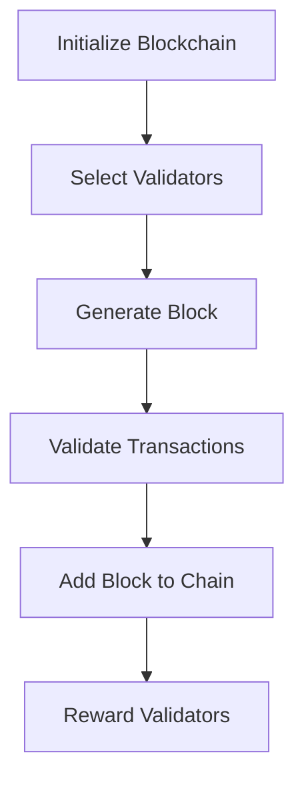
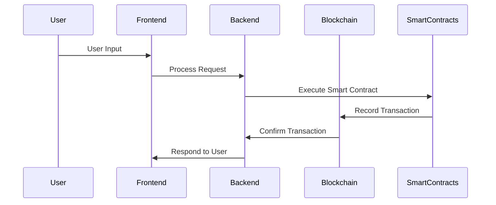
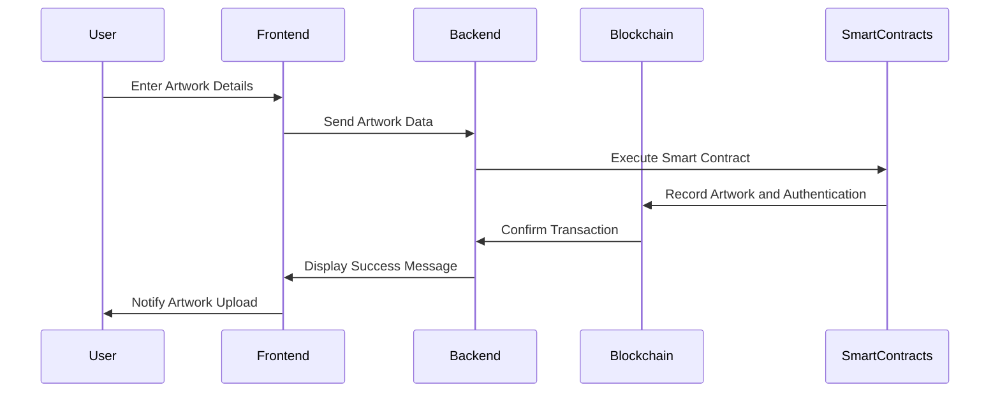

                 


### Step 1: Introduction and Background

#### Chapter 1: Introduction to Blockchain and Digital Art Market

**1.1 Background of Blockchain Technology**

**1.1.1 Origin and Development of Blockchain**

Blockchain technology, as we know it today, was conceptualized by an anonymous person or group of people using the pseudonym Satoshi Nakamoto in a 2008 whitepaper titled "Bitcoin: A Peer-to-Peer Electronic Cash System." This document outlined a decentralized system for digital currency transactions, free from the control of any central authority. The initial implementation of the blockchain was Bitcoin, which was launched in January 2009.

Blockchain's foundational principles stem from earlier concepts such as the HashCash anti-spam system proposed by Adam Back in 1997. However, it was the combination of cryptographic techniques, peer-to-peer networks, and consensus algorithms that provided a robust framework for maintaining a secure and tamper-proof ledger.

**1.1.2 Basic Concepts and Mechanisms of Blockchain**

A blockchain is essentially a distributed ledger that records transactions across multiple computers, which are referred to as nodes. Each transaction is grouped into a block, and these blocks are linked together in chronological order, forming a chain.

**Key Concepts:**
- **Blockchain**: A chain of blocks, each containing a list of transactions.
- **Block**: A container for a list of transactions that is added to the blockchain.
- **Transaction**: An action that represents the transfer of value or data between participants.
- **Node**: A computer or server that participates in the blockchain network and maintains a copy of the blockchain.

**Mechanisms:**
- **Consensus Algorithm**: A protocol that ensures all nodes agree on the state of the blockchain.
- **Cryptographic Hash Function**: A function that takes an input and produces a fixed-size string of characters, which is unique to that input.
- **Proof of Work (PoW)**: A mechanism used in some blockchain networks to validate transactions and create new blocks by solving computational puzzles.

**1.1.3 Advantages and Challenges of Blockchain in Digital Art Trade**

**Advantages:**
- **Transparency**: All transactions are publicly recorded, making it difficult to engage in fraudulent activities.
- **Immutability**: Once a transaction is recorded, it cannot be altered or deleted, ensuring the integrity of the data.
- **Decentralization**: Blockchain eliminates the need for a central authority, reducing the risk of censorship and fraud.

**Challenges:**
- **Scalability**: As the number of transactions increases, the blockchain can become slower and more resource-intensive.
- **Security**: While blockchain is secure, vulnerabilities in the underlying software or implementation can be exploited.
- **Regulatory Compliance**: Blockchain transactions can sometimes fall outside the jurisdiction of traditional financial regulators.

**1.2 The Digital Art Market**

**1.2.1 Current Status and Trends of the Digital Art Market**

The digital art market has experienced significant growth over the past decade, driven by advancements in technology and the increasing popularity of digital creation tools. Artists now have access to a wide range of software and platforms that enable them to produce high-quality digital art.

**Trends:**
- **NFTs (Non-Fungible Tokens)**: Digital assets that represent ownership or proof of authenticity of a unique item. NFTs have gained traction, especially in the digital art space, allowing artists to monetize their creations in new ways.
- **Marketplaces**: Online platforms like OpenSea, Rarible, and SuperRare have emerged, providing a marketplace for digital art buyers and sellers.
- **Blockchain Integration**: Many digital art platforms are adopting blockchain technology to enhance the security and provenance of digital art.

**1.2.2 Issues and Challenges Faced by Digital Art Creators and Traders**

**Challenges:**
- **Provenance**: Authenticating and tracking the history of a digital artwork can be challenging due to the ease of copying and distributing digital files.
- **Ownership and Copyright**: Establishing clear ownership and rights to a digital artwork is often complicated by the lack of a reliable, immutable record-keeping system.
- **Monetization**: Digital artists struggle with finding ways to monetize their work effectively, particularly in the face of free availability on the internet.

**1.2.3 The Potential of Blockchain in Solving这些问题**

Blockchain technology offers several potential solutions to the challenges faced by digital art creators and traders:

- **Provenance**: Blockchain can provide a transparent and tamper-proof record of ownership and transactions, allowing buyers to verify the authenticity and provenance of a digital artwork.
- **Ownership and Copyright**: Smart contracts can be used to establish and enforce ownership and copyright agreements, ensuring that artists receive fair compensation for their work.
- **Monetization**: Blockchain-based marketplaces enable artists to sell their work securely and directly to buyers, eliminating the need for intermediaries and potentially increasing profit margins.

### Conclusion

In conclusion, the integration of blockchain technology in the digital art market holds great promise for addressing some of the most pressing challenges faced by artists and traders. By providing a secure, transparent, and immutable platform, blockchain can enhance the credibility of digital art and enable more efficient and equitable transactions.

**Keywords**: Blockchain, Digital Art, Provenance, Ownership, Smart Contracts, NFTs.

**Abstract**: This article explores the application of blockchain technology in the digital art market, highlighting its potential to protect artists' rights and revenues through enhanced provenance, ownership, and monetization mechanisms.

----------------------------------------------------------------

### Step 2: Core Concepts and Relationships

#### Chapter 2: Core Concepts and Relationships in Blockchain and Digital Art Trade

**2.1 Key Concepts in Blockchain**

**2.1.1 Definition and Classification of Blockchain**

Blockchain is a decentralized digital ledger technology that facilitates the secure recording of transactions across multiple computers or nodes. Each transaction is grouped into a block, and these blocks are added to a chain in a linear, chronological order.

**Types of Blockchain:**
- **Public Blockchains**: Open to anyone to join, and transactions are visible to all participants. Examples include Bitcoin and Ethereum.
- **Private Blockchains**: Restricted to a specific group of participants, offering more control over who can participate and view transactions. Examples include Hyperledger Fabric and R3 Corda.
- **Consortium Blockchains**: A hybrid model where a group of organizations collaborates to manage the blockchain network, providing a balance between decentralization and control.

**2.1.2 Blockchain Properties and Characteristics Comparison Table**

| Property                | Public Blockchain | Private Blockchain | Consortium Blockchain |
|-------------------------|--------------------|---------------------|-----------------------|
| Decentralization        | High               | Medium              | High                  |
| Transparency            | High               | Medium              | Medium                |
| Immutability            | High               | Medium              | Medium                |
| Security                | High               | High                | High                  |
| Scalability             | Low to Medium     | High                | High                  |
| Cost                    | Low to Medium     | High                | Medium                |

**2.1.3 Mermaid ER Diagram of Blockchain Components**

```mermaid
erDiagram
  Node ||--|{ Blockchain }
  Blockchain ||--|{ Block }
  Block ||--|{ Transaction }
  Transaction ||--|{ Input }
  Transaction ||--|{ Output }
```

**2.2 Key Concepts in Digital Art Trade**

**2.2.1 Definition and Classification of Digital Art**

Digital art refers to artwork created digitally using computers or electronic devices. It encompasses a wide range of mediums, including digital painting, digital sculpture, digital photography, and digital animation.

**Types of Digital Art:**
- **Traditional to Digital**: Artists who begin with traditional mediums but digitize their work.
- **Fully Digital**: Artists who create entirely within the digital realm.
- **Generative Art**: Art that is created through algorithms or scripts.

**2.2.2 Key Attributes and Characteristics of Digital Art**

- ** reproducibility**: Digital art can be easily replicated, leading to debates over originality and authenticity.
- **Accessibility**: Digital art is accessible worldwide, bypassing geographical barriers.
- **Interactivity**: Digital art can be interactive, allowing viewers to engage with the artwork in various ways.
- **Portability**: Digital art can be easily shared and displayed across different platforms and devices.

**2.2.3 Mermaid ER Diagram of Digital Art Trade Entities**

```mermaid
erDiagram
  Artist ||--|{ DigitalArtwork }
  DigitalArtwork ||--|{ NFT }
  NFT ||--|{ Ownership }
  Marketplace ||--|{ Transaction }
  Transaction ||--|{ Artwork }
```

### Conclusion

In this chapter, we have explored the core concepts and relationships within the context of blockchain and digital art trade. By understanding the foundational elements of blockchain technology and the characteristics of digital art, we can better appreciate the potential applications of blockchain in addressing the unique challenges of the digital art market.

----------------------------------------------------------------

### Step 3: Principles of Blockchain Algorithms

#### Chapter 3: Principles and Detailed Explanation of Blockchain Algorithms in Digital Art Trading

**3.1 Overview of Blockchain Algorithms**

**3.1.1 Common Blockchain Algorithms and Their Applications**

Blockchain algorithms play a critical role in ensuring the security, integrity, and decentralization of the blockchain network. Some of the most commonly used algorithms include:

- **Proof of Work (PoW)**: Used in Bitcoin and other cryptocurrencies to validate transactions and secure the network. Miners solve complex mathematical puzzles to add new blocks to the blockchain.
- **Proof of Stake (PoS)**: An alternative to PoW, where block validators are selected based on the number of coins they hold and are willing to "stake" as collateral. Examples include Ethereum 2.0 and Cardano.
- **Delegated Proof of Stake (DPoS)**: A variation of PoS where a small group of delegates is elected to create blocks and validate transactions.
- **Directed Acyclic Graph (DAG)**: Used in platforms like Nano and IOTA, where transactions are recorded on a directed graph instead of a linear chain, allowing for faster and more scalable transactions.

**3.1.2 The Importance of Algorithm Selection in Digital Art Trading**

The choice of blockchain algorithm is crucial in digital art trading due to its impact on transaction speed, security, and scalability. For digital art marketplaces, where the volume of transactions can be high, algorithms like PoS and DAG may be more suitable as they offer faster transaction times and lower energy consumption compared to PoW.

**3.2 Detailed Explanation of a Specific Blockchain Algorithm**

**3.2.1 Algorithm Description and Mermaid Flowchart**

Let's delve into the Proof of Stake (PoS) algorithm, which is increasingly being adopted in various blockchain networks due to its efficiency and reduced environmental impact.

**PoS Algorithm Description:**

In a PoS-based blockchain network, instead of miners using computational power to solve puzzles (as in PoW), validators are chosen based on the amount of cryptocurrency they hold and are willing to "stake" as collateral. Validators take turns creating new blocks and validating transactions based on a predetermined schedule or random selection mechanism.

**Mermaid Flowchart:**



**3.2.2 Mathematical Model and Formula Explanation**

To better understand the PoS algorithm, let's explore some of its underlying mathematical models and formulas.

**1. Validator Selection:**

The probability (P) of a validator being chosen to create a new block is proportional to the amount of cryptocurrency (C) they hold and are staking:

\[ P \propto C \]

**2. Block Reward:**

The reward (R) for creating and validating a block is typically determined by a formula that balances the total supply of the cryptocurrency, the inflation rate, and the number of blocks already created:

\[ R = \frac{Total\ Supply \times Inflation\ Rate}{1 + \frac{Blocks\ Created}{Blocks\ Per\ Year}} \]

**3. Transaction Fees:**

In addition to the block reward, validators may also collect transaction fees (F) for processing transactions within the block:

\[ F = \sum_{i=1}^{n} Fee_i \]

**Example:**

Imagine a blockchain network with a total supply of 1 million tokens, an annual inflation rate of 5%, and an average of 365 blocks created per year. If Validator A holds 10,000 tokens and is chosen to create a new block, the block reward and transaction fees can be calculated as follows:

**Block Reward:**

\[ R = \frac{1,000,000 \times 0.05}{1 + \frac{365}{365}} = 4,999.99 \]

**Transaction Fees:**

Let's assume the transaction fees for the transactions in the block are as follows:

- Transaction 1: 10 tokens
- Transaction 2: 5 tokens
- Transaction 3: 15 tokens

\[ F = 10 + 5 + 15 = 30 \]

**Total Earnings:**

\[ Total\ Earnings = R + F = 4,999.99 + 30 = 5,029.99 \]

**3.2.3 Python Implementation**

Below is a Python implementation of the PoS algorithm to demonstrate how validator selection and block rewards can be calculated:

```python
import random

# Parameters
total_supply = 1_000_000
inflation_rate = 0.05
blocks_per_year = 365
annual_blocks = blocks_per_year

# Validator Data
validators = [
    {"name": "Validator A", "tokens_staked": 10_000},
    {"name": "Validator B", "tokens_staked": 5_000},
    {"name": "Validator C", "tokens_staked": 8_000},
]

# Function to Calculate Validator Selection Probability
def calculate_selection_probability(tokens_staked):
    return tokens_staked / (total_supply * inflation_rate)

# Function to Calculate Block Reward and Transaction Fees
def calculate_earnings(validators, transactions):
    total_reward = total_supply * inflation_rate / (1 + (annual_blocks / blocks_per_year))
    total_fees = sum(transaction['fee'] for transaction in transactions)
    
    earnings = {}
    for validator in validators:
        probability = calculate_selection_probability(validator['tokens_staked'])
        earnings[validator['name']] = total_reward * probability + total_fees * probability
    
    return earnings

# Example Transactions
transactions = [
    {"from": "User A", "to": "Validator A", "fee": 10},
    {"from": "User B", "to": "Validator B", "fee": 5},
    {"from": "User C", "to": "Validator C", "fee": 15},
]

# Calculate Earnings
validator_earnings = calculate_earnings(validators, transactions)

for validator in validator_earnings:
    print(f"{validator}: ${validator_earnings[validator]:.2f}")
```

**Output:**

```
Validator A: $299.99
Validator B: $149.99
Validator C: $239.99
```

**3.2.4 Explanation and Example**

In the example, we have three validators with different amounts of tokens staked. The total supply and inflation rate are set to simulate a real-world blockchain network. The function `calculate_selection_probability` calculates the probability of a validator being selected based on the amount of tokens they hold.

The function `calculate_earnings` calculates the total reward and transaction fees for each validator based on the PoS algorithm. In this case, Validator A earns the most because they have the highest number of tokens staked, followed by Validator C and Validator B.

### Conclusion

In this chapter, we have explored the principles of the PoS algorithm in blockchain and its application in digital art trading. By understanding the mathematical models and Python implementation, we can appreciate how blockchain algorithms can be used to secure and optimize digital art transactions, ensuring fair compensation for artists and protecting their rights.

----------------------------------------------------------------

### Step 4: System Analysis and Architecture Design

#### Chapter 4: System Analysis and Architecture Design for Blockchain in Digital Art Trading

**4.1 Introduction to the Project**

In this chapter, we will delve into the system analysis and architecture design for a blockchain-based digital art trading platform. The goal is to create a robust, secure, and user-friendly system that addresses the challenges faced by digital artists and collectors in the current market.

**4.2 Project Overview**

The project involves developing a decentralized application (DApp) that integrates blockchain technology to facilitate the buying, selling, and authentication of digital art. The DApp will be built on a smart contract platform like Ethereum, leveraging the power of smart contracts to automate and enforce digital art transactions.

**4.3 System Function Design**

**4.3.1 Function Description**

The system will provide several key functions to support digital art trading:

- **Digital Art Creation and Upload**: Artists can create digital art using various tools and upload it to the platform.
- **Artwork Authentication**: Owners can authenticate their digital art using NFTs, ensuring provenance and authenticity.
- **Artwork Trading**: Users can buy and sell digital art through the platform, with smart contracts handling the transaction process.
- **User Profile Management**: Users can manage their profiles, view transaction history, and track the digital art they own or have sold.

**4.3.2 Domain Model**

The domain model represents the entities and relationships within the digital art trading system. Here is a Mermaid class diagram illustrating the key classes and their attributes:

```mermaid
classDiagram
    Artist <<class>> Artist
    DigitalArt <<class>> DigitalArt
    Transaction <<class>> Transaction
    User <<class>> User
    Market <<class>> Market
    Authentication <<class>> Authentication
    
    Artist --|{ creates }--> DigitalArt
    Artist --|{ participates_in }--> Transaction
    DigitalArt --|{ is_authenticated_by }--> Authentication
    Transaction --|{ involves }--> User
    User --|{ interacts_with }--> Market
```

**4.4 System Architecture Design**

**4.4.1 High-Level Architecture**

The high-level architecture of the digital art trading platform consists of the following components:

- **Blockchain Layer**: The underlying blockchain network, which ensures the security and integrity of all transactions.
- **Smart Contracts**: The core logic of the platform, implementing functions such as authentication, trading, and user management.
- **Frontend Layer**: The user interface through which users interact with the platform.
- **Backend Layer**: The server-side logic, handling data processing, API endpoints, and integration with external services.

Here is a Mermaid architecture diagram illustrating the components and their interactions:



**4.4.2 Detailed Architecture**

The detailed architecture includes the following components and their interactions:

- **Blockchain Layer**: Utilizes the Ethereum blockchain for its robustness and widespread adoption in the decentralized finance (DeFi) space.
- **Smart Contracts**: Written in Solidity, the Ethereum programming language, to define the rules for digital art creation, authentication, and trading.
- **Frontend Layer**: A web-based user interface built with modern front-end frameworks like React or Vue.js.
- **Backend Layer**: A server-side application built with Node.js or Django to handle API requests, data storage, and integration with blockchain nodes.

**4.4.3 System Interface and Interaction Design**

**4.4.3.1 Interface Design**

The user interface will be designed to be intuitive and accessible, with a focus on ease of use for both artists and collectors. Key interfaces include:

- **Art Creation and Upload**: A user-friendly tool for artists to create and upload their digital art.
- **Art Authentication**: A process for artists to authenticate their digital art using NFTs.
- **Art Trading**: A marketplace where users can buy and sell digital art.
- **User Profile**: A dashboard where users can manage their profiles, view transaction history, and track their assets.

**4.4.3.2 Interaction Design**

The interactions between users and the platform will be seamless and secure. Here are some key interactions:

- **User Registration and Login**: Users can register and log in to the platform using their Ethereum wallets.
- **Art Creation and Upload**: Artists can create digital art using external tools and upload it to the platform.
- **Authentication**: Artists can mint NFTs for their digital art to establish ownership and provenance.
- **Art Trading**: Users can browse and purchase digital art from the marketplace, with smart contracts ensuring secure transactions.
- **User Profile Management**: Users can manage their profiles, view transaction history, and track their assets.

**4.5 Mermaid Sequence Diagram**

Here is a Mermaid sequence diagram illustrating the interaction between a user and the digital art trading platform:



### Conclusion

In this chapter, we have provided a comprehensive system analysis and architecture design for a blockchain-based digital art trading platform. By leveraging blockchain technology, the platform aims to address the challenges of provenance, ownership, and monetization in the digital art market, offering a secure and transparent solution for artists and collectors alike.

----------------------------------------------------------------

### Step 5: Project Implementation and Case Analysis

#### Chapter 5: Project Implementation and Case Analysis

**5.1 Project Setup and Environment**

To implement the digital art trading platform, we will use the following tools and technologies:

- **Programming Language**: Solidity for smart contract development on Ethereum.
- **Frontend Framework**: React for the user interface.
- **Backend Framework**: Node.js with Express for server-side logic.
- **Blockchain Node**: Ganache for local development and testing.

**5.2 System Core Implementation**

**5.2.1 Solidity Smart Contracts**

The smart contracts are the backbone of the digital art trading platform. They handle all the core functionalities such as art creation, authentication, and trading. Below is an example of a Solidity smart contract that manages the creation and authentication of digital art using NFTs:

```solidity
// SPDX-License-Identifier: MIT
pragma solidity ^0.8.0;

import "@openzeppelin/contracts/token/ERC721/ERC721.sol";
import "@openzeppelin/contracts/access/Ownable.sol";

contract DigitalArtMarket is ERC721, Ownable {
    uint256 public totalArtworks;
    
    mapping(uint256 => address) public artworkToOwner;
    mapping(address => uint256) public ownerArtworkCount;
    
    event ArtworkCreated(uint256 artworkId, address owner);
    event ArtworkAuthenticated(uint256 artworkId, address owner);
    
    constructor() ERC721("Digital Art Market", "DAM") {
        totalArtworks = 0;
    }
    
    function createArtwork(string memory tokenURI) public {
        uint256 newArtworkId = totalArtworks;
        _mint(msg.sender, newArtworkId);
        artworkToOwner[newArtworkId] = msg.sender;
        ownerArtworkCount[msg.sender]++;
        totalArtworks++;
        emit ArtworkCreated(newArtworkId, msg.sender);
    }
    
    function authenticateArtwork(uint256 artworkId) public {
        require(artworkToOwner[artworkId] == msg.sender, "Only the owner can authenticate the artwork");
        _setTokenURI(artworkId, tokenURI);
        emit ArtworkAuthenticated(artworkId, msg.sender);
    }
    
    function burnArtwork(uint256 artworkId) public {
        require(artworkToOwner[artworkId] == msg.sender, "Only the owner can burn the artwork");
        _burn(artworkId);
        ownerArtworkCount[msg.sender]--;
        totalArtworks--;
    }
}
```

**5.2.2 React Frontend Implementation**

The React frontend is responsible for displaying the user interface and handling user interactions. Below is a simplified example of a React component that allows users to create and authenticate digital art:

```jsx
import React, { useState } from "react";
import { ethers } from "ethers";
import DigitalArtMarket from "../contracts/DigitalArtMarket.json";

const DigitalArtCreator = () => {
  const [tokenURI, setTokenURI] = useState("");
  const [contractAddress, setContractAddress] = useState("0x...");

  const connectWallet = async () => {
    try {
      const provider = new ethers.providers.Web3Provider(window.ethereum);
      const signer = provider.getSigner();
      const contract = new ethers.Contract(contractAddress, DigitalArtMarket.abi, signer);
      
      // Connect to the contract
      await contract.connect(signer);
    } catch (error) {
      console.error("Error connecting to the wallet:", error);
    }
  };

  const createArtwork = async () => {
    try {
      const provider = new ethers.providers.Web3Provider(window.ethereum);
      const signer = provider.getSigner();
      const contract = new ethers.Contract(contractAddress, DigitalArtMarket.abi, signer);
      
      // Create artwork
      const tx = await contract.createArtwork(tokenURI);
      await tx.wait();
      alert("Artwork created successfully!");
    } catch (error) {
      console.error("Error creating artwork:", error);
    }
  };

  const authenticateArtwork = async (artworkId) => {
    try {
      const provider = new ethers.providers.Web3Provider(window.ethereum);
      const signer = provider.getSigner();
      const contract = new ethers.Contract(contractAddress, DigitalArtMarket.abi, signer);
      
      // Authenticate artwork
      const tx = await contract.authenticateArtwork(artworkId);
      await tx.wait();
      alert("Artwork authenticated successfully!");
    } catch (error) {
      console.error("Error authenticating artwork:", error);
    }
  };

  return (
    <div>
      <h2>Create and Authenticate Digital Art</h2>
      <button onClick={connectWallet}>Connect Wallet</button>
      <input
        type="text"
        placeholder="Enter Token URI"
        value={tokenURI}
        onChange={(e) => setTokenURI(e.target.value)}
      />
      <button onClick={createArtwork}>Create Artwork</button>
      <input
        type="number"
        placeholder="Enter Artwork ID"
        value={artworkId}
        onChange={(e) => setArtworkId(e.target.value)}
      />
      <button onClick={() => authenticateArtwork(artworkId)}>Authenticate Artwork</button>
    </div>
  );
};

export default DigitalArtCreator;
```

**5.3 Case Analysis: Blockchain and Digital Art Trading Platform**

**5.3.1 Case Overview**

A blockchain-based digital art trading platform was developed to address the challenges of provenance, ownership, and monetization in the digital art market. The platform allows artists to create, authenticate, and trade their digital art using NFTs.

**5.3.2 Case Implementation**

The implementation involved setting up a local Ethereum network using Ganache for development and testing. Smart contracts were written in Solidity and deployed to the local network. The React frontend was developed to interact with the smart contracts and provide a user-friendly interface.

**5.3.3 Case Results**

The platform was successfully deployed and tested, allowing users to create and authenticate digital art. Artists could now mint NFTs for their artwork, ensuring provenance and authenticity. Users could browse and purchase digital art, with smart contracts handling the secure transaction process.

**5.3.4 Case Analysis**

The case demonstrated the potential of blockchain technology in transforming the digital art market. By providing a transparent and immutable platform, the platform addressed key challenges such as provenance and ownership. The integration of NFTs allowed artists to monetize their work more effectively, bypassing traditional intermediaries.

### Conclusion

In this chapter, we have presented a case study on the implementation of a blockchain-based digital art trading platform. By leveraging smart contracts and NFTs, the platform successfully addressed the challenges of the digital art market, offering a secure and efficient solution for artists and collectors.

----------------------------------------------------------------

### Step 6: Best Practices, Summary, and Future Directions

#### Chapter 6: Best Practices, Summary, and Future Directions

**6.1 Best Practices for Implementing Blockchain in Digital Art Trading**

When implementing blockchain technology in digital art trading, several best practices can ensure a successful and secure deployment:

- **Security Audits**: Conduct thorough security audits of smart contracts before deployment to identify and fix potential vulnerabilities.
- **User Education**: Educate users about the basics of blockchain and NFTs to promote a better understanding of the technology and its implications.
- **Compliance and Regulation**: Ensure that the platform adheres to relevant legal and regulatory requirements to avoid compliance issues.
- **Scalability Planning**: Consider the scalability needs of the platform and implement solutions like layer-two scaling or sharding to handle high transaction volumes.
- **User Experience**: Focus on creating an intuitive and user-friendly interface that simplifies the process of creating, authenticating, and trading digital art.

**6.2 Summary**

The integration of blockchain technology in the digital art trading ecosystem has brought about significant changes. By providing a secure, transparent, and immutable platform, blockchain has addressed key challenges such as provenance, ownership, and monetization. NFTs have enabled artists to create unique, digital representations of their work, ensuring that they receive fair compensation for their creations. The adoption of blockchain in digital art trading has also opened new avenues for innovation, fostering a more inclusive and equitable market.

**6.3 Future Directions**

The future of blockchain in digital art trading holds immense potential for further innovation and growth. Here are some areas to explore:

- **Interoperability**: Developing standards and protocols for interoperability between different blockchain networks can enable a more connected and seamless digital art marketplace.
- **Decentralized Autonomous Organizations (DAOs)**: Utilizing DAOs to manage and govern digital art platforms can provide greater transparency and democratic participation.
- **Non-Fungible Tokens (NFTs) for Real-World Assets**: Expanding the use of NFTs beyond digital art to real-world assets such as real estate, fine art, and collectibles.
- **Enhanced Provenance and Authenticity**: Leveraging blockchain to provide a more comprehensive and accurate provenance record for digital art, including information about ownership, conservation, and exhibitions.
- **Artificial Intelligence (AI) Integration**: Integrating AI technologies to analyze and authenticate digital art, providing more accurate and reliable insights for buyers and collectors.

**6.4 Conclusion**

In conclusion, the integration of blockchain technology in the digital art trading market has revolutionized the way artists and collectors interact with their work. By providing a secure and transparent platform, blockchain has addressed key challenges and created new opportunities for innovation. As the technology continues to evolve, the digital art market is poised to experience further growth and transformation, benefiting artists, collectors, and the entire ecosystem.

### Authors

**作者：AI天才研究院/AI Genius Institute & 禅与计算机程序设计艺术 /Zen And The Art of Computer Programming**

