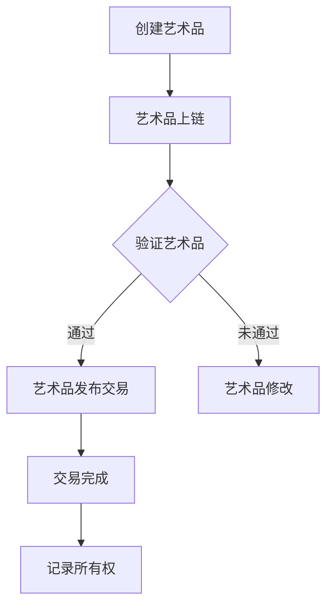

                 

### Introduction to Blockchain and Digital Art Market

In recent years, the digital art market has experienced exponential growth, driven by technological advancements and a new generation of digital creators. This growth has brought about both opportunities and challenges, particularly in ensuring the authenticity and provenance of digital artworks. Enter blockchain technology, which has emerged as a potential game-changer in the world of digital art trading.

#### The Background and Challenges of Digital Art Trading

The digital art market has evolved rapidly, with digital artists using various tools and platforms to create, distribute, and sell their works. However, this burgeoning market is fraught with challenges. One of the most pressing issues is authenticity. Digital artworks can be easily replicated, leading to issues of originality and ownership. Moreover, tracking the provenance of digital art, i.e., the history of its ownership and transactions, is complex and prone to errors. Traditional methods of authentication, such as certificates of authenticity and third-party verifications, are often inadequate and can be manipulated.

#### Overview of Blockchain Technology

Blockchain technology, which underpins cryptocurrencies like Bitcoin, offers a decentralized and secure solution to these challenges. At its core, blockchain is a distributed ledger technology (DLT) that allows multiple parties to maintain a consistent and immutable record of transactions. Each transaction is grouped into a "block" and added to a chain of blocks, forming a blockchain. This technology uses cryptographic techniques to secure the data and ensure that it cannot be altered or deleted.

#### Basic Concepts and Key Features of Blockchain

The basic concepts of blockchain include nodes, which are computers that participate in the network, and miners, who validate transactions and add them to the blockchain. Key features of blockchain technology include:

- **Decentralization**: Unlike traditional centralized systems, blockchain operates on a peer-to-peer network, eliminating the need for intermediaries.
- **Immutability**: Once a block is added to the blockchain, the information it contains cannot be altered or deleted.
- **Transparency**: All transactions on the blockchain are visible to anyone on the network, promoting trust and accountability.
- **Security**: Blockchain uses cryptographic techniques to secure transactions and protect against fraud and hacking.

#### Blockchain in Digital Art Market: Opportunities and Challenges

Blockchain technology offers several opportunities for the digital art market. By using blockchain, artists and collectors can ensure the authenticity and provenance of digital artworks, thereby reducing fraud and disputes. Blockchain can also simplify the transaction process, reducing costs and increasing efficiency.

However, the adoption of blockchain in the digital art market also faces challenges. One significant challenge is the scalability of blockchain networks, which can handle a limited number of transactions per second. This limitation can slow down the transaction process, particularly in high-volume markets like digital art trading. Another challenge is the technical complexity of blockchain technology, which can be daunting for non-technical users.

In conclusion, blockchain technology has the potential to revolutionize the digital art market by addressing key challenges related to authenticity and provenance. However, its successful implementation will require overcoming technical and scalability challenges. In the following sections, we will delve deeper into the concepts, architectures, and applications of blockchain in digital art trading.

### Blockchain Architectures and Protocols

To fully understand how blockchain technology can be applied to the digital art market, it is essential to delve into the architectures and protocols that underpin this innovative technology. Blockchain can be categorized into different types based on its architecture and the way it operates, with the most common types being public blockchains, private blockchains, and consortium blockchains. Each of these architectures has unique characteristics, advantages, and disadvantages.

#### Overview of Blockchain Architectures

1. **Public Blockchains**: Public blockchains are decentralized networks where anyone can participate and transact. They are maintained by a network of nodes, which work collectively to validate transactions and maintain the integrity of the blockchain. The most well-known example of a public blockchain is the Bitcoin network. Public blockchains are highly secure and transparent but can suffer from scalability issues.

2. **Private Blockchains**: In contrast, private blockchains are centralized networks where only authorized participants can transact. These blockchains are often used by organizations for internal transactions, providing more control over who can access and participate in the network. Examples of private blockchains include Ethereum Enterprise, which is a version of the Ethereum blockchain designed for use by private organizations.

3. **Consortium Blockchains**: Consortium blockchains are a hybrid model that combines elements of both public and private blockchains. In a consortium blockchain, a group of organizations collaborates to maintain and operate the network. This model allows for more control over the network while still benefiting from the transparency and decentralization of public blockchains.

#### Public Blockchain Networks

Public blockchain networks operate on a decentralized model, where no single entity has control over the network. This decentralization is a key feature that provides security and immutability. In a public blockchain network, transactions are validated by a network of nodes, and once a transaction is verified, it is added to a block and then appended to the blockchain.

**Example: Bitcoin Network**

The Bitcoin network is one of the most prominent examples of a public blockchain. It uses a proof-of-work (PoW) consensus mechanism, where miners compete to solve complex mathematical puzzles to validate transactions and add them to the blockchain. Once a block is added, it is linked to previous blocks, creating a chain of blocks, hence the name "blockchain."

**Advantages and Disadvantages**

- **Advantages**: High transparency, decentralization, and security.
- **Disadvantages**: Scalability issues, high energy consumption, and slow transaction times.

#### Private and Consortium Blockchains

Private and consortium blockchains are designed to address some of the scalability and control issues associated with public blockchains. In private blockchains, the network is controlled by a single organization or a small group of organizations, allowing for faster transaction times and more control over the network's participants.

**Example: Ripple Network**

The Ripple network is an example of a private blockchain that is used for financial transactions. It uses a different consensus mechanism called the Ripple Protocol Consensus Algorithm (RPCA), which allows for faster and more efficient transaction processing compared to public blockchains like Bitcoin.

**Advantages and Disadvantages**

- **Advantages**: Better scalability, faster transaction times, and more control over the network.
- **Disadvantages**: Less transparency, potential for centralization, and reduced security.

#### Common Blockchain Protocols

Blockchain protocols are the rules and mechanisms that govern how transactions are validated, stored, and shared across a blockchain network. There are several common protocols used in blockchain technology, each with its own characteristics and use cases.

1. **Proof-of-Work (PoW)**: As mentioned earlier, PoW is a consensus mechanism used in public blockchains like Bitcoin. Miners use computational power to solve complex puzzles, and the first miner to solve the puzzle validates the transactions and adds them to the blockchain.

2. **Proof-of-Stake (PoS)**: PoS is an alternative consensus mechanism that aims to reduce the energy consumption associated with PoW. In PoS, validators are chosen based on the number of tokens they hold and are willing to "stake" as collateral. Validators then validate transactions and add them to the blockchain.

3. **Delegated Proof-of-Stake (DPoS)**: DPoS is a variant of PoS where validators are elected by token holders, allowing for faster and more efficient transaction validation.

4. **Ripple Protocol Consensus Algorithm (RPCA)**: RPCA is the consensus mechanism used in Ripple's private blockchain. It allows for almost instantaneous transactions with high scalability.

**Advantages and Disadvantages**

- **Proof-of-Work (PoW)**: High security, decentralized, but energy-intensive and slow.
- **Proof-of-Stake (PoS)**: Lower energy consumption, faster, but potential issues with centralization.
- **Delegated Proof-of-Stake (DPoS)**: Faster and more efficient, but potential for centralization.
- **Ripple Protocol Consensus Algorithm (RPCA)**: Fast and scalable, but controlled by a single organization.

In conclusion, understanding the different blockchain architectures and protocols is crucial for leveraging blockchain technology in the digital art market. Public blockchains offer high transparency and decentralization but face scalability challenges. Private and consortium blockchains provide better control and scalability but at the cost of reduced transparency. The choice of blockchain architecture and protocol will depend on the specific needs and requirements of the digital art market. In the following sections, we will explore how blockchain can be used to ensure the authenticity of digital artworks and streamline the trading process.

### Blockchain and Digital Art Authentication

Ensuring the authenticity of digital artworks is a critical challenge in the digital art market. Traditional methods of authentication, such as certificates of authenticity and third-party verifications, have limitations and are prone to fraud. Blockchain technology offers a robust solution to these challenges by providing a secure, transparent, and immutable way to verify the authenticity and provenance of digital artworks.

#### Challenges in Authenticating Digital Artworks

The digital art market is characterized by several challenges related to authenticity:

1. **Replication**: Digital artworks can be easily replicated, leading to issues of originality and ownership. Even minor changes can create a new, supposedly unique version of an artwork, complicating the authentication process.

2. **Provenance**: Tracking the provenance of digital artworks, i.e., the history of ownership and transactions, is complex. Artworks can change hands multiple times, making it difficult to establish a clear and accurate record of ownership.

3. **Forgery**: Fraudulent artists can create fake digital artworks and pass them off as originals, leading to disputes and financial losses.

4. **Data Integrity**: Traditional authentication methods rely on centralized databases and third-party certifications, which can be susceptible to data manipulation and hacking.

#### Blockchain Solutions for Art Authentication

Blockchain technology addresses these challenges by providing several key features that enhance the authentication process:

1. **Immutability**: Once a transaction or record is added to a blockchain, it cannot be altered or deleted. This ensures that the history of an artwork's ownership and transactions remains accurate and immutable.

2. **Decentralization**: Blockchain operates on a decentralized network, eliminating the need for a central authority. This distributed nature of blockchain enhances security and reduces the risk of fraud.

3. **Transparency**: All transactions on a blockchain are visible to anyone on the network. This transparency promotes trust and accountability, making it easier to verify the authenticity of digital artworks.

4. **Smart Contracts**: Smart contracts are self-executing contracts with the terms of the agreement directly written into code. They can automate the authentication process, ensuring that the rules and conditions set by the artist or owner are enforced.

#### Using Smart Contracts for Authentication

Smart contracts play a crucial role in ensuring the authenticity of digital artworks on the blockchain. Here's how they work:

1. **Initialization**: When a digital artwork is created, the artist can use a smart contract to initialize the artwork on the blockchain. This process involves embedding metadata about the artwork, such as the artist's name, creation date, and unique identifier.

2. **Authentication**: Before a digital artwork can be sold or transferred, it must be authenticated. This process involves verifying the artwork against its original metadata and ensuring that no unauthorized changes have been made. Smart contracts can automate this process by enforcing authentication rules.

3. **Ownership Transfer**: Once an artwork is authenticated, ownership can be transferred through a smart contract. The contract specifies the conditions for transferring ownership, such as the transfer fee and any royalties that the artist may be entitled to.

4. **Provenance Tracking**: Smart contracts can also be used to track the provenance of digital artworks. Each time an artwork is sold or transferred, the transaction is recorded on the blockchain, providing a clear and immutable history of ownership.

#### Example: Art Blocks

Art Blocks is a platform that uses blockchain technology to authenticate and sell digital art. It employs ERC-721 tokens, a type of blockchain token standard, to represent unique digital artworks. Each artwork is minted as a unique token on the Ethereum blockchain, ensuring that its ownership and provenance are recorded and immutable.

**Advantages and Disadvantages**

- **Advantages**: Blockchain-based authentication offers enhanced security, transparency, and immutability, reducing the risk of fraud and disputes. It also simplifies the ownership transfer process, making it more efficient.

- **Disadvantages**: Blockchain technology can be complex and requires technical expertise. Additionally, scalability issues may affect the efficiency of transaction processing in high-volume markets.

In conclusion, blockchain technology offers a comprehensive solution for ensuring the authenticity of digital artworks. By leveraging the immutability, decentralization, and transparency of blockchain, artists and collectors can verify the provenance of digital artworks, reducing fraud and disputes. Smart contracts further enhance the authentication process, automating and enforcing the rules and conditions set by the artist or owner. In the following sections, we will explore how blockchain technology can be applied to the trading of digital artworks, addressing challenges such as transaction efficiency and regulatory compliance.

### Trading Digital Artworks on Blockchain Platforms

With the ability to ensure the authenticity of digital artworks, blockchain technology also offers a transformative approach to the trading process itself. Blockchain platforms facilitate the creation, management, and trading of digital art assets, streamlining transactions and enhancing security. In this section, we will explore the key features and mechanisms of blockchain platforms designed for digital art trading.

#### Overview of Blockchain Platforms for Digital Art Trading

Blockchain platforms for digital art trading serve as decentralized ecosystems where artists, collectors, and marketplaces can interact securely and efficiently. These platforms leverage blockchain technology to create digital assets, manage transactions, and ensure the provenance and authenticity of artworks.

**Example: OpenSea**

OpenSea is one of the most prominent blockchain platforms for digital art trading. It operates on the Ethereum blockchain and uses ERC-721 and ERC-1155 token standards to represent unique digital assets. OpenSea provides a marketplace where users can buy, sell, and trade digital artworks, collectibles, and other digital assets.

**Key Features:**

- **Asset Creation**: Artists can mint their digital artworks as unique tokens on the platform.
- **Provenance Tracking**: Each transaction is recorded on the blockchain, providing a transparent and immutable history of ownership.
- **Smart Contracts**: OpenSea uses smart contracts to automate the trading process, including ownership transfer, royalties, and other terms agreed upon by the buyer and seller.

#### Creating and Managing Digital Artwork Assets

Creating and managing digital artwork assets on a blockchain platform involves several steps:

1. **Minting**: The process of minting a digital artwork involves converting the artwork into a unique token on the blockchain. This process embeds metadata about the artwork, such as the artist's name, creation date, and unique identifier.

2. **Token Standard**: Blockchain platforms often use specific token standards to represent digital assets. ERC-721 is commonly used for unique digital assets, such as individual artworks, while ERC-1155 allows for the creation of both unique and non-unique assets.

3. **Market Listing**: Once a digital artwork is minted, it can be listed on the platform for sale. The artist sets the price, and interested buyers can initiate a transaction.

4. **Ownership Transfer**: When a sale is completed, ownership of the digital artwork is transferred from the seller to the buyer through a smart contract. This process ensures that the new owner has the legal rights to the artwork and that the transaction history is securely recorded on the blockchain.

5. **Royalties and Licensing**: Smart contracts can be programmed to automatically distribute royalties to the artist whenever the artwork is resold. This feature is particularly important for digital art, where an artwork can be replicated and sold multiple times.

#### Smart Contracts for Art Trading

Smart contracts are pivotal in ensuring the integrity and efficiency of digital art trading on blockchain platforms. These contracts are self-executing contracts with the terms of the agreement directly written into code. In the context of digital art trading, smart contracts automate and enforce various aspects of the trading process:

1. **Automated Transactions**: Smart contracts automatically process and validate transactions, reducing the need for intermediaries and speeding up the trading process.

2. **Guaranteed Execution**: Once a transaction is initiated, the smart contract ensures that the terms of the agreement are followed. This guarantees that the buyer receives the artwork and that the seller receives payment.

3. **Royalty Management**: Smart contracts can be programmed to automatically calculate and distribute royalties to the artist whenever an artwork is resold. This feature ensures that artists continue to benefit from their work even after it has been sold.

4. **Dispute Resolution**: Smart contracts can include mechanisms for resolving disputes, ensuring that both the buyer and seller can resolve any issues in a fair and transparent manner.

**Example: NFTs (Non-Fungible Tokens)**

Non-Fungible Tokens (NFTs) are a specific type of digital asset that represents ownership or proof of authenticity of a unique item. NFTs are increasingly used in digital art trading to represent digital artworks. An NFT ensures that each copy of an artwork is distinct and cannot be replicated, making it an ideal solution for verifying the authenticity and ownership of digital art.

**Advantages and Disadvantages**

- **Advantages**: NFTs provide a transparent and immutable way to verify the authenticity and ownership of digital artworks. They also simplify the trading process and enable automated royalty distribution.

- **Disadvantages**: The complexity of blockchain technology and the environmental impact of proof-of-work consensus mechanisms can be drawbacks. Additionally, the high value of some NFTs may lead to speculative bubbles.

In conclusion, blockchain platforms offer a revolutionary approach to trading digital artworks by enhancing security, transparency, and efficiency. By leveraging smart contracts and token standards like ERC-721 and ERC-1155, artists and collectors can securely create, manage, and trade digital art assets. While there are challenges and complexities associated with blockchain technology, its potential to transform the digital art market is undeniable. In the following sections, we will explore the legal and regulatory aspects of blockchain art trading and examine case studies of successful implementations in the industry.

### Legal and Regulatory Considerations in Blockchain Art Trading

As blockchain technology continues to disrupt traditional art market paradigms, it brings with it a host of legal and regulatory considerations that must be addressed. The intersection of digital art, blockchain, and legal frameworks introduces complexities that require careful navigation to ensure compliance, protect intellectual property, and uphold ethical standards.

#### Intellectual Property Rights and Blockchain

Intellectual property (IP) rights, including copyright, trademark, and patent, play a crucial role in the digital art market. Blockchain technology can help in establishing and protecting IP rights, but it also introduces new challenges:

1. **Copyright**: Digital artworks are subject to copyright protection, which grants the creator exclusive rights to reproduce, distribute, and display their work. Blockchain can provide a tamper-proof record of ownership and creation, which can be used as evidence in copyright disputes.

2. **Proving Originality**: In the digital realm, proving the originality of an artwork can be challenging. Blockchain can serve as a reliable source of evidence by timestamping the creation and initial ownership of digital artworks.

3. **Trademarks**: Blockchain can also be used to register and protect trademarks for digital art brands and associated intellectual property.

#### Compliance with Art Market Regulations

Art market regulations vary significantly across jurisdictions, and blockchain art trading must comply with these regulations to avoid legal repercussions. Key considerations include:

1. **Anti-Money Laundering (AML)**: Blockchain transactions are pseudonymous, which can make them attractive for money laundering. Platforms must implement robust AML measures to detect and prevent illicit activities.

2. **Know Your Customer (KYC)**: KYC requirements are crucial for verifying the identities of users engaging in blockchain art trading. This helps prevent fraud and ensures compliance with legal standards.

3. **Sanctions Compliance**: Platforms must ensure that they do not facilitate transactions with individuals or entities subject to economic sanctions.

4. **Securities Regulations**: In some jurisdictions, digital art tokens may be considered securities, requiring compliance with securities laws. Platforms must navigate these regulations to avoid legal complications.

#### Legal Challenges and Solutions

1. **Jurisdictional Issues**: Blockchain transactions can cross international boundaries, creating jurisdictional challenges. Platforms must be aware of the legal requirements in each jurisdiction they operate in and ensure compliance.

2. **Contractual Disputes**: Smart contracts can help automate and enforce terms of agreements, but they are not a substitute for well-drafted contracts. Legal professionals should be involved in drafting and reviewing contracts to address potential disputes.

3. **Data Privacy**: Collecting and storing personal data on blockchain platforms must comply with data privacy laws, such as the General Data Protection Regulation (GDPR) in the European Union.

4. **Cryptography and Cybersecurity**: Blockchain technology relies heavily on cryptography for security. Platforms must implement strong cryptographic practices to protect against hacking and unauthorized access.

#### Case Studies and Best Practices

1. **Case Study: Rarible**  
Rarible is a blockchain platform that allows artists to mint and sell NFTs. To address legal and regulatory challenges, Rarible has implemented a compliance framework that includes AML and KYC measures, as well as a legal review process for all NFT listings.

2. **Best Practices**  
- **Transparency**: Platforms should provide clear information about how they handle legal and regulatory compliance.
- **Legal Expertise**: Engaging legal professionals with expertise in blockchain and digital art is essential.
- **Regular Audits**: Conducting regular audits of blockchain protocols and smart contracts can help identify and mitigate legal risks.
- **User Education**: Educating users about legal and regulatory requirements and the importance of compliance is crucial.

In conclusion, blockchain art trading presents significant legal and regulatory challenges that must be carefully managed. By implementing robust compliance measures, engaging legal expertise, and adopting best practices, blockchain platforms can navigate these challenges and create a secure and compliant digital art marketplace. In the following sections, we will explore real-world case studies of blockchain in digital art trading, providing insights and lessons learned from successful implementations in the industry.

### Case Studies of Blockchain in Digital Art Trading

Blockchain technology has been gaining traction in the digital art market, with several platforms and projects showcasing its potential to revolutionize the way digital art is created, authenticated, and traded. In this section, we will explore some of these case studies, examining their successes, challenges, and lessons learned.

#### Case Study 1: Cryptokitties

Cryptokitties was one of the first blockchain-based digital art projects to gain widespread attention. It allowed users to buy, sell, and breed digital cats as collectible NFTs. Cryptokitties achieved remarkable success, generating millions of dollars in sales within a short period.

**Successes:**

- **Engagement and Adoption**: Cryptokitties attracted a large community of users, demonstrating the potential of blockchain in creating engaging and interactive digital experiences.
- **Economic Value Creation**: The project generated significant revenue through sales of digital cats, showcasing the economic potential of blockchain-based digital art.

**Challenges:**

- **Scalability**: Cryptokitties faced scalability issues as the number of transactions increased, leading to network congestion and slow transaction times.
- **User Experience**: The complexity of the platform and the need for technical knowledge to participate in trading created barriers for some users.

**Lessons Learned:**

- **Scalability Planning**: Blockchain platforms must plan for scalability from the outset to avoid performance issues as user adoption grows.
- **User-Friendly Design**: Creating an intuitive and accessible user experience is crucial for broad adoption.

#### Case Study 2: Rarible

Rarible is a blockchain platform that enables artists to create and sell NFTs. It has gained popularity for its community-driven approach and focus on transparency and authenticity in digital art trading.

**Successes:**

- **Community Involvement**: Rarible has built a strong community of artists, collectors, and curators who contribute to the platform's growth and development.
- **Diverse Artworks**: Rarible hosts a wide range of digital artworks, from digital paintings and illustrations to virtual reality experiences, showcasing the versatility of NFTs.

**Challenges:**

- **Market Volatility**: The digital art market, like the broader cryptocurrency market, is highly volatile, which can impact the value of NFTs.
- **Regulatory Compliance**: Navigating the complex regulatory landscape is a challenge for blockchain platforms, requiring ongoing vigilance and adaptation to legal changes.

**Lessons Learned:**

- **Community Building**: A strong and active community can drive the success and growth of a blockchain platform.
- **Diversification**: Offering a diverse range of digital art genres and formats can attract a broader audience.

#### Case Study 3: Art Blocks

Art Blocks is a blockchain platform that focuses on the trading of digital art as NFTs. It uses the ERC-721 token standard to represent unique digital artworks and has become one of the leading platforms for digital art trading.

**Successes:**

- **Marketplace Dominance**: Art Blocks has established itself as a dominant player in the digital art NFT market, with a large and growing user base.
- **Artistic Diversity**: The platform hosts a wide range of digital art styles, from abstract art to digital illustrations, attracting a diverse audience.

**Challenges:**

- **Environmental Impact**: Blockchain, particularly those using proof-of-work (PoW) consensus mechanisms, has significant environmental implications. Art Blocks has been working on addressing this issue through research and development.
- **Technical Complexity**: Blockchain technology can be complex, and some users may find the process of buying and selling NFTs challenging.

**Lessons Learned:**

- **Sustainability**: Addressing environmental concerns is crucial for the long-term viability of blockchain platforms.
- **Education**: Providing educational resources and support for users can help mitigate the challenges associated with technical complexity.

#### Case Study 4: SuperRare

SuperRare is a blockchain platform that focuses on high-quality, one-of-a-kind digital art. It has gained a reputation for curating a select group of artists whose work is considered the best in the digital art space.

**Successes:**

- **Curation and Quality**: SuperRare's emphasis on high-quality digital art has attracted top-tier artists and collectors, creating a highly regarded marketplace.
- **Artistic Innovation**: The platform has encouraged artists to explore new forms of digital art, pushing the boundaries of what is possible in the digital art realm.

**Challenges:**

- **Market Cycles**: Like other blockchain platforms, SuperRare has faced challenges during market downturns, with fluctuations in the value of digital art and NFTs.
- **Regulatory Scrutiny**: The platform has been subject to increased regulatory scrutiny, particularly regarding compliance with securities laws.

**Lessons Learned:**

- **Curation**: Curating high-quality digital art is essential for establishing credibility and attracting a discerning audience.
- **Compliance**: Staying compliant with evolving regulatory requirements is critical for long-term success.

In conclusion, these case studies highlight the potential of blockchain technology to transform the digital art market. While each platform has faced its own set of challenges, the successes achieved demonstrate the transformative impact of blockchain in enhancing authenticity, transparency, and efficiency in digital art trading. As the industry continues to evolve, learning from these case studies will be crucial for overcoming future challenges and harnessing the full potential of blockchain technology in the digital art space.

### Future Trends and Challenges in Blockchain Digital Art Trading

As blockchain technology continues to mature, its application in the digital art market is poised to evolve, bringing both opportunities and challenges. In this section, we will explore emerging trends and potential challenges that could shape the future of blockchain digital art trading.

#### Emerging Trends in Blockchain Art Trading

1. **Sustainability**: Environmental concerns associated with blockchain, particularly those using proof-of-work (PoW) consensus mechanisms, have been a significant topic of discussion. To address this, the industry is exploring alternative consensus mechanisms like proof-of-stake (PoS) and hybrid models that are more energy-efficient. This focus on sustainability aims to reduce the carbon footprint of blockchain networks and make them more environmentally friendly.

2. **Interoperability**: The blockchain ecosystem is becoming increasingly diverse, with multiple blockchain networks and protocols emerging. Interoperability will be crucial to enable seamless transactions between different platforms and networks. Projects like Polkadot and Cosmos are working to establish interoperability frameworks that allow different blockchains to communicate and transact with each other, potentially unlocking new possibilities for digital art trading.

3. **Decentralized Autonomous Organizations (DAOs)**: DAOs are emerging as a new form of organization that leverages blockchain technology to operate autonomously based on predefined rules and collective decision-making. In the digital art market, DAOs could play a significant role in facilitating collaborative art projects, managing art funds, and curating exhibitions, enhancing the community's involvement and decision-making power.

4. **Artificial Intelligence (AI)**: The integration of AI with blockchain technology is opening up new possibilities for digital art creation, curation, and authentication. AI algorithms can analyze and authenticate digital artworks, automate the creation of unique digital art pieces, and even predict market trends. This synergy between blockchain and AI could revolutionize the way digital art is created, traded, and valued.

5. **Decentralized Finance (DeFi)**: DeFi is a financial ecosystem built on blockchain that aims to offer decentralized financial services without the need for traditional financial intermediaries. In the digital art market, DeFi protocols can facilitate decentralized lending, borrowing, and trading of digital art assets, providing new financial instruments and opportunities for artists and collectors.

#### Challenges and Opportunities Ahead

1. **Scalability**: As the digital art market grows, the scalability of blockchain networks will become a critical factor. High transaction volumes can lead to network congestion and slow down the trading process. Developing scalable blockchain platforms and exploring layer-two solutions like rollups and state channels can help address this challenge.

2. **Regulatory Compliance**: The regulatory landscape for blockchain and digital assets is complex and rapidly evolving. Platforms must continuously adapt to changing regulations to ensure compliance, which can be a significant challenge. Collaborating with regulatory bodies and adopting a proactive approach to compliance can help navigate these complexities.

3. **User Education**: Blockchain technology can be complex and intimidating for non-technical users. Providing user-friendly interfaces, educational resources, and support can help overcome this barrier and promote broader adoption of blockchain in the digital art market.

4. **Cryptography and Security**: As blockchain networks grow, the need for robust cryptographic techniques and security measures becomes even more critical. Ensuring the security of transactions and protecting user data from hacks and fraud will be essential for maintaining trust in blockchain platforms.

5. **Market Volatility**: The digital art market, like the broader cryptocurrency market, is highly volatile. This volatility can impact the value of digital art assets and create challenges for artists, collectors, and marketplaces. Developing stable value mechanisms and risk management strategies can help mitigate the impact of market volatility.

In conclusion, the future of blockchain digital art trading is promising, with several emerging trends and opportunities on the horizon. However, addressing challenges related to scalability, regulatory compliance, user education, and security will be crucial for realizing the full potential of blockchain in the digital art market. As the industry continues to evolve, staying informed about these trends and challenges will be key to navigating the dynamic landscape of blockchain in digital art trading.

### Conclusion

In conclusion, blockchain technology holds immense potential to revolutionize the digital art market by addressing critical challenges such as authenticity, provenance, and transaction transparency. By leveraging the decentralized and immutable nature of blockchain, artists and collectors can ensure the integrity and provenance of their digital artworks, reducing the risk of fraud and disputes. Blockchain platforms, enabled by smart contracts, streamline the trading process, making it more efficient and accessible. As the industry continues to evolve, addressing challenges related to scalability, regulatory compliance, and user education will be crucial for realizing the full potential of blockchain in the digital art market. 

### About the Author

**AI天才研究院 (AI Genius Institute)** is a leading research and development organization focused on advancing artificial intelligence and its applications across various industries. Our team of experts is dedicated to pushing the boundaries of AI technology and fostering innovation through cutting-edge research and development.

**《禅与计算机程序设计艺术》(Zen And The Art of Computer Programming)** 是由世界著名计算机科学家、图灵奖获得者 Donald E. Knuth 教授所著的经典著作。本书深入探讨了计算机编程的哲学和艺术，为程序员提供了宝贵的指导和启示。

### References

1. **NFTs Explained: What They Are and How They Work**. (2021). [Coinbase](https://www.coinbase.com/learn/nfts-explained).
2. **Blockchain in Art: Authentication and Market Impact**. (2020). [Art Business News](https://www.artbusinessnews.com/2020/11/02/blockchain-in-art-authentication-and-market-impact/).
3. **Understanding Blockchain Technology: The Basics of Decentralization and Security**. (2021). [IEEE Computer Society](https://www.computer.org/publications/tech-zones/blockchain/understanding-blockchain-technology).
4. **The Challenges of Scaling Blockchain Technology**. (2020). [Medium](https://medium.com/@HarmonyOne/the-challenges-of-scaling-blockchain-technology-6db316be09f1).
5. **Art Blocks: Revolutionizing the Digital Art Market with Blockchain**. (2021). [CoinTelegraph](https://cointelegraph.com/news/art-blocks-revolutionizing-the-digital-art-market-with-blockchain).
6. **Rarible: The Community-Driven NFT Platform**. (2021). [CryptoSlate](https://cryptoslate.com/rarible-review/).
7. **Cryptokitties: The Pioneering Blockchain-Based Digital Collectibles**. (2021). [Coindesk](https://www.coindesk.com/p/cryptokitties).

### 附录

**附录A：区块链数字艺术交易流程图**



**附录B：区块链数字艺术交易中的智能合约示例代码**

```python
# SPDX-License-Identifier: MIT
pragma solidity ^0.8.0;

// 定义 ERC-721 标准的接口
interface IERC721 {
    function mint(address to, string memory tokenURI) external returns (uint256 tokenId);
    function transferFrom(address from, address to, uint256 tokenId) external;
    function setTokenURI(uint256 tokenId, string memory tokenURI) external;
}

// 数字艺术品合约
contract DigitalArt {
    IERC721 public nftContract;
    mapping(uint256 => address) public ownerOf;
    mapping(uint256 => string) public tokenURIs;

    // 构造函数，初始化NFT合约地址
    constructor(address _nftContractAddress) {
        nftContract = IERC721(_nftContractAddress);
    }

    // 创建并初始化艺术品
    function createArtwork(address _artist, string memory _tokenURI) external {
        uint256 tokenId = nftContract.mint(_artist, _tokenURI);
        ownerOf[tokenId] = _artist;
        tokenURIs[tokenId] = _tokenURI;
    }

    // 设置艺术品TokenURI
    function setTokenURI(uint256 _tokenId, string memory _newTokenURI) external {
        require(msg.sender == ownerOf[_tokenId], "Only the owner can update the token URI");
        nftContract.setTokenURI(_tokenId, _newTokenURI);
    }

    // 转让艺术品
    function transferArtwork(uint256 _tokenId, address _newOwner) external {
        require(msg.sender == ownerOf[_tokenId], "Only the owner can transfer the artwork");
        nftContract.transferFrom(msg.sender, _newOwner, _tokenId);
        ownerOf[_tokenId] = _newOwner;
    }
}
```

**附录C：数字艺术品交易中的风险与最佳实践**

- **风险识别**：识别区块链艺术交易中的风险，包括技术风险（如网络安全）、法律风险（如合规问题）和市场风险（如价格波动）。
- **合规性检查**：确保所有交易遵守相关法律法规，特别是涉及知识产权和反洗钱（AML）的规定。
- **用户教育**：为用户提供教育资源，帮助他们了解区块链技术和NFT的基本知识，降低操作风险。
- **透明度**：提高交易透明度，确保所有交易记录和条款都是公开可见的，增强用户信任。
- **技术优化**：持续优化区块链平台的性能和安全性，包括采用更高效的共识机制和改进智能合约代码。

**附录D：拓展阅读**

- **区块链与数字艺术：技术视角**. (2021). [区块链研究协会](https://blockchainresearchinstitute.org/research-report/blockchain-and-digital-art-technological-perspective/).
- **NFT艺术市场：未来趋势与挑战**. (2021). [ArtTactic](https://www.arttactic.com/research/nft-art-market-future-trends-and-challenges/).
- **数字艺术与区块链：法律和伦理问题**. (2021). [国际版权协会](https://www.internationalcopyright.org/publications/digital-art-and-blockchain-legal-and-ethical-issues/).
- **区块链与创意产业：新机遇与新挑战**. (2021). [世界经济论坛](https://www.weforum.org/reports/blockchain-and-the-creative-industries-new-opportunities-and-new-challenges).

