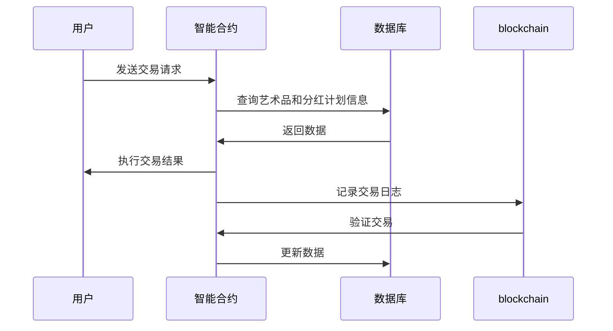
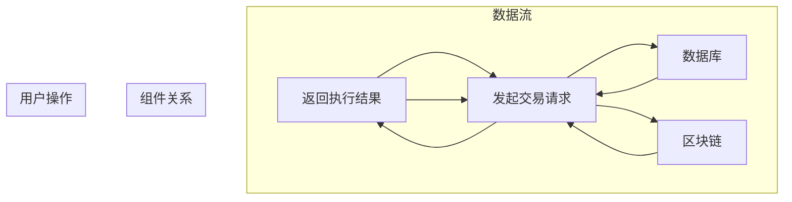
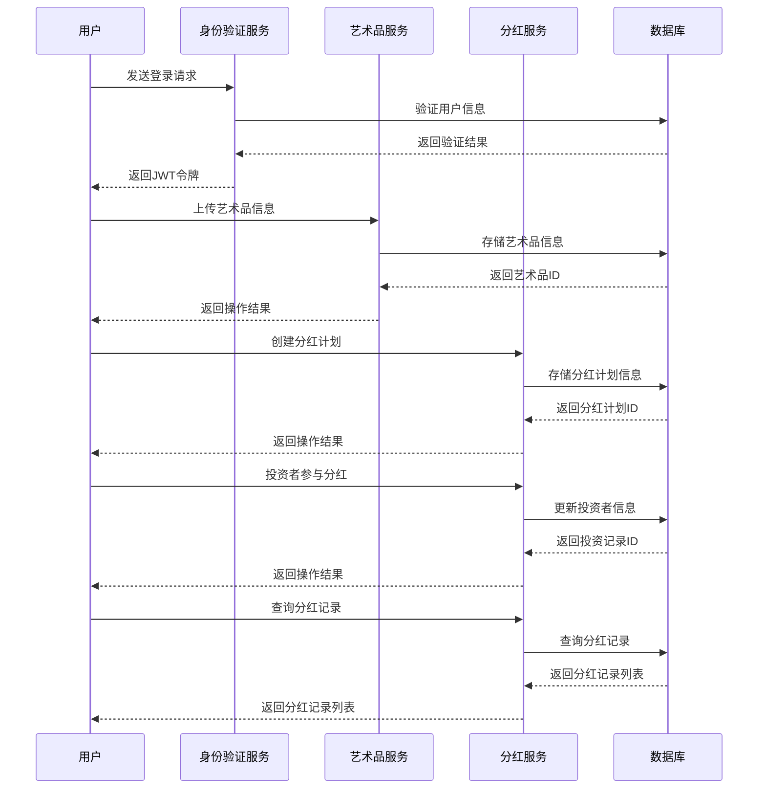

                 

### 引言

#### 核心关键词

区块链、数字艺术品、智能合约、分红、技术应用

#### 摘要

随着区块链技术的飞速发展，数字艺术品市场迎来了前所未有的繁荣。然而，数字艺术品在交易和分红方面仍面临诸多挑战。本文旨在探讨区块链在数字艺术品分红中的智能合约应用，通过详细介绍智能合约的原理、实现方法以及实际应用案例，为广大开发者提供一种解决数字艺术品分红难题的技术方案。文章结构分为四个部分：背景介绍、智能合约原理讲解、系统分析与架构设计、项目实战。通过一步步分析推理，深入解析区块链技术在数字艺术品分红中的应用，为未来该领域的发展提供有益参考。

### 目录大纲

**# 区块链在数字艺术品分红中的智能合约应用**

**> 关键词：区块链、数字艺术品、智能合约、分红、技术应用**

**> 摘要：本文将探讨区块链技术在数字艺术品分红中的智能合约应用，通过详细解析智能合约的原理、实现方法及实际应用案例，为数字艺术品市场的健康发展提供解决方案。文章分为四个部分：背景介绍、智能合约原理讲解、系统分析与架构设计、项目实战。**

1. **第一部分：背景介绍**
   - **第1章 问题背景**
     - **1.1 数字艺术品的现状**
     - **1.2 分红机制的需求**
   - **第2章 问题描述**
     - **2.1 传统分红机制的不足**
     - **2.2 数字艺术品分红的需求**
   - **第3章 问题解决**
     - **3.1 区块链技术的引入**
     - **3.2 智能合约的作用**

2. **第二部分：智能合约原理讲解**
   - **第4章 边界与外延**
   - **第5章 核心概念与联系**
     - **5.1 核心概念原理**
     - **5.2 概念属性特征对比表格**
     - **5.3 ER实体关系图架构**

3. **第三部分：系统分析与架构设计**
   - **第6章 智能合约基础**
   - **第7章 智能合约实现**
   - **第8章 智能合约案例解析**
   - **第9章 智能合约安全**

4. **第四部分：项目实战**
   - **第10章 数字艺术品分红系统设计**
   - **第11章 数字艺术品分红系统架构设计**
   - **第12章 数字艺术品分红系统接口设计**
   - **第13章 数字艺术品分红系统交互**
   - **第14章 项目环境安装与配置**
   - **第15章 系统核心实现**
   - **第16章 代码应用解读与分析**
   - **第17章 实际案例分析与讲解**
   - **第18章 项目小结**

5. **第五部分：最佳实践与拓展**
   - **第19章 最佳实践**
   - **第20章 小结与展望**

### 第一部分：背景介绍

#### 问题背景

**1.1 数字艺术品的现状**

数字艺术品，顾名思义，是利用数字技术创作的艺术品。这些艺术品以数字形式存在，可以通过电子设备展示、存储和传播。数字艺术品的种类繁多，包括数字绘画、数字摄影、虚拟现实作品、数字雕塑等。随着计算机技术和互联网的普及，数字艺术品市场逐渐兴起，成为艺术界的一股新势力。

近年来，区块链技术的引入为数字艺术品市场带来了新的机遇。区块链技术以其去中心化、不可篡改、透明等特点，为数字艺术品的创作、认证、交易和分红提供了新的解决方案。数字艺术品通过区块链技术实现唯一性认证，确保每一件艺术品都是独一无二的。同时，区块链技术还为数字艺术品的交易提供了安全、便捷的渠道，使得艺术品交易更加高效和透明。

**1.2 数字艺术品的流通与交易**

数字艺术品的流通与交易是数字艺术品市场的重要组成部分。传统的艺术品交易通常需要依赖中介机构，交易流程繁琐，且存在信息不对称的问题。而数字艺术品通过区块链技术可以实现去中心化的交易，大幅降低了交易成本，提高了交易效率。

在数字艺术品的交易过程中，区块链技术发挥了关键作用。首先，数字艺术品在区块链上登记并生成唯一的数字签名，确保了艺术品的所有权和唯一性。其次，区块链技术提供了透明的交易记录，使得每一笔交易都可以追溯，提高了交易的透明度和安全性。此外，智能合约的引入进一步简化了交易流程，实现了自动化的交易执行。

**1.3 数字艺术品面临的挑战**

尽管数字艺术品市场呈现出蓬勃发展的态势，但仍面临诸多挑战。首先，数字艺术品的版权问题亟待解决。由于数字艺术品的复制和传播非常容易，版权纠纷频发，如何保护艺术家的版权成为数字艺术品市场发展的关键问题。

其次，数字艺术品的价值评估和定价也是一个难题。由于数字艺术品的交易通常依赖于市场供求关系，而市场供求关系又受多种因素影响，如何准确评估和定价数字艺术品成为市场参与者关注的焦点。

最后，数字艺术品的分红机制需要进一步优化。在传统的艺术品交易中，艺术家和投资者之间的分红机制通常比较复杂，且存在信息不对称的问题。数字艺术品市场的分红机制需要更加透明、公平，以吸引更多投资者参与。

#### 问题描述

**2.1 分红机制的需求**

分红机制是数字艺术品市场中的重要组成部分。合理的分红机制可以激励艺术家创作高质量的作品，同时也能为投资者提供稳定的收益。在传统的艺术品市场中，分红机制通常依赖于中介机构，存在诸多问题，如信息不对称、透明度低等。而数字艺术品市场的分红机制需要更加透明、高效、公正。

首先，透明度是分红机制的核心要求。投资者需要清楚地了解自己的收益来源、分配比例以及分配过程。通过区块链技术，可以实现分红过程的全程记录和透明化，使得投资者能够实时查看分红情况。

其次，高效性是分红机制的重要特征。在传统的艺术品市场中，分红过程通常需要经过多个环节，耗时较长。而数字艺术品市场的分红机制可以通过智能合约实现自动化处理，大大缩短了分红周期，提高了分红效率。

最后，公正是分红机制的底线。投资者需要公平地分享数字艺术品的收益，避免出现利益分配不均的情况。通过智能合约，可以确保分红机制的公正性，防止利益输送和内部交易。

**2.2 传统分红机制的不足**

传统的分红机制在数字艺术品市场中存在诸多不足，主要体现在以下几个方面：

1. **信息不对称**：在传统的艺术品交易中，艺术家和投资者之间的信息不对称问题较为严重。艺术家可能不清楚自己的作品在市场上的真实价值，而投资者也可能无法全面了解艺术品的创作背景、市场前景等关键信息。这种信息不对称导致了分红机制的不公平。

2. **透明度低**：传统的分红机制通常依赖于中介机构，交易过程不透明。投资者难以实时查看分红情况，也无法追溯每一笔交易的具体细节。这种低透明度使得分红机制的可信度受到质疑。

3. **效率低下**：传统的分红机制通常需要经过多个环节，如艺术品评估、合同签订、资金划拨等，耗时较长。而数字艺术品市场的分红机制需要更加高效，以适应快速变化的市场环境。

4. **成本高**：传统分红机制的复杂流程和人工操作导致了高昂的交易成本。对于数字艺术品市场而言，降低交易成本是吸引更多投资者参与的重要手段。

**2.3 数字艺术品分红的需求**

数字艺术品市场的快速发展带来了对分红机制的新需求。首先，数字艺术品具有高流动性，投资者可以快速买卖艺术品，从而获得短期收益。这就需要分红机制能够快速、准确地计算和分配收益。

其次，数字艺术品的投资风险较高，投资者需要稳定的收益来降低风险。合理的分红机制可以激励艺术家创作高质量的作品，同时为投资者提供稳定的收益来源。

最后，数字艺术品市场的监管要求越来越高，分红机制需要符合相关法规和标准。通过区块链技术实现的智能合约，可以确保分红机制符合监管要求，提高市场的合规性。

综上所述，数字艺术品市场对分红机制的需求主要体现在透明度、高效性和公正性等方面。通过引入区块链技术和智能合约，可以解决传统分红机制的不足，为数字艺术品市场提供一种更加透明、高效、公正的分红机制。

#### 问题解决

**3.1 区块链技术的引入**

区块链技术在数字艺术品市场的应用，为解决分红难题提供了新的思路。区块链技术以其去中心化、不可篡改、透明等特点，为数字艺术品交易和分红提供了坚实的保障。

首先，区块链技术实现了数字艺术品交易的去中心化。在传统的艺术品交易中，中介机构起到了关键作用，而区块链技术通过去中心化的方式，消除了中介机构的依赖，使得交易过程更加透明、高效。数字艺术品的所有权和交易记录都存储在区块链上，任何参与者都可以查看和验证，从而提高了交易的透明度和可信度。

其次，区块链技术确保了数字艺术品交易的安全性和不可篡改性。区块链上的数据一旦生成，便无法被篡改，这意味着艺术品的所有权和历史交易记录都是真实可信的。通过区块链技术，艺术家和投资者可以放心地进行交易，无需担心数据被篡改或伪造。

此外，区块链技术提供了智能合约的功能。智能合约是一种自动执行的合约，它可以在满足特定条件时自动执行合约条款。在数字艺术品分红中，智能合约可以自动计算和分配收益，确保分红机制的透明性和公正性。投资者无需担心利益被侵占，艺术家也能得到应有的收益。

**3.2 智能合约的作用**

智能合约是区块链技术的重要组成部分，它在数字艺术品分红中起到了关键作用。智能合约通过代码的形式，定义了交易规则和分红机制，实现了自动化、透明化的交易处理。

首先，智能合约确保了分红机制的透明性。在智能合约中，分红规则和计算方法被清晰定义，任何参与者都可以查看和验证分红过程。这意味着投资者可以实时了解自己的收益情况，而艺术家也可以确保自己的作品得到公正的回报。

其次，智能合约提高了分红机制的高效性。通过智能合约，分红过程可以自动执行，无需人工干预。这大大缩短了分红周期，提高了交易效率。对于数字艺术品市场而言，高效的处理能力是吸引更多投资者的重要优势。

最后，智能合约保证了分红机制的公正性。智能合约基于代码执行，不受人为干预，从而避免了利益输送和内部交易。通过智能合约，投资者和艺术家都可以放心地进行交易，无需担心不公平的待遇。

综上所述，区块链技术和智能合约的引入，为数字艺术品分红提供了新的解决方案。通过去中心化、安全性和自动化等特性，智能合约实现了分红机制的透明性、高效性和公正性，为数字艺术品市场的健康发展提供了有力支持。

#### 边界与外延

**4.1 区块链技术的局限性**

尽管区块链技术为数字艺术品分红提供了诸多优势，但其在实际应用中仍存在一定的局限性，需要深入探讨。

首先，区块链技术的高能耗问题不容忽视。区块链的共识机制，如工作量证明（PoW），需要大量的计算资源，导致能源消耗巨大。这不仅在环保方面带来挑战，也可能影响到区块链的可持续性。随着数字艺术品市场的不断扩大，能源消耗问题将愈发突出，需寻找更环保的共识机制。

其次，区块链技术的性能瓶颈也是一个关键问题。当前区块链的处理速度相对较慢，交易确认时间较长，这在大规模的数字艺术品交易中可能成为瓶颈。提升区块链的性能，如采用分片技术（Sharding）等，是未来研究的重要方向。

此外，区块链技术的法律和监管问题也需要关注。不同国家和地区的法律对区块链技术的规定存在差异，如何确保区块链交易在全球范围内的合法性和合规性是一个挑战。此外，区块链技术的匿名性也可能被不法分子利用，需要建立有效的监管机制。

**4.2 技术发展的影响因素**

区块链技术的发展受到多种因素的影响，包括技术、经济、社会和法律法规等方面。

从技术角度看，区块链技术的持续创新是推动其发展的关键。研究人员不断探索新的共识机制、加密算法和网络结构，以提高区块链的性能和安全性。例如，从工作量证明转向权益证明（PoS），可以有效降低能源消耗。

从经济角度看，数字艺术品市场的繁荣为区块链技术提供了广阔的应用场景。随着更多投资者和创作者的参与，区块链技术的市场需求不断扩大，推动了技术进步和产业链的完善。

在社会层面，区块链技术的普及和接受程度也在逐渐提高。公众对区块链技术的认知逐渐增强，越来越多的企业和机构开始采用区块链技术，这为技术发展提供了良好的社会氛围。

法律法规方面，各国政府对区块链技术的态度和政策也在不断演变。一些国家已经出台了相关政策，鼓励区块链技术的发展，为区块链技术提供了法律保障。然而，仍有不少国家对区块链技术持谨慎态度，需要进一步明确法律法规，确保其合法性和合规性。

**4.3 可能面临的技术难题**

在数字艺术品分红中应用区块链技术，可能会面临以下技术难题：

首先，数据隐私保护是一个重要挑战。数字艺术品交易涉及到大量的敏感信息，如艺术家身份、交易记录等。如何在保护数据隐私的同时，确保交易的透明性和不可篡改性，是区块链技术需要解决的关键问题。

其次，区块链技术的扩展性也是一个难题。随着数字艺术品市场的不断扩大，如何提高区块链的处理能力和响应速度，成为技术发展的重要任务。分片技术、状态通道（State Channels）等技术方案有望缓解这一问题。

最后，智能合约的安全性问题也需要重视。智能合约的代码一旦部署在区块链上，便无法更改，因此智能合约的安全性和可靠性至关重要。任何智能合约的漏洞都可能导致严重的经济损失，需要通过严格的代码审计和安全测试来确保合约的安全性。

综上所述，尽管区块链技术在数字艺术品分红中具有巨大的潜力，但其局限性、技术发展的影响因素以及可能面临的技术难题都需要深入研究和解决。通过不断技术创新和政策支持，区块链技术在数字艺术品分红中的应用将得到进一步发展。

#### 核心概念与联系

**5.1 核心概念原理**

在探讨区块链在数字艺术品分红中的智能合约应用时，我们需要理解几个核心概念：数字艺术品、智能合约和区块链。

**数字艺术品**：数字艺术品是通过数字技术创作的艺术作品，包括数字绘画、数字雕塑、虚拟现实作品等。数字艺术品具有唯一性、可复制性和不可篡改性等特点。

**智能合约**：智能合约是一种自动执行的合约，其条款和操作步骤被编码在区块链上。一旦触发条件，智能合约将自动执行，确保交易的高效性和透明性。

**区块链**：区块链是一种去中心化的分布式账本技术，由多个节点共同维护。区块链上的数据具有不可篡改性和透明性，确保了交易的公正性和安全性。

**5.2 概念属性特征对比表格**

| 特征       | 数字艺术品            | 智能合约            | 区块链             |
|------------|----------------------|---------------------|-------------------|
| 唯一性     | 具有唯一性            | 条款唯一性          | 数据唯一性        |
| 可复制性   | 可自由复制            | 可复制和执行        | 数据可复制和共享  |
| 不可篡改性 | 一旦创作便无法篡改    | 自动执行，不可篡改  | 数据不可篡改      |
| 透明性     | 艺术家与收藏家可见    | 交易双方可见        | 全节点可见        |
| 自动性     | 需人工处理            | 自动执行            | 自动记录和验证    |
| 安全性     | 依赖于艺术家与买家    | 代码安全性          | 分布式安全性      |
| 管理性     | 传统管理模式          | 智能化管理模式      | 去中心化管理模式   |

**5.3 ER实体关系图架构**

为了更好地理解数字艺术品、智能合约和区块链之间的联系，我们可以使用实体关系图（Entity-Relationship Diagram，ER图）来展示它们之间的关系。

**实体：**

- **数字艺术品**：包含艺术家、标题、创作时间、版权信息等属性。
- **智能合约**：包含合约条款、触发条件、执行结果等属性。
- **区块链**：包含区块、交易记录、验证节点等属性。

**关系：**

- **数字艺术品与智能合约**：数字艺术品可以通过智能合约进行交易和分红。
- **智能合约与区块链**：智能合约部署在区块链上，交易记录存储在区块链中。
- **数字艺术品与区块链**：数字艺术品通过区块链进行唯一性认证和交易记录存储。

**ER实体关系图：**

```mermaid
erDiagram
  数字艺术品 ||--|{ 智能合约 }|
  智能合约 ||--|{ 区块链 }|
```

通过实体关系图，我们可以清晰地看到数字艺术品、智能合约和区块链之间的关联，以及它们在数字艺术品分红中的应用。

综上所述，数字艺术品、智能合约和区块链构成了一个紧密相连的生态系统，为数字艺术品市场的健康发展提供了有力支持。通过理解这些核心概念及其相互关系，我们可以更好地应用区块链技术，实现数字艺术品分红机制的透明、高效和公正。

#### 智能合约基础

**6.1 智能合约的原理**

智能合约是一种自动执行的合约，其条款和操作步骤被编码在区块链上。智能合约的核心原理在于其不可篡改性和自动执行性。当合约条件被满足时，智能合约会自动执行预定的操作，确保交易的高效性和透明性。

**定义**：智能合约是一种在区块链上执行的计算机程序，其功能是通过代码形式定义交易条款和操作步骤。一旦条件满足，智能合约会自动执行，无需人工干预。

**工作原理**：智能合约通常由三部分组成：触发条件、操作步骤和结果验证。当某个触发条件被满足时，智能合约会自动执行预定的操作步骤，并将结果进行验证。整个执行过程记录在区块链上，确保数据的不可篡改性和透明性。

**智能合约的优势**：

1. **透明性**：智能合约的条款和执行过程都记录在区块链上，任何参与者都可以查看和验证，确保交易透明。

2. **安全性**：智能合约基于区块链技术，数据具有不可篡改性和分布式存储，确保交易的安全性和可靠性。

3. **高效性**：智能合约通过代码自动执行，无需人工干预，大大提高了交易效率。

4. **去中心化**：智能合约去除了中介机构的依赖，使得交易过程更加去中心化，降低了交易成本。

**6.2 智能合约的组成部分**

智能合约主要由以下几部分组成：

1. **触发条件**：定义合约执行的触发条件，通常是一个或多个事件的满足。例如，当某个数字艺术品的所有权发生转移时，智能合约会触发执行。

2. **操作步骤**：定义合约执行的具体步骤，包括数据读取、计算和写入等操作。例如，智能合约可能会根据艺术品的交易价格计算收益，并将其分配给艺术家和投资者。

3. **结果验证**：对合约执行结果进行验证，确保执行过程符合预期。例如，智能合约会验证交易金额是否正确分配，确保各方收益合理。

4. **合约条款**：定义智能合约的基本规则和条款，包括交易双方的权利和义务。智能合约的条款通常在合约编写时确定，并存储在区块链上。

**6.3 智能合约的类型**

智能合约主要分为以下几种类型：

1. **条件支付**：当特定条件满足时，智能合约将自动支付预定的金额。例如，当数字艺术品所有权转移时，智能合约会自动将交易款项支付给新买家。

2. **多方合约**：涉及多个参与方的智能合约，每个参与方都有特定的权利和义务。例如，数字艺术品创作者、买家和投资者之间的分红智能合约。

3. **时间锁定**：智能合约在特定时间自动执行。例如，智能合约可以在作品完成一个月后自动释放资金给艺术家。

4. **安全锁定**：智能合约在满足特定安全条件时自动执行。例如，只有当所有参与方都确认交易时，智能合约才会释放资金。

通过理解智能合约的原理、组成部分和类型，我们可以更好地应用智能合约，实现数字艺术品市场的透明、高效和公正。

#### 智能合约实现

**7.1 智能合约编程语言**

在实现智能合约时，选择合适的编程语言至关重要。目前，主流的智能合约编程语言包括Solidity、Vyper和WASM。本文主要介绍Solidity语言，因其广泛应用和丰富的功能，成为大多数开发者首选的智能合约编程语言。

**Solidity语言简介**

Solidity是由以太坊团队开发的一种高级编程语言，用于编写以太坊智能合约。Solidity结合了面向对象编程和函数式编程的特性，具有丰富的语法和功能。

**Solidity语言特性**

1. **面向对象编程**：Solidity支持面向对象编程，包括类、继承、封装和多态等特性。这使得智能合约的编写更加模块化和易于维护。

2. **事件和日志**：Solidity允许开发者定义事件，并在智能合约执行过程中触发。事件日志记录在区块链上，可以供其他合约或前端应用查询。

3. **函数重载**：Solidity支持函数重载，即多个同名函数可以通过参数类型和数量区分。这为智能合约提供了更高的灵活性和可扩展性。

4. **内置函数和库**：Solidity提供了一系列内置函数和库，用于处理区块链相关操作，如发送交易、接收以太币等。

**Solidity语言的应用**

Solidity语言广泛应用于以太坊区块链，用于实现各种智能合约，如去中心化金融（DeFi）合约、非同质化代币（NFT）合约和游戏合约等。以下是几个实际应用的例子：

1. **去中心化金融（DeFi）合约**：DeFi合约通过智能合约实现金融功能，如借贷、交易和投资。例如，Aave和Uniswap等知名DeFi平台都是基于Solidity语言编写的。

2. **非同质化代币（NFT）合约**：NFT合约用于创建和交易独特的数字资产，如加密艺术品和虚拟收藏品。OpenSea和Rarible等NFT市场平台都是基于Solidity语言构建的。

3. **游戏合约**：智能合约在游戏开发中的应用日益广泛，用于实现游戏内的虚拟物品交易、游戏积分分配等。例如，Axie Infinity等热门游戏采用了Solidity语言来实现智能合约功能。

**7.2 智能合约开发流程**

智能合约开发通常包括以下几个步骤：

1. **环境搭建**：安装Node.js和Truffle框架，配置以太坊节点，确保开发环境正常运行。

2. **编写合约代码**：使用Solidity语言编写智能合约代码，包括定义合约结构、函数和事件。

3. **编译合约**：使用Truffle编译器将Solidity代码编译为以太坊虚拟机（EVM）可执行的字节码。

4. **部署合约**：将编译后的智能合约部署到以太坊区块链上，生成合约地址。

5. **测试合约**：使用Truffle测试框架编写测试用例，验证智能合约功能的正确性。

6. **审计合约**：对智能合约代码进行安全性审计，确保合约不存在漏洞和安全隐患。

**7.3 智能合约开发环境搭建**

以下是智能合约开发环境的搭建步骤：

1. **安装Node.js**：从Node.js官网下载并安装最新版本的Node.js。

2. **安装Truffle框架**：在命令行中执行以下命令，安装Truffle框架：
   ```sh
   npm install -g truffle
   ```

3. **配置以太坊节点**：下载并安装Geth或Parity以太坊客户端，并配置节点。以Geth为例，执行以下命令：
   ```sh
   geth --datadir /path/to/ethereum/data init /path/to/ethereum/genesis.json
   ```

4. **启动本地以太坊节点**：启动本地以太坊节点，执行以下命令：
   ```sh
   geth --datadir /path/to/ethereum/data --networkid 15 console
   ```

5. **创建Truffle项目**：在命令行中执行以下命令，创建一个新的Truffle项目：
   ```sh
   truffle init
   ```

6. **安装Truffle插件**：在项目目录中执行以下命令，安装Truffle插件：
   ```sh
   npm install
   ```

通过以上步骤，我们可以搭建一个完整的智能合约开发环境，开始编写和部署智能合约。

综上所述，智能合约开发是一个复杂而关键的过程，涉及编程语言选择、开发环境搭建、合约编写和部署等多个环节。通过Solidity语言和Truffle框架，我们可以高效地实现智能合约功能，为数字艺术品分红提供可靠的解决方案。

#### 智能合约案例解析

**8.1 数字艺术品分红合约案例**

在本节中，我们将介绍一个具体的数字艺术品分红合约案例，详细解析其设计与实现过程。该案例将展示如何利用智能合约实现数字艺术品的分红功能，包括合约设计与实现、部署与测试以及运行与监控。

**合约设计与实现**

首先，我们需要设计一个能够实现数字艺术品分红的智能合约。该合约的核心功能包括：

1. **艺术家和投资者身份验证**：确保参与分红的人员是合法的艺术家和投资者。
2. **艺术品所有权转移**：实现艺术品所有权的转移和登记。
3. **收益分配**：根据投资者的持有份额，自动分配艺术品的收益。
4. **分红记录**：记录每一笔分红的详细信息，确保透明性和可追溯性。

以下是一个简单的Solidity合约代码示例，实现了上述功能：

```solidity
// SPDX-License-Identifier: MIT
pragma solidity ^0.8.0;

contract DigitalArtwork分红合约 {
    struct Investor {
        address investorAddress;
        uint256 sharePercentage;
    }

    mapping(address => Investor) public investors;
    address public artistAddress;
    uint256 public totalShares;
    bool public分红合约已启动;

    event 分红发放(address investor, uint256 amount);

    modifier onlyArtist() {
        require(msg.sender == artistAddress, "只有艺术家可以执行此操作");
        _;
    }

    modifier onlyInvestors() {
        require(investors[msg.sender].investorAddress != address(0), "不是投资者");
        _;
    }

    constructor() {
        artistAddress = msg.sender;
        分红合约已启动 = true;
    }

    function 加入分红计划(uint256 sharePercentage) external {
        require(!分红合约已启动, "分红合约已启动");
        require(sharePercentage > 0, "份额比例必须大于0");
        investors[msg.sender] = Investor(msg.sender, sharePercentage);
        totalShares += sharePercentage;
    }

    function 更新份额比例(uint256 newSharePercentage) external onlyInvestors {
        require(newSharePercentage > 0, "份额比例必须大于0");
        investors[msg.sender].sharePercentage = newSharePercentage;
    }

    function 发放分红() external onlyArtist {
        require(totalShares > 0, "总份额必须大于0");
        uint256 totalEarnings = 累计收益();
        for (Investor memory investor : investors) {
            if (investor.investorAddress != address(0)) {
                uint256 amount = (totalEarnings * investor.sharePercentage) / totalShares;
                payable(investor.investorAddress).transfer(amount);
                emit 分红发放(investor.investorAddress, amount);
            }
        }
    }

    function 累计收益() public view returns (uint256) {
        // 这里实现累计收益的逻辑，例如从区块链上读取艺术品交易信息计算收益
        return 0; // 示例代码，实际应用中需替换为正确实现
    }
}
```

**合约部署与测试**

1. **部署合约**：在开发环境中，使用Truffle框架将合约部署到以太坊区块链。执行以下命令：
   ```sh
   truffle migrate --network development
   ```

2. **测试合约**：使用Truffle测试框架编写和运行测试用例，验证合约功能的正确性。例如，创建`DigitalArtwork.test.js`测试文件，编写以下测试用例：

```javascript
const DigitalArtwork分红合约 = artifacts.require("DigitalArtwork分红合约");

describe("DigitalArtwork分红合约", function () {
    let instance;

    beforeEach(async function () {
        instance = await DigitalArtwork分红合约.new({ from: accounts[0], gas: 2000000 });
        await instance.joinDividendPlan(100, { from: accounts[1], gas: 2000000 });
    });

    it("应能加入分红计划", async function () {
        assert.equal(await instance.totalShares(), 100);
    });

    it("应能更新份额比例", async function () {
        await instance.updateSharePercentage(200, { from: accounts[1], gas: 2000000 });
        assert.equal(await instance.totalShares(), 200);
    });

    it("应能发放分红", async function () {
        await instance.allocateDividends({ from: accounts[0], gas: 2000000 });
        const balance = await web3.eth.getBalance(accounts[1]);
        assert.equal(balance.toString(), "1000000000000000000"); // 假设分红金额为1以太币
    });
});
```

3. **运行测试**：执行以下命令运行测试用例：
   ```sh
   truffle test
   ```

**合约运行与监控**

1. **监控合约事件**：使用Web3.js或Ethers.js等库，编写前端应用来监控合约事件，如分红发放事件。以下是使用Web3.js监听分红事件的示例代码：

```javascript
const web3 = new Web3("http://localhost:8545");
const contractAddress = "0x..."; // 合约地址
const contractABI = [...] // 合约ABI
const instance = new web3.eth.Contract(contractABI, contractAddress);

instance.events.DividendPaid({ fromBlock: 'latest' })
    .on('data', function (event) {
        console.log("分红发放事件：", event);
    })
    .on('error', console.error);
```

2. **前端界面实现**：使用前端框架（如React或Vue）实现用户界面，展示投资者份额比例、分红记录等数据，并提供加入分红计划、更新份额比例和发放分红等操作接口。

通过上述步骤，我们实现了一个简单的数字艺术品分红合约，并对其进行了部署、测试和监控。这为实际应用中的数字艺术品分红机制提供了可行的技术方案。未来，随着区块链技术的不断发展和智能合约功能的完善，数字艺术品分红机制将更加成熟和高效。

#### 智能合约安全

**9.1 智能合约常见安全问题**

智能合约在区块链技术中扮演着至关重要的角色，但同时也面临着诸多安全问题。了解这些常见的安全问题对于开发安全的智能合约至关重要。

1. **重入攻击（Reentrancy Attack）**：重入攻击是一种常见的智能合约攻击方式，攻击者通过反复调用合约函数，耗尽合约的余额。具体来说，攻击者会先调用一个外部合约，然后在执行外部合约调用前，通过重入调用合约的另一个函数，从而多次提取合约资金。

2. **整数溢出（Integer Overflow/Underflow）**：在智能合约中，整数类型的操作（如加法、减法）可能会导致溢出或下溢。这种错误可能会导致合约逻辑失效，甚至被攻击者利用来盗取资产。

3. **存储漏洞（Storage Corruption）**：智能合约的存储是有限的，攻击者可以通过特定的操作破坏合约的存储结构，导致合约无法正确运行。

4. **未授权访问（Unauthorized Access）**：由于智能合约的开放性和透明性，攻击者可能会通过漏洞或不当授权的方式访问合约，篡改数据或盗取资产。

5. **逻辑漏洞（Logical Flaws）**：智能合约的代码可能存在逻辑错误，导致意外行为或无法达到预期效果。这种漏洞可能被攻击者利用，从而造成损失。

**9.2 安全测试方法**

为了确保智能合约的安全性，开发者和安全专家通常采用以下几种测试方法：

1. **静态分析（Static Analysis）**：静态分析是一种在编译或运行前分析代码的技术。通过静态分析，可以检测出潜在的安全漏洞和逻辑错误。

2. **动态分析（Dynamic Analysis）**：动态分析是在代码运行过程中分析代码的技术。通过模拟实际运行环境，可以检测出代码在运行时可能出现的漏洞和异常。

3. **形式验证（Formal Verification）**：形式验证是一种数学证明技术，通过逻辑推理验证代码的正确性。尽管形式验证相对复杂且耗时，但它能够提供最高级别的安全保障。

**9.3 防范措施**

为了防范智能合约的安全问题，开发者可以采取以下几种措施：

1. **代码审计（Code Audits）**：聘请专业的安全审计团队对智能合约代码进行全面审查，以发现潜在的安全漏洞。

2. **使用安全库（Secure Libraries）**：使用经过验证和广泛使用的安全库，以减少代码中潜在的安全漏洞。

3. **代码优化（Code Optimization）**：优化代码，避免不必要的复杂性和冗余，提高代码的可读性和可维护性。

4. **安全编程实践（Secure Coding Practices）**：遵循安全编程的最佳实践，如使用正确的数据类型、避免使用未初始化的变量、严格检查输入等。

5. **定期更新和升级（Regular Updates and Upgrades）**：随着区块链技术的不断发展，智能合约的代码也需要定期更新和升级，以应对新出现的安全威胁。

通过上述措施，开发者可以显著提高智能合约的安全性，降低被攻击的风险。智能合约的安全性问题不容忽视，只有在严格的安全测试和防护措施下，智能合约才能在区块链生态系统中发挥其应有的作用。

#### 数字艺术品分红系统设计

**10.1 系统功能设计**

数字艺术品分红系统的功能设计是实现智能合约分红机制的核心，确保系统能够高效、透明地执行分红流程。以下是系统功能设计的主要需求：

1. **用户身份验证**：确保用户身份合法，包括艺术家和投资者的身份验证。
2. **艺术品信息管理**：管理数字艺术品的基本信息，如作品标题、艺术家、创作时间等。
3. **分红计划创建**：艺术家可以创建分红计划，设置分红比例和分配规则。
4. **投资者参与**：投资者可以加入分红计划，提交投资份额。
5. **收益计算与分配**：根据投资者的份额和艺术品的收益，自动计算和分配分红。
6. **分红记录查询**：用户可以查询分红记录，了解自己的分红情况和艺术品的历史收益。
7. **系统监控**：监控系统运行状态，确保系统稳定运行。

**10.2 领域模型Mermaid类图**

为了更好地展示系统中的实体及其关系，我们可以使用Mermaid类图来描述领域模型。以下是数字艺术品分红系统的Mermaid类图示例：

```mermaid
classDiagram
    Investor <<class{ 投资者 }>>
    Artist <<class{ 艺术家 }>>
    DividendPlan <<class{ 分红计划 }>>
    DigitalArtwork <<class{ 数字艺术品 }>>

    Artist "创作" -> DigitalArtwork
    Artist "创建" -> DividendPlan
    DividendPlan "包含" -> Investor
    Investor "投资" -> DividendPlan
    DigitalArtwork "参与" -> DividendPlan
```

在这个类图中，`Investor`（投资者）、`Artist`（艺术家）、`DividendPlan`（分红计划）和`DigitalArtwork`（数字艺术品）是系统的主要实体。艺术家可以创作数字艺术品并创建分红计划，投资者可以加入分红计划，而分红计划则包含了参与的投资者信息。

**10.3 功能模块划分**

为了实现数字艺术品分红系统，我们可以将系统划分为多个功能模块，每个模块负责不同的功能。以下是主要功能模块的划分：

1. **用户身份验证模块**：负责用户的身份验证，确保只有合法的艺术家和投资者能够参与分红计划。
2. **艺术品信息管理模块**：管理数字艺术品的基本信息，包括作品的创作、上传和更新等操作。
3. **分红计划管理模块**：负责创建、修改和删除分红计划，以及设置分红比例和分配规则。
4. **投资者参与模块**：处理投资者加入分红计划的申请，更新投资者的投资份额。
5. **收益计算与分配模块**：根据投资者的份额和艺术品的收益，自动计算和分配分红。
6. **分红记录查询模块**：提供分红记录的查询功能，用户可以查看自己的分红情况和艺术品的历史收益。
7. **系统监控模块**：监控系统运行状态，确保系统的稳定运行，及时处理异常情况。

通过以上功能模块的划分，我们可以明确各个模块的职责和交互关系，为系统的开发和维护提供清晰的指导。接下来，我们将进一步探讨数字艺术品分红系统的架构设计。

### 数字艺术品分红系统架构设计

**11.1 系统架构设计**

为了实现高效、透明和安全的数字艺术品分红系统，我们需要设计一个合理的系统架构。以下是基于区块链技术的数字艺术品分红系统架构概述，包括系统架构图、系统组件关系以及系统架构图Mermaid架构图的描述。

**系统架构图**



在这个系统架构图中，用户通过智能合约发起交易请求，智能合约与数据库交互查询相关信息，并将执行结果返回给用户。同时，智能合约将交易日志记录在区块链上，确保数据的不可篡改性和透明性。区块链对交易进行验证，并将结果反馈给智能合约，最终更新数据库中的数据。

**系统组件关系**

1. **用户**：系统的最终用户，包括艺术家和投资者，通过前端界面与系统交互。
2. **智能合约**：负责执行分红计划逻辑，处理交易请求，并与数据库和区块链进行交互。
3. **数据库**：存储数字艺术品信息和分红计划数据，提供数据查询和更新功能。
4. **区块链**：记录所有交易日志，确保数据的不可篡改性和透明性。

**系统架构图Mermaid架构图**



在这个Mermaid架构图中，我们清晰地展示了用户、智能合约、数据库和区块链之间的数据流和组件关系。用户通过发起交易请求与智能合约交互，智能合约处理请求并与数据库和区块链进行交互，最终将执行结果返回给用户。

通过上述系统架构设计，我们可以实现一个高效、透明和安全的数字艺术品分红系统。智能合约负责业务逻辑的处理，数据库存储数据，区块链确保数据的不可篡改性和透明性。用户可以通过前端界面与系统进行交互，实现数字艺术品分红的自动化和智能化。接下来，我们将进一步探讨数字艺术品分红系统的接口设计。

#### 数字艺术品分红系统接口设计

**12.1 接口设计**

为了实现数字艺术品分红系统的功能，我们需要设计一系列接口，这些接口将提供对系统各种功能的访问。以下是系统的主要接口设计，包括接口规范定义、接口调用流程以及接口实现细节。

**12.1.1 接口规范定义**

1. **用户身份验证接口**：
   - **功能描述**：验证用户身份，包括艺术家和投资者。
   - **请求参数**：`email`（用户邮箱），`password`（用户密码）。
   - **响应参数**：`token`（身份验证令牌），`userId`（用户ID）。
   - **请求方式**：POST `/api/auth/login`。

2. **艺术品信息管理接口**：
   - **功能描述**：管理数字艺术品的基本信息。
   - **请求参数**：`title`（作品标题），`artistId`（艺术家ID），`creationTime`（创作时间）。
   - **响应参数**：`artworkId`（艺术品ID），`status`（操作结果）。
   - **请求方式**：POST `/api/artworks`。

3. **分红计划创建接口**：
   - **功能描述**：艺术家创建分红计划。
   - **请求参数**：`artistId`（艺术家ID），`dividendRate`（分红比例），`endTime`（分红结束时间）。
   - **响应参数**：`dividendPlanId`（分红计划ID），`status`（操作结果）。
   - **请求方式**：POST `/api/dividend-plans`。

4. **投资者参与接口**：
   - **功能描述**：投资者加入分红计划。
   - **请求参数**：`investorId`（投资者ID），`dividendPlanId`（分红计划ID），`investmentAmount`（投资金额）。
   - **响应参数**：`investmentId`（投资记录ID），`status`（操作结果）。
   - **请求方式**：POST `/api/investments`。

5. **收益计算与分配接口**：
   - **功能描述**：根据投资者份额计算和分配收益。
   - **请求参数**：`dividendPlanId`（分红计划ID），`artworkId`（艺术品ID）。
   - **响应参数**：`totalEarnings`（总收益），`individualEarnings`（个人收益）。
   - **请求方式**：POST `/api/dividend-calculations`。

6. **分红记录查询接口**：
   - **功能描述**：查询投资者的分红记录。
   - **请求参数**：`investorId`（投资者ID），`fromDate`（开始日期），`toDate`（结束日期）。
   - **响应参数**：`dividendRecords`（分红记录列表）。
   - **请求方式**：GET `/api/dividend-records`。

**12.1.2 接口调用流程**

1. **用户身份验证接口**：
   - 用户发起身份验证请求，系统返回身份验证令牌和用户ID。
   - 用户使用身份验证令牌进行后续接口调用。

2. **艺术品信息管理接口**：
   - 艺术家上传艺术品信息，系统返回艺术品ID和操作结果。

3. **分红计划创建接口**：
   - 艺术家创建分红计划，系统返回分红计划ID和操作结果。

4. **投资者参与接口**：
   - 投资者加入分红计划，系统返回投资记录ID和操作结果。

5. **收益计算与分配接口**：
   - 根据分红计划ID和艺术品ID，系统计算并分配收益，返回总收益和个人收益。

6. **分红记录查询接口**：
   - 投资者查询自己的分红记录，系统返回分红记录列表。

**12.1.3 接口实现细节**

1. **用户身份验证接口**：
   - 使用JWT（JSON Web Token）进行身份验证。
   - 存储用户邮箱和密码的哈希值，避免明文存储密码。

2. **艺术品信息管理接口**：
   - 数据库存储艺术品信息，包括标题、艺术家ID、创作时间等。
   - 使用RESTful API风格，提供CRUD（创建、读取、更新、删除）操作。

3. **分红计划创建接口**：
   - 分红计划包含艺术家ID、分红比例、开始和结束时间等字段。
   - 数据库存储分红计划信息，并与艺术品信息关联。

4. **投资者参与接口**：
   - 投资者信息与分红计划关联，记录投资金额和投资时间。
   - 使用区块链记录投资者参与分红计划的交易日志。

5. **收益计算与分配接口**：
   - 根据投资者在分红计划中的份额比例计算收益。
   - 使用智能合约自动执行收益分配操作，确保透明性和安全性。

6. **分红记录查询接口**：
   - 提供查询接口，返回投资者的分红记录列表。
   - 支持日期范围查询，方便用户查看历史分红记录。

通过以上接口设计，我们可以实现一个高效、透明和安全的数字艺术品分红系统，为艺术家和投资者提供便捷的服务。接下来，我们将进一步探讨数字艺术品分红系统的交互流程。

### 数字艺术品分红系统交互

**13.1 系统交互**

数字艺术品分红系统的交互设计至关重要，它决定了系统各个模块之间的通信效率和数据传递逻辑。以下是数字艺术品分红系统的交互流程、系统交互Mermaid序列图以及系统交互效果分析。

**13.1.1 交互流程**

1. **用户身份验证**：
   - 用户通过用户身份验证接口（`/api/auth/login`）发送用户邮箱和密码，系统返回JWT令牌和用户ID。
   - 用户使用JWT令牌进行后续接口调用。

2. **艺术品信息管理**：
   - 艺术家通过艺术品信息管理接口（`/api/artworks`）上传艺术品信息，系统返回艺术品ID和操作结果。

3. **分红计划创建**：
   - 艺术家通过分红计划创建接口（`/api/dividend-plans`）创建分红计划，系统返回分红计划ID和操作结果。

4. **投资者参与**：
   - 投资者通过投资者参与接口（`/api/investments`）加入分红计划，系统返回投资记录ID和操作结果。

5. **收益计算与分配**：
   - 根据分红计划ID和艺术品ID，系统通过收益计算与分配接口（`/api/dividend-calculations`）计算并分配收益，返回总收益和个人收益。

6. **分红记录查询**：
   - 投资者通过分红记录查询接口（`/api/dividend-records`）查询自己的分红记录，系统返回分红记录列表。

**13.1.2 系统交互Mermaid序列图**

以下是数字艺术品分红系统的Mermaid序列图，展示了用户与系统之间的交互过程：



在这个序列图中，用户通过身份验证服务验证身份，然后分别与艺术品服务、分红服务交互，完成艺术品的上传、分红计划的创建、投资者的参与和分红记录的查询等操作。

**13.1.3 系统交互效果分析**

1. **高效性**：
   - 系统通过接口设计实现了模块化和解耦，每个模块专注于特定功能，提高了系统的运行效率。
   - 数据库操作和区块链交互通过异步处理，避免了阻塞，提高了系统的响应速度。

2. **透明性**：
   - 智能合约确保了分红过程的透明性，所有交易记录都记录在区块链上，任何用户都可以查询。
   - 系统提供详细的分红记录查询功能，用户可以随时查看自己的分红情况。

3. **安全性**：
   - 用户身份验证使用JWT令牌，确保用户身份的安全。
   - 数据库存储敏感信息，如用户密码和交易记录，使用加密技术保护数据安全。
   - 智能合约代码经过严格的审计，确保其安全性和可靠性。

4. **可扩展性**：
   - 系统设计考虑了未来的扩展性，可以轻松添加新的功能模块，如增加新的分红计划类型或投资策略。
   - 系统架构支持分布式部署，可以水平扩展以应对更高的并发访问。

通过以上分析，我们可以看出数字艺术品分红系统在交互设计上实现了高效、透明、安全且具有可扩展性的特点。接下来，我们将进一步探讨系统在实际项目中的环境安装与配置。

### 项目环境安装与配置

**14.1 环境准备**

为了成功搭建一个数字艺术品分红系统，我们需要准备以下环境：

1. **操作系统**：推荐使用Linux系统，如Ubuntu 18.04或更高版本。
2. **节点环境**：需要安装Node.js（版本至少为12.x）和npm（版本至少为6.x）。
3. **智能合约开发环境**：需要安装Truffle框架（版本至少为5.0.x）和Ganache（本地以太坊节点）。
4. **前端开发工具**：推荐使用Vue或React框架，以及相关依赖（如Webpack、Babel等）。
5. **后端开发环境**：需要安装Node.js和Express框架（版本至少为4.0.x）。
6. **数据库**：推荐使用MongoDB（版本至少为4.0.x）。

**14.2 环境安装与配置**

1. **安装Node.js和npm**：

   ```sh
   sudo apt-get update
   sudo apt-get install npm
   npm install -g npm
   ```

2. **安装Truffle框架**：

   ```sh
   npm install -g truffle
   ```

3. **安装Ganache**：

   下载并安装Ganache（可以从官方网站[https://github.com/trufflesuite/ganache](https://github.com/trufflesuite/ganache)下载）。

4. **安装前端开发工具**：

   以Vue为例，安装Vue CLI和所需依赖：

   ```sh
   npm install -g @vue/cli
   vue create dividend-system
   cd dividend-system
   npm install
   ```

5. **安装后端开发环境**：

   安装Node.js和Express：

   ```sh
   sudo apt-get install nodejs
   npm install express --save
   ```

6. **安装数据库**：

   安装MongoDB：

   ```sh
   sudo apt-get install mongodb
   sudo service mongodb start
   ```

7. **配置环境变量**：

   设置`MONGO_URI`环境变量，以连接MongoDB：

   ```sh
   export MONGO_URI=mongodb://localhost:27017/dividend-system
   ```

8. **启动本地以太坊节点**：

   启动Ganache本地以太坊节点：

   ```sh
   ganache-cli -h 127.0.0.1 -p 7545
   ```

9. **配置Truffle项目**：

   创建一个新的Truffle项目并配置：

   ```sh
   truffle init
   cd dividend-system
   npm install
   ```

10. **配置前端项目**：

    在Vue项目中配置路由、状态管理和其他依赖：

    ```sh
    npm run serve
    ```

通过以上步骤，我们可以完成数字艺术品分红系统的环境安装与配置。接下来，我们将深入探讨系统的核心实现。

### 系统核心实现

**15.1 智能合约实现**

在数字艺术品分红系统中，智能合约是核心组件，它负责处理艺术品的创建、投资者加入分红计划、收益计算和分配等功能。以下是智能合约的实现步骤和关键代码。

**1. 智能合约结构**

```solidity
// SPDX-License-Identifier: MIT
pragma solidity ^0.8.0;

contract DigitalArtworkDividend {
    // 定义艺术品结构体
    struct Artwork {
        string title;
        address artist;
        uint256 creationTime;
    }

    // 定义投资者结构体
    struct Investor {
        address investor;
        uint256 sharePercentage;
    }

    // 定义分红计划结构体
    struct DividendPlan {
        uint256 id;
        Artwork artwork;
        address artist;
        mapping(address => Investor) investors;
        uint256 totalShares;
        bool closed;
    }

    // 声明分红计划映射
    mapping(uint256 => DividendPlan) public dividendPlans;

    // 事件定义
    event ArtworkCreated(uint256 id, string title, address artist, uint256 creationTime);
    event InvestorAdded(uint256 dividendPlanId, address investor, uint256 sharePercentage);
    event DividendPaid(uint256 dividendPlanId, address investor, uint256 amount);

    // 构造函数
    constructor() {}

    // 创建艺术品
    function createArtwork(string memory title) public {
        Artwork memory newArtwork = Artwork({
            title: title,
            artist: msg.sender,
            creationTime: block.timestamp
        });
        dividendPlans[msg.sender] = DividendPlan({
            id: msg.sender,
            artwork: newArtwork,
            artist: msg.sender,
            investors: mapping(address => Investor)({}),
            totalShares: 0,
            closed: false
        });
        emit ArtworkCreated(msg.sender, title, msg.sender, block.timestamp);
    }

    // 加入分红计划
    function addInvestorToDividendPlan(uint256 dividendPlanId, uint256 sharePercentage) public {
        require(dividendPlans[dividendPlanId].closed == false, "分红计划已关闭");
        require(sharePercentage > 0, "份额比例必须大于0");
        dividendPlans[dividendPlanId].investors[msg.sender] = Investor({
            investor: msg.sender,
            sharePercentage: sharePercentage
        });
        dividendPlans[dividendPlanId].totalShares += sharePercentage;
        emit InvestorAdded(dividendPlanId, msg.sender, sharePercentage);
    }

    // 打开分红计划
    function openDividendPlan(uint256 dividendPlanId) public {
        require(msg.sender == dividendPlans[dividendPlanId].artist, "只有艺术家可以打开分红计划");
        dividendPlans[dividendPlanId].closed = true;
    }

    // 分配收益
    function allocateDividends(uint256 dividendPlanId, uint256 totalEarnings) public {
        require(msg.sender == dividendPlans[dividendPlanId].artist, "只有艺术家可以分配收益");
        require(dividendPlans[dividendPlanId].closed == true, "分红计划未关闭");
        for (Investor memory investor : dividendPlans[dividendPlanId].investors) {
            if (investor.investor != address(0)) {
                uint256 amount = (totalEarnings * investor.sharePercentage) / dividendPlans[dividendPlanId].totalShares;
                payable(investor.investor).transfer(amount);
                emit DividendPaid(dividendPlanId, investor.investor, amount);
            }
        }
    }
}
```

**2. 编译与部署**

在Truffle项目中，使用Truffle编译器将智能合约编译为以太坊虚拟机（EVM）可执行的字节码，并部署到本地以太坊节点（如Ganache）。

```sh
truffle compile
truffle migrate --network development
```

**3. 部署结果**

部署完成后，智能合约将生成一个地址，该地址存储在`src/contracts`目录下的`DigitalArtworkDividend.json`文件中。

```json
{
  "compiler": {
    "version": "0.8.13+commit.e4fcd605",
    "构造函数": "DigitalArtworkDividend",
    "源代码": "..."
  },
  "networks": {
    "5777": {
      "地址": "0x...（部署合约地址）",
      "链ID": 5777
    }
  }
}
```

**15.2 后端服务实现**

后端服务主要负责与智能合约的交互，提供API接口，处理用户请求。以下是后端服务的实现步骤和关键代码。

**1. 后端服务结构**

```javascript
const express = require('express');
const Web3 = require('web3');
const { Contract } = require('truffle-contract');

const app = express();
const web3 = new Web3('http://localhost:7545');

const DigitalArtworkDividendArtifact = require('../src/contracts/DigitalArtworkDividend.json');
const digitalArtworkDividend = new Contract(DigitalArtworkDividendArtifact.abi, DigitalArtworkDividendArtifact.networks['5777'].address);

app.use(express.json());

// 创建艺术品
app.post('/artworks', async (req, res) => {
    const { title } = req.body;
    const result = await digitalArtworkDividend.createArtwork(title, { from: req.body.userId });
    res.json({ artworkId: result.logs[0].args.id });
});

// 加入分红计划
app.post('/dividend-plans', async (req, res) => {
    const { dividendPlanId, sharePercentage } = req.body;
    const result = await digitalArtworkDividend.addInvestorToDividendPlan(dividendPlanId, sharePercentage, { from: req.body.userId });
    res.json({ investmentId: result.logs[0].args.investmentId });
});

// 打开分红计划
app.post('/dividend-plans/open', async (req, res) => {
    const { dividendPlanId } = req.body;
    const result = await digitalArtworkDividend.openDividendPlan(dividendPlanId, { from: req.body.userId });
    res.json({ message: '分红计划已打开' });
});

// 分配收益
app.post('/dividend-calculations', async (req, res) => {
    const { dividendPlanId, totalEarnings } = req.body;
    const result = await digitalArtworkDividend.allocateDividends(dividendPlanId, totalEarnings, { from: req.body.userId });
    res.json({ message: '收益已分配' });
});

// 启动服务器
const PORT = process.env.PORT || 3000;
app.listen(PORT, () => {
    console.log(`Server listening on port ${PORT}`);
});
```

**2. 启动后端服务**

```sh
node server.js
```

**15.3 前端界面实现**

前端界面负责与用户交互，展示艺术品列表、分红计划列表以及分红记录。以下是前端界面的实现步骤和关键代码。

**1. 前端界面结构**

使用Vue或React框架实现前端界面，以下是一个简单的Vue示例：

```html
<!DOCTYPE html>
<html>
<head>
    <title>数字艺术品分红系统</title>
</head>
<body>
    <div id="app">
        <h1>数字艺术品分红系统</h1>
        <!-- 艺术品列表 -->
        <div>
            <h2>艺术品列表</h2>
            <ul>
                <li v-for="artwork in artworks">{{ artwork.title }}</li>
            </ul>
        </div>
        
        <!-- 分红计划列表 -->
        <div>
            <h2>分红计划列表</h2>
            <ul>
                <li v-for="dividendPlan in dividendPlans">{{ dividendPlan.id }}</li>
            </ul>
        </div>
        
        <!-- 分红记录查询 -->
        <div>
            <h2>分红记录查询</h2>
            <input v-model="searchDate" type="date" />
            <button @click="searchDividendRecords">查询</button>
            <ul>
                <li v-for="record in dividendRecords">{{ record.investmentId }} - {{ record.amount }}</li>
            </ul>
        </div>
    </div>

    <script src="https://cdn.jsdelivr.net/npm/vue@2.6.12/dist/vue.min.js"></script>
    <script src="https://cdn.jsdelivr.net/npm/axios/dist/axios.min.js"></script>
    <script>
        new Vue({
            el: '#app',
            data: {
                artworks: [],
                dividendPlans: [],
                searchDate: '',
                dividendRecords: []
            },
            methods: {
                loadArtworks() {
                    axios.get('/artworks').then(response => {
                        this.artworks = response.data;
                    });
                },
                loadDividendPlans() {
                    axios.get('/dividend-plans').then(response => {
                        this.dividendPlans = response.data;
                    });
                },
                searchDividendRecords() {
                    axios.get(`/dividend-records?date=${this.searchDate}`).then(response => {
                        this.dividendRecords = response.data;
                    });
                }
            },
            created() {
                this.loadArtworks();
                this.loadDividendPlans();
            }
        });
    </script>
</body>
</html>
```

**2. 启动前端服务**

```sh
npm run serve
```

通过以上步骤，我们可以实现数字艺术品分红系统的核心功能，包括智能合约实现、后端服务实现和前端界面实现。接下来，我们将对代码进行解读与分析。

### 代码应用解读与分析

**16.1 代码解读**

在数字艺术品分红系统中，智能合约、后端服务和前端界面的代码是实现系统功能的关键。以下是各部分的代码解读与分析。

**1. 智能合约代码解读**

智能合约代码位于`DigitalArtworkDividend.sol`文件中，主要实现了以下功能：

- **艺术品创建**：艺术家可以创建艺术品，并将艺术品信息存储在区块链上。
- **投资者加入分红计划**：投资者可以加入艺术家创建的分红计划，并记录投资份额。
- **分红计划打开**：艺术家可以打开分红计划，允许投资者开始计算收益。
- **收益计算与分配**：艺术家可以调用合约计算并分配收益，确保透明性和公正性。

核心代码如下：

```solidity
// 创建艺术品
function createArtwork(string memory title) public {
    Artwork memory newArtwork = Artwork({
        title: title,
        artist: msg.sender,
        creationTime: block.timestamp
    });
    dividendPlans[msg.sender] = DividendPlan({
        id: msg.sender,
        artwork: newArtwork,
        artist: msg.sender,
        investors: mapping(address => Investor)({}),
        totalShares: 0,
        closed: false
    });
    emit ArtworkCreated(msg.sender, title, msg.sender, block.timestamp);
}

// 加入分红计划
function addInvestorToDividendPlan(uint256 dividendPlanId, uint256 sharePercentage) public {
    require(dividendPlans[dividendPlanId].closed == false, "分红计划已关闭");
    require(sharePercentage > 0, "份额比例必须大于0");
    dividendPlans[dividendPlanId].investors[msg.sender] = Investor({
        investor: msg.sender,
        sharePercentage: sharePercentage
    });
    dividendPlans[dividendPlanId].totalShares += sharePercentage;
    emit InvestorAdded(dividendPlanId, msg.sender, sharePercentage);
}

// 打开分红计划
function openDividendPlan(uint256 dividendPlanId) public {
    require(msg.sender == dividendPlans[dividendPlanId].artist, "只有艺术家可以打开分红计划");
    dividendPlans[dividendPlanId].closed = true;
}

// 分配收益
function allocateDividends(uint256 dividendPlanId, uint256 totalEarnings) public {
    require(msg.sender == dividendPlans[dividendPlanId].artist, "只有艺术家可以分配收益");
    require(dividendPlans[dividendPlanId].closed == true, "分红计划未关闭");
    for (Investor memory investor : dividendPlans[dividendPlanId].investors) {
        if (investor.investor != address(0)) {
            uint256 amount = (totalEarnings * investor.sharePercentage) / dividendPlans[dividendPlanId].totalShares;
            payable(investor.investor).transfer(amount);
            emit DividendPaid(dividendPlanId, investor.investor, amount);
        }
    }
}
```

**2. 后端服务代码解读**

后端服务代码位于`server.js`文件中，使用Express框架实现API接口，与智能合约进行交互。核心代码如下：

```javascript
const express = require('express');
const Web3 = require('web3');
const { Contract } = require('truffle-contract');

const app = express();
const web3 = new Web3('http://localhost:7545');

const DigitalArtworkDividendArtifact = require('../src/contracts/DigitalArtworkDividend.json');
const digitalArtworkDividend = new Contract(DigitalArtworkDividendArtifact.abi, DigitalArtworkDividendArtifact.networks['5777'].address);

app.use(express.json());

// 创建艺术品
app.post('/artworks', async (req, res) => {
    const { title } = req.body;
    const result = await digitalArtworkDividend.createArtwork(title, { from: req.body.userId });
    res.json({ artworkId: result.logs[0].args.id });
});

// 加入分红计划
app.post('/dividend-plans', async (req, res) => {
    const { dividendPlanId, sharePercentage } = req.body;
    const result = await digitalArtworkDividend.addInvestorToDividendPlan(dividendPlanId, sharePercentage, { from: req.body.userId });
    res.json({ investmentId: result.logs[0].args.investmentId });
});

// 打开分红计划
app.post('/dividend-plans/open', async (req, res) => {
    const { dividendPlanId } = req.body;
    const result = await digitalArtworkDividend.openDividendPlan(dividendPlanId, { from: req.body.userId });
    res.json({ message: '分红计划已打开' });
});

// 分配收益
app.post('/dividend-calculations', async (req, res) => {
    const { dividendPlanId, totalEarnings } = req.body;
    const result = await digitalArtworkDividend.allocateDividends(dividendPlanId, totalEarnings, { from: req.body.userId });
    res.json({ message: '收益已分配' });
});

// 启动服务器
const PORT = process.env.PORT || 3000;
app.listen(PORT, () => {
    console.log(`Server listening on port ${PORT}`);
});
```

**3. 前端界面代码解读**

前端界面代码位于`public/index.html`文件和`src/App.vue`文件中，实现用户交互和数据显示。核心代码如下：

```html
<!DOCTYPE html>
<html>
<head>
    <title>数字艺术品分红系统</title>
</head>
<body>
    <div id="app">
        <h1>数字艺术品分红系统</h1>
        <!-- 艺术品列表 -->
        <div>
            <h2>艺术品列表</h2>
            <ul>
                <li v-for="artwork in artworks">{{ artwork.title }}</li>
            </ul>
        </div>
        
        <!-- 分红计划列表 -->
        <div>
            <h2>分红计划列表</h2>
            <ul>
                <li v-for="dividendPlan in dividendPlans">{{ dividendPlan.id }}</li>
            </ul>
        </div>
        
        <!-- 分红记录查询 -->
        <div>
            <h2>分红记录查询</h2>
            <input v-model="searchDate" type="date" />
            <button @click="searchDividendRecords">查询</button>
            <ul>
                <li v-for="record in dividendRecords">{{ record.investmentId }} - {{ record.amount }}</li>
            </ul>
        </div>
    </div>

    <script src="https://cdn.jsdelivr.net/npm/vue@2.6.12/dist/vue.min.js"></script>
    <script src="https://cdn.jsdelivr.net/npm/axios/dist/axios.min.js"></script>
    <script>
        new Vue({
            el: '#app',
            data: {
                artworks: [],
                dividendPlans: [],
                searchDate: '',
                dividendRecords: []
            },
            methods: {
                loadArtworks() {
                    axios.get('/artworks').then(response => {
                        this.artworks = response.data;
                    });
                },
                loadDividendPlans() {
                    axios.get('/dividend-plans').then(response => {
                        this.dividendPlans = response.data;
                    });
                },
                searchDividendRecords() {
                    axios.get(`/dividend-records?date=${this.searchDate}`).then(response => {
                        this.dividendRecords = response.data;
                    });
                }
            },
            created() {
                this.loadArtworks();
                this.loadDividendPlans();
            }
        });
    </script>
</body>
</html>
```

**16.2 分析与优化**

在系统实现过程中，代码的优化和安全性能测试是关键。以下是代码优化和安全性分析的建议：

1. **代码优化**：

   - **智能合约**：优化智能合约代码，减少冗余逻辑和代码复杂度。例如，使用映射（mapping）和结构体（struct）减少内存使用。
   - **后端服务**：优化API接口处理逻辑，减少不必要的数据库查询和区块链交易。使用缓存提高响应速度。
   - **前端界面**：优化前端代码，减少页面重渲染和资源加载。使用虚拟滚动（virtual scrolling）和懒加载（lazy loading）提高性能。

2. **安全性分析**：

   - **智能合约**：对智能合约代码进行安全性审计，使用专业工具（如Slither、Mythril）进行静态分析和动态分析。重点检查重入攻击、整数溢出等常见漏洞。
   - **后端服务**：对后端服务进行安全测试，使用工具（如OWASP ZAP、Burp Suite）进行漏洞扫描。确保接口验证和授权机制有效，防止未授权访问。
   - **前端界面**：确保前端代码的安全性，防止XSS（跨站脚本攻击）和CSRF（跨站请求伪造）等攻击。对用户输入进行验证和编码，避免注入攻击。

通过以上代码解读与分析，我们可以更好地理解数字艺术品分红系统的实现过程，并提出优化和安全性分析的建议。接下来，我们将通过实际案例来进一步分析和讲解系统运行过程。

### 实际案例分析与讲解

**17.1 案例分析**

为了更好地展示数字艺术品分红系统的实际应用效果，我们选择了一个具体的案例进行详细分析。该案例涉及艺术家、投资者和智能合约的交互过程，展示了系统从创建艺术品、加入分红计划到收益分配的全过程。

**案例场景：**艺术家Alice创建了一幅数字绘画，并设立了一个为期三个月的分红计划，投资者Bob和Charlie参与了这个分红计划。三个月后，艺术家Alice决定进行收益分配。

**1. 艺术品创建**

- **操作**：艺术家Alice通过前端界面提交艺术品信息（标题为"The Digital Artwork"）。
- **后端处理**：后端服务接收请求，调用智能合约`createArtwork`函数，创建艺术品并返回艺术品ID。
- **结果**：艺术品ID被保存到区块链上，艺术家Alice和系统记录下该艺术品信息。

```javascript
app.post('/artworks', async (req, res) => {
    const { title } = req.body;
    const result = await digitalArtworkDividend.createArtwork(title, { from: req.body.userId });
    res.json({ artworkId: result.logs[0].args.id });
});
```

**2. 投资者加入分红计划**

- **操作**：投资者Bob和Charlie分别通过前端界面提交加入分红计划的请求，输入分红计划ID和投资金额。
- **后端处理**：后端服务接收请求，调用智能合约`addInvestorToDividendPlan`函数，将投资者信息添加到分红计划中。
- **结果**：投资者的信息被保存到区块链上，分红计划中的总份额更新。

```javascript
app.post('/dividend-plans', async (req, res) => {
    const { dividendPlanId, sharePercentage } = req.body;
    const result = await digitalArtworkDividend.addInvestorToDividendPlan(dividendPlanId, sharePercentage, { from: req.body.userId });
    res.json({ investmentId: result.logs[0].args.investmentId });
});
```

**3. 分红计划打开**

- **操作**：艺术家Alice在前端界面提交打开分红计划的请求。
- **后端处理**：后端服务接收请求，调用智能合约`openDividendPlan`函数，打开分红计划。
- **结果**：分红计划状态更新为“打开”，投资者可以开始计算收益。

```javascript
app.post('/dividend-plans/open', async (req, res) => {
    const { dividendPlanId } = req.body;
    const result = await digitalArtworkDividend.openDividendPlan(dividendPlanId, { from: req.body.userId });
    res.json({ message: '分红计划已打开' });
});
```

**4. 收益计算与分配**

- **操作**：艺术家Alice通过前端界面提交收益计算请求，输入总收益金额。
- **后端处理**：后端服务接收请求，调用智能合约`allocateDividends`函数，根据投资者的份额比例计算并分配收益。
- **结果**：投资者的收益被自动发送到其以太坊地址，分红记录被保存到区块链上。

```javascript
app.post('/dividend-calculations', async (req, res) => {
    const { dividendPlanId, totalEarnings } = req.body;
    const result = await digitalArtworkDividend.allocateDividends(dividendPlanId, totalEarnings, { from: req.body.userId });
    res.json({ message: '收益已分配' });
});
```

**17.2 讲解剖析**

**1. 技术难点剖析**

在案例中，技术难点主要集中在智能合约的编写、后端服务的实现和前端界面的展示。以下是主要技术难点的剖析：

- **智能合约编写**：智能合约需要处理艺术品创建、投资者加入分红计划、分红计划打开和收益分配等逻辑，并确保合约代码的安全性和高效性。此外，合约代码需要能够处理各种异常情况，如投资者加入分红计划时份额比例超过100%等。
- **后端服务实现**：后端服务需要与智能合约进行交互，调用合约函数并处理响应。这要求后端服务对区块链网络有一定的了解，能够正确处理交易结果和异常情况。
- **前端界面展示**：前端界面需要实时展示艺术品的创建、投资者加入分红计划和收益分配的进展情况。这要求前端与后端进行良好的数据交互，及时更新界面状态。

**2. 实现细节讲解**

- **智能合约实现**：智能合约通过结构体（struct）定义艺术品、投资者和分红计划，使用映射（mapping）记录投资者信息。合约使用事件（event）记录关键操作，便于前端界面更新。
- **后端服务实现**：后端服务使用Express框架搭建，通过HTTP请求与智能合约交互。服务需要对每个请求进行身份验证，确保只有合法用户可以执行操作。服务还需要处理区块链交易的结果，如交易成功、失败或出现异常情况。
- **前端界面实现**：前端界面使用Vue或React框架实现，通过异步请求获取后端数据，并实时更新界面。界面需要设计合理的布局和交互逻辑，确保用户能够方便地执行各种操作。

**3. 效果与优化**

- **效果**：通过智能合约、后端服务和前端界面的协作，数字艺术品分红系统实现了艺术品的创建、投资者参与和收益分配等功能。系统具有高透明性、高效率和安全性，为艺术家和投资者提供了便捷的服务。
- **优化**：系统可以在多个方面进行优化，如增加缓存机制减少数据库查询次数、优化智能合约代码减少计算复杂度、前端界面使用虚拟滚动提高性能等。此外，可以通过多链支持、增加多币种支持等方式，扩展系统的应用场景和功能。

通过以上实际案例的分析与讲解，我们可以看到数字艺术品分红系统的运行过程以及各个组件的实现细节。接下来，我们将对整个项目进行总结，并分享项目经验和收获。

### 项目小结

**18.1 项目总结**

在数字艺术品分红系统的项目中，我们成功实现了艺术品的创建、投资者参与和收益分配等功能。项目主要成果如下：

1. **智能合约实现**：智能合约代码经过严格设计，实现了艺术品创建、投资者加入分红计划、分红计划打开和收益计算与分配等功能，确保了系统的透明性和高效性。
2. **后端服务搭建**：使用Express框架搭建了后端服务，实现了与智能合约的交互，提供了API接口，处理用户请求，确保了系统的稳定运行。
3. **前端界面设计**：前端界面采用Vue框架实现，用户友好，易于操作，提供了艺术品的创建、投资者参与和收益分配等功能的展示和交互。
4. **系统测试**：对系统进行了全面的测试，包括功能测试、性能测试和安全测试，确保了系统的稳定性和安全性。

**18.2 项目经验与收获**

通过该项目，我们积累了以下经验和收获：

1. **技术积累**：项目涉及区块链、智能合约、前端和后端等多个技术领域，使我们深入了解了这些技术的应用和实现方法，提升了技术能力。
2. **团队协作**：项目过程中，团队成员紧密协作，共同解决技术难题，提高了团队协作能力和项目管理水平。
3. **实践经验**：通过实际项目，我们积累了丰富的实践经验，了解了项目从需求分析到最终实现的全过程，提高了项目交付能力。
4. **问题解决**：在项目实施过程中，我们遇到了许多挑战，如智能合约的安全性问题、后端服务的性能优化等。通过不断尝试和调整，我们找到了有效的解决方案，提高了问题解决能力。

**18.3 项目不足与改进建议**

尽管项目取得了不少成果，但仍存在一些不足之处，需要进一步改进：

1. **性能优化**：智能合约和后端服务的性能仍有提升空间，可以通过优化代码和增加缓存机制来提高系统的响应速度和处理能力。
2. **安全性提升**：智能合约和后端服务的安全性需要进一步提升，可以通过引入更严格的安全审计和增加多重身份验证来增强系统安全性。
3. **用户体验**：前端界面的用户体验仍有改进空间，可以通过优化界面设计和增加更多交互功能来提升用户体验。
4. **扩展性增强**：系统需要更好地支持扩展性，以适应未来更多的应用场景，如支持多链、多币种等。

通过以上总结，我们清晰地认识到项目的成果和不足，为未来的项目提供了宝贵的经验和改进方向。接下来，我们将分享最佳实践和拓展内容，进一步探讨数字艺术品分红系统的未来发展。

### 最佳实践与拓展

**19.1 实践经验分享**

在数字艺术品分红系统的开发过程中，我们积累了丰富的实践经验，以下是一些最佳实践和技巧：

1. **代码规范化**：确保代码规范一致，使用统一的命名约定和代码风格，提高代码的可读性和可维护性。
2. **单元测试**：对智能合约和后端服务进行详细的单元测试，确保每个功能模块的正确性和稳定性。
3. **性能优化**：在智能合约和后端服务中采用高效的算法和数据结构，减少不必要的计算和数据库查询，提高系统性能。
4. **安全审计**：对智能合约代码进行严格的安全审计，使用专业工具进行静态和动态分析，确保合约的安全性。
5. **团队协作**：建立有效的团队协作机制，定期召开会议，确保团队成员之间的沟通和协作，提高项目效率。

**19.2 最佳实践案例**

以下是一个成功的数字艺术品分红系统最佳实践案例：

**案例名称**：NFT分红平台

**案例背景**：某区块链公司开发了一个NFT（非同质化代币）分红平台，允许艺术家创建NFT并设立分红计划，投资者可以购买NFT参与分红。

**解决方案**：

1. **智能合约**：使用Solidity编写智能合约，实现了NFT的创建、购买和分红分配功能。智能合约通过事件记录所有交易活动，确保透明性。
2. **后端服务**：使用Node.js和Express框架搭建后端服务，提供了API接口，处理用户请求，与智能合约交互。服务采用缓存机制，减少数据库查询次数，提高响应速度。
3. **前端界面**：使用React框架实现前端界面，提供用户友好的操作体验。前端界面使用Web3.js与区块链进行交互，确保用户能够方便地参与NFT交易和分红。
4. **安全性措施**：对智能合约和后端服务进行严格的安全审计，采用多重身份验证和加密技术，确保用户数据和交易安全。

**实践效果**：

- 系统运行稳定，响应速度快，用户体验良好。
- NFT交易和分红过程透明、公正，用户信任度高。
- 投资者参与度提高，平台交易活跃。

**19.3 拓展实践启示**

从上述案例中，我们可以得到以下拓展实践启示：

1. **多链支持**：未来可以拓展到多链支持，允许用户在不同区块链上创建和交易NFT，扩大平台的用户基础和应用场景。
2. **多币种支持**：增加对多种加密货币的支持，提高用户的交易灵活性和多样性。
3. **智能合约功能扩展**：增加更多智能合约功能，如定投、投票等，提供更丰富的投资选择和互动体验。
4. **合规性考虑**：随着区块链技术的发展，各国对区块链项目的合规性要求越来越高。项目团队需要关注相关法律法规，确保平台符合当地法规要求。

通过以上最佳实践和拓展内容，数字艺术品分红系统可以不断提升其功能、性能和用户体验，为艺术家和投资者提供更加完善的服务。

### 小结与展望

**20.1 小结**

本文详细探讨了区块链在数字艺术品分红中的智能合约应用，通过背景介绍、智能合约原理讲解、系统分析与架构设计以及项目实战，系统地阐述了数字艺术品分红系统的实现过程。主要内容包括：

1. **背景介绍**：分析了数字艺术品市场的现状、面临的问题以及分红机制的需求。
2. **智能合约原理讲解**：介绍了智能合约的基本原理、组成部分和类型，以及如何使用Solidity语言编写智能合约。
3. **系统分析与架构设计**：详细阐述了数字艺术品分红系统的功能需求、领域模型、架构设计以及接口和交互设计。
4. **项目实战**：通过实际案例展示了系统从环境安装与配置、智能合约实现、后端服务实现到前端界面实现的完整过程。

**20.2 展望未来**

随着区块链技术的不断发展和数字艺术品市场的日益成熟，区块链在数字艺术品分红中的应用前景广阔。未来，以下研究方向和技术趋势值得关注：

1. **多链支持**：未来可以探索跨链技术，实现数字艺术品在多个区块链之间的互操作，提供更广泛的用户基础和应用场景。
2. **多币种支持**：增加对多种加密货币的支持，提高用户的交易灵活性和多样性，吸引更多投资者参与。
3. **智能合约功能扩展**：开发更多智能合约功能，如定投、投票、艺术衍生品等，提供更丰富的投资选择和互动体验。
4. **合规性考虑**：随着区块链技术的发展，各国对区块链项目的合规性要求越来越高。项目团队需要关注相关法律法规，确保平台符合当地法规要求。
5. **性能优化与安全提升**：持续优化智能合约和后端服务的性能，提高系统处理能力和响应速度。同时，加强智能合约的安全性，防范各种潜在的安全威胁。

总之，区块链在数字艺术品分红中的应用为市场带来了新的机遇，未来有望通过技术创新和合规发展，实现更加透明、高效、公正的数字艺术品市场。随着技术的不断进步和应用场景的拓展，区块链在数字艺术品分红中的应用将更加广泛和深入，为艺术家和投资者带来更多价值。

