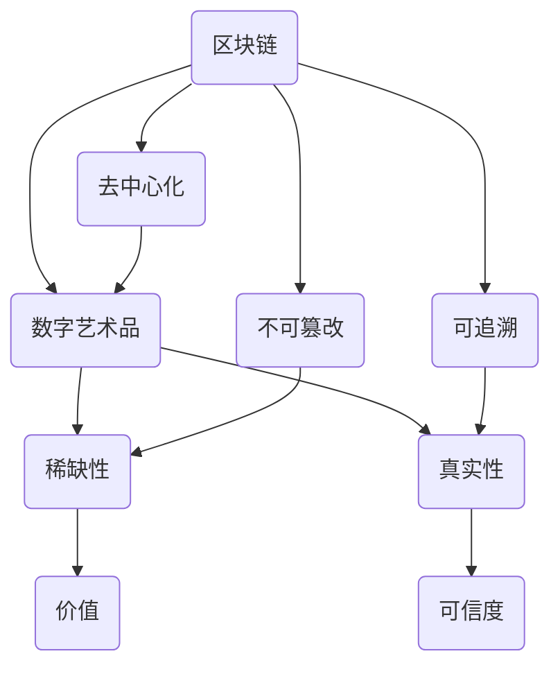

                 

### 引言

#### 问题背景

区块链技术的兴起和数字艺术品的迅速发展，使得这两个领域开始融合并产生出新的创新形态。区块链以其去中心化、不可篡改和可追溯的特点，为数字艺术品提供了新的可能。数字艺术品，尤其是以数字形式创作的艺术品，面临着稀缺性和真实性难以保证的问题，而区块链技术则提供了有效的解决方案。

#### 核心概念与联系

首先，我们需要明确几个核心概念：

- **区块链**：一种分布式数据库技术，通过加密算法和共识机制确保数据的完整性和不可篡改性。
- **数字艺术品**：以数字形式存在的艺术品，包括数字绘画、数字音乐、数字视频等。
- **稀缺性**：指艺术品在市场上的稀缺程度，影响其价值。
- **真实性**：指艺术品是否为原创，是否存在伪造或篡改。

这些概念之间的关系可以用Mermaid图来表示：

#### 本书的主题思想

本书旨在探讨区块链技术在数字艺术品创作中的创新应用，具体包括：

1. **实现艺术品的稀缺性**：通过区块链技术确保艺术品在数字世界中的唯一性和不可复制性。
2. **确保艺术品的真实性**：利用区块链的不可篡改性和可追溯性，验证艺术品的原创性和完整性。
3. **案例分析**：通过具体案例研究，展示区块链技术在数字艺术品中的应用效果。

通过以上分析，我们可以看到区块链技术为数字艺术品带来的巨大变革。接下来，我们将深入探讨区块链的基础知识，以及它如何在数字艺术品创作中发挥作用。

---

关键词：区块链、数字艺术品、稀缺性、真实性、去中心化

摘要：本书将探讨区块链技术在数字艺术品创作中的创新应用，包括实现艺术品的稀缺性和真实性，并通过具体案例分析展示其效果。我们将从背景介绍开始，逐步深入探讨核心概念、区块链基础知识、应用场景和未来展望。通过这本书，读者将了解到区块链如何改变数字艺术品的创作和交易模式。

