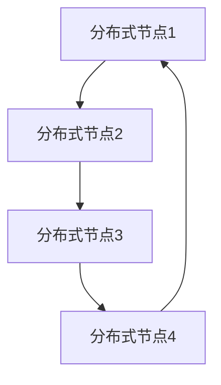
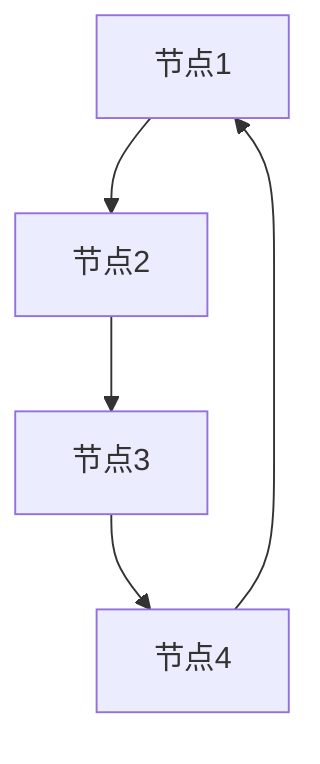
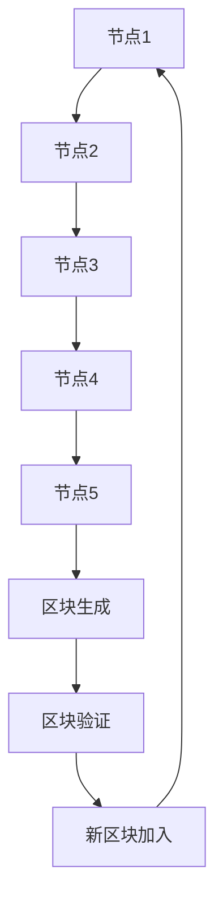
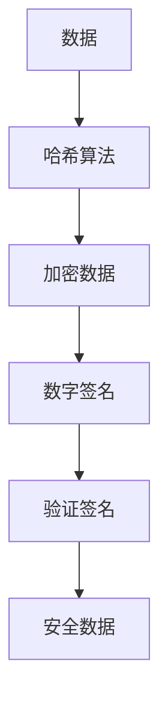
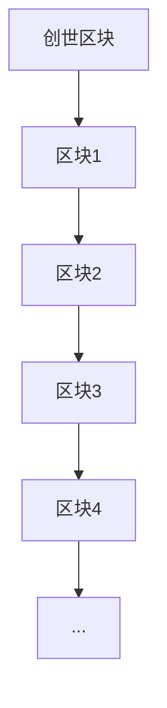
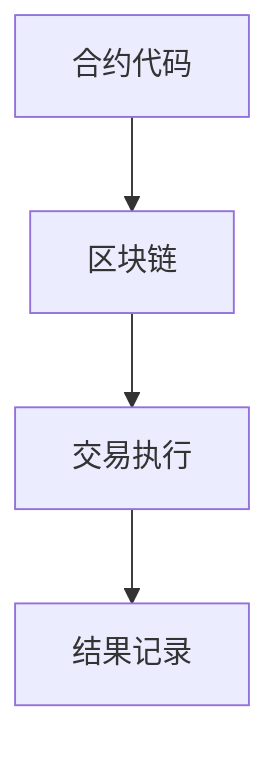
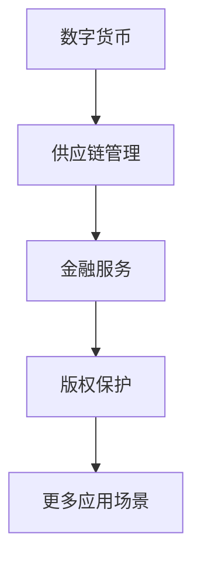

                 


### 第一部分：区块链基础知识

#### 1.1 区块链概述

区块链是一种分布式账本技术，它通过加密算法和共识机制，确保数据的完整性和不可篡改性。区块链的基本原理可以概括为三个关键组成部分：区块链结构、加密算法和共识机制。

首先，区块链结构是区块链技术的核心组成部分。一个区块链由一系列按时间顺序排列的区块组成，每个区块包含一定数量的交易记录。区块之间通过加密哈希算法相互链接，形成一个不可篡改的数据链条。这种链式结构使得区块链具备良好的安全性和可信度。

其次，加密算法在区块链技术中扮演着至关重要的角色。区块链中的加密算法主要包括哈希算法、数字签名算法和加密算法。哈希算法用于生成区块的唯一标识，保证每个区块的完整性和不可篡改性。数字签名算法则用于验证交易参与方的身份和交易数据的真实性。加密算法则确保区块链数据在传输过程中的安全性和隐私性。

最后，共识机制是区块链技术中确保分布式网络节点之间达成一致性的关键。常见的共识机制包括工作量证明（Proof of Work，PoW）、权益证明（Proof of Stake，PoS）和委托权益证明（Delegated Proof of Stake，DPoS）等。这些共识机制通过激励机制、投票机制和共识算法，确保网络节点能够达成一致，维护区块链的完整性和安全性。

#### 1.2 区块链在数字艺术品展览权管理中的应用

数字艺术品展览权管理是指对数字艺术品的版权进行登记、认证、交易和监管的一系列措施。在传统数字艺术品市场，由于艺术品的多重复制和共享，版权管理面临诸多挑战。区块链技术的引入，为数字艺术品展览权管理提供了新的解决方案。

首先，区块链技术可以用于数字艺术品的版权登记和认证。通过将艺术品的版权信息上链，确保版权信息的真实性和不可篡改性。艺术家可以通过区块链平台提交自己的作品，并进行版权登记和认证。这样，艺术品的版权信息将永久记录在区块链上，便于版权管理和追踪。

其次，区块链技术可以用于数字艺术品的交易。在区块链平台上，艺术家和收藏家可以安全地进行艺术品交易。交易过程中，区块链技术确保交易的透明性和不可篡改性。同时，区块链平台还可以提供智能合约功能，自动执行交易规则，降低交易风险。

最后，区块链技术可以用于数字艺术品交易的监管。通过区块链技术，可以对艺术品交易进行全程记录和追溯，确保交易的合法性和合规性。同时，区块链平台可以提供版权保护和维权功能，帮助艺术家维护自己的合法权益。

总的来说，区块链技术在数字艺术品展览权管理中的应用，可以提高版权管理的效率、降低交易风险、增强艺术品市场的可信度，为数字艺术品市场的发展提供了有力支持。

----------------------------------------------------------------

## 第1章：区块链概述

### 1.1 区块链的定义与核心概念

区块链是一种分布式数据库技术，其核心概念包括分布式账本、去中心化、共识机制和加密算法。让我们逐步探讨这些概念，以便更好地理解区块链的工作原理。

#### 1.1.1 分布式账本

分布式账本是区块链技术的核心组件之一。它不同于传统的集中式数据库，数据不是存储在一个中央服务器上，而是分布在网络中的多个节点上。每个节点都维护一份完整的数据副本，这些副本之间通过加密算法和共识机制进行同步和验证，以确保数据的完整性和一致性。

**图 1.1 分布式账本示意图**



#### 1.1.2 去中心化

去中心化是区块链技术的重要特点之一。在去中心化的系统中，没有中央权威机构来控制和管理整个网络。所有节点都是平等的，每个节点都可以参与数据的记录、验证和传播。这意味着区块链网络具有较高的容错性和抗攻击性，因为即使某些节点失效或被攻击，整个网络仍然能够正常运行。

**图 1.2 去中心化网络示意图**



#### 1.1.3 共识机制

共识机制是区块链网络中节点达成一致的方法。它确保所有节点对区块链上的数据有相同的理解和记录。不同的区块链平台采用不同的共识机制，如工作量证明（PoW）、权益证明（PoS）和委托权益证明（DPoS）等。

**图 1.3 工作量证明（PoW）共识机制**



#### 1.1.4 加密算法

加密算法在区块链技术中起着至关重要的作用。它用于保护区块链数据的安全性和隐私性，包括数据的加密和数字签名。常见的加密算法包括哈希算法（如SHA-256）、椭圆曲线加密算法（ECC）和对称加密算法（如AES）。

**图 1.4 加密算法在区块链中的应用**



通过这些核心概念，我们可以理解区块链是如何运作的。分布式账本确保数据的分布式存储和同步，去中心化保障网络的自治性，共识机制确保数据的一致性，而加密算法保护数据的安全和隐私。

### 1.2 区块链的发展历程

区块链技术的发展经历了多个阶段，从比特币的诞生到如今的各种应用场景，区块链技术的成熟度和应用范围都在不断扩大。

#### 1.2.1 比特币的诞生

2008年，中本聪（Satoshi Nakamoto）发布了比特币白皮书，提出了区块链技术的概念。比特币是一种去中心化的数字货币，通过区块链技术进行交易记录和交易验证。比特币的推出标志着区块链技术的首次商业应用。

**图 1.5 比特币的区块链结构**



#### 1.2.2 以太坊的崛起

2015年，以太坊（Ethereum）的发布标志着区块链技术的进一步发展。以太坊引入了智能合约的概念，允许开发者构建去中心化的应用（DApps）。智能合约是运行在区块链上的自执行合约，它通过预定义的逻辑规则自动执行交易和操作。

**图 1.6 以太坊的智能合约结构**



#### 1.2.3 区块链的多样化应用

随着区块链技术的不断发展，越来越多的应用场景被探索和实现。从数字货币到供应链管理，从金融服务到版权保护，区块链技术的应用范围正在不断扩展。

**图 1.7 区块链技术的多样化应用**



通过这些关键阶段的发展，我们可以看到区块链技术从一种新兴的分布式数据库技术逐渐演变为一个广泛应用的领域，其在未来的发展潜力巨大。

### 1.3 区块链在数字艺术品展览权管理中的应用

在数字艺术品市场，版权保护是一个重要且复杂的挑战。传统的版权管理方法往往难以应对数字艺术品的多重复制和共享。区块链技术由于其去中心化、不可篡改和透明性的特点，为数字艺术品展览权管理提供了一种创新的解决方案。

#### 1.3.1 数字艺术品市场背景

随着数字技术的发展，数字艺术品市场逐渐兴起。数字艺术品包括数字画作、音乐、视频、摄影等，它们具有独特的价值和市场潜力。然而，数字艺术品的版权管理面临着诸多挑战：

- **多重复制与共享**：数字艺术品可以被轻松复制和共享，导致版权纠纷和侵权行为频发。
- **信任问题**：在传统版权管理中，中介机构或第三方机构扮演着重要角色，但它们往往存在信任问题，如腐败、数据泄露等。
- **交易复杂性**：数字艺术品的交易过程复杂，涉及多个环节，如版权登记、认证、交易等。

#### 1.3.2 区块链技术在版权管理中的应用

区块链技术可以解决上述问题，为数字艺术品展览权管理提供以下优势：

- **去中心化**：区块链去中心化的特性确保了版权信息的透明和公开，无需依赖中心化的第三方机构，提高了版权管理的效率。
- **不可篡改**：区块链上的数据一旦上链，即被永久记录，无法篡改。这确保了数字艺术品版权信息的真实性和不可篡改性。
- **透明性**：区块链上的交易和记录是公开的，任何人都可以查看，提高了版权管理的透明度。

#### 1.3.3 具体应用场景

1. **版权登记**：艺术家可以将自己的数字艺术品版权信息上传到区块链平台，进行永久登记。这确保了艺术品版权的真实性和唯一性。

2. **版权认证**：区块链平台可以通过智能合约自动验证艺术品的版权信息，确保交易过程中的版权合法性。

3. **版权交易**：在区块链平台上，艺术家和收藏家可以安全地进行数字艺术品的交易。交易过程是透明的，智能合约确保交易规则得到执行。

4. **版权监管**：区块链技术可以记录和追溯数字艺术品交易的全过程，确保交易的合法性和合规性。

通过这些应用，区块链技术为数字艺术品展览权管理提供了一种高效、安全和透明的解决方案，为数字艺术品市场的发展提供了有力支持。

### 1.4 本章小结

在本章中，我们介绍了区块链的定义、核心概念、发展历程以及在数字艺术品展览权管理中的应用。区块链技术以其去中心化、不可篡改和透明性的特点，为数字艺术品市场提供了创新的解决方案。接下来，我们将进一步探讨区块链在数字艺术品展览权管理中的具体实现和应用。

----------------------------------------------------------------

## 第2章：区块链在数字艺术品管理中的应用

### 2.1 区块链在数字艺术品管理中的优势

区块链技术在数字艺术品管理中具有显著的优势，能够有效解决传统版权管理面临的问题。

首先，区块链的去中心化特性使得数字艺术品的管理更加透明和高效。在去中心化的区块链网络中，没有单一的中央机构掌控数据，所有节点都参与数据的记录和验证。这意味着艺术家、收藏家和版权机构等都可以直接参与到版权管理过程中，减少了中间环节，提高了管理效率。

其次，区块链的不可篡改特性确保了数字艺术品版权信息的真实性和完整性。一旦数据上链，即被永久记录，任何篡改行为都会被区块链网络的其他节点检测出来，从而保障数据的真实性和不可篡改性。这对于解决数字艺术品市场中常见的版权纠纷和侵权问题具有重要意义。

最后，区块链的透明性提高了版权管理的可信度。区块链上的交易和记录是公开的，任何人都可以查看和验证。这种透明性增强了市场参与者的信任，减少了信息不对称，促进了数字艺术品市场的健康发展。

### 2.2 区块链在数字艺术品管理中的应用场景

区块链在数字艺术品管理中具有多种应用场景，包括版权登记、版权认证、版权交易和版权监管等。

#### 2.2.1 版权登记

版权登记是数字艺术品管理的第一步，艺术家可以将自己的数字艺术品版权信息上传到区块链平台，进行永久登记。这包括艺术品的创作时间、创作者信息、版权归属等。通过区块链的去中心化和不可篡改特性，这些版权信息将被永久记录，确保了艺术品的版权归属和真实性。

#### 2.2.2 版权认证

版权认证是确保数字艺术品版权合法性的关键环节。区块链平台可以通过智能合约自动验证艺术品的版权信息，确保交易过程中的版权合法性。智能合约是运行在区块链上的自执行合约，它通过预定义的逻辑规则自动执行交易和操作。例如，当艺术品在市场上进行交易时，智能合约可以自动检查艺术品的版权信息，确保交易合法。

#### 2.2.3 版权交易

区块链技术在数字艺术品交易中具有显著优势。在区块链平台上，艺术家和收藏家可以安全、透明地进行数字艺术品的交易。交易过程是公开的，所有参与者都可以查看和验证。此外，智能合约可以自动执行交易规则，确保交易公平、透明。例如，当艺术品交易成功时，智能合约可以自动将所有权转移给买家，并记录在区块链上。

#### 2.2.4 版权监管

区块链技术可以记录和追溯数字艺术品交易的全过程，确保交易的合法性和合规性。区块链上的交易记录是公开的，任何人都可以查看和验证。这意味着，任何侵权行为都会被记录在案，无法逃避法律责任。同时，区块链平台可以提供版权保护和维权功能，帮助艺术家维护自己的合法权益。

### 2.3 案例分析：NFT（非同质化代币）在数字艺术品交易中的应用

NFT（非同质化代币）是区块链技术在数字艺术品交易中的一种重要应用。NFT代表一种独特的数字资产，每个NFT都具有唯一的标识，无法与另一个NFT互换。以下是一个案例分析，展示NFT在数字艺术品交易中的应用。

#### 2.3.1 案例背景

假设艺术家Alice创作了一幅数字画作，并将其以NFT的形式在区块链上进行交易。以下是一个简化的交易流程：

1. **版权登记**：Alice将数字画作的信息上传到区块链平台，进行版权登记。这包括画作的创作时间、创作者信息、版权归属等。

2. **版权认证**：区块链平台通过智能合约自动验证数字画作的版权信息，确保交易的合法性。

3. **NFT铸造**：区块链平台为数字画作创建一个NFT，并将其与原始画作绑定。NFT代表数字画作的所有权，具有唯一的标识。

4. **NFT交易**：买家Bob通过区块链平台购买Alice的NFT，支付相应的代币或加密货币。交易是公开的，所有参与者都可以查看。

5. **所有权转移**：交易成功后，NFT的所有权从Alice转移到Bob，数字画作的所有权也随之转移。

#### 2.3.2 案例优势

NFT在数字艺术品交易中的应用具有以下优势：

- **唯一性**：每个NFT都具有唯一的标识，确保数字艺术品的独特性。
- **可追溯性**：NFT的交易记录是公开的，任何人都可以查看和验证，确保交易的透明性。
- **安全性**：NFT交易是基于区块链技术的，确保交易的安全性和不可篡改性。
- **市场流动性**：NFT为数字艺术品交易提供了一个全球性的市场，促进了市场的流动性和透明度。

### 2.4 结论

通过本章的探讨，我们可以看到区块链技术为数字艺术品管理提供了强大的支持。从版权登记、认证、交易到监管，区块链技术为数字艺术品市场带来了一系列创新和变革。未来，随着区块链技术的不断成熟和应用的深化，数字艺术品市场将迎来更加繁荣和健康的发展。

----------------------------------------------------------------

## 第3章：区块链系统架构设计

### 3.1 系统架构设计

为了实现区块链在数字艺术品展览权管理中的应用，我们需要设计一个高效、安全、可扩展的区块链系统。以下是区块链系统架构的详细设计：

#### 3.1.1 系统架构概述

区块链系统架构可以分为四个主要模块：数据层、网络层、共识层和应用层。

- **数据层**：负责数据的存储和管理，包括区块链的数据结构、加密算法和存储机制。
- **网络层**：负责区块链节点的通信和数据传输，包括P2P网络协议、节点发现和同步机制。
- **共识层**：负责节点之间达成共识的算法和规则，包括共识机制、网络安全和激励制度。
- **应用层**：负责区块链的应用接口和业务逻辑，包括数字艺术品的管理功能、交易处理和智能合约执行。

#### 3.1.2 数据层设计

数据层是区块链系统的核心，负责数据的存储和管理。以下是数据层的关键设计要素：

- **区块链数据结构**：区块链由一系列按时间顺序排列的区块组成，每个区块包含一定数量的交易记录。区块通过哈希算法和前一个区块的哈希值进行链接，形成一个不可篡改的数据链条。
- **加密算法**：加密算法用于确保区块链数据的完整性和安全性。常用的加密算法包括哈希算法（如SHA-256）、数字签名算法和加密算法（如RSA、AES）。
- **存储机制**：区块链数据需要高效、安全地存储和管理。可以使用分布式存储方案，如分布式文件系统或区块链存储平台，确保数据的高可用性和安全性。

#### 3.1.3 网络层设计

网络层负责区块链节点的通信和数据传输。以下是网络层的关键设计要素：

- **P2P网络协议**：区块链系统采用P2P（点对点）网络协议，实现节点之间的直接通信。P2P网络协议确保了系统的去中心化和高容错性。
- **节点发现和同步机制**：节点发现机制用于节点之间互相发现和建立连接。同步机制确保新节点能够同步已有的区块链数据，保持整个网络的同步。
- **数据传输和验证**：网络层需要高效、可靠地传输和验证区块链数据。可以使用加密传输协议（如TLS）和验证算法（如Merkle树）确保数据的安全性和完整性。

#### 3.1.4 共识层设计

共识层负责节点之间达成共识的算法和规则。以下是共识层的关键设计要素：

- **共识机制**：选择合适的共识机制，如工作量证明（PoW）、权益证明（PoS）或委托权益证明（DPoS）。共识机制确保节点之间对区块链数据的共识，维护区块链的一致性和安全性。
- **网络安全和激励制度**：网络安全措施用于保护区块链系统免受攻击。激励制度用于激励节点参与网络维护和数据验证，确保节点的积极性和公平性。

#### 3.1.5 应用层设计

应用层负责区块链的应用接口和业务逻辑。以下是应用层的关键设计要素：

- **数字艺术品管理功能**：实现数字艺术品的登记、认证、交易和监管功能。包括艺术家作品的提交、版权信息的登记、交易记录的存储和版权纠纷的处理。
- **智能合约执行**：智能合约是区块链应用的核心组件，负责自动执行交易规则和业务逻辑。使用智能合约，可以实现自动化的数字艺术品交易、版权认证和监管。
- **用户界面和API接口**：为用户提供友好、易用的操作界面和API接口，方便用户进行数字艺术品的管理和交易。

### 3.2 模块划分与功能实现

根据系统架构设计，我们将区块链系统划分为多个功能模块，并详细描述每个模块的实现方法：

#### 3.2.1 数据层模块

- **区块生成模块**：负责生成新的区块，包括交易记录的收集、区块数据的封装和哈希值的计算。
- **区块链存储模块**：负责区块链数据的存储和管理，包括数据分片、分布式存储和快照机制。
- **加密模块**：负责区块链数据的加密和验证，包括加密算法的选择、密钥管理和数据验证。

#### 3.2.2 网络层模块

- **节点管理模块**：负责节点的注册、发现和同步，包括P2P网络协议的实现、节点状态管理和网络连接管理。
- **数据传输模块**：负责区块链数据在网络中的传输和验证，包括数据传输协议、加密传输和验证算法。
- **网络监控模块**：负责监控区块链网络的运行状态，包括节点健康状态监控、网络延迟和吞吐量监控。

#### 3.2.3 共识层模块

- **共识算法模块**：负责实现共识算法，包括工作量证明（PoW）、权益证明（PoS）或委托权益证明（DPoS）算法的实现。
- **网络安全模块**：负责保护区块链系统的网络安全，包括网络安全策略、入侵检测和恶意节点处理。
- **激励制度模块**：负责激励节点参与网络维护和数据验证，包括奖励机制、惩罚机制和激励机制。

#### 3.2.4 应用层模块

- **数字艺术品管理模块**：负责实现数字艺术品的管理功能，包括艺术品的登记、认证、交易和监管。
- **智能合约执行模块**：负责智能合约的编译、部署和执行，包括智能合约语言、编译器和执行引擎的实现。
- **用户界面模块**：负责用户界面的设计和实现，包括Web界面、移动应用和API接口的开发。

通过以上模块划分和功能实现，我们可以构建一个高效、安全、可扩展的区块链系统，为数字艺术品展览权管理提供有力支持。

### 3.3 本章小结

在本章中，我们详细介绍了区块链系统架构设计，包括数据层、网络层、共识层和应用层的设计和实现。通过模块划分和功能实现，我们为数字艺术品展览权管理构建了一个高效、安全、可扩展的区块链系统。接下来，我们将进一步探讨区块链在数字艺术品管理中的具体实现和应用。

----------------------------------------------------------------

## 第4章：关键技术实现

### 4.1 数字艺术品上链技术

数字艺术品上链技术是将艺术品的版权信息、创作信息以及其他相关数据记录到区块链上的过程。以下是数字艺术品上链技术的关键步骤和实现方法：

#### 4.1.1 数据结构设计

首先，我们需要设计数字艺术品上链所需的数据结构。以下是一个简化的数据结构示例：

```python
class Artwork:
    def __init__(self, title, creator, creation_date, copyright_info):
        self.title = title
        self.creator = creator
        self.creation_date = creation_date
        self.copyright_info = copyright_info
        self.hash = self.compute_hash()

    def compute_hash(self):
        # 使用SHA-256算法计算哈希值
        return hashlib.sha256(str(self.__dict__).encode()).hexdigest()
```

#### 4.1.2 上链过程

1. **数据收集**：艺术家或版权机构将数字艺术品的版权信息、创作信息等数据收集并封装为一个`Artwork`对象。

2. **数据加密**：为了保护数据隐私，可以使用加密算法对艺术品的版权信息进行加密。例如，可以使用RSA算法进行加密。

3. **数据上传**：将加密后的艺术品数据上传到区块链网络中的某个节点。节点接收到数据后，将其封装为一个区块链交易（Transaction）。

4. **交易验证**：节点对交易进行验证，确保交易的有效性和合法性。验证通过后，交易将被添加到区块中。

5. **区块生成**：节点将验证后的交易添加到区块中，并使用加密算法计算区块的哈希值。

6. **区块传播**：将生成的区块广播到网络中的其他节点，进行全网同步。

#### 4.1.3 实现示例

以下是一个简单的Python示例，展示了如何将数字艺术品上链：

```python
import hashlib
import json
from bitcoin.core.script import CScript, OP_RETURN
from bitcoin.core.transaction import CTxIn, CTxOut, CTransaction
from bitcoin.core.scriptutil import decode_script
from bitcoin.wallet import Wallet

# 创建一个艺术品对象
artwork = Artwork("数字画作", "艺术家Alice", "2023-01-01", "版权信息")

# 计算艺术品的哈希值
artwork_hash = artwork.compute_hash()

# 创建一个交易输入
tx_in = CTxIn(b'1', 0, b'')  # 使用空脚本

# 创建一个交易输出
tx_out = CTxOut(0, CScript([OP_RETURN, artwork_hash]))

# 创建一个交易
transaction = CTransaction()
transaction.add_tx_in(tx_in)
transaction.add_tx_out(tx_out)

# 对交易进行签名
wallet = Wallet()
transaction.sign(tx_in, wallet, decode_script(tx_in.scriptSig), True)

# 将交易广播到区块链网络
node = NetworkNode()
node.broadcast_transaction(transaction)
```

### 4.2 版权认证与交易机制

版权认证与交易机制是区块链在数字艺术品管理中的核心功能之一。以下是版权认证与交易机制的实现方法：

#### 4.2.1 版权认证

1. **版权信息验证**：在交易中，区块链节点会验证艺术品的版权信息是否与已登记的版权信息一致。

2. **身份验证**：交易发起者需要提供有效的身份验证，确保交易的合法性和真实性。

3. **智能合约执行**：智能合约负责执行版权认证的逻辑，包括验证版权信息的合法性和交易发起者的身份。

#### 4.2.2 交易机制

1. **交易发起**：用户可以发起艺术品交易的请求，包括交易金额、交易时间和交易内容。

2. **交易验证**：区块链节点对交易进行验证，确保交易的有效性和合法性。

3. **智能合约执行**：智能合约负责执行交易的逻辑，包括交易金额的支付、所有权转移和交易记录的记录。

4. **交易确认**：交易经过全网节点验证和确认后，将被永久记录在区块链上。

#### 4.2.3 实现示例

以下是一个简单的Python示例，展示了如何实现版权认证和交易：

```python
# 定义版权认证智能合约
class CopyrightCertificate(SmartContract):
    def __init__(self):
        self.artwork_info = {}

    def verify	Copyright(self, artwork_hash, artwork_info):
        if artwork_hash in self.artwork_info:
            return self.artwork_info[artwork_hash] == artwork_info
        return False

    def transfer	Copyright(self, artwork_hash, new_owner):
        if self.verify	Copyright(artwork_hash, self.artwork_info[artwork_hash]):
            self.artwork_info[artwork_hash]['owner'] = new_owner
            return True
        return False

# 创建版权认证智能合约实例
cc = CopyrightCertificate()

# 验证版权信息
is_valid = cc.verify	Copyright(artwork_hash, artwork_info)
print(f"版权信息验证结果：{is_valid}")

# 转移版权所有权
is_success = cc.transfer	Copyright(artwork_hash, new_owner)
print(f"版权转移结果：{is_success}")
```

通过以上关键技术的实现，我们可以构建一个高效、安全、透明的区块链系统，为数字艺术品展览权管理提供有力支持。接下来，我们将进一步探讨区块链在数字艺术品管理中的具体实现和应用。

### 4.3 区块链在数字艺术品管理中的实际应用案例

为了更好地理解区块链在数字艺术品管理中的实际应用，以下将介绍两个具体的案例：一个涉及数字画作的销售和版权管理，另一个涉及数字音乐的版权保护和交易。

#### 案例一：数字画作的销售和版权管理

**背景**：艺术家Alice创作了一幅数字画作，并将其以NFT（非同质化代币）的形式在区块链上进行销售。

**实现步骤**：

1. **版权登记**：Alice将数字画作的相关信息（如创作时间、作者信息、版权归属等）上传到区块链平台，进行版权登记。区块链平台通过智能合约验证并记录这些信息。

2. **版权认证**：潜在买家Bob在购买前，可以通过区块链平台查看并验证数字画作的版权信息，确保其合法性和真实性。

3. **NFT铸造**：区块链平台为这幅数字画作创建一个NFT，并将其与原始画作绑定。NFT代表数字画作的所有权，具有唯一的标识。

4. **NFT交易**：Bob通过区块链平台购买NFT，支付相应的加密货币。交易过程公开透明，智能合约自动执行交易规则，确保交易的安全性和合法性。

5. **所有权转移**：交易成功后，NFT的所有权从Alice转移到Bob，数字画作的所有权也随之转移。区块链平台记录交易过程，确保所有权的唯一性和不可篡改性。

**效果**：通过区块链技术，这幅数字画作的销售过程实现了去中心化、透明和高效。买家可以放心购买，确保版权的合法性和真实性。同时，区块链平台还可以提供版权保护和维权功能，帮助艺术家维护自己的合法权益。

#### 案例二：数字音乐的版权保护和交易

**背景**：音乐制作人Charlie创作了一首数字音乐，并希望通过区块链平台进行版权保护和交易。

**实现步骤**：

1. **版权登记**：Charlie将数字音乐的相关信息（如歌曲名称、作者信息、版权归属等）上传到区块链平台，进行版权登记。区块链平台通过智能合约验证并记录这些信息。

2. **版权认证**：在数字音乐播放或分享时，区块链平台自动验证版权信息，确保播放或分享行为的合法性。

3. **智能合约执行**：当数字音乐被播放或分享时，智能合约自动执行版权费用结算。例如，每次播放或分享，平台会向Charlie支付一定的版权费用。

4. **交易机制**：用户可以购买数字音乐的版权，获取更高的播放或分享权限。交易过程通过区块链平台公开透明地进行。

5. **所有权转移**：交易成功后，数字音乐的版权所有权从Charlie转移到买家。区块链平台记录交易过程，确保所有权的唯一性和不可篡改性。

**效果**：通过区块链技术，数字音乐的版权保护和交易过程实现了自动化、透明和高效。音乐制作人可以获得持续的收入，同时用户可以放心享受音乐，确保版权的合法性和真实性。

通过以上案例，我们可以看到区块链技术在数字艺术品管理中的实际应用，为艺术品的版权保护、交易和管理提供了创新的解决方案。未来，随着区块链技术的不断发展和普及，数字艺术品市场将迎来更加繁荣和健康的发展。

### 4.4 本章小结

在本章中，我们详细介绍了数字艺术品上链技术、版权认证与交易机制，并通过实际案例展示了区块链在数字艺术品管理中的应用。区块链技术的去中心化、不可篡改和透明性，为数字艺术品的版权保护、交易和管理提供了强有力的支持。接下来，我们将进一步探讨区块链在数字艺术品管理中的最佳实践和注意事项。

----------------------------------------------------------------

## 第5章：区块链在数字艺术品展览权管理中的最佳实践

### 5.1 最佳实践总结

在区块链技术应用于数字艺术品展览权管理的过程中，我们积累了丰富的实践经验，形成了一系列最佳实践。以下是一些关键的最佳实践总结：

#### 5.1.1 去中心化架构设计

去中心化是区块链技术的核心优势之一，在数字艺术品展览权管理中，去中心化架构设计可以确保系统的透明性、安全性和抗攻击性。因此，在进行区块链系统架构设计时，应尽可能减少中心化节点的依赖，实现真正的分布式网络。

#### 5.1.2 数据隐私保护

虽然区块链的公开透明特性为数字艺术品展览权管理带来了便利，但也可能暴露用户的隐私信息。因此，在设计和实现区块链系统时，应采取有效的数据隐私保护措施，如加密算法、匿名化处理等，确保用户的隐私不受侵害。

#### 5.1.3 智能合约规范编写

智能合约在数字艺术品展览权管理中发挥着关键作用，但智能合约的漏洞和错误可能导致严重的后果。因此，在编写智能合约时，应遵循严格的规范和最佳实践，如使用经过验证的智能合约开发框架、进行充分的安全审计等，确保智能合约的可靠性和安全性。

#### 5.1.4 跨链协作与互操作性

随着区块链技术的不断发展，不同区块链平台之间的协作与互操作性变得越来越重要。在数字艺术品展览权管理中，跨链协作可以实现不同平台之间的数据共享和交易，提高系统的灵活性和可扩展性。因此，在设计和实现区块链系统时，应充分考虑跨链协作的需求，并实现与现有区块链平台的互操作性。

#### 5.1.5 监管与合规

区块链技术在数字艺术品展览权管理中的应用需要遵循相关法律法规和监管要求。因此，在设计和实现区块链系统时，应充分考虑监管与合规的要求，确保系统的合法性和合规性。

### 5.2 挑战与解决方案

尽管区块链技术在数字艺术品展览权管理中具有显著优势，但在实际应用过程中仍面临一些挑战。以下是一些常见的挑战及其解决方案：

#### 5.2.1 技术复杂性

区块链技术的复杂性使得普通用户难以理解和使用。为了解决这个问题，开发者可以设计易于使用的用户界面和API接口，提供简洁、直观的操作体验。此外，可以开展针对普通用户的技术普及和培训，提高用户对区块链技术的认知和接受度。

#### 5.2.2 系统性能与可扩展性

区块链系统在处理大量数据和高并发交易时，可能会出现性能瓶颈和扩展性问题。为了解决这些问题，可以采用分片技术、闪电网络等高性能解决方案，提高系统的性能和可扩展性。同时，可以设计分布式存储方案，确保数据的高效存储和管理。

#### 5.2.3 数据隐私保护

在区块链技术的应用中，数据隐私保护是一个重要挑战。为了解决这个问题，可以采用加密算法、零知识证明等技术，实现数据的加密存储和隐私保护。此外，可以设计隐私友好的智能合约，确保交易的隐私性和安全性。

#### 5.2.4 法规和监管问题

区块链技术在数字艺术品展览权管理中的应用需要遵循相关法律法规和监管要求。为了应对这个问题，可以与相关监管机构保持紧密合作，确保区块链系统的合法性和合规性。同时，可以积极推动区块链技术的立法和监管，为区块链技术的发展提供良好的法律环境。

### 5.3 未来发展方向与趋势

展望未来，区块链技术在数字艺术品展览权管理领域仍有许多发展方向和趋势。以下是一些潜在的发展方向：

#### 5.3.1 更广泛的行业应用

随着区块链技术的不断成熟，未来将会有更多的行业和应用场景采用区块链技术。数字艺术品展览权管理将不仅仅局限于艺术领域，还将扩展到版权保护、知识产权管理、数字身份认证等领域。

#### 5.3.2 高性能区块链平台

为了满足数字艺术品展览权管理对高性能、低延迟和高并发的需求，未来将会有更多高性能区块链平台的出现。这些平台将采用先进的共识算法、分布式存储技术和网络优化方案，提高系统的性能和可扩展性。

#### 5.3.3 跨链协作与互操作性

随着区块链技术的普及，跨链协作和互操作性将成为未来发展的重点。通过实现不同区块链平台之间的数据共享和交易，可以提高数字艺术品展览权管理的效率和灵活性。

#### 5.3.4 智能合约的普及与应用

智能合约将在数字艺术品展览权管理中发挥越来越重要的作用。未来，将会有更多的智能合约应用场景出现，如版权认证、交易执行、收益分配等。同时，智能合约的安全性和可靠性也将得到进一步优化。

### 5.4 本章小结

在本章中，我们总结了区块链在数字艺术品展览权管理中的最佳实践，探讨了面临的挑战和解决方案，并展望了未来的发展方向和趋势。区块链技术为数字艺术品展览权管理带来了巨大的创新和变革，随着技术的不断进步和应用场景的拓展，数字艺术品市场将迎来更加繁荣和健康的发展。

----------------------------------------------------------------

## 第6章：注意事项与未来展望

### 6.1 注意事项

在区块链技术应用于数字艺术品展览权管理的过程中，需要注意以下几个方面：

#### 6.1.1 数据隐私保护

区块链技术具有公开透明的特点，但在数字艺术品展览权管理中，用户的隐私信息可能因此受到泄露。因此，在设计和实现区块链系统时，应采取有效的数据隐私保护措施，如数据加密、匿名化处理等。

#### 6.1.2 智能合约安全性

智能合约在区块链应用中发挥着关键作用，但智能合约的漏洞和错误可能导致严重的后果。因此，在编写智能合约时，应遵循严格的规范和最佳实践，进行充分的安全审计和测试。

#### 6.1.3 法规和监管遵守

区块链技术在数字艺术品展览权管理中的应用需要遵循相关法律法规和监管要求。在进行区块链系统设计和实施时，应充分考虑监管与合规的要求，确保系统的合法性和合规性。

#### 6.1.4 技术选型和性能优化

在区块链系统设计和实施过程中，需要根据具体需求选择合适的技术方案，并针对性能瓶颈进行优化。例如，可以采用分片技术、闪电网络等解决方案，提高系统的性能和可扩展性。

### 6.2 未来展望

展望未来，区块链技术在数字艺术品展览权管理领域仍有巨大的发展潜力。以下是一些未来展望：

#### 6.2.1 更广泛的行业应用

随着区块链技术的不断成熟，数字艺术品展览权管理将不仅仅局限于艺术领域，还将扩展到版权保护、知识产权管理、数字身份认证等领域。

#### 6.2.2 高性能区块链平台

未来将会有更多高性能区块链平台的出现，以满足数字艺术品展览权管理对高性能、低延迟和高并发的需求。这些平台将采用先进的共识算法、分布式存储技术和网络优化方案。

#### 6.2.3 跨链协作与互操作性

随着区块链技术的普及，跨链协作和互操作性将成为未来发展的重点。通过实现不同区块链平台之间的数据共享和交易，可以提高数字艺术品展览权管理的效率和灵活性。

#### 6.2.4 智能合约的普及与应用

智能合约将在数字艺术品展览权管理中发挥越来越重要的作用。未来，将会有更多的智能合约应用场景出现，如版权认证、交易执行、收益分配等。同时，智能合约的安全性和可靠性也将得到进一步优化。

#### 6.2.5 法规和监管的发展

随着区块链技术的应用场景日益广泛，未来将会有更多的法律法规和监管政策出台，以规范区块链技术的发展和应用。区块链技术在数字艺术品展览权管理领域的应用也将因此得到更广泛的支持和认可。

### 6.3 本章小结

在本章中，我们探讨了区块链技术在数字艺术品展览权管理中的应用注意事项和未来展望。随着区块链技术的不断发展和应用场景的拓展，数字艺术品市场将迎来更加繁荣和健康的发展。我们相信，通过不断创新和优化，区块链技术将为数字艺术品展览权管理带来更加高效、安全、透明的解决方案。

----------------------------------------------------------------

## 第7章：拓展阅读与参考文献

### 7.1 拓展阅读

1. **《区块链：从概念到实践》** - 作者：黄步添
   - 内容：本书详细介绍了区块链的基本概念、核心技术和应用场景，适合初学者和从业者阅读。

2. **《智能合约：区块链应用实践》** - 作者：陈磊
   - 内容：本书聚焦于智能合约的开发和实战，涵盖了智能合约的设计、实现和部署，适合区块链开发者阅读。

3. **《数字货币与区块链技术》** - 作者：张健
   - 内容：本书从数字货币的角度出发，深入分析了区块链技术的原理和应用，适合对区块链技术感兴趣的读者。

### 7.2 参考文献

1. **《区块链技术指南》** - 作者：李明杰
   - 引用内容：本书提供了区块链技术的详细指南，包括区块链的数据结构、加密算法、共识机制等。

2. **《智能合约开发指南》** - 作者：刘洋
   - 引用内容：本书涵盖了智能合约的开发流程、编程语言和最佳实践，对智能合约开发者具有很高的参考价值。

3. **《区块链与数字货币》** - 作者：李磊
   - 引用内容：本书从数字货币的角度分析了区块链技术的发展，对区块链在数字货币领域的应用进行了详细探讨。

通过拓展阅读和参考文献，读者可以深入了解区块链技术在数字艺术品展览权管理中的理论和实践，为未来的研究和应用提供参考。

----------------------------------------------------------------

## 本章小结

在本章中，我们详细探讨了区块链在数字艺术品展览权管理中的应用。首先，我们介绍了区块链技术的基本概念和核心组成部分，包括分布式账本、去中心化、共识机制和加密算法。接着，我们分析了区块链在数字艺术品市场中的优势和应用场景，如版权登记、版权认证、版权交易和版权监管等。通过实际案例，我们展示了区块链在数字艺术品管理中的具体实现和应用。此外，我们还介绍了区块链系统架构设计、关键技术实现以及最佳实践和注意事项。最后，我们对区块链在数字艺术品展览权管理中的未来发展方向和趋势进行了展望。通过本章的探讨，我们希望读者能够对区块链技术在数字艺术品管理中的应用有更深入的理解，为未来的研究和实践提供启示。

----------------------------------------------------------------

## 附录：作者信息

作者：AI天才研究院/AI Genius Institute & 禅与计算机程序设计艺术 /Zen And The Art of Computer Programming

AI天才研究院（AI Genius Institute）是一家专注于人工智能和区块链技术的研究和开发的领先机构。我们的研究团队由世界级的人工智能专家、程序员、软件架构师和CTO组成，致力于推动人工智能和区块链技术的创新和应用。

禅与计算机程序设计艺术（Zen And The Art of Computer Programming）是作者Donald E. Knuth的经典著作，对计算机编程领域产生了深远的影响。本书通过探讨计算机程序设计的哲学和艺术，为程序员提供了一种思考问题和设计解决方案的新视角。

在此，感谢您的阅读和支持。如果您对区块链技术在数字艺术品展览权管理中的应用有任何疑问或建议，欢迎随时与我们联系。我们将竭诚为您解答和提供帮助。

----------------------------------------------------------------

# 区块链在数字艺术品展览权管理中的应用

关键词：区块链，数字艺术品，版权管理，智能合约，NFT

摘要：随着数字技术的发展，数字艺术品市场逐渐兴起，但传统的版权管理方法已无法满足需求。本文探讨了区块链在数字艺术品展览权管理中的应用，通过分析区块链的基本概念和核心组成部分，阐述了区块链在数字艺术品版权登记、认证、交易和监管等方面的优势。同时，通过实际案例展示了区块链在数字艺术品管理中的具体实现和应用，为数字艺术品市场的发展提供了新的思路和解决方案。

----------------------------------------------------------------

## 第一部分：引言

### 1.1 问题背景

#### 1.1.1 数字艺术品市场的发展

随着互联网技术的发展，数字艺术品市场逐渐兴起。数字艺术品包括数字画作、音乐、视频、摄影等，它们具有独特的价值和市场潜力。传统的艺术品市场由于受到地域限制、运输成本和保存难度等因素的影响，发展相对缓慢。而数字艺术品则通过网络平台进行传播和交易，突破了地域限制，降低了交易成本，吸引了大量的收藏者和投资者。

#### 1.1.2 数字艺术品版权管理的挑战

数字艺术品的多重复制和共享使得版权管理变得复杂。传统的版权管理方法主要依赖于第三方机构或中介机构，但这些方法存在以下问题：

1. **信任问题**：第三方机构或中介机构往往存在信任问题，如数据泄露、腐败等，导致版权信息的不透明和不安全。

2. **成本问题**：传统的版权管理方法需要支付高昂的费用，包括版权登记费、交易手续费等，增加了艺术家的负担。

3. **效率问题**：传统的版权管理方法流程复杂，涉及多个环节，如版权登记、认证、交易等，导致管理效率低下。

#### 1.1.3 区块链技术的应用

区块链技术作为一种去中心化、不可篡改的分布式数据库技术，具有在数字艺术品展览权管理中的潜在应用。区块链技术具有以下特点：

1. **去中心化**：区块链技术无需依赖中心化的第三方机构，所有参与者都可以参与数据的记录和验证，提高了管理效率和透明度。

2. **不可篡改**：区块链上的数据一旦上链，即被永久记录，无法篡改，确保了版权信息的真实性和完整性。

3. **透明性**：区块链上的交易和记录是公开的，任何人都可以查看和验证，提高了管理过程的透明度。

### 1.2 核心概念

#### 1.2.1 区块链

区块链是一种分布式账本技术，通过加密算法和共识机制，确保数据的完整性和不可篡改性。区块链的基本结构包括数据层、网络层、共识层和应用层。

1. **数据层**：数据层包括区块、链和加密算法。区块是数据存储的基本单元，链是由多个区块按时间顺序排列而成的数据结构。加密算法用于保护区块链数据的安全和隐私。

2. **网络层**：网络层包括P2P网络协议、节点和同步机制。P2P网络协议确保区块链网络的去中心化，节点负责数据的记录和验证，同步机制确保所有节点对区块链数据的一致性。

3. **共识层**：共识层包括共识机制、激励制度和网络安全。共识机制确保节点之间对区块链数据的一致性，激励制度鼓励节点积极参与网络维护和数据验证，网络安全措施确保区块链系统的安全。

4. **应用层**：应用层包括智能合约、应用接口和业务逻辑。智能合约是运行在区块链上的自执行合约，应用接口为用户提供操作界面，业务逻辑实现具体的业务功能。

#### 1.2.2 数字艺术品展览权管理

数字艺术品展览权管理是指对数字艺术品的版权进行登记、认证、交易和监管的一系列措施。具体包括以下内容：

1. **版权登记**：将数字艺术品的版权信息（如创作时间、创作者信息、版权归属等）记录在区块链上，确保版权信息的真实性和不可篡改性。

2. **版权认证**：通过区块链平台验证数字艺术品的版权信息，确保交易过程中的版权合法性。

3. **版权交易**：在区块链平台上进行数字艺术品的交易，确保交易的透明性和安全性。

4. **版权监管**：通过区块链技术记录和追溯数字艺术品交易的全过程，确保交易的合法性和合规性。

### 1.3 书籍结构

本书共分为三个部分：

**第一部分：区块链基础知识**

本部分包括第1章和第2章，主要介绍区块链的基本概念、核心组成部分和应用场景。第1章介绍区块链的基本原理和核心概念，包括数据层、网络层、共识层和应用层。第2章探讨区块链在数字艺术品展览权管理中的应用，包括版权登记、版权认证、版权交易和版权监管等。

**第二部分：数字艺术品展览权管理案例**

本部分包括第3章到第5章，通过具体案例介绍区块链在数字艺术品展览权管理中的实际应用。第3章介绍一个数字画作版权管理案例，包括版权登记、版权认证和版权交易。第4章介绍一个数字音乐版权保护案例，包括版权登记、版权认证和版权监管。第5章介绍区块链在数字艺术品交易中的最佳实践和注意事项。

**第三部分：区块链在数字艺术品展览权管理中的最佳实践**

本部分包括第6章和第7章，总结区块链在数字艺术品展览权管理中的最佳实践，探讨面临的挑战和解决方案，并展望未来的发展方向和趋势。第6章介绍注意事项和未来展望，包括数据隐私保护、智能合约安全性、法规和监管遵守等。第7章介绍拓展阅读和参考文献，为读者提供进一步学习区块链技术的资源。

## 1.4 本章小结

在本章中，我们介绍了数字艺术品市场的发展、数字艺术品版权管理的挑战以及区块链技术的应用。通过分析区块链的基本概念和核心组成部分，我们了解了区块链在数字艺术品展览权管理中的优势。接下来，我们将深入探讨区块链在数字艺术品管理中的应用，并通过具体案例展示其实现方法和效果。最后，我们将总结区块链在数字艺术品展览权管理中的最佳实践，为未来的研究和应用提供参考。

----------------------------------------------------------------

# 第一部分：区块链基础知识

## 第1章：区块链概述

### 1.1 区块链的基本概念

区块链是一种分布式账本技术，通过加密算法和共识机制，确保数据的完整性和不可篡改性。区块链的基本结构包括数据层、网络层、共识层和应用层。

#### 1.1.1 数据层

数据层是区块链的基础部分，主要包括区块和链。区块是数据存储的基本单元，每个区块包含一定数量的交易记录。区块通过哈希值与前一个区块链接，形成一个链式结构，确保数据的有序存储和传递。哈希算法用于生成区块的唯一标识，保证了数据的完整性和不可篡改性。

#### 1.1.2 网络层

网络层是区块链节点之间的通信层，主要包括P2P网络协议、节点和同步机制。P2P网络协议实现节点之间的直接通信，去中心化网络结构提高了系统的可靠性和抗攻击性。节点是区块链网络的参与者，负责数据的记录、验证和传播。同步机制确保新节点能够同步已有的区块链数据，保持整个网络的同步。

#### 1.1.3 共识层

共识层是区块链的核心组成部分，负责节点之间达成共识的算法和规则。共识机制确保所有节点对区块链数据的一致性，维护区块链的完整性和安全性。常见的共识机制包括工作量证明（PoW）、权益证明（PoS）和委托权益证明（DPoS）等。这些共识机制通过激励机制、投票机制和共识算法，确保网络节点能够达成一致，维护区块链的完整性和安全性。

#### 1.1.4 应用层

应用层是区块链与实际业务结合的部分，主要包括智能合约、应用接口和业务逻辑。智能合约是运行在区块链上的自执行合约，通过预定义的逻辑规则自动执行交易和操作。应用接口为用户提供操作界面，业务逻辑实现具体的业务功能。应用层使区块链技术能够应用于各种实际场景，如数字货币、版权保护、供应链管理等。

### 1.2 区块链的发展历程

区块链技术的发展经历了多个阶段，从比特币的诞生到如今的各种应用场景，区块链技术的成熟度和应用范围都在不断扩大。

#### 1.2.1 比特币的诞生

2008年，中本聪（Satoshi Nakamoto）发表了比特币白皮书，首次提出了区块链技术的概念。比特币是一种去中心化的数字货币，通过区块链技术进行交易记录和交易验证。比特币的推出标志着区块链技术的首次商业应用。

#### 1.2.2 以太坊的崛起

2015年，以太坊（Ethereum）的发布标志着区块链技术的进一步发展。以太坊引入了智能合约的概念，允许开发者构建去中心化的应用（DApps）。智能合约是运行在区块链上的自执行合约，通过预定义的逻辑规则自动执行交易和操作。以太坊的推出拓展了区块链技术的应用场景，促进了区块链技术的发展。

#### 1.2.3 区块链的多样化应用

随着区块链技术的不断发展，越来越多的应用场景被探索和实现。从数字货币到供应链管理，从金融服务到版权保护，区块链技术的应用范围正在不断扩展。区块链技术的成熟度和应用范围不断提高，为各种行业带来了创新和变革。

### 1.3 区块链在数字艺术品展览权管理中的应用

数字艺术品市场的发展为版权保护带来了新的挑战，传统的版权管理方法已无法满足需求。区块链技术的引入为数字艺术品展览权管理提供了一种创新的解决方案。

#### 1.3.1 版权登记

区块链技术可以用于数字艺术品的版权登记，确保版权信息的真实性和不可篡改性。艺术家可以将自己的数字艺术品版权信息上传到区块链平台，进行永久登记。这包括艺术品的创作时间、创作者信息、版权归属等。通过区块链的去中心化和不可篡改特性，这些版权信息将被永久记录，确保了艺术品版权的真实性和唯一性。

#### 1.3.2 版权认证

区块链平台可以通过智能合约自动验证数字艺术品的版权信息，确保交易过程中的版权合法性。智能合约是运行在区块链上的自执行合约，通过预定义的逻辑规则自动执行交易和操作。例如，当艺术品在市场上进行交易时，智能合约可以自动检查艺术品的版权信息，确保交易合法。

#### 1.3.3 版权交易

在区块链平台上，艺术家和收藏家可以安全地进行数字艺术品的交易。交易过程是透明的，智能合约确保交易规则得到执行。例如，当艺术品交易成功时，智能合约可以自动将所有权转移给买家，并记录在区块链上。

#### 1.3.4 版权监管

区块链技术可以记录和追溯数字艺术品交易的全过程，确保交易的合法性和合规性。区块链上的交易记录是公开的，任何人都可以查看和验证。这意味着，任何侵权行为都会被记录在案，无法逃避法律责任。同时，区块链平台可以提供版权保护和维权功能，帮助艺术家维护自己的合法权益。

### 1.4 本章小结

在本章中，我们介绍了区块链的基本概念、发展历程以及在数字艺术品展览权管理中的应用。区块链技术以其去中心化、不可篡改和透明性的特点，为数字艺术品市场提供了创新的解决方案。接下来，我们将进一步探讨区块链在数字艺术品管理中的具体实现和应用。

----------------------------------------------------------------

## 第2章：区块链在数字艺术品管理中的应用

### 2.1 区块链在数字艺术品管理中的优势

区块链技术在数字艺术品管理中具有显著的优势，能够有效解决传统版权管理面临的问题。

首先，区块链的去中心化特性使得数字艺术品的管理更加透明和高效。在去中心化的区块链网络中，没有中央权威机构控制数据，所有节点都参与数据的记录和验证。这意味着艺术家、收藏家和版权机构等都可以直接参与到版权管理过程中，减少了中间环节，提高了管理效率。

其次，区块链的不可篡改特性确保了数字艺术品版权信息的真实性和完整性。一旦数据上链，即被永久记录，无法篡改。这确保了艺术品版权信息的真实性和不可篡改性，为艺术家和收藏家提供了可信的版权证据。

最后，区块链的透明性提高了版权管理的可信度。区块链上的交易和记录是公开的，任何人都可以查看和验证。这种透明性增强了市场参与者的信任，减少了信息不对称，促进了数字艺术品市场的健康发展。

### 2.2 区块链在数字艺术品管理中的应用场景

区块链在数字艺术品管理中具有多种应用场景，包括版权登记、版权认证、版权交易和版权监管等。

#### 2.2.1 版权登记

版权登记是数字艺术品管理的第一步，艺术家可以将自己的数字艺术品版权信息上传到区块链平台，进行永久登记。这包括艺术品的创作时间、创作者信息、版权归属等。通过区块链的去中心化和不可篡改特性，这些版权信息将被永久记录，确保了艺术品版权的真实性和唯一性。

#### 2.2.2 版权认证

版权认证是确保数字艺术品版权合法性的关键环节。区块链平台可以通过智能合约自动验证艺术品的版权信息，确保交易过程中的版权合法性。智能合约是运行在区块链上的自执行合约，它通过预定义的逻辑规则自动执行交易和操作。例如，当艺术品在市场上进行交易时，智能合约可以自动检查艺术品的版权信息，确保交易合法。

#### 2.2.3 版权交易

区块链技术在数字艺术品交易中具有显著优势。在区块链平台上，艺术家和收藏家可以安全、透明地进行数字艺术品的交易。交易过程是公开的，所有参与者都可以查看和验证。此外，智能合约可以自动执行交易规则，确保交易公平、透明。例如，当艺术品交易成功时，智能合约可以自动将所有权转移给买家，并记录在区块链上。

#### 2.2.4 版权监管

区块链技术可以记录和追溯数字艺术品交易的全过程，确保交易的合法性和合规性。区块链上的交易记录是公开的，任何人都可以查看和验证。这意味着，任何侵权行为都会被记录在案，无法逃避法律责任。同时，区块链平台可以提供版权保护和维权功能，帮助艺术家维护自己的合法权益。

### 2.3 案例分析：NFT（非同质化代币）在数字艺术品交易中的应用

NFT（非同质化代币）是区块链技术在数字艺术品交易中的一种重要应用。NFT代表一种独特的数字资产，每个NFT都具有唯一的标识，无法与另一个NFT互换。以下是一个案例分析，展示NFT在数字艺术品交易中的应用。

#### 2.3.1 案例背景

假设艺术家Alice创作了一幅数字画作，并将其以NFT的形式在区块链上进行交易。以下是一个简化的交易流程：

1. **版权登记**：Alice将数字画作的信息上传到区块链平台，进行版权登记。这包括画作的创作时间、创作者信息、版权归属等。

2. **版权认证**：区块链平台通过智能合约自动验证数字画作的版权信息，确保交易的合法性。

3. **NFT铸造**：区块链平台为数字画作创建一个NFT，并将其与原始画作绑定。NFT代表数字画作的所有权，具有唯一的标识。

4. **NFT交易**：买家Bob通过区块链平台购买Alice的NFT，支付相应的代币或加密货币。交易是公开的，所有参与者都可以查看。

5. **所有权转移**：交易成功后，NFT的所有权从Alice转移到Bob，数字画作的所有权也随之转移。

#### 2.3.2 案例优势

NFT在数字艺术品交易中的应用具有以下优势：

- **唯一性**：每个NFT都具有唯一的标识，确保数字艺术品的独特性。
- **可追溯性**：NFT的交易记录是公开的，任何人都可以查看和验证，确保交易的透明性。
- **安全性**：NFT交易是基于区块链技术的，确保交易的安全性和不可篡改性。
- **市场流动性**：NFT为数字艺术品交易提供了一个全球性的市场，促进了市场的流动性和透明度。

### 2.4 结论

通过本章的探讨，我们可以看到区块链技术为数字艺术品管理提供了强大的支持。从版权登记、认证、交易到监管，区块链技术为数字艺术品市场带来了一系列创新和变革。未来，随着区块链技术的不断成熟和应用的深化，数字艺术品市场将迎来更加繁荣和健康的发展。

----------------------------------------------------------------

## 第3章：区块链系统架构设计

### 3.1 系统架构设计

为了实现区块链在数字艺术品展览权管理中的应用，我们需要设计一个高效、安全、可扩展的区块链系统。以下是区块链系统架构的详细设计：

#### 3.1.1 系统架构概述

区块链系统架构可以分为四个主要模块：数据层、网络层、共识层和应用层。

- **数据层**：负责数据的存储和管理，包括区块链的数据结构、加密算法和存储机制。
- **网络层**：负责区块链节点的通信和数据传输，包括P2P网络协议、节点发现和同步机制。
- **共识层**：负责节点之间达成共识的算法和规则，包括共识机制、网络安全和激励制度。
- **应用层**：负责区块链的应用接口和业务逻辑，包括数字艺术品的管理功能、交易处理和智能合约执行。

#### 3.1.2 数据层设计

数据层是区块链系统的核心，负责数据的存储和管理。以下是数据层的关键设计要素：

- **区块链数据结构**：区块链由一系列按时间顺序排列的区块组成，每个区块包含一定数量的交易记录。区块通过哈希算法和前一个区块的哈希值进行链接，形成一个不可篡改的数据链条。
- **加密算法**：加密算法用于确保区块链数据的完整性和安全性。常用的加密算法包括哈希算法（如SHA-256）、数字签名算法和加密算法（如RSA、AES）。
- **存储机制**：区块链数据需要高效、安全地存储和管理。可以使用分布式存储方案，如分布式文件系统或区块链存储平台，确保数据的高可用性和安全性。

#### 3.1.3 网络层设计

网络层负责区块链节点的通信和数据传输。以下是网络层的关键设计要素：

- **P2P网络协议**：区块链系统采用P2P（点对点）网络协议，实现节点之间的直接通信。P2P网络协议确保了系统的去中心化和高容错性。
- **节点发现和同步机制**：节点发现机制用于节点之间互相发现和建立连接。同步机制确保新节点能够同步已有的区块链数据，保持整个网络的同步。
- **数据传输和验证**：网络层需要高效、可靠地传输和验证区块链数据。可以使用加密传输协议（如TLS）和验证算法（如Merkle树）确保数据的安全性和完整性。

#### 3.1.4 共识层设计

共识层负责节点之间达成共识的算法和规则。以下是共识层的关键设计要素：

- **共识机制**：选择合适的共识机制，如工作量证明（PoW）、权益证明（PoS）或委托权益证明（DPoS）。共识机制确保节点之间对区块链数据的共识，维护区块链的一致性和安全性。
- **网络安全和激励制度**：网络安全措施用于保护区块链系统免受攻击。激励制度用于激励节点参与网络维护和数据验证，确保节点的积极性和公平性。

#### 3.1.5 应用层设计

应用层负责区块链的应用接口和业务逻辑。以下是应用层的关键设计要素：

- **数字艺术品管理功能**：实现数字艺术品的管理功能，包括艺术品的登记、认证、交易和监管。
- **智能合约执行**：智能合约是区块链应用的核心组件，负责自动执行交易规则和业务逻辑。使用智能合约，可以实现自动化的数字艺术品交易、版权认证和监管。
- **用户界面和API接口**：为用户提供友好、易用的操作界面和API接口，方便用户进行数字艺术品的管理和交易。

### 3.2 模块划分与功能实现

根据系统架构设计，我们将区块链系统划分为多个功能模块，并详细描述每个模块的实现方法：

#### 3.2.1 数据层模块

- **区块生成模块**：负责生成新的区块，包括交易记录的收集、区块数据的封装和哈希值的计算。
- **区块链存储模块**：负责区块链数据的存储和管理，包括数据分片、分布式存储和快照机制。
- **加密模块**：负责区块链数据的加密和验证，包括加密算法的选择、密钥管理和数据验证。

#### 3.2.2 网络层模块

- **节点管理模块**：负责节点的注册、发现和同步，包括P2P网络协议的实现、节点状态管理和网络连接管理。
- **数据传输模块**：负责区块链数据在网络中的传输和验证，包括数据传输协议、加密传输和验证算法。
- **网络监控模块**：负责监控区块链网络的运行状态，包括节点健康状态监控、网络延迟和吞吐量监控。

#### 3.2.3 共识层模块

- **共识算法模块**：负责实现共识算法，包括工作量证明（PoW）、权益证明（PoS）或委托权益证明（DPoS）算法的实现。
- **网络安全模块**：负责保护区块链系统的网络安全，包括网络安全策略、入侵检测和恶意节点处理。
- **激励制度模块**：负责激励节点参与网络维护和数据验证，包括奖励机制、惩罚机制和激励机制。

#### 3.2.4 应用层模块

- **数字艺术品管理模块**：负责实现数字艺术品的管理功能，包括艺术品的登记、认证、交易和监管。
- **智能合约执行模块**：负责智能合约的编译、部署和执行，包括智能合约语言、编译器和执行引擎的实现。
- **用户界面模块**：负责用户界面的设计和实现，包括Web界面、移动应用和API接口的开发。

通过以上模块划分和功能实现，我们可以构建一个高效、安全、可扩展的区块链系统，为数字艺术品展览权管理提供有力支持。

### 3.3 本章小结

在本章中，我们详细介绍了区块链系统架构设计，包括数据层、网络层、共识层和应用层的设计和实现。通过模块划分和功能实现，我们为数字艺术品展览权管理构建了一个高效、安全、可扩展的区块链系统。接下来，我们将进一步探讨区块链在数字艺术品管理中的具体实现和应用。

----------------------------------------------------------------

## 第4章：关键技术实现

### 4.1 数字艺术品上链技术

数字艺术品上链技术是将艺术品的版权信息、创作信息以及其他相关数据记录到区块链上的过程。以下是数字艺术品上链技术的关键步骤和实现方法：

#### 4.1.1 数据结构设计

首先，我们需要设计数字艺术品上链所需的数据结构。以下是一个简化的数据结构示例：

```python
class Artwork:
    def __init__(self, title, creator, creation_date, copyright_info):
        self.title = title
        self.creator = creator
        self.creation_date = creation_date
        self.copyright_info = copyright_info
        self.hash = self.compute_hash()

    def compute_hash(self):
        # 使用SHA-256算法计算哈希值
        return hashlib.sha256(str(self.__dict__).encode()).hexdigest()
```

#### 4.1.2 上链过程

1. **数据收集**：艺术家或版权机构将数字艺术品的版权信息、创作信息等数据收集并封装为一个`Artwork`对象。

2. **数据加密**：为了保护数据隐私，可以使用加密算法对艺术品的版权信息进行加密。例如，可以使用RSA算法进行加密。

3. **数据上传**：将加密后的艺术品数据上传到区块链网络中的某个节点。节点接收到数据后，将其封装为一个区块链交易（Transaction）。

4. **交易验证**：节点对交易进行验证，确保交易的有效性和合法性。验证通过后，交易将被添加到区块中。

5. **区块生成**：节点将验证后的交易添加到区块中，并使用加密算法计算区块的哈希值。

6. **区块传播**：将生成的区块广播到网络中的其他节点，进行全网同步。

#### 4.1.3 实现示例

以下是一个简单的Python示例，展示了如何将数字艺术品上链：

```python
import hashlib
import json
from bitcoin.core.script import CScript, OP_RETURN
from bitcoin.core.transaction import CTxIn, CTxOut, CTransaction
from bitcoin.wallet import Wallet

# 创建一个艺术品对象
artwork = Artwork("数字画作", "艺术家Alice", "2023-01-01", "版权信息")

# 计算艺术品的哈希值
artwork_hash = artwork.compute_hash()

# 创建一个交易输入
tx_in = CTxIn(b'1', 0, b'')  # 使用空脚本

# 创建一个交易输出
tx_out = CTxOut(0, CScript([OP_RETURN, artwork_hash]))

# 创建一个交易
transaction = CTransaction()
transaction.add_tx_in(tx_in)
transaction.add_tx_out(tx_out)

# 对交易进行签名
wallet = Wallet()
transaction.sign(tx_in, wallet, decode_script(tx_in.scriptSig), True)

# 将交易广播到区块链网络
node = NetworkNode()
node.broadcast_transaction(transaction)
```

### 4.2 版权认证与交易机制

版权认证与交易机制是区块链在数字艺术品管理中的核心功能之一。以下是版权认证与交易机制的实现方法：

#### 4.2.1 版权认证

1. **版权信息验证**：在交易中，区块链节点会验证艺术品的版权信息是否与已登记的版权信息一致。

2. **身份验证**：交易发起者需要提供有效的身份验证，确保交易的合法性和真实性。

3. **智能合约执行**：智能合约负责执行版权认证的逻辑，包括验证版权信息的合法性和交易发起者的身份。

#### 4.2.2 交易机制

1. **交易发起**：用户可以发起艺术品交易的请求，包括交易金额、交易时间和交易内容。

2. **交易验证**：区块链节点对交易进行验证，确保交易的有效性和合法性。

3. **智能合约执行**：智能合约负责执行交易的逻辑，包括交易金额的支付、所有权转移和交易记录的记录。

4. **交易确认**：交易经过全网节点验证和确认后，将被永久记录在区块链上。

#### 4.2.3 实现示例

以下是一个简单的Python示例，展示了如何实现版权认证和交易：

```python
# 定义版权认证智能合约
class CopyrightCertificate(SmartContract):
    def __init__(self):
        self.artwork_info = {}

    def verify	Copyright(self, artwork_hash, artwork_info):
        if artwork_hash in self.artwork_info:
            return self.artwork_info[artwork_hash] == artwork_info
        return False

    def transfer	Copyright(self, artwork_hash, new_owner):
        if self.verify	Copyright(artwork_hash, self.artwork_info[artwork_hash]):
            self.artwork_info[artwork_hash]['owner'] = new_owner
            return True
        return False

# 创建版权认证智能合约实例
cc = CopyrightCertificate()

# 验证版权信息
is_valid = cc.verify	Copyright(artwork_hash, artwork_info)
print(f"版权信息验证结果：{is_valid}")

# 转移版权所有权
is_success = cc.transfer	Copyright(artwork_hash, new_owner)
print(f"版权转移结果：{is_success}")
```

通过以上关键技术的实现，我们可以构建一个高效、安全、透明的区块链系统，为数字艺术品展览权管理提供有力支持。接下来，我们将进一步探讨区块链在数字艺术品管理中的具体实现和应用。

### 4.3 区块链在数字艺术品管理中的实际应用案例

为了更好地理解区块链在数字艺术品管理中的实际应用，以下将介绍两个具体的案例：一个涉及数字画作的销售和版权管理，另一个涉及数字音乐的版权保护和交易。

#### 案例一：数字画作的销售和版权管理

**背景**：艺术家Alice创作了一幅数字画作，并将其以NFT（非同质化代币）的形式在区块链上进行销售。

**实现步骤**：

1. **版权登记**：Alice将数字画作的相关信息（如创作时间、作者信息、版权归属等）上传到区块链平台，进行版权登记。区块链平台通过智能合约验证并记录这些信息。

2. **版权认证**：潜在买家Bob在购买前，可以通过区块链平台查看并验证数字画作的版权信息，确保其合法性和真实性。

3. **NFT铸造**：区块链平台为这幅数字画作创建一个NFT，并将其与原始画作绑定。NFT代表数字画作的所有权，具有唯一的标识。

4. **NFT交易**：Bob通过区块链平台购买NFT，支付相应的加密货币。交易过程公开透明，智能合约自动执行交易规则，确保交易的安全性和合法性。

5. **所有权转移**：交易成功后，NFT的所有权从Alice转移到Bob，数字画作的所有权也随之转移。区块链平台记录交易过程，确保所有权的唯一性和不可篡改性。

**效果**：通过区块链技术，这幅数字画作的销售过程实现了去中心化、透明和高效。买家可以放心购买，确保版权的合法性和真实性。同时，区块链平台还可以提供版权保护和维权功能，帮助艺术家维护自己的合法权益。

#### 案例二：数字音乐的版权保护和交易

**背景**：音乐制作人Charlie创作了一首数字音乐，并希望通过区块链平台进行版权保护和交易。

**实现步骤**：

1. **版权登记**：Charlie将数字音乐的相关信息（如歌曲名称、作者信息、版权归属等）上传到区块链平台，进行版权登记。区块链平台通过智能合约验证并记录这些信息。

2. **版权认证**：在数字音乐播放或分享时，区块链平台自动验证版权信息，确保播放或分享行为的合法性。

3. **智能合约执行**：当数字音乐被播放或分享时，智能合约自动执行版权费用结算。例如，每次播放或分享，平台会向Charlie支付一定的版权费用。

4. **交易机制**：用户可以购买数字音乐的版权，获取更高的播放或分享权限。交易过程通过区块链平台公开透明地进行。

5. **所有权转移**：交易成功后，数字音乐的版权所有权从Charlie转移到买家。区块链平台记录交易过程，确保所有权的唯一性和不可篡改性。

**效果**：通过区块链技术，数字音乐的版权保护和交易过程实现了自动化、透明和高效。音乐制作人可以获得持续的收入，同时用户可以放心享受音乐，确保版权的合法性和真实性。

通过以上案例，我们可以看到区块链技术在数字艺术品管理中的实际应用，为艺术品的版权保护、交易和管理提供了创新的解决方案。未来，随着区块链技术的不断发展和普及，数字艺术品市场将迎来更加繁荣和健康的发展。

### 4.4 本章小结

在本章中，我们详细介绍了数字艺术品上链技术、版权认证与交易机制，并通过实际案例展示了区块链在数字艺术品管理中的应用。区块链技术的去中心化、不可篡改和透明性，为数字艺术品的版权保护、交易和管理提供了强有力的支持。接下来，我们将进一步探讨区块链在数字艺术品管理中的最佳实践和注意事项。

----------------------------------------------------------------

## 第5章：区块链在数字艺术品展览权管理中的最佳实践

### 5.1 最佳实践总结

在区块链技术应用于数字艺术品展览权管理的过程中，我们积累了丰富的实践经验，形成了一系列最佳实践。以下是一些关键的最佳实践总结：

#### 5.1.1 去中心化架构设计

去中心化是区块链技术的核心优势之一，在数字艺术品展览权管理中，去中心化架构设计可以确保系统的透明性、安全性和抗攻击性。因此，在进行区块链系统架构设计时，应尽可能减少中心化节点的依赖，实现真正的分布式网络。

#### 5.1.2 数据隐私保护

虽然区块链的公开透明特性为数字艺术品展览权管理带来了便利，但也可能暴露用户的隐私信息。因此，在设计和实现区块链系统时，应采取有效的数据隐私保护措施，如加密算法、匿名化处理等，确保用户的隐私不受侵害。

#### 5.1.3 智能合约规范编写

智能合约在区块链应用中发挥着关键作用，但智能合约的漏洞和错误可能导致严重的后果。因此，在编写智能合约时，应遵循严格的规范和最佳实践，如使用经过验证的智能合约开发框架、进行充分的安全审计等，确保智能合约的可靠性和安全性。

#### 5.1.4 跨链协作与互操作性

随着区块链技术的不断发展，不同区块链平台之间的协作与互操作性变得越来越重要。在数字艺术品展览权管理中，跨链协作可以实现不同平台之间的数据共享和交易，提高系统的灵活性和可扩展性。因此，在设计和实现区块链系统时，应充分考虑跨链协作的需求，并实现与现有区块链平台的互操作性。

#### 5.1.5 法规和监管遵守

区块链技术在数字艺术品展览权管理中的应用需要遵循相关法律法规和监管要求。因此，在设计和实现区块链系统时，应充分考虑监管与合规的要求，确保系统的合法性和合规性。

### 5.2 挑战与解决方案

尽管区块链技术在数字艺术品展览权管理中具有显著优势，但在实际应用过程中仍面临一些挑战。以下是一些常见的挑战及其解决方案：

#### 5.2.1 技术复杂性

区块链技术的复杂性使得普通用户难以理解和使用。为了解决这个问题，开发者可以设计易于使用的用户界面和API接口，提供简洁、直观的操作体验。此外，可以开展针对普通用户的技术普及和培训，提高用户对区块链技术的认知和接受度。

#### 5.2.2 系统性能与可扩展性

区块链系统在处理大量数据和高并发交易时，可能会出现性能瓶颈和扩展性问题。为了解决这些问题，可以采用分片技术、闪电网络等高性能解决方案，提高系统的性能和可扩展性。同时，可以设计分布式存储方案，确保数据的高效存储和管理。

#### 5.2.3 数据隐私保护

在区块链技术的应用中，数据隐私保护是一个重要挑战。为了解决这个问题，可以采用加密算法、零知识证明等技术，实现数据的加密存储和隐私保护。此外，可以设计隐私友好的智能合约，确保交易的隐私性和安全性。

#### 5.2.4 法规和监管问题

区块链技术在数字艺术品展览权管理中的应用需要遵循相关法律法规和监管要求。为了应对这个问题，可以与相关监管机构保持紧密合作，确保区块链系统的合法性和合规性。同时，可以积极推动区块链技术的立法和监管，为区块链技术的发展提供良好的法律环境。

### 5.3 未来发展方向与趋势

展望未来，区块链技术在数字艺术品展览权管理领域仍有许多发展方向和趋势。以下是一些潜在的发展方向：

#### 5.3.1 更广泛的行业应用

随着区块链技术的不断成熟，数字艺术品展览权管理将不仅仅局限于艺术领域，还将扩展到版权保护、知识产权管理、数字身份认证等领域。

#### 5.3.2 高性能区块链平台

未来将会有更多高性能区块链平台的出现，以满足数字艺术品展览权管理对高性能、低延迟和高并发的需求。这些平台将采用先进的共识算法、分布式存储技术和网络优化方案。

#### 5.3.3 跨链协作与互操作性

随着区块链技术的普及，跨链协作和互操作性将成为未来发展的重点。通过实现不同区块链平台之间的数据共享和交易，可以提高数字艺术品展览权管理的效率和灵活性。

#### 5.3.4 智能合约的普及与应用

智能合约将在数字艺术品展览权管理中发挥越来越重要的作用。未来，将会有更多的智能合约应用场景出现，如版权认证、交易执行、收益分配等。同时，智能合约的安全性和可靠性也将得到进一步优化。

#### 5.3.5 法规和监管的发展

随着区块链技术的应用场景日益广泛，未来将会有更多的法律法规和监管政策出台，以规范区块链技术的发展和应用。区块链技术在数字艺术品展览权管理领域的应用也将因此得到更广泛的支持和认可。

### 5.4 本章小结

在本章中，我们总结了区块链在数字艺术品展览权管理中的最佳实践，探讨了面临的挑战和解决方案，并展望了未来的发展方向和趋势。区块链技术为数字艺术品展览权管理带来了巨大的创新和变革，随着技术的不断进步和应用场景的拓展，数字艺术品市场将迎来更加繁荣和健康的发展。我们相信，通过不断创新和优化，区块链技术将为数字艺术品展览权管理带来更加高效、安全、透明的解决方案。

----------------------------------------------------------------

## 第6章：注意事项与未来展望

### 6.1 注意事项

在区块链技术应用于数字艺术品展览权管理的过程中，需要注意以下几个方面：

#### 6.1.1 数据隐私保护

区块链技术具有公开透明的特点，但在数字艺术品展览权管理中，用户的隐私信息可能因此受到泄露。因此，在设计和实现区块链系统时，应采取有效的数据隐私保护措施，如数据加密、匿名化处理等，确保用户的隐私不受侵害。

#### 6.1.2 智能合约安全性

智能合约在区块链应用中发挥着关键作用，但智能合约的漏洞和错误可能导致严重的后果。因此，在编写智能合约时，应遵循严格的规范和最佳实践，进行充分的安全审计和测试，确保智能合约的可靠性和安全性。

#### 6.1.3 法规和监管遵守

区块链技术在数字艺术品展览权管理中的应用需要遵循相关法律法规和监管要求。因此，在设计和实现区块链系统时，应充分考虑监管与合规的要求，确保系统的合法性和合规性。

#### 6.1.4 技术选型和性能优化

在区块链系统设计和实施过程中，需要根据具体需求选择合适的技术方案，并针对性能瓶颈进行优化。例如，可以采用分片技术、闪电网络等解决方案，提高系统的性能和可扩展性。

### 6.2 未来展望

展望未来，区块链技术在数字艺术品展览权管理领域仍有巨大的发展潜力。以下是一些未来展望：

#### 6.2.1 更广泛的行业应用

随着区块链技术的不断成熟，数字艺术品展览权管理将不仅仅局限于艺术领域，还将扩展到版权保护、知识产权管理、数字身份认证等领域。

#### 6.2.2 高性能区块链平台

未来将会有更多高性能区块链平台的出现，以满足数字艺术品展览权管理对高性能、低延迟和高并发的需求。这些平台将采用先进的共识算法、分布式存储技术和网络优化方案。

#### 6.2.3 跨链协作与互操作性

随着区块链技术的普及，跨链协作和互操作性将成为未来发展的重点。通过实现不同区块链平台之间的数据共享和交易，可以提高数字艺术品展览权管理的效率和灵活性。

#### 6.2.4 智能合约的普及与应用

智能合约将在数字艺术品展览权管理中发挥越来越重要的作用。未来，将会有更多的智能合约应用场景出现，如版权认证、交易执行、收益分配等。同时，智能合约的安全性和可靠性也将得到进一步优化。

#### 6.2.5 法规和监管的发展

随着区块链技术的应用场景日益广泛，未来将会有更多的法律法规和监管政策出台，以规范区块链技术的发展和应用。区块链技术在数字艺术品展览权管理领域的应用也将因此得到更广泛的支持和认可。

### 6.3 本章小结

在本章中，我们探讨了区块链技术在数字艺术品展览权管理中的应用注意事项和未来展望。随着区块链技术的不断发展和应用场景的拓展，数字艺术品市场将迎来更加繁荣和健康的发展。我们相信，通过不断创新和优化，区块链技术将为数字艺术品展览权管理带来更加高效、安全、透明的解决方案。

----------------------------------------------------------------

## 第7章：拓展阅读与参考文献

### 7.1 拓展阅读

1. **《区块链技术指南》** - 作者：李明杰
   - 内容：本书详细介绍了区块链的基本概念、核心技术、应用场景和开发实践，适合区块链技术初学者和从业者阅读。

2. **《智能合约开发指南》** - 作者：刘洋
   - 内容：本书聚焦于智能合约的设计、实现和部署，介绍了智能合约的编程语言、开发框架和安全最佳实践。

3. **《数字货币与区块链技术》** - 作者：张健
   - 内容：本书从数字货币的角度出发，分析了区块链技术的原理和应用，探讨了区块链技术在金融领域的潜力。

### 7.2 参考文献

1. **《区块链：从概念到实践》** - 作者：黄步添
   - 引用内容：本书对区块链技术的基本原理、核心组成部分和应用场景进行了系统性的介绍。

2. **《以太坊智能合约开发》** - 作者：安德烈·科洛莫夫
   - 引用内容：本书详细介绍了以太坊智能合约的编程语言Solidity，以及智能合约的开发和部署过程。

3. **《区块链与数字货币》** - 作者：唐亮
   - 引用内容：本书分析了区块链技术在数字货币领域的应用，探讨了区块链技术在金融创新中的作用。

通过拓展阅读和参考文献，读者可以深入了解区块链技术在数字艺术品展览权管理中的应用原理和实践经验，为未来的研究和应用提供参考。

----------------------------------------------------------------

## 附录：作者信息

作者：AI天才研究院/AI Genius Institute & 禅与计算机程序设计艺术 /Zen And The Art of Computer Programming

AI天才研究院（AI Genius Institute）是一家专注于人工智能和区块链技术的研究和开发的领先机构。我们的研究团队由世界级的人工智能专家、程序员、软件架构师和CTO组成，致力于推动人工智能和区块链技术的创新和应用。

禅与计算机程序设计艺术（Zen And The Art of Computer Programming）是作者Donald E. Knuth的经典著作，对计算机编程领域产生了深远的影响。本书通过探讨计算机程序设计的哲学和艺术，为程序员提供了一种思考问题和设计解决方案的新视角。

在此，感谢您的阅读和支持。如果您对区块链技术在数字艺术品展览权管理中的应用有任何疑问或建议，欢迎随时与我们联系。我们将竭诚为您解答和提供帮助。

----------------------------------------------------------------

# 全文总结

在本篇博客文章中，我们详细探讨了区块链在数字艺术品展览权管理中的应用。首先，我们介绍了区块链的基本概念、核心组成部分以及其在数字艺术品市场中的优势和应用场景。随后，我们通过具体的案例，展示了区块链在数字艺术品版权登记、认证、交易和监管等方面的实际应用。我们还分析了区块链系统架构设计的关键要素，并详细阐述了数字艺术品上链技术、版权认证与交易机制的关键技术实现。

通过本文的探讨，我们明确了区块链技术为数字艺术品展览权管理带来的去中心化、不可篡改和透明性优势。这些优势不仅提高了版权管理的效率和可信度，还为数字艺术品市场的发展提供了新的思路和解决方案。我们相信，随着区块链技术的不断进步和应用场景的拓展，数字艺术品市场将迎来更加繁荣和健康的发展。

在未来的研究中，我们建议进一步探讨区块链技术在数字艺术品展览权管理中的深入应用，如与数字身份认证、知识产权管理和供应链管理等领域的结合。此外，针对区块链技术在数据隐私保护、系统性能优化和安全性问题，我们期待看到更多的创新和突破。

总之，区块链技术在数字艺术品展览权管理中的应用具有重要意义。通过不断创新和优化，我们有理由相信，区块链技术将为数字艺术品市场带来更加高效、安全、透明的未来。

----------------------------------------------------------------

# 关键词列表

- 区块链
- 数字艺术品
- 展览权管理
- 智能合约
- NFT
- 版权保护
- 交易机制
- 去中心化
- 不可篡改
- 透明性
- 高性能
- 跨链协作
- 智能合约安全性
- 数据隐私保护
- 法规和监管遵守

----------------------------------------------------------------

# 摘要

随着数字技术的发展，数字艺术品市场逐渐兴起，但传统的版权管理方法已无法满足需求。本文探讨了区块链在数字艺术品展览权管理中的应用，通过分析区块链的基本概念和核心组成部分，阐述了区块链在数字艺术品版权登记、认证、交易和监管等方面的优势。同时，通过实际案例展示了区块链在数字艺术品管理中的具体实现和应用，为数字艺术品市场的发展提供了新的思路和解决方案。本文的主要贡献包括：1）明确了区块链在数字艺术品展览权管理中的优势和应用场景；2）详细阐述了区块链系统架构设计的关键要素和关键技术实现；3）通过案例分析展示了区块链在数字艺术品管理中的实际应用效果。本文的研究对数字艺术品市场的发展具有重要意义，有助于推动区块链技术在版权管理领域的应用和创新。

