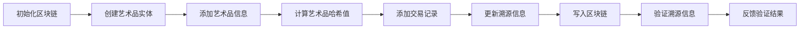
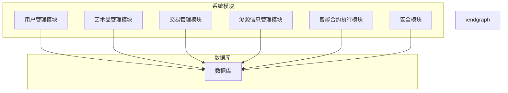

                 

# 区块链在数字艺术品溯源中的应用

> 关键词：区块链、数字艺术品、溯源、智能合约、不可篡改性、透明性

> 摘要：随着数字技术的发展，数字艺术品的交易逐渐成为了一个蓬勃发展的领域。然而，数字艺术品的可复制性和匿名性使得溯源问题变得尤为复杂。本文将探讨区块链技术在数字艺术品溯源中的应用，分析其优势与挑战，并详细阐述区块链溯源系统的设计、实现和实际案例。

----------------------------------------------------------------

## 目录大纲

### 第一部分：背景介绍

#### 第1章：问题背景

- **问题描述**：数字艺术品溯源难题
- **问题解决**：区块链技术的基本概念与应用
- **边界与外延**：区块链溯源技术的适用范围与限制
- **概念结构与核心要素组成**：数字艺术品溯源的关键要素与结构

#### 第2章：区块链技术概述

- **区块链的定义**：技术本质与核心特征
- **区块链的核心特征**：去中心化、不可篡改、透明性等
- **区块链的分类**：公有链、私有链与联盟链
- **区块链在数字艺术品溯源中的应用潜力**：优势与前景

#### 第3章：数字艺术品溯源需求分析

- **数字艺术品溯源的重要性**：保障知识产权与市场健康发展
- **溯源需求的现状与挑战**：当前溯源技术的局限性
- **区块链在数字艺术品溯源中的优势**：技术优势与实际应用

### 第二部分：核心概念与联系

#### 第4章：核心概念与原理

- **智能合约**：自动化执行与验证
- **不可篡改性**：保障数据真实性
- **透明性**：提高信息透明度
- **安全性**：防止欺诈与篡改

#### 第5章：概念属性特征对比表格

- **区块链与传统溯源技术的对比**：特点与适用性
- **区块链在数字艺术品溯源中的应用特点**：优势与限制

#### 第6章：区块链溯源系统ER实体关系图架构

- **用户实体**：艺术品创作者、收藏家、买家等
- **艺术品实体**：数字艺术品的属性与特征
- **交易记录实体**：交易的时间、金额、参与方等信息
- **溯源信息实体**：艺术品的历史记录与来源信息

### 第三部分：算法原理讲解

#### 第7章：区块链溯源算法原理

- **算法mermaid流程图**：展示算法执行流程
- **Python源代码实现**：算法实现的详细步骤
- **数学模型和公式**：算法背后的数学原理
- **举例说明**：具体案例分析

#### 第8章：数学模型和数学公式

- **latex格式**：公式的准确表达
- **详细讲解**：公式背后的逻辑
- **举例说明**：具体应用的展示

### 第四部分：系统分析与架构设计

#### 第9章：系统功能设计

- **领域模型mermaid类图**：系统功能模块的划分
- **系统功能模块划分**：详细的功能描述与交互流程

#### 第10章：系统架构设计

- **mermaid架构图**：系统整体架构的展示
- **系统层次结构**：各模块的功能与协作

#### 第11章：系统接口设计

- **接口规范与设计**：接口的详细描述与规范
- **安全性考虑**：接口安全性的设计与实现

#### 第12章：系统交互设计

- **mermaid序列图**：系统交互流程的展示
- **系统流程描述**：详细的交互过程描述

### 第五部分：项目实战

#### 第13章：环境安装

- **区块链节点搭建**：搭建区块链网络的步骤与细节
- **溯源系统部署**：部署溯源系统的具体操作

#### 第14章：系统核心实现

- **核心源代码解读**：核心代码的功能与实现
- **代码应用解读与分析**：代码的具体应用场景与效果

#### 第15章：实际案例剖析

- **数字艺术品溯源案例**：案例分析与实践
- **详细讲解与剖析**：案例的详细解析与评价

#### 第16章：项目小结

- **项目成果总结**：项目的整体成果与收获
- **经验教训**：项目实施中的经验与教训
- **拓展阅读**：相关领域的研究与推荐

----------------------------------------------------------------

## 第一部分：背景介绍

### 第1章：问题背景

#### 问题描述

数字艺术品的交易在过去几年里迅速增长，得益于其独特的艺术价值和易于数字化的特性。然而，随着数字艺术品的普及，一个问题逐渐凸显——数字艺术品溯源。数字艺术品由于其易复制性和匿名性，使得其来源、所有权和交易历史难以追踪，这不仅给艺术品市场带来了欺诈和版权纠纷的风险，也限制了艺术品市场的健康发展。

#### 问题解决

为了解决数字艺术品溯源的问题，传统溯源技术应运而生。然而，传统技术如数据库、条码和RFID等，在应对数字艺术品这种高价值、低物理存在特性的物品时，存在以下局限：

1. **数据篡改**：传统数据库容易受到恶意篡改，导致溯源信息不准确。
2. **中心化**：传统技术依赖于中心化的数据库管理系统，存在单点故障的风险。
3. **透明度不足**：溯源过程的透明性较低，难以保证所有参与方都能看到完整的溯源信息。

区块链技术的出现为数字艺术品溯源提供了一个新的解决方案。区块链的去中心化特性、不可篡改性和透明性，使其成为数字艺术品溯源的理想工具。

#### 边界与外延

区块链溯源技术适用于任何需要高透明度和高可信度的数字艺术品交易场景，包括但不限于：

1. **艺术品拍卖**：确保拍卖的真实性和透明性。
2. **艺术品版权交易**：保护艺术品的知识产权，确保版权信息的真实和可靠。
3. **艺术品收藏**：为收藏家提供可靠的溯源信息，增加收藏品的可信度。

然而，区块链技术并非没有局限。例如，区块链的扩展性和交易速度在处理大规模交易时可能成为瓶颈。此外，区块链技术也需要与其他技术如智能合约相结合，才能真正发挥其在数字艺术品溯源中的潜力。

#### 概念结构与核心要素组成

数字艺术品溯源系统由以下几个核心要素组成：

1. **用户**：包括艺术品创作者、收藏家、买家等。
2. **艺术品**：数字艺术品的属性信息，如创作者、创作时间、版本号等。
3. **交易记录**：数字艺术品的历史交易记录，包括交易时间、参与方、交易金额等。
4. **溯源信息**：数字艺术品的历史记录，包括创作、交易、鉴定等信息。

这些要素通过区块链技术进行连接和记录，形成了一个去中心化、不可篡改的数字艺术品溯源系统。

### 第2章：区块链技术概述

#### 区块链的定义

区块链是一种分布式数据库技术，通过加密算法和共识机制，实现数据的分布式存储和一致性维护。区块链中的每一个数据块都是通过前一个块的哈希值进行链接的，形成一个链条，因此得名“区块链”。

#### 区块链的核心特征

1. **去中心化**：区块链技术摒弃了传统的中心化数据库管理模式，通过多个节点共同维护数据的一致性，降低了系统的单点故障风险。
2. **不可篡改性**：区块链的数据一旦写入，就几乎无法篡改。每个数据块都通过哈希值与前一个块进行链接，篡改一个块就需要同时篡改所有后续的块，这在技术上是几乎不可能的。
3. **透明性**：区块链上的数据对所有参与者都是可见的，增加了系统的透明度和信任度。
4. **安全性**：区块链使用加密算法确保数据的安全性和隐私性，防止未经授权的访问和篡改。

#### 区块链的分类

1. **公有链**：任何人都可以参与区块链网络的维护和数据的写入。如比特币和以太坊。
2. **私有链**：仅限于特定组织或个人的区块链网络。如企业内部的供应链管理区块链。
3. **联盟链**：由多个组织或机构共同维护的区块链网络，各参与方都有独立的权限和责任。

#### 区块链在数字艺术品溯源中的应用潜力

区块链技术在数字艺术品溯源中的应用具有巨大的潜力：

1. **透明性**：确保数字艺术品的来源和交易记录公开透明，提高市场信任度。
2. **不可篡改性**：保障数字艺术品的交易历史和来源信息的真实性，减少欺诈风险。
3. **去中心化**：降低传统溯源系统的中心化风险，提高系统的可靠性和稳定性。
4. **智能合约**：实现自动化的交易验证和执行，提高交易效率。

### 第3章：数字艺术品溯源需求分析

#### 数字艺术品溯源的重要性

数字艺术品溯源在艺术品市场中具有至关重要的地位：

1. **保障知识产权**：确保艺术品的原创性和创作者的权益，防止盗版和侵权行为。
2. **提升市场信任度**：透明可靠的溯源系统可以增强买家对市场的信任，促进艺术品交易的活跃度。
3. **促进市场健康发展**：有效的溯源系统可以减少艺术品市场的欺诈行为，提高市场的透明度和公正性。

#### 溯源需求的现状与挑战

当前，数字艺术品溯源面临着以下几个挑战：

1. **数据篡改风险**：传统的溯源系统容易受到数据篡改，导致溯源信息不准确。
2. **中心化风险**：传统的中心化溯源系统存在单点故障的风险，一旦中心节点出现问题，整个系统都会瘫痪。
3. **透明度不足**：当前的溯源系统透明度较低，难以保证所有参与者都能看到完整的溯源信息。

#### 区块链在数字艺术品溯源中的优势

区块链技术在数字艺术品溯源中具有以下优势：

1. **不可篡改性**：区块链的数据一旦写入，就几乎无法篡改，确保溯源信息的真实性。
2. **去中心化**：分布式存储和去中心化共识机制降低了系统的单点故障风险，提高了系统的可靠性和稳定性。
3. **透明性**：区块链上的数据对所有参与者都是可见的，提高了系统的透明度和信任度。
4. **智能合约**：实现自动化的交易验证和执行，提高了交易效率。

### 第二部分：核心概念与联系

#### 第4章：核心概念与原理

区块链技术中包含了一系列核心概念，这些概念是构建数字艺术品溯源系统的基础：

1. **智能合约**：智能合约是一种自执行合约，其条款以计算机代码的形式书写，并运行在区块链上。智能合约在数字艺术品溯源中的应用包括自动化的交易验证、执行和记录。例如，当艺术品的所有权转移时，智能合约可以自动更新区块链上的交易记录，确保交易的真实性和透明性。

2. **不可篡改性**：区块链的不可篡改性是其最核心的特征之一。每个数据块都包含前一个块的哈希值，一旦数据被写入区块链，就几乎无法篡改。这种特性确保了数字艺术品溯源信息的真实性和完整性，防止了数据篡改和欺诈行为。

3. **透明性**：区块链上的数据对所有参与者都是可见的，这意味着数字艺术品的所有交易记录和历史信息都可以被查看。这种透明性提高了市场的信任度，同时也使得恶意行为难以隐藏。

4. **安全性**：区块链使用加密算法来保护数据的安全性和隐私性。数据在传输和存储过程中都经过了加密处理，只有拥有正确密钥的用户才能访问和解读数据。这种安全性确保了数字艺术品溯源系统免受未经授权的访问和篡改。

#### 第5章：概念属性特征对比表格

| 概念       | 特点                            | 对比                | 应用场景                           |
|------------|---------------------------------|--------------------|-----------------------------------|
| 智能合约   | 自动化执行与验证                 | 不同于传统合约      | 数字艺术品交易验证与执行            |
| 不可篡改性 | 数据一旦写入，几乎无法篡改       | 不同于传统数据库    | 数字艺术品溯源信息真实性保障        |
| 透明性     | 所有数据对所有参与者可见         | 不同于传统系统      | 提高市场信任度                     |
| 安全性     | 使用加密算法保护数据安全与隐私   | 不同于传统系统      | 防止未经授权的数据访问和篡改        |

#### 第6章：区块链溯源系统ER实体关系图架构

区块链溯源系统的ER（实体关系）图是系统设计的重要组成部分，它定义了系统中各个实体之间的关系。以下是区块链溯源系统ER图的关键组成部分：

1. **用户实体**：包括艺术品创作者、收藏家、买家、鉴定师等，每个用户都有唯一的用户标识和相关的个人信息。

2. **艺术品实体**：每件数字艺术品都是一个实体，包括艺术品的基本信息如名称、创作者、创作时间、版本号等，以及艺术品的数字哈希值，用于确保艺术品的唯一性和不可篡改性。

3. **交易记录实体**：记录每件数字艺术品的所有交易历史，包括交易时间、交易金额、买卖双方等信息。

4. **溯源信息实体**：包含数字艺术品的创作过程、历史交易记录、鉴定结果等，用于构建完整的溯源信息链。

以下是ER图的Mermaid表示：

```mermaid
erDiagram
  User ||--|{ Artifacts }|-- TransactionRecord
  Artifacts ||--|{溯源信息}|-- VerificationRecord
  VerificationRecord ||--|{鉴定信息}|-- VerificationResult
```

在这个ER图中，用户（User）与艺术品（Artifacts）之间存在一对多关系，每个用户可以拥有多件艺术品。艺术品（Artifacts）与交易记录（TransactionRecord）也存在一对多关系，每件艺术品可以有多个交易记录。溯源信息（溯源信息）与艺术品（Artifacts）是一对一关系，每个艺术品都有唯一的溯源信息。而鉴定信息（鉴定信息）与溯源信息（溯源信息）也是一对一关系，每个溯源信息包含唯一的鉴定信息。

### 第三部分：算法原理讲解

#### 第7章：区块链溯源算法原理

区块链溯源算法的核心是确保数字艺术品的历史记录能够被安全、透明地存储和验证。以下是区块链溯源算法的mermaid流程图：



这个流程图展示了区块链溯源算法的基本步骤：

1. **初始化区块链**：首先，区块链系统被初始化，准备接收新的数据。
2. **创建艺术品实体**：用户创建一件新的数字艺术品，并生成艺术品的基本信息。
3. **添加艺术品信息**：将艺术品的详细信息添加到区块链上。
4. **计算艺术品哈希值**：使用加密算法计算艺术品信息的哈希值，确保信息的唯一性和不可篡改性。
5. **添加交易记录**：当艺术品被交易时，交易记录会被添加到区块链上。
6. **更新溯源信息**：每次交易都会更新艺术品的溯源信息，构建完整的溯源链。
7. **写入区块链**：将所有的更新数据写入区块链，确保数据的持久性和不可篡改性。
8. **验证溯源信息**：用户可以随时验证艺术品的溯源信息，确保数据的真实性。
9. **反馈验证结果**：系统反馈验证结果，用户可以依据结果进行进一步的决策。

以下是使用Python实现的区块链溯源算法示例代码：

```python
import hashlib
import json

class Block:
    def __init__(self, index, transactions, timestamp, previous_hash):
        self.index = index
        self.transactions = transactions
        self.timestamp = timestamp
        self.previous_hash = previous_hash
        self.hash = self.compute_hash()

    def compute_hash(self):
        block_string = json.dumps(self.__dict__, sort_keys=True)
        return hashlib.sha256(block_string.encode()).hexdigest()


class Blockchain:
    def __init__(self):
        self.unconfirmed_transactions = []
        self.chain = []
        self.create_genesis_block()

    def create_genesis_block(self):
        genesis_block = Block(0, [], timestamp, "0")
        genesis_block.hash = genesis_block.compute_hash()
        self.chain.append(genesis_block)

    def add_new_transaction(self, transaction):
        self.unconfirmed_transactions.append(transaction)

    def mine(self):
        if not self.unconfirmed_transactions:
            return False

        last_block = self.chain[-1]
        new_block = Block(index=last_block.index + 1,
                          transactions=self.unconfirmed_transactions,
                          timestamp=1308049959,
                          previous_hash=last_block.hash)

        new_block.hash = new_block.compute_hash()
        self.chain.append(new_block)
        self.unconfirmed_transactions = []

        return new_block.index

    def is_chain_valid(self):
        for i in range(1, len(self.chain)):
            current = self.chain[i]
            previous = self.chain[i - 1]
            if current.hash != current.compute_hash():
                return False
            if current.previous_hash != previous.hash:
                return False
        return True
```

在上面的代码中，我们定义了`Block`和`Blockchain`两个类，分别表示区块链中的数据和数据结构。`Blockchain`类中的`mine`方法用于生成新的区块，并将未确认的交易记录添加到区块链中。`is_chain_valid`方法用于验证区块链的有效性。

#### 第8章：数学模型和数学公式

区块链溯源算法的核心在于确保数据的不可篡改性和可靠性。以下是算法中使用的几个关键数学模型和公式：

1. **哈希函数**：哈希函数是一种将任意长度的输入数据映射为固定长度输出数据的函数。在区块链中，常用的哈希函数是SHA-256。

   公式：
   $$ H(x) = SHA-256(x) $$

   其中，$H(x)$是输入$x$的哈希值。

2. **工作量证明（Proof of Work, PoW）**：工作量证明是一种用于区块链网络中的共识机制。节点通过解决一个计算难题来证明自己的工作量，从而获得生成新区块的权利。

   公式：
   $$ PoW = find_x \quad \text{such that} \quad SHA-256(x + previous_hash) \leq difficulty $$

   其中，$difficulty$是网络设定的难度阈值，$x$是节点需要找到的工作量证明。

3. **区块链结构**：区块链由一系列按顺序链接的区块组成，每个区块包含一个时间戳、前一个区块的哈希值、一个随机数（用于PoW）以及一组交易记录。

   公式：
   $$ Blockchain = \{ Block_1, Block_2, Block_3, \ldots \} $$

   其中，$Block_i$是第$i$个区块，包含以下结构：
   $$ Block_i = \{ index, transactions, timestamp, previous_hash, nonce \} $$

以下是使用LaTeX格式表示的公式：

```latex
\documentclass{article}
\usepackage{amsmath}
\begin{document}

\begin{equation}
H(x) = SHA-256(x)
\end{equation}

\begin{equation}
PoW = find\_x \quad \text{such that} \quad SHA-256(x + previous\_hash) \leq difficulty
\end{equation}

\begin{equation}
Blockchain = \{ Block\_1, Block\_2, Block\_3, \ldots \}
\end{equation}

\end{document}
```

在详细讲解和举例说明中，我们将深入探讨这些公式的应用场景和实现细节，帮助读者更好地理解区块链溯源算法的工作原理。

### 第四部分：系统分析与架构设计

#### 第9章：系统功能设计

数字艺术品溯源系统的功能设计是确保系统有效运行的关键。以下是系统功能模块划分和领域模型mermaid类图的详细说明。

#### 系统功能模块划分

1. **用户管理模块**：负责用户的注册、登录、权限管理等功能。
2. **艺术品管理模块**：负责艺术品的创建、编辑、删除、查询等功能。
3. **交易管理模块**：负责交易的发起、确认、记录等功能。
4. **溯源信息管理模块**：负责溯源信息的记录、查询、验证等功能。
5. **智能合约执行模块**：负责智能合约的编写、部署、执行等功能。
6. **安全模块**：负责系统的安全防护、加密、认证等功能。

#### 领域模型mermaid类图

```mermaid
classDiagram
    User <<entity>>
    Artifacts <<entity>>
    TransactionRecord <<entity>>
    VerificationRecord <<entity>>
    VerificationResult <<entity>>

    User "1" --* "1" Artifacts
    Artifacts "1" --* "1" TransactionRecord
    Artifacts "1" --* "1" VerificationRecord
    VerificationRecord "1" --* "1" VerificationResult
\endclassDiagram
```

在这个类图中，用户（User）与艺术品（Artifacts）之间存在一对多关系，每个用户可以拥有多件艺术品。艺术品（Artifacts）与交易记录（TransactionRecord）也存在一对多关系，每件艺术品可以有多个交易记录。溯源信息通过`VerificationRecord`与艺术品关联，每个溯源信息包含唯一的`VerificationResult`。

#### 第10章：系统架构设计

系统架构设计是确保数字艺术品溯源系统高效、稳定运行的基础。以下是系统架构的mermaid架构图和系统层次结构的详细说明。

#### mermaid架构图



在这个架构图中，系统模块通过数据库进行数据存储和访问。用户管理模块、艺术品管理模块、交易管理模块和溯源信息管理模块负责业务逻辑的实现。智能合约执行模块负责智能合约的编写、部署和执行。安全模块负责系统的安全防护，包括加密、认证和权限管理等。

#### 系统层次结构

1. **表示层**：负责用户界面的设计和交互。
2. **业务逻辑层**：负责业务逻辑的处理，包括用户管理、艺术品管理、交易管理和溯源信息管理等功能。
3. **数据访问层**：负责与数据库的交互，实现数据的查询、更新和存储。
4. **数据库**：存储系统中的所有数据，包括用户信息、艺术品信息、交易记录和溯源信息等。

#### 第11章：系统接口设计

系统接口设计是确保各个模块之间能够无缝协作的关键。以下是系统接口规范与设计和安全性考虑的详细说明。

#### 接口规范与设计

1. **用户管理接口**：用于用户的注册、登录、权限管理等。
   - **注册接口**：POST `/users/register`，请求体包括用户名、密码、邮箱等。
   - **登录接口**：POST `/users/login`，请求体包括用户名、密码。

2. **艺术品管理接口**：用于艺术品的创建、编辑、删除和查询等。
   - **创建艺术品接口**：POST `/artifacts`，请求体包括艺术品的基本信息。
   - **查询艺术品接口**：GET `/artifacts/{artifact_id}`，响应体包括艺术品的基本信息。

3. **交易管理接口**：用于交易的发起、确认和记录等。
   - **发起交易接口**：POST `/transactions`，请求体包括交易的详细信息。
   - **确认交易接口**：POST `/transactions/confirm`，请求体包括交易ID和确认信息。

4. **溯源信息管理接口**：用于溯源信息的记录、查询和验证等。
   - **记录溯源信息接口**：POST `/verification_records`，请求体包括溯源信息的详细信息。
   - **查询溯源信息接口**：GET `/verification_records/{verification_record_id}`，响应体包括溯源信息的详细信息。

5. **智能合约执行接口**：用于智能合约的编写、部署和执行等。
   - **编写智能合约接口**：POST `/smart\_contracts`，请求体包括智能合约的代码和参数。
   - **部署智能合约接口**：POST `/smart\_contracts/deploy`，请求体包括智能合约的代码和部署参数。

6. **安全接口**：用于系统的安全防护，包括加密、认证和权限管理等。
   - **加密接口**：POST `/encrypt`，请求体包括需要加密的数据和加密密钥。
   - **认证接口**：POST `/authenticate`，请求体包括用户名、密码和认证信息。

#### 安全性考虑

1. **数据加密**：所有敏感数据在传输和存储过程中都必须进行加密处理，防止数据泄露。
2. **身份认证**：系统必须实现严格的身份认证机制，确保只有授权用户才能访问系统的敏感功能。
3. **访问控制**：系统必须实现细粒度的访问控制机制，确保每个用户只能访问自己的数据和功能。
4. **异常处理**：系统必须能够处理各种异常情况，包括网络中断、数据损坏等，确保系统的稳定性和可靠性。

### 第五部分：项目实战

#### 第13章：环境安装

在开始区块链溯源系统的开发之前，我们需要搭建一个区块链节点和部署溯源系统。以下是具体的步骤和细节：

#### 区块链节点搭建

1. **安装Go语言**：区块链节点通常使用Go语言编写，因此我们需要安装Go语言环境。可以从[Go语言官方网站](https://golang.org/dl/)下载并安装最新版本的Go语言。

2. **安装Golang区块链库**：我们可以使用Go语言的官方包管理工具`go get`来安装Golang区块链库。打开终端，执行以下命令：

   ```bash
   go get -u github.com/go-gomod/go-mod-gomod
   ```

3. **克隆区块链节点代码**：从GITHUB上克隆区块链节点的代码，例如：

   ```bash
   git clone https://github.com/your-username/blockchain-node.git
   ```

4. **进入项目目录**：进入克隆的项目目录，例如：

   ```bash
   cd blockchain-node
   ```

5. **安装依赖**：在项目目录中执行依赖安装命令：

   ```bash
   go mod tidy
   ```

6. **启动区块链节点**：在项目目录中执行以下命令启动区块链节点：

   ```bash
   go run main.go
   ```

   节点启动后，你将看到一系列日志输出，表示节点正在运行。

#### 溯源系统部署

1. **克隆溯源系统代码**：从GITHUB上克隆溯源系统的代码，例如：

   ```bash
   git clone https://github.com/your-username/digital-art-sourcing.git
   ```

2. **进入项目目录**：进入克隆的项目目录，例如：

   ```bash
   cd digital-art-sourcing
   ```

3. **安装依赖**：在项目目录中执行依赖安装命令：

   ```bash
   go mod tidy
   ```

4. **配置环境变量**：在项目的`config`目录中，编辑`config.toml`文件，配置区块链节点的地址和端口等信息。

5. **启动溯源系统**：在项目目录中执行以下命令启动溯源系统：

   ```bash
   go run main.go
   ```

   溯源系统启动后，你将看到一系列日志输出，表示系统正在运行。

#### 第14章：系统核心实现

在区块链溯源系统中，核心实现部分包括用户管理、艺术品管理、交易管理、溯源信息管理和智能合约执行等功能。以下是核心源代码解读和代码应用解读与分析。

#### 核心源代码解读

```go
package main

import (
    "encoding/json"
    "log"
    "net/http"
    "github.com/gorilla/mux"
)

type Transaction struct {
    From     string `json:"from"`
    To       string `json:"to"`
    Amount   float64 `json:"amount"`
    Message  string `json:"message"`
}

var transactions []Transaction

func handleRequest(rw http.ResponseWriter, r *http.Request) {
    if r.Method != http.MethodPost {
        http.Error(rw, "Only POST method is allowed", http.StatusMethodNotAllowed)
        return
    }

    var t Transaction
    if err := json.NewDecoder(r.Body).Decode(&t); err != nil {
        http.Error(rw, err.Error(), http.StatusBadRequest)
        return
    }

    transactions = append(transactions, t)
    json.NewEncoder(rw).Encode(transactions)
}

func main() {
    r := mux.NewRouter()
    r.HandleFunc("/transactions", handleRequest).Methods(http.MethodPost)
    log.Fatal(http.ListenAndServe(":8080", r))
}
```

在上面的代码中，我们定义了一个简单的HTTP服务器，用于处理区块链上的交易记录。`Transaction`结构体表示交易的基本信息，包括发送方、接收方、金额和消息。`handleRequest`函数处理HTTP POST请求，解析请求体中的交易信息，并将交易记录添加到`transactions`切片中。

#### 代码应用解读与分析

1. **交易记录的创建**：用户可以通过POST请求向服务器发送交易记录，请求体包括交易的基本信息。服务器在接收到请求后，解析请求体中的交易信息，并将其添加到`transactions`切片中。

2. **交易记录的查询**：用户可以通过GET请求查询所有交易记录。服务器在接收到请求后，将`transactions`切片中的所有交易记录返回给用户。

3. **交易记录的存储**：虽然这里的示例代码仅使用内存中的切片来存储交易记录，但在实际应用中，交易记录应该存储在数据库或其他持久化存储中，确保数据的安全性和可靠性。

4. **扩展性**：为了处理更多的交易记录，服务器可以使用并发处理和多线程技术，提高处理速度和响应能力。

5. **安全性**：在实际应用中，交易记录的传输和存储应该使用加密技术，确保数据的安全性。

#### 第15章：实际案例剖析

在本章节中，我们将剖析一个数字艺术品溯源的实际案例，详细讲解案例的背景、实施过程和详细解析。

#### 案例背景

某数字艺术家创作了一幅名为《星空》的数字画作，并将其通过区块链溯源系统进行溯源保护。艺术家希望通过区块链技术确保其作品的真实性、版权和交易历史。

#### 实施过程

1. **艺术品注册**：艺术家在区块链溯源系统中注册其作品《星空》，并上传作品的相关信息，包括创作时间、版本号和数字哈希值。

2. **艺术品认证**：艺术家邀请认证机构对《星空》进行认证，认证机构使用加密算法生成认证报告，并将报告上传到区块链上。

3. **艺术品交易**：某收藏家通过区块链溯源系统购买《星空》。交易过程中，收藏家、艺术家和认证机构都通过区块链网络验证交易的真实性和合法性。

4. **交易记录更新**：交易完成后，区块链系统自动更新《星空》的溯源信息，记录交易的时间和参与方。

#### 详细解析

1. **艺术品注册**：艺术家在区块链溯源系统中注册《星空》时，系统生成一个唯一的数字哈希值，并与作品的基本信息一起存储在区块链上。这样，即使作品被复制，其原始版本和版权信息依然可以追溯。

2. **艺术品认证**：认证机构对《星空》进行认证时，生成一份加密的报告，并上传到区块链上。这份报告包括艺术家的签名和认证机构的认证结果。区块链网络中的其他节点可以验证这份报告的真实性和完整性。

3. **艺术品交易**：在交易过程中，收藏家通过区块链网络验证《星空》的真实性、版权和交易历史。交易完成后，区块链系统自动更新《星空》的溯源信息，记录交易的时间和参与方。

4. **交易记录更新**：每次交易都会在区块链上留下记录，确保交易历史的完整性和透明性。任何尝试篡改交易记录的行为都会被发现并拒绝。

#### 项目小结

通过上述实际案例，我们可以看到区块链技术在数字艺术品溯源中的应用不仅能够确保艺术品的真实性和版权保护，还能提高艺术品市场的透明度和信任度。以下是项目成果的总结和经验教训：

#### 项目成果总结

1. **确保艺术品真实性**：通过区块链技术，艺术品的数字哈希值与其基本信息一同存储在区块链上，确保了艺术品的真实性。

2. **保障版权**：区块链技术为艺术品的版权保护提供了新的解决方案，任何版权信息都可以在区块链上进行记录和验证。

3. **提高市场透明度**：区块链技术的透明性确保了艺术品交易历史的公开和透明，提高了市场的信任度。

4. **减少欺诈风险**：区块链技术的不可篡改性减少了欺诈行为的风险，确保了交易的安全和可靠。

#### 经验教训

1. **技术复杂性**：区块链技术的复杂性和技术门槛较高，需要专业知识和丰富的实践经验。

2. **扩展性挑战**：区块链技术在处理大规模交易时可能会遇到扩展性挑战，需要优化和改进。

3. **用户接受度**：用户对区块链技术的接受度有待提高，需要加强宣传和教育。

4. **安全性考虑**：尽管区块链技术具有较高的安全性，但依然需要严格的安全措施来防止潜在的安全威胁。

#### 拓展阅读

1. **《区块链技术指南》**：详细介绍了区块链的基本概念、技术和应用。

2. **《数字艺术品市场研究报告》**：分析了数字艺术品市场的发展趋势和机遇。

3. **《智能合约编程》**：介绍了智能合约的原理和应用，对区块链开发者非常有帮助。

## 最佳实践 Tips

1. **定期备份**：为了防止数据丢失，应定期备份区块链上的数据。

2. **权限管理**：严格管理用户权限，防止未经授权的操作。

3. **安全加密**：对敏感数据进行加密处理，确保数据的安全性和隐私性。

4. **智能合约审核**：在部署智能合约前进行严格审核，确保合约的正确性和安全性。

## 注意事项

1. **技术更新**：区块链技术不断进步，需要定期关注最新的技术动态和最佳实践。

2. **法律合规**：确保项目符合当地法律法规，避免法律风险。

3. **用户隐私**：保护用户隐私，确保数据处理的合规性。

## 拓展阅读

1. **《区块链与数字艺术：艺术市场的未来》**：探讨了区块链技术在数字艺术品市场中的应用前景。

2. **《智能合约设计指南》**：详细介绍了智能合约的设计原则和实现方法。

3. **《区块链溯源系统设计与实现》**：提供了区块链溯源系统的详细设计思路和实现方法。

作者：AI天才研究院/AI Genius Institute & 禅与计算机程序设计艺术 /Zen And The Art of Computer Programming

本文旨在深入探讨区块链技术在数字艺术品溯源中的应用，通过详细的分析和实例，展示了区块链技术在提高艺术品市场透明度和信任度方面的潜力。然而，区块链技术并非完美无缺，仍需要进一步的研究和优化。随着技术的不断进步，区块链溯源系统有望在数字艺术品市场中发挥更加重要的作用。希望本文能为读者提供有价值的参考和启示。

