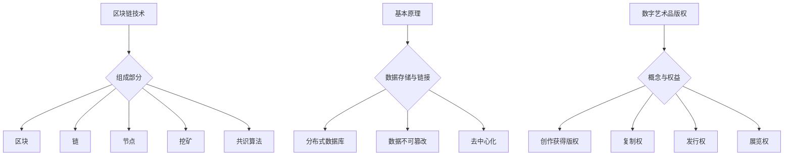
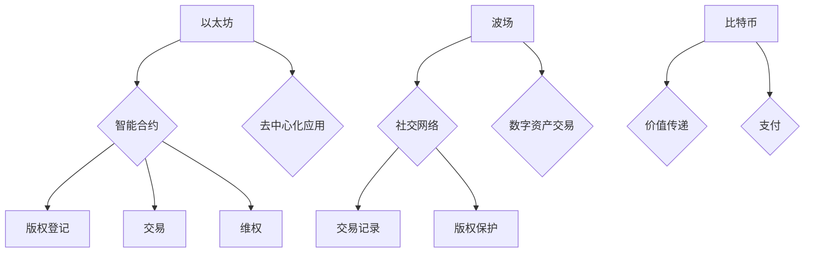
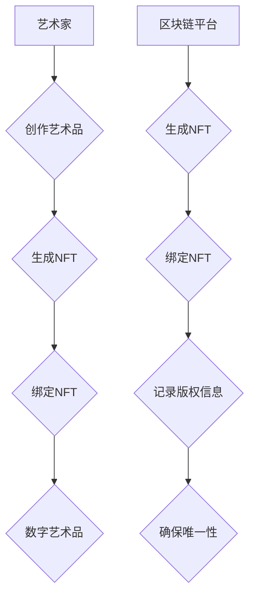
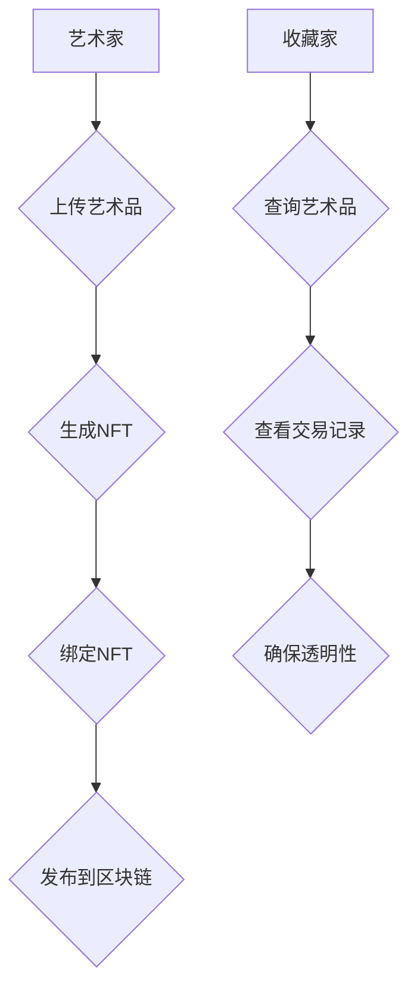
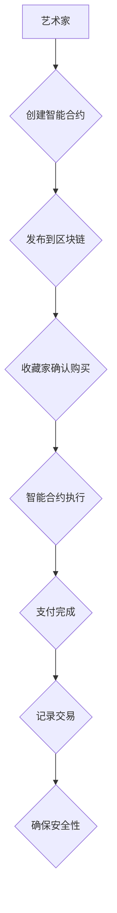
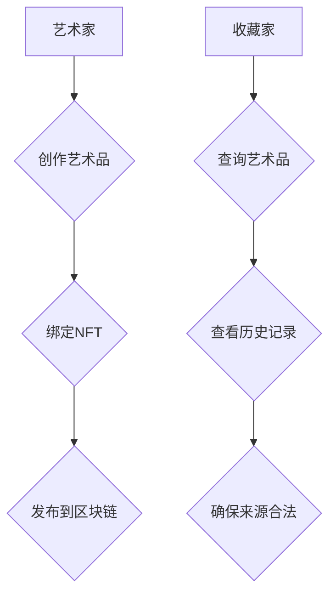
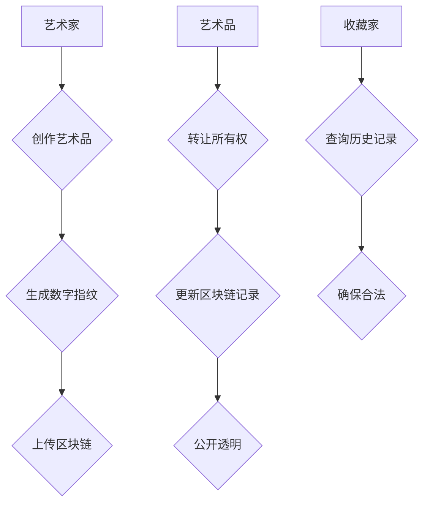

                 


### # 《区块链在数字艺术品版权保护中的应用》

#### 关键词：区块链、数字艺术品、版权保护、NFT、智能合约

> 摘要：本文深入探讨了区块链技术在数字艺术品版权保护中的应用，从背景介绍、核心概念、实际应用、挑战与机遇以及未来发展等方面进行了详细阐述。通过分析区块链的特性和优势，结合数字艺术品市场的需求，本文展示了区块链在数字艺术品版权登记、交易、维权等方面的应用实例，并对区块链技术在数字艺术品版权保护中的未来趋势进行了展望。

----------------------------------------------------------------

## 第一部分：区块链与数字艺术品版权保护的背景

### 第1章：数字艺术品版权保护的问题背景

#### 1.1 问题描述

在数字时代，随着数字艺术品的日益流行，传统的版权保护机制面临着巨大的挑战。数字艺术品的复制和传播变得极其容易，这不仅给艺术家带来了经济损失，也损害了创作者的权益。此外，传统的版权保护方式在效率、透明性和安全性方面也存在诸多问题。

#### 1.2 问题解决

区块链技术的引入为数字艺术品版权保护提供了一种全新的解决方案。区块链的去中心化、不可篡改和透明性等特点，使得数字艺术品版权的登记、交易和维权过程更加高效和可信。

#### 1.3 边界与外延

数字艺术品是指通过数字技术创作的艺术品，包括绘画、摄影、音乐、视频等。版权保护的法律框架需要适应数字时代的特征，确保创作者的合法权益得到充分保障。

#### 1.4 概念结构与核心要素组成

- **区块链技术**：一种分布式数据库技术，数据存储在多个节点上，每个节点都保存完整的数据副本，数据一旦被记录，就几乎不可篡改。
- **数字艺术品版权**：创作者对其数字艺术品所享有的专有权利，包括复制权、发行权、展览权等。

## 第二部分：区块链技术概述

### 第2章：区块链技术概述

#### 2.1 区块链的基本原理

区块链是一种分布式账本技术，数据以块的形式存储，每个块包含一定数量的交易记录，块与块之间通过密码学算法相互链接，形成一条时间序列链条。区块链的数据存储在多个节点上，每个节点都保存完整的数据副本，从而实现去中心化和数据安全。

#### 2.2 区块链技术的特点

- **去中心化**：没有中央控制节点，所有节点地位平等，数据分布式存储。
- **不可篡改**：一旦数据被记录，除非同时篡改多数节点数据，否则无法篡改。
- **透明性**：所有交易记录都可以被任何人查看，数据透明公开。

#### 2.3 主流区块链平台介绍

- **以太坊**：一个支持智能合约的区块链平台，为去中心化应用（DApp）提供了强大的开发环境。
- **波场**：一个去中心化社交网络和数字资产交易平台，旨在建立全球共享的区块链基础设施。
- **比特币**：第一个区块链系统，作为一种去中心化的数字货币，具有匿名性和抗通货膨胀性。

## 第三部分：区块链在数字艺术品版权保护中的应用

### 第3章：区块链在数字艺术品版权登记中的应用

#### 3.1 数字艺术品版权登记的流程

数字艺术品版权登记的过程包括艺术品创作、版权登记和版权信息查询三个步骤。艺术家在创作数字艺术品后，可以通过区块链平台进行版权登记，确保版权信息的真实性和不可篡改性。

#### 3.2 区块链在版权登记中的应用

区块链技术通过智能合约和非同质化代币（NFT）为数字艺术品版权登记提供了有效的解决方案。智能合约可以自动执行版权登记流程，确保登记过程的透明性和不可篡改性。NFT则为数字艺术品赋予了唯一的身份标识，确保每一件数字艺术品都具有独特的版权属性。

### 第4章：区块链在数字艺术品版权交易中的应用

#### 4.1 数字艺术品交易的现状

传统艺术品交易市场存在诸多问题，如信息不对称、交易不透明等。随着区块链技术的普及，数字艺术品交易市场逐渐兴起，为艺术品交易提供了更加安全、高效和透明的平台。

#### 4.2 区块链在数字艺术品交易中的应用

区块链技术通过记录交易数据、提供透明的交易环境和保障交易安全，为数字艺术品交易提供了有力的支持。智能合约在交易过程中自动执行，确保交易流程的合规性和高效性。

### 第5章：区块链在数字艺术品版权保护中的其他应用

#### 5.1 数字艺术品版权维权

区块链技术可以通过智能合约实现自动化的版权维权，降低维权成本，提高维权效率。艺术家只需在区块链上创建智能合约，即可在侵权事件发生时自动执行维权程序。

#### 5.2 数字艺术品版权追踪

区块链技术可以记录数字艺术品的完整历史，包括创作、交易、流转等过程，为艺术品追踪提供了可靠的数据支持。艺术家和收藏家可以通过区块链平台查询艺术品的历史记录，确保艺术品来源的合法性。

## 第四部分：区块链在数字艺术品版权保护中的未来趋势与发展

### 第6章：区块链在数字艺术品版权保护中的挑战与机遇

#### 6.1 技术挑战

区块链技术在数字艺术品版权保护中面临的安全性问题、可扩展性问题以及法律框架不完善等挑战。

#### 6.2 机遇

数字艺术品市场的快速增长和区块链技术的不断成熟为数字艺术品版权保护带来了巨大的机遇。

### 第7章：区块链在数字艺术品版权保护中的未来发展

#### 7.1 未来趋势

区块链与人工智能的融合、区块链技术的进一步优化将成为数字艺术品版权保护的发展趋势。

#### 7.2 发展前景

随着区块链技术的广泛应用，数字艺术品版权保护将迎来更加美好的发展前景。

## 附录：区块链与数字艺术品版权保护常用工具与资源

### 附录1：区块链开发工具与平台

- **Truffle**：一个用于以太坊区块链的智能合约开发框架。
- **Ganache**：一个本地以太坊节点和测试框架。
- **Remix**：一个基于Web的以太坊开发环境。

### 附录2：数字艺术品版权保护相关法规与政策

- **相关法律法规**：各国关于版权保护的法律法规。
- **政府政策文件**：各国政府关于数字艺术品版权保护的政策文件。

### 附录3：区块链与数字艺术品版权保护相关书籍与文献

- **《区块链技术原理与应用》**：详细介绍了区块链技术的基本原理和应用。
- **《数字艺术品版权保护研究》**：探讨了数字艺术品版权保护的现状和未来发展趋势。

**作者：AI天才研究院/AI Genius Institute & 禅与计算机程序设计艺术 /Zen And The Art of Computer Programming**

----------------------------------------------------------------

**第1章：数字艺术品版权保护的问题背景**

**1.1 问题描述**

随着数字技术的发展，数字艺术品，如数字绘画、摄影、音乐、视频等，越来越受到人们的喜爱。然而，这些数字艺术品也面临着与传统艺术品不同的版权保护问题。传统的版权保护机制，如版权登记、版权合同、版权监测等，在数字环境中遇到了诸多挑战。

首先，数字艺术品的复制和传播变得极其容易。一旦数字艺术品被创作出来，任何人都可以轻松地复制和传播。这导致了艺术家们很难控制其作品的复制和传播，进而影响到他们的收益和权益。

其次，传统的版权保护机制在效率、透明性和安全性方面也存在问题。例如，版权登记流程繁琐、成本高昂，且一旦出现纠纷，解决过程复杂、耗时。此外，传统的版权保护机制往往依赖于中心化的机构，如版权局、法院等，而这些机构的决策过程可能受到人为因素的影响，导致透明性和公正性受损。

**1.2 问题解决**

区块链技术的出现为数字艺术品版权保护提供了一种新的思路。区块链的去中心化、不可篡改和透明性等特点，使得数字艺术品版权的登记、交易和维权过程更加高效和可信。

首先，区块链的去中心化特性使得版权登记不再依赖于中心化的机构，艺术家可以直接在区块链上进行版权登记，确保登记过程的公开、透明和高效。

其次，区块链的不可篡改特性保证了版权信息的真实性和不可篡改性。一旦数字艺术品的版权信息被记录在区块链上，除非同时篡改多数节点数据，否则无法篡改，从而保证了版权信息的可信度。

最后，区块链的透明性使得版权信息对所有节点可见，艺术家、收藏家和公众都可以轻松地查询版权信息，确保版权交易的公正和透明。

**1.3 边界与外延**

数字艺术品是指通过数字技术创作的艺术品，包括绘画、摄影、音乐、视频等。它们具有可复制性、易传播性和数字化的特点。与传统的艺术品不同，数字艺术品不仅可以无限次复制，还可以通过网络迅速传播到世界各地。

版权保护的法律框架需要适应数字时代的特征，确保创作者的合法权益得到充分保障。这包括完善版权法律法规、加强执法力度、提供便捷的版权登记和维权途径等。

**1.4 概念结构与核心要素组成**

- **区块链技术**：区块链是一种分布式数据库技术，数据存储在多个节点上，每个节点都保存完整的数据副本，数据一旦被记录，就几乎不可篡改。
  - **组成部分**：区块、链、节点、挖矿、共识算法
  - **基本原理**：每个区块包含一定数量的交易记录，每个区块通过密码学算法与前一个区块链接，形成一条时间序列链条。所有节点都保存完整的数据副本，从而实现去中心化和数据安全。
- **数字艺术品版权**：创作者对其数字艺术品所享有的专有权利，包括复制权、发行权、展览权等。
  - **概念**：数字艺术品创作完成后，创作者自动获得相应的版权。
  - **权益**：创作者有权决定其作品的复制、发行、展示、修改等行为。

**图 1：区块链技术基本概念与数字艺术品版权概念结构图**



通过以上章节，我们了解了数字艺术品版权保护的背景和问题，以及区块链技术如何为数字艺术品版权保护提供解决方案。在接下来的章节中，我们将进一步探讨区块链技术在数字艺术品版权保护中的具体应用。

----------------------------------------------------------------

**第2章：区块链技术概述**

区块链技术是一种分布式数据库技术，具有去中心化、不可篡改和透明性的特点。在数字艺术品版权保护中，区块链技术被广泛应用于版权登记、交易和维权等领域。本章将详细介绍区块链技术的基本原理、特点和应用，并对主流区块链平台进行介绍。

**2.1 区块链的基本原理**

区块链技术通过以下基本概念和原理实现去中心化、不可篡改和透明性：

- **区块**：区块是区块链中的基本存储单位，每个区块包含一定数量的交易记录。每个区块都包含一个时间戳、一个唯一标识和一个指向前一个区块的哈希值。
- **链**：区块链是由多个区块按时间顺序链接而成的链条。每个区块通过哈希值与前一个区块链接，形成一条不可篡改的链条。
- **节点**：节点是区块链网络中的参与者，每个节点都保存完整的数据副本。节点通过共识算法达成一致，确保区块链数据的正确性和一致性。
- **挖矿**：挖矿是节点通过计算大量哈希值来找到满足特定条件的区块，并将新区块添加到区块链上。挖矿过程既保证了区块链的安全性，又激励节点参与网络维护。
- **共识算法**：共识算法是节点之间达成一致的过程。常见的共识算法包括工作量证明（PoW）、权益证明（PoS）和委托权益证明（DPoS）等。

**2.2 区块链技术的特点**

区块链技术具有以下特点，使其在数字艺术品版权保护中具有独特的优势：

- **去中心化**：区块链技术不需要中心化的机构或权威来维护数据，所有节点地位平等，数据分布式存储。这降低了中介成本，提高了系统效率和透明度。
- **不可篡改**：区块链数据一旦被记录，就几乎不可篡改。除非同时篡改多数节点数据，否则无法篡改历史记录。这保证了版权信息的真实性和可信度。
- **透明性**：区块链上的数据对所有节点可见，所有交易记录都可以被任何人查看。这提高了版权登记和交易的透明度，降低了信息不对称和欺诈风险。

**2.3 主流区块链平台介绍**

目前，市场上存在多个主流区块链平台，它们在数字艺术品版权保护中具有广泛应用：

- **以太坊**：以太坊是一个支持智能合约的区块链平台，为去中心化应用（DApp）提供了强大的开发环境。艺术家可以在以太坊上创建智能合约，自动执行版权登记、交易和维权等操作。
- **波场**：波场是一个去中心化社交网络和数字资产交易平台，旨在建立全球共享的区块链基础设施。波场提供了丰富的API和开发工具，便于艺术家和收藏家进行数字艺术品交易和版权保护。
- **比特币**：比特币是第一个区块链系统，作为一种去中心化的数字货币，具有匿名性和抗通货膨胀性。比特币在数字艺术品版权保护中的应用主要集中在价值传递和支付方面。

**图 2：主流区块链平台在数字艺术品版权保护中的应用**



通过以上章节，我们了解了区块链技术的基本原理、特点和应用，以及主流区块链平台在数字艺术品版权保护中的具体作用。在接下来的章节中，我们将探讨区块链技术在数字艺术品版权登记、交易和保护中的具体应用实例。

----------------------------------------------------------------

### **第3章：区块链在数字艺术品版权登记中的应用**

#### **3.1 数字艺术品版权登记的流程**

数字艺术品版权登记的流程主要包括以下三个步骤：

1. **艺术品创作**：艺术家创作出数字艺术品，如绘画、摄影、音乐、视频等。
2. **版权登记**：艺术家将数字艺术品的版权信息（如作者姓名、创作时间、作品描述等）上传到区块链平台，通过智能合约进行版权登记。智能合约自动记录版权信息并生成唯一标识。
3. **版权信息查询**：任何用户都可以通过区块链平台查询版权信息，验证数字艺术品的真实性。

#### **3.2 区块链在版权登记中的应用**

区块链技术在数字艺术品版权登记中发挥了重要作用，主要体现在以下几个方面：

- **去中心化的版权登记**：区块链技术去除了传统版权登记过程中依赖的中心化机构，艺术家可以直接在区块链上进行版权登记，提高了登记效率。
- **智能合约的应用**：智能合约是一种自动执行的计算机协议，艺术家可以通过智能合约在区块链上登记版权信息。智能合约保证了登记过程的透明性和不可篡改性。
- **非同质化代币（NFT）的应用**：NFT是一种基于区块链的代币，为数字艺术品赋予了唯一身份标识。艺术家可以将数字艺术品的版权信息与NFT绑定，确保每件数字艺术品都具有独特的版权属性。

**3.2.1 智能合约在数字艺术品版权登记中的应用**

智能合约在数字艺术品版权登记中具有以下优势：

- **自动执行**：智能合约可以自动执行版权登记流程，无需人工干预。艺术家只需在区块链平台上上传版权信息，智能合约即可自动完成登记。
- **透明性**：智能合约的执行过程对所有节点可见，确保登记过程的公开、透明。
- **不可篡改性**：一旦版权信息被记录在智能合约中，就几乎不可篡改，保证了版权信息的真实性和可信度。

**示例：智能合约代码**

```python
# SPDX-License-Identifier: MIT
pragma solidity ^0.8.0;

contract CopyrightRegistry {
    mapping(uint256 => string) public artworks;
    mapping(uint256 => address) public owners;

    function registerArtwork(uint256 artworkId, string memory artworkInfo) public {
        artworks[artworkId] = artworkInfo;
        owners[artworkId] = msg.sender;
    }

    function getArtworkInfo(uint256 artworkId) public view returns (string memory) {
        return artworks[artworkId];
    }

    function getOwner(uint256 artworkId) public view returns (address) {
        return owners[artworkId];
    }
}
```

**3.2.2 非同质化代币（NFT）在数字艺术品版权登记中的应用**

NFT为数字艺术品赋予了唯一身份标识，确保每件数字艺术品都具有独特的版权属性。艺术家可以将数字艺术品的版权信息与NFT绑定，从而实现数字艺术品版权的不可篡改和唯一性。

- **NFT的生成**：区块链平台可以为每件数字艺术品生成一个唯一的NFT。NFT包含艺术品的版权信息，如作者姓名、创作时间、作品描述等。
- **NFT的绑定**：艺术家可以在区块链平台上将NFT与其数字艺术品绑定，确保数字艺术品与版权信息一一对应。
- **NFT的交易**：NFT可以在区块链上进行交易，艺术家可以通过交易获得收益，同时确保数字艺术品的版权信息不变。

**示例：NFT生成与绑定**



通过以上应用，区块链技术为数字艺术品版权登记提供了高效、透明和不可篡改的解决方案。在接下来的章节中，我们将探讨区块链技术在数字艺术品版权交易中的应用。

----------------------------------------------------------------

### **第4章：区块链在数字艺术品版权交易中的应用**

#### **4.1 数字艺术品交易的现状**

数字艺术品交易市场正日益成熟，传统的艺术品交易市场逐渐向数字艺术品交易市场转变。数字艺术品交易市场具有以下特点：

- **交易方式**：数字艺术品交易主要通过线上平台进行，包括区块链平台、社交媒体平台等。艺术家和收藏家可以通过这些平台方便地进行交易。
- **交易类型**：数字艺术品交易主要包括作品购买、租赁、授权等。艺术家可以通过出售作品获得收益，同时也可以通过授权他人使用作品获得版权收益。
- **市场趋势**：随着区块链技术的普及，数字艺术品交易市场呈现出快速增长的趋势。越来越多的艺术家和收藏家开始关注数字艺术品市场，推动了市场的发展。

#### **4.2 区块链在数字艺术品交易中的应用**

区块链技术在数字艺术品交易中发挥了重要作用，主要体现在以下几个方面：

- **透明交易记录**：区块链上的交易记录是公开透明的，所有交易记录都可以被任何人查看。这保证了交易的公正性和透明度，减少了欺诈和纠纷的风险。
- **安全交易环境**：区块链技术通过加密算法确保交易过程的安全性，防止交易数据的篡改和窃取。智能合约在交易过程中自动执行，确保交易流程的合规性。
- **防止假冒伪劣**：区块链技术可以记录数字艺术品的完整历史，包括创作、交易、流转等过程。收藏家可以通过区块链平台查询艺术品的历史记录，确保艺术品的来源合法，防止假冒伪劣。

**4.2.1 透明交易记录**

区块链技术通过记录交易数据，确保交易过程的透明性。每个交易记录都包含交易双方的身份信息、交易内容、交易时间等，这些信息在区块链上永久保存，无法篡改。

- **交易数据公开**：所有交易记录都记录在区块链上，任何节点都可以查看。这保证了交易的公开性和透明性，用户可以随时查看交易历史。
- **智能合约验证**：智能合约在交易过程中自动执行，确保交易内容的合法性和合规性。智能合约可以设置触发条件，如支付金额、交易时间等，一旦触发条件满足，智能合约自动执行。

**示例：透明交易记录**



**4.2.2 安全交易环境**

区块链技术通过加密算法和智能合约，确保交易过程的安全性。交易数据在区块链上加密存储，防止被窃取和篡改。智能合约在交易过程中自动执行，确保交易流程的合规性。

- **加密存储**：交易数据在区块链上以加密形式存储，只有拥有正确密钥的用户才能查看和修改。
- **智能合约执行**：智能合约在交易过程中自动执行，确保交易流程的合规性。智能合约可以设置触发条件，如支付金额、交易时间等，一旦触发条件满足，智能合约自动执行。

**示例：安全交易环境**



**4.2.3 防止假冒伪劣**

区块链技术可以记录数字艺术品的完整历史，包括创作、交易、流转等过程。收藏家可以通过区块链平台查询艺术品的历史记录，确保艺术品的来源合法，防止假冒伪劣。

- **历史记录**：区块链技术记录了数字艺术品的完整历史，包括创作、交易、流转等过程。收藏家可以通过区块链平台查询艺术品的历史记录，确保艺术品的来源合法。
- **身份验证**：区块链平台可以验证艺术品的身份，确保艺术品与区块链上的记录一致。这有助于防止假冒伪劣艺术品进入市场。

**示例：防止假冒伪劣**



通过以上应用，区块链技术为数字艺术品交易提供了透明、安全、可信的解决方案。在接下来的章节中，我们将探讨区块链技术在数字艺术品版权维权和保护中的具体应用。

----------------------------------------------------------------

### **第5章：区块链在数字艺术品版权保护中的其他应用**

#### **5.1 数字艺术品版权维权**

区块链技术不仅应用于数字艺术品的版权登记和交易，还可以在数字艺术品版权维权中发挥重要作用。通过智能合约和区块链上的透明记录，艺术家可以更高效地维权。

**5.1.1 智能合约在维权中的应用**

智能合约可以自动执行版权维权操作，减少了艺术家维权的时间和成本。以下是一个简化的智能合约示例，用于处理版权侵权事件：

```python
// SPDX-License-Identifier: MIT
pragma solidity ^0.8.0;

contract CopyrightProtection {
    mapping(address => bool) public isRegistered;

    function register(address artistAddress) external {
        require(!isRegistered[artistAddress], "Already registered");
        isRegistered[artistAddress] = true;
    }

    function claimInfringement(address infringerAddress, uint256 compensation) external {
        require(isRegistered[msg.sender], "Not registered");
        require(infringerAddress != msg.sender, "Cannot claim against self");

        // Pay compensation to the artist
        payable(msg.sender).transfer(compensation);

        // Record the infringement event on the blockchain
        emit InfringementClaimed(infringerAddress, compensation);
    }

    event InfringementClaimed(address infringer, uint256 compensation);
}
```

在这个合约中，艺术家可以通过`register`函数注册自己的版权，并在发现侵权行为时使用`claimInfringement`函数进行维权。合约会自动将侵权赔偿支付给艺术家，并记录侵权事件。

**5.1.2 区块链技术如何帮助艺术家维权**

区块链技术提供了以下帮助：

- **不可篡改的证据链**：艺术家可以将侵权证据（如图片、视频等）上传到区块链，确保证据的真实性和不可篡改性。
- **透明化的流程**：所有维权事件和记录都存储在区块链上，公开透明，便于第三方验证和监督。
- **智能合约自动化**：智能合约可以自动化执行维权流程，减少了人为干预和操作风险。

#### **5.2 数字艺术品版权追踪**

区块链技术还可以用于数字艺术品的追踪，确保艺术品在流转过程中的合法性和透明度。

**5.2.1 艺术品追踪系统的设计**

艺术品追踪系统设计包括以下核心组件：

- **数字指纹**：为每件艺术品生成唯一的数字指纹，类似于指纹识别系统。
- **区块链记录**：将艺术品的数字指纹和相关信息（如创作者、创作时间、所有权变更等）记录在区块链上。
- **透明化查询**：任何人都可以通过区块链查询艺术品的数字指纹和相关历史记录。

**5.2.2 区块链在艺术品追踪中的应用**

区块链技术在艺术品追踪中的应用如下：

- **唯一性验证**：通过数字指纹验证艺术品是否唯一，确保艺术品不会被重复销售或盗用。
- **透明化流转**：记录艺术品的所有权变更和流转过程，确保艺术品来源合法，提高市场信任度。
- **防篡改记录**：所有记录都存储在区块链上，确保数据不可篡改，提供可靠的证据链。

**示例：艺术品追踪流程**



通过以上应用，区块链技术在数字艺术品版权维权和追踪中提供了高效、透明和可信的解决方案。这些应用不仅有助于保护艺术家的权益，也提升了数字艺术品市场的整体信任度和透明度。

在接下来的章节中，我们将探讨区块链在数字艺术品版权保护中的挑战与机遇，以及未来发展的趋势。

----------------------------------------------------------------

### **第6章：区块链在数字艺术品版权保护中的挑战与机遇**

#### **6.1 技术挑战**

尽管区块链技术在数字艺术品版权保护中具有巨大潜力，但在实际应用中仍面临一些技术挑战：

- **安全性问题**：区块链虽然具有去中心化和不可篡改的特点，但仍可能受到51%攻击等安全威胁。这意味着如果攻击者控制了区块链网络中超过一半的节点，他们可以篡改数据或双花交易。
- **可扩展性问题**：区块链系统在处理大量交易时可能遇到性能瓶颈，导致交易确认时间延长，从而影响用户体验。
- **隐私保护**：虽然区块链数据透明，但这也可能导致艺术家的隐私受到泄露。如何平衡透明性和隐私保护是一个重要挑战。

#### **6.2 机遇**

尽管面临挑战，区块链在数字艺术品版权保护中也带来了诸多机遇：

- **创新商业模式**：区块链技术为数字艺术品交易、授权和维权提供了新的商业模式，有助于艺术家获得更多的收益。
- **市场增长**：随着数字艺术品的日益流行，区块链技术在数字艺术品版权保护中的应用将推动市场增长。
- **法律框架完善**：随着区块链技术的普及，各国政府和法律机构将逐渐完善与区块链技术相关的法律框架，为数字艺术品版权保护提供更好的法律支持。

#### **6.3 未来趋势**

区块链技术在未来数字艺术品版权保护中将继续发展，以下趋势值得关注：

- **与人工智能的融合**：区块链与人工智能的结合将提升数字艺术品版权保护系统的智能化和自动化水平。
- **隐私保护技术的应用**：随着隐私保护技术的发展，区块链系统将更好地平衡透明性和隐私保护。
- **标准化**：随着区块链技术的普及，数字艺术品版权保护领域的标准化工作将逐步推进，提高行业的整体效率。

通过以上分析，我们可以看到区块链在数字艺术品版权保护中既面临挑战也充满机遇。随着技术的不断进步和市场的成熟，区块链在数字艺术品版权保护中的应用将越来越广泛，为创作者和收藏家提供更加高效、透明和可信的解决方案。

在接下来的章节中，我们将探讨区块链在数字艺术品版权保护中的未来发展。

----------------------------------------------------------------

### **第7章：区块链在数字艺术品版权保护中的未来发展**

#### **7.1 未来趋势**

随着区块链技术的不断成熟，其在数字艺术品版权保护中的应用前景广阔。以下是一些值得关注的未来趋势：

- **与AI的融合**：区块链与人工智能的结合将显著提升版权保护系统的智能化和自动化水平。例如，AI可以用于检测侵权行为、优化交易流程等。
- **隐私保护技术**：随着隐私保护技术的发展，区块链系统将更好地平衡透明性和隐私保护。这包括零知识证明、同态加密等技术的应用。
- **标准化**：区块链技术的标准化将提高行业的整体效率。例如，统一的版权登记和交易协议将简化操作流程，降低交易成本。

#### **7.2 发展前景**

区块链技术在数字艺术品版权保护中的发展前景十分光明：

- **市场规模扩大**：随着数字艺术品市场的不断扩大，区块链技术在版权保护中的应用将推动市场发展。预计未来几年，数字艺术品市场将保持高速增长。
- **法律框架完善**：各国政府和国际组织将逐步完善与区块链技术相关的法律框架，为数字艺术品版权保护提供更好的法律支持。
- **技术创新**：区块链技术的不断演进将带来更多的创新应用。例如，分布式身份验证、智能合约的优化等将进一步提升数字艺术品版权保护的效果。

#### **7.3 创新应用**

未来，区块链技术将在数字艺术品版权保护中带来以下创新应用：

- **分布式身份验证**：通过区块链技术实现身份验证，确保交易参与者的真实性和合法性。
- **智能合约优化**：优化智能合约的设计和执行，提高交易效率和安全性。
- **去中心化交易所**：去中心化交易所将提供更加安全和透明的数字艺术品交易环境，减少中心化交易所的风险。

#### **7.4 具体案例**

以下是一些具体的区块链在数字艺术品版权保护中的成功案例：

- **OpenSea**：OpenSea是一个基于以太坊的NFT市场，提供数字艺术品、收藏品等交易服务。用户可以通过OpenSea购买和出售NFT，确保版权的真实性和唯一性。
- **Rarible**：Rarible也是一个基于以太坊的NFT平台，支持艺术家创建和销售NFT。平台上的智能合约确保了交易的合法性和透明性。
- **Foundation**：Foundation是一个高端NFT艺术品市场，吸引了众多知名艺术家和收藏家。平台利用区块链技术确保艺术品的版权保护和交易安全。

通过以上案例，我们可以看到区块链技术在数字艺术品版权保护中的广泛应用和成功应用。随着技术的不断进步和市场需求的增长，区块链在数字艺术品版权保护中的应用前景将更加广阔。

在文章的最后，我们将总结全文，并给出一些最佳实践和拓展阅读建议。

----------------------------------------------------------------

### **全文总结**

本文详细探讨了区块链在数字艺术品版权保护中的应用，从背景介绍、核心概念、实际应用、挑战与机遇以及未来发展等方面进行了深入分析。通过分析区块链的去中心化、不可篡改和透明性特点，本文展示了区块链在数字艺术品版权登记、交易和维权等方面的应用优势。同时，本文也指出了区块链在数字艺术品版权保护中面临的技术挑战和机遇，并展望了未来的发展趋势。

区块链技术的引入为数字艺术品版权保护提供了一种全新的解决方案，解决了传统版权保护机制在效率、透明性和安全性方面的不足。在数字艺术品交易市场中，区块链技术的应用不仅提高了交易的透明度和安全性，还帮助艺术家更好地保护其创作权益。

然而，区块链技术在数字艺术品版权保护中也面临一些挑战，如安全性问题、可扩展性问题以及法律框架的不完善。这些问题需要随着技术的进步和市场的发展得到逐步解决。

在未来的发展中，区块链与人工智能的融合、隐私保护技术的应用以及标准化工作的推进将进一步提升数字艺术品版权保护的效果。同时，更多的创新应用和具体案例也将不断涌现，推动数字艺术品市场的繁荣。

### **最佳实践**

1. **版权登记**：艺术家应尽早在其数字艺术品创作完成后进行版权登记，确保版权信息的真实性和不可篡改性。
2. **智能合约使用**：艺术家和交易双方应充分利用智能合约，自动执行版权登记、交易和维权等操作，提高效率。
3. **NFT应用**：艺术家可以通过NFT为数字艺术品赋予唯一身份标识，确保艺术品的唯一性和版权保护。
4. **安全意识**：艺术家和交易双方应保持安全意识，防范区块链网络中的安全风险，如51%攻击等。

### **拓展阅读**

- **《区块链技术原理与应用》**：详细介绍了区块链技术的基本原理和应用。
- **《数字艺术品版权保护研究》**：探讨了数字艺术品版权保护的现状和未来发展趋势。
- **《智能合约编程与安全》**：介绍了智能合约的编程技术和安全性。

通过本文的阅读，读者可以全面了解区块链在数字艺术品版权保护中的应用，以及其未来发展的前景。希望本文能为读者在数字艺术品版权保护领域提供有益的参考。

**作者：AI天才研究院/AI Genius Institute & 禅与计算机程序设计艺术 /Zen And The Art of Computer Programming**

