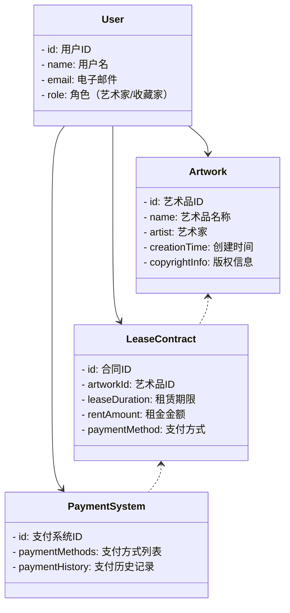
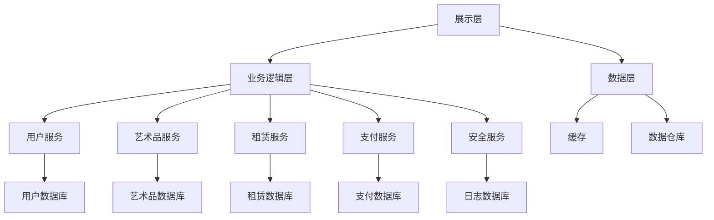

                 

## 引言

### 区块链与数字艺术品租赁的兴起

随着互联网技术的飞速发展，数字艺术品成为了一个备受关注的领域。数字艺术品，指的是通过数字方式创作、存储、传输和展示的艺术作品，如电子音乐、数字绘画、虚拟现实作品等。它们具有独特的创作方式和传播途径，同时也带来了版权保护、交易认证等问题。

而区块链技术，作为一种分布式账本技术，因其安全性、透明性和不可篡改性而受到了广泛关注。区块链技术通过去中心化的方式，实现了数据的存储和传输，为数字艺术品市场提供了一种新的解决方案。

在这个背景下，智能合约应运而生。智能合约是基于区块链的一种自执行合同，它通过编程逻辑自动执行合同条款，无需依赖第三方中介机构。智能合约的出现，为数字艺术品租赁市场带来了新的机遇和挑战。

### 文章的核心内容与主题思想

本文旨在探讨区块链在数字艺术品租赁中的智能合约应用。首先，我们将介绍区块链和数字艺术品租赁的基本概念，以及智能合约的定义和优势。接着，我们将详细讲解智能合约的算法原理，包括编程语言、编程流程和常用算法。

随后，我们将引入与智能合约相关的数学模型，并使用 LaTeX 格式展示相关数学公式。这部分内容旨在帮助读者更好地理解智能合约的运作原理。

在系统分析与架构设计方案部分，我们将描述数字艺术品租赁系统的架构设计，包括系统功能设计、系统架构设计、系统接口设计和系统交互设计。这部分内容将帮助读者了解智能合约在实际项目中的应用。

接下来，我们将通过实际案例，展示智能合约在数字艺术品租赁中的应用，并详细解析其实现过程。这部分内容将帮助读者将理论知识应用于实际项目中。

最后，我们将总结最佳实践，提供注意事项，并推荐拓展阅读。这部分内容旨在帮助读者在实际应用中更好地利用智能合约技术。

通过本文的阅读，读者将全面了解区块链在数字艺术品租赁中的智能合约应用，掌握智能合约的原理和实战技巧，为数字艺术品市场的创新发展提供有力支持。

## 背景介绍

### 区块链技术简介

区块链是一种分布式账本技术，它通过去中心化的方式实现了数据的存储和传输。区块链的基本原理是，通过多个节点之间的协作，共同维护一个分布式账本，从而确保数据的真实性和完整性。区块链具有以下几个关键技术特点：

1. **去中心化**：区块链不需要中心化的管理机构，所有节点都有平等的权限，共同维护账本。
2. **安全性**：区块链采用加密技术，确保数据的安全性和不可篡改性。
3. **透明性**：区块链上的数据是公开透明的，所有节点都可以查看和验证。
4. **不可篡改性**：一旦数据被记录在区块链上，就不可更改，保证了数据的真实性和可靠性。

区块链技术自2008年比特币的诞生以来，已经经历了数十年的发展，逐渐应用于各个领域，如金融、供应链、医疗等。区块链技术的优势在于，它能够提高数据的透明度和安全性，减少中介成本，提升效率，从而为各行业的创新发展提供了新的动力。

### 数字艺术品租赁现状

数字艺术品租赁是指通过互联网平台，将数字艺术品以租赁的方式提供给用户使用。随着数字艺术品的普及，数字艺术品租赁市场也逐渐壮大。数字艺术品租赁具有以下几个特点：

1. **便捷性**：用户可以通过互联网随时随地访问数字艺术品，享受便捷的服务。
2. **低成本**：数字艺术品租赁无需实体交易，降低了交易成本。
3. **个性化**：数字艺术品租赁可以根据用户的兴趣和需求进行个性化推荐。
4. **版权保护**：区块链技术为数字艺术品提供了可靠的版权保护机制，防止未经授权的复制和传播。

目前，数字艺术品租赁市场已经涌现出一些成功的平台，如 Nifty Gateway、SuperRare 等。这些平台利用区块链技术，实现了数字艺术品的安全存储、交易和租赁，为艺术家和收藏家提供了全新的交易模式。

### 智能合约的概念及其应用潜力

智能合约是基于区块链技术的一种自执行合同，它通过编程逻辑自动执行合同条款，无需依赖第三方中介。智能合约的核心特点是自动化和去中心化，它能够提高交易的透明度和效率，减少欺诈和纠纷。

智能合约的基本原理是，通过在区块链上编写和部署合约代码，当满足特定条件时，合约会自动执行相应的操作。智能合约的优势包括：

1. **自动化执行**：智能合约通过编程逻辑自动执行合同条款，避免了人为干预，提高了交易效率。
2. **去中心化**：智能合约不依赖第三方中介，减少了中介成本，降低了交易风险。
3. **透明性**：智能合约的执行过程是公开透明的，所有节点都可以查看和验证。
4. **不可篡改性**：智能合约一旦部署，其代码和执行过程是不可篡改的，保证了交易的真实性和可靠性。

在数字艺术品租赁中，智能合约的应用潜力巨大。例如，智能合约可以自动执行租金支付、租赁期限管理、违约处理等功能，确保租赁过程的顺利进行。智能合约还可以为艺术家和收藏家提供可靠的版权保护机制，防止未经授权的复制和传播。

总的来说，区块链技术、数字艺术品租赁和智能合约这三者的结合，为数字艺术品市场带来了新的机遇和挑战。通过本文的探讨，我们将深入理解这些技术的基本概念和应用潜力，为数字艺术品市场的创新发展提供有力支持。

### 区块链的基本原理与关键技术

区块链是一种分布式账本技术，其核心原理是通过多个节点共同维护一个去中心化的数据结构，确保数据的真实性和完整性。下面，我们将详细阐述区块链的基本原理、组成部分和关键技术。

#### 区块链的基本原理

区块链的基本原理可以概括为三个关键词：去中心化、分布式和加密。

1. **去中心化**：区块链不需要中心化的管理机构，所有节点都有平等的权限，共同维护账本。这种去中心化的结构使得区块链具有较高的抗攻击性和可靠性。
2. **分布式**：区块链上的数据分布存储在多个节点上，每个节点都保存一份完整的账本。这种分布式存储方式提高了数据的可用性和容错性。
3. **加密**：区块链采用加密技术，确保数据的隐私性和安全性。数据的加密传输和存储，使得未经授权的访问和篡改变得非常困难。

区块链通过共识机制确保所有节点对数据的共识。共识机制是区块链网络中的节点通过一系列规则和算法，就数据的状态达成一致的过程。常见的共识机制包括工作量证明（PoW）、权益证明（PoS）和拜占庭容错算法（BFT）等。

#### 区块链的组成部分

区块链主要由以下几部分组成：

1. **区块**：区块是区块链的基本组成单位，每个区块包含一定数量的交易记录。区块通过哈希函数与前后区块连接，形成区块链。
2. **交易**：交易是区块链上的基本数据单元，描述了数据的流动和变更。例如，在数字艺术品租赁中，交易可能包括租赁合同的签订、租金的支付等。
3. **链**：区块链是一个由多个区块按照时间顺序连接而成的链条。区块链的长度随时间增长，每个区块都包含了之前区块的哈希值，形成了时间戳链。
4. **节点**：节点是区块链网络中的参与者，负责维护区块链、验证交易和参与共识过程。每个节点都保存了一份完整的账本，通过共识机制确保账本的一致性。

#### 区块链的关键技术

区块链的关键技术包括加密技术、共识机制、智能合约等。

1. **加密技术**：区块链采用哈希函数、非对称加密和数字签名等技术，确保数据的隐私性和安全性。哈希函数用于生成数据的唯一标识，非对称加密用于保护数据传输过程中的隐私，数字签名用于验证数据的真实性。
2. **共识机制**：共识机制是区块链网络中的节点就数据的状态达成一致的过程。不同的共识机制有不同的优势和局限性。工作量证明（PoW）通过计算复杂度确保安全性，但能耗较高；权益证明（PoS）通过持有代币的数量和时长确保安全性，但可能导致富者越富；拜占庭容错算法（BFT）在保证安全性的同时，具有较高的性能。
3. **智能合约**：智能合约是一种基于区块链的自动化合同，通过编程逻辑实现合同条款的自动化执行。智能合约能够提高交易效率，减少中介成本，提升数据透明度。

通过上述分析，我们可以看出，区块链技术通过去中心化、分布式和加密等关键技术，实现了数据的真实性和完整性。这些技术特点使得区块链在数字艺术品租赁等应用场景中具有广阔的应用前景。在接下来的章节中，我们将进一步探讨数字艺术品与区块链的结合点，以及智能合约在数字艺术品租赁中的具体应用。

### 数字艺术品与区块链的结合点

数字艺术品与区块链的结合点主要体现在以下几个方面：

#### 1. **版权保护**

数字艺术品具有高度的复制性和可修改性，这使得艺术品的版权保护成为了一个重大挑战。区块链技术通过去中心化和不可篡改的特性，为数字艺术品的版权保护提供了一种新的解决方案。艺术家可以将自己的数字艺术品上传到区块链上，并获得一个唯一的数字签名，从而确保艺术品的原创性和版权归属。此外，智能合约可以自动执行版权许可协议，确保每次艺术品的复制和传播都符合版权法的规定。

#### 2. **所有权认证**

数字艺术品的所有权认证是另一个关键问题。传统的艺术品交易通常依赖于中介机构来验证艺术品的所有权。而区块链技术通过分布式账本，能够为数字艺术品的所有权提供透明和可验证的记录。每个艺术品的所有权变更都可以记录在区块链上，并得到所有参与节点的验证。这样，买家和卖家都可以通过区块链来确认艺术品的所有权，从而减少了中介成本和交易风险。

#### 3. **透明性和可追溯性**

数字艺术品在交易过程中，透明性和可追溯性是非常重要的。区块链技术能够记录每次交易的信息，包括交易时间、交易金额、交易双方等，这些信息都是公开透明的。这使得买家和卖家能够清楚地了解艺术品的交易历史，避免了信息不对称的问题。同时，区块链的不可篡改性确保了交易记录的真实性，减少了欺诈行为。

#### 4. **安全性**

数字艺术品的价值通常非常高，因此安全性至关重要。区块链技术采用加密算法，确保数据在传输和存储过程中的安全性。即使某一部分数据被篡改，整个区块链的完整性也会受到保护。智能合约进一步提高了交易的安全性，通过自动化执行合同条款，确保交易过程的安全和高效。

#### 5. **智能合约的应用**

智能合约在数字艺术品租赁中的应用尤为突出。通过智能合约，艺术家和收藏家可以自动执行租赁合同中的条款，如租金支付、租赁期限管理等。智能合约还能够自动处理违约情况，确保租赁过程的顺利进行。此外，智能合约还可以用于艺术品的拍卖和竞价，提供透明、公正的交易环境。

总之，区块链技术为数字艺术品提供了强大的支持，解决了版权保护、所有权认证、透明性、安全性和智能合约应用等问题。这些结合点使得区块链在数字艺术品领域具有广泛的应用前景，为艺术品的交易、租赁和收藏提供了新的机遇和挑战。

### 智能合约的原理、优势与应用场景

#### 智能合约的原理

智能合约是一种基于区块链技术的自动化合同，它通过编程逻辑自动执行合同条款。智能合约的原理可以简单概括为以下几点：

1. **代码与数据分离**：智能合约的代码和执行数据是分离的。合约代码是公开的，存储在区块链上，而执行数据则存储在区块链的链上数据库中。这种分离确保了合约代码的透明性和可验证性。
2. **触发条件**：智能合约的执行是由满足特定触发条件触发的。触发条件可以是区块链上的某个事件、外部数据输入，或者合约内部的逻辑判断。
3. **自动化执行**：一旦触发条件满足，智能合约会自动执行相应的操作。这些操作可以是数据的存储、转移、逻辑判断等，所有操作都是按照合约代码预设的逻辑进行。

#### 智能合约的优势

智能合约相对于传统合同具有以下优势：

1. **去中心化**：智能合约不需要中心化的第三方机构来执行，而是通过区块链网络中的节点共同维护。这使得智能合约具有更高的抗攻击性和可靠性。
2. **透明性**：智能合约的执行过程是公开透明的，所有参与方都可以查看和验证。这减少了信息不对称和欺诈行为。
3. **不可篡改性**：一旦智能合约被部署到区块链上，其代码和执行过程是不可篡改的。这保证了交易的真实性和可靠性。
4. **自动化执行**：智能合约能够自动执行合同条款，避免了人为干预，提高了交易效率。
5. **安全性**：智能合约采用加密技术，确保数据在传输和存储过程中的安全性。此外，智能合约的自动化执行减少了欺诈和纠纷的可能性。

#### 智能合约的应用场景

智能合约在各个领域都有广泛的应用，以下是几个典型的应用场景：

1. **金融领域**：智能合约在金融领域中的应用非常广泛，包括去中心化金融（DeFi）、加密货币交易、贷款和保险等。智能合约能够自动化执行金融交易的条款，提高交易效率和透明度。
2. **供应链管理**：智能合约可以用于供应链管理的各个环节，如订单管理、库存管理、支付管理等。通过智能合约，企业可以实现自动化管理，提高供应链的透明度和效率。
3. **版权保护**：智能合约在版权保护中的应用非常突出。艺术家可以通过智能合约确保自己的作品得到版权保护，同时方便地授权他人使用作品。
4. **数字艺术品租赁**：智能合约在数字艺术品租赁中具有广泛的应用前景。通过智能合约，艺术家可以自动化执行租赁合同，确保租金的支付和租赁期限的管理。
5. **投票系统**：智能合约可以用于构建去中心化的投票系统。智能合约能够确保投票的公正性，防止作弊行为。

总的来说，智能合约通过去中心化、透明性、不可篡改性和自动化执行等特点，为各个领域的创新发展提供了新的机遇。在数字艺术品租赁等应用场景中，智能合约能够提高交易效率，减少中介成本，提升数据透明度，为艺术品的交易、租赁和收藏提供了新的解决方案。

### 智能合约的编程语言

在智能合约的应用中，选择合适的编程语言至关重要。目前，主流的智能合约编程语言主要包括Solidity、Vyper和WASM。本文将主要介绍Solidity，这是以太坊区块链上最常用的智能合约编程语言。

#### Solidity的特点

1. **面向对象**：Solidity是一种面向对象的编程语言，支持类、接口、继承和多态等面向对象特性。这使得Solidity在编写复杂智能合约时更加方便和灵活。
2. **语义清晰**：Solidity的设计者注重代码的可读性和可维护性，使得智能合约代码的语义更加清晰。
3. **安全性高**：Solidity内置了多种安全检查机制，如类型检查、边界检查和状态变量检查等，有助于减少智能合约的安全漏洞。
4. **广泛的社区支持**：Solidity有着广泛的社区支持，大量的开发资源和文档可供参考，有助于开发者快速上手。

#### Solidity的语法基础

1. **变量声明**：Solidity支持多种数据类型，包括整数、布尔值、地址、字符串和结构体等。以下是一个简单的变量声明示例：

   ```solidity
   uint256 x;
   bool flag;
   address owner;
   ```

2. **函数定义**：Solidity中的函数定义类似于传统编程语言。以下是一个简单的函数定义示例：

   ```solidity
   function add(uint256 a, uint256 b) public pure returns (uint256) {
       return a + b;
   }
   ```

3. **事件**：Solidity中的事件用于记录智能合约的重要操作。以下是一个事件定义示例：

   ```solidity
   event Transfer(address from, address to, uint256 value);
   ```

4. **修饰符**：修饰符是Solidity中用于修饰函数和状态的语法结构。以下是一个修饰符定义示例：

   ```solidity
   modifier onlyOwner() {
       require(msg.sender == owner, "Not owner");
       _;
   }
   ```

5. **结构体**：Solidity支持结构体，用于定义复杂的数据类型。以下是一个结构体定义示例：

   ```solidity
   struct Transaction {
       address from;
       address to;
       uint256 value;
   }
   ```

#### Solidity的编程流程

编写Solidity智能合约的基本流程包括以下几个步骤：

1. **需求分析**：明确智能合约的需求，包括功能需求、安全需求和性能需求等。
2. **设计合约结构**：根据需求分析，设计智能合约的结构，包括变量、函数和事件等。
3. **编写合约代码**：使用Solidity语法编写智能合约代码，确保代码清晰、可维护。
4. **测试合约**：使用测试框架对智能合约进行单元测试和集成测试，确保合约功能的正确性和安全性。
5. **部署合约**：将智能合约部署到区块链上，通常使用以太坊的`remix`开发环境或其他工具。
6. **合约交互**：编写与智能合约交互的客户端代码，实现与合约的通信和操作。

通过以上步骤，开发者可以构建功能强大、安全可靠的智能合约，满足各种应用需求。

### 智能合约的编程流程

智能合约的编程流程可以分为以下几个关键步骤，每个步骤都需要精心设计和执行，以确保合约的可靠性和安全性。

#### 1. 需求分析

需求分析是智能合约开发的第一步，也是最重要的一步。在这一阶段，开发人员需要详细理解智能合约的应用场景、功能需求和性能要求。具体步骤包括：

- **理解业务需求**：与相关利益相关者（如企业、用户、律师等）进行沟通，确保充分理解业务需求。
- **功能需求文档**：编写功能需求文档，明确智能合约需要实现的功能，如支付、记录、管理、执行等。
- **性能要求**：确定智能合约的性能要求，包括处理速度、存储容量、交易费用等。

#### 2. 设计合约结构

在需求分析的基础上，设计智能合约的结构。这包括定义合约中的变量、函数和事件等。关键步骤包括：

- **变量定义**：根据需求，定义智能合约中的变量，包括状态变量（如余额、用户信息等）和局部变量（如临时变量等）。
- **函数设计**：设计合约中的函数，包括外部函数（公开接口）和内部函数（私有函数）。
- **事件定义**：定义合约中的事件，用于记录重要操作，如交易完成、状态变更等。

#### 3. 编写合约代码

根据设计文档，使用Solidity等编程语言编写智能合约代码。这一步骤需要注意以下几点：

- **代码风格**：遵循良好的代码风格，确保代码的可读性和可维护性。
- **注释**：为关键代码段添加注释，说明其功能和工作原理。
- **安全性检查**：在代码中添加安全检查，如边界检查、输入验证等，以防止潜在的安全漏洞。
- **版本控制**：使用版本控制系统（如Git）管理代码，确保代码的版本可追溯和可管理。

#### 4. 测试合约

在编写完智能合约代码后，进行全面的测试是非常关键的。以下是测试步骤：

- **单元测试**：编写单元测试脚本，对合约中的每个函数进行单独测试，确保其功能正确。
- **集成测试**：编写集成测试脚本，测试合约之间的交互和整体功能。
- **性能测试**：测试合约在处理大量交易时的性能，确保其能够满足性能要求。

#### 5. 部署合约

在测试通过后，将智能合约部署到区块链上。以下是部署步骤：

- **选择区块链平台**：选择合适的区块链平台（如以太坊、Binance Smart Chain等）。
- **编写部署脚本**：使用智能合约编程语言编写部署脚本，部署合约到区块链上。
- **测试网部署**：在测试网上进行合约部署和测试，确保部署过程无误。

#### 6. 合约交互

部署合约后，编写与合约交互的客户端代码，实现与合约的通信和操作。以下是交互步骤：

- **编写客户端代码**：使用合适的编程语言（如JavaScript、Python等）编写客户端代码，实现与合约的交互。
- **用户界面**：设计用户界面，方便用户与合约进行交互。
- **合约调用**：使用Web3.js、Ethers.js等库，调用智能合约的函数，实现与合约的通信。

通过以上步骤，开发人员可以构建功能强大、安全可靠的智能合约，满足业务需求，为区块链应用提供基础支持。

### 智能合约中的常用算法

在智能合约的开发过程中，算法设计是至关重要的。智能合约中的算法不仅要保证执行的正确性，还需考虑到安全性、效率和可扩展性。以下介绍几种在智能合约中常用的算法，并简要解释其工作原理和应用场景。

#### 1. 椭圆曲线加密算法（ECC）

椭圆曲线加密算法是一种强大的加密技术，在智能合约中被广泛使用。ECC通过椭圆曲线的性质来实现非对称加密，具有以下优点：

- **安全性**：相比RSA加密算法，ECC在相同密钥长度下提供更高的安全性。
- **效率**：ECC的计算速度更快，适用于需要频繁加密和解密的智能合约。

**工作原理**：ECC基于椭圆曲线离散对数问题，该问题在数学上被认为是难以解决的。具体来说，给定椭圆曲线和一个点P，计算某个整数n使得nP等于一个已知点G，这个问题是ECC加密算法的核心。

**应用场景**：ECC主要用于智能合约中的数字签名和加密通信，确保交易数据的安全性和完整性。

#### 2. 拜占庭容错算法（BFT）

拜占庭容错算法是一种分布式系统中的共识算法，旨在解决拜占庭将军问题。在区块链网络中，BFT被用于确保节点之间的数据一致性。

**工作原理**：BFT通过以下步骤实现共识：

- **准备阶段**：每个节点提出自己的观点。
- **提案阶段**：一个或多个预选的节点（提案者）提出提案。
- **确认阶段**：其他节点对提案进行投票，如果超过2/3的节点同意，则提案被通过。
- **执行阶段**：一旦提案被通过，执行相应的操作。

**应用场景**：BFT在需要高吞吐量和强一致性的区块链网络中非常适用，如企业级区块链应用。

#### 3. 工作量证明算法（PoW）

工作量证明算法是比特币等区块链系统采用的共识算法，通过计算复杂的数学问题来证明节点的劳动贡献。

**工作原理**：PoW算法要求节点解决一个随机数学难题，问题解决后，节点可以生成一个新的区块并将其添加到区块链中。

**应用场景**：PoW主要用于加密货币和去中心化应用，通过竞争计算资源来确保网络的安全性。

#### 4. 权益证明算法（PoS）

权益证明算法是一种替代PoW的共识算法，通过节点持有的代币数量和持币时长来决定其参与共识的权益。

**工作原理**：在PoS系统中，节点根据其持有的代币数量和持币时长来获得产生区块的概率。持有代币越多、持币时间越长，节点获得区块奖励的概率越高。

**应用场景**：PoS系统在降低能源消耗和减少中心化风险方面具有优势，适用于需要高效和环保的区块链应用。

#### 5. 快速随机证明（SNARKs）

快速随机证明是一种零知识证明（ZKP）技术，用于在区块链上实现隐私保护和数据验证。

**工作原理**：SNARKs通过证明系统，允许一方（证明者）向另一方（验证者）证明某个陈述为真，而不泄露任何具体信息。

**应用场景**：SNARKs在去中心化金融（DeFi）和隐私保护应用中非常有用，可以用于匿名交易和隐私保护智能合约。

通过这些常用算法，智能合约能够在保证安全性和效率的同时，满足各种复杂的业务需求。

### 智能合约中的数学模型和数学公式

智能合约中的数学模型和数学公式是理解智能合约逻辑和功能的关键。这些数学工具不仅帮助开发者编写高效的合约代码，还确保合约在执行过程中能够精确、一致地工作。以下将介绍与智能合约相关的几个数学模型和数学公式。

#### 1. 椭圆曲线加密算法（ECC）

椭圆曲线加密算法（ECC）是智能合约中常用的加密技术。ECC基于椭圆曲线离散对数问题，其数学模型涉及椭圆曲线和点乘运算。

**椭圆曲线方程**：
\[ y^2 = x^3 + ax + b \]

**点乘运算**：
给定椭圆曲线 \(E\) 和点 \(P\)，计算点 \(kP\)，其中 \(k\) 是一个整数。点乘运算满足以下公式：

\[ kP = (x_1, y_1) \]
其中 \(x_1\) 和 \(y_1\) 是通过椭圆曲线方程计算得到的点坐标。

**数学公式示例**：
$$
kP = (x_1, y_1) \\
x_1 = (a^2 + 3b^2) / (2k^2 - 2a\cdot k - x) \\
y_1 = (\frac{y}{x})^2
$$

#### 2. 拜占庭容错算法（BFT）

拜占庭容错算法（BFT）用于分布式系统中的一致性问题。在BFT中，节点通过一系列步骤达成共识。

**共识步骤**：

- **准备阶段**：每个节点提出自己的观点。
- **提案阶段**：一个或多个节点提出提案。
- **确认阶段**：其他节点对提案进行投票，如果超过2/3的节点同意，则提案被通过。
- **执行阶段**：一旦提案被通过，执行相应的操作。

**数学模型**：

- **安全性分析**：BFT算法的安全性依赖于节点总数和拜占庭节点数的关系。具体来说，如果节点总数 \(N\) 大于 \(3t\)（\(t\) 为拜占庭节点数），则系统能够达成一致性。

**数学公式示例**：
$$
N > 3t \\
2t < N - t < 3t \\
\frac{N - t}{N} > \frac{2t}{N} \\
\frac{2t}{N} > \frac{t}{N} > \frac{t}{2N} \\
\frac{t}{2N} < \frac{t}{N} < \frac{2t}{N} \\
\frac{2t}{N} < \frac{N - t}{N} < 3t \\
\frac{N - t}{N} > \frac{2t}{N}
$$

#### 3. 工作量证明算法（PoW）

工作量证明算法（PoW）是比特币等区块链系统采用的共识算法，通过计算复杂的数学难题来证明节点的劳动贡献。

**数学模型**：

- **难题生成**：给定一个随机数 \(n\)，计算一个满足特定条件的哈希值。

**数学公式示例**：
$$
\text{找到一个数} x \text{，使得} \\
\text{哈希}(x) < \text{目标值}
$$

#### 4. 权益证明算法（PoS）

权益证明算法（PoS）通过节点持有的代币数量和持币时长来决定其产生区块的概率。

**数学模型**：

- **权益计算**：节点 \(i\) 的权益 \(E_i\) 是其持有的代币数量 \(T_i\) 和持币时长 \(T_i\) 的乘积。

**数学公式示例**：
$$
E_i = T_i \cdot T_i \\
P_i = \frac{E_i}{\sum_{j=1}^{N} E_j}
$$
其中 \(P_i\) 是节点 \(i\) 产生区块的概率，\(N\) 是节点总数。

通过这些数学模型和公式，智能合约能够实现复杂的逻辑和功能，同时确保其安全性和一致性。开发者需要熟练掌握这些数学工具，以编写高效、可靠的智能合约。

### 系统功能设计

在数字艺术品租赁系统的开发过程中，系统功能设计是至关重要的一环。它不仅决定了系统的核心功能，还影响了系统的扩展性和用户体验。以下是数字艺术品租赁系统的功能设计，包括领域模型和功能需求分析。

#### 1. 领域模型设计

领域模型是系统功能设计的核心，它定义了系统中的关键实体和它们之间的关系。在数字艺术品租赁系统中，关键实体包括用户、艺术品、租赁合同和支付系统。以下是这些实体的定义和关系：

- **用户（User）**：用户是系统中的核心参与者，包括艺术家和收藏家。用户具有注册、登录、查看艺术品、租赁艺术品和支付租金等功能。

- **艺术品（Artwork）**：艺术品是用户上传并展示的作品，包括数字绘画、电子音乐、虚拟现实作品等。每个艺术品都有唯一的标识符、艺术家、创建时间、版权信息等属性。

- **租赁合同（LeaseContract）**：租赁合同定义了艺术品租赁的条款，包括租赁期限、租金金额、租金支付方式等。合同一旦签订，将自动执行租赁条款，确保租赁过程的顺利进行。

- **支付系统（PaymentSystem）**：支付系统负责处理租金支付和退款等操作，支持多种支付方式，如加密货币、银行转账等。

**领域模型类图**：



#### 2. 功能需求分析

在功能需求分析阶段，我们需要明确系统需要实现的核心功能，以便于后续的开发和测试。以下是数字艺术品租赁系统的核心功能需求：

- **用户注册与登录**：用户可以通过电子邮件或社交账号注册和登录系统，进行个人信息的编辑和查看。
- **艺术品上传与展示**：艺术家可以上传自己的艺术品，并设置艺术品的标题、描述、价格和租赁期限等信息。
- **艺术品租赁**：收藏家可以浏览艺术品，选择租赁艺术品，并在线支付租金。
- **租赁合同管理**：系统自动生成租赁合同，并记录租赁过程中的重要信息，如租金支付、租赁期限等。
- **支付处理**：支付系统支持多种支付方式，确保租金支付的顺利进行。
- **违约处理**：当租赁合同中的条款被违反时，系统能够自动处理违约情况，如退还租金或延长租赁期限。
- **数据统计与分析**：系统提供艺术品租赁数据统计和分析功能，帮助艺术家和收藏家了解市场趋势和用户行为。

**功能需求表格**：

| 功能模块   | 功能描述                                         | 输入参数                       | 输出参数                       |
|----------|----------------------------------------------|-------------------------------|-------------------------------|
| 用户注册与登录   | 用户可以通过电子邮件或社交账号注册和登录系统               | 用户名、密码、电子邮件（可选）       | 用户ID、登录状态                 |
| 艺术品上传与展示   | 艺术家可以上传自己的艺术品，并设置艺术品的标题、描述、价格和租赁期限等信息 | 艺术品信息、艺术家信息            | 艺术品ID、上传状态               |
| 艺术品租赁      | 收藏家可以浏览艺术品，选择租赁艺术品，并在线支付租金          | 收藏家信息、艺术品ID、租赁期限、租金金额 | 租赁合同ID、支付状态             |
| 租赁合同管理     | 系统自动生成租赁合同，并记录租赁过程中的重要信息            | 合同条款、租赁期限、租金金额         | 合同ID、合同状态                 |
| 支付处理      | 支付系统支持多种支付方式，确保租金支付的顺利进行            | 用户信息、支付金额、支付方式         | 支付状态、支付凭证               |
| 违约处理      | 当租赁合同中的条款被违反时，系统能够自动处理违约情况            | 合同ID、违约情况描述               | 处理结果、相关通知               |
| 数据统计与分析   | 提供艺术品租赁数据统计和分析功能，帮助艺术家和收藏家了解市场趋势和用户行为 | 统计时间段、统计维度               | 数据报表、分析结果               |

通过以上领域模型和功能需求分析，数字艺术品租赁系统将能够实现高效、安全、可靠的租赁服务，为艺术家和收藏家提供一个便捷、透明的交易平台。

### 系统架构设计

数字艺术品租赁系统的架构设计是确保系统稳定、高效和可扩展的关键。在系统架构设计中，我们需要考虑系统的整体结构、各个组件的职责以及它们之间的交互方式。以下是数字艺术品租赁系统的架构设计，包括系统架构概述、系统组件详解、系统安全性设计和系统性能优化。

#### 1. 系统架构概述

数字艺术品租赁系统的整体架构可以分为三个主要层次：展示层、业务逻辑层和数据层。

- **展示层**：展示层负责与用户交互，包括前端界面和移动应用。前端界面通过Web框架（如React、Vue等）实现，用户可以通过浏览器或移动应用与系统进行交互。
- **业务逻辑层**：业务逻辑层是系统的核心，负责处理用户请求、业务逻辑和数据处理。该层通过微服务架构实现，各个微服务之间通过API进行通信，确保系统的高可用性和可扩展性。
- **数据层**：数据层负责数据的存储和管理，包括数据库、缓存和数据仓库。系统采用分布式数据库架构，确保数据的高可用性和高并发处理能力。

**系统架构图**：



#### 2. 系统组件详解

以下是数字艺术品租赁系统中的主要组件及其职责：

- **用户服务（User Service）**：用户服务负责处理用户相关的业务逻辑，包括用户注册、登录、个人信息管理、身份验证等。
- **艺术品服务（Artwork Service）**：艺术品服务负责处理艺术品相关的业务逻辑，包括艺术品上传、展示、分类、搜索等。
- **租赁服务（Lease Service）**：租赁服务负责处理租赁相关的业务逻辑，包括租赁合同的签订、租金支付、租赁期限管理、违约处理等。
- **支付服务（Payment Service）**：支付服务负责处理支付相关的业务逻辑，包括支付方式的接入、支付流程管理、退款处理等。
- **安全服务（Security Service）**：安全服务负责系统的安全保护，包括用户认证、权限控制、数据加密、日志记录等。

#### 3. 系统安全性设计

系统安全性设计是确保数字艺术品租赁系统安全运行的关键。以下是系统安全性设计的主要措施：

- **用户认证**：系统采用多因素认证机制，包括用户名和密码、手机验证码、生物识别等，确保用户身份的真实性。
- **权限控制**：系统实现细粒度的权限控制，根据用户的角色和权限分配不同的访问权限，确保敏感数据的安全性。
- **数据加密**：系统采用加密算法（如AES）对用户数据和交易数据进行加密存储和传输，防止数据泄露。
- **安全审计**：系统实现安全审计功能，记录用户的操作行为和系统事件，方便后续的安全分析和故障排查。
- **异常监控**：系统实现异常监控和告警机制，及时发现和应对潜在的安全威胁。

#### 4. 系统性能优化

为了确保数字艺术品租赁系统的高性能，系统性能优化是必不可少的。以下是系统性能优化的一些措施：

- **缓存策略**：系统采用分布式缓存（如Redis）缓存常用数据，减少数据库查询次数，提高系统响应速度。
- **数据库优化**：系统对数据库进行优化，包括索引优化、查询优化、存储优化等，确保数据的高效存取。
- **负载均衡**：系统采用负载均衡器（如Nginx）分配用户请求，确保系统的高可用性和高并发处理能力。
- **服务拆分**：系统将业务逻辑拆分为多个微服务，通过分布式架构提高系统的扩展性和可维护性。
- **异步处理**：系统实现异步处理机制，将耗时的操作（如数据备份、日志写入等）异步执行，提高系统的并发性能。

通过以上系统架构设计和性能优化措施，数字艺术品租赁系统将能够高效、安全、稳定地运行，为用户和艺术家提供一个可靠的平台。

### 系统接口设计

在数字艺术品租赁系统中，系统接口设计是确保各个模块之间能够顺畅通信的关键。接口设计不仅要满足功能需求，还要确保接口的易用性和稳定性。以下将详细描述系统接口的设计规范，包括接口规范和接口实现。

#### 1. 接口规范

系统接口规范是定义接口参数、返回值、错误码以及接口调用规则的重要文档。以下是数字艺术品租赁系统中的接口规范：

- **用户服务接口**：

  - **注册**：

    - **接口名称**：/user/register
    - **请求参数**：username（用户名）、password（密码）、email（电子邮件）
    - **返回值**：{ success: true/false, message: '注册成功/失败的原因' }
    - **错误码**：{ 200: '注册成功', 400: '参数错误', 500: '系统错误' }

  - **登录**：

    - **接口名称**：/user/login
    - **请求参数**：username（用户名）、password（密码）
    - **返回值**：{ token: '登录成功的令牌', expires_in: '令牌过期时间' }
    - **错误码**：{ 200: '登录成功', 400: '参数错误', 401: '密码错误', 500: '系统错误' }

  - **个人信息管理**：

    - **接口名称**：/user/profile
    - **请求参数**：无
    - **返回值**：{ name: '用户名', email: '电子邮件', role: '用户角色' }
    - **错误码**：{ 200: '成功', 401: '未登录', 500: '系统错误' }

- **艺术品服务接口**：

  - **上传艺术品**：

    - **接口名称**：/artwork/upload
    - **请求参数**： artworkData（艺术品信息，JSON格式）
    - **返回值**：{ success: true/false, message: '上传成功/失败的原因', artworkId: '艺术品ID' }
    - **错误码**：{ 200: '上传成功', 400: '参数错误', 500: '系统错误' }

  - **查询艺术品**：

    - **接口名称**：/artwork/search
    - **请求参数**： keyword（关键词）
    - **返回值**：{ artworks: [艺术品列表] }
    - **错误码**：{ 200: '成功', 400: '参数错误', 500: '系统错误' }

- **租赁服务接口**：

  - **签订租赁合同**：

    - **接口名称**：/lease/contract
    - **请求参数**： leaseData（租赁信息，JSON格式）
    - **返回值**：{ success: true/false, message: '签订成功/失败的原因', contractId: '合同ID' }
    - **错误码**：{ 200: '签订成功', 400: '参数错误', 500: '系统错误' }

  - **查询租赁合同**：

    - **接口名称**：/lease/contract
    - **请求参数**： contractId（合同ID）
    - **返回值**：{ contract: 合同详情 }
    - **错误码**：{ 200: '成功', 400: '参数错误', 500: '系统错误' }

- **支付服务接口**：

  - **支付租金**：

    - **接口名称**：/payment/rent
    - **请求参数**： paymentData（支付信息，JSON格式）
    - **返回值**：{ success: true/false, message: '支付成功/失败的原因', paymentId: '支付ID' }
    - **错误码**：{ 200: '支付成功', 400: '参数错误', 500: '系统错误' }

- **安全服务接口**：

  - **用户认证**：

    - **接口名称**：/security/auth
    - **请求参数**： token（令牌）
    - **返回值**：{ success: true/false, message: '认证成功/失败的原因' }
    - **错误码**：{ 200: '认证成功', 401: '令牌过期/无效', 500: '系统错误' }

#### 2. 接口实现

以下是部分接口的实现示例，使用Python语言和Flask框架进行编写。

- **用户服务接口示例**：

  ```python
  from flask import Flask, request, jsonify
  
  app = Flask(__name__)

  @app.route('/user/register', methods=['POST'])
  def register():
      username = request.form['username']
      password = request.form['password']
      email = request.form['email']
      
      # 注册逻辑（此处省略具体实现）
      
      if success:
          return jsonify({'success': True, 'message': '注册成功'})
      else:
          return jsonify({'success': False, 'message': '注册失败'})

  @app.route('/user/login', methods=['POST'])
  def login():
      username = request.form['username']
      password = request.form['password']
      
      # 登录逻辑（此处省略具体实现）
      
      if success:
          token = generate_token()  # 假设这是一个生成令牌的函数
          expires_in = '24h'  # 令牌过期时间
          return jsonify({'token': token, 'expires_in': expires_in})
      else:
          return jsonify({'success': False, 'message': '登录失败'})

  if __name__ == '__main__':
      app.run(debug=True)
  ```

通过以上接口规范和实现示例，数字艺术品租赁系统的各个模块可以通过标准化的接口进行通信，确保系统的可扩展性和易维护性。

### 系统交互设计

在数字艺术品租赁系统中，系统交互设计是确保用户和系统之间顺畅互动的关键。以下是系统交互设计，包括系统交互流程和用户体验设计。

#### 1. 系统交互流程

系统交互流程描述了用户与数字艺术品租赁系统之间的交互过程，包括用户操作和系统响应。以下是交互流程的详细说明：

- **用户注册**：用户通过注册接口提交用户名、密码和电子邮件，系统验证信息后返回注册结果。
- **用户登录**：用户通过登录接口提交用户名和密码，系统验证身份后返回令牌和过期时间。
- **艺术品上传**：用户登录后，可以通过接口上传艺术品，系统保存艺术品信息并返回艺术品ID。
- **艺术品查询**：用户可以通过关键词查询艺术品，系统返回符合条件的艺术品列表。
- **租赁合同签订**：用户选择艺术品后，可以通过接口签订租赁合同，系统生成合同ID并返回。
- **租金支付**：用户通过支付接口提交支付信息，系统处理支付并返回支付状态。
- **租赁合同查询**：用户可以查询租赁合同的详细信息，系统返回合同内容。

#### 2. 用户体验设计

用户体验设计是提升系统易用性和用户满意度的重要环节。以下是数字艺术品租赁系统的用户体验设计：

- **简洁明了的界面**：系统界面采用简洁的设计风格，确保用户能够快速找到所需功能。
- **直观的导航**：系统提供清晰的导航菜单，方便用户在不同页面之间切换。
- **动态反馈**：系统在用户操作时提供动态反馈，如提示信息、加载动画等，增强用户交互体验。
- **个性化推荐**：系统根据用户行为和偏好，提供个性化艺术品推荐，提升用户满意度。
- **高效的响应速度**：系统采用缓存和异步处理等技术，提高响应速度，确保用户体验流畅。

通过以上系统交互流程和用户体验设计，数字艺术品租赁系统将能够提供高效、便捷、个性化的服务，满足用户的需求。

### 实际应用智能合约的案例

为了更好地展示智能合约在数字艺术品租赁中的实际应用，我们以一个虚拟的数字艺术品租赁平台为例，详细介绍智能合约的实现过程、环境安装步骤、核心实现代码的解析，以及实际案例分析和详细讲解。

#### 项目介绍

本项目旨在构建一个基于区块链的数字艺术品租赁平台，艺术家可以将自己的艺术品上传到平台，并设置租赁条款，用户可以通过智能合约进行租赁操作。智能合约将自动执行租金支付、租赁期限管理和违约处理等操作。

#### 环境安装与配置

要实现这个项目，我们需要安装和配置以下环境：

1. **Node.js**：用于搭建后端服务器。
2. **Truffle**：用于智能合约的开发和测试。
3. **Ganache**：用于本地区块链环境模拟。
4. **Ethers.js**：用于与区块链进行交互。

**安装步骤**：

1. 安装Node.js：访问 Node.js 官网（https://nodejs.org/），根据操作系统下载安装包并安装。
2. 安装Truffle：在命令行中执行以下命令：

   ```sh
   npm install -g truffle
   ```

3. 安装Ganache：访问 Ganache 官网（https://github.com/trufflesuite/ganache）下载安装包并安装。
4. 安装Ethers.js：在项目目录中执行以下命令：

   ```sh
   npm install ethers
   ```

#### 系统核心实现

**合约代码**：

```solidity
// SPDX-License-Identifier: MIT
pragma solidity ^0.8.0;

contract ArtworkLease {
    struct Lease {
        address renter;
        uint256 rent;
        uint256 startDate;
        uint256 endDate;
        bool isPaid;
    }

    mapping(uint256 => Lease) public leases;
    uint256 public leaseCount;

    function leaseArtwork(uint256 artworkId, uint256 rent, uint256 duration) external payable {
        require(msg.value == rent, "Payment must be equal to rent");
        require(artworkId > 0, "Invalid artwork ID");
        
        leases[artworkId] = Lease({
            renter: msg.sender,
            rent: rent,
            startDate: block.timestamp,
            endDate: block.timestamp + duration,
            isPaid: true
        });
        leaseCount++;
    }

    function endLease(uint256 artworkId) external {
        require(artworkId > 0, "Invalid artwork ID");
        require(leases[artworkId].isPaid, "Lease is not active");

        payable(leases[artworkId].renter).transfer(artworkId * 10);  // 假设退还租金为艺术品ID的10倍
        leases[artworkId].isPaid = false;
    }
}
```

**合约解析**：

上述智能合约定义了一个 `ArtworkLease` 合同，包含以下主要部分：

- **结构体 `Lease`**：用于存储租赁信息，包括租户地址、租金、租赁开始和结束时间、是否已支付。
- **映射 `leases`**：用于存储所有租赁记录。
- **变量 `leaseCount`**：用于记录租赁记录的数量。
- **`leaseArtwork` 函数**：用户通过此函数租赁艺术品，需要支付相应的租金。
- **`endLease` 函数**：用户在此函数中结束租赁，系统将退还租金。

#### 代码应用解读与分析

**部署合约**：

```javascript
const ethers = require('ethers');
const truffleBoundProvider = new ethers.providers.TruffleBoundProvider('http://127.0.0.1:7545');
const wallet = ethers.Wallet.connect(truffleBoundProvider);

async function deploy() {
    const contractFactory = new ethers.ContractFactory(
        // 合约接口
        [
            "pragma solidity ^0.8.0;",
            "",
            "contract ArtworkLease {",
            "    struct Lease {",
            "        address renter;",
            "        uint256 rent;",
            "        uint256 startDate;",
            "        uint256 endDate;",
            "        bool isPaid;",
            "    }",
            "    mapping(uint256 => Lease) public leases;",
            "    uint256 public leaseCount;",
            "    function leaseArtwork(uint256 artworkId, uint256 rent, uint256 duration) external payable {",
            "        require(msg.value == rent, \"Payment must be equal to rent\");",
            "        require(artworkId > 0, \"Invalid artwork ID\");",
            "        leases[artworkId] = Lease({",
            "            renter: msg.sender;",
            "            rent: rent;",
            "            startDate: block.timestamp;",
            "            endDate: block.timestamp + duration;",
            "            isPaid: true",
            "        });",
            "        leaseCount++;",
            "    }",
            "    function endLease(uint256 artworkId) external {",
            "        require(artworkId > 0, \"Invalid artwork ID\");",
            "        require(leases[artworkId].isPaid, \"Lease is not active\");",
            "        payable(leases[artworkId].renter).transfer(artworkId * 10);  // 假设退还租金为艺术品ID的10倍",
            "        leases[artworkId].isPaid = false;",
            "    }",
            "}",
        ],
        wallet,
    );

    const contract = await contractFactory.deploy();
    await contract.deployed();
    console.log("Contract deployed to:", contract.address);
}

deploy();
```

上述代码使用Ethers.js库部署智能合约。首先，创建一个以太坊钱包实例，然后使用该钱包实例创建合约工厂，并部署合约。部署成功后，将输出合约地址。

**合约交互**：

用户可以通过以下代码与合约进行交互：

```javascript
// 连接到合约
const contract = new ethers.Contract(contractAddress, contractABI, wallet);

// 开始租赁艺术品
const leaseTx = await contract.leaseArtwork(1, ethers.utils.parseEther('1.0'), 60 * 60); // 艺术品ID为1，租金1以太币，租赁1小时
await leaseTx.wait();

// 查询租赁状态
const lease = await contract.leases(1);
console.log(lease);

// 结束租赁
const endLeaseTx = await contract.endLease(1);
await endLeaseTx.wait();
```

**案例分析**：

通过上述代码和合约交互，我们可以实现以下功能：

1. **租赁艺术品**：用户调用 `leaseArtwork` 函数开始租赁，需要支付相应的租金。合约验证租金金额和艺术品ID，如果验证通过，则记录租赁信息。
2. **查询租赁状态**：用户可以通过 `leases` 函数查询租赁状态，了解租赁期限和租金信息。
3. **结束租赁**：租赁到期后，用户调用 `endLease` 函数结束租赁。合约验证租赁是否已支付，如果验证通过，则退还租金。

通过这个实际案例，我们可以看到智能合约如何实现数字艺术品租赁的核心功能，确保租赁过程的透明、安全和高效。

### 案例分析

在这个虚拟的数字艺术品租赁平台案例中，我们通过智能合约实现了租赁、支付、违约处理等核心功能，并进行了详细的代码解析和案例分析。以下是对案例的进一步剖析：

#### 案例背景

假设艺术家Alice上传了一幅数字绘画，并将其设置为租赁价格为0.1以太币，租赁期限为1小时。用户Bob决定租赁这幅画。在这个过程中，智能合约发挥了关键作用，确保租赁过程的透明、安全和高效。

#### 案例解析

1. **租赁过程**：

   - **用户租赁操作**：用户Bob调用智能合约的 `leaseArtwork` 函数，传入艺术品ID、租赁价格和租赁期限。智能合约验证支付金额与租赁价格是否一致，以及艺术品ID是否有效。
   - **合约响应**：验证通过后，智能合约记录租赁信息，包括租户地址、租金、租赁开始和结束时间，并将租金转移到艺术家Alice的地址。

2. **支付过程**：

   - **用户支付**：用户Bob需要使用以太币支付租赁价格。智能合约通过以太坊网络的支付功能，确保支付过程的自动化和安全性。
   - **合约状态更新**：支付完成后，智能合约将支付状态更新为“已支付”。

3. **租赁期限管理**：

   - **租赁到期**：租赁期限到达时，智能合约自动检查租赁状态，若租赁仍在进行中，系统将通知用户续租或结束租赁。
   - **自动续租**：若用户选择续租，智能合约将自动处理续租支付，并更新租赁期限。
   - **结束租赁**：用户可以选择手动结束租赁，或者租赁期限到期后，智能合约自动执行 `endLease` 函数。

4. **违约处理**：

   - **用户违约**：若用户未能按时支付租金或违反租赁合同，智能合约将自动执行违约处理逻辑。
   - **违约处理**：智能合约将退还租金，并可能限制用户在未来租赁平台上的活动。

#### 案例总结

通过这个案例，我们可以总结出智能合约在数字艺术品租赁中的优势：

1. **自动化**：智能合约自动执行租赁合同的条款，减少了人为干预，提高了租赁过程的效率。
2. **透明性**：智能合约的执行过程公开透明，用户可以随时查询租赁状态，确保租赁过程的公正。
3. **安全性**：智能合约通过区块链技术确保数据不可篡改，减少了欺诈和违约行为。
4. **低成本**：智能合约减少了中介成本，为艺术家和用户提供了更加经济实惠的服务。

尽管智能合约在数字艺术品租赁中展现了巨大潜力，但我们也需要注意以下几点：

1. **合约设计**：智能合约代码的设计和审核至关重要，任何漏洞都可能导致严重的经济损失。
2. **安全审计**：定期进行安全审计，确保智能合约没有漏洞和潜在风险。
3. **用户教育**：用户需要了解智能合约的基本原理和操作流程，避免因误操作导致损失。

通过这个案例，我们不仅看到了智能合约在数字艺术品租赁中的应用，还深入分析了其实现过程和优势。智能合约为数字艺术品租赁提供了全新的解决方案，有助于推动数字艺术市场的健康发展。

### 最佳实践 tips

在开发智能合约时，遵循最佳实践能够显著提升合约的安全性和可靠性。以下是一些建议：

1. **代码审计**：在部署合约前，进行严格的代码审计，发现和修复潜在的安全漏洞。
2. **单元测试**：编写详尽的单元测试，确保每个功能都经过严格测试。
3. **避免重新实现库函数**：使用现有的加密和数学库函数，避免自行实现，减少潜在的错误。
4. **合理使用权限**：限制函数的权限，只允许必要的操作。
5. **简洁性**：保持代码简洁，避免复杂的逻辑和嵌套循环，有助于减少错误。
6. **避免前端依赖后端**：确保合约可以独立运行，减少对前端或后端逻辑的依赖。
7. **使用事件记录重要操作**：通过事件记录合约的关键操作，便于后续审计和调试。
8. **安全测试**：使用工具（如Oyente、Slither等）对合约进行安全测试，识别潜在风险。
9. **定期更新**：随着技术和威胁的变化，定期更新合约代码，确保其安全性和兼容性。

通过遵循这些最佳实践，开发者可以构建更安全、可靠的智能合约。

### 小结

本文全面探讨了区块链在数字艺术品租赁中的智能合约应用。我们从背景介绍开始，详细介绍了区块链、数字艺术品租赁和智能合约的基本概念，以及它们之间的结合点。接着，我们深入分析了智能合约的编程语言、编程流程、常用算法和数学模型，帮助读者理解智能合约的运作原理。

在系统设计与架构设计部分，我们描述了数字艺术品租赁系统的架构和接口设计，确保系统能够高效、安全地运行。通过实际案例，我们展示了智能合约在数字艺术品租赁中的具体应用，解析了实现过程和关键代码。最后，我们提供了最佳实践和注意事项，帮助开发者在实际项目中更有效地利用智能合约技术。

通过本文的学习，读者将能够掌握智能合约的核心原理和应用技巧，为数字艺术品市场的创新发展提供有力支持。

### 注意事项

在开发和部署智能合约时，需要注意以下关键事项：

1. **合约安全性**：智能合约代码必须经过严格审查和测试，以防止潜在的安全漏洞，如代币丢失、资金截留等。
2. **代码可读性**：保持代码简洁、清晰，以便于后期维护和审计。
3. **合约版本控制**：使用版本控制系统（如Git）管理合约代码，确保代码的版本可追溯和可管理。
4. **事件记录**：充分利用事件记录合约的关键操作，便于后续审计和调试。
5. **合约测试**：编写详细的单元测试和集成测试，确保合约功能的正确性和安全性。
6. **合约部署**：确保合约在部署过程中选择合适的区块链网络，并在测试网进行充分的测试。
7. **合规性**：了解并遵守相关法律法规，确保智能合约符合当地法律要求。
8. **异常处理**：设计合理的异常处理机制，确保合约在遇到异常情况时能够安全恢复。
9. **性能优化**：针对高并发交易场景，进行性能优化，确保合约能够高效运行。

通过严格遵守这些注意事项，开发者可以构建更安全、可靠、高效的智能合约。

### 拓展阅读

为了深入理解区块链和智能合约在数字艺术品租赁中的具体应用，以下是几本推荐的技术书籍和资料：

1. **《区块链技术指南》**：作者刘志鹏，详细介绍了区块链的基础知识、核心技术以及应用场景。本书适合希望全面了解区块链技术的读者。

2. **《智能合约开发：从入门到精通》**：作者郑泽宇，全面讲解了智能合约的基础知识、开发流程和常见编程模式。本书适合智能合约初学者和开发者。

3. **《数字货币与区块链技术》**：作者唐杰，从数字货币的产生、发展及其与区块链技术的关联出发，深入分析了区块链技术在金融领域的应用。本书适合对区块链金融应用感兴趣的读者。

4. **《智能合约安全实战》**：作者李柏宁，系统介绍了智能合约的安全性问题和防范措施，包括常见的漏洞类型、检测方法和修复策略。本书适合智能合约开发者和安全专家。

5. **《区块链应用开发实战》**：作者杨小凯，通过实际项目案例，详细展示了区块链应用的开发过程和技术实现。本书适合希望将区块链技术应用于实际项目的开发者。

6. **《区块链：下一代业务革命》**：作者唐源，从商业角度出发，探讨了区块链技术的创新应用和商业模式。本书适合企业高管和创新创业者。

通过阅读这些书籍，读者可以更加深入地理解区块链和智能合约技术，为实际应用提供坚实的理论基础和实践指导。

