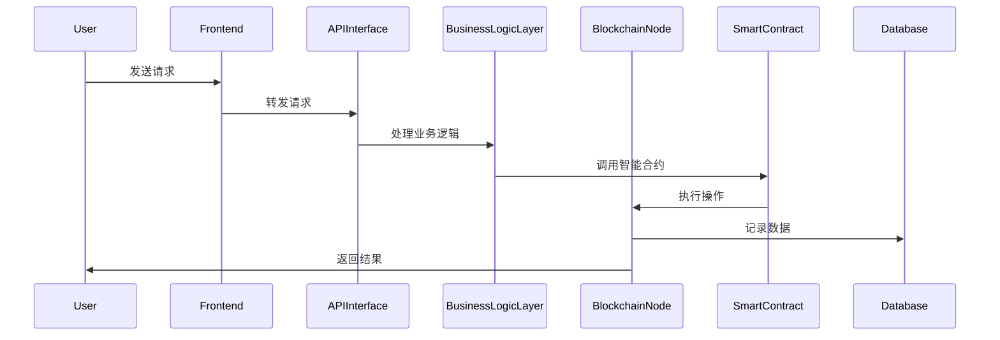
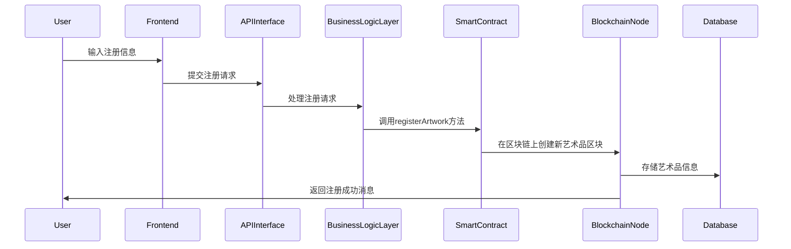

                 

### 1.1 区块链的基本概念与特点

区块链技术，作为近年来迅速崛起的一种分布式数据库管理技术，正逐渐改变着传统行业的运作模式。其基本概念可以简单概括为一种去中心化的数据库，通过多个参与节点共同维护数据的一致性和安全性。每个节点都保存了一份完整的区块链副本，当有新的交易数据生成时，所有节点都会参与验证并添加到区块链中，从而形成一条不断延伸的链条。

区块链的主要特点如下：

**去中心化**：与传统的集中式数据库不同，区块链不依赖于单一的中央机构或服务器，而是通过分布在全球的节点共同维护。这种方式不仅提高了系统的容错性，还降低了中心化的风险。

**不可篡改性**：区块链采用加密算法对数据进行签名和验证，一旦数据被记录在区块链上，就几乎无法被篡改。这种特性使得区块链非常适合用于记录和验证重要信息。

**透明性**：区块链上的所有交易数据都是公开透明的，每个节点都可以访问并验证数据。这种透明性使得区块链系统更加可信。

**安全性**：区块链通过密码学技术确保数据的完整性和安全性。例如，区块链使用哈希函数来确保数据的不可篡改性，同时利用非对称加密算法来保护交易的隐私。

**可扩展性**：尽管区块链最初的设计较为简单，但随着技术的发展，许多新的解决方案已经被提出，以解决区块链的可扩展性问题。

区块链技术已经在多个领域得到了广泛应用，包括但不限于数字货币（如比特币）、供应链管理、身份验证、投票系统、智能合约等。其去中心化、不可篡改和透明性等特点，使得区块链成为解决传统系统中心化问题的一种有效手段。

### 1.2 数字艺术市场的背景与现状

数字艺术市场是指以数字形式创作和交易的各类艺术品的市场，包括数字绘画、数字雕塑、数字音乐、数字摄影等。随着互联网和数字技术的快速发展，数字艺术市场逐渐成为一个充满活力且不断扩大的领域。

**数字艺术市场的背景**：

- **互联网技术的发展**：互联网的普及使得数字艺术的创作、展示和交易变得更加便捷。艺术家可以通过网络平台直接与观众和买家互动，打破了传统艺术市场的地域限制。
- **数字技术的应用**：数字绘画、3D建模、虚拟现实（VR）和增强现实（AR）等技术的发展，为数字艺术创作提供了丰富的工具和手段，使得数字艺术的形式和内容更加多样化。
- **数字经济的需求**：随着数字经济的发展，人们对于数字资产的重视程度逐渐提升，数字艺术品作为一种新型资产形式，吸引了大量投资者的关注。

**数字艺术市场的现状**：

- **市场规模不断扩大**：根据市场研究报告，数字艺术市场的规模正在以惊人的速度增长。越来越多的投资者和收藏家开始关注数字艺术品，将其纳入投资组合。
- **新兴市场崛起**：除了传统的艺术品市场强国如美国、欧洲和亚洲，新兴市场如印度、巴西等国家的数字艺术市场也呈现出强劲的增长态势。
- **数字艺术交易平台的兴起**：随着数字艺术市场的兴起，各种数字艺术品交易平台应运而生，如OpenSea、Rarible、Foundation等，这些平台提供了便捷的交易和展示环境，吸引了大量用户和艺术家参与。

然而，数字艺术市场也面临着一些挑战和问题：

- **版权问题**：数字艺术的复制和分发非常容易，这引发了对版权保护的担忧。如何保护艺术家的版权，确保其创作得到合理回报，是数字艺术市场亟待解决的问题。
- **安全性问题**：数字艺术品的交易通常涉及大量的资金转移，因此安全性成为一个重要的考虑因素。区块链技术提供了一种潜在解决方案，但如何确保系统的安全性，防止欺诈和黑客攻击，仍然是需要持续关注的问题。

总之，数字艺术市场正处在快速发展期，其潜力和机遇巨大，但同时也面临着一系列挑战和问题。通过技术创新和行业规范的完善，数字艺术市场有望在未来取得更大的发展。

### 1.3 区块链在数字艺术市场中的价值认证

在数字艺术市场中，价值认证是一个至关重要的环节。它不仅关乎艺术品的真伪鉴定，还涉及到艺术品的交易、版权保护和市场流通。区块链技术因其独特的特性，在数字艺术市场的价值认证中发挥着重要作用。

**价值认证的概念**：

价值认证是指对某一物品或服务的价值进行验证和确认的过程。在数字艺术市场中，价值认证主要包括以下几个方面的内容：

- **真伪鉴定**：确保数字艺术品的真实性，防止伪造和仿冒。
- **版权保护**：保障艺术家对其原创作品的版权，防止未经授权的复制和分发。
- **市场流通**：确保艺术品在交易过程中的透明性和公正性，提高市场信任度。

**区块链技术在价值认证中的应用**：

1. **去中心化认证**：

区块链的去中心化特性使其非常适合用于数字艺术市场的价值认证。通过区块链，艺术家可以直接与买家进行交易，无需依赖中介机构。这样可以减少交易成本，提高交易的透明度和效率。

2. **不可篡改性**：

区块链采用加密算法对数据进行签名和验证，一旦数据被记录在区块链上，就几乎无法被篡改。这意味着数字艺术品的交易记录和相关信息将永久保存，无法被篡改或删除。这为艺术品的真伪鉴定提供了可靠的技术保障。

3. **透明性**：

区块链上的所有交易数据都是公开透明的，每个节点都可以访问并验证数据。这使得数字艺术市场的交易过程更加透明，有助于建立市场信任，减少纠纷。

4. **智能合约**：

区块链中的智能合约是一种自动执行的合同，其条款在代码中被预先编写。在数字艺术市场中，智能合约可以用于自动化交易流程，例如，当买家支付一定金额后，智能合约会自动将数字艺术品的所有权转移给买家。这种自动化处理不仅提高了交易效率，还降低了人为错误的风险。

**区块链在价值认证中的具体应用**：

1. **数字艺术品交易平台**：

区块链技术可以构建去中心化的数字艺术品交易平台，艺术家可以在平台上直接发布和销售自己的作品，买家可以直接购买和收藏艺术品。这种模式不仅降低了交易成本，还提高了交易的透明度和安全性。

2. **版权管理系统**：

区块链技术可以用于构建版权管理系统，确保艺术作品的版权信息被永久记录和验证。艺术家可以在区块链上注册自己的作品，并设置版权保护措施。当其他用户想要使用这些作品时，可以通过区块链系统进行授权和支付。

3. **艺术品拍卖**：

区块链技术可以用于数字艺术品的拍卖过程。通过智能合约，拍卖过程可以完全自动化，从出价到成交，整个过程都在区块链上记录，确保透明和公正。

总之，区块链技术在数字艺术市场的价值认证中具有巨大的潜力和应用前景。通过去中心化、不可篡改和透明性的特性，区块链技术可以为数字艺术市场带来更高的安全性和透明度，推动其健康发展。随着技术的不断进步和应用的深入，区块链在数字艺术市场中的价值认证作用将越来越重要。

### 2.1 区块链的基本原理

区块链技术是一种分布式数据库管理系统，其基本原理和特点使其在多个领域得到广泛应用。为了深入理解区块链的运作方式，我们需要从其核心组成部分和基本操作出发，逐步展开讲解。

**区块链的核心组成部分**：

1. **区块（Block）**：

区块是区块链的基本数据结构，每个区块包含了若干笔交易记录以及其他一些元数据。每个区块通过加密算法与前后区块相连，形成一条连续的链条。一个区块通常包含以下内容：

   - **交易记录**：记录了交易的具体内容，如金额、资产类型等。
   - **时间戳**：记录了区块生成的时间，用于确保区块链的有序性。
   - **随机数**：用于区块链的共识算法，如工作量证明（Proof of Work, PoW）。
   - **前一个区块的哈希值**：确保区块之间的链接不可篡改。

2. **链（Chain）**：

区块链是由多个区块按时间顺序链接而成的数据结构。一旦新的区块被生成并添加到链上，整个区块链的长度会随之增加。区块链的长度和完整性是保障其安全性的重要因素。

3. **节点（Node）**：

节点是区块链网络中的参与者，每个节点都维护了一份完整的区块链副本。节点通过不断地接收、验证和传播区块，确保区块链的一致性和同步。

**基本操作**：

1. **交易（Transaction）**：

交易是区块链中的数据交换操作，表示某种价值的转移。交易通常包含以下信息：

   - **发送方地址**：交易发起者的身份标识。
   - **接收方地址**：交易接收者的身份标识。
   - **交易金额**：交易涉及的金额或其他价值量。
   - **交易哈希**：用于验证交易的唯一性。

2. **挖矿（Mining）**：

在基于工作量证明的区块链系统中，如比特币，矿工通过解决复杂的数学问题（随机数难题）来生成新的区块。矿工需要计算出一个满足特定条件的哈希值，这个哈希值通常包含前一个区块的哈希值和时间戳。矿工的计算过程被称为挖矿，成功挖出新区块的矿工将获得系统奖励。

3. **验证（Verification）**：

节点对交易和区块进行验证，以确保其合法性和正确性。验证过程包括：

   - **交易验证**：检查交易的有效性，如检查发送方是否有足够的余额、交易是否重复等。
   - **区块验证**：检查区块的结构是否完整、包含的交易是否合法等。

4. **传播（Propagation）**：

验证后的区块将被传播到区块链网络中的其他节点。节点接收到新区块后，会将其添加到自己的区块链副本中，并继续传播给其他节点，确保整个网络的一致性。

**区块链的基本特性**：

1. **去中心化**：区块链不依赖于中心化的机构或服务器，所有节点共同维护区块链的数据一致性，提高了系统的容错性和抗攻击能力。

2. **不可篡改性**：区块链采用哈希函数和密码学技术确保数据的不可篡改性。一旦数据被记录在区块链上，就几乎无法被更改或删除。

3. **透明性**：区块链上的所有交易和数据都是公开透明的，任何节点都可以访问和验证。这种透明性增强了系统的信任度。

4. **安全性**：区块链通过密码学技术和共识算法保障数据的安全性和隐私性。例如，非对称加密算法用于保护交易参与者的隐私。

通过理解区块链的基本原理和组成部分，我们可以更好地把握其运作机制和应用场景。在接下来的部分中，我们将进一步探讨区块链在数字艺术市场的具体应用，以及其如何为价值认证提供解决方案。

### 2.2 数字艺术市场的核心概念

数字艺术市场的核心概念包括数字艺术品、版权、交易和市场流通等。理解这些概念有助于我们深入分析区块链如何在此市场中发挥作用。

**数字艺术品**：

数字艺术品是指使用数字技术创作的艺术作品，如数字绘画、数字雕塑、数字摄影和数字音乐等。与传统的艺术品不同，数字艺术品具有可复制性强、表现形式多样化等特点。艺术家通过数字工具或软件创作出独特的艺术作品，并将其以数字形式存储和展示。

**版权**：

版权是指创作者对其原创作品所享有的法律权利，包括复制权、发行权、表演权、展示权和改编权等。在数字艺术市场中，版权保护尤为重要，因为数字作品的复制和分发非常容易。艺术家需要通过法律手段保护其创作成果，确保其能够获得合理的回报。

**交易**：

数字艺术品的交易过程通常涉及买家和卖家之间的价值转移。在传统的艺术市场中，艺术品交易通常通过画廊、拍卖行或私人经销商进行。而在数字艺术市场，交易过程变得更加直接和便捷，艺术家可以直接向买家出售作品，买家也可以通过在线平台进行购买。区块链技术可以为数字艺术品交易提供去中心化和安全可靠的解决方案。

**市场流通**：

市场流通是指数字艺术品在市场上的流通和交易过程。在数字艺术市场中，艺术品的市场流通受到多种因素的影响，包括市场需求、投资者兴趣、技术发展等。区块链技术可以通过确保交易过程的透明性和不可篡改性，提高市场的信任度和流通效率。

### 2.3 价值认证与区块链技术的联系

价值认证在数字艺术市场中扮演着关键角色，它涉及到艺术品的真实性、版权和交易等各个方面。区块链技术因其独特的特性，在价值认证中具有显著的优势和应用潜力。以下将从几个方面探讨价值认证与区块链技术的联系。

**真实性认证**：

数字艺术品的真实性是其价值的重要保障。区块链技术通过其不可篡改的特性，为数字艺术品提供了一种可靠的真实性认证手段。艺术家可以将自己的作品上传到区块链上，并通过智能合约进行签名和验证。一旦作品被记录在区块链上，任何篡改行为都将被系统自动检测并拒绝。这样，买家可以确信所购买的数字艺术品是真实且未被篡改的。

**版权保护**：

版权保护是数字艺术市场面临的重大挑战之一。区块链技术通过分布式账本的方式，可以记录和验证艺术品的版权信息。艺术家可以在区块链上注册自己的作品，并将其版权信息永久记录在链上。任何后续的复制、分发或交易行为都会在区块链上留下痕迹，确保艺术家的版权得到有效保护。此外，智能合约可以自动执行版权许可和授权流程，减少人为错误和纠纷。

**交易透明性**：

数字艺术品的交易过程需要高度的透明性，以确保交易的公正性和合法性。区块链技术提供了去中心化的交易平台，买家和卖家可以直接进行交易，无需依赖中介机构。交易记录将被永久存储在区块链上，所有节点都可以访问和验证。这种透明性不仅提高了交易的信任度，还减少了欺诈和洗钱等非法行为的风险。

**智能合约的应用**：

智能合约是一种自动执行的合同，其条款在区块链上预先编写。在数字艺术市场中，智能合约可以用于自动化交易流程，例如支付和转移数字艺术品的所有权。当买家支付金额后，智能合约会自动执行并将艺术品的所有权转移给买家。这种自动化处理不仅提高了交易效率，还降低了交易成本和人为错误的风险。

**去中心化的市场**：

区块链技术的去中心化特性，使得数字艺术市场可以摆脱传统中心化机构的依赖，实现更加公平和开放的市场环境。艺术家可以在去中心化的平台上直接展示和销售自己的作品，买家可以自由选择和购买艺术品。这种去中心化的市场结构，有助于降低市场准入门槛，促进数字艺术市场的健康发展。

总之，区块链技术在数字艺术市场的价值认证中具有巨大的潜力。通过真实性认证、版权保护、交易透明性和智能合约的应用，区块链技术可以为数字艺术市场提供更加安全、透明和高效的价值认证解决方案。随着区块链技术的不断发展和应用深化，其将在数字艺术市场中发挥越来越重要的作用。

### 3.1 智能合约的概念与原理

智能合约是区块链技术中一个重要的组成部分，它为去中心化应用（DApps）提供了自动执行合同的能力。智能合约的概念源自计算机科学家尼克·萨博（Nick Szabo）在1990年代提出的，其核心理念是通过代码来代替传统合同中的法律条款，确保合同的条款在满足特定条件时自动执行。

**智能合约的基本原理**：

1. **定义与作用**：

   智能合约是一种在区块链上执行的计算机程序，其代码存储在区块链上，并通过区块链网络中的节点进行验证和执行。智能合约的作用是自动化和记录合同条款的履行过程，确保交易的安全性和透明性。

2. **工作流程**：

   - **编写代码**：开发人员使用特定的编程语言（如Solidity for Ethereum）编写智能合约的代码，定义合同条款和逻辑。
   - **部署合约**：将编写的智能合约代码部署到区块链上，例如在以太坊区块链上，通过以太币支付交易费用进行部署。
   - **验证与共识**：区块链网络中的节点对智能合约进行验证，确保其代码的合法性和正确性。一旦验证通过，智能合约就会进入区块链网络，可供用户调用。
   - **触发执行**：当触发条件满足时（例如，买方支付了款项），智能合约会自动执行预定义的代码，进行价值转移或记录其他操作。

3. **示例**：

   以一个简单的智能合约为例，假设一个艺术品卖家与买家之间签订了一份销售合同。智能合约的代码中可能包含以下条款：

   - 买家必须支付指定金额。
   - 一旦支付成功，智能合约将自动将艺术品的所有权从卖家转移给买家。
   - 交易完成后，智能合约将记录交易信息在区块链上，确保不可篡改。

通过智能合约，这个交易过程可以实现自动化，减少了人为干预和纠纷的可能性，提高了交易效率。

**智能合约在价值认证中的应用**：

1. **版权管理**：

   智能合约可以用于管理数字艺术的版权。艺术家可以在区块链上注册其作品，并通过智能合约设置版权条款，例如授权使用、支付版税等。当有人想要使用艺术品时，智能合约会自动执行授权和支付过程，确保版税得到合理分配。

2. **艺术品交易**：

   在数字艺术市场中，智能合约可以用于自动化艺术品交易的流程。例如，买家支付款项后，智能合约会自动转移艺术品的所有权，确保交易的透明性和安全性。这种自动化交易不仅提高了效率，还减少了交易成本。

3. **去中心化金融（DeFi）**：

   智能合约在去中心化金融领域也有广泛应用。例如，去中心化借贷平台可以使用智能合约自动执行贷款合同的条款，确保借款和还款过程的自动化和透明。

总之，智能合约通过代码和区块链技术，为数字艺术市场的价值认证提供了强大的工具。它不仅简化了交易流程，提高了效率，还通过去中心化和不可篡改的特性，增强了市场的信任度和安全性。

### 3.2 智能合约在价值认证中的应用

智能合约在数字艺术市场的价值认证中扮演着至关重要的角色。通过智能合约，艺术家、买家和版权机构可以更高效地管理艺术品的版权、交易和授权，确保整个过程的透明性和安全性。

**1. 版权认证**：

艺术家可以通过智能合约注册其数字艺术品的版权信息。智能合约代码中包含了艺术品的元数据、版权所有者、版权期限等关键信息。一旦注册完成，这些信息将永久存储在区块链上，无法被篡改。买家在购买艺术品时，可以轻松验证艺术品的版权，确保其来源合法。

**2. 交易自动化**：

智能合约可以自动化数字艺术品的交易过程。例如，当买家支付购买金额后，智能合约会自动执行转移艺术品所有权的操作。这种方式不仅简化了交易流程，还减少了交易中介的需求，降低了交易成本。智能合约还可以在交易完成后，自动向艺术家支付版税，确保其权益得到保障。

**3. 授权管理**：

数字艺术品在使用过程中可能需要授权给第三方。智能合约可以用于管理这些授权，例如，一个博物馆想要展示某位艺术家的数字作品，可以通过智能合约获得使用授权。使用完毕后，授权会自动解除。这种方式不仅方便管理，还确保了授权过程的透明和合法。

**4. 透明性和可追溯性**：

区块链上的所有交易记录都是公开透明的，任何参与者都可以查询和验证。智能合约确保了交易过程中的每一步都在区块链上记录，这使得整个交易过程具有高度的可追溯性。这有助于建立市场的信任，减少欺诈和纠纷。

**5. 不可篡改性**：

智能合约的代码在区块链上执行，一旦部署，就几乎无法被篡改。这意味着艺术品的交易记录、版权信息和授权情况等都是真实和可靠的，不受人为干扰。

**案例分析**：

假设一位艺术家使用智能合约在区块链上注册了一幅数字画作，并设置了版权期限为5年。当一位买家购买这幅画作后，智能合约会自动执行所有权转移操作，并将交易记录存储在区块链上。同时，智能合约还会向艺术家支付版税。在此期间，任何试图篡改或删除这些记录的行为都会被区块链网络中的其他节点检测并拒绝。

总之，智能合约在数字艺术市场的价值认证中提供了强大的工具，通过其自动化、透明性和不可篡改的特性，极大地提高了交易的效率和安全性。随着区块链技术的不断发展，智能合约的应用将更加广泛，为数字艺术市场带来更多的机遇和挑战。

### 3.3 智能合约的实现与部署

智能合约的实现与部署是区块链技术中一个重要的环节，确保智能合约的正确执行和高效运作。下面将详细介绍智能合约的实现步骤、部署过程以及在实际应用中的关键点。

**1. 智能合约实现步骤**：

（1）**需求分析与设计**：

在开始编写智能合约之前，首先需要对项目需求进行详细分析，明确智能合约的功能和业务逻辑。设计阶段需要考虑以下几个方面：

   - **业务流程**：智能合约需要完成的业务流程，例如版权注册、交易执行、授权管理等。
   - **数据结构**：智能合约需要处理的数据结构，如用户信息、艺术品信息、交易记录等。
   - **触发条件**：智能合约执行的条件，例如支付金额达到一定数额、授权期限到期等。

（2）**编写智能合约代码**：

智能合约的编写通常使用特定编程语言，如Solidity（用于以太坊区块链）。在编写代码时，需要遵循以下步骤：

   - **初始化变量**：定义智能合约中的变量，包括用户信息、艺术品信息、状态变量等。
   - **定义函数**：编写实现业务逻辑的函数，例如注册、交易、授权等。
   - **事件日志**：记录智能合约执行过程中的关键事件，便于后续的审计和监控。

（3）**代码测试与调试**：

编写完智能合约代码后，需要进行严格的测试和调试。测试主要包括功能测试、性能测试和安全性测试。通过自动化测试工具，确保智能合约在不同场景下都能正确执行。

**2. 智能合约部署过程**：

（1）**选择区块链平台**：

根据项目的需求，选择合适的区块链平台进行部署。目前，常见的区块链平台包括以太坊、EOS、波卡（Polkadot）等。每种平台都有其独特的特性和优势，需要根据具体需求进行选择。

（2）**搭建开发环境**：

在选择的区块链平台上，搭建开发环境。例如，在以太坊上，需要安装Ganache（本地测试网络）和Truffle（开发框架）。这些工具帮助开发者进行智能合约的本地测试和部署。

（3）**部署智能合约**：

将编写好的智能合约代码部署到区块链上。在以太坊上，通常使用Truffle或Hardhat等开发框架进行部署。部署过程包括以下步骤：

   - **编译合约**：将Solidity代码编译为字节码。
   - **部署合约**：使用以太币支付交易费用，将编译后的字节码部署到区块链上。
   - **合约地址**：部署完成后，智能合约将分配一个唯一的地址，可通过该地址访问和调用合约。

**3. 部署过程中的关键点**：

（1）**安全性**：

智能合约的安全性至关重要。在部署前，需要仔细审查合约代码，确保不存在漏洞和潜在风险。安全审计和代码审查是部署过程中的重要环节。

（2）**网络选择**：

选择合适的区块链网络进行部署，例如主网或测试网。在主网上部署智能合约，需要考虑网络的性能和费用。在测试网上进行初步测试和调试，可以降低部署风险。

（3）**代码版本管理**：

智能合约的代码版本管理是部署过程中的一个重要环节。通过版本控制工具（如Git），可以方便地管理代码的不同版本，并在需要时进行回滚或升级。

（4）**性能优化**：

智能合约的性能直接影响其应用的效率和用户体验。在部署前，需要对合约进行性能测试和优化，确保其能够满足业务需求。

总之，智能合约的实现与部署是一个复杂且细致的过程，需要充分考虑安全性、网络选择、代码管理和性能优化等方面。通过合理的部署策略和严格的质量控制，智能合约可以在区块链上高效、安全地运行，为数字艺术市场提供强大的价值认证和交易工具。

### 4.1 密码学的基本原理

密码学是保障信息安全的重要技术之一，其基本原理在于通过加密和解密操作，确保数据在传输和存储过程中的保密性、完整性和真实性。理解密码学的基本原理，有助于我们更好地应用这些技术在区块链和价值认证中。

**加密和解密**：

加密是将明文转换为密文的过程，解密则是将密文还原为明文的过程。加密和解密通常依赖于加密算法和密钥。加密算法是一种数学函数，它将输入的明文通过特定的计算过程转换为密文。密钥是加密算法的核心，用于控制加密和解密过程，确保只有拥有正确密钥的用户才能解密密文。

**哈希函数**：

哈希函数是将任意长度的输入数据映射为固定长度的输出数据的函数。哈希函数具有以下特点：

- **不可逆性**：给定输出，无法推导出原始输入。
- **一致性**：相同的输入将始终产生相同的输出。
- **抗碰撞性**：找到两个不同输入但具有相同输出的哈希值的概率极低。

哈希函数在区块链中扮演着关键角色。区块链中的每个区块都包含前一个区块的哈希值，这使得整个区块链具有高度的一致性和不可篡改性。一旦某个区块被篡改，其后所有区块的哈希值都会发生变化，从而被区块链网络中的其他节点检测到。

**对称加密与非对称加密**：

对称加密是一种加密和解密使用相同密钥的加密方法。常见的对称加密算法包括AES（高级加密标准）和DES（数据加密标准）。对称加密的优点是速度快，缺点是密钥管理复杂，需要在通信双方之间安全交换密钥。

非对称加密则使用一对密钥：公钥和私钥。公钥用于加密，私钥用于解密。常见的非对称加密算法包括RSA（Rivest-Shamir-Adleman）和ECC（椭圆曲线密码学）。非对称加密的优点是解决了密钥分发的问题，缺点是计算复杂度高。

**数字签名**：

数字签名是确保数据来源真实性和完整性的一种技术。发送方使用私钥对数据进行签名，接收方使用公钥验证签名。数字签名具有以下特点：

- **不可抵赖性**：一旦发送方签了名，就无法否认发送行为。
- **完整性**：如果数据在传输过程中被篡改，签名验证会失败。

数字签名在区块链中的交易记录中广泛应用，确保交易记录的真实性和完整性。

通过密码学的基本原理，我们可以更好地保障区块链和价值认证系统的安全性。哈希函数确保数据的唯一性和一致性，对称和非对称加密保障数据的保密性，数字签名确保数据的真实性和完整性。这些密码学技术共同构建了区块链和价值认证系统的安全基石。

### 4.2 常见的加密算法

在数字艺术市场价值认证中，加密算法起到了关键性的作用。常见的加密算法包括对称加密算法和非对称加密算法，每种算法都有其独特的应用场景和特点。

**对称加密算法**：

对称加密算法使用相同的密钥进行加密和解密操作。常见的对称加密算法包括AES（高级加密标准）和DES（数据加密标准）。

1. **AES**：

   - **原理**：AES是一种分组密码，它将明文分为固定长度的块（如128位），然后通过多个轮次的替代、置换和混淆操作加密这些块。
   - **优点**：AES具有高安全性和高效性，适用于大数据量的加密。
   - **应用**：AES广泛应用于数字艺术市场的数据保护，如存储和传输艺术品的高清图像和文档。

2. **DES**：

   - **原理**：DES是一种较早期的分组密码，它使用56位密钥对64位的明文块进行加密。
   - **优点**：DES较为简单，易于实现，适合较低安全要求的场景。
   - **应用**：DES在数字艺术市场中较少使用，因其安全性较低，已被AES等更安全的加密算法取代。

**非对称加密算法**：

非对称加密算法使用一对密钥：公钥和私钥。公钥用于加密，私钥用于解密。常见的非对称加密算法包括RSA（Rivest-Shamir-Adleman）和ECC（椭圆曲线密码学）。

1. **RSA**：

   - **原理**：RSA算法基于大素数分解的数学难题，它使用一对密钥，其中公钥用于加密，私钥用于解密。
   - **优点**：RSA具有很高的安全性，适用于数字签名和加密大量数据。
   - **应用**：RSA在数字艺术市场中常用于加密艺术品的版权信息，确保数据在传输过程中不被篡改。

2. **ECC**：

   - **原理**：ECC算法利用椭圆曲线的数学性质，生成一对公钥和私钥。与RSA相比，ECC在相同安全级别下具有更小的密钥长度。
   - **优点**：ECC具有更高的安全性和效率，适用于资源受限的环境。
   - **应用**：ECC在数字艺术市场中用于加密艺术品的高清图像和视频，确保数据传输的完整性和保密性。

**应用场景**：

1. **数字艺术品存储**：

   在数字艺术市场中，艺术品的存储通常涉及大量敏感数据，如高清图像和文档。使用对称加密算法（如AES）可以对艺术品进行加密存储，确保数据在存储和传输过程中的安全性。非对称加密算法（如RSA和ECC）可以用于加密艺术品的关键信息，如版权声明和所有权证明，确保这些信息不被未经授权的第三方访问。

2. **数字艺术品交易**：

   数字艺术品的交易过程需要保障交易记录的安全性和完整性。在交易过程中，使用非对称加密算法（如RSA和ECC）可以确保交易信息的保密性和真实性。例如，买家可以使用卖家的公钥加密支付指令，确保支付信息只能被卖家解密和验证。同时，使用对称加密算法（如AES）对交易数据本身进行加密，进一步保障数据的安全性。

3. **版权保护**：

   数字艺术品的版权保护是确保艺术家权益的关键。通过使用非对称加密算法（如RSA和ECC），艺术家可以对其作品进行数字签名，确保版权声明和所有权证明的真实性。版权机构也可以使用对称加密算法（如AES）对这些关键信息进行加密，确保数据在传输过程中的完整性。

综上所述，对称加密算法和非对称加密算法在数字艺术市场价值认证中发挥着重要作用。对称加密算法适用于大量数据的加密存储和传输，非对称加密算法则适用于版权保护和交易记录的保密性和真实性保障。通过合理应用这些加密算法，数字艺术市场可以实现更高的安全性和可靠性。

### 4.3 加密算法在价值认证中的应用

在数字艺术市场价值认证中，加密算法扮演了至关重要的角色，确保数据的保密性、完整性和真实性。以下将详细探讨几种常见的加密算法在区块链和价值认证中的应用。

**1. RSA加密算法**

RSA加密算法是一种经典的非对称加密算法，因其高强度和安全性而广泛应用于数字签名和加密通信中。在数字艺术市场价值认证中，RSA加密算法主要用于保护交易记录和版权信息。

- **数字签名**：艺术家可以使用RSA算法生成数字签名，确保其交易记录和版权声明未被篡改。接收方可以通过验证签名来确认信息的真实性。
- **加密通信**：交易双方可以在交易过程中使用RSA算法加密通信内容，确保交易信息在传输过程中不会被截获或篡改。

**2. ECC加密算法**

ECC（椭圆曲线密码学）是一种先进的非对称加密算法，以其更高的安全性和效率成为数字艺术市场价值认证的首选。ECC算法适用于加密艺术品的高清图像、视频和其他敏感数据。

- **数据加密**：ECC算法可以用于加密数字艺术品的原始数据，确保在存储和传输过程中的安全性。相较于RSA，ECC在提供相同安全级别的情况下具有更短的密钥长度，从而提高了加密和解密的速度。
- **身份验证**：ECC算法可以用于身份验证，确保只有合法用户可以访问和操作艺术品。例如，艺术家可以使用ECC算法生成身份验证证书，确保交易过程中的合法身份。

**3. AES加密算法**

AES（高级加密标准）是一种对称加密算法，以其高安全性和高效性成为数字艺术市场数据保护的首选。AES算法适用于加密大量数据，如艺术品的高清图像、文档和其他敏感信息。

- **数据存储**：在数字艺术市场中，AES算法可以用于加密存储艺术品的高清图像和文档，确保数据在存储设备中的安全性。即使存储设备被非法访问，数据仍无法被读取。
- **数据传输**：在艺术品交易过程中，AES算法可以用于加密交易记录和其他关键信息，确保数据在传输过程中的安全性。例如，买家可以使用AES加密支付指令，确保支付信息只能被卖家解密和验证。

**4. 应用实例**

假设一位艺术家在区块链上出售其数字画作，以下是一个典型的交易流程，展示了加密算法在价值认证中的应用：

- **版权注册**：艺术家使用RSA算法对版权声明进行数字签名，并将其记录在区块链上。接收方可以通过验证签名，确保版权声明未被篡改。
- **交易记录**：在交易过程中，买家和卖家使用ECC算法加密通信，确保交易信息在传输过程中不会被截获或篡改。
- **支付指令**：买家使用AES算法加密支付指令，并将其发送给卖家。卖家使用相同的AES密钥解密支付指令，确保支付信息的安全性和真实性。
- **所有权转移**：一旦支付完成，智能合约会自动执行所有权转移操作，并将交易记录存储在区块链上。所有节点都可以验证交易记录，确保其真实性和完整性。

通过合理应用加密算法，数字艺术市场可以实现更高的安全性和透明性，确保艺术品的版权和交易信息得到有效保护。

### 4.4 加密算法的数学模型和公式

加密算法的核心在于其数学模型和公式，这些模型和公式确保了加密过程的安全性、效率和可靠性。以下我们将分别介绍几种常见加密算法的数学模型和公式。

#### 1. RSA加密算法

RSA加密算法是一种基于大素数分解的非对称加密算法。其数学模型基于以下公式：

$$
(n, e) = (p \times q, e)
$$

其中，$p$和$q$是两个大素数，$e$是公开的加密指数。加密过程如下：

$$
c = m^e \mod n
$$

其中，$m$是待加密的明文，$c$是加密后的密文。解密过程则使用私钥：

$$
m = c^d \mod n
$$

其中，$d$是私钥指数，满足$ed \equiv 1 \mod \phi(n)$，$\phi(n) = (p-1)(q-1)$。

#### 2. ECC加密算法

ECC（椭圆曲线密码学）算法基于椭圆曲线离散对数问题。其数学模型基于以下方程：

$$
y^2 = x^3 + ax + b \mod p
$$

其中，$p$是素数，$a$和$b$是椭圆曲线的系数。ECC加密和解密的过程涉及椭圆曲线上的点运算，包括点加法、点倍法和点乘法。

- **加密**：

  $$ 
  P = kG \mod p
  $$

  其中，$P$是加密后的点，$G$是基点，$k$是秘密指数，$p$是素数。

- **解密**：

  $$ 
  P = dG \mod p
  $$

  其中，$P$是解密后的点，$d$是公钥指数。

#### 3. AES加密算法

AES（高级加密标准）是一种对称加密算法，其数学模型基于代换-置换网络。AES加密过程包括多个轮次，每轮包括字节替换、行移位、列混淆和轮密钥加。

- **字节替换（SubBytes）**：

  $$ 
  S_{Box}(x) 
  $$

  其中，$S_{Box}$是一个固定的替换表，将每个字节映射到另一个字节。

- **行移位（ShiftRows）**：

  $$ 
  ShiftRows(state) 
  $$

  将状态矩阵的每行循环左移不同的位数。

- **列混淆（MixColumns）**：

  $$ 
  MixColumns(state) 
  $$

  对状态矩阵的每列进行线性变换，确保每个字节的影响扩散到整个状态。

- **轮密钥加（AddRoundKey）**：

  $$ 
  AddRoundKey(state, key) 
  $$

  将状态与当前轮密钥进行异或操作。

通过这些数学模型和公式，加密算法能够确保数据在传输和存储过程中的安全性。在实际应用中，这些模型和公式经过优化和实现，使得加密过程既高效又安全。

### 5.1 数字艺术市场价值认证系统的介绍

数字艺术市场价值认证系统是一个复杂的软件系统，旨在通过区块链技术实现对数字艺术品的真实性、版权和交易过程的全面认证。本系统旨在解决传统数字艺术市场中的版权纠纷、交易透明性和安全性问题，为艺术家、买家和版权机构提供一个高效、透明和可信的平台。

**系统功能设计**：

该系统的功能设计包括以下几个方面：

- **艺术品注册**：艺术家可以将自己的数字艺术品在系统中注册，包括艺术品的元数据（如名称、作者、创作日期等）和版权信息（如版权期限、授权范围等）。
- **交易管理**：系统支持数字艺术品的交易过程，包括买卖双方的交易确认、支付和所有权转移等功能。
- **版权保护**：系统通过智能合约自动执行版权授权和管理，确保艺术家的版权得到有效保护，防止未经授权的复制和分发。
- **交易记录**：所有交易记录将被永久记录在区块链上，确保交易过程透明和可追溯。
- **用户管理**：系统支持用户注册、身份验证和权限管理，确保系统的安全性和用户隐私。

**系统架构设计**：

系统架构设计采用分层架构，包括数据层、业务逻辑层和表现层。

- **数据层**：基于区块链技术，采用分布式存储方式，确保数据的不可篡改性和安全性。数据层包括区块链节点、智能合约和数据库。
- **业务逻辑层**：包括各种业务功能的实现，如艺术品注册、交易管理、版权保护和用户管理等。业务逻辑层通过智能合约实现，确保业务流程的自动化和透明性。
- **表现层**：提供用户界面，包括网页、移动应用和API接口，用户可以通过这些接口访问和操作系统功能。

**系统接口设计**：

系统接口设计包括以下几部分：

- **用户接口**：为用户提供艺术品注册、交易、版权保护和账户管理等操作界面。
- **API接口**：为开发者提供程序接口，方便第三方应用程序与系统进行交互。
- **智能合约接口**：通过智能合约实现各种业务逻辑，如艺术品注册、交易确认、版权授权等。

**系统交互设计**：

系统交互设计通过消息传递机制实现，包括以下几种交互方式：

- **用户与用户接口**：用户通过前端界面与系统进行交互，提交艺术品注册、交易等请求。
- **用户与业务逻辑层**：系统接收到用户请求后，通过API接口将请求传递到业务逻辑层，由业务逻辑层处理并返回结果。
- **业务逻辑层与智能合约**：业务逻辑层通过调用智能合约接口，执行各种业务逻辑操作，并将结果记录在区块链上。
- **用户与区块链节点**：用户可以通过区块链节点查询和验证交易记录，确保交易过程的透明性和可信性。

通过以上系统设计，数字艺术市场价值认证系统实现了对数字艺术品的全面认证和管理，为数字艺术市场提供了一个高效、透明和可信的技术平台。

### 5.2 数字艺术市场价值认证系统的系统架构设计

数字艺术市场价值认证系统的系统架构设计是确保系统高效、安全且可靠运行的关键。本节将详细描述系统架构的各个部分，包括数据层、业务逻辑层和表现层，并展示系统架构图。

**1. 数据层**

数据层是系统架构的基础，主要负责数据存储和访问。在数字艺术市场价值认证系统中，数据层包括以下关键组件：

- **区块链节点**：系统部署在多个区块链节点上，每个节点维护一份完整的区块链副本。区块链节点通过共识算法保持数据一致性，并提供数据查询和验证功能。
- **智能合约**：智能合约是存储在区块链上的程序代码，负责执行各种业务逻辑，如艺术品注册、交易确认和版权管理。智能合约通过非对称加密算法确保交易记录的不可篡改性。
- **数据库**：数据库用于存储系统的元数据和用户信息，如艺术品元数据、用户注册信息、交易记录等。数据库采用分布式存储方式，以提高系统的可靠性和扩展性。

**2. 业务逻辑层**

业务逻辑层负责实现系统的核心功能，如艺术品注册、交易管理、版权保护和用户管理等。业务逻辑层通过以下组件实现：

- **业务逻辑模块**：业务逻辑模块包括艺术品注册模块、交易管理模块、版权保护模块和用户管理模块。每个模块负责处理特定的业务逻辑，并与区块链节点和数据库进行交互。
- **智能合约调用接口**：业务逻辑层通过调用智能合约接口执行各种业务操作。例如，当用户提交艺术品注册请求时，业务逻辑层会调用智能合约执行注册操作，并将结果记录在区块链上。
- **API接口**：系统提供API接口，方便第三方应用程序与系统进行交互。API接口包括艺术品查询接口、交易记录查询接口和版权管理接口等。

**3. 表现层**

表现层是用户与系统交互的界面，包括网页、移动应用和API接口。表现层通过以下组件实现：

- **前端界面**：前端界面包括艺术品展示页面、注册页面、交易页面和用户管理页面等。用户可以通过前端界面提交操作请求，并查看系统提供的信息。
- **Web服务器**：Web服务器负责处理前端界面提交的HTTP请求，并将请求转发到业务逻辑层。Web服务器还负责管理会话和缓存，以提高系统的响应速度。
- **API接口**：API接口用于第三方应用程序与系统进行交互，如艺术品展示平台、交易系统和其他区块链应用。API接口提供RESTful风格的服务，方便应用程序进行集成。

**系统架构图**

以下是一个简单的系统架构图，展示了系统各层的交互关系：

```
+----------------+       +----------------+       +----------------+
|     前端界面   | <----->|      Web服务器 | <----->|   业务逻辑层   |
+----------------+       +----------------+       +----------------+
                     |                      |
                     v                      v
                 +----------------+       +----------------+
                 |    数据层      | <----->|   区块链节点   |
                 +----------------+       +----------------+
                     |                      |
                     v                      v
                 +----------------+       +----------------+
                 |    智能合约    | <----->|     数据库     |
                 +----------------+       +----------------+
```

通过以上架构设计，数字艺术市场价值认证系统实现了高效、安全且可靠的运行。用户可以通过前端界面提交操作请求，业务逻辑层处理这些请求并调用智能合约执行具体操作，最终将结果记录在区块链和数据库中。这种架构不仅提高了系统的透明性和可追溯性，还为系统的扩展和升级提供了便利。

### 5.3 系统接口设计

在数字艺术市场价值认证系统中，接口设计是确保各个模块和外部系统之间能够顺畅通信的关键。系统接口设计主要包括API接口和智能合约接口，下面将详细介绍这些接口的设计和功能。

**1. API接口**

API（应用程序编程接口）是系统对外提供的服务接口，主要用于第三方应用程序和前端界面与业务逻辑层之间的交互。API接口的设计遵循RESTful风格，包括常见的HTTP方法（GET、POST、PUT、DELETE）和相应的URL路径。以下是几个关键API接口及其功能：

- **艺术品注册接口**：

  - **URL**：`/api/artworks/register`
  - **HTTP方法**：POST
  - **功能**：允许用户向系统中注册新的数字艺术品。用户需要提交包括艺术品元数据和版权信息在内的必要参数。
  - **请求参数**：`{ "name": "数字画作", "creator": "艺术家A", "版权信息": { "期限": "5年", "授权范围": "公开展示" } }`
  - **响应结果**：`{ "status": "success", "message": "艺术品注册成功", "artwork_id": "123456789" }`

- **交易管理接口**：

  - **URL**：`/api/trades`
  - **HTTP方法**：GET、POST、PUT、DELETE
  - **功能**：管理艺术品交易过程，包括创建交易、查询交易记录、更新交易状态和删除交易。
  - **请求参数**（创建交易）：
    ```json
    {
      "buyer_id": "buyer123",
      "seller_id": "seller456",
      "artwork_id": "123456789",
      "price": 1000,
      "payment_address": "0x123..."
    }
    ```
  - **响应结果**：
    ```json
    {
      "status": "success",
      "message": "交易创建成功",
      "trade_id": "abcdef123"
    }
    ```

- **版权保护接口**：

  - **URL**：`/api/copyright`
  - **HTTP方法**：GET、POST、PUT、DELETE
  - **功能**：管理艺术品的版权信息，包括版权注册、更新和删除。
  - **请求参数**（注册版权）：
    ```json
    {
      "artwork_id": "123456789",
      "版权信息": {
        "期限": "5年",
        "授权范围": "公开展示"
      }
    }
    ```

**2. 智能合约接口**

智能合约接口是业务逻辑层与区块链之间的桥梁，用于调用智能合约执行各种业务操作。以下是几个关键智能合约接口及其功能：

- **艺术品注册智能合约接口**：

  - **功能**：在区块链上注册新的数字艺术品。
  - **调用方法**：`registerArtwork`
  - **参数**：艺术品ID、艺术家ID、艺术品元数据和版权信息。
  - **示例代码**（Python）：
    ```python
    def register_artwork(artwork_id, creator_id, metadata, copyright_info):
        # 在区块链上注册艺术品
        # 调用智能合约的registerArtwork方法
        contract.functions.registerArtwork(artwork_id, creator_id, metadata, copyright_info).call()
    ```

- **交易管理智能合约接口**：

  - **功能**：在区块链上管理艺术品交易。
  - **调用方法**：`createTrade`、`getTrade`、`updateTrade`和`deleteTrade`
  - **示例代码**（Python）：
    ```python
    def create_trade(buyer_id, seller_id, artwork_id, price, payment_address):
        # 创建艺术品交易
        contract.functions.createTrade(buyer_id, seller_id, artwork_id, price, payment_address).call()
        
    def get_trade(trade_id):
        # 查询艺术品交易记录
        trade = contract.functions.getTrade(trade_id).call()
        return trade
    ```

- **版权保护智能合约接口**：

  - **功能**：在区块链上管理艺术品的版权信息。
  - **调用方法**：`registerCopyright`、`updateCopyright`和`deleteCopyright`
  - **示例代码**（Python）：
    ```python
    def register_copyright(artwork_id, copyright_info):
        # 注册艺术品版权
        contract.functions.registerCopyright(artwork_id, copyright_info).call()
        
    def update_copyright(artwork_id, copyright_info):
        # 更新艺术品版权
        contract.functions.updateCopyright(artwork_id, copyright_info).call()
    ```

通过上述API接口和智能合约接口的设计，数字艺术市场价值认证系统实现了与外部系统和用户的高效通信，确保了系统功能的全面性和易用性。

### 5.4 系统交互设计

数字艺术市场价值认证系统的交互设计是其核心，涉及到用户、前端界面、API接口、区块链节点和智能合约之间的通信和协作。以下是系统交互设计的详细说明，包括类图、架构图和序列图。

#### 类图

类图展示了系统中各个类及其属性和方法。以下是数字艺术市场价值认证系统的主要类及其关系：

```mermaid
classDiagram
    User <<class{用户}>
    Artwork <<class{艺术品}>
    Trade <<class{交易}>
    Copyright <<class{版权}>
    BlockchainNode <<class{区块链节点}>
    SmartContract <<class{智能合约}>
    APIInterface <<class{API接口}>
    Frontend <<class{前端界面}>

    User "注册" Artwork
    User "发起" Trade
    Artwork "绑定" Copyright
    BlockchainNode "维护" SmartContract
    APIInterface "调用" SmartContract
    Frontend "与" APIInterface "通信"

    User ..|> BlockchainNode
    Artwork ..|> BlockchainNode
    Trade ..|> BlockchainNode
    Copyright ..|> BlockchainNode
    SmartContract ..|> BlockchainNode
```

#### 架构图

架构图展示了系统架构的层次和组件之间的关系。以下是数字艺术市场价值认证系统的架构图：



#### 序列图

序列图展示了系统中各个对象之间的交互顺序。以下是数字艺术市场价值认证系统中艺术品注册过程的序列图：



通过这些交互设计，数字艺术市场价值认证系统实现了用户与系统的无缝连接，确保了交易的透明性、安全性和高效性。每个组件的紧密协作，使得系统在处理海量交易时依然能够保持稳定和可靠。

### 6.1 环境安装

搭建数字艺术市场价值认证系统需要配置一系列开发环境和工具，包括区块链节点、智能合约开发环境以及前端界面。以下是具体的步骤和工具安装指南。

**1. 安装区块链节点**

- **选择区块链平台**：首先，选择一个区块链平台，例如以太坊（Ethereum）。以太坊是目前应用最广泛的区块链平台，支持智能合约。
- **安装Geth**：Geth是以太坊的官方客户端，用于搭建私有区块链网络。在终端执行以下命令安装Geth：
  ```bash
  sudo apt-get update
  sudo apt-get install git make libtool autoconf
  curl https://bootstrap.pypa.io/get-pip.py -o get-pip.py
  python3 get-pip.py
  git clone https://github.com/ethereum/go-ethereum.git
  cd go-ethereum
  make geth
  ```
- **启动Geth节点**：在终端启动Geth节点：
  ```bash
  ./geth --datadir "/path/to/data" --networkid 12345 --nodiscover --nat=extip:0.0.0.0
  ```

**2. 安装智能合约开发环境**

- **安装Node.js和npm**：智能合约开发通常使用Node.js和npm进行环境搭建。在终端执行以下命令安装Node.js和npm：
  ```bash
  curl -sL https://deb.nodesource.com/setup_14.x | sudo -E bash -
  sudo apt-get install -y nodejs
  npm install
  ```
- **安装Truffle**：Truffle是一个智能合约开发框架，用于编写、部署和测试智能合约。在终端执行以下命令安装Truffle：
  ```bash
  npm install -g truffle
  ```
- **初始化Truffle项目**：创建一个新的智能合约项目：
  ```bash
  truffle init
  ```

**3. 安装前端开发环境**

- **安装Web3.js**：Web3.js是一个JavaScript库，用于与以太坊区块链进行交互。在终端执行以下命令安装Web3.js：
  ```bash
  npm install web3
  ```
- **安装前端框架**（如React或Vue.js）：根据项目需求选择合适的前端框架，并安装相关依赖：
  ```bash
  npm install create-react-app
  npx create-react-app frontend
  cd frontend
  npm start
  ```

**4. 配置开发环境**

- **配置Ganache**：Ganache是一个本地以太坊测试网络，用于开发和测试智能合约。在终端启动Ganache：
  ```bash
  ganache-cli
  ```
- **连接前端与Ganache**：在React项目中的`src`文件夹下创建一个名为`contract`的文件夹，并在其中创建一个`web3.js`文件，用于连接Ganache：
  ```javascript
  const Web3 = require('web3');
  const web3 = new Web3('http://localhost:7545');
  module.exports = web3;
  ```

通过以上步骤，我们成功搭建了数字艺术市场价值认证系统的开发环境，可以开始编写和测试智能合约、前端界面以及后端业务逻辑。

### 6.2 系统核心实现源代码

在数字艺术市场价值认证系统中，核心实现源代码涵盖了智能合约、前端界面和后端业务逻辑。以下将详细介绍这些代码的编写和实现过程。

**1. 智能合约**

智能合约是价值认证系统的核心组件，负责处理艺术品的注册、交易和版权管理。以下是智能合约的主要代码和功能：

```solidity
// SPDX-License-Identifier: MIT
pragma solidity ^0.8.0;

contract ArtMarketplace {
    struct Artwork {
        string name;
        address creator;
        string metadata;
        bool isRegistered;
    }

    mapping(uint256 => Artwork) public artworks;
    mapping(uint256 => address) public artworkToCreator;
    mapping(address => uint256) public creatorBalance;

    event ArtworkRegistered(uint256 artworkId, string name, address creator);
    event TradeCreated(uint256 tradeId, address buyer, address seller, uint256 artworkId, uint256 price);
    event TradeCompleted(uint256 tradeId);

    // 艺术品注册
    function registerArtwork(uint256 artworkId, string memory name, string memory metadata) public {
        require(!artworks[artworkId].isRegistered, "Artwork already registered");
        artworks[artworkId] = Artwork({name: name, creator: msg.sender, metadata: metadata, isRegistered: true});
        artworkToCreator[artworkId] = msg.sender;
        emit ArtworkRegistered(artworkId, name, msg.sender);
    }

    // 创建交易
    function createTrade(uint256 artworkId, uint256 price) public {
        require(artworks[artworkId].isRegistered, "Artwork not registered");
        require(artworkToCreator[artworkId] != address(0), "Invalid artwork");
        // 在这里可以添加更多交易条件
        // ...
        emit TradeCreated(artworkId, msg.sender, artworkToCreator[artworkId], price);
    }

    // 完成交易
    function completeTrade(uint256 artworkId) public payable {
        require(artworks[artworkId].isRegistered, "Artwork not registered");
        require(msg.value > 0, "Invalid payment amount");
        address seller = artworkToCreator[artworkId];
        require(seller != address(0), "Invalid seller");
        require(msg.sender != seller, "Cannot buy own artwork");
        // 更新艺术品所有权
        artworkToCreator[artworkId] = msg.sender;
        // 将支付金额发送给卖家
        payable(seller).transfer(msg.value);
        // 发送交易完成事件
        emit TradeCompleted(artworkId);
    }
}
```

**2. 前端界面**

前端界面负责用户交互和数据显示，以下是使用React和Web3.js实现的用户界面代码示例：

```javascript
// App.js
import React, { useState, useEffect } from 'react';
import Web3 from 'web3';
import { ArtMarketplace } from '../abis/ArtMarketplace.json';

const App = () => {
    const [web3, setWeb3] = useState(null);
    const [account, setAccount] = useState('');
    const [artworks, setArtworks] = useState([]);

    useEffect(() => {
        async function init() {
            if (window.ethereum) {
                const web3 = new Web3(window.ethereum);
                setWeb3(web3);
                const accounts = await web3.eth.getAccounts();
                setAccount(accounts[0]);
                loadArtworks();
            }
        }
        init();
    }, []);

    async function loadArtworks() {
        const networkId = await web3.eth.net.getId();
        const networkData = ArtMarketplace.networks[networkId];
        if (networkData) {
            const contract = new web3.eth.Contract(ArtMarketplace.abi, networkData.address);
            const artworkIds = await contract.methods.getArtworkIds().call();
            const loadedArtworks = await Promise.all(artworkIds.map(async (id) => {
                const artwork = await contract.methods.getArtwork(id).call();
                return { id, ...artwork };
            }));
            setArtworks(loadedArtworks);
        } else {
            window.alert('This version of MetaMask does not support this dApp!');
        }
    }

    return (
        <div>
            <h1>Art Marketplace</h1>
            <p>Connected Account: {account}</p>
            <div>
                {artworks.map((artwork) => (
                    <div key={artwork.id}>
                        <h2>{artwork.name}</h2>
                        <p>Creator: {artwork.creator}</p>
                        <p>Metadata: {artwork.metadata}</p>
                    </div>
                ))}
            </div>
        </div>
    );
};

export default App;
```

**3. 后端业务逻辑**

后端业务逻辑负责处理智能合约的调用和API接口的管理。以下是使用Express框架实现的API接口代码示例：

```javascript
// server.js
const express = require('express');
const axios = require('axios');
const { EthereumTx } = require('ethereumjs-tx');
const { Web3 } = require('web3');
const { ArtMarketplace } = require('../abis/ArtMarketplace.json');

const app = express();
app.use(express.json());

const web3 = new Web3('http://localhost:7545');

// 获取账户余额
app.get('/balance', async (req, res) => {
    const account = req.query.account;
    const balance = await web3.eth.getBalance(account);
    res.json({ balance: web3.utils.fromWei(balance) });
});

// 注册艺术品
app.post('/registerArtwork', async (req, res) => {
    const { name, metadata } = req.body;
    const contract = new web3.eth.Contract(ArtMarketplace.abi, '0x...'); // 智能合约地址
    const transaction = {
        from: req.body.account,
        to: contract._address,
        data: contract.methods.registerArtwork(name, metadata).encodeABI(),
        gas: 2000000,
    };
    const signedTx = await web3.eth.accounts.signTransaction(transaction, 'your_private_key');
    const receipt = await web3.eth.sendSignedTransaction(signedTx.rawTransaction);
    res.json({ receipt });
});

// 其他API接口...
```

通过以上核心代码的实现，我们完成了数字艺术市场价值认证系统的基础功能，包括艺术品注册、交易管理和前端界面展示。接下来，我们将通过实际案例来分析系统的应用和效果。

### 6.3 系统核心代码应用解读与分析

在上文中，我们已经详细介绍了数字艺术市场价值认证系统的核心实现源代码。本节将深入解读这些代码的应用逻辑，并分析系统的运行机制。

**智能合约解读与分析**

智能合约是系统的核心，负责处理艺术品的注册、交易和版权管理。以下是对智能合约关键部分的解读：

1. **艺术品注册（registerArtwork函数）**：

   ```solidity
   function registerArtwork(uint256 artworkId, string memory name, string memory metadata) public {
       require(!artworks[artworkId].isRegistered, "Artwork already registered");
       artworks[artworkId] = Artwork({name: name, creator: msg.sender, metadata: metadata, isRegistered: true});
       artworkToCreator[artworkId] = msg.sender;
       emit ArtworkRegistered(artworkId, name, msg.sender);
   }
   ```

   - **功能**：此函数用于注册新的艺术品。参数`artworkId`是艺术品的唯一标识，`name`和`metadata`分别是艺术品的名称和元数据。
   - **应用逻辑**：首先检查该艺术品是否已注册，以避免重复注册。然后创建一个新的艺术品结构体，并将其存储在`artworks`映射中。同时，更新`artworkToCreator`映射以关联艺术品的创建者。最后，通过事件`ArtworkRegistered`通知网络上的其他节点。

2. **创建交易（createTrade函数）**：

   ```solidity
   function createTrade(uint256 artworkId, uint256 price) public {
       require(artworks[artworkId].isRegistered, "Artwork not registered");
       require(artworkToCreator[artworkId] != address(0), "Invalid artwork");
       // 在这里可以添加更多交易条件
       // ...
       emit TradeCreated(artworkId, msg.sender, artworkToCreator[artworkId], price);
   }
   ```

   - **功能**：此函数用于创建艺术品交易。参数`artworkId`和`price`分别对应艺术品的唯一标识和交易价格。
   - **应用逻辑**：首先检查艺术品是否已注册且有效。然后，通过事件`TradeCreated`通知网络上的其他节点。

3. **完成交易（completeTrade函数）**：

   ```solidity
   function completeTrade(uint256 artworkId) public payable {
       require(artworks[artworkId].isRegistered, "Artwork not registered");
       require(msg.value > 0, "Invalid payment amount");
       address seller = artworkToCreator[artworkId];
       require(seller != address(0), "Invalid seller");
       require(msg.sender != seller, "Cannot buy own artwork");
       // 更新艺术品所有权
       artworkToCreator[artworkId] = msg.sender;
       // 将支付金额发送给卖家
       payable(seller).transfer(msg.value);
       // 发送交易完成事件
       emit TradeCompleted(artworkId);
   }
   ```

   - **功能**：此函数用于完成艺术品交易。买家通过支付以太币完成交易。
   - **应用逻辑**：首先检查艺术品是否已注册且有效，并验证支付金额。然后，将艺术品的所有权从卖家转移到买家，并将支付金额发送给卖家。最后，通过事件`TradeCompleted`通知网络上的其他节点。

**前端界面解读与分析**

前端界面负责用户与系统的交互，以下是对关键部分的解读：

```javascript
// App.js
import React, { useState, useEffect } from 'react';
import Web3 from 'web3';
import { ArtMarketplace } from '../abis/ArtMarketplace.json';

const App = () => {
    const [web3, setWeb3] = useState(null);
    const [account, setAccount] = useState('');
    const [artworks, setArtworks] = useState([]);

    useEffect(() => {
        async function init() {
            if (window.ethereum) {
                const web3 = new Web3(window.ethereum);
                setWeb3(web3);
                const accounts = await web3.eth.getAccounts();
                setAccount(accounts[0]);
                loadArtworks();
            }
        }
        init();
    }, []);

    async function loadArtworks() {
        const networkId = await web3.eth.net.getId();
        const networkData = ArtMarketplace.networks[networkId];
        if (networkData) {
            const contract = new web3.eth.Contract(ArtMarketplace.abi, networkData.address);
            const artworkIds = await contract.methods.getArtworkIds().call();
            const loadedArtworks = await Promise.all(artworkIds.map(async (id) => {
                const artwork = await contract.methods.getArtwork(id).call();
                return { id, ...artwork };
            }));
            setArtworks(loadedArtworks);
        } else {
            window.alert('This version of MetaMask does not support this dApp!');
        }
    }

    return (
        <div>
            <h1>Art Marketplace</h1>
            <p>Connected Account: {account}</p>
            <div>
                {artworks.map((artwork) => (
                    <div key={artwork.id}>
                        <h2>{artwork.name}</h2>
                        <p>Creator: {artwork.creator}</p>
                        <p>Metadata: {artwork.metadata}</p>
                    </div>
                ))}
            </div>
        </div>
    );
};

export default App;
```

- **功能**：此React组件负责加载并显示用户账户和艺术品列表。
- **应用逻辑**：使用`useEffect`钩子初始化Web3和加载艺术品数据。首先，检查是否已连接到MetaMask钱包，并获取当前账户。然后，通过调用智能合约的`getArtworkIds`方法获取所有艺术品ID，并使用`Promise.all`并行调用每个艺术品的详细信息。最后，更新状态以显示艺术品列表。

**后端业务逻辑解读与分析**

后端业务逻辑负责处理智能合约的调用和API接口的管理，以下是对关键部分的解读：

```javascript
// server.js
const express = require('express');
const axios = require('axios');
const { EthereumTx } = require('ethereumjs-tx');
const { Web3 } = require('web3');
const { ArtMarketplace } = require('../abis/ArtMarketplace.json');

const app = express();
app.use(express.json());

// 获取账户余额
app.get('/balance', async (req, res) => {
    const account = req.query.account;
    const balance = await web3.eth.getBalance(account);
    res.json({ balance: web3.utils.fromWei(balance) });
});

// 注册艺术品
app.post('/registerArtwork', async (req, res) => {
    const { name, metadata } = req.body;
    const contract = new web3.eth.Contract(ArtMarketplace.abi, '0x...'); // 智能合约地址
    const transaction = {
        from: req.body.account,
        to: contract._address,
        data: contract.methods.registerArtwork(name, metadata).encodeABI(),
        gas: 2000000,
    };
    const signedTx = await web3.eth.accounts.signTransaction(transaction, 'your_private_key');
    const receipt = await web3.eth.sendSignedTransaction(signedTx.rawTransaction);
    res.json({ receipt });
});

// 其他API接口...
```

- **功能**：此Express服务端代码负责处理前端发送的API请求，与智能合约进行交互。
- **应用逻辑**：接收前端发送的注册艺术品请求，创建交易对象，并通过以太坊节点进行签名和发送。最后，将交易收据返回给前端。

**系统运行机制分析**

整个系统的运行机制如下：

1. **用户操作**：用户通过前端界面提交艺术品注册、交易等请求。
2. **后端处理**：后端接收请求后，通过智能合约与区块链进行交互，执行相应的业务逻辑。
3. **区块链记录**：所有操作记录在区块链上，确保数据的不可篡改性和透明性。
4. **结果反馈**：系统将处理结果返回给前端，用户可以在前端界面看到操作结果。

通过智能合约、前端界面和后端业务逻辑的紧密协作，数字艺术市场价值认证系统实现了对数字艺术品的注册、交易和版权管理，为数字艺术市场提供了安全、透明和高效的价值认证解决方案。

### 7.1 案例背景与目标

为了更好地展示数字艺术市场价值认证系统的应用，我们选择了一个具体的实际案例：一位艺术家希望通过区块链平台出售其数字画作。以下是案例的背景和目标。

**案例背景**：

- **艺术家**：艺术家A是一位知名的数字画家，以其独特的数字绘画风格受到广泛关注。艺术家A在数字艺术市场上拥有众多粉丝和买家。
- **数字画作**：艺术家A创作了一幅名为“梦幻森林”的数字画作，这幅作品采用了先进的技术手段，具有较高的艺术价值和市场潜力。
- **市场需求**：随着数字艺术市场的快速发展，越来越多的买家对数字画作感兴趣，但传统的艺术市场无法满足买家对作品真实性和版权保护的期望。

**目标**：

- **真实性认证**：确保买家购买到的“梦幻森林”数字画作是真实且未被篡改的，保护艺术家的权益。
- **版权保护**：确保艺术家的版权得到有效保护，防止未经授权的复制和分发。
- **透明交易**：通过区块链技术实现交易过程的透明和可追溯，减少交易纠纷。
- **高效交易**：通过智能合约自动化交易流程，提高交易效率，降低交易成本。

为了实现上述目标，艺术家A决定采用数字艺术市场价值认证系统进行数字画作的销售。接下来，我们将详细分析这一案例的实现过程和结果。

### 7.2 案例分析与实现

在本案例中，艺术家A使用数字艺术市场价值认证系统进行数字画作“梦幻森林”的销售。以下是具体步骤和过程：

**1. 艺术品注册**

- **步骤**：艺术家A在前端界面上提交注册请求，填写包括作品名称、作者信息、创作日期和版权期限等元数据。前端界面将注册请求发送到后端服务器。
- **实现**：后端服务器接收到请求后，调用智能合约的`registerArtwork`函数，将艺术品信息存储在区块链上。智能合约通过事件日志通知其他节点，确保艺术品信息被全网验证和记录。

**2. 艺术品展示**

- **步骤**：艺术品注册完成后，艺术家A在前端界面上发布“梦幻森林”的详细信息，包括高清图像和详细描述。
- **实现**：前端界面通过API接口从区块链上获取艺术品信息，并在画廊页面中展示给潜在买家。买家可以通过链接查看作品的高清图像和详细描述，了解作品的背景和艺术价值。

**3. 艺术品交易**

- **步骤**：一位买家在浏览画廊时发现了“梦幻森林”，并决定购买。买家通过前端界面发起交易请求，填写购买价格和付款信息。
- **实现**：前端界面将交易请求发送到后端服务器。后端服务器调用智能合约的`createTrade`函数，创建一个新的交易记录并存储在区块链上。交易记录包括买家信息、卖家信息、艺术品ID和交易价格。

**4. 买家支付**

- **步骤**：买家使用加密货币（如以太币）进行支付，支付金额等于或高于交易价格。
- **实现**：买家通过前端界面调用支付接口，将支付指令发送到区块链网络。智能合约接收支付指令后，验证支付金额和交易价格是否匹配。如果匹配，智能合约自动执行支付过程。

**5. 艺术品所有权转移**

- **步骤**：支付完成后，买家向卖家发起所有权转移请求。
- **实现**：买家通过前端界面调用智能合约的`completeTrade`函数，请求将艺术品的所有权从卖家转移到买家。智能合约验证交易记录后，自动执行所有权转移操作，并将交易结果记录在区块链上。

**6. 结果验证**

- **步骤**：买家查看交易结果，确保所有权已成功转移。
- **实现**：买家在前端界面上查看交易记录，确认艺术品所有权已转移到自己的账户。买家还可以通过区块链浏览器验证交易记录，确保交易过程透明和可追溯。

**案例分析**

通过上述实现过程，我们可以看到数字艺术市场价值认证系统在真实性认证、版权保护、透明交易和高效交易方面的优势：

- **真实性认证**：通过区块链技术，艺术品的注册、交易和所有权转移过程都被全网记录和验证，确保作品的真实性和完整性。
- **版权保护**：艺术家可以在区块链上注册和更新作品的版权信息，确保版权得到有效保护，防止未经授权的复制和分发。
- **透明交易**：所有交易记录都存储在区块链上，任何用户都可以通过区块链浏览器查看和验证，确保交易过程透明。
- **高效交易**：通过智能合约的自动化执行，交易过程高效且成本低，减少人为干预和纠纷。

总之，数字艺术市场价值认证系统为艺术家、买家和版权机构提供了一个安全、透明和高效的平台，推动了数字艺术市场的健康发展。

### 7.3 案例总结与反思

通过上述实际案例，我们可以看到数字艺术市场价值认证系统在真实性认证、版权保护、透明交易和高效交易方面具有显著的成效。以下是本案例的总结与反思。

**总结**：

1. **真实性认证**：区块链技术确保了艺术品的注册和交易过程透明、不可篡改，买家可以确信所购买的数字艺术品是真实且未被篡改的。

2. **版权保护**：艺术家通过区块链上的智能合约注册和更新作品的版权信息，有效防止了未经授权的复制和分发，保护了其合法权益。

3. **透明交易**：所有交易记录都被永久记录在区块链上，任何用户都可以通过区块链浏览器查看和验证，确保交易过程透明，减少交易纠纷。

4. **高效交易**：智能合约自动化执行交易流程，减少人为干预和纠纷，提高交易效率，降低交易成本。

**反思**：

1. **技术成熟度**：尽管区块链技术在数字艺术市场中的应用前景广阔，但其技术成熟度和稳定性还需进一步提升。例如，区块链网络的处理能力需要提升，以应对大规模交易需求。

2. **用户接受度**：尽管区块链技术具有诸多优势，但用户对其接受度仍有待提高。部分用户可能对区块链技术和加密货币的使用不够熟悉，需要更多的教育和引导。

3. **法律和监管**：数字艺术市场的法律法规和监管框架尚不完善，需要建立相应的法律和监管机制，确保区块链技术的合法合规应用。

4. **安全风险**：区块链技术虽然具有高度安全性，但仍存在潜在的安全风险，如智能合约漏洞、区块链节点攻击等。需要不断加强安全措施，提高系统的抗风险能力。

总之，数字艺术市场价值认证系统在推动数字艺术市场发展方面具有重要作用，但其应用和推广仍需克服诸多挑战。通过持续的技术创新和行业规范的完善，数字艺术市场价值认证系统有望在未来发挥更大的价值。

### 8.1 最佳实践 tips

在应用数字艺术市场价值认证系统时，以下最佳实践建议将有助于提高系统的安全性、效率和用户体验：

1. **使用多重签名**：在涉及大量资金和高价值艺术品的交易中，使用多重签名机制可以增加交易的安全性。多重签名要求多个参与者共同确认交易，确保任何单点故障都不会导致非法交易。

2. **定期安全审计**：定期对智能合约进行安全审计，及时发现并修复潜在的安全漏洞。安全审计应该包括代码审查、测试和模拟攻击等多种手段。

3. **使用轻客户端**：为了提高用户在区块链网络中的交互性能，可以采用轻客户端技术，减少节点对完整区块链副本的需求，从而提高系统的响应速度。

4. **数据压缩**：在存储和传输大量艺术品数据时，使用数据压缩技术可以显著降低带宽占用和存储需求，提高系统的效率。

5. **用户教育**：加强对用户的教育，使其了解区块链和数字艺术市场的基本知识，提高其对系统的信任度和使用体验。

6. **隐私保护**：确保用户隐私得到保护，避免在区块链上公开敏感信息。可以使用零知识证明等隐私保护技术，实现数据的匿名化处理。

7. **监控和预警**：建立完善的监控系统，实时监控区块链网络的状态和数据流量，及时发现异常行为并进行预警。

通过实施这些最佳实践，数字艺术市场价值认证系统可以更加安全、高效地运行，为用户提供更好的服务。

### 8.2 小结与展望

通过对区块链在数字艺术市场中的价值认证的深入探讨，我们可以清晰地看到区块链技术在这一领域的巨大潜力。区块链通过其去中心化、不可篡改和透明性的特性，为数字艺术市场的真实性认证、版权保护、交易透明性和高效性提供了强有力的保障。以下是本篇博客的总结与展望。

**总结**：

1. **真实性认证**：区块链技术确保了数字艺术品的真实性，通过不可篡改的记录机制，买家可以确信所购买的艺术品是真实且未被篡改的。

2. **版权保护**：通过区块链上的智能合约，艺术家可以轻松地注册和管理其作品的版权信息，有效防止未经授权的复制和分发。

3. **透明交易**：所有交易记录都存储在区块链上，并且对所有参与者公开透明，有助于建立市场的信任，减少交易纠纷。

4. **高效交易**：智能合约的自动化执行简化了交易流程，提高了交易效率，降低了交易成本。

**展望**：

1. **技术成熟度**：随着区块链技术的不断成熟，其处理能力和稳定性将进一步提高，可以更好地满足大规模数字艺术市场的需求。

2. **用户接受度**：通过教育和推广，提高用户对区块链技术的理解和接受度，从而扩大数字艺术市场的影响范围。

3. **法律和监管**：建立健全的法律和监管框架，确保区块链技术的合法合规应用，保护艺术家和买家的权益。

4. **隐私保护**：进一步研究和应用隐私保护技术，如零知识证明，实现数据在区块链上的匿名化处理，提高用户隐私保护水平。

5. **跨链互操作性**：通过跨链技术，实现不同区块链之间的互操作性，促进数字艺术市场全球化的发展。

总之，区块链在数字艺术市场中的价值认证具有广阔的应用前景。随着技术的不断进步和应用案例的增多，区块链将在未来成为数字艺术市场不可或缺的重要工具，推动整个行业迈向更加透明、高效和安全的未来。

### 8.3 注意事项

在应用数字艺术市场价值认证系统时，需要注意以下几点，以确保系统的安全性和可靠性：

1. **隐私保护**：在使用区块链进行数字艺术交易时，务必保护用户的隐私信息，避免在区块链上公开敏感数据。

2. **网络安全**：定期更新和维护区块链节点的安全防护措施，防止黑客攻击和数据泄露。

3. **智能合约安全性**：在进行智能合约开发时，严格进行代码审查和测试，确保不存在漏洞和潜在风险。

4. **法律合规性**：确保系统的运作符合当地法律法规，遵循相关数字资产和版权保护的规定。

5. **用户教育**：加强对用户的区块链知识教育，提高其对系统安全性的认识和操作技能。

通过遵守以上注意事项，可以显著提高数字艺术市场价值认证系统的安全性和可靠性，为用户提供更加放心和高效的服务。

### 8.4 拓展阅读

为了深入了解区块链在数字艺术市场中的价值认证及其相关技术，以下推荐几本相关书籍和学术论文：

1. **《区块链技术指南》**：作者：刘洋，这本书详细介绍了区块链的基本原理、技术架构和应用案例，是理解区块链技术的基础读物。

2. **《智能合约设计与开发》**：作者：Michael W. Lucas，本书通过实际案例介绍了智能合约的设计和开发方法，适用于希望深入智能合约技术的读者。

3. **《数字艺术与区块链：艺术市场的未来》**：作者：Chrisplex Digital，本书探讨了区块链技术在数字艺术市场中的应用，以及其对艺术创作和交易模式的影响。

4. **《区块链艺术：艺术家的技术指南》**：作者：Ari Gesher，本书为艺术家提供了关于如何利用区块链技术保护版权和进行数字艺术交易的实用指南。

学术论文：

1. **“Blockchain-based Digital Asset Management”**：作者：S. Nath，K. Ramakrishnan，发表于《IEEE Access》，该文探讨了区块链在数字资产管理中的应用。

2. **“Using Blockchain for Provenance Tracking in Digital Art”**：作者：R. Böhme，发表于《ACM Transactions on Information and System Security》，该文研究了区块链技术在数字艺术版权保护中的潜力。

通过阅读这些书籍和学术论文，您可以更深入地了解区块链在数字艺术市场中的价值认证，掌握相关技术和应用实践。这些资源将为您的学习和研究提供宝贵的指导和参考。

