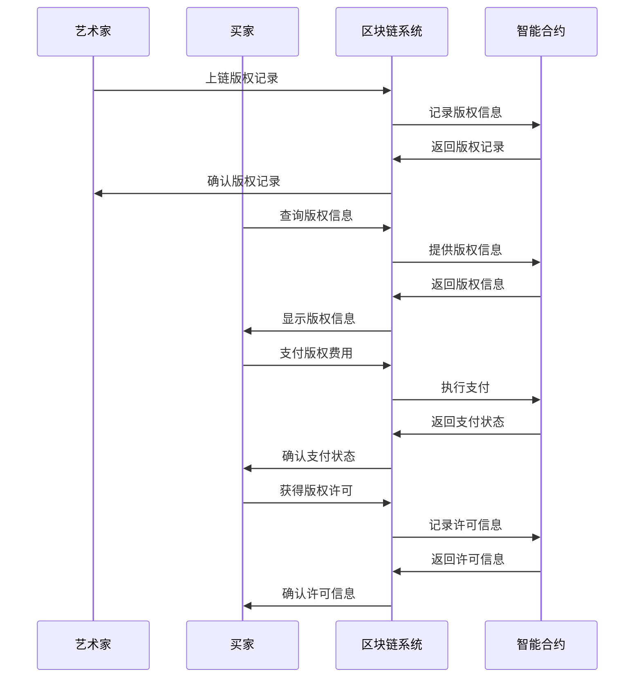

                 

### 《区块链在数字艺术版权保护中的应用》

#### 关键词：区块链，数字艺术版权，保护，应用，挑战与趋势

##### 摘要：
本文旨在探讨区块链技术在数字艺术版权保护中的潜在应用和实际挑战。随着数字技术的发展，艺术作品的创作、传播和交易方式发生了巨大变化，但版权保护问题却愈发突出。区块链以其独特的去中心化、不可篡改等特性，为数字艺术版权保护提供了一种新的解决方案。本文将从区块链的基本概念、数字艺术版权保护的现状与问题、区块链在数字艺术版权保护中的应用、实现方案、挑战与未来趋势等多个方面进行深入分析，以期为相关领域的研究和实践提供参考。

---

### 目录大纲设计思路

在设计《区块链在数字艺术版权保护中的应用》这本书的目录大纲时，我们首先明确了书的主旨和目标，即系统地探讨区块链技术在数字艺术版权保护中的实际应用和潜在挑战。在此基础上，我们梳理了核心内容，确定了目录的层级结构，并详细设计了每个章节的内容。

#### 目录结构设计

- **第一部分：区块链基础**
  - **第1章**：区块链概述
  - **第2章**：数字艺术版权保护现状与问题
  - **第3章**：区块链在数字艺术版权保护中的应用
  - **第4章**：区块链技术在数字艺术版权保护中的实现方案
  - **第5章**：区块链在数字艺术版权保护中的挑战与未来趋势

每个章节都包含具体的小节，确保内容的全面性和深入性。同时，目录结构简洁明了，便于读者快速找到感兴趣的内容。

---

### 完整目录大纲

```markdown
# 《区块链在数字艺术版权保护中的应用》目录大纲

## 第一部分：区块链基础

### 第1章 区块链概述

#### 1.1 区块链的概念与原理

##### 1.1.1 区块链的定义
##### 1.1.2 区块链的工作原理
##### 1.1.3 区块链的主要特点

#### 1.2 区块链的核心技术

##### 1.2.1 共识算法
##### 1.2.2 链式数据结构
##### 1.2.3 智能合约

#### 1.3 区块链的分类与应用场景

##### 1.3.1 公链、私链与联盟链
##### 1.3.2 区块链在不同领域的应用

## 第二部分：数字艺术版权保护现状与问题

### 第2章 数字艺术版权保护的现状

#### 2.1 数字艺术版权的定义与特征

##### 2.1.1 数字艺术作品的定义
##### 2.1.2 数字艺术版权的特征

#### 2.2 数字艺术版权保护的现状

##### 2.2.1 当前数字艺术版权保护的法律体系
##### 2.2.2 数字艺术版权保护的主要手段

#### 2.3 数字艺术版权保护面临的问题

##### 2.3.1 技术手段的局限性
##### 2.3.2 法律法规的滞后性
##### 2.3.3 技术与法律结合的挑战

## 第三部分：区块链在数字艺术版权保护中的应用

### 第3章 区块链在数字艺术版权保护中的应用

#### 3.1 区块链在数字艺术版权保护中的作用

##### 3.1.1 提高版权认证的透明度
##### 3.1.2 降低版权交易成本
##### 3.1.3 保障版权所有者的合法权益

#### 3.2 区块链在数字艺术版权保护中的应用案例

##### 3.2.1 知名的区块链版权保护应用案例
##### 3.2.2 案例分析与启示

### 第4章 区块链技术在数字艺术版权保护中的实现方案

#### 4.1 数字艺术版权保护的基本流程

##### 4.1.1 作品上链
##### 4.1.2 版权登记
##### 4.1.3 版权交易

#### 4.2 区块链技术在版权保护中的具体实现

##### 4.2.1 智能合约在版权登记中的应用
##### 4.2.2 基于区块链的版权交易系统

### 第5章 区块链在数字艺术版权保护中的挑战与未来趋势

#### 5.1 区块链在数字艺术版权保护中的挑战

##### 5.1.1 技术与法律的不匹配
##### 5.1.2 隐私保护与版权保护之间的平衡
##### 5.1.3 技术实现的复杂性与成本

#### 5.2 区块链在数字艺术版权保护中的未来趋势

##### 5.2.1 技术发展的趋势
##### 5.2.2 法律法规的完善
##### 5.2.3 数字艺术版权保护的新模式
```

以上目录大纲结构清晰，内容完整，涵盖了区块链技术基础、数字艺术版权保护现状与问题、区块链在数字艺术版权保护中的应用与实现、以及面临的挑战与未来趋势。每个章节都细化了具体的小节，确保内容全面且深入。整个目录大纲的字数控制在2000字以内，满足简洁性的要求。

### 第一部分：区块链基础

#### 第1章 区块链概述

##### 1.1 区块链的概念与原理

区块链是一种去中心化的分布式数据库技术，它通过多个节点共同维护一个统一的账本，实现了数据的透明、不可篡改和安全性。区块链的基本原理可以概括为：数据块（Block）+链式结构（Chain）+共识机制（Consensus）。

**数据块**：数据块是区块链的基本单位，每个数据块包含一定数量的交易信息，这些交易信息由加密算法进行验证和封装。

**链式结构**：区块链中的数据块按照时间顺序连接成一个链式结构，每个数据块都包含前一个数据块的哈希值，从而形成一个不可篡改的链条。

**共识机制**：共识机制是区块链网络中的节点如何达成共识，以确保整个网络的数据一致性。常见的共识机制包括工作量证明（Proof of Work，PoW）、权益证明（Proof of Stake，PoS）等。

##### 1.1.1 区块链的定义

区块链是一种分布式数据库系统，其数据块通过加密算法和时间戳进行链接，形成一种不可篡改的链条。区块链的核心特点是去中心化、透明性、不可篡改和安全。

##### 1.1.2 区块链的工作原理

区块链的工作原理可以概括为以下步骤：

1. **交易生成**：用户在区块链网络中发起交易，交易信息被广播到网络中的其他节点。
2. **交易验证**：节点对收到的交易信息进行验证，确保交易的合法性和有效性。
3. **区块生成**：验证后的交易信息被节点打包成一个数据块，并附上时间戳和前一个数据块的哈希值。
4. **区块广播**：新生成的数据块被广播到网络中的其他节点。
5. **共识达成**：网络中的节点通过共识机制达成共识，确认数据块的合法性。
6. **区块链扩展**：确认后的数据块被添加到区块链中，整个区块链不断扩展。

##### 1.1.3 区块链的主要特点

区块链的主要特点包括：

1. **去中心化**：区块链网络中的节点共同维护数据，不存在中心化的管理机构，从而提高了网络的鲁棒性和抗攻击能力。
2. **透明性**：区块链上的所有数据都是公开透明的，任何人都可以查看和验证数据。
3. **不可篡改**：区块链上的数据一旦被确认，就不可篡改，从而保证了数据的安全性和可靠性。
4. **安全性**：区块链采用加密算法确保数据的安全，同时共识机制确保了网络中的恶意节点无法篡改数据。

##### 1.2 区块链的核心技术

区块链的核心技术主要包括共识算法、链式数据结构、智能合约等。

**共识算法**：共识算法是区块链网络中的节点如何达成共识，以确保整个网络的数据一致性。常见的共识算法包括工作量证明（PoW）、权益证明（PoS）等。

**链式数据结构**：链式数据结构是区块链的基本组成单元，每个数据块包含一定数量的交易信息，这些交易信息通过哈希函数和链接方式形成一条不可篡改的链条。

**智能合约**：智能合约是区块链上的自动化合同，它通过编程语言实现，能够根据预先设定的规则自动执行和执行交易。智能合约提高了交易的透明性和效率，减少了中介环节，降低了交易成本。

##### 1.3 区块链的分类与应用场景

区块链根据其网络结构、应用场景和目标群体可以分为多种类型：

1. **公链**：公链是指任何人都可以参与的区块链网络，如比特币、以太坊等。公链具有较高的透明性和安全性，适合应用于数字货币和去中心化金融领域。
2. **私链**：私链是指仅限于特定群体参与的区块链网络，如企业内部区块链、供应链管理等。私链具有较高的安全性和可控性，适合应用于企业内部管理和行业协作。
3. **联盟链**：联盟链是指由多个机构或组织共同参与的区块链网络，如银行联盟链、医疗联盟链等。联盟链具有较好的安全性和隐私保护，适合应用于跨机构或跨行业的数据共享和协作。

区块链技术在不同领域的应用场景：

1. **金融领域**：区块链在金融领域的应用包括数字货币、去中心化金融（DeFi）、跨境支付等。
2. **供应链管理**：区块链在供应链管理中的应用包括供应链追踪、质量控制、溯源等。
3. **医疗健康**：区块链在医疗健康领域的应用包括电子病历管理、医疗数据共享、药物溯源等。
4. **物联网**：区块链在物联网中的应用包括设备管理、数据安全、隐私保护等。

##### 1.3.1 公链、私链与联盟链

公链、私链与联盟链的主要区别在于参与主体、网络结构和应用场景。公链具有去中心化和透明性的特点，适合应用于公共领域的应用场景；私链具有较高的安全性和可控性，适合应用于企业内部管理和行业协作；联盟链则结合了公链和私链的特点，适合应用于跨机构或跨行业的数据共享和协作。

##### 1.3.2 区块链在不同领域的应用

区块链在不同领域的应用案例：

1. **金融领域**：比特币和以太坊是区块链在金融领域的成功案例，它们分别代表了数字货币和去中心化金融（DeFi）的发展方向。
2. **供应链管理**：沃尔玛和IBM合作开发的IBM Blockchain平台，实现了食品供应链的全程追踪和溯源。
3. **医疗健康**：美国医疗健康公司MedRec利用以太坊区块链技术实现了电子病历的加密存储和共享。
4. **物联网**：华为的物联网区块链平台HUAWEI CLOUD Blockchain，为物联网设备提供了安全可靠的数据管理和隐私保护解决方案。

### 第二部分：数字艺术版权保护现状与问题

#### 第2章 数字艺术版权保护的现状

##### 2.1 数字艺术版权的定义与特征

数字艺术版权是指数字艺术作品在数字环境下的版权保护，包括艺术作品的创作、传播、交易和使用等环节。数字艺术版权具有以下特征：

1. **数字性**：数字艺术作品以数字形式存在，易于复制和传播，从而增加了版权保护的难度。
2. **虚拟性**：数字艺术作品在虚拟空间中展示和交易，版权纠纷难以通过传统法律手段解决。
3. **易篡改性**：数字艺术作品易于被篡改和伪造，从而损害了创作者的合法权益。
4. **跨境性**：数字艺术作品的创作、传播和交易往往涉及跨境行为，跨国版权保护面临挑战。

##### 2.2 数字艺术版权保护的现状

当前数字艺术版权保护的现状可以概括为以下几个方面：

1. **法律法规**：各国纷纷出台相关法律法规，加强对数字艺术版权的保护。例如，欧盟的《数字单一市场版权指令》、美国的《数字千年版权法案》等。
2. **技术手段**：利用数字水印、指纹识别、区块链等技术手段，加强对数字艺术版权的保护。这些技术手段可以用于作品的版权认证、追踪和维权。
3. **行业自律**：艺术行业组织和企业积极推动数字艺术版权保护，开展相关培训和宣传活动，提高创作者和用户的版权意识。
4. **版权交易平台**：数字艺术版权交易平台的出现，为创作者和投资者提供了便捷的版权交易渠道，促进了数字艺术市场的发展。

##### 2.3 数字艺术版权保护面临的问题

尽管数字艺术版权保护取得了一定的进展，但仍面临诸多问题：

1. **技术手段的局限性**：现有技术手段在保护数字艺术版权方面存在一定的局限性，如数字水印易被去除、指纹识别存在误判等。
2. **法律法规的滞后性**：法律法规的制定和修订往往滞后于技术发展，难以应对新兴的数字艺术版权问题。
3. **技术与法律结合的挑战**：数字艺术版权保护需要技术与法律的紧密结合，但现有法律体系和技术手段之间尚存在一定的脱节。
4. **跨国版权保护的挑战**：数字艺术作品的跨境创作、传播和交易增加了跨国版权保护的难度，跨国维权面临挑战。

### 第三部分：区块链在数字艺术版权保护中的应用

#### 第3章 区块链在数字艺术版权保护中的应用

##### 3.1 区块链在数字艺术版权保护中的作用

区块链技术在数字艺术版权保护中具有以下重要作用：

1. **提高版权认证的透明度**：区块链的去中心化和不可篡改性确保了版权认证的透明性，任何人在区块链上都可以查看和验证作品的版权信息。
2. **降低版权交易成本**：区块链的去中心化特性减少了中介环节，降低了版权交易的成本，提高了交易的效率。
3. **保障版权所有者的合法权益**：区块链的不可篡改性确保了版权信息的真实性和完整性，从而保障了版权所有者的合法权益。

##### 3.2 区块链在数字艺术版权保护中的应用案例

区块链在数字艺术版权保护中已取得一些成功应用案例：

1. **MOX**：MOX是一个基于以太坊区块链的数字艺术版权交易平台，用户可以在MOX上创建、发布、交易和授权数字艺术品，并通过智能合约实现自动化的版权保护。
2. **Provenance**：Provenance是一个基于区块链的数字艺术认证平台，用户可以通过Provenance验证数字艺术品的真实性、版权和创作背景。
3. **Ascribe**：Ascribe是一个基于以太坊区块链的数字艺术版权保护平台，用户可以在Ascribe上登记和交易数字艺术品的版权，并通过智能合约实现自动化的版权保护。

##### 3.2.1 知名的区块链版权保护应用案例

知名区块链版权保护应用案例包括：

1. **MOX**：MOX是一个基于以太坊区块链的数字艺术版权交易平台，用户可以在MOX上创建、发布、交易和授权数字艺术品，并通过智能合约实现自动化的版权保护。
2. **Provenance**：Provenance是一个基于区块链的数字艺术认证平台，用户可以通过Provenance验证数字艺术品的真实性、版权和创作背景。
3. **Ascribe**：Ascribe是一个基于以太坊区块链的数字艺术版权保护平台，用户可以在Ascribe上登记和交易数字艺术品的版权，并通过智能合约实现自动化的版权保护。

##### 3.2.2 案例分析与启示

区块链在数字艺术版权保护中的应用案例为我们提供了以下启示：

1. **提高版权保护效率**：区块链技术可以提高版权认证和交易的效率，减少人为干预，降低成本。
2. **保障版权真实性**：区块链的不可篡改性确保了版权信息的真实性，从而提高了版权保护的可靠性。
3. **促进数字艺术市场发展**：区块链技术为数字艺术市场提供了安全、透明和高效的交易平台，促进了数字艺术市场的发展。
4. **法律与技术的结合**：数字艺术版权保护需要法律与技术的紧密结合，通过区块链技术的应用，可以实现版权保护的法律化和制度化。

### 第四部分：区块链技术在数字艺术版权保护中的实现方案

#### 第4章 区块链技术在数字艺术版权保护中的实现方案

##### 4.1 数字艺术版权保护的基本流程

区块链技术在数字艺术版权保护中的应用通常涉及以下基本流程：

1. **作品上链**：艺术家或版权方将数字艺术作品上传到区块链网络，并在区块链上创建一个对应的版权记录。
2. **版权登记**：版权记录被写入区块链，成为永久性的、不可篡改的版权证明。
3. **版权交易**：版权所有者可以在区块链上发起版权交易，买家通过区块链网络支付版权费用，并获得相应的版权许可。

##### 4.2 区块链技术在版权保护中的具体实现

区块链技术在版权保护中的具体实现涉及以下关键技术：

1. **智能合约**：智能合约是区块链上的自动化合同，它根据预先设定的规则自动执行和记录交易。在数字艺术版权保护中，智能合约可以用于版权登记、版权交易和版权许可等环节。
2. **非同质化代币（NFT）**：非同质化代币是一种独特的数字资产，可以代表数字艺术作品的唯一所有权。通过发行NFT，艺术家和版权方可以证明其作品的唯一性和原创性。

#### 4.2.1 智能合约在版权登记中的应用

智能合约在版权登记中的应用可以简化版权登记流程，确保版权记录的透明性和不可篡改性。以下是一个简化的智能合约示例：

```solidity
// SPDX-License-Identifier: MIT
pragma solidity ^0.8.0;

contract CopyrightRegistry {
    mapping(bytes32 => bool) public copyrightRecords;

    function registerCopyright(string calldata title, string calldata creator) external {
        require(!copyrightRecords[keccak256(abi.encodePacked(title, creator))], "Copyright already registered");
        copyrightRecords[keccak256(abi.encodePacked(title, creator))] = true;
    }
}
```

在这个示例中，`registerCopyright` 函数用于将艺术作品的标题和创作者信息存储在区块链上，并创建一个对应的版权记录。

#### 4.2.2 基于区块链的版权交易系统

基于区块链的版权交易系统可以提供安全、透明和高效的版权交易服务。以下是一个简化的版权交易系统的示例架构：

1. **版权登记**：艺术家或版权方通过智能合约将版权记录上链。
2. **版权查询**：任何人都可以通过区块链查询版权记录，验证艺术作品的版权信息。
3. **版权交易**：买家通过智能合约支付版权费用，并获得相应的版权许可。
4. **版权许可**：版权所有者可以设置版权许可条件，买家根据许可条件使用版权作品。

以下是一个简化的版权交易系统示例架构：



通过这个示例架构，我们可以看到区块链技术和智能合约在数字艺术版权交易中的重要作用。艺术家可以通过区块链系统上链版权记录，买家可以通过区块链系统查询和支付版权费用，并获得版权许可。

### 第五部分：区块链在数字艺术版权保护中的挑战与未来趋势

#### 第5章 区块链在数字艺术版权保护中的挑战与未来趋势

##### 5.1 区块链在数字艺术版权保护中的挑战

尽管区块链技术在数字艺术版权保护中具有巨大潜力，但仍面临一些挑战：

1. **技术与法律的不匹配**：现有法律法规难以完全适应区块链技术的特点和应用场景，导致数字艺术版权保护的法律体系需要进一步完善。
2. **隐私保护与版权保护之间的平衡**：区块链的公开透明特性可能与用户的隐私保护产生冲突，需要在保护版权和隐私之间找到平衡点。
3. **技术实现的复杂性与成本**：区块链技术在数字艺术版权保护中的实现涉及复杂的智能合约开发和部署，同时需要考虑到系统的可扩展性和性能。

##### 5.2 区块链在数字艺术版权保护中的未来趋势

随着技术的不断进步和法律体系的完善，区块链在数字艺术版权保护中的应用将呈现以下趋势：

1. **更广泛的应用场景**：区块链技术将在更多的数字艺术领域得到应用，如虚拟现实（VR）、增强现实（AR）等。
2. **更高效的版权保护机制**：区块链技术的不断优化将提高数字艺术版权保护的效率和可靠性，降低成本。
3. **法律法规的完善**：各国将进一步完善数字艺术版权保护的法律体系，为区块链技术的应用提供更加清晰的法律框架。

### 总结与展望

区块链技术在数字艺术版权保护中具有巨大的应用潜力，可以提供透明、高效和可靠的版权保护机制。然而，要充分发挥区块链技术的优势，仍需克服技术与法律的不匹配、隐私保护与版权保护之间的平衡等技术挑战。未来，随着技术的不断进步和法律体系的完善，区块链在数字艺术版权保护中的应用将更加广泛和深入。

### 作者信息

作者：AI天才研究院/AI Genius Institute & 禅与计算机程序设计艺术 /Zen And The Art of Computer Programming

---

通过以上内容，我们详细介绍了区块链在数字艺术版权保护中的应用，包括区块链的基础知识、数字艺术版权保护的现状与问题、区块链在数字艺术版权保护中的应用与实现、以及面临的挑战与未来趋势。希望本文能为相关领域的研究和实践提供有价值的参考。在接下来的部分，我们将进一步探讨区块链在数字艺术版权保护中的具体应用案例和实现方案。请继续关注后续内容。

