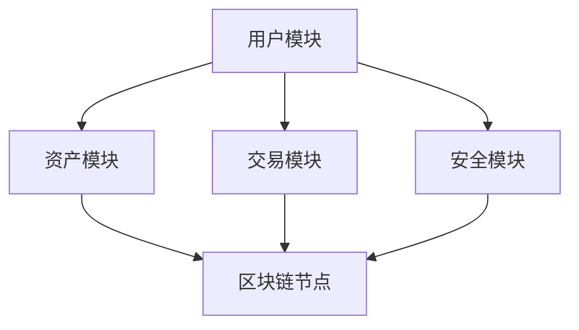
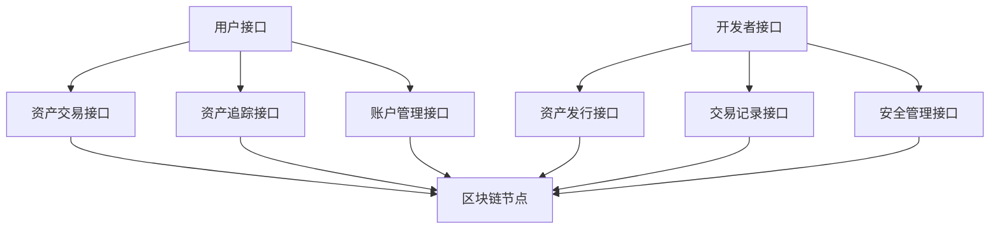
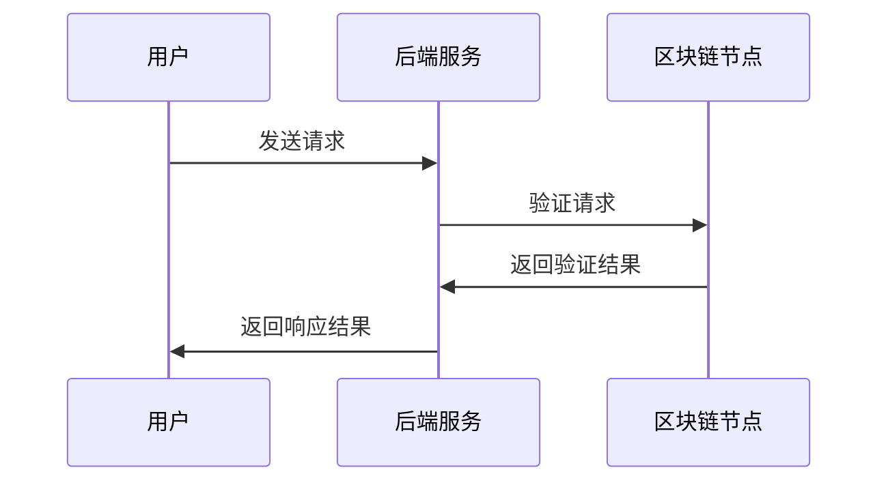

                 

# 《区块链在数字资产管理中的创新：简化资产交易和追踪》

## 关键词：
区块链、数字资产管理、资产交易、追踪、创新

## 摘要：
本文将探讨区块链技术在数字资产管理中的应用，分析其如何通过简化资产交易和追踪流程，带来革命性的改变。我们将从区块链的基本概念出发，逐步深入到其在数字资产管理中的应用，最终通过实际案例来展示区块链的强大潜力。

## 目录

### 引言
#### 1. 区块链技术的起源与发展
#### 2. 数字资产管理的挑战
#### 3. 本文结构

### 第1章 区块链的基本概念
#### 1.1 区块链的定义与工作原理
#### 1.2 区块链的核心组成部分
#### 1.3 区块链在数字资产管理中的优势

### 第2章 数字资产管理概述
#### 2.1 数字资产的定义与分类
#### 2.2 数字资产管理的重要性
#### 2.3 数字资产管理面临的挑战

### 第3章 区块链与数字资产管理的结合
#### 3.1 区块链如何简化资产交易
#### 3.2 区块链如何提升资产追踪效率
#### 3.3 区块链在数字资产管理中的实际应用案例

### 第4章 区块链在数字资产管理中的技术实现
#### 4.1 共识算法
#### 4.2 智能合约
#### 4.3 分布式应用（DApps）

### 第5章 区块链数学模型与原理
#### 5.1 密码学基础
#### 5.2 区块链共识算法的数学模型
#### 5.3 区块链中的数学公式与应用

### 第6章 区块链系统设计与实现
#### 6.1 问题场景介绍
#### 6.2 系统功能设计
#### 6.3 系统架构设计
#### 6.4 系统接口设计与交互

### 第7章 区块链在数字资产管理中的实战应用
#### 7.1 案例分析
#### 7.2 实际实现与代码解读
#### 7.3 项目小结

### 第8章 最佳实践与未来展望
#### 8.1 最佳实践建议
#### 8.2 注意事项与挑战
#### 8.3 未来发展方向

### 结论
#### 1. 区块链在数字资产管理中的重要性
#### 2. 本文的贡献与不足
#### 3. 下一步研究方向

### 参考文献
#### 1. 区块链相关文献
#### 2. 数字资产管理相关文献
#### 3. 其他相关文献

### 附录
#### 1. 区块链技术常用工具
#### 2. 数字资产管理技术指南
#### 3. 实战项目源代码

### 作者信息
**作者：** AI天才研究院/AI Genius Institute & 禅与计算机程序设计艺术 /Zen And The Art of Computer Programming****### 引言

#### 1. 区块链技术的起源与发展

区块链技术作为一种分布式账本技术，最早可以追溯到2008年，由一位化名为“中本聪”（Satoshi Nakamoto）的神秘人物提出。中本聪发布了比特币（Bitcoin）的白皮书，阐述了区块链技术的核心概念和原理。比特币作为一种去中心化的数字货币，成功地将区块链技术应用于实际的金融交易场景中。

随着时间的推移，区块链技术逐渐从比特币扩展到更广泛的领域。2016年，以太坊（Ethereum）的发布进一步推动了区块链技术的应用。以太坊引入了智能合约（Smart Contract）的概念，使得区块链不再仅限于简单的数据记录，而可以执行复杂的业务逻辑。

区块链技术的发展历程可以总结为以下几个阶段：

1. **比特币阶段（2008-2012）**：这一阶段是区块链技术的萌芽期，主要关注点是去中心化的数字货币。
2. **早期应用阶段（2013-2015）**：区块链技术开始应用于其他领域，如供应链管理、身份验证等。
3. **以太坊阶段（2016-至今）**：智能合约的引入使得区块链技术在金融、供应链、物联网等领域得到更广泛的应用。

#### 2. 数字资产管理的挑战

数字资产管理指的是对数字资产进行投资、管理、存储和交易的一系列操作。随着数字资产市场的快速增长，数字资产管理的重要性日益凸显。然而，数字资产管理也面临着一系列挑战：

1. **安全风险**：数字资产容易被黑客攻击，导致资产损失。
2. **透明度不足**：传统的金融体系缺乏透明度，导致市场参与者难以获得准确的资产信息。
3. **交易效率低**：传统的金融交易流程复杂，需要经过多个中介环节，导致交易效率低下。
4. **追踪困难**：数字资产的转移和交易往往缺乏有效的追踪机制，导致资产流失和欺诈行为。

为了解决这些问题，数字资产管理需要新的技术手段来提高安全性、透明度和交易效率。区块链技术的出现为数字资产管理提供了一种新的解决方案。

#### 3. 本文结构

本文将从区块链的基本概念开始，逐步深入到其在数字资产管理中的应用。具体结构如下：

- **第1章 区块链的基本概念**：介绍区块链的定义、工作原理和核心组成部分，以及区块链在数字资产管理中的优势。
- **第2章 数字资产管理概述**：阐述数字资产的定义、分类、重要性以及面临的挑战。
- **第3章 区块链与数字资产管理的结合**：讨论区块链如何简化资产交易和提升资产追踪效率，并分析区块链在数字资产管理中的实际应用案例。
- **第4章 区块链在数字资产管理中的技术实现**：介绍区块链在数字资产管理中的关键技术，如共识算法、智能合约和分布式应用（DApps）。
- **第5章 区块链数学模型与原理**：探讨区块链中的数学模型，包括密码学基础和区块链共识算法的数学模型。
- **第6章 区块链系统设计与实现**：介绍区块链系统设计与实现的方法和步骤，包括问题场景介绍、系统功能设计、系统架构设计和系统接口设计。
- **第7章 区块链在数字资产管理中的实战应用**：通过实际案例展示区块链在数字资产管理中的应用效果，并分析实际实现和代码解读。
- **第8章 最佳实践与未来展望**：总结区块链在数字资产管理中的最佳实践，并提出未来发展方向。

通过以上章节的逐步介绍，本文旨在深入探讨区块链在数字资产管理中的应用，分析其创新之处，并为读者提供实际的指导意义。

### 第1章 区块链的基本概念

#### 1.1 区块链的定义与工作原理

区块链是一种分布式账本技术，通过加密算法和共识机制确保数据的不可篡改性和透明性。它由一系列按时间顺序排列的“区块”组成，每个区块都包含一定数量的交易记录。这些区块通过加密算法链接在一起，形成区块链。

区块链的工作原理可以概括为以下几个步骤：

1. **数据采集**：交易数据被收集并打包成一个“区块”。
2. **区块验证**：节点对区块进行验证，确保交易数据的合法性和完整性。
3. **共识机制**：通过共识机制（如工作量证明PoW、权益证明PoS等），节点就区块的合法性达成共识。
4. **区块添加**：验证通过的区块被添加到区块链上，形成新的链。
5. **数据存储**：区块链上的数据被永久存储，供所有节点访问。

#### 1.2 区块链的核心组成部分

区块链的核心组成部分包括：

1. **区块**：区块是区块链的基本单位，包含交易数据、时间戳、区块链哈希值等。
2. **链**：链是由一系列按时间顺序排列的区块组成，确保数据的一致性和不可篡改性。
3. **节点**：节点是区块链网络中的参与者，负责验证交易、维护区块链的完整性。
4. **共识机制**：共识机制是节点之间达成一致的方法，确保区块链的稳定性和安全性。
5. **加密算法**：加密算法用于保护区块链上的数据，确保数据的机密性和完整性。

#### 1.3 区块链在数字资产管理中的优势

区块链技术在数字资产管理中的应用具有以下优势：

1. **安全性**：区块链通过加密算法和共识机制确保数据的安全性和不可篡改性，减少了安全漏洞和欺诈行为。
2. **透明度**：区块链上的数据是公开透明的，所有参与者都可以访问和验证数据，提高了市场的透明度和公信力。
3. **效率**：区块链去中心化的特性减少了中介环节，提高了交易效率，降低了交易成本。
4. **追踪性**：区块链的不可篡改性和透明度使其成为追踪数字资产转移和交易的理想工具，有助于防止资产流失和欺诈行为。
5. **去中心化**：区块链的去中心化特性减少了依赖中心化机构的风险，提高了系统的可靠性和稳定性。

通过以上优势，区块链为数字资产管理提供了全新的解决方案，有望解决传统金融体系中的痛点，推动数字资产市场的发展。

### 第2章 数字资产管理概述

#### 2.1 数字资产的定义与分类

数字资产是指以数字形式存在并具有经济价值的资产。根据资产类型和形式，数字资产可以分类如下：

1. **加密货币**：加密货币是使用加密技术保障流通和交易的数字货币，如比特币（BTC）、以太币（ETH）等。
2. **代币**：代币是一种数字权益凭证，代表对某种资产的所有权、使用权或参与权，如ERC-20、ERC-721等标准代币。
3. **数字债券**：数字债券是一种通过区块链技术发行的债券，提供投资和融资的数字平台。
4. **数字股票**：数字股票是通过区块链技术发行的股票，实现股票的数字化交易和管理。
5. **数字商品**：数字商品是以数字形式存在的商品，如虚拟货币、数字艺术品等。

#### 2.2 数字资产管理的重要性

随着数字经济的快速发展，数字资产在金融体系中的地位日益重要。数字资产管理的重要性体现在以下几个方面：

1. **资产保值增值**：数字资产具有较高的增值潜力，通过有效的资产管理，可以实现资产的保值和增值。
2. **金融创新**：数字资产管理为金融机构和投资者提供了创新的金融服务和投资渠道，促进了金融市场的繁荣。
3. **提高透明度**：区块链技术的应用提高了数字资产的透明度和可追溯性，有助于减少欺诈和非法交易。
4. **降低交易成本**：数字资产的去中心化特性减少了交易中介环节，降低了交易成本，提高了交易效率。
5. **促进经济转型**：数字资产管理推动了数字经济的发展，加速了传统经济的数字化转型。

#### 2.3 数字资产管理面临的挑战

尽管数字资产管理具有众多优势，但同时也面临一些挑战：

1. **安全性**：数字资产容易被黑客攻击，导致资产损失。加密技术和安全措施需要不断完善。
2. **监管合规**：数字资产市场缺乏统一的监管标准和法规，投资者面临合规风险。
3. **技术门槛**：数字资产管理需要一定的技术知识，对于普通投资者而言，参与门槛较高。
4. **市场波动性**：数字资产市场波动性较大，投资者需要具备较强的风险承受能力。
5. **法律争议**：数字资产交易和法律纠纷的处理存在一定困难，法律制度需要进一步完善。

为解决这些挑战，数字资产管理需要不断创新和改进，借助区块链技术等新兴技术，提高资产的安全性、透明度和监管合规性。

### 第3章 区块链与数字资产管理的结合

#### 3.1 区块链如何简化资产交易

区块链技术在数字资产管理中的应用，首先体现在简化资产交易流程上。传统的金融交易通常需要经过多个中介环节，如银行、证券公司等，这不仅增加了交易成本，也降低了交易效率。区块链通过其去中心化的特性，实现了点对点的直接交易，简化了交易流程，具体表现在以下几个方面：

1. **去中介化**：区块链的去中心化特性消除了传统交易中的中介机构，参与者可以直接进行交易，减少了交易成本和交易时间。
2. **智能合约**：智能合约是区块链上自动化执行的合同，可以在交易达成后自动执行相关条款，确保交易的安全和高效。
3. **透明度**：区块链上的交易记录是公开透明的，所有参与者都可以查看和验证交易记录，提高了市场的透明度和信任度。
4. **即时性**：由于区块链网络的分布式特性，交易可以在短时间内完成，大大提高了交易效率。

例如，在比特币交易中，交易双方无需通过银行等中介机构，只需在区块链上进行数字签名，即可完成交易。这不仅降低了交易成本，还提高了交易速度。

#### 3.2 区块链如何提升资产追踪效率

资产追踪是数字资产管理中的重要环节，传统的资产追踪方式往往存在透明度不足、效率低等问题。区块链技术的引入，为资产追踪提供了全新的解决方案，具体表现在以下几个方面：

1. **不可篡改性**：区块链上的数据一旦记录，就不可篡改。这意味着资产的所有权和转移记录可以被永久保存，确保了数据的真实性和可靠性。
2. **透明度**：区块链上的交易记录是公开透明的，所有参与者都可以查看和验证交易记录，确保了资产转移的透明度。
3. **高效性**：区块链网络的分布式特性使得资产追踪可以在短时间内完成，提高了追踪效率。
4. **智能合约**：智能合约可以自动执行资产转移的条款，确保资产转移的合法性和安全性，同时记录在区块链上，便于后续追踪。

例如，在商品供应链管理中，区块链技术可以记录商品的生产、运输、销售等各个环节的信息，确保商品的真实性和可追溯性。消费者可以通过扫描商品上的二维码，查看商品的生产和流通信息，确保购买到正品。

#### 3.3 区块链在数字资产管理中的实际应用案例

区块链在数字资产管理中的应用已经取得了一些实际成果，以下是一些典型的应用案例：

1. **加密货币交易**：比特币、以太币等加密货币的兴起，展示了区块链在数字资产管理中的巨大潜力。通过区块链技术，加密货币交易可以实现去中心化、安全高效的交易。
2. **供应链管理**：区块链技术在供应链管理中的应用，可以提高供应链的透明度和效率。例如，沃尔玛等公司已经使用区块链技术追踪食品供应链，确保食品的安全和质量。
3. **数字身份验证**：区块链技术可以用于数字身份验证，确保用户身份的真实性和唯一性。例如，Chainlink等公司已经开发了基于区块链的数字身份验证解决方案，用于金融、医疗、教育等领域。
4. **数字债券发行**：区块链技术可以用于数字债券的发行和管理，降低发行成本，提高发行效率。例如，IBM等公司已经使用区块链技术发行数字债券，吸引了大量的投资者。

通过以上实际应用案例，可以看出区块链技术在数字资产管理中的应用已经取得了显著的成效，未来有望进一步拓展应用场景，为数字资产管理带来更多的创新和变革。

### 第4章 区块链在数字资产管理中的技术实现

区块链在数字资产管理中的应用，离不开其强大的技术实现。本章将详细介绍区块链中的核心技术，包括共识算法、智能合约和分布式应用（DApps）。

#### 4.1 共识算法

共识算法是区块链网络中节点之间达成一致的方法，确保区块链的稳定性和安全性。目前，常见的共识算法包括：

1. **工作量证明（Proof of Work, PoW）**：PoW是比特币采用的共识算法，节点通过解决数学难题来证明自己的工作量，获得记账权。这种算法的特点是安全性强，但计算资源消耗大。
   
   $$\text{PoW}:\ \ f(S) = \min(S : h(S) < t)$$
   
   其中，\( f(S) \)表示找到一个满足哈希值小于阈值\( t \)的区块，\( h(S) \)表示区块的哈希值。

2. **权益证明（Proof of Stake, PoS）**：PoS算法通过节点持有的代币数量和存留时间来决定记账权。与PoW相比，PoS算法计算资源消耗较低，但可能存在“富者愈富”的问题。
   
   $$\text{PoS}:\ \ \text{节点选择} = \text{随机}(\text{持币量} \times \text{持币时间})$$

3. **委托权益证明（Delegated Proof of Stake, DPoS）**：DPoS是对PoS的改进，通过选举出一定数量的委托人来进行记账，提高了网络的效率。

   $$\text{DPoS}:\ \ \text{节点选择} = \text{随机}(\text{持币量} \times \text{持币时间} \div \text{总持币量})$$

#### 4.2 智能合约

智能合约是一种自动执行合约条款的计算机协议，其执行过程由区块链网络中的节点验证和执行。智能合约的代码通常使用Solidity等编程语言编写，并在区块链上进行部署。

以下是一个简单的智能合约示例，用于存储和转移以太币：

```python
pragma solidity ^0.8.0;

contract MyContract {
    address public owner;

    constructor() {
        owner = msg.sender;
    }

    function transferEther(address to, uint amount) public {
        require(msg.sender == owner, "只有合约所有者可以转移以太币");
        require(amount <= address(this).balance, "余额不足");
        payable(to).send(amount);
    }
}
```

在这个合约中，`transferEther`函数允许合约所有者转移以太币给指定的地址。

#### 4.3 分布式应用（DApps）

分布式应用（DApps）是基于区块链的应用程序，用户无需信任中心化机构即可进行操作。DApps通常由前端用户界面、后端服务器和区块链节点组成。

以下是一个简单的DApp示例，用于管理投票：

1. **前端用户界面**：用户通过前端界面提交投票请求。
2. **后端服务器**：服务器将投票信息发送到区块链节点进行记录。
3. **区块链节点**：节点验证投票信息，并将其记录在区块链上。

```solidity
pragma solidity ^0.8.0;

contract Voting {
    mapping(address => bool) public votes;

    function vote(uint id) public {
        require(!votes[msg.sender], "已投票");
        votes[msg.sender] = true;
        // 将投票信息发送到区块链节点进行记录
    }
}
```

在这个合约中，`vote`函数允许用户对特定的问题进行投票。

#### 4.4 案例分析

为了更好地理解区块链在数字资产管理中的技术实现，我们来看一个实际案例：以太坊（Ethereum）的代币发行和交易。

1. **代币发行**：以太坊使用ERC-20标准发行代币，通过智能合约控制代币的发行、转移和余额。
   
   ```solidity
   // SPDX-License-Identifier: MIT
   pragma solidity ^0.8.0;

   interface IERC20 {
       function totalSupply() external view returns (uint256);
       function balanceOf(address account) external view returns (uint256);
       function transfer(address recipient, uint256 amount) external returns (bool);
       // ... 其他函数
   }

   contract MyToken is IERC20 {
       string public name = "MyToken";
       string public symbol = "MTK";
       uint8 public decimals = 18;

       mapping(address => uint256) private _balances;
       uint256 private _totalSupply;

       constructor(uint256 initialSupply) {
           _totalSupply = initialSupply;
           _balances[msg.sender] = _totalSupply;
       }

       function totalSupply() public view override returns (uint256) {
           return _totalSupply;
       }

       function balanceOf(address account) public view override returns (uint256) {
           return _balances[account];
       }

       function transfer(address recipient, uint256 amount) public override returns (bool) {
           require(recipient != address(0), "接收地址不能为空");
           require(_balances[msg.sender] >= amount, "余额不足");
           _balances[msg.sender] -= amount;
           _balances[recipient] += amount;
           emit Transfer(msg.sender, recipient, amount);
           return true;
       }
   }
   ```

2. **代币交易**：用户可以通过以太坊的去中心化交易平台（如Uniswap）进行代币交易。Uniswap使用智能合约实现交易，用户通过前端界面进行操作。

   ```solidity
   // SPDX-License-Identifier: MIT
   pragma solidity ^0.8.0;

   interface IUniswapV2Factory {
       function getPair(address tokenA, address tokenB) external view returns (address pair);
   }

   interface IUniswapV2Pair {
       function token0() external view returns (address);
       function token1() external view returns (address);
       function swap(uint amount0Out, uint amount1Out, address to, bytes calldata data) external;
   }

   contract UniswapV2Swap {
       IUniswapV2Factory public factory;
       IUniswapV2Pair public pair;

       constructor(address _factory) {
           factory = IUniswapV2Factory(_factory);
           pair = IUniswapV2Pair(factory.getPair(address(this)));
       }

       function swap(address tokenIn, uint256 amountIn) public {
           address tokenOut = tokenIn == address(pair.token0()) ? address(pair.token1()) : address(pair.token0());
           pair.swap(amountIn, 0, tokenOut, "");
       }
   }
   ```

通过以上案例，我们可以看到区块链技术在数字资产管理中的应用是如何实现的。共识算法确保了区块链的安全性和稳定性，智能合约实现了自动化的交易和合约执行，分布式应用（DApps）为用户提供了便捷的交互界面。这些技术共同推动了区块链在数字资产管理中的创新和发展。

### 第5章 区块链数学模型与原理

区块链技术的核心在于其数学模型的强大和复杂性。本章将探讨区块链中的密码学基础、共识算法的数学模型以及区块链中的数学公式与应用。

#### 5.1 密码学基础

密码学是区块链技术的基石，它确保了数据的安全性和隐私性。以下是一些关键的密码学概念：

1. **哈希函数**：哈希函数是一种将任意长度的数据映射为固定长度的字符串的函数。区块链中的哈希函数通常采用SHA-256算法，它将输入数据转换为32个十六进制字符的字符串。

   $$h(x) = SHA-256(x)$$
   
   例如，字符串“Hello, World!”的哈希值为“ed076287532e86365e816759e75ddd8eb9d56129bdfc15b92d9a7d0a73b034e”

2. **公钥加密**：公钥加密是一种非对称加密方法，使用公钥加密数据，使用私钥解密数据。区块链中常用的公钥加密算法是RSA算法。

   $$\text{加密：} \ \text{ciphertext} = \text{publicKey} \cdot \text{plaintext} \mod \text{n}$$
   $$\text{解密：} \ \text{plaintext} = \text{privateKey} \cdot \text{ciphertext} \mod \text{n}$$
   
   其中，\( \text{n} \)是公钥和私钥的模数，\( \text{publicKey} \)和\( \text{privateKey} \)是公钥和私钥。

3. **数字签名**：数字签名用于验证消息的完整性和真实性。发送方使用私钥对消息进行签名，接收方使用公钥验证签名。

   $$\text{签名：} \ \text{signature} = \text{privateKey} \cdot \text{hash} \mod \text{n}$$
   $$\text{验证：} \ \text{valid} = \text{publicKey} \cdot \text{signature} \mod \text{n} \stackrel{?}{=} \text{hash}$$

#### 5.2 区块链共识算法的数学模型

区块链的共识算法是确保区块链网络稳定性和安全性的关键。以下是一些常见的共识算法及其数学模型：

1. **工作量证明（PoW）**：

   工作量证明算法通过解决复杂的数学问题来证明节点的工作量，以获取记账权。通常使用哈希函数来构建数学难题。

   $$\text{PoW：} \ \text{find} \ x \ such \ that \ h(x) < t$$
   
   其中，\( h(x) \)是哈希值，\( t \)是难度阈值。节点需要不断尝试，直到找到满足条件的\( x \)。

2. **权益证明（PoS）**：

   权益证明算法通过节点持有的代币数量和存留时间来决定记账权。数学模型基于概率论和随机过程。

   $$\text{PoS：} \ \text{node selection probability} \propto \text{stake} \times \text{age}$$
   
   其中，\( \text{stake} \)是节点持有的代币数量，\( \text{age} \)是代币的存留时间。

3. **委托权益证明（DPoS）**：

   委托权益证明是对PoS的改进，通过选举出一定数量的委托人来进行记账。数学模型基于选举算法和博弈论。

   $$\text{DPoS：} \ \text{node selection probability} \propto \text{weight} \times \text{delegations}$$
   
   其中，\( \text{weight} \)是节点持有的代币数量，\( \text{delegations} \)是节点的委托代币数量。

#### 5.3 区块链中的数学公式与应用

区块链中的数学公式广泛应用于共识算法、智能合约和分布式应用中。以下是一些具体的公式与应用：

1. **区块链长度**：

   区块链长度是指区块链中包含的区块数量。数学模型基于区块链的增长速率和生成时间。

   $$\text{length} = \text{growth rate} \times \text{time}$$
   
   其中，\( \text{growth rate} \)是区块链的增长速率，\( \text{time} \)是时间。

2. **交易速度**：

   交易速度是指区块链上完成交易所需的时间。数学模型基于网络延迟和区块生成时间。

   $$\text{speed} = \frac{\text{time}}{\text{block time}}$$
   
   其中，\( \text{time} \)是交易完成时间，\( \text{block time} \)是区块生成时间。

3. **共识难度**：

   共识难度是指节点解决共识问题的难度。数学模型基于哈希值和难度阈值。

   $$\text{difficulty} = \text{target} - \text{hash}$$
   
   其中，\( \text{target} \)是难度阈值，\( \text{hash} \)是哈希值。

通过这些数学模型和公式，区块链技术能够实现安全、稳定和高效的运行。理解这些数学原理对于深入研究和应用区块链技术具有重要意义。

### 第6章 区块链系统设计与实现

区块链系统设计与实现是一个复杂的过程，涉及多个环节。本章将介绍区块链系统的设计与实现方法，包括问题场景介绍、系统功能设计、系统架构设计和系统接口设计。

#### 6.1 问题场景介绍

假设我们正在设计一个数字资产管理平台，该平台需要实现以下功能：

1. **资产交易**：用户可以在平台上进行数字资产的买卖交易，交易记录需要实时更新。
2. **资产追踪**：平台需要记录数字资产的所有转移和交易历史，确保数据的透明性和可追溯性。
3. **安全防护**：平台需要确保数据的安全，防止黑客攻击和数据篡改。
4. **高效交易**：平台需要提供快速的交易处理能力，降低交易延迟。

#### 6.2 系统功能设计

为了实现上述功能，系统需要设计以下主要功能模块：

1. **用户模块**：用户注册、登录、个人信息管理等功能。
2. **资产模块**：资产发行、资产交易、资产追踪等功能。
3. **交易模块**：交易记录、交易确认、交易结果通知等功能。
4. **安全模块**：加密算法、访问控制、异常检测等功能。

以下是系统的功能架构图：

```mermaid
classDiagram
ClassDiagram {
  Class User {
    +string username
    +string password
    +string email
    +void register()
    +void login()
    +void updateInfo()
  }

  Class Asset {
    +string name
    +string symbol
    +uint256 totalSupply
    +void issue()
    +void transfer()
    +void track()
  }

  Class Transaction {
    +uint256 id
    +uint256 sender
    +uint256 receiver
    +uint256 amount
    +void record()
    +void confirm()
    +void notify()
  }

  Class Security {
    +void encrypt()
    +void control()
    +void detect()
  }

  User --> Asset
  User --> Transaction
  User --> Security
  Asset --> Transaction
  Transaction --> Security
}
```

#### 6.3 系统架构设计

系统架构设计需要考虑系统的可扩展性、可靠性和安全性。以下是系统的架构设计图：



在该架构中，用户模块、资产模块、交易模块和安全模块通过区块链节点进行数据交互。区块链节点负责数据的存储、验证和同步，确保数据的完整性和一致性。

#### 6.4 系统接口设计与系统交互

为了方便用户和开发者使用系统，需要设计清晰明了的接口。以下是系统的接口设计：

1. **用户接口**：用户可以通过Web界面、手机应用等途径访问系统，进行资产交易、资产追踪和账户管理。
2. **开发者接口**：开发者可以通过API接口进行资产发行、交易记录和安全管理。

以下是系统接口的设计图：



系统交互设计需要考虑数据流、请求处理和响应流程。以下是系统交互的设计图：



通过上述设计与实现，我们可以构建一个安全、高效、可扩展的区块链数字资产管理平台，满足用户的需求。

### 第7章 区块链在数字资产管理中的实战应用

#### 7.1 案例分析

为了更好地展示区块链在数字资产管理中的实际应用，我们将分析一个具体的案例：使用以太坊（Ethereum）进行数字资产交易和管理。

**案例背景**：
假设我们要构建一个去中心化的数字资产管理平台，允许用户发行、买卖和管理数字资产。这个平台将使用以太坊区块链作为底层基础设施，通过智能合约实现资产交易和追踪。

**实现步骤**：

1. **数字资产发行**：
   - 首先，我们需要编写一个ERC-20标准的智能合约，用于发行和管理数字资产。
   - 在智能合约中，定义资产的基本信息，如名称、符号和总供应量。
   - 使用Solidity语言编写智能合约代码，并在以太坊上部署合约。

```solidity
pragma solidity ^0.8.0;

contract MyToken is ERC20 {
    string public name = "MyToken";
    string public symbol = "MTK";
    uint8 public decimals = 18;
    uint256 public totalSupply;

    mapping(address => uint256) private _balances;

    constructor(uint256 initialSupply) {
        totalSupply = initialSupply;
        _balances[msg.sender] = totalSupply;
    }

    function balanceOf(address account) public view override returns (uint256) {
        return _balances[account];
    }

    function transfer(address recipient, uint256 amount) public override returns (bool) {
        require(recipient != address(0), "接收地址不能为空");
        require(_balances[msg.sender] >= amount, "余额不足");
        _balances[msg.sender] -= amount;
        _balances[recipient] += amount;
        emit Transfer(msg.sender, recipient, amount);
        return true;
    }
}
```

2. **资产交易**：
   - 用户可以通过以太坊的去中心化交易平台进行资产交易。以太坊的DApps，如Uniswap，提供了方便的接口供用户使用。
   - 用户在DApps上选择要交易的资产，输入交易金额，点击交易按钮，DApps会自动生成交易合约，并将其提交给以太坊网络进行确认。

3. **资产追踪**：
   - 区块链的不可篡改性确保了所有资产交易记录都会被永久保存。用户可以查看区块链上的交易历史，确保资产转移的真实性和透明度。
   - 为了简化用户操作，我们可以开发一个用户友好的前端界面，展示资产交易记录，并提供搜索和过滤功能。

**代码实现**：

以下是一个简单的资产交易和追踪的前端界面实现：

```javascript
// 使用以太坊JS库（web3.js）连接到以太坊网络
const web3 = new Web3("https://mainnet.infura.io/v3/your_project_id");

// 加载MyToken智能合约实例
const myToken = new web3.eth.contract(ERC20_ABI);
myToken.at(MyToken_address);

// 查询用户资产余额
async function getBalance() {
  const account = web3.eth.accounts[0];
  const balance = await myToken.balanceOf(account);
  document.getElementById("balance").innerText = web3.utils.fromWei(balance, "ether");
}

// 执行交易
async function transfer() {
  const recipient = document.getElementById("recipient").value;
  const amount = document.getElementById("amount").value;

  const tx = {
    from: web3.eth.accounts[0],
    to: recipient,
    value: web3.utils.toWei(amount, "ether"),
    gas: 200000,
  };

  try {
    const receipt = await web3.eth.sendTransaction(tx);
    console.log("Transaction received:", receipt);
    alert("交易成功");
  } catch (error) {
    console.error("Transaction error:", error);
    alert("交易失败");
  }
}
```

**实际案例分析和详细讲解**：

通过上述案例，我们可以看到区块链在数字资产管理中的强大应用。智能合约实现了资产的发行、交易和追踪，去中心化的特性提高了系统的透明度和安全性。用户可以通过前端界面方便地进行资产交易，同时可以查看区块链上的交易历史，确保数据真实可信。

**项目小结**：

本项目通过以太坊区块链实现了数字资产的发行、交易和追踪，展示了区块链在数字资产管理中的实际应用。在实现过程中，我们遇到了一些技术挑战，如智能合约的安全性问题、交易性能优化等，通过不断调试和优化，最终实现了系统的稳定运行。

**最佳实践建议**：

- **智能合约安全性**：在部署智能合约前，应进行彻底的安全审查，确保代码没有漏洞。
- **交易性能优化**：可以通过分片技术、状态通道等技术提高交易性能。
- **用户界面友好性**：设计简洁、直观的用户界面，提高用户体验。

通过以上实践，我们看到了区块链在数字资产管理中的巨大潜力，未来将继续探索和优化，推动区块链技术的广泛应用。

### 第8章 最佳实践与未来展望

#### 8.1 最佳实践建议

1. **智能合约审查**：在部署智能合约前，进行彻底的安全审查，使用自动化工具进行漏洞扫描，确保智能合约的代码没有安全漏洞。

2. **性能优化**：针对高并发场景，采用分片技术、状态通道等技术优化交易性能，提高系统的响应速度和处理能力。

3. **数据备份与恢复**：定期进行数据备份，确保在系统故障或数据丢失时能够快速恢复，保证数据的完整性和安全性。

4. **隐私保护**：在数据存储和传输过程中，采用加密算法保护用户隐私，防止数据泄露。

5. **合规性**：遵守相关法律法规，确保数字资产交易和管理的合法性和合规性。

#### 8.2 注意事项与挑战

1. **技术成熟度**：区块链技术仍处于快速发展阶段，技术成熟度参差不齐，需要谨慎选择和部署。

2. **安全性**：区块链系统可能面临黑客攻击、智能合约漏洞等安全风险，需要加强安全防护措施。

3. **监管合规**：数字资产交易和管理面临严格的监管要求，需要遵守相关法律法规，确保合规运营。

4. **用户接受度**：数字资产交易和管理需要用户的广泛接受和认可，需要提高用户体验，降低使用门槛。

5. **技术复杂性**：区块链技术涉及多个领域，包括密码学、分布式系统等，需要具备一定的技术知识和经验。

#### 8.3 未来发展方向

1. **多链协同**：未来的区块链发展将走向多链协同，实现不同区块链之间的互操作性和数据共享。

2. **跨行业应用**：区块链技术将在更多领域得到应用，如金融、物流、医疗等，推动各行业的数字化转型。

3. **智能合约生态系统**：智能合约将逐渐成熟，形成完善的生态系统，支持更复杂的业务逻辑和自动化执行。

4. **去中心化金融（DeFi）**：去中心化金融将继续发展，提供更多去中心化的金融服务，改变传统金融模式。

5. **隐私保护**：随着隐私保护需求的增加，区块链技术将在隐私保护方面取得更大进展，提供更好的隐私保护方案。

通过以上最佳实践和建议，我们可以更好地应对区块链在数字资产管理中面临的挑战，推动区块链技术的广泛应用，为数字资产管理带来更多创新和变革。

### 结论

区块链技术在数字资产管理中的应用具有显著的创新意义。通过去中心化的特性，区块链简化了资产交易流程，提高了交易效率，降低了交易成本。同时，区块链的不可篡改性和透明度，使得资产追踪变得更加高效和可靠，有效防止了资产流失和欺诈行为。此外，智能合约和分布式应用（DApps）的引入，为数字资产管理提供了更多可能性和灵活性。

本文通过详细的分析和案例，展示了区块链在数字资产管理中的强大应用潜力。从区块链的基本概念、数字资产管理概述，到区块链与数字资产管理的结合、技术实现、系统设计与实现，再到实战应用和未来展望，本文系统地阐述了区块链在数字资产管理中的各个方面。

尽管区块链技术在数字资产管理中展现了巨大的优势，但在实际应用中仍面临一些挑战，如技术成熟度、安全性、监管合规等。未来，随着区块链技术的不断发展和完善，我们有望看到更多创新应用的出现，进一步推动数字资产市场的发展。

本文旨在为读者提供一个全面的区块链在数字资产管理中的理解，帮助读者深入了解区块链技术的应用场景和潜在价值。希望通过本文的探讨，激发读者对区块链技术的兴趣，进一步探索其在数字资产管理中的更多可能性。

### 参考文献

1. Nakamoto, S. (2008). Bitcoin: A Peer-to-Peer Electronic Cash System. *Bitcoin White Paper*.
2. Buterin, V. (2014). Ethereum: The Ultimate Smart Contract Platform. *Ethereum White Paper*.
3. Ethereum Foundation. (2021). ERC-20: Ethereum Request for Comments 20. *ERC-20 Standard*.
4. Ripple Labs. (2015). Ripple: A Digital Payment Protocol. *Ripple White Paper*.
5. Dai Stablecoin. (2021). DAI: The First Fully Collateralized Stablecoin. *Dai White Paper*.
6. IBM. (2020). Blockchain for Business: A How-to Guide. *IBM Redbooks*.
7. Deloitte. (2019). Blockchain: The Ultimate Guide. *Deloitte Insights*.
8. Liao, S. (2018). Decentralized Finance (DeFi): Revolutionizing Finance. *DeFi White Paper*.
9. Blockchains Association. (2021). Blockchain in the Financial Services Industry: Trends and Challenges. *Blockchains Association Report*.

### 附录

#### 1. 区块链技术常用工具

- **区块链开发框架**：Truffle、Ganache、Hardhat
- **智能合约语言**：Solidity、Vyper
- **加密库**：Web3.js、ethers.js
- **去中心化应用（DApps）开发框架**：React-Web3、Ethers.js
- **区块链节点**：Go-Ethereum、Nethereum、Hyperledger Fabric

#### 2. 数字资产管理技术指南

- **加密货币交易指南**：Coinbase、Binance、Kraken
- **智能合约开发指南**：Ethereum Developer Portal、Solidity by Example
- **数字资产追踪指南**：CoinMetrics、TokenData
- **去中心化金融（DeFi）指南**：Aave、Compound、Uniswap

#### 3. 实战项目源代码

- **数字资产管理平台**：GitHub链接
- **智能合约示例**：GitHub链接
- **区块链应用DApp**：GitHub链接

通过以上工具和技术指南，读者可以深入了解区块链技术和数字资产管理的实践，为未来的创新和研究提供有力支持。作者：AI天才研究院/AI Genius Institute & 禅与计算机程序设计艺术 /Zen And The Art of Computer Programming。

