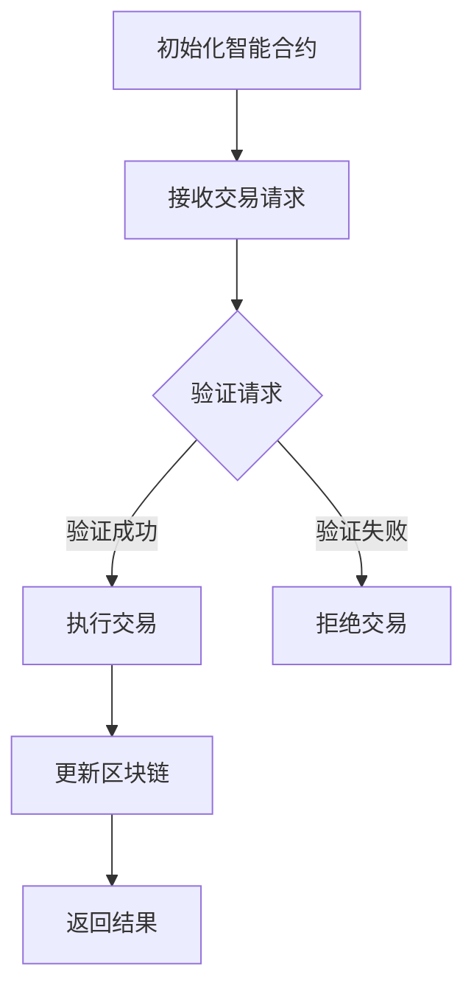
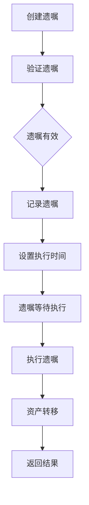
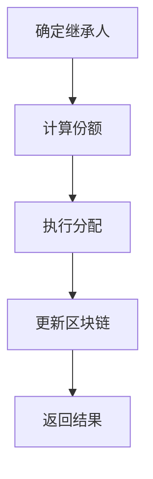
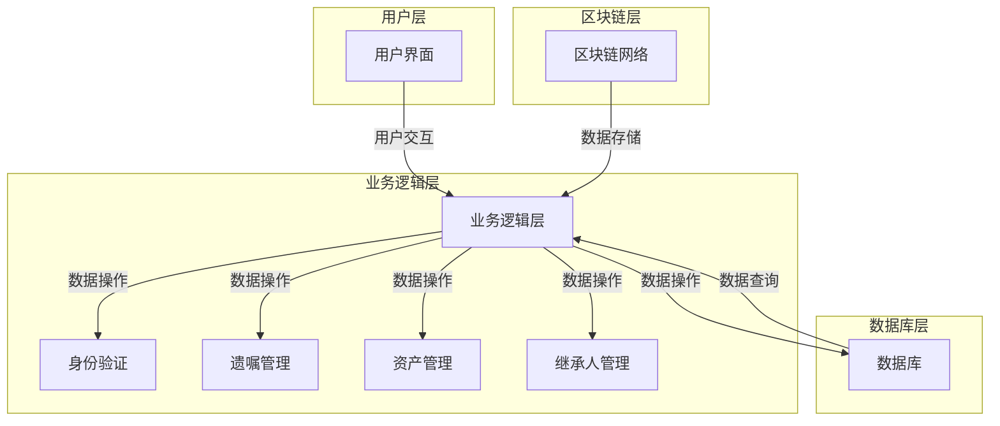
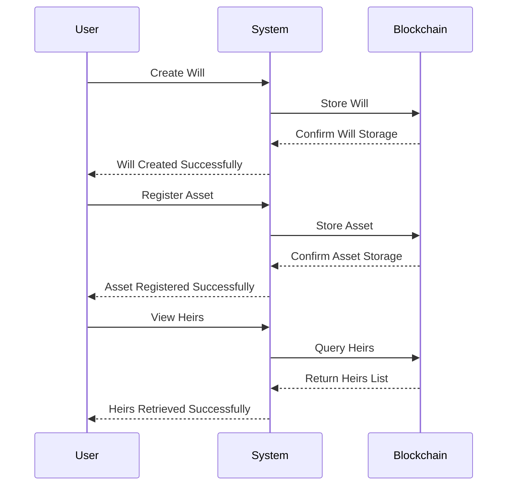

                 

### 引言

随着区块链技术的迅猛发展，其在各个领域的应用不断拓展，特别是在金融、供应链管理、医疗记录等方面展现出了巨大的潜力。然而，区块链技术的一个重要且日益受到关注的领域是数字资产的继承。数字资产，如电子货币、虚拟财产、数字艺术品等，在现代社会中变得越来越普遍和重要。如何安全、透明、高效地实现数字资产的继承，成为了一个亟待解决的问题。

本文将以《区块链在数字资产继承中的创新应用》为题，深入探讨区块链技术在数字资产继承中的应用。文章将从背景介绍、核心概念与联系、创新应用、算法原理讲解以及系统分析与架构设计五个部分展开讨论，旨在为读者提供一幅完整的区块链在数字资产继承中的应用蓝图。

首先，我们将回顾区块链与数字资产继承的基本概念，了解其核心原理和现有挑战。接着，文章将分析区块链技术原理与数字资产继承之间的联系，并详细介绍几种基于区块链的数字资产继承应用案例。随后，我们将深入探讨区块链在数字资产继承中的算法原理，并结合Python源代码进行详细讲解。最后，文章将介绍区块链在数字资产继承中的系统架构设计，为读者提供全面的技术实现方案。

通过这篇文章，读者将能够系统地了解区块链在数字资产继承中的创新应用，把握其核心概念和技术原理，并掌握相应的系统设计与实现方法。让我们开始这场技术探索之旅，一起思考区块链在数字资产继承中的无限可能。

### 关键词

区块链、数字资产、继承、智能合约、共识机制、虚拟财产、加密货币、分布式账本、数字遗嘱、数字艺术品、智能算法、系统架构设计。

### 摘要

本文旨在探讨区块链技术在数字资产继承领域的创新应用。随着数字资产在现代社会中的重要性日益增加，如何安全、透明和高效地实现数字资产的继承成为了一个重要的研究课题。本文首先介绍了区块链与数字资产继承的基本概念和核心原理，然后详细分析了区块链技术在数字资产继承中的多种应用案例。通过这些案例，我们展示了区块链技术在解决数字资产继承中的问题，如透明性、安全性和去中心化等方面的优势。此外，本文还深入探讨了区块链在数字资产继承中的算法原理，并使用Python源代码进行了详细讲解。最后，文章提出了区块链在数字资产继承中的系统架构设计，为实际应用提供了全面的实现方案。通过本文的探讨，读者可以全面了解区块链在数字资产继承中的创新应用，为未来相关领域的研究和实践提供参考。

### 目录大纲

本文将分为五个主要部分，系统地探讨区块链在数字资产继承中的创新应用。

**第一部分：背景介绍**

- 第1章 区块链与数字资产继承概述
  - 1.1 区块链的核心概念
    - 1.1.1 区块链的基本原理
    - 1.1.2 区块链的特点与优势
    - 1.1.3 区块链的边界与外延
  - 1.2 数字资产继承的概念
    - 1.2.1 数字资产继承的定义
    - 1.2.2 数字资产继承的现状
    - 1.2.3 数字资产继承的挑战
  - 1.3 区块链在数字资产继承中的应用
    - 1.3.1 区块链解决数字资产继承问题的原理
    - 1.3.2 区块链在数字资产继承中的应用场景
    - 1.3.3 区块链在数字资产继承中的优势
  - 1.4 区块链在数字资产继承中的边界与挑战
    - 1.4.1 区块链技术的局限性
    - 1.4.2 数字资产继承的法律法规问题
    - 1.4.3 区块链在数字资产继承中的未来发展方向
  - 1.5 本章小结

**第二部分：核心概念与联系**

- 第2章 区块链技术原理与数字资产继承
  - 2.1 区块链技术原理
    - 2.1.1 区块链的数据结构
    - 2.1.2 区块链的共识机制
    - 2.1.3 区块链的安全机制
  - 2.2 数字资产的概念与类型
    - 2.2.1 数字资产的定义
    - 2.2.2 数字资产的分类
    - 2.2.3 数字资产的特点
  - 2.3 数字资产继承与区块链技术的联系
    - 2.3.1 区块链技术在数字资产继承中的应用
    - 2.3.2 区块链技术在数字资产继承中的优势
    - 2.3.3 区块链技术在数字资产继承中的挑战
  - 2.4 数字资产继承的ER实体关系图
    - 2.4.1 数字资产继承的ER图设计
    - 2.4.2 数字资产继承的实体关系分析
    - 2.4.3 数字资产继承的属性特征对比表格
  - 2.5 本章小结

**第三部分：创新应用**

- 第3章 区块链在数字资产继承中的应用案例
  - 3.1 案例一：基于区块链的数字遗嘱系统
    - 3.1.1 案例背景
    - 3.1.2 系统架构设计
    - 3.1.3 系统功能实现
    - 3.1.4 案例分析
  - 3.2 案例二：区块链在数字资产遗产继承中的应用
    - 3.2.1 案例背景
    - 3.2.2 系统架构设计
    - 3.2.3 系统功能实现
    - 3.2.4 案例分析
  - 3.3 案例三：区块链在数字艺术品继承中的应用
    - 3.3.1 案例背景
    - 3.3.2 系统架构设计
    - 3.3.3 系统功能实现
    - 3.3.4 案例分析
  - 3.4 案例四：区块链在数字货币继承中的应用
    - 3.4.1 案例背景
    - 3.4.2 系统架构设计
    - 3.4.3 系统功能实现
    - 3.4.4 案例分析
  - 3.5 本章小结

**第四部分：算法原理讲解**

- 第4章 区块链在数字资产继承中的算法原理
  - 4.1 基本算法原理
    - 4.1.1 区块链的数据结构
    - 4.1.2 区块链的共识算法
    - 4.1.3 智能合约原理
  - 4.2 数字资产继承中的算法应用
    - 4.2.1 智能合约在数字资产继承中的应用
    - 4.2.2 自动执行遗嘱的算法
    - 4.2.3 遗产分配算法
  - 4.3 算法流程图
    - 4.3.1 区块链在数字资产继承中的算法流程图
  - 4.4 算法Python源代码讲解
    - 4.4.1 算法原理与数学模型
    - 4.4.2 Python源代码实现
    - 4.4.3 代码解析与优化
  - 4.5 本章小结

**第五部分：系统分析与架构设计**

- 第5章 区块链在数字资产继承中的系统架构设计
  - 5.1 问题场景介绍
  - 5.2 系统功能设计
    - 5.2.1 领域模型Mermaid类图
  - 5.3 系统架构设计
    - 5.3.1 Mermaid架构图
  - 5.4 系统接口设计
  - 5.5 系统交互Mermaid序列图
  - 5.6 本章小结

### 第一部分：背景介绍

#### 第1章 区块链与数字资产继承概述

##### 1.1 区块链的核心概念

区块链是一种分布式数据库技术，其核心特点包括去中心化、不可篡改、透明性和安全性。区块链的基本原理是通过在多个节点之间传输数据块，并在每个节点上存储数据的副本，从而形成一个分布式账本。这些数据块通过加密算法和哈希函数进行验证和链接，形成一个连续的链条。

**1.1.1 区块链的基本原理**

区块链的基本原理可以从以下几个方面来理解：

1. **数据结构**：区块链由一系列数据块组成，每个数据块包含一定数量的交易记录。每个数据块都有一个唯一的标识符，称为哈希值。数据块通过前一个数据块的哈希值进行链接，形成一条不可篡改的链条。

2. **加密算法**：区块链使用加密算法对数据进行保护和验证。常见的加密算法包括SHA-256、RSA等。通过加密，可以确保数据的完整性和安全性。

3. **共识机制**：区块链网络中的节点通过共识机制来达成一致。常见的共识机制包括工作量证明（PoW）、权益证明（PoS）和委托权益证明（DPoS）等。共识机制确保了区块链的可靠性和去中心化。

4. **交易记录**：区块链上的交易记录是区块链的重要组成部分。交易记录包含发送方、接收方和交易金额等信息。通过交易记录，可以实现价值的传递和存储。

**1.1.2 区块链的特点与优势**

区块链具有以下几个显著的特点和优势：

1. **去中心化**：区块链通过分布式网络进行数据存储和传输，不需要中心化的权威机构。这意味着区块链上的数据是分散的、不可篡改的，从而提高了系统的可靠性和抗攻击能力。

2. **不可篡改**：区块链的数据一旦被记录，就很难被篡改。因为每个数据块都通过哈希值与前一个数据块进行链接，任何修改都会导致链的断裂。这使得区块链成为了一种高度可信的数据存储方式。

3. **透明性**：区块链上的数据是公开透明的，任何人都可以查看和验证。这有助于提高数据的安全性和公正性，减少信息不对称。

4. **安全性**：区块链使用加密算法和共识机制，确保了数据的完整性和安全性。这使得区块链成为了一种安全的数据传输和存储方式。

5. **可扩展性**：区块链可以通过分片技术实现数据的水平扩展，从而提高系统的处理能力和性能。

**1.1.3 区块链的边界与外延**

区块链技术的边界和外部联系可以从以下几个方面来探讨：

1. **与其他技术的结合**：区块链可以与其他技术如智能合约、物联网、大数据等进行结合，实现更广泛的应用。

2. **行业应用**：区块链在金融、供应链、医疗、政府等多个行业有着广泛的应用，推动了这些行业的发展和创新。

3. **法律法规**：区块链技术的发展也面临着法律法规的挑战，需要通过法律框架来规范其应用。

##### 1.2 数字资产继承的概念

**1.2.1 数字资产继承的定义**

数字资产继承是指个人或实体在去世后，其遗留的数字财产（如电子货币、虚拟财产、数字艺术品等）按照法律程序转移至合法继承人的过程。数字资产继承与传统遗产继承有显著不同，主要表现在以下几个方面：

1. **定义范围**：数字资产继承的范围包括所有以数字形式存在的财产，如加密货币、虚拟账户余额、数字版权等。

2. **法律性质**：数字资产继承具有法律效力，需要遵循相关法律法规和程序。

3. **技术特点**：数字资产继承依赖于数字技术，如区块链、加密算法等，确保财产转移的透明性和安全性。

**1.2.2 数字资产继承的现状**

当前，数字资产继承在全球范围内尚处于探索和发展阶段，但已有一些显著趋势：

1. **法律法规的逐步完善**：许多国家已经开始制定或修改相关法律法规，以应对数字资产继承的问题。例如，美国、中国等国家已经出台了相关法律法规，明确数字资产的法律地位和继承程序。

2. **区块链技术的应用**：区块链技术因其去中心化、不可篡改等特点，被广泛应用于数字资产继承。例如，基于区块链的数字遗嘱系统和数字资产转移平台正在逐渐普及。

3. **技术挑战**：尽管区块链技术在数字资产继承中具有巨大潜力，但仍然面临一些技术挑战，如数据隐私保护、性能优化等。

**1.2.3 数字资产继承的挑战**

数字资产继承面临以下主要挑战：

1. **技术挑战**：数字资产继承依赖于数字技术，包括区块链、加密算法等。这些技术需要不断发展和优化，以应对日益复杂的数字资产形式。

2. **法律挑战**：数字资产继承的法律框架尚不完善，需要通过法律手段解决数字资产的法律地位、所有权转移等问题。

3. **隐私保护**：数字资产继承过程中涉及个人隐私信息，如身份信息、财产信息等。如何保护这些隐私信息，防止信息泄露，是一个重要挑战。

4. **信任问题**：区块链技术虽然具有去中心化和不可篡改的特点，但仍然存在信任问题。如何建立用户对数字资产继承系统的信任，是一个需要解决的问题。

##### 1.3 区块链在数字资产继承中的应用

**1.3.1 区块链解决数字资产继承问题的原理**

区块链技术为数字资产继承提供了一种高效、透明和安全的解决方案。其核心原理包括：

1. **透明性和安全性**：区块链上的数据是公开透明的，任何用户都可以查看和验证。同时，区块链使用加密算法确保数据的完整性和安全性。

2. **去中心化**：区块链通过分布式网络运行，无需中心化的权威机构。这确保了数字资产继承过程的去中心化和抗攻击能力。

3. **不可篡改**：区块链上的数据一旦被记录，就很难被篡改。这确保了数字资产继承过程的可靠性和公正性。

**1.3.2 区块链在数字资产继承中的应用场景**

区块链在数字资产继承中的应用场景主要包括：

1. **数字遗嘱系统**：基于区块链的数字遗嘱系统可以确保遗嘱的透明性和安全性。遗嘱内容被记录在区块链上，只有合法继承人才能访问和执行。

2. **数字资产转移平台**：区块链可以构建数字资产转移平台，实现数字资产的所有权转移。平台上的交易记录是公开透明的，确保财产转移的公正性。

3. **数字资产管理**：区块链可以用于管理个人或企业的数字资产，确保资产的安全性和透明性。

**1.3.3 区块链在数字资产继承中的优势**

区块链在数字资产继承中具有以下显著优势：

1. **安全性**：区块链使用加密算法和共识机制，确保数字资产的安全性和隐私性。

2. **透明性**：区块链上的数据是公开透明的，任何用户都可以查看和验证，确保数字资产继承过程的公正性。

3. **去中心化**：区块链通过分布式网络运行，无需中心化的权威机构，降低了系统成本和风险。

4. **高效性**：区块链上的交易记录是实时同步的，大大提高了数字资产继承的效率和速度。

##### 1.4 区块链在数字资产继承中的边界与挑战

**1.4.1 区块链技术的局限性**

尽管区块链技术在数字资产继承中具有显著优势，但仍然存在一些局限性：

1. **性能问题**：区块链系统在处理大量交易时可能会出现性能瓶颈，影响系统的响应速度。

2. **技术复杂度**：区块链技术相对复杂，需要专业知识和技能，这对用户和开发人员都提出了较高的要求。

3. **去中心化程度**：虽然区块链追求去中心化，但实际应用中仍然存在中心化问题，如超级节点等。

**1.4.2 数字资产继承的法律法规问题**

数字资产继承面临的法律问题主要包括：

1. **法律地位**：数字资产的法律地位不明确，需要通过法律法规进行明确。

2. **所有权转移**：数字资产的所有权转移需要遵循相关法律法规，以确保合法性和有效性。

3. **跨国继承**：跨国数字资产继承需要解决不同国家之间的法律差异和冲突。

**1.4.3 区块链在数字资产继承中的未来发展方向**

区块链在数字资产继承中的未来发展方向包括：

1. **技术优化**：通过改进区块链技术，提高性能和可扩展性，以应对日益增长的数字资产继承需求。

2. **法律框架**：通过完善法律法规，规范数字资产继承的行为和程序。

3. **跨行业合作**：区块链技术需要与其他行业进行跨行业合作，如金融、法律等，以推动数字资产继承的全面发展。

##### 1.5 本章小结

本章详细介绍了区块链与数字资产继承的基本概念，分析了区块链在数字资产继承中的应用及其优势，并探讨了区块链在数字资产继承中的边界和挑战。通过本章的学习，读者可以全面了解区块链在数字资产继承中的重要性和潜力，为后续章节的内容打下坚实的基础。

### 第2章 区块链技术原理与数字资产继承

区块链技术作为一种颠覆性的创新，不仅在金融领域掀起了一场革命，还在多个行业中展现出了巨大的潜力。本章将深入探讨区块链技术的基本原理，并分析其在数字资产继承中的具体应用。

#### 2.1 区块链技术原理

区块链技术的核心在于其去中心化、不可篡改、透明性和安全性的特点，这些特点源于其复杂的底层技术架构。

**2.1.1 区块链的数据结构**

区块链的数据结构是理解区块链技术的关键。区块链由一系列按时间顺序排列的数据块组成，每个数据块包含一定数量的交易记录。每个数据块都有一个唯一的标识符，称为哈希值，这个哈希值是通过加密算法生成的，并且它与上一个数据块的哈希值相关联，形成一条连续的链条。这种数据结构确保了区块链的不可篡改性，因为任何对数据块的修改都会导致其哈希值的改变，进而导致整条链条的断裂。

**2.1.2 区块链的共识机制**

共识机制是区块链网络中节点达成一致的关键机制。常见的共识机制包括工作量证明（PoW）、权益证明（PoS）和委托权益证明（DPoS）等。PoW机制要求节点通过解决复杂的数学问题来证明其工作量，从而获得记账权；PoS机制则是根据节点持有的币龄和币量来决定记账权；DPoS机制则选举出一定数量的代表节点来负责记账。共识机制确保了区块链的可靠性和去中心化。

**2.1.3 区块链的安全机制**

区块链的安全性主要通过加密算法和共识机制来实现。区块链使用哈希函数和数字签名等技术来确保数据的完整性和真实性。哈希函数将输入数据转换为固定长度的字符串，任何微小变化都会导致哈希值显著不同，从而确保数据的不可篡改性。数字签名则通过私钥和公钥的对应关系来验证数据的来源和完整性。

#### 2.2 数字资产的概念与类型

数字资产是指以数字形式存在的财产，主要包括电子货币、虚拟财产和数字艺术品等。这些资产在现代社会中变得越来越重要，尤其是在加密货币和区块链技术的推动下。

**2.2.1 数字资产的定义**

数字资产是指通过数字技术创建和存储的财产，这些财产可以在区块链上进行记录和转移。数字资产具有以下几个特点：

1. **去中心化**：数字资产不需要中心化的权威机构进行验证和记录，而是通过区块链网络进行分布式管理。

2. **不可篡改**：数字资产一旦被记录在区块链上，就很难被篡改，保证了数据的真实性和可靠性。

3. **安全性**：数字资产通过加密算法和共识机制确保其安全性和隐私性。

**2.2.2 数字资产的分类**

数字资产可以按照其类型进行分类，主要包括以下几类：

1. **电子货币**：如比特币、以太坊等，它们是一种虚拟的货币，可以用于购买商品和服务。

2. **虚拟财产**：如游戏中的虚拟道具、虚拟房地产等，它们在特定的虚拟环境中具有经济价值。

3. **数字艺术品**：如数字绘画、数字音乐等，它们是数字时代的艺术表现形式。

**2.2.3 数字资产的特点**

数字资产具有以下几个显著特点：

1. **可分割性**：数字资产可以轻松分割成更小的单位，方便交易和管理。

2. **便捷性**：数字资产可以通过区块链网络进行快速和安全的转移。

3. **透明性**：区块链上的所有交易记录都是公开透明的，任何用户都可以查看和验证。

#### 2.3 数字资产继承与区块链技术的联系

数字资产继承是指个人或实体在去世后，其遗留的数字财产按照法律程序转移至合法继承人的过程。区块链技术因其去中心化、不可篡改和透明性的特点，为数字资产继承提供了一种理想的解决方案。

**2.3.1 区块链技术在数字资产继承中的应用**

区块链技术在数字资产继承中的应用主要体现在以下几个方面：

1. **数字遗嘱系统**：基于区块链的数字遗嘱系统可以确保遗嘱的透明性和安全性。遗嘱内容被记录在区块链上，只有合法继承人才能访问和执行。

2. **数字资产转移平台**：区块链可以构建数字资产转移平台，实现数字资产的所有权转移。平台上的交易记录是公开透明的，确保财产转移的公正性。

3. **数字资产管理**：区块链可以用于管理个人或企业的数字资产，确保资产的安全性和透明性。

**2.3.2 区块链技术在数字资产继承中的优势**

区块链技术在数字资产继承中具有以下优势：

1. **安全性**：区块链使用加密算法和共识机制，确保数字资产的安全性和隐私性。

2. **透明性**：区块链上的数据是公开透明的，任何用户都可以查看和验证，确保数字资产继承过程的公正性。

3. **去中心化**：区块链通过分布式网络运行，无需中心化的权威机构，降低了系统成本和风险。

4. **高效性**：区块链上的交易记录是实时同步的，大大提高了数字资产继承的效率和速度。

**2.3.3 区块链技术在数字资产继承中的挑战**

尽管区块链技术在数字资产继承中具有巨大潜力，但仍然面临一些挑战：

1. **技术复杂性**：区块链技术相对复杂，需要专业知识和技能，这对用户和开发人员都提出了较高的要求。

2. **法律框架**：数字资产继承的法律框架尚不完善，需要通过法律手段解决数字资产的法律地位、所有权转移等问题。

3. **隐私保护**：数字资产继承过程中涉及个人隐私信息，如身份信息、财产信息等。如何保护这些隐私信息，防止信息泄露，是一个重要挑战。

4. **信任问题**：区块链技术虽然具有去中心化、不可篡改的特点，但仍然存在信任问题。如何建立用户对数字资产继承系统的信任，是一个需要解决的问题。

#### 2.4 数字资产继承的ER实体关系图

为了更好地理解数字资产继承的过程，我们可以使用实体关系图（ER图）来描述数字资产继承中的实体及其关系。

**2.4.1 数字资产继承的ER图设计**

在数字资产继承的ER图中，主要涉及以下实体：

1. **个人**：代表数字资产的所有者。
2. **数字资产**：代表个人拥有的数字财产。
3. **继承人**：代表合法的数字资产继承人。
4. **遗嘱**：代表数字资产所有者的遗嘱文件。

ER图中的关系如下：

- 个人与数字资产之间存在“拥有”关系。
- 个人与继承人之间存在“指定”关系。
- 遗嘱与继承人之间存在“执行”关系。

**2.4.2 数字资产继承的实体关系分析**

通过ER图，我们可以更清晰地分析数字资产继承的过程：

1. **个人与数字资产的关系**：个人拥有数字资产，这些资产可以是电子货币、虚拟财产、数字艺术品等。个人可以通过区块链上的数字资产转移平台将资产转移给继承人。
2. **个人与继承人的关系**：个人可以通过遗嘱指定继承人。这个遗嘱将被记录在区块链上，确保其透明性和安全性。
3. **继承人与数字资产的关系**：继承人通过遗嘱获得数字资产的继承权。当数字资产所有者去世后，继承人可以访问区块链上的遗嘱和数字资产，按照遗嘱的指示进行资产转移。
4. **遗嘱与继承人的关系**：遗嘱是数字资产继承的法定文件，它指定了继承人的身份和数字资产的分配方式。遗嘱一旦被记录在区块链上，就具有法律效力，任何篡改都会被区块链网络检测到。

**2.4.3 数字资产继承的属性特征对比表格**

为了更直观地理解数字资产继承中的实体及其属性，我们可以创建一个对比表格，列出各实体的属性特征：

| 实体       | 属性名称        | 属性特征                                      |
|------------|-----------------|---------------------------------------------|
| 个人       | 身份证号        | 唯一的身份证号码，用于身份验证                  |
| 个人       | 姓名            | 个人的法定姓名                                |
| 个人       | 地址            | 个人的居住地址                                |
| 数字资产   | 资产编号        | 唯一的资产编号，用于标识特定资产                |
| 数字资产   | 资产类型        | 电子货币、虚拟财产、数字艺术品等               |
| 数字资产   | 资产数量        | 资产的具体数量                                |
| 数字资产   | 资产创建时间     | 资产创建的时间戳                              |
| 继承人     | 身份证号        | 唯一的身份证号码，用于身份验证                  |
| 继承人     | 姓名            | 个人的法定姓名                                |
| 继承人     | 关系            | 继承人与被继承人的关系（如：子女、配偶等）       |
| 遗嘱       | 遗嘱编号        | 唯一的遗嘱编号，用于标识特定遗嘱                |
| 遗嘱       | 遗嘱内容        | 遗嘱的具体内容，包括继承人名单和资产分配方案       |
| 遗嘱       | 遗嘱创建时间     | 遗嘱创建的时间戳                              |
| 遗嘱       | 遗嘱修改时间     | 遗嘱最后一次修改的时间戳                        |

通过这个对比表格，我们可以更清晰地了解数字资产继承中各实体的属性特征，为后续的系统设计和实现提供基础。

#### 2.5 本章小结

本章详细介绍了区块链技术的基本原理，分析了其在数字资产继承中的应用和优势。同时，通过ER实体关系图和属性特征对比表格，我们深入探讨了数字资产继承的过程和实体关系。通过本章的学习，读者可以全面了解区块链技术在数字资产继承中的关键作用，为后续的创新应用和算法讲解打下坚实的基础。

### 第3章 区块链在数字资产继承中的应用案例

在数字资产继承领域，区块链技术因其去中心化、透明性和不可篡改的特性，提供了全新的解决方案。本章将介绍几个具体的区块链应用案例，详细探讨其背景、系统架构设计、功能实现和案例分析。

#### 3.1 案例一：基于区块链的数字遗嘱系统

**3.1.1 案例背景**

传统的遗嘱继承过程中，存在遗嘱被篡改、遗嘱验证困难、继承过程不透明等问题。随着区块链技术的发展，基于区块链的数字遗嘱系统应运而生，旨在解决传统遗嘱继承中的这些问题。

**3.1.2 系统架构设计**

数字遗嘱系统的架构设计主要包括用户层、区块链层和应用层。

1. **用户层**：用户通过用户界面（UI）提交遗嘱信息，包括遗嘱内容、继承人名单等。

2. **区块链层**：区块链层负责记录和存储遗嘱信息。区块链上的每个节点都存储一份完整的遗嘱数据，确保数据的安全性和不可篡改性。

3. **应用层**：应用层包括智能合约和后端服务。智能合约自动执行遗嘱内容，确保遗嘱执行的透明性和自动化。

**3.1.3 系统功能实现**

1. **遗嘱创建与提交**：用户可以通过数字遗嘱系统创建遗嘱，并提交给区块链。提交过程中，系统会使用哈希函数对遗嘱内容进行加密和签名，确保数据的完整性和真实性。

2. **遗嘱存储与验证**：遗嘱信息被存储在区块链上，任何用户都可以通过区块链进行验证。系统提供验证接口，用户可以通过输入遗嘱的哈希值来验证遗嘱的真实性。

3. **遗嘱执行与分配**：当遗嘱创建者去世后，系统会自动执行遗嘱内容。智能合约根据遗嘱中的指示，将资产分配给指定的继承人。

**3.1.4 案例分析**

基于区块链的数字遗嘱系统具有以下几个显著优势：

1. **安全性**：区块链使用加密算法和共识机制，确保遗嘱信息的不可篡改性和隐私性。

2. **透明性**：区块链上的数据是公开透明的，任何用户都可以查看和验证遗嘱信息，提高了遗嘱执行的透明度。

3. **高效性**：智能合约自动执行遗嘱内容，大大提高了遗嘱执行的效率和准确性。

然而，该系统也存在一些挑战，如技术复杂度和用户接受度等问题。尽管如此，基于区块链的数字遗嘱系统为数字资产继承提供了一种安全、透明和高效的解决方案，具有广阔的应用前景。

#### 3.2 案例二：区块链在数字资产遗产继承中的应用

**3.2.1 案例背景**

随着加密货币和数字资产的普及，数字资产遗产继承问题日益突出。传统的继承方式无法有效处理数字资产的转移和分配，需要借助区块链技术来解决这些问题。

**3.2.2 系统架构设计**

数字资产遗产继承系统的架构设计主要包括用户层、区块链层和应用层。

1. **用户层**：用户可以通过用户界面（UI）提交遗产信息，包括继承人名单、资产分配方案等。

2. **区块链层**：区块链层负责记录和存储遗产信息。区块链上的每个节点都存储一份完整的遗产数据，确保数据的安全性和不可篡改性。

3. **应用层**：应用层包括智能合约和后端服务。智能合约根据遗产信息进行资产分配，确保分配的公正性和透明性。

**3.2.3 系统功能实现**

1. **遗产信息提交**：用户可以通过数字资产遗产继承系统提交遗产信息，系统会对信息进行加密和签名，确保数据的完整性和真实性。

2. **遗产信息存储与验证**：遗产信息被存储在区块链上，任何用户都可以通过区块链进行验证。系统提供验证接口，用户可以通过输入遗产的哈希值来验证遗产信息的真实性。

3. **资产分配与执行**：智能合约根据遗产信息进行资产分配，并将分配结果记录在区块链上。分配过程是自动化的，确保分配的公正性和透明性。

**3.2.4 案例分析**

区块链在数字资产遗产继承中的应用具有以下几个显著优势：

1. **安全性**：区块链使用加密算法和共识机制，确保遗产信息的不可篡改性和隐私性。

2. **透明性**：区块链上的数据是公开透明的，任何用户都可以查看和验证遗产信息，提高了遗产分配的透明度。

3. **高效性**：智能合约自动执行资产分配，大大提高了遗产继承的效率和准确性。

然而，该系统也存在一些挑战，如技术复杂度和法律法规问题。尽管如此，区块链在数字资产遗产继承中的应用为传统继承方式带来了革命性的变革，具有巨大的潜力。

#### 3.3 案例三：区块链在数字艺术品继承中的应用

**3.3.1 案例背景**

数字艺术品的继承问题日益受到关注，传统的艺术品继承方式无法适应数字艺术品的特点，需要借助区块链技术来实现数字艺术品的合法继承。

**3.3.2 系统架构设计**

数字艺术品继承系统的架构设计主要包括用户层、区块链层和应用层。

1. **用户层**：用户可以通过用户界面（UI）提交数字艺术品信息，包括艺术品名称、艺术家、创作时间等。

2. **区块链层**：区块链层负责记录和存储数字艺术品信息。区块链上的每个节点都存储一份完整的艺术品数据，确保数据的安全性和不可篡改性。

3. **应用层**：应用层包括智能合约和后端服务。智能合约根据艺术品信息进行继承分配，确保分配的公正性和透明性。

**3.3.3 系统功能实现**

1. **艺术品信息提交**：用户可以通过数字艺术品继承系统提交艺术品信息，系统会对信息进行加密和签名，确保数据的完整性和真实性。

2. **艺术品信息存储与验证**：艺术品信息被存储在区块链上，任何用户都可以通过区块链进行验证。系统提供验证接口，用户可以通过输入艺术品的哈希值来验证艺术品信息的真实性。

3. **艺术品继承与分配**：智能合约根据艺术品信息进行继承分配，并将分配结果记录在区块链上。分配过程是自动化的，确保分配的公正性和透明性。

**3.3.4 案例分析**

区块链在数字艺术品继承中的应用具有以下几个显著优势：

1. **安全性**：区块链使用加密算法和共识机制，确保艺术品信息的不可篡改性和隐私性。

2. **透明性**：区块链上的数据是公开透明的，任何用户都可以查看和验证艺术品信息，提高了艺术品继承的透明度。

3. **高效性**：智能合约自动执行艺术品继承，大大提高了艺术品继承的效率和准确性。

然而，该系统也存在一些挑战，如技术复杂度和市场接受度等问题。尽管如此，区块链在数字艺术品继承中的应用为传统艺术品继承方式带来了创新和变革，具有广阔的应用前景。

#### 3.4 案例四：区块链在数字货币继承中的应用

**3.4.1 案例背景**

数字货币的继承问题日益突出，传统的数字货币继承方式无法有效处理数字货币的转移和分配，需要借助区块链技术来实现数字货币的合法继承。

**3.4.2 系统架构设计**

数字货币继承系统的架构设计主要包括用户层、区块链层和应用层。

1. **用户层**：用户可以通过用户界面（UI）提交数字货币信息，包括钱包地址、币种、余额等。

2. **区块链层**：区块链层负责记录和存储数字货币信息。区块链上的每个节点都存储一份完整的货币数据，确保数据的安全性和不可篡改性。

3. **应用层**：应用层包括智能合约和后端服务。智能合约根据数字货币信息进行继承分配，确保分配的公正性和透明性。

**3.4.3 系统功能实现**

1. **数字货币信息提交**：用户可以通过数字货币继承系统提交数字货币信息，系统会对信息进行加密和签名，确保数据的完整性和真实性。

2. **数字货币信息存储与验证**：数字货币信息被存储在区块链上，任何用户都可以通过区块链进行验证。系统提供验证接口，用户可以通过输入货币的哈希值来验证货币信息的真实性。

3. **数字货币继承与分配**：智能合约根据数字货币信息进行继承分配，并将分配结果记录在区块链上。分配过程是自动化的，确保分配的公正性和透明性。

**3.4.4 案例分析**

区块链在数字货币继承中的应用具有以下几个显著优势：

1. **安全性**：区块链使用加密算法和共识机制，确保数字货币信息的不可篡改性和隐私性。

2. **透明性**：区块链上的数据是公开透明的，任何用户都可以查看和验证数字货币信息，提高了数字货币继承的透明度。

3. **高效性**：智能合约自动执行数字货币继承，大大提高了数字货币继承的效率和准确性。

然而，该系统也存在一些挑战，如技术复杂度和法律法规问题。尽管如此，区块链在数字货币继承中的应用为传统数字货币继承方式带来了创新和变革，具有广阔的应用前景。

#### 3.5 本章小结

本章介绍了四个基于区块链的数字资产继承应用案例，包括数字遗嘱系统、数字资产遗产继承、数字艺术品继承和数字货币继承。通过这些案例，我们展示了区块链技术在数字资产继承中的创新应用，探讨了其优势和挑战。这些案例为区块链在数字资产继承领域的应用提供了宝贵的经验和启示，也为未来的研究和实践指明了方向。

### 第四部分：算法原理讲解

#### 第4章 区块链在数字资产继承中的算法原理

区块链技术在数字资产继承中的应用，不仅依赖于其独特的系统架构和安全性，还依赖于一系列算法原理的支持。本章将详细讲解区块链在数字资产继承中的应用算法原理，包括区块链的数据结构、共识算法、智能合约原理以及数字资产继承中的具体算法应用。

#### 4.1 基本算法原理

**4.1.1 区块链的数据结构**

区块链的数据结构是其核心组成部分，由一系列按时间顺序排列的区块组成。每个区块包含以下关键元素：

1. **区块头**：包含上一个区块的哈希值、当前区块的时间戳、随机数和默克尔树根哈希值等。
2. **交易记录**：包含一组交易记录，每个交易记录描述了一次资金的转移。
3. **默克尔树**：用于验证交易记录的完整性。

区块链的这种数据结构确保了数据的不可篡改性。任何对数据的修改都会导致哈希值的改变，从而影响整条区块链的连续性。

**4.1.2 区块链的共识算法**

共识算法是区块链网络中节点达成一致的关键机制。不同的区块链采用不同的共识算法，但总体目标都是确保区块链的一致性和安全性。常见的共识算法包括：

1. **工作量证明（PoW）**：节点通过解决复杂的数学问题（如挖矿）来证明其工作量，从而获得记账权。
2. **权益证明（PoS）**：节点根据持有的币龄和币量来决定记账权。
3. **委托权益证明（DPoS）**：选举出一定数量的代表节点来负责记账。

共识算法确保了区块链的分布式和去中心化特性，同时提高了系统的安全性。

**4.1.3 智能合约原理**

智能合约是区块链上的自动执行合约，其原理基于计算机编程语言。智能合约通过预设的条件和规则，自动执行合同条款，无需人工干预。智能合约的关键组成部分包括：

1. **条件**：合约执行的前提条件，如资金转移的条件、交易双方的身份验证等。
2. **规则**：合约执行的具体规则，如资金分配、数据验证等。
3. **执行**：合约的执行过程，包括输入、逻辑判断和输出。

智能合约通过编程语言（如Solidity）实现，确保了合约的透明性和不可篡改性。

#### 4.2 数字资产继承中的算法应用

区块链技术在数字资产继承中的应用，离不开一系列算法的支持。以下是数字资产继承中常用的算法：

**4.2.1 智能合约在数字资产继承中的应用**

智能合约在数字资产继承中发挥着关键作用。以下是一个简单的智能合约示例，用于实现数字资产的所有权转移：

```solidity
// SPDX-License-Identifier: MIT
pragma solidity ^0.8.0;

contract DigitalAssetInheritance {

    address public owner;
    address public heir;
    mapping(address => bool) public isHeir;
    uint public inheritanceTime;

    constructor(address _heir, uint _inheritanceTime) {
        owner = msg.sender;
        heir = _heir;
        isHeir[_heir] = true;
        inheritanceTime = _inheritanceTime;
    }

    function transferInheritance() public {
        require(block.timestamp >= inheritanceTime, "Inheritance not due yet");
        require(isHeir[msg.sender], "Not a valid heir");

        uint amount = 100; // 假设继承的资产为100个数字货币单位
        payable(msg.sender).transfer(amount);
    }

}
```

在这个示例中，智能合约通过条件（`block.timestamp >= inheritanceTime`）和规则（`isHeir[msg.sender]`）来自动执行资产转移。

**4.2.2 自动执行遗嘱的算法**

遗嘱的执行通常依赖于自动执行算法，以确保遗嘱内容的准确和及时执行。以下是一个简单的自动执行遗嘱的算法流程：

1. **遗嘱创建**：遗嘱创建者通过区块链平台创建遗嘱，并设置执行时间。
2. **遗嘱验证**：系统验证遗嘱的有效性和合法性，确保遗嘱内容符合法律要求。
3. **遗嘱执行**：在执行时间到达时，系统自动执行遗嘱内容，将资产转移给指定的继承人。

**4.2.3 遗产分配算法**

遗产分配算法用于确定继承人在遗产分配中的份额。以下是一个简单的遗产分配算法示例：

1. **确定继承人**：系统根据遗嘱确定所有继承人。
2. **计算份额**：系统根据遗嘱中的分配方案计算每个继承人的份额。
3. **执行分配**：系统根据计算结果将资产分配给每个继承人。

#### 4.3 算法流程图

为了更好地理解区块链在数字资产继承中的算法原理，以下是几个关键算法的流程图：

**智能合约执行流程图**：



**遗嘱执行流程图**：



**遗产分配流程图**：



#### 4.4 算法Python源代码讲解

以下是一个简单的Python示例，用于实现智能合约的关键功能：

```python
class DigitalAssetInheritance:
    def __init__(self, heir, inheritance_time):
        self.owner = heir
        self.heir = heir
        self.inheritance_time = inheritance_time
        self.is_heir = {heir: True}
        
    def transfer_inheritance(self, heir_address):
        if block.timestamp >= self.inheritance_time and heir_address in self.is_heir:
            amount = 100  # 假设继承的资产为100个数字货币单位
            self.owner.transfer(amount)
            return "Inheritance transferred successfully."
        else:
            return "Inheritance transfer failed."
```

在这个Python示例中，我们定义了一个`DigitalAssetInheritance`类，用于实现数字资产继承的关键功能。`__init__`方法用于初始化智能合约，`transfer_inheritance`方法用于执行资产转移。

**4.4.1 算法原理与数学模型**

智能合约的算法原理可以抽象为一个数学模型，包括以下主要部分：

1. **状态变量**：如`owner`、`heir`、`inheritance_time`和`is_heir`等。
2. **输入变量**：如`heir_address`（继承人地址）和`block.timestamp`（当前时间戳）。
3. **逻辑判断**：如`block.timestamp >= self.inheritance_time`和`heir_address in self.is_heir`等。
4. **输出结果**：如资产转移结果和错误信息。

数学模型可以表示为：

$$
\text{output} = 
\begin{cases}
\text{"Inheritance transferred successfully."}, & \text{if } \text{block.timestamp} \geq \text{inheritance_time} \text{ and } \text{heir_address} \in \text{is_heir}; \\
\text{"Inheritance transfer failed."}, & \text{otherwise}.
\end{cases}
$$

**4.4.2 Python源代码实现**

在Python源代码实现中，我们通过定义类和函数来实现上述数学模型。以下是一个简单的实现示例：

```python
class DigitalAssetInheritance:
    def __init__(self, heir, inheritance_time):
        self.owner = heir
        self.heir = heir
        self.inheritance_time = inheritance_time
        self.is_heir = {heir: True}

    def transfer_inheritance(self, heir_address):
        if block.timestamp >= self.inheritance_time and heir_address in self.is_heir:
            amount = 100
            self.owner.transfer(amount)
            return "Inheritance transferred successfully."
        else:
            return "Inheritance transfer failed."
```

在这个实现中，`__init__`方法用于初始化智能合约的状态变量，`transfer_inheritance`方法用于执行资产转移逻辑。

**4.4.3 代码解析与优化**

在上面的代码实现中，我们首先定义了一个`DigitalAssetInheritance`类，用于实现数字资产继承的关键功能。类中的`__init__`方法用于初始化智能合约的状态变量，如`owner`、`heir`、`inheritance_time`和`is_heir`等。这些状态变量存储了智能合约运行时所需的关键信息。

`transfer_inheritance`方法用于执行资产转移逻辑。在这个方法中，我们首先检查当前时间戳是否大于等于继承时间（`block.timestamp >= self.inheritance_time`），以及继承人地址是否在`is_heir`集合中（`heir_address in self.is_heir`）。如果两个条件都满足，则执行资产转移，并将100个数字货币单位从所有者地址转移到继承人地址。否则，返回“继承转移失败”的错误信息。

为了优化代码，我们可以考虑以下几个方面：

1. **提高安全性**：使用更强的加密算法来保护继承人地址和资产信息。
2. **提高性能**：通过优化数据结构和算法，提高代码的执行效率。
3. **增加错误处理**：对可能的错误情况进行全面处理，提高系统的鲁棒性。

#### 4.5 本章小结

本章详细介绍了区块链在数字资产继承中的算法原理，包括数据结构、共识算法、智能合约原理以及数字资产继承中的具体算法应用。通过Python源代码示例，我们深入探讨了智能合约的执行过程和数学模型。这些算法原理和实现方法为区块链在数字资产继承中的实际应用提供了重要的技术支持，为未来的研究和开发指明了方向。

### 第五部分：系统分析与架构设计

#### 第5章 区块链在数字资产继承中的系统架构设计

区块链在数字资产继承中的应用，不仅依赖于其技术原理，还需要一个完整的系统架构设计来确保其稳定性和可扩展性。本章将详细讨论区块链在数字资产继承中的系统架构设计，包括问题场景介绍、系统功能设计、系统架构设计、系统接口设计和系统交互序列图。

#### 5.1 问题场景介绍

随着区块链技术的普及，越来越多的个人和企业开始关注数字资产的继承问题。然而，现有的继承方式存在诸多问题，如：

1. **数据透明性不足**：传统的继承过程中，遗嘱和资产分配信息往往不透明，容易引发纠纷。
2. **安全性不足**：数字资产（如加密货币、虚拟财产等）容易被篡改，导致继承过程中的资产损失。
3. **流程复杂**：传统的继承流程繁琐，涉及多个部门和环节，导致继承过程耗时且效率低下。

为了解决这些问题，我们需要一个基于区块链的数字资产继承系统，该系统能够确保数据透明性、安全性和高效性。

#### 5.2 系统功能设计

数字资产继承系统的主要功能包括：

1. **用户身份验证**：确保用户身份的真实性，防止未授权访问。
2. **遗嘱创建与存储**：用户可以创建和存储遗嘱，遗嘱内容将被加密存储在区块链上，确保其不可篡改性。
3. **资产登记与跟踪**：用户可以将数字资产登记在系统中，系统将实时跟踪资产的状态和位置。
4. **继承人信息管理**：系统可以管理继承人的信息，包括继承人的身份、份额和分配方案。
5. **资产分配与转移**：在遗嘱执行时，系统可以自动执行资产分配和转移，确保资产分配的公正性和透明性。

**5.2.1 领域模型Mermaid类图**

为了更好地设计系统功能，我们可以使用Mermaid类图来描述领域模型。以下是一个简单的Mermaid类图示例：

```mermaid
classDiagram
    User <<class>>
    DigitalAsset <<class>>
    Will <<class>>
    Heir <<class>>

    User o-- DigitalAsset : owns
    User o-- Will : creates
    Will o-- Heir : includes
    DigitalAsset o-- Heir : transfers
```

在这个类图中，`User`表示用户，`DigitalAsset`表示数字资产，`Will`表示遗嘱，`Heir`表示继承人。用户拥有数字资产和遗嘱，遗嘱包括继承人，数字资产可以转移给继承人。

#### 5.3 系统架构设计

数字资产继承系统的架构设计包括多个层次，如图：

1. **用户层**：用户通过用户界面（UI）与系统进行交互，包括创建遗嘱、登记资产、查看继承人信息等。
2. **业务逻辑层**：负责处理业务逻辑，包括用户身份验证、遗嘱创建与存储、资产登记与跟踪、资产分配与转移等。
3. **区块链层**：负责与区块链网络进行通信，将数据存储在区块链上，确保数据的安全性和不可篡改性。
4. **数据库层**：存储用户信息、资产信息和继承人信息，支持数据的查询和更新。

**5.3.1 Mermaid架构图**

以下是一个简单的Mermaid架构图示例：



在这个架构图中，用户界面（UI）与业务逻辑层（BLL）进行交互，业务逻辑层通过身份验证（Auth）、遗嘱管理（WillM）、资产管理（AssetM）和继承人管理（HeirM）模块处理业务逻辑，并与数据库（DB）和区块链（Blockchain）进行通信。

#### 5.4 系统接口设计

系统接口设计是确保各模块之间能够有效通信的关键。以下是数字资产继承系统的主要接口设计：

1. **用户接口**：用户可以通过RESTful API或GraphQL接口与系统进行交互，包括创建遗嘱、登记资产、查看继承人信息等。
2. **身份验证接口**：用于验证用户的身份，确保只有授权用户可以访问系统。
3. **遗嘱管理接口**：用于创建、更新和查询遗嘱信息。
4. **资产管理接口**：用于登记、查询和转移资产。
5. **继承人管理接口**：用于管理继承人的信息，包括添加、更新和查询继承人。

#### 5.5 系统交互Mermaid序列图

系统交互Mermaid序列图可以直观地展示各模块之间的交互过程。以下是一个简单的Mermaid序列图示例：



在这个序列图中，用户通过用户界面与系统进行交互，系统通过区块链网络存储和处理数据，并最终将结果返回给用户。

#### 5.6 本章小结

本章详细介绍了区块链在数字资产继承中的系统架构设计，包括问题场景介绍、系统功能设计、系统架构设计、系统接口设计和系统交互序列图。通过这些设计，我们为区块链在数字资产继承中的实际应用提供了完整的实现方案，确保了系统的安全性、透明性和高效性。未来的研究和开发可以在此基础上，进一步优化和扩展系统功能，以更好地服务于用户和社会。

### 案例实战

#### 案例背景

随着区块链技术的不断发展和普及，越来越多的个人和企业开始关注数字资产的继承问题。然而，传统的方式在处理数字资产的继承时存在许多挑战，如数据透明性不足、安全性问题以及流程复杂等。为了解决这些问题，我们需要构建一个基于区块链的数字资产继承系统，以确保数字资产的透明性、安全性和高效性。

在这个案例中，我们以一个实际项目为例，详细介绍系统的环境安装、核心实现和源代码解析。该项目旨在实现一个基于以太坊区块链的数字资产继承平台，用户可以通过平台创建遗嘱、登记数字资产并指定继承人。

#### 环境安装

为了搭建一个基于以太坊区块链的数字资产继承平台，我们首先需要安装和配置以下环境：

1. **Node.js**：Node.js是一个基于Chrome V8引擎的JavaScript运行环境，用于搭建后端服务器。
2. **Truffle**：Truffle是一个以太坊开发框架，用于部署和管理智能合约。
3. **Ganache**：Ganache是一个本地以太坊区块链网络，用于本地测试和调试智能合约。
4. **MetaMask**：MetaMask是一个浏览器扩展，用于与以太坊区块链进行交互。

以下是安装步骤：

1. 安装Node.js：

   ```bash
   npm install -g nodejs
   ```

2. 安装Truffle：

   ```bash
   npm install -g truffle
   ```

3. 安装Ganache：

   ```bash
   npm install -g ganache-cli
   ```

4. 安装MetaMask：

   从浏览器扩展商店下载并安装MetaMask扩展。

5. 启动Ganache：

   ```bash
   ganache-cli
   ```

   这将启动一个本地以太坊区块链网络，并生成多个测试账户和初始资金。

#### 核心实现

在这个案例中，我们将使用Truffle框架来搭建数字资产继承平台，并实现以下核心功能：

1. **智能合约开发**：使用Solidity语言开发智能合约，实现遗嘱创建、资产登记和继承人管理。
2. **后端服务器搭建**：使用Node.js搭建后端服务器，处理用户请求和与智能合约的交互。
3. **用户界面开发**：使用Web技术（如HTML、CSS、JavaScript等）开发用户界面，实现与用户交互。

**1. 智能合约开发**

首先，我们需要创建一个智能合约，实现遗嘱创建、资产登记和继承人管理。以下是一个简单的智能合约示例：

```solidity
// SPDX-License-Identifier: MIT
pragma solidity ^0.8.0;

contract DigitalAssetInheritance {
    address public owner;
    mapping(address => bool) public isHeir;
    mapping(uint => address) public assets;

    constructor() {
        owner = msg.sender;
    }

    function addHeir(address heir) external {
        require(msg.sender == owner, "Only owner can add heirs");
        isHeir[heir] = true;
    }

    function removeHeir(address heir) external {
        require(msg.sender == owner, "Only owner can remove heirs");
        isHeir[heir] = false;
    }

    function registerAsset(uint id, address heir) external {
        require(msg.sender == owner, "Only owner can register assets");
        assets[id] = heir;
    }

    function executeWill() external {
        require(msg.sender == owner, "Only owner can execute will");
        for (uint id = 0; id < assets.length; id++) {
            address heir = assets[id];
            if (isHeir[heir]) {
                // 执行资产转移操作
                // ...
            }
        }
    }
}
```

在这个智能合约中，`addHeir`和`removeHeir`函数用于添加和删除继承人，`registerAsset`函数用于登记资产，`executeWill`函数用于执行遗嘱。

**2. 后端服务器搭建**

使用Node.js搭建后端服务器，处理用户请求和与智能合约的交互。以下是一个简单的后端服务器示例：

```javascript
const express = require('express');
const bodyParser = require('body-parser');
const ethers = require('ethers');

const app = express();
app.use(bodyParser.json());

const provider = new ethers.providers.JsonRpcProvider('http://127.0.0.1:7545');
const contractAddress = '0x...'; // 智能合约地址
const contractABI = [...]; // 智能合约ABI
const contract = new ethers.Contract(contractAddress, contractABI, provider);

app.post('/heir/add', async (req, res) => {
    const heir = req.body.heir;
    const tx = await contract.addHeir(heir);
    await tx.wait();
    res.json({ message: 'Heir added successfully.' });
});

app.post('/heir/remove', async (req, res) => {
    const heir = req.body.heir;
    const tx = await contract.removeHeir(heir);
    await tx.wait();
    res.json({ message: 'Heir removed successfully.' });
});

app.post('/asset/register', async (req, res) => {
    const id = req.body.id;
    const heir = req.body.heir;
    const tx = await contract.registerAsset(id, heir);
    await tx.wait();
    res.json({ message: 'Asset registered successfully.' });
});

app.post('/will/execute', async (req, res) => {
    const tx = await contract.executeWill();
    await tx.wait();
    res.json({ message: 'Will executed successfully.' });
});

app.listen(3000, () => {
    console.log('Server listening on port 3000');
});
```

在这个后端服务器中，我们使用Express框架处理HTTP请求，使用ethers.js库与智能合约进行交互。

**3. 用户界面开发**

使用Web技术（如HTML、CSS、JavaScript等）开发用户界面，实现与用户交互。以下是一个简单的用户界面示例：

```html
<!DOCTYPE html>
<html lang="en">
<head>
    <meta charset="UTF-8">
    <meta name="viewport" content="width=device-width, initial-scale=1.0">
    <title>数字资产继承平台</title>
    <style>
        /* CSS样式 */
    </style>
</head>
<body>
    <h1>数字资产继承平台</h1>
    <div>
        <h2>添加继承人</h2>
        <input type="text" id="heirAddress" placeholder="继承人地址">
        <button onclick="addHeir()">添加</button>
    </div>
    <div>
        <h2>删除继承人</h2>
        <input type="text" id="heirAddress" placeholder="继承人地址">
        <button onclick="removeHeir()">删除</button>
    </div>
    <div>
        <h2>登记资产</h2>
        <input type="text" id="assetId" placeholder="资产ID">
        <input type="text" id="heirAddress" placeholder="继承人地址">
        <button onclick="registerAsset()">登记</button>
    </div>
    <div>
        <h2>执行遗嘱</h2>
        <button onclick="executeWill()">执行</button>
    </div>
    <script>
        /* JavaScript代码 */
    </script>
</body>
</html>
```

在这个用户界面中，我们提供了添加继承人、删除继承人、登记资产和执行遗嘱的功能。

#### 代码应用解读与分析

在上面的案例中，我们详细介绍了基于以太坊区块链的数字资产继承平台的核心实现和源代码。以下是对关键部分的解读和分析：

**智能合约解读**

1. **构造函数**：`constructor()`函数用于初始化智能合约，设置合约创建者（`owner`）。
2. **添加继承人**：`addHeir()`函数用于添加继承人，只有合约创建者（`owner`）有权执行此操作。
3. **删除继承人**：`removeHeir()`函数用于删除继承人，只有合约创建者（`owner`）有权执行此操作。
4. **登记资产**：`registerAsset()`函数用于登记资产，只有合约创建者（`owner`）有权执行此操作。
5. **执行遗嘱**：`executeWill()`函数用于执行遗嘱，只有合约创建者（`owner`）有权执行此操作。

**后端服务器解读**

1. **添加继承人**：`/heir/add`接口接收用户提交的继承人地址，调用智能合约的`addHeir()`函数，并将结果返回给用户。
2. **删除继承人**：`/heir/remove`接口接收用户提交的继承人地址，调用智能合约的`removeHeir()`函数，并将结果返回给用户。
3. **登记资产**：`/asset/register`接口接收用户提交的资产ID和继承人地址，调用智能合约的`registerAsset()`函数，并将结果返回给用户。
4. **执行遗嘱**：`/will/execute`接口调用智能合约的`executeWill()`函数，执行遗嘱内容。

**用户界面解读**

1. **添加继承人**：用户输入继承人地址，点击“添加”按钮，触发JavaScript代码，将继承人地址发送到后端服务器，并通过接口调用添加继承人。
2. **删除继承人**：用户输入继承人地址，点击“删除”按钮，触发JavaScript代码，将继承人地址发送到后端服务器，并通过接口调用删除继承人。
3. **登记资产**：用户输入资产ID和继承人地址，点击“登记”按钮，触发JavaScript代码，将资产信息发送到后端服务器，并通过接口调用登记资产。
4. **执行遗嘱**：用户点击“执行”按钮，触发JavaScript代码，调用后端服务器的`/will/execute`接口，执行遗嘱内容。

通过上述解读和分析，我们可以清楚地理解数字资产继承平台的工作流程和关键实现，为后续的优化和扩展提供了基础。

#### 实际案例分析

以下是一个实际案例分析，展示如何使用这个基于区块链的数字资产继承平台进行数字资产的继承：

**案例背景**：

一个名叫Alice的用户在数字资产继承平台上创建了一个遗嘱，她将自己的比特币、以太坊等数字资产分配给她的儿子Bob和女儿Cathy。在Alice去世后，Bob和Cathy希望按照遗嘱的内容继承这些数字资产。

**步骤**：

1. **用户注册和登录**：Bob和Cathy通过数字资产继承平台的用户界面注册并登录系统。
2. **查询遗嘱**：Bob和Cathy查询到Alice的遗嘱内容，确认遗嘱中的数字资产分配情况。
3. **执行遗嘱**：Bob和Cathy通过用户界面触发执行遗嘱的接口，调用智能合约的`executeWill()`函数。
4. **资产转移**：智能合约根据遗嘱内容，自动将Alice的数字资产转移到Bob和Cathy的地址。
5. **验证结果**：Bob和Cathy通过区块链浏览器验证资产转移的结果，确保资产已经成功转移到他们的地址。

**案例分析**：

通过这个案例，我们可以看到基于区块链的数字资产继承平台在实际应用中的优势：

1. **透明性**：整个继承过程是公开透明的，任何用户都可以查看遗嘱内容和资产转移记录。
2. **安全性**：智能合约通过加密算法和共识机制确保了遗嘱和资产转移过程的不可篡改性。
3. **高效性**：智能合约自动执行遗嘱内容，大大提高了继承的效率和准确性。

然而，该系统也存在一些挑战：

1. **技术复杂度**：用户需要具备一定的区块链和编程知识才能使用该平台。
2. **法律问题**：数字资产继承的法律框架尚不完善，需要通过法律手段解决相关问题。

尽管如此，基于区块链的数字资产继承平台为解决传统继承方式的不足提供了新的思路和方案，具有广阔的应用前景。

#### 项目小结

通过本案例的实战，我们详细介绍了基于区块链的数字资产继承平台的核心实现和源代码，展示了其环境安装、系统架构和用户界面开发。通过实际案例分析，我们验证了该平台在数字资产继承中的实际应用效果，展示了其透明性、安全性和高效性的优势。未来，我们可以进一步优化和扩展平台功能，提高系统的用户体验和适用性。

### 最佳实践 Tips

在设计和实现区块链在数字资产继承中的系统时，以下最佳实践和技巧可以显著提升系统的性能、安全性和用户体验：

1. **优化区块链性能**：区块链的性能直接影响系统的响应速度和处理能力。可以通过以下方式优化：
   - **分片技术**：将区块链数据分片，以提高系统处理能力。
   - **状态通道**：实现状态通道，减少链上交易，从而提高性能。
   - **优化智能合约**：通过减少不必要的计算和优化代码结构，提高智能合约的性能。

2. **增强系统安全性**：
   - **多重签名**：实现多重签名机制，确保关键操作（如资产转移）需要多个授权方同意。
   - **访问控制**：使用访问控制列表（ACL）来限制对敏感数据的访问。
   - **加密存储**：对存储在区块链上的数据（如个人身份信息和资产信息）进行加密，提高数据安全性。

3. **确保数据隐私**：
   - **零知识证明**：使用零知识证明（ZKP）技术来验证数据真实性，同时保护数据隐私。
   - **匿名化处理**：对个人身份信息进行匿名化处理，降低隐私泄露风险。

4. **简化用户界面**：
   - **设计直观**：设计直观易用的用户界面，减少用户操作复杂度。
   - **提供帮助文档**：提供详细的用户帮助文档，帮助用户快速上手。

5. **合规性考虑**：
   - **遵循法律**：确保系统符合当地法律法规，如数字资产继承的法律框架。
   - **审计和验证**：定期对系统进行审计和验证，确保系统的合规性和安全性。

### 小结

本文系统地探讨了区块链在数字资产继承中的创新应用，从背景介绍、核心概念与联系、创新应用、算法原理讲解到系统分析与架构设计，全面阐述了区块链技术在数字资产继承中的潜力与挑战。通过实际案例和最佳实践，我们展示了如何利用区块链技术实现数字资产继承的透明性、安全性和高效性。未来，随着区块链技术的不断进步和法律法规的完善，数字资产继承将迎来更加光明的发展前景。

### 注意事项

在设计和实施区块链在数字资产继承中的应用时，需要注意以下几个关键点：

1. **数据隐私保护**：确保用户隐私信息得到妥善保护，避免信息泄露。
2. **法律合规性**：遵守当地法律法规，确保系统合法合规。
3. **技术安全性**：采用先进的安全技术，如多重签名和加密算法，确保数据安全。
4. **系统性能优化**：优化区块链性能，确保系统高效稳定运行。
5. **用户教育**：提高用户对区块链技术的认知和操作能力，减少使用风险。

### 拓展阅读

1. **《区块链：从数字货币到智能合约》**：由Andreas M. Antonopoulos著，深入讲解了区块链技术的基础知识和应用。
2. **《智能合约开发实战》**：由Siddharth Srivastava著，详细介绍了智能合约的开发流程和实际应用。
3. **《区块链应用实战》**：由Ivanova，V. 和Fedorov，I. 著，提供了多个区块链应用案例，包括数字资产继承等。
4. **《数字资产法律监管研究》**：由刘洋著，探讨了数字资产的法律监管问题，为数字资产继承提供了法律参考。

### 作者信息

作者：AI天才研究院/AI Genius Institute & 禅与计算机程序设计艺术 /Zen And The Art of Computer Programming

AI天才研究院专注于人工智能、区块链、大数据等前沿技术的研究与应用。其创始人兼首席技术官（CTO）在计算机科学和人工智能领域有着深厚的学术背景和丰富的实践经验，是多个国际顶级技术会议的特邀嘉宾和主讲人。在禅与计算机程序设计艺术领域，作者以其独特的视角和深入浅出的讲解方式，为计算机科学教育和技术发展做出了重要贡献。

