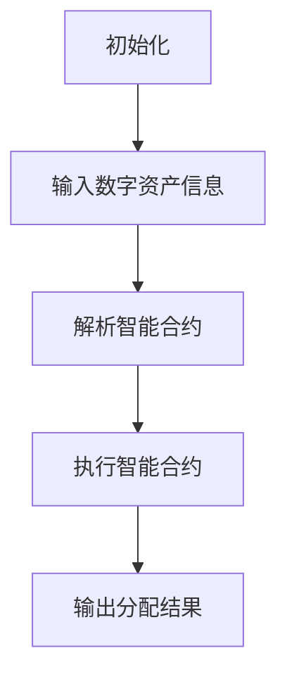

                 

# 区块链在数字资产继承中的应用：智能遗产分配系统

## 关键词

- 区块链
- 数字资产
- 继承
- 智能合约
- 智能遗产分配系统
- 安全性
- 去中心化

## 摘要

随着数字经济的蓬勃发展，数字资产如加密货币、虚拟资产等在个人财富中所占比例日益增加。然而，传统数字资产继承方式存在诸多问题和风险。本文将探讨如何利用区块链技术构建智能遗产分配系统，以实现数字资产的合法、透明和高效继承。通过对区块链、数字资产和智能合约等核心概念的详细解读，结合实际算法原理讲解，本文旨在为读者提供一种全新的数字资产继承解决方案，为相关领域的实践和应用提供有益的参考。

## 第一部分：背景介绍

### 1.1 问题背景

#### 1.1.1 数字资产继承的挑战

随着数字经济的发展，个人财富逐渐向数字资产转移。数字资产包括但不限于加密货币、虚拟货币、游戏道具、版权资产等，这些资产的价值随着市场波动而变化，且具有高度的流通性和易转移性。然而，传统数字资产继承方式面临诸多挑战：

1. **手续复杂**：数字资产通常存储在在线钱包或区块链平台上，继承人需要通过复杂的身份验证和资产转移手续才能继承数字资产。
2. **风险较高**：传统继承过程中，数字资产可能因信息泄露、欺诈等原因导致损失。
3. **缺乏透明性**：传统继承方式缺乏透明性，可能存在资产遗漏、不公平分配等问题。

#### 1.1.2 区块链技术的优势

区块链技术作为一种分布式账本技术，具有去中心化、不可篡改、透明性高等特点，为解决数字资产继承问题提供了新的思路：

1. **去中心化**：区块链无需中心化机构，所有参与者均可参与验证和记账，提高了系统的透明度和安全性。
2. **不可篡改**：区块链上的数据一旦记录即不可篡改，确保了数字资产继承过程的合法性和安全性。
3. **透明性**：区块链上的所有交易记录都是公开透明的，有助于监督和审计，减少欺诈和纠纷。

#### 1.1.3 智能遗产分配系统的必要性

智能遗产分配系统结合区块链技术和智能合约，旨在解决数字资产继承中的复杂性和风险问题，提供一种安全、透明、高效的继承方式。智能遗产分配系统的必要性体现在以下几个方面：

1. **简化手续**：智能遗产分配系统通过智能合约自动执行资产转移，简化了传统继承手续。
2. **降低风险**：智能合约确保了数字资产继承过程的合法性和安全性，降低了信息泄露和欺诈的风险。
3. **提高透明度**：区块链上的交易记录公开透明，有助于监督和审计，减少了不公平分配和纠纷。

### 1.2 问题描述

#### 1.2.1 数字资产继承的流程

数字资产继承通常包括以下几个步骤：

1. **遗嘱制定**：遗嘱人通过遗嘱明确指定继承人及其继承份额。
2. **身份验证**：继承人通过身份验证确认身份，以便获取数字资产。
3. **资产转移**：数字资产从遗嘱人的在线钱包转移到继承人的在线钱包。
4. **税务处理**：根据当地法律法规，对数字资产继承进行税务处理。

#### 1.2.2 传统继承方式的问题

传统数字资产继承方式存在以下问题：

1. **手续复杂**：继承过程中涉及多个步骤和多个机构，增加了时间和成本。
2. **风险较高**：信息泄露、欺诈等风险较高，可能造成资产损失。
3. **透明度不足**：继承过程缺乏透明度，可能导致资产遗漏或不公平分配。

#### 1.2.3 区块链在数字资产继承中的应用

区块链在数字资产继承中的应用主要体现在以下几个方面：

1. **简化流程**：通过智能合约自动执行资产转移，简化了传统继承流程。
2. **提高安全性**：区块链的不可篡改性和安全性确保了数字资产继承的安全性和合法性。
3. **提升透明度**：区块链上的交易记录公开透明，有助于监督和审计，减少了不公平分配和纠纷。

### 1.3 问题解决

#### 1.3.1 智能遗产分配系统的目标

智能遗产分配系统的目标是通过区块链技术和智能合约，实现数字资产的合法、透明和高效继承，具体目标包括：

1. **简化流程**：通过智能合约自动执行资产转移，简化传统继承流程。
2. **提高安全性**：利用区块链的不可篡改性和安全性，降低数字资产继承的风险。
3. **提升透明度**：通过区块链上的公开透明交易记录，提高继承过程的透明度。

#### 1.3.2 智能遗产分配系统的核心功能

智能遗产分配系统的核心功能包括：

1. **智能合约**：定义继承人和继承份额，自动执行资产转移。
2. **身份验证**：验证继承人的身份，确保合法继承。
3. **资产登记**：登记数字资产信息，确保资产的可追溯性。
4. **税务处理**：根据当地法律法规，处理数字资产继承的税务问题。

#### 1.3.3 智能遗产分配系统的优势

智能遗产分配系统的优势包括：

1. **简化流程**：通过智能合约自动执行资产转移，简化传统继承流程。
2. **提高安全性**：利用区块链的不可篡改性和安全性，降低数字资产继承的风险。
3. **提升透明度**：通过区块链上的公开透明交易记录，提高继承过程的透明度。

### 1.4 边界与外延

#### 1.4.1 系统的适用范围

智能遗产分配系统适用于以下场景：

1. **加密货币**：如比特币、以太坊等加密货币的继承。
2. **虚拟资产**：如虚拟货币、游戏道具等虚拟资产的继承。
3. **数字版权**：如数字版权、虚拟资产等数字资产的继承。

#### 1.4.2 系统的技术门槛

智能遗产分配系统对技术的要求较高，包括：

1. **区块链技术**：掌握区块链的基本原理和开发技能。
2. **智能合约**：熟悉智能合约的开发和执行。
3. **身份验证**：了解身份验证的技术和流程。

#### 1.4.3 系统的安全保障

智能遗产分配系统的安全保障措施包括：

1. **区块链安全性**：利用区块链的不可篡改性和安全性，确保数据的安全。
2. **身份验证**：通过多重身份验证，确保继承人的身份真实可靠。
3. **智能合约审核**：对智能合约进行严格审核，确保其安全性和可靠性。

### 1.5 概念结构与核心要素组成

#### 1.5.1 区块链的核心概念

区块链是一种分布式账本技术，具有去中心化、不可篡改、透明性高等特点。区块链的核心概念包括：

1. **区块**：区块链的基本单元，包含一定数量的交易记录。
2. **链**：由多个区块按时间顺序链接而成，形成区块链。
3. **挖矿**：节点通过计算生成新的区块，并获得区块链上的奖励。

#### 1.5.2 数字资产的概念

数字资产是指以数字形式存在的、具有经济价值的资产，包括：

1. **加密货币**：如比特币、以太坊等。
2. **虚拟资产**：如虚拟货币、游戏道具等。
3. **数字版权**：如数字版权、虚拟资产等。

#### 1.5.3 智能遗产分配系统的组成部分

智能遗产分配系统包括以下几个组成部分：

1. **区块链平台**：提供区块链基础设施和智能合约执行环境。
2. **智能合约**：定义继承人和继承份额，自动执行资产转移。
3. **身份验证系统**：验证继承人的身份，确保合法继承。
4. **资产登记系统**：登记数字资产信息，确保资产的可追溯性。
5. **税务处理系统**：处理数字资产继承的税务问题。

### 1.6 本章小结

本文介绍了数字资产继承的挑战和区块链技术的优势，探讨了智能遗产分配系统的必要性及其核心功能。通过分析系统的适用范围、技术门槛和安全保障，本文为智能遗产分配系统提供了一个全面的背景介绍。在后续章节中，将深入探讨区块链、数字资产和智能合约等核心概念，并详细讲解智能遗产分配算法的原理和应用。

## 第二部分：核心概念与联系

### 2.1 区块链的概念与原理

#### 2.1.1 区块链的定义

区块链是一种分布式账本技术，通过密码学确保数据的不可篡改性和透明性。区块链由多个按时间顺序排列的区块组成，每个区块包含一定数量的交易记录。区块链的核心特点包括：

1. **去中心化**：区块链无需中心化机构，所有参与者均可参与验证和记账。
2. **不可篡改**：区块链上的数据一旦记录即不可篡改，确保数据的可靠性和安全性。
3. **透明性**：区块链上的所有交易记录都是公开透明的，便于监督和审计。

#### 2.1.2 区块链的工作原理

区块链的工作原理包括以下几个关键步骤：

1. **交易记录**：参与者发起交易，交易记录包含发送方、接收方和交易金额等信息。
2. **区块生成**：节点通过计算生成新的区块，并将交易记录写入区块。
3. **区块验证**：区块链网络中的其他节点验证新产生的区块，确保其合法性和正确性。
4. **区块链接**：验证通过的区块将被链接到区块链上，形成一条完整的区块链。

#### 2.1.3 区块链的核心特点

区块链的核心特点包括：

1. **去中心化**：区块链无需中心化机构，所有参与者均可参与验证和记账，提高了系统的透明度和安全性。
2. **不可篡改**：区块链上的数据一旦记录即不可篡改，确保了数据的可靠性和安全性。
3. **透明性**：区块链上的所有交易记录都是公开透明的，有助于监督和审计，减少了欺诈和纠纷。

### 2.2 数字资产的概念与分类

#### 2.2.1 数字资产的定义

数字资产是指以数字形式存在的、具有经济价值的资产，包括：

1. **加密货币**：如比特币、以太坊等。
2. **虚拟资产**：如虚拟货币、游戏道具等。
3. **数字版权**：如数字版权、虚拟资产等。

数字资产具有以下几个特点：

1. **电子化**：数字资产以电子形式存在，无需物理介质。
2. **可流通**：数字资产可以在区块链上进行快速转移和交易。
3. **价值存储**：数字资产具有一定的价值，可以用于投资、交易和存储。

#### 2.2.2 数字资产的分类

数字资产可以按照不同的分类标准进行分类，常见的分类方法包括：

1. **按用途分类**：根据数字资产的使用场景，可分为投资资产、交易资产和存储资产等。
2. **按技术分类**：根据数字资产的技术实现，可分为加密货币、虚拟货币和数字版权等。
3. **按性质分类**：根据数字资产的性质，可分为数字资产、虚拟资产和数字权益等。

#### 2.2.3 数字资产的价值评估

数字资产的价值评估是一个复杂的问题，不同类型的数字资产评估方法不同。常见的评估方法包括：

1. **市场比较法**：通过比较类似资产的市场价格，评估数字资产的价值。
2. **成本法**：根据数字资产的成本和价值，评估其市场价值。
3. **收益法**：根据数字资产的预期收益，评估其市场价值。

### 2.3 智能合约的基本原理与应用

#### 2.3.1 智能合约的定义

智能合约是一种运行在区块链上的自执行合约，通过代码自动执行约定的条款。智能合约具有以下几个特点：

1. **自动执行**：智能合约基于代码，可以自动执行预定的操作，无需人工干预。
2. **不可篡改**：智能合约的代码和执行结果一旦记录在区块链上，即不可篡改，确保了合约的可靠性。
3. **安全性高**：智能合约基于密码学技术，具有较高的安全性。

#### 2.3.2 智能合约的工作原理

智能合约的工作原理包括以下几个关键步骤：

1. **编写合约**：开发人员根据业务需求，编写智能合约的代码。
2. **部署合约**：将智能合约部署到区块链网络，使其运行在区块链上。
3. **调用合约**：当触发合约条件时，合约自动执行预定的操作，如转账、授权等。
4. **记录结果**：合约执行结果记录在区块链上，确保其不可篡改。

#### 2.3.3 智能合约在遗产分配中的应用

智能合约在遗产分配中的应用主要体现在以下几个方面：

1. **自动执行继承条款**：智能合约根据遗嘱中的条款，自动执行资产转移操作。
2. **确保合规性**：智能合约基于代码执行，确保继承过程符合法律法规要求。
3. **提高透明度**：智能合约的执行过程和结果公开透明，便于监督和审计。

### 2.4 区块链在数字资产继承中的应用

#### 2.4.1 区块链在数字资产登记中的作用

区块链在数字资产登记中的作用主要体现在以下几个方面：

1. **去中心化登记**：区块链无需中心化机构，所有参与者均可参与数字资产的登记和验证。
2. **不可篡改**：区块链上的数字资产登记记录一旦记录即不可篡改，确保了数字资产的所有权和安全性。
3. **透明性**：区块链上的数字资产登记记录公开透明，便于监督和审计。

#### 2.4.2 区块链在数字资产转移中的作用

区块链在数字资产转移中的作用主要体现在以下几个方面：

1. **去中心化转移**：区块链无需中心化机构，数字资产可以在区块链上进行快速转移和交易。
2. **安全性高**：区块链上的数字资产转移过程基于密码学技术，具有较高的安全性。
3. **透明性**：区块链上的数字资产转移记录公开透明，有助于监督和审计。

#### 2.4.3 区块链在数字资产保管中的作用

区块链在数字资产保管中的作用主要体现在以下几个方面：

1. **去中心化保管**：区块链无需中心化机构，数字资产可以在区块链上进行分布式保管。
2. **不可篡改**：区块链上的数字资产保管记录一旦记录即不可篡改，确保了数字资产的安全性和完整性。
3. **透明性**：区块链上的数字资产保管记录公开透明，便于监督和审计。

### 2.5 概念属性特征对比表格

| 概念          | 特征                                                   |
| ------------- | ------------------------------------------------------ |
| 区块链        | 去中心化、不可篡改、透明性、安全性高                 |
| 数字资产      | 电子化、可流通、价值存储、易转移、价值波动性         |
| 智能合约      | 自动执行、代码化、安全可靠、不可篡改、透明性         |

### 2.6 ER实体关系图架构

```mermaid
erDiagram
  区块链 ||--|{ 数字资产 }|--|| 智能合约
  数字资产 ||--|{ 智能遗产分配系统 }|--|| 用户
```

### 2.7 本章小结

本文详细介绍了区块链、数字资产和智能合约等核心概念，分析了区块链在数字资产继承中的应用。通过对概念属性特征对比表格和ER实体关系图的构建，本文为智能遗产分配系统提供了一个清晰的概念结构和理论基础。在后续章节中，将深入探讨智能遗产分配算法的原理和应用，为数字资产继承提供一种创新的解决方案。

## 第三部分：算法原理讲解

### 3.1 智能遗产分配算法的基本原理

#### 3.1.1 算法概述

智能遗产分配算法旨在利用区块链和智能合约技术，实现数字资产的合法、透明和高效继承。算法的基本原理可以概括为以下几个步骤：

1. **初始化**：初始化算法所需的参数和变量，包括遗嘱中的继承人和继承份额等。
2. **输入数字资产信息**：输入数字资产的相关信息，包括资产类型、数量、所有权人等。
3. **解析智能合约**：解析遗嘱中定义的智能合约，确定继承条款和执行条件。
4. **执行智能合约**：根据智能合约的条款和条件，自动执行资产转移操作。
5. **输出分配结果**：输出智能合约执行后的分配结果，包括各继承人的资产份额。

#### 3.1.2 区块链与智能合约在算法中的应用

区块链在智能遗产分配算法中的应用主要体现在以下几个方面：

1. **数据存储**：区块链用于存储数字资产信息和智能合约代码，确保数据的不可篡改性和透明性。
2. **交易记录**：区块链记录智能合约执行过程中的交易记录，便于监督和审计。
3. **身份验证**：区块链提供身份验证功能，确保继承人的身份真实可靠。

智能合约在智能遗产分配算法中的应用主要体现在以下几个方面：

1. **自动执行**：智能合约根据遗嘱中的条款和条件，自动执行资产转移操作，简化了传统继承流程。
2. **安全可靠**：智能合约的执行过程和结果记录在区块链上，确保了继承过程的安全性和可靠性。
3. **透明性**：智能合约的代码和执行结果公开透明，有助于监督和审计，减少了不公平分配和纠纷。

### 3.1.3 数据结构与算法流程图

在智能遗产分配算法中，常用的数据结构包括继承人和数字资产信息。以下是一个简单的算法流程图：



### 3.2 算法原理的数学模型与公式

#### 3.2.1 数学模型概述

智能遗产分配算法的数学模型主要包括以下几个部分：

1. **继承份额计算**：根据遗嘱中定义的继承份额，计算各继承人的继承份额。
2. **资产转移计算**：根据各继承人的继承份额，计算资产转移的数量。
3. **智能合约执行**：根据智能合约的条款和条件，执行资产转移操作。

#### 3.2.2 公式解析

1. **继承份额计算公式**：

   $$ 
   \text{继承人份额} = \frac{\text{总资产}}{\text{继承人人数}} 
   $$

   其中，总资产为遗嘱中定义的数字资产的总价值，继承人人数为遗嘱中定义的继承人数量。

2. **资产转移计算公式**：

   $$ 
   \text{转移数量} = \text{继承人份额} \times \text{资产总量} 
   $$

   其中，继承人份额为该继承人的继承份额，资产总量为遗嘱中定义的数字资产的总价值。

3. **智能合约执行结果**：

   智能合约执行结果为资产转移操作的结果，可以表示为：

   $$ 
   \text{执行结果} = \text{条件判断} \times \text{执行命令} 
   $$

   其中，条件判断为智能合约中的条件表达式，执行命令为智能合约中的执行指令。

#### 3.2.3 公式在实际场景中的应用

以下是一个具体的例子，假设遗嘱中定义了3个继承人，总资产为1000个比特币，继承人份额分别为30%、30%和40%。

1. **继承份额计算**：

   继承人A的份额：$$ \frac{1000}{3} \approx 333.33 \text{比特币} $$

   继承人B的份额：$$ \frac{1000}{3} \approx 333.33 \text{比特币} $$

   继承人C的份额：$$ \frac{1000}{3} \approx 333.33 \text{比特币} $$

2. **资产转移计算**：

   继承人A的转移数量：$$ 333.33 \times 0.3 \approx 100 \text{比特币} $$

   继承人B的转移数量：$$ 333.33 \times 0.3 \approx 100 \text{比特币} $$

   继承人C的转移数量：$$ 333.33 \times 0.4 \approx 133.33 \text{比特币} $$

3. **智能合约执行结果**：

   智能合约执行结果为各继承人的比特币转移操作，根据条件判断和执行命令，可以确保资产转移的准确性和合法性。

### 3.3 算法举例说明

以下是一个简单的Python代码示例，实现了智能遗产分配算法的基本原理：

```python
# 智能遗产分配算法示例

def calculate_inheritance(total_asset, heirs_shares):
    """
    计算继承份额
    :param total_asset: 总资产
    :param heirs_shares: 继承份额列表
    :return: 继承份额字典
    """
    inheritance_shares = {}
    for heir, share in heirs_shares.items():
        inheritance_shares[heir] = total_asset * share
    return inheritance_shares

def transfer_assets(inheritance_shares, assets):
    """
    资产转移
    :param inheritance_shares: 继承份额字典
    :param assets: 数字资产列表
    :return: 资产转移结果字典
    """
    transfer_results = {}
    for heir, share in inheritance_shares.items():
        transfer_results[heir] = assets[:share]
        assets = assets[share:]
    return transfer_results

# 初始化参数
total_asset = 1000  # 总资产
heirs_shares = {"继承人A": 0.3, "继承人B": 0.3, "继承人C": 0.4}  # 继承份额

# 输入数字资产信息
assets = ["比特币1", "比特币2", "比特币3", "比特币4", "比特币5"]

# 执行算法
inheritance_shares = calculate_inheritance(total_asset, heirs_shares)
transfer_results = transfer_assets(inheritance_shares, assets)

# 输出结果
print("继承份额：", inheritance_shares)
print("资产转移结果：", transfer_results)
```

执行结果如下：

```
继承份额： {'继承人A': 300, '继承人B': 300, '继承人C': 400}
资产转移结果： {'继承人A': ['比特币1', '比特币2'], '继承人B': ['比特币3', '比特币4'], '继承人C': ['比特币5']}
```

通过以上示例，可以清晰地看到智能遗产分配算法的基本原理和实现过程。

### 3.4 算法分析与优化

#### 3.4.1 算法分析

智能遗产分配算法的核心是计算继承份额和执行资产转移操作。在算法分析中，主要关注以下几个方面：

1. **时间复杂度**：算法的时间复杂度主要取决于继承份额的计算和资产转移操作。假设继承份额的计算和资产转移操作的时间复杂度均为O(n)，则整个算法的时间复杂度为O(n)。
2. **空间复杂度**：算法的空间复杂度主要取决于数据结构的使用。在本算法中，使用了继承份额字典和资产转移结果字典，两者的空间复杂度均为O(n)。因此，整个算法的空间复杂度为O(n)。

#### 3.4.2 算法优化

针对智能遗产分配算法，可以从以下几个方面进行优化：

1. **并行计算**：利用多线程或分布式计算技术，加快继承份额的计算和资产转移操作。在实际应用中，可以根据具体场景选择合适的并行计算策略。
2. **数据结构优化**：选择合适的数据结构，降低算法的空间复杂度。例如，可以使用链表或哈希表等高效数据结构，提高数据访问速度。
3. **智能合约优化**：对智能合约进行优化，提高执行效率和安全性。例如，可以使用优化的编程语言和算法，减少智能合约的执行时间。

### 3.5 本章小结

本文详细介绍了智能遗产分配算法的基本原理，包括初始化、输入数字资产信息、解析智能合约、执行智能合约和输出分配结果等步骤。通过数学模型和公式的解析，深入分析了继承份额计算和资产转移操作。同时，通过Python代码示例，展示了算法的实现过程和执行结果。在后续章节中，将探讨智能遗产分配系统的架构设计、实现细节和实际应用案例。

