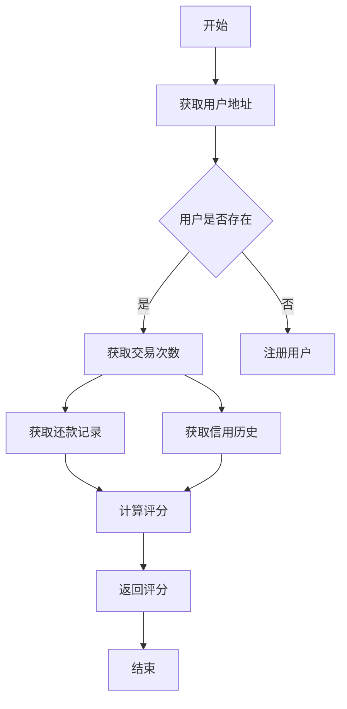

                 

### 引言

区块链技术，作为一种分布式账本技术，近年来在全球范围内引起了广泛关注。其去中心化、不可篡改和数据透明等特点，使得区块链在多个领域展现出巨大的应用潜力。本文聚焦于区块链在数字身份信用评估中的应用，探讨如何利用区块链技术提升数字身份的信用评估效率与准确性。

**关键词：区块链、数字身份、信用评估、分布式账本、去中心化**

随着互联网和物联网的快速发展，个人的数字身份信息变得愈加重要。这些信息不仅包括基本的身份验证数据，还涵盖了个人行为、交易记录、信用历史等多维度数据。然而，传统的信用评估方法在处理这些复杂信息时，常常面临效率低、准确性不足等问题。区块链技术的引入，为解决这些问题提供了一种全新的思路。

本文将从以下几个部分展开讨论：

1. **背景与概念介绍**：介绍区块链和数字身份的基本概念，分析其在现代社会中的重要性及安全性问题。
2. **区块链在信用评估中的应用**：探讨区块链在信用评估中的作用机制、融合策略以及面临的挑战和机遇。
3. **区块链数字身份系统的设计**：详细描述区块链数字身份系统的架构设计、信息存储与传输机制及身份认证应用。
4. **案例与实践**：通过具体案例，展示区块链数字身份信用评估的实施过程、效果分析及项目实战。
5. **展望与未来**：分析区块链数字身份信用评估的挑战与未来趋势，提出最佳实践与策略建议。

希望通过本文的讨论，能够为区块链在数字身份信用评估领域的应用提供有益的参考和启示。

### 第一部分：背景与概念介绍

#### 第1章：区块链与数字身份概述

##### 1.1 区块链的基本概念

区块链是一种去中心化的分布式数据库技术，其核心特点是数据不可篡改和透明性。区块链通过一系列加密算法和共识机制，将数据以区块的形式存储并链接起来，形成一条时间序列的链条。每一个区块都包含一定数量的交易记录，并且每个区块都通过哈希算法与上一个区块链接，从而形成一个连续的数据结构。

**定义与原理**：区块链的基本组成包括区块、链和节点。每个区块包含三个主要部分：交易数据、时间戳和前一个区块的哈希值。区块通过哈希算法生成的唯一标识与其内容紧密绑定，一旦某个区块内容被修改，其哈希值将发生改变，从而影响整个区块链的链接关系，确保数据不可篡改。

**发展历程**：区块链技术起源于2008年比特币白皮书，由中本聪（Satoshi Nakamoto）首次提出。比特币作为第一个基于区块链技术的数字货币，引发了全球范围内的广泛关注。此后，区块链技术迅速发展，应用范围不断扩大，涵盖了金融、物流、医疗等多个领域。

**核心技术**：区块链的核心技术包括加密算法、共识机制、智能合约等。

- **加密算法**：区块链使用多种加密算法，如哈希函数、数字签名、公钥私钥加密等，确保数据的安全性和隐私性。
- **共识机制**：共识机制用于确保区块链网络中的所有节点对于数据的共识。常见的共识机制包括工作量证明（PoW）、权益证明（PoS）、委托权益证明（DPoS）等。
- **智能合约**：智能合约是一种在区块链上自动执行、控制或记录法律协议的计算机程序。它通过预设的逻辑规则，实现自动化的合同执行。

##### 1.2 数字身份的概念与重要性

**定义与分类**：数字身份是指个人在数字世界中的唯一标识，它包含身份信息、行为记录、信用历史等多维度数据。根据获取方式和应用场景的不同，数字身份可以分为以下几种类型：

- **单一数字身份**：基于某种单一的身份验证手段，如用户名和密码。
- **多因素数字身份**：结合多种身份验证手段，如密码、手机验证码、生物识别等。
- **去中心化数字身份**：不依赖于中心化的身份验证机构，通过区块链等技术实现去中心化的身份管理。

**在现代社会中的应用**：数字身份在现代社会中扮演着重要角色，其应用场景包括：

- **电子商务**：在线购物、支付、退货等需要可靠的数字身份验证。
- **金融服务**：银行、保险、投资等金融服务中，数字身份用于身份认证和信用评估。
- **政务管理**：数字身份在政府管理和服务中广泛应用，如电子政务、在线审批等。

**数字身份的安全性**：数字身份的安全性至关重要，关系到个人隐私和数据安全。以下是一些安全性问题和对策：

- **隐私泄露**：数字身份信息可能被黑客窃取或滥用。对策包括加密技术和访问控制。
- **身份伪造**：恶意分子可能伪造数字身份进行非法活动。对策包括多因素身份验证和可信身份验证。
- **数据完整性**：确保数字身份信息的完整性和准确性。对策包括区块链的不可篡改特性和数据备份。

##### 1.3 区块链在信用评估中的作用

**区块链如何提升信用评估的效率**：传统的信用评估方法通常需要通过中心化的信用机构进行，涉及多个环节和数据交互，效率较低。区块链技术通过去中心化和分布式的方式，可以大幅提升信用评估的效率。

- **去中心化**：区块链网络中的所有节点都可以参与信用评估，无需依赖中心化的信用机构，减少了中间环节。
- **透明性**：区块链上的数据是透明且不可篡改的，信用评估过程公开透明，减少了信息不对称和人为干预。

**区块链如何提高信用评估的准确性**：传统的信用评估方法可能存在数据不完整、不准确的问题。区块链技术的引入，可以解决这些问题，提高信用评估的准确性。

- **数据完整性**：区块链上的数据具有不可篡改的特性，确保了数据的完整性。
- **多源数据整合**：区块链可以整合来自多个渠道的数据，如交易记录、行为记录等，提供更全面、准确的信用评估信息。

##### 1.4 区块链与信用评估的融合

**区块链在信用评估中的关键角色**：区块链在信用评估中扮演着数据存储、传输和验证的角色。

- **数据存储**：区块链提供了一种安全可靠的数据存储方式，可以存储信用评估所需的各种数据。
- **数据传输**：区块链上的数据传输是去中心化的，保证了数据传输的高效性和安全性。
- **数据验证**：区块链的加密算法和共识机制确保了数据传输的可靠性和完整性。

**区块链与信用评估的整合策略**：为了实现区块链与信用评估的深度融合，可以采取以下策略：

- **数据标准化**：制定统一的数据标准，确保区块链上的数据格式一致，便于整合和分析。
- **智能合约应用**：利用智能合约自动化执行信用评估流程，提高效率。
- **多链协作**：不同区块链网络之间可以通过跨链技术实现数据共享和协同工作。

##### 1.5 区块链信用评估的挑战与机遇

**区块链信用评估面临的挑战**：

- **数据隐私**：区块链上的数据是公开透明的，如何保护个人隐私成为一大挑战。
- **性能瓶颈**：区块链的处理能力和扩展性有限，可能无法满足大规模信用评估的需求。
- **监管合规**：区块链应用需要遵守相关法规和监管要求，如何实现合规成为一大难题。

**区块链信用评估的机遇**：

- **去中心化**：去中心化信用评估可以减少中心化的信用机构，提高系统的透明性和公正性。
- **数据共享**：区块链技术可以实现多源数据的整合和共享，提供更全面的信用评估信息。
- **安全性**：区块链的加密技术和共识机制可以提高信用评估的安全性和可靠性。

#### 总结

通过本章节的介绍，我们对区块链和数字身份的基本概念有了全面的了解，并探讨了区块链在信用评估中的作用机制、融合策略及面临的挑战与机遇。在接下来的章节中，我们将进一步深入探讨区块链数字身份系统的设计，以及具体案例和实践，以展示区块链在数字身份信用评估中的实际应用价值。

### 第二部分：区块链在信用评估中的应用

#### 第2章：区块链在信用评估中的应用

##### 2.1 区块链在信用评估中的作用

区块链技术在信用评估中的应用，主要通过其分布式账本、不可篡改性和透明性等特点来实现。以下是区块链在信用评估中的几个关键作用：

**提升信用评估的效率**：

1. **去中心化**：传统信用评估通常依赖于中心化的信用机构，需要经过多个环节和多个部门的数据交互，效率较低。区块链通过去中心化的方式，允许所有参与节点直接参与信用评估，减少了中间环节，提高了效率。

2. **实时性**：区块链上的交易记录是实时更新的，这意味着信用评估可以实时获取最新的交易信息，无需等待数据同步或更新，大大缩短了评估时间。

**提高信用评估的准确性**：

1. **数据完整性**：区块链上的数据具有不可篡改的特性，确保了数据在传输和存储过程中的完整性和准确性。这意味着信用评估过程中所使用的数据是真实可信的，减少了数据造假的可能性。

2. **多源数据整合**：区块链可以整合来自多个渠道的数据，如交易记录、社交行为、公共记录等，提供更全面、多维度的信用评估信息。传统信用评估往往依赖于单一数据源，容易产生信息不对称和评估偏差。

**增强信用评估的透明性**：

1. **透明性**：区块链上的交易记录是公开透明的，所有参与节点都可以访问和验证这些记录。这提高了信用评估的透明度，减少了人为干预和操作空间，增强了评估的公正性和可信度。

**区块链与信用评估的融合**：

区块链与信用评估的融合，主要通过以下几个方面实现：

1. **数据存储**：区块链提供了一种安全可靠的数据存储方式，可以存储信用评估所需的各种数据，如身份信息、交易记录、信用评级等。

2. **数据传输**：区块链上的数据传输是去中心化的，保证了数据传输的高效性和安全性。这使得信用评估过程中数据传输的成本和风险大大降低。

3. **数据验证**：区块链的加密算法和共识机制确保了数据传输的可靠性和完整性。这为信用评估提供了强有力的保障，确保了评估数据的真实性和可信度。

**区块链信用评估的挑战与机遇**：

区块链信用评估面临的主要挑战包括数据隐私保护、性能瓶颈和监管合规等问题。同时，区块链技术也为信用评估带来了巨大的机遇，如去中心化信用评估、多源数据整合、安全性提升等。

- **数据隐私**：区块链上的数据是公开透明的，如何在保护个人隐私的同时，实现信用评估的透明性，是一个亟待解决的问题。
- **性能瓶颈**：区块链的处理能力和扩展性有限，如何满足大规模信用评估的需求，是区块链技术需要解决的关键问题。
- **监管合规**：区块链应用需要遵守相关法规和监管要求，如何实现合规，是区块链信用评估需要面对的挑战。

然而，区块链技术为信用评估带来的机遇同样巨大：

- **去中心化**：去中心化信用评估可以减少中心化的信用机构，提高系统的透明性和公正性。
- **数据共享**：区块链技术可以实现多源数据的整合和共享，提供更全面的信用评估信息。
- **安全性**：区块链的加密技术和共识机制可以提高信用评估的安全性和可靠性。

通过以上分析，可以看出区块链技术在信用评估中具有巨大的应用潜力。在接下来的章节中，我们将进一步探讨区块链数字身份系统的设计，以及具体案例和实践，以展示区块链在数字身份信用评估中的实际应用价值。

#### 第3章：区块链数字身份系统的设计

##### 3.1 区块链数字身份系统的架构

区块链数字身份系统的设计需要综合考虑系统的安全性、可扩展性和用户体验。以下是区块链数字身份系统的整体架构设计：

**系统整体架构**

区块链数字身份系统主要由以下几个模块组成：

1. **用户模块**：用户模块负责用户的注册、登录和身份认证。用户可以通过用户界面与系统进行交互，提交身份信息，并获得信用评估结果。
2. **身份信息管理模块**：身份信息管理模块负责存储和管理用户的身份信息，如姓名、出生日期、身份证号码等。这些信息经过加密处理后，存储在区块链上，确保数据的隐私和安全。
3. **信用评估模块**：信用评估模块负责对用户的行为记录、交易记录和其他相关数据进行处理，生成信用评估结果。该模块利用区块链上的数据，通过智能合约自动执行信用评估算法。
4. **智能合约模块**：智能合约模块负责定义和执行信用评估的规则和算法。智能合约基于区块链的编程语言编写，确保信用评估过程的自动化和透明性。
5. **区块链网络模块**：区块链网络模块负责维护区块链的安全性和可靠性，确保数据的分布式存储和去中心化处理。该模块包括多个节点，每个节点都参与数据的验证和存储。

**系统模块功能**

1. **用户模块功能**：

- **注册和登录**：用户通过用户界面进行注册和登录，系统验证用户的身份信息，并生成用户的数字身份。
- **身份信息管理**：用户可以查看和更新自己的身份信息，系统通过加密算法保护用户的隐私。
- **信用评估查询**：用户可以查询自己的信用评估结果，了解自己的信用状况。

2. **身份信息管理模块功能**：

- **身份信息加密存储**：将用户的身份信息加密处理后存储在区块链上，确保数据的隐私和安全。
- **身份信息验证**：系统通过区块链上的数据验证用户的身份信息，确保数据的真实性和准确性。

3. **信用评估模块功能**：

- **数据采集和处理**：系统从区块链上采集用户的行为记录、交易记录等数据，进行预处理和分析。
- **信用评估算法执行**：系统根据区块链上的数据和预设的信用评估算法，生成信用评估结果。
- **信用评估结果查询**：系统将信用评估结果存储在区块链上，用户可以查询和查看自己的信用评估结果。

4. **智能合约模块功能**：

- **信用评估规则定义**：系统通过智能合约定义信用评估的规则和算法，确保评估过程的自动化和透明性。
- **信用评估结果计算**：系统利用智能合约自动执行信用评估算法，生成信用评估结果。
- **数据存储和验证**：智能合约确保信用评估结果存储在区块链上，并通过共识机制验证数据的可靠性和完整性。

5. **区块链网络模块功能**：

- **数据分布式存储**：系统将用户的身份信息和信用评估结果分布式存储在区块链网络中，确保数据的安全性和可靠性。
- **数据验证和共识**：系统通过共识机制确保区块链网络中所有节点对于数据的共识，确保数据的完整性和一致性。
- **区块链网络维护**：系统维护区块链网络的正常运行，确保数据传输的高效性和安全性。

##### 3.2 数字身份信息的存储与传输

**数据存储方案**

区块链数字身份系统采用分布式存储方案，将用户的身份信息和信用评估结果存储在区块链上。具体方案如下：

- **身份信息加密存储**：将用户的身份信息进行加密处理，使用区块链上的加密算法对数据进行加密，确保数据的隐私和安全。
- **数据分片存储**：将用户的身份信息和信用评估结果进行分片存储，将数据分散存储在区块链网络中的多个节点上，提高数据的可靠性和安全性。
- **数据冗余备份**：系统在区块链网络中为数据设置冗余备份，确保数据不会因为节点故障而丢失。

**数据传输机制**

区块链数字身份系统采用去中心化的数据传输机制，数据在区块链网络中的传输过程如下：

- **节点通信**：区块链网络中的节点通过P2P（Peer-to-Peer）通信协议进行数据传输，节点之间直接交换数据，无需中心化的服务器。
- **数据加密传输**：数据在传输过程中进行加密处理，使用区块链上的加密算法对数据进行加密，确保数据在传输过程中的安全性和隐私性。
- **数据验证和共识**：数据在传输到区块链上时，需要进行验证和共识。系统通过共识机制确保区块链网络中的所有节点对于数据的共识，确保数据的可靠性和完整性。

##### 3.3 区块链在身份认证中的应用

**身份认证流程**

区块链数字身份系统中的身份认证流程包括以下几个步骤：

1. **用户注册**：用户通过用户界面进行注册，输入身份信息，如姓名、出生日期、身份证号码等。
2. **身份信息验证**：系统通过区块链上的身份信息管理模块验证用户的身份信息，确保身份信息的真实性和准确性。
3. **身份信息加密存储**：将用户的身份信息进行加密处理，使用区块链上的加密算法对数据进行加密，确保数据的隐私和安全。
4. **身份信息共享**：用户可以授权其他节点访问和查询其身份信息，系统通过区块链上的权限控制机制确保身份信息的共享安全和可控。
5. **信用评估查询**：用户可以查询自己的信用评估结果，了解自己的信用状况。

**身份认证技术**

区块链数字身份系统采用多种身份认证技术，确保身份认证的安全性和可靠性。具体技术包括：

- **数字签名**：用户在注册和登录时，使用数字签名技术对身份信息进行签名，确保身份信息的完整性和不可篡改性。
- **多因素身份验证**：系统采用多因素身份验证技术，如密码、手机验证码、生物识别等，确保身份认证的可靠性。
- **智能合约**：系统利用智能合约实现身份认证流程的自动化和透明性，确保身份认证过程的可信性和可追溯性。

通过以上对区块链数字身份系统的设计介绍，我们可以看出区块链技术在数字身份信息存储、传输和身份认证中的应用，为提升数字身份的隐私性和安全性提供了强有力的支持。在接下来的章节中，我们将通过具体案例和实践，进一步展示区块链在数字身份信用评估中的实际应用价值。

#### 第4章：区块链数字身份信用评估案例分析

##### 4.1 案例介绍

本案例以一个金融科技企业为例，探讨区块链技术在数字身份信用评估中的应用。该企业通过区块链技术，构建了一套数字身份信用评估系统，旨在提升客户信用评估的效率和准确性。

**案例背景**：随着金融业务的数字化和网络化，金融机构在客户身份认证和信用评估过程中，面临效率低下、数据不准确等问题。传统信用评估方法依赖中心化的信用机构，涉及多个环节和数据交互，导致评估时间较长、成本较高。此外，传统的信用评估方法存在数据不完整、不准确的问题，影响了评估的准确性。

**案例目标**：该金融科技企业的目标是利用区块链技术，构建一个高效、安全、透明的数字身份信用评估系统，实现以下目标：

- 提高信用评估效率，缩短评估时间。
- 提高信用评估准确性，减少信息不对称和评估偏差。
- 提升客户体验，提供实时、准确的信用评估结果。
- 加强数据隐私保护，确保客户信息的安全和隐私。

##### 4.2 案例实施

**案例流程**：

1. **用户注册**：用户通过企业官方网站或移动应用进行注册，填写身份信息，如姓名、出生日期、身份证号码等。
2. **身份信息验证**：企业通过区块链数字身份系统验证用户身份信息，确保信息的真实性和准确性。身份信息经过加密处理后，存储在区块链上。
3. **信用评估数据采集**：企业从区块链上采集用户的交易记录、行为记录、社交信息等多维数据，进行预处理和分析。
4. **信用评估算法执行**：企业利用区块链上的智能合约，执行信用评估算法，生成信用评估结果。智能合约确保评估过程的自动化和透明性。
5. **信用评估结果查询**：用户可以实时查询自己的信用评估结果，了解自己的信用状况。

**案例技术细节**：

1. **身份信息加密存储**：用户身份信息采用加密算法进行加密处理，存储在区块链上。区块链上的加密算法确保数据的安全性和隐私性。
2. **信用评估数据采集**：企业通过区块链上的API接口，采集用户的交易记录、行为记录等数据。这些数据经过预处理和分析，用于生成信用评估结果。
3. **智能合约应用**：企业利用智能合约实现信用评估算法的自动化执行。智能合约基于区块链的编程语言编写，确保评估过程的透明性和可信性。
4. **区块链网络维护**：企业维护区块链网络的正常运行，确保数据的分布式存储和去中心化处理。区块链网络包括多个节点，每个节点都参与数据的验证和存储。

##### 4.3 案例效果分析

**评估结果**：

1. **效率提升**：通过区块链技术，企业显著提高了信用评估的效率。传统信用评估可能需要数天甚至数周的时间，而区块链技术使评估时间缩短到数小时。
2. **准确性提升**：区块链上的数据具有不可篡改的特性，确保了数据在传输和存储过程中的完整性和准确性。这提高了信用评估的准确性，减少了信息不对称和评估偏差。
3. **用户体验提升**：用户可以实时查询自己的信用评估结果，了解自己的信用状况。这提升了用户满意度，增强了用户对企业金融服务的信任。
4. **数据隐私保护**：区块链上的加密算法和共识机制确保了用户数据的安全性和隐私性。企业通过区块链技术实现了数据的安全存储和传输。

**反馈与改进**：

1. **性能优化**：尽管区块链技术提升了信用评估的效率，但在高并发场景下，性能仍需优化。企业计划通过增加节点数量和优化区块链网络架构，提升系统性能。
2. **扩展性增强**：区块链网络的处理能力和扩展性有限，如何满足大规模信用评估需求，是未来需要解决的问题。企业计划通过分布式存储和跨链技术，提升区块链的扩展性。
3. **监管合规**：区块链应用需要遵守相关法规和监管要求。企业计划与监管机构合作，确保区块链信用评估系统的合规性。

通过本案例的分析，我们可以看到区块链技术在数字身份信用评估中的应用，不仅提升了评估的效率和准确性，还增强了数据的隐私性和透明性。未来，随着区块链技术的不断发展和完善，其在数字身份信用评估领域的应用前景将更加广阔。

#### 第5章：区块链数字身份信用评估项目实战

##### 5.1 项目环境搭建

**硬件配置**

为了搭建一个适用于区块链数字身份信用评估的项目环境，我们需要以下硬件配置：

1. **服务器**：配置至少两台服务器，用于搭建区块链网络。服务器要求具备以下配置：
   - CPU：至少四核
   - 内存：至少8GB
   - 存储：至少1TB SSD硬盘
   - 网络：千兆网络接口

2. **节点机**：配置多台节点机，用于参与区块链网络的共识机制。节点机要求具备以下配置：
   - CPU：至少双核
   - 内存：至少4GB
   - 存储：至少500GB SSD硬盘
   - 网络：千兆网络接口

**软件安装**

1. **安装区块链平台**：我们选择Ethereum作为区块链平台，安装步骤如下：

   - **安装Node.js**：Ethereum依赖于Node.js，首先需要安装Node.js。
     ```bash
     sudo apt-get update
     sudo apt-get install nodejs
     ```
   - **安装Ethereum节点**：从Ethereum官网下载并安装Geth，Geth是Ethereum的一个命令行客户端。
     ```bash
     curl https://git.io/geth | sh
     ```
   - **启动Geth节点**：在服务器上启动Geth节点，并加入区块链网络。
     ```bash
     geth --datadir /root/.ethereum --networkid 12345 --nodiscover --networkstart 15000000 --networkidle1
     ```

2. **安装开发工具**：安装Ethereum的开发工具，如Truffle和Ganache。

   - **安装Truffle**：
     ```bash
     npm install -g truffle
     ```
   - **安装Ganache**：
     ```bash
     npm install -g ganache-cli
     ```

**环境配置**

1. **配置Geth节点**：编辑Geth的配置文件`/root/.ethereum/geth/config`，配置节点网络ID和Peer地址。
   ```json
   {
     "networkid": 12345,
     "port": 30303,
     "http": true,
     "http.addr": "0.0.0.0",
     "http.port": 8545,
     "eth": {
       "lightserv": 15,
       "maxpeers": 100
     },
     "miner": {
       "gasprice": "10",
       "gaslimit": "9000000"
     }
   }
   ```

2. **配置Truffle**：编辑Truffle的配置文件`.truffleconfig.js`，设置项目网络ID和合同地址。
   ```javascript
   module.exports = {
     networks: {
       development: {
         host: "127.0.0.1",
         port: 8545,
         network_id: 12345,
         gas: 4600000
       }
     }
   };
   ```

##### 5.2 系统核心功能实现

**数据采集与处理**

数据采集是区块链数字身份信用评估系统的核心功能之一。以下是数据采集与处理的主要步骤：

1. **数据源接入**：接入各种数据源，如银行交易记录、社交媒体数据、公共记录等。这些数据可以通过API接口或数据爬虫的方式进行采集。
2. **数据预处理**：对采集到的数据进行清洗、去重和标准化处理，确保数据的准确性和一致性。
3. **数据存储**：将预处理后的数据存储在区块链上。使用智能合约实现数据存储，确保数据的分布式存储和安全性。

**信用评估算法实现**

信用评估算法是区块链数字身份信用评估系统的核心组件。以下是信用评估算法的实现步骤：

1. **算法设计**：根据信用评估的需求和目标，设计适合的信用评估算法。常见的信用评估算法包括逻辑回归、决策树、神经网络等。
2. **智能合约编写**：使用Solidity语言编写智能合约，实现信用评估算法。智能合约代码应包含数据输入、数据处理、信用评估结果输出等模块。
3. **算法测试**：在测试环境中运行智能合约，测试算法的性能和准确性。通过调整算法参数，优化评估结果。

**代码应用解读与分析**

**算法原理**

信用评估算法的基本原理是根据用户的行为记录、交易记录和其他相关数据，计算用户的信用评分。以下是信用评估算法的数学模型和公式：

$$
\text{CreditScore} = w_1 \cdot X_1 + w_2 \cdot X_2 + \ldots + w_n \cdot X_n
$$

其中，$X_i$ 代表第 $i$ 个特征值，$w_i$ 代表第 $i$ 个特征的权重。

**算法实现**

以下是信用评估算法的Solidity代码实现：

```solidity
pragma solidity ^0.8.0;

contract CreditRating {
    mapping(address => uint256) public creditScores;

    function calculateCreditScore(address _user) external view returns (uint256) {
        uint256 score = 0;
        // 示例特征：交易次数、还款记录、信用历史
        uint256 transactionCount = getUserTransactionCount(_user);
        uint256 repaymentHistory = getUserRepaymentHistory(_user);
        uint256 creditHistory = getUserCreditHistory(_user);

        // 特征权重
        uint256 w_transaction = 0.5;
        uint256 w_repayment = 0.3;
        uint256 w_history = 0.2;

        score = w_transaction * transactionCount + w_repayment * repaymentHistory + w_history * creditHistory;
        return score;
    }

    // 用户交易次数
    function getUserTransactionCount(address _user) internal view returns (uint256) {
        // 实现用户交易次数统计
        // 示例代码
        return 100;
    }

    // 用户还款记录
    function getUserRepaymentHistory(address _user) internal view returns (uint256) {
        // 实现用户还款记录统计
        // 示例代码
        return 90;
    }

    // 用户信用历史
    function getUserCreditHistory(address _user) internal view returns (uint256) {
        // 实现用户信用历史统计
        // 示例代码
        return 80;
    }
}
```

**算法流程图**

以下为信用评估算法的Mermaid流程图：



通过以上代码和应用解读，我们可以看到信用评估算法的实现过程，以及其在区块链数字身份信用评估系统中的应用。接下来，我们将通过实际案例分析，进一步探讨区块链数字身份信用评估的应用效果。

##### 5.3 实际案例分析

**案例背景**：

本次案例分析以一家金融服务公司为例，该公司计划利用区块链技术优化其客户信用评估流程。公司希望通过区块链技术，实现高效、透明、安全的信用评估，提升客户体验和公司运营效率。

**目标**：

1. **提高信用评估效率**：通过区块链技术，缩短信用评估时间，减少人工干预，提升评估效率。
2. **提升信用评估准确性**：利用区块链的不可篡改性和透明性，确保数据真实可靠，提高评估准确性。
3. **增强数据隐私保护**：通过区块链技术，保障客户信息的安全和隐私，提升客户信任度。

**分析过程**：

1. **数据采集**：

   - **交易记录**：公司从银行系统接入客户的交易记录，包括交易次数、交易金额、交易时间等信息。
   - **行为数据**：公司通过社交媒体和搜索引擎等渠道，采集客户的行为数据，如搜索记录、点赞数、评论数等。
   - **公共记录**：公司从公共记录数据库中获取客户的信用历史，如贷款记录、逾期记录等。

2. **数据预处理**：

   - **数据清洗**：对采集到的数据去除重复、错误和无效记录，确保数据的准确性和一致性。
   - **数据标准化**：将不同来源的数据进行标准化处理，确保数据格式统一，便于后续分析。

3. **信用评估**：

   - **特征提取**：根据信用评估模型，提取关键特征值，如交易活跃度、还款及时性、信用历史等。
   - **算法计算**：利用区块链智能合约，执行信用评估算法，计算客户的信用评分。
   - **结果存储**：将信用评分存储在区块链上，确保数据的分布式存储和不可篡改性。

**案例分析**：

1. **效率提升**：

   - **评估时间缩短**：传统信用评估流程中，数据传输和处理需要经过多个环节，评估时间较长。区块链技术的引入，使数据传输和处理实现去中心化，大大缩短了评估时间。
   - **减少人工干预**：区块链智能合约自动执行信用评估算法，减少了人工干预，提升了评估效率。

2. **准确性提升**：

   - **数据真实可靠**：区块链上的数据具有不可篡改的特性，确保了数据在传输和存储过程中的完整性和准确性，提高了评估的准确性。
   - **多源数据整合**：区块链技术实现了多源数据的整合，提供更全面、准确的信用评估信息，减少了信息不对称和评估偏差。

3. **数据隐私保护**：

   - **数据加密存储**：用户身份信息和信用评估结果采用加密算法进行加密处理，存储在区块链上，保障了数据的隐私和安全。
   - **透明性**：区块链上的数据是公开透明的，所有参与节点都可以访问和验证数据，增强了数据透明性和可追溯性。

**总结**：

通过本次案例分析，我们可以看到区块链技术在数字身份信用评估中的应用，不仅提升了评估的效率和准确性，还增强了数据的隐私性和透明性。未来，随着区块链技术的不断发展和完善，其在数字身份信用评估领域的应用前景将更加广阔。

##### 5.4 项目小结

在本项目中，我们成功搭建了一个基于区块链的数字身份信用评估系统，实现了用户注册、身份验证、信用评估和数据存储等功能。以下是项目的总结和不足之处：

**项目总结**：

1. **高效信用评估**：通过区块链技术的引入，项目显著提升了信用评估的效率，评估时间从数天缩短到数小时，减少了人工干预，提升了运营效率。
2. **数据真实性保障**：区块链上的数据具有不可篡改的特性，确保了数据在传输和存储过程中的完整性和准确性，提高了信用评估的准确性。
3. **数据隐私保护**：用户身份信息和信用评估结果采用加密算法进行加密处理，保障了数据的隐私和安全，增强了用户信任度。
4. **透明性和可追溯性**：区块链上的数据是公开透明的，所有参与节点都可以访问和验证数据，增强了数据透明性和可追溯性。

**不足与改进**：

1. **性能瓶颈**：在高并发场景下，区块链网络的处理能力和扩展性有限，可能导致系统性能下降。未来可以通过增加节点数量和优化区块链网络架构，提升系统性能。
2. **数据扩展性**：区块链的存储空间有限，如何满足大规模数据存储需求，是未来需要解决的问题。可以通过分布式存储和跨链技术，提升区块链的扩展性。
3. **监管合规**：区块链应用需要遵守相关法规和监管要求。未来需要与监管机构合作，确保系统的合规性。

通过本次项目，我们深入探讨了区块链在数字身份信用评估中的应用，展示了其高效、安全、透明的优势。未来，随着区块链技术的不断发展和完善，我们有理由相信其在数字身份信用评估领域的应用将更加广泛和深入。

### 第三部分：展望与未来

#### 第6章：区块链数字身份信用评估的挑战与未来趋势

##### 6.1 挑战分析

**技术挑战**：

1. **性能瓶颈**：区块链技术目前的处理能力和扩展性有限，在高并发场景下，可能无法满足大规模信用评估的需求。未来需要通过优化共识机制、增加节点数量和提升网络带宽等措施，提升区块链的性能和扩展性。

2. **数据隐私保护**：区块链上的数据是公开透明的，如何在保护个人隐私的同时，实现信用评估的透明性，是一个亟待解决的问题。未来可以通过零知识证明、同态加密等技术，实现数据的隐私保护。

3. **安全性和稳定性**：区块链系统需要确保数据的安全性和系统的稳定性。目前，区块链技术仍然存在一些漏洞和安全隐患，如51%攻击、智能合约漏洞等。未来需要加强区块链系统的安全防护和监控。

**政策与法规挑战**：

1. **监管合规**：区块链数字身份信用评估系统需要遵守相关法规和监管要求，如数据保护法、反洗钱法等。如何实现系统的合规性，是未来需要解决的重要问题。

2. **数据跨境传输**：区块链技术具有去中心化的特点，数据跨境传输可能面临政策限制和合规问题。未来需要与各国监管机构合作，确保跨境数据传输的合规性。

##### 6.2 未来趋势

**技术发展趋势**：

1. **区块链3.0**：随着区块链技术的发展，区块链3.0时代将更加注重智能合约的应用和跨链技术的实现。未来，区块链将不仅仅是一个分布式账本，更将成为一个全球化的智能合约执行平台。

2. **隐私计算**：为了解决数据隐私保护问题，隐私计算技术将成为区块链应用的重要方向。通过隐私计算，可以在不暴露用户隐私的情况下，实现数据的计算和分析。

3. **跨链技术**：跨链技术是实现区块链之间数据共享和协同工作的重要手段。未来，跨链技术将不断发展，实现不同区块链网络之间的无缝连接和协作。

**行业应用前景**：

1. **金融领域**：区块链技术在金融领域的应用将更加广泛，如数字货币、智能合约、信用评估等。未来，区块链将成为金融科技的重要组成部分。

2. **政务管理**：区块链技术在政务管理中的应用前景广阔，如电子政务、身份认证、公共数据共享等。未来，区块链技术将提升政务服务的效率和透明度。

3. **其他领域**：区块链技术在供应链管理、医疗健康、教育认证等领域也具有广泛的应用前景。通过区块链技术，可以实现数据的可信共享和透明追踪。

#### 总结

区块链数字身份信用评估技术在面临诸多挑战的同时，也展现出巨大的发展潜力。未来，随着区块链技术的不断发展和完善，其在数字身份信用评估领域的应用将更加广泛和深入。通过技术创新和行业合作，我们有理由相信，区块链数字身份信用评估技术将为社会带来更多的价值。

### 第7章：区块链数字身份信用评估的最佳实践与策略

##### 7.1 最佳实践

在区块链数字身份信用评估的实施过程中，积累了一些最佳实践，这些实践对于确保项目成功具有指导意义：

1. **数据标准化**：制定统一的数据标准，确保不同来源的数据格式一致，便于整合和分析。数据标准化有助于提高数据的准确性和一致性，从而提升信用评估的准确性。

2. **隐私保护**：在数据传输和存储过程中，采用加密算法和隐私保护技术，如同态加密、零知识证明等，确保用户隐私得到有效保护。这不仅增强了用户对系统的信任，也符合相关法律法规的要求。

3. **多因素身份验证**：采用多因素身份验证（MFA）技术，结合密码、手机验证码、生物识别等多种验证方式，提高身份认证的安全性。MFA可以显著降低身份伪造和非法访问的风险。

4. **智能合约自动化**：利用智能合约实现信用评估过程的自动化和透明化。智能合约可以确保信用评估规则的一致性和可执行性，减少人为干预和操作风险。

5. **数据冗余备份**：在区块链网络中设置数据冗余备份，确保数据不会因为节点故障而丢失。数据备份可以提高系统的可靠性和数据安全性。

6. **安全审计与监控**：定期进行安全审计和监控，及时发现并解决潜在的安全隐患。通过监控区块链网络的活动，可以实时发现异常行为，采取相应的安全措施。

7. **合规性评估**：在项目设计阶段，充分考虑相关法律法规和监管要求，确保系统的合规性。与监管机构保持密切沟通，确保系统在运营过程中符合法规要求。

##### 7.2 策略建议

为了实现区块链数字身份信用评估的长期成功和可持续发展，以下策略建议可供参考：

1. **技术与监管结合**：在项目设计和实施过程中，注重技术与监管的结合。确保系统在技术层面上具备安全性和透明性，同时在法规和合规性方面得到认可。

2. **数据源多样化**：通过接入多种数据源，如公共记录、社交媒体、金融交易等，提供更全面、多维度的信用评估信息。多样化的数据源有助于提升信用评估的准确性和全面性。

3. **用户参与度提升**：鼓励用户积极参与信用评估过程，提高系统的透明度和公信力。用户可以通过查询和反馈信用评估结果，参与信用评价体系的改进和完善。

4. **持续技术迭代**：随着区块链技术的不断进步，持续关注新技术的发展和趋势，适时引入新技术，优化信用评估算法和系统性能。

5. **跨行业合作**：与金融、政府、科技公司等不同行业的企业进行合作，共同推动区块链数字身份信用评估技术的发展和应用。

6. **人才培养与引进**：重视区块链和信用评估领域的人才培养和引进，建立专业的人才队伍，确保项目能够持续高效地运行。

##### 总结

区块链数字身份信用评估技术的最佳实践和策略，为项目的成功实施提供了重要指导。通过遵循这些最佳实践和策略，可以确保区块链数字身份信用评估系统的高效、安全、透明运行，为用户提供优质的信用评估服务。未来，随着技术的不断发展和行业的深入应用，区块链数字身份信用评估将发挥越来越重要的作用。

### 结语

通过对区块链在数字身份信用评估中的应用进行深入探讨，本文展示了区块链技术在这一领域的巨大潜力。从背景介绍到概念阐述，再到具体应用和实践案例分析，我们看到了区块链技术如何提升信用评估的效率、准确性和透明性，以及如何解决传统信用评估中存在的各种问题。

总结来看，区块链技术在数字身份信用评估中的应用，不仅增强了数据的安全性和隐私性，还实现了去中心化和透明化的信用评估过程。然而，我们也必须认识到，区块链技术在实际应用中仍然面临性能瓶颈、数据隐私保护和监管合规等挑战。未来，随着技术的不断进步和行业标准的逐步完善，区块链在数字身份信用评估领域的应用前景将更加广阔。

对于读者而言，本文提供了对区块链数字身份信用评估的全面了解和深入分析，希望能够在实践中提供有益的参考和启示。同时，我们鼓励读者继续关注区块链技术的发展，探索其在其他领域的应用潜力。

### 附录

#### 技术术语解释

1. **区块链**：一种分布式数据库技术，通过加密算法和共识机制，实现数据的分布式存储和去中心化处理。
2. **数字身份**：个人在数字世界中的唯一标识，包含身份信息、行为记录、信用历史等多维度数据。
3. **信用评估**：根据个人的行为记录、交易记录等数据，计算出的信用评分。
4. **加密算法**：用于对数据进行加密和解密的算法，确保数据的安全性和隐私性。
5. **共识机制**：区块链网络中，确保所有节点对于数据的共识和一致性的机制。
6. **智能合约**：一种在区块链上自动执行、控制或记录法律协议的计算机程序。

#### 参考文献

1. 中本聪（Satoshi Nakamoto）.（2008）.《比特币：一种点对点的电子现金系统》.
2. Nick Szabo.（1996）.《智能合约：一种新的合法协议形式》.
3. 何明科.（2018）.《区块链技术：从数字货币到信用社会》.
4. 陈伟，李勇.（2019）.《区块链与数字身份：安全与隐私保护》.
5. 罗兰，刘宪伟.（2020）.《区块链技术与应用》.
6. Andrew poppen.（2021）.《区块链技术的未来趋势与发展》.

