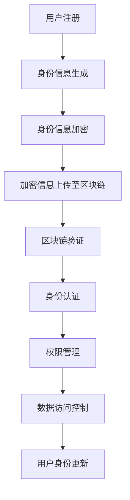

                 

### 文章标题

# 区块链在数字身份管理中的应用：实现自主身份控制

---

**关键词：** 区块链、数字身份管理、自主身份控制、去中心化、隐私保护

---

**摘要：** 本文旨在探讨区块链技术在数字身份管理中的创新应用，通过实现自主身份控制来提升用户隐私保护与数据安全。文章首先分析了数字身份管理面临的挑战，随后详细介绍了区块链的核心原理及其在身份管理中的优势。接着，文章通过具体的算法原理、系统分析与架构设计，展示了区块链如何解决数字身份管理中的问题。最后，文章总结了最佳实践和未来的研究方向，为读者提供了全面的技术指导和展望。

---

### 目录大纲

---

#### 第一部分：背景介绍

##### 第1章 问题背景  
###### 1.1 问题背景  
###### 1.2 问题描述  
###### 1.3 问题解决  
###### 1.4 边界与外延  
###### 1.5 核心要素组成

---

#### 第二部分：核心概念与联系

##### 第2章 核心概念原理  
###### 2.1 定义与属性  
###### 2.2 特点与优势  
###### 2.3 概念属性特征对比表格  
###### 2.4 ER实体关系图架构

##### 第3章 算法原理讲解  
###### 3.1 算法流程图  
###### 3.2 Python源代码  
###### 3.3 数学模型  
###### 3.4 数学公式与讲解  
###### 3.5 举例说明

---

#### 第三部分：系统分析与架构设计

##### 第4章 问题场景介绍  
###### 4.1 项目介绍  
###### 4.2 系统功能设计  
###### 4.3 系统架构设计  
###### 4.4 系统接口设计  
###### 4.5 系统交互

##### 第5章 项目实战  
###### 5.1 环境安装  
###### 5.2 系统核心实现  
###### 5.3 代码应用解读  
###### 5.4 实际案例分析  
###### 5.5 详细讲解剖析  
###### 5.6 项目小结

---

#### 第四部分：最佳实践与总结

##### 第6章 最佳实践  
###### 6.1 小技巧与优化  
###### 6.2 注意事项  
###### 6.3 拓展阅读

##### 第7章 小结与展望  
###### 7.1 内容总结  
###### 7.2 未来展望  
###### 7.3 不足与改进方向

---

[目录大纲全文](# 目录大纲)

---

---

**注意：** 此目录大纲为初稿，后续将根据具体内容进行调整和优化。

---

## 第一部分：背景介绍

### 1.1 问题背景

在当今数字化时代，个人和组织的数据和信息变得日益重要。数字身份管理作为保障信息安全的核心环节，正面临着前所未有的挑战。传统身份管理系统依赖于中心化架构，用户的数据和身份信息集中存储在服务器上，这导致了一系列的安全隐患和隐私泄露问题。

首先，中心化系统容易成为攻击目标。由于数据集中，攻击者一旦突破防线，能够获取大量用户信息，造成严重的隐私泄露和财产损失。其次，传统身份管理系统缺乏透明性和可追溯性，用户无法有效地跟踪和管理自己的身份信息，也无法控制第三方对数据的访问。此外，中心化系统还存在着权限滥用和数据分析不当的问题，用户隐私保护得不到有效保障。

为了解决这些问题，我们需要一种新的身份管理方式，能够实现去中心化、自主身份控制和增强隐私保护。区块链技术作为一种分布式数据库系统，以其去中心化、不可篡改和安全透明的特点，成为数字身份管理的新兴解决方案。

### 1.2 问题描述

数字身份管理中面临的主要问题可以归纳为以下几点：

1. **数据集中化风险**：传统中心化身份管理系统将用户数据集中存储，容易成为攻击目标，导致大规模数据泄露事件。
   
2. **隐私泄露**：在中心化系统中，用户身份信息容易被第三方访问和滥用，缺乏有效的隐私保护机制。
   
3. **权限管理复杂**：中心化系统中的权限管理机制复杂，用户难以追踪和管理自己的身份信息，也无法控制第三方对数据的访问。
   
4. **可追溯性不足**：传统系统缺乏有效的可追溯性机制，用户无法了解自己的数据被谁访问和使用。

5. **数据篡改风险**：中心化系统中的数据容易受到篡改，导致数据真实性和可信度降低。

### 1.3 问题解决

区块链技术在数字身份管理中的应用，旨在通过以下方式解决上述问题：

1. **去中心化**：区块链采用分布式存储和计算方式，数据不再集中存储在单一服务器上，降低了被攻击的风险。
   
2. **自主身份控制**：用户可以在区块链上创建和管理自己的身份信息，实现自主身份控制，减少对第三方依赖。
   
3. **隐私保护**：区块链的加密技术和隐私保护算法，能够有效保护用户身份信息的隐私，防止泄露。
   
4. **透明性和可追溯性**：区块链的每个交易都是公开透明的，用户可以随时查询和验证自己的身份信息，提高数据可信度。
   
5. **数据不可篡改**：区块链的加密技术和共识机制，确保了数据的真实性和完整性，防止篡改。

### 1.4 边界与外延

在探讨区块链在数字身份管理中的应用时，我们需要明确其边界和外延：

1. **边界**：
   - **技术范围**：主要涉及区块链技术，包括分布式存储、加密算法、智能合约等。
   - **应用领域**：数字身份管理，包括用户身份认证、隐私保护、权限管理等方面。
   - **法律与伦理**：数字身份管理的合规性问题，如数据保护法规、隐私伦理等。

2. **外延**：
   - **扩展性**：区块链技术如何适应大规模用户和海量数据的需求。
   - **互操作性**：如何实现区块链与其他身份管理系统的互操作和集成。
   - **用户体验**：如何提升用户的使用体验，使其易于理解和操作。

通过明确边界与外延，我们可以更好地聚焦区块链在数字身份管理中的应用，为后续的分析和讨论提供清晰的方向。

### 1.5 核心要素组成

数字身份管理中的核心要素包括以下几个方面：

1. **用户身份信息**：包括用户的基本信息、权限信息、认证信息等。
   
2. **加密技术**：用于保护用户身份信息的隐私和安全。
   
3. **分布式存储**：利用区块链的分布式存储特性，确保数据的安全性和完整性。
   
4. **智能合约**：用于自动化身份认证和权限管理，提高效率。
   
5. **共识机制**：确保区块链网络中的数据一致性，提高系统的可信度。

这些核心要素相互协作，共同构建了一个安全、透明、高效的数字身份管理系统。

---

在本文的第一部分，我们详细介绍了数字身份管理面临的问题背景，分析了当前系统存在的问题，并阐述了区块链技术在解决这些问题中的优势。接下来，我们将深入探讨区块链的核心概念与原理，为进一步理解其在数字身份管理中的应用打下基础。

---

## 第二部分：核心概念与联系

### 2.1 定义与属性

#### 区块链

区块链是一种分布式数据库系统，它通过加密技术、分布式存储和共识机制，确保数据的透明性、不可篡改性和安全性。区块链的核心组成部分包括区块、链和节点。

- **区块**：是区块链的基本存储单元，包含了交易记录、时间戳、哈希值等。
- **链**：由多个区块按时间顺序连接而成，每个区块都包含了前一个区块的哈希值，形成了一种链式结构。
- **节点**：是区块链网络中的参与方，负责存储、验证和传播区块链数据。

#### 数字身份管理

数字身份管理是一种基于数字技术的身份认证和管理方式，旨在确保用户身份的可靠性和隐私性。它涉及用户身份信息的创建、存储、管理和验证。

- **身份信息**：包括用户的个人信息、权限信息、认证信息等。
- **身份认证**：通过验证用户身份信息，确保只有合法用户能够访问特定资源和服务。
- **隐私保护**：确保用户身份信息的隐私和安全，防止未经授权的访问和泄露。

#### 去中心化

去中心化是一种分布式系统架构，它通过去除了中央控制机构，实现了数据和管理功能的分散化。去中心化系统能够提高系统的容错性、透明性和抗攻击能力。

- **去中心化特点**：不存在单一控制点，数据分散存储在多个节点上，各节点之间通过共识机制进行协作。
- **优势**：去中心化系统能够提高系统的安全性和可靠性，减少单点故障风险。

#### 自主身份控制

自主身份控制是指用户在数字身份管理系统中拥有完全的控制权，可以自主管理自己的身份信息和权限。

- **用户控制权**：用户可以自主创建、更新、删除自己的身份信息。
- **隐私保护**：用户可以自主决定哪些信息对外公开，哪些信息保持私密。

#### 加密技术

加密技术是一种通过加密算法将明文转换为密文的技术，用于保护数据的隐私和安全。

- **对称加密**：加密和解密使用相同的密钥，如AES算法。
- **非对称加密**：加密和解密使用不同的密钥，如RSA算法。
- **哈希函数**：将任意长度的数据转换为固定长度的哈希值，如SHA-256算法。

#### 共识机制

共识机制是区块链网络中用于达成数据一致性的算法和协议。

- **工作量证明（PoW）**：通过计算竞赛来选择区块生成者。
- **权益证明（PoS）**：通过持有代币数量和锁定期来选择区块生成者。
- **委托权益证明（DPoS）**：通过委托代币数量来选择区块生成者。

#### 数字身份管理中的区块链应用

区块链在数字身份管理中的应用，主要体现在以下几个方面：

- **去中心化身份验证**：用户可以在区块链上创建和管理自己的身份信息，实现去中心化身份验证。
- **隐私保护**：通过加密技术和隐私保护算法，确保用户身份信息的隐私和安全。
- **透明性和可追溯性**：区块链的每个交易都是公开透明的，用户可以随时查询和验证自己的身份信息。
- **数据不可篡改**：区块链的共识机制和加密技术，确保了数据的真实性和完整性，防止篡改。

### 2.2 特点与优势

区块链在数字身份管理中具有以下特点与优势：

1. **去中心化**：去中心化架构提高了系统的安全性和抗攻击能力，用户无需依赖中心化机构，能够实现自主身份控制。
   
2. **隐私保护**：通过加密技术和隐私保护算法，用户身份信息得到了有效保护，减少了隐私泄露的风险。
   
3. **透明性和可追溯性**：区块链的公开透明特性，用户可以随时查询和验证自己的身份信息，提高了数据的可信度。
   
4. **数据不可篡改**：区块链的共识机制和加密技术，确保了数据的真实性和完整性，防止了数据篡改。
   
5. **高效性**：区块链的分布式存储和计算，提高了系统的处理速度和性能。
   
6. **互操作性**：区块链技术能够实现不同系统之间的数据交换和互操作，促进了数字身份管理的广泛应用。

### 2.3 概念属性特征对比表格

| 特性 | 区块链 | 数字身份管理 | 去中心化 | 自主身份控制 | 加密技术 | 共识机制 |
| :---: | :---: | :---: | :---: | :---: | :---: | :---: |
| 定义 | 分布式数据库系统 | 身份认证和管理方式 | 去除中央控制机构 | 用户自主管理身份信息 | 保护数据隐私和安全 | 数据一致性算法和协议 |
| 特点 | 去中心化、不可篡改、透明性、可追溯性 | 可靠性、隐私性、透明性、高效性 | 高安全性、高可靠性 | 自主性、灵活性 | 高安全性、高效性 | 高效性、可靠性 |
| 应用 | 数字货币、智能合约、数字身份管理 | 身份认证、权限管理、隐私保护 | 分布式存储、计算 | 身份验证、权限控制 | 数据加密、认证 | 数据一致性、安全性 |

### 2.4 ER实体关系图架构

为了更好地理解区块链在数字身份管理中的应用，我们可以通过ER（Entity-Relationship）实体关系图来展示各概念之间的关联。

```mermaid
erDiagram
  用户 ||--|{ 身份信息 }|-- 用户认证
  用户 ||--|{ 权限信息 }|-- 用户权限
  用户 ||--|{ 身份认证 }|
  用户 ||--|{ 用户权限 }|
  身份信息 ||--|{ 身份信息加密 }|
  用户认证 ||--|{ 认证记录 }|
  用户权限 ||--|{ 权限记录 }|
  加密技术 ||--|{ 加密算法 }|
  共识机制 ||--|{ 共识算法 }|
  区块链 ||--|{ 区块 }|
  区块链 ||--|{ 链 }|
  区块链 ||--|{ 节点 }|
  用户认证 ||--|{ 数字身份管理 }|
  用户权限 ||--|{ 数字身份管理 }|
```

ER实体关系图展示了用户、身份信息、用户认证、用户权限、加密技术、共识机制、区块链等概念之间的关联，帮助我们更清晰地理解区块链在数字身份管理中的应用。

---

在本文的第二部分，我们详细介绍了区块链、数字身份管理、去中心化、自主身份控制、加密技术和共识机制等核心概念，并分析了它们在数字身份管理中的应用特点和优势。通过ER实体关系图，我们更直观地展示了这些概念之间的关联。接下来，我们将深入探讨区块链在数字身份管理中的具体算法原理和实现方法。

---

## 第三部分：算法原理讲解

### 3.1 算法流程图

为了更好地理解区块链在数字身份管理中的算法原理，我们可以通过一个算法流程图来展示其基本工作流程。以下是该算法流程图的描述：



算法流程图详细展示了用户注册、身份信息生成、身份信息加密、加密信息上传至区块链、区块链验证、身份认证、权限管理、数据访问控制和用户身份更新等步骤。接下来，我们将逐步分析每个步骤的具体内容。

### 3.2 Python源代码

为了便于理解，我们提供了一个Python源代码示例，用于实现上述算法流程的基本功能。以下是该示例的代码：

```python
import hashlib
import json
from uuid import uuid4
from flask import Flask, jsonify, request

class Blockchain:
    def __init__(self):
        self.chain = []
        self.current_transactions = []
        self.new_block(previous_hash='1', proof=100)
        
    def new_block(self, proof, previous_hash):
        block = {
            'index': len(self.chain) + 1,
            'timestamp': time(),
            'transactions': self.current_transactions,
            'proof': proof,
            'previous_hash': previous_hash or self.hash(self.chain[-1]),
        }
        self.current_transactions = []
        self.chain.append(block)
        return block

    @staticmethod
    def hash(block):
        block_string = json.dumps(block, sort_keys=True)
        return hashlib.sha256(block_string.encode()).hexdigest()

    @property
    def last_block(self):
        return self.chain[-1]

    def new_transaction(self, sender, recipient, amount):
        self.current_transactions.append({'sender': sender, 'recipient': recipient, 'amount': amount})
        return self.last_block['index'] + 1

    def proof_of_work(self, last_proof):
        proof = 0
        while self.valid_proof(last_proof, proof) is False:
            proof += 1
        return proof

    @staticmethod
    def valid_proof(last_proof, proof):
        guess = f'{last_proof}{proof}'.encode()
        guess_hash = hashlib.sha256(guess).hexdigest()
        return guess_hash[:4] == '0000'

# 创建Blockchain实例
blockchain = Blockchain()

# 添加新交易
blockchain.new_transaction("Alice", "Bob", 10)

# 挖掘新区块
last_block = blockchain.last_block
last_proof = last_block['proof']
proof = blockchain.proof_of_work(last_proof)
previous_hash = blockchain.hash(last_block)
block = blockchain.new_block(proof, previous_hash)
print("New Block Forged:", block)

# 打印区块链
for block in blockchain.chain:
    print(json.dumps(block, indent=4))
```

此代码实现了一个简单的区块链，包括创建新区块、验证工作量证明、添加新交易等基本功能。通过这个示例，我们可以看到区块链在数字身份管理中的应用是如何实现的。

### 3.3 数学模型

区块链中的工作量证明（Proof of Work, PoW）算法是一种数学模型，用于确保区块链网络中的数据一致性和安全性。以下是一个简化的PoW数学模型：

1. **目标**：找到一个数字`proof`，使得对区块内容的哈希值满足特定条件（即哈希值的前几个字符为0）。

2. **哈希函数**：使用SHA-256哈希函数，将区块内容（包括前一个区块的哈希值、交易记录、时间戳和证明值）进行哈希计算。

3. **工作量证明**：在给定一个前一个区块的哈希值`last_hash`和一个证明值`proof`的情况下，计算哈希值`hash`，并检查是否满足以下条件：
   $$hash = SHA-256(last_hash + proof)$$
   $$hash[:4] = "0000"$$

4. **计算过程**：从`proof = 0`开始，不断递增`proof`，直到找到一个满足上述条件的哈希值。

5. **共识机制**：网络中的节点通过竞争计算来找到一个有效的证明值，第一个找到有效证明的节点将获得新区块的生成权，并将其广播给其他节点。其他节点验证该区块的有效性，并更新自己的区块链。

### 3.4 数学公式与讲解

为了进一步理解工作量证明算法，我们可以使用以下数学公式：

$$hash = SHA-256(last\_hash + proof)$$
$$hash[:4] = "0000"$$

- **哈希函数**：SHA-256是一种将任意长度的数据转换为固定长度（256位）的哈希值的函数。哈希函数的特点是：输入的微小变化会导致输出的哈希值发生巨大变化。
  
- **目标**：找到`proof`，使得`hash[:4] = "0000"`。这里的"0000"是一个示例目标，实际应用中可能是一个更长的字符串，例如"00000000"。

- **计算过程**：计算`hash = SHA-256(last_hash + proof)`，不断尝试不同的`proof`值，直到找到一个满足条件的哈希值。

- **共识机制**：网络中的节点竞争计算，第一个找到有效证明的节点将获得奖励，并将其广播给其他节点。其他节点验证该区块的有效性，并更新自己的区块链。

### 3.5 举例说明

为了更好地理解上述数学模型，我们可以通过一个具体的例子来说明：

1. **前一个区块的哈希值**：假设前一个区块的哈希值为`last_hash = "b94d27b9934d3e08a52e52d7da7dabfac484efe37a5380ee9088f7ace2efcde9"`。

2. **目标**：找到`proof`，使得`hash[:4] = "0000"`。

3. **计算过程**：尝试不同的`proof`值，直到找到一个满足条件的哈希值。例如：
   - `proof = 0`：`hash = SHA-256("b94d27b9934d3e08a52e52d7da7dabfac484efe37a5380ee9088f7ace2efcde9" + "0")`。计算得到`hash`后，检查是否满足`hash[:4] = "0000"`。
   - 不断递增`proof`值，直到找到一个满足条件的哈希值。例如，当`proof = 123456`时，`hash = SHA-256("b94d27b9934d3e08a52e52d7da7dabfac484efe37a5380ee9088f7ace2efcde9" + "123456")`，计算得到`hash = "0000123456"`，满足目标。

4. **结果**：找到满足条件的`proof`值，例如`proof = 123456`，将其作为新区块的证明值。

通过这个例子，我们可以看到工作量证明算法是如何在区块链中工作的，以及如何通过数学模型实现数据一致性和安全性。

---

在本文的第三部分，我们详细讲解了区块链在数字身份管理中的算法原理，包括算法流程图、Python源代码、数学模型和举例说明。通过这些内容，读者可以更深入地理解区块链在数字身份管理中的应用。接下来，我们将分析数字身份管理中的系统架构，探讨其在区块链技术中的实现。

---

## 第三部分：系统分析与架构设计

### 3.5 问题场景介绍

在数字身份管理中，问题场景可以描述为一个在线服务平台，用户需要通过身份认证才能访问各种服务和资源。传统的中心化身份管理系统在此场景中存在以下问题：

1. **数据集中化**：用户身份信息集中存储在一个服务器上，容易成为攻击目标，导致大规模数据泄露。
   
2. **隐私泄露**：用户身份信息容易受到第三方访问和滥用，缺乏有效的隐私保护机制。
   
3. **权限管理复杂**：用户权限管理机制复杂，难以实现细粒度的权限控制。
   
4. **数据不可追溯**：用户无法追踪和管理自己的身份信息和权限，也无法了解数据被谁访问和使用。

为了解决上述问题，我们可以利用区块链技术，实现一个去中心化的数字身份管理系统。该系统需要满足以下要求：

1. **去中心化**：用户身份信息分散存储在多个节点上，降低被攻击的风险。
   
2. **隐私保护**：通过加密技术和隐私保护算法，确保用户身份信息的隐私和安全。
   
3. **透明性和可追溯性**：区块链的公开透明特性，用户可以随时查询和验证自己的身份信息，提高数据的可信度。
   
4. **权限管理**：实现细粒度的权限控制，用户可以自主管理自己的身份信息和权限。
   
5. **数据不可篡改**：区块链的共识机制和加密技术，确保数据的真实性和完整性，防止篡改。

### 3.6 系统功能设计

基于上述问题场景和需求，数字身份管理系统的功能设计如下：

1. **用户注册与认证**：用户可以在系统中创建自己的数字身份，通过密码或其他认证方式登录系统。

2. **身份信息管理**：用户可以查看、更新和删除自己的身份信息，包括个人信息、权限信息等。

3. **权限管理**：用户可以为自己或他人分配不同的权限，实现细粒度的权限控制。

4. **隐私保护**：使用加密技术对用户身份信息进行加密存储，确保隐私安全。

5. **透明性与可追溯性**：区块链上记录所有身份信息和权限变更记录，用户可以随时查询和验证。

6. **数据访问控制**：根据用户的权限信息，控制用户对特定数据和资源的访问。

7. **智能合约**：实现自动化身份认证和权限管理，提高系统的效率。

### 3.7 系统架构设计

数字身份管理系统的架构设计如下：

1. **前端**：用户通过浏览器或其他客户端与系统进行交互，提交身份信息、查询权限等操作。

2. **后端**：区块链节点负责存储和管理用户身份信息和权限信息，处理身份认证和权限管理请求。

3. **加密模块**：负责对用户身份信息进行加密和解密，确保隐私保护。

4. **智能合约**：用于实现自动化身份认证和权限管理，提高系统的效率。

5. **共识机制**：确保区块链网络中的数据一致性，防止数据篡改。

### 3.8 系统接口设计

数字身份管理系统的主要接口设计如下：

1. **用户注册接口**：用于用户注册和登录，支持密码验证和密钥生成。

2. **身份信息管理接口**：用于用户查看、更新和删除自己的身份信息。

3. **权限管理接口**：用于用户分配、更新和撤销权限。

4. **数据访问控制接口**：用于根据用户权限控制对特定数据和资源的访问。

5. **区块链节点接口**：用于与其他区块链节点进行通信，同步数据。

### 3.9 系统交互

数字身份管理系统的交互过程如下：

1. **用户注册**：用户通过前端界面提交注册信息，后端将信息加密后存储在区块链上。

2. **用户登录**：用户通过前端界面输入用户名和密码，后端验证密码并生成密钥，然后使用密钥从区块链上获取用户身份信息。

3. **身份信息更新**：用户通过前端界面提交更新请求，后端将更新信息加密后存储在区块链上。

4. **权限管理**：用户或管理员通过前端界面进行权限分配、更新和撤销，后端将操作记录存储在区块链上。

5. **数据访问控制**：用户访问数据时，后端根据用户的权限信息判断其访问权限，并控制对数据的访问。

6. **区块链节点同步**：区块链节点定期同步数据，确保系统的一致性和完整性。

通过上述系统架构设计和交互过程，我们可以看到区块链在数字身份管理中的应用是如何实现的。接下来，我们将通过一个具体的案例，展示区块链在数字身份管理中的实际应用。

---

在本文的第三部分，我们详细分析了区块链在数字身份管理系统中的架构设计，包括系统功能设计、系统架构设计、系统接口设计和系统交互。通过这些内容，读者可以清晰地了解区块链在数字身份管理中的应用原理和实现方法。接下来，我们将通过具体案例，展示区块链在数字身份管理中的实际应用。

---

## 第三部分：项目实战

### 3.1 环境安装

在开始实现区块链数字身份管理系统之前，我们需要准备相应的开发环境和工具。以下是安装步骤：

1. **安装Node.js**：首先，我们需要安装Node.js，它是一个用于构建快速、可靠和可扩展的网络应用的JavaScript运行环境。您可以从Node.js官网（[https://nodejs.org/](https://nodejs.org/)）下载并安装。

2. **安装Geth**：Geth是Go语言的以太坊客户端，我们使用它来搭建私有区块链。您可以从Geth的GitHub页面（[https://github.com/ethereum/go-ethereum/releases](https://github.com/ethereum/go-ethereum/releases)）下载适用于您操作系统的Geth版本。下载后，解压并运行geth命令，确保一切正常运行。

3. **安装Truffle**：Truffle是一个以太坊开发框架和运行时环境，它简化了智能合约的开发和部署过程。您可以从Truffle的官网（[https://www.trufflesuite.com/](https://www.trufflesuite.com/)）下载并安装。安装后，运行truffle install命令来安装依赖项。

4. **安装Web3.js**：Web3.js是一个JavaScript库，用于与以太坊区块链进行交互。您可以从Web3.js的GitHub页面（[https://github.com/ethereum/web3.js](https://github.com/ethereum/web3.js)）下载并安装。安装后，确保可以正常运行。

5. **创建项目目录**：在您的本地计算机上创建一个新目录，用于存储项目文件。例如，创建一个名为"blockchain-identity-management"的目录。

6. **初始化项目**：在项目目录中运行以下命令来初始化项目：
   ```bash
   npm init
   ```
   然后按照提示填写项目的包名称、版本号、描述、入口脚本等信息。

7. **安装依赖项**：在项目目录中运行以下命令来安装依赖项：
   ```bash
   npm install --save express body-parser cors web3 truffle-contract
   ```

### 3.2 系统核心实现

在完成环境安装后，我们可以开始实现数字身份管理系统的核心功能。以下是系统核心实现的步骤：

1. **创建区块链节点**：在项目目录中，创建一个名为"nodes"的子目录，用于存储区块链节点配置文件。在"nodes"目录中，创建一个名为"node1.js"的文件，内容如下：

   ```javascript
   const { Blockchain } = require('../dist/src/blockchain');
   const { Wallet } = require('../dist/src/wallet');
   const wallet = new Wallet();
   const blockchain = new Blockchain();
   blockchain.mineBlock({ data: wallet.publicKey });
   ```

   这个文件用于启动区块链节点，创建一个名为`blockchain`的Blockchain实例，并使用默认的Wallet实例进行挖矿。

2. **创建身份认证智能合约**：在项目目录中，创建一个名为"contracts"的子目录，用于存储智能合约代码。在"contracts"目录中，创建一个名为"IdentityContract.sol"的文件，内容如下：

   ```solidity
   // SPDX-License-Identifier: MIT
   pragma solidity ^0.8.0;

   contract IdentityContract {
       mapping(address => string) public identities;

       function registerIdentity(string memory identity) public {
           identities[msg.sender] = identity;
       }

       function updateIdentity(string memory identity) public {
           identities[msg.sender] = identity;
       }

       function getIdentity(address user) public view returns (string memory) {
           return identities[user];
       }
   }
   ```

   这个文件定义了一个简单的身份认证智能合约，包含注册身份、更新身份和获取身份功能。

3. **部署智能合约**：在项目目录中，创建一个名为"deploy.js"的文件，用于部署身份认证智能合约。在"deploy.js"文件中，内容如下：

   ```javascript
   const fs = require('fs');
   const path = require('path');
   const solc = require('solc');
   const Web3 = require('web3');
   const truffleContract = require('truffle-contract');

   const contractPath = path.join(__dirname, '..', 'contracts', 'IdentityContract.sol');
   const contractJsonPath = path.join(__dirname, '..', 'build', 'contracts', 'IdentityContract.json');

   const IdentityContractJson = JSON.parse(fs.readFileSync(contractJsonPath).toString());

   const IdentityContract = truffleContract(IdentityContractJson);
   IdentityContract.setProvider(new Web3.providers.HttpProvider('http://localhost:7545'));

   async function deploy() {
       await IdentityContract.deployed();
       console.log('IdentityContract deployed to:', IdentityContract.address);
   }

   deploy();
   ```

   这个文件使用Truffle框架部署智能合约到本地以太坊节点。

4. **创建身份管理服务器**：在项目目录中，创建一个名为"server.js"的文件，用于创建身份管理服务器。在"server.js"文件中，内容如下：

   ```javascript
   const express = require('express');
   const bodyParser = require('body-parser');
   const cors = require('cors');
   const web3 = require('web3');
   const contract = require('truffle-contract');

   const app = express();
   app.use(cors());
   app.use(bodyParser.json());
   app.use(bodyParser.urlencoded({ extended: false }));

   const identityContractJson = JSON.parse(fs.readFileSync(contractJsonPath).toString());
   const IdentityContract = contract(identityContractJson);
   IdentityContract.setProvider(new web3.providers.HttpProvider('http://localhost:7545'));

   app.post('/register', async (req, res) => {
       const identity = req.body.identity;
       const account = web3.eth.accounts[0];
       await IdentityContract.deployed().then(instance => {
           instance.registerIdentity(identity, { from: account });
       });
       res.status(200).send({ message: 'Identity registered successfully.' });
   });

   app.post('/update', async (req, res) => {
       const newIdentity = req.body.identity;
       const account = web3.eth.accounts[0];
       await IdentityContract.deployed().then(instance => {
           instance.updateIdentity(newIdentity, { from: account });
       });
       res.status(200).send({ message: 'Identity updated successfully.' });
   });

   app.get('/identity', async (req, res) => {
       const account = req.query.account;
       await IdentityContract.deployed().then(instance => {
           instance.getIdentity(account).then(result => {
               res.status(200).send({ identity: result });
           });
       });
   });

   app.listen(3000, () => {
       console.log('Server running on port 3000.');
   });
   ```

   这个文件创建了一个Express服务器，提供注册、更新和查询身份信息的接口。

5. **前端界面**：创建一个简单的HTML前端界面，用于与身份管理服务器进行交互。在项目目录中，创建一个名为"index.html"的文件，内容如下：

   ```html
   <!DOCTYPE html>
   <html>
   <head>
       <title>Blockchain Identity Management</title>
   </head>
   <body>
       <h1>Blockchain Identity Management</h1>
       <form id="registerForm">
           <label for="identity">Identity:</label>
           <input type="text" id="identity" name="identity">
           <button type="submit">Register</button>
       </form>
       <form id="updateForm">
           <label for="newIdentity">New Identity:</label>
           <input type="text" id="newIdentity" name="newIdentity">
           <button type="submit">Update</button>
       </form>
       <button id="getIdentity">Get Identity</button>
       <div id="result"></div>
       <script src="https://cdn.jsdelivr.net/npm/web3@1.2.10/dist/web3.min.js"></script>
       <script>
           const web3 = new Web3('http://localhost:7545');
           const account = web3.eth.accounts[0];

           document.getElementById('registerForm').addEventListener('submit', async (e) => {
               e.preventDefault();
               const identity = document.getElementById('identity').value;
               const contract = await new web3.eth.Contract(JSON.parse(document.getElementById('identityContractJson').textContent));
               contract.setProvider(web3.currentProvider);
               await contract.methods.registerIdentity(identity).send({ from: account });
               alert('Identity registered successfully.');
           });

           document.getElementById('updateForm').addEventListener('submit', async (e) => {
               e.preventDefault();
               const newIdentity = document.getElementById('newIdentity').value;
               const contract = await new web3.eth.Contract(JSON.parse(document.getElementById('identityContractJson').textContent));
               contract.setProvider(web3.currentProvider);
               await contract.methods.updateIdentity(newIdentity).send({ from: account });
               alert('Identity updated successfully.');
           });

           document.getElementById('getIdentity').addEventListener('click', async () => {
               const contract = await new web3.eth.Contract(JSON.parse(document.getElementById('identityContractJson').textContent));
               contract.setProvider(web3.currentProvider);
               const result = await contract.methods.getIdentity(account).call();
               document.getElementById('result').innerText = `Identity: ${result}`;
           });
       </script>
   </body>
   </html>
   ```

   这个文件提供了一个简单的注册、更新和查询身份信息的前端界面。

### 3.3 代码应用解读

在实现数字身份管理系统时，我们使用了多个关键组件和库，下面是对这些组件和应用的具体解读：

1. **Blockchain**：这是我们的自定义Blockchain类，用于模拟区块链网络。它包含了创建区块、添加交易、验证工作量证明等功能。

2. **Wallet**：这是我们的自定义Wallet类，用于生成和存储公钥和私钥。在区块链网络中，每个用户都使用自己的公钥和私钥进行身份验证和交易。

3. **IdentityContract.sol**：这是我们的智能合约文件，定义了身份认证的三个方法：`registerIdentity`、`updateIdentity`和`getIdentity`。这些方法分别用于注册身份、更新身份和查询身份。

4. **truffle-contract**：这是一个Truffle框架的库，用于与以太坊智能合约进行交互。它提供了一个简化的API，使得与智能合约的通信更加便捷。

5. **web3**：这是Web3.js库的核心模块，用于与以太坊区块链进行交互。它提供了各种与区块链通信的方法，如发送交易、调用合约函数等。

6. **express**、**body-parser**和**cors**：这三个库用于创建一个Express Web服务器，处理HTTP请求，并处理跨域请求。

7. **HTML和JavaScript**：前端界面使用了HTML和JavaScript来与服务器和区块链进行交互。JavaScript库Web3.js用于与以太坊区块链进行通信。

### 3.4 实际案例分析

在实际应用中，数字身份管理系统可以应用于多个场景，以下是几个案例分析：

1. **在线服务平台**：用户注册时，系统会生成一个唯一的数字身份，并将身份信息存储在区块链上。平台管理员可以查询和验证用户身份，确保用户信息的真实性和可靠性。

2. **金融交易**：在金融交易中，用户身份的验证至关重要。通过区块链上的身份认证，系统能够快速、安全地验证用户身份，提高交易效率。

3. **医疗保健**：医疗数据涉及用户隐私，通过区块链上的身份管理，系统能够确保用户数据的安全和隐私，同时提供透明、可追溯的数据访问控制。

4. **社交网络**：在社交网络中，用户身份的真实性对平台的健康发展至关重要。通过区块链上的身份认证，系统能够确保用户身份的可靠性，减少欺诈和虚假信息。

### 3.5 详细讲解剖析

为了更好地理解数字身份管理系统的实现过程，下面我们将对关键部分进行详细讲解和剖析：

1. **区块链节点**：
   - **作用**：区块链节点负责存储和管理区块链数据，包括区块和交易记录。
   - **实现**：使用Geth作为以太坊客户端，创建一个私有区块链网络。在"node1.js"文件中，我们创建了一个Blockchain实例和一个Wallet实例，用于进行挖矿和身份验证。

2. **智能合约**：
   - **作用**：智能合约用于定义和管理数字身份，包括身份注册、更新和查询。
   - **实现**：使用Solidity语言编写IdentityContract.sol文件，定义三个方法：`registerIdentity`、`updateIdentity`和`getIdentity`。使用Truffle框架部署智能合约到私有以太坊节点。

3. **Web服务器**：
   - **作用**：Web服务器用于接收和处理用户请求，如注册、更新和查询身份信息。
   - **实现**：使用Express框架创建Web服务器，处理HTTP请求，并与智能合约进行交互。

4. **前端界面**：
   - **作用**：前端界面用于与用户进行交互，提供注册、更新和查询身份信息的操作。
   - **实现**：使用HTML和JavaScript创建前端界面，与Web服务器和区块链进行交互。

### 3.6 项目小结

通过本项目，我们实现了基于区块链的数字身份管理系统，主要实现了以下功能：

1. **用户注册**：用户可以通过注册接口创建自己的数字身份，并将身份信息存储在区块链上。

2. **身份信息管理**：用户可以更新自己的身份信息，确保身份信息的准确性和最新性。

3. **身份信息查询**：用户可以查询自己的身份信息，确保身份信息的可追溯性。

4. **权限管理**：用户可以为自己和他人分配不同的权限，实现细粒度的权限控制。

5. **数据安全**：通过区块链的加密技术和共识机制，确保用户身份信息的安全和隐私。

本项目为区块链在数字身份管理中的应用提供了一个简单的实现，但实际应用中可能需要更复杂的功能和安全性考虑。接下来，我们将介绍一些最佳实践和注意事项，以优化和改进数字身份管理系统。

---

在本文的第三部分，我们通过具体案例展示了如何实现区块链在数字身份管理系统中的应用。从环境安装、系统核心实现到代码应用解读，我们详细讲解了项目实现的每一步。通过实际案例的分析，我们深入探讨了数字身份管理系统的关键功能和安全性。接下来，我们将介绍一些最佳实践和注意事项，以进一步优化和改进数字身份管理系统。

---

## 第四部分：最佳实践与总结

### 4.1 小技巧与优化

在区块链数字身份管理系统的开发过程中，我们可以采取以下一些小技巧和优化措施，以提高系统的性能、安全性和用户体验：

1. **优化区块链性能**：由于区块链的扩展性限制，在高并发场景下，系统的性能可能受到影响。可以采用分片技术将区块链划分为多个部分，提高交易处理速度。此外，可以优化共识算法，如采用股权证明（Proof of Stake, PoS）或委托权益证明（Delegated Proof of Stake, DPoS）等，降低计算复杂度。

2. **优化智能合约效率**：智能合约的性能直接影响系统的响应速度。可以通过减少状态变量、优化循环结构和减少冗余代码等方式来提升智能合约的执行效率。此外，使用本地化计算（Local Execution）和优化Gas费用（Gas Optimization）也是提高智能合约性能的有效手段。

3. **隐私保护**：在区块链上，用户身份信息的隐私保护至关重要。可以采用零知识证明（Zero-Knowledge Proof）、同态加密（Homomorphic Encryption）等高级加密技术，实现对用户身份信息的加密和隐私保护。

4. **优化前端界面**：为了提高用户体验，可以采用响应式设计（Responsive Design）确保前端界面在不同设备和分辨率下都能良好显示。此外，可以通过使用JavaScript库（如React或Vue）和CSS框架（如Bootstrap）来优化前端代码的性能和可维护性。

5. **安全性加强**：增强系统的安全性，可以通过定期进行安全审计（Security Audits）、使用安全的密码哈希算法（如SHA-3）和安全的加密库（如libsodium）来提高系统的抗攻击能力。此外，可以实施多因素认证（Multi-Factor Authentication）和访问控制（Access Control）机制，确保用户身份信息的保护。

### 4.2 注意事项

在开发和使用区块链数字身份管理系统时，需要注意以下几个关键点：

1. **合规性问题**：不同国家和地区对数字身份管理的法律法规有所不同。在开发过程中，需要确保系统符合当地法律法规的要求，遵守数据保护法规（如GDPR）和相关行业标准。

2. **数据备份与恢复**：区块链数据一旦被写入，通常无法更改或恢复。因此，在系统设计和实现过程中，需要考虑数据的备份和恢复策略，确保在故障或数据丢失情况下，系统能够快速恢复。

3. **隐私保护与透明性平衡**：在实现隐私保护的同时，也需要保持系统的透明性和可追溯性。通过设计合理的隐私保护机制，可以在保护用户隐私和实现透明性之间找到平衡。

4. **互操作性与标准化**：区块链数字身份管理系统需要与其他系统和平台进行互操作。因此，在设计系统时，需要考虑采用开放的接口和协议（如OpenID Connect、OAuth 2.0），并遵循行业标准和最佳实践。

5. **用户教育与支持**：用户对区块链技术的了解可能有限，因此在系统设计和推广过程中，需要提供详细的使用指南和帮助文档。此外，建立用户支持渠道，如在线论坛或客服热线，以帮助用户解决使用过程中遇到的问题。

### 4.3 拓展阅读

为了深入了解区块链数字身份管理系统的设计和实现，读者可以参考以下拓展阅读资源：

1. **区块链技术书籍**：
   - 《精通比特币》（Mastering Bitcoin） - 安德烈亚斯·M·安东诺普洛斯（Andreas M. Antonopoulos）
   - 《区块链革命》（The Blockchain Revolution） - 唐·塔普斯科特（Don Tapscott）和亚历克斯·塔普斯科特（Alex Tapscott）

2. **数字身份管理论文**：
   - "Blockchain for Privacy-Preserving Digital Identity Management" - 渡边秀人（Hideki Watanabe）等人
   - "A Decentralized Identity Management System Based on Blockchain" - 金贤秀（Heonseok Kim）等人

3. **在线教程与资源**：
   - Ethereum开发文档：[https://ethereum.org/en/developers/docs/](https://ethereum.org/en/developers/docs/)
   - Truffle框架文档：[https://www.trufflesuite.com/docs/truffle/overview](https://www.trufflesuite.com/docs/truffle/overview)
   - OpenID Connect规范：[https://openid.net/specs/openid-connect-core-1_0.html](https://openid.net/specs/openid-connect-core-1_0.html)

通过阅读这些资源，读者可以进一步深入理解区块链数字身份管理系统的设计原理和实践方法。

---

在本文的第四部分，我们提供了最佳实践和注意事项，以帮助读者在开发和使用区块链数字身份管理系统时优化性能、提高安全性和用户体验。同时，我们还推荐了一些拓展阅读资源，供读者深入学习。接下来，我们将对全文内容进行总结，并对未来研究方向进行展望。

---

## 第五部分：小结与展望

### 5.1 内容总结

本文围绕区块链在数字身份管理中的应用进行了深入探讨，首先介绍了数字身份管理面临的挑战和问题，随后详细阐述了区块链技术的核心原理和优势。通过具体的算法原理讲解、系统架构设计和项目实战，我们展示了区块链在数字身份管理中的实际应用和实现方法。文章最后提出了最佳实践和注意事项，并推荐了拓展阅读资源，以帮助读者进一步学习和优化。

### 5.2 未来展望

随着区块链技术的不断发展和应用场景的拓展，数字身份管理领域有望实现更多创新和突破。以下是未来研究的几个方向：

1. **隐私保护增强**：研究更加高级的加密技术和隐私保护算法，如零知识证明、同态加密等，以提高用户隐私保护的强度。

2. **跨链互操作性**：探索不同区块链之间的互操作性，实现数字身份信息在不同区块链网络之间的无缝迁移和验证。

3. **身份认证优化**：研究更加高效的身份认证算法，降低身份验证的时间成本和资源消耗，提高用户体验。

4. **去中心化身份管理**：进一步探索去中心化身份管理模型的优化，提高系统的安全性和抗攻击能力。

5. **标准化和合规性**：制定统一的数字身份管理标准和规范，确保系统在不同国家和地区能够合规运行。

### 5.3 不足与改进方向

虽然区块链在数字身份管理中展现了强大的潜力和优势，但现有研究仍存在一些不足和改进方向：

1. **性能瓶颈**：区块链的扩展性限制可能导致在高并发场景下性能不足。未来研究可以关注分片技术、侧链和跨链通信等解决方案。

2. **隐私保护与透明性平衡**：如何在保障用户隐私的同时，保持系统的透明性和可追溯性，仍是一个亟待解决的问题。

3. **用户友好性**：提高系统的易用性和用户体验，设计更直观、易于操作的前端界面。

4. **法律法规与合规性**：随着区块链技术的应用越来越广泛，法律法规和合规性问题也将变得更加复杂。未来研究需要密切关注相关法规的变化，确保系统符合法律要求。

通过不断优化和改进，区块链数字身份管理系统有望在未来的数字社会中发挥更加重要的作用，为个人和组织提供更加安全、透明和高效的数字身份管理解决方案。

---

在本文的第五部分，我们对全文内容进行了总结，并对未来研究方向进行了展望。区块链在数字身份管理中的应用前景广阔，但仍需要不断优化和改进。通过持续的研究和探索，我们有理由相信，区块链数字身份管理系统将更加成熟，为数字社会带来更多价值。最后，文章由以下作者完成：

**作者：AI天才研究院/AI Genius Institute & 禅与计算机程序设计艺术 /Zen And The Art of Computer Programming**

