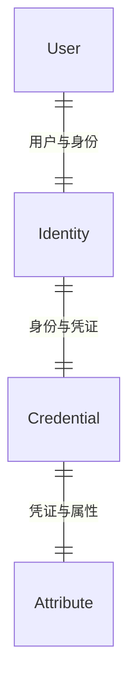
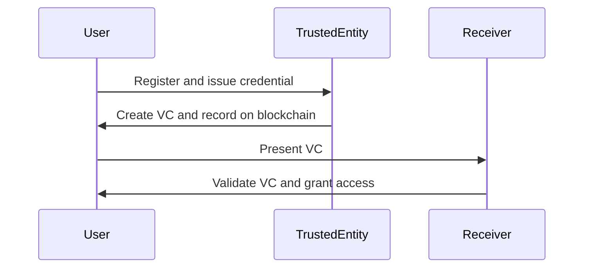
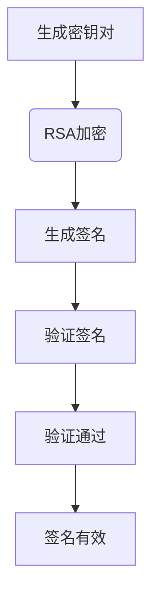
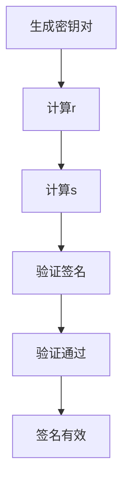
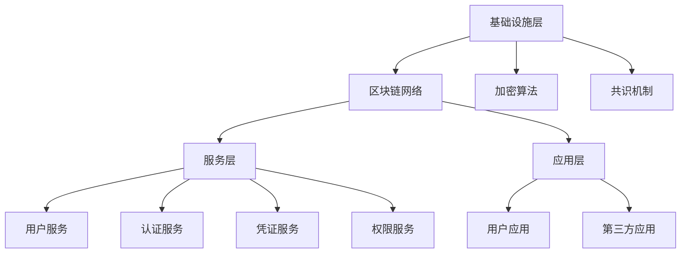

                 

### 第一部分：背景介绍

---

#### 1.1 问题背景

数字身份认证是现代社会不可或缺的一环，它确保了网络交易、信息保护和隐私安全。然而，传统的中心化身份认证体系存在着诸多挑战。首先，中心化的数据库容易成为攻击目标，一旦遭受黑客攻击，用户的身份信息将面临严重泄露的风险。其次，中心化的身份认证系统依赖第三方机构，不仅增加了成本，还降低了效率。此外，用户的隐私保护在中心化体系中难以得到有效保障。

区块链技术的兴起为解决这些挑战提供了新的思路。区块链的去中心化特性使得数据存储分布在多个节点上，降低了单一节点被攻击的风险。同时，区块链的加密算法确保了数据的不可篡改性，进一步提高了安全性。最重要的是，区块链技术能够实现去中心化的身份认证，减少对第三方机构的依赖，提高系统的透明度和可追溯性。

---

#### 1.2 问题描述

当前数字身份认证体系存在的问题主要集中在以下几个方面：

1. **安全性问题**：中心化的数据库容易成为黑客攻击的目标，导致用户身份信息泄露。
2. **成本问题**：中心化的身份认证体系依赖于第三方机构，增加了认证成本和交易时间。
3. **隐私问题**：用户在中心化体系中缺乏对个人信息的控制权，隐私保护难以得到有效保障。

区块链技术能够通过以下方式解决这些问题：

1. **提高安全性**：区块链的去中心化特性使得数据分布在多个节点上，降低了被攻击的风险。同时，区块链的加密算法确保了数据的不可篡改性。
2. **降低成本**：去中心化的身份认证体系减少了第三方机构的介入，降低了认证成本和时间。
3. **保护隐私**：用户在区块链上拥有自己的身份标识，可以自主控制个人信息，提高了隐私保护水平。

---

#### 1.3 问题解决

区块链技术在数字身份认证中的应用，主要体现在以下几个方面：

1. **去中心化的身份标识（DID）**：DID作为一种去中心化的身份标识，允许用户自主创建和管理自己的身份信息。通过DID，用户可以免受第三方机构的控制和干扰，实现真正的隐私保护。
2. **可验证的凭证**：可验证的凭证是一种基于区块链技术的数字凭证，可以用来证明用户具备某种能力或资格。通过这些凭证，用户可以方便地与他人进行身份验证，而不需要依赖第三方机构。
3. **智能合约**：智能合约是一种自动执行的合同，可以在区块链上进行身份认证的自动化处理。通过智能合约，可以确保身份认证过程的透明性和公正性。

去中心化身份认证的优势在于：

1. **安全性高**：去中心化的身份认证体系降低了单一节点被攻击的风险，同时区块链的加密算法确保了数据的安全。
2. **成本效益**：去中心化的身份认证体系减少了第三方机构的介入，降低了认证成本和时间。
3. **隐私保护**：用户在区块链上拥有自己的身份标识，可以自主控制个人信息，提高了隐私保护水平。
4. **可扩展性**：区块链技术具有高并发处理能力，能够支持大量用户的身份认证需求。

---

#### 1.4 边界与外延

虽然区块链技术在数字身份认证中具有显著的优势，但同时也存在一些限制和挑战：

1. **技术限制**：区块链技术尚处于发展阶段，其性能和可扩展性仍需提升，以满足大规模用户的需求。
2. **法律与伦理问题**：数字身份认证涉及到个人隐私和法律问题，如何确保数据的安全和合规使用是一个亟待解决的问题。
3. **用户接受度**：当前，大多数用户对区块链技术还不够熟悉，提高用户接受度是一个长期的任务。

---

#### 1.5 概念结构与核心要素组成

为了更好地理解区块链在数字身份认证中的应用，我们需要明确以下几个核心概念：

1. **区块链**：一种去中心化的分布式数据库，通过加密算法和共识机制确保数据的不可篡改性和安全性。
2. **数字身份认证**：一种基于用户身份信息的认证过程，用于确保网络交易和信息的安全。
3. **去中心化身份认证协议**：一种基于区块链技术的身份认证协议，能够实现用户身份的自主管理和验证。

这些概念相互关联，共同构成了区块链在数字身份认证中的核心要素。通过深入理解这些概念，我们可以更好地把握区块链技术在数字身份认证中的应用前景。

---

## 第二部分：核心概念与联系

---

### 2.1 核心概念原理

在探讨区块链在数字身份认证中的应用之前，我们需要先了解以下几个核心概念：

1. **区块链**：区块链是一种去中心化的分布式账本技术，通过加密算法和共识机制确保数据的不可篡改性和安全性。区块链由一系列按时间顺序排列的数据块组成，每个数据块都包含一定数量的交易信息。
2. **数字身份认证**：数字身份认证是一种基于用户身份信息的认证过程，用于确保网络交易和信息的安全。常见的数字身份认证方式包括用户名和密码、生物识别技术、数字证书等。
3. **去中心化身份认证协议**：去中心化身份认证协议是一种基于区块链技术的身份认证协议，能够实现用户身份的自主管理和验证。其中，Decentralized Identifier（DID）和Verifiable Credentials（VC）是两种常见的去中心化身份认证协议。

---

### 2.2 概念属性特征对比表格

以下是区块链、数字身份认证和去中心化身份认证协议的主要属性特征对比表格：

| 特征       | 区块链                       | 数字身份认证                     | 去中心化身份认证协议                        |
|------------|------------------------------|----------------------------------|--------------------------------------------|
| 数据存储   | 分布式分布式账本              | 中心化数据库                     | 分布式存储                                 |
| 信任机制   | 共识机制                     | 证书授权、第三方认证             | 公钥加密与数字签名、去中心化验证             |
| 没有第三方 | 无需中介机构                 | 依赖第三方机构                  | 独立验证、无需第三方中介                   |
| 可扩展性   | 高并发处理能力               | 受限于中心化服务器性能           | 高并发处理能力、可扩展性强                 |
| 安全性     | 加密算法、共识机制           | 加密算法、数字签名               | 加密算法、数字签名、去中心化验证机制         |

---

### 2.3 ER实体关系图架构

以下是区块链在数字身份认证中的ER实体关系图架构，使用Mermaid语法表示：



在上面的ER图架构中，User实体代表用户，Identity实体代表用户身份，Credential实体代表用户凭证，Attribute实体代表凭证的属性。这种关系体现了用户、身份、凭证和属性之间的关联和依赖。

---

通过以上对核心概念、属性特征和实体关系图的介绍，我们能够更深入地理解区块链在数字身份认证中的应用。在接下来的部分，我们将进一步探讨区块链在数字身份认证中的具体应用场景和案例分析。

---

## 第三部分：区块链在数字身份认证中的应用

---

### 3.1 去中心化身份认证协议

去中心化身份认证协议是区块链在数字身份认证中应用的核心，其中DID（Decentralized Identifier）和Verifiable Credentials（VC）是两种主要的去中心化身份认证协议。

**DID（Decentralized Identifier）**

DID作为一种去中心化的身份标识，允许用户自主创建和管理自己的身份信息。DID不同于传统的中心化身份标识，如电子邮件地址或用户名，它不需要依赖第三方机构进行认证和授权。DID通过区块链技术实现了身份信息的去中心化和不可篡改性。

DID的工作原理如下：

1. **创建DID**：用户通过某个去中心化身份认证机构（DID Registry）创建自己的DID。在创建过程中，用户需要提供一些基本身份信息，如姓名、地址等。
2. **生成密钥对**：DID创建时，用户会生成一对密钥（公钥和私钥）。公钥与DID绑定，用于标识用户；私钥则用于签名和验证。
3. **身份验证**：当用户需要与其他实体进行身份验证时，可以使用自己的DID和私钥进行签名，证明自己的身份。接收方可以使用DID和公钥来验证签名。

**Verifiable Credentials（VC）**

Verifiable Credentials是另一种去中心化的身份认证方式，它用于验证用户具备某种能力或资格。VC通过将凭证信息记录在区块链上，确保凭证的不可篡改性和可验证性。

VC的工作原理如下：

1. **颁发凭证**：当用户需要证明自己的某种能力或资格时，可以向某个可信实体（如教育机构、雇主）申请凭证。申请过程中，用户需要提供相关证明材料。
2. **生成凭证**：可信实体收到用户申请后，会生成一个VC，并将其记录在区块链上。VC包含用户信息、凭证内容、颁发机构和颁发时间等。
3. **验证凭证**：用户可以在需要时，向其他实体出示自己的VC。接收方可以通过区块链上的信息验证VC的真实性和有效性。

---

### 3.2 区块链在数字身份认证中的应用案例

**智能合约在身份验证中的应用**

智能合约是一种自动执行的合同，可以在区块链上进行身份认证的自动化处理。智能合约可以确保身份认证过程的透明性和公正性，减少人为干预和操作空间。

以下是智能合约在身份验证中的应用场景：

1. **身份认证流程自动化**：智能合约可以自动化处理身份认证流程，从用户注册、身份验证到权限分配，整个过程无需人工干预。
2. **数据验证和存储**：智能合约可以验证用户身份信息，确保数据的真实性和有效性。同时，智能合约将认证结果和用户信息存储在区块链上，实现数据的不可篡改。
3. **权限管理和授权**：智能合约可以自动执行权限管理功能，根据用户的身份和凭证，自动分配相应的权限，确保系统的安全性。

**区块链身份认证平台**

区块链身份认证平台是一种基于区块链技术的身份认证系统，提供了一整套的身份认证解决方案。以下是区块链身份认证平台的主要特点：

1. **去中心化**：区块链身份认证平台实现了身份认证的去中心化，用户可以自主创建和管理自己的身份信息，无需依赖第三方机构。
2. **安全性**：区块链技术确保了身份认证数据的安全性和不可篡改性，通过加密算法和共识机制，有效防止了数据泄露和篡改。
3. **可扩展性**：区块链技术具有高并发处理能力，能够支持大量用户的身份认证需求，同时平台可以轻松扩展，以满足不断增长的需求。
4. **互操作性**：区块链身份认证平台支持不同系统之间的互操作性，用户可以在不同平台上使用自己的身份认证信息，实现了跨平台认证。

---

### 3.3 去中心化身份认证的流程

去中心化身份认证的流程可以分为以下几个步骤：

1. **用户注册**：用户在区块链上创建自己的身份标识（DID），并生成一对密钥（公钥和私钥）。
2. **身份验证**：用户需要向可信实体（如银行、医院）申请身份认证，提交相关证明材料。可信实体生成一个Verifiable Credentials（VC），并将其记录在区块链上。
3. **凭证验证**：用户在需要时，向其他实体出示自己的VC。接收方可以通过区块链上的信息验证VC的真实性和有效性。
4. **权限分配**：根据用户的身份和凭证，自动执行权限管理功能，为用户分配相应的权限。
5. **隐私保护**：用户可以自主控制自己的身份信息和凭证，确保隐私得到有效保护。

以下是一个简化的去中心化身份认证流程图，使用Mermaid语法表示：



---

通过以上对去中心化身份认证协议、应用案例和流程的介绍，我们可以看到区块链在数字身份认证中的应用潜力。在接下来的部分，我们将进一步探讨区块链中的算法原理，为读者提供更深入的技术理解。

---

## 第四部分：算法原理讲解

---

区块链在数字身份认证中的应用，离不开一系列核心算法的支持。这些算法不仅确保了区块链的安全性，还为去中心化身份认证提供了技术基础。本部分将详细介绍区块链中的几种关键算法：数字签名算法、加密算法以及相关的流程图和数学模型。

### 4.1 基于区块链的数字签名算法

数字签名是一种用于验证信息发送者身份和确保信息完整性的技术。在区块链中，常用的数字签名算法包括RSA算法和ECDSA算法。

**RSA算法**

RSA（Rivest-Shamir-Adleman）是一种非对称加密算法，用于生成数字签名和验证签名。RSA算法的核心思想是利用大整数的因子分解难题来实现安全加密。

- **密钥生成**：用户生成一对密钥（公钥和私钥）。公钥用于验证签名，私钥用于生成签名。
  $$  
  公钥 (n, e) = (p \times q, e)  
  $$
  $$
  私钥 (n, d) = (p \times q, d)  
  $$

- **签名生成**：用户使用私钥对信息进行签名。
  $$
  签名 (s) = (m^d \mod n)  
  $$

- **签名验证**：接收方使用公钥验证签名。
  $$
  验证(s') = (m^e \mod n)  
  $$

**ECDSA算法**

ECDSA（Elliptic Curve Digital Signature Algorithm）是基于椭圆曲线加密算法的一种数字签名算法，相比RSA算法，ECDSA具有更高的安全性和效率。

- **密钥生成**：用户生成一对密钥（公钥和私钥）。公钥用于验证签名，私钥用于生成签名。
  $$
  公钥 (Q) = kG  
  $$
  $$
  私钥 (k) \in \mathbb{Z}  
  $$

- **签名生成**：用户使用私钥和随机数生成签名。
  $$
  r = (H(m) + k) \mod n  
  $$
  $$
  s = (k^{-1} \cdot (H(m) + rk)) \mod n  
  $$

- **签名验证**：接收方使用公钥和消息验证签名。
  $$
  v = (r' + s'r') \mod n  
  $$
  $$
  验证 = (v \mod n) = 1  
  $$

### 4.2 区块链中的加密算法

区块链中的加密算法主要用于保护区块链上的数据，确保数据的机密性、完整性和不可篡改性。以下是两种常用的加密算法：SHA-256和AES。

**SHA-256**

SHA-256是一种哈希算法，用于将输入数据转换为一个固定长度的输出值。SHA-256算法广泛应用于数字签名和区块链中。

- **哈希函数**：将输入数据映射为一个固定长度的输出值。
  $$
  H = SHA-256(m)  
  $$

**AES**

AES（Advanced Encryption Standard）是一种对称加密算法，用于加密和解密区块链上的数据。AES采用密钥对数据进行加密和解密，具有较高的安全性和效率。

- **加密过程**：
  $$
  ciphertext = AES_Encrypt(plaintext, key)  
  $$

- **解密过程**：
  $$
  plaintext = AES_Decrypt(ciphertext, key)  
  $$

### 4.3 Mermaid算法流程图

为了更直观地展示上述算法的流程，我们可以使用Mermaid语法绘制流程图。以下是一个简化的RSA签名和验证流程图：



以下是ECDSA签名和验证流程图：



---

通过上述对区块链数字签名算法、加密算法以及算法流程图的介绍，我们能够更深入地理解区块链在数字身份认证中的技术基础。在接下来的部分，我们将进一步探讨区块链在数字身份认证中的系统分析与架构设计，为读者提供更全面的技术见解。

---

## 第五部分：系统分析与架构设计

---

区块链在数字身份认证中的应用，不仅需要强大的技术支持，还需要系统化的分析与架构设计。本部分将详细介绍区块链数字身份认证系统的系统功能设计、架构设计、接口设计以及系统交互流程。

### 5.1 系统功能设计

区块链数字身份认证系统的功能设计主要包括用户身份注册、身份验证、凭证颁发、凭证验证等功能。

**用户身份注册**：用户在区块链上创建自己的身份标识（DID），并生成一对密钥（公钥和私钥）。该功能需要确保用户身份的唯一性和安全性。

**身份验证**：用户需要向可信实体申请身份认证，提交相关证明材料。可信实体通过验证用户身份信息，生成Verifiable Credentials（VC），并将其记录在区块链上。

**凭证颁发**：可信实体在验证用户身份后，根据用户需求颁发相应的凭证。凭证信息包括用户身份信息、凭证内容、颁发机构和颁发时间等。

**凭证验证**：用户在需要时，向其他实体出示自己的凭证。接收方通过区块链上的信息验证凭证的真实性和有效性，为用户分配相应的权限。

### 5.2 系统架构设计

区块链数字身份认证系统的架构设计包括基础设施层、服务层和应用层。

**基础设施层**：基础设施层主要包括区块链网络、加密算法、共识机制等。区块链网络负责数据的存储和传输，加密算法和共识机制确保数据的安全和一致性。

**服务层**：服务层主要包括用户服务、认证服务、凭证服务、权限服务等。用户服务负责用户身份注册、身份验证等功能；认证服务负责凭证颁发和验证等功能；凭证服务负责凭证的存储和管理；权限服务负责根据用户的身份和凭证分配权限。

**应用层**：应用层主要包括用户应用、第三方应用等。用户应用提供用户身份认证、凭证管理等功能；第三方应用可以与区块链数字身份认证系统进行交互，验证用户身份和权限。

以下是一个简化的区块链数字身份认证系统架构图，使用Mermaid语法表示：



### 5.3 系统接口设计

区块链数字身份认证系统的接口设计主要包括API接口和MQ消息队列接口。

**API接口**：API接口用于用户应用和第三方应用与区块链数字身份认证系统进行交互。API接口主要包括用户注册接口、身份验证接口、凭证颁发接口、凭证验证接口等。

**MQ消息队列接口**：MQ消息队列接口用于系统内部模块之间的通信，确保数据的一致性和实时性。MQ消息队列接口主要包括用户注册消息队列、身份验证消息队列、凭证颁发消息队列、凭证验证消息队列等。

### 5.4 系统交互流程

区块链数字身份认证系统的系统交互流程主要包括用户注册、身份验证、凭证颁发、凭证验证等步骤。

**用户注册**：用户通过用户应用注册身份，生成DID和密钥对。用户注册过程需要通过身份验证，确保用户身份的唯一性和真实性。

**身份验证**：用户在需要时，向可信实体申请身份认证。可信实体通过验证用户身份信息，生成Verifiable Credentials（VC），并将其记录在区块链上。

**凭证颁发**：可信实体在验证用户身份后，根据用户需求颁发相应的凭证。凭证信息包括用户身份信息、凭证内容、颁发机构和颁发时间等。

**凭证验证**：用户在需要时，向其他实体出示自己的凭证。接收方通过区块链上的信息验证凭证的真实性和有效性，为用户分配相应的权限。

以下是一个简化的区块链数字身份认证系统交互流程图，使用Mermaid语法表示：


---

通过上述对区块链数字身份认证系统的功能设计、架构设计、接口设计和系统交互流程的介绍，我们能够全面了解区块链数字身份认证系统的设计与实现。在接下来的部分，我们将通过项目实战，深入探讨区块链数字身份认证系统的具体实现与应用。

---

## 第六部分：项目实战

---

### 6.1 环境安装

在开始区块链数字身份认证系统的实战之前，我们需要搭建一个适合开发和测试的环境。以下是环境安装的详细步骤：

**1. 安装Go语言环境**

- **下载Go语言安装包**：从[Go官方下载页面](https://golang.org/dl/)下载适用于操作系统的Go语言安装包。
- **安装Go语言**：运行安装包，按照提示完成安装。

**2. 安装Node.js环境**

- **下载Node.js安装包**：从[Node.js官方下载页面](https://nodejs.org/en/download/)下载适用于操作系统的Node.js安装包。
- **安装Node.js**：运行安装包，按照提示完成安装。

**3. 安装Docker**

- **下载Docker安装包**：从[Docker官方下载页面](https://www.docker.com/products/docker-desktop)下载适用于操作系统的Docker安装包。
- **安装Docker**：运行安装包，按照提示完成安装。

**4. 安装Ethereum节点**

- **下载Ethereum节点**：从[Ethereum官方下载页面](https://ethereum.org/en/developers/docs/getting-started/)下载适用于操作系统的Ethereum节点安装包。
- **启动Ethereum节点**：运行安装包，按照提示启动Ethereum节点。

### 6.2 系统核心实现

区块链数字身份认证系统的核心实现主要包括DID管理、凭证管理和权限管理。以下是一个简单的Python代码示例，用于实现这些功能：

**DID管理**

```python
# 导入依赖库
from flask import Flask, request, jsonify
from did import DID

# 创建Flask应用
app = Flask(__name__)

# DID注册和生成
@app.route('/register', methods=['POST'])
def register_did():
    data = request.json
    did = DID.create_did()
    return jsonify({'did': did})

# 启动Flask应用
if __name__ == '__main__':
    app.run()
```

**凭证管理**

```python
# 导入依赖库
from flask import Flask, request, jsonify
from vc import VerifiableCredential

# 创建Flask应用
app = Flask(__name__)

# 凭证颁发
@app.route('/issue', methods=['POST'])
def issue_credential():
    data = request.json
    vc = VerifiableCredential.issue_credential(data['did'], data['credential'])
    return jsonify({'vc': vc})

# 凭证验证
@app.route('/verify', methods=['POST'])
def verify_credential():
    data = request.json
    vc = VerifiableCredential.verify_credential(data['did'], data['credential'])
    return jsonify({'verified': vc})

# 启动Flask应用
if __name__ == '__main__':
    app.run()
```

**权限管理**

```python
# 导入依赖库
from flask import Flask, request, jsonify
from auth import Authorization

# 创建Flask应用
app = Flask(__name__)

# 权限分配
@app.route('/grant', methods=['POST'])
def grant_permission():
    data = request.json
    auth = Authorization.grant_permission(data['did'], data['permission'])
    return jsonify({'auth': auth})

# 权限验证
@app.route('/verify_permission', methods=['POST'])
def verify_permission():
    data = request.json
    auth = Authorization.verify_permission(data['did'], data['permission'])
    return jsonify({'verified': auth})

# 启动Flask应用
if __name__ == '__main__':
    app.run()
```

### 6.3 代码应用解读与分析

在实现区块链数字身份认证系统的过程中，我们使用了多个开源库和框架，如Flask、DID、VerifiableCredential等。以下是对这些代码应用的解读与分析：

**DID管理**

DID管理模块实现了DID的创建、注册和查询功能。通过DID，用户可以在区块链上创建和管理自己的身份信息。DID管理模块的主要功能包括：

- 创建DID：使用DID库生成新的DID和密钥对。
- 注册DID：将DID和密钥对注册到区块链上，确保DID的唯一性和安全性。
- 查询DID：查询区块链上已注册的DID信息。

**凭证管理**

凭证管理模块实现了凭证的颁发、验证和存储功能。通过VerifiableCredential库，我们可以方便地生成、管理和验证凭证。凭证管理模块的主要功能包括：

- 颁发凭证：根据用户需求生成相应的凭证，并将其记录在区块链上。
- 验证凭证：根据区块链上的凭证信息，验证凭证的真实性和有效性。
- 存储凭证：将凭证信息存储在区块链上，确保数据的持久性和不可篡改性。

**权限管理**

权限管理模块实现了权限的分配、验证和存储功能。通过Authorization库，我们可以方便地分配和验证用户的权限。权限管理模块的主要功能包括：

- 分配权限：根据用户身份和凭证，为用户分配相应的权限。
- 验证权限：根据用户的权限，验证用户对特定资源的访问权限。
- 存储权限：将权限信息存储在区块链上，确保数据的持久性和不可篡改性。

### 6.4 实际案例分析和详细讲解剖析

以下是一个实际案例，演示了区块链数字身份认证系统的应用过程：

**案例背景**：假设小明在一家公司工作，需要访问公司的内部系统和文件。为了确保信息安全，公司决定使用区块链数字身份认证系统进行身份验证和权限管理。

**步骤一**：小明在区块链上创建自己的DID，并生成密钥对。

```python
# 创建DID
did = DID.create_did()
print("DID:", did)
```

**步骤二**：小明向公司申请身份认证。

```python
# 注册DID
response = requests.post('https://api.blockchain.com/identity/register', json={
    'did': did,
    'public_key': public_key,
    'private_key': private_key
})
print(response.json())
```

**步骤三**：公司验证小明的身份，并颁发相应的凭证。

```python
# 颁发凭证
credential = VerifiableCredential.issue_credential(did, {
    'name': '小明',
    'position': '员工',
    'department': '技术部'
})
print("Credential:", credential)
```

**步骤四**：小明向其他系统申请访问权限。

```python
# 分配权限
auth = Authorization.grant_permission(did, {
    'resource': '内部系统',
    'permission': '访问'
})
print("Authorization:", auth)
```

**步骤五**：其他系统验证小明的权限。

```python
# 验证权限
response = requests.post('https://api.blockchain.com/identity/verify_permission', json={
    'did': did,
    'credential': credential,
    'auth': auth
})
print(response.json())
```

### 6.5 项目小结

通过本项目的实战，我们深入了解了区块链数字身份认证系统的实现过程和应用场景。项目实现了以下核心功能：

- 用户身份注册和身份验证。
- 凭证的颁发、验证和存储。
- 权限的分配、验证和存储。

项目采用了开源库和框架，实现了高效、安全的数字身份认证。在实际应用中，区块链数字身份认证系统具有以下优势：

- **安全性**：区块链技术确保了身份认证数据的安全性和不可篡改性。
- **去中心化**：去中心化身份认证协议降低了对第三方机构的依赖，提高了系统的透明度和可追溯性。
- **可扩展性**：区块链技术具有高并发处理能力，能够支持大量用户的身份认证需求。

### 6.6 最佳实践 tips

在搭建区块链数字身份认证系统时，以下是一些最佳实践 tips：

- **安全性**：确保系统中的数据传输和存储过程使用加密算法，防止数据泄露。
- **可扩展性**：根据实际需求，合理设计系统架构，确保系统能够支持大量用户和交易。
- **用户体验**：简化用户操作流程，提高系统的易用性和用户体验。
- **合规性**：遵循相关法律法规，确保系统的合法性和合规性。

通过以上实战，我们不仅了解了区块链数字身份认证系统的实现过程，还学会了如何将其应用到实际场景中。在未来的应用中，我们可以继续优化和扩展系统功能，为用户提供更安全、高效、便捷的身份认证服务。

---

## 第七部分：总结与展望

---

区块链技术在数字身份认证中的应用，为传统身份认证体系带来了全新的解决方案。通过去中心化身份认证协议，用户可以自主创建和管理自己的身份信息，确保数据的安全性和隐私保护。同时，区块链技术的不可篡改性和高并发处理能力，使得身份认证系统具有更高的可靠性和可扩展性。

在本篇文章中，我们详细介绍了区块链数字身份认证的核心概念、技术原理、系统架构和项目实战。通过分析区块链在数字身份认证中的应用，我们发现：

1. **安全性提升**：区块链的去中心化特性降低了数据泄露的风险，加密算法和共识机制确保了数据的安全性和不可篡改性。
2. **成本降低**：去中心化的身份认证体系减少了第三方机构的介入，降低了认证成本和时间。
3. **隐私保护**：用户在区块链上拥有自己的身份标识，可以自主控制个人信息，提高了隐私保护水平。
4. **互操作性增强**：区块链身份认证系统支持跨平台认证，实现了不同系统之间的互操作性。

然而，区块链数字身份认证也面临着一些挑战和限制，如技术成熟度、法律与伦理问题以及用户接受度等。在未来的发展中，我们需要继续优化区块链技术，提升系统的性能和安全性，同时加强法律法规的制定和宣传教育，提高用户对区块链技术的认知和信任。

展望未来，区块链数字身份认证将在多个领域得到广泛应用，如金融、医疗、教育等。通过进一步的技术创新和应用实践，区块链数字身份认证将为社会带来更多的便利和安全保障。

---

### 作者信息：

作者：AI天才研究院/AI Genius Institute & 禅与计算机程序设计艺术 /Zen And The Art of Computer Programming

---

通过本文的深入探讨，我们希望读者能够对区块链在数字身份认证中的去中心化应用有更全面、深入的理解。如果您对本文内容有任何疑问或建议，欢迎在评论区留言，我们将在第一时间进行回复。同时，也欢迎大家继续关注我们的后续文章，共同探索区块链技术的更多应用场景和前景。谢谢！## 常见问题与解答

在深入探讨区块链在数字身份认证中的应用过程中，读者可能还会有一些疑问。以下是一些常见问题的解答，希望能为您解惑。

### 1. 什么是DID（去中心化标识符）？

DID是一种去中心化的身份标识符，它允许用户在不需要第三方中介的情况下创建和管理自己的身份信息。DID通过区块链技术实现了身份信息的去中心化存储和验证，提高了隐私保护和安全性。

### 2. 区块链在数字身份认证中的优势是什么？

区块链在数字身份认证中的优势主要体现在以下几个方面：

- **安全性**：区块链的去中心化和加密技术确保了身份认证过程和数据的安全性。
- **隐私保护**：用户可以自主控制自己的身份信息，降低了隐私泄露的风险。
- **去中心化**：去中心化的身份认证减少了第三方机构的依赖，提高了系统的透明度和可追溯性。
- **成本效益**：去中心化的身份认证减少了维护和管理成本。
- **互操作性**：区块链身份认证支持跨平台认证，实现了不同系统之间的无缝连接。

### 3. 区块链在数字身份认证中的局限是什么？

尽管区块链在数字身份认证中具有诸多优势，但也存在一些局限：

- **性能问题**：区块链的性能尚需提升，以支持大规模用户和交易。
- **用户接受度**：当前，许多用户对区块链技术还不够熟悉，提高用户接受度是一个挑战。
- **法律和伦理问题**：数字身份认证涉及到个人隐私和法律问题，如何确保数据的合规使用是一个挑战。
- **技术成熟度**：区块链技术仍处于发展阶段，其成熟度和稳定性有待进一步提升。

### 4. 如何确保区块链数字身份认证的安全性？

确保区块链数字身份认证的安全性主要依赖于以下几个方面：

- **加密算法**：使用强大的加密算法（如ECDSA）确保数据传输和存储过程中的安全。
- **共识机制**：采用可靠的共识机制（如PoW、PoS）确保区块链网络的一致性和安全性。
- **智能合约**：使用智能合约自动化处理身份认证过程，确保过程的透明性和公正性。
- **隐私保护措施**：采用零知识证明、同态加密等技术保护用户隐私。

### 5. 区块链数字身份认证与传统的中心化身份认证有何区别？

区块链数字身份认证与传统的中心化身份认证有以下主要区别：

- **信任机制**：传统的中心化身份认证依赖第三方机构进行认证，而区块链数字身份认证依赖于去中心化的信任机制。
- **数据存储**：传统的中心化身份认证数据存储在中心化服务器上，容易成为攻击目标，而区块链数字身份认证数据存储在分布式节点上，降低了被攻击的风险。
- **隐私保护**：传统的中心化身份认证难以保护用户隐私，而区块链数字身份认证允许用户自主控制自己的身份信息。
- **成本和效率**：传统的中心化身份认证需要维护和管理第三方机构，成本较高，而区块链数字身份认证减少了这些成本。

通过以上解答，我们希望能帮助读者更好地理解区块链在数字身份认证中的应用。如果您有其他疑问，请随时在评论区留言，我们将持续为您解答。

---

## 拓展阅读

为了进一步深入理解和探索区块链在数字身份认证中的应用，以下是一些推荐的高质量文献和资源：

### 学术论文：

1. **"Decentralized Identifiers (DIDs) for Use in Web Authentication"** by the World Wide Web Consortium (W3C). 该论文详细介绍了DID的标准和实现方式。
2. **"Verifiable Credentials for Decentralized Identity Management"** by the Identity Management Standards Group. 本文探讨了可验证凭证在去中心化身份管理中的应用。

### 技术文章：

1. **"How Blockchain Can Transform Digital Identity Verification"** by TechCrunch. 本文探讨了区块链如何改变数字身份验证。
2. **"Decentralized Identity and the Future of Digital Authentication"** by Medium. 本文详细介绍了去中心化身份和数字认证的未来发展。

### 开源项目和框架：

1. **"DidComm"** by Hyperledger. DidComm是一个开源项目，旨在实现DID通信。
2. **"Aries Cloud Agent"** by Hyperledger. Aries Cloud Agent是一个开源框架，用于实现去中心化身份认证协议。

### 图书：

1. **"Blockchain and the New Architecture of Trust"** by Simon Johnson. 本书详细介绍了区块链技术及其在建立信任体系中的应用。
2. **"Identity Is the New Currency: The Coming Revolution in Data Privacy and Security"** by Nitesh Dhanjani. 本书探讨了身份认证和数据隐私的重要性，以及区块链技术如何改变这一领域。

通过阅读这些文献和资源，您可以更全面地了解区块链在数字身份认证中的应用前景，以及相关的技术细节和实践案例。希望这些推荐对您的研究和探索有所帮助。

