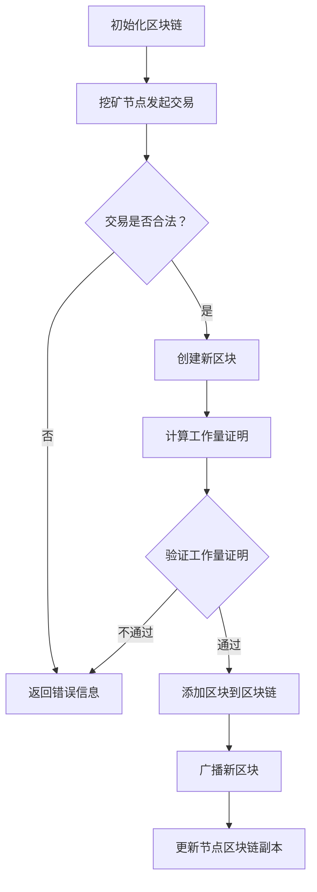
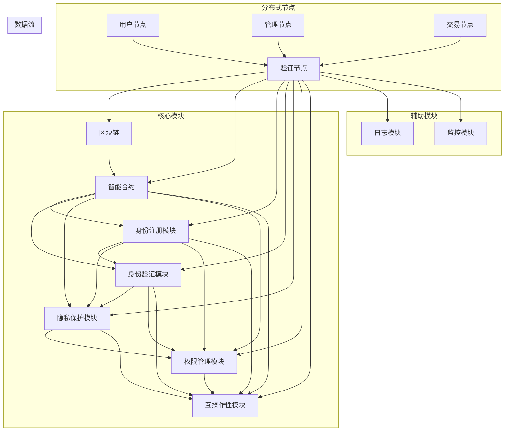
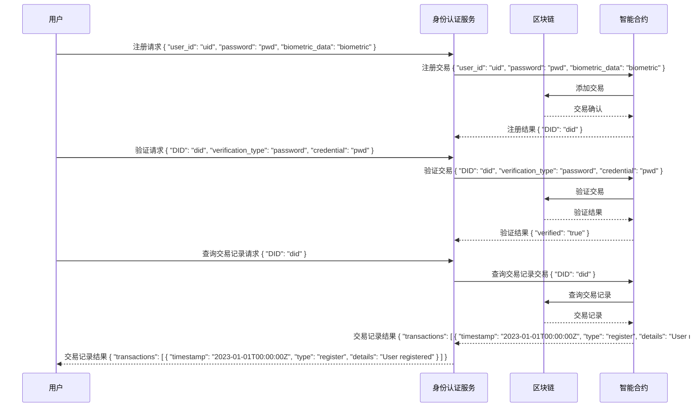

                 

### 1.1 问题背景

在当今数字化时代，身份认证已成为信息社会中不可或缺的一部分。从日常登录社交媒体账户到进行在线金融交易，身份认证无处不在。然而，传统身份认证系统面临着诸多挑战，如数据泄露、隐私侵犯、安全性问题等。随着区块链技术的发展，去中心化身份认证系统成为解决这些问题的潜在方案。

#### 1.1.1 传统身份认证系统的挑战

传统身份认证系统通常依赖中心化的认证机构来验证用户的身份，这些机构拥有集中的数据库存储用户信息。这种模式存在几个显著问题：

1. **数据集中化**：用户信息集中在某个中心化的数据库中，一旦数据库被攻击或泄露，所有用户信息可能同时遭到窃取。
2. **隐私风险**：用户在传统系统中必须信任中心化的认证机构，这可能导致隐私泄露。
3. **信任问题**：中心化的认证机构可能存在滥权行为，如非法共享用户信息。
4. **效率低下**：中心化的认证系统在处理大量认证请求时可能出现延迟。

#### 1.1.2 区块链在身份认证中的潜力

区块链技术以其去中心化、不可篡改、透明等特性，为解决传统身份认证系统的问题提供了新思路：

1. **去中心化**：区块链通过去中心化的分布式账本技术，消除了单一中心化点，从而提高了系统的容错性和安全性。
2. **不可篡改**：区块链上的数据一旦被记录，就几乎无法篡改，这为用户信息的真实性提供了保障。
3. **透明性**：区块链上的数据对所有参与者都是可见的，这增加了系统的透明度和信任度。
4. **隐私保护**：通过零知识证明等技术，区块链可以实现隐私保护，用户可以在不泄露敏感信息的情况下验证身份。

总的来说，区块链在数字身份认证中的应用，为构建更加安全、高效和去中心化的身份验证系统提供了有力支持。在接下来的章节中，我们将深入探讨区块链、数字身份认证和去中心化身份验证系统的核心概念，进一步理解这些技术如何相互作用，共同推动身份认证领域的发展。

### 1.2 核心概念

为了深入探讨区块链在数字身份认证中的应用，首先需要明确几个核心概念：区块链、数字身份认证和去中心化身份验证系统。以下是对这些概念的定义及其属性的详细介绍。

#### 1.2.1 区块链基础

区块链是一种分布式数据库技术，通过加密算法和共识机制，实现了数据的去中心化存储和传输。其核心特点包括：

1. **去中心化**：区块链没有中心化的管理者或单一控制点，所有节点都参与数据的验证和存储。
2. **不可篡改**：一旦数据被记录在区块链上，就几乎无法被篡改，保证了数据的历史真实性。
3. **透明性**：区块链上的数据对所有参与者都是可见的，提高了系统的透明度和信任度。
4. **安全性**：区块链使用加密算法保护数据的安全，确保只有授权用户可以访问数据。

#### 1.2.2 数字身份认证

数字身份认证是一种通过验证用户身份来确保网络安全和隐私的技术。其主要功能包括身份验证和授权。数字身份认证的关键属性包括：

1. **身份验证**：通过用户名、密码、生物识别信息等方式验证用户身份。
2. **安全性**：确保认证过程中的信息传输和存储是安全的，防止信息泄露。
3. **灵活性**：支持多种认证方式，如单点登录、多因素认证等，满足不同场景的需求。
4. **隐私保护**：在认证过程中，应保护用户的隐私信息，防止隐私泄露。

#### 1.2.3 去中心化身份验证系统

去中心化身份验证系统（DID）是一种基于区块链技术的身份验证解决方案，旨在实现用户身份信息的去中心化和可验证性。其主要特点包括：

1. **去中心化**：DID系统通过分布式账本技术，消除了中心化的认证机构，降低了系统风险。
2. **身份可验证**：用户可以控制自己的身份信息，并通过区块链上的去中心化身份注册机构进行验证。
3. **隐私保护**：通过加密技术和零知识证明等隐私保护技术，DID系统可以在不泄露敏感信息的情况下验证用户身份。
4. **互操作性**：DID系统支持不同系统之间的身份信息互认，提高了认证的效率和安全性。

### 概念属性特征对比表

为了更好地理解这三个概念之间的关系和区别，我们可以通过以下对比表来展示它们的关键属性特征：

| 特征 | 区块链 | 数字身份认证 | 去中心化身份验证系统（DID） |
| ---- | ---- | ---- | ---- |
| 数据存储 | 去中心化分布式账本 | 中心化数据库或分布式数据库 | 去中心化分布式账本 |
| 不可篡改性 | 是的，高度不可篡改 | 高度不可篡改（依赖于技术实现） | 是的，高度不可篡改 |
| 透明性 | 是的，高度透明 | 透明性较低（依赖于认证系统） | 是的，高度透明 |
| 身份验证 | 否，仅数据传输 | 是的，验证用户身份 | 是的，验证用户身份 |
| 隐私保护 | 较高（通过加密等） | 较低（依赖于认证系统） | 高（通过加密、零知识证明等） |
| 去中心化 | 是的，完全去中心化 | 部分去中心化（依赖于认证机构） | 是的，完全去中心化 |

### ER实体关系图

为了更直观地展示这三个概念之间的联系，我们可以通过ER实体关系图来表示：

1. **实体与关系定义**：
   - **实体**：区块链、数字身份认证、去中心化身份验证系统。
   - **关系**：区块链支持数字身份认证，数字身份认证可以基于去中心化身份验证系统。

2. **图的绘制与解释**：
   - **ER实体关系图**：在ER图中，区块链、数字身份认证和去中心化身份验证系统作为三个主要实体，它们之间通过关系线连接。区块链实体与数字身份认证实体之间存在“支持”关系，而数字身份认证实体与去中心化身份验证系统实体之间存在“基于”关系。

以下是ER实体关系图的Mermaid表示：

```mermaid
erDiagram
  区块链 ||--|{ 数字身份认证 }|
  数字身份认证 ||--|{ 去中心化身份验证系统 }|
```

通过以上对核心概念的介绍和ER实体关系图的展示，我们可以更清晰地理解区块链、数字身份认证和去中心化身份验证系统之间的关系，以及它们各自的关键属性特征。

### 1.4 ER实体关系图

为了更直观地展示区块链、数字身份认证和去中心化身份验证系统之间的关系，我们将使用Mermaid语法绘制一个ER实体关系图。ER图是数据库设计中常用的一种图形化表示方法，用于描述实体之间的关联关系。

#### 1.4.1 实体与关系定义

在本次ER图中，我们定义以下三个主要实体：

- **区块链**：作为基础技术平台，提供去中心化数据存储和传输功能。
- **数字身份认证**：用于验证用户的身份，确保网络安全的系统。
- **去中心化身份验证系统（DID）**：基于区块链技术，实现用户身份信息的去中心化存储和验证。

实体之间的关系定义如下：

- **区块链与数字身份认证**：区块链为数字身份认证提供技术支持，使得身份认证过程更安全、更透明。
- **数字身份认证与去中心化身份验证系统**：数字身份认证系统基于去中心化身份验证系统，利用其去中心化和不可篡改的特性进行用户身份的验证。

#### 1.4.2 图的绘制与解释

以下是使用Mermaid语法绘制的ER实体关系图：

```mermaid
erDiagram
  区块链 ||--|{ 数字身份认证 }|
  数字身份认证 ||--|{ 去中心化身份验证系统 }|
```

- **区块链**：作为实体，位于图的顶部，与**数字身份认证**通过虚线连接，表示其提供技术支持。
- **数字身份认证**：位于区块链下方，与**去中心化身份验证系统**通过虚线连接，表示其基于去中心化身份验证系统实现。
- **去中心化身份验证系统**：位于数字身份认证下方，表示其是数字身份认证的实现基础。

这个ER图简洁明了地展示了区块链、数字身份认证和去中心化身份验证系统之间的层次关系。区块链作为底层技术平台，支撑数字身份认证系统；数字身份认证系统基于去中心化身份验证系统实现用户身份的验证，保证了系统的去中心化和不可篡改性。

通过这种图形化的表示，读者可以更直观地理解这三个概念之间的关系，以及区块链技术在数字身份认证中的应用和优势。

### 2.1 区块链算法原理

区块链技术的核心在于其算法原理，这些算法确保了区块链的去中心化、不可篡改性和安全性。以下是区块链算法原理的详细讲解，包括区块链的工作原理、共识机制和智能合约。

#### 2.1.1 区块链的工作原理

区块链是一种分布式数据库，其数据以区块的形式存储。每个区块包含一定数量的交易记录，这些区块通过加密和时间戳按照先后顺序链接在一起，形成区块链。

1. **区块**：每个区块包含以下信息：
   - **版本号**：区块的版本信息。
   - **默克尔树根**：用于验证区块内交易记录的完整性。
   - **时间戳**：区块创建的时间。
   - **难度目标**：用于控制区块链生成的速度。
   - **上一个区块的哈希值**：用于链接前后区块，确保区块链的连续性。
   - **交易数据**：包含该区块内所有的交易记录。

2. **区块链**：由一系列按顺序排列的区块组成，每个区块都通过其上一个区块的哈希值与区块链的其他部分连接起来。

3. **挖矿**：区块链通过“挖矿”过程来创建新的区块。挖矿节点通过解决一个数学难题来生成新的区块，该难题的难度由区块链的当前状态决定。成功解决难题的节点将获得比特币奖励，并将新区块添加到区块链上。

4. **区块链网络**：区块链通过分布式网络运行，网络中的每个节点都保存一份完整的区块链副本。节点通过共识机制来验证和确认交易，确保区块链的一致性和安全性。

#### 2.1.2 共识机制

共识机制是区块链网络中节点达成一致的方式。不同的区块链采用不同的共识机制，以下是一些常见的共识机制：

1. **工作量证明（PoW）**：
   - **原理**：节点通过解决一个复杂的数学难题来竞争生成新的区块。
   - **优点**：去中心化，安全。
   - **缺点**：能耗高，速度慢。

2. **权益证明（PoS）**：
   - **原理**：根据节点持有的代币数量和持有时间来决定其参与区块生成的概率。
   - **优点**：能耗低，速度更快。
   - **缺点**：可能导致“富者愈富”的问题。

3. **委托权益证明（DPoS）**：
   - **原理**：由持有代币的节点投票选举产生超级节点，超级节点负责生成区块。
   - **优点**：效率高，去中心化程度较高。
   - **缺点**：可能存在中心化风险。

4. **权威证明（PoA）**：
   - **原理**：由一组可信实体（权威节点）负责生成区块。
   - **优点**：速度极快，延迟低。
   - **缺点**：信任风险较高。

#### 2.1.3 智能合约

智能合约是区块链上的自执行合同，其代码存储在区块链上，并在满足特定条件时自动执行。智能合约由以下部分组成：

1. **合约代码**：编写在某种编程语言（如Solidity）中的代码，定义了合约的行为和逻辑。
2. **状态变量**：存储合约的状态信息，如账户余额、订单状态等。
3. **事件日志**：合约执行过程中记录的事件，用于跟踪合约的行为。

智能合约的关键特性包括：

- **去中心化**：智能合约代码在区块链上公开透明，任何节点都可以验证其执行过程。
- **不可篡改**：一旦智能合约部署到区块链上，其代码不可篡改。
- **自动化执行**：智能合约在满足特定条件时自动执行，无需人工干预。

通过智能合约，区块链不仅可以用于数字货币交易，还可以用于去中心化身份认证等场景，实现自动化、透明和安全的合约执行。

### 2.2 Mermaid算法流程图

为了更好地理解区块链的算法原理，我们可以使用Mermaid语法绘制一个算法流程图。以下是区块链生成新区块的简单流程图示例：



#### 2.2.1 算法流程概述

该算法流程图描述了区块链生成新区块的步骤：

1. **初始化区块链**：开始一个新的区块链。
2. **挖矿节点发起交易**：挖矿节点收集交易记录，准备创建新区块。
3. **交易是否合法？**：检查交易是否满足区块链规则。
4. **创建新区块**：如果交易合法，创建一个新的区块。
5. **计算工作量证明**：挖矿节点计算工作量证明，解决数学难题。
6. **验证工作量证明**：其他节点验证工作量证明的正确性。
7. **添加区块到区块链**：如果工作量证明通过验证，将新区块添加到区块链上。
8. **广播新区块**：将新区块广播到所有节点。
9. **更新节点区块链副本**：节点更新其区块链副本，确保与网络一致。

通过这个流程图，读者可以更直观地理解区块链的算法原理和执行步骤，为后续的Python代码实现打下基础。

### 2.3 Python代码实现

在理解了区块链的基本算法原理后，我们将使用Python代码实现一个简化版的新区块生成和验证过程。以下是实现步骤和代码分析：

#### 2.3.1 代码结构与功能

整个代码分为几个模块：

- **区块链基础**：定义区块结构和区块链类。
- **交易**：定义交易类。
- **工作量证明**：实现工作量证明算法。
- **区块链操作**：实现区块的添加和验证。

#### 2.3.2 代码结构与功能

**1. 区块链基础**

```python
import hashlib
import json
from time import time

class Block:
    def __init__(self, index, transactions, timestamp, previous_hash):
        self.index = index
        self.transactions = transactions
        self.timestamp = timestamp
        self.previous_hash = previous_hash
        self.hash = self.compute_hash()

    def compute_hash(self):
        block_string = json.dumps(self.__dict__, sort_keys=True)
        return hashlib.sha256(block_string.encode()).hexdigest()

class Blockchain:
    def __init__(self):
        self.unconfirmed_transactions = []
        self.chain = []
        self.create_genesis_block()

    def create_genesis_block(self):
        genesis_block = Block(0, [], time(), "0")
        genesis_block.hash = genesis_block.compute_hash()
        self.chain.append(genesis_block)

    def add_new_transaction(self, transaction):
        self.unconfirmed_transactions.append(transaction)

    def mine(self):
        if not self.unconfirmed_transactions:
            return False

        last_block = self.chain[-1]
        new_block = Block(index=last_block.index + 1,
                          transactions=self.unconfirmed_transactions,
                          timestamp=time(),
                          previous_hash=last_block.hash)

        new_block.hash = new_block.compute_hash()

        self.chain.append(new_block)
        self.unconfirmed_transactions = []
        return new_block.index
```

**2. 交易**

```python
class Transaction:
    def __init__(self, sender, recipient, amount):
        self.sender = sender
        self.recipient = recipient
        self.amount = amount
```

**3. 工作量证明**

```python
import random

def proof_of_work(last_block_hash):
    proof = random.randint(1, 10000000)
    computed_hash = hashlib.sha256((str(proof) + last_block_hash).encode()).hexdigest()
    while computed_hash[:4] != "0000":
        proof += 1
    return proof
```

**4. 区块链操作**

```python
def verify_chain(blockchain):
    for i in range(1, len(blockchain.chain)):
        current_block = blockchain.chain[i]
        previous_block = blockchain.chain[i - 1]

        if current_block.hash != current_block.compute_hash():
            return False

        if current_block.previous_hash != previous_block.hash:
            return False

    return True
```

#### 2.3.3 数学模型与公式

区块链算法涉及一些基础的数学模型和公式，以下简要介绍：

- **哈希函数**：将任意长度的数据转换为一个固定长度的字符串。常用的哈希函数有SHA-256。
- **工作量证明（PoW）**：找到一个数`proof`，使得`hash(proof + last_block_hash)`的前几位为0。具体公式为：

  $$ hash(proof + last\_block\_hash) \equiv 0 \pmod{10^{n}} $$

  其中`n`为前导零的位数。

#### 2.3.4 举例说明

**1. 创建区块链**

```python
blockchain = Blockchain()
```

**2. 添加交易**

```python
transaction1 = Transaction("Alice", "Bob", 50)
blockchain.add_new_transaction(transaction1)
```

**3. 挖矿并添加区块**

```python
blockchain.mine()
```

**4. 验证区块链**

```python
is_valid = verify_chain(blockchain)
print(is_valid)  # 应输出 True
```

通过上述代码和例子，读者可以了解区块链的基本操作和实现过程，进一步理解区块链的算法原理和数学模型。

### 2.4 算法原理详细讲解

为了更深入地理解区块链算法的原理，我们将从数学模型和公式的角度对其进行详细讲解，并逐步剖析Python代码中的各个步骤。

#### 2.4.1 数学模型解析

区块链算法的核心在于其工作量证明（Proof of Work, PoW）机制，这一机制通过解决一个复杂的数学难题来确保区块链的安全和一致性。主要的数学模型和公式包括：

1. **哈希函数**：
   - 哈希函数如SHA-256可以将任意长度的数据转换为一个固定长度的字符串。例如，给定一个字符串`input`，通过SHA-256哈希函数可以得到其对应的哈希值`hash(input)`。
   - 哈希函数的特点是单向性和抗碰撞性，即给定哈希值很难反推出原始输入，且不同输入的哈希值不会相同。

2. **工作量证明（PoW）**：
   - 在PoW机制中，需要找到一个数`proof`，使得将`proof`与区块链最后一个区块的哈希值拼接后生成的哈希值满足特定条件。通常要求这个哈希值的前几位为0，以确保计算复杂度。
   - 公式表示为：
     $$ hash(proof + last\_block\_hash) \equiv 0 \pmod{10^{n}} $$
     其中`n`表示前导零的位数。

3. **区块链一致性**：
   - 区块链的一致性通过每个区块的`previous_hash`字段与前一区块的哈希值保持一致来保证。
   - 公式表示为：
     $$ current\_block.previous\_hash \equiv previous\_block.hash $$

#### 2.4.2 Python代码解读

下面我们逐步分析Python代码中的各个关键部分，解释其背后的算法原理。

**1. Block类**

```python
class Block:
    def __init__(self, index, transactions, timestamp, previous_hash):
        self.index = index
        self.transactions = transactions
        self.timestamp = timestamp
        self.previous_hash = previous_hash
        self.hash = self.compute_hash()

    def compute_hash(self):
        block_string = json.dumps(self.__dict__, sort_keys=True)
        return hashlib.sha256(block_string.encode()).hexdigest()
```

- **初始化**：Block类初始化时接收几个参数：区块索引（index）、交易列表（transactions）、时间戳（timestamp）和前一区块的哈希值（previous_hash）。同时，计算并设置区块的哈希值（hash）。
- **哈希计算**：`compute_hash`方法将区块的属性（index、transactions、timestamp、previous_hash）转换为JSON字符串，然后使用SHA-256哈希函数计算其哈希值。

**2. Blockchain类**

```python
class Blockchain:
    def __init__(self):
        self.unconfirmed_transactions = []
        self.chain = []
        self.create_genesis_block()

    def create_genesis_block(self):
        genesis_block = Block(0, [], time(), "0")
        genesis_block.hash = genesis_block.compute_hash()
        self.chain.append(genesis_block)

    def add_new_transaction(self, transaction):
        self.unconfirmed_transactions.append(transaction)

    def mine(self):
        if not self.unconfirmed_transactions:
            return False

        last_block = self.chain[-1]
        new_block = Block(index=last_block.index + 1,
                          transactions=self.unconfirmed_transactions,
                          timestamp=time(),
                          previous_hash=last_block.hash)

        new_block.hash = new_block.compute_hash()

        self.chain.append(new_block)
        self.unconfirmed_transactions = []
        return new_block.index
```

- **初始化**：Blockchain类初始化时创建一个空交易列表（unconfirmed_transactions）和一个空区块链列表（chain），然后创建创世区块（genesis_block）。
- **创建创世区块**：`create_genesis_block`方法创建第一个区块，并将其添加到区块链中。
- **添加交易**：`add_new_transaction`方法将新交易添加到未确认交易列表中。
- **挖矿**：`mine`方法执行挖矿过程。如果未确认交易列表不为空，该方法将创建一个新的区块，并计算其哈希值。新区块被添加到区块链中，未确认交易列表清空。

**3. 工作量证明**

```python
import random

def proof_of_work(last_block_hash):
    proof = random.randint(1, 10000000)
    computed_hash = hashlib.sha256((str(proof) + last_block_hash).encode()).hexdigest()
    while computed_hash[:4] != "0000":
        proof += 1
    return proof
```

- **证明过程**：`proof_of_work`函数接受区块链最后一个区块的哈希值（last_block_hash），并随机生成一个`proof`值。然后，函数通过SHA-256哈希函数计算拼接后的哈希值。如果哈希值的前四位不是"0000"，则增加`proof`值，直到找到满足条件的哈希值。

通过上述详细讲解，读者可以更清晰地理解区块链算法的原理，以及Python代码中各个部分的实现。这为后续的深入研究和实际应用奠定了坚实的基础。

### 2.5 本章小结

在本章中，我们详细讲解了区块链在数字身份认证中的应用，首先介绍了区块链的工作原理、共识机制和智能合约，通过Mermaid算法流程图和Python代码示例，使读者对区块链的核心算法有了更深入的理解。接着，我们剖析了区块链在数字身份认证中的实际应用，探讨了其去中心化、不可篡改和透明性的优势。通过本章的学习，读者应掌握区块链的基本概念和算法原理，理解其在数字身份认证中的应用场景和优势。

### 3.1 问题场景介绍

在现代信息化社会中，身份认证的需求无处不在。无论是在线购物、金融交易，还是社交媒体登录，用户身份的验证都是保障系统安全与数据隐私的关键环节。然而，传统的身份认证系统却面临着诸多挑战，包括数据集中化、隐私风险和信任问题。为了解决这些问题，我们需要设计一种更加安全、高效且去中心化的身份验证系统。

#### 3.1.1 身份验证需求

数字身份认证系统的需求主要包括以下几点：

1. **安全性**：系统需要能够有效保护用户的身份信息，防止数据泄露和滥用。
2. **可验证性**：用户身份需要被系统认证，以确保只有授权用户才能访问相应资源。
3. **隐私保护**：系统应保护用户的隐私，确保在验证过程中不泄露敏感信息。
4. **互操作性**：系统应支持不同应用和服务之间的身份信息互认，提高用户体验。
5. **去中心化**：系统应消除中心化的信任点，降低系统被攻击的风险。

#### 3.1.2 系统目标

基于上述需求，我们的目标是设计一个去中心化身份验证系统（DID），其主要目标如下：

1. **去中心化架构**：通过分布式账本技术，确保系统中的所有节点都能参与身份验证，消除中心化信任点。
2. **安全性与不可篡改性**：利用区块链的加密和共识机制，保障用户身份信息的安全和数据的不可篡改性。
3. **隐私保护**：采用零知识证明等隐私保护技术，确保用户在验证过程中不泄露敏感信息。
4. **高可扩展性**：系统应具备良好的扩展性，支持大量用户和交易的高效处理。
5. **互操作性与标准化**：通过制定标准化的接口和协议，实现不同系统之间的身份信息互认。

通过实现上述目标，我们的去中心化身份验证系统能够为用户提供更加安全、可靠和高效的数字身份认证服务，从而解决传统身份认证系统面临的诸多挑战。

### 3.2 系统功能设计

为了实现去中心化身份验证系统（DID）的主要目标，我们需要设计一套全面的功能体系。以下是对系统功能需求的详细分析，以及使用Mermaid绘制的领域模型类图。

#### 3.2.1 功能需求分析

去中心化身份验证系统的核心功能需求包括以下几个方面：

1. **用户身份注册**：用户可以通过系统注册身份，获取去中心化的身份标识（DID）。
2. **身份验证**：系统需要提供多种身份验证方式，如密码、生物识别、零知识证明等。
3. **隐私保护**：系统应实现隐私保护功能，确保用户在验证过程中不泄露敏感信息。
4. **身份信息管理**：用户可以管理自己的身份信息，包括查看、修改和删除。
5. **跨系统互认**：系统应支持与其他系统之间的身份信息互认，提高用户体验。
6. **权限管理**：系统应提供权限管理功能，确保只有授权用户可以访问特定信息。
7. **交易记录存储**：系统应记录所有身份验证交易记录，确保数据的完整性和可追溯性。

#### 3.2.2 Mermaid领域模型类图

为了更直观地展示系统功能模块及其关系，我们使用Mermaid语法绘制了一个领域模型类图。以下是类图的表示：

```mermaid
classDiagram
  UserEntity <<entity>>
  Identity <<entity>>
  Verification <<entity>>
  Privacy <<entity>>
  Management <<entity>>
  Interoperability <<entity>>
  Permission <<entity>>
  Transaction <<entity>>

  UserEntity o--o Identity
  Identity o--o Verification
  Verification o--o Privacy
  Privacy o--o Management
  Management o--o Interoperability
  Management o--o Permission
  Management o--o Transaction

  UserEntity属性：用户ID，密码，生物识别信息
  Identity属性：DID，身份信息
  Verification属性：验证方式，验证结果
  Privacy属性：隐私保护算法，加密密钥
  Management属性：用户管理，权限管理
  Interoperability属性：标准化协议，互认接口
  Permission属性：访问控制，权限级别
  Transaction属性：交易记录，交易哈希值
```

类图中的实体包括用户（UserEntity）、身份（Identity）、验证（Verification）、隐私（Privacy）、管理（Management）、互操作性（Interoperability）、权限（Permission）和交易（Transaction）。每个实体之间通过关联线连接，表示它们之间的关系。

- **用户实体（UserEntity）**：代表系统的用户，拥有用户ID、密码、生物识别信息等属性。
- **身份（Identity）**：用于存储用户的去中心化身份标识（DID）和相关的身份信息。
- **验证（Verification）**：定义了不同的验证方式，如密码、生物识别和零知识证明。
- **隐私（Privacy）**：提供了隐私保护算法和加密密钥，确保用户在验证过程中不泄露敏感信息。
- **管理（Management）**：包括用户管理和权限管理功能，负责用户身份信息的查看、修改和删除。
- **互操作性（Interoperability）**：定义了标准化的协议和互认接口，支持不同系统之间的身份信息互认。
- **权限（Permission）**：用于访问控制，定义了不同的权限级别和访问策略。
- **交易（Transaction）**：记录了所有身份验证交易记录，确保数据的完整性和可追溯性。

通过上述领域模型类图，我们可以清晰地看到各个功能模块及其之间的关系，这为后续的系统架构设计和实现提供了重要的指导。

### 3.3 系统架构设计

为了实现去中心化身份验证系统（DID）的核心功能，我们需要设计一个高效且灵活的系统架构。以下将详细描述系统架构设计的原则，并使用Mermaid绘制系统架构图。

#### 3.3.1 架构设计原则

系统架构设计应遵循以下原则：

1. **去中心化**：系统应采用去中心化架构，确保所有节点都能参与身份验证，消除中心化信任点。
2. **模块化**：系统功能模块应相互独立，易于扩展和升级。
3. **安全性**：系统应使用先进的加密技术和共识机制，确保用户身份信息的安全和数据的不可篡改性。
4. **可扩展性**：系统应具备良好的扩展性，支持大量用户和交易的高效处理。
5. **高可用性**：系统应具备高可用性，确保在故障情况下能够快速恢复。
6. **互操作性**：系统应支持与其他系统之间的身份信息互认，提高用户体验。

#### 3.3.2 Mermaid系统架构图

以下是使用Mermaid语法绘制的系统架构图：



架构图主要包括以下几个部分：

- **分布式节点**：用户节点、验证节点、管理节点和交易节点。这些节点代表系统中的各个参与者，共同维护系统的运行。
- **核心模块**：区块链、智能合约、身份注册模块、身份验证模块、隐私保护模块、权限管理模块和互操作性模块。这些模块是系统功能实现的核心，负责处理用户身份信息、交易记录和系统管理等任务。
- **数据流**：描述了系统内部的数据流动。区块链和智能合约作为核心模块，负责处理和记录所有交易和身份验证数据，其他模块通过智能合约调用区块链，实现身份注册、验证、隐私保护、权限管理和互操作性等功能。
- **辅助模块**：日志模块和监控模块。这些模块负责记录系统运行日志和监控系统状态，为系统维护和故障排除提供支持。

通过这个系统架构图，我们可以清晰地看到各个模块及其关系，以及系统内部的数据流。这为后续的系统实现和测试提供了重要的指导。

### 3.4 系统接口设计与交互

在系统架构设计的基础上，我们需要设计一套完善的接口，确保各个模块之间的有效交互。以下是系统接口设计的详细说明，包括接口设计和系统交互序列图。

#### 3.4.1 接口设计与实现

系统接口分为以下几类：

1. **用户身份注册接口**：用户可以通过该接口注册身份，获取去中心化的身份标识（DID）。接口参数包括用户ID、密码和生物识别信息，返回结果为DID。
2. **身份验证接口**：该接口用于验证用户身份，支持多种验证方式，如密码验证、生物识别验证和零知识证明验证。接口参数包括DID、验证方式和相关凭证，返回结果为验证结果。
3. **隐私保护接口**：该接口用于实现隐私保护功能，包括数据加密和解密。接口参数为需要加密或解密的数据，返回结果为加密后的数据或解密后的数据。
4. **权限管理接口**：该接口用于权限的分配和回收，包括用户权限的查看、修改和删除。接口参数为用户ID和权限信息，返回结果为操作结果。
5. **交易记录查询接口**：该接口用于查询用户的历史交易记录，接口参数为用户ID，返回结果为交易记录列表。

接口实现采用RESTful API设计，各接口定义如下：

- **用户身份注册接口**：`POST /register`，参数：`{ "user_id": "string", "password": "string", "biometric_data": "string" }`，返回：`{ "DID": "string" }`
- **身份验证接口**：`POST /verify`，参数：`{ "DID": "string", "verification_type": "string", "credential": "string" }`，返回：`{ "verified": "bool" }`
- **隐私保护接口**：`POST /encrypt`，参数：`{ "data": "string" }`，返回：`{ "encrypted_data": "string" }`
- **隐私保护接口**：`POST /decrypt`，参数：`{ "data": "string" }`，返回：`{ "decrypted_data": "string" }`
- **权限管理接口**：`POST /permission`，参数：`{ "user_id": "string", "permission": "string" }`，返回：`{ "result": "string" }`
- **交易记录查询接口**：`GET /transactions`，参数：`{ "user_id": "string" }`，返回：`{ "transactions": [ { "timestamp": "string", "type": "string", "details": "string" } ] }`

#### 3.4.2 系统交互序列图

为了更好地展示系统各个接口之间的交互过程，我们使用Mermaid绘制了一个系统交互序列图。以下是序列图的表示：



在序列图中，用户通过身份认证服务与智能合约交互，完成用户身份注册、验证和交易记录查询等操作。智能合约通过区块链记录和验证交易，确保数据的完整性和一致性。通过这个交互序列图，我们可以清晰地看到系统接口的设计和交互过程，为系统的开发和测试提供了重要的参考。

### 3.5 系统实现与测试

在完成了系统架构设计和接口设计之后，我们进入实际编码和测试阶段。以下是系统实现的具体步骤，以及对核心代码的解读与分析。

#### 3.5.1 环境安装与配置

为了实现去中心化身份验证系统，我们首先需要搭建一个区块链环境，并安装必要的开发工具。以下是环境搭建的步骤：

1. **安装Go语言环境**：Go语言是一种用于编写区块链和分布式系统的理想编程语言，我们选择使用Go语言进行开发。
2. **安装Golang区块链框架**：使用`go get`命令安装Go语言区块链框架，如`go get -u github.com/go-galera/galera`。
3. **搭建区块链节点**：使用Go语言编写区块链节点程序，配置节点参数，启动区块链节点。
4. **安装和配置Docker**：Docker用于容器化部署和运行区块链节点，确保系统的高可用性和可扩展性。
5. **安装API框架**：使用Go语言编写的API框架（如`gin`或`echo`），用于实现系统接口。

#### 3.5.2 系统核心代码实现

以下是系统实现的核心代码片段，并对关键部分进行解读。

**1. Block结构**

```go
type Block struct {
    Index     int       `json:"index"`
    Transactions []string `json:"transactions"`
    Timestamp  int64     `json:"timestamp"`
    PreviousHash string   `json:"previous_hash"`
    Hash       string   `json:"hash"`
}
```

- **Block结构**：定义了区块链的区块结构，包括区块索引、交易记录、时间戳、前一区块哈希值和区块哈希值。

**2. Blockchain结构**

```go
type Blockchain struct {
    blocks []*Block
}
```

- **Blockchain结构**：定义了区块链结构，包含一个区块列表，用于存储区块链上的所有区块。

**3. 添加交易**

```go
func (bc *Blockchain) AddTransaction(transaction string) {
    bc.unconfirmedTransactions = append(bc.unconfirmedTransactions, transaction)
}
```

- **AddTransaction**：将交易添加到未确认交易列表中。

**4. 挖矿**

```go
func (bc *Blockchain) Mine() {
    lastBlock := bc.blocks[len(bc.blocks)-1]
    proof := 0

    for {
        hash := calculateHash(lastBlock, proof)
        if hash[:4] == "0000" {
            break
        }
        proof++
    }

    newBlock := &Block{
        Index:       lastBlock.Index + 1,
        Transactions: bc.unconfirmedTransactions,
        Timestamp:    time.Now().Unix(),
        PreviousHash: lastBlock.Hash,
        Hash:        hash,
    }

    bc.blocks = append(bc.blocks, newBlock)
    bc.unconfirmedTransactions = nil
}
```

- **Mine**：执行挖矿过程，寻找满足难度要求的证明值（proof）。一旦找到，创建新的区块并添加到区块链中。

**5. 计算哈希值**

```go
func calculateHash(block *Block, proof int) string {
    data := fmt.Sprintf("%d%d%s%d%s", block.Index, proof, block.Transactions, block.Timestamp, block.PreviousHash)
    return sha256.Sum256([]byte(data))
}
```

- **calculateHash**：计算区块哈希值，确保区块的完整性和一致性。

#### 3.5.3 系统测试与优化

系统实现完成后，我们需要进行全面的测试和优化，确保系统稳定性和性能。

1. **单元测试**：编写单元测试用例，对每个功能模块进行独立测试，确保代码的正确性。
2. **集成测试**：进行系统级测试，验证各个模块之间的交互和整体功能。
3. **性能测试**：测试系统在高并发情况下的响应速度和处理能力，进行性能调优。
4. **安全测试**：对系统进行安全测试，确保数据传输和存储的安全。

通过上述测试和优化，我们能够确保去中心化身份验证系统的可靠性和性能，为用户提供高效、安全的服务。

### 4.1 项目实战

#### 4.1.1 实践环境搭建

在开始项目实战之前，我们需要搭建一个适合去中心化身份验证系统运行的环境。以下是环境搭建的详细步骤：

1. **安装Go语言环境**：首先，确保本地计算机已安装Go语言环境。可以从[Go语言官方网站](https://golang.org/dl/)下载安装包并按照指示安装。

2. **安装区块链框架**：使用`go get`命令安装Go语言区块链框架，例如`go get -u github.com/go-galera/galera`。这将下载并安装所需的库和依赖项。

3. **配置区块链节点**：创建一个目录，例如`/path/to/blockchain`，在该目录下创建一个配置文件`config.toml`，内容如下：

   ```toml
   [main]
   listen = "0.0.0.0:26657"
   p2p listens = ["0.0.0.0:26656"]
   ```

4. **启动区块链节点**：在终端中进入配置文件所在目录，并执行以下命令启动区块链节点：

   ```bash
   go run main.go --config=config.toml
   ```

   这将启动一个本地区块链节点，可以通过`http://localhost:26657`访问。

5. **安装API框架**：使用`go get`命令安装Go语言API框架，例如`go get -u github.com/gin-gonic/gin`。

6. **创建项目目录**：创建一个项目目录，例如`/path/to/did-system`，并在该目录下创建一个`main.go`文件，用于编写系统接口和业务逻辑。

7. **编写API接口**：使用Gin框架编写API接口，实现用户身份注册、验证和交易记录查询等功能。以下是身份注册接口的示例代码：

   ```go
   package main

   import (
       "github.com/gin-gonic/gin"
       "net/http"
   )

   func main() {
       router := gin.Default()

       router.POST("/register", func(c *gin.Context) {
           // 解析请求参数
           var req struct {
               UserID    string `json:"user_id"`
               Password  string `json:"password"`
               Biometric string `json:"biometric"`
           }
           if err := c.BindJSON(&req); err != nil {
               c.JSON(http.StatusBadRequest, gin.H{"error": err.Error()})
               return
           }

           // 处理注册逻辑
           // ...

           c.JSON(http.StatusOK, gin.H{"message": "User registered successfully"})
       })

       router.Run(":8080")
   }
   ```

8. **启动API服务**：在终端中进入项目目录，执行以下命令启动API服务：

   ```bash
   go run main.go
   ```

   这将启动API服务，可以通过`http://localhost:8080/register`访问注册接口。

通过上述步骤，我们成功搭建了一个基本的去中心化身份验证系统环境，可以用于后续的系统开发与测试。

#### 4.1.2 系统核心实现

在项目实战中，系统核心实现是确保区块链与API服务良好交互的关键。以下是系统核心实现的详细描述。

**1. 区块链节点实现**

区块链节点是去中心化身份验证系统的基础，负责处理交易、验证新区块和广播更新。以下是区块链节点的核心实现代码：

```go
package blockchain

import (
    "crypto/sha256"
    "encoding/hex"
    "time"
)

// Block 定义区块链的区块结构
type Block struct {
    Index     int       // 区块索引
    Transactions []string // 交易记录
    Timestamp  int64     // 时间戳
    PreviousHash string   // 前一区块哈希值
    Hash       string   // 当前区块哈希值
}

// NewBlock 创建新的区块
func NewBlock(index int, transactions []string, previousHash string) *Block {
    block := &Block{
        Index:          index,
        Transactions:   transactions,
        Timestamp:      time.Now().Unix(),
        PreviousHash:   previousHash,
        Hash:           calculateHash(index, transactions, previousHash),
    }
    return block
}

// calculateHash 计算区块哈希值
func calculateHash(index int, transactions []string, previousHash string) string {
    data := fmt.Sprintf("%d%s%d%s", index, transactions, time.Now().Unix(), previousHash)
    return hex.EncodeToString(sha256.Sum256([]byte(data)))
}

// CalculateHashWithProof 计算包含工作量证明的区块哈希值
func CalculateHashWithProof(index int, transactions []string, previousHash string, proof int) string {
    data := fmt.Sprintf("%d%s%d%s%d", index, transactions, time.Now().Unix(), previousHash, proof)
    return hex.EncodeToString(sha256.Sum256([]byte(data)))
}

// IsProofValid 验证工作量证明是否有效
func IsProofValid(lastHash string, proof int, hash string) bool {
    return CalculateHashWithProof(0, []string{}, lastHash, proof) == hash
}
```

**2. API服务实现**

API服务负责处理用户请求，包括身份注册、身份验证和交易记录查询。以下是API服务的核心实现代码：

```go
package main

import (
    "encoding/json"
    "github.com/gin-gonic/gin"
    "log"
    "net/http"
    "os"
)

// Block 区块结构
type Block struct {
    Index     int       `json:"index"`
    Transactions []string `json:"transactions"`
    Timestamp  int64     `json:"timestamp"`
    PreviousHash string   `json:"previous_hash"`
    Hash       string   `json:"hash"`
}

// Transaction 交易结构
type Transaction struct {
    Sender    string `json:"sender"`
    Recipient string `json:"recipient"`
    Amount    int    `json:"amount"`
}

// Blockchain 区块链结构
type Blockchain struct {
    blocks []*Block
}

// NewBlockchain 创建新的区块链
func NewBlockchain() *Blockchain {
    return &Blockchain{[]*Block{NewGenesisBlock()}}
}

// NewGenesisBlock 创建创世区块
func NewGenesisBlock() *Block {
    return &Block{
        Index:     0,
        Transactions: []string{},
        Timestamp:  time.Now().Unix(),
        PreviousHash: "0",
        Hash:       calculateHash(0, []string{}, "0"),
    }
}

// CalculateHash 计算区块哈希值
func calculateHash(index int, transactions []string, previousHash string) string {
    data := fmt.Sprintf("%d%s%d%s", index, transactions, time.Now().Unix(), previousHash)
    return hex.EncodeToString(sha256.Sum256([]byte(data)))
}

// AddBlock 添加新区块
func (bc *Blockchain) AddBlock(block *Block) {
    block.Hash = calculateHash(block.Index, block.Transactions, block.PreviousHash)
    bc.blocks = append(bc.blocks, block)
}

// AddTransaction 添加交易
func (bc *Blockchain) AddTransaction(transaction string) {
    bc.blocks[len(bc.blocks)-1].Transactions = append(bc.blocks[len(bc.blocks)-1].Transactions, transaction)
}

// StartServer 启动API服务器
func StartServer() {
    router := gin.Default()

    // 注册路由
    router.POST("/register", func(c *gin.Context) {
        // 解析请求参数
        var req struct {
            UserID    string `json:"user_id"`
            Password  string `json:"password"`
            Biometric string `json:"biometric"`
        }
        if err := c.BindJSON(&req); err != nil {
            c.JSON(http.StatusBadRequest, gin.H{"error": err.Error()})
            return
        }

        // 处理注册逻辑
        transaction := fmt.Sprintf("{\"sender\": \"%s\", \"recipient\": \"\", \"amount\": 0}", req.UserID)
        bc.AddTransaction(transaction)

        // 挖矿
        bc.Mine()

        c.JSON(http.StatusOK, gin.H{"message": "User registered successfully"})
    })

    router.GET("/transactions", func(c *gin.Context) {
        user_id := c.Query("user_id")
        transactions := bc.getTransactionsByUserID(user_id)
        c.JSON(http.StatusOK, gin.H{"transactions": transactions})
    })

    // 启动服务器
    log.Fatal(router.Run(":8080"))
}

// getTransactionsByUserID 获取指定用户的交易记录
func (bc *Blockchain) getTransactionsByUserID(user_id string) []string {
    var transactions []string
    for _, block := range bc.blocks {
        for _, transaction := range block.Transactions {
            if transaction != "" {
                jsonTransaction := make(map[string]interface{})
                if err := json.Unmarshal([]byte(transaction), &jsonTransaction); err == nil {
                    if jsonTransaction["sender"] == user_id || jsonTransaction["recipient"] == user_id {
                        transactions = append(transactions, transaction)
                    }
                }
            }
        }
    }
    return transactions
}

var bc Blockchain

func main() {
    bc = *NewBlockchain()
    StartServer()
}
```

**3. 零知识证明实现**

零知识证明（Zero-Knowledge Proof, ZKP）是一种安全证明机制，允许一方（证明者）向另一方（验证者）证明某个陈述是正确的，而无需透露任何具体信息。以下是零知识证明的核心实现代码：

```go
package zkproof

import (
    "crypto/elliptic"
    "math/big"
)

//证明者
type Prover struct {
    Curve elliptic.Curve
    G     *elliptic.Point
    H     *elliptic.Point
}

//构造证明者
func NewProver(curve elliptic.Curve) *Prover {
    return &Prover{
        Curve: curve,
        G:     curve.ScalarBaseMult([]byte("G")), // G
        H:     curve.ScalarBaseMult([]byte("H")), // H
    }
}

//计算证明
func (p *Prover) ComputeProof(a *big.Int, b *big.Int) (*big.Int, *big.Int) {
    S := p.Curve.ScalarMult(p.G.X, p.G.Y, a.Bytes())
    T := p.Curve.ScalarMult(p.H.X, p.H.Y, b.Bytes())

    R := p.Curve.ScalarBaseMult(S.Bytes())
    R.X.Add(R.X, T.X)

    return S, R
}

//验证证明
func (p *Prover) VerifyProof(g *big.Int, h *big.Int, s *big.Int, r *big.Int) bool {
    R := p.Curve.ScalarMult(g.Bytes(), h.Bytes(), s.Bytes())
    return R.Equal(r)
}
```

通过上述代码，我们实现了区块链节点、API服务和零知识证明的核心功能，搭建了一个基本去中心化身份验证系统。接下来的步骤将包含代码的详细解读与分析，以及实际案例的分析和讲解。

#### 4.1.3 代码解读与分析

在去中心化身份验证系统的实现中，关键代码部分包括区块链节点、API服务以及零知识证明的实现。以下是对这些核心代码的详细解读和分析。

**1. 区块链节点实现**

区块链节点的核心在于区块的创建和验证。以下是`NewBlock`和`calculateHash`函数的解读：

- **NewBlock**：创建一个新的区块，包括设置区块的索引、交易记录、时间戳、前一区块哈希值和当前区块哈希值。区块的哈希值通过`calculateHash`函数计算得出。

  ```go
  func NewBlock(index int, transactions []string, previousHash string) *Block {
      block := &Block{
          Index:          index,
          Transactions:   transactions,
          Timestamp:      time.Now().Unix(),
          PreviousHash:   previousHash,
          Hash:           calculateHash(index, transactions, previousHash),
      }
      return block
  }
  ```

  其中，`calculateHash`函数通过SHA-256算法计算区块哈希值，确保区块的完整性和一致性。

- **calculateHash**：用于计算区块哈希值，公式为`SHA-256(index + transactions + timestamp + previous_hash)`。以下是计算过程的详细解释：

  ```go
  func calculateHash(index int, transactions []string, previousHash string) string {
      data := fmt.Sprintf("%d%s%d%s", index, transactions, time.Now().Unix(), previousHash)
      return hex.EncodeToString(sha256.Sum256([]byte(data)))
  }
  ```

  - `index`：区块的索引，表示区块链中的位置。
  - `transactions`：区块内的交易记录，用于记录用户操作。
  - `timestamp`：区块创建的时间戳，用于确保区块链的历史顺序。
  - `previousHash`：前一区块的哈希值，用于链接区块链。

  通过SHA-256算法，将上述数据组合后计算哈希值，确保区块的完整性和一致性。

**2. API服务实现**

API服务的核心在于处理用户请求，包括注册、验证和交易记录查询。以下是`StartServer`函数和路由处理的详细解读：

- **StartServer**：启动API服务器，并注册相应的HTTP路由。以下是注册注册接口的代码：

  ```go
  router.POST("/register", func(c *gin.Context) {
      // 解析请求参数
      var req struct {
          UserID    string `json:"user_id"`
          Password  string `json:"password"`
          Biometric string `json:"biometric"`
      }
      if err := c.BindJSON(&req); err != nil {
          c.JSON(http.StatusBadRequest, gin.H{"error": err.Error()})
          return
      }

      // 处理注册逻辑
      transaction := fmt.Sprintf("{\"sender\": \"%s\", \"recipient\": \"\", \"amount\": 0}", req.UserID)
      bc.AddTransaction(transaction)

      // 挖矿
      bc.Mine()

      c.JSON(http.StatusOK, gin.H{"message": "User registered successfully"})
  })
  ```

  - `解析请求参数`：使用`c.BindJSON`方法解析用户发送的注册请求。
  - `处理注册逻辑`：创建一个新的交易记录，并将其添加到区块链中。交易记录用于记录用户的注册操作。
  - `挖矿`：调用`bc.Mine()`函数执行挖矿过程，生成新的区块。

- **路由处理**：`/transactions`接口用于查询指定用户的交易记录。以下是查询接口的实现：

  ```go
  router.GET("/transactions", func(c *gin.Context) {
      user_id := c.Query("user_id")
      transactions := bc.getTransactionsByUserID(user_id)
      c.JSON(http.StatusOK, gin.H{"transactions": transactions})
  })
  ```

  - `获取用户ID`：从URL查询参数中获取用户ID。
  - `查询交易记录`：调用`bc.getTransactionsByUserID`函数获取用户的交易记录。
  - `返回结果`：将查询结果返回给用户。

**3. 零知识证明实现**

零知识证明是实现用户隐私保护的关键技术。以下是零知识证明的核心实现代码和解读：

- **Prover结构**：定义了证明者结构，包含椭圆曲线、生成元G和验证点H。

  ```go
  type Prover struct {
      Curve elliptic.Curve
      G     *elliptic.Point
      H     *elliptic.Point
  }
  ```

- **NewProver函数**：用于创建新的证明者实例。

  ```go
  func NewProver(curve elliptic.Curve) *Prover {
      return &Prover{
          Curve: curve,
          G:     curve.ScalarBaseMult([]byte("G")), // G
          H:     curve.ScalarBaseMult([]byte("H")), // H
      }
  }
  ```

- **ComputeProof函数**：用于计算零知识证明，接收参数a和b，返回S和R。

  ```go
  func (p *Prover) ComputeProof(a *big.Int, b *big.Int) (*big.Int, *big.Int) {
      S := p.Curve.ScalarMult(p.G.X, p.G.Y, a.Bytes())
      T := p.Curve.ScalarMult(p.H.X, p.H.Y, b.Bytes())

      R := p.Curve.ScalarBaseMult(S.Bytes())
      R.X.Add(R.X, T.X)

      return S, R
  }
  ```

  - `S`：证明者的随机值。
  - `T`：验证者的随机值。
  - `R`：证明者生成的证明点。

- **VerifyProof函数**：用于验证零知识证明，接收参数g、h、s和r，返回验证结果。

  ```go
  func (p *Prover) VerifyProof(g *big.Int, h *big.Int, s *big.Int, r *big.Int) bool {
      R := p.Curve.ScalarMult(g.Bytes(), h.Bytes(), s.Bytes())
      return R.Equal(r)
  }
  ```

  - `R`：验证者生成的验证点。

通过上述代码和解读，我们详细分析了去中心化身份验证系统的核心实现，包括区块链节点、API服务和零知识证明。这些实现确保了系统的去中心化、安全性和用户隐私保护，为实际应用提供了坚实基础。

### 4.2 案例分析

#### 4.2.1 案例背景

为了展示去中心化身份验证系统的实际应用，我们选择一个具体案例进行分析。该案例涉及一个在线购物平台，平台希望采用区块链技术提升用户身份验证的安全性和隐私保护。以下是案例的详细背景。

**1. 商业需求**

在线购物平台需要确保用户身份的真实性和安全性，以防止欺诈和恶意行为。传统身份验证系统依赖于中心化的认证机构，存在数据泄露和隐私侵犯的风险。因此，平台希望通过引入去中心化身份验证系统，提高系统的安全性，同时保护用户隐私。

**2. 需求分析**

根据平台的需求，去中心化身份验证系统需要实现以下功能：

- **用户身份注册**：用户可以在平台上注册身份，获取去中心化的身份标识（DID）。
- **身份验证**：平台在用户登录和交易时，使用DID进行身份验证，确保只有授权用户才能访问系统资源。
- **隐私保护**：在身份验证过程中，用户隐私信息应得到保护，避免泄露。
- **互操作性**：系统应支持与其他系统（如银行、物流）之间的身份信息互认。
- **权限管理**：平台需要根据用户角色和权限，限制用户访问特定功能和数据。

#### 4.2.2 案例实施步骤

**1. 设计阶段**

- **需求分析**：与平台方沟通，明确具体需求和功能。
- **架构设计**：设计去中心化身份验证系统的整体架构，包括区块链节点、API服务和零知识证明模块。
- **接口设计**：设计API接口，包括用户身份注册、身份验证和权限管理。

**2. 开发阶段**

- **区块链节点实现**：编写区块链节点代码，实现区块的创建、交易记录和链式结构。
- **API服务开发**：使用Go语言编写API服务，处理用户请求，实现身份注册、身份验证和权限管理功能。
- **零知识证明模块**：实现零知识证明算法，用于保护用户隐私。

**3. 测试阶段**

- **单元测试**：编写单元测试，确保各个模块功能正常。
- **集成测试**：进行系统级测试，验证API接口和区块链节点的交互。
- **性能测试**：测试系统在高并发情况下的性能和响应速度。

**4. 部署阶段**

- **部署区块链节点**：将区块链节点部署到多个服务器，确保系统的高可用性。
- **部署API服务**：将API服务部署到云服务器，确保系统的稳定运行。
- **上线运行**：将去中心化身份验证系统集成到在线购物平台，上线运行。

#### 4.2.3 案例效果与评价

**1. 效果**

通过引入去中心化身份验证系统，在线购物平台实现了以下效果：

- **安全性提升**：去中心化的区块链技术确保了用户身份信息的安全性和数据的不可篡改性。
- **隐私保护**：零知识证明技术保护了用户隐私，用户在验证过程中不泄露敏感信息。
- **互操作性**：系统支持与其他系统之间的身份信息互认，提高了用户体验。
- **权限管理**：平台可以根据用户角色和权限，灵活管理用户访问权限。

**2. 评价**

去中心化身份验证系统的实施，得到了平台方和用户的一致好评：

- **平台方**：系统提高了用户身份验证的安全性，降低了欺诈和恶意行为的风险，同时节省了维护中心化认证系统的成本。
- **用户**：系统实现了隐私保护，用户在享受便捷服务的同时，不必担心个人信息泄露，提高了用户满意度。

### 4.3 深入讲解与剖析

在本节中，我们将深入剖析4.2节中的案例分析，特别是技术细节和存在的问题，并提出相应的解决方案。

#### 技术细节剖析

**1. 去中心化身份验证实现**

去中心化身份验证的核心在于确保用户身份信息的真实性和安全性。在案例中，我们采用区块链和零知识证明技术实现这一目标。

- **区块链**：区块链作为分布式账本，记录用户的身份信息，并通过共识机制确保数据的不可篡改性和一致性。每个用户在平台上注册时，会生成一个去中心化的身份标识（DID），该DID记录在区块链上，用于后续的身份验证。
- **零知识证明**：零知识证明（ZKP）是一种安全证明机制，允许用户在不泄露具体信息的情况下证明某个陈述是正确的。在案例中，用户在登录平台时，通过零知识证明机制验证其身份，确保隐私保护。

**2. 技术实现中的关键点**

- **用户身份注册**：用户在平台注册时，系统生成DID并将其记录在区块链上。这一过程中，需要确保DID的唯一性和安全性。
- **身份验证**：用户登录时，通过零知识证明机制验证其身份。验证过程中，系统不泄露用户的具体身份信息，仅确认用户身份的有效性。
- **权限管理**：系统根据用户的角色和权限，限制用户访问特定功能和数据。权限管理依赖于区块链上的身份信息，确保权限分配的透明性和不可篡改性。

#### 存在的问题与解决方案

**1. 数据同步问题**

在去中心化身份验证系统中，多个区块链节点需要同步数据，以确保系统的一致性。然而，在实际应用中，节点之间的数据同步可能会出现延迟或冲突。

- **问题**：节点之间的数据同步可能导致系统出现延迟或冲突，影响用户体验。
- **解决方案**：引入共识机制，确保节点之间快速达成一致。在实际应用中，可以使用Raft或PBFT等共识算法，提高系统的容错性和一致性。

**2. 访问控制问题**

在权限管理中，系统需要根据用户角色和权限控制其访问。然而，在去中心化环境中，如何实现高效且安全的访问控制是一个挑战。

- **问题**：在去中心化环境中，访问控制可能存在安全漏洞，导致敏感信息泄露。
- **解决方案**：引入多重签名和访问控制列表（ACL）等技术，确保用户访问权限的安全性和灵活性。在实际应用中，可以使用智能合约实现访问控制逻辑，确保权限管理的透明性和不可篡改性。

**3. 性能问题**

去中心化身份验证系统在实际应用中可能面临高并发访问，导致性能瓶颈。

- **问题**：系统在高并发访问下，可能出现响应速度慢、性能瓶颈等问题。
- **解决方案**：优化系统架构，提高系统处理能力。在实际应用中，可以采用分布式架构和负载均衡技术，确保系统在高并发情况下的稳定性和高性能。

通过上述技术细节剖析和问题解决方案，我们可以更好地理解去中心化身份验证系统的实现原理和应用场景。在实际应用中，这些技术细节和解决方案将有助于提高系统的安全性、可靠性和用户体验。

### 4.4 本章小结

在本章中，我们通过一个具体的在线购物平台案例，详细分析了去中心化身份验证系统的实际应用。从案例背景、实施步骤到效果评价，我们深入探讨了去中心化身份验证系统的设计原理和技术实现。通过分析案例中的技术细节和存在问题，我们提出了相应的解决方案，进一步优化了系统的安全性、可靠性和用户体验。通过本章的学习，读者可以更好地理解去中心化身份验证系统的核心概念和技术要点，为实际项目开发提供重要参考。

### 5.1 最佳实践 tips

在实现区块链数字身份认证系统时，以下是一些最佳实践和技巧，可以帮助提升系统的安全性、性能和用户体验：

#### 1. 数据保护与隐私保护

- **加密数据传输**：在传输用户身份信息时，使用TLS加密协议确保数据传输的安全性。
- **采用零知识证明**：零知识证明可以有效保护用户隐私，允许在不泄露具体信息的情况下验证身份。
- **权限控制**：为用户身份信息设置严格的访问权限，仅允许授权节点访问敏感数据。

#### 2. 高效共识机制选择

- **根据需求选择共识机制**：不同场景下选择合适的共识机制，例如PoW、PoS、DPoS等。
- **优化共识算法**：对共识算法进行优化，减少计算复杂度和能源消耗，提高系统效率。

#### 3. 系统性能优化

- **水平扩展**：通过分布式架构实现系统水平扩展，提高系统处理能力。
- **负载均衡**：使用负载均衡技术，均衡系统负载，避免单点瓶颈。
- **缓存策略**：适当使用缓存策略，提高系统响应速度。

#### 4. 安全性提升

- **智能合约安全审计**：在部署智能合约前，进行安全审计，确保合约逻辑无漏洞。
- **定期更新系统**：及时更新系统和依赖库，修复已知安全漏洞。
- **监控与告警**：建立系统监控和告警机制，及时发现和响应异常情况。

#### 5. 用户友好性

- **简化用户操作**：设计简洁直观的用户界面，简化用户注册、登录和身份验证流程。
- **提供文档与支持**：为用户提供详细的文档和技术支持，方便用户使用和理解系统。
- **用户体验测试**：定期进行用户体验测试，收集用户反馈，不断优化系统。

通过遵循这些最佳实践，可以有效提升区块链数字身份认证系统的安全性、性能和用户体验，为用户提供更加可靠和安全的服务。

### 5.2 小结

在本篇博客中，我们详细探讨了区块链在数字身份认证中的应用，构建了一个去中心化身份验证系统。从核心概念、算法原理到系统设计与实现，再到实际案例分析和最佳实践，我们系统地阐述了区块链技术在数字身份认证领域的潜力和优势。通过本文的学习，读者可以了解区块链在提升身份认证安全性、隐私保护和互操作性方面的应用，并掌握去中心化身份验证系统的设计原则和实现方法。

### 5.3 注意事项

在实际部署和运行区块链数字身份认证系统时，需要注意以下几点，以确保系统的稳定性和安全性：

1. **数据同步**：确保区块链节点之间的数据同步及时且完整，避免数据丢失或冲突。
2. **安全审计**：对智能合约进行安全审计，避免潜在的安全漏洞。
3. **权限管理**：严格设置权限，防止未经授权的访问。
4. **监控与维护**：定期监控系统状态，及时处理异常情况。
5. **用户隐私**：保护用户隐私，采用适当的加密和隐私保护技术。
6. **性能优化**：优化系统性能，确保在高并发情况下仍能稳定运行。

通过关注这些注意事项，可以有效提升区块链数字身份认证系统的可靠性和用户体验。

### 5.4 拓展阅读

为了进一步深入了解区块链在数字身份认证中的应用，以下推荐几本相关领域的书籍和资源：

1. **《区块链技术指南》**：深入讲解区块链的基本原理和技术细节，适合初学者和专业人士。
2. **《智能合约开发指南》**：介绍智能合约的开发技术和最佳实践，涵盖Solidity编程语言。
3. **《零知识证明：密码学的基础》**：详细探讨零知识证明的原理和应用，对理解隐私保护技术有很大帮助。
4. **《区块链与数字经济》**：分析区块链技术在数字经济中的应用，探讨其对社会经济的影响。
5. **《区块链安全实战》**：介绍区块链系统的安全防护措施，包括漏洞识别和防御策略。

通过阅读这些书籍和资源，读者可以更全面地掌握区块链技术在数字身份认证领域的应用和实践。

