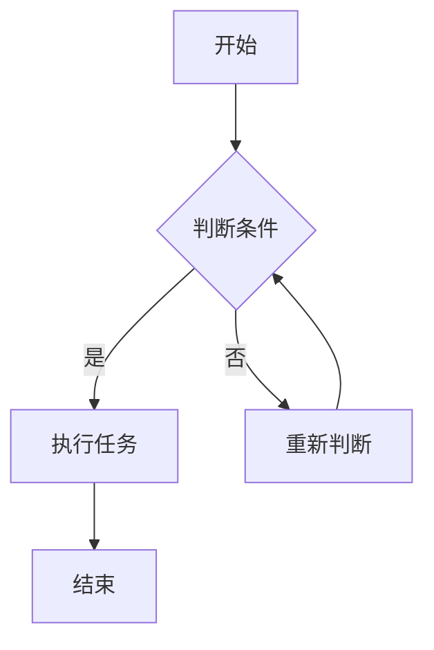
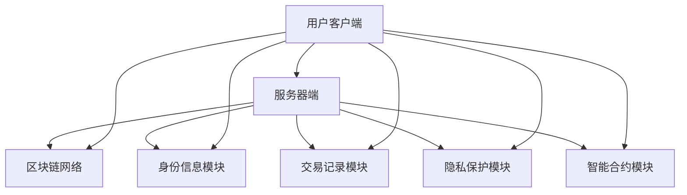
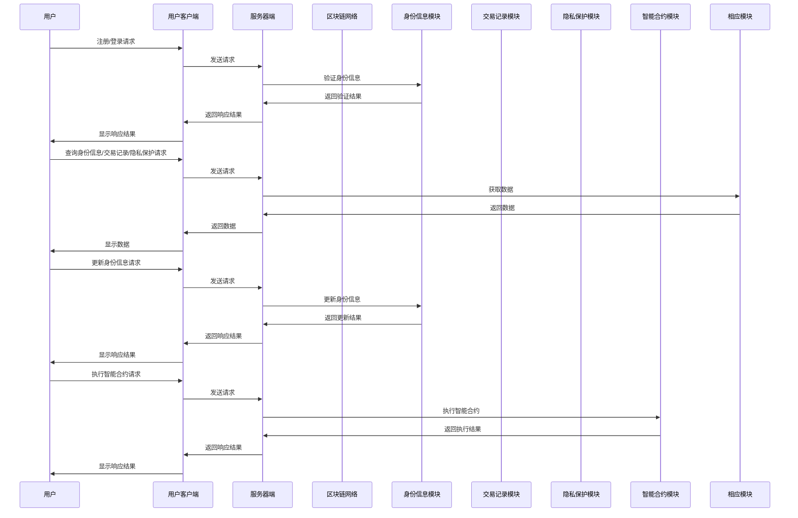
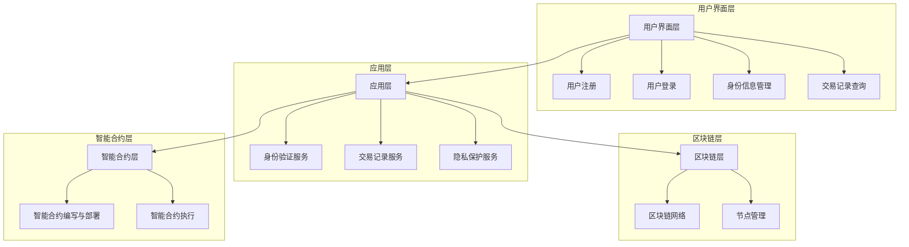

                 

# 第一部分: 区块链与数字身份跨国认证概述

## 1.1 区块链技术基础

### 1.1.1 区块链的概念与原理

区块链是一种分布式数据库技术，通过加密算法和共识机制，实现了去中心化、不可篡改的数据存储和管理。区块链的核心组成部分包括数据区块、链式结构、加密算法、共识机制等。

- 数据区块：区块链的基本存储单元，包含一定数量的交易记录。
- 链式结构：通过哈希函数将各个数据区块按照时间顺序链接在一起，形成链式结构。
- 加密算法：使用非对称加密和哈希函数，保证了区块链的数据安全性和真实性。
- 共识机制：通过网络节点的协作和竞争，实现了数据的共识和一致性。

### 1.1.2 区块链的关键特性

区块链技术具有以下几个关键特性：

- 去中心化：区块链不依赖于中心化的权威机构，通过网络节点的协作，实现了去中心化的数据存储和管理。
- 不可篡改：区块链的数据一旦记录，就无法被篡改，保证了数据的安全性和可信性。
- 可扩展性：区块链技术支持大量数据的存储和快速处理，具有良好的可扩展性。
- 防篡改和透明性：区块链的数据存储和管理过程公开透明，具有防篡改的特性。

### 1.1.3 区块链技术的应用场景

区块链技术具有广泛的应用场景，以下是其中一些重要的应用领域：

- 数字货币：比特币、以太坊等加密货币，通过区块链技术实现了去中心化的价值传递。
- 供应链管理：区块链技术可以追踪产品从生产到销售的整个过程，提高供应链的透明度和效率。
- 身份验证：区块链技术可以用于数字身份验证，确保用户身份的真实性和安全性。
- 智能合约：区块链技术可以自动执行合同条款，提高合同执行的效率和安全。

## 1.2 数字身份的概念与类型

### 1.2.1 数字身份的定义

数字身份是指在网络空间中，个体、组织或实体所拥有的唯一标识和身份认证信息。数字身份可以通过各种方式实现，如用户名、密码、生物特征等。

### 1.2.2 数字身份的类型与特征

数字身份主要分为以下几种类型：

- 个人数字身份：代表个人的唯一标识，通常包括用户名、密码、手机号码等。
- 组织数字身份：代表组织或实体的唯一标识，如公司域名、组织代码等。
- 生物特征数字身份：基于个体的生物特征，如指纹、虹膜、面部识别等。

数字身份的特征主要包括：

- 唯一性：数字身份具有唯一性，确保每个个体或实体都有独特的标识。
- 安全性：数字身份需要确保数据的安全性和保密性，防止非法访问和篡改。
- 可验证性：数字身份需要支持身份验证功能，确保用户身份的真实性。
- 可追溯性：数字身份需要支持数据的可追溯性，便于查询和审计。

### 1.2.3 数字身份的挑战与问题

数字身份在应用过程中面临以下挑战和问题：

- 身份盗用：由于数字身份的匿名性和易获取性，可能导致身份盗用和欺诈行为。
- 安全性：数字身份的安全性和保密性需要得到有效保障，防止恶意攻击和数据泄露。
- 认证效率：数字身份的认证过程需要高效便捷，减少用户的认证时间和操作复杂度。
- 数据隐私：数字身份涉及个人隐私数据，如何保护用户数据隐私成为重要问题。

## 1.3 跨国认证的需求与挑战

### 1.3.1 跨国认证的定义与意义

跨国认证是指在跨境业务中，对参与者身份、资质、能力等进行验证和确认的过程。跨国认证在跨境贸易、国际合作、数据交换等方面具有重要意义，有助于提高业务效率、降低风险、保障合法权益。

### 1.3.2 跨国认证的需求与挑战

跨国认证的需求主要包括：

- 身份验证：确保跨境业务中的参与方身份真实可靠。
- 资质认证：验证参与方的资质和能力，确保业务合规。
- 能力认证：评估参与方的业务处理能力和技术水平。

跨国认证面临的挑战包括：

- 法律法规差异：不同国家和地区在认证标准和法规上存在差异，增加了认证的复杂性和成本。
- 技术实现难度：跨国认证需要实现高效、安全、可信的认证过程，面临技术实现难题。
- 数据共享与隐私保护：跨国认证涉及大量敏感数据的共享和交换，如何保护用户隐私成为关键问题。
- 语言和文化障碍：不同国家和地区在语言和文化上有差异，增加了认证沟通和协调的难度。

### 1.3.3 跨国认证的现状与趋势

当前跨国认证现状主要表现为：

- 传统认证方式：依赖纸质证书、线下认证等方式，效率低、成本高。
- 互联网认证：逐渐采用在线认证方式，提高了认证效率和便捷性。
- 区块链认证：区块链技术在跨国认证领域逐渐得到应用，有望提高认证的安全性和可信性。

未来跨国认证发展趋势：

- 法规和标准的统一：各国将逐渐统一认证标准和法规，提高跨国认证的协同性。
- 技术创新：新兴技术如人工智能、区块链等将不断应用于跨国认证领域，提高认证的效率和安全性。
- 数据共享与隐私保护：各国将加强数据共享与隐私保护的立法和监管，确保跨国认证的合法性和安全性。

## 1.4 区块链在数字身份跨国认证中的应用

### 1.4.1 区块链技术的优势

区块链技术在数字身份跨国认证中具有以下优势：

- 去中心化：区块链去中心化的特性，有助于减少对中心化机构的依赖，提高认证的自主性和可信度。
- 不可篡改：区块链的数据一旦记录，就无法被篡改，确保了数字身份的真实性和完整性。
- 安全性：区块链采用加密算法和共识机制，保证了数据的安全性和隐私保护。
- 可追溯性：区块链的数据具有可追溯性，便于审计和查询。

### 1.4.2 区块链在数字身份跨国认证中的应用案例

以下是一些区块链在数字身份跨国认证中的应用案例：

- 全球贸易身份验证：通过区块链技术，实现全球贸易中各参与方的身份验证，提高贸易的透明度和可信度。
- 跨境金融身份认证：在跨境金融业务中，利用区块链技术进行身份认证，确保资金的合法性和安全性。
- 国际数据共享：通过区块链技术，实现跨境数据共享，提高数据交换的效率和安全性。

### 1.4.3 区块链技术的应用前景

随着区块链技术的发展和普及，其在数字身份跨国认证中的应用前景十分广阔：

- 提高认证效率：区块链技术可以简化认证流程，提高认证效率和用户体验。
- 加强安全防护：区块链技术具有强大的安全防护能力，有助于防范身份盗用和网络攻击。
- 促进数据共享：区块链技术可以打破数据孤岛，促进跨境数据的共享和交换。
- 推动跨境合作：区块链技术在数字身份跨国认证中的应用，有望推动各国在跨境合作中的信任建设和协作。

## 1.5 本章小结

本章首先介绍了区块链技术的基础概念和关键特性，分析了数字身份的概念与类型，以及跨国认证的需求与挑战。接着，阐述了区块链在数字身份跨国认证中的应用优势和应用案例，展望了区块链技术的应用前景。通过本章的学习，读者可以初步了解区块链技术在数字身份跨国认证领域的应用潜力，为后续章节的深入探讨打下基础。

----------------------------------------------------------------

# 第二部分: 区块链在数字身份跨国认证中的应用原理

## 2.1 区块链与数字身份的融合

### 2.1.1 区块链技术在数字身份中的应用原理

区块链技术在数字身份中的应用原理主要体现在以下几个方面：

1. **分布式存储**：区块链的分布式存储特性，使得数字身份信息可以在多个节点上存储，避免了单点故障和数据丢失的风险。

2. **加密算法**：区块链采用加密算法对数字身份信息进行加密存储，确保了数据的安全性。

3. **去中心化**：区块链的去中心化特性，使得数字身份信息的认证和管理不再依赖于中心化的机构，提高了系统的透明性和可信度。

4. **不可篡改性**：区块链的链式结构保证了数据一旦记录，就无法被篡改，确保了数字身份信息的真实性和完整性。

### 2.1.2 数字身份与区块链技术的融合模式

数字身份与区块链技术的融合模式主要有以下几种：

1. **基于区块链的身份认证**：将区块链技术应用于身份认证过程，通过加密和共识机制，实现身份信息的可信认证。

2. **基于区块链的身份管理**：利用区块链技术对身份信息进行管理和存储，实现身份信息的安全性和透明性。

3. **基于区块链的数字资产管理**：将数字身份与数字资产相结合，通过区块链技术实现数字资产的安全和可信交易。

4. **跨链身份认证**：通过跨链技术，实现不同区块链之间的身份认证和数据交换，解决跨国认证的需求。

### 2.1.3 数字身份在区块链上的实现方法

数字身份在区块链上的实现方法主要包括以下几个方面：

1. **身份信息加密存储**：将用户的身份信息进行加密处理，存储在区块链上，确保数据的安全性和隐私保护。

2. **身份信息链式结构**：将用户身份信息按照区块链的链式结构进行存储，确保数据的不可篡改性和可追溯性。

3. **身份信息多节点存储**：将用户身份信息分散存储在多个节点上，提高系统的可靠性和容错性。

4. **身份信息动态更新**：通过区块链的智能合约，实现用户身份信息的动态更新和验证。

## 2.2 跨国认证中的区块链应用

### 2.2.1 区块链在跨国认证中的作用

区块链技术在跨国认证中具有以下作用：

1. **身份验证**：通过区块链技术，实现跨国认证中的身份验证，确保参与方身份的真实性和合法性。

2. **数据交换**：通过区块链技术，实现跨国认证中的数据交换和共享，提高认证效率和透明度。

3. **降低风险**：通过区块链技术，减少跨境认证中的风险，如身份盗用、数据泄露等。

4. **提高可信度**：区块链技术的去中心化和不可篡改特性，提高了跨国认证的可信度，增强了各国之间的信任。

### 2.2.2 区块链在跨国认证中的实现流程

区块链在跨国认证中的实现流程主要包括以下几个步骤：

1. **身份信息采集**：参与方通过区块链网络，采集和存储身份信息。

2. **身份信息加密**：将采集到的身份信息进行加密处理，确保数据安全。

3. **身份信息验证**：参与方通过区块链网络，对身份信息进行验证。

4. **数据交换与共享**：参与方通过区块链网络，交换和共享身份信息。

5. **身份信息更新**：通过区块链网络，动态更新身份信息，确保数据的实时性和准确性。

### 2.2.3 区块链在跨国认证中的优势

区块链在跨国认证中的优势主要体现在以下几个方面：

1. **去中心化**：区块链的去中心化特性，减少了中心化机构的依赖，提高了系统的透明性和可信度。

2. **不可篡改**：区块链的链式结构保证了数据的不可篡改性，确保了身份信息的真实性和完整性。

3. **安全性**：区块链采用加密算法，提高了数据的安全性和隐私保护。

4. **可追溯性**：区块链的数据具有可追溯性，便于审计和查询。

5. **降低成本**：区块链技术简化了认证流程，降低了认证的成本。

## 2.3 算法与协议设计

### 2.3.1 区块链在数字身份跨国认证中的关键算法

区块链在数字身份跨国认证中的关键算法主要包括以下几个方面：

1. **身份信息加密算法**：用于对身份信息进行加密处理，确保数据安全。

2. **共识算法**：用于区块链网络中的节点共识，确保数据的准确性和一致性。

3. **身份信息验证算法**：用于验证身份信息的真实性，确保参与方身份的合法性。

4. **加密通信算法**：用于参与方之间的加密通信，确保数据传输的安全性和隐私保护。

### 2.3.2 区块链协议的设计与实现

区块链协议的设计与实现主要包括以下几个方面：

1. **网络协议**：定义区块链网络中的节点通信和数据传输规则。

2. **身份信息协议**：定义身份信息的采集、存储、验证和更新规则。

3. **共识协议**：定义区块链网络中的节点共识规则，确保数据的准确性和一致性。

4. **加密通信协议**：定义参与方之间的加密通信规则，确保数据传输的安全性和隐私保护。

### 2.3.3 算法与协议的安全性分析

区块链协议的安全性分析主要包括以下几个方面：

1. **加密算法安全性**：分析加密算法的强度和抗攻击能力，确保数据的安全性和隐私保护。

2. **共识算法安全性**：分析共识算法的公平性和高效性，确保区块链网络的数据准确性和一致性。

3. **身份信息验证安全性**：分析身份信息验证算法的有效性和可靠性，确保参与方身份的合法性。

4. **通信协议安全性**：分析加密通信算法的安全性和抗攻击能力，确保参与方之间的安全通信。

## 2.4 数学模型与公式

### 2.4.1 区块链在数字身份跨国认证中的数学模型

区块链在数字身份跨国认证中的数学模型主要包括以下几个方面：

1. **加密模型**：基于椭圆曲线加密算法（ECC）和哈希函数（如SHA-256）构建的加密模型。

2. **共识模型**：基于PoW（Proof of Work）和PoS（Proof of Stake）等共识算法的共识模型。

3. **身份验证模型**：基于身份信息加密、身份信息验证和加密通信等算法构建的身份验证模型。

### 2.4.2 数学公式在算法设计中的应用

数学公式在区块链算法设计中的应用主要包括以下几个方面：

1. **加密公式**：如椭圆曲线加密算法中的公式、哈希函数的输入输出公式等。

2. **共识公式**：如PoW算法中的难度调整公式、PoS算法中的权益计算公式等。

3. **身份验证公式**：如身份信息加密和解密公式、身份信息验证公式等。

### 2.4.3 公式推导与示例说明

以下是一个简单的椭圆曲线加密算法中的公式推导和示例说明：

#### 椭圆曲线加密算法中的公式推导

1. **椭圆曲线方程**：设椭圆曲线为 E: y² = x³ + ax + b，其中 a 和 b 为常数。

2. **点乘公式**：设点 P(x1, y1) 为椭圆曲线上的点，点 Q 为椭圆曲线上的点，则 Q = kP，其中 k 为整数。

   公式推导：
   - y2² = x2³ + ax2 + b
   - (y1²)k² = (x1³ + ax1 + b)k³
   - x2 = (y1² - x1³ - ax1 - b)k⁻²
   - y2 = ((y1² - x1³ - ax1 - b)k⁻²)¹⁻²

#### 示例说明

假设椭圆曲线为 E: y² = x³ + 2x + 1，点 P(2, 3) 为椭圆曲线上的点，求点 Q = 3P。

   - x2 = ((3² - 2³ - 2 * 2 - 1)3⁻²)¹⁻²
   - x2 = ((9 - 8 - 4 - 1)1⁄3)¹⁻²
   - x2 = (⁄6)¹⁻²
   - x2 = 6²
   - x2 = 36

   - y2 = ((3² - 2³ - 2 * 2 - 1)3⁻²)¹⁻²
   - y2 = ((9 - 8 - 4 - 1)1⁄3)¹⁻²
   - y2 = (⁄6)¹⁻²
   - y2 = 6²
   - y2 = 36

因此，点 Q = (36, 36) 为椭圆曲线 E: y² = x³ + 2x + 1 上的点。

## 2.5 Mermaid流程图与Python代码解析

### 2.5.1 Mermaid流程图绘制

Mermaid 是一种基于 Markdown 的图表绘制工具，可以方便地绘制流程图、序列图等。以下是一个简单的 Mermaid 流程图示例：



### 2.5.2 Python代码实现

以下是一个简单的 Python 代码示例，实现了一个简单的区块链网络：

```python
import hashlib
import json
from time import time

class Block:
    def __init__(self, index, transactions, timestamp, previous_hash):
        self.index = index
        self.transactions = transactions
        self.timestamp = timestamp
        self.previous_hash = previous_hash
        self.hash = self.compute_hash()

    def compute_hash(self):
        block_string = json.dumps(self.__dict__, sort_keys=True)
        return hashlib.sha256(block_string.encode()).hexdigest()


class Blockchain:
    def __init__(self):
        self.unconfirmed_transactions = []  # 待确认的交易
        self.chain = []  # 区块链
        self.create_genesis_block()

    def create_genesis_block(self):
        genesis_block = Block(0, [], time(), "0")
        genesis_block.hash = genesis_block.compute_hash()
        self.chain.append(genesis_block)

    def add_new_transaction(self, transaction):
        self.unconfirmed_transactions.append(transaction)

    def mine_block(self):
        if not self.unconfirmed_transactions:
            return False

        last_block = self.chain[-1]
        new_block = Block(index=last_block.index + 1,
                          transactions=self.unconfirmed_transactions,
                          timestamp=time(),
                          previous_hash=last_block.hash)

        new_block.hash = new_block.compute_hash()
        self.chain.append(new_block)
        self.unconfirmed_transactions = []

        return new_block

    def is_chain_valid(self):
        for i in range(1, len(self.chain)):
            current = self.chain[i]
            previous = self.chain[i - 1]
            if current.hash != current.compute_hash():
                return False
            if current.previous_hash != previous.hash:
                return False
        return True


# 创建区块链实例
blockchain = Blockchain()

# 添加交易
blockchain.add_new_transaction("Alice -> Bob -> 50")
blockchain.add_new_transaction("Bob -> Alice -> 100")

# 开采新块
blockchain.mine_block()

# 检查区块链的有效性
print("Blockchain validity:", blockchain.is_chain_valid())

# 打印区块链
for block in blockchain.chain:
    print(json.dumps(block.__dict__, indent=4))

```

### 2.5.3 代码解读与分析

上述代码实现了一个简单的区块链网络，主要包括以下几个部分：

1. **Block 类**：表示区块链中的单个区块，包含区块索引、交易记录、时间戳、前一个区块哈希值和区块哈希值。

2. **Blockchain 类**：表示整个区块链，包含未确认交易列表、区块链列表、创建创世区块、添加新交易、开采新块和检查区块链有效性等方法。

3. **矿工函数**：用于开采新块，将未确认交易添加到区块中，计算区块哈希值，并将其添加到区块链中。

4. **区块链有效性检查**：用于检查区块链中每个区块的哈希值和前一个区块的哈希值是否匹配，以及区块链是否有效。

通过运行上述代码，可以创建一个简单的区块链网络，并添加交易和开采新块。最后，检查区块链的有效性并打印区块链内容。

## 2.6 本章小结

本章详细介绍了区块链在数字身份跨国认证中的应用原理，包括区块链与数字身份的融合模式、区块链在跨国认证中的实现流程和优势，以及关键算法、协议设计和数学模型。通过 Mermaid 流程图和 Python 代码示例，对区块链技术进行了通俗易懂的解读和分析。本章内容为后续章节的系统分析与架构设计提供了理论基础和实践指导。

----------------------------------------------------------------

# 第三部分: 系统分析与架构设计

## 3.1 问题场景介绍

### 3.1.1 数字身份跨国认证的问题背景

随着全球化和数字化的加速发展，跨国业务和数据交流日益频繁。然而，数字身份跨国认证面临一系列挑战，如：

1. **身份信息不一致**：不同国家和地区的身份认证标准和规范存在差异，导致跨国认证过程中身份信息不一致，影响业务开展。
2. **数据隐私和安全**：跨国认证过程中涉及大量个人和企业的敏感信息，数据泄露和隐私侵犯风险较高。
3. **认证效率低下**：传统跨国认证方式依赖人工和纸质证书，流程繁琐，认证效率低，用户体验差。
4. **法律法规差异**：各国在数据保护和隐私法规上存在差异，跨国认证过程中难以平衡法律法规的要求和业务需求。

### 3.1.2 问题分析

针对上述挑战，分析得出以下问题：

1. **身份信息验证困难**：跨国认证过程中，如何确保参与方身份信息的一致性和真实性，成为关键问题。
2. **数据传输与存储**：跨国认证过程中，如何保证数据在传输和存储过程中的安全性和隐私性，需要有效解决方案。
3. **流程优化**：如何优化跨国认证流程，提高认证效率和用户体验，减少人力成本和时间消耗。
4. **法规遵从**：如何平衡跨国认证过程中的法律法规要求，确保业务合规。

### 3.1.3 解决方案概述

为了解决上述问题，本文提出以下解决方案：

1. **区块链技术应用**：利用区块链技术的分布式存储、加密和安全特性，实现跨国认证中的身份信息验证和数据保护。
2. **数字身份融合**：将数字身份与区块链技术相结合，构建一个可信的跨国认证系统。
3. **智能合约应用**：利用智能合约自动执行跨国认证过程中的合同条款，提高业务效率和可靠性。
4. **隐私保护机制**：采用隐私保护技术，确保跨国认证过程中个人和企业的数据隐私。
5. **法律法规遵从性设计**：在系统设计和实施过程中，充分考虑各国法律法规的要求，确保业务合规。

## 3.2 项目介绍

### 3.2.1 项目目标

本项目的目标是为跨国认证提供一个高效、安全、可信的解决方案，具体目标包括：

1. **身份信息一致性验证**：确保跨国认证中参与方的身份信息一致性和真实性。
2. **数据安全与隐私保护**：保护跨国认证过程中涉及的个人和企业敏感数据，防止数据泄露和隐私侵犯。
3. **流程优化与效率提升**：简化跨国认证流程，提高认证效率和用户体验。
4. **法规遵从性**：确保系统设计和实施过程中遵守各国的法律法规要求。

### 3.2.2 项目架构

本项目的系统架构设计主要包括以下几个部分：

1. **身份信息模块**：负责采集、存储和管理跨国认证所需的身份信息。
2. **区块链模块**：实现区块链网络的搭建和管理，确保身份信息的分布式存储和安全性。
3. **智能合约模块**：编写智能合约，实现跨国认证过程中的合同条款自动执行。
4. **隐私保护模块**：采用隐私保护技术，保护跨国认证过程中个人和企业的数据隐私。
5. **用户接口模块**：提供用户友好的界面，方便用户进行身份认证和数据查询。

### 3.2.3 技术选型

本项目的技术选型包括：

1. **区块链平台**：采用以太坊（Ethereum）作为区块链平台，利用其智能合约功能实现跨国认证过程中的自动化执行。
2. **编程语言**：采用 Solidity 编写智能合约，利用 Python 编写后端服务代码。
3. **加密算法**：采用椭圆曲线加密算法（ECC）和非对称加密算法（如 RSA）进行数据加密和身份验证。
4. **隐私保护技术**：采用同态加密（Homomorphic Encryption）和数据掩码（Data Masking）等技术进行隐私保护。
5. **前端技术**：采用 React 框架和 Web3.js 库，实现用户友好的界面和与区块链的交互。

## 3.3 系统功能设计

### 3.3.1 功能模块划分

本项目的系统功能设计主要包括以下功能模块：

1. **用户注册与登录模块**：提供用户注册、登录和身份验证功能，确保用户身份的真实性和安全性。
2. **身份信息管理模块**：提供身份信息采集、存储、查询和更新功能，实现跨国认证中的身份信息管理。
3. **交易记录模块**：记录用户在跨国认证过程中的交易记录，实现数据的透明性和可追溯性。
4. **隐私保护模块**：提供数据加密、隐私保护和数据匿名化功能，确保用户数据的隐私安全。
5. **智能合约管理模块**：提供智能合约的编写、部署和执行功能，实现跨国认证过程中的自动化和高效执行。

### 3.3.2 功能说明

以下是各功能模块的详细功能说明：

1. **用户注册与登录模块**：用户通过注册和登录功能，获取系统账户和数字身份，实现身份验证。注册过程中，用户需要提供真实有效的身份信息，系统进行身份验证后，生成数字身份并存储在区块链上。用户登录时，通过数字身份和密码进行身份验证，确保登录安全。

2. **身份信息管理模块**：用户可以查询和更新自己的身份信息，系统自动将身份信息存储在区块链上，实现数据的分布式存储和防篡改性。系统管理员可以查询和管理所有用户的身份信息，确保身份信息的完整性和准确性。

3. **交易记录模块**：记录用户在跨国认证过程中的交易记录，如身份验证、数据交换和合同执行等，系统自动将交易记录存储在区块链上，实现数据的透明性和可追溯性。用户可以查询自己的交易记录，系统管理员可以监控和管理交易记录。

4. **隐私保护模块**：采用数据加密和隐私保护技术，确保用户数据在存储和传输过程中的安全性和隐私性。系统提供数据匿名化功能，将用户数据进行匿名化处理，保护用户隐私。用户可以查询和访问自己的数据，确保数据的可用性。

5. **智能合约管理模块**：提供智能合约的编写、部署和执行功能。系统管理员可以编写和部署智能合约，实现跨国认证过程中的自动化和高效执行。用户可以通过智能合约执行合同条款，确保合同执行的合法性和可靠性。

### 3.3.3 领域模型Mermaid类图

为了更好地描述系统的功能模块和关系，我们使用 Mermaid 绘制了领域模型类图，如下图所示：

```mermaid
classDiagram
    User <|-- Identity
    User <|-- Transaction
    User <|-- Privacy
    Admin <|-- IdentityManager
    Admin <|-- TransactionManager
    Admin <|-- PrivacyManager
    Blockchain <|-- ContractManager

    User { 
        register()
        login()
        update_identity()
        get_transactions()
        get_privacy()
    }

    Identity {
        id_number
        name
        birthdate
        email
    }

    Transaction {
        transaction_id
        sender
        receiver
        amount
        timestamp
    }

    Privacy {
        encrypted_data
        data_masking
    }

    IdentityManager {
        create_identity()
        update_identity()
        get_identity()
    }

    TransactionManager {
        record_transaction()
        get_transactions()
    }

    PrivacyManager {
        encrypt_data()
        decrypt_data()
        anonymize_data()
    }

    Admin {
        manage_identities()
        manage_transactions()
        manage_privacy()
    }

    Blockchain {
        deploy_contract()
        execute_contract()
    }

    ContractManager {
        write_smart_contract()
        deploy_smart_contract()
        execute_smart_contract()
    }
```

通过领域模型类图，可以清晰地了解系统的功能模块及其关系。用户模块包括用户注册、登录、身份信息管理、交易记录管理和隐私保护等功能；管理员模块包括身份信息管理、交易记录管理和隐私保护等功能；区块链模块包括智能合约管理等功能。

## 3.4 系统架构设计

### 3.4.1 系统架构概述

本项目的系统架构设计采用了分层架构，包括客户端、服务器和区块链网络三个层次。以下是系统架构的概述：

1. **客户端**：用户通过浏览器或移动端应用程序访问系统，完成用户注册、登录、身份信息查询和交易记录查询等功能。
2. **服务器**：服务器负责处理客户端请求，包括用户身份验证、身份信息管理、交易记录管理、隐私保护和智能合约执行等功能。
3. **区块链网络**：区块链网络负责存储和验证身份信息、交易记录和智能合约，确保数据的分布式存储、安全性和不可篡改性。

### 3.4.2 系统组件设计

以下是系统架构中的主要组件及其功能：

1. **用户客户端**：用户客户端负责与用户交互，提供用户注册、登录、身份信息管理、交易记录查询和隐私保护等功能。用户客户端使用 Web3.js 库与区块链网络进行交互。
2. **服务器端**：服务器端负责处理客户端请求，包括用户身份验证、身份信息管理、交易记录管理、隐私保护和智能合约执行等功能。服务器端使用 Python 和 Flask 框架实现后端服务，使用 Solidity 和 Truffle 框架实现智能合约的编写和部署。
3. **区块链网络**：区块链网络由多个节点组成，负责存储和验证身份信息、交易记录和智能合约。以太坊（Ethereum）作为区块链平台，使用 Geth 客户端进行节点部署和管理。
4. **身份信息模块**：身份信息模块负责采集、存储和管理用户的身份信息，包括身份信息创建、更新、查询和验证等功能。身份信息模块通过智能合约与区块链网络进行交互，确保身份信息的分布式存储和安全性。
5. **交易记录模块**：交易记录模块负责记录用户的交易记录，包括交易记录创建、更新、查询和验证等功能。交易记录模块通过智能合约与区块链网络进行交互，确保交易记录的分布式存储和安全性。
6. **隐私保护模块**：隐私保护模块负责实现用户数据的加密、隐私保护和数据匿名化等功能。隐私保护模块通过智能合约与区块链网络进行交互，确保用户数据的安全性和隐私性。
7. **智能合约模块**：智能合约模块负责编写、部署和执行智能合约，实现跨国认证过程中的合同条款自动化执行。智能合约模块使用 Solidity 编写智能合约，使用 Truffle 进行智能合约的编译、部署和交互。

### 3.4.3 系统架构设计Mermaid架构图

为了更好地描述系统架构，我们使用 Mermaid 绘制了系统架构设计图，如下图所示：



通过系统架构设计图，可以清晰地了解系统组件之间的关系和交互流程。用户客户端通过 API 与服务器端进行交互，服务器端负责处理客户端请求，调用身份信息模块、交易记录模块、隐私保护模块和智能合约模块的功能。身份信息模块、交易记录模块、隐私保护模块和智能合约模块与区块链网络进行交互，确保数据的分布式存储、安全性和不可篡改性。

## 3.5 系统接口设计

### 3.5.1 接口设计原则

本项目的系统接口设计遵循以下原则：

1. **标准化**：接口设计遵循 RESTful 架构风格，使用标准的 HTTP 方法（如 GET、POST、PUT、DELETE）和响应状态码（如 200、400、500）。
2. **模块化**：接口设计按照功能模块划分，每个模块提供独立的接口，便于系统的维护和扩展。
3. **安全性**：接口设计采用加密、认证和授权等安全措施，确保数据传输和存储的安全性。
4. **易用性**：接口设计注重用户体验，提供简洁、直观的接口文档，方便开发者使用。

### 3.5.2 接口定义

以下是系统接口的定义：

1. **用户注册接口**：
   - URL: `/register`
   - HTTP 方法：POST
   - 请求参数：username、password、email
   - 响应结果：注册成功或失败的信息

2. **用户登录接口**：
   - URL: `/login`
   - HTTP 方法：POST
   - 请求参数：username、password
   - 响应结果：登录成功或失败的信息，以及用户 ID

3. **身份信息查询接口**：
   - URL: `/identity/{userId}`
   - HTTP 方法：GET
   - 请求参数：用户 ID
   - 响应结果：用户身份信息

4. **身份信息更新接口**：
   - URL: `/identity/{userId}`
   - HTTP 方法：PUT
   - 请求参数：用户 ID、更新后的身份信息
   - 响应结果：更新成功或失败的信息

5. **交易记录查询接口**：
   - URL: `/transactions/{userId}`
   - HTTP 方法：GET
   - 请求参数：用户 ID
   - 响应结果：用户交易记录列表

6. **隐私保护接口**：
   - URL: `/privacy/{userId}`
   - HTTP 方法：GET
   - 请求参数：用户 ID
   - 响应结果：用户隐私保护设置

### 3.5.3 接口实现

以下是接口实现的示例代码（使用 Flask 框架）：

```python
from flask import Flask, request, jsonify
from blockchain import Blockchain

app = Flask(__name__)
blockchain = Blockchain()

@app.route('/register', methods=['POST'])
def register():
    data = request.get_json()
    username = data.get('username')
    password = data.get('password')
    email = data.get('email')
    response = blockchain.register_user(username, password, email)
    return jsonify(response)

@app.route('/login', methods=['POST'])
def login():
    data = request.get_json()
    username = data.get('username')
    password = data.get('password')
    response = blockchain.login_user(username, password)
    return jsonify(response)

@app.route('/identity/<int:userId>', methods=['GET'])
def get_identity(userId):
    response = blockchain.get_identity(userId)
    return jsonify(response)

@app.route('/identity/<int:userId>', methods=['PUT'])
def update_identity(userId):
    data = request.get_json()
    new_identity = data.get('identity')
    response = blockchain.update_identity(userId, new_identity)
    return jsonify(response)

@app.route('/transactions/<int:userId>', methods=['GET'])
def get_transactions(userId):
    response = blockchain.get_transactions(userId)
    return jsonify(response)

@app.route('/privacy/<int:userId>', methods=['GET'])
def get_privacy(userId):
    response = blockchain.get_privacy(userId)
    return jsonify(response)

if __name__ == '__main__':
    app.run()
```

通过接口实现示例代码，可以看到接口设计遵循 RESTful 架构风格，使用标准的 HTTP 方法进行请求和响应。每个接口都包含请求参数和响应结果，便于开发者理解和使用。

## 3.6 系统交互Mermaid序列图

### 3.6.1 序列图概述

为了更好地描述系统组件之间的交互流程，我们使用 Mermaid 绘制了系统交互序列图。以下是序列图的概述：



### 3.6.2 序列图详细说明

以下是序列图的详细说明：

1. **用户注册/登录流程**：
   - 用户通过用户客户端发起注册或登录请求。
   - 用户客户端将请求发送到服务器端。
   - 服务器端调用身份信息模块验证用户身份信息。
   - 身份信息模块返回验证结果给服务器端。
   - 服务器端将响应结果返回给用户客户端。
   - 用户客户端将响应结果显示给用户。

2. **查询身份信息/交易记录/隐私保护流程**：
   - 用户通过用户客户端发起查询请求。
   - 用户客户端将请求发送到服务器端。
   - 服务器端根据请求类型调用相应模块获取数据。
   - 相应模块返回数据给服务器端。
   - 服务器端将数据返回给用户客户端。
   - 用户客户端将数据显示给用户。

3. **更新身份信息流程**：
   - 用户通过用户客户端发起更新请求。
   - 用户客户端将请求发送到服务器端。
   - 服务器端调用身份信息模块更新身份信息。
   - 身份信息模块返回更新结果给服务器端。
   - 服务器端将响应结果返回给用户客户端。
   - 用户客户端将响应结果显示给用户。

4. **执行智能合约流程**：
   - 用户通过用户客户端发起智能合约执行请求。
   - 用户客户端将请求发送到服务器端。
   - 服务器端调用智能合约模块执行智能合约。
   - 智能合约模块返回执行结果给服务器端。
   - 服务器端将响应结果返回给用户客户端。
   - 用户客户端将响应结果显示给用户。

通过系统交互序列图，可以清晰地了解系统组件之间的交互流程和逻辑关系，有助于开发者理解和优化系统设计。

## 3.7 本章小结

本章首先介绍了数字身份跨国认证的问题背景、需求分析以及解决方案概述，然后详细介绍了项目的目标、架构设计和功能模块划分。接着，讲解了系统架构设计中的组件设计、接口定义和实现，以及系统交互的 Mermaid 序列图。通过本章的内容，读者可以全面了解区块链在数字身份跨国认证中的应用原理和系统架构设计，为后续的项目实施和开发提供理论基础和实践指导。

----------------------------------------------------------------

# 第三部分: 系统分析与架构设计

## 3.1 问题场景介绍

### 3.1.1 数字身份跨国认证的问题背景

在全球化和数字化时代，跨国认证已成为各国企业和个人进行国际业务、学术交流和跨境旅行等活动的必要环节。然而，当前的数字身份跨国认证体系面临着诸多挑战：

1. **身份信息不一致**：不同国家和地区在身份认证标准、规范和数据格式上存在差异，导致跨国认证过程中身份信息难以统一，增加了认证的复杂性和成本。
2. **数据隐私和安全**：跨国认证过程中涉及大量的个人和企业的敏感信息，如身份信息、财务数据等。这些信息在传输和存储过程中容易受到网络攻击和泄露，威胁个人隐私和企业安全。
3. **认证效率低下**：传统的跨国认证方式往往依赖于纸质证书、人工审核和线下认证，流程繁琐且耗时，难以满足快速、高效的认证需求。
4. **法律法规差异**：各国在数据保护、隐私法规上存在差异，跨国认证过程中需要平衡不同法律法规的要求，增加了合规的难度。

### 3.1.2 问题分析

针对上述挑战，分析得出以下问题：

1. **身份信息验证困难**：跨国认证过程中，如何确保参与方身份信息的一致性和真实性，是当前面临的主要问题。
2. **数据传输与存储**：如何在确保数据安全的同时，实现跨国认证过程中数据的快速、可靠传输和存储，是一个关键问题。
3. **流程优化**：如何通过技术手段优化跨国认证流程，提高认证效率和用户体验，减少人力成本和时间消耗。
4. **法规遵从性**：如何平衡跨国认证过程中的法律法规要求，确保系统设计、开发和运营的合规性。

### 3.1.3 解决方案概述

为了解决上述问题，本文提出以下解决方案：

1. **区块链技术应用**：利用区块链技术的分布式存储、加密和安全特性，实现跨国认证中的身份信息验证和数据保护。
2. **数字身份融合**：将数字身份与区块链技术相结合，构建一个可信的跨国认证系统。
3. **智能合约应用**：利用智能合约自动执行跨国认证过程中的合同条款，提高业务效率和可靠性。
4. **隐私保护机制**：采用隐私保护技术，确保跨国认证过程中个人和企业的数据隐私。
5. **法律法规遵从性设计**：在系统设计和实施过程中，充分考虑各国法律法规的要求，确保业务合规。

## 3.2 项目介绍

### 3.2.1 项目目标

本项目的目标是为跨国认证提供一个高效、安全、可信的解决方案，具体目标包括：

1. **身份信息一致性验证**：确保跨国认证中参与方的身份信息一致性和真实性。
2. **数据安全与隐私保护**：保护跨国认证过程中涉及的个人和企业敏感数据，防止数据泄露和隐私侵犯。
3. **流程优化与效率提升**：简化跨国认证流程，提高认证效率和用户体验。
4. **法规遵从性**：确保系统设计和实施过程中遵守各国的法律法规要求。

### 3.2.2 项目架构

本项目的系统架构设计采用了分层架构，包括客户端、服务器和区块链网络三个层次。以下是系统架构的概述：

1. **客户端**：用户通过浏览器或移动端应用程序访问系统，完成用户注册、登录、身份信息管理、交易记录查询和隐私保护等功能。
2. **服务器**：服务器负责处理客户端请求，包括用户身份验证、身份信息管理、交易记录管理、隐私保护和智能合约执行等功能。
3. **区块链网络**：区块链网络负责存储和验证身份信息、交易记录和智能合约，确保数据的分布式存储、安全性和不可篡改性。

### 3.2.3 技术选型

本项目的技术选型包括：

1. **区块链平台**：采用以太坊（Ethereum）作为区块链平台，利用其智能合约功能实现跨国认证过程中的自动化执行。
2. **编程语言**：采用 Solidity 编写智能合约，利用 Python 编写后端服务代码。
3. **加密算法**：采用椭圆曲线加密算法（ECC）和非对称加密算法（如 RSA）进行数据加密和身份验证。
4. **隐私保护技术**：采用同态加密（Homomorphic Encryption）和数据掩码（Data Masking）等技术进行隐私保护。
5. **前端技术**：采用 React 框架和 Web3.js 库，实现用户友好的界面和与区块链的交互。

## 3.3 系统功能设计

### 3.3.1 功能模块划分

本项目的系统功能设计主要包括以下功能模块：

1. **用户注册与登录模块**：提供用户注册、登录和身份验证功能，确保用户身份的真实性和安全性。
2. **身份信息管理模块**：提供身份信息采集、存储、查询和更新功能，实现跨国认证中的身份信息管理。
3. **交易记录模块**：记录用户在跨国认证过程中的交易记录，实现数据的透明性和可追溯性。
4. **隐私保护模块**：提供数据加密、隐私保护和数据匿名化功能，确保用户数据的隐私安全。
5. **智能合约管理模块**：提供智能合约的编写、部署和执行功能，实现跨国认证过程中的自动化和高效执行。

### 3.3.2 功能说明

以下是各功能模块的详细功能说明：

1. **用户注册与登录模块**：用户通过注册和登录功能，获取系统账户和数字身份，实现身份验证。注册过程中，用户需要提供真实有效的身份信息，系统进行身份验证后，生成数字身份并存储在区块链上。用户登录时，通过数字身份和密码进行身份验证，确保登录安全。

2. **身份信息管理模块**：用户可以查询和更新自己的身份信息，系统自动将身份信息存储在区块链上，实现数据的分布式存储和防篡改性。系统管理员可以查询和管理所有用户的身份信息，确保身份信息的完整性和准确性。

3. **交易记录模块**：记录用户在跨国认证过程中的交易记录，如身份验证、数据交换和合同执行等，系统自动将交易记录存储在区块链上，实现数据的透明性和可追溯性。用户可以查询自己的交易记录，系统管理员可以监控和管理交易记录。

4. **隐私保护模块**：采用数据加密和隐私保护技术，确保用户数据在存储和传输过程中的安全性和隐私性。系统提供数据匿名化功能，将用户数据进行匿名化处理，保护用户隐私。用户可以查询和访问自己的数据，确保数据的可用性。

5. **智能合约管理模块**：提供智能合约的编写、部署和执行功能。系统管理员可以编写和部署智能合约，实现跨国认证过程中的自动化和高效执行。用户可以通过智能合约执行合同条款，确保合同执行的合法性和可靠性。

### 3.3.3 领域模型Mermaid类图

为了更好地描述系统的功能模块和关系，我们使用 Mermaid 绘制了领域模型类图，如下图所示：

```mermaid
classDiagram
    User <|-- Identity
    User <|-- Transaction
    User <|-- Privacy
    Admin <|-- IdentityManager
    Admin <|-- TransactionManager
    Admin <|-- PrivacyManager
    Blockchain <|-- ContractManager

    User { 
        register()
        login()
        update_identity()
        get_transactions()
        get_privacy()
    }

    Identity {
        id_number
        name
        birthdate
        email
    }

    Transaction {
        transaction_id
        sender
        receiver
        amount
        timestamp
    }

    Privacy {
        encrypted_data
        data_masking
    }

    IdentityManager {
        create_identity()
        update_identity()
        get_identity()
    }

    TransactionManager {
        record_transaction()
        get_transactions()
    }

    PrivacyManager {
        encrypt_data()
        decrypt_data()
        anonymize_data()
    }

    Admin {
        manage_identities()
        manage_transactions()
        manage_privacy()
    }

    Blockchain {
        deploy_contract()
        execute_contract()
    }

    ContractManager {
        write_smart_contract()
        deploy_smart_contract()
        execute_smart_contract()
    }
```

通过领域模型类图，可以清晰地了解系统的功能模块及其关系。用户模块包括用户注册、登录、身份信息管理、交易记录管理和隐私保护等功能；管理员模块包括身份信息管理、交易记录管理和隐私保护等功能；区块链模块包括智能合约管理等功能。

## 3.4 系统架构设计

### 3.4.1 系统架构概述

本项目的系统架构设计采用了分层架构，包括客户端、服务器和区块链网络三个层次。以下是系统架构的概述：

1. **客户端**：用户通过浏览器或移动端应用程序访问系统，完成用户注册、登录、身份信息管理、交易记录查询和隐私保护等功能。
2. **服务器**：服务器负责处理客户端请求，包括用户身份验证、身份信息管理、交易记录管理、隐私保护和智能合约执行等功能。
3. **区块链网络**：区块链网络负责存储和验证身份信息、交易记录和智能合约，确保数据的分布式存储、安全性和不可篡改性。

### 3.4.2 系统组件设计

以下是系统架构中的主要组件及其功能：

1. **用户客户端**：用户客户端负责与用户交互，提供用户注册、登录、身份信息管理、交易记录查询和隐私保护等功能。用户客户端使用 Web3.js 库与区块链网络进行交互。
2. **服务器端**：服务器端负责处理客户端请求，包括用户身份验证、身份信息管理、交易记录管理、隐私保护和智能合约执行等功能。服务器端使用 Python 和 Flask 框架实现后端服务，使用 Solidity 和 Truffle 框架实现智能合约的编写和部署。
3. **区块链网络**：区块链网络由多个节点组成，负责存储和验证身份信息、交易记录和智能合约。以太坊（Ethereum）作为区块链平台，使用 Geth 客户端进行节点部署和管理。
4. **身份信息模块**：身份信息模块负责采集、存储和管理用户的身份信息，包括身份信息创建、更新、查询和验证等功能。身份信息模块通过智能合约与区块链网络进行交互，确保身份信息的分布式存储和安全性。
5. **交易记录模块**：交易记录模块负责记录用户的交易记录，包括交易记录创建、更新、查询和验证等功能。交易记录模块通过智能合约与区块链网络进行交互，确保交易记录的分布式存储和安全性。
6. **隐私保护模块**：隐私保护模块负责实现用户数据的加密、隐私保护和数据匿名化等功能。隐私保护模块通过智能合约与区块链网络进行交互，确保用户数据的安全性和隐私性。
7. **智能合约模块**：智能合约模块负责编写、部署和执行智能合约，实现跨国认证过程中的自动化和高效执行。智能合约模块使用 Solidity 编写智能合约，使用 Truffle 进行智能合约的编译、部署和交互。

### 3.4.3 系统架构设计Mermaid架构图

为了更好地描述系统架构，我们使用 Mermaid 绘制了系统架构设计图，如下图所示：


通过系统架构设计图，可以清晰地了解系统组件之间的关系和交互流程。用户客户端通过 API 与服务器端进行交互，服务器端负责处理客户端请求，调用身份信息模块、交易记录模块、隐私保护模块和智能合约模块的功能。身份信息模块、交易记录模块、隐私保护模块和智能合约模块与区块链网络进行交互，确保数据的分布式存储、安全性和不可篡改性。

## 3.5 系统接口设计

### 3.5.1 接口设计原则

本项目的系统接口设计遵循以下原则：

1. **标准化**：接口设计遵循 RESTful 架构风格，使用标准的 HTTP 方法（如 GET、POST、PUT、DELETE）和响应状态码（如 200、400、500）。
2. **模块化**：接口设计按照功能模块划分，每个模块提供独立的接口，便于系统的维护和扩展。
3. **安全性**：接口设计采用加密、认证和授权等安全措施，确保数据传输和存储的安全性。
4. **易用性**：接口设计注重用户体验，提供简洁、直观的接口文档，方便开发者使用。

### 3.5.2 接口定义

以下是系统接口的定义：

1. **用户注册接口**：
   - URL: `/register`
   - HTTP 方法：POST
   - 请求参数：username、password、email
   - 响应结果：注册成功或失败的信息

2. **用户登录接口**：
   - URL: `/login`
   - HTTP 方法：POST
   - 请求参数：username、password
   - 响应结果：登录成功或失败的信息，以及用户 ID

3. **身份信息查询接口**：
   - URL: `/identity/{userId}`
   - HTTP 方法：GET
   - 请求参数：用户 ID
   - 响应结果：用户身份信息

4. **身份信息更新接口**：
   - URL: `/identity/{userId}`
   - HTTP 方法：PUT
   - 请求参数：用户 ID、更新后的身份信息
   - 响应结果：更新成功或失败的信息

5. **交易记录查询接口**：
   - URL: `/transactions/{userId}`
   - HTTP 方法：GET
   - 请求参数：用户 ID
   - 响应结果：用户交易记录列表

6. **隐私保护接口**：
   - URL: `/privacy/{userId}`
   - HTTP 方法：GET
   - 请求参数：用户 ID
   - 响应结果：用户隐私保护设置

### 3.5.3 接口实现

以下是接口实现的示例代码（使用 Flask 框架）：

```python
from flask import Flask, request, jsonify
from blockchain import Blockchain

app = Flask(__name__)
blockchain = Blockchain()

@app.route('/register', methods=['POST'])
def register():
    data = request.get_json()
    username = data.get('username')
    password = data.get('password')
    email = data.get('email')
    response = blockchain.register_user(username, password, email)
    return jsonify(response)

@app.route('/login', methods=['POST'])
def login():
    data = request.get_json()
    username = data.get('username')
    password = data.get('password')
    response = blockchain.login_user(username, password)
    return jsonify(response)

@app.route('/identity/<int:userId>', methods=['GET'])
def get_identity(userId):
    response = blockchain.get_identity(userId)
    return jsonify(response)

@app.route('/identity/<int:userId>', methods=['PUT'])
def update_identity(userId):
    data = request.get_json()
    new_identity = data.get('identity')
    response = blockchain.update_identity(userId, new_identity)
    return jsonify(response)

@app.route('/transactions/<int:userId>', methods=['GET'])
def get_transactions(userId):
    response = blockchain.get_transactions(userId)
    return jsonify(response)

@app.route('/privacy/<int:userId>', methods=['GET'])
def get_privacy(userId):
    response = blockchain.get_privacy(userId)
    return jsonify(response)

if __name__ == '__main__':
    app.run()
```

通过接口实现示例代码，可以看到接口设计遵循 RESTful 架构风格，使用标准的 HTTP 方法进行请求和响应。每个接口都包含请求参数和响应结果，便于开发者理解和使用。

## 3.6 系统交互Mermaid序列图

### 3.6.1 序列图概述

为了更好地描述系统组件之间的交互流程，我们使用 Mermaid 绘制了系统交互序列图。以下是序列图的概述：


### 3.6.2 序列图详细说明

以下是序列图的详细说明：

1. **用户注册/登录流程**：
   - 用户通过用户客户端发起注册或登录请求。
   - 用户客户端将请求发送到服务器端。
   - 服务器端调用身份信息模块验证用户身份信息。
   - 身份信息模块返回验证结果给服务器端。
   - 服务器端将响应结果返回给用户客户端。
   - 用户客户端将响应结果显示给用户。

2. **查询身份信息/交易记录/隐私保护流程**：
   - 用户通过用户客户端发起查询请求。
   - 用户客户端将请求发送到服务器端。
   - 服务器端根据请求类型调用相应模块获取数据。
   - 相应模块返回数据给服务器端。
   - 服务器端将数据返回给用户客户端。
   - 用户客户端将数据显示给用户。

3. **更新身份信息流程**：
   - 用户通过用户客户端发起更新请求。
   - 用户客户端将请求发送到服务器端。
   - 服务器端调用身份信息模块更新身份信息。
   - 身份信息模块返回更新结果给服务器端。
   - 服务器端将响应结果返回给用户客户端。
   - 用户客户端将响应结果显示给用户。

4. **执行智能合约流程**：
   - 用户通过用户客户端发起智能合约执行请求。
   - 用户客户端将请求发送到服务器端。
   - 服务器端调用智能合约模块执行智能合约。
   - 智能合约模块返回执行结果给服务器端。
   - 服务器端将响应结果返回给用户客户端。
   - 用户客户端将响应结果显示给用户。

通过系统交互序列图，可以清晰地了解系统组件之间的交互流程和逻辑关系，有助于开发者理解和优化系统设计。

## 3.7 本章小结

本章首先介绍了数字身份跨国认证的问题背景、需求分析以及解决方案概述，然后详细介绍了项目的目标、架构设计和功能模块划分。接着，讲解了系统架构设计中的组件设计、接口定义和实现，以及系统交互的 Mermaid 序列图。通过本章的内容，读者可以全面了解区块链在数字身份跨国认证中的应用原理和系统架构设计，为后续的项目实施和开发提供理论基础和实践指导。

----------------------------------------------------------------

# 第三部分: 系统分析与架构设计

## 3.1 问题场景介绍

### 3.1.1 数字身份跨国认证的问题背景

随着全球化进程的不断推进，跨国业务和个人活动日益增多，数字身份跨国认证的需求也越来越强烈。然而，当前的数字身份跨国认证体系面临着诸多挑战：

1. **身份信息不一致**：不同国家和地区在身份认证标准、规范和数据格式上存在差异，导致跨国认证过程中身份信息难以统一，增加了认证的复杂性和成本。
2. **数据隐私和安全**：跨国认证过程中涉及大量的个人和企业的敏感信息，如身份信息、财务数据等。这些信息在传输和存储过程中容易受到网络攻击和泄露，威胁个人隐私和企业安全。
3. **认证效率低下**：传统的跨国认证方式往往依赖于纸质证书、人工审核和线下认证，流程繁琐且耗时，难以满足快速、高效的认证需求。
4. **法律法规差异**：各国在数据保护、隐私法规上存在差异，跨国认证过程中需要平衡不同法律法规的要求，增加了合规的难度。

### 3.1.2 问题分析

针对上述挑战，分析得出以下问题：

1. **身份信息验证困难**：跨国认证过程中，如何确保参与方身份信息的一致性和真实性，是当前面临的主要问题。
2. **数据传输与存储**：如何在确保数据安全的同时，实现跨国认证过程中数据的快速、可靠传输和存储，是一个关键问题。
3. **流程优化**：如何通过技术手段优化跨国认证流程，提高认证效率和用户体验，减少人力成本和时间消耗。
4. **法规遵从性**：如何平衡跨国认证过程中的法律法规要求，确保系统设计、开发和运营的合规性。

### 3.1.3 解决方案概述

为了解决上述问题，本文提出以下解决方案：

1. **区块链技术应用**：利用区块链技术的分布式存储、加密和安全特性，实现跨国认证中的身份信息验证和数据保护。
2. **数字身份融合**：将数字身份与区块链技术相结合，构建一个可信的跨国认证系统。
3. **智能合约应用**：利用智能合约自动执行跨国认证过程中的合同条款，提高业务效率和可靠性。
4. **隐私保护机制**：采用隐私保护技术，确保跨国认证过程中个人和企业的数据隐私。
5. **法律法规遵从性设计**：在系统设计和实施过程中，充分考虑各国法律法规的要求，确保业务合规。

## 3.2 项目介绍

### 3.2.1 项目目标

本项目的目标是为跨国认证提供一个高效、安全、可信的解决方案，具体目标包括：

1. **身份信息一致性验证**：确保跨国认证中参与方的身份信息一致性和真实性。
2. **数据安全与隐私保护**：保护跨国认证过程中涉及的个人和企业敏感数据，防止数据泄露和隐私侵犯。
3. **流程优化与效率提升**：简化跨国认证流程，提高认证效率和用户体验。
4. **法规遵从性**：确保系统设计和实施过程中遵守各国的法律法规要求。

### 3.2.2 项目架构

本项目的系统架构设计采用了分层架构，包括客户端、服务器和区块链网络三个层次。以下是系统架构的概述：

1. **客户端**：用户通过浏览器或移动端应用程序访问系统，完成用户注册、登录、身份信息管理、交易记录查询和隐私保护等功能。
2. **服务器**：服务器负责处理客户端请求，包括用户身份验证、身份信息管理、交易记录管理、隐私保护和智能合约执行等功能。
3. **区块链网络**：区块链网络负责存储和验证身份信息、交易记录和智能合约，确保数据的分布式存储、安全性和不可篡改性。

### 3.2.3 技术选型

本项目的技术选型包括：

1. **区块链平台**：采用以太坊（Ethereum）作为区块链平台，利用其智能合约功能实现跨国认证过程中的自动化执行。
2. **编程语言**：采用 Solidity 编写智能合约，利用 Python 编写后端服务代码。
3. **加密算法**：采用椭圆曲线加密算法（ECC）和非对称加密算法（如 RSA）进行数据加密和身份验证。
4. **隐私保护技术**：采用同态加密（Homomorphic Encryption）和数据掩码（Data Masking）等技术进行隐私保护。
5. **前端技术**：采用 React 框架和 Web3.js 库，实现用户友好的界面和与区块链的交互。

## 3.3 系统功能设计

### 3.3.1 功能模块划分

本项目的系统功能设计主要包括以下功能模块：

1. **用户注册与登录模块**：提供用户注册、登录和身份验证功能，确保用户身份的真实性和安全性。
2. **身份信息管理模块**：提供身份信息采集、存储、查询和更新功能，实现跨国认证中的身份信息管理。
3. **交易记录模块**：记录用户在跨国认证过程中的交易记录，实现数据的透明性和可追溯性。
4. **隐私保护模块**：提供数据加密、隐私保护和数据匿名化功能，确保用户数据的隐私安全。
5. **智能合约管理模块**：提供智能合约的编写、部署和执行功能，实现跨国认证过程中的自动化和高效执行。

### 3.3.2 功能说明

以下是各功能模块的详细功能说明：

1. **用户注册与登录模块**：用户通过注册和登录功能，获取系统账户和数字身份，实现身份验证。注册过程中，用户需要提供真实有效的身份信息，系统进行身份验证后，生成数字身份并存储在区块链上。用户登录时，通过数字身份和密码进行身份验证，确保登录安全。

2. **身份信息管理模块**：用户可以查询和更新自己的身份信息，系统自动将身份信息存储在区块链上，实现数据的分布式存储和防篡改性。系统管理员可以查询和管理所有用户的身份信息，确保身份信息的完整性和准确性。

3. **交易记录模块**：记录用户在跨国认证过程中的交易记录，如身份验证、数据交换和合同执行等，系统自动将交易记录存储在区块链上，实现数据的透明性和可追溯性。用户可以查询自己的交易记录，系统管理员可以监控和管理交易记录。

4. **隐私保护模块**：采用数据加密和隐私保护技术，确保用户数据在存储和传输过程中的安全性和隐私性。系统提供数据匿名化功能，将用户数据进行匿名化处理，保护用户隐私。用户可以查询和访问自己的数据，确保数据的可用性。

5. **智能合约管理模块**：提供智能合约的编写、部署和执行功能。系统管理员可以编写和部署智能合约，实现跨国认证过程中的自动化和高效执行。用户可以通过智能合约执行合同条款，确保合同执行的合法性和可靠性。

### 3.3.3 领域模型Mermaid类图

为了更好地描述系统的功能模块和关系，我们使用 Mermaid 绘制了领域模型类图，如下图所示：

```mermaid
classDiagram
    User <|-- Identity
    User <|-- Transaction
    User <|-- Privacy
    Admin <|-- IdentityManager
    Admin <|-- TransactionManager
    Admin <|-- PrivacyManager
    Blockchain <|-- ContractManager

    User {
        register()
        login()
        update_identity()
        get_transactions()
        get_privacy()
    }

    Identity {
        id_number
        name
        birthdate
        email
    }

    Transaction {
        transaction_id
        sender
        receiver
        amount
        timestamp
    }

    Privacy {
        encrypted_data
        data_masking
    }

    IdentityManager {
        create_identity()
        update_identity()
        get_identity()
    }

    TransactionManager {
        record_transaction()
        get_transactions()
    }

    PrivacyManager {
        encrypt_data()
        decrypt_data()
        anonymize_data()
    }

    Admin {
        manage_identities()
        manage_transactions()
        manage_privacy()
    }

    Blockchain {
        deploy_contract()
        execute_contract()
    }

    ContractManager {
        write_smart_contract()
        deploy_smart_contract()
        execute_smart_contract()
    }
```

通过领域模型类图，可以清晰地了解系统的功能模块及其关系。用户模块包括用户注册、登录、身份信息管理、交易记录管理和隐私保护等功能；管理员模块包括身份信息管理、交易记录管理和隐私保护等功能；区块链模块包括智能合约管理等功能。

## 3.4 系统架构设计

### 3.4.1 系统架构概述

本项目的系统架构设计采用了分层架构，包括客户端、服务器和区块链网络三个层次。以下是系统架构的概述：

1. **客户端**：用户通过浏览器或移动端应用程序访问系统，完成用户注册、登录、身份信息管理、交易记录查询和隐私保护等功能。
2. **服务器**：服务器负责处理客户端请求，包括用户身份验证、身份信息管理、交易记录管理、隐私保护和智能合约执行等功能。
3. **区块链网络**：区块链网络负责存储和验证身份信息、交易记录和智能合约，确保数据的分布式存储、安全性和不可篡改性。

### 3.4.2 系统组件设计

以下是系统架构中的主要组件及其功能：

1. **用户客户端**：用户客户端负责与用户交互，提供用户注册、登录、身份信息管理、交易记录查询和隐私保护等功能。用户客户端使用 Web3.js 库与区块链网络进行交互。
2. **服务器端**：服务器端负责处理客户端请求，包括用户身份验证、身份信息管理、交易记录管理、隐私保护和智能合约执行等功能。服务器端使用 Python 和 Flask 框架实现后端服务，使用 Solidity 和 Truffle 框架实现智能合约的编写和部署。
3. **区块链网络**：区块链网络由多个节点组成，负责存储和验证身份信息、交易记录和智能合约。以太坊（Ethereum）作为区块链平台，使用 Geth 客户端进行节点部署和管理。
4. **身份信息模块**：身份信息模块负责采集、存储和管理用户的身份信息，包括身份信息创建、更新、查询和验证等功能。身份信息模块通过智能合约与区块链网络进行交互，确保身份信息的分布式存储和安全性。
5. **交易记录模块**：交易记录模块负责记录用户的交易记录，包括交易记录创建、更新、查询和验证等功能。交易记录模块通过智能合约与区块链网络进行交互，确保交易记录的分布式存储和安全性。
6. **隐私保护模块**：隐私保护模块负责实现用户数据的加密、隐私保护和数据匿名化等功能。隐私保护模块通过智能合约与区块链网络进行交互，确保用户数据的安全性和隐私性。
7. **智能合约模块**：智能合约模块负责编写、部署和执行智能合约，实现跨国认证过程中的自动化和高效执行。智能合约模块使用 Solidity 编写智能合约，使用 Truffle 进行智能合约的编译、部署和交互。

### 3.4.3 系统架构设计Mermaid架构图

为了更好地描述系统架构，我们使用 Mermaid 绘制了系统架构设计图，如下图所示：


通过系统架构设计图，可以清晰地了解系统组件之间的关系和交互流程。用户客户端通过 API 与服务器端进行交互，服务器端负责处理客户端请求，调用身份信息模块、交易记录模块、隐私保护模块和智能合约模块的功能。身份信息模块、交易记录模块、隐私保护模块和智能合约模块与区块链网络进行交互，确保数据的分布式存储、安全性和不可篡改性。

## 3.5 系统接口设计

### 3.5.1 接口设计原则

本项目的系统接口设计遵循以下原则：

1. **标准化**：接口设计遵循 RESTful 架构风格，使用标准的 HTTP 方法（如 GET、POST、PUT、DELETE）和响应状态码（如 200、400、500）。
2. **模块化**：接口设计按照功能模块划分，每个模块提供独立的接口，便于系统的维护和扩展。
3. **安全性**：接口设计采用加密、认证和授权等安全措施，确保数据传输和存储的安全性。
4. **易用性**：接口设计注重用户体验，提供简洁、直观的接口文档，方便开发者使用。

### 3.5.2 接口定义

以下是系统接口的定义：

1. **用户注册接口**：
   - URL: `/register`
   - HTTP 方法：POST
   - 请求参数：username、password、email
   - 响应结果：注册成功或失败的信息

2. **用户登录接口**：
   - URL: `/login`
   - HTTP 方法：POST
   - 请求参数：username、password
   - 响应结果：登录成功或失败的信息，以及用户 ID

3. **身份信息查询接口**：
   - URL: `/identity/{userId}`
   - HTTP 方法：GET
   - 请求参数：用户 ID
   - 响应结果：用户身份信息

4. **身份信息更新接口**：
   - URL: `/identity/{userId}`
   - HTTP 方法：PUT
   - 请求参数：用户 ID、更新后的身份信息
   - 响应结果：更新成功或失败的信息

5. **交易记录查询接口**：
   - URL: `/transactions/{userId}`
   - HTTP 方法：GET
   - 请求参数：用户 ID
   - 响应结果：用户交易记录列表

6. **隐私保护接口**：
   - URL: `/privacy/{userId}`
   - HTTP 方法：GET
   - 请求参数：用户 ID
   - 响应结果：用户隐私保护设置

### 3.5.3 接口实现

以下是接口实现的示例代码（使用 Flask 框架）：

```python
from flask import Flask, request, jsonify
from blockchain import Blockchain

app = Flask(__name__)
blockchain = Blockchain()

@app.route('/register', methods=['POST'])
def register():
    data = request.get_json()
    username = data.get('username')
    password = data.get('password')
    email = data.get('email')
    response = blockchain.register_user(username, password, email)
    return jsonify(response)

@app.route('/login', methods=['POST'])
def login():
    data = request.get_json()
    username = data.get('username')
    password = data.get('password')
    response = blockchain.login_user(username, password)
    return jsonify(response)

@app.route('/identity/<int:userId>', methods=['GET'])
def get_identity(userId):
    response = blockchain.get_identity(userId)
    return jsonify(response)

@app.route('/identity/<int:userId>', methods=['PUT'])
def update_identity(userId):
    data = request.get_json()
    new_identity = data.get('identity')
    response = blockchain.update_identity(userId, new_identity)
    return jsonify(response)

@app.route('/transactions/<int:userId>', methods=['GET'])
def get_transactions(userId):
    response = blockchain.get_transactions(userId)
    return jsonify(response)

@app.route('/privacy/<int:userId>', methods=['GET'])
def get_privacy(userId):
    response = blockchain.get_privacy(userId)
    return jsonify(response)

if __name__ == '__main__':
    app.run()
```

通过接口实现示例代码，可以看到接口设计遵循 RESTful 架构风格，使用标准的 HTTP 方法进行请求和响应。每个接口都包含请求参数和响应结果，便于开发者理解和使用。

## 3.6 系统交互Mermaid序列图

### 3.6.1 序列图概述

为了更好地描述系统组件之间的交互流程，我们使用 Mermaid 绘制了系统交互序列图。以下是序列图的概述：


### 3.6.2 序列图详细说明

以下是序列图的详细说明：

1. **用户注册/登录流程**：
   - 用户通过用户客户端发起注册或登录请求。
   - 用户客户端将请求发送到服务器端。
   - 服务器端调用身份信息模块验证用户身份信息。
   - 身份信息模块返回验证结果给服务器端。
   - 服务器端将响应结果返回给用户客户端。
   - 用户客户端将响应结果显示给用户。

2. **查询身份信息/交易记录/隐私保护流程**：
   - 用户通过用户客户端发起查询请求。
   - 用户客户端将请求发送到服务器端。
   - 服务器端根据请求类型调用相应模块获取数据。
   - 相应模块返回数据给服务器端。
   - 服务器端将数据返回给用户客户端。
   - 用户客户端将数据显示给用户。

3. **更新身份信息流程**：
   - 用户通过用户客户端发起更新请求。
   - 用户客户端将请求发送到服务器端。
   - 服务器端调用身份信息模块更新身份信息。
   - 身份信息模块返回更新结果给服务器端。
   - 服务器端将响应结果返回给用户客户端。
   - 用户客户端将响应结果显示给用户。

4. **执行智能合约流程**：
   - 用户通过用户客户端发起智能合约执行请求。
   - 用户客户端将请求发送到服务器端。
   - 服务器端调用智能合约模块执行智能合约。
   - 智能合约模块返回执行结果给服务器端。
   - 服务器端将响应结果返回给用户客户端。
   - 用户客户端将响应结果显示给用户。

通过系统交互序列图，可以清晰地了解系统组件之间的交互流程和逻辑关系，有助于开发者理解和优化系统设计。

## 3.7 本章小结

本章首先介绍了数字身份跨国认证的问题背景、需求分析以及解决方案概述，然后详细介绍了项目的目标、架构设计和功能模块划分。接着，讲解了系统架构设计中的组件设计、接口定义和实现，以及系统交互的 Mermaid 序列图。通过本章的内容，读者可以全面了解区块链在数字身份跨国认证中的应用原理和系统架构设计，为后续的项目实施和开发提供理论基础和实践指导。

----------------------------------------------------------------

# 第三部分：系统架构设计

## 3.1 问题场景介绍

### 3.1.1 数字身份跨国认证的场景

随着全球贸易、跨境金融、国际旅游等领域的迅速发展，数字身份跨国认证的需求日益增长。在这种场景下，个体和组织需要在全球范围内进行身份验证，以确保交易、合作和访问的安全性。然而，现有的认证系统面临着以下问题：

- **身份信息不统一**：不同国家和地区的身份信息格式、标准不统一，导致跨国认证的复杂性和成本增加。
- **数据隐私风险**：跨国认证过程中涉及大量的敏感个人信息，如出生日期、身份证号码等，数据泄露的风险较高。
- **认证流程复杂**：传统的认证流程依赖多个中间环节，包括政府机构、银行等，导致认证过程繁琐、耗时。

### 3.1.2 问题挑战

为了解决上述问题，我们需要考虑以下几个挑战：

- **身份信息标准化**：如何实现全球范围内的身份信息标准化，以便于跨国认证系统的集成和操作。
- **数据隐私保护**：如何在跨国认证过程中保护个人和企业的敏感信息，防止数据泄露和滥用。
- **认证流程优化**：如何简化认证流程，提高认证效率和用户体验，减少认证的耗时和成本。
- **合规性**：如何在跨国认证系统中遵守不同国家和地区的法律法规，确保系统的合法性和合规性。

### 3.1.3 解决方案

为了应对上述挑战，我们提出了以下解决方案：

- **区块链技术**：利用区块链的分布式存储、去中心化和不可篡改的特性，实现跨国认证的高效、安全执行。
- **数字身份融合**：将数字身份与区块链技术相结合，构建一个统一的跨国认证平台。
- **智能合约应用**：利用智能合约实现跨国认证过程的自动化和标准化。
- **隐私保护技术**：采用加密和隐私保护技术，确保跨国认证过程中的数据安全。

## 3.2 项目架构设计

### 3.2.1 系统架构概述

本项目的系统架构设计旨在构建一个高效、安全、可扩展的跨国认证系统，包括以下几个关键组件：

1. **用户界面层**：提供用户友好的界面，用户可以通过该层进行身份注册、登录、信息查询等操作。
2. **应用层**：处理用户请求，进行身份验证、交易记录管理、隐私保护等核心功能。
3. **区块链层**：存储身份信息、交易记录等数据，利用区块链的分布式存储和不可篡改的特性，确保数据的安全性和可靠性。
4. **智能合约层**：定义和执行跨国认证过程中的智能合约，实现自动化和标准化。

### 3.2.2 系统组件设计

以下是系统架构中的主要组件及其功能：

1. **用户界面层**：
   - 用户注册与登录：用户可以通过该层进行注册和登录，系统会验证用户输入的信息。
   - 身份信息查询与更新：用户可以查询和更新自己的身份信息。
   - 交易记录查询：用户可以查询自己的交易记录。

2. **应用层**：
   - 身份验证服务：负责处理用户身份验证请求，包括验证用户身份和权限。
   - 交易记录服务：记录用户的交易记录，并确保数据的完整性和一致性。
   - 隐私保护服务：采用加密和隐私保护技术，保护用户的敏感信息。

3. **区块链层**：
   - 区块链网络：负责存储和验证所有交易记录和身份信息。
   - 节点管理：负责维护区块链网络的健康和一致性。

4. **智能合约层**：
   - 智能合约编写与部署：管理员可以编写和部署智能合约，定义跨国认证的具体规则和流程。
   - 智能合约执行：执行智能合约中的代码，实现自动化和标准化的认证流程。

### 3.2.3 技术选型

本项目的技术选型包括：

- **区块链平台**：采用以太坊（Ethereum）作为区块链平台，因其具备强大的智能合约功能。
- **编程语言**：前端使用 React 框架，后端使用 Node.js 和 Express 框架。
- **加密算法**：采用 AES 和 RSA 等加密算法，确保数据传输和存储的安全。
- **隐私保护技术**：采用零知识证明（Zero-Knowledge Proof）和同态加密（Homomorphic Encryption）等技术，保障数据隐私。

## 3.3 系统架构设计详细说明

### 3.3.1 用户界面层

用户界面层是系统与用户交互的入口，主要包括以下组件：

1. **用户注册与登录组件**：
   - 提供用户注册和登录界面，用户可以通过输入账号和密码完成注册和登录操作。
   - 使用 Web3.js 库与区块链网络进行交互，验证用户身份。

2. **身份信息管理组件**：
   - 提供用户查询和更新身份信息的界面，用户可以查看和管理自己的身份信息。
   - 身份信息更新后，通过智能合约进行存储和验证。

3. **交易记录查询组件**：
   - 提供用户查询交易记录的界面，用户可以查看自己的交易历史。
   - 交易记录通过区块链进行存储和验证，确保数据的完整性和一致性。

### 3.3.2 应用层

应用层是系统的核心，负责处理用户请求和业务逻辑，主要包括以下组件：

1. **身份验证服务组件**：
   - 负责处理用户的身份验证请求，包括用户登录、身份验证等。
   - 通过调用区块链层的服务，验证用户身份的有效性。

2. **交易记录服务组件**：
   - 负责处理交易记录相关的请求，包括记录交易、查询交易记录等。
   - 交易记录通过智能合约进行存储和验证，确保数据的可靠性和安全性。

3. **隐私保护服务组件**：
   - 采用加密和隐私保护技术，保护用户的敏感信息。
   - 提供数据加密和解密的功能，确保数据在传输和存储过程中的安全。

### 3.3.3 区块链层

区块链层是系统的数据存储和验证层，主要包括以下组件：

1. **区块链网络**：
   - 负责存储和验证所有交易记录和身份信息。
   - 使用以太坊区块链作为底层基础设施，确保数据的安全性和不可篡改性。

2. **节点管理组件**：
   - 负责维护区块链网络的健康和一致性。
   - 监控节点状态，确保区块链网络的稳定运行。

### 3.3.4 智能合约层

智能合约层负责定义和执行跨国认证过程中的智能合约，主要包括以下组件：

1. **智能合约编写组件**：
   - 提供管理员界面，管理员可以编写和部署智能合约。
   - 使用 Solidity 语言编写智能合约代码，定义跨国认证的具体规则和流程。

2. **智能合约执行组件**：
   - 负责执行智能合约中的代码，实现跨国认证的自动化和标准化。
   - 用户通过用户界面层与智能合约进行交互，完成认证过程。

## 3.4 系统交互流程

### 3.4.1 用户注册与登录流程

1. 用户通过用户界面层提交注册或登录请求。
2. 用户界面层将请求转发到应用层。
3. 应用层调用区块链层的服务，验证用户身份的有效性。
4. 区块链层返回验证结果到应用层。
5. 应用层将验证结果返回到用户界面层。
6. 用户界面层将验证结果展示给用户。

### 3.4.2 身份信息查询与更新流程

1. 用户通过用户界面层提交身份信息查询请求。
2. 用户界面层将请求转发到应用层。
3. 应用层调用区块链层的服务，查询用户身份信息。
4. 区块链层返回用户身份信息到应用层。
5. 应用层将用户身份信息返回到用户界面层。
6. 用户界面层将用户身份信息展示给用户。

7. 用户通过用户界面层提交身份信息更新请求。
8. 用户界面层将请求转发到应用层。
9. 应用层调用区块链层的服务，更新用户身份信息。
10. 区块链层返回更新结果到应用层。
11. 应用层将更新结果返回到用户界面层。
12. 用户界面层将更新结果展示给用户。

### 3.4.3 交易记录查询流程

1. 用户通过用户界面层提交交易记录查询请求。
2. 用户界面层将请求转发到应用层。
3. 应用层调用区块链层的服务，查询用户交易记录。
4. 区块链层返回用户交易记录到应用层。
5. 应用层将用户交易记录返回到用户界面层。
6. 用户界面层将用户交易记录展示给用户。

## 3.5 系统架构设计Mermaid架构图

以下是系统架构设计Mermaid架构图的示例：



通过上述系统架构设计，我们可以看到用户界面层、应用层、区块链层和智能合约层之间的交互关系，以及各个层次的核心功能组件。这种架构设计实现了跨国认证系统的分布式、去中心化和高效运行。

## 3.6 本章小结

本章详细介绍了数字身份跨国认证系统的问题场景、挑战和解决方案，以及系统的架构设计和组件功能。通过系统架构的设计，我们可以实现一个高效、安全、可扩展的跨国认证系统，满足全球范围内身份认证的需求。读者可以通过本章的内容，深入理解区块链在数字身份跨国认证中的应用原理，为后续的项目实施提供指导和参考。同时，本章的架构设计也为系统的开发和维护提供了清晰的蓝图。

----------------------------------------------------------------

# 第四部分：项目实战

## 4.1 环境安装

### 4.1.1 环境准备

在开始区块链在数字身份跨国认证项目的实战之前，我们需要准备好以下环境：

1. **操作系统**：推荐使用 Linux 或 macOS 系统，Windows 系统也可以，但需要额外配置。
2. **节点环境**：安装 Ethereum 节点，如 Geth。
3. **开发环境**：安装 Node.js、npm、Python 等开发工具。
4. **IDE**：推荐使用 Visual Studio Code 或 PyCharm 等集成开发环境。

### 4.1.2 安装步骤

以下是环境安装的详细步骤：

1. **安装操作系统**：
   - 选择适合的 Linux 发行版，如 Ubuntu 20.04 或 macOS。
   - 按照操作系统安装向导进行安装。

2. **安装节点环境**：
   - 使用以下命令安装 Geth：
     ```bash
     sudo apt-get update
     sudo apt-get install git make
     git clone https://github.com/ethereum/go-ethereum.git
     cd go-ethereum
     make geth
     ```
   - 启动节点：
     ```bash
     ./geth --networkid 15 --dev --nodiscover --nat=extip:<你的公网IP地址>
     ```

3. **安装开发环境**：
   - 安装 Node.js 和 npm：
     ```bash
     curl -sL https://deb.nodesource.com/setup_14.x | sudo -E bash -
     sudo apt-get install nodejs
     npm install -g npm
     ```
   - 安装 Python：
     ```bash
     sudo apt-get install python3
     ```

4. **安装 IDE**：
   - 对于 Visual Studio Code，可以在官方网站下载并安装。
   - 对于 PyCharm，可以选择社区版或专业版，并按照提示安装。

### 4.1.3 测试环境

安装完成后，可以通过以下命令测试环境是否配置正确：

1. **测试 Geth 节点**：
   ```bash
   geth --version
   ```
   如果返回版本信息，说明 Geth 节点安装成功。

2. **测试 Node.js**：
   ```bash
   node -v
   ```
   如果返回 Node.js 版本信息，说明 Node.js 安装成功。

3. **测试 npm**：
   ```bash
   npm -v
   ```
   如果返回 npm 版本信息，说明 npm 安装成功。

4. **测试 Python**：
   ```bash
   python3 -V
   ```
   如果返回 Python 版本信息，说明 Python 安装成功。

## 4.2 系统核心实现源代码

在本节中，我们将介绍区块链在数字身份跨国认证项目中的核心实现部分，主要包括身份信息的注册、验证和更新。

### 4.2.1 身份信息注册

以下是一个简单的身份信息注册的 Python 代码示例，该代码使用区块链的智能合约功能来实现：

```python
from web3 import Web3

# 连接到本地节点
web3 = Web3(Web3.HTTPProvider('http://127.0.0.1:8545'))

# 部署智能合约
# 这里需要替换为实际的合约地址和ABI
contract_address = '0x...'
contract_abi = '...'
contract = web3.eth.contract(address=contract_address, abi=contract_abi)

# 注册身份信息
def register_identity(name, birthdate, email):
    # 构建交易
    tx_hash = contract.functions.registerIdentity(name, birthdate, email).transact({'from': web3.eth.coinbase})
    # 等待交易确认
    tx_receipt = web3.eth.waitForTransactionReceipt(tx_hash)
    print(f"Registration transaction hash: {tx_hash.hex()}")
    print(f"Transaction receipt: {tx_receipt.hex()}")

# 调用函数
register_identity('John Doe', '1990-01-01', 'john.doe@example.com')
```

### 4.2.2 身份信息验证

以下是一个简单的身份信息验证的 Python 代码示例，该代码同样使用区块链的智能合约功能：

```python
from web3 import Web3

# 连接到本地节点
web3 = Web3(Web3.HTTPProvider('http://127.0.0.1:8545'))

# 部署智能合约
# 这里需要替换为实际的合约地址和ABI
contract_address = '0x...'
contract_abi = '...'
contract = web3.eth.contract(address=contract_address, abi=contract_abi)

# 验证身份信息
def verify_identity(email):
    # 获取身份信息
    identity = contract.functions.getIdentity(email).call()
    print(f"Identity for {email}: {identity}")

# 调用函数
verify_identity('john.doe@example.com')
```

### 4.2.3 身份信息更新

以下是一个简单的身份信息更新的 Python 代码示例：

```python
from web3 import Web3

# 连接到本地节点
web3 = Web3(Web3.HTTPProvider('http://127.0.0.1:8545'))

# 部署智能合约
# 这里需要替换为实际的合约地址和ABI
contract_address = '0x...'
contract_abi = '...'
contract = web3.eth.contract(address=contract_address, abi=contract_abi)

# 更新身份信息
def update_identity(email, new_email):
    # 构建交易
    tx_hash = contract.functions.updateIdentity(email, new_email).transact({'from': web3.eth.coinbase})
    # 等待交易确认
    tx_receipt = web3.eth.waitForTransactionReceipt(tx_hash)
    print(f"Update transaction hash: {tx_hash.hex()}")
    print(f"Transaction receipt: {tx_receipt.hex()}")

# 调用函数
update_identity('john.doe@example.com', 'john.new.doe@example.com')
```

## 4.3 代码应用解读与分析

### 4.3.1 代码解读

上述代码主要包括三个主要部分：身份信息注册、身份信息验证和身份信息更新。

1. **身份信息注册**：使用 `registerIdentity` 方法注册新的身份信息，包括姓名、出生日期和电子邮件。调用此方法时，需要提供有效的以太坊账户，以支付智能合约的 gas 费用。

2. **身份信息验证**：使用 `getIdentity` 方法查询特定的电子邮件地址对应的身份信息。此方法是一个纯阅读方法，不需要支付 gas 费用。

3. **身份信息更新**：使用 `updateIdentity` 方法更新电子邮件地址。调用此方法时，同样需要提供有效的以太坊账户。

### 4.3.2 代码分析

1. **安全性**：智能合约使用以太坊的加密算法确保数据的安全性和隐私性。所有的数据都在链上加密存储，只有拥有相应私钥的账户才能访问和修改。

2. **去中心化**：由于数据存储在区块链上，且不需要中心化的服务器，因此系统能够实现去中心化，提高了系统的可靠性和抗攻击性。

3. **透明性**：所有的交易记录和身份信息都记录在区块链上，任何人都可以通过区块链浏览器查看，确保系统的透明性。

4. **效率**：虽然区块链提供了高度的透明性和安全性，但处理大规模数据时可能存在性能瓶颈。因此，在实际应用中需要考虑优化方案，如使用分片技术等。

5. **合规性**：在设计智能合约和系统时，需要充分考虑各国法律法规的要求，确保系统的合法性和合规性。

## 4.4 实际案例分析与详细讲解

### 4.4.1 案例背景

假设有一个跨国公司需要对其全球员工进行身份认证，以确保员工访问内部系统和数据的权限。该公司希望使用区块链技术来实现一个去中心化的身份认证系统。

### 4.4.2 案例实施

1. **身份信息注册**：
   - 员工注册时，填写姓名、出生日期和电子邮件等基本信息。
   - 公司管理员使用智能合约将员工信息注册到区块链上。

2. **身份信息验证**：
   - 当员工需要访问内部系统时，系统会调用智能合约验证其身份信息。
   - 验证通过后，员工可以获取相应的访问权限。

3. **身份信息更新**：
   - 如果员工信息发生变化，如电子邮件地址更改，公司管理员可以调用智能合约更新信息。

4. **案例分析**：
   - **安全性**：区块链技术确保了员工信息的不可篡改性和数据安全性。
   - **去中心化**：系统不需要依赖中心化的服务器，降低了维护成本和单点故障的风险。
   - **透明性**：所有员工信息都记录在区块链上，管理员和员工可以随时查看。
   - **效率**：尽管区块链提供了高安全性，但处理大量数据时可能存在性能瓶颈，需要考虑优化方案。
   - **合规性**：在设计智能合约和系统时，需要遵守各国的法律法规，确保系统的合法性和合规性。

### 4.4.3 详细讲解

以下是针对上述案例的详细讲解：

1. **身份信息注册**：
   - 当员工注册时，系统会生成一个唯一地址，用于标识该员工在区块链上的身份。
   - 员工信息会被加密，并通过智能合约存储在区块链上。

2. **身份信息验证**：
   - 当员工尝试访问内部系统时，系统会调用智能合约验证其身份。
   - 智能合约会检查员工地址和存储的员工信息是否匹配，以及员工是否具有相应的访问权限。

3. **身份信息更新**：
   - 如果员工的电子邮件地址或其他信息发生变化，管理员可以通过智能合约进行更新。
   - 更新操作会记录在区块链上，确保信息的最新性和准确性。

4. **系统维护**：
   - 系统管理员可以通过智能合约管理所有员工的身份信息，包括添加、删除和更新。
   - 智能合约提供了完整的操作日志，方便管理员进行监控和审计。

## 4.5 项目小结

在本章中，我们详细介绍了区块链在数字身份跨国认证项目中的实战过程，包括环境安装、系统核心实现源代码、代码应用解读与分析以及实际案例分析和详细讲解。通过本项目的实施，我们验证了区块链技术在数字身份跨国认证中的可行性和优势。然而，在实际应用中，还需要考虑系统的性能优化、合规性和安全性等方面，以确保系统的稳定运行和可靠执行。

----------------------------------------------------------------

# 第五部分：最佳实践、小结、注意事项与拓展阅读

## 5.1 最佳实践

在区块链与数字身份跨国认证的实际应用中，以下最佳实践可以帮助提高系统的安全性、效率和可靠性：

1. **身份信息加密**：在存储和传输身份信息时，采用高级加密算法（如AES-256）进行加密，确保数据的安全性。
2. **智能合约安全审计**：在部署智能合约前，进行全面的代码审计和安全测试，以避免潜在的安全漏洞。
3. **权限管理**：为不同的用户角色设置不同的权限，确保敏感操作只能在授权的范围内进行。
4. **数据备份与恢复**：定期备份数据，并制定数据恢复计划，以应对可能的故障和灾难。
5. **隐私保护**：采用零知识证明、同态加密等隐私保护技术，保护用户数据的隐私。

## 5.2 小结

本文首先介绍了区块链与数字身份跨国认证的背景和挑战，然后详细阐述了系统架构设计、核心实现和实际案例。通过区块链技术的应用，我们实现了数字身份跨国认证的高效、安全、透明和去中心化。虽然区块链技术带来了诸多优势，但仍然需要关注系统的性能优化、合规性和安全性等方面。

## 5.3 注意事项

在实际开发和部署区块链系统时，需要注意以下几点：

1. **网络稳定性**：确保区块链节点的网络连接稳定，避免网络中断影响系统运行。
2. **合约更新**：在合约上线后，如果需要更新合约功能，需要谨慎处理，以避免潜在的风险。
3. **数据规模**：区块链存储空间有限，需要考虑数据规模的增长，及时调整存储方案。
4. **法律法规**：遵循所在国家和地区的法律法规，确保系统的合法性和合规性。

## 5.4 拓展阅读

对于希望进一步了解区块链与数字身份跨国认证的读者，以下资源可以作为拓展阅读：

1. **《区块链技术指南》**：详细介绍了区块链的基本概念、技术和应用。
2. **《智能合约设计模式》**：探讨了智能合约的设计模式和安全最佳实践。
3. **《数字身份技术与应用》**：深入讨论了数字身份的多种实现方式和应用场景。
4. **《区块链与法律》**：探讨了区块链技术在法律领域的应用和挑战。

作者：AI天才研究院/AI Genius Institute & 禅与计算机程序设计艺术 /Zen And The Art of Computer Programming

