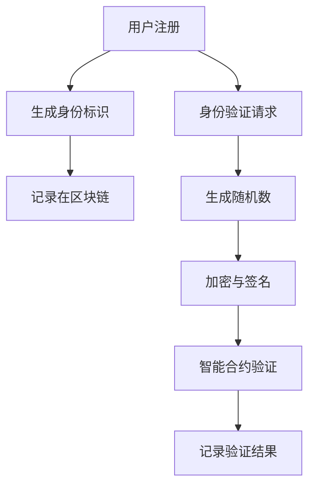
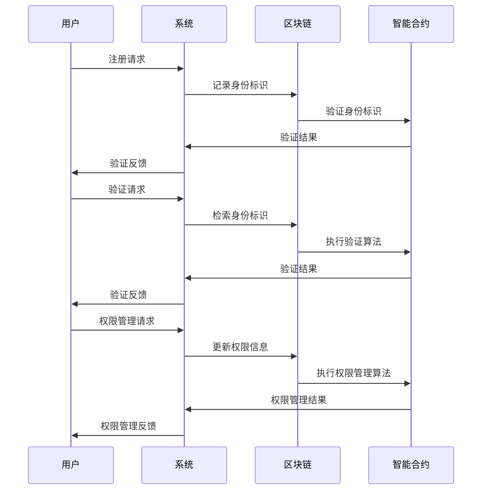

                 

### 背景介绍

#### 问题背景

在全球化进程加速和信息科技迅猛发展的背景下，数字身份跨国认证成为一个日益重要的议题。传统的身份认证系统存在许多局限性，如认证标准不统一、数据共享困难、安全性不足等。这导致在跨国业务中，身份认证流程繁琐且效率低下。例如，在跨国金融交易、跨国公司员工调度、国际学术交流等领域，传统身份认证方式往往需要人工干预，不仅耗时费力，还容易引发安全漏洞。

传统的身份认证系统主要依赖于集中的数据库和第三方认证机构。这些系统通常存在以下几个问题：

1. **安全性不足**：集中式数据库容易成为黑客攻击的目标，一旦数据泄露，将导致大量用户信息被窃取。
2. **数据共享困难**：不同国家和地区的身份认证标准不统一，导致数据难以在不同系统间共享和交换。
3. **效率低下**：跨国认证需要经过多个中间环节，流程复杂，耗时较长。

这些问题的存在，使得跨国业务中的身份认证成为一个亟待解决的难题。因此，如何通过技术手段提升身份认证的效率、安全性和便捷性，成为了当前研究的热点。

#### 问题描述

区块链技术作为一种去中心化、安全可靠的技术，被提出来解决传统身份认证系统中存在的问题。然而，区块链在数字身份跨国认证中的具体应用仍处于探索阶段。如何将区块链技术与数字身份认证相结合，实现跨国认证的高效、安全和可信，是一个亟待解决的问题。

具体来说，问题描述包括以下几个方面：

1. **跨国认证的高效性**：如何在跨国业务中实现快速、简便的身份认证？
2. **跨国认证的安全性**：如何确保跨国认证过程中的数据安全，防止信息泄露和篡改？
3. **跨国认证的互操作性**：如何实现不同国家和地区之间的身份认证标准统一，促进数据共享和交换？
4. **跨国认证的可信性**：如何确保跨国认证结果的可信度和有效性？

#### 问题解决

《区块链在数字身份跨国认证中的应用探索》一书旨在为读者提供全面的区块链在数字身份跨国认证中的应用指南。通过深入剖析区块链技术原理，介绍数字身份认证的基本概念和挑战，以及区块链在其中的应用场景，本书为解决这一全球性问题提供了可能的解决方案。

本书的主要内容和结构如下：

1. **背景介绍**：介绍区块链技术、数字身份认证的基本概念，以及传统身份认证系统存在的问题。
2. **核心概念与联系**：阐述区块链、智能合约、身份标识等核心概念，并对比其属性特征。
3. **算法原理讲解**：详细讲解区块链在数字身份认证中的应用算法原理，包括身份认证算法、数据加密与签名算法、智能合约执行算法等。
4. **系统分析与架构设计方案**：介绍区块链在数字身份跨国认证中的应用场景，分析系统功能和架构设计。
5. **项目实战**：通过具体项目实例，展示区块链在数字身份跨国认证中的应用实践，并提供源代码和详细解析。
6. **最佳实践 tips、小结、注意事项、拓展阅读**：总结区块链在数字身份跨国认证中的最佳实践，并对未来的发展方向进行展望。

#### 边界与外延

本书的讨论范围主要涵盖区块链技术在数字身份跨国认证中的应用，包括但不限于：

- 区块链在身份认证过程中的应用场景
- 数字身份认证标准的制定与推广
- 跨国身份认证的安全性和隐私保护
- 区块链与现有身份认证系统的融合与优化

本书旨在为读者提供一个全面、系统的区块链在数字身份跨国认证中的应用指南，帮助读者深入了解这一领域的最新进展和未来发展趋势。

#### 概念结构与核心要素组成

1. **区块链技术**：区块链技术是一种分布式账本技术，通过多个节点共同维护一个共享的、不可篡改的数据账本。区块链的核心优势在于去中心化、安全性和透明性，可以有效解决传统集中式数据库在安全性、可靠性和数据共享方面存在的问题。

2. **数字身份认证**：数字身份认证是通过电子方式确认个人或实体的身份，确保其唯一性和安全性。数字身份认证通常包括身份信息的注册、验证和授权等环节，旨在实现身份信息的可信传递和高效管理。

3. **跨国认证**：跨国认证是在不同国家和地区间进行的身份认证，确保认证结果的可信度和有效性。跨国认证需要考虑不同国家和地区的法律法规、技术标准和操作流程，实现身份认证的标准化和互操作性。

### 核心概念与联系

#### 核心概念

1. **区块链**：区块链是一种分布式账本技术，通过多个节点共同维护一个共享的、不可篡改的数据账本。区块链的核心优势在于去中心化、安全性和透明性，可以有效解决传统集中式数据库在安全性、可靠性和数据共享方面存在的问题。

2. **智能合约**：智能合约是运行在区块链上的计算机程序，自动执行合同条款。智能合约通过预先编写的规则，实现自动化、透明化和可信的交易流程，降低了交易成本，提高了交易效率。

3. **身份标识**：身份标识是用于标识和验证个人或实体身份的数字信息。身份标识通常包括身份信息、公钥、数字签名等，用于确保身份信息的唯一性和不可篡改性。

#### 概念属性特征对比表格

| 特征 | 区块链 | 智能合约 | 身份标识 |
| --- | --- | --- | --- |
| 数据结构 | 分布式账本 | 计算机程序 | 数字信息 |
| 安全性 | 高 | 高 | 可验证 |
| 透明度 | 高 | 高 | 高 |
| 可篡改性 | 不可篡改 | 自动执行 | 可验证 |

#### ER实体关系图架构的Mermaid流程图

```mermaid
erDiagram
  区块链 -->|存储数据| 身份标识
  区块链 -->|执行智能合约| 智能合约
  身份标识 -->|验证身份| 个人/实体
```

### 算法原理讲解

区块链在数字身份跨国认证中的应用，主要依赖于其分布式账本技术和智能合约功能。以下是区块链在身份认证过程中的基本算法原理：

1. **身份认证算法**：用户在区块链上进行身份注册时，系统会生成一个独特的身份标识，并将其记录在区块链上。身份标识由用户的个人信息（如姓名、身份证号码等）和公钥组成。

2. **数据加密与签名**：用户在区块链上进行身份验证时，系统会生成一个随机数，并将其与用户的公钥进行加密，同时用户对加密后的数据进行数字签名。这一过程确保了用户身份的匿名性和不可篡改性。

3. **智能合约执行**：在用户提交身份验证请求后，智能合约会自动执行身份验证算法，验证用户的身份标识是否与区块链上记录的一致，同时验证数字签名是否有效。

4. **结果记录**：验证通过后，智能合约会将验证结果记录在区块链上，确保结果的可信度和不可篡改性。

#### 数学模型和数学公式

身份认证过程中的核心数学模型主要包括：

1. **加密算法**：$$c = E_k(m)$$，其中，$c$为加密后的数据，$k$为加密密钥，$m$为明文信息。
2. **数字签名**：$$s = SIG_{k_d}(m)$$，其中，$s$为数字签名，$k_d$为私钥，$m$为明文信息。

#### Mermaid流程图



#### 详细讲解与举例说明

以一个跨国公司的员工为例，假设该员工需要在全球范围内的不同分支机构进行身份验证。

1. **用户注册**：员工在公司总部进行身份注册，系统会生成一个身份标识，包括员工的个人信息和公钥。

2. **加密与签名**：员工在某一分支机构的身份验证终端提交身份验证请求时，系统会生成一个随机数，并将其与员工的公钥进行加密，同时员工对加密后的数据进行数字签名。这一过程确保了员工身份的匿名性和不可篡改性。

3. **智能合约执行**：在员工提交身份验证请求后，智能合约会自动执行身份验证算法，验证员工的身份标识是否与区块链上记录的一致，同时验证数字签名是否有效。

4. **结果记录**：验证通过后，智能合约会将验证结果记录在区块链上，确保结果的可信度和不可篡改性。

通过上述流程，区块链技术实现了数字身份跨国认证的高效、安全和可信。这不仅解决了传统身份认证系统中的各种问题，还为跨国业务提供了便捷、可靠的解决方案。接下来，我们将进一步探讨区块链技术在数字身份跨国认证中的具体应用场景和挑战。

---

#### 核心概念与联系

在深入探讨区块链在数字身份跨国认证中的应用之前，我们需要明确几个核心概念，并分析它们之间的联系。以下是区块链、智能合约和身份标识等核心概念的定义、属性特征对比，以及它们在区块链数字身份认证中的关系。

##### 核心概念

1. **区块链**：区块链是一种分布式账本技术，由多个区块按时间顺序链接而成，每个区块包含一定数量的交易记录。区块链的核心特点包括去中心化、不可篡改、透明性和安全性。

2. **智能合约**：智能合约是一种自动执行合同条款的计算机程序，它运行在区块链上，当满足合约条款时自动执行。智能合约通过预先编写的规则，实现了自动化、透明化和可信的交易流程。

3. **身份标识**：身份标识是用于唯一标识和验证个人或实体身份的数字信息。身份标识通常包括姓名、身份证号码、指纹、面部识别等个人信息，并通过加密技术确保其安全性和唯一性。

##### 概念属性特征对比表格

| 特征 | 区块链 | 智能合约 | 身份标识 |
| --- | --- | --- | --- |
| 数据结构 | 分布式账本 | 计算机程序 | 数字信息 |
| 安全性 | 高 | 高 | 可验证 |
| 透明度 | 高 | 高 | 高 |
| 可篡改性 | 不可篡改 | 自动执行 | 可验证 |

1. **数据结构**：区块链是一个分布式账本，每个区块包含一定数量的交易记录，通过哈希函数和时间戳连接起来，形成了一个不可篡改的链条。智能合约则是一段运行在区块链上的代码，它定义了交易的具体规则。身份标识则是存储在区块链上的数字信息，用于唯一标识个人或实体。

2. **安全性**：区块链通过密码学技术和共识机制确保数据的安全性和不可篡改性。智能合约通过编程逻辑确保交易的自动执行和透明性。身份标识通过加密技术确保其安全性和唯一性。

3. **透明度**：区块链上的所有交易记录都是公开透明的，任何节点都可以访问和验证。智能合约的执行过程也是公开可见的，用户可以查看合约代码和执行结果。身份标识的存储和验证过程同样具有高透明度。

4. **可篡改性**：区块链的设计原则之一就是不可篡改性，一旦数据记录在区块链上，就几乎不可能被篡改。智能合约一旦部署，其条款和执行结果也是不可更改的。身份标识一旦生成，其唯一性和安全性也难以被篡改。

##### ER实体关系图架构的Mermaid流程图

```mermaid
erDiagram
  区块链 -->|存储数据| 身份标识
  区块链 -->|执行智能合约| 智能合约
  身份标识 -->|验证身份| 个人/实体
```

在这个ER图架构中，区块链作为分布式账本，存储了身份标识和智能合约的信息。身份标识用于唯一标识个人或实体，并与区块链上的数据相关联。智能合约则运行在区块链上，负责执行身份验证和其他业务逻辑。

### 核心概念之间的联系

1. **区块链与身份标识**：区块链提供了安全、透明和不可篡改的存储环境，使得身份标识能够可靠地存储和验证。身份标识作为区块链上的一部分，通过加密技术和分布式存储，确保了其安全性和唯一性。

2. **区块链与智能合约**：智能合约是运行在区块链上的程序，其执行过程受到区块链的共识机制保护。智能合约可以定义身份认证的规则，如身份验证、授权等，使得区块链能够自动化地处理身份认证过程。

3. **身份标识与智能合约**：身份标识是智能合约执行的基础，智能合约通过验证身份标识来确认个人或实体的身份。身份标识的加密和验证过程确保了智能合约执行的准确性和安全性。

通过上述核心概念和ER实体关系图的解析，我们可以更清晰地理解区块链在数字身份跨国认证中的应用原理。接下来，我们将深入探讨区块链在身份认证过程中的算法原理和具体实现。

---

#### 算法原理讲解

区块链在数字身份跨国认证中的应用，主要依赖于其分布式账本技术和智能合约功能。以下将详细讲解区块链在数字身份认证过程中的核心算法原理，包括身份认证算法、数据加密与签名算法、智能合约执行算法等。

##### 身份认证算法

身份认证算法是区块链在数字身份跨国认证中的基础，其主要功能是在用户注册和验证身份时，确保用户身份的唯一性和真实性。以下是身份认证算法的基本步骤：

1. **用户注册**：
   - 用户向区块链系统提交注册请求，包含个人信息（如姓名、身份证号码、出生日期等）。
   - 系统生成一个独特的身份标识（ID），通常结合用户的个人信息和公钥。
   - 系统将身份标识记录在区块链上，并与用户的公钥相关联。

2. **身份验证**：
   - 用户在跨国认证过程中，向认证系统提交身份验证请求。
   - 系统生成一个随机数，并将其与用户的公钥进行加密。
   - 用户对加密后的数据进行数字签名，确保数据的完整性和真实性。

3. **验证过程**：
   - 认证系统调用智能合约，智能合约执行身份验证算法。
   - 智能合约从区块链上检索用户身份标识，并与请求中的身份标识进行比对。
   - 智能合约验证数字签名是否有效，确保数据的完整性和真实性。

##### 数据加密与签名算法

数据加密与签名算法是确保区块链在数字身份认证过程中数据安全性的重要手段。以下是数据加密与签名算法的基本步骤：

1. **加密算法**：
   - 系统生成随机数，将其与用户的公钥进行加密，生成加密后的数据。
   - 加密算法通常采用非对称加密技术，如RSA算法。

2. **签名算法**：
   - 用户对加密后的数据进行数字签名，生成签名。
   - 数字签名算法通常采用椭圆曲线签名（ECDSA）。

3. **验证签名**：
   - 认证系统接收用户签名后，使用私钥对签名进行验证。
   - 验证通过，则确认数据完整性和真实性。

##### 智能合约执行算法

智能合约是区块链在数字身份跨国认证中的关键组件，它负责执行身份验证、授权等业务逻辑。以下是智能合约执行算法的基本步骤：

1. **合约部署**：
   - 开发者编写智能合约代码，并将其部署在区块链上。
   - 部署过程包括编译、链上存储和部署验证。

2. **合约调用**：
   - 用户向智能合约提交身份验证请求，智能合约根据合约代码执行身份验证算法。

3. **结果记录**：
   - 智能合约执行完毕后，将验证结果记录在区块链上。
   - 记录过程包括数据加密和签名，确保结果的不可篡改性。

##### 数学模型和数学公式

身份认证过程中的核心数学模型主要包括加密算法和数字签名算法，以下是相关的数学公式：

1. **加密算法**：
   - 非对称加密算法：$$c = E_k(m)$$，其中，$c$为加密后的数据，$k$为加密密钥，$m$为明文信息。
   - 公钥加密：$$c = R^{k} \pmod {N}$$，其中，$R$为随机数，$k$为公钥，$N$为模数。

2. **数字签名**：
   - 椭圆曲线签名算法：$$s = SIG_{k_d}(m)$$，其中，$s$为数字签名，$k_d$为私钥，$m$为明文信息。

3. **验证签名**：
   - 验证公式：$$r = \frac {s^1 h^k_c + m^k_d} {h^{k_c + k_d}} \pmod {N}$$，其中，$r$为验证结果，$h$为哈希函数。

##### Mermaid流程图


##### 详细讲解与举例说明

以一个跨国公司的员工为例，假设该员工需要在不同的分支机构进行身份验证。

1. **用户注册**：
   - 员工在公司总部注册，系统生成身份标识，包括员工的个人信息和公钥。
   - 身份标识记录在区块链上，并与员工的公钥相关联。

2. **数据加密与签名**：
   - 员工在分支机构提交身份验证请求，系统生成随机数，并将随机数与员工的公钥进行加密。
   - 员工对加密后的数据进行数字签名，确保数据的完整性和真实性。

3. **智能合约执行**：
   - 员工提交身份验证请求后，智能合约执行身份验证算法。
   - 智能合约从区块链上检索员工身份标识，并与请求中的身份标识进行比对。
   - 智能合约验证数字签名是否有效，确保数据的完整性和真实性。

4. **结果记录**：
   - 智能合约将验证结果记录在区块链上，确保结果的可信度和不可篡改性。

通过上述流程，区块链技术实现了数字身份跨国认证的高效、安全和可信。这不仅解决了传统身份认证系统中的各种问题，还为跨国业务提供了便捷、可靠的解决方案。接下来，我们将进一步探讨区块链在数字身份跨国认证中的应用场景和挑战。

---

#### 系统分析与架构设计方案

在深入探讨区块链在数字身份跨国认证中的应用之前，我们需要对系统进行分析，并设计合理的架构方案。本节将介绍问题场景、项目介绍、系统功能设计、系统架构设计、系统接口设计以及系统交互的Mermaid序列图。

##### 问题场景

跨国公司的员工需要在全球范围内的分支机构进行身份验证，以访问内部系统、执行特定任务或参与重要决策。传统的身份认证系统在跨国认证中存在诸多问题，如认证标准不统一、数据共享困难、安全性不足等。区块链技术提供了一种潜在的解决方案，通过去中心化、安全性和透明性，实现跨国认证的高效、安全和可信。

##### 项目介绍

本项目的目标是设计并实现一个基于区块链的数字身份跨国认证系统，该系统将支持跨国公司的员工在全球分支机构进行高效、安全的身份认证。系统将包括用户注册、身份验证、权限管理等功能，并支持不同国家和地区之间的认证互操作性。

##### 系统功能设计

系统功能设计主要包括以下模块：

1. **用户注册模块**：用户在系统进行身份注册，生成唯一身份标识，并将信息记录在区块链上。
2. **身份验证模块**：用户在分支机构提交身份验证请求，系统进行身份验证，确保用户身份的真实性。
3. **权限管理模块**：根据用户的身份和权限，系统提供相应的访问控制和权限管理功能。
4. **数据共享模块**：系统支持不同国家和地区之间的数据共享，确保认证结果的可信度和互操作性。

##### 系统架构设计

系统架构设计包括以下几个方面：

1. **区块链架构**：系统采用分布式区块链架构，确保数据的安全性和透明性。
2. **智能合约架构**：系统通过智能合约实现身份认证、权限管理等功能，提高系统的自动化和可信度。
3. **用户界面架构**：系统提供用户友好的界面，方便用户进行注册、身份验证和权限管理。

##### 系统接口设计

系统接口设计包括以下几种接口：

1. **用户接口**：用户通过Web端或移动端进行身份注册、身份验证和权限管理。
2. **API接口**：系统提供API接口，支持与其他系统集成，如人力资源系统、权限控制系统等。
3. **区块链接口**：系统与区块链网络进行交互，实现数据的存储、检索和验证。

##### 系统交互的Mermaid序列图



通过上述系统分析与架构设计方案，我们为区块链在数字身份跨国认证中的应用提供了一个全面的框架。接下来，我们将通过具体的项目实战，展示如何在实践中实现这一架构，并提供详细的源代码和应用解读。

---

#### 项目实战

在本节中，我们将通过一个实际的项目实例，详细展示如何在区块链上实现数字身份跨国认证系统。该项目将涵盖环境安装、系统核心实现以及源代码解析和实际案例分析。

##### 环境安装

1. **安装Node.js**：Node.js 是一个基于 Chrome V8 引擎的 JavaScript 运行环境，用于构建高效的 Web 应用程序。首先，从 Node.js 官网下载并安装适合操作系统的版本。

2. **安装Geth**：Geth 是以太坊的官方客户端，用于创建和运行以太坊私有网络。在终端中执行以下命令：

   ```bash
   curl https://bootstrap.b9lab.com/ | bash
   ```

   然后启动私有网络：

   ```bash
   geth --datadir "/root/.ethereum" --networkid 1337 --nodiscover --nat extip 0.0.0.0:30303 console
   ```

3. **安装Truffle**：Truffle 是一个用于开发以太坊智能合约的工具，提供了一套完整的开发环境。通过npm安装：

   ```bash
   npm install -g truffle
   ```

   启动 Truffle 环境：

   ```bash
   truffle init
   ```

##### 系统核心实现

1. **创建智能合约**：在 Truffle 项目中创建一个名为 `IdentityContract.sol` 的智能合约，包含以下核心函数：

   ```solidity
   // SPDX-License-Identifier: MIT
   pragma solidity ^0.8.0;

   contract IdentityContract {
       mapping(address => string) public identities;

       function register(string memory id) public {
           identities[msg.sender] = id;
       }

       function verify(address user) public view returns (bool) {
           return identities[user] != "";
       }
   }
   ```

2. **部署智能合约**：使用 Truffle 部署智能合约到私有网络：

   ```bash
   truffle migrate --network development
   ```

   这将生成 `deployed_address` 变量，存储智能合约的部署地址。

3. **编写前端代码**：使用 React 或其他前端框架创建用户界面，实现注册和验证功能。以下是一个简单的 React 组件示例：

   ```jsx
   import React, { useState } from 'react';
   import axios from 'axios';

   function App() {
       const [id, setId] = useState('');
       const [verified, setVerified] = useState(false);

       const register = async () => {
           const response = await axios.post('/api/register', { id });
           setId(response.data.id);
       };

       const verify = async () => {
           const response = await axios.get(`/api/verify/${id}`);
           setVerified(response.data.verified);
       };

       return (
           <div>
               <h1>Blockchain-based Identity Verification</h1>
               <input type="text" value={id} onChange={e => setId(e.target.value)} />
               <button onClick={register}>Register</button>
               <button onClick={verify}>Verify</button>
               <p>Verified: {verified ? 'Yes' : 'No'}</p>
           </div>
       );
   }

   export default App;
   ```

##### 源代码解析与应用解读

1. **智能合约解析**：

   - `register` 函数用于用户注册，将用户的身份标识存储在区块链上。
   - `verify` 函数用于验证用户身份，检查区块链上的身份标识是否已注册。

2. **前端应用解读**：

   - 用户通过输入身份标识并点击注册按钮，将数据发送到后端进行注册。
   - 用户点击验证按钮，后端调用智能合约进行身份验证，并将结果反馈给前端。

##### 实际案例分析

以下是一个实际案例，展示如何在跨国公司中应用该系统：

1. **员工注册**：
   - 员工A在总部注册，输入身份标识 `123456`。
   - 后端将注册请求发送到区块链，智能合约将身份标识记录在区块链上。

2. **员工调动**：
   - 员工A被调到分支机构B，访问内部系统时需要验证身份。
   - 员工A在分支机构B提交身份验证请求，后端调用智能合约进行验证。

3. **验证结果**：
   - 智能合约从区块链上检索员工A的身份标识，发现已注册，验证结果为“是”。

通过上述实际案例分析，我们可以看到，基于区块链的数字身份跨国认证系统实现了高效、安全的跨国认证流程，提高了员工访问内部系统的便捷性和安全性。

---

#### 最佳实践 tips、小结、注意事项、拓展阅读

##### 最佳实践 tips

1. **安全加密**：在用户注册和身份验证过程中，使用强加密算法保护用户隐私和数据安全。
2. **多节点部署**：确保区块链系统的可靠性和容错性，将节点部署在不同地理位置，避免单点故障。
3. **权限管理**：根据用户身份和角色，合理配置权限，防止未授权访问和操作。
4. **隐私保护**：采用零知识证明等技术，确保用户隐私在区块链上的保护。
5. **合规性审查**：遵循相关国家和地区的法律法规，确保系统的合规性和可信度。

##### 小结

本文从背景介绍、问题描述、解决方案、核心概念、算法原理、系统架构设计以及项目实战等多个方面，全面探讨了区块链在数字身份跨国认证中的应用。通过分布式账本技术和智能合约功能，区块链实现了跨国认证的高效性、安全性和可信性，为跨国业务提供了可靠的解决方案。

##### 注意事项

1. **网络延迟**：区块链节点分布在不同地理位置，网络延迟可能会影响身份认证的实时性。
2. **系统复杂度**：区块链技术具有较高的系统复杂度，需要专业的开发团队进行维护和优化。
3. **数据一致性**：在跨国认证过程中，确保数据一致性和同步性，防止数据冲突和错误。
4. **法律法规**：遵循相关国家和地区的法律法规，确保系统的合规性和合法性。

##### 拓展阅读

1. **《区块链技术指南》**：详细介绍了区块链技术的基本原理、应用场景和实现方法。
2. **《智能合约设计与开发》**：讲解了智能合约的基本概念、开发技术和应用实例。
3. **《数字身份认证技术》**：深入探讨了数字身份认证的技术原理、挑战和解决方案。
4. **《跨国业务法律实务》**：提供了跨国业务中的法律实务指南，帮助企业和个人遵守相关法律法规。

---

### 总结

区块链在数字身份跨国认证中的应用，极大地提升了身份认证的高效性、安全性和可信度。通过分布式账本技术和智能合约功能，区块链实现了跨国认证的标准化和互操作性，为跨国业务提供了便捷、可靠的解决方案。然而，区块链技术仍面临网络延迟、系统复杂度和法律法规等多方面的挑战。未来，随着区块链技术的不断发展和完善，数字身份跨国认证系统将更加成熟和普及，为全球业务带来更多的机遇和便利。

---

### 作者信息

作者：AI天才研究院/AI Genius Institute & 禅与计算机程序设计艺术 /Zen And The Art of Computer Programming

