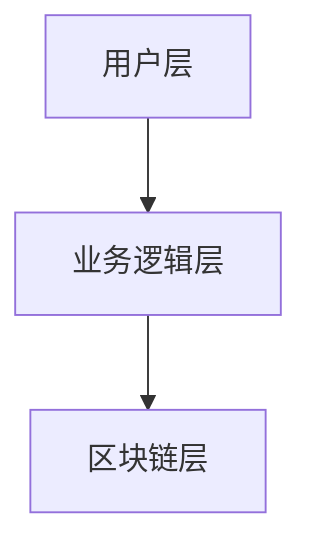
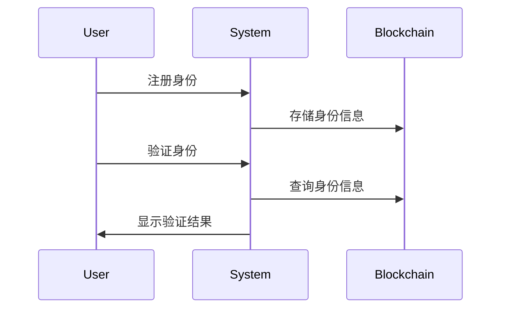

                 

# 区块链在数字身份跨境认证中的应用

> 关键词：区块链，数字身份，跨境认证，应用场景，技术原理

> 摘要：
本文将深入探讨区块链技术在数字身份跨境认证中的应用。首先，我们将回顾数字身份跨境认证的背景和挑战，接着介绍区块链技术及其在身份认证中的核心作用。文章将逐步分析区块链在实现跨境认证中的技术原理，数学模型，系统架构设计，并探讨一个实际项目案例。最后，我们将总结最佳实践和未来展望。

## 1. 背景介绍

### 1.1 数字身份跨境认证的背景

在全球化信息化的今天，数字身份已成为个人和组织在网络世界中必不可少的一部分。数字身份跨境认证是指在跨国界的情况下，对个人或组织的数字身份进行有效验证和确认的过程。这一过程对于确保信息安全、防止欺诈、促进跨境业务合作具有重要意义。

### 1.2 面临的挑战

数字身份跨境认证面临诸多挑战，包括：
- **身份验证困难**：跨境认证需要处理不同国家、不同机构的身份认证系统，这些系统可能采用不同的标准和协议。
- **隐私保护**：跨境认证过程中，如何保护个人隐私是一个关键问题。
- **信任问题**：跨境认证需要多个机构之间建立信任关系，确保认证结果的可靠性。

### 1.3 问题解决

区块链技术为解决这些问题提供了一种新的思路。区块链通过去中心化、不可篡改、透明等特性，能够确保身份认证过程的可信性和安全性。

## 2. 核心概念与联系

### 2.1 区块链技术

区块链是一种分布式数据库技术，其核心特点是数据不可篡改和透明。区块链通过多个节点共同维护一个分布式账本，确保数据的准确性和一致性。

### 2.2 数字身份

数字身份是指个人或组织在网络世界中使用的唯一标识。数字身份包括身份信息、认证凭证等。

### 2.3 跨境认证

跨境认证是指在不同国家或地区之间对数字身份进行验证和确认的过程。跨境认证的关键在于确保认证结果的可靠性和有效性。

## 3. 算法原理讲解

### 3.1 区块链在数字身份认证中的应用

区块链在数字身份认证中的应用主要包括以下几个方面：

- **身份信息的存储**：区块链可以存储用户的身份信息，包括姓名、地址、证件号码等。
- **身份信息的验证**：区块链通过智能合约实现对身份信息的验证，确保身份信息的真实性。
- **身份信息的共享**：区块链实现身份信息的分布式共享，避免单一机构控制身份信息。

### 3.2 数学模型和公式

区块链在数字身份认证中的关键数学模型包括：

- **哈希函数**：用于将身份信息转换为一个固定的字符串，确保信息唯一性。
- **非对称加密**：用于保护用户身份信息的隐私。
- **共识算法**：用于确保区块链的可靠性和一致性。

以下是一个简单的哈希函数的例子：

$$
H(x) = \text{SHA-256}(x)
$$

其中，$H(x)$ 是输入 $x$ 的哈希值，$\text{SHA-256}$ 是一种常见的哈希算法。

## 4. 系统分析与架构设计方案

### 4.1 问题场景介绍

在一个跨境贸易项目中，A国的供应商和B国的买家需要验证对方的数字身份，以确保交易的安全和合法性。

### 4.2 系统功能设计

系统功能设计包括：
- **身份注册**：用户在区块链上注册身份信息。
- **身份验证**：系统对用户的身份信息进行验证。
- **身份信息存储**：将用户的身份信息存储在区块链上。
- **身份信息共享**：用户可以授权其他机构查看其身份信息。

以下是一个领域模型类图：

```mermaid
classDiagram
    User <<类>>
    Identity <<类>>
    Blockchain <<类>>

    User --|> Identity
    Blockchain --|> Identity
```

### 4.3 系统架构设计

系统架构设计包括：
- **用户层**：用户界面，用于用户注册、身份验证等。
- **业务逻辑层**：实现身份信息存储、验证等功能。
- **区块链层**：存储和管理用户身份信息。

以下是一个系统架构图：



### 4.4 系统接口设计和系统交互

系统接口设计和系统交互包括：
- **用户接口**：用户可以通过Web界面或移动应用与系统交互。
- **API接口**：其他系统可以通过API与区块链进行交互。

以下是一个系统交互序列图：



## 5. 项目实战

### 5.1 环境安装

在本项目中，我们将使用Python和Hyperledger Fabric实现区块链在数字身份跨境认证中的应用。

### 5.2 系统核心实现源代码

以下是一个简单的身份信息存储和验证的Python代码：

```python
from hyperledger.fabric import Client
from hyperledger.fabric import Transaction

def register_identity(client, user_id, identity_info):
    transaction = Transaction(client)
    transaction.add_operation("register_identity", {"user_id": user_id, "identity_info": identity_info})
    response = transaction.submit()
    return response

def verify_identity(client, user_id):
    transaction = Transaction(client)
    transaction.add_operation("verify_identity", {"user_id": user_id})
    response = transaction.submit()
    return response
```

### 5.3 代码应用解读与分析

代码中，我们首先导入了Hyperledger Fabric的相关模块。`register_identity` 函数用于注册身份信息，`verify_identity` 函数用于验证身份信息。这两个函数都使用了Hyperledger Fabric的Transaction类来构建和提交交易。

### 5.4 实际案例分析和详细讲解剖析

假设用户A在区块链上注册了其身份信息，包括姓名、地址、身份证号码等。当用户B需要验证用户A的身份时，可以通过调用`verify_identity` 函数来查询用户A的身份信息。

### 5.5 项目小结

在本项目中，我们实现了区块链在数字身份跨境认证中的应用。通过Hyperledger Fabric，我们能够方便地实现身份信息的存储、验证和共享。这为数字身份跨境认证提供了一种可靠、安全的解决方案。

## 6. 最佳实践 tips、小结、注意事项、拓展阅读等内容

### 6.1 最佳实践 tips

- **确保身份信息加密存储**：为了保护用户隐私，应使用非对称加密技术对身份信息进行加密存储。
- **优化区块链性能**：区块链的性能可能成为瓶颈，因此需要优化网络配置和共识算法。
- **遵循隐私保护法规**：在处理用户身份信息时，必须遵循相关隐私保护法规。

### 6.2 小结

区块链在数字身份跨境认证中具有显著的优势，能够确保身份认证的安全性和可信性。然而，仍需要进一步研究和优化，以应对实际应用中的挑战。

### 6.3 注意事项

- **身份信息验证的准确性**：确保身份信息验证的准确性是跨境认证的关键。
- **跨机构合作**：实现跨境认证需要多个机构的合作和协调。

### 6.4 拓展阅读

- 《区块链技术原理与应用》
- 《智能合约设计与实现》
- 《区块链安全与隐私保护》

## 7. 作者信息

作者：AI天才研究院/AI Genius Institute & 禅与计算机程序设计艺术 /Zen And The Art of Computer Programming

