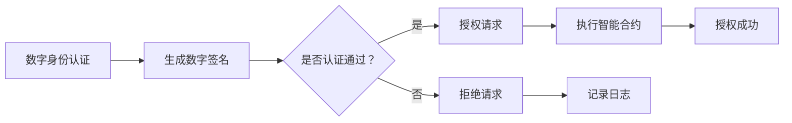
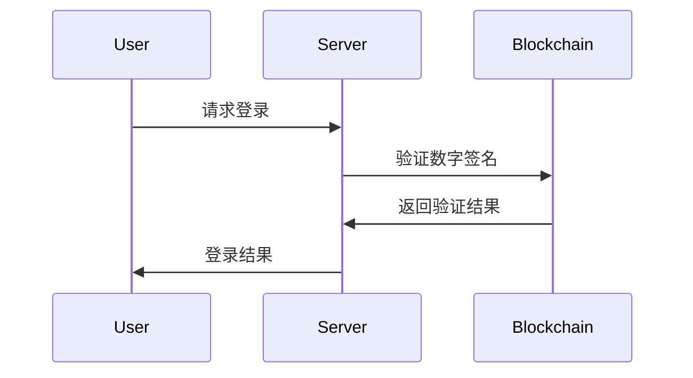
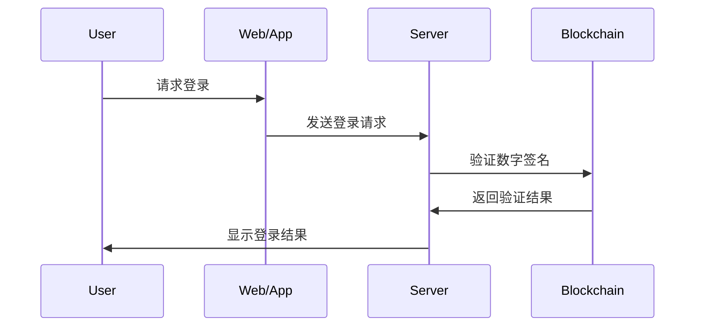
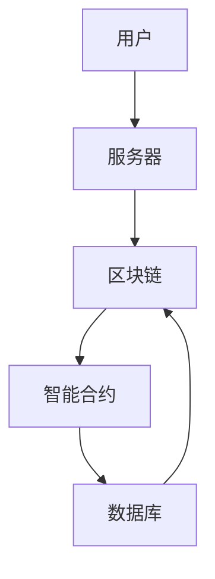
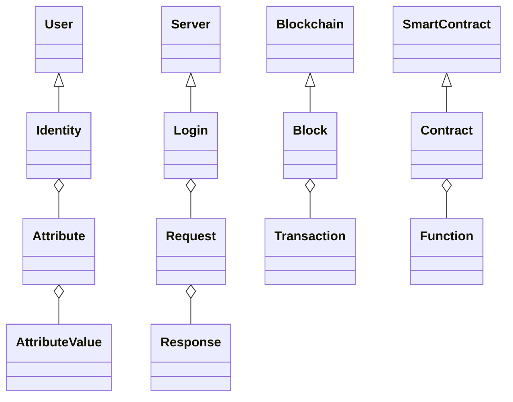
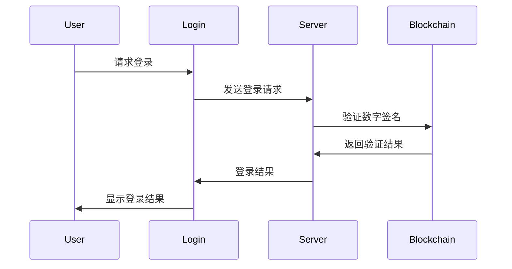

                 


# 区块链在数字身份跨平台授权中的应用探索

## 关键词

区块链，数字身份，跨平台授权，加密算法，智能合约，数学模型

## 摘要

本文旨在探讨区块链技术在数字身份跨平台授权中的应用。首先，我们将介绍区块链的基本概念和数字身份的重要性，接着分析区块链与数字身份的关联及其在跨平台授权中的作用。随后，我们将详细讲解区块链在数字身份认证和授权中的算法原理，并使用Mermaid和Python来阐述。接下来，我们将描述一个系统的架构设计，包括功能设计、架构设计、接口设计和交互设计。之后，通过一个实际项目案例，我们将展示区块链在数字身份跨平台授权中的实际应用。最后，我们将提供最佳实践技巧和未来展望。

---

## 引言

### 背景介绍

### 核心概念术语说明

- **区块链**：一种去中心化的分布式账本技术，通过加密算法和时间戳确保数据的完整性和不可篡改性。
- **数字身份**：在网络环境中标识和确认个体身份的数字表示。
- **跨平台授权**：在不同平台之间进行身份认证和授权的过程。

### 问题背景

随着互联网的普及，越来越多的个人和组织在在线环境中进行各种活动，如购物、社交、金融服务等。然而，现有的身份认证和授权系统面临着诸多挑战，如隐私泄露、数据篡改、单点故障等。

### 问题描述

跨平台授权的关键需求包括安全性、隐私保护、灵活性和互操作性。区块链技术因其去中心化、不可篡改和透明性等特点，被认为是解决这些问题的有效手段。

### 问题解决

区块链通过加密算法和时间戳确保数据的完整性和安全性，同时去中心化的架构避免了单点故障的风险。通过智能合约，可以自动化和标准化跨平台授权过程，提高效率。

### 边界与外延

区块链在数字身份跨平台授权中的应用边界包括身份认证、授权管理、数据隐私保护等方面。其外延则涉及金融、医疗、教育、政府等多个领域。

### 概念结构与核心要素组成

- **核心概念结构**：区块链、数字身份、加密算法、智能合约。
- **核心要素组成**：去中心化、加密算法、时间戳、分布式账本、智能合约。

---

## 核心概念与联系

### 区块链与数字身份的关系

区块链技术可以为数字身份提供安全、不可篡改的存储和传输机制。通过区块链，个人可以在不同的平台之间管理和授权自己的数字身份信息。

### 跨平台授权的实现机制

跨平台授权依赖于数字身份的认证和授权。区块链通过智能合约自动化和标准化这些过程，确保授权的透明性和不可篡改性。

### 核心概念原理

- **区块链**：通过共识算法实现分布式账本，确保数据一致性和不可篡改性。
- **数字身份**：在网络环境中标识个体身份，包含身份信息、权限和认证状态。
- **加密算法**：用于保护数字身份信息的安全，包括哈希算法、非对称加密和数字签名等。
- **智能合约**：自动执行满足预定条件的代码，实现跨平台授权的自动化和标准化。

### 概念属性特征对比表格

| 特征           | 区块链         | 数字身份       | 加密算法         | 智能合约         |
|----------------|---------------|---------------|----------------|----------------|
| 安全性         | 高            | 中            | 高             | 高              |
| 去中心化       | 是            | 是            | 是             | 是              |
| 透明性         | 高            | 中            | 中             | 高              |
| 不可篡改性     | 高            | 高            | 高             | 高              |
| 可互操作性     | 中            | 中            | 高             | 中              |

### ER实体关系图架构

```mermaid
erDiagram
  User ||--|{ Identity }|--|| Blockchain
  Identity ||--|{ Attribute }|--|| AttributeValue
  Blockchain ||--|{ Transaction }|--|| TransactionData
```

### 区块链与数字身份跨平台授权的关系

区块链为数字身份提供了安全、去中心化的存储和传输机制。通过智能合约，可以实现跨平台授权的自动化和标准化，从而提高授权的效率和安全性。

---

## 算法原理讲解

### 区块链算法原理

区块链通过哈希算法和时间戳确保数据的完整性和不可篡改性。每个区块包含一组交易数据，以及一个指向前一个区块的哈希值，形成一个链条。

### 数字签名与加密算法

数字签名和非对称加密算法用于保护数字身份信息的安全。数字签名确保消息的来源和完整性，非对称加密确保信息的保密性。

### 区块链智能合约

智能合约是自动执行满足预定条件的代码。在数字身份跨平台授权中，智能合约可以自动化和标准化授权过程，提高效率。

### 算法mermaid流程图



### 算法原理的数学模型和公式

- **哈希函数**：\( H(\text{message}) = \text{hash_value} \)
- **数字签名**：\( S = \text{sign}(m, d) \)，其中 \( m \) 为消息，\( d \) 为私钥。
- **非对称加密**：\( c = \text{encrypt}(m, e, N) \)，其中 \( m \) 为消息，\( e \) 为公钥，\( N \) 为模数。

### 举例说明

假设用户Alice想要登录到一个跨平台的网站，并请求访问特定资源。以下是数字身份跨平台授权的过程：

1. **数字身份认证**：Alice使用她的私钥对登录请求进行数字签名。
2. **认证请求**：网站接收Alice的数字签名，并使用她的公钥验证签名的有效性。
3. **授权请求**：如果认证通过，Alice可以请求访问特定资源。
4. **执行智能合约**：网站调用智能合约，检查Alice是否有权限访问请求的资源。
5. **授权成功**：如果Alice有权限，智能合约返回授权成功的消息；否则，返回拒绝请求的消息。

---

## 系统分析与架构设计方案

### 问题场景介绍

在一个跨平台的在线环境中，用户需要在不同的服务之间进行身份认证和授权，以确保隐私和安全。

### 项目介绍

本系统旨在实现一个基于区块链的数字身份跨平台授权系统，提供高效、安全的身份认证和授权服务。

### 系统功能设计

- **用户注册与登录**：用户可以在系统中注册和登录，使用数字身份进行身份认证。
- **身份认证**：系统使用数字签名和加密算法验证用户的身份。
- **授权管理**：系统管理用户的权限，并根据权限进行授权。

### 系统架构设计

系统架构分为四层：用户层、应用层、智能合约层和区块链层。



### 系统接口设计

系统提供RESTful API，包括用户注册、登录、身份认证和授权管理等接口。

### 系统交互设计

用户通过Web界面或移动应用与系统进行交互。系统接收用户请求，调用区块链层进行身份认证和授权，最终返回结果。



### 架构设计mermaid架构图



### 系统功能设计(领域模型mermaid类图)



### 系统接口设计和系统交互设计mermaid序列图



---

## 项目实战

### 环境安装

1. 安装Node.js和npm：用于搭建服务器。
2. 安装Golang：用于编写智能合约。
3. 安装Docker和Docker-CE：用于容器化部署。

### 系统核心实现

```python
# Python示例代码：身份认证与授权
import json
from Crypto.PublicKey import RSA
from Crypto.Signature import pkcs1_15
from Crypto.Hash import SHA256

# 生成密钥对
private_key = RSA.generate(2048)
public_key = private_key.publickey()

# 签名函数
def sign_message(message):
    hash_value = SHA256.new(message.encode('utf-8'))
    signature = pkcs1_15.new(private_key).sign(hash_value)
    return signature

# 验证签名函数
def verify_signature(message, signature):
    hash_value = SHA256.new(message.encode('utf-8'))
    try:
        pkcs1_15.new(public_key).verify(hash_value, signature)
        return True
    except (ValueError, TypeError):
        return False

# 测试签名与验证
message = "Alice wants to log in."
signature = sign_message(message)
print("Signature:", signature.hex())
print("Verification:", verify_signature(message, signature))
```

### 代码应用解读与分析

上述代码实现了一个简单的身份认证和授权过程，包括生成密钥对、签名消息、验证签名等步骤。通过数字签名，确保消息的来源和完整性；通过验证签名，确保消息未被篡改。

### 实际案例分析和详细讲解剖析

假设用户Alice想要登录到一个跨平台的网站，以下是详细流程：

1. **注册阶段**：Alice在系统中注册，生成公钥和私钥，并将公钥上传到区块链。
2. **登录阶段**：Alice使用私钥对登录请求进行签名，并发送签名到网站。
3. **验证阶段**：网站使用Alice的公钥验证签名的有效性，确认其身份。
4. **授权阶段**：如果验证通过，Alice可以请求访问特定资源。系统调用智能合约，检查Alice的权限，并返回授权结果。

### 项目小结

本项目通过区块链和智能合约实现了数字身份跨平台授权，提高了身份认证和授权的安全性。然而，项目仍需进一步优化，如提高性能、支持多种加密算法和增强用户界面等。

---

## 最佳实践 tips

1. **加密算法选择**：根据应用场景选择合适的加密算法，确保安全性和性能之间的平衡。
2. **智能合约设计**：确保智能合约的逻辑正确性和安全性，避免漏洞和风险。
3. **权限管理**：合理分配和管理用户的权限，防止权限滥用和泄露。
4. **数据隐私保护**：使用区块链的隐私保护技术，如零知识证明和同态加密等，保护用户隐私。

## 小结

本文详细探讨了区块链在数字身份跨平台授权中的应用，包括背景介绍、核心概念与联系、算法原理讲解、系统分析与架构设计方案、项目实战以及最佳实践。区块链技术为数字身份跨平台授权提供了安全、高效和去中心化的解决方案。未来，随着区块链技术的不断发展和完善，其在数字身份跨平台授权中的应用将更加广泛和深入。

## 注意事项

1. **系统性能**：区块链技术可能导致系统性能下降，特别是在高并发场景下。需要优化算法和架构，提高系统性能。
2. **加密算法更新**：加密算法可能面临被破解的风险，需要定期更新和替换。

## 拓展阅读

1. 《区块链技术指南》
2. 《智能合约开发实战》
3. 《区块链与数字货币》

## 作者信息

作者：AI天才研究院/AI Genius Institute & 禅与计算机程序设计艺术 /Zen And The Art of Computer Programming

---

通过本文，我们深入探讨了区块链在数字身份跨平台授权中的应用，从核心概念、算法原理到系统架构和实际项目案例，全面阐述了区块链技术的优势和应用场景。希望本文能为读者提供有价值的参考和启发。在未来的研究和实践中，我们将继续探索区块链技术的更多应用，推动其发展。

